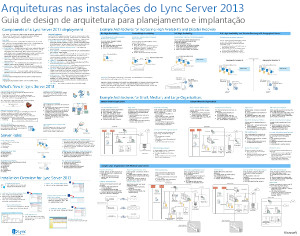
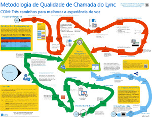
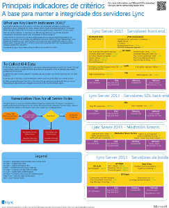
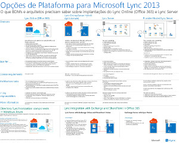
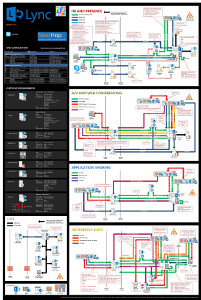

# Diagramas técnicos do Lync Server 2013Technical diagrams for Lync Server 2013

 

_**Última modificação do tópico:** 2014-03-14__**Topic Last Modified:** 2014-03-14_

**Resumo:**   Esses diagramas fornecem representações visuais de soluções recomendadas para o Lync 2013.**Summary:** These diagrams provide visual representations of recommended solutions for Lync 2013.

Esses recursos estão disponíveis no formato Visio (. vsd) (Visio 2010 ou Visio 2013) e no formato PDF.These resources are available in Visio (.vsd) format (Visio 2010 or Visio 2013) and PDF format. Para obter informações sobre como imprimir documentos, consulte Dicas para impressão de cartazes.For information about how to print documents, see Tips for printing posters.

Talvez seja necessário software adicional para exibir esses arquivos.You might need additional software to view these files. Confira a tabela a seguir para saber mais.See the following table for more information.

<table>
<colgroup>
<col style="width: 50%" />
<col style="width: 50%" />
</colgroup>
<thead>
<tr class="header">
<th>Tipo de arquivoFile type</th>
<th>SoftwareSoftware</th>
</tr>
</thead>
<tbody>
<tr class="odd">
<td>
. vsd.vsd
</td>
<td>
Visio 2010, Visio 2013 ou o <a href="https://go.microsoft.com/fwlink/?linkid=393676">Visualizador do Visio gratuito</a>Visio 2010, Visio 2013, or the <a href="https://go.microsoft.com/fwlink/?linkid=393676">free Visio viewer</a>

Se você utiliza o visualizador do Visio, clique com o botão direito do mouse no link VSD, clique em <strong>Salvar Destino Como</strong>, salve o arquivo no seu computador e abra-o.If you use the Visio viewer, right-click the VSD link, click <strong>Save Target As</strong>, save the file to your computer, and then open the file from your computer.
</td>
</tr>
<tr class="even">
<td>
.pdf.pdf
</td>
<td>
Qualquer visualizador de PDF, como o <a href="https://go.microsoft.com/fwlink/?linkid=393675">Adobe Reader</a>Any PDF viewer, such as <a href="https://go.microsoft.com/fwlink/?linkid=393675">Adobe Reader</a>
</td>
</tr>
<tr class="odd">
<td>
.zip.zip
</td>
<td>
Qualquer utilitário de compactação de arquivos.Any file compression utility. Windows 7 e 8 Abra esses arquivos nativamente.Windows 7 and 8 open these files natively.
</td>
</tr>
</tbody>
</table>

## CartazesPosters

Esses pôsteres detalham uma área técnica específica e devem ser usados com os artigos correspondentes no TechNet ou no conteúdo disponível no centro de download.These posters detail a specific technical area, and are intended to be used with corresponding articles on TechNet or content available on the download center.

<table>
<colgroup>
<col style="width: 50%" />
<col style="width: 50%" />
</colgroup>
<thead>
<tr class="header">
<th>TítuloTitle</th>
<th>DescriçãoDescription</th>
</tr>
</thead>
<tbody>
<tr class="odd">
<td>
<strong>Lync Server 2013 arquiteturas locais</strong><strong>Lync Server 2013 On-Premises Architectures</strong>

<a href="https://go.microsoft.com/fwlink/?linkid=392974">Amplie o cartaz em detalhes com o zoom.it da Microsoft</a>(melhor para computadores desktop ou notebooks)<a href="https://go.microsoft.com/fwlink/?linkid=392974">Zoom into the poster in full detail with Zoom.it from Microsoft</a>(best on desktop or laptop computers)

<a href="https://go.microsoft.com/fwlink/?linkid=392578">Versão em PDF</a> (melhor para dispositivos móveis ou tablets)<a href="https://go.microsoft.com/fwlink/?linkid=392578">PDF version</a> (best for mobile devices or tablet computers)

<a href="https://go.microsoft.com/fwlink/?linkid=392579">Versão do Visio</a> (melhor para usuários com o Visio)<a href="https://go.microsoft.com/fwlink/?linkid=392579">Visio version</a> (best for users with Visio)
</td>
<td>
O cartaz fornece orientações arquitetônicas para planejamento e implantação.Poster provides architectural guidance for planning and deployment. O pôster contém informações sobre componentes comuns do Lync Server, terminologia usada ao planejar uma implantação, novos recursos, funções de servidor e uma visão geral da instalação.The poster contains information about common components of Lync Server, terminology used when planning a deployment, new features, server roles, and an installation overview. Além disso, o pôster contém arquiteturas de exemplo para aumentar a alta disponibilidade e a recuperação de desastres, bem como as topologias de exemplo pequenas, médias e grandes.In addition the poster contains example architectures for increasing high availability and disaster recovery as well as small, medium, and large sample topologies.

Tamanho: 34 por-44 polegadasSize: 34-by-44 inch

Este cartaz foi criado usando o Visio 2013.This poster was created using Visio 2013. Nenhuma modificação deve ser necessária para um ambiente específico.No modification should be needed for a specific environment.
</td>
</tr>
<tr class="even">
<td>
<strong>Metodologia de qualidade de chamada do Lync</strong><strong>Lync Call Quality Methodology</strong>

<a href="https://go.microsoft.com/fwlink/?linkid=392972">Amplie o cartaz em detalhes com o zoom.it da Microsoft</a>(melhor para computadores desktop ou notebooks)<a href="https://go.microsoft.com/fwlink/?linkid=392972">Zoom into the poster in full detail with Zoom.it from Microsoft</a>(best on desktop or laptop computers)

<a href="https://go.microsoft.com/fwlink/?linkid=391841">Versões do Visio e do PDF juntas em um arquivo. zip</a><a href="https://go.microsoft.com/fwlink/?linkid=391841">Visio and PDF versions together in a .zip file</a>
</td>
<td>
Cartaz descrevendo a solução de problemas de sistema do Lync, especialmente para problemas que afetam a qualidade do Enterprise Voice.Poster describing Lync system troubleshooting, especially for issues affecting enterprise voice quality. Use este cartaz com:Use this poster with:

<ul>
<li>
<a href="https://go.microsoft.com/fwlink/p/?linkid=390677">Guia de rede do Lync Server</a><a href="https://go.microsoft.com/fwlink/p/?linkid=390677">Lync Server Networking Guide</a>
</li>
<li>
<a href="lync-server-2013-poster-lync-call-quality-methodology.md">Metodologia de qualidade de chamada do Lync no Lync Server 2013</a> (artigo de acessibilidade)<a href="lync-server-2013-poster-lync-call-quality-methodology.md">Lync Call Quality Methodology in Lync Server 2013</a> (accessibility article)
</li>
<li>
<a href="lync-server-2013-poster-key-health-indicators.md">Principais indicadores de integridade no Lync Server 2013</a> (artigo de acessibilidade)<a href="lync-server-2013-poster-key-health-indicators.md">Key Health Indicators in Lync Server 2013</a> (accessibility article)
</li>
</ul>

Tamanho: 34 por-44 polegadasSize: 34-by-44 inch

Este cartaz foi criado usando o Visio 2010.This poster was created using Visio 2010. Nenhuma modificação deve ser necessária para um ambiente específico.No modification should be needed for a specific environment.
</td>
</tr>
<tr class="odd">
<td>
<strong>Principais indicadores de integridade</strong><strong>Key Health Indicators</strong>

<a href="https://go.microsoft.com/fwlink/?linkid=392971">Amplie o cartaz em detalhes com o zoom.it da Microsoft</a>(melhor para computadores desktop ou notebooks)<a href="https://go.microsoft.com/fwlink/?linkid=392971">Zoom into the poster in full detail with Zoom.it from Microsoft</a>(best on desktop or laptop computers)

<a href="https://go.microsoft.com/fwlink/?linkid=391838">Versões do Visio e do PDF juntas em um arquivo. zip</a><a href="https://go.microsoft.com/fwlink/?linkid=391838">Visio and PDF versions together in a .zip file</a>
</td>
<td>
Cartaz descrevendo as métricas de solução de problemas do servidor para a integridade básica do servidor e para uma determinada função do servidor na implementação do Lync.Poster describing server troubleshooting metrics both for basic server health and for a given server’s role in the Lync implementation. Use este cartaz com:Use this poster with:

<ul>
<li>
<a href="https://go.microsoft.com/fwlink/p/?linkid=390677">Guia de rede do Lync Server</a><a href="https://go.microsoft.com/fwlink/p/?linkid=390677">Lync Server Networking Guide</a>
</li>
<li>
<a href="lync-server-2013-poster-lync-call-quality-methodology.md">Metodologia de qualidade de chamada do Lync no Lync Server 2013</a> (artigo de acessibilidade)<a href="lync-server-2013-poster-lync-call-quality-methodology.md">Lync Call Quality Methodology in Lync Server 2013</a> (accessibility article)
</li>
<li>
<a href="lync-server-2013-poster-key-health-indicators.md">Principais indicadores de integridade no Lync Server 2013</a> (artigo de acessibilidade)<a href="lync-server-2013-poster-key-health-indicators.md">Key Health Indicators in Lync Server 2013</a> (accessibility article)
</li>
</ul>

Tamanho: 17 por 22 polegadasSize: 17-by-22 inch

Este cartaz foi criado usando o Visio 2010.This poster was created using Visio 2010. Nenhuma modificação deve ser necessária para um ambiente específico.No modification should be needed for a specific environment.
</td>
</tr>
<tr class="even">
<td>
<strong>Opções de plataforma para o Lync 2013</strong><strong>Lync 2013 Platform Options</strong>

<a href="https://go.microsoft.com/fwlink/p/?linkid=391840">Amplie o cartaz em detalhes com o Zoom.it da Microsoft</a><a href="https://go.microsoft.com/fwlink/p/?linkid=391840">Zoom into the poster in full detail with Zoom.it from Microsoft</a>

<a href="https://go.microsoft.com/fwlink/p/?linkid=391837">Versão em PDF</a> (melhor para dispositivos móveis ou tablets)<a href="https://go.microsoft.com/fwlink/p/?linkid=391837">PDF version</a> (best for mobile devices or tablet computers)

<a href="https://go.microsoft.com/fwlink/p/?linkid=391839">Versão do Visio</a> (melhor para usuários com o Visio)<a href="https://go.microsoft.com/fwlink/p/?linkid=391839">Visio version</a> (best for users with Visio)
</td>
<td>
Este cartaz descreve as opções de plataforma disponíveis para o Lync 2013 para BDMs e arquitetos os clientes podem escolher entre o Lync Online e o Microsoft 365, o Hybrid Lync, o Lync Server local e o Lync hospedado.This poster describes the available platform options for Lync 2013 to BDMs and architects  Customers can choose from Lync Online with Microsoft 365, Hybrid Lync, Lync Server on-premises and Hosted Lync. O cartaz inclui detalhes de cada opção de arquitetura, incluindo os cenários mais ideais para cada uma delas, os requisitos de licença e as responsabilidades dos profissionais de TI.The poster includes details of each architectural option, including the most ideal scenarios for each, the license requirements and IT Pro responsibilities.

Tamanho: 34 por-44 polegadasSize: 34-by-44 inch

Este cartaz foi criado usando o Visio 2013.This poster was created using Visio 2013. Nenhuma modificação deve ser necessária para um ambiente específico.No modification should be needed for a specific environment.
</td>
</tr>
<tr class="odd">
<td>
<strong>Cargas de trabalho de protocolo do Microsoft Lync Server 2013</strong><strong>Microsoft Lync Server 2013 Protocol Workloads</strong>

<a href="https://go.microsoft.com/fwlink/?linkid=392970">Amplie o cartaz em detalhes com o Zoom.it da Microsoft</a><a href="https://go.microsoft.com/fwlink/?linkid=392970">Zoom into the poster in full detail with Zoom.it from Microsoft</a>

<a href="https://go.microsoft.com/fwlink/?linkid=392512">Versão em PDF</a> (melhor para dispositivos móveis ou tablets)<a href="https://go.microsoft.com/fwlink/?linkid=392512">PDF version</a> (best for mobile devices or tablet computers)

<a href="https://go.microsoft.com/fwlink/?linkid=392513">Versão do Visio</a> (melhor para usuários com o Visio)<a href="https://go.microsoft.com/fwlink/?linkid=392513">Visio version</a> (best for users with Visio)
</td>
<td>
Baixe este cartaz para entender os recursos e os requisitos do Lync 2013, Lync Phone, Lync Web App, Lync para Mac e Lync Mobile w.Download this poster to understand the capabilities and requirements of Lync 2013, Lync Phone, Lync Web App, Lync for Mac, and Lync Mobile w. Veja como as cargas de trabalho do Lync Server facilitam a comunicação em toda a organização.See how Lync Server workloads facilitate communication across an organization.

Tamanho: 24 por 36 polegadasSize: 24-by-36 inch

Este cartaz foi criado usando o Visio 2013.This poster was created using Visio 2013. Nenhuma modificação deve ser necessária para um ambiente específico.No modification should be needed for a specific environment.
</td>
</tr>
</tbody>
</table>

## Dicas para impressão de cartazesTips for printing posters

Se você tiver uma plotadora, poderá imprimir os cartazes no tamanho original. Caso contrário, use as etapas a seguir para imprimir em um papel menor.If you have a plotter, you can print these posters in their full size. If you don't have plotter, use the following steps to print on smaller paper.

**Imprimir cartazes em papel de tamanho menor****Print posters on smaller paper**

1.  Abra o cartaz no Visio.Open the poster in Visio.

2.  No menu **Arquivo**, clique em **Configuração de Página**.On the **File** menu, click **Page Setup**.

3.  Na guia  **Configurar Impressão**, na seção **Papel da impressora**, selecione o tamanho de papel desejado.On the **Print Setup** tab, in the **Printer paper** section, select the size of paper you want to print on.

4.  Na guia **Configurar Impressão**, na seção **Zoom de impressão**, clique em **Caber em** e especifique **1 folha na horizontal por 1 folha na vertical**.On the **Print Setup** tab, in the **Print zoom** section, click **Fit to**, and then enter **1 sheet across by 1 sheet down**.

5.  Na guia **Tamanho da Página**, clique em **Dimensionar para caber o conteúdo do desenho** e clique em **OK**.On the **Page Size** tab, click **Size to fit drawing contents**, and then click **OK**.

6.  No menu **Arquivo**, clique em **Imprimir**.On the **File** menu, click **Print**.

 

