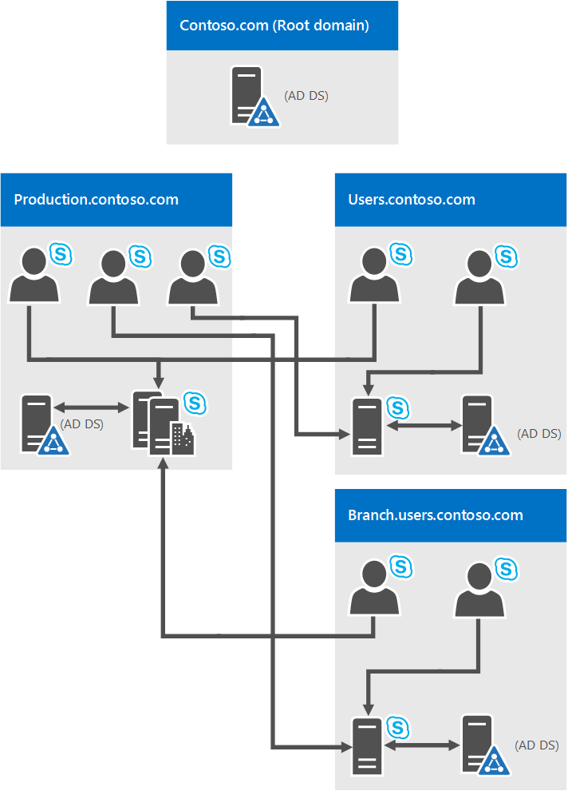

# <a name="system-requirements-for-skype-for-business-server-2019"></a>Requisitos do sistema para Skype for Business Server 2019
 
**Resumo:** Prepare-se para instalar Skype for Business Server 2019 com este tópico. Hardware, SO, software, bancos de dados, certificados, Diretoria Ativa, DNS e compartilhamentos de arquivos são abordados aqui. Todos os requisitos e recomendações do sistema estão aqui para ajudar a garantir uma instalação e implantação bem-sucedidas do farm de servidores.
  
Como você pode esperar, há algumas preparações a fazer antes de começar a implantar o Skype for Business Server 2019. Este artigo o acompanhará por meio do planejamento para o seguinte:
  
- [Hardware](system-requirements.md#Hardware)
  
- [Sistemas operacionais](system-requirements.md#OS)
  
- [Software](system-requirements.md#Software)

- [Bancos de dados SQL back-end](system-requirements.md#DBs)
  
- [Active Directory](system-requirements.md#AD)
  
- [Sistema de Nomes de Domínio (DNS)](system-requirements.md#DNS)
  
- [Certificados](system-requirements.md#Certs)
  
- [Compartilhamento de Arquivos](system-requirements.md#Fileshare)

  
## <a name="hardware-for-skype-for-business-server-2019"></a>Hardware para Skype for Business Server 2019
<a name="Hardware"> </a>

Depois de ter sua topologia baixa (e se não tiver, você poderá conferir o tópico [Topologia Básicas do Skype for Business Server 2019),](../../SfbServer/plan-your-deployment/topology-basics/topology-basics.md) é hora de pensar nos servidores. Skype for Business Server servidores 2019 exigem hardware de 64 bits. Nossas recomendações para hardware estão abaixo. Não são requisitos, mas refletem os requisitos necessários para o desempenho ideal. Temos documentação de planejamento de capacidade que o ajudará a determinar se você precisa de mais do que isso, dependendo das circunstâncias.
  
Hardware recomendado para servidores Edição Standard:

|**Componente de hardware**|**Recomendado**|
|:-----|:-----|
|CPU  <br/> |Processador dual intel Xeon E5-2673 v3, 6 núcleos, 2,4 gigahertz (GHz) ou superior.  <br/> Os processadores Intel Itanium não têm suporte para funções Skype for Business Server 2019.  <br/> |
|Memória  <br/> |32 gigabytes (GB).  <br/> |
|Disco  <br/> |OU:  <br/> • 8 ou mais unidades de disco rígido de 10.000 RPM com pelo menos 72 GB de espaço livre em disco (dois dos discos que usam RAID 1 e 6 usando RAID 10).  <br/> OU  <br/> • Unidades de estado sólido (SSDs) capazes de fornecer o mesmo espaço livre e desempenho semelhante a 8 unidades de disco mecânicas de 10.000 RPM.  <br/> |
|Rede  <br/> |1 adaptador de rede de porta dupla, 1 Gbps ou superior (2 adaptadores de rede podem ser usados, mas eles precisam ser em equipe com um único endereço MAC e um único endereço IP).  <br/> Configurações duplas ou multi-homed não são suportadas para servidores front-end, servidores back-end e Edição Standard servidores.  <br/> Desde que eles não sejam expostos ao sistema operacional e sejam usados para monitorar e gerenciar o hardware do servidor, você pode ter sistemas de gerenciamento fora da banda, como DRAC ou ILO. Esse cenário não constitui um servidor multi-homed e é suportado.  <br/> |


Hardware recomendado para servidores front-end e servidores back-end:
  
|**Componente de hardware**|**Recomendado**|
|:-----|:-----|
|CPU  <br/> |Processador dual intel Xeon E5-2673 v3, 6 núcleos, 2,4 gigahertz (GHz) ou superior. <br/> Os processadores Intel Itanium não têm suporte para funções Skype for Business Server 2019.  <br/> |
|Memória  <br/> |64 gigabytes (GB).  <br/> |
|Disco  <br/> |OU:  <br/> • 8 ou mais unidades de disco rígido de 10.000 RPM com pelo menos 72 GB de espaço livre em disco (dois dos discos que usam RAID 1 e 6 usando RAID 10).  <br/> OU  <br/> • Unidades de estado sólido (SSDs) capazes de fornecer o mesmo espaço livre e desempenho semelhante a 8 unidades de disco mecânicas de 10.000 RPM.  <br/> |
|Rede  <br/> |1 adaptador de rede de porta dupla, 1 Gbps ou superior (2 adaptadores de rede podem ser usados, mas eles precisam ser em equipe com um único endereço MAC e um único endereço IP).  <br/> Configurações duplas ou multi-homed não são suportadas para servidores front-end, servidores back-end e Edição Standard servidores.  <br/> Desde que eles não sejam expostos ao sistema operacional e sejam usados para monitorar e gerenciar o hardware do servidor, você pode ter sistemas de gerenciamento fora da banda, como DRAC ou ILO. Esse cenário não constitui um servidor multi-homed e é suportado.  <br/> |
   
Hardware recomendado para Servidores de Borda, Servidores de Mediação autônomos e Diretores:
  
|**Componente de hardware**|**Recomendado**|
|:-----|:-----|
|CPU  <br/> |Processador dual intel Xeon E5-2673 v3, 6 núcleos, 2,4 gigahertz (GHz) ou superior.  <br/> Os processadores Intel Itanium não têm suporte para funções Skype for Business Server 2019.  <br/> |
|Memória  <br/> |32 gigabytes.  <br/> |
|Disco  <br/> |OU:  <br/> • 4 ou mais unidades de disco rígido de 10.000 RPM com pelo menos 72 GB de espaço livre em disco (os discos devem estar em uma configuração raid 1 2x).  <br/> OU  <br/> • Unidades de estado sólido (SSDs) capazes de fornecer o mesmo espaço livre e desempenho semelhante a 4 unidades de disco mecânicas de 10.000 RPM.  <br/> |
|Rede  <br/> |1 adaptador de rede de porta dupla, 1 Gbps ou superior (2 adaptadores de rede podem ser usados, mas eles precisam ser em equipe com um único endereço MAC e um único endereço IP).  <br/> Configurações dual ou multi-homed não **são** suportadas para Servidores e Diretores de Interop de Vídeo. <br/> Os servidores de borda exigirão duas interfaces de rede que são adaptadores de rede de porta dupla, 1 Gbps ou superior (ou dois adaptadores de rede emparelhados, para um total de quatro, cada par sendo emparelhado com um único endereço MAC e um único endereço IP, para um total de dois pares).  <br/> Em Servidores de Mediação autônomos, há suporte para a instalação de nics (cartões de interface de rede) adicionais para permitir a configuração de um endereço IP PSTN específico.  <br/> |


> [!NOTE]
> Independentemente da função de servidor, também recomendamos as seguintes configurações de hardware para o Skype for Business Server 2019 (isso pode variar dependendo da marca de hardware que você comprou, portanto, consulte a documentação do fabricante para detalhes):
> - Configuração do BIOS - deve ser definida como FLAT a partir de NUMA.
> - Habilitar o Hyperthreading.
> - A configuração de fila RSS deve ser definida como 8 filas.

   
## <a name="operating-systems-for-skype-for-business-server-2019"></a>Sistemas operacionais para Skype for Business Server 2019
<a name="OS"> </a>

Depois de instalar o hardware, você precisará instalar o sistema operacional (OS) que permitirá que você instale e use com êxito o Skype for Business Server 2019.
  
|||
|:-----|:-----|
|Windows Server 2019 <br/> |
|Windows Server 2016 <br/> ||
||
   
Qualquer outra coisa que não seja os sistemas operacionais listados aqui não funcionará corretamente; por favor, não tente isso para instalar o Skype for Business Server 2019. Por exemplo, a opção Server Core não está listada e, portanto, não tem suporte.

> [!NOTE]
> A atualização in-local do sistema operacional não é suportada com o Lync Server 2013. Você deve implantar um pool separado e migrar usuários para o novo pool com um sistema operacional diferente. Todos os servidores em um pool devem ter a mesma versão do sistema operacional.

> [!NOTE]
> 
> Se você estiver instalando o Windows Admin Center 2019 no computador do Windows Server 2019, ele solicitará que uma porta seja escutada. Há uma liklihood que você pode escolher a porta 443, mas se esse computador tiver o Skype for Business Server 2019 instalado nele ou se o Skype for Business Server 2019 estiver instalado nele, você deverá escolher um número de porta diferente.
> 
>Por que esse é o caso? Se o centro de administração 2019 do Windows estiver em execução na porta 443, você não poderá se conectar ao servidor usando o Painel de Controle do Skype for Business, nem poderá se conectar a qualquer serviço Web interno em execução no servidor (Serviço Web do Livro de Endereços, Serviço de Descoberta Automática, Serviço WebTicket etc.).  Na verdade, você não poderá se conectar a nenhuma URL de Serviço Web Interno. Escolha uma porta diferente, caso você precise ou queira colocar o Windows Admin Center 2019 em um servidor com Skype for Business Server 2019.
> 

  
## <a name="software-that-should-be-installed-before-a-skype-for-business-server-2019-deployment"></a>Software que deve ser instalado antes de uma implantação Skype for Business Server 2019
<a name="Software"> </a>

Há algumas coisas que você precisará instalar ou configurar para qualquer servidor que esteja executando Skype for Business Server 2019. Eles estão listados abaixo, seguidos de requisitos adicionais para funções de servidor específicas.

> [!IMPORTANT]
> Skype Para Empresas 2019 dá suporte ao .Net Framework 4.8. 
  
 **Todos os servidores:**
  
|**Software/função**|**Detalhes**|
|:-----|:-----|
|Windows PowerShell 3.0  <br/> |Todos Skype for Business Server servidores precisam Windows PowerShell 3.0 instalados.  <br/> • Isso deve ser instalado por padrão com Windows Server 2016.<br/> |
|Microsoft .NET Framework  <br/> |Os serviços WCF são **um recurso** que é instalado como um recurso Windows, em **Gerenciador** de Servidores , inicialmente nenhum download necessário. <br/> • Você precisa certificar-se de que, ao instalar esse recurso ou se ele já estiver instalado e estiver verificando, a opção Ativação **HTTP** também está marcada e instalada, assim como: <br/>  <br/> Não se preocupe se você receber um pop-up adicional dizendo que algumas outras coisas precisam ser instaladas para a ativação HTTP ser instalada. Isso é normal; clique em OK e vá em frente. Se você não receber esse pop-up, poderá supor que essas coisas já estão instaladas e vá em frente.  <br/> O Microsoft .NET Framework geralmente é instalado quando Windows Server 2016 é instalado. Skype for Business Server o Microsoft .NET Framework 4.7 ou 4.8, portanto, você provavelmente precisará atualizá-lo. Você pode encontrar a atualização [aqui](https://support.microsoft.com/help/3186497/the-net-framework-4-7-offline-installer-for-windows/)<br/> |
|Media Foundation  <br/> |Para Windows Server 2016, o Windows Tempo de Execução de Formato de Mídia é instalado com o Microsoft Media Foundation.  <br/> Todos os servidores front-end e servidores Edição Standard Windows usados para conferência exigem um tempo de execução de formato de mídia Windows para executar os arquivos de áudio de mídia (.wma) que os aplicativos estacionamento de chamada, comunicado e grupo de resposta reproduzem para anúncios e música.  <br/> |
|Windows Identity Foundation  <br/> |Precisamos Windows Identity Foundation 3.5 para dar suporte a cenários de autenticação de servidor para servidor para Skype for Business Server 2019.  <br/> • Para Windows Server 2016, não é necessário baixar nada. Abra **o Gerenciador de** Servidores e vá para o Assistente adicionar funções e **recursos.** **Windows Identity Foundation 3.5** está listado na **seção Recursos.** Se estiver selecionado, você será bom. Caso contrário, selecione-o **e clique** em Próximo para alcançar o **botão Instalar.** <br/> |
|Ferramentas de Administração de Servidor Remoto  <br/> |Ferramentas de Administração de Função: ferramentas do AD DS e do AD LDS  <br/> |
   
 **Servidores front-end e Edição Standard servidor também precisam:**
  
|**Software/função**|**Detalhes**|
|:-----|:-----|
|Serviços de Informações da Internet (IIS)  <br/> |O IIS é necessário em todos os Servidores Front-End, bem como em todos os servidores Edição Standard, com os seguintes módulos selecionados:  <br/> • Recursos HTTP comuns: Documento Padrão, Erros HTTP, Conteúdo Estático  <br/> • Health and Diagnostics: HTTP Logging, Logging Tools, Tracing  <br/> • Desempenho: Compactação de Conteúdo Estático, Compactação dinâmica de conteúdo  <br/> • Segurança: Filtragem de Solicitação, Autenticação de Mapeamento de Certificados do Cliente, Windows Autenticação  <br/> • Desenvolvimento de aplicativos: Extensibilidade .NET 3.5, Extensibilidade .NET 4.5, ASP.NET 3.5, ASP.NET 4.5, Extensões ISAPI, Filtros ISAPI  <br/> • Ferramentas de Gerenciamento: Console de Gerenciamento do IIS, Scripts e Ferramentas de Gerenciamento do IIS  <br/> Observe que o Acesso Anônimo também é necessário, mas você pode obter isso ao instalar o IIS, para que não tenha um local para selecioná-lo na lista.  <br/> |
|Tempo de Execução do Windows Media Format  <br/> | Para Windows Server 2016, você precisará instalar o recurso **Media Foundation** no Gerenciador **de Servidores.** Na verdade, você pode iniciar sua instalação do Skype for Business Server 2019 sem isso, mas será solicitado a instalá-lo e reiniciar o servidor, antes que a instalação do Skype for Business Server 2019 continue. É melhor fazer isso com antecedência. <br/> |
|Silverlight  <br/> |Você pode instalar a versão mais recente do Silverlight [aqui](https://www.microsoft.com/silverlight/).  <br/> |
   
Para ajudá-lo, aqui está um exemplo de script do PowerShell que você pode executar para automatizar isso:
  
```PowerShell
Add-WindowsFeature RSAT-ADDS, Web-Server, Web-Static-Content, Web-Default-Doc, Web-Http-Errors, Web-Asp-Net, Web-Net-Ext, Web-ISAPI-Ext, Web-ISAPI-Filter, Web-Http-Logging, Web-Log-Libraries, Web-Request-Monitor, Web-Http-Tracing, Web-Basic-Auth, Web-Windows-Auth, Web-Client-Auth, Web-Filtering, Web-Stat-Compression, Web-Dyn-Compression, NET-WCF-HTTP-Activation45, Web-Asp-Net45, Web-Mgmt-Tools, Web-Scripting-Tools, Web-Mgmt-Compat, Windows-Identity-Foundation, Server-Media-Foundation, Telnet-Client, BITS, ManagementOData, Web-Mgmt-Console, Web-Metabase, Web-Lgcy-Mgmt-Console, Web-Lgcy-Scripting, Web-WMI, Web-Scripting-Tools, Web-Mgmt-Service
```

 **Os diretores também precisam:**
  
IIS, com os seguintes módulos selecionados:
  
- Recursos HTTP Comuns
    
  - Documento padrão
    
  - Erros HTTP
    
  - Conteúdo Estático
    
- Manutenção e diagnóstico
    
  - Log HTTP
    
  - Ferramentas de log
    
  - Rastreamento
    
- Desempenho
    
  - Compactação de conteúdo estático
    
- Segurança
    
  - Filtragem de Solicitações
    
  - Autenticação de mapeamento de certificado de cliente
    
  - Autenticação do Windows
    
- Desenvolvimento de aplicativo
    
  - Extensibilidade do .NET 3.5
    
  - Extensibilidade do .NET 4.5
    
  - ASP.NET 3,5
    
  - ASP.NET 4,5
    
  - Extensão ISAPI
    
  - Filtros ISAPI
    
(Se você estiver se perguntando, é o mesmo conjunto de módulos que os Servidores front-end e servidores Edição Standard, com as Ferramentas dinâmicas de Compactação e Gerenciamento de Conteúdo.)
  
E também temos alguns códigos do PowerShell abaixo para isso:
  
```PowerShell
Add-WindowsFeature RSAT-ADDS, Web-Server, Web-Static-Content, Web-Default-Doc, Web-Http-Errors, Web-Asp-Net, Web-Net-Ext, Web-ISAPI-Ext, Web-ISAPI-Filter, Web-Http-Logging, Web-Log-Libraries, Web-Request-Monitor, Web-Http-Tracing, Web-Basic-Auth, Web-Windows-Auth, Web-Client-Auth, Web-Filtering, Web-Stat-Compression, NET-WCF-HTTP-Activation45, Web-Asp-Net45, Web-Scripting-Tools, Web-Mgmt-Compat, Server-Media-Foundation, Telnet-Client
```

## <a name="back-end-databases-that-will-work-with-skype-for-business-server-2019"></a>Bancos de dados back-end que funcionarão com Skype for Business Server 2019
<a name="DBs"> </a>

Ao instalar o Skype for Business Server 2019 Edição Standard, você terá SQL Server 2016 Express (edição de 64 bits).

Skype for Business Server 2019 Edição Enterprise exigirá um SQL Server completo, conforme indicado abaixo (apenas edição de 64 bits; não use edições de 32 bits):
  
||||
|:-----|:-----|:-----|
|Microsoft SQL Server 2019 (edição de 64 bits) e você deve executar com as atualizações mais recentes.  <br/> |Microsoft SQL Server 2017 (edição de 64 bits) e você deve executar com as atualizações mais recentes.  <br/> |
Microsoft SQL Server 2016 (edição de 64 bits) e você deve executar com as atualizações mais recentes.|
 |

Se você não vir a SQL Server edição que deseja usar listada aqui, não poderá usá-la.
  
> [!NOTE]
> Você também precisa instalar o SQL Server Reporting Services para a função de Servidor de Monitoramento. 
  
### <a name="sql-clustering-and-sql-always-on"></a>SQL Clustering e SQL Always On

SQL Há suporte para clustering Skype for Business Server 2019. Se você quiser configurar SQL clustering, isso é feito em SQL Server.
  
Certifique-se de ter uma configuração ativa/passiva para SQL Clustering, que é suportado. Não compartilhe o nó passivo com nenhuma outra instância SQL.
  
Você pode ter o seguinte para cluster de failover:
  
Dois nós:
  
- Microsoft SQL Server 2019 Standard (edição de 64 bits) e recomendamos a execução com o service pack mais recente.
- Microsoft SQL Server 2017 Standard (edição de 64 bits) e recomendamos a execução com o service pack mais recente.
- Microsoft SQL Server 2016 Standard (edição de 64 bits) e recomendamos a execução com o service pack mais recente.

Dezesseis nós:
  
- Microsoft SQL Server 2019 Enterprise (edição de 64 bits) e recomendamos a execução com o service pack mais recente.
- Microsoft SQL Server 2017 Enterprise (edição de 64 bits) e recomendamos a execução com o service pack mais recente.
- Microsoft SQL Server 2016 Enterprise (edição de 64 bits) e recomendamos a execução com o service pack mais recente.

SQL Há suporte para Always On e você pode ler mais sobre isso no [Servidor back-end alta disponibilidade no Skype for Business Server 2019](../../SfbServer/plan-your-deployment/high-availability-and-disaster-recovery/back-end-server.md).
  

###  <a name="additional-server-installation-recommendations"></a>Recomendações adicionais de instalação do servidor:
  
Não instale nenhum software cliente de IsA (Segurança e Aceleração da Internet) da Microsoft ou qualquer outro software LSP (Provedores de Serviços em Camadas) winsock (qualquer firewall de terceiros ou software de inspeção de rede antivírus seria incluído aqui) em qualquer um dos servidores front-end ou servidores de mediação autônomos. O desempenho ruim do tráfego de mídia foi visto quando esse software está instalado.
  

## <a name="active-directory"></a>Active Directory
<a name="AD"> </a>

Embora grande parte dos dados de configuração para servidores e serviços esteja armazenada no armazenamento de Gerenciamento Central do Skype for Business Server 2019, há algumas coisas ainda armazenadas no Active Directory:
  
|**Objetos do Active Directory**|**Tipos de objeto**|
|:-----|:-----|
|Extensões de esquema  <br/> |Extensões do objeto do usuário  <br/> |
||Extensões para Skype for Business Server 2015 e Lync Server 2013, para manter a compatibilidade com versões anteriores com suporte  <br/> |
|Dados  <br/> |URI SIP do usuário e outras configurações de usuário  <br/> |
||Objetos de contato para aplicativos (como o aplicativo grupo de resposta e o aplicativo Atendedor de Conferência)  <br/> |
||Dados publicados para compatibilidade com compatibilidade  <br/> |
||Um ponto de controle de serviço (SCP) para o armazenamento de Gerenciamento Central  <br/> |
||Conta de autenticação Kerberos (um objeto de computador opcional)  <br/> |
   
### <a name="os-for-domain-controllers"></a>Sistema operacional para controladores de domínio

Os seguintes sistemas operacionais controladores de domínio podem ser usados:
  
- Windows Server 2019

- Windows Server 2016
    
- Windows Server 2012 R2
    
- Windows Server 2012
    
O nível funcional de domínio de qualquer domínio em que você implanta Skype for Business Server 2019 e o nível funcional da floresta de qualquer floresta na qual você implanta Skype for Business Server 2019, deve ser um dos seguintes:
  
- Windows Server 2016
    
- Windows Server 2012 R2
    
- Windows Server 2012
    
Você pode ter controladores de domínio somente leitura nesses ambientes? Claro, desde que também haja controladores de domínio writable disponíveis.
  
É importante saber que o Skype for Business Server 2019 não dá suporte a domínios com rótulo único. O que eles são? Se você tiver um domínio raiz rotulado contoso.local, tudo bem. Se você tiver um domínio raiz que tenha apenas o nome local, isso não funcionará e não terá suporte como resultado. Um pouco mais sobre isso foi escrito [neste artigo da Base de Dados de Conhecimento.](https://support.microsoft.com/kb/300684/)
  
Skype for Business Server 2019 também não dá suporte à renomeação de domínios. Se você realmente precisar renomear seu domínio, precisará desinstalar o Skype for Business Server 2019, renomear o domínio e reinstalar o Skype for Business Server 2019.
  
Por fim, você pode estar lidando com um domínio com um ambiente bloqueado do AD DS, e isso está correto. Temos mais informações sobre como implantar o Skype for Business Server 2019 em um ambiente bloqueado do AD DS na documentação de implantação.
  
### <a name="ad-topologies"></a>Topologias do AD

Topologias com suporte no Skype for Business Server 2019 são:
  
- Floresta única com domínio único
    
- Floresta única com uma única árvore e vários domínios
    
- Floresta única com várias árvores e namespaces não contíguos
    
- Várias florestas em uma topologia de floresta central
    
- Várias florestas em uma topologia de floresta de recursos
    
- Várias florestas em uma topologia Skype for Business floresta de recursos com Exchange Online
    
- Várias florestas em uma topologia de floresta de recursos com Skype for Business Online e Azure Active Directory Conexão
    
Temos diagramas e descrições para ajudá-lo a determinar qual topologia você tem em seu ambiente ou o que você pode precisar configurar antes de instalar o Skype for Business Server 2019. Para manter isso simples, também estamos incluindo uma chave:
  

  
#### <a name="single-forest-with-single-domain"></a>Floresta única com domínio único


  
Não fica mais fácil do que isso; é uma floresta de domínio único, uma topologia comum.
  
#### <a name="single-forest-with-a-single-tree-and-multiple-domains"></a>Floresta única com uma única árvore e vários domínios


  
Este diagrama mostra uma única floresta, novamente, mas também tem um ou mais domínios filho (há três neste exemplo específico). Portanto, o domínio no qual os usuários são criados pode ser diferente do domínio Skype for Business Server 2019 é implantado. Por que se preocupar com isso? É importante lembrar que, quando você implanta um pool de Skype for Business Server front-end, todos os servidores nesse pool precisam estar em um único domínio. Você pode ter administração entre domínios por meio Skype for Business Server suporte Windows grupos de administradores universais.
  
No diagrama acima, você pode ver que os usuários de um domínio podem acessar Skype for Business Server pools do mesmo domínio ou de domínios diferentes, mesmo se esses usuários estão em um domínio filho.
  
#### <a name="single-forest-with-multiple-trees-and-disjoint-namespaces"></a>Floresta única com várias árvores e namespaces não contíguos


  
Você pode ter uma topologia semelhante a esse diagrama, onde você tem uma floresta, mas dentro dessa floresta há vários domínios, com namespaces AD separados. Nesse caso, este diagrama é uma boa ilustração, pois inclui usuários em três domínios diferentes acessando Skype for Business Server 2019. Linhas sólidas indicam que eles estão acessando um pool de Skype for Business Server em seu próprio domínio, enquanto uma linha tracejada indica que eles estão indo para um pool em uma árvore diferente completamente.
  
Como você pode ver, os usuários no mesmo domínio, na mesma árvore ou mesmo em uma árvore diferente podem acessar pools com êxito.
  
#### <a name="multiple-forests-in-a-central-forest-topology"></a>Várias florestas em uma topologia de floresta central


  
Skype for Business Server 2019 dá suporte a várias florestas configuradas em uma topologia de floresta central. Se você não tiver certeza de que é o que você tem, a floresta central na topologia usará objetos nele para representar usuários nas outras florestas e hospeda contas de usuário para todos os usuários na floresta.
  
Como isso funciona? Um produto de sincronização de diretório (como o Forefront Identity Manager ou a FIM) gerencia as contas de usuário da sua organização ao longo de sua existência. Quando uma conta é criada ou excluída de uma floresta, essa alteração é sincronizada até o contato correspondente na floresta central.
  
Claramente, se a infraestrutura do AD estiver em uso, mudar para essa topologia pode não ser fácil, mas se você já estiver lá ou ainda estiver planejando sua infraestrutura de floresta, essa pode ser uma boa opção. Você pode centralizar sua implantação Skype for Business Server 2019 em uma única floresta, enquanto os usuários podem pesquisar, se comunicar e exibir a presença de outros usuários em qualquer floresta. Todas as atualizações de contato do usuário são tratadas automaticamente com software de sincronização.
  
#### <a name="multiple-forests-in-a-skype-for-business-resource-forest-topology"></a>Várias florestas em uma topologia Skype for Business floresta de recursos
<a name="BKMK_multipleforestopology"> </a>


  
Uma topologia de floresta de recursos também é suportada; é onde uma floresta é dedicada à execução de seus aplicativos de servidor, como Microsoft Exchange Server e Skype for Business Server 2019. Essas florestas de recursos também hospedam uma representação sincronizada de objetos de usuário ativos, mas nenhuma conta de usuário habilitada para logon. Portanto, a floresta de recursos é um ambiente de serviços compartilhados para outras florestas nas quais os objetos de usuário residem e eles têm uma relação de confiança no nível da floresta com a floresta de recursos.
  
Observe que Exchange Server pode ser implantado na mesma floresta de recursos Skype for Business Server ou em uma floresta diferente.
  
Para implantar o Skype for Business Server 2019 nesse tipo de topologia, você criaria um objeto de usuário desabilitado na floresta de recursos para cada conta de usuário nas florestas do usuário (se o Microsoft Exchange Server já estiver no ambiente, isso pode ser feito para você). Em seguida, você precisa de uma ferramenta de sincronização de diretório (como Forefront Identity Manager ou FIM) para gerenciar contas de usuário por meio de seu ciclo de vida.
  
#### <a name="multiple-forests-in-a-skype-for-business-resource-forest-topology-with-exchange-online"></a>Várias florestas em uma topologia Skype for Business floresta de recursos com Exchange Online
<a name="BKMK_multipleforestopology"> </a>

Essa topologia é semelhante à topologia descrita em Várias florestas em uma topologia [Skype for Business floresta de recursos.](system-requirements.md#BKMK_multipleforestopology)
  
Nesta topologia, há uma ou mais florestas de usuários, e Skype for Business Server é implantado em uma floresta de recursos dedicada. Exchange Server pode ser implantado no local na mesma floresta de recursos ou em uma floresta diferente e configurado para híbrido com Exchange Online, ou os serviços de email podem ser fornecidos exclusivamente pelo Exchange Online para as contas locais. Não há nenhum diagrama disponível para essa topologia.
  
#### <a name="multiple-forests-in-a-resource-forest-topology-with-skype-for-business-online-and-azure-active-directory-connect"></a>Várias florestas em uma topologia de floresta de recursos com Skype for Business Online e Azure Active Directory Conexão
<a name="BKMK_multipleforestopology"> </a>


  
Com esse cenário, há várias florestas locais, com uma topologia de floresta de recursos. Há uma relação de confiança total entre as florestas do Active Directory. A Azure Active Directory Conexão é usada para sincronizar contas entre as florestas de usuários locais e Microsoft 365 ou Office 365.
  
 A organização também tem Microsoft 365 ou Office 365 e [](/azure/active-directory/connect/active-directory-aadconnect) usa Azure Active Directory Conexão para sincronizar suas contas locais com Microsoft 365 ou Office 365. Os usuários habilitados para Skype for Business estão habilitados por meio de Microsoft 365 ou Office 365 e Skype for Business Online. Skype for Business Server não é implantado no local.
  
A autenticação de login único é fornecida por um farm dos Serviços de Federação do Active Directory localizado na floresta do usuário.
  
Nesse cenário, há suporte para implantar Exchange local, Exchange Online, uma solução de Exchange híbrida ou para não Exchange implantada. (O diagrama mostra apenas Exchange local, mas as outras soluções Exchange também são totalmente suportadas.)
  
#### <a name="multiple-forests-in-a-resource-forest-topology-with-hybrid-skype-for-business"></a>Várias florestas em uma topologia de floresta de recursos com Skype for Business
<a name="BKMK_multipleforestopology"> </a>

Nesse cenário, há uma ou mais florestas de usuários locais, e o Skype for Business é implantado em uma floresta de recursos dedicada e é configurado para o modo híbrido com o Skype for Business Online. Exchange Server pode ser implantado no local na mesma floresta de recursos ou em uma floresta diferente e pode ser configurado para híbrido com Exchange Online. Como alternativa, os serviços de email podem ser fornecidos exclusivamente Exchange Online para as contas locais.
  
Para obter mais informações, [consulte Configure a multi-forest environment for hybrid Skype for Business](../../SfbHybrid/hybrid/configure-a-multi-forest-environment-for-hybrid.md?bc=%2fSkypeForBusiness%2fbreadcrumb%2ftoc.json&toc=%2fSkypeForBusiness%2ftoc.json).
  
## <a name="domain-name-system-dns"></a>Sistema de Nomes de Domínio (DNS)
<a name="DNS"> </a>

Skype for Business Server 2019 requer DNS, pelos seguintes motivos:
  
- O DNS permite Skype for Business Server 2019 para descobrir servidores internos ou pools, permitindo comunicações de servidor para servidor.
    
- O DNS permite que as máquinas cliente descubram o pool de Front-End ou Edição Standard servidor sendo usado para transações SIP.
    
- Ele associa URLs simples para conferências com os servidores que hospedam essas conferências.
    
- O DNS permite que usuários externos e máquinas cliente se conectem aos Seus Servidores de Borda, ou ao proxy reverso HTTP, para mensagens instantâneas (IM) ou conferência.
    
- Ele permite que os dispositivos de comunicações unificadas (UC) que não estão conectados descubram o pool de Front-End ou o servidor Edição Standard que está executando o serviço Web de Atualização de Dispositivo para obter atualizações e enviar logs.
    
- O uso do DNS permite que os clientes móveis descubram automaticamente recursos de serviços Web sem exigir que os usuários insiram manualmente URLs em suas configurações de dispositivo.
    
- Ele é usado no balanceamento de carga DNS.
    
É importante observar que o Skype for Business Server 2019 não dá suporte a IDNs (nomes de domínio internacionalizados).
  
E é extremamente importante lembrar que qualquer nome no DNS seja idêntico ao nome do computador configurado em qualquer servidor que está sendo usado pelo Skype for Business Server 2019. Especificamente, não podemos ter nomes curtos no ambiente e devem ter FQDNs para Construtor de Topologias.
  
Isso parece lógico para qualquer computador já ingressado em um domínio, mas se você tiver um Servidor de Borda que não está ingressado no seu domínio, ele pode ter um padrão de um nome curto, sem sufixo de domínio. Certifique-se de que esse não seja o caso, seja no DNS ou no Servidor de Borda, ou em qualquer servidor ou pool Skype for Business Server 2019, para esse assunto.
  
Definitivamente, não use caracteres Unicode ou sublinhados. Os caracteres padrão (que são A-Z, a-z, 0-9 e hífens) são suportados por DNS externos e autoridades públicas de certificados (você precisará atribuir FQDNs ao SN no certificado, é importante lembrar), portanto, você se poupará de muitos problemas se colocar isso em mente desde o início.
  
Para saber mais sobre os requisitos de DNS para Rede, confira a seção [Rede](../../SfbServer/plan-your-deployment/network-requirements/network-requirements.md) da nossa documentação de Planejamento.
  
## <a name="certificates"></a>Certificados
<a name="Certs"> </a>

Uma das coisas mais importantes que você pode fazer antes de implantar é garantir que você tenha seus certificados em ordem. Skype for Business Server 2019 precisa de uma infraestrutura de chave pública (PKI) para conexões de segurança de camada de transporte (TLS) e MTLS (mutual transport layer security). Basicamente, para se comunicar com segurança de forma padronizada, Skype for Business Server usa certificados emitidos pelas Autoridades de Certificação (CAs).
  
Estas são algumas das coisas que o Skype for Business Server 2019 usa certificados para:
  
- Conexões TLS entre clientes e servidores
    
- Conexões MTLS entre servidores
    
- Federação usando a descoberta automática de parceiros no DNS
    
- Acesso de usuários remotos a IM (mensagens instantâneas)
    
- Acesso do usuário externo a sessões de áudio/vídeo (AV), compartilhamento de aplicativos e conferência
    
- Conversando com aplicativos Web e Outlook Web Access (OWA)
    
Portanto, o planejamento de certificados é necessário. Agora, vamos ver uma lista de algumas das coisas que você precisa ter em mente ao solicitar certificados:
  
- Todos os certificados de servidor devem oferecer suporte à autorização de servidor (EKU de servidor).
    
- Todos os certificados de servidor devem conter um CDP (Ponto de Distribuição de CRL).
    
- Todos os certificados devem ser assinados usando um algoritmo de assinatura com suporte do sistema operacional. Skype for Business Server 2019 oferece suporte ao pacote SHA-1 e SHA-2 de tamanhos digest (224, 256, 384 e 512 bits) e atende ou excede os requisitos do sistema operacional.
    
- O registro automático é suportado para servidores internos que executam Skype for Business Server 2019.
    
- O registro automático não é suportado para servidores de borda Skype for Business Server 2019.
    
> [!NOTE]
> O uso do algoritmo de assinatura RSASSA-PSS não é compatível e pode levar a erros em problemas de logon e encaminhamento de chamada, entre outros problemas. 
  
- Há suporte para comprimentos de chave de criptografia 1024, 2048 e 4096. Recomenda-se comprimentos principais de 2048 e maiores.
    
- O algoritmo digest padrão ou assinatura de hash é RSA. Os ECDH_P256, ECDH_P384 e ECDH_P521 algoritmos também são suportados.
    
Isso é muito sobre o que pensar e há uma variedade de níveis de conforto com a solicitação de certificados de uma AC. Vamos dar mais orientações abaixo para tornar seu planejamento o mais indolor possível.
  
### <a name="certificates-for-your-internal-servers"></a>Certificados para seus servidores internos

Você precisará de certificados para a maioria dos seus servidores internos e, provavelmente, você os obterá de uma AC interna (que é uma AC localizada em seu domínio). Se quiser, você pode solicitar esses certificados de uma AC externa (uma localizada na Internet). Se você estiver se perguntando para qual ac pública você deve ir, confira a lista de parceiros de [certificados de Comunicações](../../SfbPartnerCertification/certification/services-ssl.md) Unificadas.
  
Você também precisará de certificados quando o Skype for Business Server 2019 se comunicar com outros aplicativos e servidores, como Microsoft Exchange Server. Obviamente, isso precisará ser um certificado que esses outros aplicativos e servidores possam usar de forma suportada. Skype for Business Server 2019 e outros produtos Microsoft suportam o protocolo OAuth (Autorização Aberta) para autenticação e autorização de servidor para servidor. Se você estiver interessado nisso, temos um artigo de planejamento adicional para OAuth e Skype for Business Server 2019.
  
Skype for Business Server 2019 também inclui suporte para certificados assinados (sem a necessidade) usando a função hash criptográfico SHA-256. Para dar suporte ao acesso externo usando SHA-256, o certificado externo precisa ser emitido por uma AC pública usando SHA-256.
  
Para manter as coisas simples, colocamos os requisitos de certificado para servidores Edição Standard, pools front-end e outras funções, nas tabelas a seguir, com o contoso.com fictício sendo usado por exemplos (você provavelmente estará usando algo mais para seu ambiente). Todos eles são certificados de servidor Web padrão, com chaves privadas que não são exportáveis. Algumas coisas adicionais a observar:
  
- O uso de chave aprimorada do servidor (EKU) é configurado automaticamente quando você usa o assistente de certificado para solicitar certificados.
    
- Cada nome amigável de certificado deve ser exclusivo no armazenamento do computador.
    
- De acordo com os nomes de exemplo abaixo, se você configurou sipinternal.contoso.com ou sipexternal.contoso.com em seu DNS, eles precisarão ser adicionados ao SAN (Subject Alternative Name) do certificado.
    
Certificados para servidores Edição Standard:
  
|**Certificado**|**Nome do assunto/nome comum**|**Nome alternativo da entidade**|**Exemplo**|**Comments**|
|:-----|:-----|:-----|:-----|:-----|
|Padrão  <br/> |FQDN do pool  <br/> |FQDN do pool e FQDN do servidor  <br/> Se você tiver vários domínios SIP e tiver habilitado a configuração automática do cliente, o assistente de certificados detectará e adicionará os FQDNs de cada domínio SIP aceito.  <br/> Se esse pool é o servidor de logon automático para clientes, e a combinação estrita do Sistema de Nome de Domínio (DNS) é exigida na política do grupo, também é preciso de entradas para o sip.sipdomain (para cada domínio de SIP que você tiver).  <br/> |SN=se01.contoso.com; SAN=se01.contoso.com  <br/> Se esse pool é o servidor de logon automático para clientes, e se a combinação estrita de DNS for exigida na política do grupo, também serão precisos: SAN=sip.contoso.com; SAN=sip.fabrikam.com  <br/> |Em Edição Standard servidores, o FQDN do servidor é igual ao FQDN do pool.  <br/> O assistente detecta quaisquer domínios SIP especificados durante a instalação e os adiciona automaticamente ao nome alternativo para a entidade.  <br/> Você também pode usar esse certificado para Autenticação de Servidor para Servidor.  <br/> |
|Web interna  <br/> |FQDN do servidor  <br/> |Cada um dos seguintes:  <br/> • FQDN da Web interna (que é o mesmo que o FQDN do servidor)  <br/> E  <br/> • Conheça URLs simples  <br/> • URL simples discado  <br/> • URL simples do administrador  <br/> OU  <br/> • Uma entrada curinga para as URLs simples  <br/> |SN=se01.contoso.com; SAN=se01.contoso.com; SAN=meet.contoso.com; SAN=meet.fabrikam.com; SAN=dialin.contoso.com; SAN=admin.contoso.com  <br/> Como usar um certificado curinga:  <br/> SN=se01.contoso.com; SAN=se01.contoso.com; SAN= \* .contoso.com  <br/> |Não é possível substituir o FQDN Da Web Interno no Construtor de Topologias.  <br/> Se você tiver várias URLs simples de Meet, deverá incluir todas elas como SANs.  <br/> As entradas curinga são suportadas pelas entradas de URL simples.  <br/> |
|Web externa  <br/> |FQDN do servidor  <br/> |Cada um dos seguintes:  <br/> • FQDN web externo  <br/> E  <br/> • URL simples discado  <br/> • Atender a URLs simples por domínio SIP  <br/> OU  <br/> • Uma entrada curinga para as URLs simples  <br/> |SN=se01.contoso.com; SAN=webcon01.contoso.com; SAN=meet.contoso.com; SAN=meet.fabrikam.com; SAN=dialin.contoso.com  <br/> Como usar um certificado coringa:  <br/> SN=se01.contoso.com; SAN=webcon01.contoso.com; SAN= \* .contoso.com  <br/> |Se possuir vários Atender a URLs simples, devem-se incluir todos eles como nomes alternativos de entidade.  <br/> As entradas curinga são suportadas pelas entradas de URL simples.  <br/> |
   
Certificados para servidores front-end em um pool de front-end:
  
|**Certificado**|**Nome do assunto/nome comum**|**Nome alternativo da entidade**|**Exemplo**|**Comments**|
|:-----|:-----|:-----|:-----|:-----|
|Padrão  <br/> |FQDN do pool  <br/> |FQDN do pool e FQDN do servidor  <br/> Se você tiver vários domínios SIP e tiver habilitado a configuração automática do cliente, o assistente de certificados detectará e adicionará os FQDNs de cada domínio SIP aceito.  <br/> Se esse pool é o servidor de logon automático para clientes, e a combinação estrita do Sistema de Nome de Domínio (DNS) é exigida na política do grupo, também é preciso de entradas para o sip.sipdomain (para cada domínio de SIP que você tiver).  <br/> |SN=eepool.contoso.com; SAN=eepool.contoso.com; SAN=ee01.contoso.com  <br/> Se esse pool é o servidor de logon automático para clientes, e se a combinação estrita de DNS for exigida na política do grupo, também serão precisos: SAN=sip.contoso.com; SAN=sip.fabrikam.com  <br/> |O assistente detecta quaisquer domínios SIP especificados durante a instalação e os adiciona automaticamente ao nome alternativo para a entidade.  <br/> Você também pode usar esse certificado para Autenticação de Servidor para Servidor.  <br/> |
|Web interna  <br/> |FQDN do pool  <br/> |Cada um dos seguintes:  <br/> • FQDN da Web interna (que NÃO é o mesmo que o FQDN do servidor)  <br/> • FQDN do servidor  <br/> • Skype for Business FQDN do pool  <br/> E  <br/> • Conheça URLs simples  <br/> • URL simples discado  <br/> • URL simples do administrador  <br/> OU  <br/> • Uma entrada curinga para as URLs simples  <br/> |SN=ee01.contoso.com; SAN=ee01.contoso.com; SAN=meet.contoso.com; SAN=meet.fabrikam.com; SAN=dialin.contoso.com; SAN=admin.contoso.com  <br/> Como usar um certificado curinga:  <br/> SN=ee01.contoso.com; SAN=ee01.contoso.com; SAN= \* .contoso.com  <br/> |Se possuir vários Atender a URLs simples, devem-se incluir todos eles como nomes alternativos de entidade.  <br/> As entradas curinga são suportadas pelas entradas de URL simples.  <br/> |
|Web externa  <br/> |FQDN do pool  <br/> |Cada um dos seguintes:  <br/> • FQDN web externo  <br/> E  <br/> • URL simples discado  <br/> • URL simples do administrador  <br/> OU  <br/> • Uma entrada curinga para as URLs simples  <br/> |SN=ee01.contoso.com; SAN=webcon01.contoso.com; SAN=meet.contoso.com; SAN=meet.fabrikam.com; SAN=dialin.contoso.com  <br/> Como usar um certificado curinga:  <br/> SN=ee01.contoso.com; SAN=webcon01.contoso.com; SAN= \* .contoso.com  <br/> |Se possuir vários Atender a URLs simples, devem-se incluir todos eles como nomes alternativos de entidade.  <br/> As entradas curinga são suportadas pelas entradas de URL simples.  <br/> |
   
Certificados para o Diretor:
  
|**Certificado**|**Nome do assunto/nome comum**|**Nome alternativo da entidade**|**Exemplo**|
|:-----|:-----|:-----|:-----|
|Padrão  <br/> |Director pool  <br/> |FQDN do Diretor, FQDN do pool de diretores.  <br/> Se esse pool for o servidor de logon automático para clientes e a correspondência dns estrita for necessária na política de grupo, você também precisará de entradas para sip.sipdomain (para cada domínio SIP que você tiver).  <br/> |pool.contoso.com; SAN=dir01.contoso.com  <br/> Se esse pool de Diretor for o servidor de logon automático para clientes, e se a combinação estrita de DNS for exigida na política do grupo, também serão precisos: SAN=sip.contoso.com; SAN=sip.fabrikam.com  <br/> |
|Web interna  <br/> |FQDN do servidor  <br/> |Cada um dos seguintes:  <br/> • FQDN da Web interna (que é o mesmo que o FQDN do servidor)  <br/> • FQDN do servidor  <br/> • Skype for Business FQDN do pool  <br/> E  <br/> • Conheça URLs simples  <br/> • URL simples discado  <br/> • URL simples do administrador  <br/> OU  <br/> • Uma entrada curinga para as URLs simples  <br/> |SN=dir01.contoso.com; SAN=dir01.contoso.com; SAN=meet.contoso.com; SAN=meet.fabrikam.com; SAN=dialin.contoso.com; SAN=admin.contoso.com  <br/> Como usar um certificado curinga:  <br/> SN=dir01.contoso.com; SAN=dir01.contoso.com SAN= \* .contoso.com  <br/> |
|Web externa  <br/> |FQDN do servidor  <br/> |Cada um dos seguintes:  <br/> • FQDN web externo  <br/> E  <br/> • Atender a URLs simples por domínio SIP  <br/> • URL simples discado  <br/> OU  <br/> • Uma entrada curinga para as URLs simples  <br/> |O FQDN da Web externo do Diretor deve ser diferente do pool de Front-End ou do Servidor Front-End.  <br/> SN=dir01.contoso.com; SAN=directorwebcon01.contoso.com SAN=meet.contoso.com; SAN=meet.fabrikam.com; SAN=dialin.contoso.com  <br/> Como usar um certificado curinga:  <br/> SN=dir01.contoso.com; SAN=directorwebcon01.contoso.com SAN= \* .contoso.com  <br/> |
   
Certificados para Servidor de Mediação Autônomo:
  
|**Certificado**|**Nome do assunto/nome comum**|**Nome alternativo da entidade**|**Exemplo**|
|:-----|:-----|:-----|:-----|
|Padrão  <br/> |FQDN do pool  <br/> |FQDN do pool  <br/> FQDN do servidor membro do pool  <br/> |SN=medsvr-pool.contoso.net; SAN=medsvr-pool.contoso.net; SAN=medsvr01.contoso.net  <br/> |
   
Certificados para Aparelho de Filial Desavivável (Especificamente, Aparelho de Filial Desavivável 2015 para Skype for Business Server 2019):
  
|**Certificado**|**Nome do assunto/nome comum**|**Nome alternativo da entidade**|**Exemplo**|
|:-----|:-----|:-----|:-----|
|Padrão  <br/> |FQDN do aplicativo  <br/> |SIP.\<sipdomain\> (você precisa de apenas uma entrada por domínio SIP)  <br/> |SN=sba01.contoso.net; SAN=sip.contoso.com; SAN=sip.fabrikam.com  <br/> |
   
### <a name="certificates-for-external-user-access-edge"></a>Certificados para acesso de usuário externo (Borda)

Skype for Business Server 2019 oferece suporte ao  uso de um único certificado público para interfaces externas de Borda de Acesso e Webconferência, além do serviço de Autenticação A/V, que é todo fornecido por meio dos Servidores de Borda. Sua interface interna de Borda normalmente usará um certificado privado emitido pela ac interna, mas, se preferir, você também poderá usar um certificado público para isso, se for de uma AC confiável.
  
Seu proxy reverso (RP) também usará um certificado público e criptografa a comunicação de seu RP para clientes e o RP para servidores internos usando HTTP (ou, mais precisamente, TLS sobre HTTP).
  
### <a name="certificates-for-mobility"></a>Certificados de mobilidade

Se você estiver implantando mobilidade e estiver dando suporte à descoberta automática para clientes móveis, você precisará incluir algumas entradas adicionais de nomes alternativos de assunto em seus certificados para dar suporte às conexões seguras dos clientes móveis.
  
Você precisará de nomes SAN para descoberta automática nos seguintes certificados:
  
- Director pool
    
- Pool de Front-Ends
    
- Proxy Reverso
    
Os detalhes estão listados nas tabelas abaixo.
  
É aqui que um pouco de pré-planejamento é bom, mas às vezes você implantou o Skype for Business Server 2019 sem a intenção de implantar a mobilidade e isso acontece mais tarde quando você já tem certificados em seu ambiente. Reemissão por meio de uma AC interna normalmente é muito fácil, mas com certificados públicos de uma AC pública, isso pode ser um pouco mais caro.
  
Se for isso que você está vendo e se você tiver muitos domínios SIP (o que torna a adição de SANS mais cara), você pode configurar seu proxy reverso para usar HTTP para a solicitação inicial do Serviço de Descoberta Automática, em vez de usar HTTPS (que é a configuração padrão). O [artigo Plano de Mobilidade](../../SfbServer/plan-your-deployment/mobility.md) tem mais informações sobre isso.
  
Requisitos de certificado de pool de diretores e de pool de front-end:
  
|**Descrição**|**Entrada SAN**|
|:-----|:-----|
|URL do serviço de Descoberta Automática Interna  <br/> |SAN=lyncdiscoverinternal.\<sipdomain\>  <br/> |
|URL do serviço de Descoberta Automática Externa  <br/> |SAN=lyncdiscover.\<sipdomain\>  <br/> |
   
Como alternativa, você pode usar SAN= \* .\<sipdomain\>
  
Requisitos de certificado de Proxy Reverso (CA Pública):
  
|**Descrição**|**Entrada SAN**|
|:-----|:-----|
|URL do serviço de Descoberta Automática Externa  <br/> |SAN=lyncdiscover.\<sipdomain\>  <br/> |
   
Essa SAN precisa ser atribuída ao certificado atribuído ao Ouvinte SSL em seu proxy reverso.
  
> [!NOTE]
> O ouvinte de proxy reverso terá SANs para suas URL(s) de Serviços Web externos. Alguns exemplos seriam SAN=skypewebextpool01.contoso.com e dirwebexternal.contoso.com, se você tiver implantado o Diretor ( o que é opcional). 
  
## <a name="file-share"></a>Compartilhamento de arquivo
<a name="Fileshare"> </a>

Skype for Business Server 2019 pode usar o mesmo compartilhamento de arquivos para todo o armazenamento de arquivos. Você precisa ter o seguinte em mente:
  
- Um compartilhamento de arquivos precisa estar no DAS (armazenamento anexado direto) ou em uma san (rede de área de armazenamento), e isso inclui o DFS (Sistema de Arquivos Distribuídos), bem como uma matriz redundante de discos independentes (RAID) para armazenamentos de arquivos. Para saber mais sobre o DFS para Windows Server 2012, confira [esta página DFS](/previous-versions/windows/it-pro/windows-server-2012-R2-and-2012/jj127250(v=ws.11)).
    
- Recomendamos um cluster compartilhado para o compartilhamento de arquivos. Se você já estiver usando um, deverá agrupar Windows Server 2012 ou versões superiores

> [!Note]
> **Por que a última Windows?** As versões mais antigas podem não ter as permissões corretas para habilitar todos os recursos. Você pode usar o Administrador de Cluster para criar os compartilhamentos de arquivos. Consulte este artigo de suporte [Como criar compartilhamentos de arquivos em um cluster](https://support.microsoft.com/help/224967) para obter mais detalhes.
    
> [!CAUTION]
> Você deve saber que o uso do NAS (armazenamento anexado à rede) como compartilhamento de arquivos não é suportado, portanto, use uma das opções listadas acima. Essa limitação de suporte é causada pelo design variável de dispositivos NAS que têm que fornecer capacidade de adaptação do sistema de arquivos ao computador baseado em servidor Windows que acessa o sistema de arquivos compartilhados dos dispositivos.
