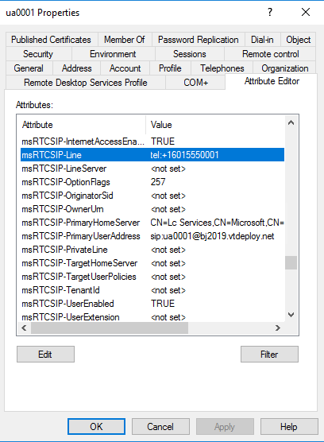

# <a name="decide-how-to-manage-attributes-after-decommissioning"></a>Decidir como gerenciar os atributos após o encerramento

[!INCLUDE [sfbo-retirement](../../Hub/includes/sfbo-retirement.md)]


Por padrão, todos os usuários que foram habilitados para Skype for Business Server e movidos para a nuvem ainda têm atributos msRTCSIP configurados em seu Active Directory local. 

Esses atributos, em particular endereço sip (msRTCSIP-PrimaryUserAddress) e número de telefone (msRTCSIP-Line), continuam a ser sincronizados no Azure AD. Se as alterações são necessárias para qualquer um dos atributos msRTCSIP, essas alterações devem ser feitas no Active Directory local e, em seguida, sincronizar com o Azure AD. No entanto, depois Skype for Business Server a implantação do Skype for Business Server for removida, as ferramentas de Skype for Business Server não estarão disponíveis para gerenciar esses atributos.

Há duas opções disponíveis para lidar com essa situação:

1. Deixe os usuários habilitados para Skype for Business contas de servidor como estão e gerencie os atributos msRTCSIP usando ferramentas do Active Directory. Este método garante nenhuma perda de serviço para usuários migrados e permite remover a implantação do Skype for Business Server eliminando (por exemplo, limpar) os servidores, sem um descomissionamento completo. No entanto, os usuários recém-licenciados não terão esses atributos preenchidos em seu Active Directory local e precisarão ser gerenciados online.

2.  Limpe todos os atributos msRTCSIP de usuários migrados em seu Active Directory local e gerencie esses atributos usando ferramentas online. Esse método permite uma abordagem de gerenciamento consistente para usuários existentes e novos. No entanto, pode resultar em uma perda temporária de serviço durante o processo de desativação local.


## <a name="method-1---manage-sip-addresses-and-phone-numbers-for-users-in-active-directory"></a>Método 1 - Gerenciar endereços sip e números de telefone para usuários no Active Directory

Os administradores podem gerenciar usuários que foram movidos de um local Skype for Business Server para a nuvem, mesmo após a desativação da implantação local. 

Se você quiser fazer alterações no endereço sip de um usuário ou no número de telefone de um usuário (e o endereço sip ou número de telefone já tiver um valor no Active Directory local), você deve fazer a alteração no Active Directory local e permitir que os valores fluam para o Azure AD. Este método NÃO exige Skype for Business Server. Em vez disso, você pode modificar esses atributos diretamente no Active Directory local, usando o snap-in Usuários e Computadores do Active Directory MMC (conforme mostrado abaixo) ou usando o PowerShell. Se você estiver usando o snap-in MMC, abra a página de propriedades do usuário, clique em Editor de Atributos e encontre os atributos apropriados para modificar:

- Para modificar o endereço sip de um usuário, modifique o `msRTCSIP-PrimaryUserAddress`.

    > [!NOTE]
    > Se o `ProxyAddresses` atributo contiver um endereço sip, atualize também esse valor como uma prática prática. Embora o endereço sip seja `ProxyAddresses` ignorado pelo O365 `msRTCSIP-PrimaryUserAddress` se estiver preenchido, ele pode ser usado por outros componentes locais.

- Para modificar o número de telefone de um usuário, modifique `msRTCSIP-Line` *se ele já tiver um valor*.

  


- `msRTCSIP-Line` Se o usuário originalmente não tiver um valor para o local antes da movimentação, `-PhoneNumber` você poderá modificar o número de telefone usando o parâmetro no [cmdlet Set-CsPhoneNumberAssignment](/powershell/module/teams/set-csphonenumberassignment) no módulo Teams PowerShell.

Essas etapas não são necessárias para novos usuários criados após a desabilitação híbrida, e esses usuários podem ser gerenciados diretamente na nuvem. Se você estiver confortável usando a combinação desses métodos e com a saída dos atributos msRTCSIP no seu Active Directory local, você poderá reimimá-los no local Skype for Business servidores. No entanto, se você preferir limpar todos os atributos msRTCSIP e fazer uma desinstalação tradicional do Skype for Business Server, use o Método 2.


## <a name="method-2---clear-skype-for-business-attributes-for-all-on-premises-users-in-active-directory"></a>Método 2 - Limpar Skype for Business atributos para todos os usuários locais no Active Directory

Essa opção requer mais esforço e planejamento adequado, pois os usuários que foram movidos de um local Skype for Business Server para a nuvem devem ser re provisionados. Esses usuários podem ser categorizados em duas categorias diferentes: usuários sem Sistema de Telefonia e usuários com Sistema de Telefonia. Os usuários com Sistema de Telefonia terão uma perda temporária do serviço de telefonia como parte da transição do número de telefone de ser gerenciado Active Directory local para a nuvem. **É recomendável executar um piloto envolvendo um pequeno número de usuários com Sistema de Telefonia antes de iniciar operações de usuário em massa.** Para implantações grandes, os usuários podem ser processados em grupos menores em janelas de tempo diferentes. 

> [!NOTE] 
> Esse processo é mais simples para usuários que têm um endereço sip correspondente e UserPrincipalName. Para organizações que têm usuários com valores não correspondentes nesses dois atributos, é necessário ter cuidado extra, conforme abaixo, para uma transição suave.

> [!NOTE]
> Se você configurou pontos de extremidade de aplicativo híbrido local para Atendimento Automático ou Filas de Chamada, não deixe de mover esses pontos de extremidade para Microsoft 365 antes de desativá-los Skype for Business Server. Para obter detalhes, [consulte Migrar pontos de extremidade de aplicativo híbrido antes de encerrar seu ambiente local](decommission-move-on-prem-endpoints.md).  


1. Confirme se o seguinte cmdlet local Skype for Business PowerShell retorna um resultado vazio. Um resultado vazio significa que nenhum usuário está no local e foi movido para Microsoft 365 ou desabilitado:

   ```PowerShell
   Get-CsUser -Filter { HostingProvider -eq "SRV:"} | Select-Object Identity, SipAddress, UserPrincipalName, RegistrarPool
   ```

2. Grave o número de telefone atual dos usuários (LineUri), UserPrincipalName e informações relacionadas, executando o seguinte cmdlet local Skype for Business Server PowerShell para exportar dados do usuário:

   ```PowerShell
   Get-CsUser | Select-Object SipAddress, UserPrincipalName, SamAccountName, RegistrarPool, HostingProvider, EnabledForFederation, EnabledForInternetAccess, LineUri, EnterpriseVoiceEnabled, HostedVoiceMail | Sort SipAddress | Export-Csv -Path  "c:\backup\SfbUserSettings.csv"
   ```

   > [!Important] 
   > Antes de continuar SfbUserSettings.csv arquivo aberto e confirmar se todos os dados do usuário foram exportados com êxito. É recomendável manter uma cópia desse arquivo.  Não use esse arquivo nas etapas a seguir para processar usuários. 

3. Crie um arquivo com um grupo de usuários a ser usado nas etapas a seguir. Depois que o primeiro grupo de usuários for concluído com êxito, prossiga com o próximo grupo de usuários. No exemplo abaixo, os grupos de usuários são selecionados em ordem alfabética. Você pode filtrar os usuários com base em critérios que corresponde a como você gostaria de processar os usuários.

   ```PowerShell
   Get-CsUser | where userprincipalname -like "abc*" | Select-Object SipAddress, UserPrincipalName, SamAccountName, RegistrarPool, HostingProvider, EnabledForFederation, EnabledForInternetAccess, LineUri, EnterpriseVoiceEnabled, HostedVoiceMail | Sort SipAddress | Export-Csv -Path "c:\data\SfbUsers.csv"
   ```

   > [!Important] 
   > Antes de continuar a SfbUsers.csv arquivo e confirmar se os dados do usuário foram exportados com êxito. Você precisará do LineUri (número de telefone), UserPrincipalName, SamAccountName e SipAddress desse arquivo em uma etapa posterior.

4. Exclua as informações de atributo relacionadas Skype for Business Server do Active Directory para o conjunto de usuários que você está pronto para atualizar.  Há duas etapas para esse processo, conforme mostrado abaixo.

   > [!Important] 
   > Após o próximo ciclo de AAD Sync após executar esta etapa, os usuários com Sistema de Telefonia que foram movidos de um Skype for Business Server local para a nuvem perderão a capacidade de fazer e receber chamadas até que a etapa 8 seja concluída e confirmada com êxito na etapa 9. Além disso, certifique-se de ter salvo os números de telefone do usuário e as informações relacionadas conforme a etapa 2, já que essas informações são necessárias para essa etapa.

 
   ```PowerShell
   $sfbusers=import-csv "c:\data\SfbUsers.csv"
   foreach($user in $sfbusers){
   Disable-CsUser -Identity $user.SipAddress}
   ```

   Em seguida, para o mesmo conjunto de usuários, desempacote o valor de msRTCSIP-DeploymentLocator usando Active Directory local PowerShell:

   ```PowerShell
   $sfbusers=import-csv "c:\data\SfbUsers.csv"
   foreach($user in $sfbusers){
   Set-ADUser -Identity $user.SamAccountName -Clear msRTCSIP-DeploymentLocator}
   ```

5. Para adicionar o valor de endereço sip de volta ao Active Directory local proxyAddresses, execute o seguinte módulo de Active Directory local para Windows PowerShell cmdlet. Essa ação impedirá problemas de interoperabilidade que dependem desse atributo. 

   ```PowerShell
   $sfbusers=import-csv "c:\data\SfbUsers.csv"
   foreach($user in $sfbusers){
     $userUpn=$user.UserPrincipalName
     $userSip=$user.SipAddress
     $proxies=Get-ADUser -Filter "UserPrincipalName -eq '$userUpn'" -properties * | Select-Object @{Name="proxyAddresses";Expression={$_.proxyAddresses}}
     if(($null -eq $proxies) -or ($proxies.proxyAddresses -NotContains $userSip))
     {
             Get-ADUser -Filter "UserPrincipalName -eq '$userUpn'" | Set-ADUser -Add @{"proxyAddresses"=$user.SipAddress}
     }
   }
   ```

6. Executar Azure AD Sync

   ```PowerShell
   Start-ADSyncSyncCycle -PolicyType Delta
   ```

7. Aguarde o provisionamento do usuário ser concluído. Você pode monitorar o andamento do provisionamento do usuário executando o seguinte comando Teams PowerShell. O seguinte Teams comando do PowerShell retorna um resultado vazio assim que o processo é concluído.

   ```PowerShell
   Get-CsOnlineUser -Filter {Enabled -eq $True -and (UserValidationErrors -ne $null -or ProvisioningStamp -ne $null -or SubProvisioningStamp -ne $null)} | fl SipAddress, InterpretedUserType, OnPremHostingProvider, MCOValidationError, *ProvisioningStamp
   ```

8. Para atribuir números de telefone e habilitar usuários para Sistema de Telefonia, execute o seguinte Teams comando do PowerShell:


   ```PowerShell
   $sfbusers=import-csv "c:\data\SfbUsers.csv"
   foreach($user in $sfbusers){
   if($user.LineUri)
        {
             Set-CsPhoneNumberAssignment -Identity $user.SipAddress -PhoneNumber $user.LineUri.Replace("tel:","") -PhoneNumberType DirectRouting
        }
   }
   ```

   > [!Note]
   >  Se você ainda tiver Skype for Business pontos de extremidade (clientes Skype ou telefones de terceiros), também deseja definir -HostedVoiceMail como $true. Se sua organização estiver usando apenas Teams pontos de extremidade para usuários habilitados para voz, essa configuração não será aplicável aos seus usuários. 

9. Confirme se os usuários com Sistema de Telefonia funcionalidade foram provisionados corretamente. O seguinte Teams comando do PowerShell retorna um resultado vazio assim que o processo é concluído.

   ```PowerShell
   $sfbusers=import-csv "c:\data\SfbUsers.csv"
   foreach($user in $sfbusers)
   {
   if($user.LineUri)
        {
                $u=Get-CsOnlineUser -Identity $user.SipAddress
                if ($u.LineURI -ne $user.LineUri -or $u.EnterpriseVoiceEnabled -ne $true)
                {
                Get-CsOnlineUser -Identity $user.SipAddress | fl SipAddress, InterpretedUserType, OnPremLineURI, LineURI, EnterpriseVoiceEnabled, HostedVoicemail
                }
        }
   }
   ``` 

10. Repita as etapas de 3 a 9 até que todos os usuários sejam processados.

11. Confirme se todos os usuários foram processados com êxito executando os dois comandos do PowerShell a seguir.

    Comando do PowerShell local Skype for Business Server local:

    ```PowerShell
    Get-CsUser | Select-Object SipAddress, UserPrincipalName
    ``` 

    Teams comando do PowerShell:

    ```PowerShell
    Get-CsOnlineUser -Filter {Enabled -eq $True -and (OnPremHostingProvider -ne $null -or MCOValidationError -ne $null -or ProvisioningStamp -ne $null -or SubProvisioningStamp -ne $null)} | fl SipAddress, InterpretedUserType, OnPremHostingProvider, MCOValidationError, *ProvisioningStamp
    ``` 

12. Depois de concluir todas as etapas no Método 2, consulte Mover pontos de extremidade do aplicativo híbrido do local para o [online](decommission-move-on-prem-endpoints.md) e Remover seu [](decommission-remove-on-prem.md) Skype for Business Server local para obter etapas adicionais para remover sua implantação Skype for Business Server local.


## <a name="see-also"></a>Confira também

- [Consolidação de nuvem para Teams e Skype for Business](cloud-consolidation.md)

- [Desativar o ambiente local do Skype for Business](decommission-on-prem-overview.md)

