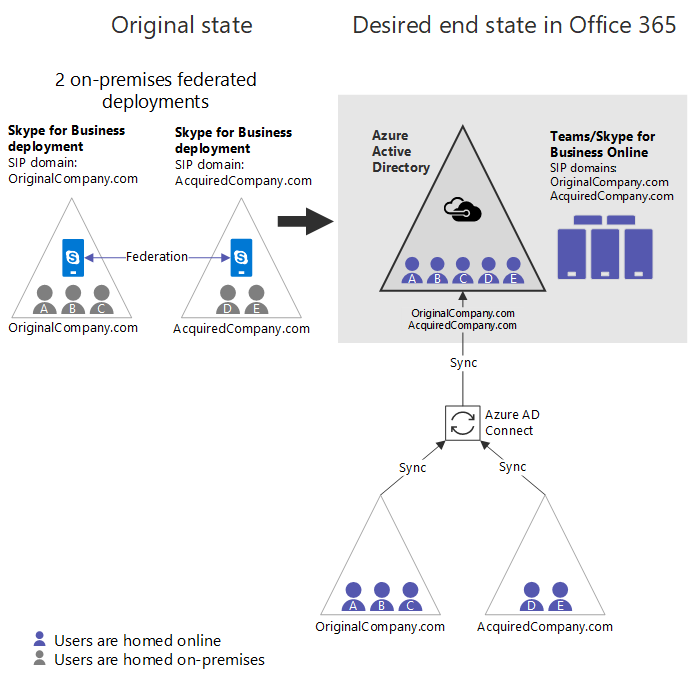

# Consolidação na nuvem para o Teams e Skype for Business

Muitas grandes empresas têm mais de uma floresta local do AD e, em alguns casos, os clientes têm mais de uma implantação do Exchange e/ou do Skype for Business Server (ou do Lync Server). Além disso, até mesmo as organizações com apenas uma floresta local podem se encontrar em uma situação semelhante no caso de fusões ou aquisições empresariais. À medida que esses clientes migram para a nuvem, eles querem consolidar as várias instâncias de uma determinada carga de trabalho local na nuvem em uma única organização do Microsoft 365 ou do Office 365. Este artigo descreve como alcançar essa consolidação para organizações com várias implantações locais do Skype for Business (ou Lync) que desejam mover a carga de trabalho de UC para a nuvem da Microsoft, como o Microsoft Teams e/ou o Skype for Business online.

Historicamente, a orientação era a de que clientes nessa situação deviam consolidar as implantações no local primeiro e depois migrar para a nuvem. Embora esta ainda seja uma opção, este artigo descreve uma solução baseada em nova funcionalidade que permite que as organizações com várias implantações do Skype for Business migrem uma implantação de cada vez em uma única organização do Microsoft 365 ou do Office 365, sem a consolidação local. Observe que, mesmo com essa nova funcionalidade, o Skype for Business Online e o Microsoft Teams não oferecem suporte a várias florestas do Skype for Business/Lync no modo híbrido com uma única organização do Microsoft 365 ou do Office 365. 

> [!Important]
> Antes de usar este guia para configuração, leia e entenda as [limitações](#limitations), pois elas podem afetar sua organização.

## Visão geral da consolidação na nuvem

A consolidação de todos os usuários no local na nuvem em uma única organização do Microsoft 365 ou do Office 365 pode ser obtida para qualquer organização com várias implantações do Skype for Business, desde que os seguintes requisitos principais sejam atendidos:

- Deve haver no máximo uma organização do Microsoft 365 ou do Office 365 envolvida. A consolidação em cenários com mais de uma organização não é suportada.
- Em qualquer momento, somente uma floresta do Skype for Business local pode estar no modo híbrido (Espaço de Endereçamento SIP Compartilhado). Todas as outras florestas locais do Skype for Business devem permanecer no local (e supostamente federadas umas com as outras). Observe que essas outras organizações locais *podem* sincronizar com o AAD, se desejado, com [novas funcionalidades para desabilitar domínios SIP online](https://docs.microsoft.com/powershell/module/skype/disable-csonlinesipdomain) disponíveis a partir de dezembro de 2018.

Os clientes com implantações do Skype for Business em várias florestas devem migrar totalmente todos os usuários de uma única floresta híbrida do Skype for Business individualmente para a organização do Microsoft 365 ou do Office 365 usando a funcionalidade de espaço de endereço SIP compartilhado e, em seguida, desabilitar o híbrido com essa implantação local, antes de migrar para a próxima implantação do Skype for Business local. Antes de ser migrado para a nuvem, os usuários locais permanecem em um Estado federado com qualquer usuário que não esteja representado no diretório local do mesmo usuário.  

## Exemplo canônico de consolidação em nuvem

Considere uma organização com duas implantações do Skype for Business federadas separadas que deseja consolidá-las online no Microsoft Teams ou no Skype for Business online.

|Detalhes do estado original |Detalhes do estado desejado |
|---------|---------|
|<ul><li>2 implantações locais independentes do Skype for Business em florestas do AD separadas<li>No máximo 1 floresta é híbrida com o Skype for Business Online <li> Organizações expandidas são federados entre si <li>Os usuários não são sincronizados entre essas florestas<li> O org pode ter uma organização do Microsoft 365 ou do Office 365 e pode sincronizar seu diretório no Azure AD</ul>|<ul> <li>1 organização do Microsoft 365 ou do Office 365<li>Não há mais implantações locais, portanto, nenhum restante híbrido<li>Todos os usuários do no local estão hospedados no Skype for Business Online e, opcionalmente, podem ser usuários do Microsoft Teams <li>Nenhum espaço no local do Skype for Business em qualquer lugar <li>Os usuários ainda têm autenticação local</ul> |

  

As etapas básicas para obter do estado original para o estado final desejado estão abaixo.  Observe que algumas organizações podem achar que seu ponto de partida está em algum lugar no meio dessas etapas. Confira [outros pontos de partida](#other-starting-points), posteriormente neste artigo. Por fim, em alguns casos, a ordem pode ser ajustada, dependendo da necessidade. As [principais restrições e limitações](#limitations) são descritas posteriormente.

1.  Obtenha uma organização do Microsoft 365 ou do Office 365, se ainda não houver uma.
2.  Certifique-se de que todos os domínios SIP relevantes em todas as implantações locais são verificados nos domínios do Microsoft 365 ou do Office 365.
3.  Escolha uma implantação do Skype for Business que será híbrida com o Microsoft 365 ou o Office 365. Neste exemplo, usaremos OriginalCompany.  suplementos.
4.  [Habilite a conexão AAD para a floresta](configure-azure-ad-connect.md) que primeiro se tornará híbrida (OriginalCompany.  com). 
5.  Se você estiver introduzindo o Microsoft Teams em sua organização, defina a política de todos os locatários do [TeamsUpgradePolicy](https://docs.microsoft.com/powershell/module/skype/grant-csteamsupgradepolicy) para o SfBWithTeamsCollab ou um dos outros modos SfB (SfBOnly ou SfBWithTeamsCollabAndMeetings). Isso é fundamental para garantir o roteamento de chamadas e chats de usuários que se movem para o Microsoft Teams apenas para os usuários que permanecem no local.
6.  É recomendável neste ponto (mas ainda não é necessário até a etapa 11) para [habilitar o AAD Connect para a outra floresta](cloud-consolidation-aad-connect.md) (AcquiredCompany.  com). Supondo que o AAD Connect esteja habilitado em ambas as florestas, a org é semelhante à da **[Figura a](#figure-a)**, que pode ser um ponto de partida comum para alguns organizações expandidas. 
7.  Para todos os domínios SIP hospedados por outras implantações locais (neste caso, AcquiredCompany.  com), [Desabilite esses domínios SIP no Skype for Business online](https://docs.microsoft.com/powershell/module/skype/disable-csonlinesipdomain) usando o `Disable-CsOnlineSipDomain` PowerShell. (Essa é uma nova funcionalidade a partir de dezembro de 2018.)
8.  [Configure o Skype for Business híbrido](configure-federation-with-skype-for-business-online.md) para OriginalCompany.  com (a única implantação que ainda tem os domínios SIP online habilitados).
9.  Na implantação híbrida (OriginalCompany.  com), comece [a mover os usuários do Skype for Business no local para a nuvem](move-users-between-on-premises-and-cloud.md) (seja apenas para equipes ou não) para que a conta seja hospedada no Skype for Business online. Agora a organização é semelhante à da **[Figura B](#figure-b)**. As principais alterações da figura A são:
    - Os usuários de ambos os diretórios locais agora estão no AAD.
    - AcquiredCompany.  com é um domínio SIP online desativado.
    - Alguns usuários foram movidos online para o Skype for Business online ou para o Microsoft Teams. (Consulte usuário roxo A.)
10. Depois que todos os usuários forem movidos para a nuvem, [desabilite o híbrido com a implantação local do Skype for Business](cloud-consolidation-disabling-hybrid.md) para o OriginalCompany.  com do Office 365:  
    - Desabilite o domínio dividido na organização do Microsoft 365 ou do Office 365.
    - Desabilitar a capacidade de se comunicar com o Microsoft 365 ou o Office 365 no OriginalCompany.  com no local.
    - Atualizar registros DNS para o OriginalCompany.  com para apontar para o Microsoft 365 ou o Office 365.
11. Se ainda não tiver feito isso, [habilite o AAD Connect para a próxima floresta](cloud-consolidation-aad-connect.md) que será híbrida (AcquiredCompany.  com). Neste ponto, a organização é semelhante à da **[Figura C](#figure-c)**. Este pode ser outro ponto de partida comum para algumas organizações. 
12. No PowerShell, [habilite os domínios SIP para a próxima implantação local](https://docs.microsoft.com/powershell/module/skype/enable-csonlinesipdomain) que será híbrida, AcquiredCompany.  suplementos. Isso é feito usando `Enable-CsOnlineSipDomain` , que é a nova funcionalidade disponível em dezembro de 2018.
13. Se você estiver usando a Federação fechada, deverá adicionar qualquer domínio SIP (exceto \* . microsoftonline.com) do locatário online puro como domínios permitidos no **mesmo** Microsoft 365 ou Office 365. Observe que pode levar algum tempo para que a alteração entre em vigor e não há danos ao fazer isso antes, sugerimos que você faça isso bem antes de mudar para a etapa 14.
14. Atualize o ambiente local para aceitar qualquer domínio SIP do locatário online, para que eles correspondam.
    - [Atualize a San em todos os certificados de borda](cloud-consolidation-edge-certificates.md) para ser o mesmo valor que antes, além de valores para qualquer domínio SIP online existente (exceto *. microsoftonline.com), neste caso, SIP. OriginalCompany.  suplementos.
    - Certifique-se de que OriginalCompany.  com é um [domínio permitido](https://docs.microsoft.com/powershell/module/skype/new-csalloweddomain) na implantação local, AcquiredCompany. Adicionar domínios permitidos.
15. [Habilitar o Skype for Business híbrido](configure-federation-with-skype-for-business-online.md) entre o AcquiredCompany local.  com e a nuvem.
16. Conforme desejado, [migre os usuários do local para a nuvem](move-users-between-on-premises-and-cloud.md). Você pode migrar usuários diretamente para o modo [TeamsOnly](/microsoftteams/teams-and-skypeforbusiness-coexistence-and-interoperability) ou pode migrá-los primeiro para o Skype for Business online. Durante esse Estado, a organização é semelhante à da **[Figura D](#figure-d)**.
17. Após a migração de todos os usuários, [desabilite o híbrido com o ambiente local](cloud-consolidation-disabling-hybrid.md) para *tornar a nuvem pura da organização*!

Os diagramas abaixo mostram a configuração em vários pontos-chave durante esse processo.

##### Figura A:

- Ambas as organizações sincronizam via AAD Connect, portanto, o AAD agora tem todos os usuários de ambas as implantações locais.
- Todos os usuários hospedados no local.  
- O Skype for Business híbrido ainda *não* foi configurado.
- Se os usuários em equipes de uso de implantação, eles não conseguirão federa-los (ou qualquer outra organização), nem terão interoperabilidade com qualquer usuário do Skype for Business. Nesse estágio, a Microsoft recomenda o uso do teams apenas para canais.  
    

##### Figura B:

- AcquiredCompany.  com é um domínio SIP online [desativado](https://docs.microsoft.com/powershell/module/skype/disable-csonlinesipdomain) . Todos os usuários estão no local. Se eles usarem o Microsoft Teams, eles não terão Federação ou interoperabilidade. Nesse estágio, a Microsoft recomenda o uso do teams apenas para canais.
- O Skype for Business híbrido foi habilitado para uma das organizações locais.
- Alguns usuários na organização híbrida foram movidos para a nuvem (o usuário A conforme indicado pelo sombreamento roxo). Esses usuários podem ser usuários do Skype for Business online ou o Microsoft Teams apenas usuários com interoperabilidade total e suporte à Federação.  
    

##### Figura C:

- Todos os usuários do OriginalCompany.  o com agora está na nuvem (hospedado no Skype for Business online). É recomendável que eles também sejam apenas para o Microsoft Teams.
- Configuração híbrida do Skype for Business com o OriginalCompany.  a implantação com foi desabilitada. A implantação local desapareceu.
- Se AcquiredCompany.  o com não estava sincronizado anteriormente com o AAD, para continuar aqui, ele precisa ser sincronizado agora. Mas ela ainda não é híbrida (espaço de endereço SIP compartilhado) e até que a organização esteja pronta para migrar para o híbrido, o domínio SIP online para a organização local pura (AcquiredCompany.com) deve permanecer desabilitado, para que os usuários do teams online possam se comunicar com os usuários locais.  
    

##### Figura D:

- AcquiredCompany.  o com agora está habilitado como um domínio SIP online.
- O local é atualizado para aceitar o OriginalCompany.  suplementos. (Tanto o domínio permitido quanto os certificados de borda são atualizados).
- O espaço de endereçamento SIP compartilhado está habilitado entre o AcquiredCompany.  organização com e Microsoft 365 ou o Office 365.
- Alguns usuários na organização híbrida podem ter sido movidos para a nuvem, como o usuário D abaixo (indicado por sombreamento roxo).  
    

## Outros pontos de partida

As etapas no exemplo canônica acima supõem que a organização começa com duas implantações federadas no local sem presença da Microsoft ou do Office 365. No entanto, algumas organizações podem ter um espaço existente no Microsoft 365 ou do Office 365, e pode haver diferentes pontos de entrada na sequência acima. Há quatro configurações típicas:

- Várias organizações federadas no local com nenhuma organização do Microsoft 365 ou do Office 365. Nesse caso, comece na etapa 1.
- Várias organizações locais federadas que já estão sincronizando várias florestas do Skype for Business em um único locatário do Azure AD. Essa organização é semelhante à organização hipotética da figura A, que concluiu as etapas 1-6 e deve começar na etapa 7.
- Uma organização híbrida que agrupa com uma ou mais organizações locais puras, nenhuma das quais a sincronização para o AAD. Essa organização se assemelharia à organização hipotética na **Figura E**, mostrada abaixo.
    - Esta organização é semelhante à figura B, que concluiu as etapas 1-9, exceto:
        - Suas implantações não híbridas do Skype for Business ainda *não* estão sendo sincronizadas com o Azure AD.
        -  Os domínios SIP online ainda não estão desabilitados. 
    - Essas organizações devem:
        - Conclua a migração da organização híbrida existente e insira a sequência acima na etapa 10.  OU
        - Se quiser sincronizar qualquer outra floresta do Skype for Business no AAD antes de concluir a migração da organização híbrida, a organização deve executar a etapa 7 (desabilitar todos os domínios SIP online em qualquer outra implantação local do Skype for Business que será sincronizada no AAD) e habilitar o AAD Connect e, em seguida, continuar com a etapa 10 (encerrar a implantação híbrida original).       
                **Figura E** 
                
- Uma organização pura do Skype for Business online (que pode ou não estar usando o Microsoft Teams) que agrupa com uma organização local do Skype for Business separada. Depois que essa organização desabilitar o domínio SIP online para a organização local e habilitar o AAD Connect para a organização do Skype for Business local, ele se parece com a organização hipotética mostrada na **[Figura C](#figure-c)** que concluiu as etapas de 1-11.

## Limitações

- Deve haver no máximo uma organização do Microsoft 365 ou do Office 365 envolvida. A consolidação em cenários com mais de uma organização não é suportada.
- Somente uma floresta local do Skype for Business pode estar no modo híbrido (espaço de endereço SIP compartilhado) por vez. Todas as outras florestas do Skype for Business local devem permanecer exclusivamente no local e devem ser federadas entre si e a organização do Microsoft 365 ou do Office 365.
- Antes de ser migrado para a nuvem, há uma experiência assimétrica para os usuários nesta implantação, porque nem todos os usuários online estão representados no local:
    - A experiência pode ser resumida da seguinte maneira:
        - Qualquer usuário hospedado online irá interagir com os usuários locais no ambiente híbrido como se o usuário for híbrido.
        - Os usuários locais na implantação híbrida interagirão com os usuários online que estão representados em seu diretório local, como se fossem híbridos. 
        - Os usuários locais na implantação híbrida interagirão com os usuários online que não são representados no AD local como federados.
    - Na **[Figura D](#figure-d)** acima, o usuário E está no local no AcquiredCompany.  suplementos.  O usuário E irá interagir com o usuário D (hospedado online) usando a experiência híbrida padrão, mas o usuário E terá uma experiência federada com os usuários A, B e C, pois eles não são representados no diretório local. No entanto, os usuários A, B e C irão interagir com o usuário E como se o usuário estivesse no híbrido.
    - Implicações da interação de ser híbrida vs. Federação:
        - A presença não é inscrita automaticamente para usuários federados, a menos que o usuário seja marcado como um contato.
        - O encaminhamento de chamadas não funciona entre domínios federados.
        - Cenários de transferência de chamada são mais limitados.
        - A limitação pode ser aplicada ao tráfego federado.
- Dada essa experiência assimétrica, o suporte oficial à funcionalidade de chamada em cenários entre locais entre um usuário local e um usuário de nuvem que não esteja no diretório local é limitado somente a ponto a ponto. 
    - Não há suporte para encaminhamento de chamadas, transferência, filas de chamadas, etc. entre esses usuários.
    - Esses cenários de chamadas sem suporte continuarão a ser habilitados, mas, em muitos casos, eles falharão de maneiras imprevisíveis. 
    - Na **[Figura D](#figure-d)** acima, o usuário E é local, e as chamadas com os usuários A, B ou C serão suportadas apenas como ponto a ponto. (As chamadas com o usuário D não terão limitações de suporte).  No entanto, depois que o usuário local E for movido para a nuvem, essa restrição não será mais aplicada.
- Se você tiver mais de uma implantação do Skype for Business Server 2019 em seu ambiente, apenas 1 dessas implantações poderá ser configurada para usar o atendedor automático da organização, uma vez que esse recurso requer a configuração híbrida do Skype for Business Server. 
- A ordem de algumas das etapas anteriores pode ser ajustada. O requisito chave que deve ser atendido é que se todos eles forem verdadeiros:
    - Mais de uma floresta local do Skype for Business que sincroniza com um único locatário do AAD
    - O domínio dividido está habilitado com uma floresta local
    - Pelo menos um usuário na organização híbrida foi migrado para a nuvem    Em seguida, você *deve* desabilitar todos os outros domínios SIP online de qualquer outra floresta local do Skype for Business. Caso contrário, a Federação entre usuários online na organização híbrida e os usuários locais em outras organizações quebrarão em uma direção.

## Implica

- Como há limitações no suporte para a funcionalidade de chamada avançada, conforme descrito acima, **as organizações devem tratar esses Estados assimétricos como transitórios como parte da migração e não o buscar como um estado estável**.  
- As organizações com várias implantações locais do Skype for Business geralmente devem começar com uma implantação que pode ser totalmente migrada para a nuvem, para que a consolidação possa continuar. É entendido que, em alguns casos, haverá algumas contratações de determinados grupos de usuários para os quais ainda não é viável migrar para o Microsoft Teams. Quando isso é uma consideração em cenários que envolvem várias florestas do Skype for Business, comece a migrar com outra floresta que não tenha essas limitações, se possível.
- Ao mudar do local para a nuvem, os usuários que têm relações de delegação e/ou geralmente estão envolvidos nos cenários de encaminhamento de chamadas devem ser movidos juntos como uma unidade.

## Considerações para mudar para o modo TeamsOnly

Ao mover usuários do local para a nuvem em um ambiente híbrido, você pode movê-los para o Skype for Business somente ou para o modo TeamsOnly. *Se você planeja mover usuários para o modo TeamsOnly, leia esta seção primeiro.*

- Quando você atribui o modo TeamsOnly a um usuário, todos os chats e as chamadas de qualquer outro usuário vão parar no cliente do Microsoft Teams. 
- Se os usuários com o Skype for Business no local usam principalmente o cliente Skype for Business e não as equipes, considere definir TeamsUpgradePolicy para que o roteamento para os usuários locais sempre fique no Skype for Business, e não no Microsoft Teams. Para garantir o roteamento adequado de chats e chamadas entre usuários que são TeamsOnly e usuários que ainda estejam usando o Skype for Business no local, os usuários locais devem ter um valor efetivo de TeamsUpgradePolicy com um dos modos SfB, em vez de ilhas (que é o padrão). 
    - Para fazer isso, *você deve primeiro definir a instância global do seu locatário do TeamsUpgradePolicy como um destes valores*:
        - SfBWithTeamsCollab (recomendado)
        - SfBWithTeamsCollabAndMeetings
        - SfBOnly
    - Você pode conceder a política de todo o locatário usando este comando: `Grant-CsTeamsUpgradePolicy -PolicyName SfBWithTeamsCollab -Global`
    - Observação: você deve fazer isso em um nível de locatário, pois a política não pode ser atribuída a usuários individuais que não tenham um endereço SIP no diretório online. Embora você tenha desabilitado domínios SIP online para sua (s) implantação (ões) local (is) pura (s), os usuários desses domínios não terão endereços SIP no diretório online por design. Portanto, a única maneira de aplicar a política aos usuários locais é atribuindo no nível do locatário. Por outro lado, nos usuários de implantação híbrida terão um endereço SIP no diretório online para que eles possam ser explicitamente atribuídos a uma política se desejado tiverem um valor diferente do que a política global do locatário.
- O cliente do teams UX ainda não respeita os modos SfB do TeamsUpgradePolicy. Por exemplo, quando nesses modos, o início da chamada e do chat no Microsoft Teams é possível no momento, embora no futuro que não seja o caso. Isso pode causar confusão entre os usuários porque as respostas podem às vezes chegarem ao Teams e, às vezes, Skype for Business, dependendo das circunstâncias. É recomendável que você desabilite separadamente a chamada e o chat por meio do TeamsMessagingPolicy e do TeamsCallingPolicy para usuários que ainda estão no local.

## Confira também

[Atualizar o certificado de borda](cloud-consolidation-edge-certificates.md)

[Atualizar o AAD Connect para incluir mais de uma floresta](cloud-consolidation-aad-connect.md)

[Disabilitar conectividade híbrida para concluir a migração para a nuvem](cloud-consolidation-disabling-hybrid.md)
