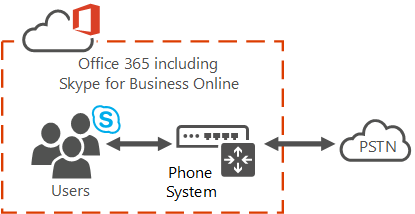

# Qual é o sistema telefônico no Office 365?What is Phone System in Office 365?

## Sistema telefônico no Office 365 e Skype para Business ServerPhone System in Office 365 and Skype for Business Server

**Sistema telefônico** é a tecnologia da Microsoft para habilitar o controle de chamada e recursos do PBX na nuvem com Skype Office 365 para o Business Online e Teams da Microsoft.**Phone System** is the Microsoft technology for enabling call control and PBX capabilities in the Office 365 cloud with Skype for Business Online and Microsoft Teams. Sistema telefônico permite que você substitua o seu sistema PBX existente um conjunto de recursos entregues do Office 365 e estreitamente integrado ao experiência de nuvem da sua organização.Phone System allows you to replace your existing PBX system with a set of features delivered from Office 365 and tightly integrated into your organization's cloud experience. Para obter mais informações sobre os recursos, consulte [aqui está o que fazer com o sistema telefônico no Office 365](here-s-what-you-get-with-phone-system.md).For more about the features, see [Here's what you get with Phone System in Office 365](here-s-what-you-get-with-phone-system.md).
  
Com o sistema telefônico, os usuários podem usar o Skype para Business Online e Teams da Microsoft para cuidam das tarefas de controle de chamada básica, como fazer e receber chamadas, transferir chamadas e chamadas tirar o som e unmuting.With Phone System, your users can use Skype for Business Online and Microsoft Teams to take care of basic call control tasks, such as placing and receiving calls, transferring calls, and muting and unmuting calls. Os usuários do sistema telefônico podem clicar no nome no seu catálogo de endereços e Skype para negócios ou Teams Microsoft faz uma chamada para essa pessoa.Phone System users can click a name in their address book, and Skype for Business or Microsoft Teams places a call to that person. Para fazer e receber chamadas, os usuários de sistema telefônico podem usar seus dispositivos móveis, um fone de ouvido com um laptop ou PC ou uma das muitas telefones IP que funcionam com o Skype para Teams da Microsoft e de negócios.To place and receive calls, Phone System users can use their mobile devices, a headset with a laptop or PC, or one of many IP phones that work with Skype for Business and Microsoft Teams. Para os administradores, o sistema telefônico fornece a capacidade de gerenciar chamada dentro do mesmo console de administração usada para mensagens, colaboração e assim por diante.For admins, Phone System provides the ability to manage calling within the same admin console used for messaging, collaboration, and so on.
  
Com sistemas de PBX tradicionais, chamadas entre usuários em sua organização são manipuladas internamente dentro do sistema telefônico e nunca ir para a PSTN.With traditional PBX systems, calls between users in your organization are handled internally within Phone System, and never go to the PSTN. Isso se aplica às chamadas entre usuários em sua organização, localizado em áreas geográficas diferentes, removendo os custos de longa distância nessas chamadas internas.This applies to calls between users in your organization located in different geographical areas, removing long-distance costs on these internal calls.
  
Para habilitar chamadas para landlines e celulares, o sistema telefônico pode ser conectado à PSTN em uma das duas maneiras:To enable calls to landlines and mobile phones, Phone System can be connected to the PSTN in one of two ways:
  
- Ao adquirir a uma chamada planejar (locais ou nacionais e internacionais) para o Office 365.By purchasing the a Calling Plan (domestic or domestic and international) to Office 365. Consulte [Cite chamar planos?](../what-are-calling-plans-in-office-365/what-are-calling-plans-in-office-365.md)See [What are Calling Plans?](../what-are-calling-plans-in-office-365/what-are-calling-plans-in-office-365.md)
    
- Usando a conectividade de PSTN local, onde o software no local conecta-se a sua infraestrutura de telefonia existente.By using on-premises PSTN connectivity, where software on premises connects with your existing telephony infrastructure. Consulte [Planning seu sistema telefônico](../../SfbServer/skype-for-business-hybrid-solutions/plan-your-phone-system-cloud-pbx-solution/plan-your-phone-system-cloud-pbx-solution.md).See [Planning your Phone System](../../SfbServer/skype-for-business-hybrid-solutions/plan-your-phone-system-cloud-pbx-solution/plan-your-phone-system-cloud-pbx-solution.md).

.

## Mais informações sobre planos de chamadaMore about Calling Plans

Usar um complemento chamar planejar para o sistema telefônico no Office 365 permite a conectividade PSTN para chamadas landlines e celulares em todo o mundo (dependendo do nível de serviço a serem licenciado).Using a Calling Plan add-on to Phone System in Office 365 enables PSTN connectivity for calling to landlines and mobile phones around the world (depending on the level of service being licensed). Seus usuários são hospedados na nuvem e são habilitados para o Sistema de Telefonia com o complemento de Plano de Chamadas fornecido pela Microsoft.Your users are homed in the cloud and are enabled for Phone System with the Calling Plan add-on provided by Microsoft. Usar planos de chamada não exige uma implantação de servidor local.Using Calling Plans doesn't require an on-premises server deployment. Planos de chamada só funcionam com o sistema telefônico no Office 365 e você não pode usar o ato de chamar planos com outro sistema PBX.Calling Plans only work with Phone System in Office 365, and you can't use Calling Plans with another PBX system.

Porque os planos de chamar operam no Office 365, esta é uma oferta de completamente na-nuvem que não exija uma implantação de servidor local.Because Calling Plans operate within Office 365, this is a completely-in-the-cloud offering that doesn't require an on-premises server deployment. Você tem a opção de usar uma doméstico ou doméstico e internacional chamar planejar, que ser atribuídos a cada usuário que você deseja fazer chamadas.You have the choice of using a Domestic or Domestic and International Calling Plan, which be assigned to each user that you want to make calls. [Quer saber mais?Want to know more?](../what-are-calling-plans-in-office-365/what-are-calling-plans-in-office-365.md)
  
Os usuários que estejam hospedados em Skype para Business Online ou Microsoft Teams no Office 365 terão acesso aos serviços de voz do Office 365.Users who are homed in Skype for Business Online or Microsoft Teams in Office 365 will have access to Office 365 voice services. A Microsoft é a provedora dos serviços básicos de chamada e PSTN, e pode até mesmo fornecer ou portar os números de telefone de seus usuários.Microsoft is the provider of both core calling and PSTN services, and can even provide or port your users' phone numbers. 
  
Planos de chamada do Office 365 permite que você pesquise, adquirir e atribuir números de telefone aos usuários em sua organização para que os usuários podem fazer e receber chamadas telefônicas com pessoas de dentro e fora da sua organização.Calling Plans in Office 365 allows you to search, acquire, and assign phone numbers to users in your organization so that users can make and receive phone calls with people inside and outside of your organization.
  
Em todos os tipos de negócios, ter um número de telefone que permite que os usuários enviem e recebam chamadas de voz é um requisito importante para fazer negócios, como números de telefone são usados para identificar um usuário e permitir a comunicação entre organizações.In all types of business, having a phone number that allows users to send and receive voice calls is an important requirement to do business, as phone numbers are used to identify a user and allow for communication across organizations. Os usuários que são atribuídos a números de telefone será capazes de fazer chamadas de voz entre todos os Skype para dispositivos Teams da Microsoft e de negócios, incluindo telefones VoIP, PCs e dispositivos móveis.The users who are assigned phone numbers will be able to make voice calls across all Skype for Business and Microsoft Teams devices, including VoIP phones, PCs, and mobile devices. 

Planos de chamada (locais e nacionais e internacionais) estão disponíveis nas localidades geográficas específicas, mas crescentes.Calling Plans (domestic and domestic and international) are available in specific but growing geographic locations. Verifique a [disponibilidade](../country-and-region-availability-for-audio-conferencing-and-calling-plans/country-and-region-availability-for-audio-conferencing-and-calling-plans.md) em seu país ou região.Please check for [availability](../country-and-region-availability-for-audio-conferencing-and-calling-plans/country-and-region-availability-for-audio-conferencing-and-calling-plans.md) in your country or region. 

**Pronto para começar?****Ready to get started?**  Para configurar seus planos de chamada para seus usuários, consulte [Configurar planos de chamada](../what-are-calling-plans-in-office-365/set-up-calling-plans.md).To set up your calling plans for your users, see [Set up Calling Plans](../what-are-calling-plans-in-office-365/set-up-calling-plans.md).  

## Sistema telefônico com serviçosPhone System with Services
 Sistema de telefone aso pode ser usado para caixa postal e serviços:Phone System can aso be used for services and voicemail:
- **Atendedores automáticos**  O sistema telefônico no Office 365 atendedores automáticos podem ser usados para criar um sistema de menu para a sua organização que permite que os chamadores externos e internos mover através de um sistema de menu localizar e colocar ou transferir chamadas para usuários da empresa ou departamentos na organização.**Auto attendants**  Phone System in Office 365 auto attendants can be used to create a menu system for your organization that lets external and internal callers move through a menu system to locate and place or transfer calls to company users or departments in your organization. Consulte [Cite atendedores automáticos de sistema telefônico?](what-are-phone-system-auto-attendants.md)See [What are Phone System auto attendants?](what-are-phone-system-auto-attendants.md)

- **Filas de chamada**  Com o sistema telefônico, você pode criar saudações de fila de chamada que são usadas quando alguém chama um número de telefone para sua organização; Isso inclui a capacidade de colocar automaticamente as chamadas em espera e a capacidade de pesquisar para o próximo operador chamada disponíveis lidar com a chamada enquanto as pessoas que a chamada está escutando a música em espera.**Call queues**  With Phone System, you can create call queue greetings that are used when someone calls in to a phone number for your organization; this includes the ability to automatically put the calls on hold and the ability to search for the next available call agent to handle the call while the people who call are listening to music on hold. Você pode criar um único ou vários filas de chamada para sua organização.You can create single or multiple call queues for your organization. Consulte [criar uma fila de chamada do sistema telefônico](create-a-phone-system-call-queue.md).See [Create a Phone System call queue](create-a-phone-system-call-queue.md).

- **Caixa postal** Quando você obtiver uma licença de sistema telefônico para um usuário, esse usuário poderá obter o correio de voz que foi deixado por chamadores.**Voicemail** When you get a Phone System license for a user, that user will be able to get voicemail that has been left by callers. Caixa postal do sistema telefônico automaticamente é configurado e provisionado para usuários depois que você atribuir uma licença de sistema telefônico e um número de telefone para acessá-los.Phone System voicemail is automatically set up and provisioned for users after you assign a Phone System license and a phone number to them. Consulte [Configurar a caixa postal do sistema telefônico](phone-system-voicemail/set-up-phone-system-voicemail.md).See [Set up Phone System voicemail](phone-system-voicemail/set-up-phone-system-voicemail.md).

Se você estiver pronto para começar, consulte [Configurando o sistema telefônico na sua organização](setting-up-your-phone-system.md).If you're ready to get started, see [Setting up Phone System in your organization](setting-up-your-phone-system.md).

## Tópicos relacionadosRelated topics
- [Licenciamento de complementos do Skype for Business e do Microsoft TeamsSkype for Business and Microsoft Teams add-on licensing](../skype-for-business-and-microsoft-teams-add-on-licensing/skype-for-business-and-microsoft-teams-add-on-licensing.md)
- [Gerenciar os números de telefone de sua organizaçãoManage phone numbers for your organization](../what-are-calling-plans-in-office-365/manage-phone-numbers-for-your-organization/manage-phone-numbers-for-your-organization.md)
- [Diferentes tipos de números de telefone usados para Planos de ChamadasDifferent kinds of phone numbers used for Calling Plans](../what-are-calling-plans-in-office-365/different-kinds-of-phone-numbers-used-for-calling-plans.md)
- [Obter telefones para o Skype for Business OnlineGetting phones for Skype for Business Online](getting-phones-for-skype-for-business-online/getting-phones-for-skype-for-business-online.md)

