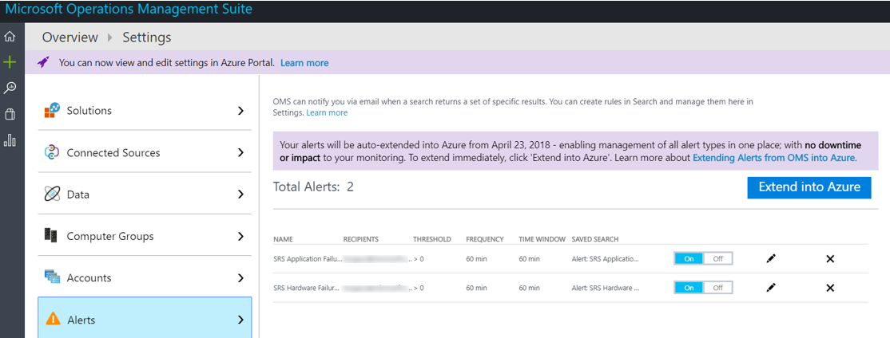

# <a name="deploy-skype-room-systems-v2-management-with-oms"></a><span data-ttu-id="6334e-103">Implantar o gerenciamento do Skype Room Systems v2 com OMS</span><span class="sxs-lookup"><span data-stu-id="6334e-103">Deploy Skype Room Systems v2 management with OMS</span></span>

<span data-ttu-id="6334e-104">Este artigo discute como configurar e implantar o gerenciamento integrado de ponta a ponta de dispositivos do Skype sala sistemas v2 usando o pacote de gerenciamento de operações do Microsoft.</span><span class="sxs-lookup"><span data-stu-id="6334e-104">This article discusses how to set up and deploy integrated, end-to-end management of Skype Room Systems v2 devices by using Microsoft Operations Management Suite.</span></span>

<span data-ttu-id="6334e-105">Você pode configurar o Microsoft Operations Management Suite para fornecer Telemetria básica e alertas que ajudarão você a gerenciar Skype dispositivos de sala de reunião.</span><span class="sxs-lookup"><span data-stu-id="6334e-105">You can configure Microsoft Operations Management Suite to provide basic telemetry and alerts that will help you manage Skype meeting room devices.</span></span> <span data-ttu-id="6334e-106">Como sua solução de gerenciamento for envelhecendo, talvez você decida implantar recursos de gerenciamento para criar uma visão mais detalhada de desempenho e disponibilidade de dispositivo e dados adicionais.</span><span class="sxs-lookup"><span data-stu-id="6334e-106">As your management solution matures, you might decide to deploy additional data and management capabilities to create a more detailed view of device availability and performance.</span></span>

<span data-ttu-id="6334e-107">Seguindo este guia, você pode usar um painel semelhante ao seguinte exemplo para obter o status detalhado de relatórios para disponibilidade de dispositivo, aplicativo e integridade de hardware e a distribuição de versão de aplicativo do Skype sala sistemas v2.</span><span class="sxs-lookup"><span data-stu-id="6334e-107">By following this guide, you can use a dashboard like the following example to get detailed status reporting for device availability, application and hardware health, and Skype Room Systems v2 application version distribution.</span></span>

<span data-ttu-id="6334e-108">![Modo de exibição de amostra OMS para v2 SRS] (../../media/Deploy_OMS_1.png "Modo de exibição de amostra OMS para v2 SRS")</span><span class="sxs-lookup"><span data-stu-id="6334e-108"></span></span>

<span data-ttu-id="6334e-109">Em um nível superior, é necessário executar as seguintes tarefas:</span><span class="sxs-lookup"><span data-stu-id="6334e-109">At a high level, you need to perform the following tasks:</span></span>


1.  [<span data-ttu-id="6334e-110">Validar a configuração do pacote de gerenciamento de operações</span><span class="sxs-lookup"><span data-stu-id="6334e-110">Validate Operations Management Suite configuration</span></span>](with-oms.md#validate_OMS)
2.  [<span data-ttu-id="6334e-111">Configurar dispositivos de teste de configuração de gerenciamento do pacote de gerenciamento de operações</span><span class="sxs-lookup"><span data-stu-id="6334e-111">Configure test devices for Operations Management Suite management setup</span></span>](with-oms.md#configure_test_devices)
3.  [<span data-ttu-id="6334e-112">Mapear os campos personalizados</span><span class="sxs-lookup"><span data-stu-id="6334e-112">Map custom fields</span></span>](with-oms.md#Custom_fields)
4.  [<span data-ttu-id="6334e-113">Definir os modos de exibição do Skype sala sistemas v2 no pacote de gerenciamento de operações</span><span class="sxs-lookup"><span data-stu-id="6334e-113">Define the Skype Room Systems v2 views in Operations Management Suite</span></span>](with-oms.md#Define_Views)
5.  [<span data-ttu-id="6334e-114">Definir alertas</span><span class="sxs-lookup"><span data-stu-id="6334e-114">Define alerts</span></span>](with-oms.md#Alerts)
6.  [<span data-ttu-id="6334e-115">Configurar todos os dispositivos para o pacote de gerenciamento de operações</span><span class="sxs-lookup"><span data-stu-id="6334e-115">Configure all devices for Operations Management Suite</span></span>](with-oms.md#configure_all_devices)
7.  [<span data-ttu-id="6334e-116">Configurar soluções adicionais do pacote de gerenciamento de operações</span><span class="sxs-lookup"><span data-stu-id="6334e-116">Configure additional Operations Management Suite solutions</span></span>](with-oms.md#Solutions)

> [!IMPORTANT]
> <span data-ttu-id="6334e-117">Embora com a configuração mínima, o pacote de gerenciamento de operações pode monitorar a um computador que executa um sistema operacional Windows, ainda há algumas etapas v2 específica Skype sala sistemas que precisam ser executadas antes de começar a implantar agentes para todas as salas do Skype Dispositivos de sistemas.</span><span class="sxs-lookup"><span data-stu-id="6334e-117">Although with minimal configuration, the Operations Management Suite can monitor a computer running a Windows operating system, there are still some Skype Room Systems v2–specific steps that you need to take before you start deploying agents to all Skype Room Systems devices.</span></span>
> <span data-ttu-id="6334e-118">Portanto, é altamente recomendável que executar todas as etapas de configuração na ordem correta para um controlado de instalação e configuração.</span><span class="sxs-lookup"><span data-stu-id="6334e-118">Therefore, we highly recommend you perform all configuration steps in the right order for a controlled setup and configuration.</span></span> <span data-ttu-id="6334e-119">A qualidade do resultado final depende muito a qualidade da configuração inicial.</span><span class="sxs-lookup"><span data-stu-id="6334e-119">The quality of the end result very much depends on the quality of the initial configuration.</span></span>

## <a name="validate-operations-management-suite-configuration"></a><span data-ttu-id="6334e-120">Validar a configuração do pacote de gerenciamento de operações</span><span class="sxs-lookup"><span data-stu-id="6334e-120">Validate Operations Management Suite configuration</span></span>
<span data-ttu-id="6334e-121"><a name="validate_OMS"> </a></span><span class="sxs-lookup"><span data-stu-id="6334e-121"></span></span>

<span data-ttu-id="6334e-122">Você precisa ter um espaço de trabalho do pacote de gerenciamento de operações para iniciar a coleta de logs de dispositivos do Skype sala sistemas v2.</span><span class="sxs-lookup"><span data-stu-id="6334e-122">You need to have an Operations Management Suite workspace to start collecting logs from Skype Room Systems v2 devices.</span></span> <span data-ttu-id="6334e-123">Um espaço de trabalho é um ambiente de análise de Log exclusivo com seu próprio repositório de dados, fontes de dados e soluções.</span><span class="sxs-lookup"><span data-stu-id="6334e-123">A workspace is a unique Log Analytics environment with its own data repository, data sources, and solutions.</span></span> <span data-ttu-id="6334e-124">Se você já tiver um espaço de trabalho de análise de Log existente, você pode usá-lo para monitorar sua implantação do Skype sala sistemas v2 ou você pode criar um dedicado Log Analytics espaço de trabalho específico para o monitoramento de sistemas de sala Skype v2 precisa.</span><span class="sxs-lookup"><span data-stu-id="6334e-124">If you already have an existing Log Analytics workspace, you might use it to monitor your Skype Room Systems v2 deployment or you can create a dedicated Log Analytics workspace specific to your Skype Room Systems v2 monitoring needs.</span></span>

<span data-ttu-id="6334e-125">Se você precisar criar um novo espaço de trabalho de análise de Log, siga as instruções no artigo [criar um espaço de trabalho de análise de Log no portal do Azure](https://docs.microsoft.com/azure/log-analytics/log-analytics-quick-create-workspace)</span><span class="sxs-lookup"><span data-stu-id="6334e-125">If you need to create a new Log Analytics workspace, follow the instructions in the article [Create a Log Analytics workspace in the Azure portal](https://docs.microsoft.com/azure/log-analytics/log-analytics-quick-create-workspace)</span></span>

> [!NOTE]
> <span data-ttu-id="6334e-126">Para usar a análise de Log com pacote de gerenciamento de operações, você precisa ter uma assinatura do Azure active.</span><span class="sxs-lookup"><span data-stu-id="6334e-126">To use Log Analytics with Operations Management Suite, you need to have an active Azure subscription.</span></span> <span data-ttu-id="6334e-127">Se você não tiver uma assinatura do Windows Azure, você pode criar [uma assinatura de avaliação gratuita](https://azure.microsoft.com/free) como ponto de partida.</span><span class="sxs-lookup"><span data-stu-id="6334e-127">If you don’t have an Azure subscription, you can create [a free trial subscription](https://azure.microsoft.com/free) as a starting point.</span></span>


### <a name="configure-operations-management-suite-to-collect-skype-room-systems-v2-event-logs"></a><span data-ttu-id="6334e-128">Configurar o pacote de gerenciamento de operações para coletar logs de eventos do Skype sala sistemas v2</span><span class="sxs-lookup"><span data-stu-id="6334e-128">Configure Operations Management Suite to collect Skype Room Systems v2 event logs</span></span>

<span data-ttu-id="6334e-129">Análise de log coleta somente eventos de logs de eventos do Windows que são especificados nas configurações do.</span><span class="sxs-lookup"><span data-stu-id="6334e-129">Log Analytics only collects events from the Windows event logs that are specified in the settings.</span></span> <span data-ttu-id="6334e-130">Para cada log, somente os eventos a severidades selecionadas são coletados.</span><span class="sxs-lookup"><span data-stu-id="6334e-130">For each log, only the events with the selected severities are collected.</span></span>

<span data-ttu-id="6334e-131">Você precisará configurar o pacote de gerenciamento de operações para coletar os logs necessários para monitorar o status de dispositivo e aplicativo v2 Skype sistemas de sala.</span><span class="sxs-lookup"><span data-stu-id="6334e-131">You need to configure Operations Management Suite to collect the logs required to monitor Skype Room Systems v2 device and application status.</span></span> <span data-ttu-id="6334e-132">Dispositivos de v2 de sistemas de sala Skype usam o log de eventos do **Sistema do Skype sala** .</span><span class="sxs-lookup"><span data-stu-id="6334e-132">Skype Room Systems v2 devices use the **Skype Room System** event log.</span></span>

<span data-ttu-id="6334e-133">Para configurar o pacote de gerenciamento de operações para coletar os eventos de sistemas de sala Skype v2, consulte [fontes de dados de log de eventos do Windows na análise de Log](https://docs.microsoft.com/azure/log-analytics/log-analytics-data-sources-windows-events)</span><span class="sxs-lookup"><span data-stu-id="6334e-133">To configure Operations Management Suite to collect the Skype Room Systems v2 events, see [Windows event log data sources in Log Analytics](https://docs.microsoft.com/azure/log-analytics/log-analytics-data-sources-windows-events)</span></span>

<span data-ttu-id="6334e-134">![Configurações de log de eventos] (../../media/Deploy_OMS_2.png "Configurações de log de eventos")</span><span class="sxs-lookup"><span data-stu-id="6334e-134"></span></span>


> [!IMPORTANT]
> <span data-ttu-id="6334e-135">Selecione o log de eventos do **Sistema do Skype sala** e marque as caixas de seleção de **erro**, **Aviso**e **informações** .</span><span class="sxs-lookup"><span data-stu-id="6334e-135">Select the **Skype Room System** event log, and then select the **Error**, **Warning**, and **Information** check boxes.</span></span>

## <a name="configure-test-devices-for-operations-management-suite-setup"></a><span data-ttu-id="6334e-136">Configurar dispositivos de teste para a instalação do pacote de gerenciamento de operações</span><span class="sxs-lookup"><span data-stu-id="6334e-136">Configure test devices for Operations Management Suite setup</span></span>
<span data-ttu-id="6334e-137"><a name="configure_test_devices"> </a></span><span class="sxs-lookup"><span data-stu-id="6334e-137"></span></span>

<span data-ttu-id="6334e-138">É necessário preparar o pacote de gerenciamento de operações para poder monitorar eventos relacionados ao v2 de sistemas de sala do Skype.</span><span class="sxs-lookup"><span data-stu-id="6334e-138">You need to prepare Operations Management Suite to be able to monitor Skype Room Systems v2–related events.</span></span> <span data-ttu-id="6334e-139">Para começar com, você precisa implantar agentes do pacote de gerenciamento de operações para apenas um ou dois sistemas de sala Skype v2 os dispositivos que possuem acesso físico ao e têm os dispositivos de teste gerar alguns dados e push-lo no espaço de trabalho de análise de Log.</span><span class="sxs-lookup"><span data-stu-id="6334e-139">To start with, you need to deploy Operations Management Suite agents to just one or two Skype Room Systems v2 devices that you have physical access to and have those test devices generate some data and push it to the Log Analytics workspace.</span></span>

### <a name="install-operations-management-suite-agents-to-test-devices"></a><span data-ttu-id="6334e-140">Instale os agentes de pacote de gerenciamento de operações para dispositivos de teste</span><span class="sxs-lookup"><span data-stu-id="6334e-140">Install Operations Management Suite agents to test devices</span></span>

<span data-ttu-id="6334e-141">Implante o agente do pacote de gerenciamento de operações para os dispositivos de teste usando as instruções fornecidas em [computadores com Windows se conectar ao serviço de Log de análise no Windows Azure](https://docs.microsoft.com/azure/log-analytics/log-analytics-agent-windows).</span><span class="sxs-lookup"><span data-stu-id="6334e-141">Deploy the Operations Management Suite agent to the test devices by using the instructions provided in [Connect Windows computers to the Log Analytics service in Azure](https://docs.microsoft.com/azure/log-analytics/log-analytics-agent-windows).</span></span> <span data-ttu-id="6334e-142">Este artigo oferece informações detalhadas sobre as etapas de implantação do Microsoft Monitoring Agent para Windows, instruções para obter a *ID do espaço de trabalho* do pacote de gerenciamento de operações e a *chave primária* para obter os dispositivos de v2 de sistemas de sala do Skype conectado à sua implantação do pacote de gerenciamento de operações e etapas para verificar a conectividade do agente para análise de Log.</span><span class="sxs-lookup"><span data-stu-id="6334e-142">This article gives detailed information about the steps for deploying Microsoft Monitoring Agent for Windows, instructions for obtaining the Operations Management Suite *Workspace ID* and the *primary key* to get Skype Room Systems v2 devices connected to your Operations Management Suite deployment, and steps to verify agent connectivity to Log Analytics.</span></span>

### <a name="generate-sample-skype-room-systems-events"></a><span data-ttu-id="6334e-143">Gerar eventos de sistemas de sala Skype de amostra</span><span class="sxs-lookup"><span data-stu-id="6334e-143">Generate sample Skype Room Systems events</span></span>

<span data-ttu-id="6334e-144">Depois que o agente do pacote de gerenciamento de operações é implantado nos dispositivos de teste, verifique se que os dados de log de eventos necessários são coletados pela análise de Log.</span><span class="sxs-lookup"><span data-stu-id="6334e-144">After the Operations Management Suite agent is deployed onto the test devices, verify that the required event log data is collected by Log Analytics.</span></span>

1.  <span data-ttu-id="6334e-145">Entrar no [portal do pacote de gerenciamento de operações do Microsoft](https://aka.ms/omsportal).</span><span class="sxs-lookup"><span data-stu-id="6334e-145">Sign in to the [Microsoft Operations Management Suite portal](https://aka.ms/omsportal).</span></span>

2.  <span data-ttu-id="6334e-146">Liste os eventos gerados por um dispositivo do Skype sala sistemas v2:</span><span class="sxs-lookup"><span data-stu-id="6334e-146">List the events generated by a Skype Room Systems v2 device:</span></span>
    1.  <span data-ttu-id="6334e-147">Vá para a **Pesquisa de Log** e usar uma consulta para recuperar os registros que terão o campo personalizado.</span><span class="sxs-lookup"><span data-stu-id="6334e-147">Go to **Log Search** and use a query to retrieve the records that will have the custom field.</span></span>
    2.  <span data-ttu-id="6334e-148">Consulta de exemplo:`Event | where Source == "SRS-App"`</span><span class="sxs-lookup"><span data-stu-id="6334e-148">Sample query: `Event | where Source == "SRS-App"`</span></span>

3.  <span data-ttu-id="6334e-149">Certifique-se de que a consulta retorna registros de log que incluam eventos pulsação bem-sucedida.</span><span class="sxs-lookup"><span data-stu-id="6334e-149">Make sure that the query returns log records that include successful heartbeat events.</span></span>

4.  <span data-ttu-id="6334e-150">Gerar um problema de hardware e validar que os eventos necessários são registrados no pacote de gerenciamento de operações.</span><span class="sxs-lookup"><span data-stu-id="6334e-150">Generate a hardware issue, and validate that the required events are logged in Operations Management Suite.</span></span>
    1.  <span data-ttu-id="6334e-151">Desconecte um dos dispositivos periféricos no teste do sistema do Skype sala sistemas v2.</span><span class="sxs-lookup"><span data-stu-id="6334e-151">Unplug one of the peripheral devices on the test Skype Room Systems v2 system.</span></span> <span data-ttu-id="6334e-152">Isso poderia ser a câmera, viva-voz, microfone ou exibição da sala de frente</span><span class="sxs-lookup"><span data-stu-id="6334e-152">This could be the camera, speakerphone, microphone, or Front Room Display</span></span>
    2.  <span data-ttu-id="6334e-153">Aguarde 10 minutos para que o log de eventos a serem preenchidos no pacote de gerenciamento de operações.</span><span class="sxs-lookup"><span data-stu-id="6334e-153">Wait 10 minutes for the event log to be populated in Operations Management Suite.</span></span>
    3.  <span data-ttu-id="6334e-154">Use uma consulta para listar eventos de erro de hardware:`Event | where EventID == 3001`</span><span class="sxs-lookup"><span data-stu-id="6334e-154">Use a query to list hardware error events: `Event | where EventID == 3001`</span></span>

5.  <span data-ttu-id="6334e-155">Gerar um problema de aplicativo e validar que os eventos necessários são registrados.</span><span class="sxs-lookup"><span data-stu-id="6334e-155">Generate an application issue, and validate that the required events are logged.</span></span>
    1.  <span data-ttu-id="6334e-156">Modificar a configuração de aplicativo do Skype sala sistemas v2 e digite um par de endereço/senha incorreta do protocolo de iniciação de sessão (SIP).</span><span class="sxs-lookup"><span data-stu-id="6334e-156">Modify Skype Room Systems v2 application configuration, and type an incorrect Session Initiation Protocol (SIP) address/password pair.</span></span>
    2.  <span data-ttu-id="6334e-157">Aguarde 10 minutos para que o log de eventos a serem preenchidos no pacote de gerenciamento de operações.</span><span class="sxs-lookup"><span data-stu-id="6334e-157">Wait 10 minutes for the event log to be populated in Operations Management Suite.</span></span>
    3.  <span data-ttu-id="6334e-158">Use uma consulta para listar eventos de erro do aplicativo:`Event | where EventID == 2001`</span><span class="sxs-lookup"><span data-stu-id="6334e-158">Use a query to list application error events: `Event | where EventID == 2001`</span></span>

> [!IMPORTANT]
> <span data-ttu-id="6334e-159">Esses logs de eventos de amostra são necessários antes de campos personalizados podem ser configurados.</span><span class="sxs-lookup"><span data-stu-id="6334e-159">These sample event logs are required before custom fields can be configured.</span></span> <span data-ttu-id="6334e-160">Não prossiga para a próxima etapa, até que você coletou os logs de evento necessários.</span><span class="sxs-lookup"><span data-stu-id="6334e-160">Don’t proceed to the next step until you have collected the required event logs.</span></span>

## <a name="map-custom-fields"></a><span data-ttu-id="6334e-161">Mapear os campos personalizados</span><span class="sxs-lookup"><span data-stu-id="6334e-161">Map custom fields</span></span>
<span data-ttu-id="6334e-162"><a name="Custom_fields"> </a></span><span class="sxs-lookup"><span data-stu-id="6334e-162"></span></span>

<span data-ttu-id="6334e-163">Você pode usar campos personalizados para extrair dados específicos de logs de eventos.</span><span class="sxs-lookup"><span data-stu-id="6334e-163">You use custom fields to extract specific data from the event logs.</span></span> <span data-ttu-id="6334e-164">Você precisará definir os campos personalizados que serão usados posteriormente com seu lado a lado, modos de exibição do painel e alertas.</span><span class="sxs-lookup"><span data-stu-id="6334e-164">You need to define custom fields that will be used later with your tiles, dashboard views, and alerts.</span></span> <span data-ttu-id="6334e-165">Consulte [campos personalizados na análise de Log](https://docs.microsoft.com/azure/log-analytics/log-analytics-custom-fields) e se familiarizar com os conceitos antes de começar a criar seus campos personalizados.</span><span class="sxs-lookup"><span data-stu-id="6334e-165">See [Custom fields in Log Analytics](https://docs.microsoft.com/azure/log-analytics/log-analytics-custom-fields) and become familiar with the concepts before you start creating your custom fields.</span></span>

<span data-ttu-id="6334e-166">Para extrair seus campos personalizados sem os logs de eventos capturados, siga estas etapas:</span><span class="sxs-lookup"><span data-stu-id="6334e-166">To extract your custom fields out of the captured event logs, follow these steps:</span></span>

1. <span data-ttu-id="6334e-167">Entrar no [portal do pacote de gerenciamento de operações do Microsoft](https://aka.ms/omsportal).</span><span class="sxs-lookup"><span data-stu-id="6334e-167">Sign in to the [Microsoft Operations Management Suite portal](https://aka.ms/omsportal).</span></span>

2. <span data-ttu-id="6334e-168">Liste os eventos gerados por um dispositivo do Skype sala sistemas v2:</span><span class="sxs-lookup"><span data-stu-id="6334e-168">List the events generated by a Skype Room Systems v2 device:</span></span>
   1.  <span data-ttu-id="6334e-169">Vá para a **Pesquisa de Log** e usar uma consulta para recuperar os registros que terão o campo personalizado.</span><span class="sxs-lookup"><span data-stu-id="6334e-169">Go to **Log Search** and use a query to retrieve the records that will have the custom field.</span></span>
   2.  <span data-ttu-id="6334e-170">Consulta de exemplo:`Event | where Source == "SRS-App"`</span><span class="sxs-lookup"><span data-stu-id="6334e-170">Sample query: `Event | where Source == "SRS-App"`</span></span>

3. <span data-ttu-id="6334e-171">Selecione um dos registros, selecione o botão à esquerda e iniciar o Assistente de extração de campo.</span><span class="sxs-lookup"><span data-stu-id="6334e-171">Select one of the records, select the button to the left, and start the field extraction wizard.</span></span>

   <span data-ttu-id="6334e-172">![Assistente de extração de campo] (../../media/Deploy_OMS_3.png "Assistente de extração de campo")</span><span class="sxs-lookup"><span data-stu-id="6334e-172"></span></span>

4. <span data-ttu-id="6334e-173">Realce os dados que você deseja extrair o RenderedDescription e forneça o título de um campo.</span><span class="sxs-lookup"><span data-stu-id="6334e-173">Highlight the data you’d like to extract from the RenderedDescription and provide a Field Title.</span></span> <span data-ttu-id="6334e-174">Os nomes de campo que você deve usar são fornecidos na tabela 1.</span><span class="sxs-lookup"><span data-stu-id="6334e-174">The field names that you should use are provided in Table 1.</span></span>

   <span data-ttu-id="6334e-175">![Definição do campo personalizado] (../../media/Deploy_OMS_4.png "Definição do campo personalizado")</span><span class="sxs-lookup"><span data-stu-id="6334e-175"></span></span>

5. <span data-ttu-id="6334e-176">Use os mapeamentos mostrados na *tabela 1*.</span><span class="sxs-lookup"><span data-stu-id="6334e-176">Use the mappings shown in *Table 1*.</span></span> <span data-ttu-id="6334e-177">Pacote de gerenciamento de operações adicionará automaticamente o \*\* \_CF\*\* quando você definir o novo campo de cadeia de caracteres.</span><span class="sxs-lookup"><span data-stu-id="6334e-177">Operations Management Suite will automatically add the **\_CF** string when you define the new field.</span></span>

> [!IMPORTANT]
> <span data-ttu-id="6334e-178">Lembre-se de que todos os campos JSON e o pacote de gerenciamento de operações diferenciam maiusculas de minúsculas.</span><span class="sxs-lookup"><span data-stu-id="6334e-178">Remember that all JSON and Operations Management Suite fields are case-sensitive.</span></span>
> 
> <span data-ttu-id="6334e-179">Preste atenção ao estado da caixa de seleção EventID na tabela a seguir.</span><span class="sxs-lookup"><span data-stu-id="6334e-179">Pay attention to the state of the EventID check box in the table below.</span></span> <span data-ttu-id="6334e-180">Certifique-se de que você confirme o estado dessa caixa de seleção para o pacote de gerenciamento de operações extrair com êxito os valores de campo personalizado.</span><span class="sxs-lookup"><span data-stu-id="6334e-180">Be sure you confirm the state of this check box for Operations Management Suite to successfully extract custom field values.</span></span>
> 
> <span data-ttu-id="6334e-181">![Definição do campo personalizado] (../../media/Deploy_OMS_5.png "Definição do campo personalizado")</span><span class="sxs-lookup"><span data-stu-id="6334e-181"></span></span>

<span data-ttu-id="6334e-182">**Tabela 1**</span><span class="sxs-lookup"><span data-stu-id="6334e-182">**Table 1**</span></span>

| <span data-ttu-id="6334e-183">Campo JSON</span><span class="sxs-lookup"><span data-stu-id="6334e-183">JSON field</span></span>                   | <span data-ttu-id="6334e-184">Campo personalizado OMS</span><span class="sxs-lookup"><span data-stu-id="6334e-184">OMS custom field</span></span>           | <span data-ttu-id="6334e-185">ID do evento</span><span class="sxs-lookup"><span data-stu-id="6334e-185">Event ID</span></span>        |
|:-----------------------------|:---------------------------|:----------------|
| <span data-ttu-id="6334e-186">Descrição</span><span class="sxs-lookup"><span data-stu-id="6334e-186">Description</span></span>                  | <span data-ttu-id="6334e-187">SRSEventDescription_CF</span><span class="sxs-lookup"><span data-stu-id="6334e-187">SRSEventDescription_CF</span></span>     | <span data-ttu-id="6334e-188">Não selecionado</span><span class="sxs-lookup"><span data-stu-id="6334e-188">Not selected</span></span>    |
| <span data-ttu-id="6334e-189">ResourceState</span><span class="sxs-lookup"><span data-stu-id="6334e-189">ResourceState</span></span>                | <span data-ttu-id="6334e-190">SRSResourceState_CF</span><span class="sxs-lookup"><span data-stu-id="6334e-190">SRSResourceState_CF</span></span>        | <span data-ttu-id="6334e-191">Não selecionado</span><span class="sxs-lookup"><span data-stu-id="6334e-191">Not selected</span></span>    |
| <span data-ttu-id="6334e-192">Nomedaoperação</span><span class="sxs-lookup"><span data-stu-id="6334e-192">OperationName</span></span>                | <span data-ttu-id="6334e-193">SRSOperationName_CF</span><span class="sxs-lookup"><span data-stu-id="6334e-193">SRSOperationName_CF</span></span>        | <span data-ttu-id="6334e-194">Não selecionado</span><span class="sxs-lookup"><span data-stu-id="6334e-194">Not selected</span></span>    |
| <span data-ttu-id="6334e-195">OperationResult</span><span class="sxs-lookup"><span data-stu-id="6334e-195">OperationResult</span></span>              | <span data-ttu-id="6334e-196">SRSOperationResult_CF</span><span class="sxs-lookup"><span data-stu-id="6334e-196">SRSOperationResult_CF</span></span>      | <span data-ttu-id="6334e-197">Não selecionado</span><span class="sxs-lookup"><span data-stu-id="6334e-197">Not selected</span></span>    |
| <span data-ttu-id="6334e-198">Sistema operacional</span><span class="sxs-lookup"><span data-stu-id="6334e-198">OS</span></span>                           | <span data-ttu-id="6334e-199">SRSOSVersion_CF</span><span class="sxs-lookup"><span data-stu-id="6334e-199">SRSOSVersion_CF</span></span>            | <span data-ttu-id="6334e-200">Não selecionado</span><span class="sxs-lookup"><span data-stu-id="6334e-200">Not selected</span></span>    |
| <span data-ttu-id="6334e-201">Versão do sistema operacional</span><span class="sxs-lookup"><span data-stu-id="6334e-201">OSVersion</span></span>                    | <span data-ttu-id="6334e-202">SRSOSLongVersion_CF</span><span class="sxs-lookup"><span data-stu-id="6334e-202">SRSOSLongVersion_CF</span></span>        | <span data-ttu-id="6334e-203">Não selecionado</span><span class="sxs-lookup"><span data-stu-id="6334e-203">Not selected</span></span>    |
| <span data-ttu-id="6334e-204">Alias</span><span class="sxs-lookup"><span data-stu-id="6334e-204">Alias</span></span>                        | <span data-ttu-id="6334e-205">SRSAlias_CF</span><span class="sxs-lookup"><span data-stu-id="6334e-205">SRSAlias_CF</span></span>                | <span data-ttu-id="6334e-206">Não selecionado</span><span class="sxs-lookup"><span data-stu-id="6334e-206">Not selected</span></span>    |
| <span data-ttu-id="6334e-207">DisplayName</span><span class="sxs-lookup"><span data-stu-id="6334e-207">DisplayName</span></span>                  | <span data-ttu-id="6334e-208">SRSDisplayName_CF</span><span class="sxs-lookup"><span data-stu-id="6334e-208">SRSDisplayName_CF</span></span>          | <span data-ttu-id="6334e-209">Não selecionado</span><span class="sxs-lookup"><span data-stu-id="6334e-209">Not selected</span></span>    |
| <span data-ttu-id="6334e-210">AppVersion</span><span class="sxs-lookup"><span data-stu-id="6334e-210">AppVersion</span></span>                   | <span data-ttu-id="6334e-211">SRSAppVersion_CF</span><span class="sxs-lookup"><span data-stu-id="6334e-211">SRSAppVersion_CF</span></span>           | <span data-ttu-id="6334e-212">Não selecionado</span><span class="sxs-lookup"><span data-stu-id="6334e-212">Not selected</span></span>    |
| <span data-ttu-id="6334e-213">IPv4Address</span><span class="sxs-lookup"><span data-stu-id="6334e-213">IPv4Address</span></span>                  | <span data-ttu-id="6334e-214">SRSIPv4Address_CF</span><span class="sxs-lookup"><span data-stu-id="6334e-214">SRSIPv4Address_CF</span></span>          | <span data-ttu-id="6334e-215">Não selecionado</span><span class="sxs-lookup"><span data-stu-id="6334e-215">Not selected</span></span>    |
| <span data-ttu-id="6334e-216">IPv6Address</span><span class="sxs-lookup"><span data-stu-id="6334e-216">IPv6Address</span></span>                  | <span data-ttu-id="6334e-217">SRSIPv6Address_CF</span><span class="sxs-lookup"><span data-stu-id="6334e-217">SRSIPv6Address_CF</span></span>          | <span data-ttu-id="6334e-218">Não selecionado</span><span class="sxs-lookup"><span data-stu-id="6334e-218">Not selected</span></span>    |
| <span data-ttu-id="6334e-219">Parte frontal da sala Exibir status</span><span class="sxs-lookup"><span data-stu-id="6334e-219">Front of Room Display status</span></span> | <span data-ttu-id="6334e-220">SRSFORDStatus_CF</span><span class="sxs-lookup"><span data-stu-id="6334e-220">SRSFORDStatus_CF</span></span>           | <span data-ttu-id="6334e-221">3001</span><span class="sxs-lookup"><span data-stu-id="6334e-221">3001</span></span>            |
| <span data-ttu-id="6334e-222">Status da câmera</span><span class="sxs-lookup"><span data-stu-id="6334e-222">Camera status</span></span>                | <span data-ttu-id="6334e-223">SRSCameraStatus_CF</span><span class="sxs-lookup"><span data-stu-id="6334e-223">SRSCameraStatus_CF</span></span>         | <span data-ttu-id="6334e-224">3001</span><span class="sxs-lookup"><span data-stu-id="6334e-224">3001</span></span>            |
| <span data-ttu-id="6334e-225">Status do microfone de conferência</span><span class="sxs-lookup"><span data-stu-id="6334e-225">Conference Microphone status</span></span> | <span data-ttu-id="6334e-226">SRSConfMicrophoneStatus_CF</span><span class="sxs-lookup"><span data-stu-id="6334e-226">SRSConfMicrophoneStatus_CF</span></span> | <span data-ttu-id="6334e-227">3001</span><span class="sxs-lookup"><span data-stu-id="6334e-227">3001</span></span>            |
| <span data-ttu-id="6334e-228">Status de alto-falante de conferência</span><span class="sxs-lookup"><span data-stu-id="6334e-228">Conference Speaker status</span></span>    | <span data-ttu-id="6334e-229">SRSConfSpeakerStatus_CF</span><span class="sxs-lookup"><span data-stu-id="6334e-229">SRSConfSpeakerStatus_CF</span></span>    | <span data-ttu-id="6334e-230">3001</span><span class="sxs-lookup"><span data-stu-id="6334e-230">3001</span></span>            |
| <span data-ttu-id="6334e-231">Status de alto-falante do padrão</span><span class="sxs-lookup"><span data-stu-id="6334e-231">Default Speaker status</span></span>       | <span data-ttu-id="6334e-232">SRSDefaultSpeakerStatus_CF</span><span class="sxs-lookup"><span data-stu-id="6334e-232">SRSDefaultSpeakerStatus_CF</span></span> | <span data-ttu-id="6334e-233">3001</span><span class="sxs-lookup"><span data-stu-id="6334e-233">3001</span></span>            |
| <span data-ttu-id="6334e-234">Status do Sensor de movimento</span><span class="sxs-lookup"><span data-stu-id="6334e-234">Motion Sensor status</span></span>         | <span data-ttu-id="6334e-235">SRSMotionSensorStatus_CF</span><span class="sxs-lookup"><span data-stu-id="6334e-235">SRSMotionSensorStatus_CF</span></span>   | <span data-ttu-id="6334e-236">3001</span><span class="sxs-lookup"><span data-stu-id="6334e-236">3001</span></span>            |
| <span data-ttu-id="6334e-237">Status da inclusão HDMI</span><span class="sxs-lookup"><span data-stu-id="6334e-237">HDMI Ingest status</span></span>           | <span data-ttu-id="6334e-238">SRSHDMIIngestStatus_CF</span><span class="sxs-lookup"><span data-stu-id="6334e-238">SRSHDMIIngestStatus_CF</span></span>     | <span data-ttu-id="6334e-239">3001</span><span class="sxs-lookup"><span data-stu-id="6334e-239">3001</span></span>            |


## <a name="define-the-skype-room-systems-v2-views-in-operations-management-suite"></a><span data-ttu-id="6334e-240">Definir os modos de exibição do Skype sala sistemas v2 no pacote de gerenciamento de operações</span><span class="sxs-lookup"><span data-stu-id="6334e-240">Define the Skype Room Systems v2 views in Operations Management Suite</span></span>
<span data-ttu-id="6334e-241"><a name="Define_Views"> </a></span><span class="sxs-lookup"><span data-stu-id="6334e-241"></span></span>

<span data-ttu-id="6334e-242">Depois que os dados são coletados e campos personalizados são mapeados, você pode usar o Designer de modo de exibição do pacote de gerenciamento de operações para desenvolver um painel que contém vários blocos para monitorar sistemas de sala Skype v2 eventos.</span><span class="sxs-lookup"><span data-stu-id="6334e-242">After data is collected and custom fields are mapped, you can use Operations Management Suite View Designer to develop a dashboard containing various tiles to monitor Skype Room Systems v2 events.</span></span> <span data-ttu-id="6334e-243">Use o Designer de Exibição para criar os blocos a seguir.</span><span class="sxs-lookup"><span data-stu-id="6334e-243">Use View Designer to create the following tiles.</span></span> <span data-ttu-id="6334e-244">Para obter mais informações, consulte [Use o Designer de modo de exibição para criar exibições personalizadas na análise de Log](https://docs.microsoft.com/azure/log-analytics/log-analytics-view-designer)</span><span class="sxs-lookup"><span data-stu-id="6334e-244">For more information, see [Use View Designer to create custom views in Log Analytics](https://docs.microsoft.com/azure/log-analytics/log-analytics-view-designer)</span></span>

> [!NOTE]
> <span data-ttu-id="6334e-245">As etapas anteriores neste guia foram concluídas para os blocos de dashboard funcione corretamente.</span><span class="sxs-lookup"><span data-stu-id="6334e-245">Earlier steps in this guide should have been completed for the dashboard tiles to work properly.</span></span>


### <a name="create-a-skype-room-systems-v2-dashboard-by-using-the-import-method"></a><span data-ttu-id="6334e-246">Criar um painel de v2 de sistemas de sala Skype usando o método de importação</span><span class="sxs-lookup"><span data-stu-id="6334e-246">Create a Skype Room Systems v2 dashboard by using the import method</span></span>

<span data-ttu-id="6334e-247">Você pode importar um painel do pacote de gerenciamento de operações e iniciar o monitoring seus dispositivos imediatamente.</span><span class="sxs-lookup"><span data-stu-id="6334e-247">You can import an Operations Management Suite dashboard and start monitoring your devices immediately.</span></span> <span data-ttu-id="6334e-248">Siga as etapas a seguir para importar o painel:</span><span class="sxs-lookup"><span data-stu-id="6334e-248">Take the following steps to import the dashboard:</span></span>

1.  <span data-ttu-id="6334e-249">Obtenha o arquivo de painel [SkypeRoomSystems_v2.omsview](https://go.microsoft.com/fwlink/?linkid=835675) .</span><span class="sxs-lookup"><span data-stu-id="6334e-249">Get the [SkypeRoomSystems_v2.omsview](https://go.microsoft.com/fwlink/?linkid=835675) dashboard file.</span></span>
2.  <span data-ttu-id="6334e-250">Entrar no [portal do pacote de gerenciamento de operações do Microsoft](https://aka.ms/omsportal).</span><span class="sxs-lookup"><span data-stu-id="6334e-250">Sign in to the [Microsoft Operations Management Suite portal](https://aka.ms/omsportal).</span></span>
3.  <span data-ttu-id="6334e-251">Abra o **Designer de modo de exibição**.</span><span class="sxs-lookup"><span data-stu-id="6334e-251">Open **View Designer**.</span></span>
4.  <span data-ttu-id="6334e-252">Selecione **Importar**e selecione o arquivo **SkypeRoomSystems_v2.omsview** .</span><span class="sxs-lookup"><span data-stu-id="6334e-252">Select **Import**, and then select the **SkypeRoomSystems_v2.omsview** file.</span></span>
5.  <span data-ttu-id="6334e-253">Selecione **Salvar**.</span><span class="sxs-lookup"><span data-stu-id="6334e-253">Select **Save**.</span></span>

### <a name="create-a-skype-room-systems-v2-dashboard-manually"></a><span data-ttu-id="6334e-254">Criar um painel de v2 de sistemas de sala Skype manualmente</span><span class="sxs-lookup"><span data-stu-id="6334e-254">Create a Skype Room Systems v2 dashboard manually</span></span>

<span data-ttu-id="6334e-255">Como alternativa, você pode criar seu próprio painel e adicionar somente os blocos que você deseja monitorar.</span><span class="sxs-lookup"><span data-stu-id="6334e-255">Alternatively, you can create your own dashboard and add only the tiles that you wish to monitor.</span></span>

#### <a name="configure-the-overview-tile"></a><span data-ttu-id="6334e-256">Configurar os blocos de visão geral</span><span class="sxs-lookup"><span data-stu-id="6334e-256">Configure the Overview Tile</span></span>
1.  <span data-ttu-id="6334e-257">Abra o **Designer de modo de exibição**.</span><span class="sxs-lookup"><span data-stu-id="6334e-257">Open **View Designer**.</span></span>
2.  <span data-ttu-id="6334e-258">Selecione **Os blocos de visão geral**e selecione **dois números** da Galeria.</span><span class="sxs-lookup"><span data-stu-id="6334e-258">Select **Overview Tile**, and then select **Two numbers** from the gallery.</span></span>
3.  <span data-ttu-id="6334e-259">Nomeie a **sistemas de sala Skype v2**lado a lado.</span><span class="sxs-lookup"><span data-stu-id="6334e-259">Name the tile **Skype Room Systems v2**.</span></span>
4.  <span data-ttu-id="6334e-260">Defina o **primeira lado a lado**:</span><span class="sxs-lookup"><span data-stu-id="6334e-260">Define the **First Tile**:</span></span><br>
    <span data-ttu-id="6334e-261">**Legenda:** Dispositivos que enviou uma pulsação pelo menos uma vez no último mês</span><span class="sxs-lookup"><span data-stu-id="6334e-261">**Legend:** Devices that sent a heartbeat at least once within the last month</span></span><br>
    <span data-ttu-id="6334e-262">**Consulta:**```Event | where EventLog == "Skype Room System" and TimeGenerated > ago(30d) | summarize TotalSRSDevices = dcount(Computer)```</span><span class="sxs-lookup"><span data-stu-id="6334e-262">**Query:** ```Event | where EventLog == "Skype Room System" and TimeGenerated > ago(30d) | summarize TotalSRSDevices = dcount(Computer)```</span></span>
5.  <span data-ttu-id="6334e-263">Defina o **segunda lado a lado**:</span><span class="sxs-lookup"><span data-stu-id="6334e-263">Define the **Second Tile**:</span></span><br>
    <span data-ttu-id="6334e-264">**Legenda:** Dispositivos ativos que enviou uma pulsação na última hora</span><span class="sxs-lookup"><span data-stu-id="6334e-264">**Legend:** Active devices that sent a heartbeat within the last hour</span></span><br>
    <span data-ttu-id="6334e-265">**Consulta:**```Event | where EventLog == "Skype Room System" and SRSOperationName_CF == "Heartbeat" and TimeGenerated > ago(1h) | summarize TotalSRSDevices = dcount(Computer)```</span><span class="sxs-lookup"><span data-stu-id="6334e-265">**Query:** ```Event | where EventLog == "Skype Room System" and SRSOperationName_CF == "Heartbeat" and TimeGenerated > ago(1h) | summarize TotalSRSDevices = dcount(Computer)```</span></span>
6.  <span data-ttu-id="6334e-266">Selecione **Aplicar**.</span><span class="sxs-lookup"><span data-stu-id="6334e-266">Select **Apply**.</span></span>

### <a name="create-a-tile-that-displays-active-devices"></a><span data-ttu-id="6334e-267">Criar um lado que exibe os dispositivos ativos</span><span class="sxs-lookup"><span data-stu-id="6334e-267">Create a tile that displays active devices</span></span>
1.  <span data-ttu-id="6334e-268">Selecione **Painel de exibição** para iniciar a adição de seu lado a lado.</span><span class="sxs-lookup"><span data-stu-id="6334e-268">Select **View Dashboard** to start adding your tiles.</span></span>
2.  <span data-ttu-id="6334e-269">Selecione o **número & lista** da Galeria</span><span class="sxs-lookup"><span data-stu-id="6334e-269">Select **Number & list** from the gallery</span></span>
3.  <span data-ttu-id="6334e-270">Defina as propriedades **gerais** :</span><span class="sxs-lookup"><span data-stu-id="6334e-270">Define the **General** properties:</span></span><br>
    <span data-ttu-id="6334e-271">**Título de grupo:** Pulsação Status</span><span class="sxs-lookup"><span data-stu-id="6334e-271">**Group Title:** Heartbeat Status</span></span><br>
    <span data-ttu-id="6334e-272">**Novo grupo:** Selecionado</span><span class="sxs-lookup"><span data-stu-id="6334e-272">**New Group:** Selected</span></span>
4.  <span data-ttu-id="6334e-273">Defina as propriedades de **lado a lado** :</span><span class="sxs-lookup"><span data-stu-id="6334e-273">Define the **Tile** properties:</span></span><br>
    <span data-ttu-id="6334e-274">**Legenda:** Dispositivos ativos (pulsação enviada nos últimos 20 minutos)</span><span class="sxs-lookup"><span data-stu-id="6334e-274">**Legend:** Active devices (heartbeat sent in the last 20 minutes)</span></span><br>
    <span data-ttu-id="6334e-275">\*\*Consulta de bloco: \*\* ```Event | where EventLog == "Skype Room System" and SRSOperationName_CF == "Heartbeat" and TimeGenerated > ago(20m) | summarize AggregatedValue = count() by Computer | count```</span><span class="sxs-lookup"><span data-stu-id="6334e-275">**Tile Query:** ```Event | where EventLog == "Skype Room System" and SRSOperationName_CF == "Heartbeat" and TimeGenerated > ago(20m) | summarize AggregatedValue = count() by Computer | count```</span></span>
5.  <span data-ttu-id="6334e-276">Defina as propriedades de **lista** :</span><span class="sxs-lookup"><span data-stu-id="6334e-276">Define the **List** properties:</span></span><br>
    <span data-ttu-id="6334e-277">**Listar consulta:**```Event | where EventLog == "Skype Room System" and SRSOperationName_CF == "Heartbeat" and TimeGenerated > ago(20m) | summarize TimeGenerated = max(TimeGenerated) by Computer | order by TimeGenerated```</span><span class="sxs-lookup"><span data-stu-id="6334e-277">**List Query:** ```Event | where EventLog == "Skype Room System" and SRSOperationName_CF == "Heartbeat" and TimeGenerated > ago(20m) | summarize TimeGenerated = max(TimeGenerated) by Computer | order by TimeGenerated```</span></span>
6.  <span data-ttu-id="6334e-278">Defina **os títulos de coluna**:</span><span class="sxs-lookup"><span data-stu-id="6334e-278">Define **Column Titles**:</span></span><br>
    <span data-ttu-id="6334e-279">**Nome:** Nome para exibição</span><span class="sxs-lookup"><span data-stu-id="6334e-279">**Name:** Display Name</span></span><br>
    <span data-ttu-id="6334e-280">**Valor:** Pulsação última</span><span class="sxs-lookup"><span data-stu-id="6334e-280">**Value:** Last Heartbeat</span></span>
7.  <span data-ttu-id="6334e-281">Defina a **consulta de navegação**.</span><span class="sxs-lookup"><span data-stu-id="6334e-281">Define **Navigation Query**.</span></span><br>
    ```search {selected item} | where EventLog == "Skype Room System" and SRSOperationName_CF == "Heartbeat" | summarize arg_max(TimeGenerated, *) by Computer | project TimeGenerated, Computer, SRSAlias_CF, SRSAppVersion_CF, SRSOSVersion_CF, SRSOSLongVersion_CF, SRSIPv4Address_CF, SRSIPv6Address_CF, SRSOperationName_CF, SRSOperationResult_CF, SRSResourceState_CF, SRSEventDescription_CF```
8.  <span data-ttu-id="6334e-282">Selecione **Aplicar**e em seguida **Fechar**.</span><span class="sxs-lookup"><span data-stu-id="6334e-282">Select **Apply**, and then **Close**.</span></span>

### <a name="create-a-tile-that-displays-devices-that-have-connectivity-issues"></a><span data-ttu-id="6334e-283">Criar um lado que exibe os dispositivos que têm problemas de conectividade</span><span class="sxs-lookup"><span data-stu-id="6334e-283">Create a tile that displays devices that have connectivity issues</span></span>
1.  <span data-ttu-id="6334e-284">Selecione o **número & lista** da galeria e, em seguida, adicionar um novo quadro.</span><span class="sxs-lookup"><span data-stu-id="6334e-284">Select **Number & list** from the gallery, and then add a new tile.</span></span>
2.  <span data-ttu-id="6334e-285">Defina as propriedades **gerais** :</span><span class="sxs-lookup"><span data-stu-id="6334e-285">Define the **General** properties:</span></span><br>
    <span data-ttu-id="6334e-286">**Título de grupo:** Deixe em branco</span><span class="sxs-lookup"><span data-stu-id="6334e-286">**Group Title:** Leave empty</span></span><br>
    <span data-ttu-id="6334e-287">**Novo grupo:** Não selecionado</span><span class="sxs-lookup"><span data-stu-id="6334e-287">**New Group:** Not Selected</span></span>
3.  <span data-ttu-id="6334e-288">Defina as propriedades de **lado a lado** :</span><span class="sxs-lookup"><span data-stu-id="6334e-288">Define the **Tile** properties:</span></span><br>
    <span data-ttu-id="6334e-289">**Legenda:** Dispositivos inativos (nenhuma mensagem pulsação enviada nos últimos 20 minutos)</span><span class="sxs-lookup"><span data-stu-id="6334e-289">**Legend:** Inactive Devices (no heartbeat message sent in the last 20 minutes)</span></span><br>
    <span data-ttu-id="6334e-290">\*\*Consulta de bloco: \*\* ```Event | where EventLog == "Skype Room System" and SRSOperationName_CF == "Heartbeat" | summarize LastHB = max(TimeGenerated) by Computer | where LastHB < ago(20m) | count```</span><span class="sxs-lookup"><span data-stu-id="6334e-290">**Tile Query:** ```Event | where EventLog == "Skype Room System" and SRSOperationName_CF == "Heartbeat" | summarize LastHB = max(TimeGenerated) by Computer | where LastHB < ago(20m) | count```</span></span>
4.  <span data-ttu-id="6334e-291">Defina as propriedades de **lista** :</span><span class="sxs-lookup"><span data-stu-id="6334e-291">Define the **List** properties:</span></span><br>
    <span data-ttu-id="6334e-292">**Listar consulta:**```Event | where EventLog == "Skype Room System" and SRSOperationName_CF == "Heartbeat" | summarize TimeGenerated = max(TimeGenerated) by Computer | where TimeGenerated < ago(20m) | order by TimeGenerated```</span><span class="sxs-lookup"><span data-stu-id="6334e-292">**List Query:** ```Event | where EventLog == "Skype Room System" and SRSOperationName_CF == "Heartbeat" | summarize TimeGenerated = max(TimeGenerated) by Computer | where TimeGenerated < ago(20m) | order by TimeGenerated```</span></span>
5.  <span data-ttu-id="6334e-293">Defina **os títulos de coluna**:</span><span class="sxs-lookup"><span data-stu-id="6334e-293">Define **Column Titles**:</span></span><br>
    <span data-ttu-id="6334e-294">**Nome:** Nome para exibição</span><span class="sxs-lookup"><span data-stu-id="6334e-294">**Name:** Display Name</span></span><br>
    <span data-ttu-id="6334e-295">**Valor:** Pulsação última</span><span class="sxs-lookup"><span data-stu-id="6334e-295">**Value:** Last Heartbeat</span></span>
6.  <span data-ttu-id="6334e-296">Defina a **consulta de navegação**:</span><span class="sxs-lookup"><span data-stu-id="6334e-296">Define **Navigation Query**:</span></span><br>
    ```search {selected item} | where EventLog == "Skype Room System" and SRSOperationName_CF == "Heartbeat" | summarize arg_max(TimeGenerated, *) by Computer | project TimeGenerated, Computer, SRSAlias_CF, SRSAppVersion_CF, SRSOSVersion_CF, SRSOSLongVersion_CF, SRSIPv4Address_CF, SRSIPv6Address_CF, SRSOperationName_CF, SRSOperationResult_CF, SRSResourceState_CF, SRSEventDescription_CF```
7.  <span data-ttu-id="6334e-297">Selecione **Aplicar**e em seguida **Fechar**.</span><span class="sxs-lookup"><span data-stu-id="6334e-297">Select **Apply**, and then **Close**.</span></span>

### <a name="create-a-tile-that-displays-devices-that-have-a-hardware-error"></a><span data-ttu-id="6334e-298">Criar um lado que exibe os dispositivos que têm um erro de hardware</span><span class="sxs-lookup"><span data-stu-id="6334e-298">Create a tile that displays devices that have a hardware error</span></span>

1.  <span data-ttu-id="6334e-299">Selecione o **número & lista** da galeria e, em seguida, adicionar um novo quadro.</span><span class="sxs-lookup"><span data-stu-id="6334e-299">Select **Number & list** from the gallery, and then add a new tile.</span></span>
2.  <span data-ttu-id="6334e-300">Defina as propriedades **gerais** :</span><span class="sxs-lookup"><span data-stu-id="6334e-300">Define the **General** properties:</span></span><br>
    <span data-ttu-id="6334e-301">**Título de grupo:** Status de hardware</span><span class="sxs-lookup"><span data-stu-id="6334e-301">**Group Title:** Hardware Status</span></span><br>
    <span data-ttu-id="6334e-302">**Novo grupo:** Selecionado</span><span class="sxs-lookup"><span data-stu-id="6334e-302">**New Group:** Selected</span></span>
3.  <span data-ttu-id="6334e-303">Defina as propriedades de **lado a lado** :</span><span class="sxs-lookup"><span data-stu-id="6334e-303">Define the **Tile** properties:</span></span><br>
    <span data-ttu-id="6334e-304">**Legenda:** Dispositivos que ocorreu um erro de hardware na última hora</span><span class="sxs-lookup"><span data-stu-id="6334e-304">**Legend:** Devices that experienced a hardware error in the last hour</span></span> <br>
    <span data-ttu-id="6334e-305">\*\*Consulta de bloco: \*\* ```Event | where EventLog == "Skype Room System" and EventLevelName == "Error" and EventID == "3001" and TimeGenerated > ago(1h) | summarize AggregatedValue = count() by Computer | count```</span><span class="sxs-lookup"><span data-stu-id="6334e-305">**Tile Query:** ```Event | where EventLog == "Skype Room System" and EventLevelName == "Error" and EventID == "3001" and TimeGenerated > ago(1h) | summarize AggregatedValue = count() by Computer | count```</span></span>
4.  <span data-ttu-id="6334e-306">Defina as propriedades de **lista** :</span><span class="sxs-lookup"><span data-stu-id="6334e-306">Define the **List** properties:</span></span><br>
    <span data-ttu-id="6334e-307">**Listar consulta:**```Event | where EventLog == "Skype Room System" and EventLevelName == "Error" and EventID == "3001" and TimeGenerated > ago(1h) | summarize TimeGenerated = max(TimeGenerated) by Computer```</span><span class="sxs-lookup"><span data-stu-id="6334e-307">**List Query:** ```Event | where EventLog == "Skype Room System" and EventLevelName == "Error" and EventID == "3001" and TimeGenerated > ago(1h) | summarize TimeGenerated = max(TimeGenerated) by Computer```</span></span>
5.  <span data-ttu-id="6334e-308">Defina **os títulos de coluna**:</span><span class="sxs-lookup"><span data-stu-id="6334e-308">Define **Column Titles**:</span></span><br>
    <span data-ttu-id="6334e-309">**Nome:** Nome para exibição</span><span class="sxs-lookup"><span data-stu-id="6334e-309">**Name:** Display Name</span></span><br>
    <span data-ttu-id="6334e-310">**Valor:** Último erro</span><span class="sxs-lookup"><span data-stu-id="6334e-310">**Value:** Last Error</span></span>
6.  <span data-ttu-id="6334e-311">Defina a **consulta de navegação**:</span><span class="sxs-lookup"><span data-stu-id="6334e-311">Define **Navigation Query**:</span></span><br>
    ```search {selected item} | where EventLog == "Skype Room System" and EventID == 3001 and EventLevelName == "Error" | summarize arg_max(TimeGenerated, *) by Computer | project TimeGenerated, Computer, SRSAlias_CF, SRSAppVersion_CF, SRSOSVersion_CF, SRSOSLongVersion_CF, SRSIPv4Address_CF, SRSIPv6Address_CF, SRSOperationName_CF, SRSOperationResult_CF, SRSResourceState_CF, SRSConfMicrophoneStatus_CF, SRSConfSpeakerStatus_CF, SRSDefaultSpeakerStatus_CF, SRSCameraStatus_CF, SRSFORDStatus_CF, SRSMotionSensorStatus_CF, SRSHDMIIngestStatus_CF, SRSEventDescription_CF | sort by TimeGenerated desc```
7.  <span data-ttu-id="6334e-312">Selecione **Aplicar**e em seguida **Fechar**.</span><span class="sxs-lookup"><span data-stu-id="6334e-312">Select **Apply**, and then **Close**.</span></span>

### <a name="create-a-tile-that-displays-skype-room-systems-v2-operating-system-versions"></a><span data-ttu-id="6334e-313">Criar um lado que exibe as versões de sistema operacional v2 de sistemas de sala do Skype</span><span class="sxs-lookup"><span data-stu-id="6334e-313">Create a tile that displays Skype Room Systems v2 Operating System versions</span></span>

1.  <span data-ttu-id="6334e-314">Selecione **rosca & lista** da galeria e, em seguida, adicionar um novo quadro.</span><span class="sxs-lookup"><span data-stu-id="6334e-314">Select **Donut & list** from the gallery, and then add a new tile.</span></span>
2.  <span data-ttu-id="6334e-315">Defina as propriedades **gerais** :</span><span class="sxs-lookup"><span data-stu-id="6334e-315">Define the **General** properties:</span></span><br>
    <span data-ttu-id="6334e-316">**Título de grupo:** Detalhes do sistema operacionais</span><span class="sxs-lookup"><span data-stu-id="6334e-316">**Group Title:** Operating Syetem details</span></span> <br>
    <span data-ttu-id="6334e-317">**Novo grupo:** Selecionado</span><span class="sxs-lookup"><span data-stu-id="6334e-317">**New Group:** Selected</span></span>
3.  <span data-ttu-id="6334e-318">Defina as propriedades de **cabeçalho** :</span><span class="sxs-lookup"><span data-stu-id="6334e-318">Define the **Header** properties:</span></span><br>
    <span data-ttu-id="6334e-319">**Título:** Versões de sistema operacional</span><span class="sxs-lookup"><span data-stu-id="6334e-319">**Title:** Operating System versions</span></span><br>
    <span data-ttu-id="6334e-320">**Subtítulo:** Dispositivos que executam versões específicas do sistema operacional</span><span class="sxs-lookup"><span data-stu-id="6334e-320">**Subtitle:** Devices running specific OS versions</span></span>
4.  <span data-ttu-id="6334e-321">Defina as propriedades de **rosca** :</span><span class="sxs-lookup"><span data-stu-id="6334e-321">Define the **Donut** properties:</span></span><br>
    <span data-ttu-id="6334e-322">**Consulta:**```Event | where EventLog == "Skype Room System" and SRSOperationName_CF == "Heartbeat" | summarize OS_Version = max(SRSOSLongVersion_CF) by Computer | summarize AggregatedValue = count() by OS_Version | sort by OS_Version asc```</span><span class="sxs-lookup"><span data-stu-id="6334e-322">**Query:** ```Event | where EventLog == "Skype Room System" and SRSOperationName_CF == "Heartbeat" | summarize OS_Version = max(SRSOSLongVersion_CF) by Computer | summarize AggregatedValue = count() by OS_Version | sort by OS_Version asc```</span></span><br>
    <span data-ttu-id="6334e-323">**Centraliza o texto:** Dispositivos</span><span class="sxs-lookup"><span data-stu-id="6334e-323">**Center Text:** Devices</span></span><br>
    <span data-ttu-id="6334e-324">**Operação:** Soma</span><span class="sxs-lookup"><span data-stu-id="6334e-324">**Operation:** Sum</span></span>
5.  <span data-ttu-id="6334e-325">Defina as propriedades da **lista** .</span><span class="sxs-lookup"><span data-stu-id="6334e-325">Define the **List** properties.</span></span><br>
    <span data-ttu-id="6334e-326">**Listar consulta:**```Event | where EventLog == "Skype Room System" and SRSOperationName_CF == "Heartbeat" | summarize SRSOSLongVersion_CF = max(SRSOSLongVersion_CF) by Computer | sort by Computer asc```</span><span class="sxs-lookup"><span data-stu-id="6334e-326">**List Query:** ```Event | where EventLog == "Skype Room System" and SRSOperationName_CF == "Heartbeat" | summarize SRSOSLongVersion_CF = max(SRSOSLongVersion_CF) by Computer | sort by Computer asc```</span></span><br>
    <span data-ttu-id="6334e-327">**Ocultar gráfico:** Selecionado</span><span class="sxs-lookup"><span data-stu-id="6334e-327">**Hide Graph:** Selected</span></span><br>
    <span data-ttu-id="6334e-328">**Habilitar minigráficos:** Não selecionado</span><span class="sxs-lookup"><span data-stu-id="6334e-328">**Enable Sparklines:** Not selected</span></span>
6.  <span data-ttu-id="6334e-329">Defina **os títulos de coluna**.</span><span class="sxs-lookup"><span data-stu-id="6334e-329">Define **Column Titles**.</span></span><br>
    <span data-ttu-id="6334e-330">**Nome:** Nome para exibição</span><span class="sxs-lookup"><span data-stu-id="6334e-330">**Name:** Display Name</span></span><br>
    <span data-ttu-id="6334e-331">**Valor:** Deixe em branco</span><span class="sxs-lookup"><span data-stu-id="6334e-331">**Value:** Leave Empty</span></span>
7.  <span data-ttu-id="6334e-332">Defina a **consulta de navegação**.</span><span class="sxs-lookup"><span data-stu-id="6334e-332">Define **Navigation Query**.</span></span><br>
    ```search {selected item} | where EventLog == "Skype Room System" and SRSOperationName_CF == "Heartbeat" | summarize arg_max(TimeGenerated, *) by Computer | project TimeGenerated, Computer, SRSDisplayName_CF, SRSAlias_CF, SRSAppVersion_CF, SRSOSVersion_CF, SRSOSLongVersion_CF, SRSIPv4Address_CF, SRSIPv6Address_CF, SRSOperationName_CF, SRSOperationResult_CF, SRSResourceState_CF, SRSEventDescription_CF```
8.  <span data-ttu-id="6334e-333">Selecione **Aplicar** e em seguida **Fechar**.</span><span class="sxs-lookup"><span data-stu-id="6334e-333">Select **Apply** and then **Close**.</span></span>

### <a name="create-a-tile-that-displays-skype-room-systems-v2-application-versions"></a><span data-ttu-id="6334e-334">Criar um lado que exibe as versões de aplicativo v2 de sistemas de sala do Skype</span><span class="sxs-lookup"><span data-stu-id="6334e-334">Create a tile that displays Skype Room Systems v2 application versions</span></span>

1.  <span data-ttu-id="6334e-335">Selecione **rosca & lista** da galeria e, em seguida, adicionar um novo quadro.</span><span class="sxs-lookup"><span data-stu-id="6334e-335">Select **Donut & list** from the gallery, and then add a new tile.</span></span>
2.  <span data-ttu-id="6334e-336">Defina as propriedades **gerais** :</span><span class="sxs-lookup"><span data-stu-id="6334e-336">Define the **General** properties:</span></span><br>
    <span data-ttu-id="6334e-337">**Título de grupo:** Detalhes do aplicativo de v2 de sistemas de sala do Skype</span><span class="sxs-lookup"><span data-stu-id="6334e-337">**Group Title:** Skype Room Systems v2 application details</span></span> <br>
    <span data-ttu-id="6334e-338">**Novo grupo:** Selecionado</span><span class="sxs-lookup"><span data-stu-id="6334e-338">**New Group:** Selected</span></span>
3.  <span data-ttu-id="6334e-339">Defina as propriedades de **cabeçalho** :</span><span class="sxs-lookup"><span data-stu-id="6334e-339">Define the **Header** properties:</span></span><br>
    <span data-ttu-id="6334e-340">**Título:** Versões de aplicativo</span><span class="sxs-lookup"><span data-stu-id="6334e-340">**Title:** Application versions</span></span><br>
    <span data-ttu-id="6334e-341">**Subtítulo:** Dispositivos que executam versões de aplicativo específico</span><span class="sxs-lookup"><span data-stu-id="6334e-341">**Subtitle:** Devices running specific application versions</span></span>
4.  <span data-ttu-id="6334e-342">Defina as propriedades de **rosca** :</span><span class="sxs-lookup"><span data-stu-id="6334e-342">Define the **Donut** properties:</span></span><br>
    <span data-ttu-id="6334e-343">**Consulta:**```Event | where EventLog == "Skype Room System" and SRSOperationName_CF == "Heartbeat" | summarize App_Version = max(SRSAppVersion_CF) by Computer | summarize AggregatedValue = count() by App_Version | sort by App_Version asc```</span><span class="sxs-lookup"><span data-stu-id="6334e-343">**Query:** ```Event | where EventLog == "Skype Room System" and SRSOperationName_CF == "Heartbeat" | summarize App_Version = max(SRSAppVersion_CF) by Computer | summarize AggregatedValue = count() by App_Version | sort by App_Version asc```</span></span><br>
    <span data-ttu-id="6334e-344">**Centraliza o texto:** Dispositivos</span><span class="sxs-lookup"><span data-stu-id="6334e-344">**Center Text:** Devices</span></span><br>
    <span data-ttu-id="6334e-345">**Operação:** Soma</span><span class="sxs-lookup"><span data-stu-id="6334e-345">**Operation:** Sum</span></span>
5.  <span data-ttu-id="6334e-346">Defina as propriedades da **lista** .</span><span class="sxs-lookup"><span data-stu-id="6334e-346">Define the **List** properties.</span></span><br>
    <span data-ttu-id="6334e-347">**Listar consulta:**```Event | where EventLog == "Skype Room System" and SRSOperationName_CF == "Heartbeat" | summarize SRSAppVersion_CF = max(SRSAppVersion_CF) by Computer | sort by Computer asc```</span><span class="sxs-lookup"><span data-stu-id="6334e-347">**List Query:** ```Event | where EventLog == "Skype Room System" and SRSOperationName_CF == "Heartbeat" | summarize SRSAppVersion_CF = max(SRSAppVersion_CF) by Computer | sort by Computer asc```</span></span><br>
    <span data-ttu-id="6334e-348">**Ocultar gráfico:** Selecionado</span><span class="sxs-lookup"><span data-stu-id="6334e-348">**Hide Graph:** Selected</span></span><br>
    <span data-ttu-id="6334e-349">**Habilitar minigráficos:** Não selecionado</span><span class="sxs-lookup"><span data-stu-id="6334e-349">**Enable Sparklines:** Not selected</span></span>
6.  <span data-ttu-id="6334e-350">Defina **os títulos de coluna**.</span><span class="sxs-lookup"><span data-stu-id="6334e-350">Define **Column Titles**.</span></span><br>
    <span data-ttu-id="6334e-351">**Nome:** Nome para exibição</span><span class="sxs-lookup"><span data-stu-id="6334e-351">**Name:** Display Name</span></span><br>
    <span data-ttu-id="6334e-352">**Valor:** Deixe em branco</span><span class="sxs-lookup"><span data-stu-id="6334e-352">**Value:** Leave Empty</span></span>
7.  <span data-ttu-id="6334e-353">Defina a **consulta de navegação**.</span><span class="sxs-lookup"><span data-stu-id="6334e-353">Define **Navigation Query**.</span></span><br>
    ```search {selected item} | where EventLog == "Skype Room System" and SRSOperationName_CF == "Heartbeat" | summarize arg_max(TimeGenerated, *) by Computer | project TimeGenerated, Computer, SRSAlias_CF, SRSAppVersion_CF, SRSOSVersion_CF, SRSOSLongVersion_CF, SRSIPv4Address_CF, SRSIPv6Address_CF, SRSOperationName_CF, SRSOperationResult_CF, SRSResourceState_CF, SRSEventDescription_CF```
8.  <span data-ttu-id="6334e-354">Selecione **Aplicar** e em seguida **Fechar**.</span><span class="sxs-lookup"><span data-stu-id="6334e-354">Select **Apply** and then **Close**.</span></span>

### <a name="create-a-tile-that-displays-devices-that-have-an-application-error"></a><span data-ttu-id="6334e-355">Criar um lado que exibe os dispositivos que têm um erro de aplicativo</span><span class="sxs-lookup"><span data-stu-id="6334e-355">Create a tile that displays devices that have an application error</span></span>

1.  <span data-ttu-id="6334e-356">Selecione o **número & lista** da galeria e, em seguida, adicionar um novo quadro.</span><span class="sxs-lookup"><span data-stu-id="6334e-356">Select **Number & list** from the gallery, and then add a new tile.</span></span>
2.  <span data-ttu-id="6334e-357">Defina as propriedades **gerais** .</span><span class="sxs-lookup"><span data-stu-id="6334e-357">Define the **General** properties.</span></span><br>
    <span data-ttu-id="6334e-358">**Título de grupo:** Deixe em branco</span><span class="sxs-lookup"><span data-stu-id="6334e-358">**Group Title:** Leave empty</span></span><br>
    <span data-ttu-id="6334e-359">**Novo grupo:** Não selecionado</span><span class="sxs-lookup"><span data-stu-id="6334e-359">**New Group:** Not Selected</span></span>
3.  <span data-ttu-id="6334e-360">Defina as propriedades de **lado a lado** .</span><span class="sxs-lookup"><span data-stu-id="6334e-360">Define the **Tile** properties.</span></span><br>
    <span data-ttu-id="6334e-361">**Legenda:** Dispositivos que houve um erro de aplicativo na última hora</span><span class="sxs-lookup"><span data-stu-id="6334e-361">**Legend:** Devices that experienced an application error in the last hour</span></span><br>
    <span data-ttu-id="6334e-362">\*\*Consulta de bloco: \*\* ```Event | where EventLog == "Skype Room System" and EventLevelName == "Error" and EventID == "2001" and TimeGenerated > ago(1h) | summarize AggregatedValue = count() by Computer | count```</span><span class="sxs-lookup"><span data-stu-id="6334e-362">**Tile Query:** ```Event | where EventLog == "Skype Room System" and EventLevelName == "Error" and EventID == "2001" and TimeGenerated > ago(1h) | summarize AggregatedValue = count() by Computer | count```</span></span>
4.  <span data-ttu-id="6334e-363">Defina as propriedades da **lista** .</span><span class="sxs-lookup"><span data-stu-id="6334e-363">Define the **List** properties.</span></span><br>
    <span data-ttu-id="6334e-364">**Listar consulta:**```Event | where EventLog == "Skype Room System" and EventLevelName == "Error" and EventID == "2001" and TimeGenerated > ago(1h) | summarize TimeGenerated = max(TimeGenerated) by Computer | order by TimeGenerated```</span><span class="sxs-lookup"><span data-stu-id="6334e-364">**List Query:** ```Event | where EventLog == "Skype Room System" and EventLevelName == "Error" and EventID == "2001" and TimeGenerated > ago(1h) | summarize TimeGenerated = max(TimeGenerated) by Computer | order by TimeGenerated```</span></span>
5.  <span data-ttu-id="6334e-365">Defina **os títulos de coluna**.</span><span class="sxs-lookup"><span data-stu-id="6334e-365">Define **Column Titles**.</span></span><br>
    <span data-ttu-id="6334e-366">**Nome:** Nome para exibição</span><span class="sxs-lookup"><span data-stu-id="6334e-366">**Name:** Display Name</span></span><br>
    <span data-ttu-id="6334e-367">**Valor:** Último erro</span><span class="sxs-lookup"><span data-stu-id="6334e-367">**Value:** Last Error</span></span>
6.  <span data-ttu-id="6334e-368">Defina a **consulta de navegação**.</span><span class="sxs-lookup"><span data-stu-id="6334e-368">Define **Navigation Query**.</span></span><br>
    ```search {selected item} | where EventLog == "Skype Room System" and EventID == 2001 and EventLevelName == "Error" | summarize arg_max(TimeGenerated, *) by Computer | project TimeGenerated, Computer, SRSAlias_CF, SRSAppVersion_CF, SRSOSVersion_CF, SRSOSLongVersion_CF, SRSIPv4Address_CF, SRSIPv6Address_CF, SRSOperationName_CF, SRSOperationResult_CF, SRSResourceState_CF, SRSEventDescription_CF | sort by TimeGenerated desc```
7.  <span data-ttu-id="6334e-369">Selecione **Aplicar** e em seguida **Fechar**.</span><span class="sxs-lookup"><span data-stu-id="6334e-369">Select **Apply** and then **Close**.</span></span>

### <a name="create-a-tile-that-displays-devices-that-have-been-restarted"></a><span data-ttu-id="6334e-370">Criar um lado que exibe os dispositivos que tenham sido reiniciados</span><span class="sxs-lookup"><span data-stu-id="6334e-370">Create a tile that displays devices that have been restarted</span></span>

1.  <span data-ttu-id="6334e-371">Selecione o **número & lista** da galeria e, em seguida, adicionar um novo quadro.</span><span class="sxs-lookup"><span data-stu-id="6334e-371">Select **Number & list** from the gallery, and then add a new tile.</span></span>
2.  <span data-ttu-id="6334e-372">Defina as propriedades **gerais** .</span><span class="sxs-lookup"><span data-stu-id="6334e-372">Define the **General** properties.</span></span><br>
    <span data-ttu-id="6334e-373">**Título de grupo:** Deixe em branco</span><span class="sxs-lookup"><span data-stu-id="6334e-373">**Group Title:** Leave empty</span></span><br>
    <span data-ttu-id="6334e-374">**Novo grupo:** Não selecionado</span><span class="sxs-lookup"><span data-stu-id="6334e-374">**New Group:** Not Selected</span></span>
3.  <span data-ttu-id="6334e-375">Defina as propriedades de **lado a lado** .</span><span class="sxs-lookup"><span data-stu-id="6334e-375">Define the **Tile** properties.</span></span><br>
    <span data-ttu-id="6334e-376">**Legenda:** Onde o aplicativo foi reiniciado na última 24 horas e número de reinicializações de dispositivos</span><span class="sxs-lookup"><span data-stu-id="6334e-376">**Legend:** Devices where the application was restarted in the last 24 hours, and number of restarts</span></span><br>
    <span data-ttu-id="6334e-377">\*\*Consulta de bloco: \*\* ```Event | where EventLog == "Skype Room System" and EventID == "4000" and TimeGenerated > ago(24h) | summarize AggregatedValue = count() by Computer | count```</span><span class="sxs-lookup"><span data-stu-id="6334e-377">**Tile Query:** ```Event | where EventLog == "Skype Room System" and EventID == "4000" and TimeGenerated > ago(24h) | summarize AggregatedValue = count() by Computer | count```</span></span>
4.  <span data-ttu-id="6334e-378">Defina as propriedades da **lista** .</span><span class="sxs-lookup"><span data-stu-id="6334e-378">Define the **List** properties.</span></span><br>
    <span data-ttu-id="6334e-379">**Listar consulta:**```Event | where EventLog == "Skype Room System" and EventID == "4000" and TimeGenerated > ago(24h) | order by TimeGenerated | summarize AggregatedValue = count(EventID) by Computer```</span><span class="sxs-lookup"><span data-stu-id="6334e-379">**List Query:** ```Event | where EventLog == "Skype Room System" and EventID == "4000" and TimeGenerated > ago(24h) | order by TimeGenerated | summarize AggregatedValue = count(EventID) by Computer```</span></span>
5.  <span data-ttu-id="6334e-380">Defina **os títulos de coluna**.</span><span class="sxs-lookup"><span data-stu-id="6334e-380">Define **Column Titles**.</span></span><br>
    <span data-ttu-id="6334e-381">**Nome:** Nome para exibição</span><span class="sxs-lookup"><span data-stu-id="6334e-381">**Name:** Display Name</span></span><br>
    <span data-ttu-id="6334e-382">**Valor:** Número de reinicializações</span><span class="sxs-lookup"><span data-stu-id="6334e-382">**Value:** Number of Restarts</span></span>
6.  <span data-ttu-id="6334e-383">Defina a **consulta de navegação**.</span><span class="sxs-lookup"><span data-stu-id="6334e-383">Define **Navigation Query**.</span></span><br>
    ```search {selected item} | where EventLog == "Skype Room System" and EventID == "4000" and TimeGenerated > ago(24h) | project TimeGenerated, Computer, SRSAlias_CF, SRSAppVersion_CF, SRSOSVersion_CF, SRSOSLongVersion_CF, SRSIPv4Address_CF, SRSIPv6Address_CF, SRSOperationName_CF, SRSOperationResult_CF, SRSResourceState_CF, SRSEventDescription_CF```
7.  <span data-ttu-id="6334e-384">Selecione **Aplicar** e em seguida **Fechar**.</span><span class="sxs-lookup"><span data-stu-id="6334e-384">Select **Apply** and then **Close**.</span></span>
8.  <span data-ttu-id="6334e-385">Selecione **Salvar** para salvar o seu painel.</span><span class="sxs-lookup"><span data-stu-id="6334e-385">Select **Save** to save your dashboard.</span></span>

<span data-ttu-id="6334e-386">Agora você concluiu a criação de seus modos de exibição.</span><span class="sxs-lookup"><span data-stu-id="6334e-386">Now you’ve completed creating your views.</span></span>

<span data-ttu-id="6334e-387">Você pode usar o portal do pacote de gerenciamento de operações do Microsoft ou clientes móveis do pacote de gerenciamento de operações para [Windows Phone](https://www.microsoft.com/en-us/store/p/microsoft-operations-management-suite/9wzdncrfjz2r), [iOS](https://itunes.apple.com/us/app/microsoft-operations-management-suite/id1042424859)ou [Android](https://play.google.com/store/apps/details?id=com.microsoft.operations.AndroidPhone) para acessar seus modos de exibição.</span><span class="sxs-lookup"><span data-stu-id="6334e-387">You can use the Microsoft Operations Management Suite portal or Operations Management Suite mobile clients for [Windows Phone](https://www.microsoft.com/en-us/store/p/microsoft-operations-management-suite/9wzdncrfjz2r), [iOS](https://itunes.apple.com/us/app/microsoft-operations-management-suite/id1042424859), or [Android](https://play.google.com/store/apps/details?id=com.microsoft.operations.AndroidPhone) to access your views.</span></span>

## <a name="configure-alerts-in-operations-management-suite"></a><span data-ttu-id="6334e-388">Configurar alertas no pacote de gerenciamento de operações</span><span class="sxs-lookup"><span data-stu-id="6334e-388">Configure Alerts in Operations Management Suite</span></span>
<span data-ttu-id="6334e-389"><a name="Alerts"></a> Dispositivo de v2 quando um Skype sala sistemas encontra um problema, o pacote de gerenciamento de operações do Microsoft pode gerar alertas para notificar os administradores com os detalhes do problema.</span><span class="sxs-lookup"><span data-stu-id="6334e-389"><a name="Alerts"> </a> When a Skype Room Systems v2 device encounters an issue, Microsoft Operations Management Suite can raise alerts to notify the administrators with the details of the issue.</span></span>

<span data-ttu-id="6334e-390">Pacote de gerenciamento de operações inclui um mecanismo de alerta interno que é executado por meio de pesquisas de log agendada em intervalos regulares.</span><span class="sxs-lookup"><span data-stu-id="6334e-390">Operations Management Suite includes a built-in alerting mechanism that runs through scheduled log searches at regular intervals.</span></span> <span data-ttu-id="6334e-391">Se os resultados da pesquisa log coincidir com alguns critérios específicos, um alerta registro é criado.</span><span class="sxs-lookup"><span data-stu-id="6334e-391">If the results of the log search match some particular criteria, an alert record is created.</span></span>

<span data-ttu-id="6334e-392">![Mecanismo de alerta OMS] (../../media/Deploy_OMS_6.png "Mecanismo de alerta OMS")</span><span class="sxs-lookup"><span data-stu-id="6334e-392"></span></span>

<span data-ttu-id="6334e-393">A regra pode executar automaticamente uma ou mais ações para notificá-lo do alerta proativamente ou invocar outro processo.</span><span class="sxs-lookup"><span data-stu-id="6334e-393">The rule can then automatically run one or more actions to proactively notify you of the alert or invoke another process.</span></span> <span data-ttu-id="6334e-394">As opções possíveis com alertas do pacote de gerenciamento de operações são:</span><span class="sxs-lookup"><span data-stu-id="6334e-394">The possible options with Operations Management Suite alerts are:</span></span>
-   <span data-ttu-id="6334e-395">Enviar um email</span><span class="sxs-lookup"><span data-stu-id="6334e-395">Sending an email</span></span>
-   <span data-ttu-id="6334e-396">Chamando um processo externo por meio de uma solicitação HTTP POST</span><span class="sxs-lookup"><span data-stu-id="6334e-396">Invoking an external process through an HTTP POST request</span></span>
-   <span data-ttu-id="6334e-397">Iniciando uma runbook no serviço de automação do Windows Azure</span><span class="sxs-lookup"><span data-stu-id="6334e-397">Starting a runbook in Azure Automation service</span></span>

<span data-ttu-id="6334e-398">Consulte [compreensão dos alertas na análise de Log](https://docs.microsoft.com/azure/log-analytics/log-analytics-alerts) para saber mais sobre os alertas do pacote de gerenciamento de operações.</span><span class="sxs-lookup"><span data-stu-id="6334e-398">See [Understanding alerts in Log Analytics](https://docs.microsoft.com/azure/log-analytics/log-analytics-alerts) to learn more about the alerts in Operations Management Suite.</span></span>

> [!NOTE]
> <span data-ttu-id="6334e-399">Os exemplos a seguir enviam alertas de email quando um dispositivo de sistemas de sala Skype v2 gera um hardware ou um erro de aplicativo.</span><span class="sxs-lookup"><span data-stu-id="6334e-399">The following examples send email alerts when a Skype Room Systems v2 device generates a hardware or an application error.</span></span>


### <a name="configure-an-email-alert-for-skype-room-systems-v2-hardware-issues"></a><span data-ttu-id="6334e-400">Configurar um alerta de email para problemas de hardware do Skype sala sistemas v2</span><span class="sxs-lookup"><span data-stu-id="6334e-400">Configure an email alert for Skype Room Systems v2 hardware issues</span></span>

<span data-ttu-id="6334e-401">Configure uma regra de alerta que verifica os sistemas de sala Skype v2 dispositivos que tiveram problemas de hardware na última hora.</span><span class="sxs-lookup"><span data-stu-id="6334e-401">Configure an alert rule that checks for Skype Room Systems v2 devices that have had hardware issues within the last hour.</span></span>
1.  <span data-ttu-id="6334e-402">Entrar no [portal do pacote de gerenciamento de operações do Microsoft](https://aka.ms/omsportal).</span><span class="sxs-lookup"><span data-stu-id="6334e-402">Sign in to the [Microsoft Operations Management Suite portal](https://aka.ms/omsportal).</span></span>

2.  <span data-ttu-id="6334e-403">Selecione a **pesquisa de Log**.</span><span class="sxs-lookup"><span data-stu-id="6334e-403">Select **Log Search**.</span></span>

3.  <span data-ttu-id="6334e-404">Insira a seguinte consulta e selecione **Executar**.</span><span class="sxs-lookup"><span data-stu-id="6334e-404">Enter the following query, and then select **Run**.</span></span><br>
    ```
    Event
    | where EventLog == "Skype Room System" and EventLevelName == "Error" and EventID == "3001" and TimeGenerated > ago(1h)
    | summarize arg_max(TimeGenerated, *) by Computer
    | project TimeGenerated, Computer, SRSAlias_CF, SRSAppVersion_CF, SRSOSVersion_CF, SRSOSLongVersion_CF, SRSIPv4Address_CF, SRSIPv6Address_CF, SRSOperationName_CF, SRSOperationResult_CF, SRSResourceState_CF, SRSConfMicrophoneStatus_CF, SRSConfSpeakerStatus_CF, SRSDefaultSpeakerStatus_CF, SRSCameraStatus_CF, SRSFORDStatus_CF, SRSMotionSensorStatus_CF, SRSHDMIIngestStatus_CF, SRSEventDescription_CF
    |sort by TimeGenerated desc
    ```

4.  <span data-ttu-id="6334e-405">Depois que a consulta é executada, selecione **alerta**.</span><span class="sxs-lookup"><span data-stu-id="6334e-405">After the query is executed, select **Alert**.</span></span> <span data-ttu-id="6334e-406">Esse procedimento abrirá a página **Adicionar regra de alerta** .</span><span class="sxs-lookup"><span data-stu-id="6334e-406">This will open the **Add Alert Rule** page.</span></span>

5.  <span data-ttu-id="6334e-407">Definir configurações de alerta usando as informações a seguir:</span><span class="sxs-lookup"><span data-stu-id="6334e-407">Configure alert settings by using the information below:</span></span><br>
    <span data-ttu-id="6334e-408">**Nome da regra:** Alertas de falha de Hardware do Skype sala sistemas v2</span><span class="sxs-lookup"><span data-stu-id="6334e-408">**Rule Name:** Skype Room Systems v2 Hardware Failure Alert</span></span><br>
    <span data-ttu-id="6334e-409">**Descrição:** Lista de dispositivos que enfrentaram um problema de hardware na última hora</span><span class="sxs-lookup"><span data-stu-id="6334e-409">**Description:** List of devices that encountered a hardware issue within the last hour</span></span><br>
    <span data-ttu-id="6334e-410">**Gravidade:** Crítico</span><span class="sxs-lookup"><span data-stu-id="6334e-410">**Severity:** Critical</span></span><br>
    <span data-ttu-id="6334e-411">**Consulta:** Usar a consulta de pesquisa preenchidos</span><span class="sxs-lookup"><span data-stu-id="6334e-411">**Query:** Use the prepopulated search query</span></span><br>
    <span data-ttu-id="6334e-412">**Janela de tempo:** 1 hora</span><span class="sxs-lookup"><span data-stu-id="6334e-412">**Time Window:** 1 hour</span></span><br>
    <span data-ttu-id="6334e-413">**Frequência de alerta:** 1 hora</span><span class="sxs-lookup"><span data-stu-id="6334e-413">**Alert Frequency:** 1 hour</span></span><br>
    <span data-ttu-id="6334e-414">**Número de resultados:** Maior do que 0</span><span class="sxs-lookup"><span data-stu-id="6334e-414">**Number of results:** Greater than 0</span></span><br>
    <span data-ttu-id="6334e-415">**Assunto de email:** Alertas de falha de Hardware do Skype sala sistemas v2</span><span class="sxs-lookup"><span data-stu-id="6334e-415">**Email Subject:** Skype Room Systems v2 Hardware Failure Alert</span></span><br>
    <span data-ttu-id="6334e-416">**Destinatários:** Incluir os endereços de email, vírgula como separadores</span><span class="sxs-lookup"><span data-stu-id="6334e-416">**Recipients:** Include the email addresses, using semicolons as separators</span></span><br>

6.  <span data-ttu-id="6334e-417">Selecione **Salvar**.</span><span class="sxs-lookup"><span data-stu-id="6334e-417">Select **Save**.</span></span>

### <a name="configure-an-email-alert-for-skype-room-systems-v2-application-issues"></a><span data-ttu-id="6334e-418">Configurar um alerta de email para problemas de aplicativo v2 de sistemas de sala do Skype</span><span class="sxs-lookup"><span data-stu-id="6334e-418">Configure an email alert for Skype Room Systems v2 application issues</span></span>

<span data-ttu-id="6334e-419">Configure uma regra de alerta, que procura Skype sala sistemas v2 dispositivos que tiveram problemas de aplicativo na última hora.</span><span class="sxs-lookup"><span data-stu-id="6334e-419">Configure an alert rule, that checks for Skype Room Systems v2 devices that have had application issues within the last hour.</span></span>
1.  <span data-ttu-id="6334e-420">Selecione a **pesquisa de Log**.</span><span class="sxs-lookup"><span data-stu-id="6334e-420">Select **Log Search**.</span></span>

2.  <span data-ttu-id="6334e-421">Insira a seguinte consulta e selecione **Executar**.</span><span class="sxs-lookup"><span data-stu-id="6334e-421">Enter the following query, and then select **Run**.</span></span><br>
    ```
    Event
    | where EventLog == "Skype Room System" and EventLevelName == "Error" and EventID == "2001" and TimeGenerated > ago(10h)
    | summarize arg_max(TimeGenerated, *) by Computer
    | project TimeGenerated, Computer, SRSAlias_CF, SRSAppVersion_CF, SRSOSVersion_CF, SRSOSLongVersion_CF, SRSIPv4Address_CF, SRSIPv6Address_CF, SRSOperationName_CF, SRSOperationResult_CF, SRSResourceState_CF, SRSEventDescription_CF
    | sort by TimeGenerated desc
    ```

3.  <span data-ttu-id="6334e-422">Depois que a consulta é executada, selecione **alerta**.</span><span class="sxs-lookup"><span data-stu-id="6334e-422">After the query is executed, select **Alert**.</span></span> <span data-ttu-id="6334e-423">Esse procedimento abrirá a página **Adicionar regra de alerta** .</span><span class="sxs-lookup"><span data-stu-id="6334e-423">This will open the **Add Alert Rule** page.</span></span>

4.  <span data-ttu-id="6334e-424">Definir configurações de alerta usando as informações a seguir:</span><span class="sxs-lookup"><span data-stu-id="6334e-424">Configure alert settings by using the information below:</span></span><br>
    <span data-ttu-id="6334e-425">**Nome da regra:** Alerta de falha de aplicativo do Skype sala sistemas v2</span><span class="sxs-lookup"><span data-stu-id="6334e-425">**Rule Name:** Skype Room Systems v2 Application Failure Alert</span></span><br>
    <span data-ttu-id="6334e-426">**Descrição:** Lista de dispositivos que enfrentaram um problema de aplicativo na última hora</span><span class="sxs-lookup"><span data-stu-id="6334e-426">**Description:** List of devices that encountered an application issue within the last hour</span></span><br>
    <span data-ttu-id="6334e-427">**Gravidade:** Crítico</span><span class="sxs-lookup"><span data-stu-id="6334e-427">**Severity:** Critical</span></span><br>
    <span data-ttu-id="6334e-428">**Consulta:** Usar a consulta de pesquisa preenchidos</span><span class="sxs-lookup"><span data-stu-id="6334e-428">**Query:** Use the prepopulated search query</span></span><br>
    <span data-ttu-id="6334e-429">**Janela de tempo:** 1 hora</span><span class="sxs-lookup"><span data-stu-id="6334e-429">**Time Window:** 1 hour</span></span><br>
    <span data-ttu-id="6334e-430">**Frequência de alerta:** 1 hora</span><span class="sxs-lookup"><span data-stu-id="6334e-430">**Alert Frequency:** 1 hour</span></span><br>
    <span data-ttu-id="6334e-431">**Número de resultados:** Maior do que 0</span><span class="sxs-lookup"><span data-stu-id="6334e-431">**Number of results:** Greater than 0</span></span><br>
    <span data-ttu-id="6334e-432">**Assunto de email:** Alerta de falha de aplicativo do Skype sala sistemas v2</span><span class="sxs-lookup"><span data-stu-id="6334e-432">**Email Subject:** Skype Room Systems v2 Application Failure Alert</span></span><br>
    <span data-ttu-id="6334e-433">**Destinatários:** Incluir os endereços de email, vírgula como separadores</span><span class="sxs-lookup"><span data-stu-id="6334e-433">**Recipients:** Include the email addresses, using semicolons as separators</span></span>

5.  <span data-ttu-id="6334e-434">Selecione **Salvar**.</span><span class="sxs-lookup"><span data-stu-id="6334e-434">Select **Save**.</span></span>

<span data-ttu-id="6334e-435">Agora você concluiu definindo alertas.</span><span class="sxs-lookup"><span data-stu-id="6334e-435">Now you’ve completed defining alerts.</span></span> <span data-ttu-id="6334e-436">É possível definir alertas adicionais usando os exemplos acima.</span><span class="sxs-lookup"><span data-stu-id="6334e-436">You can define additional alerts by using the examples above.</span></span>

<span data-ttu-id="6334e-437">Quando um alerta é gerado, você receberá um email que lista os dispositivos que encontraram um problema na última hora.</span><span class="sxs-lookup"><span data-stu-id="6334e-437">When an alert is generated, you’ll get an email that lists the devices that encountered an issue within the last hour.</span></span>

<span data-ttu-id="6334e-438">![Email de alerta de amostra OMS] (../../media/Deploy_OMS_7.png "Email de alerta de amostra OMS")</span><span class="sxs-lookup"><span data-stu-id="6334e-438"></span></span>

<span data-ttu-id="6334e-439">Você pode usar uma página de configurações de alerta para modificar uma configuração existente de alerta, ou para desabilitar ou remover um alerta.</span><span class="sxs-lookup"><span data-stu-id="6334e-439">You use an alert settings page to modify an existing alert configuration, or to disable or remove an alert.</span></span>

<span data-ttu-id="6334e-440">![Configurações de alerta OMS] (../../media/Deploy_OMS_8.png "Configurações de alerta OMS")</span><span class="sxs-lookup"><span data-stu-id="6334e-440"></span></span>

> [!NOTE]
> <span data-ttu-id="6334e-441">Você pode precisar usar o portal do Windows Azure para adicionar ou modificar os alertas do pacote de gerenciamento de operações se seu espaço de trabalho do pacote de gerenciamento de operações estiver configurado para estender os alertas do pacote de gerenciamento de operações no Windows Azure.</span><span class="sxs-lookup"><span data-stu-id="6334e-441">You might need to use the Azure portal to add or modify Operations Management Suite alerts if your Operations Management Suite workspace is configured to extend the Operations Management Suite alerts into Azure.</span></span> <span data-ttu-id="6334e-442">Para obter mais detalhes, consulte [Extend alertas do portal OMS no Windows Azure](https://docs.microsoft.com/azure/monitoring-and-diagnostics/monitoring-alerts-extend).</span><span class="sxs-lookup"><span data-stu-id="6334e-442">For more details, see [Extend alerts from OMS portal into Azure](https://docs.microsoft.com/azure/monitoring-and-diagnostics/monitoring-alerts-extend).</span></span>

## <a name="configure-all-devices-for-operations-management-suite"></a><span data-ttu-id="6334e-443">Configurar todos os dispositivos para o pacote de gerenciamento de operações</span><span class="sxs-lookup"><span data-stu-id="6334e-443">Configure all devices for Operations Management Suite</span></span>
<span data-ttu-id="6334e-444"><a name="configure_all_devices"></a> Após os painéis e os alertas são configuradas, você pode configurar e configurar agentes de pacote de gerenciamento de operações em todos os dispositivos de sistemas de sala Skype v2 para concluir sua implantação de monitoramento.</span><span class="sxs-lookup"><span data-stu-id="6334e-444"><a name="configure_all_devices"> </a> After the dashboards and alerts are configured, you can set up and configure Operations Management Suite agents on all Skype Room Systems v2 devices to complete your monitoring deployment.</span></span>

<span data-ttu-id="6334e-445">Embora você possa instalar e configurar os agentes de pacote de gerenciamento de operações manualmente em cada dispositivo, é altamente recomendável que você aproveitar os métodos e as ferramentas de implantação de software existente.</span><span class="sxs-lookup"><span data-stu-id="6334e-445">Although you can install and configure the Operations Management Suite agents manually on each device, we highly recommend you leverage existing software deployment tools and methods.</span></span>

<span data-ttu-id="6334e-446">Se você estiver criando seus dispositivos de sistemas de sala Skype v2 pela primeira vez, convém incluir as etapas de instalação e configuração de agente do pacote de gerenciamento de operações como parte do processo de compilação.</span><span class="sxs-lookup"><span data-stu-id="6334e-446">If you’re building your Skype Room Systems v2 devices for the first time, you might want to include the Operations Management Suite agent setup and configuration steps as part of your build process.</span></span> <span data-ttu-id="6334e-447">Para obter mais informações, consulte [instalar o agente usando a linha de comando](https://docs.microsoft.com/azure/log-analytics/log-analytics-agent-windows#install-the-agent-using-the-command-line).</span><span class="sxs-lookup"><span data-stu-id="6334e-447">For more information, see [Install the agent using the command line](https://docs.microsoft.com/azure/log-analytics/log-analytics-agent-windows#install-the-agent-using-the-command-line).</span></span>

### <a name="deploying-operations-management-suite-agents-by-using-a-group-policy-object"></a><span data-ttu-id="6334e-448">Implantação de agentes de pacote de gerenciamento de operações por meio de um objeto de diretiva de grupo</span><span class="sxs-lookup"><span data-stu-id="6334e-448">Deploying Operations Management Suite agents by using a Group Policy Object</span></span>

<span data-ttu-id="6334e-449">Se você já implantou os dispositivos do Skype sala sistemas v2 antes de implementar o pacote de gerenciamento de operações, você pode usar o script fornecido para instalar e configurar os agentes usando diretivas de grupo do Active Directory.</span><span class="sxs-lookup"><span data-stu-id="6334e-449">If you already deployed your Skype Room Systems v2 devices before you implement Operations Management Suite, you can use the provided script to set up and configure the agents by using Active Directory group policies.</span></span>

1.  <span data-ttu-id="6334e-450">Criar um caminho de rede compartilhado e conceder acesso de leitura ao grupo de **Computadores de domínio** .</span><span class="sxs-lookup"><span data-stu-id="6334e-450">Create a shared network path and grant read access to **Domain Computers** group.</span></span>

2.  <span data-ttu-id="6334e-451">Baixe a versão de 64 bits do Operations Management Suite agente for Windows de<https://go.microsoft.com/fwlink/?LinkID=517476></span><span class="sxs-lookup"><span data-stu-id="6334e-451">Download the 64-bit version of the Operations Management Suite Agent for Windows from <https://go.microsoft.com/fwlink/?LinkID=517476></span></span>

3.  <span data-ttu-id="6334e-452">Extraia o conteúdo do pacote de instalação em compartilhamento de rede.</span><span class="sxs-lookup"><span data-stu-id="6334e-452">Extract the contents of the setup package into the network share.</span></span>
    1.  <span data-ttu-id="6334e-453">Abra uma janela de Prompt de comando e, em seguida, executar **MMASetup-AMD64.exe /c**</span><span class="sxs-lookup"><span data-stu-id="6334e-453">Open a Command Prompt window, and then execute **MMASetup-AMD64.exe /c**</span></span>
    2.  <span data-ttu-id="6334e-454">Especifique o compartilhamento que você acabou de criar e extrair o conteúdo.</span><span class="sxs-lookup"><span data-stu-id="6334e-454">Specify the share you just created, and extract the content.</span></span>

4.  <span data-ttu-id="6334e-455">Criar um novo objeto de diretiva de grupo e atribuí-lo à unidade organizacional onde as contas de máquina do Skype sala sistemas v2 estão localizadas.</span><span class="sxs-lookup"><span data-stu-id="6334e-455">Create a new Group Policy Object and assign it to the organizational unit where Skype Room Systems v2 machine accounts are located.</span></span>

5.  <span data-ttu-id="6334e-456">Configure a diretiva de execução do PowerShell:</span><span class="sxs-lookup"><span data-stu-id="6334e-456">Configure PowerShell execution policy:</span></span>
    1.  <span data-ttu-id="6334e-457">Edite o objeto de diretiva de grupo recém-criado e navegue até configuração do computador \\ políticas \\ modelos administrativos \\ componentes do Windows \\ do Windows PowerShell</span><span class="sxs-lookup"><span data-stu-id="6334e-457">Edit the newly created Group Policy Object and navigate to Computer Configuration \\ Policies \\ Administrative Templates \\ Windows Components \\ Windows PowerShell</span></span>
    2.  <span data-ttu-id="6334e-458">Habilite o **ativem a execução do Script** e definir **A diretiva de execução** para **Permitir Scripts locais**.</span><span class="sxs-lookup"><span data-stu-id="6334e-458">Enable the **Turn on Script Execution** and set **Execution Policy** to **Allow Local Scripts**.</span></span>

6.  <span data-ttu-id="6334e-459">Configure o script de inicialização:</span><span class="sxs-lookup"><span data-stu-id="6334e-459">Configure the startup script:</span></span>
    1.  <span data-ttu-id="6334e-460">Copie o script a seguir e salve-o como Install-OMSAgent.ps1.</span><span class="sxs-lookup"><span data-stu-id="6334e-460">Copy the following script and save it as Install-OMSAgent.ps1.</span></span>
    2.  <span data-ttu-id="6334e-461">Modifica os parâmetros WorkspaceId, WorkspaceKey e SetupPath para coincidir com sua configuração.</span><span class="sxs-lookup"><span data-stu-id="6334e-461">Modify WorkspaceId, WorkspaceKey, and SetupPath parameters to match your configuration.</span></span>
    3.  <span data-ttu-id="6334e-462">Editar o mesmo objeto de diretiva de grupo e navegue até configuração do computador \\ políticas \\ configurações do Windows \\ Scripts (inicialização/encerramento)</span><span class="sxs-lookup"><span data-stu-id="6334e-462">Edit the same Group Policy Object and navigate to Computer Configuration \\ Policies \\ Windows Settings \\ Scripts (Startup/Shutdown)</span></span>
    4.  <span data-ttu-id="6334e-463">Clique duas vezes para selecionar a **inicialização**e selecione **Scripts do PowerShell**.</span><span class="sxs-lookup"><span data-stu-id="6334e-463">Double-click to select **Startup**, and then select **PowerShell Scripts**.</span></span>
    5.  <span data-ttu-id="6334e-464">Selecione **Mostrar arquivos**e copie o arquivo **Install-OMSAgent.ps1** dessa pasta.</span><span class="sxs-lookup"><span data-stu-id="6334e-464">Select **Show Files**, and then copy the **Install-OMSAgent.ps1** file to that folder.</span></span>
    6.  <span data-ttu-id="6334e-465">Selecione **Adicionar**e, em seguida, **Navegue**.</span><span class="sxs-lookup"><span data-stu-id="6334e-465">Select **Add**, and then **Browse**.</span></span>
    7.  <span data-ttu-id="6334e-466">Selecione o script ps1 que você acabou de copiar.</span><span class="sxs-lookup"><span data-stu-id="6334e-466">Select the ps1 script you just copied.</span></span>

7.  <span data-ttu-id="6334e-467">Dispositivos de v2 de sistemas de sala do Skype devem instalar e configurar o agente Monitoring Microsoft com a segunda reinicialização.</span><span class="sxs-lookup"><span data-stu-id="6334e-467">Skype Room Systems v2 devices should install and configure the Microsoft Monitoring agent with the second reboot.</span></span>


~~~
```
# Install-OMSAgent.ps1
<#
Date:        04/20/2018
Script:      Install-OMSAgent.ps1
Version:     1.0
#>

# Set the parameters
$WorkspaceId = "<your workspace id>"
$WorkspaceKey = "<your workspace key>"
$SetupPath = "\\Server\Share"

$SetupParameters = "/qn NOAPM=1 ADD_OPINSIGHTS_WORKSPACE=1 OPINSIGHTS_WORKSPACE_AZURE_CLOUD_TYPE=0 OPINSIGHTS_WORKSPACE_ID=$WorkspaceId OPINSIGHTS_WORKSPACE_KEY=$WorkspaceKey AcceptEndUserLicenseAgreement=1"

# $SetupParameters = $SetupParameters + " OPINSIGHTS_PROXY_URL=<Proxy server URL> OPINSIGHTS_PROXY_USERNAME=<Proxy server username> OPINSIGHTS_PROXY_PASSWORD=<Proxy server password>"

# Start PowerShell logging
Start-Transcript -Path C:\OMSAgentInstall.Log

# Check if the Microsoft Monitoring Agent is installed
$mma = New-Object -ComObject 'AgentConfigManager.MgmtSvcCfg'

# Check if the Microsoft Monitoring agent is installed
if (!$mma)
{
    #Install agent
    Start-Process -FilePath "$SetupPath\Setup.exe" -ArgumentList $SetupParameters -ErrorAction Stop -Wait
}

# Check if the agent has a valid configuration
$CheckOMS = $mma.GetCloudWorkspace($WorkspaceId).AgentId
if (!$CheckOMS)
{
    # Apply new configuration
    $mma.AddCloudWorkspace($WorkspaceId, $WorkspaceKey)
    $mma.ReloadConfiguration()
}

Stop-Transcript

```
~~~

> [!NOTE]
> <span data-ttu-id="6334e-468">Você pode consultar o artigo [Gerenciando e mantendo o agente de análise de Log](https://docs.microsoft.com/azure/log-analytics/log-analytics-agent-manage) quando você precisar reconfigurar um operador, movê-la para outro espaço de trabalho ou modificar as configurações de proxy após a instalação inicial.</span><span class="sxs-lookup"><span data-stu-id="6334e-468">You can refer to the article [Managing and maintaining the Log Analytics agent](https://docs.microsoft.com/azure/log-analytics/log-analytics-agent-manage) when you need to reconfigure an agent, move it to a different workspace, or modify proxy settings after the initial installation.</span></span>

## <a name="additional-solutions"></a><span data-ttu-id="6334e-469">Soluções adicionais</span><span class="sxs-lookup"><span data-stu-id="6334e-469">Additional Solutions</span></span>
<span data-ttu-id="6334e-470"><a name="Solutions"> </a></span><span class="sxs-lookup"><span data-stu-id="6334e-470"></span></span>

<span data-ttu-id="6334e-471">Pacote de gerenciamento de operações oferece soluções internas com sua [Galeria de soluções](https://docs.microsoft.com/azure/log-analytics/log-analytics-add-solutions) para ajudar ainda mais a monitorar o ambiente.</span><span class="sxs-lookup"><span data-stu-id="6334e-471">Operations Management Suite provides built-in solutions through its [solution gallery](https://docs.microsoft.com/azure/log-analytics/log-analytics-add-solutions) to further help you monitor your environment.</span></span> <span data-ttu-id="6334e-472">É altamente recomendável que você adicione soluções de [Gerenciamento de alerta](https://docs.microsoft.com/azure/log-analytics/log-analytics-solution-alert-management) e [Integridade do agente do](https://docs.microsoft.com/azure/operations-management-suite/oms-solution-agenthealth) seu espaço de trabalho pacote de gerenciamento de operações.</span><span class="sxs-lookup"><span data-stu-id="6334e-472">We highly recommend that you add [Alert Management](https://docs.microsoft.com/azure/log-analytics/log-analytics-solution-alert-management) and [Agent Health](https://docs.microsoft.com/azure/operations-management-suite/oms-solution-agenthealth) solutions to your Operations Management Suite workspace as well.</span></span>

<span data-ttu-id="6334e-473">![Modos de exibição OMS] (../../media/Deploy_OMS_9.png "Modos de exibição OMS")</span><span class="sxs-lookup"><span data-stu-id="6334e-473"></span></span>

> [!NOTE]
> <span data-ttu-id="6334e-474">A solução de integridade do agente pode ajudá-lo a identificar os agentes de pacote de gerenciamento de operações desatualizados ou quebrados dentro do seu ambiente e a solução de gerenciamento de alerta fornece detalhes sobre os alertas que foram gerados em um determinado período.</span><span class="sxs-lookup"><span data-stu-id="6334e-474">The Agent Health solution can help you identify outdated or broken Operations Management Suite agents within your environment, and the Alert Management solution provides details about the alerts that have been raised within a given period.</span></span>

## <a name="see-also"></a><span data-ttu-id="6334e-475">Consulte também</span><span class="sxs-lookup"><span data-stu-id="6334e-475">See also</span></span>

[<span data-ttu-id="6334e-476">Planejar o gerenciamento do Skype Room Systems versão 2 com o OMS</span><span class="sxs-lookup"><span data-stu-id="6334e-476">Plan Skype Room Systems v2 management with OMS</span></span>](../../plan-your-deployment/clients-and-devices/oms-management.md)

[<span data-ttu-id="6334e-477">Gerenciar dispositivos do Skype Room Systems v2 com o OMS</span><span class="sxs-lookup"><span data-stu-id="6334e-477">Manage Skype Room Systems v2 devices with OMS</span></span>](../../manage/skype-room-systems-v2/oms.md)
