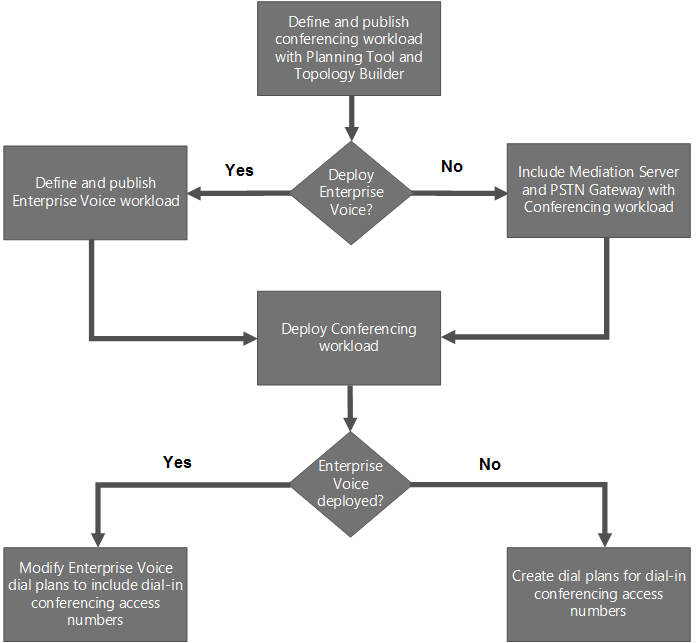

# Implantar conferências no Skype for Business Server

**Resumo:** Leia este tópico para saber como implantar a conferência no Skype for Business Server.

Há quatro tipos de conferências disponíveis no Skype for Business Server: webconferência, conferência de áudio e vídeo (A/V), conferência discada e conferência por mensagem instantânea (IM). Você pode optar por habilitar todos os tipos de conferência ou usar apenas um tipo, dependendo de suas necessidades.

Quando você implanta o Skype for Business Server, os recursos de conferência por IM são implantados automaticamente. Quando você cria e publica uma nova topologia usando o Construtor de Topologias, especifica se a web, A/V e conferência discada devem ser implantadas, conforme descrito nas listas de verificação a seguir:

- [Lista de verificação de implantação para webconferência e conferência de áudio/vídeo](deploy-conferencing.md#BKMK_ChecklistWebConferencing)

- [Fluxograma de implantação e lista de verificação para conferência discda](deploy-conferencing.md#BKMK_DialinConferencing)

Antes de implantar a conferência, leia os seguintes tópicos de planejamento:

- [Planejar a conferência no Skype for Business Server](../../plan-your-deployment/conferencing/conferencing.md)

- [Requisitos de hardware e software para conferência no Skype for Business Server](../../plan-your-deployment/conferencing/hardware-and-software-requirements.md)

- [Planejar sua topologia de conferência para o Skype for Business Server](../../plan-your-deployment/conferencing/conferencing-topology.md)

- [Planejar a conferência discada no Skype for Business Server](../../plan-your-deployment/conferencing/dial-in-conferencing.md)

- [Planejar grandes reuniões no Skype for Business Server](../../plan-your-deployment/conferencing/large-meetings.md)

## Lista de verificação de implantação para webconferência e conferência de áudio/vídeo

A tabela a seguir fornece uma visão geral das etapas necessárias para implantar a webconferência e a conferência de áudio/vídeo em uma topologia existente. Links para o planejamento associado e documentação de procedimentos estão incluídos.

|**Fase**|**Etapas**|**Associações a grupos e funções**|**Documentação**|
|:-----|:-----|:-----|:-----|
|**Instalar hardware e software necessários**   |A conferência é realizada em Servidores Front-End de um pool de Front-End e servidores Standard Edition. Consulte os requisitos de servidor e de ambiente para Servidores Front-End.    Se você estiver habilitando a webconferência, será necessário garantir que o Skype for Business Server possa se comunicar com o Servidor do Office Web Apps, que é usado para lidar com o compartilhamento e a renderização de apresentações do PowerPoint.    Para webconferência, você também precisa especificar um compartilhamento de arquivos a ser usado como o armazenamento de arquivos.    Você deseja permitir que usuários externos com clientes do Skype for Business participem de conferências? Em caso afirmativos, você precisa implantar Servidores de Borda.    |Usuário do domínio que é membro do grupo local de Administradores    | [Requisitos de servidor para o Skype for Business Server 2019](../../../SfBServer2019/plan/system-requirements.md)   [Requisitos de servidor para o Skype for Business Server 2015](../../plan-your-deployment/requirements-for-your-environment/server-requirements.md)   [Requisitos ambientais do Skype for Business Server 2015](../../plan-your-deployment/requirements-for-your-environment/environmental-requirements.md)   [Requisitos de hardware e software para conferência no Skype for Business Server](../../plan-your-deployment/conferencing/hardware-and-software-requirements.md)   [Configurar a integração com o Servidor do Office Web Apps no Skype for Business Server](office-web-app-server.md)   [Criar um compartilhamento de arquivos no Skype for Business Server](../../deploy/install/create-a-file-share.md)   [Planejar implantações do Servidor de Borda no Skype for Business Server 2015](../../plan-your-deployment/edge-server-deployments/edge-server-deployments.md)   [Implantar o Servidor de Borda no Skype for Business Server 2015](../../deploy/deploy-edge-server/deploy-edge-server.md)   |
|**Crie a topologia interna apropriada para dar suporte a conferências**   |Você precisa executar o Construtor de Topologias para adicionar conferência à topologia e publicar a topologia.    |Para definir a topologia, uma conta que é membro do grupo local de Usuários    Para publicar a topologia, uma conta que seja membro do grupo Admins. do Domínio e do grupo RTCUniversalServerAdmins e que tenha permissões de controle total (leitura/gravação/modificação) no compartilhamento de arquivos a ser usado para o armazenamento de arquivos do Skype for Business Server (para que o Construtor de Topologias possa configurar os DACLs necessários)    |[Criar e publicar nova topologia no Skype for Business Server](../../deploy/install/create-and-publish-new-topology.md)   |
|**Definir políticas de conferência e definições de configuração**   |Use o Painel de Controle do Skype for Business Server ou o Shell de Gerenciamento do Skype for Business Server para definir as políticas de conferência e as definições de configuração.    |Grupo RTCUniversalServerAdmins (somente Windows PowerShell) ou atribua usuários à função CSAdministrator    |[Gerenciar políticas de conferência no Skype for Business Server](../../manage/conferencing/conferencing-policies.md)   [Gerenciar definições de configuração de reunião no Skype for Business Server](../../manage/conferencing/meeting-configuration-settings.md)   [New-CsConferencingPolicy](https://docs.microsoft.com/powershell/module/skype/new-csconferencingpolicy?view=skype-ps)   [Set-CsConferencingPolicy](https://docs.microsoft.com/powershell/module/skype/set-csconferencingpolicy?view=skype-ps)   [New-CsConferencingConfiguration](https://docs.microsoft.com/powershell/module/skype/new-csconferencingconfiguration?view=skype-ps)   [Set-CsConferencingConfiguration](https://docs.microsoft.com/powershell/module/skype/set-csconferencingconfiguration?view=skype-ps)   [New-CsMeetingConfiguration](https://docs.microsoft.com/powershell/module/skype/new-csmeetingconfiguration?view=skype-ps)   [Set-CsMeetingConfiguration](https://docs.microsoft.com/powershell/module/skype/set-csmeetingconfiguration?view=skype-ps)   |

## Fluxograma de implantação e lista de verificação para conferência discda

 A conferência discda permite que os usuários disquem da PSTN (rede telefônica pública comutado) para participar de uma conferência de áudio/vídeo.

Alguns dos componentes necessários para conferência discada também são usados para o Enterprise Voice. Por exemplo, se você estiver implantando o Enterprise Voice, também deverá implantar um Servidor de Mediação e um gateway PSTN-- componentes que também são necessários para conferência discada. Como implantar a conferência discada, portanto, depende se você também está implantando uma solução Enterprise Voice.

O fluxograma de conferência discada mostra as etapas que você deve seguir, dependendo se você também está implantando uma solução Enterprise Voice. A tabela após o fluxograma fornece uma visão geral das etapas necessárias e recomendadas para implantar a conferência discada. Links para o planejamento associado e documentação de procedimentos também estão incluídos. Para obter mais informações sobre como planejar uma solução Enterprise Voice completa, consulte Planejar sua solução [Enterprise Voice no Skype for Business Server.](../../plan-your-deployment/enterprise-voice-solution/enterprise-voice-solution.md)

**Fluxograma conferência discado**

**Lista de verificação de implantação de conferência discado**

|**Fase**|**Etapas**|**Funções e associação de grupo**|**Documentação**|
|:-----|:-----|:-----|:-----|
|**Instalar hardware e software necessários**   | A conferência é realizada em Servidores Front-End de um pool de Front-End e servidores Standard Edition. Consulte os requisitos de servidor e de ambiente para Servidores Front-End.    Você precisa garantir que o seguinte seja instalado antes de configurar a conferência discada:    Servidor de Mediação    Gateway PSTN    UCAS (Unified Communications Application Service) (chamado de Serviço de Aplicativo)    Aplicativo Atendedor de Conferência    Aplicativo Comunicado de Conferência   |Usuário do domínio que é membro do grupo local de Administradores    |[Requisitos de servidor para o Skype for Business Server 2015](../../plan-your-deployment/requirements-for-your-environment/server-requirements.md)   [Requisitos ambientais do Skype for Business Server 2015](../../plan-your-deployment/requirements-for-your-environment/environmental-requirements.md)   [Requisitos de hardware e software para conferência no Skype for Business Server](../../plan-your-deployment/conferencing/hardware-and-software-requirements.md)   [Planejar a conferência discada no Skype for Business Server](../../plan-your-deployment/conferencing/dial-in-conferencing.md)   [Componente do Servidor de Mediação no Skype for Business Server](../../plan-your-deployment/enterprise-voice-solution/mediation-server.md)   [Implantar um Servidor de Mediação no Construtor de Topologias no Skype for Business Server](../../deploy/deploy-enterprise-voice/deploy-a-mediation-server.md)   [Definir um gateway no Construtor de Topologias no Skype for Business Server](../../deploy/deploy-enterprise-voice/define-a-gateway.md)   |
|**Crie uma topologia que inclua a carga de trabalho de Conferência, incluindo um Servidor de Mediação e gateway PSTN, e implante o pool de Front-End ou o servidor Standard Edition**   |1. Execute o Construtor de Topologias para configurar sua topologia. Enquanto a configuração da topologia é executada, selecione a opção de conferência discada.    2. Publique a topologia e implante o pool de front-end ou servidor Standard Edition.    3. Se necessário, crie um Servidor de Mediação autônomo e associá-lo a um gateway PSTN.    **Observação:** Esta etapa é necessária somente se você não implantar o Enterprise Voice e não colocar o Servidor de Mediação com o Servidor de Front End Enterprise Edition ou o servidor Standard Edition. Se você implantar o Enterprise Voice, instale e configure os Servidores de Mediação e gateways PSTN como parte da implantação do Enterprise Voice. Se você colocar o Servidor de Mediação, instale e configure o Servidor de Mediação como parte da implantação do pool de Front-End ou do servidor Standard Edition.   |Admins. do Domínio    RTCUniversalServerAdmins    Administrador    |[Criar e publicar nova topologia no Skype for Business Server](../../deploy/install/create-and-publish-new-topology.md)   [Implantar um Servidor de Mediação no Construtor de Topologias no Skype for Business Server](../../deploy/deploy-enterprise-voice/deploy-a-mediation-server.md)   [Definir um gateway no Construtor de Topologias no Skype for Business Server](../../deploy/deploy-enterprise-voice/define-a-gateway.md)   |
|**Configure planos de discagem**   |Um plano de discagem é um conjunto de regras de normalização de número de telefone que traduzem números discados de um local específico para um padrão de formato único (E.164), para fins de autorização do telefone e roteamento de chamadas. O mesmo número de telefone discado a partir de locais diferentes pode, com base nos respectivos planos de discagem, resolver para diferentes números E.164, conforme o que for mais adequado para cada local. Se você implantar o Enterprise Voice, configurará planos de discagem como parte dessa implantação e precisará garantir que os planos de discagem também acomodem a conferência discda. Se você não implantar o Enterprise Voice, precisará configurar planos de discagem para conferência discado.    Use o Painel de Controle do Skype for Business Server ou o Shell de Gerenciamento do Skype for Business Server para configurar planos de discagem da seguinte forma:    1. Crie um ou mais planos de discagem para rotear números de telefone de acesso de discagem.    2. Atribua um plano de discagem padrão a cada pool. Defina a **Região da conferência discada** à localização geográfica à qual o plano de discagem se aplica. A região associa o plano de discagem aos números de acesso discado.   |RTCUniversalServerAdmins    CsVoiceAdministrator    CsServerAdministrator    CsAdministrator    |[Configurar conferência discada no Skype for Business Server](dial-in-conferencing.md)   [Criar ou modificar um plano de discagem no Skype for Business Server](../../deploy/deploy-enterprise-voice/dial-plans.md)   [New-CsDialPlan](https://docs.microsoft.com/powershell/module/skype/new-csdialplan?view=skype-ps)   |
|**Certifique-se de que os planos de discagem sejam regiões atribuídas**   |Execute os cmdlets **Get-CsDialPlan** e **Set-CsDialPlan** para garantir que todos os planos de discagem tenham uma região atribuída.   |RTCUniversalServerAdmins    CsVoiceAdministrator    CsServerAdministrator    CsAdministrator    |[Configurar conferência discada no Skype for Business Server](dial-in-conferencing.md)   [Criar ou modificar um plano de discagem no Skype for Business Server](../../deploy/deploy-enterprise-voice/dial-plans.md)   [Get-CsDialPlan](https://docs.microsoft.com/powershell/module/skype/get-csdialplan?view=skype-ps)   [Set-CsDialPlan](https://docs.microsoft.com/powershell/module/skype/set-csdialplan?view=skype-ps)   |
|**Configure a política de conferência para suportar conferências discadas.**   | Use o Painel de Controle do Skype for Business Server ou o Shell de Gerenciamento do Skype for Business Server para definir as **configurações de** Política de Conferência. Especifique se:    A discagem de conferência PSTN está habilitada.    Usuários podem convidar participantes anônimos.    Usuários não autenticados podem participar de uma conferência usando discagem de saída. Com a discagem de saída, o servidor de conferência faz uma chamada para o usuário e o usuário atende o telefone para entrar na conferência.  |RTCUniversalServerAdmins    CsServerAdministrator    CsAdministrator    |[Gerenciar políticas de conferência no Skype for Business Server](../../manage/conferencing/conferencing-policies.md)   [New-CsConferencingPolicy](https://docs.microsoft.com/powershell/module/skype/new-csconferencingpolicy?view=skype-ps)   [Set-CsConferencingPolicy](https://docs.microsoft.com/powershell/module/skype/set-csconferencingpolicy?view=skype-ps)   |
|**Configure números de acesso de discagem**   |Use o Painel de Controle do Skype for Business Server ou o Shell de Gerenciamento do Skype for Business Server para configurar números de acesso de discagem que os usuários chamam para discar para uma conferência e especifique as regiões que associam o número de acesso aos planos de discagem apropriados. Os três primeiros números de acesso para a região especificada pelo plano de discagem do organizador são incluídos no convite da conferência. Todos os números de acesso estão disponíveis na página Configurações de Conferência Discado.    **Observação:** Depois de criar números de acesso discado, você pode usar o cmdlet **Set-CsDialInConferencingAccessNumber** para modificar o nome de exibição dos objetos de contato do Active Directory para que os usuários possam identificar com mais facilidade o número de acesso correto.   |RTCUniversalServerAdmins    CsServerAdministrator    CsAdministrator    |[Criar ou modificar um plano de discagem no Skype for Business Server](../../deploy/deploy-enterprise-voice/dial-plans.md)   [Gerenciar números de acesso de conferência discada no Skype for Business Server](../../manage/conferencing/access-numbers.md)   [New-CsDialInConferencingAccessNumber](https://docs.microsoft.com/powershell/module/skype/new-csdialinconferencingaccessnumber?view=skype-ps)   [Set-CsDialInConferencingAccessNumber](https://docs.microsoft.com/powershell/module/skype/set-csdialinconferencingaccessnumber?view=skype-ps)   |
|**Atribuir um URI de linha a uma conta de usuário**   |Use o Painel de Controle do Skype for Business Server ou o Shell de Gerenciamento do Skype for Business Server para configurar o **URI** da Linha de Telefonia como um número de telefone normalizado exclusivo (por exemplo, tel:+14255550200).   |RTCUniversalServerAdmins    CsAdministrator    CsUserAdministrator    |[Atribuir um URI de linha a uma conta de usuário](dial-in-conferencing.md#BKMK_AssignaLineURI)   |
|**(Opcional) Verifique ou modifique os requisitos do número de identificação pessoal (PIN) do usuário.**   |Use o Painel de Controle do Skype for Business Server ou o Shell de Gerenciamento do Skype for Business Server para exibir ou modificar a Política **de PIN de Conferência.** Você pode especificar o comprimento mínimo do PIN, o número máximo de tentativas de logon, a expiração do PIN e se padrões comuns são permissíveis.    |RTCUniversalServerAdmins    CsServerAdministrator    CsAdministrator    |[Gerenciar políticas de PIN para conferência discada no Skype for Business Server](../../manage/conferencing/pin-policies.md)   [Get-CsPinPolicy](https://docs.microsoft.com/powershell/module/skype/get-cspinpolicy?view=skype-ps)   [Set-CsPinPolicy](https://docs.microsoft.com/powershell/module/skype/set-cspinpolicy?view=skype-ps)   |
|**(Opcional) Modifique o mapeamento de teclas dos comandos DTMF**   |Use o cmdlet **Set-CsDialinConferencingDtmfConfiguration** para modificar as teclas usadas para comandos DTMF (multifrequência de tom dual), que os participantes podem usar para controlar as configurações de conferência (como mudo e desativar o mudo ou bloquear e desbloquear).   |RTCUniversalServerAdmins    CsServerAdministrator    CsAdministrator    |[Gerenciar mapeamento de teclas para comandos DTMF no Skype for Business Server](../../manage/conferencing/key-mapping-for-dtmf-commands.md)   [Set-CsDialInConferencingDtmfConfiguration](https://docs.microsoft.com/powershell/module/skype/set-csdialinconferencingdtmfconfiguration?view=skype-ps)   |
|**(Opcional) Modifique o comportamento do anúncio de entrada e saída da conferência**   |Use o cmdlet **Set-CsDialinConferencingConfiguration** para alterar como os anúncios funcionam quando participantes entram e saem das conferências.   |RTCUniversalServerAdmins    CsServerAdministrator    CsAdministrator    |[Gerenciar comunicados de saída e ingressar em conferência no Skype for Business Server](../../manage/conferencing/join-and-leave-announcements.md)   [Set-CsDialInConferencingConfiguration](https://docs.microsoft.com/powershell/module/skype/set-csdialinconferencingconfiguration?view=skype-ps)   |
|**(Recomendado) Configurar diretórios de conferência**   |Use o cmdlet **New-CsConferenceDirectory** para criar um diretório de conferência para cada 999 usuários no pool.   |RTCUniversalServerAdmins    |[(Recomendado) Criar Diretórios de Conferência](https://technet.microsoft.com/library/787f4c94-1c96-468a-a74d-e06b7bd4b8a3.aspx)   [New-CsConferenceDirectory](https://docs.microsoft.com/powershell/module/skype/new-csconferencedirectory?view=skype-ps)   |
|**(Opcional) Verifique as configurações da conferência discada**   |Use o cmdlet **Get-CsDialinConferencingAccessNumber** para pesquisar planos de discagem que tenham uma região de conferência discada que não seja usada por qualquer número de acesso e números de acesso que não possuam região atribuída.   |RTCUniversalServerAdmins    CsServerAdministrator    CsAdministrator    CsViewOnlyAdministrator    CsHelpDesk    |[Configurar conferência discada no Skype for Business Server](dial-in-conferencing.md)   [Testar a conferência discada no Skype for Business Server](../../manage/conferencing/tests.md)   [Get-CsDialInConferencingAccessNumber](https://docs.microsoft.com/powershell/module/skype/get-csdialinconferencingaccessnumber?view=skype-ps)   |
|**(Opcional) Verifique a conferência discada**   |Use o cmdlet **Test-CsDialInConferencing** para testar se os números de acesso para o pool especificado estão funcionando corretamente.   |RTCUniversalServerAdmins    CsServerAdministrator    CsAdministrator    |[Testar a conferência discada no Skype for Business Server](../../manage/conferencing/tests.md)   [Test-CsDialInConferencing](https://docs.microsoft.com/powershell/module/skype/test-csdialinconferencing?view=skype-ps)   |
|**(Opcional) Receba os usuários em conferências discadas e defina o PIN inicial**   |Use o script **Set-CsPinSendCAWelcomeMail** para definir os PINs iniciais dos usuários e enviar um email de boas-vindas que contém o PIN inicial e um link para a página Configurações de Conferência Discado.   |RTCUniversalServerAdmins    |[Enviar um email de boas-vindas para usuários de discagem no Skype for Business Server](../../manage/conferencing/welcome-emails.md)   |

