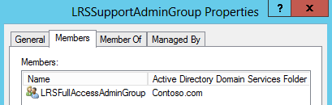

# <a name="deploy-srs-v1-administrative-web-portal-in-skype-for-business-server-2015"></a><span data-ttu-id="75df4-105">Implantar o Portal da Web Administrativo do SRS v1 no Skype for Business Server 2015</span><span class="sxs-lookup"><span data-stu-id="75df4-105">Deploy SRS v1 Administrative Web Portal in Skype for Business Server 2015</span></span>
 
<span data-ttu-id="75df4-106">O Skype para sistemas de sala Business Server 2015 Skype v1 (SRS v1, anteriormente conhecido como o sistema de sala do Lync) administrativas Portal da Web é um portal da web que as organizações podem usar para manter suas salas de conferência de sistemas de sala Skype.</span><span class="sxs-lookup"><span data-stu-id="75df4-106">The Skype for Business Server 2015 Skype Room Systems v1 (SRS v1, formerly known as Lync Room System) Administrative Web Portal is a web portal that organizations can use to maintain their Skype Room Systems conference rooms.</span></span> <span data-ttu-id="75df4-107">Os administradores podem usar o Portal da Web SRS v1 administrativas para monitorar a integridade do dispositivo, por exemplo por meio do monitoramento de dispositivos de áudio/vídeo.</span><span class="sxs-lookup"><span data-stu-id="75df4-107">Administrators can use the SRS v1 Administrative Web Portal to monitor device health, for example by monitoring audio/video devices.</span></span> <span data-ttu-id="75df4-108">Com esse portal, os administradores podem coletar remotamente informações de diagnóstico para monitorar a integridade da sala de conferência.</span><span class="sxs-lookup"><span data-stu-id="75df4-108">With this portal, administrators can remotely collect diagnostic information to monitor conference room health.</span></span>
  
<span data-ttu-id="75df4-109">Para usar esse recurso, o Portal da Web administrativo SRS v1 precisa ser implantado em cada Skype para Business Server servidor Front-End.</span><span class="sxs-lookup"><span data-stu-id="75df4-109">To use this feature, the SRS v1 Administrative Web Portal needs to be deployed on every Skype for Business Server Front End Server.</span></span> <span data-ttu-id="75df4-110">Este guia fornece instruções para os administradores sobre como instalar e configurar o Portal da Web Administrativo do SRS.</span><span class="sxs-lookup"><span data-stu-id="75df4-110">This guide provides instructions for administrators on how to install and configure the SRS Administrative Web Portal.</span></span> <span data-ttu-id="75df4-111">Ele foi projetado para administradores que tem conhecimento do Skype para administração de servidor de negócios, e que tenha direitos de usuário de administrador para modificar o Skype para a topologia de servidor de negócios.</span><span class="sxs-lookup"><span data-stu-id="75df4-111">It is intended for administrators who have knowledge of Skype for Business Server administration, and who have administrator user rights to modify the Skype for Business Server topology.</span></span>
  
<span data-ttu-id="75df4-112">Após o v1 SRS que administrativas Portal da Web é implantado no servidor, os administradores podem verificar os dispositivos do status SRS v1 por logon ao site de seus próprios computadores ou laptops.</span><span class="sxs-lookup"><span data-stu-id="75df4-112">After the SRS v1 Administrative Web Portal is deployed on the server, administrators can check the status SRS v1 devices by logging on to the site from their own computers or laptops.</span></span> 
  
> [!IMPORTANT]
> <span data-ttu-id="75df4-113">Baixe o [Microsoft Skype sala v1 de sistemas e Portal da Web administrativo para Skype para Business Server 2015](https://www.microsoft.com/en-us/download/details.aspx?id=46906).</span><span class="sxs-lookup"><span data-stu-id="75df4-113">Download the [Microsoft Skype Room Systems v1 Administrative Web Portal for Skype for Business Server 2015](https://www.microsoft.com/en-us/download/details.aspx?id=46906).</span></span> 
  
<span data-ttu-id="75df4-114">Neste tópico:</span><span class="sxs-lookup"><span data-stu-id="75df4-114">In this topic:</span></span>
  
- [<span data-ttu-id="75df4-115">Configurar seu ambiente para o Portal da Web Administrativo do SRS v1</span><span class="sxs-lookup"><span data-stu-id="75df4-115">Configure your environment for the SRS v1 Administrative Web Portal</span></span>](room-system-v1-administrative-web-portal.md#Config_Env)
    
- [<span data-ttu-id="75df4-116">Instalar o Portal da Web Administrativo do SRS v1</span><span class="sxs-lookup"><span data-stu-id="75df4-116">Install the SRS v1 Administrative Web Portal</span></span>](room-system-v1-administrative-web-portal.md#Install_SRS)
    
- [<span data-ttu-id="75df4-117">Usar o Portal da Web Administrativo do SRS</span><span class="sxs-lookup"><span data-stu-id="75df4-117">Use the SRS Administrative Web Portal</span></span>](room-system-v1-administrative-web-portal.md#Use_Portal)
    
## <a name="configure-your-environment-for-the-srs-v1-administrative-web-portal"></a><span data-ttu-id="75df4-118">Configurar seu ambiente para o Portal da Web Administrativo do SRS v1</span><span class="sxs-lookup"><span data-stu-id="75df4-118">Configure your environment for the SRS v1 Administrative Web Portal</span></span>
<span data-ttu-id="75df4-119"><a name="Config_Env"> </a></span><span class="sxs-lookup"><span data-stu-id="75df4-119"></span></span>

<span data-ttu-id="75df4-120">Para usar o Portal da Web Administrativo do SRS v1, será necessário instalar ou configurar os pré-requisitos a seguir.</span><span class="sxs-lookup"><span data-stu-id="75df4-120">To use the SRS v1 Administrative Web Portal, you will need to install or configure the following prerequisites.</span></span>
  
> [!IMPORTANT]
> <span data-ttu-id="75df4-p104">Se o servidor estiver configurado com a autenticação Kerberos e NTLM e o SRS estiver em execução em um computador que não tenha ingressado no domínio, haverá falha na autenticação Kerberos e o usuário não verá o status do SRS no portal administrativo. Para resolver esse problema, configure o servidor com autenticação NTLM ou com autenticação NTLM e TLS-DSK (sem Kerberos), ou ingresse o computador com SRS no domínio.</span><span class="sxs-lookup"><span data-stu-id="75df4-p104">If the server is configured with both Kerberos and NTLM authentication, and SRS is running on a computer that is not joined to the domain, Kerberos authentication will fail and the user will not see the status of SRS in the administrative portal. To resolve this issue, configure the server with NTLM authentication or both NTLM and TLS-DSK authentication (without Kerberos), or join the SRS computer to the domain.</span></span> 
  
1. <span data-ttu-id="75df4-123">Instale o Skype para atualizações cumulativas do Business Server no Skype para a topologia de servidor de negócios.</span><span class="sxs-lookup"><span data-stu-id="75df4-123">Install Skype for Business Server Cumulative Updates in the Skype for Business Server topology.</span></span> 
    
    <span data-ttu-id="75df4-124">Para obter a atualização ou consulte o que está incluído com ele, consulte [atualizações para Skype para Business Server 2015](https://support.microsoft.com/en-us/help/3061064/updates-for-skype-for-business-server-2015).</span><span class="sxs-lookup"><span data-stu-id="75df4-124">To get the update or see what's included with it, see [Updates for Skype for Business Server 2015](https://support.microsoft.com/en-us/help/3061064/updates-for-skype-for-business-server-2015).</span></span>
    
2. <span data-ttu-id="75df4-125">Crie um usuário do Active Directory habilitado para SIP.</span><span class="sxs-lookup"><span data-stu-id="75df4-125">Create a SIP-enabled Active Directory user.</span></span>
    
    <span data-ttu-id="75df4-126">O Portal da Web administrativo SRS v1 usa essas credenciais para consultar informações do Skype para Business Server.</span><span class="sxs-lookup"><span data-stu-id="75df4-126">The SRS v1 Administrative Web Portal uses these credentials to query information from Skype for Business Server.</span></span> <span data-ttu-id="75df4-127">O nome de usuário nos exemplos fornecidos é LRSApp.</span><span class="sxs-lookup"><span data-stu-id="75df4-127">The username in the examples given is LRSApp.</span></span>
    
3. <span data-ttu-id="75df4-128">Crie um grupo de segurança do Active Directory com o nome LRSSupportAdminGroup.</span><span class="sxs-lookup"><span data-stu-id="75df4-128">Create an Active Directory security group with name LRSSupportAdminGroup.</span></span>
    
    <span data-ttu-id="75df4-p106">Crie o grupo com Escopo do Grupo como Global e Tipo de Grupo como Segurança. Os usuários habilitados para SIP que forem adicionados a este grupo serão autorizados a ver a lista de salas e a executar determinados comandos, como coletar logs.</span><span class="sxs-lookup"><span data-stu-id="75df4-p106">Create the group with Group Scope as Global and Group Type as Security. SIP enabled users who are added to this group will be authorized to see the list of rooms and execute certain commands, such as collecting logs.</span></span>
    
4. <span data-ttu-id="75df4-131">Crie um grupo de segurança do Active Directory com o nome LRSFullAccessAdminGroup. </span><span class="sxs-lookup"><span data-stu-id="75df4-131">Create an Active Directory security group with name LRSFullAccessAdminGroup.</span></span> 
    
    <span data-ttu-id="75df4-p107">Crie o grupo com Escopo do Grupo como Global e Tipo de Grupo como Segurança. Os usuários habilitados para SIP que forem adicionados a esse grupo serão autorizados a usar toda a funcionalidade do portal de administração em uma única sala do Skype. Para incluir suporte para o gerenciamento em massa de salas do Skype, consulte a etapa 5. </span><span class="sxs-lookup"><span data-stu-id="75df4-p107">Create the group with Group Scope as Global and Group Type as Security.SIP enabled users who are added to this group are authorized to use all admin portal functionality on a single Skype room. To include support for bulk management of Skype rooms, refer to step 5.</span></span> 
    
     
  
5. <span data-ttu-id="75df4-135">Crie um grupo de segurança do Active Directory com o nome LRSPowerUserAdminsGroup.</span><span class="sxs-lookup"><span data-stu-id="75df4-135">Create an Active Directory security group with name LRSPowerUserAdminsGroup.</span></span> 
    
    <span data-ttu-id="75df4-136">Crie o grupo com Escopo do Grupo como Global e Tipo de Grupo como Segurança.</span><span class="sxs-lookup"><span data-stu-id="75df4-136">Create the group with Group Scope as Global and Group Type as Security.</span></span> <span data-ttu-id="75df4-137">Os usuários habilitados para SIP adicionados a este grupo estão autorizados a usar todas as funcionalidades de portal de administração incluindo gerenciamento de massa do Skype para salas de negócios.</span><span class="sxs-lookup"><span data-stu-id="75df4-137">SIP enabled users who are added to this group are authorized to use all admin portal functionality including bulk management of Skype for Business rooms.</span></span> 
    
6. <span data-ttu-id="75df4-138">Adicione LRSFullAccessAdminGroup como membro do LRSSupportAdminGroup.</span><span class="sxs-lookup"><span data-stu-id="75df4-138">Add LRSFullAccessAdminGroup as a member of LRSSupportAdminGroup.</span></span>
    
     
  
7. <span data-ttu-id="75df4-p109">Crie um usuário do Active Directory habilitado para SIP com o nome LRSSupport. Adicione-o a LRSSupportAdminGroup.</span><span class="sxs-lookup"><span data-stu-id="75df4-p109">Create a SIP enabled Active Directory user with name LRSSupport. Add this user to LRSSupportAdminGroup.</span></span>
    
     
  
8. <span data-ttu-id="75df4-143">Instale o [ASP.NET MVC 4 para o Visual Studio 2010 SP1 e Visual Web Developer 2010 SP1](http://go.microsoft.com/fwlink/p/?LinkId=323967).</span><span class="sxs-lookup"><span data-stu-id="75df4-143">Install [ASP.NET MVC 4 for Visual Studio 2010 SP1 and Visual Web Developer 2010 SP1](http://go.microsoft.com/fwlink/p/?LinkId=323967).</span></span>
    
## <a name="install-the-srs-v1-administrative-web-portal"></a><span data-ttu-id="75df4-144">Instalar o Portal da Web Administrativo do SRS v1</span><span class="sxs-lookup"><span data-stu-id="75df4-144">Install the SRS v1 Administrative Web Portal</span></span>
<span data-ttu-id="75df4-145"><a name="Install_SRS"> </a></span><span class="sxs-lookup"><span data-stu-id="75df4-145"></span></span>

<span data-ttu-id="75df4-146">Baixe o [Microsoft Skype sala v1 de sistemas e Portal da Web administrativo para Skype para Business Server 2015](https://www.microsoft.com/en-us/download/details.aspx?id=46906).</span><span class="sxs-lookup"><span data-stu-id="75df4-146">Download the [Microsoft Skype Room Systems v1 Administrative Web Portal for Skype for Business Server 2015](https://www.microsoft.com/en-us/download/details.aspx?id=46906).</span></span> 
  
<span data-ttu-id="75df4-147">Para instalar o Portal da Web Administrativo do SRS v1, use as etapas a seguir.</span><span class="sxs-lookup"><span data-stu-id="75df4-147">To install the SRS v1 Administrative Web Portal, use the following steps.</span></span>
  
1. <span data-ttu-id="75df4-148">Configure a porta de aplicativos confiáveis executando o seguinte cmdlet no Skype do Shell de gerenciamento do servidor de negócios:</span><span class="sxs-lookup"><span data-stu-id="75df4-148">Configure the Trusted Application Port by running the following cmdlet in Skype for Business Server Management Shell:</span></span>
    
   ```
   Set-CsWebServer -Identity POOLFQDN -MeetingRoomAdminPortalInternalListeningPort 4456 -MeetingRoomAdminPortalExternalListeningPort 4457
   ```

2. <span data-ttu-id="75df4-149">Para instalar o Portal da Sala de Reunião, baixe o arquivo **MeetingRoomPortalInstaller.msi** e execute-o como administrador.</span><span class="sxs-lookup"><span data-stu-id="75df4-149">To install the Meeting Room Portal, download **MeetingRoomPortalInstaller.msi** and then run it as an administrator.</span></span>
    
3. <span data-ttu-id="75df4-150">Abra o arquivo Web.config no seguinte local:</span><span class="sxs-lookup"><span data-stu-id="75df4-150">Open the Web.config file from the following location:</span></span>
    
    <span data-ttu-id="75df4-151">%Arquivos de Programas%\Skype for Business Server 2015\Web Components\Meeting Room Portal\Int\Handler\\</span><span class="sxs-lookup"><span data-stu-id="75df4-151">%Program Files%\Skype for Business Server 2015\Web Components\Meeting Room Portal\Int\Handler\\</span></span>
    
4. <span data-ttu-id="75df4-152">No arquivo Web. config, altere o PortalUserName para o nome de usuário criado na etapa 2, sob a seção "[configurar seu ambiente para o Portal da Web administrativo SRS v1](room-system-v1-administrative-web-portal.md#Config_Env)" (o nome recomendado na etapa é LRSApp):</span><span class="sxs-lookup"><span data-stu-id="75df4-152">In the Web.Config file, change the PortalUserName to the username created in Step 2 under the section "[Configure your environment for the SRS v1 Administrative Web Portal](room-system-v1-administrative-web-portal.md#Config_Env)" (the recommended name in the step is LRSApp):</span></span> 
    
    ```
    <add key="PortalUserName" value="sip:LRSApp@domain.com" />
    ```

5. <span data-ttu-id="75df4-p110">Como o Portal de Administração do SRS v1 é um aplicativo confiável, você não precisa fornecer a senha na configuração do portal. Se o usuário estiver usando um registrador diferente do registrador local, você precisará especificar o registrador para ele adicionando a seguinte linha no arquivo Web.Config: </span><span class="sxs-lookup"><span data-stu-id="75df4-p110">Because the SRS v1 Admin Portal is a trusted application, you do not need to provide the password in the portal configuration. If this user is using a different registrar than local registrar, you need to specify the registrar for it by adding the following line in the Web.Config file:</span></span> 
    
   ```
   <add key="PortalUserRegistrarFQDN" value="pool-xxxx.domain.com" />
   ```

6. <span data-ttu-id="75df4-155">Se a porta usada for diferente de 5061, adicione a seguinte linha no arquivo Web.Config: </span><span class="sxs-lookup"><span data-stu-id="75df4-155">If the port used is other than 5061, add the following line in the Web.Config file:</span></span> 
    
   ```
   <add key="PortalUserRegistrarPort" value="5061" />
   ```

### <a name="verify-installation-of-the-srs-administrative-web-portal"></a><span data-ttu-id="75df4-156">Verificar a instalação do Portal da Web Administrativo do SRS</span><span class="sxs-lookup"><span data-stu-id="75df4-156">Verify Installation of the SRS Administrative Web Portal</span></span>

<span data-ttu-id="75df4-157">Para verificar a instalação do Portal da Web Administrativo do SRS v1, faça o seguinte:</span><span class="sxs-lookup"><span data-stu-id="75df4-157">To verify installation of the SRS v1 Administrative Web Portal, do the following:</span></span>
  
1. <span data-ttu-id="75df4-158">Em um servidor front-end, vá para a seguinte URL:</span><span class="sxs-lookup"><span data-stu-id="75df4-158">On a Front End server, browse to the following URL:</span></span>
    
    <span data-ttu-id="75df4-159">https://\<servidor fe\>/lrs</span><span class="sxs-lookup"><span data-stu-id="75df4-159">https://\<fe-server\>/lrs</span></span>
    
    <span data-ttu-id="75df4-160">Você não deverá ver nenhum erro, como mostrado na imagem a seguir:</span><span class="sxs-lookup"><span data-stu-id="75df4-160">You should not see any errors, as shown in the following image:</span></span>
    
     
  
2. <span data-ttu-id="75df4-162">Se não vir nenhum erro, tente acessar a seguinte URL a partir de qualquer outro computador na topologia:</span><span class="sxs-lookup"><span data-stu-id="75df4-162">If you do not see any errors, try accessing the following URL from any other computer in the topology:</span></span>
    
    <span data-ttu-id="75df4-163">https://\<servidor fe\>/lrs</span><span class="sxs-lookup"><span data-stu-id="75df4-163">https://\<fe-server\>/lrs</span></span>
    
    <span data-ttu-id="75df4-164">Para acessar a página, você precisará adicionar os registros DNS conforme descrito em "[necessário registros DNS para o cliente na entrada automática](https://go.microsoft.com/fwlink/p/?LinkId=318056)."</span><span class="sxs-lookup"><span data-stu-id="75df4-164">To access the page, you will need to add the DNS records as described in "[Required DNS Records for Automatic Client Sign-In](https://go.microsoft.com/fwlink/p/?LinkId=318056)."</span></span>
    
## <a name="use-the-srs-administrative-web-portal"></a><span data-ttu-id="75df4-165">Usar o Portal da Web Administrativo do SRS</span><span class="sxs-lookup"><span data-stu-id="75df4-165">Use the SRS Administrative Web Portal</span></span>
<span data-ttu-id="75df4-166"><a name="Use_Portal"> </a></span><span class="sxs-lookup"><span data-stu-id="75df4-166"></span></span>

<span data-ttu-id="75df4-167">Após implantar o SRS no servidor, você poderá verificar o status de todas as salas do SRS entrando no Portal da Web Administrativo do SRS v1 em um navegador.</span><span class="sxs-lookup"><span data-stu-id="75df4-167">After you deploy SRS on the server, you can check the status of all SRS rooms by signing into the SRS v1 Administrative Web Portal from a browser.</span></span>
  
### <a name="sign-in"></a><span data-ttu-id="75df4-168">Entrar</span><span class="sxs-lookup"><span data-stu-id="75df4-168">Sign in</span></span>

1. <span data-ttu-id="75df4-169">Navegue até a seguinte URL:</span><span class="sxs-lookup"><span data-stu-id="75df4-169">Browse to the following URL:</span></span>
    
    <span data-ttu-id="75df4-170">https://\<servidor fe\>/lrs</span><span class="sxs-lookup"><span data-stu-id="75df4-170">https://\<fe-server\>/lrs</span></span>
    
2. <span data-ttu-id="75df4-171">Insira as credenciais da conta LRSSupport ou de uma conta que tenha sido adicionada ao grupo de segurança LRSSupportAdminGroup.</span><span class="sxs-lookup"><span data-stu-id="75df4-171">Enter the credentials for the LRSSupport account or an account that was added to the LRSSupportAdminGroup security group.</span></span>
    

  
### <a name="srs-administrative-web-portal-summary-page"></a><span data-ttu-id="75df4-173">Página de resumo do Portal da Web Administrativo do SRS</span><span class="sxs-lookup"><span data-stu-id="75df4-173">SRS Administrative Web Portal Summary Page</span></span>

<span data-ttu-id="75df4-174">A página de resumo fornece as seguintes informações sobre todas as salas do SRS implantadas no servidor:</span><span class="sxs-lookup"><span data-stu-id="75df4-174">The summary page provides the following information for all of the SRS rooms deployed on the server:</span></span>
  
- <span data-ttu-id="75df4-175">**Marca** O nome personalizado que o administrador concede à sala.</span><span class="sxs-lookup"><span data-stu-id="75df4-175">**Tag** The custom name that the administrator gives to the room.</span></span> <span data-ttu-id="75df4-176">A Marca pode ser definida no portal quando você clica no nome da sala.</span><span class="sxs-lookup"><span data-stu-id="75df4-176">The Tag can be set in the portal by clicking on the room name.</span></span>
    
- <span data-ttu-id="75df4-177">**Integridade** O status de integridade da sala, que é derivado do status de integridade agregado da sala, que é mostrado na seção de integridade da página Configurações de sala.</span><span class="sxs-lookup"><span data-stu-id="75df4-177">**Health** The health status of the room, which is derived from the Aggregate Health status of the room, which is shown under the Health section of the Room Settings page.</span></span>
    
- <span data-ttu-id="75df4-178">**Próxima reunião** A data e hora que a próxima reunião foi agendada.</span><span class="sxs-lookup"><span data-stu-id="75df4-178">**Next Meeting** The date and time the next meeting is scheduled.</span></span>
    
- <span data-ttu-id="75df4-179">**Modelo de versão, fabricante, SRS** Esses valores são predefinidos no SRS.</span><span class="sxs-lookup"><span data-stu-id="75df4-179">**SRS Version, Manufacturer, Model** These values are preset in SRS.</span></span> <span data-ttu-id="75df4-180">Dependendo do fabricante, esses campos podem ser deixados em branco.</span><span class="sxs-lookup"><span data-stu-id="75df4-180">Depending on the manufacturer, these fields might be left blank.</span></span>
    
- <span data-ttu-id="75df4-181">**Última atualização** Exibe a última vez em que a página da web foi atualizada.</span><span class="sxs-lookup"><span data-stu-id="75df4-181">**Last Refresh** Displays the last time the web page was refreshed.</span></span>
    

  
> [!NOTE]
> <span data-ttu-id="75df4-183">Você verá o menu de gerenciamento em massa apenas se você fizer parte do grupo de segurança LRSPowerUserAdminsGroup.</span><span class="sxs-lookup"><span data-stu-id="75df4-183">You will only see the Bulk Management menu if you are part of the LRSPowerUserAdminsGroup security group.</span></span> 
  
### <a name="srs-room-information"></a><span data-ttu-id="75df4-184">Informações da Sala do SRS</span><span class="sxs-lookup"><span data-stu-id="75df4-184">SRS Room Information</span></span>

<span data-ttu-id="75df4-p113">A seção Informações da Sala do portal permite que você veja e configure salas do SRS individuais. Ela contém quatro seções: Configurações, Detalhes, Registro em Log e Integridade.</span><span class="sxs-lookup"><span data-stu-id="75df4-p113">The Room Info section of the portal allows you to view and configure individual SRS rooms. It contains four sections: Settings, Details, Logging, and Health.</span></span>
  
#### <a name="settings"></a><span data-ttu-id="75df4-187">Configurações</span><span class="sxs-lookup"><span data-stu-id="75df4-187">Settings</span></span>

<span data-ttu-id="75df4-p114">Na seção Configurações, você pode definir a senha, a marca da sala e os níveis de volume padrão da sala. Se você definir essas configurações, as alterações serão replicadas somente depois que o console do SRS for reiniciado. Você só verá as configurações de Atualizações do Sistema para dispositivos do SRS que estiverem usando a versão 15.12 e posteriores.</span><span class="sxs-lookup"><span data-stu-id="75df4-p114">In the Settings section, you can set the password, room tag, and default volume levels for the room. If you configure these settings, the changes are replicated only after you restart the SRS console. You will only see System Updates settings for SRS devices using release 15.12 and later.</span></span>
  

  
#### <a name="details"></a><span data-ttu-id="75df4-192">Detalhes</span><span class="sxs-lookup"><span data-stu-id="75df4-192">Details</span></span>

<span data-ttu-id="75df4-193">Seção detalhes do fornece um resumo de somente leitura das configurações da sala SRS, incluindo: a hora da última atualização; próxima reunião; últimas atualizações, manutenção e calibragem; configurações de campainha; microfone e alto-falante do padrão versão; URI DO SIP; número de telas e detalhes sobre cada tela; status e a atividade.</span><span class="sxs-lookup"><span data-stu-id="75df4-193">The Details section provides a read-only summary of the SRS room's settings, including: the time of last refresh; next meeting; last updates, maintenance and calibration; default speaker, mic, and ringer settings; version; SIP URI; number of screens and details about each screen; status, and activity.</span></span>
  

  
#### <a name="troubleshooting"></a><span data-ttu-id="75df4-195">Solução de Problemas</span><span class="sxs-lookup"><span data-stu-id="75df4-195">Troubleshooting</span></span>

<span data-ttu-id="75df4-p115">A seção Solução de Problemas pode ser usada para coletar logs remotamente e salvá-los em um local especificado. Você também pode reiniciar o console do SRS (interface do usuário do SRS) ou reiniciar o sistema inteiro. Para coletar logs, forneça um caminho de pasta no formato especificado e verifique se a pasta tem permissões de gravação concedidas à conta do computador do SRS. Se o tamanho do log for muito grande, a coleta de logs poderá levar até cinco minutos para ser concluída. Atualize a página para ver o status mais recente.</span><span class="sxs-lookup"><span data-stu-id="75df4-p115">The Troubleshooting section can be used to remotely collect logs and save them to a specified location. You can also restart the SRS console (SRS user interface) or restart the entire system. To collect logs, provide a folder path in the specified format and make sure that the folder has write permissions given to the SRS machine account. If the log size is too big, it can take up to 5 minutes to finish collecting logs. Refreshing the page will give you the latest status.</span></span>
  
#### <a name="health"></a><span data-ttu-id="75df4-201">Integridade</span><span class="sxs-lookup"><span data-stu-id="75df4-201">Health</span></span>

<span data-ttu-id="75df4-202">A seção de integridade, fornece uma indicação visual da integridade do Skype para conexão Business Server, dispositivo de áudio, dispositivo de vídeo, o estado de resiliência e dispositivo de tela.</span><span class="sxs-lookup"><span data-stu-id="75df4-202">The Health section gives a visual indication of the health of the Skype for Business Server connection, audio device, video device, resiliency state, and screen device.</span></span>
  

  
### <a name="additional-notes-about-the-administrative-web-portal"></a><span data-ttu-id="75df4-204">Observações adicionais sobre o Portal da Web Administrativo</span><span class="sxs-lookup"><span data-stu-id="75df4-204">Additional Notes about the Administrative Web Portal</span></span>

> [!NOTE]
>  <span data-ttu-id="75df4-205">Alterações de configuração são aplicadas somente depois que o sistema SRS for reiniciado. > se a senha da conta LRSApp expirar, você não poderá ver o status das salas.</span><span class="sxs-lookup"><span data-stu-id="75df4-205">Setting changes are applied only after the SRS system is restarted.>  If the LRSApp account password expires, you will not be able to see the status of the rooms.</span></span> <span data-ttu-id="75df4-206">Configurar a senha da conta LRSAppuser para que ele nunca expira ou não se esqueça de atualizar a senha, quando ele está perto expiração. > portal da web administrativo de SRS o é suportado para implantações de locais somente.</span><span class="sxs-lookup"><span data-stu-id="75df4-206">Configure the LRSAppuser account password so that it never expires, or be sure to update the password when it is near expiration.>  The SRS administrative web portal is supported for on-premises deployments only.</span></span>
  
### <a name="bulk-management"></a><span data-ttu-id="75df4-207">Gerenciamento em massa </span><span class="sxs-lookup"><span data-stu-id="75df4-207">Bulk management</span></span>

<span data-ttu-id="75df4-208">O gerenciamento em massa das salas do SRS é um recurso criado para administradores de TI avançados, com o objetivo de simplificar seu fluxo de trabalho e oferecer uma ferramenta conveniente com economia de tempo para gerenciar remotamente várias salas de uma vez.</span><span class="sxs-lookup"><span data-stu-id="75df4-208">Bulk management of SRS rooms is a feature designed for advanced IT administrators, to simplify their workflow, and enable them with a time-saving convenient tool to remotely manage multiple rooms in a bulk fashion.</span></span>
  
<span data-ttu-id="75df4-209">Para ver essa funcionalidade, o usuário precisa ser provisionado como um membro do grupo de segurança especial, **LRSPowerUserAdminsGroup**.  </span><span class="sxs-lookup"><span data-stu-id="75df4-209">In order to see this functionality, the user need to be provisioned as a member of the special security group, **LRSPowerUserAdminsGroup**.</span></span> 
  
<span data-ttu-id="75df4-p117">Não há limite para o número de salas do SRS que podem ser selecionadas para gerenciamento em massa. No entanto, você pode realizar apenas uma operação de gerenciamento em massa por vez.</span><span class="sxs-lookup"><span data-stu-id="75df4-p117">There is no limit to the number of SRS rooms you can select for bulk management. However, you can perform only one bulk management operation at a time.</span></span>
  
<span data-ttu-id="75df4-212">Para executar uma operação de gerenciamento em massa, selecione as salas que você deseja monitorar e clique no menu de gerenciamento em massa. </span><span class="sxs-lookup"><span data-stu-id="75df4-212">To perform a bulk management operation, select the rooms you want to monitor, and click on the Bulk management menu.</span></span> 
  
### <a name="frequently-asked-questions"></a><span data-ttu-id="75df4-213">Perguntas frequentes</span><span class="sxs-lookup"><span data-stu-id="75df4-213">Frequently asked questions</span></span>

#### <a name="why-cant-i-sign-in-to-the-administrative-web-portal"></a><span data-ttu-id="75df4-214">Por que não posso entrar no portal da web administrativo?</span><span class="sxs-lookup"><span data-stu-id="75df4-214">Why can't I sign in to the administrative web portal?</span></span>

<span data-ttu-id="75df4-215">Quando você abre https://localhost/lrs, será possível ver a página de entrada, mas quando você digitar suas credenciais, você não conseguir entrar.</span><span class="sxs-lookup"><span data-stu-id="75df4-215">When you open https://localhost/lrs, you will be able to see the sign in page, but when you type in your credentials, you cannot sign in.</span></span> <span data-ttu-id="75df4-216">Nesse caso, você deve abrir https://FQDNofFEserver/SRS para entrar no portal da web administrativo.</span><span class="sxs-lookup"><span data-stu-id="75df4-216">In this case, you must open https://FQDNofFEserver/SRS to sign in to the administrative web portal.</span></span>
  
#### <a name="why-cant-i-see-srs-v1-in-the-administrative-web-portal"></a><span data-ttu-id="75df4-217">Por que não posso ver v1 SRS no portal do web administrativo?</span><span class="sxs-lookup"><span data-stu-id="75df4-217">Why can't I see SRS v1 in the administrative web portal?</span></span>

- <span data-ttu-id="75df4-218">Verifique se você tem contas do SRS na sua implantação e se elas foram criadas de acordo com as recomendações de implantação do Portal da Web Administrativo do SRS.</span><span class="sxs-lookup"><span data-stu-id="75df4-218">Make sure you have SRS accounts in your deployment and that they are created according to the SRS Administrative Web Portal deployment recommendations.</span></span> <span data-ttu-id="75df4-219">Verifique se que as contas SRS são provisionadas usando o Enable-CsMeetingRoom não Enable-CsUser, o Skype para Business Server.</span><span class="sxs-lookup"><span data-stu-id="75df4-219">Make sure the SRS accounts are provisioned using Enable-CsMeetingRoom, not Enable-CsUser, on the Skype for Business Server.</span></span>
    
- <span data-ttu-id="75df4-220">Se você tiver criado contas SRS e não pode ver as contas no portal da web administrativo, coletar logs do servidor usando o Skype para ferramenta de log do servidor de negócios com o componente de **MeetingPortal** selecionado e depois enviá-las ao seu contato do suporte SRS.</span><span class="sxs-lookup"><span data-stu-id="75df4-220">If you have created SRS accounts and cannot see the accounts in administrative web portal, collect the server logs by using the Skype for Business Server Logging tool with the **MeetingPortal** component selected, and then send them to your SRS support contact.</span></span>
    
- <span data-ttu-id="75df4-p120">Se você tiver criado contas do SRS e não conseguir ver as contas no Portal da Web Administrativo, colete os logs do cliente usando o Fiddler e também copie o log do console das ferramentas de desenvolvimento de navegador. Em seguida, envie-os para seu contato de suporte do SRS. Você também pode modificar o valor do nível de rastreamento no Web.config para obter um log mais detalhado.</span><span class="sxs-lookup"><span data-stu-id="75df4-p120">If you have created SRS accounts and cannot see the accounts in administrative web portal, collect the client logs using Fiddler, and also copy the console log from the browser development tools, and then send them to your SRS support contact. You can also modify the trace level value in the Web.config to get a more detailed log.</span></span>
    
  ```
  <system.diagnostics>
    <switches>
      <!-- 
      This switch controls logging message levels. 0 implies
      logging is turned off. 1 implies only errors are logged,
      2 implies errors &amp; warnings. 4 is the most detailed.
      -->
      <add name="TraceLevelSwitch" value="3" />
    </switches>
  </system.diagnostics>
  ```

#### <a name="why-cant-i-see-the-status-of-srs-in-the-administrative-web-portal"></a><span data-ttu-id="75df4-223">Por que não posso ver o status da SRS no portal do web administrativo?</span><span class="sxs-lookup"><span data-stu-id="75df4-223">Why can't I see the status of SRS in the administrative web portal?</span></span>

- <span data-ttu-id="75df4-224">Verifique se a conta de usuário LRSApp está habilitada para SIP.</span><span class="sxs-lookup"><span data-stu-id="75df4-224">Make sure that the LRSApp user account is SIP-enabled.</span></span>
    
- <span data-ttu-id="75df4-225">Se você ainda estiver tendo problemas, coletar o arquivo **Trace** no sistema SRS de D:\Tracing\LRSAdminLogs\, e depois enviá-la ao seu contato do suporte SRS.</span><span class="sxs-lookup"><span data-stu-id="75df4-225">If you are still having issues, collect the **Trace.log** file in the SRS system from D:\Tracing\LRSAdminLogs\, and then send it to your SRS support contact.</span></span>
    
#### <a name="why-cant-i-see-the-bulk-management-menus-for-srs-in-the-administrative-web-portal"></a><span data-ttu-id="75df4-226">Por que eu não podem ver os menus de gerenciamento em massa para SRS no portal do web administrativo?</span><span class="sxs-lookup"><span data-stu-id="75df4-226">Why can't I see the bulk management menus for SRS in the administrative web portal?</span></span>

<span data-ttu-id="75df4-227">Certifique-se de que a conta de usuário LRSApp é habilitado para SIP e faz parte do grupo de segurança LRSPowerUserAdminsGroup.</span><span class="sxs-lookup"><span data-stu-id="75df4-227">Make sure that the LRSApp user account is SIP-enabled, and is part of the LRSPowerUserAdminsGroup security group.</span></span> 
  
#### <a name="does-the-srs-v1-administrative-web-portal-work-with-skype-room-systems-v2"></a><span data-ttu-id="75df4-228">O Portal da Web Administrativo do SRS v1 funciona com o Skype Room Systems v2?</span><span class="sxs-lookup"><span data-stu-id="75df4-228">Does the SRS v1 administrative web portal work with Skype Room Systems v2?</span></span>

<span data-ttu-id="75df4-229">Não.</span><span class="sxs-lookup"><span data-stu-id="75df4-229">No.</span></span>
  

