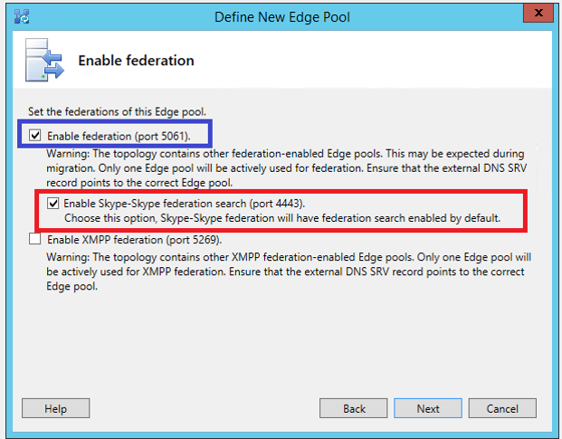

# <a name="deploy-skype-connectivity-in-skype-for-business-server"></a>Implantar a conectividade do Skype no Skype for Business Server

**Resumo:** Saiba como conectar o Skype for Business Server com o consumidor do Skype. Também conhecido como conectividade do Skype.
  
Este artigo percorre a implantação da conectividade do Skype.
  
## <a name="skype-connectivity-overview-for-it-professionals"></a>Visão geral da conectividade do Skype para profissionais de ti

A conectividade do Skype fornece aos usuários do Skype for Business a capacidade de Pesquisar e adicionar usuários do Skype. A conectividade do Skype é um recurso do Skype for Business que permite habilitar a Federação e a pesquisa de diretório com usuários do Skype. Após habilitar a conectividade do Skype, os usuários do Skype for Business poderão pesquisar e adicionar usuários do Skype.
  
## <a name="skype-directory-search"></a>Pesquisa de diretório do Skype

A funcionalidade de pesquisa de diretório do Skype oferece aos usuários do Skype for Business a capacidade de Pesquisar contatos do Skype. A funcionalidade de pesquisa permite que os usuários pesquisem usando o seguinte:
  
- **Pesquisar por nome de exibição, exemplo "João da Silva"** -isso pode retornar muitos resultados, portanto, você pode não encontrar o que está procurando.
    
- **Pesquisar por nome de exibição e local, exemplo "John lemos em Barcelona"** -isso restringe consideravelmente os resultados da pesquisa.
    
- **Pesquisar por email, exemplo "johndoe@outlook.com"** -isso deve retornar um resultado na maioria dos casos; o que corresponde exatamente ao email especificado. Mas, se o mesmo email estiver associado a mais de uma conta, vários resultados poderão ser retornados.
    
- **Pesquisar por número de telefone, exemplo "123-123-1234"** -isso deve retornar um resultado na maioria dos casos; Aquele que corresponde exatamente ao telefone especificado. O número de telefone deve incluir o código do país (ou seja, 1-xxx-yyy-ZZZZ). Se o mesmo número de telefone estiver associado a mais de uma conta, vários resultados poderão ser retornados.
    
- **Pesquisar pelo nome Skype, exemplo "JohnDoe1456"** -se uma correspondência exata for encontrada, ela será retornada como o primeiro resultado. Outras correspondências de "nome" possíveis podem ser retornadas.
    
    > [!NOTE]
    > A pesquisa de diretório do Skype deve ser capaz de se comunicar com os seguintes endereços IP na porta 443:104.40.75.246, 23.101.135.34 e 40.113.86.19. 
  
## <a name="supported-deployment-matrix-for-skype-directory-search"></a>Matriz de implantação com suporte para a pesquisa de diretório do Skype

A tabela a seguir descreve o suporte para pesquisa de diretório do Skype.
  

||**Front-end do Skype for Business Server**|**Servidor front-end do Lync Server 2013 (ou anterior)**|**Comments**|
|:-----|:-----|:-----|:-----|
|Borda do Skype for Business Server  <br/> |Com suporte  <br/> |Não suportado  <br/> |O Skype for Business Server e o Edge são pré-requisitos para a pesquisa de diretório do Skype  <br/> |
|Skype for Business Server Edge + Lync Server 2013 Edge implantado lado a lado  <br/> |Com suporte  <br/> |Não suportado  <br/> |O tráfego de pesquisa de diretório do Skype flui pelos servidores de borda do Skype for Business Server. O tráfego de Federação passa pela borda configurada pelo administrador. Por exemplo, o administrador poderia optar por continuar enviando tráfego de Federação por servidores de borda do Lync Server 2013 que não dão suporte à pesquisa de diretório do Skype.  <br/> |
|Lync Server 2013 (ou anterior) borda  <br/> |Não Suportado  <br/> |Não Suportado  <br/> ||
   
> [!NOTE]
> O serviço AddressBook em execução no front-end do Skype for Business Server localiza a borda pela existência da porta de pesquisa do Skype 4443 no servidor de borda. 
  
> [!NOTE]
> No caso de um cliente ter vários sites em sua implantação local, e se eles implantaram apenas um servidor/pool de borda do Skype for Business Server, então a pesquisa de tráfego de todos os sites passará pelo servidor de borda único disponível. O administrador precisa certificar-se de que os pools de todos os sites podem acessar o servidor/pool de borda do Skype for Business Server implantado. 
  
> [!NOTE]
> O serviço do Skype Graph limitará as solicitações de pesquisa de qualquer cliente no local ou do Microsoft 365 ou do Office 365, se a taxa de solicitação exceder 15 solicitações/segundo. 
  
> [!NOTE]
> Para os clientes locais de grandes empresas, os domínios precisarão ser whitelistdos com o serviço de pesquisa do Skype para permitir taxas de solicitação mais altas. 
  
> [!NOTE]
> O Skype for Business Server limitará as solicitações de entrada, se houver muitas solicitações pendentes na fila. 
  
## <a name="deploying-skype-connectivity-for-skype-for-business-online"></a>Implantando a conectividade do Skype para o Skype for Business Online

A conectividade do Skype também é um recurso do Skype for Business Online, que faz parte do Microsoft 365 e do Office 365. Você pode habilitar o recurso de conectividade do Skype do centro de administração do Skype for Business no centro de administração do Microsoft 365.
  
Para o Microsoft 365 Midsize Business, o Office 365 Enterprise, o Microsoft 365 Education e o Office 365 para o governo: entre no centro de administração do Microsoft 365 e navegue até o centro de administração do Skype for Business. Vá para comunicações externas. Em provedores de serviços públicos de IM, clique em habilitar. Se você quiser controlar o acesso de usuários individuais à conectividade do Skype, poderá fazê-lo editando as configurações de comunicações externas de usuários individuais.
  
Para o Office 365 Small Business Premium: entrar no Office 365 e vá até configurações de \> serviço \> de administração, reuniões e conferências. Ative as comunicações externas. O comutador de comunicações externas ativa a conectividade do Skype e as comunicações com outras organizações que usam o Skype for Business.
  
Para obter mais informações sobre a administração do Skype for Business Online, consulte:
  
- [Permitir que os usuários entrem em contato com usuários externos do Skype for Business](../../SfbOnline/set-up-skype-for-business-online/allow-users-to-contact-external-skype-for-business-users.md)

- [O que tentar se não for possível enviar mensagens instantâneas para contatos externos do Skype for Business ou Skype](https://support.office.com/article/What-to-try-if-you-cant-IM-Skype-for-Business-Lync-or-Skype-external-contacts-87f6d5d7-3b8c-4196-9c8c-1dabb75f54b8?ui=en-US&amp;rs=en-US&amp;ad=US)
    
- [Adicionar um contato no Skype for Business](https://support.office.com/article/Add-a-contact-in-Skype-for-Business-89338023-2adf-4f5c-90b6-f8b6f72fadd1)
  
- [Administradores: definir as configurações do Skype for Business para usuários individuais](../../SfbOnline/set-up-skype-for-business-online/configure-skype-for-business-settings-for-individual-users.md)
    
## <a name="deploying-skype-connectivity-for-skype-for-business-server"></a>Implantando a conectividade do Skype para o Skype for Business Server

O Skype for Business Server usa a arquitetura de acesso à Federação para dar suporte à conectividade com o Skype. Essa conectividade permite que os usuários do Skype for Business Server adicionem o Skype. Os clientes do Skype também podem adicionar usuários do Skype for Business à sua lista de contatos. Com base nas políticas definidas administrativamente no Skype for Business Server, os usuários poderão se comunicar usando mensagens instantâneas, confira a presença de cada um e iniciar chamadas de áudio e vídeo. A conectividade do Skype também é um recurso do Skype for Business Online e pode ser habilitada para os clientes do Skype for Business online a partir do centro de administração do Skype for Business dentro do centro de administração do Microsoft 365.
  
> [!NOTE]
> Se o Skype for Business Server já estiver configurado para se conectar ao Windows Messenger usando a PIC (conectividade de mensagens instantâneas públicas), sua implantação já está configurada para conectividade com o Skype. A única alteração que você pode querer considerar é renomear sua entrada existente do Messenger PIC como Skype. 
  
### <a name="the-skype-for-business-server-public-im-connectivity-provisioning-site-is-no-longer-available"></a>O site de configuração de conectividade de IM pública do Skype for Business Server não está mais disponível

O site que antes era usado para provisionar manualmente a Federação entre implantações locais do Skype for Business e o Skype não é mais necessário e será desligado no 8/15/2019. A Federação com o Skype agora utiliza a descoberta de parceiros federados, que é o mesmo mecanismo necessário para federação com o Skype for Business online.

A comunicação entre qualquer implantação local do Skype for Business e usuários do Skype por meio da infraestrutura de IM pública existente agora requer que a configuração do servidor de borda local seja compatível com o Skype for Business online.

> [!NOTE]
> Nenhuma ação é necessária para a maioria dos clientes, incluindo todas as implantações de Federação com o Skype for Business online.
  
Implantações locais são necessárias para publicar um registro SRV DNS de Federação para cada domínio que eles hospedam. As orientações estão disponíveis no [planejamento de DNS](../plan-your-deployment/edge-server-deployments/edge-environmental-requirements.md#dns-planning). Cada domínio deve ser resolvido pela consulta SRV DNS para um FQDN do servidor de borda que atenda a uma correspondência de sufixo de nível superior do domínio. Por exemplo, considere o domínio "contoso.com":

|**FQDNs válidos**|**Comment**|
|:-----|:-----|
|sip.contoso.com   ||
|sipfed.contoso.com   |Em cada caso, o FQDN exato deve estar presente no SN ou na SAN do certificado externo instalado no servidor de borda.   |
|access.contoso.com   ||
|**FQDNs inválidos**|**Reason**|
|sip.contoso-edge.com   |Não é uma correspondência de sufixo.  |
|sip.it.contoso.com   |Não é uma correspondência de sufixo de nível superior.   |

Orientações adicionais sobre certificados externos podem ser encontradas no [planejamento de certificados](../plan-your-deployment/edge-server-deployments/edge-environmental-requirements.md#certificate-planning).

#### <a name="faqs"></a>Perguntas Frequentes

**Por que o site de provisionamento está sendo desligado?**
O pic.lync.com (serviço de provisionamento público de mensagens instantâneas) implantado no 2006 não é mais útil e será desligado no 8/15/2019. Em vez disso, a Federação de IM pública assumirá o mesmo modelo de Federação usado pelo Skype for Business Online, conhecido como "descoberta de parceiro", no qual uma implantação local é detectável publicamente por seus registros SRV DNS de Federação.

**Essa alteração significa que a Federação de IM pública está sendo preterida?**
Não. A Federação de IM pública continuará a ter suporte por muitos anos, provavelmente, até que o produto local do Skype for Business atinja o fim da vida útil.

**Nossa empresa tem uma relação híbrida (espaço de endereço compartilhado) com o Skype for Business Online, é afetada?**
Não, como você já está se agrupando com o Skype for Business Online, essa alteração não afetará você.
 
**Essa alteração significa que nossa empresa deve habilitar a Federação com o Skype for Business Online?**
Não. Se suas configurações de proxy do servidor de borda não habilitarem Federação com o provedor de hospedagem do Skype for Business online (sipfed.online.lync.com), essa alteração não afetará isso. No entanto, os mesmos requisitos de DNS e certificado que se aplicam à Federação com o Skype for Business online agora também se aplicam à Federação com usuários do Skype.
 
**Nossa empresa é grande e não pode alterar sua configuração de borda devido a motivos/conformidade normativa/etc... o que podemos fazer?**
Qualquer organização local que não possa alterar sua configuração de servidor de borda conforme especificado deve chegar ao suporte ao produto na primeira oportunidade.

### <a name="enabling-federation-and-public-im-connectivity-pic"></a>Habilitando Federação e conectividade pública de IM (PIC)

Agora, concentre-se no ambiente do Skype for Business Server e nas tarefas administrativas necessárias para configurar a conectividade do Skype. Nesta seção, presumimos que o administrador implantou o Skype for Business Server e configurou o acesso externo, também conhecido como servidores de borda. 
  
Há três etapas principais necessárias para habilitar a Federação e a PIC. São eles:
  
1. Configurar a Federação e a PIC
    
2. Configurar pelo menos uma política para suportar o acesso de usuário federado
    
3. Definir a configuração do provedor de PIC do Skype
    
#### <a name="1-configure-federation-and-pic"></a>1. configurar a Federação e a PIC

A Federação é necessária para permitir que os usuários do Skype se comuniquem com os usuários do Skype for Business em sua organização. A PIC (conectividade de mensagens instantâneas públicas) é uma classe de Federação e deve ser configurada para permitir que seus usuários do Skype for Business se comuniquem com os usuários do Skype. A Federação e a PIC são configuradas usando o painel de controle do Skype for Business Server.
  
> [!NOTE]
> A Federação de PIC não é mais suportada por versões de produto anteriores ao Lync Server 2010 (Live Communication Server, Office Communications Server). As plataformas suportadas para Federação img incluem Skype for Business Server, Lync Server 2013 e Lync Server 2010. 
  
A Federação é necessária para permitir que os usuários do Skype se comuniquem com os usuários do Skype for Business em sua organização. A PIC (conectividade de mensagens instantâneas públicas) é uma classe de Federação e deve ser configurada para permitir que os usuários do Skype for Business Server se comuniquem com os usuários do Skype. A Federação e a PIC são configuradas usando a caixa de diálogo configuração de borda do painel de controle do Skype for Business Server, conforme mostrado na figura.
  

  
> [!NOTE]
> Os atributos os e EnableSkypeDirectorySearch precisam ser definidos como true nas configurações de provedor público (consulte as instruções posteriores) para que a pesquisa funcione. 
  
Isso conclui as tarefas administrativas que devem ser executadas no servidor. Agora você está pronto para a conectividade do Skype.
  
#### <a name="2-configure-at-least-one-policy-to-support-federated-user-access"></a>2. Configure pelo menos uma política para suportar o acesso de usuário federado

Usando o painel de controle do Skype for Business Server, um administrador deve configurar uma ou mais políticas de acesso de usuário externo para controlar se os usuários do Skype podem colaborar com usuários internos do Skype for Business Server.
  
#### <a name="3-configure-the-skype-pic-provider-setting"></a>3. Configure a configuração do provedor de PIC do Skype

Usando o Shell de gerenciamento do Skype for Business Server, um administrador deve configurar a política de cliente do Skype for Business para exibir o Skype como um provedor de PIC adicional. 
  
> [!NOTE]
> Os usuários dos provedores de serviços públicos da PIC (conectividade de mensagens instantâneas) não podem participar de IM ou conferências em sua organização até que você também configure pelo menos uma política (etapa 2, anteriormente neste procedimento) para dar suporte à conectividade de IM pública. 
  
Para novas instalações, você pode configurar a conectividade do Skype habilitando um provedor público do Skype usando o painel de controle do Skype for Business Server, conforme mostrado na figura.
  

  
> [!NOTE]
> Para configurar a conectividade do Skype ao atualizar para o Skype for Business Server, você deve remover e adicionar novamente o provedor público do Skype existente. 
  
A configuração da conectividade do Skype também pode ser feita usando apenas o PowerShell. Para configurar a conectividade do Skype usando o PowerShell:
  
1. Em um servidor front-end do Skype for Business Server, abra o Shell de gerenciamento do Skype for Business Server.
    
2. Execute os dois comandos a seguir:
    
   ```powershell
    Remove-CsPublicProvider -Identity <identity-name>
   ```

    > [!NOTE]
    > Se você ainda não tem um provedor de PIC em seu ambiente e está criando um novo provedor de PIC, não é necessário executar o cmdlet Remove-CsPublicProvider. 
  
   ```powershell
   New-CsPublicProvider -Identity Skype -ProxyFqdn federation.messenger.msn.com -IconUrl https://images.edge.messenger.live.com/Messenger_16x16.png -NameDecorationRoutingDomain msn.com -NameDecorationExcludedDomainList "msn.com,outlook.com,live.com,hotmail.com" -Enabled $true -EnableSkypeIdRouting $true -EnableSkypeDirectorySearch $true
   ```

    O que os parâmetros menos óbvios fazem?
    
   - ProxyFqdn: local da borda de Federação do Skype (de propriedade/mantida pela Microsoft)
    
   - IconURL: ícone usado pelo &amp; cliente do Lync Skype for Business para identificar visualmente contatos do Skype
    
   - NameDecorationRoutingDomain e NameDecorationExcludedDomainList: a configuração desses permite que os usuários insiram o MSAs dos usuários do Skype sem precisar saber sobre a "decoração" de domínios não-Microsoft com "msn.com". Isso elimina a necessidade de digitar "user (contoso. com) @msn. com" para todos os domínios que não estão no ExcludedDomainList. O cliente SfB formatará automaticamente o MSA se o domínio não estiver na lista excluída. Adicionamos os domínios de conta da Microsoft mais comuns à lista de excluídos.
    
     > [!NOTE]
     > O provedor público deve ser removido e adicionado novas se as alterações forem feitas. Nenhuma alteração no local é permitida. 
  
     > [!NOTE]
     > Adicionado ao Lync Server 2013 CU5 &amp; Lync Desktop Client no Office 2013 SP1, o NameDecorationRoutingDomain e o NameDecorationExcludedDomainList aprimoram a situação em que os usuários do Lync adicionando contatos do Skype necessários para "decorar" domínios que não são da Microsoft para identificar e encaminhá-los ao Skype (o formato de: usuário (contoso. com) @msn. com). Essas novas configurações permitirão a formatação automática do usuário do endereço Enter na caixa de diálogo "Adicionar contato do Skype" com o NameDecorationRoutingDomain (que deve ser definido como msn.com) se ele não contiver os domínios no NameDecorationExcludedDomainList (no momento, podemos oferecer suporte a msn.com, live.com, Hotmail.com, outlook.com). 
  
3. A partir de um cliente do Skype for Business, agora é possível pesquisar e adicionar usuários do Skype.
    
## <a name="clients-and-interoperability-matrix"></a>Matrizes de interoperabilidade e clientes

A tabela a seguir descreve o status da interoperabilidade entre a versão mais recente do Skype Consumer e a versão mais recente do Skype for Business.
  

|**Clientes do Skype**|**Adicionar contatos, mensagens instantâneas, presença, áudio e chamadas de vídeo**|**Comment**|
|:-----|:-----|:-----|
|Área de trabalho do Windows do Skype  <br/> |7,6 ou superior, Windows XP e superior  <br/> |**Novo**: suporte adicionado para o Windows Skype Client em execução no Windows XP e Windows Vista **(requer a versão mais recente do cliente 7,26 ou superior)** <br/> |
|Skype Mobile-telefone Android e Tablet  <br/> |6,19 ou superior, executando o sistema operacional Android versão 4.0.3 ou superior  <br/> |Os dispositivos de especificação baixa podem não suportar a chamada de vídeo  <br/> |
|Skype Mobile-iOS  <br/> |6,11 ou superior, no IOS 7 ou superior  <br/> |Não suportados são iPhone 4 e anteriores, iPod 4ª geração e anteriores, primeira geração de iPad  <br/> |
|Skype Mac  <br/> |7,19 ou superior, no Mac OS X 10,9 (Mavericks) ou superior  <br/> |Requer Mac OSX 10,9 ou superior  <br/> |
|Aplicativo do Skype Universal Windows (Windows 10) Desktop e dispositivos móveis  <br/> |Windows 10 (Redstone 1 Update ou posterior)  <br/> |O aplicativo Windows universal receberá a atualização do outono 2016 adicionando suporte à interoperabilidade  <br/> |
   
A tabela a seguir descreve o status da interoperabilidade entre a versão mais recente do Skype for Business e a versão mais recente do consumidor do Skype. 
  
|**Cliente**|**Pesquisa de diretório do Skype e adicionar contatos**|**Skype A/V, interoperabilidade de IM**|
|:-----|:-----|:-----|
|Skype for Business  <br/> |Sim  <br/> |Sim  <br/> |
|Skype for Business no Mac  <br/> |Pode adicionar (sem pesquisa)  <br/> |Sim  <br/> |
|Lync desktop 2013  <br/> |Pode adicionar (sem pesquisa)  <br/> |Sim  <br/> |
|Lync Web App-online e local  <br/> |Não disponível  <br/> |Não disponível  <br/> |
|Lync Mobile-Windows Phone  <br/> |Em breve  <br/> |Sim  <br/> |
|Lync Mobile-Android  <br/> |Em breve  <br/> |Sim  <br/> |
|Lync Mobile-iOS  <br/> |Em breve  <br/> |Sim  <br/> |
|Sistema de salas do Lync  <br/> |Em breve  <br/> |Sim  <br/> |
|Aplicativo moderno do Lync (Win 8,1)  <br/> |Sim  <br/> |Sim  <br/> |
|Lync Mac 2011  <br/> |Pode adicionar (sem pesquisa)  <br/> |Sim  <br/> |
|Lync Desktop 2010  <br/> |Pode adicionar (sem pesquisa)  <br/> |Sim  <br/> |
|Lync Phone Edition  <br/> |Não disponível  <br/> |Não disponível  <br/> |
|Atendedor do Lync  <br/> |Não disponível  <br/> |Não disponível  <br/> |
   
