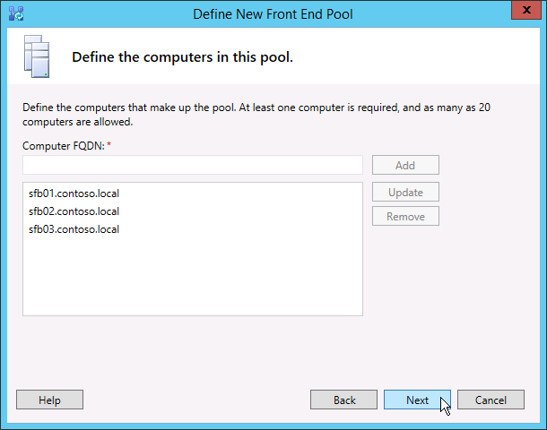

# Criar e publicar uma nova topologia no Skype for Business Server 2015Create and publish new topology in Skype for Business Server 2015
 
**Resumo:** Saiba como criar, publicar e verifique se uma nova topologia antes de instalar o Skype para Business Server.**Summary:** Learn how to create, publish, and verify a new topology before you install Skype for Business Server. Baixe uma versão de avaliação gratuita do Skype para negócios 2015 de servidor do centro da Evaluation da Microsoft em: [https://www.microsoft.com/evalcenter/evaluate-skype-for-business-server](https://www.microsoft.com/evalcenter/evaluate-skype-for-business-server).Download a free trial of Skype for Business Server 2015 from the Microsoft Evaluation center at: [https://www.microsoft.com/evalcenter/evaluate-skype-for-business-server](https://www.microsoft.com/evalcenter/evaluate-skype-for-business-server).
  
Antes de instalar o Skype para system Business Server em cada um dos servidores na topologia, você deve criar uma topologia e publicá-lo.Before you can install the Skype for Business Server system on each of the servers in the topology, you must create a topology and publish it. Ao publicar uma topologia, você está carregando as informações da topologia no banco de dados do Repositório de Gerenciamento Central.When you publish a topology, you are loading the topology information into the Central Management Store database. Se o repositório for um pool Enterprise Edition, você criará o banco de dados do Repositório de Gerenciamento Central quando publicar uma nova topologia pela primeira vez.If this is an Enterprise Edition pool, you are creating the Central Management Store database the first time you publish a new topology. Se o repositório for um pool Standard Edition, você terá que executar o processo "Preparar primeiro servidor Standard Edition" no Assistente de Implantação antes de publicar a topologia.If this is Standard Edition, you will need to run the Prepare First Standard Edition Server process from the Deployment Wizard before you publish a topology. Esse processo prepara o Standard Edition por meio da instalação de uma instância do SQL Server Express Edition e da criação do Repositório de Gerenciamento Central.This prepares for Standard Edition by installing a SQL Server Express Edition instance and creating the Central Management Store. Você pode executar as etapas de 1 a 5 em qualquer ordem.You can do steps 1 through 5 in any order. No entanto, as etapas 6, 7 e 8 devem ser executadas nessa ordem, após a conclusão das etapas de 1 a 5, conforme descrito no diagrama.However, you must do steps 6, 7, and 8 in order, and after steps 1 through 5, as outlined in the diagram. A criação e publicação da nova topologia são descritas na etapa 6.How to create and publish a new topology is described in step 6 of 8.
  

  
## Criar e publicar nova topologiaCreate and publish new topology

Você pode usar Skype para o construtor de topologia de servidor de negócios para projetar, definir, configurar e publicar as topologias.You can use Skype for Business Server Topology Builder to design, define, configure, and publish topologies. Essa ferramenta foi instalada quando você instalou as Ferramentas Administrativas no início do artigo.This tool was installed when you installed Administrative Tools earlier in the article. Há diversas opções diferentes para a criação da topologia.There are many different choices you can make when you create a topology. Neste procedimento, você criará uma topologia básica com conferências.In this procedure, you will create a basic topology with conferencing.
  
> [!IMPORTANT]
> Skype para Business Server requer o SQL Server para operar.Skype for Business Server requires SQL Server in order to operate. Os bancos de dados primários são conhecidos como Repositório de Gerenciamento Central.The primary databases are known as the Central Management Store. Se você estiver implantando a Enterprise Edition, esses bancos de dados serão criados quando você publicar a topologia por meio das etapas descritas abaixo.If you are deploying Enterprise Edition, these databases are created when you publish the topology by using the steps below. Nesse caso, o Construtor de Topologias solicitará as informações necessárias para conectar-se a uma instalação do SQL Server.In this case, Topology Builder will ask you for the connection information to a SQL Server installation. Se estiver planejando implantar o Standard Edition, você precisará instalar o SQL Server Express Edition para definir e publicar a nova topologia.If you are planning to deploy Standard Edition, you will need to install SQL Server Express Edition before you define and publish the new topology. Para instalar o SQL Server Express Edition, você deve abrir o Assistente de Implantação no servidor que atuará como front-end e executar o procedimento "Preparar primeiro servidor Standard Edition".To install SQL Server Express Edition, you should open the Deployment Wizard on the server that will act as the Front End, and then run Prepare First Standard Edition Server. Quando você clicar em "Preparar primeiro servidor Standard Edition", o Assistente de Implantação instalará automaticamente o SQL Server Express Edition e criará os bancos de dados do Repositório de Gerenciamento Central.When you click Prepare First Standard Edition Server, the Deployment Wizard automatically installs SQL Server Express Edition and creates the Central Management Store databases. 
  
### Criar uma nova topologiaCreate a new topology

1. Faça logon como usuário padrão com acesso ao Construtor de TopologiasLog in as a standard user with access to Topology Builder.
    
2. Abra o Skype do construtor de topologia de servidor de negócios.Open Skype for Business Server Topology Builder.
    
3. Selecione **Nova Topologia** e clique em **OK**.Select **New Topology**, and click **OK**..
    
4. Selecione um local para o arquivo de configuração de topologia e atribua um nome a ele.Select a location and file name for the topology configuration file.
    
    > [!NOTE]
    > A configuração da topologia é salva como um arquivo XML do Construtor de Topologias (.tbxml). Ao publicar uma topologia, você envia as informações de configuração do arquivo para o banco de dados do SQL Server. Quando abrir o Construtor de Topologias posteriormente, você poderá baixar as configurações existentes do SQL diretamente para o Construtor de Topologias e publicá-las no SQL Server ou salvá-las como uma arquivo de configuração do Construtor de Topologias.The topology configuration is saved as a Topology Builder XML (.tbxml) file. When you publish a topology, you are pushing the configuration information from the file to the SQL Server database. When you open Topology Builder in the future, you can download the existing configuration from SQL Server directly into Topology Builder and either publish it back to SQL Server or save it as a Topology Builder configuration file. 
  
5. Na tela **Definir o domínio primário**, digite o **domínio SIP primário** e clique em **Avançar**. Neste exemplo, usamos **contoso.local**, conforme mostra a figura.On the **Define the primary domain screen**, enter the **primary SIP domain**, and click **Next**. In this example, we are using **contoso.local**, as shown in the figure.
    
     
  
6. Adicione os domínios SIP compatíveis que desejar e clique em **Avançar**.Add any additional supported SIP domains, and then click **Next**.
    
7. Digite um **Nome** e uma **Descrição** para o primeiro site (local) e clique em **Avançar**, conforme mostra a figura.Enter a **Name** and **Description** for the first site (location), and then click **Next**, as shown in the figure.
    
     
  
8. Digite a **Cidade**, o **Estado/Província** e **Código do País/Região** do site e clique em **Avançar**.Enter the **City**, **State/Province**, and **Country/Region Code** for the site, and then click **Next**.
    
9. Clique em **Concluir** para finalizar o processo de definição de nova topologia. O Assistente de Novo Front-End inicia automaticamente.Click **Finish** to complete the process of defining a new topology. The New Front End Wizard launches automatically.
    
### Definir um pool de front-end ou um servidor Standard EditionDefine a Front End pool or Standard Edition server

1. Leia os pré-requisitos do assistente e clique em **Avançar**.Review the wizard prerequisites, and then click **Next**.
    
2. Insira o FQDN (nome de domínio totalmente qualificado) do pool e selecione **Pool de Front-Ends Enterprise Edition** ou **Standard Edition Server** e clique em **Avançar**, conforme mostra a figura.Enter the fully qualified domain name (FQDN) of the pool, and select either **Enterprise Edition Front End Pool** or **Standard Edition Server**, and then click **Next**, as shown in the figure.
    
    > [!TIP]
    > Skype para Business Server Enterprise Edition pode incluir vários servidores trabalhando juntos para fornecer a função de Front-End.Skype for Business Server Enterprise Edition can include multiple servers working together to provide the Front End role. Quando vários servidores são usados para atender a função, ele é denominado um pool.When multiple servers are used to fulfill the role, it is called a pool. Assim, vários servidores trabalhando juntos para fornecer a função de Front-End também é conhecida como o pool de Front-End.Thus, multiple servers working together to provide the Front End role is also referred to as the Front End pool. Skype para Business Server Standard Edition pode incluir apenas um único servidor para fornecer a função de Front-End.Skype for Business Server Standard Edition can include only a single server to provide the Front End role. É comum referir-se ao pool de Front-End, mesmo se um único servidor está fornecendo a função.It is common to refer to the Front End pool even if only a single server is providing the role. 
  
     
  
3. Digite os FQDNs de todos os computadores do pool e clique em **Avançar**, conforme mostra a figura.Enter the fully qualified domain names (FQDNs) of all computers in the pool, and then click **Next** as shown in the figure.
    
     
  
4. Selecione os recursos que serão incluídos nessa topologia e clique em **Avançar**, conforme mostra a figura.Select the features that will be included in this topology, and then click **Next** as shown in the figure.
    
    > [!NOTE]
    > Skype para Business Server inclui vários recursos avançados.Skype for Business Server includes many advanced features. Leia a documentação de planejamento e implantação de cada recurso que você deseja usar.Review planning and deployment documentation for each specific feature you want to use. 
  
     
  
5. Na página **Selecionar servidor colocado funções** , você pode optar por colocar o servidor de mediação no servidor Front-End ou você pode optar por implantá-lo como um servidor autônomo.On the **Select collocated server roles** page, you can choose to collocate the Mediation server on the Front End server, or you can choose to deploy it as a standalone server.
    
    Se você pretende colocar o Servidor de Mediação no pool de front-ends Enterprise Edition, verifique se a caixa de seleção está marcada.If you intend to collocate the Mediation server on the Enterprise Edition Front End pool, ensure the check box is selected. A função de servidor será implantada nos servidores do pool.The server role will be deployed on the pool servers. Se você pretende implantar o Servidor de Mediação como um servidor autônomo, limpe a caixa de seleção correspondente.If you intend to deploy the Mediation server as a stand-alone server, clear the appropriate check box. Após a implantação do servidor Front-End completamente, você implantará o servidor de mediação em uma etapa de implantação separada.You will deploy the Mediation server in a separate deployment step after you completely deploy the Front End server. Para planejar os detalhes sobre a colocação de uma, consulte [Noções básicas de topologia para Skype para Business Server 2015](../../plan-your-deployment/topology-basics/topology-basics.md).For planning details about a collocation, see [Topology Basics for Skype for Business Server 2015](../../plan-your-deployment/topology-basics/topology-basics.md).
    
6. Na página **Associar funções de servidor a este pool de front-ends**, você pode definir e associar funções de servidor com o pool de front-ends. A seguinte função está disponível:By using the **Associate server roles with this Front End pool** page, you can define and associate server roles with the Front End pool. The following role is available:
    
    **Habilitar um pool de borda** Define e associa um único servidor de borda ou um pool de servidores de borda.**Enable an Edge pool** Defines and associates a single Edge Server or a pool of Edge Servers. O servidor de borda intermedia a comunicação e colaboração entre os usuários dentro da organização e as pessoas de fora da organização, inclusive usuários federados.An Edge Server facilitates communication and collaboration between users inside the organization and people outside the organization, including federated users.
    
    Existem dois cenários possíveis que você pode usar para implantar e associar as funções do servidor.There are two possible scenarios that you can use to deploy and associate the server roles.
    
    No cenário um, você está definindo uma nova topologia para uma nova instalação. É possível abordar a instalação de uma das duas formas a seguir:For scenario one, you are defining a new topology for a new installation. You can approach the installation in one of the two following ways:
    
   - Desmarque a caixa de seleção e defina a topologia. Após publicar, configurar e testar as funções de servidor front-end e back-end, execute o Construtor de Topologias novamente para adicionar os servidores de função à topologia. Com essa estratégia, você poderá testar o pool de front-ends e o servidor que executa o SQL Server sem complicações adicionais de funções adicionais. Depois de concluir o teste inicial, execute o Construtor de Topologias novamente para selecionar as funções necessárias para implantação.Leave the check box clear, and define the topology. After you have published, configured, and tested the Front End and Back End Server roles, you can run Topology Builder again to add the role servers to the topology. By using this strategy, you can test the Front End pool and the server running SQL Server without additional complications from additional roles. After you have completed your initial testing, you can run Topology Builder again to select the roles you need to deploy.
    
   - Selecione as funções que você precisa instalar e configure o hardware para acomodar as funções selecionadas.Select roles that you need to install, and then set up the hardware to accommodate the selected roles.
    
    No cenário dois, você tem uma implantação existente e sua infraestrutura está pronta para novas funções ou você precisa associar as funções existentes a um novo servidor front-end.For scenario two, you have an existing deployment, and your infrastructure is ready for new roles, or you need to associate existing roles with a new Front End server.
    
   - Nesse caso, você vai selecionar as funções que pretende implantar ou associar ao novo servidor front-end. Em qualquer um dos casos, você continuará com a definição das funções, a configuração do hardware necessário e a instalação.In this case, you will select the roles that you intend to deploy or associate with the new Front End server. In either case, you will proceed with the definition of the roles, set up any needed hardware, and proceed with the installation.
    
7. Em seguida, você definirá o repositório de SQL Server que será usado nessa topologia.Next, you will define the SQL Server store that will be used with the topology. Nesse exemplo, usamos a instância padrão.In this example, we use the Default instance. Para obter mais informações sobre os recursos do SQL Server, como alta disponibilidade, consulte [Planejar a alta disponibilidade e recuperação de desastres em Skype para Business Server 2015](../../plan-your-deployment/high-availability-and-disaster-recovery/high-availability-and-disaster-recovery.md).For more information about SQL Server features, such as High Availability, see [Plan for high availability and disaster recovery in Skype for Business Server 2015](../../plan-your-deployment/high-availability-and-disaster-recovery/high-availability-and-disaster-recovery.md).
    
   - Para usar um repositório de SQL Server existente que já foi definido em sua topologia, selecione uma instância do **Repositório SQL**.To use an existing SQL Server store that has already been defined in your topology, select an instance from **SQL store**.
    
   - Para definir uma nova instância do SQL Server para armazenar informações de pool, clique em **novo**e, em seguida, especifique o **FQDN do SQL Server** na caixa de diálogo **Definir novo repositório SQL** .To define a new SQL Server instance to store pool information, click **New**, and then specify the **SQL Server FQDN** in the **Define New SQL Store** dialog box.
    
   - Para especificar o nome de uma instância de SQL Server, selecione **Instância Nomeada** e especifique o nome da instância.To specify the name of a SQL Server instance, select **Named Instance**, and then specify the name of the instance.
    
   - Para usar a instância padrão, clique em **Instância padrão**.To use the default instance, click **Default instance**.
    
   - Para usar o espelhamento SQL, selecione **Habilitar espelhamento do SQL** e selecione uma instância existente ou crie uma nova instância.To use SQL Mirroring, select **Enable SQL mirroring**, and select an existing instance, or create a new instance.
    
    Nesse exemplo, vamos inserir o **FQDN do SQL Server**, definir as configurações de alta disponibilidade relevantes e clicar em **OK**, conforme mostra a figura.For this example, we enter the **SQL Server FQDN**, and configure any relevant high availability settings, and then click **OK**, as shown in the figure.
    
     
  
8. Decida se você deseja habilitar o espelhamento do repositório de SQL Server ou a testemunha de espelhamento do SQL Server e clique em **Avançar**.Decide if you want to enable SQL Server store mirroring or SQL Server mirroring witness, and then click **Next**.
    
9. Defina o compartilhamento de arquivos que você deseja usar.Define the file share that you want to use.
    
   - Para usar um compartilhamento de arquivo que já foi definido na sua topologia, selecione **Usar um compartilhamento de arquivos previamente definido**.To use a file share that has already been defined in your topology, select **Use a previously defined file share**.
    
   - Para definir um novo compartilhamento de arquivo, selecione **Definir um novo compartilhamento de arquivo** na caixa **FQDN do Servidor de Arquivos**, insira o FQDN do servidor de arquivos existente onde o compartilhamento de arquivo deve residir e insira um nome para o compartilhamento de arquivo na caixa **Compartilhamento de Arquivos**.To define a new file share, select **Define a new file share**, in the **File Server FQDN** box, enter the FQDN of the existing file server where the file share is to reside, and then enter a name for the file share in the **File Share** box.
    
    Nesse exemplo, vamos clicar em **Defina um novo repositório de arquivos**, inserir o **FQDN do servidor de arquivos** e o **compartilhamento de arquivo** e clicar em **Avançar**.For this example, we will click **Define a new file store**, enter the **file server FQDN** and **file share**, and then click **Next**.
    
    > [!NOTE]
    > O compartilhamento de arquivo para Skype para Business Server pode ser colocado, mas isso não é recomendável por razões de desempenho.The file share for Skype for Business Server can be collocated but it is not recommended for performance reasons. Observe que, nesse exemplo, o compartilhamento de arquivo localiza-se em um servidor dedicado que atuará como compartilhamento de arquivo.Note that in this example, the file share has been located on a single dedicated server that will act as the file share. No entanto, recomendamos outros sistemas mais robustos de compartilhamento de arquivos, como o DFS com o uso do Windows Server 2012 R2.However, other more robust file share systems, such as DFS using Windows Server 2012 R2, are recommended. Para obter detalhes sobre os sistemas de compartilhamento de arquivos suportados, consulte [Requirements for sua Skype para ambiente de negócios](../../plan-your-deployment/requirements-for-your-environment/requirements-for-your-environment.md).For details about supported file share systems, see [Requirements for your Skype for Business environment](../../plan-your-deployment/requirements-for-your-environment/requirements-for-your-environment.md). Para obter mais informações sobre como criar o compartilhamento de arquivos, consulte [criar um compartilhamento de arquivo no Skype para Business Server 2015](create-a-file-share.md).For more information about creating the file share, see [Create a file share in Skype for Business Server 2015](create-a-file-share.md). Você pode definir o compartilhamento de arquivos sem que ele tenha sido criado.You can define the file share without the file share having been created. Além disso, você precisará criar o compartilhamento de arquivos no local definido para poder publicar a topologia.You will need to create the file share in the location you define before you publish the topology. 
  
10. Na página Especificar a URL dos Serviços Web, você deve decidir se é necessário substituir a URL básica do pool interno de serviços Web.On the Specify the Web Services URL page, you must decide if you need to override the internal Web Services pool base URL. Essa substituição está relacionado ao balanceamento de carga.The reason for this override has to do with load balancing. A carga do tráfego SIP básico pode ser balanceada por meio do balanceamento de carga de DNS simples.Basic SIP traffic can be load balanced through simple DNS load balancing. No entanto, o tráfego de rede HTTP/HTTPS dos serviços Web deve usar uma solução de balanceamento de carga de hardware ou software compatível.However, the HTTP/S Web Services network traffic must use a supported Hardware or Software load balancing solution. Para balanceadores de carga com suporte, consulte [infraestrutura para Skype para negócios](https://technet.microsoft.com/en-us/office/dn947483).For supported load balancers, see [Infrastructure for Skype for Business](https://technet.microsoft.com/en-us/office/dn947483). Nesse exemplo, nós usamos o balanceamento de carga de DNS para o tráfego SIP e uma solução de balanceamento de carga de software compatível.In this example, we used DNS load balancing for SIP traffic and a supported software load balancing solution. Como estamos dividindo o tráfego dessa forma, precisamos substituir o FQDN do pool interno de serviços Web.Because we are dividing the traffic this way, we need to override the internal Web Services pool FQDN. Se tivéssemos um balanceador de carga de linha superior e enviássemos todo o tráfego por meio dele, em veze de usar o balanceamento de carga de DNS para o tráfego SIP, não seria necessário substituir a URL dos serviços Web.Alternatively, if we had a top line load balancer and sent all traffic through it instead of using DNS load balancing for SIP traffic, we would not need to override the Web Services URL. 
    
    Na seção DNS deste tópico, nós criamos um registro A para webint.contoso.local.In the DNS section of this topic, we created an A record for webint.contoso.local. Essa é a URL que estamos usando para o tráfego HTTP/HTTPS dos serviços Web, e ela deve passar pelo balanceador de carga do software compatível que configuramos.This is the URL we are using for the web services HTTP/S traffic, and it must go through the supported software load balancer we set up. Portanto, neste exemplo, podemos substituir a URL para informar Skype para Business Server que todo o tráfego HTTP/S deve ir para webint.contoso.local, em vez de pool.contoso.local, conforme mostrado na figura.Therefore, in this example, we override the URL to let Skype for Business Server know that all HTTP/S traffic should go to webint.contoso.local instead of pool.contoso.local, as shown in the figure. Para obter mais informações sobre o balanceamento de carga, consulte [requisitos de carga balanceamento para Skype para negócios](../../plan-your-deployment/network-requirements/load-balancing.md).For more about load balancing, see [Load balancing requirements for Skype for Business](../../plan-your-deployment/network-requirements/load-balancing.md).
    
    > [!IMPORTANT]
    > A URL base é a identidade dos serviços Web para a URL, menos "https://".The base URL is the Web Services identity for the URL, minus the https://. Por exemplo, se a URL completa para os serviços Web do pool é https://webint.contoso.local, a URL base é webint.contoso.local.For example, if the full URL for the Web Services of the pool is https://webint.contoso.local, the base URL is webint.contoso.local. 
  
    - Se você estiver configurando o balanceamento de carga de DNS, como estamos fazendo nesse exemplo, marque a caixa de seleção **Substituir o FQDN do pool interno de serviços Web** e insira a URL base interna (que deve ser diferente do FQDN de pool) em **URL base interna**.If you are configuring DNS load balancing, as we are in this example, select the **Override internal Web Services pool FQDN** check box, and enter the internal base URL (which must be different from the pool FQDN) in **Internal Base URL**. 
    
    > [!CAUTION]
    > Se você decidir substituir os serviços Web internos por um FQDN autodefinido, cada FQDN deverá ser exclusivo de qualquer outro pool de front-ends, diretor ou um pool de diretores.If you decide to override the Internal Web Services with a self-defined FQDN, each FQDN must be unique from any other Front End pool, Director, or Director pool. **Use somente caracteres padrão** (incluindo A-Z, a-z, 0-9 e hifens) quando você define URLs ou nomes de domínio totalmente qualificados.**Use only standard characters** (including A-Z, a-z, 0-9, and hyphens) when you define URLs or fully qualified domain names. Não use caracteres Unicode nem sublinhados.Do not use Unicode characters or underscores. Caracteres não padrão em uma URL ou FQDN, em geral, não recebem suporte de DNSs externos e CAs públicas (ou seja, quando for necessário atribuir a URL ou o FQDN ao nome da entidade ou ao nome alternativo da entidade no certificado).Nonstandard characters in a URL or FQDN are often not supported by external DNS and public certification authorities (CAs) (that is, when the URL or FQDN must be assigned to the subject name or subject alternative name in the certificate).
  
    - Opcionalmente, insira a URL base externa em **URL Base Externa**. Insira a URL base externa para diferenciá-la do nome de domínio interno. Por exemplo, seu domínio interno é contoso.local, mas seu nome de domínio externo é contoso.com. Você deve definir a URL usando o nome do domínio contoso.com, pois deve ser possível resolvê-la no DNS público. Isso também é importante no caso de um proxy reverso. O nome de domínio da URL base externa seria igual ao nome de domínio do FQDN do proxy inverso. As mensagens instantâneas e presença exigem acesso HTTP ao pool de front-ends em clientes móveis.Optionally, enter the external base URL in **External Base URL**. You would enter the external base URL to differentiate it from your internal domain name. For example, your internal domain is contoso.local, but your external domain name is contoso.com. You would define the URL using the contoso.com domain name since it must be resolvable from public DNS. This is also important in the case of a reverse proxy. The external base URL domain name would be the same as the domain name of the FQDN of the reverse proxy. HTTP access to the Front End pool is required for instant messaging and presence on mobile clients.
    
     
  
11. Se você selecionou **Conferência** na página **Selecionar Recursos**, o sistema solicitará que você selecione um servidor do Office Web Apps. Clique em **Novo** para iniciar a caixa de diálogo.If you selected **Conferencing** on the **Select Features** page, you will be asked to select an Office Web Apps server. Click **New** to launch the dialog box.
    
12. Na caixa de diálogo **Definir Novo Servidor do Office Web Apps**, digite o FQDN do servidor do Office Web Apps na caixa **FQDN do Servidor do Office Web Apps**. Quando você fizer isso, a URL de descoberta de seu servidor do Office Web Apps deverá ser inserida automaticamente na caixa **URL de descoberta de Servidor Office Web Apps:**.In the **Define New Office Web Apps Server** dialog box, type the FQDN of your Office Web Apps server in the **Office Web Apps Server FQDN** box; when you do this, your Office Web Apps server discovery URL should automatically be entered into the **Office Web Apps Server discovery URL** box.
    
    Se o servidor de Office Web Apps estiver instalado no local e na mesma zona do Skype para Business Server, não marque a opção **Office Web Apps Server é implantado em uma rede externa (ou seja, de perímetro/Internet)**.If the Office Web Apps server is installed on-premises and in the same network zone as Skype for Business Server, do not select the option **Office Web Apps Server is deployed in an external network (that is, perimeter/Internet)**.
    
    Se o servidor do Office Web Apps estiver implantado fora do seu firewall interno, selecione a opção **O servidor do Office Web Apps está implantado em uma rede externa (ou seja, de perímetro/Internet)**.If the Office Web Apps server is deployed outside your internal firewall, select the option **Office Web Apps Server is deployed in an external network (that is, perimeter/Internet)**.
    
13. Clique em **Concluir** para finalizar a configuração. Se você definiu outros servidores de função na página **Associar funções de servidor a este pool de front-ends**, páginas separadas do assistente de configuração de funções serão abertas para permitir a configuração das funções de servidor. Nesse exemplo, escolhemos somente a conferência:Click **Finish** to complete the configuration. If you defined other role servers on the **Associate server roles with this Front End pool** page, separate role configuration wizard pages will open where you can configure the server roles. In this example we only chose conferencing.
    
### Configurar URLs simplesConfigure simple URLs

1. No construtor de topologia, com o botão direito no nó superior do **Skype para Business Server** e clique em **Editar propriedades**, conforme mostrado na figura.In Topology Builder, right-click the **Skype for Business Server** top node, and then click **Edit Properties**, as shown in the figure.
    
     
  
2. No painel **URLs Simples**, selecione **URLs de acesso telefônico:** (Discagem) ou **URLs de Reunião:** (Reunião) para editar. Em seguida, clique em **Editar URL**.In the **Simple URLs** pane, select either **Phone access URLs:** (Dial-in) or **Meeting URLs:** (Meet) to edit, and then click **Edit URL**.
    
3. Atualize a URL para o valor desejado e, em seguida, clique em **Okey** para salvar a URL editada.Update the URL to the value you want, and then click **OK** to save the edited URL. Você deve configurar a URL simples usando o domínio SIP externo, de modo que os usuários externos podem ingressar em reuniões, por exemplo, contoso.com, que é externo, em vez de contoso. local, que é um domínio interno.You should configure the simple URL using the external SIP domain so that external users can join meetings, for example, contoso.com, which is external, as opposed to contoso.local, which is an internal domain. Assim, o domínio SIP deve ser capaz de ser resolvido pelo DNS externo.Thus, the SIP domain should be able to be resolved by external DNS.
    
4. Siga as mesmas etapas para editar a URL de Reunião, se necessário.Edit the Meet URL by using the same steps, if necessary.
    
### Para definir a URL simples Admin opcionalTo define the optional Admin simple URL

1. No construtor de topologia, clique com botão direito no nó do **Skype para Business Server** e, em seguida, clique em **Editar propriedades**.In Topology Builder, right-click the **Skype for Business Server** node, and then click **Edit Properties**.
    
2. Na caixa **URL de acesso administrativo** , digite a URL simples que você deseja para acesso administrativo ao Skype para painel de controle do Business Server e clique em **Okey**.In the **Administrative access URL** box, enter the simple URL you want for administrative access to Skype for Business Server Control Panel, and then click **OK**.
    
    > [!TIP]
    > Nós recomendamos que você use a URL do administrador mais simples possível.We recommend using the simplest possible URL for the Admin URL. É a opção mais simples https://admin. _ \<domínio\>_.The simplest option is https://admin. _\<domain\>_. A URL do administrador pode ser um domínio interno ou externo (por exemplo, contoso.local ou contoso.com, respectivamente), contando que o DNS interno seja capaz de resolver qualquer um dos registros.The Admin URL can be either an internal or external domain, for example, contoso.local or contoso.com, as long as either record is resolvable in internal DNS. 
  
    > [!IMPORTANT]
    > Se alterar uma URL simples após a implantação inicial, você deve saber quais alterações afetam os registros de DNS e os certificados das URLs simples.If you change a simple URL after initial deployment, you must be aware of what changes impact your Domain Name System (DNS) records and certificates for simple URLs. Se a alteração afeta a base de uma URL simples, você deve alterar os registros DNS e certificados, muito.If the change impacts the base of a simple URL, you must change the DNS records and certificates, too. Por exemplo, a alteração de https://sfb.contoso.com/Meet para https://meet.contoso.com altera a URL base do sfb.contoso.com para meet.contoso.com, portanto, seria necessário alterar os registros DNS e certificados para se referir a meet.contoso.com. Se você alterou a URL simples de https://sfb.contoso.com/Meet para https://sfb.contoso.com/Meetings, a URL base do sfb.contoso.com permanece o mesmo, portanto, não há DNS ou se forem necessárias alterações de certificado.For example, changing from https://sfb.contoso.com/Meet to https://meet.contoso.com changes the base URL from sfb.contoso.com to meet.contoso.com, so you would need to change the DNS records and certificates to refer to meet.contoso.com. If you changed the simple URL from https://sfb.contoso.com/Meet to https://sfb.contoso.com/Meetings, the base URL of sfb.contoso.com stays the same, so no DNS or certificate changes are needed. Sempre que você alterar um nome de URL simple, no entanto, você deve executar o cmdlet **Enable-CsComputer** em cada diretor e Front-End server para registrar a alteração.Whenever you change a simple URL name, however, you must run the **Enable-CsComputer** cmdlet on each Director and Front End server to register the change.
  
### Publicar e verificar a topologiaPublish and verify the topology

1. Verifique se todas as URLs simples estão configuradas corretamente.Check that all simple URLs are configured correctly.
    
2. Verifique se o servidor baseado em SQL Server está online e disponível para o computador no qual o Construtor de Topologias está instalado, incluindo quaisquer regras de firewall necessárias.Confirm that the SQL Server-based server is online and available to the computer where Topology Builder is installed, including any necessary firewall rules.
    
3. Verifique se o compartilhamento de arquivos está disponível e se as permissões adequadas foram definidas.Confirm that the file share is available and that the proper permissions are defined.
    
4. Verifique se as funções de servidor corretas que atendem aos requisitos de implantação estão definidas na topologia.Confirm that the correct server roles that meet the deployment requirements are defined in the topology.
    
5. Verifique se os servidores existem nos AD DS (serviços de domínio Active Directory). Isso acontece automaticamente quando você adiciona os servidores ao domínio.Verify that the servers exist in Active Directory Domain Services (AD DS). This happens automatically when you join the servers to the domain.
    
    Após a verificação da topologia, se não houver erros de validação, você estará pronto para publicar a topologia. Se houver erros de validação, será necessário corrigi-los antes de publicar a topologia.When you have verified the topology and there are no validation errors, you should be ready to publish the topology. If there are validation errors, you must correct them before you can publish the topology.
    
6. Com o botão direito no nó do **Skype para Business Server 2015** e, em seguida, clique em **Publicar topologia**.Right-click the **Skype for Business Server 2015** node, and then click **Publish Topology**.
    
7. Na página **Publicar a topologia**, clique em **Avançar**.On the **Publish the topology** page, click **Next**.
    
8. Na página **Selecionar um Servidor de Gerenciamento Central**, selecione um pool de front-ends, conforme mostra a figura.On the **Select Central Management Server** page, select a Front End pool, as shown in the figure.
    
    > [!NOTE]
    > Você pode clicar em **Avançado** para configurar os locais dos arquivos de banco de dados.You can click **Advanced** to configure database file locations.
  
     
  
9. Na página **Selecionar bancos de dados**, selecione os bancos de dados que deseja publicar.On the **Select databases** page, select the databases you want to publish.
    
    > [!NOTE]
    > Se você não possui os direitos apropriados para criar os bancos de dados, você poderá desmarcar as caixas de seleção ao lado desses bancos de dados e alguém com direitos apropriados posteriormente pode criar os bancos de dados.If you don't have the appropriate rights to create the databases, you can clear the check boxes next to those databases, and someone with appropriate rights can later create the databases. Para obter detalhes sobre os requisitos, consulte [requisitos de servidor para Skype para Business Server 2015](../../plan-your-deployment/requirements-for-your-environment/server-requirements.md).For details about requirements, see [Server requirements for Skype for Business Server 2015](../../plan-your-deployment/requirements-for-your-environment/server-requirements.md). 
  
10. Opcionalmente, clique em  **Avançado**. As opções avançadas de posicionamento do arquivo de dados do SQL Server permitem selecionar uma das seguintes opções:Optionally click **Advanced**. By using Advanced SQL Server data file placement options, you can select between the following options: 
    
    - **Determinar o local do arquivo de banco de dados automaticamente** - esta opção determina o melhor desempenho operacional com base na configuração de disco em seu servidor baseado em SQL Server, distribuir os arquivos de log e de dados para o melhor local.**Automatically determine database file location** - This option determines the best operational performance based on the disk configuration on your SQL Server-based server by distributing the log and data files to the best location.
    
    - **Use o SQL Server instância padrões** - essa opção coloca os arquivos de log e dados logon no servidor baseado em SQL Server usando as configurações de instância.**Use SQL Server instance defaults** - This option puts log and data files onto the SQL Server-based server by using the instance settings. Essa opção não usar a funcionalidade operacional do servidor baseado em SQL Server para determinar os locais ideais para logs e dados.This option does not use the operational functionality of the SQL Server-based server to determine optimal locations for logs and data. O administrador do SQL Server normalmente seria mover os arquivos de log e de dados para os locais apropriados para procedimentos de gerenciamento de servidor e organização baseada em SQL Server.The SQL Server administrator would typically move the log and data files to locations that are appropriate for the SQL Server-based server and organization management procedures.
    
    Clique em **OK** e, em seguida, em **Avançar**.Click **OK**, and then click **Next**. 
    
11. Opcionalmente, clique em **Avançado**. As opções avançadas de posicionamento do arquivo de dados do SQL Server permitem selecionar uma das seguintes opções:Optionally, click **Advanced**. By using Advanced SQL Server data file placement options, you can select between the following options: 
    
    - **Determinar o local do arquivo de banco de dados automaticamente** - esta opção determina o melhor desempenho operacional com base na configuração de disco em seu servidor baseado em SQL Server, distribuir os arquivos de log e de dados para o melhor local.**Automatically determine database file location** - This option determines the best operational performance based on the disk configuration on your SQL Server-based server by distributing the log and data files to the best location.
    
    - **Use o SQL Server instância padrões** - essa opção coloca os arquivos de log e dados logon no servidor baseado em SQL Server usando as configurações de instância.**Use SQL Server instance defaults** - This option puts log and data files onto the SQL Server-based server by using the instance settings. Essa opção não usar a funcionalidade operacional do servidor baseado em SQL Server para determinar os locais ideais para logs e dados.This option does not use the operational functionality of the SQL Server-based server to determine optimal locations for logs and data. O administrador do SQL Server normalmente seria mover os arquivos de log e de dados para os locais apropriados para procedimentos de gerenciamento de servidor e organização baseada em SQL Server.The SQL Server administrator would typically move the log and data files to locations that are appropriate for the SQL Server-based server and organization management procedures.
    
    Clique em **OK**.Click **OK**.
    
12. Clique em **Avançar** para concluir o processo de publicação.Click **Next** to complete the publishing process.
    
    > [!NOTE]
    > É comum não conseguir criar os bancos de dados do SQL Server nessa etapa. Quando não é possível concluir o processo, o sistema apresenta um erro, conforme mostra a figura. A causa mais provável é que o usuário que está tentando criar o banco de dados não tenha as permissões necessárias ou que não seja possível entrar em contato com o sistema do SQL Server devido a um problema no firewall ou a outro problema de rede.A common failure for this step is that the SQL Server databases cannot be created. When the process cannot complete, an error is provided, as shown in the figure. The most likely cause is that the user attempting to create the database does not have the appropriate permissions, or the SQL Server system cannot be contacted due to a firewall or other network issue. 
  
     
  
13. Ao final do processo de publicação, o sistema apresentará um link para uma lista com as próximas etapas. Clique em **Clique aqui para abrir a lista de tarefas pendentes** para exibir a lista com as próximas etapas e clique em **Concluir**.When the publishing process completes, you are presented with a link to open a list of next steps. Click **Click here to open to-do list** to view the next steps, and then click **Finish**. 
    
    A mensagem "Concluído com avisos" exibida para a criação do banco de dados não indica que houve um erro.The "Completed with warnings" message for the database creation does not mean there was an error. O processo de instalação deve alterar as configurações no SQL Server para Skype para Business Server funcione corretamente.The installation process has to change settings in SQL Server for Skype for Business Server to work correctly. Quando uma configuração é alterada no SQL Server, ela é registrada como um aviso para que os administradores do SQL Server possam entender exatamente o que o processo de instalação fez.When a setting is changed in SQL Server, it is logged as a warning so that SQL Server administrators can understand exactly what the installation process completed. Se você receber um aviso, você pode selecionar o registro e, em seguida, clique em **Exibir Logs** para exibir os detalhes de aviso.If you receive a warning, you can select the record, and then click **View Logs** to view the details of the warning.
    
    Quando a topologia foi publicada com êxito, você pode começar a instalar uma réplica local do repositório de gerenciamento Central em cada servidor que executa o Skype para negócios 2015 de servidor em sua topologia.When the topology has been successfully published, you can begin installing a local replica of the Central Management store on each server running Skype for Business Server 2015 in your topology. É recomendável começar com o primeiro pool de front-ends.We recommend that you begin with the first Front End pool. 
    

