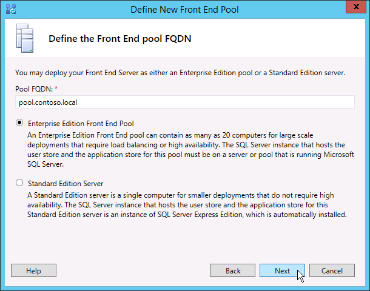
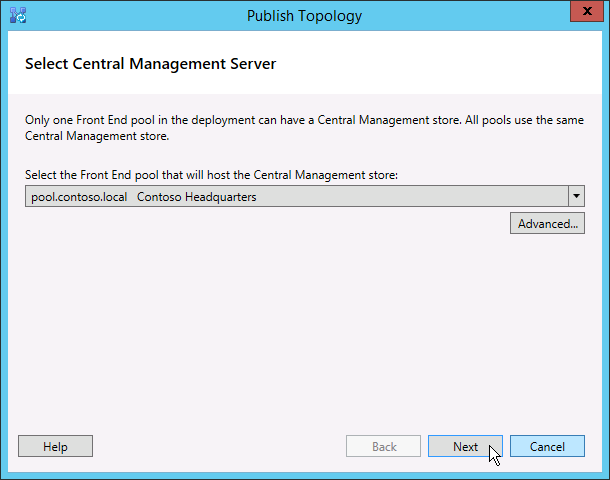

# Criar e publicar nova topologia no Skype for Business Server
 
**Resumo:** Saiba como criar, publicar e verificar uma nova topologia antes de instalar Skype for Business Server. Baixe uma avaliação gratuita de Skype for Business Server do Centro de Avaliação da Microsoft em: [https://www.microsoft.com/evalcenter/evaluate-skype-for-business-server](https://www.microsoft.com/evalcenter/evaluate-skype-for-business-server) .
  
Antes de instalar o Skype for Business Server em cada um dos servidores na topologia, você deve criar uma topologia e publicá-lo. Ao publicar uma topologia, você está carregando as informações de topologia no banco de dados do Armazenamento de Gerenciamento Central. Se for um pool Edição Enterprise, você criará o banco de dados do Armazenamento de Gerenciamento Central na primeira vez que publicar uma nova topologia. Se isso for Edição Standard, você precisará executar o processo Preparar o primeiro servidor Edição Standard do Assistente de Implantação antes de publicar uma topologia. Isso se prepara para Edição Standard instalando uma instância do SQL Server Express Edition e criando o Armazenamento de Gerenciamento Central. Você pode realizar as etapas 1 a 5 em qualquer ordem. No entanto, você deve realizar as etapas 6, 7 e 8 em ordem e após as etapas 1 a 5, conforme descrito no diagrama. Como criar e publicar uma nova topologia é descrito na etapa 6 de 8.
  

  
## Criar e publicar nova topologia

Você pode usar Skype for Business Server Construtor de Topologias para projetar, definir, configurar e publicar topologias. Esta ferramenta foi instalada quando você instalou ferramentas administrativas anteriormente no artigo. Há muitas opções diferentes que você pode fazer ao criar uma topologia. Neste procedimento, você criará uma topologia básica com conferência.
  
> [!IMPORTANT]
> Skype for Business Server requer SQL Server para operar. Os bancos de dados principais são conhecidos como o Armazenamento de Gerenciamento Central. Se você estiver implantando Edição Enterprise, esses bancos de dados serão criados quando você publicar a topologia usando as etapas abaixo. Nesse caso, o Construtor de Topologias solicitará as informações de conexão para uma SQL Server instalação. Se você estiver planejando implantar o Edição Standard, será necessário instalar o SQL Server Express Edition antes de definir e publicar a nova topologia. Para instalar o SQL Server Express Edition, você deve abrir o Assistente de Implantação no servidor que atuará como o Front-End e, em seguida, executar Prepare First Edição Standard Server. Quando você clica em Preparar primeiro Edição Standard Servidor, o Assistente de Implantação instala automaticamente o SQL Server Express Edition e cria os bancos de dados do Armazenamento de Gerenciamento Central. 
  
### Criar uma nova topologia

1. Faça logoff como um usuário padrão com acesso ao Construtor de Topologias.
    
2. Abra Skype for Business Server Construtor de Topologias.
    
3. Selecione **Nova Topologia** e clique em **OK**..
    
4. Selecione um local e um nome de arquivo para o arquivo de configuração de topologia.
    
    > [!NOTE]
    > A configuração de topologia é salva como um arquivo XML do Construtor de Topologias (.tbxml). Quando você publica uma topologia, você está empurrando as informações de configuração do arquivo para o banco SQL Server banco de dados. Ao abrir o Construtor de Topologias no futuro, você pode baixar a configuração existente do SQL Server diretamente no Construtor de Topologias e publicá-la novamente no SQL Server ou salvá-la como um arquivo de configuração do Construtor de Topologias. 
  
5. Na tela **Definir o domínio primário,** insira o **domínio SIP principal** e clique em **Próximo.** Neste exemplo, estamos usando **contoso.local**, conforme mostrado na figura.
    
     
  
6. Adicione outros domínios SIP com suporte e clique em **Próximo**.
    
7. Insira um **Nome** e **Descrição** para o primeiro site (local) e clique em **Próximo**, conforme mostrado na figura.
    
     
  
8. Insira o **código Cidade**, **Estado/Província** e **País/Região** para o site e clique em **Próximo**.
    
9. Clique **em Concluir** para concluir o processo de definição de uma nova topologia. O Assistente de Novo Front-End é lançado automaticamente.
    
### Definir um pool de front-end ou Edição Standard servidor

1. Revise os pré-requisitos do assistente e clique em **Próximo**.
    
2. Insira o FQDN (nome de domínio totalmente qualificado) do pool Edição Enterprise e selecione Pool de **Front-End** ou **Edição Standard Server** e clique em **Próximo,** conforme mostrado na figura.
    
    > [!TIP]
    > Skype for Business Server Edição Enterprise pode incluir vários servidores trabalhando juntos para fornecer a função front-end. Quando vários servidores são usados para cumprir a função, ele é chamado de pool. Assim, vários servidores trabalhando juntos para fornecer a função Front-End também são chamados de pool de Front-End. Skype for Business Server Edição Standard pode incluir apenas um único servidor para fornecer a função Front-End. É comum referir-se ao pool de Front-End mesmo se apenas um único servidor estiver fornecendo a função. 
  
     
  
3. Insira os FQDNs (nomes de domínio totalmente qualificados) de todos os computadores no pool e clique em **Próximo,** conforme mostrado na figura.
    
     
  
4. Selecione os recursos que serão incluídos nesta topologia e clique em **Próximo,** conforme mostrado na figura.
    
    > [!NOTE]
    > Skype for Business Server inclui muitos recursos avançados. Revise a documentação de planejamento e implantação para cada recurso específico que você deseja usar. 
  
     
  
5. Na página **Selecionar funções** de servidor alocadas, você pode optar por colocar o servidor de Mediação no servidor front-end ou pode optar por implantá-lo como um servidor autônomo.
    
    Se você pretende reajustar o servidor de Mediação no pool Edição Enterprise front-end, verifique se a caixa de seleção está selecionada. As funções de servidor serão implantadas nos servidores do pool. Se você pretende implantar o servidor de Mediação como um servidor autônomo, desajuste a caixa de seleção apropriada. Você implantará o servidor de Mediação em uma etapa de implantação separada depois de implantar completamente o servidor Front-End. Para planejar detalhes sobre uma localização, consulte [Topology Basics for Skype for Business Server](../../plan-your-deployment/topology-basics/topology-basics.md).
    
6. Usando a **página Associar funções de servidor a esse pool de Front-End,** você pode definir e associar funções de servidor ao pool de Front-End. A seguinte função está disponível:
    
    **Habilitar um pool de borda** Define e associa um único Servidor de Borda ou um pool de Servidores de Borda. Um Servidor de Borda facilita a comunicação e a colaboração entre usuários dentro da organização e pessoas de fora da organização, incluindo usuários federados.
    
    Há dois cenários possíveis que você pode usar para implantar e associar as funções de servidor.
    
    Para o cenário um, você está definindo uma nova topologia para uma nova instalação. Você pode abordar a instalação de uma das duas seguintes maneiras:
    
   - Deixe a caixa de seleção limpa e defina a topologia. Depois de publicar, configurar e testar as funções de Servidor front-end e back-end, você poderá executar o Construtor de Topologias novamente para adicionar os servidores de função à topologia. Usando essa estratégia, você pode testar o pool de Front-End e o servidor executando SQL Server sem complicações adicionais de funções adicionais. Depois de concluir o teste inicial, você poderá executar o Construtor de Topologias novamente para selecionar as funções que você precisa implantar.
    
   - Selecione as funções que você precisa instalar e configure o hardware para acomodar as funções selecionadas.
    
     Para o cenário dois, você tem uma implantação existente e sua infraestrutura está pronta para novas funções, ou você precisa associar funções existentes a um novo servidor Front-End.
    
   - Nesse caso, você selecionará as funções que pretende implantar ou associar ao novo servidor Front-End. Em qualquer caso, você continuará com a definição das funções, configurar qualquer hardware necessário e continuar com a instalação.
    
7. Em seguida, você definirá o SQL Server que será usado com a topologia. Neste exemplo, usamos a instância Padrão. Para obter mais informações sobre SQL Server recursos, como Alta Disponibilidade, consulte [Plan for high availability and disaster recovery in Skype for Business Server](../../plan-your-deployment/high-availability-and-disaster-recovery/high-availability-and-disaster-recovery.md).
    
   - Para usar um repositório de SQL Server existente que já foi definido em sua topologia, selecione uma instância do **Repositório SQL**.
    
   - Para definir uma nova SQL Server para armazenar informações do pool, clique em Novo **e** especifique o **FQDN** SQL Server na caixa de diálogo Definir novo SQL **Store.**
    
   - Para especificar o nome de uma instância de SQL Server, selecione **Instância nomeada** e especifique o nome da instância.
    
   - Para usar a instância padrão, clique em **Instância padrão**.
    
   - Para usar SQL espelhamento, selecione Habilitar SQL **espelhamento** e selecione uma instância existente ou crie uma nova instância.

     > [!NOTE]
     > SQL O espelhamento está disponível no Skype for Business Server 2015, mas não tem mais suporte no Skype for Business Server 2019. Os grupos de disponibilidade AlwaysOn, Instâncias de Cluster de Failover AlwaysOn (FCI) e SQL de clustering de failover são preferenciais com o Skype for Business Server 2019.
    
     Para este exemplo, inseriremos o **FQDN** de SQL Server , configuramos quaisquer configurações de alta disponibilidade relevantes e, em seguida, clicamos em **OK**, conforme mostrado na figura.
    
     
  
8. Decida se deseja habilitar SQL Server espelhamento ou SQL Server de espelhamento e clique em **Próximo.**
    
9. Defina o compartilhamento de arquivos que você deseja usar.
    
   - Para usar um compartilhamento de arquivo que já foi definido na sua topologia, selecione **Usar um compartilhamento de arquivos definido anteriormente**.
    
   - Para definir um novo compartilhamento de arquivo, selecione **Definir um novo compartilhamento de arquivo** na caixa **FQDN do Servidor de Arquivos**, insira o FQDN do servidor de arquivos existente onde o compartilhamento de arquivo deve residir e insira um nome para o compartilhamento de arquivo na caixa **Compartilhamento de Arquivos**.
    
     Para este exemplo, clicaremos em Definir um novo armazenamento de **arquivos,** inseriremos o **FQDN** do servidor de arquivos e o **compartilhamento** de arquivos e clicaremos em **Próximo**.
    
     > [!NOTE]
     > O compartilhamento de arquivos Skype for Business Server pode ser alocado, mas não é recomendado por motivos de desempenho. Observe que, neste exemplo, o compartilhamento de arquivos foi localizado em um único servidor dedicado que atuará como o compartilhamento de arquivos. No entanto, outros sistemas de compartilhamento de arquivos mais robustos, como DFS usando Windows Server 2012 R2, são recomendados. Para obter detalhes sobre sistemas de compartilhamento de arquivos suportados, consulte [Requirements for your Skype for Business environment](../../plan-your-deployment/requirements-for-your-environment/requirements-for-your-environment.md). Para obter mais informações sobre como criar o compartilhamento de arquivos, consulte [Create a file share in Skype for Business Server](create-a-file-share.md). Você pode definir o compartilhamento de arquivos sem que este tenha sido criado. Será necessário criar o compartilhamento de arquivos no local que você definir antes de publicar a topologia. 
  
10. Na página Especificar a URL dos Serviços Web, você deve decidir se precisa substituir a URL base interna do pool de Serviços Web. O motivo dessa substituição tem a ver com o balanceamento de carga. O tráfego SIP básico pode ser balanceado por meio do balanceamento de carga DNS simples. No entanto, o tráfego de rede de Serviços Web HTTP/S deve usar uma solução de balanceamento de carga de Hardware ou Software com suporte. Para balanceadores de carga com suporte, consulte [Infrastructure for Skype for Business](../../../SfbPartnerCertification/certification/infra-gateways.md). Neste exemplo, utilizamos o balanceamento de carga DNS para tráfego SIP e uma solução de balanceamento de carga de software com suporte. Como estamos dividindo o tráfego dessa maneira, precisamos substituir o FQDN do pool de Serviços Web interno. Como alternativa, se tivessemos um balanceador de carga de linha superior e enviasse todo o tráfego por ele em vez de usar o balanceamento de carga DNS para o tráfego SIP, não precisaríamos substituir a URL dos Serviços Web. 
    
    Na seção DNS deste tópico, criamos um registro A para webint.contoso.local. Essa é a URL que estamos usando para o tráfego HTTP/S dos serviços Web e deve passar pelo balanceador de carga de software com suporte que configuramos. Portanto, neste exemplo, substituimos a URL para que Skype for Business Server saiba que todo o tráfego HTTP/S deve ir para webint.contoso.local em vez de pool.contoso.local, conforme mostrado na figura. Para obter mais informações sobre balanceamento de carga, consulte [Requisitos de balanceamento](../../plan-your-deployment/network-requirements/load-balancing.md)de carga para Skype for Business .
    
    > [!IMPORTANT]
    > A URL base é a identidade dos Serviços Web para a URL, menos o https://. Por exemplo, se a URL completa dos Serviços Web do pool for , a https://webint.contoso.local URL base será webint.contoso.local. 
  
    - Se você estiver configurando o balanceamento de carga DNS, como estamos neste exemplo, marque a caixa de seleção Substituir **FQDN** do pool de Serviços Web internos e insira a URL base interna (que deve ser diferente do FQDN do pool) na URL base **interna.** 
    
    > [!CAUTION]
    > Se você decidir substituir os Serviços Web Internos por um FQDN auto-definido, cada FQDN deve ser exclusivo de qualquer outro pool de Front-End, Diretor ou Pool de Diretores. **Use somente caracteres** padrão (incluindo A-Z, a-z, 0-9 e hífens) quando você definir URLs ou nomes de domínio totalmente qualificados. Não use caracteres Unicode ou sublinhados. Caracteres não padrão em uma URL ou FQDN geralmente não são suportados por CAs (autoridades de certificação públicas e DNS externos) (ou seja, quando a URL ou FQDN deve ser atribuída ao nome do assunto ou nome alternativo do assunto no certificado).
  
    - Opcionalmente, insira a URL base externa na **URL base externa**. Você inseriria a URL base externa para diferenciá-la do seu nome de domínio interno. Por exemplo, seu domínio interno é contoso.local, mas seu nome de domínio externo é contoso.com. Você definiria a URL usando o nome contoso.com domínio, pois ela deve ser resolvêvel a partir do DNS público. Isso também é importante no caso de um proxy reverso. O nome de domínio da URL base externa seria igual ao nome de domíniodo  FQDN do proxy inverso. O acesso HTTP ao pool de Front-End é necessário para mensagens instantâneas e presença em clientes móveis.
    
      
  
11. Se você **selecionou Conferência** na página **Selecionar Recursos,** será solicitado a selecionar um servidor Office Web Apps. Clique **em Novo** para iniciar a caixa de diálogo.
    
12. Na caixa **de diálogo Definir novo Office Web Apps Server,** digite o FQDN do seu servidor Office Web Apps na caixa **FQDN** do servidor Office Web Apps; Ao fazer isso, sua URL Office descoberta do servidor Web Apps deve ser inserida automaticamente na caixa URL de descoberta Office **Web Apps Server.**
    
    Se o servidor Office Web Apps estiver instalado no local e na mesma zona de rede do Skype for Business Server, não selecione a opção Office Web Apps Server é implantada em uma rede **externa (ou seja, perímetro/Internet)**.
    
    Se o servidor Office Web Apps for implantado fora do firewall interno, selecione a opção Office Web Apps Server é implantada em uma rede externa **(ou seja, perímetro/Internet)**.
    
13. Clique **em Concluir** para concluir a configuração. Se você definiu outros servidores de função na página Associar funções de servidor com essa página de pool de **Front-End,** as páginas separadas do assistente de configuração de função serão abertas onde você poderá configurar as funções de servidor. Neste exemplo, escolhemos apenas conferência.
    
### Configurar URLs simples

1. No Construtor de Topologias, clique com o botão direito do mouse **Skype for Business Server** nó superior e clique em **Editar Propriedades**, conforme mostrado na figura.
    
     
  
2. No painel **URLs** simples, selecione **URLs** de Telefone de acesso: (Discagem) ou **URLs de Reunião:** (Reunir) para editar e clique em **Editar URL**.
    
3. Atualize a URL para o valor desejado e clique em **OK** para salvar a URL editada. Você deve configurar a URL simples usando o domínio SIP externo para que os usuários externos possam participar de reuniões, por exemplo, contoso.com, que é externa, em vez de contoso.local, que é um domínio interno. Assim, o domínio SIP deve ser capaz de ser resolvido por DNS externo.
    
4. Edite a URL de Reunião usando as mesmas etapas, se necessário.
    
### Para definir a URL simples Admin opcional

1. No Construtor de Topologias, clique com o botão direito do mouse **no nó Skype for Business Server** e clique em Editar **Propriedades**.
    
2. Na caixa **URL de acesso** administrativo, insira a URL simples que você deseja para acesso administrativo Skype for Business Server Painel de Controle e clique em **OK**.
    
    > [!TIP]
    > Recomendamos usar a URL mais simples possível para a URL Admin. A opção mais simples é https://admin _\<domain\>_ . A URL do administrador pode ser um domínio interno ou externo, por exemplo, contoso.local ou contoso.com, desde que um dos registros seja resolvido no DNS interno. 
  
    > [!IMPORTANT]
    > Se você alterar uma URL simples após a implantação inicial, esteja ciente das alterações que afetam seus registros de DNS (Sistema de Nome de Domínio) e certificados para URLs simples. Se a alteração afetar a base de uma URL simples, você também deverá alterar os registros e certificados DNS. Por exemplo, mudar de para altera a URL base de sfb.contoso.com para meet.contoso.com, portanto, você precisaria alterar os registros DNS e certificados para se referir a https://sfb.contoso.com/Meet https://meet.contoso.com meet.contoso.com. Se você alterou a URL simples de para , a URL base do sfb.contoso.com permanece a mesma, portanto, https://sfb.contoso.com/Meet nenhuma alteração de DNS ou certificado é https://sfb.contoso.com/Meetings necessária. Sempre que você alterar um nome de URL simples, no entanto, você deve executar o cmdlet **Enable-CsComputer** em cada diretor e servidor front-end para registrar a alteração.
  
### Publicar e verificar a topologia

1. Verifique se todas as URLs simples estão configuradas corretamente.
    
2. Confirme se SQL Server servidor baseado em SQL Server está online e disponível para o computador onde o Construtor de Topologias está instalado, incluindo quaisquer regras de firewall necessárias.
    
3. Confirme se o compartilhamento de arquivos está disponível e se as permissões adequadas estão definidas.
    
4. Confirme se as funções de servidor corretas que atendem aos requisitos de implantação estão definidas na topologia.
    
5. Verifique se os servidores existem nos Serviços de Domínio do Active Directory (AD DS). Isso acontece automaticamente quando você ins junta os servidores ao domínio.
    
    Após a verificação da topologia e se não houver erros de validação, você deverá estar pronto para publicar a topologia. Se houver erros de validação, você deve corrigi-los antes de publicar a topologia.
    
6. Clique com o botão direito do **mouse no nó Skype for Business Server** e clique em Publicar **Topologia**.
    
7. Na página **Publicar a Topologia**, clique em **Avançar**.
    
8. Na página **Selecionar Servidor de Gerenciamento Central,** selecione um pool de Front-End, conforme mostrado na figura.
    
    > [!NOTE]
    > Você pode clicar em **Avançado para** configurar locais de arquivo de banco de dados.
  
     
  
9. Na página **Selecionar bancos de** dados, selecione os bancos de dados que você deseja publicar.
    
    > [!NOTE]
    > Se você não tiver os direitos apropriados para criar os bancos de dados, poderá desempurar as caixas de seleção ao lado desses bancos de dados, e alguém com direitos apropriados poderá criar os bancos de dados posteriormente. Para obter detalhes sobre os requisitos, consulte [Requisitos de servidor para Skype for Business Server](../../plan-your-deployment/requirements-for-your-environment/server-requirements.md). 
  
10. Opcionalmente, clique **em Avançado**. Usando opções avançadas SQL Server de posicionamento de arquivo de dados, você pode selecionar entre as seguintes opções: 
    
    - **Determinar automaticamente** o local do arquivo de banco de dados - Essa opção determina o melhor desempenho operacional com base na configuração de disco em seu servidor baseado em SQL Server, distribuindo os arquivos de log e dados para o melhor local.
    
    - **Use SQL Server de** instância - Essa opção coloca arquivos de log e dados no servidor SQL Server baseado em SQL Server usando as configurações de instância. Essa opção não usa a funcionalidade operacional do servidor baseado em SQL Server para determinar locais ideais para logs e dados. O SQL Server administrador normalmente moveria os arquivos de log e dados para locais apropriados para os procedimentos de gerenciamento do servidor e da organização baseados em SQL Server.
    
    Clique em **OK**, e depois clique em **Avançar**. 
    
11. Opcionalmente, clique em **Avançado**. Usando opções avançadas SQL Server de posicionamento de arquivo de dados, você pode selecionar entre as seguintes opções: 
    
    - **Determinar automaticamente** o local do arquivo de banco de dados - Essa opção determina o melhor desempenho operacional com base na configuração de disco em seu servidor baseado em SQL Server, distribuindo os arquivos de log e dados para o melhor local.
    
    - **Use SQL Server de** instância - Essa opção coloca arquivos de log e dados no servidor SQL Server baseado em SQL Server usando as configurações de instância. Essa opção não usa a funcionalidade operacional do servidor baseado em SQL Server para determinar locais ideais para logs e dados. O SQL Server administrador normalmente moveria os arquivos de log e dados para locais apropriados para os procedimentos de gerenciamento do servidor e da organização baseados em SQL Server.
    
    Clique em **OK**.
    
12. Clique **em Próximo** para concluir o processo de publicação.
    
    > [!NOTE]
    > Uma falha comum para esta etapa é que os bancos de dados SQL Server não podem ser criados. Quando o processo não pode ser concluído, um erro é fornecido, conforme mostrado na figura. A causa mais provável é que o usuário que está tentando criar o banco de dados não tenha as permissões apropriadas, ou o sistema SQL Server não pode ser contatado devido a um firewall ou outro problema de rede. 
  
     
  
13. Quando o processo de publicação é concluído, você recebe um link para abrir uma lista das próximas etapas. Clique **em Clique aqui para abrir a lista de a fazer** para exibir as próximas etapas e clique em **Concluir**. 
    
    A mensagem "Concluído com avisos" para a criação do banco de dados não significa que houve um erro. O processo de instalação precisa alterar as configurações no SQL Server para que Skype for Business Server funcione corretamente. Quando uma configuração é alterada SQL Server, ela é registrada como um aviso para que os administradores SQL Server possam entender exatamente o que o processo de instalação foi concluído. Se você receber um aviso, poderá selecionar o registro e clicar em **Exibir Logs** para exibir os detalhes do aviso.
    
    Quando a topologia tiver sido publicada com êxito, você poderá começar a instalar uma réplica local do armazenamento de Gerenciamento Central em cada servidor executando Skype for Business Server em sua topologia. Recomendamos que você comece com o primeiro pool de Front-End. 
