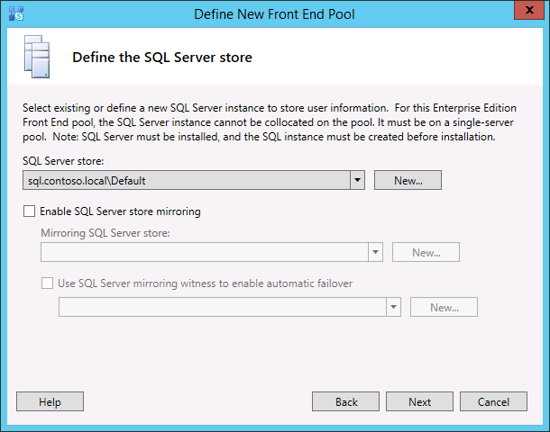

# Criar e publicar a nova topologia no Skype para Business Server
 
**Resumo:** Saiba como criar, publicar e verifique se uma nova topologia antes de instalar o Skype para Business Server. Baixe uma versão de avaliação gratuita do Skype para Business Server do centro da Evaluation da Microsoft em: [https://www.microsoft.com/evalcenter/evaluate-skype-for-business-server](https://www.microsoft.com/evalcenter/evaluate-skype-for-business-server).
  
Antes de instalar o Skype para system Business Server em cada um dos servidores na topologia, você deve criar uma topologia e publicá-lo. Ao publicar uma topologia, você está carregando as informações da topologia no banco de dados do Repositório de Gerenciamento Central. Se o repositório for um pool Enterprise Edition, você criará o banco de dados do Repositório de Gerenciamento Central quando publicar uma nova topologia pela primeira vez. Se o repositório for um pool Standard Edition, você terá que executar o processo "Preparar primeiro servidor Standard Edition" no Assistente de Implantação antes de publicar a topologia. Esse processo prepara o Standard Edition por meio da instalação de uma instância do SQL Server Express Edition e da criação do Repositório de Gerenciamento Central. Você pode executar as etapas de 1 a 5 em qualquer ordem. No entanto, as etapas 6, 7 e 8 devem ser executadas nessa ordem, após a conclusão das etapas de 1 a 5, conforme descrito no diagrama. A criação e publicação da nova topologia são descritas na etapa 6.
  

  
## Criar e publicar nova topologia

Você pode usar Skype para o construtor de topologia de servidor de negócios para projetar, definir, configurar e publicar as topologias. Essa ferramenta foi instalada quando você instalou as Ferramentas Administrativas no início do artigo. Há diversas opções diferentes para a criação da topologia. Neste procedimento, você criará uma topologia básica com conferências.
  
> [!IMPORTANT]
> Skype para Business Server requer o SQL Server para operar. Os bancos de dados primários são conhecidos como Repositório de Gerenciamento Central. Se você estiver implantando a Enterprise Edition, esses bancos de dados serão criados quando você publicar a topologia por meio das etapas descritas abaixo. Nesse caso, o Construtor de Topologias solicitará as informações necessárias para conectar-se a uma instalação do SQL Server. Se estiver planejando implantar o Standard Edition, você precisará instalar o SQL Server Express Edition para definir e publicar a nova topologia. Para instalar o SQL Server Express Edition, você deve abrir o Assistente de Implantação no servidor que atuará como front-end e executar o procedimento "Preparar primeiro servidor Standard Edition". Quando você clicar em "Preparar primeiro servidor Standard Edition", o Assistente de Implantação instalará automaticamente o SQL Server Express Edition e criará os bancos de dados do Repositório de Gerenciamento Central. 
  
### Criar uma nova topologia

1. Faça logon como usuário padrão com acesso ao Construtor de Topologias
    
2. Abra o Skype do construtor de topologia de servidor de negócios.
    
3. Selecione **Nova Topologia** e clique em **OK**.
    
4. Selecione um local para o arquivo de configuração de topologia e atribua um nome a ele.
    
    > [!NOTE]
    > A configuração da topologia é salva como um arquivo XML do Construtor de Topologias (.tbxml). Ao publicar uma topologia, você envia as informações de configuração do arquivo para o banco de dados do SQL Server. Quando abrir o Construtor de Topologias posteriormente, você poderá baixar as configurações existentes do SQL diretamente para o Construtor de Topologias e publicá-las no SQL Server ou salvá-las como uma arquivo de configuração do Construtor de Topologias. 
  
5. Na tela **Definir o domínio primário**, digite o **domínio SIP primário** e clique em **Avançar**. Neste exemplo, usamos **contoso.local**, conforme mostra a figura.
    
     
  
6. Adicione os domínios SIP compatíveis que desejar e clique em **Avançar**.
    
7. Digite um **Nome** e uma **Descrição** para o primeiro site (local) e clique em **Avançar**, conforme mostra a figura.
    
     
  
8. Digite a **Cidade**, o **Estado/Província** e **Código do País/Região** do site e clique em **Avançar**.
    
9. Clique em **Concluir** para finalizar o processo de definição de nova topologia. O Assistente de Novo Front-End inicia automaticamente.
    
### Definir um pool de front-end ou um servidor Standard Edition

1. Leia os pré-requisitos do assistente e clique em **Avançar**.
    
2. Insira o FQDN (nome de domínio totalmente qualificado) do pool e selecione **Pool de Front-Ends Enterprise Edition** ou **Standard Edition Server** e clique em **Avançar**, conforme mostra a figura.
    
    > [!TIP]
    > Skype para Business Server Enterprise Edition pode incluir vários servidores trabalhando juntos para fornecer a função de Front-End. Quando vários servidores são usados para atender a função, ele é denominado um pool. Assim, vários servidores trabalhando juntos para fornecer a função de Front-End também é conhecida como o pool de Front-End. Skype para Business Server Standard Edition pode incluir apenas um único servidor para fornecer a função de Front-End. É comum referir-se ao pool de Front-End, mesmo se um único servidor está fornecendo a função. 
  
     
  
3. Digite os FQDNs de todos os computadores do pool e clique em **Avançar**, conforme mostra a figura.
    
     
  
4. Selecione os recursos que serão incluídos nessa topologia e clique em **Avançar**, conforme mostra a figura.
    
    > [!NOTE]
    > Skype para Business Server inclui vários recursos avançados. Leia a documentação de planejamento e implantação de cada recurso que você deseja usar. 
  
     
  
5. Na página **Selecionar servidor colocado funções** , você pode optar por colocar o servidor de mediação no servidor Front-End ou você pode optar por implantá-lo como um servidor autônomo.
    
    Se você pretende colocar o Servidor de Mediação no pool de front-ends Enterprise Edition, verifique se a caixa de seleção está marcada. A função de servidor será implantada nos servidores do pool. Se você pretende implantar o Servidor de Mediação como um servidor autônomo, limpe a caixa de seleção correspondente. Após a implantação do servidor Front-End completamente, você implantará o servidor de mediação em uma etapa de implantação separada. Para planejar os detalhes sobre a colocação de uma, consulte [Noções básicas de topologia para Skype para Business Server](../../plan-your-deployment/topology-basics/topology-basics.md).
    
6. Na página **Associar funções de servidor a este pool de front-ends**, você pode definir e associar funções de servidor com o pool de front-ends. A seguinte função está disponível:
    
    **Habilitar um pool de borda** Define e associa um único servidor de borda ou um pool de servidores de borda. O servidor de borda intermedia a comunicação e colaboração entre os usuários dentro da organização e as pessoas de fora da organização, inclusive usuários federados.
    
    Existem dois cenários possíveis que você pode usar para implantar e associar as funções do servidor.
    
    No cenário um, você está definindo uma nova topologia para uma nova instalação. É possível abordar a instalação de uma das duas formas a seguir:
    
   - Desmarque a caixa de seleção e defina a topologia. Após publicar, configurar e testar as funções de servidor front-end e back-end, execute o Construtor de Topologias novamente para adicionar os servidores de função à topologia. Com essa estratégia, você poderá testar o pool de front-ends e o servidor que executa o SQL Server sem complicações adicionais de funções adicionais. Depois de concluir o teste inicial, execute o Construtor de Topologias novamente para selecionar as funções necessárias para implantação.
    
   - Selecione as funções que você precisa instalar e configure o hardware para acomodar as funções selecionadas.
    
    No cenário dois, você tem uma implantação existente e sua infraestrutura está pronta para novas funções ou você precisa associar as funções existentes a um novo servidor front-end.
    
   - Nesse caso, você vai selecionar as funções que pretende implantar ou associar ao novo servidor front-end. Em qualquer um dos casos, você continuará com a definição das funções, a configuração do hardware necessário e a instalação.
    
7. Em seguida, você definirá o repositório de SQL Server que será usado nessa topologia. Nesse exemplo, usamos a instância padrão. Para obter mais informações sobre os recursos do SQL Server, como alta disponibilidade, consulte [Planejar a alta disponibilidade e recuperação de desastres em Skype para Business Server](../../plan-your-deployment/high-availability-and-disaster-recovery/high-availability-and-disaster-recovery.md).
    
   - Para usar um repositório de SQL Server existente que já foi definido em sua topologia, selecione uma instância do **Repositório SQL**.
    
   - Para definir uma nova instância do SQL Server para armazenar informações de pool, clique em **novo**e, em seguida, especifique o **FQDN do SQL Server** na caixa de diálogo **Definir novo repositório SQL** .
    
   - Para especificar o nome de uma instância de SQL Server, selecione **Instância Nomeada** e especifique o nome da instância.
    
   - Para usar a instância padrão, clique em **Instância padrão**.
    
   - Para usar o espelhamento SQL, selecione **Habilitar espelhamento do SQL** e selecione uma instância existente ou crie uma nova instância.

    > [!NOTE]
    > Espelhamento do SQL está disponível no Skype para Business Server 2015, mas não é mais suportado no Skype para Business Server 2019. Os métodos de cluster de failover de grupos de disponibilidade AlwaysOn, instâncias de Cluster de Failover AlwaysOn (FCI) e SQL terão preferência com Skype para Business Server 2019.
    
    Nesse exemplo, vamos inserir o **FQDN do SQL Server**, definir as configurações de alta disponibilidade relevantes e clicar em **OK**, conforme mostra a figura.
    
     
  
8. Decida se você deseja habilitar o espelhamento do repositório de SQL Server ou a testemunha de espelhamento do SQL Server e clique em **Avançar**.
    
9. Defina o compartilhamento de arquivos que você deseja usar.
    
   - Para usar um compartilhamento de arquivo que já foi definido na sua topologia, selecione **Usar um compartilhamento de arquivos previamente definido**.
    
   - Para definir um novo compartilhamento de arquivo, selecione **Definir um novo compartilhamento de arquivo** na caixa **FQDN do Servidor de Arquivos**, insira o FQDN do servidor de arquivos existente onde o compartilhamento de arquivo deve residir e insira um nome para o compartilhamento de arquivo na caixa **Compartilhamento de Arquivos**.
    
    Nesse exemplo, vamos clicar em **Defina um novo repositório de arquivos**, inserir o **FQDN do servidor de arquivos** e o **compartilhamento de arquivo** e clicar em **Avançar**.
    
    > [!NOTE]
    > O compartilhamento de arquivo para Skype para Business Server pode ser colocado, mas isso não é recomendável por razões de desempenho. Observe que, nesse exemplo, o compartilhamento de arquivo localiza-se em um servidor dedicado que atuará como compartilhamento de arquivo. No entanto, recomendamos outros sistemas mais robustos de compartilhamento de arquivos, como o DFS com o uso do Windows Server 2012 R2. Para obter detalhes sobre os sistemas de compartilhamento de arquivos suportados, consulte [Requirements for sua Skype para ambiente de negócios](../../plan-your-deployment/requirements-for-your-environment/requirements-for-your-environment.md). Para obter mais informações sobre como criar o compartilhamento de arquivos, consulte [criar um compartilhamento de arquivo no Skype para Business Server](create-a-file-share.md). Você pode definir o compartilhamento de arquivos sem que ele tenha sido criado. Além disso, você precisará criar o compartilhamento de arquivos no local definido para poder publicar a topologia. 
  
10. Na página Especificar a URL dos Serviços Web, você deve decidir se é necessário substituir a URL básica do pool interno de serviços Web. Essa substituição está relacionado ao balanceamento de carga. A carga do tráfego SIP básico pode ser balanceada por meio do balanceamento de carga de DNS simples. No entanto, o tráfego de rede HTTP/HTTPS dos serviços Web deve usar uma solução de balanceamento de carga de hardware ou software compatível. Para balanceadores de carga com suporte, consulte [infraestrutura para Skype para negócios](https://docs.microsoft.com/SkypeForBusiness/certification/infra-gateways). Nesse exemplo, nós usamos o balanceamento de carga de DNS para o tráfego SIP e uma solução de balanceamento de carga de software compatível. Como estamos dividindo o tráfego dessa forma, precisamos substituir o FQDN do pool interno de serviços Web. Se tivéssemos um balanceador de carga de linha superior e enviássemos todo o tráfego por meio dele, em veze de usar o balanceamento de carga de DNS para o tráfego SIP, não seria necessário substituir a URL dos serviços Web. 
    
    Na seção DNS deste tópico, nós criamos um registro A para webint.contoso.local. Essa é a URL que estamos usando para o tráfego HTTP/HTTPS dos serviços Web, e ela deve passar pelo balanceador de carga do software compatível que configuramos. Portanto, neste exemplo, podemos substituir a URL para informar Skype para Business Server que todo o tráfego HTTP/S deve ir para webint.contoso.local, em vez de pool.contoso.local, conforme mostrado na figura. Para obter mais informações sobre o balanceamento de carga, consulte [requisitos de carga balanceamento para Skype para negócios](../../plan-your-deployment/network-requirements/load-balancing.md).
    
    > [!IMPORTANT]
    > A URL base é a identidade dos serviços Web para a URL, menos "https://". Por exemplo, se a URL completa para os serviços Web do pool é https://webint.contoso.local, a URL base é webint.contoso.local. 
  
    - Se você estiver configurando o balanceamento de carga de DNS, como estamos fazendo nesse exemplo, marque a caixa de seleção **Substituir o FQDN do pool interno de serviços Web** e insira a URL base interna (que deve ser diferente do FQDN de pool) em **URL base interna**. 
    
    > [!CAUTION]
    > Se você decidir substituir os serviços Web internos por um FQDN autodefinido, cada FQDN deverá ser exclusivo de qualquer outro pool de front-ends, diretor ou um pool de diretores. **Use somente caracteres padrão** (incluindo A-Z, a-z, 0-9 e hifens) quando você define URLs ou nomes de domínio totalmente qualificados. Não use caracteres Unicode nem sublinhados. Caracteres não padrão em uma URL ou FQDN, em geral, não recebem suporte de DNSs externos e CAs públicas (ou seja, quando for necessário atribuir a URL ou o FQDN ao nome da entidade ou ao nome alternativo da entidade no certificado).
  
    - Opcionalmente, insira a URL base externa em **URL Base Externa**. Insira a URL base externa para diferenciá-la do nome de domínio interno. Por exemplo, seu domínio interno é contoso.local, mas seu nome de domínio externo é contoso.com. Você deve definir a URL usando o nome do domínio contoso.com, pois deve ser possível resolvê-la no DNS público. Isso também é importante no caso de um proxy reverso. O nome de domínio da URL base externa seria igual ao nome de domínio do FQDN do proxy inverso. As mensagens instantâneas e presença exigem acesso HTTP ao pool de front-ends em clientes móveis.
    
     
  
11. Se você selecionou **Conferência** na página **Selecionar Recursos**, o sistema solicitará que você selecione um servidor do Office Web Apps. Clique em **Novo** para iniciar a caixa de diálogo.
    
12. Na caixa de diálogo **Definir Novo Servidor do Office Web Apps**, digite o FQDN do servidor do Office Web Apps na caixa **FQDN do Servidor do Office Web Apps**. Quando você fizer isso, a URL de descoberta de seu servidor do Office Web Apps deverá ser inserida automaticamente na caixa **URL de descoberta de Servidor Office Web Apps:**.
    
    Se o servidor de Office Web Apps estiver instalado no local e na mesma zona do Skype para Business Server, não marque a opção **Office Web Apps Server é implantado em uma rede externa (ou seja, de perímetro/Internet)**.
    
    Se o servidor do Office Web Apps estiver implantado fora do seu firewall interno, selecione a opção **O servidor do Office Web Apps está implantado em uma rede externa (ou seja, de perímetro/Internet)**.
    
13. Clique em **Concluir** para finalizar a configuração. Se você definiu outros servidores de função na página **Associar funções de servidor a este pool de front-ends**, páginas separadas do assistente de configuração de funções serão abertas para permitir a configuração das funções de servidor. Nesse exemplo, escolhemos somente a conferência:
    
### Configurar URLs simples

1. No construtor de topologia, com o botão direito no nó superior do **Skype para Business Server** e clique em **Editar propriedades**, conforme mostrado na figura.
    
     
  
2. No painel **URLs Simples**, selecione **URLs de acesso telefônico:** (Discagem) ou **URLs de Reunião:** (Reunião) para editar. Em seguida, clique em **Editar URL**.
    
3. Atualize a URL para o valor desejado e, em seguida, clique em **Okey** para salvar a URL editada. Você deve configurar a URL simples usando o domínio SIP externo, de modo que os usuários externos podem ingressar em reuniões, por exemplo, contoso.com, que é externo, em vez de contoso. local, que é um domínio interno. Assim, o domínio SIP deve ser capaz de ser resolvido pelo DNS externo.
    
4. Siga as mesmas etapas para editar a URL de Reunião, se necessário.
    
### Para definir a URL simples Admin opcional

1. No construtor de topologia, clique com botão direito no nó do **Skype para Business Server** e, em seguida, clique em **Editar propriedades**.
    
2. Na caixa **URL de acesso administrativo** , digite a URL simples que você deseja para acesso administrativo ao Skype para painel de controle do Business Server e clique em **Okey**.
    
    > [!TIP]
    > Nós recomendamos que você use a URL do administrador mais simples possível. É a opção mais simples https://admin. _ \<domínio\>_. A URL do administrador pode ser um domínio interno ou externo (por exemplo, contoso.local ou contoso.com, respectivamente), contando que o DNS interno seja capaz de resolver qualquer um dos registros. 
  
    > [!IMPORTANT]
    > Se alterar uma URL simples após a implantação inicial, você deve saber quais alterações afetam os registros de DNS e os certificados das URLs simples. Se a alteração afeta a base de uma URL simples, você deve alterar os registros DNS e certificados, muito. Por exemplo, a alteração de https://sfb.contoso.com/Meet para https://meet.contoso.com altera a URL base do sfb.contoso.com para meet.contoso.com, portanto, seria necessário alterar os registros DNS e certificados para se referir a meet.contoso.com. Se você alterou a URL simples de https://sfb.contoso.com/Meet para https://sfb.contoso.com/Meetings, a URL base do sfb.contoso.com permanece o mesmo, portanto, não há DNS ou se forem necessárias alterações de certificado. Sempre que você alterar um nome de URL simple, no entanto, você deve executar o cmdlet **Enable-CsComputer** em cada diretor e Front-End server para registrar a alteração.
  
### Publicar e verificar a topologia

1. Verifique se todas as URLs simples estão configuradas corretamente.
    
2. Verifique se o servidor baseado em SQL Server está online e disponível para o computador no qual o Construtor de Topologias está instalado, incluindo quaisquer regras de firewall necessárias.
    
3. Verifique se o compartilhamento de arquivos está disponível e se as permissões adequadas foram definidas.
    
4. Verifique se as funções de servidor corretas que atendem aos requisitos de implantação estão definidas na topologia.
    
5. Verifique se os servidores existem nos AD DS (serviços de domínio Active Directory). Isso acontece automaticamente quando você adiciona os servidores ao domínio.
    
    Após a verificação da topologia, se não houver erros de validação, você estará pronto para publicar a topologia. Se houver erros de validação, será necessário corrigi-los antes de publicar a topologia.
    
6. Clique com o botão direito no nó **Skype for Business Server** e, em seguida, clique em **Publicar Topologia**.
    
7. Na página **Publicar a topologia**, clique em **Avançar**.
    
8. Na página **Selecionar um Servidor de Gerenciamento Central**, selecione um pool de front-ends, conforme mostra a figura.
    
    > [!NOTE]
    > Você pode clicar em **Avançado** para configurar os locais dos arquivos de banco de dados.
  
     
  
9. Na página **Selecionar bancos de dados**, selecione os bancos de dados que deseja publicar.
    
    > [!NOTE]
    > Se você não possui os direitos apropriados para criar os bancos de dados, você poderá desmarcar as caixas de seleção ao lado desses bancos de dados e alguém com direitos apropriados posteriormente pode criar os bancos de dados. Para obter detalhes sobre os requisitos, consulte [requisitos de servidor para Skype para Business Server](../../plan-your-deployment/requirements-for-your-environment/server-requirements.md). 
  
10. Opcionalmente, clique em  **Avançado**. As opções avançadas de posicionamento do arquivo de dados do SQL Server permitem selecionar uma das seguintes opções: 
    
    - **Determinar o local do arquivo de banco de dados automaticamente** - esta opção determina o melhor desempenho operacional com base na configuração de disco em seu servidor baseado em SQL Server, distribuir os arquivos de log e de dados para o melhor local.
    
    - **Use o SQL Server instância padrões** - essa opção coloca os arquivos de log e dados logon no servidor baseado em SQL Server usando as configurações de instância. Essa opção não usar a funcionalidade operacional do servidor baseado em SQL Server para determinar os locais ideais para logs e dados. O administrador do SQL Server normalmente seria mover os arquivos de log e de dados para os locais apropriados para procedimentos de gerenciamento de servidor e organização baseada em SQL Server.
    
    Clique em **OK** e, em seguida, em **Avançar**. 
    
11. Opcionalmente, clique em **Avançado**. As opções avançadas de posicionamento do arquivo de dados do SQL Server permitem selecionar uma das seguintes opções: 
    
    - **Determinar o local do arquivo de banco de dados automaticamente** - esta opção determina o melhor desempenho operacional com base na configuração de disco em seu servidor baseado em SQL Server, distribuir os arquivos de log e de dados para o melhor local.
    
    - **Use o SQL Server instância padrões** - essa opção coloca os arquivos de log e dados logon no servidor baseado em SQL Server usando as configurações de instância. Essa opção não usar a funcionalidade operacional do servidor baseado em SQL Server para determinar os locais ideais para logs e dados. O administrador do SQL Server normalmente seria mover os arquivos de log e de dados para os locais apropriados para procedimentos de gerenciamento de servidor e organização baseada em SQL Server.
    
    Clique em **OK**.
    
12. Clique em **Avançar** para concluir o processo de publicação.
    
    > [!NOTE]
    > É comum não conseguir criar os bancos de dados do SQL Server nessa etapa. Quando não é possível concluir o processo, o sistema apresenta um erro, conforme mostra a figura. A causa mais provável é que o usuário que está tentando criar o banco de dados não tenha as permissões necessárias ou que não seja possível entrar em contato com o sistema do SQL Server devido a um problema no firewall ou a outro problema de rede. 
  
     
  
13. Ao final do processo de publicação, o sistema apresentará um link para uma lista com as próximas etapas. Clique em **Clique aqui para abrir a lista de tarefas pendentes** para exibir a lista com as próximas etapas e clique em **Concluir**. 
    
    A mensagem "Concluído com avisos" exibida para a criação do banco de dados não indica que houve um erro. O processo de instalação deve alterar as configurações no SQL Server para Skype para Business Server funcione corretamente. Quando uma configuração é alterada no SQL Server, ela é registrada como um aviso para que os administradores do SQL Server possam entender exatamente o que o processo de instalação fez. Se você receber um aviso, você pode selecionar o registro e, em seguida, clique em **Exibir Logs** para exibir os detalhes de aviso.
    
    Quando a topologia foi publicada com êxito, você pode começar a instalar uma réplica local do repositório de gerenciamento Central em cada servidor que executa o Skype para Business Server em sua topologia. É recomendável começar com o primeiro pool de front-ends. 
    

