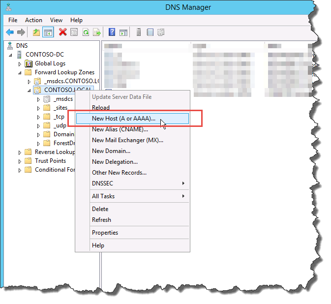
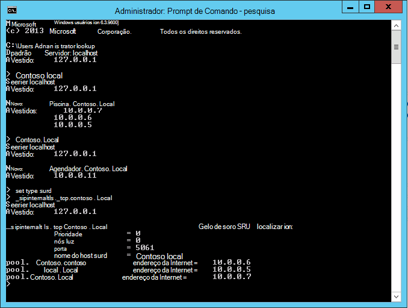

# Criar registros DNS para Skype for Business Server
 
**Resumo:** Saiba como configurar o DNS e criar registros DNS para uma instalação de Skype for Business Server. Baixe uma avaliação gratuita de Skype for Business Server do Centro de Avaliação da Microsoft em: [https://www.microsoft.com/evalcenter/evaluate-skype-for-business-server](https://www.microsoft.com/evalcenter/evaluate-skype-for-business-server).
  
Para Skype for Business Server funcionar corretamente, uma série de configurações do Sistema de Nomes de Domínio (DNS) deve estar no local. Isso é para que os clientes saibam como acessar os serviços e que os servidores saibam uns dos outros. Essas configurações precisam ser concluídas apenas uma vez por implantação porque, depois de atribuir uma entrada DNS, ela estará disponível em todo o domínio. Você pode realizar as etapas 1 a 5 em qualquer ordem. No entanto, você deve realizar as etapas 6, 7 e 8 em ordem e após as etapas 1 a 5, conforme descrito no diagrama. A criação de registros DNS compreende a etapa 5 de 8. Para obter mais informações sobre como planejar o DNS, consulte Requisitos ambientais para requisitos [de Skype for Business Server](../../plan-your-deployment/requirements-for-your-environment/environmental-requirements.md) [ou Servidor para Skype for Business Server 2019](../../../SfBServer2019/plan/system-requirements.md).
  
> [!IMPORTANT]
> É importante observar que este é apenas um exemplo de como criar registros DNS em um ambiente DNS Windows Servidor. Há muitas outras entradas DNS que são necessárias para Skype for Business Server, e o procedimento para criar registros DNS depende do sistema que você está usando para gerenciar o DNS em sua organização. Para uma lista completa de requisitos para DNS, consulte [DNS requirements for Skype for Business Server](../../plan-your-deployment/network-requirements/dns.md). 
  

  
## Configurar DNS

Os registros DNS são necessários para que Skype for Business Server funcionem corretamente e sejam acessíveis pelos usuários.
  
Este exemplo está usando um FQDN balanceado de carga DNS chamado pool.contoso.local. Esse pool consiste em três servidores executando Skype for Business Server Edição Enterprise. Um Edição Standard servidor front-end só pode conter um único servidor. Usando o Edição Standard, você usaria apenas o FQDN (nome de domínio totalmente qualificado) do servidor Edição Standard único ao fazer referência à função front-end em vez de criar um pool balanceado de carga DNS de servidores, como este exemplo mostra. Este exemplo simples que usa apenas a função front-end inclui as entradas DNS na tabela a seguir. Para planejar seus requisitos DNS específicos, consulte [REQUISITOS DNS para](../../plan-your-deployment/network-requirements/dns.md) Skype for Business Server. 
  
 
|**Descrição**|**Tipo de registro**|**Name**|**Resolvido como**|**Tipo de balanceamento de carga**|
|:-----|:-----|:-----|:-----|:-----|
|FQDN dos Serviços Web Internos    |A    |webint.contoso.local    |VIP para Serviços Web Internos    |Software e hardware com suporte    |
|FQDN do pool    |A    |pool.contoso.local    |Endereço IP do servidor SFB01    |DNS    |
|SFB01 FQDN    |A    |SFB01.contoso.local    |Endereço IP do servidor SFB01    |DNS    |
|FQDN do pool    |A    |pool.contoso.local    |Endereço IP do servidor SFB02    |DNS    |
|SFB02 FQDN    |A    |SFB02.contoso.local    |Endereço IP do servidor SFB02    |DNS    |
|FQDN do pool    |A    |pool.contoso.local    |Endereço IP do servidor SFB03    |DNS    |
|SFB03 FQDN    |A    |SFB03.contoso.local    |Endereço IP do servidor SFB03    |DNS    |
|Skype for Business Descoberta Automática    |A    |lyncdiscoverinternal.contoso.local    |VIP para Serviços Web Internos    |Software e hardware com suporte    |
|URL Simples de Reunião    |A    |meet.contoso.local    |VIP para Serviços Web Internos    |Software e hardware com suporte    |
|URL simples de discagem    |A    |dialin.contoso.local    |VIP para Serviços Web Internos    |Software e hardware com suporte    |
|URL Simples do Agendador da Web    |A    |scheduler.contoso.local    |VIP para Serviços Web Internos    |Software e hardware com suporte    |
|URL Simples de Administração    |A    |admin.contoso.local    |VIP para Serviços Web Internos    |Software e hardware com suporte    |
|Descoberta Herdda    |SRV    |_sipinternaltls._tcp.contoso.local    |FQDN do Pool (porta 5061)    |N/D    |
   
### Criar registros DNS

1. Faça logoff no servidor DNS e abra **o Gerenciador do Servidor**.
    
2. Clique **no menu** suspenso Ferramentas e clique em **DNS**.
    
3. Na árvore de console do seu domínio SIP, expanda **Zonas** de Busca Encaminhar e expanda o domínio SIP no qual Skype for Business Server será instalado.
    
4. Clique com o botão direito do mouse no domínio SIP e selecione **Novo Host (A ou AAAA),** conforme mostrado na figura.
    
     
  
5. Na caixa **Nome** , digite o nome do registro host (o nome de domínio será acrescentado automaticamente).
    
6. Na caixa **Endereço IP**, digite o endereço IP do servidor front-end individual e selecione Criar registro de ponteiro associado **(PTR)** ou Permitir que qualquer usuário autenticado atualize registros **DNS** com o mesmo nome de proprietário, se aplicável. Observe que isso supõe que o DNS é usado para balancear todo o tráfego com exceção dos serviços Web. Neste exemplo, temos três servidores front-end, conforme mostrado na tabela.
    
   |**Nome do servidor**|**Tipo**|**Dados**|
   |:-----|:-----|:-----|
   |SFB01    |Host (A)    |10.0.0.5    |
   |SFB02    |Host (A)    |10.0.0.6    |
   |SFB03    |Host (A)    |10.0.0.7    |
   
7. Em seguida, crie as entradas de balanceamento de carga DNS para o pool. O balanceamento de carga DNS permite que o DNS envie solicitações para os servidores individuais no pool usando o mesmo nome de pool DNS. Para obter mais informações sobre DNS e balanceamento de carga, consulte [REQUISITOS DNS para](../../plan-your-deployment/network-requirements/dns.md) Skype for Business Server. 
    
    > [!NOTE]
    > O pool de vários servidores está disponível somente em Edição Enterprise implantações. Se você estiver implantando um único servidor Enterprise servidor ou Edição Standard, você precisará criar apenas um registro A para o servidor único. 
  
    Por exemplo, se você tivesse um pool chamado pool.contoso.local e três servidores front-end, criaria as seguintes entradas DNS:
    
   |**FQDN**|**Tipo**|**Dados**|
   |:-----|:-----|:-----|
   |pool.contoso.local    |Host (A)    |10.0.0.5    |
   |pool.contoso.local    |Host (A)    |10.0.0.6    |
   |pool.contoso.local    |Host (A)    |10.0.0.7    |
   
8. Continue criando registros A para todos os servidores na implantação planejada. 
    
9. Para criar o registro de serviço (SRV) para descoberta herdda, clique com o botão direito do mouse no domínio SIP e selecione **Outros Novos Registros**.
    
10. Em **Selecione um tipo de registro de recurso**, clique em **Local do Serviço (SRV)** e, em seguida, clique em **Criar Registro**.
    
11. Clique em **Serviço** e digite **_sipinternaltls**.
    
12. Clique em **Protocolo** e digite **_tcp**.
    
13. Clique em **Número da Porta** e digite **5061**.
    
14. Clique **em Host oferecendo esse** serviço e digite o FQDN do pool ou Edição Standard servidor.
    
     
  
15. Clique em **OK** e em **Concluído**.
    
### Verificar registros DNS

1. Faça logon em um computador cliente do domínio com uma conta que seja membro do grupo Usuários autenticados ou que tenha permissões equivalentes.
    
2. Clique **em Iniciar** e digite **cmd** e pressione Enter.
    
3. Digite **nslookup ou \<FQDN of the Front End pool\>** **\<FQDN of the Standard Edition server or single Enterprise Edition server\>**, e pressione Enter.
    
4. Continue a verificar o restante dos registros A para sua implantação.
    
5. Se você estiver dando suporte a clientes herdados e criou o registro SRV, verifique-o digitando **set type=srv** no prompt **do nslookup** e pressione Enter.
    
6. Digite **_sipinternaltls._tcp. *domain*** (por exemplo, _sipinternaltls._tcp.contoso.local) e pressione Enter.
    
7. A saída esperada deve ser semelhante à mostrada na figura. Observe que nem todos os registros DNS são mostrados na saída de exemplo, mas todos os registros devem ser verificados. 
    
     
  

