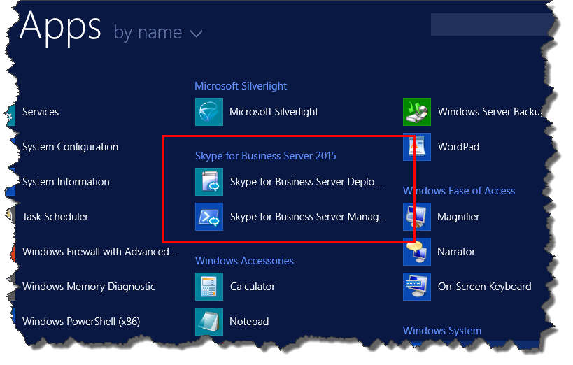

# Instalar ferramentas administrativas no Skype for Business Server
 
**Resumo:** Saiba como instalar as ferramentas administrativas necessárias para uma instalação do Skype for Business Server.
  
As ferramentas administrativas incluem o Construtor de Topologias e o Painel de Controle. As ferramentas administrativas devem ser instaladas em pelo menos um servidor na topologia ou em uma estação de trabalho de gerenciamento de 64 bits executando uma versão do sistema operacional Windows compatível com Skype for Business Server. Você pode executar as etapas de 1 a 5 em qualquer ordem. No entanto, você deve executar as etapas 6, 7 e 8 na ordem e após as etapas de 1 a 5, conforme descrito no diagrama. Instalar as ferramentas administrativas é a etapa 3 de 8.
  

  
## Instalar Skype for Business Server ferramentas administrativas

A mídia de instalação para Skype for Business Server fornece uma experiência flexível. Quando você executa o Setup.exe, as únicas ferramentas instaladas são o Assistente de Implantação do Skype for Business Server e o Shell de Gerenciamento Skype for Business Server. Usando essas duas ferramentas, conhecidas como Componentes Principais, você pode continuar com o processo de instalação, mas elas não fornecem a funcionalidade principal para o ambiente de Skype for Business Server geral. O Assistente de Implantação é iniciado automaticamente depois que você instala os Componentes Principais. A seção do Assistente de Implantação **intitulada Instalar** Ferramentas Administrativas Skype for Business Server Construtor de Topologias e Skype for Business Server Painel de Controle.
  
> [!IMPORTANT]
> Cada Skype for Business Server ambiente deve ter pelo menos um servidor com as ferramentas administrativas instaladas. 
  
Assista às etapas de vídeo para **instalar ferramentas administrativas**:
  
> [!video https://www.microsoft.com/videoplayer/embed/99a5c436-963b-4eed-b423-651568c87cb1?autoplay=false]
  
### Instalar Skype for Business Server ferramentas administrativas do Assistente de Implantação

1. Insira a mídia Skype for Business Server de instalação. Se a configuração não começar automaticamente, clique duas vezes em **Instalação**.
    
2. A mídia de instalação Microsoft Visual C++ ser executada. Uma caixa de diálogo será exibida perguntando se você deseja instalá-la. Clique em **Sim**.
    
3. Usando a Instalação Inteligente, um novo recurso no Skype for Business Server, você pode se conectar à Internet para verificar se há atualizações durante o processo de instalação. Isso proporciona uma experiência melhor, fazendo com que você tenha as atualizações mais recentes do produto na instalação. Clique em **Instalar** para iniciar a instalação.
    
4. Examine cuidadosamente o Contrato de Licença e, se você concordar, selecione **Aceitar** os termos no contrato de licença e clique em **OK**.
    
5. Os Skype for Business Server principais componentes serão instalados no servidor. 
    
    Os Componentes Principais consistem no seguinte, conforme mostrado na figura.
    
    
  
   - **Skype for Business Server Assistente de Implantação** um programa de implantação que fornece um painel de inicialização para instalar os vários componentes do Skype for Business Server.
    
   - **Skype for Business Server Shell de Gerenciamento** um programa pré-configurado do PowerShell que permite a administração de Skype for Business Server.
    
     Depois que a instalação dos Componentes Principais for concluída, o Assistente Skype for Business Server implantação será iniciado automaticamente, conforme mostrado na figura. 
    
     
  
6. Além dos Componentes Principais, você também precisará instalar o Skype for Business Server Construtor de Topologias e Skype for Business Server Painel de Controle em pelo menos um servidor no ambiente. Clique **em Instalar Ferramentas Administrativas** no Assistente de Implantação.
    
7. Clique em **Avançar** para iniciar a instalação.
    
8. Depois que a instalação for concluída, clique em **Concluir**. As ferramentas administrativas agora são adicionadas ao servidor, conforme mostrado na figura.
    
    
  
   - **Skype for Business Server Construtor de Topologias** um programa usado para criar, implantar e gerenciar topologias.
    
   - **Skype for Business Server Painel de Controle** um programa usado para administrar a instalação.
    

