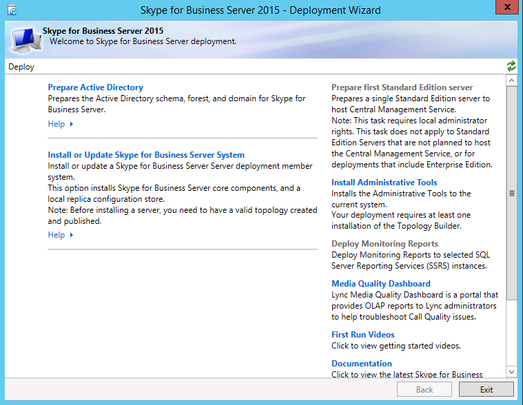

# Instalar ferramentas administrativas no Skype for Business Server
 
**Resumo:** Saiba como instalar as ferramentas administrativas necessárias para uma instalação do Skype for Business Server. Baixe uma avaliação gratuita do Skype for Business Server no Centro de Avaliação da Microsoft em: [https://www.microsoft.com/evalcenter/evaluate-skype-for-business-server](https://www.microsoft.com/evalcenter/evaluate-skype-for-business-server) .
  
As ferramentas administrativas incluem o Construtor de Topologias e o Painel de Controle. As ferramentas administrativas devem ser instaladas em pelo menos um servidor na topologia ou em uma estação de trabalho de gerenciamento de 64 bits executando uma versão do sistema operacional Windows com suporte para o Skype for Business Server. Você pode realizar as etapas 1 a 5 em qualquer ordem. No entanto, você deve realizar as etapas 6, 7 e 8 na ordem e após as etapas de 1 a 5, conforme descrito no diagrama. Instalar as ferramentas administrativas é a etapa 3 de 8.
  

  
## Instalar ferramentas administrativas do Skype for Business Server

A mídia de instalação do Skype for Business Server oferece uma experiência flexível. Quando você executar o Setup.exe, as únicas ferramentas instaladas serão o Assistente de Implantação do Skype for Business Server e o Shell de Gerenciamento do Skype for Business Server. Usando essas duas ferramentas, conhecidas como Componentes Principais, você pode continuar com o processo de instalação, mas elas não fornecem a funcionalidade principal para o ambiente geral do Skype for Business Server. O Assistente de Implantação é lançado automaticamente após a instalação dos Componentes Principais. A seção do Assistente  de Implantação intitulada Instalar Ferramentas Administrativas instala o Construtor de Topologias do Skype for Business Server e o Painel de Controle do Skype for Business Server.
  
> [!IMPORTANT]
> Cada ambiente do Skype for Business Server deve ter pelo menos um servidor com as ferramentas administrativas instaladas. 
  
Assista às etapas de vídeo para **Instalar ferramentas administrativas:**
  
> [!video https://www.microsoft.com/videoplayer/embed/99a5c436-963b-4eed-b423-651568c87cb1?autoplay=false]
  
### Instalar ferramentas administrativas do Skype for Business Server a partir do Assistente de Implantação

1. Insira a mídia de instalação do Skype for Business Server. Se a instalação não começar automaticamente, clique duas vezes em **Setup**.
    
2. A mídia de instalação requer o Microsoft Visual C++ para ser executado. Uma caixa de diálogo será exibida perguntando se você deseja instalá-la. Clique em **Sim**.
    
3. Usando o Smart Setup, um novo recurso no Skype for Business Server, você pode se conectar à Internet para verificar se há atualizações durante o processo de instalação. Isso proporciona uma experiência melhor ao garantir que você tenha as atualizações mais recentes do produto na instalação. Clique em **Instalar** para iniciar a instalação.
    
4. Revise cuidadosamente o Contrato de Licença e, se você concordar, selecione **Eu aceito** os termos do contrato de licença e clique em **OK.**
    
5. Os componentes principais do Skype for Business Server serão instalados no servidor. 
    
    Os Componentes Principais consistem no seguinte, conforme mostrado na figura.
    
    
  
   - **Assistente de Implantação do Skype for Business Server** Um programa de implantação que fornece um painel de início para instalar os vários componentes do Skype for Business Server.
    
   - **Shell de Gerenciamento do Skype for Business Server** Um programa do PowerShell pré-configurado que permite a administração do Skype for Business Server.
    
     Quando a instalação dos Componentes Principais for concluída, o Assistente de Implantação do Skype for Business Server será automaticamente lançado, conforme mostrado na figura. 
    
     
  
6. Além dos Componentes Principais, você também precisará instalar o Construtor de Topologias do Skype for Business Server e o Painel de Controle do Skype for Business Server em pelo menos um servidor no ambiente. Clique **em Instalar Ferramentas Administrativas** no Assistente de Implantação.
    
7. Clique em **Avançar** para iniciar a instalação.
    
8. Depois que a instalação tiver sido concluída, clique em **Concluir.** As ferramentas administrativas agora são adicionadas ao servidor, conforme mostrado na figura.
    
    
  
   - **Construtor de Topologias do Skype for Business Server** Um programa usado para criar, implantar e gerenciar topologias.
    
   - **Painel de Controle do Skype for Business Server** Um programa usado para administrar a instalação.
    

