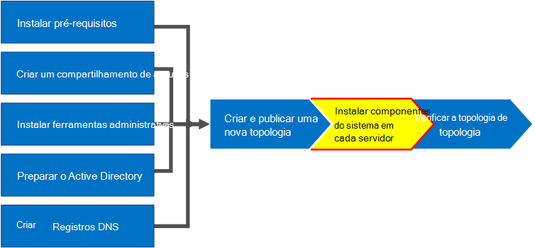

# Instalar Skype for Business Server servidores na topologia
 
**Resumo:** Saiba como instalar os componentes Skype for Business Server do sistema em cada servidor na topologia. Baixe uma avaliação gratuita de Skype for Business Server do Centro [de Avaliação da Microsoft](https://www.microsoft.com/evalcenter/evaluate-skype-for-business-server).
  
Depois que a topologia for carregada no Armazenamento de Gerenciamento Central e o Active Directory souber quais servidores executarão quais funções, você precisará instalar o sistema Skype for Business Server em cada um dos servidores na topologia. Você pode realizar as etapas 1 a 5 em qualquer ordem. No entanto, você deve realizar as etapas 6, 7 e 8 em ordem e após as etapas 1 a 5, conforme descrito no diagrama. Instalar o sistema Skype for Business Server é a etapa 7 de 8.
  

  
## Instalar Skype for Business Server sistema

Depois de publicar uma topologia, você pode instalar os componentes Skype for Business Server em cada servidor na topologia. Esta seção orienta você a instalar Skype for Business Server e configurar as funções de servidor para o pool de Front-End e todas as funções de servidor que são alocadas com os servidores Front-End. Para instalar e configurar funções de servidor, execute o Assistente de Implantação Skype for Business Server em cada computador no qual você está instalando uma função de servidor. Você usa o Assistente de Implantação para concluir todas as quatro etapas de implantação, incluindo instalar o armazenamento de Configuração Local, instalar os Servidores Front-End, configurar certificados e iniciar serviços.
  
> [!IMPORTANT]
> Você deve usar o Construtor de Topologias para concluir e publicar a topologia antes de instalar Skype for Business Server em servidores. 
  
> [!NOTE]
> Esse procedimento deve ser concluído para todos os servidores na topologia. 
  
> [!CAUTION]
> Depois de instalar Skype for Business Server em um Servidor Front-End, na primeira vez que iniciar os serviços, você deve certificar-se de que o Serviço de Firewall Windows está sendo executado no servidor. 
  
> [!CAUTION]
> Antes de seguir essas etapas, certifique-se de estar conectado ao servidor com uma conta de usuário de domínio que seja um administrador local e um membro do grupo RTCUniversalServerAdmins. 
  
> [!NOTE]
> Se você ainda não tiver executado Skype for Business Server configuração neste servidor antes, você será solicitado a solicitar uma unidade e um caminho para a instalação. Isso oferece a capacidade de instalar em uma unidade diferente da unidade do sistema, se sua organização a exigir ou se você tiver preocupações de espaço. Você pode alterar o caminho de local de instalação para os arquivos Skype for Business Server na caixa de  diálogo Instalação para uma unidade nova e disponível. Se você instalar os arquivos de Instalação nesse caminho, incluindo OCSCore.msi, o restante dos arquivos Skype for Business Server serão implantados lá também.
  
> [!IMPORTANT]
> Antes de começar a instalação, certifique-se de que Windows Server está atualizado usando o Windows Update. 
  

  
### Instalar Skype for Business Server sistema

1. Insira a Skype for Business Server de instalação. Se a instalação não começar automaticamente, clique duas vezes em **Instalação**.
    
2. A mídia de instalação requer Microsoft Visual C++ para ser executado. Uma caixa de diálogo será exibida perguntando se você deseja instalá-la. Clique **em Sim.**
    
3. Revise cuidadosamente o Contrato de Licença e, se concordar, selecione Aceito os termos no contrato **de** licença e clique em **OK**. 
    
4. A Instalação Inteligente é um recurso no Skype for Business Server em que você pode se conectar à Internet para verificar se há atualizações do Microsoft Update (MU) durante o processo de instalação, conforme mostrado na figura. Isso oferece uma experiência melhor, se certificar de que você tenha as atualizações mais recentes para o produto. Clique em **Instalar** para iniciar a instalação.
    
    > [!NOTE]
    > Muitas organizações Windows Server Update Services (WSUS) implantadas em seus ambientes corporativos. O WSUS permite que os administradores gerenciem totalmente a distribuição de atualizações lançadas por meio do Microsoft Update para computadores em sua rede. Como parte do lançamento da Atualização Cumulativa 1, Skype for Business Server suporte para a Instalação Inteligente funcionar com o WSUS. Os clientes com o WSUS que estão implantando o Skype for Business Server pela primeira vez ou atualizando do ambiente do Lync Server 2013 usando o recurso de Atualização do In-Place terão a Instalação Inteligente buscando Skype para atualizações de Windows do WSUS em vez de buscar atualizações de MU. Os clientes que querem usar a Instalação Inteligente precisam executar o SmartSetupWithWSUS.psq em todos os Setup.exe. 
  
     
  
5. Na página Assistente de Implantação, clique **em Instalar ou Atualizar Skype for Business Server Sistema**.
    
6. Execute os procedimentos nos procedimentos a seguir, quando os concluir, clique em **Sair** para fechar o Assistente de Implantação. Repita os procedimentos para cada servidor Front-End no pool.
    
### Etapa 1: Instalar o Armazenamento de Configuração Local

1. Revise os pré-requisitos e clique em **Executar** ao lado **da Etapa 1: Instalar o Armazenamento de Configuração Local**.
    
    > [!NOTE]
    > O Armazenamento de Configuração Local é uma cópia somente leitura do Armazenamento de Gerenciamento Central. Em uma Edição Standard, o Armazenamento de Gerenciamento Central é criado usando uma cópia local do SQL Server Express Edition no servidor front-end. Isso acontece quando você executar o procedimento Preparar primeiro Edição Standard Server. Em uma implantação Edição Enterprise, o armazenamento de Gerenciamento Central é criado quando você publica a topologia que inclui um pool Edição Enterprise front-end. 
  
2. Na página **Instalar o Armazenamento de Configuração Local** , certifique-se de que a opção **Recuperar** diretamente do armazenamento de Gerenciamento Central está selecionada e clique em **Próximo**.
    
    SQL Server Express Edition está instalado no servidor local. SQL Server Express Edition é necessário para o armazenamento de configuração local.
    
3. Quando a instalação da configuração do servidor local estiver concluída, clique em **Concluir**.
    
### Etapa 2: Configurar ou remover Skype for Business Server componentes

1. Revise os pré-requisitos e clique em **Executar** ao lado da **Etapa 2: Configurar ou Remover Skype for Business Server Componentes**.
    
2. Na página **Configurar Skype for Business Server Componentes**, clique em **Próximo** para configurar componentes conforme definido em sua topologia publicada.
    
3. A **página Comandos de** Execução exibe um resumo de comandos e informações de instalação à medida que a configuração ocorre. Quando terminar, você pode usar a lista para selecionar um log a ser visualizado e clique em **Exibir Log**.
    
4. Quando Skype for Business Server a instalação de componentes for concluída e você revisar os logs conforme necessário, clique em **Concluir** para concluir esta etapa na instalação.
    
    > [!NOTE]
    > Reinicie o servidor se solicitado (o que pode acontecer se Windows Experiência da Área de Trabalho precisar ser instalada). Quando o computador estiver fazendo o back-up e em execução, você precisará executar este procedimento (Etapa 2: Configurar ou Remover Skype for Business Server Componentes) novamente. 
  
    > [!NOTE]
    > Se o instalador encontrar quaisquer pré-requisitos que não tenham sido atendidos, você será notificado com uma mensagem "Pré-requisito não satisfeito", conforme mostrado na figura. Satisfaça o pré-requisito necessário e inicie este procedimento (Etapa 2: Configurar ou Remover Skype for Business Server Componentes) novamente. 
  
     
  
5. Verifique se as duas primeiras etapas foram concluídas conforme o esperado. Confirme se há uma marca de seleção verde com a palavra **Concluir**, conforme mostrado na figura.
    
     
  
6. Execute **Windows Atualizar** novamente para verificar se há alguma atualização depois de instalar os componentes Skype for Business Server.
    
### Etapa 3: Solicitar, instalar ou atribuir certificados

1. Revise os pré-requisitos e clique em **Executar** ao lado da **Etapa 3: Solicitar, Instalar ou Atribuir Certificados**.
    
    > [!NOTE]
    > Skype for Business Server inclui suporte para o pacote SHA-2 (SHA-2 usa comprimentos digest de 224, 256, 384 ou 512 bits) de hash digest e algoritmos de assinatura para conexões de clientes executando o Windows 10, Windows 8, Windows 7, Windows Server 2012 R2, Windows Server 2012 ou sistemas operacionais Windows Server 2008 R2. Para dar suporte ao acesso externo usando o pacote SHA-2, o certificado externo é emitido por uma AC pública que também pode emitir um certificado com o mesmo resumo de comprimento de bit. 
  
    > [!IMPORTANT]
    > A seleção do qual o hash digest e o algoritmo de assinatura dependem dos clientes e servidores que usarão o certificado e de outros computadores e dispositivos com os quais os clientes e servidores se comunicarão, que também devem saber como usar os algoritmos usados no certificado. Para obter informações sobre quais comprimentos de digest são suportados no sistema operacional e em alguns aplicativos cliente, consulte [Windows blog PKI - SHA2 e Windows](/archive/blogs/pki/sha2-and-windows). 
  
    Cada Edição Standard ou servidor front-end requer até quatro certificados: o certificado oAuthTokenIssuer, um certificado padrão, um certificado interno da Web e um certificado externo da Web. No entanto, você pode solicitar e atribuir um único certificado padrão com entradas de nome alternativo de assunto apropriadas, bem como o certificado oAuthTokenIssuer. Para obter detalhes sobre os requisitos de certificado, consulte [Environmental requirements for Skype for Business Server](../../plan-your-deployment/requirements-for-your-environment/environmental-requirements.md) or [Server requirements for Skype for Business Server 2019](../../../SfBServer2019/plan/system-requirements.md).
    
    > [!IMPORTANT]
    > O procedimento a seguir descreve como configurar certificados de uma autoridade de certificado interna dos Serviços de Certificados do Active Directory com base. 
  
2. Na página **Assistente de Certificados**, clique em **Solicitar**.
    
3. Na página **Solicitação de** Certificado, preencha os dados relevantes, incluindo a seleção do domínio SIP e , clique em **Próximo**.
    
4. Na página **Solicitações Atrasadas** ou Imediatas, você pode aceitar a opção Padrão Enviar a solicitação imediatamente para uma autoridade de certificação **online** clicando em **Next**. A AC interna com registro online automático deve estar disponível se você selecionar essa opção. Se você escolher a opção para atrasar a solicitação, será solicitado um nome e um local para salvar o arquivo de solicitação de certificado. A solicitação de certificado deve ser apresentada e processada por uma AC dentro da sua organização ou por uma AC pública. Em seguida, você precisará importar a resposta do certificado e atribuí-la à função de certificado adequada.
    
5. Na página **Escolher uma** Autoridade de Certificação (CA), selecione a opção Selecionar uma **AC** na lista detectada em seu ambiente e selecione uma CA conhecida (por meio do registro nos Serviços de Domínio do Active Directory) na lista. Ou selecione a **opção Especificar outra autoridade de certificação** , insira o nome de outra AUTORIDADE na caixa e clique em **Próximo**.
    
6. Na página **Conta da Autoridade de Certificação**, são solicitadas credenciais para solicitar e processar a solicitação de certificado na AC. Você deve ter determinado se um nome de usuário e senha são necessários para solicitar um certificado antecipadamente. O administrador da AC terá as informações necessárias e poderá ter que ajudá-lo nesta etapa. Se for necessário fornecer credenciais alternativas, selecione a opção, forneça um nome de usuário e senha nas caixas de texto e clique em **Avançar**.
    
7. Na página **Especificar Modelo de Certificado Alternativo**, para usar o modelo do Servidor Web padrão, clique em **Avançar**.
    
    > [!NOTE]
    > Se sua organização criou um modelo para uso como uma alternativa para o modelo padrão da AC do servidor Web, marque a caixa de seleção e insira o nome do modelo alternativo. Você precisará no nome de modelo conforme definido pelo administrador da AC. 
  
8. Na página **Nome e Segurança Configurações**, especifique um **Nome Amigável**. Usando um nome amigável, você pode identificar rapidamente o certificado e a finalidade. Se deixá-lo em branco, um nome será gerado automaticamente. Defina o **Comprimento de bit** da chave ou aceite o padrão de 2048 bits. Selecione a **chave privada** Marcar o certificado como exportável se você determinar que o certificado e a chave privada precisam ser movidos ou copiados para outros sistemas e clique em **Avançar**.
    
    > [!NOTE]
    > Skype for Business Server requisitos mínimos para uma chave privada exportável. Um local está nos Servidores de Borda em um pool, onde o Serviço de Autenticação de Media Relay usa cópias do certificado, em vez dos certificados individuais para cada instância no pool. 
  
9. Na página **Informações da Organização** , opcionalmente, forneça informações da organização e clique em **Próximo**.
    
10. Na página **Informações Geográficas** , opcionalmente, forneça informações geográficas e clique em **Próximo**.
    
11. Na página **Nome da Entidade / Nomes Alternativos de Entidade**, veja os nomes alternativos de entidade que serão adicionados e clique em **Avançar**.
    
12. Na página **de configuração domínio SIP** , selecione o **Domínio SIP** e clique em **Próximo**.
    
13. Na página **Configurar Nomes** Alternativos de Assunto Adicionais, adicione quaisquer nomes de assunto adicionais necessários, incluindo qualquer um que possa ser necessário para domínios SIP adicionais no futuro e clique em **Próximo**.
    
14. Na página **Resumo da Solicitação de** Certificado, revise as informações no resumo. Se as informações estão corretas, clique em **Próximo**. Se você precisar corrigir ou modificar uma configuração, clique em **Voltar** para a página adequada para fazer a correção ou modificação.
    
15. Na página **Executando Comandos**, clique em **Avançar**.
    
16. Na página **Status da Solicitação de Certificado Online** , revise as informações retornadas. Observe que o certificado foi emitido e instalado no armazenamento de certificados local. Se for relatado como tendo sido emitido e instalado, mas não for válido, certifique-se de que o certificado raiz da AC tenha sido instalado no armazenamento de AC raiz confiável do servidor. Consulte a documentação da AC sobre como recuperar um certificado de AC raiz confiável. Se precisar exibir o certificado recuperado, clique em **Exibir Detalhes do Certificado**. Por padrão, a caixa de seleção Atribuir **o certificado Skype for Business Server usos de certificado está** selecionada. Se você quiser atribuir manualmente o certificado, desempure a caixa de seleção e clique em **Concluir**.
    
17. Se você tiver desapurado a caixa de seleção Para Atribuir o certificado Skype for Business Server **usos** de certificado na página anterior, você será apresentado com a página **Atribuição de** Certificado. Clique em **Avançar**.
    
18. Na página **Armazenamento de** Certificados, selecione o certificado solicitado. Se você quiser exibir o certificado, clique em **Exibir Detalhes do** Certificado e clique **em Próximo** para continuar.
    
    > [!NOTE]
    > Se a **página Status** da Solicitação de Certificado Online tiver relatado um problema com o certificado, como o certificado não for válido, exibirá o certificado real para ajudar a resolver o problema. Dois problemas específicos que podem fazer com que um certificado não seja válido é o certificado de AC raiz confiável mencionado anteriormente e uma chave privada ausente associada ao certificado. Consulte a documentação da AC para resolver esses dois problemas.
  
19. Na página **Resumo de Atribuição** de Certificado, revise as informações apresentadas para garantir que esse seja o certificado que deve ser atribuído e clique em **Próximo**.
    
20. Na página **Executando Comandos** , revise a saída do comando. Clique **em Exibir Log** se quiser revisar o processo de atribuição ou se houve um erro ou aviso emitido. Quando terminar a revisão, clique em **Concluir**.
    
21. Na página **Assistente** de Certificado, confirme se todos os serviços têm uma verificação verde para indicar que todos foram atribuídos a um certificado, incluindo o OAuthTokenIssuer , conforme mostrado na figura e clique em **Fechar**.
    
     
  
    > [!TIP]
    > Se você estiver instalando em um ambiente de laboratório e acabou de configurar a Autoridade de Certificação usando os Serviços de Certificado do Active Directory, será necessário reiniciar o servidor executando os Serviços de Certificado e também o servidor Front-End antes que a atribuição de certificado possa ser realizada com êxito. 
  
    > [!TIP]
    >  Para obter mais informações sobre certificados nos Serviços de Certificados do Active Directory, consulte [Serviços de Certificado do Active Directory](/windows/deployment/deploy-whats-new). 
  
### Etapa 4: Iniciar Serviços

1. Revise os pré-requisitos da **Etapa 4: Iniciar Serviços**.
    
2. Se for um pool Edição Enterprise front-end com pelo menos três servidores, Windows Fabric será usado e você deverá usar o cmdlet **Start-CsPool**. Se um único servidor for usado, o que sempre acontece com Edição Standard, você usará o cmdlet **Start-CsWindowsService**. Neste exemplo, estamos usando Edição Enterprise com três servidores Front-End no pool, abra o Shell de Gerenciamento do **Skype for Business Server** e execute o cmdlet **Start-CsPool**, conforme mostrado na figura. Para todas as outras funções, incluindo Edição Standard servidor, você deve usar **Start-CsWindowsService**. Para implantar funções diferentes da função Front-End, consulte documentação para essas funções específicas.
    
     
  
3. Na página **Executando comandos**, após todos os serviços serem iniciados com sucesso, clique em **Finalizar**.
    
    > [!IMPORTANT]
    > O comando para iniciar os serviços no servidor é um método de esforço melhor para relatar que os serviços, na verdade, foram iniciados. Ele pode não refletir o estado real do serviço. Recomendamos que você use a etapa Status do Serviço **(Opcional)** para abrir o Console de Gerenciamento da Microsoft (MMC) e confirmar se os serviços foram iniciados com êxito, conforme mostrado na figura. Se algum Skype for Business Server serviço não tiver sido iniciado, clique com o botão direito do mouse nesse serviço no MMC e clique em **Iniciar**. 
  
     
