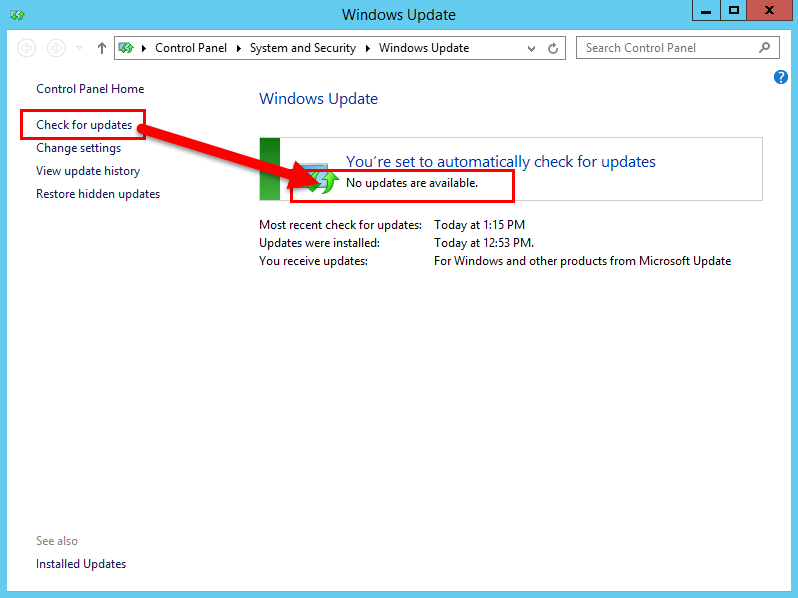
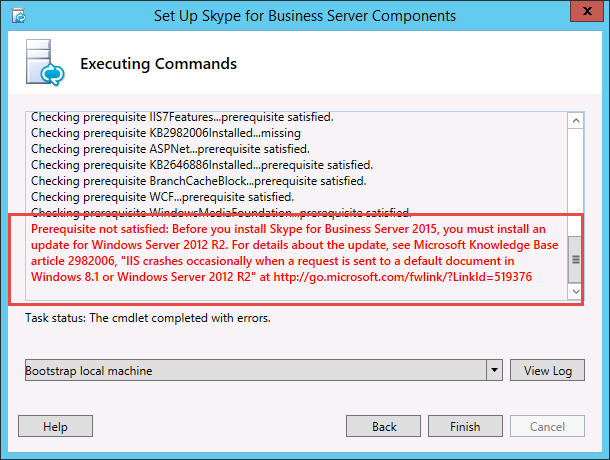

# Instalar o Skype for Business Server em servidores na topologia
 
**Resumo:** Saiba como instalar os componentes do sistema do Skype for Business Server em cada servidor na topologia. Baixe uma avaliação gratuita do Skype for Business Server no [centro de avaliação da Microsoft](https://www.microsoft.com/evalcenter/evaluate-skype-for-business-server).
  
Depois que a topologia é carregada no repositório de gerenciamento central e o Active Directory sabe quais servidores executarão quais funções, será necessário instalar o sistema do Skype for Business Server em cada um dos servidores da topologia. Você pode executar as etapas 1 a 5 em qualquer ordem. No entanto, você deve executar as etapas 6, 7 e 8 em ordem e depois das etapas 1 a 5, conforme descrito no diagrama. A instalação do sistema Skype for Business Server é a etapa 7 de 8.
  

  
## Instalar o sistema Skype for Business Server

Após publicar uma topologia, você pode instalar os componentes do Skype for Business Server em cada servidor na topologia. Esta seção orienta você durante a instalação do Skype for Business Server e a configuração das funções de servidor para o pool de front-ends e qualquer função de servidor posicionada com os servidores front-end. Para instalar e configurar funções de servidor, execute o assistente de implantação do Skype for Business Server em cada computador em que você está instalando uma função de servidor. Você usa o assistente de implantação para concluir todas as quatro etapas de implantação, incluindo a instalação do repositório de configuração local, instalação dos servidores front-end, configuração de certificados e início de serviços.
  
> [!IMPORTANT]
> Você deve usar o construtor de topologias para concluir e publicar a topologia antes de poder instalar o Skype for Business Server em servidores. 
  
> [!NOTE]
> Este procedimento deve ser concluído para todos os servidores na topologia. 
  
> [!CAUTION]
> Após instalar o Skype for Business Server em um servidor front-end, na primeira vez que você iniciar os serviços, você deve verificar se o serviço Firewall do Windows está em execução no servidor. 
  
> [!CAUTION]
> Antes de seguir estas etapas, verifique se você está conectado ao servidor com uma conta de usuário de domínio que seja um administrador local e membro do grupo RTCUniversalServerAdmins. 
  
> [!NOTE]
> Se você não tiver executado a instalação do Skype for Business Server nesse servidor antes, você será solicitado a fornecer uma unidade e um caminho para a instalação. Isso fornece a capacidade de instalar em uma unidade diferente da unidade do sistema, se sua organização exigir, ou se você tiver problemas de espaço. Você pode alterar o caminho do local de instalação dos arquivos do Skype for Business Server na caixa de diálogo **Configurar** para uma nova unidade disponível. Se você instalar os arquivos de instalação nesse caminho, incluindo o OCSCore. msi, o restante dos arquivos do Skype for Business Server também serão implantados.
  
> [!IMPORTANT]
> Antes de começar a instalação, verifique se o Windows Server está atualizado usando o Windows Update. 
  

  
### Instalar o sistema Skype for Business Server

1. Insira a mídia de instalação do Skype for Business Server. Se a instalação não começar automaticamente, clique duas vezes em **configuração**.
    
2. A mídia de instalação requer que o Microsoft Visual C++ seja executado. Uma caixa de diálogo será exibida perguntando se você deseja instalá-lo. Clique em **Sim.**
    
3. Revise cuidadosamente o contrato de licença e, se concordar, selecione **aceito os termos do contrato de licença**e clique em **OK**. 
    
4. A configuração inteligente é um recurso no Skype for Business Server em que você pode se conectar à Internet para verificar se há atualizações do Microsoft Update (MU) durante o processo de instalação, conforme mostrado na figura. Isso oferece uma melhor experiência ao garantir que você tenha as atualizações mais recentes para o produto. Clique em **Instalar** para iniciar a instalação.
    
    > [!NOTE]
    > Muitas organizações têm o WSUS (Windows Server Update Services) implantado em seus ambientes corporativos. O WSUS permite que os administradores gerenciem totalmente a distribuição de atualizações lançadas por meio do Microsoft Update para computadores em sua rede. Como parte da versão cumulativa 1 do Skype for Business Server introduziu suporte para a instalação inteligente funcionar com o WSUS. Os clientes com WSUS que estão implantando o Skype for Business Server pela primeira vez ou atualizando do ambiente do Lync Server 2013 usando o recurso de atualização in-loco terão a configuração inteligente buscando as atualizações do Skype for Windows do WSUS em vez de buscar atualizações do MU. Os clientes que desejam usar a instalação inteligente precisam executar o SmartSetupWithWSUS. PSQ em todos os computadores antes de executar o setup. exe. 
  
     
  
5. Na página Assistente de implantação, clique em **instalar ou atualizar o sistema do Skype for Business Server**.
    
6. Execute os procedimentos nos procedimentos a seguir, quando tiver concluído, clique em **sair** para fechar o assistente de implantação. Repita os procedimentos para cada servidor de front-end no pool.
    
### Etapa 1: instalar o repositório de configuração local

1. Examine os pré-requisitos e clique em **executar** próximo a **etapa 1: instalar o repositório de configuração local**.
    
    > [!NOTE]
    > O repositório de configuração local é uma cópia somente leitura do repositório de gerenciamento central. Em uma implantação do Standard Edition, o repositório de gerenciamento central é criado usando uma cópia local do SQL Server Express Edition no servidor front-end. Isso acontece quando você executa o primeiro procedimento de preparação do servidor Standard Edition. Em uma implantação Enterprise Edition, o repositório de gerenciamento central é criado quando você publica a topologia que inclui um pool de front-ends Enterprise Edition. 
  
2. Na página **instalar o repositório de configuração local** , verifique se a opção **recuperar diretamente do repositório de gerenciamento central** está selecionada e clique em **Avançar**.
    
    O SQL Server Express Edition é instalado no servidor local. O SQL Server Express Edition é necessário para o repositório de configuração local.
    
3. Quando a instalação da configuração do servidor local estiver concluída, clique em **Concluir**.
    
### Etapa 2: configurar ou remover componentes do Skype for Business Server

1. Examine os pré-requisitos e clique em **executar** ao lado de **etapa 2: configurar ou remover os componentes do Skype for Business Server**.
    
2. Na página **configurar componentes do Skype for Business Server** , clique em **Avançar** para configurar os componentes conforme definido na topologia publicada.
    
3. A página **executando comandos** exibe um resumo dos comandos e informações de instalação à medida que a configuração ocorre. Quando terminar, você poderá usar a lista para selecionar um log a ser exibido e, em seguida, clique em **Exibir log**.
    
4. Quando a instalação dos componentes do Skype for Business Server é concluída e você analisou os logs conforme necessário, clique em **concluir** para concluir esta etapa na instalação.
    
    > [!NOTE]
    > Reinicie o servidor se for solicitado (o que pode acontecer se a experiência da área de trabalho do Windows precisar ser instalada). Quando o computador fizer o backup e a execução, você precisará executar o procedimento (etapa 2: instalar ou remover componentes do Skype for Business Server) novamente. 
  
    > [!NOTE]
    > Se o instalador encontrar algum pré-requisito que não tenha sido satisfeito, você será notificado com uma mensagem de "pré-requisito não atendida", conforme mostrado na figura. Satisfaça o pré-requisito necessário e, em seguida, inicie o procedimento (etapa 2: instalar ou remover componentes do Skype for Business Server) novamente. 
  
     
  
5. Verifique se as duas primeiras etapas foram concluídas conforme o esperado. Verifique se há uma marca de exclusão verde com a palavra **concluído**, conforme mostrado na figura.
    
     
  
6. Execute o **Windows Update** novamente para verificar se há alguma atualização após a instalação dos componentes do Skype for Business Server.
    
### Etapa 3: solicitar, instalar ou atribuir certificados

1. Examine os pré-requisitos e clique em **executar** ao lado de **etapa 3: solicitar, instalar ou atribuir certificados**.
    
    > [!NOTE]
    > O Skype for Business Server inclui suporte para o pacote SHA-2 (SHA-2 usa comprimentos de Resumo de 224, 256, 384 ou 512) de algoritmos de hash e de assinatura de resumo para conexões de clientes que executam o Windows 10, Windows 8, Windows 7, Windows Server 2012 R2, Windows Server 2012 ou Windows Server 2008 R2 Operating Systems. Para dar suporte ao acesso externo usando o pacote SHA-2, o certificado externo é emitido por uma AC pública que também pode emitir um certificado com o mesmo comprimento de bit Digest. 
  
    > [!IMPORTANT]
    > A seleção do qual o resumo de hash e o algoritmo de assinatura dependem dos clientes e dos servidores que usarão o certificado e outros computadores e dispositivos que os clientes e servidores irão se comunicar com quem também deve saber como usar os algoritmos usados no Certifica. Para obter informações sobre quais tamanhos de resumo são suportados no sistema operacional e em alguns aplicativos cliente, consulte [Windows PKI blog-SHA2 e Windows](https://go.microsoft.com/fwlink/p/?LinkId=287002). 
  
    Cada servidor de front-end ou Standard Edition requer até quatro certificados: o certificado oAuthTokenIssuer, um certificado padrão, um certificado interno da Web e um certificado externo da Web. No entanto, você pode solicitar e atribuir um único certificado padrão com entradas de nome alternativo de assunto apropriado, bem como o certificado oAuthTokenIssuer. Para obter detalhes sobre os requisitos de certificado, consulte [Environmental Requirements for Skype for Business Server](../../plan-your-deployment/requirements-for-your-environment/environmental-requirements.md) or [Server Requirements for Skype for Business Server 2019](../../../SfBServer2019/plan/system-requirements.md).
    
    > [!IMPORTANT]
    > O procedimento a seguir descreve como configurar certificados de uma autoridade de certificação interna de serviços de certificados do Active Directory. 
  
2. Na página **Assistente de Certificados**, clique em **Solicitar**.
    
3. Na página **solicitação de certificado** , preencha os dados relevantes, incluindo selecionar o domínio SIP e clique em **Avançar**.
    
4. Na página **solicitações atrasadas ou imediatas** , você pode aceitar a opção padrão **enviar a solicitação imediatamente para uma autoridade de certificação online** clicando em **Avançar**. A autoridade de certificação interna com registro online automático deve estar disponível se você selecionar essa opção. Se você escolher a opção para atrasar a solicitação, você será solicitado a fornecer um nome e um local para salvar o arquivo de solicitação de certificado. A solicitação de certificado deve ser apresentada e processada por uma autoridade de certificação dentro da sua organização ou por uma autoridade de certificação pública. Você precisará importar a resposta do certificado e atribuí-la à função de certificado adequada.
    
5. Na página **escolher uma autoridade de certificação (CA)** , selecione a opção **selecionar uma autoridade de certificação na lista detectada em seu ambiente** e, em seguida, selecione uma autoridade de certificação conhecida (através de registro no Active Directory Domain Services) na lista. Ou selecione a opção **especificar outra autoridade de certificação** , digite o nome de outra autoridade de certificação na caixa e clique em **Avançar**.
    
6. Na página **Conta da Autoridade de Certificação**, são solicitadas credenciais para solicitar e processar a solicitação de certificado na AC. Você deve ter determinado se um nome de usuário e senha são necessários para solicitar um certificado antecipadamente. O administrador da autoridade de certificação terá as informações necessárias e poderá ajudá-lo nesta etapa. Se for necessário fornecer credenciais alternativas, selecione a opção, forneça um nome de usuário e senha nas caixas de texto e clique em **Avançar**.
    
7. Na página **Especificar Modelo de Certificado Alternativo**, para usar o modelo do Servidor Web padrão, clique em **Avançar**.
    
    > [!NOTE]
    > Se sua organização criou um modelo para uso como uma alternativa para o modelo padrão da AC do servidor Web, marque a caixa de seleção e insira o nome do modelo alternativo. Você precisará no nome de modelo conforme definido pelo administrador da AC. 
  
8. Na página **nome e configurações de segurança** , especifique um **nome amigável**. Usando um nome amigável, você pode identificar rapidamente o certificado e a finalidade. Se deixá-lo em branco, um nome será gerado automaticamente. Defina o **Comprimento de bit** da chave ou aceite o padrão de 2048 bits. Selecione a **caixa de seleção marcar a chave privada do certificado como exportável** se você determinar que o certificado e a chave privada precisam ser movidos ou copiados para outros sistemas e clique em **Avançar**.
    
    > [!NOTE]
    > O Skype for Business Server tem requisitos mínimos para uma chave privada exportável. Um local está nos Servidores de Borda em um pool, onde o Serviço de Autenticação de Media Relay usa cópias do certificado, em vez dos certificados individuais para cada instância no pool. 
  
9. Na página **informações da organização** , forneça, opcionalmente, as informações da organização e clique em **Avançar**.
    
10. Na página **informações geográficas** , forneça, opcionalmente, informações geográficas e clique em **Avançar**.
    
11. Na página **Nome da Entidade / Nomes Alternativos de Entidade**, veja os nomes alternativos de entidade que serão adicionados e clique em **Avançar**.
    
12. Na página **configuração do domínio SIP** , selecione o **domínio SIP**e clique em **Avançar**.
    
13. Na página **configurar nomes alternativos da entidade adicionais** , adicione quaisquer nomes alternativos de entidade adicionais necessários, incluindo qualquer um que possa ser necessário para domínios SIP adicionais no futuro e clique em **Avançar**.
    
14. Na página **Resumo da solicitação de certificado** , revise as informações no resumo. Se as informações estiverem corretas, clique em **Avançar**. Se você precisar corrigir ou modificar uma configuração, clique em **voltar** à página adequada para fazer a correção ou modificação.
    
15. Na página **Executando Comandos**, clique em **Avançar**.
    
16. Na página **status da solicitação de certificado online** , revise as informações retornadas. Você deve observar que o certificado foi emitido e instalado no repositório de certificados local. Se ele for relatado como tendo sido emitido e instalado, mas não for válido, verifique se o certificado raiz da autoridade de certificação foi instalado no repositório da autoridade de certificação raiz confiável do servidor. Consulte a documentação da autoridade de certificação sobre como recuperar um certificado de autoridade de certificação raiz confiável. Se você precisar exibir o certificado recuperado, clique em **Exibir detalhes do certificado**. Por padrão, a caixa de seleção para **atribuir o certificado aos usos de certificado do Skype for Business Server** é selecionada. Se você deseja atribuir manualmente o certificado, desmarque a caixa de seleção e clique em **concluir**.
    
17. Se você desmarcou a caixa de seleção para **atribuir o certificado aos usos de certificado do Skype for Business Server** na página anterior, será exibida a página **atribuição de certificado** . Clique em **Avançar**.
    
18. Na página **repositório de certificados** , selecione o certificado que você solicitou. Se quiser exibir o certificado, clique em **Exibir detalhes do certificado**e clique em **Avançar** para continuar.
    
    > [!NOTE]
    > Se a página **status da solicitação de certificado online** relatou um problema com o certificado, como o certificado não é válido, exiba o certificado real para obter ajuda na resolução do problema. Dois problemas específicos que podem fazer com que um certificado não seja válido é o certificado de autoridade de certificação raiz confiável ausente mencionado anteriormente e uma chave privada ausente associada ao certificado. Consulte a documentação da autoridade de certificação para resolver esses dois problemas.
  
19. Na página **Resumo de atribuição de certificado** , revise as informações apresentadas para certificar-se de que esse é o certificado que deve ser atribuído e clique em **Avançar**.
    
20. Na página **executando comandos** , revise a saída do comando. Clique em **Exibir log** se quiser revisar o processo de atribuição ou se houve um erro ou aviso emitido. Após concluir a revisão, clique em **concluir**.
    
21. Na página **Assistente de certificado** , confirme se todos os serviços têm um cheque verde para indicar que todos foram atribuídos a um certificado, incluindo o OAuthTokenIssuer, conforme mostrado na figura e clique em **fechar**.
    
     
  
    > [!TIP]
    > Se você estiver instalando em um ambiente de laboratório e apenas configurou a autoridade de certificação usando os serviços de certificados do Active Directory, será necessário reinicializar o servidor que executa os serviços de certificados e também o servidor front-end antes do certificado a atribuição pode ser feita com êxito. 
  
    > [!TIP]
    >  Para obter mais informações sobre certificados nos serviços de certificados do Active Directory, consulte [serviços de certificados do Active Directory](https://technet.microsoft.com/windowsserver/dd448615.aspx). 
  
### Etapa 4: Iniciar serviços

1. Examine os pré-requisitos para a **etapa 4: Iniciar serviços**.
    
2. Se este for um pool de front-ends Enterprise Edition com pelo menos três servidores, o Windows Fabric será usado e você deverá usar o cmdlet **Start-CsPool** . Se for usado um único servidor, que é sempre o caso com Standard Edition, você deve usar o cmdlet **Start-CsWindowsService** . Neste exemplo, estamos usando o Enterprise Edition com três servidores front-end no pool, abra o **Shell de gerenciamento do Skype for Business Server** e execute o cmdlet **Start-CsPool** conforme mostrado na figura. Para todas as outras funções, incluindo o servidor Standard Edition, você deve usar **Start-CsWindowsService**. Para implantar funções diferentes da função de front end, consulte a documentação para essas funções específicas.
    
     
  
3. Na página **Executando comandos**, após todos os serviços serem iniciados com sucesso, clique em **Finalizar**.
    
    > [!IMPORTANT]
    > O comando para iniciar os serviços no servidor é um método de melhor esforço para relatar que os serviços foram, na verdade, iniciados. Ele pode não refletir o estado real do serviço. Recomendamos que você use o status do serviço de etapa **(opcional)** para abrir o console de gerenciamento Microsoft (MMC) e confirmar que os serviços foram iniciados com êxito, conforme mostrado na figura. Se algum serviço do Skype for Business Server não tiver começado, clique com o botão direito do mouse no serviço no MMC e, em seguida, clique em **Iniciar**. 
  
     
  

