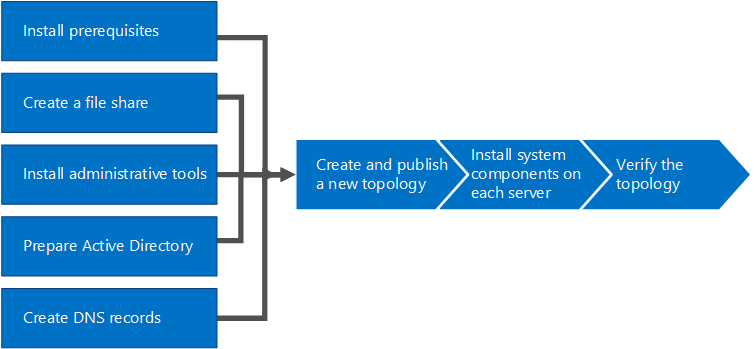

# Instalar o Skype for Business Server 2015Install Skype for Business Server 2015
 
**Resumo:** Saiba como preparar seu ambiente para uma instalação do Skype para Business Server 2015.**Summary:** Learn how to prepare your environment for an installation of Skype for Business Server 2015. Baixe uma versão de avaliação gratuita do Skype para negócios 2015 de servidor do centro da Evaluation da Microsoft em:[https://www.microsoft.com/evalcenter/evaluate-skype-for-business-server](https://www.microsoft.com/evalcenter/evaluate-skype-for-business-server).Download a free trial of Skype for Business Server 2015 from the Microsoft Evaluation center at:[https://www.microsoft.com/evalcenter/evaluate-skype-for-business-server](https://www.microsoft.com/evalcenter/evaluate-skype-for-business-server).
  
Este artigo o orienta durante uma instalação de exemplo do Skype para Business Server 2015.This article walks you through an example installation of Skype for Business Server 2015. Este artigo não tentará cobrir todos os procedimentos que você precisa realizar um Skype completo para instalação do servidor de negócios.This article does not attempt to cover all of the procedures you need to perform a full Skype for Business Server installation. O objetivo é dar exemplos de procedimentos em uma topologia definida de forma limitada que inclua a funcionalidade básica de reunir e compartilhar.The goal is to provide example procedures in a narrowly defined topology that includes basic meet-and-share functionality.
  
## Visão geral do processo de instalação de Skype para Business Server 2015Overview of the install process for Skype for Business Server 2015

Uma instalação do Skype para Business Server inclui muitos procedimentos diferentes.An installation of Skype for Business Server includes many different procedures. Os procedimentos que você precisa obter Skype Business Server em execução no seu ambiente dependem as especificações de seu ambiente.The procedures you need to get Skype for Business Server running in your environment depend on the specifics of your environment. Por exemplo, se você estiver usando o Windows Server para DNS, aproveite o exemplo do procedimento sobre como adicionar uma entrada DNS.For example, if you are using Windows Server for DNS, you will benefit from the example procedure for adding a DNS entry. Caso você use outro sistema de DNS, será necessário seguir os procedimentos referentes ao seu sistema de DNS.If you use another system for DNS, you need to follow procedures for your particular DNS system. Isto se aplica a vários procedimentos desta seção.This is true for many of the procedures in this section.
  
Skype para Business Server 2015 está disponível no Standard Edition e Enterprise Edition.Skype for Business Server 2015 is available in Standard Edition and Enterprise Edition. A diferença principal é que a versão Standard Edition não suporta os recursos de alta disponibilidade incluídos na versão Enterprise Edition.The main difference is that Standard Edition does not support the high availability features that are included with Enterprise Edition. 
  
Skype para Business Server é um produto avançado e o processo de instalação exato depende muito circunstâncias específicas.Skype for Business Server is an advanced product, and the exact installation process depends a great deal on your specific circumstances. Esta seção ilustra as etapas gerais necessárias para instalar o produto.This section walks you through the general steps to install the product. No entanto, cada procedimento pode ser diferente, dependendo do seu ambiente e das decisões de planejamento.However, each procedure might be different depending on your environment and planning decisions. Por exemplo, para pequenas organizações um único servidor, executando o Skype para Business Server 2015 Standard Edition pode ser apropriado, enquanto uma grande organização multinacional pode ter 50 servidores nos locais em todo o mundo dedicada ao produto.For example, for small organizations a single server, running Skype for Business Server 2015 Standard Edition might be appropriate, whereas a large multinational organization might have 50 servers at locations around the world dedicated to the product.
  
> [!NOTE]
> Para saber mais sobre as últimas atualizações cumulativas, consulte [Updates for Skype para Business Server 2015](https://support.microsoft.com/en-us/kb/3061064).To learn about the latest Cumulative Updates, see [Updates for Skype for Business Server 2015](https://support.microsoft.com/en-us/kb/3061064). Depois de instalar o patch CU1, um administrador precisa executar o `Update-CsAdminRole` cmdlet.After installing the CU1 patch an administrator needs to execute the  `Update-CsAdminRole` cmdlet. Este cmdlet é necessário para acessar os novos cmdlets GCP sobre o PowerShell Remoto.This cmdlet is required to access the new GCP cmdlets over Remote PowerShell.
  
> [!IMPORTANT]
> Os procedimentos nesta seção têm como finalidade servir de exemplo, usando um conjunto limitado de requisitos e assumindo que decisões específicas já foram tomadas.The procedures in this section serve as an example using a narrowly defined set of requirements and assume specific decisions have already been made. Os procedimentos reais, que você precisará instalar Skype para Business Server provavelmente será muito diferentes.The actual procedures you need to install Skype for Business Server will likely be very different. Use os procedimentos nesta seção como um exemplo apenas e não como um guia passo a passo para instalar o Skype para Business Server em cada ambiente.Use the procedures in this section as an example only and not as a step-by-step guide for installing Skype for Business Server in every environment. 
  
Aprendendo Skype para Business Server e executando-se pela primeira vez envolvem oito etapas principais.Getting Skype for Business Server up and running for the first time involves eight primary steps. Você deve compreender os procedimentos de exemplo nesta seção não estão os somente procedimentos necessários para instalar o Skype for Business Server.You should understand that the example procedures in this section are not the only procedures required for installing Skype for Business Server. As seguintes oito etapas são simplesmente exemplos para ajudá-lo compreendam o processo geral e obtém uma trabalhando o ambiente de e a execução.The following eight steps are simply examples to help you better understand the overall process and get a basic working environment up and running. As etapas 1 a 5 podem ser executadas em qualquer ordem.You can do steps 1 through 5 in any order. No entanto, você deve executar as etapas 6, 7 e 8 nesta ordem, após concluir as etapas 1 a 5, conforme descrito no diagrama.However, you must do steps 6, 7, and 8 in order, and after steps 1 through 5, as outlined in the diagram. As oito etapas são:The eight steps are:
  

  
- [Instalar os pré-requisitos do Skype para Business Server 2015](install-prerequisites.md) : instalar pré-requisitos em todos os servidores que compõem o Skype para a topologia de servidor de negócios.[Install prerequisites for Skype for Business Server 2015](install-prerequisites.md) : Install prerequisites on all servers that make up the Skype for Business Server topology. Observe que os pré-requisitos não são os mesmos para todas as funções.Note that prerequisites are not the same for all roles. Por exemplo, servidores que fornecem uma função de front-end têm um conjunto de pré-requisitos, enquanto servidores que fornecem uma função de diretor têm outro conjunto de pré-requisitos completamente diferente.For example, servers that provide the front-end role have a set of prerequisites, and servers that provide a director role have a different set of prerequisites. Consulte a documentação sobre planejamento de pré-requisitos para obter mais detalhes.See prerequisite planning documentation for more details.
    
- [Criar um compartilhamento de arquivo no Skype para Business Server 2015](create-a-file-share.md) : criar um compartilhamento de arquivo que será usado pelos servidores em todo o Skype para a topologia de servidor de negócios.[Create a file share in Skype for Business Server 2015](create-a-file-share.md) : Create a file share that will be used by servers throughout the Skype for Business Server topology.
    
- [Instalar as ferramentas administrativas em Skype para Business Server 2015](install-administrative-tools.md) : as ferramentas administrativas incluem o construtor de topologia e em Painel de controle.[Install administrative tools in Skype for Business Server 2015](install-administrative-tools.md) : The administrative tools include Topology Builder and Control Panel. Você deve instalar as ferramentas administrativas em pelo menos um servidor da topologia ou uma estação de trabalho de gerenciamento de 64 bits executando uma versão do sistema operacional Windows que é suportada para Skype para Business Server.You must install the administrative tools on at least one server in the topology or a 64-bit management workstation running a Windows OS version that is supported for Skype for Business Server.
    
- [Preparar o Active Directory para Skype para Business Server 2015](prepare-active-directory.md) : Skype para Business Server trabalha em conjunto com o Active Directory.[Prepare Active Directory for Skype for Business Server 2015](prepare-active-directory.md) : Skype for Business Server works closely with Active Directory. Você deve preparar o domínio do Active Directory para funcionar com Skype para Business Server.You must prepare the Active Directory domain to work with Skype for Business Server. Você pode fazer isso por meio do Assistente de Implantação, e isso só é feito uma única vez para o domínio.You can do this through the Deployment Wizard, and it is only done once for the domain. Como esse processo cria grupos e modifica o domínio, você só precisa fazer isso uma vez.This is because the process creates groups and modifies the domain, and you need to do that only once.
    
- [Criar registros DNS para Skype para Business Server 2015](create-dns-records.md) : na ordem para Skype Business Server funcionem adequadamente, várias configurações de DNS devem estar no lugar.[Create DNS records for Skype for Business Server 2015](create-dns-records.md) : In order for Skype for Business Server to work properly, a number of DNS settings must be in place. Deve ser feito de forma que os clientes saibam como acessar os serviços e os servidores se identifiquem entre si.This is so that clients know how to access the services and the servers know about each other. Essas configurações só precisam ser concluídas uma vez por implantação já que a entrada DNS fica disponível por todo o domínio depois de ser atribuída.These settings only need to be completed once per deployment because once you assign a DNS entry, it is available throughout the domain.
    
- [Criar e publicar a nova topologia no Skype para Business Server 2015](create-and-publish-new-topology.md) : antes de instalar o Skype para system Business Server em cada um dos servidores na topologia, você deve criar uma topologia e publicá-lo.[Create and publish new topology in Skype for Business Server 2015](create-and-publish-new-topology.md) : Before you can install the Skype for Business Server system on each of the servers in the topology, you must create a topology and publish it. Ao publicar uma topologia, você está carregando as informações da topologia no banco de dados do Repositório de Gerenciamento Central.When you publish a topology, you are loading the topology information into the Central Management Store database. Se este for um pool Enterprise Edition, você estará criando um banco de dados do Repositório de Gerenciamento Central na primeira vez em que publicar uma topologia nova.If this is an Enterprise Edition pool, you are creating the Central Management Store database the first time you publish a new topology. Já se for a Standard Edition, será necessário executar o processo Preparar primeiro servidor Standard Edition no Assistente de Implantação antes de publicar um topologia.If this is Standard Edition, you need to run the Prepare First Standard Edition Server process from the Deployment Wizard before you publish a topology. É a preparação da versão Standard Edition com a instalação de uma instância do SQL Server Express Edition e a criação de um Repositório de Gerenciamento Central.This prepares for Standard Edition by installing a SQL Server Express Edition instance and creating the Central Management Store.
    
- [Instale o Skype para negócios 2015 de servidor nos servidores na topologia](install-skype-for-business-server.md) : depois que a topologia é carregada no repositório de gerenciamento Central e o Active Directory sabe quais servidores executarão quais funções, você precisará instalar o Skype para system Business Server em cada um dos servidores na topologia.[Install Skype for Business Server 2015 on servers in the topology](install-skype-for-business-server.md) : Once the topology is loaded into the Central Management Store and Active Directory knows which servers will perform which roles, you need to install the Skype for Business Server system on each of the servers in the topology.
    
- [Verificar a topologia no Skype para Business Server 2015](verify-the-topology.md) : depois que a topologia publicada e o Skype para componentes do sistema Business Server instalado em cada um dos servidores na topologia, você estará pronto para verificar se a topologia está funcionando conforme o esperado .[Verify the topology in Skype for Business Server 2015](verify-the-topology.md) : After you have the topology published and the Skype for Business Server system components installed on each of the servers in the topology, you are ready to verify that the topology is working as expected. Isso inclui a verificação de que a configuração tenha propagadas check-out para todos os servidores do Active Directory para que o domínio inteiro reconheça Skype para a empresa está disponível no domínio.This includes verifying that the configuration has propagated out to all of the Active Directory servers so that the entire domain knows that Skype for Business is available in the domain.
    

