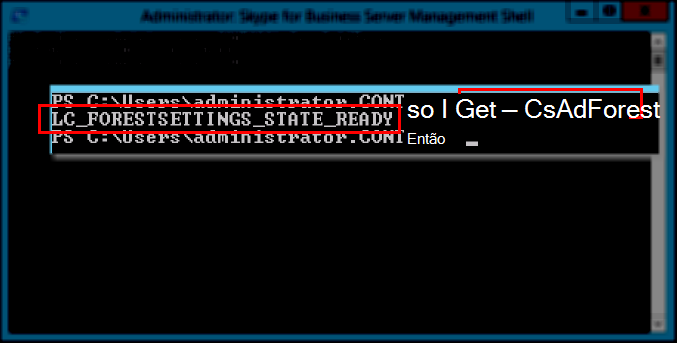

# <a name="skype-for-business-server-prepare-active-directory"></a>Skype for Business Server: Preparar o Active Directory
 
**Resumo:** Saiba como preparar seu domínio do Active Directory para uma instalação do Skype for Business Server.
  
Skype for Business Server funciona de perto com o Active Directory. Você deve preparar o domínio do Active Directory para trabalhar com Skype for Business Server. Esse processo é realizado no Assistente de Implantação e é feito apenas uma vez para o domínio. Isso ocorre porque o processo cria grupos e modifica o domínio, e você precisa fazer isso apenas uma vez. Você pode executar as etapas de 1 a 5 em qualquer ordem. No entanto, você deve executar as etapas 6, 7 e 8 na ordem e após as etapas de 1 a 5, conforme descrito no diagrama. Preparar o Active Directory é a etapa 4 de 8. Para obter mais informações sobre o planejamento do Active Directory, consulte Requisitos ambientais para [Skype for Business Server](../../plan-your-deployment/requirements-for-your-environment/environmental-requirements.md) ou requisitos de servidor [para Skype for Business Server 2019](../../../SfBServer2019/plan/system-requirements.md).
  

  
## <a name="prepare-active-directory"></a>Preparar o Active Directory

Skype for Business Server é totalmente integrado ao Active Directory Domain Services (AD DS). Antes Skype for Business Server ser instalado pela primeira vez, o Active Directory deve estar preparado. A seção do Assistente de Implantação **intitulada Preparar o Active Directory** prepara o ambiente do Active Directory para uso com Skype for Business Server.
  
> [!NOTE]
> Skype for Business Server usa (AD DS) para acompanhar e se comunicar com todos os servidores em uma topologia. A maioria desses servidores deve ser ingressada no domínio para que Skype for Business Server possa funcionar corretamente. Tenha em mente que servidores como o Edge e o Proxy Reverso não devem ser ingressados no domínio.
  
> [!IMPORTANT]
> O procedimento Preparar o Active Directory deve ser executado apenas uma vez para cada domínio na implantação. 
  
Assista às etapas de vídeo para **Preparar o Active Directory**:
  
> [!video https://www.microsoft.com/videoplayer/embed/RE1Ybuk]
  
### <a name="prepare-active-directory-from-the-deployment-wizard"></a>Preparar o Active Directory do Assistente de Implantação

1. Faça logon como um usuário com credenciais de Administradores de Esquema para o domínio do Active Directory.
    
2. Abra o Skype for Business Server de Implantação.
    
    > [!TIP]
    > Se você quiser examinar os arquivos de log criados pelo Assistente de Implantação do Skype for Business Server, poderá encontrá-los no computador em que o Assistente de Implantação foi executado, no diretório Usuários do usuário do AD DS que executou a etapa. Por exemplo, se o usuário fez logon como administrador de domínio no domínio, contoso.local, os arquivos de log estão localizados em: C:\Users\Administrator.Contoso\AppData\Local\Temp. 
  
3. Clique no link **Preparar Active Directory** .
    
4. **Etapa 1: Preparar o esquema**
    
    a. Examine as informações de pré-requisitos da Etapa 1 que podem ser acessadas clicando na lista suspensa sob o título da Etapa 1.
    
    b. Clique **em** Executar na Etapa 1 para iniciar o assistente preparar esquema.
    
    c. Observe que o procedimento deve ser executado apenas uma vez para cada implantação e clique em **Avançar**.
    
    d. Depois que o esquema tiver sido preparado, você poderá exibir o log clicando em **Exibir Log**. 
    
    e. Clique **em Concluir** para fechar o assistente preparar esquema e retornar às etapas preparar o Active Directory.
    
5. **Etapa 2: Verificar a replicação da partição de esquema**
    
    a. Faça logon no controlador de domínio do domínio.
    
    b. Abra **a Edição ADSI** **no menu** suspenso Ferramentas **no Gerenciador do Servidor**.
    
    c. No menu **Ação**, clique em **Conectar-se a**.
    
    d. Na caixa de diálogo **Configurações de Conexão** em **Selecione um Contexto de Nomenclatura bem conhecido**, selecione **Esquema** e clique em **OK**.
    
    e. No contêiner de esquema, pesquise **CN=ms-RTC-SIP-SchemaVersion**. Se esse objeto existir e o valor do atributo **rangeUpper** for 1150 e o valor do atributo **rangeLower** for 3, o esquema foi atualizado e replicado com êxito. Se esse objeto não existir ou os valores dos atributos **rangeUpper** e **rangeLower** não forem especificados, o esquema não foi modificado ou não foi replicado.
    
6. **Etapa 3: Preparar a floresta atual**
    
    a. Examine as informações de pré-requisitos da Etapa 3 que podem ser acessadas clicando na lista suspensa no título da Etapa 3.
    
    b. Clique **em** Executar na Etapa 3 para iniciar o assistente Preparar Floresta Atual.
    
    c. Observe que o procedimento deve ser executado apenas uma vez por implantação e clique em **Avançar**.
    
    d. Especifique o domínio em que os grupos universais serão criados. Se o servidor fizer parte do domínio, você poderá escolher **o domínio local** e clicar em **Avançar**.
    
    e. Depois que a floresta for preparada, você poderá exibir o log clicando em **Exibir Log**. 
    
    f. Clique **em Concluir** para fechar o assistente Preparar Floresta Atual e retornar às etapas Preparar Active Directory.
    
    g. Clique **Skype for Business Server Shell de Gerenciamento** na página **Aplicativos** para iniciar o PowerShell.
    
    h. Digite o comando Get-CsAdForest e pressione **Enter**.
    
    i. Se o resultado for **LC_FORESTSETTINGS_STATE_READY**, a floresta foi preparada com êxito, conforme mostrado na figura.
    
     
  
7. **Etapa 4: Verificar a replicação do catálogo global**
    
    a. Em um controlador de domínio (preferencialmente em um site remoto de outros controladores de domínio), na floresta na qual a Preparação da Floresta foi executada, abra **Usuários e Computadores do Active Directory**.
    
    b. Em **Usuários e Computadores do Active Directory**, expanda o nome de domínio de sua floresta ou domínio filho.
    
    c. Clique no **contêiner** Usuários no painel esquerdo e procure o grupo Universal **CsAdministrator** no painel direito. Se csAdministrator (entre outros novos grupos Universais que começam com Cs) estiver presente, a replicação do Active Directory terá sido bem-sucedida.
    
    d. Se os grupos ainda não estiverem presentes, você poderá forçar a replicação ou aguardar 15 minutos e atualizar o painel direito. A replicação está completa quando os grupos estiverem presentes.
    
8. **Etapa 5: Preparar o domínio atual**
    
    a. Examine as informações de pré-requisitos da Etapa 5.
    
    b. Clique **em** Executar na Etapa 5 para iniciar o assistente Preparar Domínio Atual.
    
    c. Observe que o procedimento só deve ser executado uma vez para cada domínio na implantação e clique em **Avançar**.
    
    d. Depois que o domínio tiver sido preparado, você poderá exibir o log clicando em **Exibir Log**. 
    
    e. Clique **em Concluir** para fechar o assistente Preparar Domínio Atual e retornar às etapas preparar o Active Directory.
    
    Essas etapas devem ser concluídas em todos os domínios onde Skype for Business Server objetos são encontrados; caso contrário, os serviços podem não ser iniciados. Isso inclui qualquer tipo de objeto do Active Directory, como usuários, objetos de contato, grupos administrativos ou qualquer outro tipo de objeto. Você pode usar Set-CsUserReplicatorConfiguration -ADDomainNamingContextList para adicionar somente os domínios com Skype for Business Server, se necessário.
    
9. **Etapa 6: Verificar a replicação no domínio**
    
    a. Clique no **shell Skype for Business Server gerenciamento da página** **Aplicativos** para iniciar o PowerShell.
    
    b. Use o comando Get-CsAdDomain para verificar a replicação dentro do domínio.
    
   ```powershell
   Get-CsAdDomain [-Domain <Fqdn>] [-DomainController <Fqdn>] [-GlobalCatalog <Fqdn>] [-GlobalSettingsDomainController <Fqdn>]
   ```

    > [!NOTE]
    > Se você não especificar o parâmetro Domínio, o valor é configurado para o domínio local. 
  
    Exemplo de execução do comando para o domínio contoso.local:
    
   ```powershell
   Get-CsAdDomain -Domain contoso.local -GlobalSettingsDomainController dc.contoso.local
   ```

    > [!NOTE]
    > Usando o parâmetro GlobalSettingsDomainController, você pode indicar onde as configurações globais estão armazenadas. Se as configurações forem armazenadas no contêiner do sistema (o que é típico das implantações de atualização que não tiveram a configuração global migrada para o contêiner de Configuração), defina um controlador de domínio na raiz da floresta do AD DS. Se as configurações globais estiverem no contêiner Configuração (o que é típico nas novas implantações ou nas atualizadas, onde as configurações foram migradas para o contêiner Configuração), você define qualquer controlador de domínio na floresta. Se você não especificar esse parâmetro, o cmdlet assumirá que as configurações estão armazenadas no contêiner de configuração e se referirá a qualquer controlador de domínio no Active Directory. 
  
    c. Se o resultado for **LC_DOMAINSETTINGS_STATE_READY**, o domínio foi replicado com êxito.
    
10. **Etapa 7: Adicionar usuários para fornecer acesso administrativo ao Skype for Business Server Painel de Controle**
    
    a. Faça logon como membro do grupo Admins. de Domínio ou do grupo RTCUniversalServerAdmins.
    
    b. Abra **Usuários e Computadores do Active Directory**, expanda seu domínio, clique no contêiner Usuários, clique com o botão direito do mouse em CSAdministrator e escolha **Propriedades**.
    
    c. Em **Propriedades de CSAdministrator**, clique na guia **Membros**.
    
    d. Na guia **Membros**, clique em **Adicionar**. Em **Selecionar Usuários, Contatos, Computadores, Contas de Serviço ou Grupos**, localize **Insira os nomes de objeto para seleção**. Digite os nomes de usuário ou nomes de grupo para adicionar ao grupo CSAdministrators. Clique em **OK**.
    
    e. Na guia **Membros** , confirme se os usuários ou grupos selecionados estão presentes. Clique em **OK**.
    
    > [!CAUTION]
    > O Skype for Business Server Painel de Controle é uma ferramenta de controle de acesso baseada em função. A associação ao grupo CsAdministrator fornece a um usuário que está usando o Skype for Business Server Painel de Controle controle total para todas as funções de configuração disponíveis. Há outras funções disponíveis que foram projetadas para funções específicas. Para obter detalhes sobre as funções disponíveis, consulte [Requisitos](../../plan-your-deployment/requirements-for-your-environment/environmental-requirements.md) ambientais para Skype for Business Server ou [requisitos de servidor para Skype for Business Server 2019](../../../SfBServer2019/plan/system-requirements.md). Observe que os usuários não precisam ser habilitados para Skype for Business Server para se tornar membros dos grupos de gerenciamento. 
  
    > [!CAUTION]
    > Para ajudar a manter a segurança e a integridade do controle de acesso baseado em função, adicione usuários aos grupos que definem qual função o usuário executa no gerenciamento da Skype for Business Server implantação. 
  
11. Faça logoff e, em seguida, faça logon novamente no Windows para que o token de segurança seja atualizado com o novo grupo de segurança do Skype for Business Server e reabra o Assistente de Implantação.
    
12. Verifique se você vê uma marca de seleção verde ao lado de **Preparar o Active Directory** para confirmar o êxito, conforme mostrado na figura.
    
     
  

## <a name="see-also"></a>Confira também
 
[Active Directory Domain Services para Skype for Business Server 2015](../../plan-your-deployment/security/active-directory-domain-services.md)
