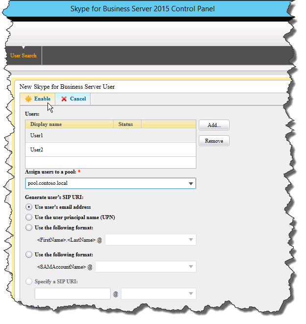

# Verifique a topologia no Skype for Business Server
 
**Resumo:** Saiba como verificar se a topologia Skype for Business Server e os servidores do Active Directory estão funcionando conforme o esperado.
  
Depois que a topologia for publicada e os componentes do sistema Skype for Business Server instalados em cada um dos servidores na topologia, você estará pronto para verificar se a topologia está funcionando conforme o esperado. Isso inclui verificar se a configuração foi propagada para todos os servidores do Active Directory para que todo o domínio saiba Skype for Business está disponível no domínio. Você pode executar as etapas de 1 a 5 em qualquer ordem. No entanto, você deve executar as etapas 6, 7 e 8 na ordem e após as etapas de 1 a 5, conforme descrito no diagrama. Verificar a topologia é a etapa 8 de 8.
  

  
## Testar a implantação do pool de Front-Ends

A etapa final é testar o pool de Front-Ends e confirmar se Skype for Business clientes podem se comunicar entre si. 
  
### Adicionar usuários e verificar a conectividade do cliente

1. Use Computadores e Usuários do Active Directory para adicionar o objeto de usuário do Active Directory da função de administrador para a implantação do Skype for Business Server (na qual o Skype for Business Server Painel de Controle está instalado) ao grupo **CSAdministrator**.
    
    > [!IMPORTANT]
    > Se você não adicionar os usuários e grupos apropriados ao grupo CsAdministors, receberá um erro ao abrir o Skype for Business Server Painel de Controle que diz "Não autorizado: o acesso é negado devido a uma falha de autorização de RBAC (controle de acesso baseado em função)". 
  
2. Se o objeto de usuário estiver conectado no momento, saia e faça logon novamente para registrar a nova atribuição de grupo.
    
    > [!NOTE]
    > A conta de usuário não pode ser o administrador local de nenhum servidor que esteja executando Skype for Business Server. 
  
3. Use a conta administrativa para fazer logon no computador em que Skype for Business Server Painel de Controle está instalado.
    
4. Inicie Skype for Business Server Painel de Controle e forneça credenciais, se solicitado. Skype for Business Server Painel de Controle exibe informações de implantação.
    
5. Na barra de navegação à esquerda, clique em **Topologia** e confirme se o status do serviço mostra um computador com uma seta verde e se uma marca de seleção verde para o status de replicação está ao lado de cada função Skype for Business Server que foi implantada e colocada online. 
    
6. Na barra de navegação à esquerda, clique **em Usuários** e, em seguida, clique **em Habilitar usuários**. 
    
7. Na página **Novo Skype for Business Server Usuário**, clique em **Adicionar**.
    
8. Para definir parâmetros de pesquisa para os objetos que você deseja localizar, na página Selecionar do **Active Directory** , você pode selecionar Pesquisar **e,** opcionalmente, clicar em **Adicionar Filtro**. Você também pode selecionar a **pesquisa LDAP** e inserir uma expressão LDAP para filtrar ou limitar os objetos que serão retornados. Depois de decidir sobre as opções de Pesquisa, clique em **Localizar**.
    
9. No painel Resultados da Pesquisa, selecione os usuários que você deseja adicionar e clique em **OK**.
    
10. Na página **Novo Skype for Business Server Usuário**, os usuários selecionados estão na **exibição Usuários**. Na lista **Atribuir usuários a um pool** , selecione o servidor onde os usuários devem residir.
    
    A seguir está uma lista de opções que você pode usar para configurar os objetos.
    
    - **Gerar o URI SIP do usuário**
    
    - **Telefonia**
    
    - **URI de linha**
    
    - **Política de conferência**
    
    - **Política de versão do cliente**
    
    - **Política de PIN**
    
    - **Política de acesso externo**
    
    - **Política de arquivamento**
    
    - **Política de localização**
    
    - **Política do cliente**
    
    Para testar a funcionalidade básica, selecione a opção que você prefere para a configuração Gerar **URI SIP** do usuário (as outras opções na configuração usam as configurações padrão) e clique em Habilitar **, conforme** mostrado na figura.
    
     
  
11. É exibida uma página de resumo que mostra uma marca de seleção na  coluna Habilitado para indicar que os usuários estão configurados. A **coluna de endereço SIP** exibe o endereço necessário para a configuração de entrada do usuário.
    
     
  
12. Faça logon de um usuário em um computador que ingressou no domínio e outro usuário em outro computador no domínio.
    
13. Instale Skype for Business cliente em cada um dos dois computadores cliente e verifique se ambos os usuários podem entrar no Skype for Business Server e podem enviar mensagens instantâneas entre si.
    

