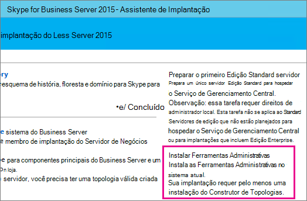
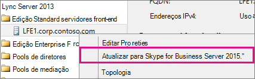
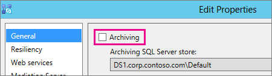
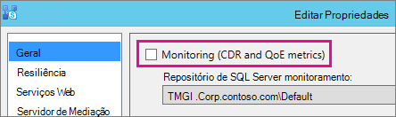
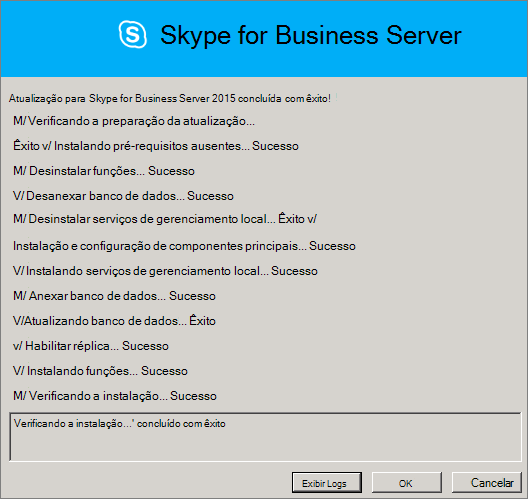
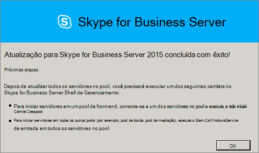
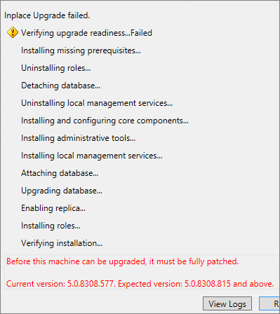

# <a name="upgrade-to-skype-for-business-server-2015"></a>Atualizar para o Skype for Business Server 2015
 
**Resumo:** Saiba como atualizar do Lync Server 2013 para o Skype for Business Server 2015. 
  
Use os procedimentos neste documento para atualizar do Lync Server 2013 para o Skype for Business Server 2015 usando o Construtor de Topologias do Skype for Business Server e o novo recurso In-Place Upgrade. Se você quiser atualizar do Lync Server 2010 ou do Office Communications Server 2007 R2, consulte Plano para atualizar para [o Skype for Business Server 2015](../plan-your-deployment/upgrade.md).

> [!NOTE]
> As atualizações in-loco estavam disponíveis no Skype for Business Server 2015, mas não têm mais suporte no Skype for Business Server 2019. Há suporte para coexistência lado a lado, consulte [Migração para Skype for Business Server 2019](../../SfBServer2019/migration/migration-to-skype-for-business-server-2019.md) para obter mais informações.
  
## <a name="upgrade-from-lync-server-2013"></a>Atualização do Lync Server 2013

A atualização do Lync Server 2013 para o Skype for Business Server 2015 envolve a instalação de software de pré-requisitos, o uso do Construtor de Topologias do Skype for Business Server para atualizar bancos de dados no pool e o uso da Atualização do Skype for Business Server In-Place em cada um dos servidores associados a o pool. Para concluir a atualização, siga as oito etapas neste tópico.
  
### <a name="before-you-begin"></a>Antes de começar

- Examine [o plano para atualizar para o Skype for Business Server 2015](../plan-your-deployment/upgrade.md).
    
- Examine [os requisitos do servidor Skype for Business Server 2015](../plan-your-deployment/requirements-for-your-environment/server-requirements.md).
    
- [Instale os pré-requisitos do Skype for Business Server 2015](install/install-prerequisites.md).
    
- [Instale Skype for Business Server 2015](install/install.md).
    
### <a name="step-1-install-administrator-tools-and-download-topology"></a>Etapa 1: Instalar ferramentas de administrador e baixar topologia

1. Conexão computador na topologia que não tenha o Lync OCSCore ou nenhum outro componente do Lync instalado.
    
2. Na Skype for Business Server de instalação de 2015, execute **Setup.exe** de **OCS_Volume\Setup\AMD64**. 
    
3. Clique em **Instalar**. 
    
4. Aceitar o Contrato de Licença.
    
5. No Assistente de Implantação, clique **em Instalar ferramentas de Administrador** e siga as etapas a serem instaladas.
    
     
  
6. Na página Windows tela inicial, abra Skype for Business Server Construtor de Topologias.
    
7. Clique **em Baixar topologia da implantação existente** e clique em **Avançar**.
    
8. Insira um nome para a topologia e clique em **Salvar**.
    
9. Vá para o local onde você salvou a topologia e faça uma cópia da topologia.
    
### <a name="step-2-upgrade-and-publish-topology-using-topology-builder"></a>Etapa 2: Atualizar e publicar a topologia usando o Construtor de Topologias

Antes de iniciar o processo de atualização, todos os serviços devem estar em execução para os pools que você planeja atualizar. Isso ocorre para que as alterações de topologia sejam replicadas para o banco de dados local dos servidores no pool.
  
> [!IMPORTANT]
>  Salve uma cópia do arquivo de topologia antes de atualizar. Depois de atualizar, você não poderá fazer downgrade da topologia.> Se os serviços estão nos mesmos servidores que seus bancos de dados, como o serviço de Chat Persistente está no mesmo servidor que o banco de dados de Chat Persistente, ignore esta etapa e vá para a etapa 4. Depois de interromper os serviços, execute a configuração In-Place Atualização em cada servidor para atualizar os bancos de dados locais.
  
> [!NOTE]
> Se a topologia tiver um banco de dados de back-end espelhado, você verá os bancos de dados Principal e Espelhado aparecerem quando você publicar a **topologia** usando o Construtor de Topologias. Verifique se todos os bancos de dados estão em execução na Entidade de Segurança e selecione apenas a Entidade de Segurança, não o espelho, ao publicar a topologia; caso contrário, você verá um aviso após a publicação da topologia.
  
Escolha uma das opções abaixo para atualizar e publicar uma nova topologia usando o Construtor de Topologias Skype for Business Server 2015. Depois de concluir as etapas e publicar a topologia atualizada, vá para a Etapa 3 neste tópico.
  
#### <a name="option-1-upgrade-an-isolated-front-end-pool-and-associated-archiving-and-monitoring-stores"></a>Opção 1: Atualizar um pool de Front-Ends isolado e repositórios de Monitoramento e Arquivamento associados

Se o pool que você está atualizando tiver uma dependência de repositório de Arquivamento e Monitoramento, quando você usar as etapas a seguir, o repositório de Arquivamento e Monitoramento também será atualizado.
  
1. No Construtor de Topologias, clique com o botão direito do mouse em um pool do Lync Server 2013, selecione Atualizar para **Skype for Business Server 2015** e siga as etapas. 
    
     
  
2. No Construtor de Topologias, clique **em Action** > **Publish topology ou** **Action** > **Topology** > **Publish**. 
    
     
  
3. Durante a publicação, escolha instalar um banco de dados no repositório de Arquivamento e Monitoramento.
    
#### <a name="option-2-upgrade-front-end-pool-without-upgrading-archiving-and-monitoring-stores"></a>Opção 2: Atualizar o pool de Front-Ends sem atualizar os repositórios de Monitoramento e Arquivamento

Se você usar as etapas a seguir, o arquivamento e o monitoramento do pool selecionado serão desabilitados. O pool não terá repositórios de Arquivamento e Monitoramento após a atualização.
  
1. No Construtor de Topologias, selecione o pool do Lync Server 2013 que você deseja atualizar.
    
2. Remova a dependência dos repositórios de Arquivamento e Monitoramento do Lync Server 2013. 
    
   - Vá para **Propriedades de Edição** > **de Ação**.
    
   - **Desmarque a caixa de seleção** Arquivamento.
    
     
  
   - **Desmarque a caixa de seleção** Monitoramento.
    
     
  
3. Clique com o botão direito do mouse no pool do Lync Server 2013, selecione Atualizar para Skype for Business Server **2015** e siga as etapas. 
    
     
  
4. No Construtor de Topologias, clique **em Action** > **Publish topology ou** **Action** > **Topology** > **Publish**. 
    
#### <a name="option-3-upgrade-front-end-pool-and-associated-it-to-new-skype-for-business-server-2015-archiving-and-monitoring-stores"></a>Opção 3: atualizar o pool de Front-Ends e associá-lo aos novos repositórios de Arquivamento e Monitoramento Skype for Business Server 2015

Se você usar as etapas a seguir, o arquivamento e o monitoramento serão interrompidos no repositório anterior e começarão no novo repositório que você criou. 
  
1. No Construtor de Topologias, selecione o pool do Lync Server 2013 que você deseja atualizar. 
    
2. Remova a dependência dos repositórios de Arquivamento e Monitoramento do Lync Server 2013. 
    
   - Vá para **Propriedades de Edição** > **de Ação**.
    
   - **Desmarque a caixa de seleção** Arquivamento.
    
     
  
   - **Desmarque a caixa de seleção** Monitoramento.
    
     
  
3. Clique com o botão direito do mouse no pool do Lync Server 2013, selecione Atualizar para Skype for Business Server **2015** e siga as etapas. 
    
     
  
4. Crie um novo SQL para Arquivamento. 
    
   - Selecione o pool e as **propriedades editar** > **ação**. 
    
   -  Marque a caixa de seleção **Arquivamento**.
    
   - Clique em **Novo**.
    
     
  
5. Crie um novo SQL para Monitoramento. 
    
   - Selecione o pool e as **propriedades editar** > **ação**. 
    
   -  Marque **a caixa de seleção** Monitoramento.
    
   - Clique em **Novo**.
    
     
  
6. No Construtor de Topologias, clique **em Action** > **Publish topology ou** **Action** > **Topology** > **Publish**. 
    
7. Durante a publicação, escolha instalar o banco de dados no novo repositório de Monitoramento e Arquivamento.
    
### <a name="step-3-wait-for-replication"></a>Etapa 3: Aguardar a replicação

Dê algum tempo à replicação para publicar a topologia atualizada em todos os servidores no ambiente.
  
### <a name="step-4-stop-all-services-in-pool-to-be-upgraded"></a>Etapa 4: Interromper a atualização de todos os serviços no pool

Em cada servidor que está atendendo o pool que você vai atualizar, execute o seguinte cmdlet no PowerShell:
  
```powershell
Disable-CsComputer -Scorch
```

É recomendável usar Disable-CsComputer porque talvez seja necessário reinicializar o servidor durante o processo In-Place Atualização. Se você usar Stop-CsWindowsService, alguns serviços poderão ser reiniciados automaticamente após uma reinicialização. Isso pode fazer com que a In-Place atualização falhe.
  
### <a name="step-5-upgrade-front-end-pools-and-non-front-end-pool-servers"></a>Etapa 5: Atualizar pools de Front-End e servidores de pool não Front-End

> [!NOTE]
>  Antes de atualizar, instale todos os novos pré-requisitos necessários para o Skype for Business Server 2015, que incluem: > Pelo menos 32 GB de espaço livre antes de tentar uma atualização. Além disso, verifique se a unidade é uma unidade local fixa, não está conectada por USB ou Firewire, é formatado com o sistema de arquivos NTFS, não está compactado e não contém um arquivo de página.> PowerShell versão 6.2.9200.0 ou posterior.> A atualização cumulativa mais recente do Lync Server 2013 instalada.> SQL Server 2012 SP1 instalado.> Os seguintes KB's instalados (instalados automaticamente se estiver usando o Microsoft Update): > Windows Server 2008 R2 -[KB2533623](https://support.microsoft.com/kb/2533623)> Windows Server 2012 -[KB2858668](https://support.microsoft.com/kb/2858668)> Windows Server 2012 R2 -[KB2982006](https://support.microsoft.com/kb/2982006)
  
Use a In-Place atualização em cada servidor para atualizar o pool de Front-Ends, o pool de Borda, o servidor de Mediação e o pool de Chat Persistente.
  
1. Em cada servidor, execute **Setup.exe** de **OCS_Volume\Setup\amd64** na mídia de instalação Skype for Business Server 2015.
    
2. Aceite o contrato de licença e siga os prompts para o In-Place Atualização.
    
3. Repita essas etapas para cada servidor no pool de Front-Ends e em cada servidor de pool não Front-End.
    
> [!NOTE]
> Talvez você seja solicitado a reinicializar o servidor durante a In-Place Atualização. Está okey. Depois de reinicializar, In-Place atualização continuará de onde ela foi deixada. 
  
Quando a In-Place atualização for concluída com êxito, você verá a mensagem a seguir.
  

  
### <a name="step-6-restart-services-on-all-upgraded-servers"></a>Etapa 6: Reiniciar serviços em todos os servidores atualizados

> [!NOTE]
> Antes de reiniciar os serviços, verifique se %ProgramData%\WindowsFabric não existe em todos os Servidores Front-End. Se ele existir, exclua-o antes de iniciar os serviços. 
  
- Depois de atualizar todos os servidores no pool de Front-Ends, reinicie os serviços usando o seguinte comando do PowerShell: 
    
  ```powershell
  Start-CsPool
  ```

    > [!NOTE]
    > Se já houver uma reinicialização pendente do sistema necessária antes de iniciar a execução do In-Place Upgrade, o In-Place Upgrade não solicitará que você reinicialize no final da instalação. Isso fará com que algumas exceções de assembly sejam geradas no primeiro servidor Front-End quando você tentar iniciar serviços usando o cmdlet Start-CSPool servidor. Para resolver esses erros, reinicialize todos os servidores no pool e execute o cmdlet novamente. 
  
- Nos servidores de pool não Front-End, reinicie os serviços usando o seguinte comando:
    
  ```powershell
  Start-CsWindowsService
  ```

Depois de clicar **em OK** na página In-Place Atualização, você verá o lembrete a seguir para concluir esta etapa.
  

  
### <a name="step-7-verify-skype-for-business-functionality-works"></a>Etapa 7: Verificar se Skype for Business funcionalidade funciona

Para garantir que a atualização tenha sido bem-sucedida, para o pool que foi atualizado, teste Skype for Business verificar se a funcionalidade está funcionando conforme o esperado. 
  
### <a name="step-8-upgrade-secondary-pools"></a>Etapa 8: Atualizar pools secundários

Repita as etapas neste tópico para atualizar os pools adicionais que você tem em seu ambiente.
  
## <a name="troubleshoot-issues-with-the-in-place-upgrade"></a>Solucionar problemas com a atualização In-Place atualização

Se a In-Place atualização falhar, você poderá ver uma mensagem semelhante ao que está na imagem a seguir. 
  

  
Examine a mensagem completa na parte inferior da página para ajudá-lo a solucionar o problema. Clique **em Exibir logs** para obter mais detalhes.
  
Se a Atualização do In-Place falhar ao verificar a  preparação da atualização ou instalar os pré-requisitos **ausentes**, verifique se o servidor tem todas as atualizações mais recentes do Windows Server, do Lync Server e do SQL Server aplicadas e se todos os softwares e funções necessários estão instalados. Para obter uma lista do que é necessário, consulte Os requisitos do [servidor para o Skype for Business Server 2015](../plan-your-deployment/requirements-for-your-environment/server-requirements.md) e instalar os pré-requisitos do [Skype for Business Server 2015](install/install-prerequisites.md).
  
## <a name="see-also"></a>Confira também

[Planejar a atualização para o Skype for Business Server 2015](../plan-your-deployment/upgrade.md)
  
[Requisitos de servidor para Skype for Business Server 2015](../plan-your-deployment/requirements-for-your-environment/server-requirements.md)
  
[Instalar os pré-requisitos do Skype for Business Server 2015](install/install-prerequisites.md)
  
[Instalar Skype for Business Server 2015](install/install.md)
