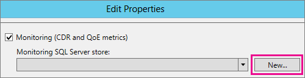

# <a name="upgrade-to-skype-for-business-server-2015"></a>Upgrade to Skype for Business Server 2015
 
**Resumo:** Saiba como atualizar do Lync Server 2013 para o Skype for Business Server 2015. Baixe um teste grátis do Skype for Business Server 2015 a partir do [centro de avaliação da Microsoft](https://www.microsoft.com/evalcenter/evaluate-skype-for-business-server).
  
Use os procedimentos deste documento para atualizar do Lync Server 2013 para o Skype for Business Server 2015 usando o construtor de topologias do Skype for Business Server e o novo recurso de atualização in-loco. Se você deseja atualizar do Lync Server 2010 ou do Office Communications Server 2007 R2, confira [planejar a atualização para o Skype for Business Server 2015](../plan-your-deployment/upgrade.md).

> [!NOTE]
> As atualizações in-loco estavam disponíveis no Skype for Business Server 2015, mas não são mais compatíveis com o Skype for Business Server 2019. A coexistência de lado a lado tem suporte, confira [migrar para o Skype for Business Server 2019](../../SfBServer2019/migration/migration-to-skype-for-business-server-2019.md) para obter mais informações.
  
## <a name="upgrade-from-lync-server-2013"></a>Atualização do Lync Server 2013

A atualização do Lync Server 2013 para o Skype for Business Server 2015 envolve a instalação de software de pré-requisito, usando o construtor de topologias do Skype for Business Server para atualizar bancos de dados no pool e usar a atualização local do Skype for Business Server em cada um dos servidores associados ao pool. Para completar a atualização, siga as oito etapas descritas neste tópico.
  
### <a name="before-you-begin"></a>Antes de você começar

- Leia o [Plan to upgrade to Skype for Business Server 2015](../plan-your-deployment/upgrade.md).
    
- Examine [os requisitos do servidor do Skype for Business Server 2015](../plan-your-deployment/requirements-for-your-environment/server-requirements.md).
    
- [Instale pré-requisitos para o Skype for Business Server 2015](install/install-prerequisites.md) .
    
- [Instale o Skype for Business Server 2015](install/install.md) .
    
### <a name="step-1-install-administrator-tools-and-download-topology"></a>Etapa 1: instalar ferramentas do Administrador e baixar a topologia

1. Conecte-se ao computador na topologia que não tenha o Lync OCSCore ou qualquer outro componente do Lync instalado.
    
2. Na mídia de instalação do Skype for Business Server 2015, execute **Setup. exe a** partir do **OCS_Volume\Setup\AMD64**. 
    
3. Clique em **Instalar**. 
    
4. Aceite o contrato de licença.
    
5. No Assistente de Implantação, clique em **Instalar ferramenta do Administrador**, e siga as etapas para a instalação.
    
     
  
6. Na tela inicial do Windows, abra o construtor de topologias do Skype for Business Server.
    
7. Clique em **Baixar Topologia da implantação existente** e clique em **Avançar**.
    
8. Digite um nome para a topologia e clique em **Salvar**.
    
9. Vá para o local onde você salvou a topologia e faça uma cópia dela.
    
### <a name="step-2-upgrade-and-publish-topology-using-topology-builder"></a>Etapa 2: atualizar e publicar a topologia usando o Construtor de Topologias

Antes de iniciar o processo de atualização, todos os serviços devem estar em execução para os pools que você planeja atualizar. Isso porque mudanças na topologia serão replicadas para o banco de dados local dos servidores no pool.
  
> [!IMPORTANT]
>  Salve uma cópia do seu arquivo de topologia antes de fazer a atualização. Após a atualização, você não poderá fazer o downgrade da topologia. > se seus serviços estiverem nos mesmos servidores dos bancos de dados, como o serviço de chat persistente estiver no mesmo servidor do banco de dados de chat persistente, pule esta etapa e vá para a etapa 4. Depois de interromper os serviços, execute a atualização in-loco em cada servidor para atualizar os bancos de dados locais.
  
> [!NOTE]
> Se a topologia tiver um banco de dados de back-end espelhado, os bancos de dados Principal e Espelhado aparecerão **quando você publicar a topologia** usando o Construtor de Topologias. Certifique-se de que todos os bancos de dados estão em execução no Principal e selecione apenas o Principal, não o Espelhado, ao publicar a topologia. Caso contrário, você verá um aviso após a publicação da topologia.
  
Escolha uma das opções abaixo para atualizar e publicar uma nova topologia usando o construtor de topologias do Skype for Business Server 2015. Depois de concluir as etapas e publicar a topologia atualizada, siga para a Etapa 3 deste tópico.
  
#### <a name="option-1-upgrade-an-isolated-front-end-pool-and-associated-archiving-and-monitoring-stores"></a>Opção 1: atualizar um pool isolado de Front-End e associar os repositórios de Monitoramento e Arquivamento

Se o pool que você está atualizando tiver uma dependência de repositório de Monitoramento e Arquivamento, quando você executar as seguintes etapas, o repositório também será atualizado.
  
1. No construtor de topologias, clique com o botão direito do mouse em um pool do Lync Server 2013, selecione **atualizar para o Skype for Business Server 2015**e siga as etapas. 
    
     
  
2. No construtor de topologias, clique em**topologia de publicação** de **ação** > ou**publicação**de**topologia** > de **ação** > . 
    
     
  
3. Durante a publicação, instale um banco de dados no repositório de Monitoramento e Arquivamento.
    
#### <a name="option-2-upgrade-front-end-pool-without-upgrading-archiving-and-monitoring-stores"></a>Opção 2: Atualize o pool de front-end sem Atualizar os armazenamentos de arquivamento e monitoramento

Se você executar as seguintes etapas, o arquivamento e monitoramento do pool selecionado serão desabilitados. O pool não terá repositórios de Monitoramento e Arquivamento após a atualização.
  
1. No construtor de topologias, selecione o pool do Lync Server 2013 que você deseja atualizar.
    
2. Remova a dependência das lojas de arquivamento e monitoramento do Lync Server 2013. 
    
   - Vá para **ação** > **Editar propriedades**.
    
   - Desmarque a caixa de seleção **Arquivamento**.
    
     
  
   - Desmarque a caixa de seleção **Monitoramento**.
    
     
  
3. Clique com o botão direito do mouse no pool do Lync Server 2013, selecione **atualizar para o Skype for Business Server 2015**e siga as etapas. 
    
     
  
4. No construtor de topologias, clique em**topologia de publicação** de **ação** > ou**publicação**de**topologia** > de **ação** > . 
    
#### <a name="option-3-upgrade-front-end-pool-and-associated-it-to-new-skype-for-business-server-2015-archiving-and-monitoring-stores"></a>Opção 3: atualizar o pool de front-ends e o associado a novos repositórios de arquivamento e monitoramento do Skype for Business Server 2015

Se você usar as seguintes etapas, o arquivamento e monitoramento serão interrompidos no repositório anterior e reiniciados no novo repositório que você criou. 
  
1. No construtor de topologias, selecione o pool do Lync Server 2013 que você deseja atualizar. 
    
2. Remova a dependência das lojas de arquivamento e monitoramento do Lync Server 2013. 
    
   - Vá para **ação** > **Editar propriedades**.
    
   - Desmarque a caixa de seleção **Arquivamento**.
    
     
  
   - Desmarque a caixa de seleção **Monitoramento**.
    
     
  
3. Clique com o botão direito do mouse no pool do Lync Server 2013, selecione **atualizar para o Skype for Business Server 2015**e siga as etapas. 
    
     
  
4. Crie um novo repositório do SQL para Arquivamento. 
    
   - Selecione as propriedades de **** > **edição**do pool e da ação. 
    
   -  Marque a caixa de seleção **Arquivamento**.
    
   - Clique em **Novo**.
    
     
  
5. Crie um novo repositório do SQL para Monitoramento. 
    
   - Selecione as propriedades de **** > **edição**do pool e da ação. 
    
   -  Marque a caixa de seleção **Monitoramento**.
    
   - Clique em **Novo**.
    
     
  
6. No construtor de topologias, clique em**topologia de publicação** de **ação** > ou**publicação**de**topologia** > de **ação** > . 
    
7. Durante a publicação, instale o banco de dados no novo repositório de Monitoramento e Arquivamento.
    
### <a name="step-3-wait-for-replication"></a>Etapa 3: aguardar a replicação

Aguarde alguns instantes até a replicação publicar a topologia atualizada em todos os servidores do ambiente.
  
### <a name="step-4-stop-all-services-in-pool-to-be-upgraded"></a>Etapa 4: interromper todos os serviços no pool a ser atualizado

Em cada servidor que está servindo o pool que você vai atualizar, execute o seguinte cmdlet no PowerShell:
  
```
Disable-CsComputer -Scorch
```

Recomendamos usar Disable-CsComputer porque talvez seja necessário reinicializar o servidor durante o processo de atualização in-loco. Se você usar o Stop-CsWindowsService, alguns serviços podem reiniciar automaticamente depois de uma reinicialização. Isso pode fazer com que a atualização in-loco não seja bem-sucedida.
  
### <a name="step-5-upgrade-front-end-pools-and-non-front-end-pool-servers"></a>Etapa 5: atualizar servidores de pools de Front-Ends e de pools não-Front-End

> [!NOTE]
>  Antes de atualizar, instale todos os novos pré-requisitos necessários para o Skype for Business Server 2015, que incluem: > pelo menos 32 GB de espaço livre antes de tentar uma atualização. Além disso, certifique-se de que a unidade é uma unidade local fixa, que não está conectada por USB ou FireWire, está formatada com o sistema de arquivos NTFS, não está compactada e não contém um arquivo de página. > PowerShell versão 6.2.9200.0 ou posterior. > o Lync Server 2013 mais recente Atualização cumulativa instalada. > SQL Server 2012 SP1 instalado. > o seguinte KB instalado (instalado automaticamente se estiver usando o Microsoft Update): > Windows Server 2008 R2-[KB2533623](https://support.microsoft.com/kb/2533623)> windows Server 2012-[KB2858668](https://support.microsoft.com/kb/2858668)> Windows Server 2012 R2-[KB2982006](https://support.microsoft.com/kb/2982006)
  
Use a atualização in-loco em cada servidor para atualizar o pool de front-end, o pool de mediação, o servidor de mediação e o pool de chat persistente.
  
1. Em cada servidor, execute **Setup. exe** em **OCS_Volume\Setup\amd64** na mídia de instalação do Skype for Business Server 2015.
    
2. Aceite o contrato de licença e siga os prompts para a atualização in-loco.
    
3. Repita essas etapas para cada servidor no pool de front-ends e em cada servidor de pool não-front-end.
    
> [!NOTE]
> Você pode ser solicitado a reiniciar o servidor durante a atualização in-loco. Não tem problema. Após a reinicialização, a atualização in-loco continuará de onde ela parou. 
  
Quando a atualização in-loco for concluída com sucesso, você verá a seguinte mensagem.
  

  
### <a name="step-6-restart-services-on-all-upgraded-servers"></a>Etapa 6: reiniciar serviços em todos os servidores atualizados

> [!NOTE]
> Antes de reiniciar os serviços, certifique-se de que o%ProgramData%\WindowsFabric não existe em todos os servidores de front-end. Se existir, exclua antes de iniciar os serviços. 
  
- Depois de atualizar todos os servidores no pool de front-ends, reinicie os serviços usando o seguinte comando do PowerShell: 
    
  ```
  Start-CsPool
  ```

    > [!NOTE]
    > Se já houver uma reinicialização de sistema pendente necessária antes de iniciar a execução da atualização in-loco, ela não solicitará a reinicialização quando a instalação for concluída. Isso fará com que algumas exceções de assembly sejam jogadas no primeiro servidor Front-End quando você tentar iniciar os serviços usando o cmdlet Start-CSPool. Para resolver esses erros, reinicie todos os servidores no pool e execute o cmdlet novamente. 
  
- Nos servidores do pool não-Front-End, reinicie os serviços usando o seguinte comando:
    
  ```
  Start-CsWindowsService
  ```

Depois de clicar em **OK** na página de atualização in-loco, você verá o seguinte lembrete para concluir esta etapa.
  

  
### <a name="step-7-verify-skype-for-business-functionality-works"></a>Etapa 7: verificar se a funcionalidade do Skype for Business funciona

Para garantir que a atualização foi bem-sucedida, para o pool que foi atualizado, teste o Skype for Business para verificar se a funcionalidade está funcionando conforme o esperado. 
  
### <a name="step-8-upgrade-secondary-pools"></a>Etapa 8: atualizar pools secundários

Repita as etapas deste tópico para atualizar quaisquer pools adicionais que você tenha no seu ambiente.
  
## <a name="troubleshoot-issues-with-the-in-place-upgrade"></a>Solução de problemas com a atualização in-loco

Se a atualização in-loco falhar, você pode ver uma mensagem similar à seguinte imagem. 
  

  
Reveja a mensagem completa parte inferior da página para ajudar a solucionar o problema. Clique em **Exibir logs** para obter mais detalhes.
  
Se a atualização in-loco falhar durante a **verificação da preparação da atualização** ou da **instalação de pré-requisitos ausentes**, verifique se o servidor tem todas as atualizações mais recentes do Windows Server, Lync Server e SQL Server aplicadas e todas as funções e o software necessário instalado. Para obter uma lista do que é necessário, consulte [requisitos do servidor para o Skype for Business server 2015](../plan-your-deployment/requirements-for-your-environment/server-requirements.md) e [Instalar pré-requisitos para o Skype for Business Server 2015](install/install-prerequisites.md).
  
## <a name="see-also"></a>Confira também

[Planejamento de atualização para o Skype for Business Server 2015](../plan-your-deployment/upgrade.md)
  
[Server requirements for Skype for Business Server 2015](../plan-your-deployment/requirements-for-your-environment/server-requirements.md)
  
[Instalar os pré-requisitos para o Skype for Business Server 2015](install/install-prerequisites.md)
  
[Instalar o Skype for Business Server 2015](install/install.md)
