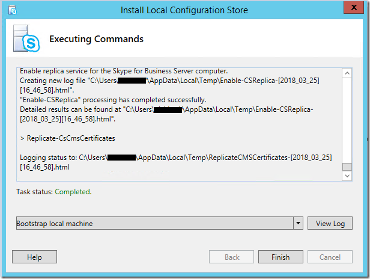
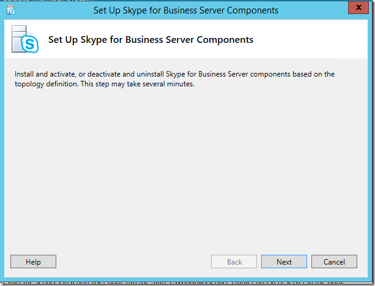

# <a name="disable-tls-1011-in-skype-for-business-server-2015"></a>Desabilitar o TLS 1.0/1.1 no Skype for Business Server 2015

Este artigo ajuda você a se preparar e implementar a desabilitação de TLS 1.0 e 1.1 em seus ambientes. Esse processo requer planejamento e preparação abrangentes. Revise cuidadosamente todas as informações deste artigo ao planejar desabilitar o TLS 1.0 e 1.1 para sua organização. Há muitas dependências externas e condições de conectividade que podem ser impactadas desabilitando o TLS 1.0/1.1, portanto, é preciso planejar e testar extensivamente.

- [Plano de fundo e escopo](#background-and-scope)
- [Pré-requisitos e processo](#prerequisites-and-process)
- [Cenários de implantação avançada](#advanced-deployment-scenarios)

## <a name="background-and-scope"></a>Plano de fundo e escopo

Os principais drivers para o fornecimento de TLS 1.0 e 1.1 desabilitam o suporte para o Skype for Business Server local são o Pci (Payment Card Industry) Security Standards Council e os requisitos federais de padrões de processamento de informações. Mais informações sobre os requisitos pci podem ser encontradas [aqui](https://blog.pcisecuritystandards.org/are-you-ready-for-30-june-2018-sayin-goodbye-to-ssl-early-tls).  A Microsoft não pode fornecer orientações sobre se sua organização precisa ou não aderir a esses ou outros requisitos. Você deve determinar se é necessário desabilitar o TLS 1.0 e/ou 1.1 em seus ambientes.

A Microsoft produziu um white paper no TLS disponível aqui [e](https://cloudblogs.microsoft.com/microsoftsecure/2017/06/20/tls-1-2-support-at-microsoft/)também recomendamos a leitura em segundo plano disponível neste blog Exchange [.](https://blogs.technet.microsoft.com/exchange/2018/01/26/exchange-server-tls-guidance-part-1-getting-ready-for-tls-1-2/)

## <a name="supportability-scope"></a>Escopo de suporte

*Escopo* refere-se aos limites de suporte. *Totalmente testado e suportado* significa que suportamos totalmente e testamos a desabilitação do TLS 1.0 e 1.1 para as versões do produto listadas. *Atualmente sendo investigado significa* exatamente isso; estamos investigando ativamente a possibilidade de colocar esses produtos no escopo para que o TLS desabilite o suporte. *Fora do escopo,* essas versões do produto não suportam desabilitar o TLS 1.0 ou 1.1 e não funcionarão, com exceções notadas.

### <a name="fully-tested-and-supported-servers"></a>Servidores totalmente testados e com suporte

- Skype for Business Server 2019 CU1 17.0.2046.123 (junho de 2019) ou superior
- Skype for Business Server 2015 CU9 6.0.9319.548 (maio de 2019) ou superior no Windows Server 2012 (com [kb 3140245](https://support.microsoft.com/help/3140245/update-to-enable-tls-1-1-and-tls-1-2-as-a-default-secure-protocols-in) ou atualização sobressada), 2012 R2 ou 2016.
- Atualização in-loco do Skype for Business Server 2015, com CU9 6.0.9319.548 (maio de 2019) ou superior no Windows Server 2008 R2, 2012 (com KB [3140245](https://support.microsoft.com/help/3140245/update-to-enable-tls-1-1-and-tls-1-2-as-a-default-secure-protocols-in) ou atualização sobressedida) ou 2012 R2.
- Exchange Conectividade e Outlook Web App com Exchange Server 2010 SP3 RU19 ou superior, [orientações aqui](https://blogs.technet.microsoft.com/exchange/2018/01/26/exchange-server-tls-guidance-part-1-getting-ready-for-tls-1-2/)
- Aparelho de Filial Desavivável (SBA) com Skype for Business Server 2015 CU6 HF2 ou superior (confirme com o fornecedor que eles empacotou as atualizações apropriadas e foram disponibilizadas para o seu dispositivo)
- Servidor de Filial Desavivável (SBS) com Skype for Business Server 2015 CU6 HF2 ou superior
- Somente função de borda do Lync Server 2013 , isso acontece porque a função De borda não tem uma dependência do Windows Fabric 1.0.

### <a name="fully-tested-and-supported-clients"></a>Clientes totalmente testados e com suporte

- Lync 2013 (Skype for Business) Desktop Client, MSI e C2R, incluindo Basic [15.0.5023.1000 ou superior](https://support.microsoft.com/help/4018334/april-3-2018-update-for-skype-for-business-2015-lync-2013-kb4018334)
- Skype for Business 2016 Desktop Client, MSI [16.0.4678.1000 ou superior](https://support.microsoft.com/help/4018323/april-3-2018-update-for-skype-for-business-2016-kb4018323), incluindo Basic
- Skype for Business 2016 Clique para Executar Exigir as Atualizações de abril de [2018:](/officeupdates/release-notes-office365-proplus) 
    - Mensal e Semi-Annual Direcionado, 16 \. 0 \. 9126 \. 2152 ou superior
    - Semi-Annual e Canal Adiado, 16 \. 0 \. 8431 \. 2242 ou superior
- Skype for Business mac 16.15 ou superior
- Skype for Business para iOS e Android 6.19 ou superior
- Salas do Microsoft Teams (anteriormente conhecido como Skype Room System V2 SRS V2) 4.0.64.0 (dezembro de 2018) ou superior
- Surface Hub atualização para a edição team com base em KB4499162 (maio de 2019, com build do sistema operacional 15063.1835) ou superior
- Skype Web App 2015 CU6 HF2 ou superior (acompanha o Server)

### <a name="currently-being-investigated"></a>Atualmente sendo investigado

- Painel de Qualidade de Chamada (nova instalação após o TLS 1.0, 1.1 ter sido desabilitado, consulte abaixo)*
 
### <a name="out-of-scope"></a>Fora do escopo

Exceto quando notado, os produtos a seguir não estão no escopo para o TLS 1.0/1.1 desabilitar o suporte e não funcionarão em um ambiente em que o TLS 1.0 e 1.1 foram desabilitados. O que isso significa: se você ainda utilizar servidores ou clientes fora do escopo, deverá atualizá-los ou removê-los se precisar desabilitar o TLS 1.0/1.1 em qualquer lugar em sua implantação Skype for Business Server local.

- Lync Server 2013
- Lync Server 2010
- Windows Server 2008 ou inferior
- Lync para Mac 2011
- Lync 2013 para Dispositivos Móveis - iOS, iPad, Android ou Windows Phone
- Cliente Lync "MX" Windows Store
- Lync Room System (também conhecido como . SRSv1). O LRS atingiu o fim do suporte em 9 de outubro de 2018 e não será atualizado para dar suporte ao TLS 1.2.
- Todos os clientes do Lync 2010
- Lync Telefone Edition - diretrizes atualizadas [aqui](https://techcommunity.microsoft.com/t5/Skype-for-Business-Blog/Certified-Skype-for-Business-Online-Phones-and-what-this-means/ba-p/120035).
- Dispositivo de Filial (SBA) baseado em 2013 ou SBS (Servidor de Filial Desavivável)
- Cloud Connector Edition (CCE)
- Skype for Business para Windows Phone

### <a name="exceptions"></a>Exceções

#### <a name="lync-server-2013"></a>Lync Server 2013

O Lync Server 2013 tem uma dependência Windows Fabric versão 1.0.  Na fase de design do Lync Server 2013, o Windows Fabric 1.0 foi escolhido por sua arquitetura atraente e nova distribuída para fornecer replicação, alta disponibilidade e tolerância a falhas.  Ao longo do tempo, Skype for Business Server e Windows Fabric melhoraram muito essa arquitetura conjunta com um re-design significativo nas versões subsequentes.  O Skype for Business 2015 Server usa Windows Fabric 3.0, por exemplo.

Infelizmente, Windows Fabric 1.0 **não dá suporte a TLS 1.2.  No entanto, atualizaremos o Lync Server 2013 para trabalhar com o TLS 1.2**. Isso estará chegando na próxima Atualização Cumulativa do Lync Server 2013.  Estamos fornecendo suporte ao TLS 1.2 para habilitar cenários de co-existência, migração, federação e híbridos.

Se sua organização for necessária para desabilitar o TLS 1.0 e 1.1, e você usar o Lync Server 2013 no momento, recomendamos que você inicie seu processo de planejamento, com a possibilidade de ter que atualizar in-loco ou migrar lado a lado (novos pools, mover usuários) para Skype for Business Server 2015 ou superior.  Ou talvez você queira acelerar a migração para Skype for Business Online.

#### <a name="call-quality-dashboard"></a>Painel de Qualidade da Chamada

No momento, o Painel de Qualidade de Chamada Local tem uma dependência do TLS 1.0 durante a nova instalação (primeira vez que você instala seus ambientes locais).  No momento, estamos investigando esse problema e planejamos liberar uma correção em um futuro próximo.  Se você estiver planejando instalar o CQD e também desabilitar o TLS 1.0, recomendamos que você conclua a instalação do CQD primeiro e prossiga com a desabilitação do TLS 1.0.

#### <a name="skype-for-business-sdn-manager"></a>Skype for Business SDN Manager

Skype for Business O SDN Manager SQL um banco de dados tem uma dependência do TLS 1.0 durante a nova instalação. Se você estiver planejando instalar o Skype for Business SDN Manager usando SQL um banco de dados e também desabilitar o TLS 1.0, recomendamos que você conclua primeiro o SDN Manager do Skype for Business e prossiga com a desabilitação do TLS 1.0. Caso o TLS 1.0 tenha sido desabilitado antes da instalação, você deve habilitar temporariamente o TLS 1.0 no servidor back-end do SQL Server que será usado para hospedar o banco de dados Skype for Business SDN Manager SQL.

#### <a name="third-party-devices"></a>Dispositivos de terceiros

Em dispositivos de terceiros, como telefones 3PIP, Videoconferência, Proxies Reversos e Balanceadores de Carga, certifique-se de validar a capacidade de suporte do TLS 1.2, teste cuidadosamente e contate o fornecedor, se necessário.

### <a name="federation-considerations-when-disabling-tls-1011-on-edge-servers"></a>Considerações de federação ao desabilitar o TLS 1.0/1.1 em servidores de Borda

Você deve planejar cuidadosamente e considerar o impacto da desabilitação do TLS 1.0/1.1 em seus servidores de Borda.  Depois que o TLS 1.0 e o 1.1 são desabilitados, você pode descobrir que outras organizações não podem mais se federar com sua organização.

Você pode optar por manter o TLS 1.0/1.1 habilitado em seus servidores de Borda para manter a compatibilidade com versões regressivas com sistemas externos não corrigidas (SfB 2015, Lync 2013) ou mais antigos (2010).

A Microsoft não pode fornecer conselhos ou recomendações sobre se sua rede de Borda (ou qualquer rede) está ou não em conformidade com o padrão PCI; que deve ser determinado pela empresa individual.

Skype for Business Online é capaz de TLS 1.2 hoje, portanto, não é esperado impacto para o Híbrido/Federação com o Online.

PIC (Conectividade de IM Pública) para Skype Consumidor: não esperamos que desabilitar o TLS 1.0/1.1 a impacte Skype [Conectividade;](../../deploy/deploy-skype-connectivity.md) Os Gateways PIC da Microsoft já são TLS 1.2 capazes.

## <a name="prerequisites-and-process"></a>Pré-requisitos e processo

Exceto quando mencionado acima, uma vez que o TLS 1.0 e 1.1 são desabilitados servidores fora do escopo, clientes e dispositivos funcionarão corretamente ou em tudo. Isso pode significar que você precisa pausar e aguardar orientações atualizadas da Microsoft. Depois de atender a todos os requisitos e ter um plano para resolver lacunas, prossiga.

Em um nível alto, enquanto o Skype for Business Server 2019 está pronto para o procedimento na instalação, o Skype for Business Server 2015 exigirá que você instale o CU9, aplicando atualizações pré-requisitos ao .NET e ao SQL, implantando chaves de registro de pré-requisito e, finalmente, uma rodada separada de atualizações de configuração do sistema operacional (ou seja, desabilitando o TLS 1.0 e 1.1 por meio do Registro importação de arquivo). É fundamental que você conclua a instalação de todos os pré-requisitos, incluindo o Skype for Business Server 2015 CU6 HF2, antes de desabilitar o TLS 1.0 e 1.1 em qualquer servidor em seu ambiente. Cada Skype for Business servidor, incluindo a função de borda e SQL Backends, exige as atualizações. Verifique também se todos os clientes com suporte (no escopo) foram atualizados para as versões mínimas necessárias. Não se esqueça de atualizar as estações de trabalho de gerenciamento também.

Queremos seguir a ordem usual de operações de "de dentro para fora" para atualizar Skype for Business servidores. Trate pools de diretores, chat persistente e pools emparelhados da mesma maneira que normalmente faria. A ordem e os métodos de atualização são abordados [aqui](topology.md) e [aqui.](https://support.microsoft.com/help/3061064/updates-for-skype-for-business-server-2015)

### <a name="high-level-process"></a>Processo de alto nível

1. Teste todas as etapas em seu laboratório antes de configurar servidores de produção.
2. Fazer o back-up e preservar uma cópia do Registro exportado em cada servidor individual a ser atualizado. Não é possível compartilhar registros entre servidores; eles contêm chaves exclusivas baseadas em máquina.
3. Atualize todos os Skype for Business 2015 para CU9 ou superior. Para Skype for Business Server 2019, atualize para CU1 ou superior.
4. Instale todos os pré-requisitos em todos os servidores.
5. Implantar chaves de registro de pré-requisitos.
6. Certifique-se de que todos os clientes no escopo sejam atualizados.
7. Desabilite o TLS 1.0 e 1.1 por meio da importação do Registro.
8. Valide se as cargas de trabalho estão funcionando conforme o esperado.
    - Se os problemas são encontrados, solução de problemas e solução ou
    - Restaurar o Registro da etapa 2 para habilitar o TLS 1.0 e 1.1
9. Valide se apenas o TLS 1.2 está sendo usado.

### <a name="install-prerequisites-to-all-servers"></a>Instalar pré-requisitos em todos os servidores

A atualização de dependência extensiva é necessária antes de começar a desabilitar o TLS 1.0 e 1.1 no nível do sistema operacional em suas implantações Skype for Business Server 2015. A seguir estão as versões mínimas que podem dar suporte ao TLS 1.2. Implante todas as atualizações de pré-requisitos em todos os servidores Skype for Business em seu ambiente antes de começar a desabilitar o TLS 1.0 e 1.1.

- Skype for Business Server 2015 CU9 6.0.9319.548 (maio de 2019) ou superior
- [.NET Framework 4,7](https://www.microsoft.com/download/details.aspx?id=55167) ou superior com SchUseStrongCrypto habilitado no Registro (fornecido abaixo)
- SQL deve ser atualizado em todos os Skype for Business 2015 e back-ends. Atualize Edição Enterprise Pool SQL Backends primeiro e, em seguida, seus respectivos FEs. 
    - [SQL Server 2014 SP1 + CU5](https://support.microsoft.com/help/3130926), ou superior /SQL Server 2012 SP2 + CU16 ou superior / [SQL Server 2014 RTM + CU12](https://support.microsoft.com/help/3130923/cumulative-update-12-for-sql-server-2014), ou superior /SQL Server 2014 SP2
     - [SQL Server Native Client para SQL Server 2012](https://www.microsoft.com/download/details.aspx?id=50402)
     - [Microsoft ODBC Driver 11 para SQL Server](https://www.microsoft.com/download/details.aspx?id=36434), ou superior
     - [Objetos de gerenciamento compartilhados para SQL Server 2014 SP2](https://www.microsoft.com/download/details.aspx?id=53164)
     - [SQLSysClrTypes para SQL server 2014 SP2](https://www.microsoft.com/download/details.aspx?id=42295)

### <a name="basic-steps-to-install-pre-requisites-in-recommended-order-of-operations"></a>Etapas básicas para instalar pré-requisitos, em ordem recomendada de operações

1. Instale a atualização Skype for Business Server CU9 para todos os servidores. 
    1. Instale a atualização em componentes usando o atualizador.
    2. Atualize os bancos de dados de acordo com os procedimentos documentados. Para Skype for Business Server 2015, consulte KB [3061064](https://support.microsoft.com/help/3061064/updates-for-skype-for-business-server-2015).
    3. Valide a funcionalidade do produto na implantação antes de avançar com quaisquer outras alterações.
2. Baixe o Instalador Offline do .NET 4.7. 
    1. Referência: [https://www.microsoft.com/download/details.aspx?id=55167](https://www.microsoft.com/download/details.aspx?id=55167)
    2. Verifique se Skype for Business Server serviços 2015 foram interrompidos no servidor Front-End.
    3. Referência: [https://support.microsoft.com/help/3061064/updates-for-skype-for-business-server-2015](https://support.microsoft.com/help/3061064/updates-for-skype-for-business-server-2015)
    4. Ex (Edição Standard):```Stop-CsWindowsService```
    5. Ex (Edição Enterprise):```Invoke-CsComputerFailover```
    6. Execute o pacote do instalador.
    7. Reinicialize o servidor.
3. Atualize SQL Express 2014 em todos os servidores. 
    1. Referência: [https://support.microsoft.com/help/3135244/tls-1-2-support-for-microsoft-sql-server](https://support.microsoft.com/help/3135244/tls-1-2-support-for-microsoft-sql-server)
    2. Baixar SQL 2014 SP2 
        - Referência: [https://www.microsoft.com/download/details.aspx?id=53168](https://www.microsoft.com/download/details.aspx?id=53168)
    3. Copie a mídia de instalação para uma pasta no servidor (Ex: C:\01_2014SqlSp2)
    4. Verifique Skype for Business Server serviços 2015 são interrompidos no servidor Front-End 
        - Ex (Edição Standard):```Stop-CsWindowsService```
        - Ex (Edição Enterprise):```Invoke-CsComputerFailover```
    5. Abra um Prompt de Comando de Administrador e atualize todos os componentes e instâncias instalados 
        - Exemplo: C:\01_2014SqlSp2\SQLServer2014SP2-KB3171021-x64-ENU.exe /qs /IAcceptSQLServerLicenseTerms /Action=Patch /AllInstances
4. Atualizar SQL Native Client. 
    1. Referência: [https://support.microsoft.com/help/3135244/tls-1-2-support-for-microsoft-sql-server](https://support.microsoft.com/help/3135244/tls-1-2-support-for-microsoft-sql-server) .
    2. Baixar do [https://www.microsoft.com/download/details.aspx?id=50402](https://www.microsoft.com/download/details.aspx?id=50402)
    3. Verifique Skype for Business Server serviços 2015 são interrompidos no servidor Front-End. 
        - Ex (Edição Standard):```Stop-CsWindowsServices```
        - Ex (Edição Enterprise):```Invoke-CsComputerFailover```
    4. Impedir que SQL instâncias instaladas em execução 
        - Ex: ```Get-Service 'MSSQL$RTCLOCAL' | Stop-Service```
        - Ex: ```Get-Service 'MSSQL$LYNCLOCAL' | Stop-Service```
        - Ex (somente Edição Standard):```Get-Service 'MSSQL$RTC' | Stop-Service```
    5. Instale a atualização.
5. Atualizar ODBC Driver 11 para SQL Server incluir suporte para TLS 1.2 (KB [3135244](https://support.microsoft.com/help/3135244/tls-1-2-support-for-microsoft-sql-server)).
    1. Baixe [ODBC Driver 11 para SQL Server - Windows](https://www.microsoft.com/download/confirmation.aspx?id=36434).
    2. Verifique se Skype for Business Server serviços 2015 foram interrompidos no servidor Front-End.
        - Exemplo (Edição Standard):```Stop-CsWindowsService```
        - Exemplo (Edição Enterprise):```Invoke-CsComputerFailover```
    3. Instale a atualização.
6. Implantar chaves de registro de pré-requisitos.

### <a name="pre-requisite-registry-keys"></a>Chaves de Registro de pré-requisito

Copie/colar o teste a seguir em Bloco de notas e renomeie TLSPreReq.reg ou um nome de sua escolha e importe:

```console
Windows Registry Editor Version 5.00

[HKEY_LOCAL_MACHINE\SOFTWARE\Microsoft\.NETFramework\v2.0.50727]

"SchUseStrongCrypto"=dword:00000001

[HKEY_LOCAL_MACHINE\SOFTWARE\Microsoft\.NETFramework\v4.0.30319]

"SchUseStrongCrypto"=dword:00000001

[HKEY_LOCAL_MACHINE\SOFTWARE\Wow6432Node\Microsoft\.NETFramework\v2.0.50727]

"SchUseStrongCrypto"=dword:00000001

[HKEY_LOCAL_MACHINE\SOFTWARE\Wow6432Node\Microsoft\.NETFramework\v4.0.30319]

"SchUseStrongCrypto"=dword:00000001

[HKEY_LOCAL_MACHINE\SOFTWARE\Microsoft\Windows\CurrentVersion\Internet Settings\WinHttp]

"DefaultSecureProtocols"=dword:00000AA0

[HKEY_LOCAL_MACHINE\SOFTWARE\Wow6432Node\Microsoft\Windows\CurrentVersion\Internet Settings\WinHttp]

"DefaultSecureProtocols"=dword:00000AA0

[HKEY_LOCAL_MACHINE\SYSTEM\CurrentControlSet\Control\SecurityProviders\SCHANNEL\Protocols\TLS 1.2]

[HKEY_LOCAL_MACHINE\SYSTEM\CurrentControlSet\Control\SecurityProviders\SCHANNEL\Protocols\TLS 1.2\Client]

"DisabledByDefault"=dword:00000000

"Enabled"=dword:00000001

[HKEY_LOCAL_MACHINE\SYSTEM\CurrentControlSet\Control\SecurityProviders\SCHANNEL\Protocols\TLS 1.2\Server]

"DisabledByDefault"=dword:00000000

"Enabled"=dword:00000001
```

Para SQL back-ends para pools Edição Enterprise, os pré-requisitos e a desabilitação de TLS devem ser tratados como qualquer atualização SQL ou sistema operacional faria; consulte:[https://docs.microsoft.com/skypeforbusiness/manage/topology/patch-or-update-a-back-end-or-standard-edition-server](./patch-or-update-a-back-end-or-standard-edition-server.md)

Embora o aplicativo de pré-requisito e as etapas de desabilitação TLS possam ser combinadas, recomendamos que todos os pré-requisitos sejam aplicados antes de prosseguir com a desabilitação do TLS 1.0 e 1.1 no nível do sistema operacional. A abordagem de prática ideal seria preparar o ambiente implantando todos os pré-requisitos, validando que todas as cargas de trabalho funcionem corretamente e conforme o esperado e, em seguida, continuar com o TLS 1.0/1.1 desabilitado posteriormente.

### <a name="disable-tls-10-and-11-via-registry-import"></a>Desabilitar o TLS 1.0 e 1.1 por meio da importação do Registro

Antes de prosseguir com as próximas etapas, certifique-se de ter concluído todos os *pré-requisitos* e atualizado Skype for Business Servidores .

Copie o seguinte texto em um arquivo Bloco de notas e **renomeie-o TLSDisable.reg**:

```console
Windows Registry Editor Version 5.00

[HKEY_LOCAL_MACHINE\SOFTWARE\Policies\Microsoft\Cryptography\Configuration\SSL\00010002]

"Functions"="TLS_ECDHE_ECDSA_WITH_AES_256_GCM_SHA384_P384,TLS_ECDHE_ECDSA_WITH_AES_128_GCM_SHA256_P256,TLS_ECDHE_RSA_WITH_AES_256_GCM_SHA384_P384,TLS_ECDHE_RSA_WITH_AES_128_GCM_SHA256_P256,TLS_ECDHE_ECDSA_WITH_AES_256_CBC_SHA384_P384,TLS_ECDHE_ECDSA_WITH_AES_128_CBC_SHA256_P256,TLS_ECDHE_RSA_WITH_AES_256_CBC_SHA384_P384,TLS_ECDHE_RSA_WITH_AES_128_CBC_SHA256_P256,TLS_RSA_WITH_AES_256_GCM_SHA384,TLS_RSA_WITH_AES_128_GCM_SHA256,TLS_RSA_WITH_AES_256_CBC_SHA256,TLS_RSA_WITH_AES_128_CBC_SHA256"

[HKEY_LOCAL_MACHINE\SYSTEM\CurrentControlSet\Control\SecurityProviders\SCHANNEL]

"AllowInsecureRenegoClients"=dword:00000000

"AllowInsecureRenegoServers"=dword:00000000

[HKEY_LOCAL_MACHINE\SYSTEM\CurrentControlSet\Control\SecurityProviders\SCHANNEL\Ciphers]

[HKEY_LOCAL_MACHINE\SYSTEM\CurrentControlSet\Control\SecurityProviders\SCHANNEL\Ciphers\AES 128/128]

"Enabled"=dword:FFFFFFFF

[HKEY_LOCAL_MACHINE\SYSTEM\CurrentControlSet\Control\SecurityProviders\SCHANNEL\Ciphers\AES 256/256]

"Enabled"=dword:FFFFFFFF

[HKEY_LOCAL_MACHINE\SYSTEM\CurrentControlSet\Control\SecurityProviders\SCHANNEL\Ciphers\DES 56/56]

"Enabled"=dword:00000000

[HKEY_LOCAL_MACHINE\SYSTEM\CurrentControlSet\Control\SecurityProviders\SCHANNEL\Ciphers\NULL]

"Enabled"=dword:00000000

[HKEY_LOCAL_MACHINE\SYSTEM\CurrentControlSet\Control\SecurityProviders\SCHANNEL\Ciphers\RC2 128/128]

"Enabled"=dword:00000000

[HKEY_LOCAL_MACHINE\SYSTEM\CurrentControlSet\Control\SecurityProviders\SCHANNEL\Ciphers\RC2 40/128]

"Enabled"=dword:00000000

[HKEY_LOCAL_MACHINE\SYSTEM\CurrentControlSet\Control\SecurityProviders\SCHANNEL\Ciphers\RC2 56/128]

"Enabled"=dword:00000000

[HKEY_LOCAL_MACHINE\SYSTEM\CurrentControlSet\Control\SecurityProviders\SCHANNEL\Ciphers\RC2 56/56]

"Enabled"=dword:00000000

[HKEY_LOCAL_MACHINE\SYSTEM\CurrentControlSet\Control\SecurityProviders\SCHANNEL\Ciphers\RC4 128/128]

"Enabled"=dword:00000000

[HKEY_LOCAL_MACHINE\SYSTEM\CurrentControlSet\Control\SecurityProviders\SCHANNEL\Ciphers\RC4 40/128]

"Enabled"=dword:00000000

[HKEY_LOCAL_MACHINE\SYSTEM\CurrentControlSet\Control\SecurityProviders\SCHANNEL\Ciphers\RC4 56/128]

"Enabled"=dword:00000000

[HKEY_LOCAL_MACHINE\SYSTEM\CurrentControlSet\Control\SecurityProviders\SCHANNEL\Ciphers\RC4 64/128]

"Enabled"=dword:00000000

[HKEY_LOCAL_MACHINE\SYSTEM\CurrentControlSet\Control\SecurityProviders\SCHANNEL\Ciphers\Triple DES 168]

"Enabled"=dword:00000000

[HKEY_LOCAL_MACHINE\SYSTEM\CurrentControlSet\Control\SecurityProviders\SCHANNEL\Hashes]

[HKEY_LOCAL_MACHINE\SYSTEM\CurrentControlSet\Control\SecurityProviders\SCHANNEL\Hashes\MD5]

"Enabled"=dword:00000000

[HKEY_LOCAL_MACHINE\SYSTEM\CurrentControlSet\Control\SecurityProviders\SCHANNEL\Hashes\SHA]

"Enabled"=dword:FFFFFFFF

[HKEY_LOCAL_MACHINE\SYSTEM\CurrentControlSet\Control\SecurityProviders\SCHANNEL\Hashes\SHA256]

"Enabled"=dword:FFFFFFFF

[HKEY_LOCAL_MACHINE\SYSTEM\CurrentControlSet\Control\SecurityProviders\SCHANNEL\Hashes\SHA384]

"Enabled"=dword:FFFFFFFF

[HKEY_LOCAL_MACHINE\SYSTEM\CurrentControlSet\Control\SecurityProviders\SCHANNEL\Hashes\SHA512]

"Enabled"=dword:FFFFFFFF

[HKEY_LOCAL_MACHINE\SYSTEM\CurrentControlSet\Control\SecurityProviders\SCHANNEL\KeyExchangeAlgorithms]

[HKEY_LOCAL_MACHINE\SYSTEM\CurrentControlSet\Control\SecurityProviders\SCHANNEL\KeyExchangeAlgorithms\Diffie-Hellman]

"Enabled"=dword:FFFFFFFF

[HKEY_LOCAL_MACHINE\SYSTEM\CurrentControlSet\Control\SecurityProviders\SCHANNEL\KeyExchangeAlgorithms\ECDH]

"Enabled"=dword:FFFFFFFF

[HKEY_LOCAL_MACHINE\SYSTEM\CurrentControlSet\Control\SecurityProviders\SCHANNEL\KeyExchangeAlgorithms\PKCS]

"Enabled"=dword:FFFFFFFF

[HKEY_LOCAL_MACHINE\SYSTEM\CurrentControlSet\Control\SecurityProviders\SCHANNEL\Protocols]

[HKEY_LOCAL_MACHINE\SYSTEM\CurrentControlSet\Control\SecurityProviders\SCHANNEL\Protocols\Multi-Protocol Unified Hello]

[HKEY_LOCAL_MACHINE\SYSTEM\CurrentControlSet\Control\SecurityProviders\SCHANNEL\Protocols\Multi-Protocol Unified Hello\Client]

"DisabledByDefault"=dword:00000001

"Enabled"=dword:00000000

[HKEY_LOCAL_MACHINE\SYSTEM\CurrentControlSet\Control\SecurityProviders\SCHANNEL\Protocols\Multi-Protocol Unified Hello\Server]

"DisabledByDefault"=dword:00000001

"Enabled"=dword:00000000

[HKEY_LOCAL_MACHINE\SYSTEM\CurrentControlSet\Control\SecurityProviders\SCHANNEL\Protocols\PCT 1.0]

[HKEY_LOCAL_MACHINE\SYSTEM\CurrentControlSet\Control\SecurityProviders\SCHANNEL\Protocols\PCT 1.0\Client]

"DisabledByDefault"=dword:00000001

"Enabled"=dword:00000000

[HKEY_LOCAL_MACHINE\SYSTEM\CurrentControlSet\Control\SecurityProviders\SCHANNEL\Protocols\PCT 1.0\Server]

"DisabledByDefault"=dword:00000001

"Enabled"=dword:00000000

[HKEY_LOCAL_MACHINE\SYSTEM\CurrentControlSet\Control\SecurityProviders\SCHANNEL\Protocols\SSL 2.0]

[HKEY_LOCAL_MACHINE\SYSTEM\CurrentControlSet\Control\SecurityProviders\SCHANNEL\Protocols\SSL 2.0\Client]

"DisabledByDefault"=dword:00000001

"Enabled"=dword:00000000

[HKEY_LOCAL_MACHINE\SYSTEM\CurrentControlSet\Control\SecurityProviders\SCHANNEL\Protocols\SSL 2.0\Server]

"DisabledByDefault"=dword:00000001

"Enabled"=dword:00000000

[HKEY_LOCAL_MACHINE\SYSTEM\CurrentControlSet\Control\SecurityProviders\SCHANNEL\Protocols\SSL 3.0]

[HKEY_LOCAL_MACHINE\SYSTEM\CurrentControlSet\Control\SecurityProviders\SCHANNEL\Protocols\SSL 3.0\Client]

"DisabledByDefault"=dword:00000001

"Enabled"=dword:00000000

[HKEY_LOCAL_MACHINE\SYSTEM\CurrentControlSet\Control\SecurityProviders\SCHANNEL\Protocols\SSL 3.0\Server]

"DisabledByDefault"=dword:00000001

"Enabled"=dword:00000000

[HKEY_LOCAL_MACHINE\SYSTEM\CurrentControlSet\Control\SecurityProviders\SCHANNEL\Protocols\TLS 1.0]

[HKEY_LOCAL_MACHINE\SYSTEM\CurrentControlSet\Control\SecurityProviders\SCHANNEL\Protocols\TLS 1.0\Client]

"DisabledByDefault"=dword:00000001

"Enabled"=dword:00000000

[HKEY_LOCAL_MACHINE\SYSTEM\CurrentControlSet\Control\SecurityProviders\SCHANNEL\Protocols\TLS 1.0\Server]

"DisabledByDefault"=dword:00000001

"Enabled"=dword:00000000

[HKEY_LOCAL_MACHINE\SYSTEM\CurrentControlSet\Control\SecurityProviders\SCHANNEL\Protocols\TLS 1.1]

[HKEY_LOCAL_MACHINE\SYSTEM\CurrentControlSet\Control\SecurityProviders\SCHANNEL\Protocols\TLS 1.1\Client]

"DisabledByDefault"=dword:00000001

"Enabled"=dword:00000000

[HKEY_LOCAL_MACHINE\SYSTEM\CurrentControlSet\Control\SecurityProviders\SCHANNEL\Protocols\TLS 1.1\Server]

"DisabledByDefault"=dword:00000001

"Enabled"=dword:00000000
```

Importe o arquivo .reg em cada servidor que você deseja desabilitar TLS 1.0 e 1.1. Reinicialize o servidor. Depois que os serviços voltarem online, mova-se para o próximo servidor. A abordagem Edição Enterprise Pools é a mesma que você faria para qualquer atualização do sistema operacional.

Você deve ter percebido que estamos desabilitando mais do que desabilitar o TLS 1.0 e 1.1 aqui. Estamos dando suporte à re-ordem do Cipher Suite (conforme mostrado acima) e à desabilitação de algumas codificações fracas mais antigas. Esta é a primeira vez que suportamos oficialmente essas alterações no SCHANNEL e na API de Criptografia no Skype for Business Server, e é importante observar que essas alterações são as únicas que suportamos e testamos no momento. Podemos considerar configurações adicionais no futuro, mas, por enquanto, não modifique o arquivo de importação do Registro em sua implementação.

### <a name="validate-that-workloads-are-functioning-as-expected"></a>Validar se as cargas de trabalho estão funcionando conforme o esperado

Depois que o TLS 1.0 e o 1.1 foram desabilitados em seu ambiente, verifique se todas as suas cargas de trabalho principais estão funcionando conforme o esperado, como IM & Presence, chamadas P2P, Enterprise Voice, etc.

**Validar apenas o TLS 1.2 está sendo usado**

Faça com que sua Equipe de Segurança execute uma nova auditoria do tráfego Skype for Business para garantir que os protocolos mais antigos TLS 1.0 e 1.1 não estão mais em uso.

Como alternativa, você pode usar o Internet Explorer para testar conexões TLS para serviços Web Skype for Business Server 2015 depois que o TLS 1.0 e o TLS 1.1 foram desabilitados.

1. Iniciar o Internet Explorer.
2. Selecione **Ferramentas Opções** da  >  **Internet**.
3. Selecione a guia **Avançado**.
4. Em **Configurações,** role até a parte inferior.
5. Verifique se o TLS 1.0, o TLS 1.1 e o TLS 1.2 estão habilitados.
6. Navegue pela URL do Serviço Web Interno do pool do SfB 2015 (deve se conectar com êxito).
7. Volte para o Internet Explorer e desabilite a opção **para Usar somente o TLS 1.2.**
8. Navegue novamente pela URL do Serviço Web Interno do pool do SfB 2015 (deve falhar ao se conectar).


## <a name="advanced-deployment-scenarios"></a>Cenários de implantação avançada

Como alguns pré-requisitos de dependência são necessários para dar suporte ao TLS 1.2 no Skype for Business Server 2015, a instalação da mídia RTM falhará em qualquer sistema em que o TLS 1.0 e 1.1 tenham sido desabilitados.

**Implantando novos servidores Edição Standard ou pools Edição Enterprise uma vez que o TLS 1.0 e 1.1 tenham sido desabilitados em seu ambiente.**

**Opção 1:** Use [SmartSetup](../../deploy/install/install-skype-for-business-server.md). Observe que estamos atualizando o SmartSetup para acomodar os binários de SQL atualizados em uma CU futura e atualizaremos este artigo no futuro.

**Opção 2:** Pré-instalar instâncias SQL locais (RTCLOCAL e LYNCLOCAL)

1. Baixe e copie SQL Express 2014 SP2 (SQLEXPR_x64.exe) para a pasta local no FE. Digamos que o caminho da pasta <SQL_FOLDER_PATH>.
2. Iniciar o PowerShell ou o Prompt de Comando e navegue até <SQL_FOLDER_PATH>.
3. Crie a instância RTCLOCAL SQL executando o comando abaixo. Aguarde até SQLEXPR_x64.exe finalize antes de prosseguir:

    SQLEXPR_x64.exe /Q /IACCEPTSQLSERVERLICENSETERMS /UPDATEENABLED=0 /HIDECONSOLE /ACTION=Install /FEATURES=SQLEngine,Tools /INSTANCENAME=RTCLOCAL /TCPENABLED=1 /SQLSVCACCOUNT="NT AUTHORITY\NetworkService" /SQLSYSADMINACCOUNTS="Builtin\Administrators" /BROWSERSVCSTARTUPTYPE="Automatic" /AGTSVCACCOUNT="NTAUTHORITY\NetworkService" /SQLSVCSTARTUPTYPE=Automati
1. Crie a instância LYNCLOCAL SQL executando o comando abaixo. Aguarde até SQLEXPR_x64.exe finalize antes de prosseguir para a próxima etapa:

    SQLEXPR_x64.exe /Q /IACCEPTSQLSERVERLICENSETERMS /UPDATEENABLED=0 /HIDECONSOLE /ACTION=Install /FEATURES=SQLEngine,Tools /INSTANCENAME=LYNCLOCAL /TCPENABLED=1 /SQLSVCACCOUNT="NT AUTHORITY\NetworkService" /SQLSYSADMINACCOUNTS="Builtin\Administrators" /BROWSERSVCSTARTUPTYPE="Automatic" /AGTSVCACCOUNT="NTAUTHORITY\NetworkService" /SQLSVCSTARTUPTYPE=Automatic
1. Execute Skype for Business Server configuração RTM 2015.
2. Siga as etapas restantes da seção pré-requisitos acima.

**Opção 3:** Você também pode substituir binários manualmente em um diretório de mídia de instalação local da seguinte maneira:

1. [Instalar pré-requisitos para Skype for Business Server](../../deploy/install/install-prerequisites.md)  
2. Instale o .NET 4.7: 
      - **Observação:** Apresentamos pela primeira vez o suporte para o .NET 4.7 no Skype for Business Server 2015 CU5 (6.0.9319.281). Portanto, nas etapas posteriores abaixo, atualizaremos Componentes Principais antes da instalação principal.
      - Download: https://www.microsoft.com/download/details.aspx?id=55167 . 
      - Referência: [software que deve ser instalado antes de uma implantação Skype for Business Server 2015](../../plan-your-deployment/requirements-for-your-environment/server-requirements.md#software-that-should-be-installed-before-a-skype-for-business-server-2015-deployment)
3. Copiar arquivos/pastas ISO: 
    - Com a Skype for Business Server ISO 2015 anexada, abra o diretório raiz da unidade anexada como (Ex: D: \) no Explorador de Arquivos.
    - Copie todas as pastas e arquivos para uma pasta em um disco local (Ex: C:\SkypeForBusiness2015ISO).
    - **Observação:** Antes de instalar componentes, alguns arquivos precisarão ser atualizados para dar suporte ao TLS 1.2.
4. Substitua pacotes MSI/EXE: 
    - Substitua os pacotes MSI e EXE existentes na pasta /Setup/amd64/ da mídia de instalação no computador local.
    - SQL 2014 SP2 Express:https://www.microsoft.com/download/details.aspx?id=53167 
        - Renomeie para SQLEXPR_x64 no computador local e substitua o arquivo existente na pasta Setup/amd64/ da mídia de instalação.
    - SQL Native Client:https://www.microsoft.com/download/details.aspx?id=50402 
        - **Observação:** Renomeie isso se necessário para sqlncli.msi e substitua o arquivo existente que existe na pasta Setup/amd64/ da mídia de instalação.
    - SQL Objetos de gerenciamento:https://www.microsoft.com/download/details.aspx?id=53164 
        - **Observação:** O Feature pack terá muitos itens que podem ser baixados. Selecione para baixar SharedManagementObjects.msi somente.
        - **Observação:** Substitua o arquivo existente que existe na pasta Setup/amd64/ da mídia de instalação.
    - SQL Tipos clr:https://www.microsoft.com/download/details.aspx?id=53164 
        - **Observação:** O Feature pack terá muitos itens que podem ser baixados. Selecione para baixar CQLSysClrTypes.msi somente
        - **Observação**: Substitua o arquivo existente que existe na pasta Setup/amd64/ da mídia de instalação.
5. Instalar componentes principais: 
    - Execute Setup.exe da pasta Setup/amd64/ da mídia de instalação. Siga as instruções para instalar Componentes Principais
    - Fechar Componentes Principais.
6. Atualizar Componentes Principais: 
    - Baixe o Skype for Business Update Installer.
    - Execute o instalador para atualizar Os Componentes Principais e instalar os contadores de desempenho.
    - **Observação:** A partir do lançamento do CU6HF2, o recurso de atualização automática atualmente só instalará até CU6. Portanto, o atualizador deve ser executado separadamente para atualizar Componentes Principais para 6.0.9319.516.
    - Referência: https://support.microsoft.com/help/3061064/updates-for-skype-for-business-server-2015
7. Instalar Ferramentas Administrativas (Opcional): 
    - Isso instalará o cliente nativo do Microsoft SQL Server 2012, os objetos de gerenciamento do SQL Server 2014 (x64) e os Tipos de CLR do Microsoft System para SQL Server 2014 (x64) usando os arquivos atualizados. Além disso, o Skype for Business Server de Topologia e Painel de Controle do 2015 estará disponível no computador local.
8. Instalar o Armazenamento de Configuração Local (Etapa 1): 
     - Abra o Assistente de Implantação, clique em Instalar ou Atualizar Skype for Business Server Sistema e clique em **Executar** na Etapa 1: Instalar o Armazenamento de Configuração Local.
     - Clique **em Próximo** na caixa de diálogo Instalar o Armazenamento de **Configuração** Local.
     
     - Revise os resultados e verifique se o Status da Tarefa foi Concluído. Revise o arquivo de log resultante clicando em **Exibir Log**.
     
     - Clique em **Concluir**.
9. Configurar ou remover Skype for Business Server Componentes (Etapa 2):
    - Abra o Assistente de Implantação, clique em  Instalar ou Atualizar Skype for Business Server **Sistema** e clique em Executar na Etapa 2: Configurar ou Remover Skype for Business Server Componentes
    - Clique **em Próximo** na caixa de diálogo Configurar Skype for Business Server Componentes.
    
    - Revise o log usando o Log de Exibição e valide essa configuração concluída sem problemas. 
    - Clique em **Concluir**.
10. Prossiga com a instalação e a configuração adicionais conforme necessário (você pode retomar os procedimentos normais de instalação neste ponto).