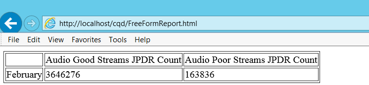

# <a name="cqd-development-samples"></a>Amostras de Desenvolvimento para o CQD

**Resumo:** Revise um tutorial e exemplos de desenvolvimento para Painel de Qualidade de Chamada. O Painel de Qualidade de Chamada é uma ferramenta para Skype for Business Server.

Este artigo fornece um tutorial e exemplos sobre o desenvolvimento do Painel de Qualidade de Chamada (CQD).

## <a name="call-quality-dashboard-cqd-development-samples"></a>Exemplos de desenvolvimento do Painel de Qualidade de Chamada (CQD)

Tutorial: Criação de Apresentação de Relatório Personalizado usando as API do Serviço de Dados do CQD e do Serviço de Repositório.

### <a name="introduction-to-cqd"></a>Introdução ao CQD

O CQD oferece acesso rápido e fácil às informações de qualidade de chamada agregadas para implantações Skype for Business Server locais. O CQD consiste em três componentes: o banco de dados de arquivo morto QoE, o Cubo e o Portal. O Portal é a camada principal de apresentação e pode ser ainda mais dividido nos três componentes a seguir:

1. Serviço de Dados, que é acessível para usuários autenticados por meio da API de Dados para Painel de Qualidade de Chamada [(CQD) no Skype for Business Server](data-api.md).

2. Serviço de Repositório, que é acessível para usuários autenticados por meio da API de Repositório para Painel de Qualidade de Chamada [(CQD) em Skype for Business Server](repository-api.md).

3. Portal da Web, que é a interface baseada em HTML5 com a qual os usuários do CQD veem e interagem. Isso é acessível para usuários autenticados.

Os relatórios mostrados no portal da Web são agrupados em "conjuntos de relatórios". A figura mostra um conjunto de relatórios com dois relatórios. Cada relatório neste painel abaixo mostra os resultados da consulta sobre o número de chamadas boas, chamadas ruins e porcentagem de chamadas ruins por vários meses, com vários filtros aplicados. 


O CQD é criado seguindo a Metodologia de Qualidade de Chamada (CQM), portanto, o conjunto padrão de relatórios foi projetado para se alinhar ao fluxo de investigação introduzido pelo CQM. Os usuários também têm a flexibilidade de editar ou criar relatórios personalizados para atender às suas necessidades. No entanto, como há várias maneiras de visualizar os dados, a visualização fornecida pelo CQD pode não atender totalmente às necessidades de cada usuário. Nessas situações, um usuário pode aproveitar as APIs de Dados e APIs do Repositório para criar páginas de relatório personalizadas. Vamos passar por uma série de exemplos neste tutorial.

### <a name="how-the-dashboard-consumes-the-data-service"></a>Como o painel consome o serviço de dados

Ao navegar até a página inicial do CQD ( http://localhost/cqd)por exemplo, o conjunto de relatórios e os relatórios correspondentes para um usuário autenticado e autorizado serão recuperados do Serviço de Repositório. Uma URL completa será construída a partir da ID do conjunto de relatório e a ID do conjunto de relatório (a ID do conjunto de relatório é o número inteiro após a seção '/#/' na URL e, por padrão, o mês do ano atual é acrescentado no final da ID do conjunto de relatório após a barra). As definições de relatório são armazenadas no formato JSON e, quando recuperadas do Serviço de Repositório, serão usadas como entrada para o Serviço de Dados. O Serviço de Dados gera consultas MDX (expressões de várias dimensões) com base na entrada e, em seguida, execute essas consultas MDX no Cubo para recuperar dados para cada relatório. 

### <a name="building-customized-reports"></a>Criar relatórios personalizados

O CQD já tem muita flexibilidade na personalização de relatórios, mas pode haver situações em que os usuários podem querer agregar dados em vários relatórios criados no CQD. Por exemplo, pode haver uma necessidade de criar um relatório que mostre as porcentagens de chamada ruins de todas as combinações possíveis de chamadas com fio em uma tabela (um resultado como a figura):


Usando o Portal fornecido pelo CQD, um usuário teria que navegar até vários relatórios para extrair e registrar a chamada ruim % para cada um deles, o que pode ser trabalhoso se houver muitos pontos de dados que precisam ser coletados. As APIs de dados fornecem aos usuários uma maneira programática de fazer isso, recuperando dados do Serviço de Dados (por exemplo, por meio de chamadas AJAX). 

 **Exemplo 1: exemplo de relatório simples**

Vejamos primeiro um exemplo simples. Se quisermos mostrar o Fluxo de Áudio Bom e a contagem de fluxos de Áudio Ruim de fevereiro de 2015 em uma página HTML como a figura:



O que precisamos é enviar uma chamada para o Serviço de Dados com os parâmetros adequados e mostrar os resultados da consulta em uma tabela HTML. Veja a seguir um exemplo do código JavaScript:

```javascript        
$($.fn.freeFormReport = function (queries, urlApi, presentation) {
            var query = {
                Dimensions: [{ DataModelName: '[StartDate].[Month]' }],
                Filters: [{
                    DataModelName: '[StartDate].[Month]',
                    Value: '[2015-02-01T00:00:00]',
                    Operand: 0
                }],
                Measurements:
                    [{ DataModelName: '[Measures].[Audio Good Streams JPDR Count]' },
                     { DataModelName: '[Measures].[Audio Poor Streams JPDR Count]' },]
            };            

            $.ajax({
                url: 'http://localhost/QoEDataService/RunQuery',
                data: JSON.stringify(query),
                type: 'POST',
                async: true,
                contentType: 'application/json;charset=utf-8',
                success: function (data) {
                    //This is the jQuery syntax for document.GetElementById()
                    $('#AudioGoodStreamsJPDRCount').html(data.DataResult[0][1]);
                    $('#AudioPoorStreamsJPDRCount').html(data.DataResult[0][2]);
                }
                error: function (error) {
                    alert('Error getting data, check that the data service is running and that the URL is correct.');
           }
            });
        });
```

Este exemplo pode ser ainda mais desconstruído em três etapas:

1. Construa a consulta (no exemplo, isso é definido na variável 'consulta'). A consulta é definida como um objeto JSON, que inclui os seguintes dados:

   a. Zero ou mais dimensões. Cada dimensão é indicada por um DataModelName.

   b. Zero ou mais filtros. Cada filtro tem:

   - DataModelName (a dimensão que terá o conjunto de filtros).

   - Valor (o valor que será comparado pelo operand).

   - Operand (tipo de comparação, 0 significa "Igual").

     c. Uma ou mais medidas.

2. Envie a consulta para o Serviço de Dados por meio de uma chamada do AJAX. Os seguintes parâmetros de solicitação precisam ser fornecidos:

   a. url (que deve ser http://[ServerName]/QoEDataService/RunQuery).

   b. (esta é a representação de cadeia de caracteres do objeto JSON definida na variável 'consulta'). O Serviço de Dados retornará os resultados da consulta como um parâmetro da função de retorno de chamada para sucesso.

   c. tipo (para QoEDataService, RunQuery aceita apenas solicitações 'POST').

   d. assíncrono (um sinalizador que indica se a chamada do AJAX deve ser síncrona ou assíncrona).

   e. contentType (deve ser "application/json").

   f. success (função de retorno de chamada para quando a chamada do AJAX terminar com êxito).

   g. error (error handling function for when AJAX call fails).

3. Coloque dados em elementos div no HTML (no exemplo no código, isso é feito por meio da chamada de função anônima depois que a solicitação do AJAX for concluída com êxito).

Colocar o código JavaScript em uma página HTML e a página mostrará um relatório como o mostrado na figura. O html completo é o seguinte:

```javascript
<!DOCTYPE html>
<html xmlns="http://www.w3.org/1999/xhtml">
<head>
</head>
<body>
    <script src="OpenSourceSoftware/Scripts/jquery-2.1.1.js"></script>

    <script>
        $($.fn.freeFormReport = function (queries, urlApi, presentation) {

            var query = {
                Dimensions: [{ DataModelName: '[StartDate].[Month]' }],
                Filters: [{
                    DataModelName: '[StartDate].[Month]',
                    Value: '[2015-02-01T00:00:00]',
                    Operand: 0
                }],
                Measurements:
                    [{ DataModelName: '[Measures].[Audio Good Streams JPDR Count]' },
                     { DataModelName: '[Measures].[Audio Poor Streams JPDR Count]' },]
            };            

            $.ajax({
                url: 'http://localhost/QoEDataService/RunQuery',
                data: JSON.stringify(query),
                type: 'POST',
                async: true,
                contentType: 'application/json;charset=utf-8',
                success: function (data) {
                    //This is the jQuery syntax for document.GetElementById()
                    $('#AudioGoodStreamsJPDRCount').html(data.DataResult[0][1]);
                    $('#AudioPoorStreamsJPDRCount').html(data.DataResult[0][2]);
                }
                error: function (error) {
                    alert('Error getting data, check that the data service is running and that the URL is correct.');
           }

            });
        });
    </script>
    <table border="1">
        <tr>
            <td></td>
            <td><div>Audio Good Streams JPDR Count</div></td>
            <td><div>Audio Poor Streams JPDR Count</div></td>
        </tr>
        <tr>
            <td>February</td>
            <td><div id="AudioGoodStreamsJPDRCount"></div></td>
            <td><div id="AudioPoorStreamsJPDRCount"></div></td>
        </tr>
    </table>
</body>
</html>
```

Até agora, o relatório ainda é muito simples. O usuário pode adicionar mais medidas, dimensões ou filtros para personalizar o relatório. Por exemplo, se você quiser mostrar a porcentagem de chamada ruim appSharing, uma nova medida em relação ao AppSharing precisa ser adicionada. Se você quiser mostrar todas as chamadas TCP v.s. Chamadas UDP, uma nova dimensão sobre o tipo de transporte deve ser adicionada. Se você quiser mostrar o número de chamadas ruins em um edifício específico, um novo filtro deve ser adicionado para selecionar as chamadas de e para esse edifício.

 **Exemplo 2: Exemplo de definição de relatório**

Pode ser difícil para alguém descobrir como escrever a lista completa de medidas/dimensões/filtros e seus valores correspondentes ao construir uma consulta. Nesse caso, você pode ir para o Portal, criar um relatório usando o editor de relatório e exibir a cadeia de caracteres JSON da definição do relatório e, em seguida, copiar a definição em um relatório personalizado. 

Neste exemplo, criaremos uma página da Web como a mostrada na figura em que um usuário pode inserir a ID de qualquer conjunto de relatório existente (ou relatório) e mostrar a definição do conjunto de relatório ou relatório na página da Web. Em seguida, o usuário pode conectar a cadeia de caracteres JSON de cada relatório em um código semelhante ao mostrado no Exemplo 1 e construir qualquer relatório personalizado que o usuário desejar. 


Para criar a ferramenta visualizador de definição de relatório, precisamos enviar chamadas para o Serviço de Repositório para recuperar as representações de cadeia de caracteres JSON das definições de cada conjunto de relatório que quisermos. A API do Repositório retornará a definição de conjunto de relatório com base em uma determinada ID do conjunto de relatório. 

Um exemplo rápido é o seguinte: o código contém um bloco que é um exemplo simples para enviar uma consulta ao serviço Repositório para obter o conteúdo de um item de repositório com base em seu identificador. E a próxima parte do código (método processReportSetData) é enviar chamadas AJAX para obter a definição de cada relatório dentro desse conjunto de relatório. Como a ID no portal da Web do CQD é a ID de um conjunto de relatório, a chamada do AJAX retornará um item de conjunto de relatório. Mais detalhes sobre a API do Repositório e, especificamente, GetItems, podem ser encontrados no [Get Items](get-items.md). 

```html
<!DOCTYPE html>
<html lang="en">
<head>
    <meta charset="utf-8" />
    <meta http-equiv='cache-control' content='no-cache'>
    <meta http-equiv='expires' content='0'>
    <meta http-equiv='pragma' content='no-cache'>
    <meta http-equiv="X-UA-Compatible" content="IE=edge">
    <meta http-equiv="x-content-type-options" content="nosniff">
    <title>CQD Report definition viewer</title>
</head>
<body>    
    <div style="font-size:32pt">CQD Report definition viewer</div>
        <p>ReportSet Id: <input id="reportSetId" /></p>
        <button onclick='loadReportSet()'>Load</button>
        <div id="Report"></div>
    <!-- Third party Libraries -->
    <script src="OpenSourceSoftware/Scripts/jquery-2.1.1.js"></script>

    <script>
        var urlRepositoryApi = 'http://localhost/QoERepositoryService/repository/item/';

        var loadReportSet = function ()
        {
            var reportSetId = document.getElementById('reportSetId').value;

            $.ajax({
                url: urlRepositoryApi + reportSetId,
                data: '',
                type: 'GET',
                async: false,
                contentType: 'application/json;charset=utf-8',
                success: function (data) {
                    var reportSetDiv = document.getElementById('Report');
                    reportSetDiv.innerHTML = '';
                    processReportSetData(reportSetDiv, data);
                },
                error: function (error) {
                    alert('Error getting Report, check that the qoe data service is running and url is correct.');
                }
            });
        };

        var processReportSetData = function (divReportSet, reportSetDef) {
             //show the report set definition like Title, Description, etc
            showReportSetDefinition(divReportSet, reportSetDef);

            //for each Report in the Reportset, get the Report definition from the Repository Service
            for (var i = 0; i < reportSetDef.subItemIds.length; i++)
            {
                //the reportId is in the subItemIds array.  This is not shown in the CQD UI at all
                var reportId = reportSetDef.subItemIds[i];

                var divReport = document.createElement('div');
                divReport.style.margin = '12px';                
                divReportSet.appendChild(divReport);

                //retrieve the report definition with the reportId
                $.ajax({
                    url: urlRepositoryApi + reportId,
                    data: '',
                    type: 'GET',
                    async: false,
                    contentType: 'application/json;charset=utf-8',
                    success: function (reportData) {
                        processReportData(divReport, reportData, reportId);
                    },
                    error: function (error) {
                        alert('Error getting Report ' + reportId.toString() + ', check that the qoe data service is running and url is correct.');
                    }
                });
            }
        };

        //helper function to render the ReportSet definition
        var showReportSetDefinition = function (divReportSet, reportSetDef) {
            var div = document.createElement('div');
            ReportSetDefinition = reportSetDef.content;
            txt = document.createTextNode(ReportSetDefinition);
            div.style.margin = '12px';
            div.appendChild(txt);
            divReportSet.appendChild(div);
        };

        //show the report definition
        var processReportData = function (divReport, reportData, itemId) {
            if (divReport != undefined &amp;&amp; reportData.content != undefined) {
                var Report = JSON.parse(reportData.content);

                var divReportId = document.createElement('div');
                var subItemId = reportData.subItemIds.length > 0 ? reportData.subItemIds[0].toString() : 'none';
                divReportId.innerHTML = 'ItemId: ' + itemId.toString() + ' (' + Report.Title + ') [subItemId:' + subItemId + ']';
                divReport.appendChild(divReportId);

                var divReportDef = document.createElement('div');
                txt = document.createTextNode(JSON.stringify(Report));
                divReportDef.style.margin = '12px';
                divReportDef.appendChild(txt);                            
                divReport.appendChild(divReportDef);
            }
        };
    </script>
</body>
</html>
```

O acima resultará em uma página da Web como a da figura (sem a definição do relatório após a visita inicial). Obter a ID do conjunto de relatório do portal do CQD (é depois de '/#/' entrar na URL do portal do CQD (por exemplo. na primeira figura, a ID do conjunto de relatório é 3024) e coloque essa ID de conjunto de relatório na seção de entrada desta página da Web. Pressione o botão "carregar" e veja a definição completa (medidas, dimensões, listas de filtros) do conjunto de relatório.

Em resumo, para obter rapidamente a definição completa de um conjunto de relatório/relatório. As etapas são:

1. Vá para o Portal e use o editor de consulta para personalizar um relatório (clique no botão "Editar" acima de um relatório para editar, adicionar, remover medidas/dimensões/filtros e salvar o relatório).

2. Obter a ID do conjunto de relatório da URL (o inteiro após '/#/' entrar na URL).

3. Iniciar esta página da Web de Definição de Relatório criada no Exemplo 2 e inserir a ID do conjunto de relatório e recuperar a definição completa de um conjunto de relatório (a ser usado em chamadas de API de dados).

   **Exemplo 3: exemplo de scorecard**

Hora de uma tarefa mais complicada. E se quisermos criar uma página da Web como a figura? Precisamos atualizar o Exemplo 1 (com a ajuda da página da Web gerada no Exemplo 2 para recuperar a definição completa de qualquer relatório) para que possamos lidar com uma quantidade maior de dados.

Nesse caso, precisamos atualizar a lista de medidas e dimensões. A maneira de descobrir como adicionar/editar uma medida e/ou uma dimensão é seguir as instruções no Exemplo 2 e recuperar a definição completa do relatório, incluindo as listas de medidas e dimensões completas. Conecte a definição completa do relatório ao código de exemplo. 

Aqui estão as etapas detalhadas para chegar à página do scorecard na figura da amostra fornecida no Exemplo 1:

1. Atualizar medições na variável 'consulta' de  `[Measures].[Audio Good Streams JPDR Count]` e `[Measures].[Audio Poor Streams JPDR Count]` para `[Measures].[AudioPoorJPDRPercentage]`. 

2. Atualize os filtros. Os dados JSON para Filtros no Exemplo 1 têm um filtro, que é definido na dimensão  `[StartDate].[Month]`. Como Filters é uma matriz JSON, dimensões adicionais podem ser adicionadas à lista de filtros. Por exemplo, para obter o servidor-cliente dentro de chamadas com fio para o "currentMonth", devemos ter os seguintes filtros:

   ```javascript
   Filters: [
     { DataModelName: '[StartDate].[Month]', Value: currentMonth, Operand: 0 },
    {
        "DataModelName": "[Scenarios].[ScenarioPair]",
         "Caption": " Server-Inside-wired,Client-Inside-wired",
         "Value": "[1]&amp;[0]&amp;[1]&amp;[1]&amp;[Wired]&amp;[Wired]",
         "Operand": 0,
         "UnionGroup": ""
     },

     { DataModelName: '[StreamType].[StreamType]', Caption: "Valid", Value: "[False]", Operand: 0, UnionGroup: "" }
   ],
   ```

   Aqui, a dimensão  `[Scenarios].[ScenarioPair]` é definida como igual `[1]&amp;[0]&amp;[1]&amp;[1]&amp;[Wired]&amp;[Wired]`a . A  `[Scenario.][ScenarioPair]` é uma dimensão especial criada para simplificar a criação de relatório. Ele tem seis valores correspondentes a `[FirstIsServer], [SecondIsServer], [FirstInside], [SecondIsServer], [FirstConnectionType], [SecondConnectionType]`. Portanto, em vez de usar uma combinação de 6 filtros para definir um cenário, precisamos usar apenas 1 filtro. Em nosso exemplo,  `[1]&amp;[0]&amp;[1]&amp;[1]&amp;[Wired]&amp;[Wired]` o valor se converte no cenário em que: primeiro é servidor, segundo não é servidor, primeiro está dentro, segundo está dentro, primeiro tipo de conexão é com fio e segundo tipo de conexão é com fio, que é a definição exata de "Server-Client-Inside Wired".

3. Crie um conjunto de filtros por cenário. Cada linha no scorecard, na figura, representa um cenário diferente, que será um filtro diferente (enquanto as dimensões e as medidas permanecem as mesmas). 

4. Analisar os resultados das chamadas do AJAX e posicioná-los na posição correta da tabela. Como isso é principalmente manipulação HTML e JavaScript, não entraremos nos detalhes aqui. Em vez disso, o código é fornecido no Apêndice A.

    > [!NOTE]
    >  Se o Compartilhamento de Recursos entre Origens (CORS) estiver habilitado, os usuários poderão encontrar erros como "Nenhum header "Access-Control-Allow-Origin" está presente no recurso solicitado. Portanto, a origem 'null' não tem permissão de acesso". Para resolver o problema, coloque o arquivo HTML na pasta onde o Portal está instalado (por padrão, ele deve ser `%SystemDrive%\Program Files\Skype for Business 2015 CQD\CQD)`. Em seguida, acesse o html por meio de qualquer navegador com a URL  `http://<servername>/cqd/<html_file_name>`. (A URL padrão do painel CQD local é  `http://<servername>/cqd.`) 

### <a name="appendix-a"></a>Apêndice A

Código HTML do Exemplo 3 (exemplo de scorecard):

```html
<!DOCTYPE html>
<html xmlns="http://www.w3.org/1999/xhtml">
<head>
    <meta charset="utf-8" />
    <meta http-equiv='cache-control' content='no-cache'>
    <meta http-equiv='expires' content='0'>
    <meta http-equiv='pragma' content='no-cache'>
    <meta http-equiv="X-UA-Compatible" content="IE=edge">
    <title>Scoreboard Sample</title>

    <style>
        .row {
            margin-right: -15px;
            margin-left: -15px;
            display: table-row;
        }
        .col-md-3 {
            width: 25%;
            display: table-cell;
        }
        .col-md-2 {
            width: 16.66666667%;
            display: table-cell;
        }
        .col-md-1 {
            width: 8.33333333%;
            display: table-cell;
        }

    </style>
</head>
<body>    

    <!-- Third party Libraries -->
    <script src="OpenSourceSoftware/Scripts/jquery-2.1.1.js"></script>

    <table id="ScoreCardTable" style="margin:100px">
        <tr>
            <td width="250px" style="text-align: center; font-size: 24px; font-family: 'Segoe UI'; font-weight: lighter; color: white; background-color: #505050">
                <div style="margin:10px">Scoreboard Sample</div>
            </td>
            <td width="1200px">
                <div style="margin:10px;background-color:#D9D9D9" >
                    <div class="row" id="Header" style="font-size:24px;font-family:'Segoe UI';font-weight:lighter;color:white;background-color:#505050">
                        <div class="col-md-3">Poor Call %</div>
                        <div class="col-md-1">Month1</div>
                        <div class="col-md-1">Month2</div>
                        <div class="col-md-1">Month3</div>
                        <div class="col-md-1">Month4</div>
                        <div class="col-md-1">Month5</div>
                        <div class="col-md-1">Month6</div>
                    </div>                    
                    <div class="row"><div class="col-md-3" style="font-weight:bold">Wired</div></div>
                    <div class="row" id="SS"><div class="col-md-3">Server-Server</div><div class="col-md-1"></div><div class="col-md-1"></div><div class="col-md-1"></div><div class="col-md-1"></div><div class="col-md-1"></div><div class="col-md-1"></div></div>
                    <div class="row" id="SWI"><div class="col-md-3">Server-Client (inside)</div><div class="col-md-1"></div><div class="col-md-1"></div><div class="col-md-1"></div><div class="col-md-1"></div><div class="col-md-1"></div><div class="col-md-1"></div></div>
                    <div class="row" id="SWO"><div class="col-md-3">Server-Client (outside)</div><div class="col-md-1"></div><div class="col-md-1"></div><div class="col-md-1"></div><div class="col-md-1"></div><div class="col-md-1"></div><div class="col-md-1"></div></div>
                    <div class="row" id="WWI"><div class="col-md-3">Client-Client (inside)</div><div class="col-md-1"></div><div class="col-md-1"></div><div class="col-md-1"></div><div class="col-md-1"></div><div class="col-md-1"></div><div class="col-md-1"></div></div>
                    <div class="row" id="WIWO"><div class="col-md-3">Client-Client (outside)</div><div class="col-md-1"></div><div class="col-md-1"></div><div class="col-md-1"></div><div class="col-md-1"></div><div class="col-md-1"></div><div class="col-md-1"></div></div>
                    <div class="row"><div class="col-md-3" style="font-weight:bold">Wireless</div></div>
                    <div class="row" id="SWFI"><div class="col-md-3">Server-Client (inside)</div><div class="col-md-1"></div><div class="col-md-1"></div><div class="col-md-1"></div><div class="col-md-1"></div><div class="col-md-1"></div><div class="col-md-1"></div></div>
                    <div class="row" id="SWFO"><div class="col-md-3">Server-Client (outside)</div><div class="col-md-1"></div><div class="col-md-1"></div><div class="col-md-1"></div><div class="col-md-1"></div><div class="col-md-1"></div><div class="col-md-1"></div></div>
                    <div class="row" id="WFIWFI"><div class="col-md-3">Client-Client (inside)</div><div class="col-md-1"></div><div class="col-md-1"></div><div class="col-md-1"></div><div class="col-md-1"></div><div class="col-md-1"></div><div class="col-md-1"></div></div>
                    <div class="row" id="WFOWFO"><div class="col-md-3">Client-Client (outside)</div><div class="col-md-1"></div><div class="col-md-1"></div><div class="col-md-1"></div><div class="col-md-1"></div><div class="col-md-1"></div><div class="col-md-1"></div></div>
                    <div class="row"><div class="col-md-3" style="font-weight:bold">Mobile/Broadband</div></div>
                    <div class="row" id="SMP"><div class="col-md-3">Server-MobilePhone</div><div class="col-md-1"></div><div class="col-md-1"></div><div class="col-md-1"></div><div class="col-md-1"></div><div class="col-md-1"></div><div class="col-md-1"></div></div>
                    <div class="row" id="SMBB"><div class="col-md-3">Server-MobileBroadBand</div><div class="col-md-1"></div><div class="col-md-1"></div><div class="col-md-1"></div><div class="col-md-1"></div><div class="col-md-1"></div><div class="col-md-1"></div></div>
                    <div class="row"><div class="col-md-3" style="font-weight:bold">Lync Web App</div></div>
                    <div class="row" id="SLWA"><div class="col-md-3">Server-Client (inside &amp; outside)</div><div class="col-md-1"></div><div class="col-md-1"></div><div class="col-md-1"></div><div class="col-md-1"></div><div class="col-md-1"></div><div class="col-md-1"></div></div>
                </div>
            </td>
        </tr>
        <tr>
            <td><br /></td>
        </tr>
    </table>

    <script>

        $(function () {
            var month_names_short = ['NAM', 'Jan', 'Feb', 'Mar', 'Apr', 'May', 'Jun', 'Jul', 'Aug', 'Sep', 'Oct', 'Nov', 'Dec'];
            var currentMonth = '2015-3';

            //update the header with the month names
            var row = document.getElementById('Header');
            var numMonthsToShow = 6;
            for (var m = numMonthsToShow-1; m >= 0; m--) {
                var dateSplit = currentMonth.split('-');
                var monthInt = parseInt(dateSplit[1]);
                var yearInt = parseInt(dateSplit[0]);
                monthInt = monthInt - m;
                if (monthInt < 1)
                {
                    monthInt += 12;
                    yearInt--;
                }
                row.children[numMonthsToShow-m].innerHTML = month_names_short[monthInt];
            }

            var queries = [
            {
                Label: "Server-Server",
                ID: "SS",
                Query:
                {
                  Dimensions: [{ DataModelName: '[StartDate].[Month]'}],
                  Filters: [
                      {
                          "DataModelName": "[Scenarios].[ScenarioPair]",
                          "Caption": " Server-Inside-wired,Server-Inside-wired",
                          "Value": "[1]&amp;[1]&amp;[1]&amp;[1]&amp;[Wired]&amp;[Wired]",
                          "Operand": 0,
                          "UnionGroup": ""
                      },
                      { DataModelName: '[StartDate].[Month]', Value: currentMonth, Operand: 0 },
                      { DataModelName: '[StreamType].[StreamType]', Caption: "Valid", Value: "[False]", Operand: 0, UnionGroup: ""}
                  ],
                  Measurements: [{ DataModelName: '[Measures].[AudioPoorJPDRPercentage]'}],
                  Trend: { EnableTrend: true, SpanCount: numMonthsToShow, TrendDate: currentMonth, Type: 0 }
                 }
            },
            {
                Label: "Server-Client (inside)",
                ID: "SWI",
                Query:
                {
                  Dimensions: [{ DataModelName: '[StartDate].[Month]' }],
                  Filters: [
                      {
                          "DataModelName": "[Scenarios].[ScenarioPair]",
                          "Caption": " Server-Inside-wired,Client-Inside-wired",
                          "Value": "[1]&amp;[0]&amp;[1]&amp;[1]&amp;[Wired]&amp;[Wired]",
                          "Operand": 0,
                          "UnionGroup": ""
                      },
                      { DataModelName: '[StartDate].[Month]', Value: currentMonth, Operand: 0 },
                      { DataModelName: '[StreamType].[StreamType]', Caption: "Valid", Value: "[False]", Operand: 0, UnionGroup: "" }
                  ],
                  Measurements: [{ DataModelName: '[Measures].[AudioPoorJPDRPercentage]' }],
                  Trend: { EnableTrend: true, SpanCount: numMonthsToShow, TrendDate: currentMonth, Type: 0 }
                }
            },
            {
                Label: "Server-Client (outside)",
                ID: "SWO",
                Query:
                {
                  Dimensions: [{ DataModelName: '[StartDate].[Month]' }],
                  Filters: [
                      {
                          "DataModelName": "[Scenarios].[ScenarioPair]",
                          "Caption": " Server-Inside-wired,Client-Outside-wired",
                          "Value": "[1]&amp;[0]&amp;[1]&amp;[0]&amp;[Wired]&amp;[Wired]",
                          "Operand": 0,
                          "UnionGroup": ""
                      },
                      { DataModelName: '[StartDate].[Month]', Value: currentMonth, Operand: 0 },
                      { DataModelName: '[StreamType].[StreamType]', Caption: "Valid", Value: "[False]", Operand: 0, UnionGroup: "" }
                  ],
                  Measurements: [{ DataModelName: '[Measures].[AudioPoorJPDRPercentage]' }],
                  Trend: { EnableTrend: true, SpanCount: numMonthsToShow, TrendDate: currentMonth, Type: 0 }
                 }
            },
            {
                Label: "Client-Client (inside)",
                ID: "WWI",
                Query:
                {
                    Dimensions: [{ DataModelName: '[StartDate].[Month]' }],
                    Filters: [
                        {
                            "DataModelName": "[Scenarios].[ScenarioPair]",
                            "Caption": " Client-Inside-wired,Client-Inside-wired",
                            "Value": "[0]&amp;[0]&amp;[1]&amp;[1]&amp;[Wired]&amp;[Wired]",
                            "Operand": 0,
                            "UnionGroup": ""
                        },
                        { DataModelName: '[StartDate].[Month]', Value: currentMonth, Operand: 0 },
                        { DataModelName: '[StreamType].[StreamType]', Caption: "Valid", Value: "[False]", Operand: 0, UnionGroup: "" }
                    ],
                    Measurements: [{ DataModelName: '[Measures].[AudioPoorJPDRPercentage]' }],
                    Trend: { EnableTrend: true, SpanCount: numMonthsToShow, TrendDate: currentMonth, Type: 0 }
                }
            }
            ,
            {
                Label: "Client-Client (outside)",
                ID: "WIWO",
                Query:
                {
                    Dimensions: [{ DataModelName: '[StartDate].[Month]' }],
                    Filters: [
                        {
                          "DataModelName": "[Scenarios].[ScenarioPair]",
                          "Caption": "Client-Outside-Wired,Client-Outside-Wired",
                          "Value": "[0]&amp;[0]&amp;[0]&amp;[0]&amp;[Wired]&amp;[Wired]",
                          "Operand": 0,
                          "UnionGroup": ""
                        },
                        { DataModelName: '[StartDate].[Month]', Value: currentMonth, Operand: 0 },
                        { DataModelName: '[StreamType].[StreamType]', Caption: "Valid", Value: "[False]", Operand: 0, UnionGroup: "" }
                    ],
                    Measurements: [{ DataModelName: '[Measures].[AudioPoorJPDRPercentage]' }],
                    Trend: { EnableTrend: true, SpanCount: numMonthsToShow, TrendDate: currentMonth, Type: 0 }
                }
            },
            {
                Label: "Server-Client (inside)",
                ID: "SWFI",
                Query:
                {
                    Dimensions: [{ DataModelName: '[StartDate].[Month]' }],
                    Filters: [
                        {
                            "DataModelName": "[Scenarios].[ScenarioPair]",
                            "Caption": " Server-Inside-wired,Client-Inside-wifi",
                            "Value": "[1]&amp;[0]&amp;[1]&amp;[1]&amp;[Wired]&amp;[Wifi]",
                            "Operand": 0,
                            "UnionGroup": ""
                        },
                        { DataModelName: '[StartDate].[Month]', Value: currentMonth, Operand: 0 },
                        { DataModelName: '[StreamType].[StreamType]', Caption: "Valid", Value: "[False]", Operand: 0, UnionGroup: "" }
                    ],
                    Measurements: [{ DataModelName: '[Measures].[AudioPoorJPDRPercentage]' }],
                    Trend: { EnableTrend: true, SpanCount: numMonthsToShow, TrendDate: currentMonth, Type: 0 }
                }
            },
            {
                Label: "Server-Client (outside)",
                ID: "SWFO",
                Query:
                {
                    Dimensions: [{ DataModelName: '[StartDate].[Month]' }],
                    Filters: [
                         {
                             "DataModelName": "[Scenarios].[ScenarioPair]",
                             "Caption": " Server-Inside-wired,Client-Outside-wifi",
                             "Value": "[1]&amp;[0]&amp;[1]&amp;[0]&amp;[Wired]&amp;[Wifi]",
                             "Operand": 0,
                             "UnionGroup": ""
                         },
                        { DataModelName: '[StartDate].[Month]', Value: currentMonth, Operand: 0 },
                        { DataModelName: '[StreamType].[StreamType]', Caption: "Valid", Value: "[False]", Operand: 0, UnionGroup: "" }
                    ],
                    Measurements: [{ DataModelName: '[Measures].[AudioPoorJPDRPercentage]' }],
                    Trend: { EnableTrend: true, SpanCount: numMonthsToShow, TrendDate: currentMonth, Type: 0 }
                }
            },
            {
                Label: "Client-Client (inside)",
                ID: "WFIWFI",
                Query:
                {
                    Dimensions: [{ DataModelName: '[StartDate].[Month]' }],
                    Filters: [
                        {
                            "DataModelName": "[Scenarios].[ScenarioPair]",
                            "Caption": " Client-Inside-Wifi,Client-Inside-Wifi",
                            "Value": "[0]&amp;[0]&amp;[1]&amp;[1]&amp;[Wifi]&amp;[Wifi]",
                            "Operand": 0,
                            "UnionGroup": ""
                        },
                        { DataModelName: '[StartDate].[Month]', Value: currentMonth, Operand: 0 },
                        { DataModelName: '[StreamType].[StreamType]', Caption: "Valid", Value: "[False]", Operand: 0, UnionGroup: "" }
                    ],
                    Measurements: [{ DataModelName: '[Measures].[AudioPoorJPDRPercentage]' }],
                    Trend: { EnableTrend: true, SpanCount: numMonthsToShow, TrendDate: currentMonth, Type: 0 }
                }
            },
            {
                Label: "Client-Client (outside)",
                ID: "WFOWFO",
                Query:
                {
                    Dimensions: [{ DataModelName: '[StartDate].[Month]' }],
                    Filters: [
                        {
                          "DataModelName": "[Scenarios].[ScenarioPair]",
                          "Caption": "Client-Outside-Wifi,Client-Outside-Wifi",
                          "Value": "[0]&amp;[0]&amp;[0]&amp;[0]&amp;[Wifi]&amp;[Wifi]",
                          "Operand": 0,
                          "UnionGroup": ""
                        },
                        { DataModelName: '[StartDate].[Month]', Value: currentMonth, Operand: 0 },
                        { DataModelName: '[StreamType].[StreamType]', Caption: "Valid", Value: "[False]", Operand: 0, UnionGroup: "" }
                    ],
                    Measurements: [{ DataModelName: '[Measures].[AudioPoorJPDRPercentage]' }],
                    Trend: { EnableTrend: true, SpanCount: numMonthsToShow, TrendDate: currentMonth, Type: 0 }
                }
            },
            {
                Label: "Server-MobilePhone",
                ID: "SMP",
                Query:
                {
                    Dimensions: [{ DataModelName: '[StartDate].[Month]' }],
                    Filters: [
                        {"DataModelName": "[First Is Server].[Agent]","Caption": "Server","Value": "[1]","Operand": 0,"UnionGroup": ""},
                        {"DataModelName": "[Second User Agent].[User Agent Type]","Caption": "AndroidLync | iPhoneLync | WPLync","Value": "[AndroidLync],[iPhoneLync],[WPLync]","Operand": 0,"UnionGroup": ""},
                        { DataModelName: '[StartDate].[Month]', Value: currentMonth, Operand: 0 },
                    ],
                    Measurements: [{ DataModelName: '[Measures].[AudioPoorJPDRPercentage]' }],
                    Trend: { EnableTrend: true, SpanCount: numMonthsToShow, TrendDate: currentMonth, Type: 0 }
                }
            },
            {
                Label: "Server-MobileBroadBand",
                ID: "SMBB",
                Query:
                {
                    Dimensions: [{ DataModelName: '[StartDate].[Month]' }],
                    Filters: [
                        {"DataModelName": "[Second Network Connection Type].[Network Connection Detail]","Caption": "MobileBB","Value": "[MobileBB]","Operand": 0,"UnionGroup": ""},
                        {"DataModelName": "[First Is Server].[Agent]","Caption": "Server","Value": "[1]","Operand": 0,"UnionGroup": ""},
                        {"DataModelName": "[Second Is Server].[Agent]","Caption": "Client ","Value": "[0]","Operand": 0,"UnionGroup": ""},
                        { DataModelName: '[StartDate].[Month]', Value: currentMonth, Operand: 0 }                       
                    ],
                    Measurements: [{ DataModelName: '[Measures].[AudioPoorJPDRPercentage]' }],
                    Trend: { EnableTrend: true, SpanCount: numMonthsToShow, TrendDate: currentMonth, Type: 0 }
                }
            },
            {
                Label: "Server-LWA",
                ID: "SLWA",
                Query:
                {
                    Dimensions: [{ DataModelName: '[StartDate].[Month]' }],
                    Filters: [
                        {"DataModelName": "[First Is Server].[Agent]","Caption": "Server","Value": "[1]","Operand": 0,"UnionGroup": ""},
                        {"DataModelName": "[Second User Agent].[User Agent Type]","Caption": "LWA","Value": "[LWA]","Operand": 0,"UnionGroup": ""},
                        { DataModelName: '[StartDate].[Month]', Value: currentMonth, Operand: 0 }                       
                    ],
                    Measurements: [{ DataModelName: '[Measures].[AudioPoorJPDRPercentage]' }],
                    Trend: { EnableTrend: true, SpanCount: numMonthsToShow, TrendDate: currentMonth, Type: 0 }
                }
            }

            ];

            //get the overall corpnet data
            for (var i = 0; i < queries.length; i++) {
                $.ajax({

                    url: 'http://localhost/QoEDataService/RunQuery',
                    data: JSON.stringify(queries[i].Query),
                    type: 'POST',
                    async: false,
                    withCredentials: true,
                    contentType: 'application/json;charset=utf-8',
                    success: function (data) {

                        //find the table row corresponding to the name of this query
                        var row = document.getElementById(queries[i].ID);

                        //update the values for each month
                        for (var m = 0; m < data.DataResult.length; m++)
                        {
                            row.children[m + 1].innerHTML = data.DataResult[m][1].toFixed(2).toString();
                        }

                    },
                    error: function (error) {
                        var row = document.getElementById(queries[i].ID);
                        row.children[1].innerHTML = 'error';
                    }
                });
            }
        });
    </script>
</body>
</html>
```
