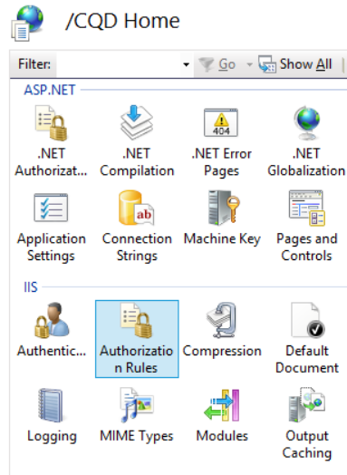

# <a name="deploy-call-quality-dashboard-for-skype-for-business-server"></a>Implantar o Painel de Qualidade de Chamada para Skype for Business Server
 
**Resumo:** Saiba mais sobre o processo de implantação do Painel de Qualidade de Chamada. O Painel de Qualidade de Chamada é uma ferramenta para Skype for Business Server.
  
## <a name="deployment-overview"></a>Visão geral da implantação

O Painel de Qualidade de Chamada (CQD) consiste em três componentes principais:
  
- **Banco de Dados** de Arquivo Morto, onde os dados de QoE (Qualidade da Experiência) são replicados e armazenados.
    
- **Cubo**, onde os dados do banco de dados de Arquivo morto de QoE são agregados para acesso otimizado e rápido.
    
- **Portal**, onde os usuários podem consultar facilmente e visualizar dados QoE.
    

  
O processo de instalação do Arquivo de QoE envolve a criação do banco de dados de Arquivo morto de QoE, a implantação de um procedimento armazenado SQL Server que move os dados do banco de dados de Métricas QoE de origem para o banco de dados de Arquivo morto de QoE e a configuração do trabalho do agente SQL Server para executar o procedimento armazenado em um intervalo regular. 
  
A implantação de cubo obtém informações do usuário sobre onde o Arquivo morto de QoE está localizado, implanta o cubo e configura um trabalho de agente SQL Server regular que atualizará o cubo em um intervalo regular.
  
A instalação do portal cria um banco de dados repositório que armazena o mapeamento de usuários do CQD para os relatórios/consultas de cada usuário. Em seguida, ele configura um aplicativo Web do IIS que é o painel onde os usuários podem ver um conjunto pré-definido de relatórios, bem como personalizar e criar suas próprias consultas para visualizar dados do cubo. A instalação do portal cria dois aplicativos Web adicionais que expõem APIs para que os usuários acessem programaticamente o repositório e o cubo. (Essas APIs também são usadas internamente pelo painel.)
  

|**Fase**|**Etapas**|**Funções e associação de grupo**|**Documentação**|
|:-----|:-----|:-----|:-----|
|Instalar hardware e software de pré-requisitos.  <br/> |Decida a configuração do CQD e escolha um SQL Server de onde executar a instalação.  <br/> |Usuário do domínio que é membro do grupo local de administradores.  <br/> |Seção "Requisitos de pré-instalação" na documentação de implantação.  <br/> |
|Instale o CQD.  <br/> |Execute o MSI após o documento de implantação.  <br/> |Para executar a instalação, a conta de instalação deve ser um usuário de domínio membro do grupo de administradores locais e ter acesso de leitura ao banco de dados Métricas de QoE no Servidor de Monitoramento.  <br/> |Seções "Contas e Etapas de Implantação" na documentação de implantação.  <br/> |
|Conceder acesso ao usuário.  <br/> |Para gerenciar a autorização do usuário para o Portal, recomendamos usar a Autorização de URL, que foi introduzida no IIS 7.0. Para obter mais informações, consulte [Understanding IIS 7.0 URL Authorization](https://www.iis.net/learn/manage/configuring-security/understanding-iis-url-authorization).  <br/> |Usuário do domínio que é membro do grupo local de administradores.  <br/> |Gerenciando o Acesso do Usuário para a seção Portal na documentação de implantação.  <br/> |
|Opcional: forneça informações de mapeamento de sub-rede.  <br/> |Popular a rede e a criação de tabelas de mapeamento no banco de dados de arquivo morto de QoE.  <br/> |Uma conta com acesso de gravação ao banco de dados de Arquivo morto de QoE.  <br/> |Seção "Fornecendo Informações de Sub-rede" na documentação do usuário.  <br/> |
   


A implantação do Painel de Qualidade de Chamada envolve a configuração da infraestrutura e a instalação do software. O procedimento a seguir descreve o processo.
  
## <a name="deployment-steps"></a>Etapas de implantação

1. Copie o CallQualityDashboard.msi para o computador onde o componente de banco de dados de arquivo morto do CQD deve ser instalado (este é o computador que SQL Server instalado). 
    
2. Execute o MSI (Windows solicitará que seja executado com o privilégio de administrador, faça isso). 
    
3. Aceite a EULA.
    
4. Selecione a pasta de destino onde os arquivos relacionados aos componentes do Painel de Qualidade de Chamada estarão localizados ou aceite o local padrão.
    
5. Selecione todos os recursos.
    
6. Na página Configuração de Arquivo Morto de QoE, forneça as seguintes informações:
    
   - **Métricas de QoE SQL Server: SQL Server** nome da instância para onde o BANCO de Métricas de QoE está localizado (essa será a fonte de dados).
    
   - **Nome do arquivo SQL Server QoE:** este é um campo somente leitura e corrigido para o nome de domínio totalmente qualificado da máquina local. O DB de arquivo morto só pode ser instalado no computador local.
    
   - **Instância de arquivo SQL Server QoE: um** nome de instância SQL Server local para onde o BANCO de Arquivos Morto deve ser criado. Para usar uma instância SQL Server padrão, deixe este campo em branco. Para usar uma instância SQL Server nome, especifique o nome da instância (por exemplo, o nome após "\").
    
   - **Banco de dados de arquivo morto de QoE:** Por padrão, essa opção é definida como "Criar novo banco de dados". Como a atualização do Archive DB não é suportada, a única circunstância na qual a opção "Usar banco de dados existente" pode ser usada é se o banco de dados Archive existente tiver o mesmo esquema que a com build a ser instalada.
    
   - **Diretório de Arquivos de Banco de Dados:** Caminho para onde os arquivos de banco de dados (.mdf e .ldf) para o ARQUIVO MORTO DB devem ser colocados. Isso deve estar em uma unidade (HDD2 na configuração de hardware recomendada) separada do sistema operacional. Observe que, como os nomes de arquivo são fixos na instalação, para evitar possíveis conflitos, é recomendável que um diretório em branco sem arquivos seja usado.
    
   - **Use Várias Partições:** O padrão é definido como "Várias partições", que exige a edição business intelligence ou Enterprise edição do SQL Server. Para a edição Standard, selecione a opção "Partição Única". Observe que o desempenho do processamento de cubo pode ser afetado se a Partição Única for usada.
    
     > [!NOTE]
     > A opção Seleção para Usar Várias Partições não pode ser alterada depois que a Instalação for concluída. Para alterá-lo, o recurso Cubo precisa ser desinstalado primeiro e reinstalado usando a opção "Alterar" no Painel de Controle. 
  
   - **Diretório de Arquivos de Partição:** Caminho para onde as partições do banco de dados de Arquivo morto de QoE devem ser colocadas. Isso deve estar em uma unidade (HDD3 na configuração de hardware recomendada) separada da unidade do sistema operacional e SQL de log de banco de dados. Observe que, como os nomes de arquivo são fixos na instalação, para evitar possíveis conflitos, é recomendável que um diretório em branco sem arquivos seja usado.
    
   - SQL Usuário do Trabalho do Agente **- &amp;** Senha do Nome do Usuário: Nome da conta de serviço de domínio e senha (mascarada) que será usada para executar a etapa "Dados de Arquivo Morto de QoE" do trabalho do Agente do SQL Server (que executará o procedimento armazenado para buscar dados do QoE Metrics DB para o Archive DB, portanto, essa conta deve ter acesso de leitura ao DB de Métricas de QoE, conforme indicado na seção Contas. Essa conta também precisa ter um logon na Instância SQL Server De arquivo morto de QoE).
    
     > [!NOTE]
     > A conta na SQL Server em execução, como o NT SERVICE\MSSQLSERVER, deve ter acesso/permissão aos diretórios dados acima para que a instalação seja bem-sucedida. Para obter detalhes, consulte [Configure File System Permissions for Mecanismo de Banco de Dados Access](/previous-versions/sql/sql-server-2012/jj219062(v=sql.110))
  
7. Ao clicar em seguida, o instalador executará verificações pré-requisitos e relatará se algum problema for encontrado. Quando todas as verificações de pré-requisito passarem, o instalador irá para a página Configuração do Cubo. 
    
    > [!NOTE]
    > Se o instalador mostrar uma mensagem de aviso de que o serviço do SQL Server Agent para a instância de Arquivo de QoE SQL Server não está em execução no momento, a instalação poderá prosseguir, mas após a instalação, verifique se o serviço SQL Agent está em execução e de definir o tipo de Inicialização como Automático para que o Trabalho agendado seja executado. 
  
8. Na página Configuração do Cubo, forneça as seguintes informações:
    
   - **Nome do arquivo SQL Server QoE:** este é um campo somente leitura e corrigido para o nome de domínio totalmente qualificado da máquina local. O cubo só pode ser instalado a partir do computador que tem o banco de dados de arquivo morto QoE (Observação. O cubo em si pode ser instalado em uma máquina remota. Consulte abaixo)
    
   - **Instância do arquivo SQL Server QoE: SQL Server** de instância para onde o BANCO de Arquivos de QoE está localizado. Para especificar uma instância SQL Server padrão, deixe este campo em branco. Para especificar uma instância SQL Server nome, digite o nome da instância (por exemplo, o nome após "\"). Se o componente arquivo morto de QoE tiver sido selecionado para a instalação, esse campo será pré-preenchido com o valor fornecido na página Configuração de Arquivo Morto de QoE.
    
   - **Servidor de Análise de Cubo: SQL Server** nome da instância do Serviço de Análise para onde o cubo deve ser criado. Pode ser um computador diferente, mas o usuário instalador deve ser membro dos administradores do Servidor da instância de serviço de análise de destino SQL Server de análise.
    
     > [!NOTE]
     >  Para obter mais informações sobre como configurar as Permissões de Administrador do Servidor do Analysis Services, consulte [Grant Server Administrator Permissions (Analysis Services)](/analysis-services/instances/grant-server-admin-rights-to-an-analysis-services-instance?viewFallbackFrom=sql-server-ver15)
  
   - **Use Várias Partições:** O padrão é definido como "Várias partições", que exige a edição business intelligence ou Enterprise edição do SQL Server. Para a edição Standard, selecione a opção "Partição Única". Observe que o desempenho do processamento de cubo pode ser afetado se Partição Única for usada .
    
     > [!NOTE]
     >  A opção Seleção para Usar Várias Partições não pode ser alterada depois que a Instalação for concluída. Para alterá-lo, o recurso Cubo precisa ser desinstalado primeiro e reinstalado usando a opção "Alterar" no Painel de Controle.
  
   - **Usuário do Cubo - Nome de Usuário &amp; Senha:** nome da conta de serviço de domínio e senha (mascarada) que dispararão o processamento do cubo. Se o componente arquivo morto de QoE tiver sido selecionado para a instalação, esse campo será pré-preenchido com o valor fornecido na página Configuração de Arquivo Morto para o Usuário de Trabalho do Agente do SQL, mas recomendamos especificar uma conta de serviço de domínio diferente para que a Instalação possa conceder o privilégio menos necessário a ela.
    
9. Ao clicar em seguida, outra rodada de validação será executada e qualquer problema será relatado. Após a conclusão bem-sucedida da validação, o instalador irá para a página Configuração do Portal. 
    
10. Na página Configuração do Portal, forneça as seguintes informações:
    
    - **Nome da SQL Server de arquivo morto de QoE: SQL Server** para onde o banco de dados de arquivo morto de QoE está localizado. Observe que, diferentemente da página Configuração de Arquivo Morto de QoE e da página Configuração do Cubo, o nome do computador não é fixo e deve ser fornecido. Se o componente arquivo morto de QoE tiver sido selecionado para a instalação, esse campo será pré-preenchido com o valor fornecido na página Configuração de Arquivo Morto de QoE.
    
    - **Servidor de Análise de Cubo: SQL Server** nome da instância do Serviço de Análise para onde o cubo está localizado. Se o componente Cube tiver sido selecionado para a instalação, esse campo será pré-preenchido com o valor fornecido na página Configuração do Cubo.
    
    - **Repositório SQL Server: SQL Server** da instância onde o banco de dados do Repositório deve ser criado. Se o nome da instância SQL Server para onde o banco de dados de Arquivo morto de QoE está tiver sido fornecido anteriormente na instalação (em outros componentes), esse campo será pré-preenchido com o nome da instância db de arquivo morto de QoE SQL Server. Isso pode ser qualquer SQL Server instância.
    
    - **Banco de Dados de Repositório:** Por padrão, a opção é definida como "Criar novo banco de dados". Como a atualização db do repositório não é suportada, a única circunstância na qual a opção "Usar banco de dados existente" pode ser usada é se o BANCO de Repositório existente tiver o mesmo esquema que a com build a ser instalada.
    
    - **Usuário do Pool de Aplicativos do IIS - Nome de Usuário &amp; Senha:** a conta em que o pool de aplicativos do IIS deve ser executado. Os campos Nome de Usuário e Senha serão acinzados se as contas internas do sistema forem selecionadas. Esses campos só serão habilitados se "Outros" estiver selecionado na caixa de seleção para que o usuário possa inserir as informações da conta de serviço de domínio.
    
11. Ao clicar em seguida, a última rodada de validação será feita para garantir que as instâncias SQL Server sejam acessíveis usando as credenciais fornecidas e se o IIS estiver disponível no computador. Após a conclusão bem-sucedida da validação, o instalador prosseguirá com a instalação. 
    
Quando o instalador for feito, provavelmente o trabalho SQL Server agente estará em andamento, fazendo a carga inicial dos dados QoE e o processamento do cubo. Dependendo da quantidade de dados em QoE, o portal ainda não terá dados disponíveis para exibição. Para verificar o status da carga de dados e do processamento de cubos, vá para  `http://<machinename>/CQD/#/Health`. 
> [!NOTE]
> Observe que a URL para verificar o status do processamento do cubo de download é sensível a minúsculas. Se você inserir 'health' a URL não funcionará. Você deve inserir 'Saúde' no final da URL com um H maiús-lo. 
  
As mensagens de log detalhadas serão mostradas se o modo de depuração estiver habilitado. Para habilitar o modo de depuração, vá para **%SYSTEMDRIVE%\Program Files\Skype For Business 2015 CQD\QoEDataService\web.config** e atualize a seguinte linha para que o valor seja definido como **True**:

```xml
<add key="QoEDataLib.DebugMode" value="True" /> 
```

A página do portal principal é acessível por meio de  `http://<machinename>/CQD`. 
## <a name="managing-user-access-for-the-portal"></a>Gerenciando o acesso do usuário para o Portal

Para gerenciar a autorização do usuário para o Portal, recomendamos usar a Autorização de URL, que foi introduzida no IIS 7.0. Para obter mais informações sobre a segurança do IIS, consulte [Understanding IIS 7.0 URL Authorization](https://www.iis.net/learn/manage/configuring-security/understanding-iis-url-authorization).
  
Qualquer site ou aplicativo Web herda a Autorização de URL padrão configurada para todo o IIS, que normalmente é "Permitir Todos os Usuários". Se o acesso ao Portal precisar ser mais restritivo, os administradores poderão conceder acesso apenas ao grupo específico de usuários editando as "Regras de Autorização".
  

  
> [!NOTE]
> O ícone Regras de Autorização não deve ser confundido com a seção ".NET Authorization" na seção ASP.NET, que é um mecanismo de autorização diferente. 
  
Os administradores devem primeiro remover a regra herdada "Permitir Todos os Usuários". Isso impede que usuários não autorizados acessem o Portal.
  

  
Em seguida, os administradores devem adicionar novas Regras de Permissão e dar aos usuários específicos a permissão para acessar o Portal. É recomendável que um Grupo local chamado "CQDPortalUsers" seja criado para gerenciar os usuários.
  

  
Os detalhes da configuração são armazenados no web.config localizado no diretório físico do Portal.
  
```xml
<?xml version="1.0" encoding="UTF-8"?> <configuration> <system.webServer> <security> <authorization> <remove users="*" roles="" verbs="" /> <add accessType="Allow" roles="CQDPortalUsers" /> </authorization> </security> </system.webServer> </configuration> 
```

A próxima etapa é configurar o painel do CQD. Depois que os usuários são autenticados pelo IIS, eles terão que ter permissões de arquivo no diretório CQD para acessar o conteúdo do portal da Web. É possível alterar as ACLs por meio da guia de segurança das propriedades de diretório CQD para adicionar usuários ou grupos individuais; no entanto, a abordagem recomendada é deixar as permissões de arquivo intocadas. Em vez disso, altere a configuração do IIS para usar o processo de trabalho do IIS para acessar o diretório CQD, independentemente de qual usuário seja autenticado. 
  
> [!IMPORTANT]
> É importante alterar somente essa configuração para o aplicativo CQD e não para os dois aplicativos de API: QoEDataService e QoERepositoryService. 
  
## <a name="configuring-file-access-for-the-cqd-dashboard"></a>Configurando o Acesso a Arquivo para o CQD (Painel)

1. Abra o Editor de Configuração para CQD.
    
     
  
2. Em Seção, escolha **system.webServer/serverRuntime**.
    
     
  
3. Altere authenticatedUserOverride para **UseWorkerProcessUser**.
    
     
  
4. Clique **em Aplicar** no lado direito da página.
    
## <a name="known-issues"></a>Problemas Conhecidos

### <a name="the-cqd-shows-no-data-after-deployment"></a>O CQD não mostra dados após a implantação

Você pode receber o seguinte erro:

*Não foi conseguida executar a consulta durante a execução no Cubo. Use o Editor de Consulta para modificar a consulta e corrigir quaisquer problemas. Além disso, certifique-se de que o Cubo está acessível.*

Isso significa que o cubo deve ser processado SQL Server Analysis Services antes de ser usado no CQD. Você pode resolver isso seguindo estas etapas:

1. Abra SQL Management Studio e selecione **Analysis Services**.

2. Expanda **o objeto QoECube** , selecione **QoE Metric**, clique com o botão direito do mouse e escolha **Procurar**. 

    Se isso retornar o navegador vazio, o cubo ainda não foi continuado.

3. Clique com o botão **direito do mouse em Angain Métrica de QoE** e escolha **Processo**.

4. Quando o processamento for concluído, clique com o botão direito do mouse no objeto novamente e escolha **Procurar** para confirmar que a página do navegador agora mostra dados. 


### <a name="users-have-trouble-logging-in-because-installer-fails-to-create-the-correct-settings-in-iis"></a>Os usuários têm problemas para entrar porque o instalador não consegue criar as configurações corretas no IIS

Em casos raros, o instalador falha ao criar as configurações corretas no IIS. A alteração manual é necessária para permitir que os usuários faça logoff no CQD. Se os usuários estão com problemas para entrar, siga estas etapas:
  
1. Abra o Gerenciador do IIS e navegue até Site Padrão.
    
     
  
2. Clique em "Autenticação". Se a "Autenticação Anônima", "ASP.NET Representação", "Autenticação de Formulário" e "autenticação Windows" não corresponderem às configurações mostradas abaixo, altere-as manualmente para corresponder às configurações abaixo. Todos os outros mecanismos de autenticação devem ser desabilitados.
    
     
  
3. Para "Windows Autenticação", clique em Avançado Configurações no lado direito.
    
     
  
4. De definir "Proteção Estendida" como Aceitar e marque a caixa "Habilitar autenticação no modo Kernel".
    
     
  
5. Repita as etapas acima para cada uma das entradas "CQD", "QoEDataService" e "QoERepositoryService" abaixo de "Site Padrão".
    
Para vinculações de porta HTTP e HTTPS, o instalador criará vinculações de porta nos números de porta padrão (porta 80 para HTTP e porta 443 para HTTPS). Se houver outro site no computador que use essas vinculações, haverá um conflito e o comportamento do IIS não pode ser previsto. A melhor maneira de evitar esse problema é garantir que nenhum outro site seja mapeado para as portas 80 e 443 antes de instalar o CQD. 
  
Para habilitar SSL/TLS no IIS e forçar os usuários a se conectarem por meio de HTTPS seguro em vez de HTTP:
  
1. Configure Secure Sockets Layer in IIS, see [Configuring Secure Sockets Layer in IIS 7](/previous-versions/windows/it-pro/windows-server-2008-R2-and-2008/cc771438(v=ws.10)). Depois de terminar, substitua  `http` por `https`.
    
2. Para obter instruções sobre como habilitar o TLS nas conexões SQL Server, consulte Como habilitar a criptografia SSL para uma instância de [SQL Server usando o Console de Gerenciamento da Microsoft](https://support.microsoft.com/kb/316898/).
    
## <a name="cube-sync-fails"></a>Falha na sincronização de cubo

A QoEMetrics pode conter alguns registros inválidos com base nos relógios do usuário final. Se a distorção de tempo for maior do que 60 yrs, a importação de cubo falhará.
  
 Verifique o Min e Max StartTime/EndTime usando as seleções abaixo. Procure e exclua registros no futuro distante e muito distante, eles podem ser ignorados e eles quebrarão os processos de sincronização.
  
- Selecione MIN(StartTime) FROM CqdPartitionedStreamView
    
- Selecione MAX(StartTime) FROM CqdPartitionedStreamView
    
- Selecione MIN(EndTime) FROM CqdPartitionedStreamView
    
- Selecione MAX(EndTime) FROM CqdPartitionedStreamView
    
## <a name="post-install-tasks"></a>Tarefas pós-instalação

### <a name="importing-buildings-and-networks"></a>Importando edifícios e redes

Depois de instalar o CQD, execute as seguintes tarefas de configuração:
  
1. Definir tipos de construção (recomendado)
    
2. Definir tipos de propriedade de construção (recomendado)
    
3. Definir tipos de rede (altamente recomendado)
    
4. Importar Edifícios (recomendado)
    
5. Importar Sub-redes (recomendado)
    
### <a name="define-building-types"></a>Definir tipos de construção

Os tipos de construção são usados para descrever as diferentes definições de edifícios ou tipos em sua organização. 
  
> [!NOTE]
> Esta etapa é opcional, mas recomendada. 
  
Exemplos
  
- Headquarters
    
- Controle remoto Office
    
- Local de joint-venture
    
  **Sintaxe SQL exemplo**
  
```SQL
INSERT INTO
[dbo].[CqdBuildingType]
([BuildingTypeId],
[BuildingTypeDesc])
VALUES
(1, 
'Headquarters')   
```

Os parâmetros BuildingTypeId e BuildingTypeDesc são necessários.
  
### <a name="define-building-ownership-types"></a>Definir tipos de propriedade de construção

Os tipos de propriedade são usados para distinguir ativos de propriedade versus arrendados.
  
> [!NOTE]
> Esta etapa é opcional, mas recomendada. 
  
Exemplos
  
- Contoso Leased non-REF&amp;
    
- CONTOSO LEASED REF&amp;
    
- Contoso Owned
    
- Locação de Subsidiária
    
  **Sintaxe SQL exemplo**
  
```SQL
INSERT INTO
[dbo].[CqdBuildingOwnershipType]
([OwnershipTypeId],
[OwnershipTypeDesc]
)

VALUES
(1,
'Contoso Owned'
)
```

Os parâmetros OwnershipTypeId e OwnershipTypeDesc são necessários. 
  
### <a name="define-network-names"></a>Definir nomes de rede

Tipos de rede são usados para descrever diferentes tipos de redes dentro da organização. Isso oferece a capacidade de filtrar (ou filtrar) Tipos de Rede específicos.
  
> [!NOTE]
> É altamente recomendável definir Nomes de Rede, mas é opcional. Se você decidir não definir nomes de rede, verifique se cada entrada CqdNetwork tem um BuildingId de 0. 
  
Exemplos
  
- VPN
    
- LAB
    
  **Sintaxe SQL exemplo**
  
```SQL
INSERT INTO [dbo].[CqdNetworkName] 
( [NetworkName]
,[NetworkType]
 ) 
VALUES
('VPN','VPN') 
```

Os parâmetros NetworkNameID e NetworkName são necessários, o parâmetro NetworkType é opcional, mas recomendado.
  
### <a name="import-buildings"></a>Importar Edifícios

Importar Edifícios oferece a capacidade de obter informações específicas (chamadas ruins por construção em WiFi/Wired, etc.). 
  
> [!NOTE]
> Esta etapa é opcional, mas recomendada. 
  
Antes de importar um novo edifício, você já deve ter um BuildingKey predefinido identificado. Para fazer isso, em questão o comando "SELECT MAX(BuildingKey) FROM CqdBuilding" SQL para identificar o valor atual e adicionar 1 ao resultado.
  
 **Sintaxe SQL exemplo**
  
```SQL
INSERT INTO [dbo].[CqdBuilding] 
( [BuildingKey]
,[BuildingName]
,[BuildingShortName]
,[OwnershipTypeId],
[BuildingTypeId]
)
VALUES
(2, 'Ann Arbor', 'AA', 0, 0)
```

Os parâmetros BuildingKey, BuildingName, BuildingShortName, OwnershipTypeId, BuildingTypeId são necessários, os outros parâmetros são opcionais.
  
### <a name="import-subnets"></a>Importar Sub-redes

Importar Edifícios oferece a capacidade de obter informações específicas (chamadas ruins por construção em WiFi/Wired, etc.). 
  
> [!NOTE]
> Esta etapa é opcional, mas recomendada.
  
Importe sub-redes e mapeie-as para os Edifícios importados na última etapa. Se você decidiu não preencher NetworkName, verifique se cada entrada nesta tabela usa um NetworkNameID de 0. Para obter mais informações sobre SQL sintaxe e parâmetros para o Painel de Qualidade de Chamada, consulte [Use Call Quality Dashboard for Skype for Business Server](./use.md).
  
 **Sintaxe SQL exemplo**
  
```SQL
INSERT INTO [dbo].[CqdNetwork] 
([Network]
,[NetworkRange]
,[NetworkNameID]
,[BuildingKey]
,[UpdatedDate]
)

VALUES
 ('172.16.254.0',32,0,1,'2015-11-11')
```

Os parâmetros Network e UpdatedDate são necessários, os outros parâmetros são opcionais.
  
### <a name="optional-bssid"></a>Opcional: BSSID

Preencher informações BSSID fornece correlação adicional de fluxo WiFi por controlador ou rádio. Isso é além da filtragem por meio da criação ou sub-rede. 
  
 **Sintaxe SQL exemplo**
  
```SQL
INSERT INTO [dbo].[CqdBssid]
([Ap],
[Bss],
[Building],
[ess],
[phy]
)
VALUES
('AP1','00-00-00-00-00-00','Aruba AP 1','Controller1','bgn')
```

**Detalhes do CqdBssidTable**

|**Conforme mostrado no CQD**|**Tabela CQDBssid**|**Entradas de exemplo**|
|:-----|:-----|:-----|
|Ap NName  <br/> |AP  <br/> |AP1  <br/> |
|BBssid  <br/> |BSS  <br/> |00-00-00-00-00-00 (você deve usar o fformat delimitado)  <br/> |
|Controlador  <br/> |Construção  <br/> |Aruba AP 7  <br/> |
|Dispositivo  <br/> |ess  <br/> |Controller1  <br/> |
|Radio  <br/> |phy  <br/> |bgn  <br/> |
   
### <a name="processing-the-imported-data"></a>Processamento dos dados importados

Por padrão, depois de importar dados de construção/rede, eles só se aplicarão aos registros gerados após esse ponto no tempo. 
  
Para marcar todos os registros anteriores com esses novos dados, você precisará executar o procedimento armazenado CqdUpdateBuilding, conforme mostrado abaixo: 
  
Dê a ele a data do seu primeiro registro (identifique que usando o comando Select MIN(StartTime) FROM CqdPartitionedStreamView SQL ), um EndDate de amanhã e NULL para os dois últimos valores.
  
Depois que os dados são associados aos dados de fluxo, o Cubo SSIS precisa reprocessar todos os registros. Isso também se aplica ao adicionar dados BSSID/ISP em massa. Certifique-se de que "Processo Completo" está selecionado.
