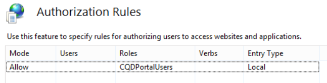

# <a name="deploy-call-quality-dashboard-for-skype-for-business-server"></a>Implantar o Painel de Qualidade da Chamada para o Skype for Business Server
 
**Resumo:** Saiba mais sobre o processo de implantação do Painel de Qualidade da Chamada. O Painel de Qualidade da Chamada é uma ferramenta do Skype for Business Server.
  
## <a name="deployment-overview"></a>Visão geral da implantação

O Painel de Qualidade da Chamada (CQD) consiste em três componentes principais:
  
- **Banco de Dados** de Arquivo Morto, onde os dados de QoE (Qualidade da Experiência) são replicados e armazenados.
    
- **Cubo**, onde os dados do banco de dados de Arquivo QoE são agregados para acesso otimizado e rápido.
    
- **Portal**, onde os usuários podem facilmente consultar e visualizar dados de QoE.
    

  
O processo de instalação do Arquivamento de QoE envolve a criação do banco de dados de Arquivo QoE, a implantação de um procedimento armazenado do SQL Server que move os dados do banco de dados de Métricas de QoE de origem para o banco de dados de Arquivo Morto QoE e a configuração do trabalho do SQL Server Agent para executar o procedimento armazenado em um intervalo regular. 
  
A implantação de cubo obtém informações do usuário sobre onde o Arquivo de QoE está localizado, implanta o cubo e configura um trabalho de agente regular do SQL Server que atualizará o cubo em um intervalo regular.
  
A instalação do portal cria um banco de dados de Repositório que armazena o mapeamento de usuários do CQD para relatórios/consultas de cada usuário. Em seguida, ele configura um aplicativo Web do IIS, que é o painel onde os usuários podem ver um conjunto pré-definido de relatórios, bem como personalizar e criar suas próprias consultas para visualizar dados do cubo. A instalação do portal cria dois aplicativos Web adicionais que expõem APIs para que os usuários acessem programaticamente o repositório e o cubo. (Essas APIs também são usadas internamente pelo painel.)
  

|**Fase**|**Etapas**|**Funções e associação de grupo**|**Documentação**|
|:-----|:-----|:-----|:-----|
|Instale o hardware e o software de pré-requisito.  <br/> |Decida sobre a configuração do CQD e escolha um SQL Server do qual executar a instalação.  <br/> |Usuário do domínio que é membro do grupo local de administradores.  <br/> |Seção "Requisitos de pré-instalação" na documentação de implantação.  <br/> |
|Instale o CQD.  <br/> |Execute o MSI após o documento de implantação.  <br/> |Para executar a configuração, a conta de instalação deve ser um usuário de domínio que seja membro do grupo de administradores locais e tenha acesso de leitura ao banco de dados de Métricas de QoE no Monitoring Server.  <br/> |Seções "Contas e Etapas de Implantação" na documentação de implantação.  <br/> |
|Conceder acesso ao usuário.  <br/> |Para gerenciar a autorização do usuário no Portal, recomendamos usar a Autorização de URL, que foi introduzida no IIS 7.0. Para obter mais informações, consulte Noções básicas sobre a autorização de URL do [IIS 7.0.](https://www.iis.net/learn/manage/configuring-security/understanding-iis-url-authorization)  <br/> |Usuário do domínio que é membro do grupo local de administradores.  <br/> |Gerenciando o acesso do usuário para a seção Portal na documentação de implantação.  <br/> |
|Opcional: forneça informações de mapeamento de sub-rede.  <br/> |Preencha as tabelas de mapeamento de rede e criação no banco de dados de Arquivo QoE.  <br/> |Uma conta com acesso de gravação ao banco de dados de Arquivo QoE.  <br/> |Seção "Fornecendo informações da sub-rede" na documentação do usuário.  <br/> |
   


A implantação do Painel de Qualidade de Chamada envolve a configuração da infraestrutura e a instalação do software. O procedimento a seguir descreve o processo.
  
## <a name="deployment-steps"></a>Etapas de implantação

1. Copie o CallQualityDashboard.msi para o computador onde o componente de banco de dados de arquivo morto do CQD deve ser instalado (esse é o computador que tem o SQL Server instalado). 
    
2. Execute o MSI (o Windows solicitará a execução com privilégios de administrador, faça isso). 
    
3. Aceite o EULA.
    
4. Selecione a pasta de destino onde os arquivos relacionados aos componentes do Painel de Qualidade de Chamada estarão localizados ou aceitem o local padrão.
    
5. Selecione todos os recursos.
    
6. Na página Configuração de Arquivo QoE, forneça as seguintes informações:
    
   - **Métricas de QoE SQL Server:** Nome da instância do SQL Server para onde o banco de dados de métricas de QoE está localizado (essa será a fonte de dados).
    
   - **Nome do SQL Server para arquivamento de QoE:** Este é um campo somente leitura e corrigido para o nome de domínio totalmente qualificado da máquina local. O banco de dados de arquivo morto só pode ser instalado no computador local.
    
   - **Instância do SQL Server de arquivo QoE:** Um nome de instância do SQL Server local para onde o banco de dados de arquivo morto deve ser criado. Para usar uma instância padrão do SQL Server, deixe esse campo em branco. Para usar uma instância nomeada do SQL Server, especifique o nome da instância (por exemplo, o nome após o " \" ).
    
   - **Banco de dados de arquivo QoE:** Por padrão, essa opção é definida como "Criar novo banco de dados". Como a atualização de Arquivo Morto não é suportada, a única circunstância na qual a opção "Usar banco de dados existente" pode ser usada é se o banco de dados arquivo morto existente tiver o mesmo esquema que o build a ser instalado.
    
   - **Diretório de Arquivos de Banco de Dados:** Caminho para onde os arquivos de banco de dados (.mdf e .ldf) para o banco de dados de arquivo morto devem ser colocados. Isso deve estar em uma unidade (HDD2 na configuração de hardware recomendada) separada do sistema operacional. Observe que, como os nomes de arquivo são corrigidos na instalação, para evitar possíveis conflitos, é recomendável que um diretório em branco sem arquivos seja usado.
    
   - **Use várias partições:** O padrão é definido como "Várias partições", que exige a edição Business Intelligence ou a edição Enterprise do SQL Server. Para a edição Standard, selecione a opção "Partição Única". Observe que o desempenho do processamento de cubos poderá ser afetado se a Partição Única for usada.
    
     > [!NOTE]
     > A seleção para a opção Usar Várias Partições não pode ser alterada após a conclusão da Instalação. Para alterá-lo, o recurso Cubo precisa ser desinstalado primeiro e reinstalado usando a opção "Alterar" no Painel de Controle. 
  
   - **Diretório de arquivos de partição:** Caminho para onde as partições do banco de dados de Arquivo QoE devem ser colocadas. Isso deve estar em uma unidade (HDD3 na configuração de hardware recomendada) separada da unidade do sistema operacional e da unidade de log do banco de dados SQL. Observe que, como os nomes de arquivo são corrigidos na instalação, para evitar possíveis conflitos, é recomendável que um diretório em branco sem arquivos seja usado.
    
   - **Usuário do Trabalho do SQL Agent - Nome de Usuário &amp; Senha:** Nome e senha da conta de serviço de domínio (mascarada) que será usada para executar a etapa "Dados de Arquivo Morto de QoE" do trabalho do SQL Server Agent (que executará o procedimento armazenado para buscar dados do banco de dados de métricas de QoE no banco de dados de arquivo morto, portanto, essa conta deve ter acesso de leitura ao banco de dados de métricas de QoE, conforme indicado na seção Contas. Essa conta também precisa ter um logon na Instância do SQL Server de Arquivo QoE.
    
     > [!NOTE]
     > A conta em que a instância do SQL Server está sendo executado, como NT SERVICE\MSSQLSERVER, deve ter acesso/permissão aos diretórios dados acima para que a instalação seja bem-sucedida. Para obter detalhes, consulte [Configure File System Permissions for Database Engine Access](https://msdn.microsoft.com/library/jj219062%28v=sql.110%29.aspx)
  
7. Ao clicar em seguida, o instalador executará verificações de pré-requisitos e relatará se algum problema for encontrado. Quando todas as verificações de pré-requisito passarem, o instalador irá para a página Configuração do Cubo. 
    
    > [!NOTE]
    > Se o instalador mostrar uma mensagem de aviso informando que o serviço do SQL Server Agent para a instância do SQL Server de Arquivo QoE não está em execução no momento, a instalação poderá prosseguir, mas após a instalação, verifique se o serviço do SQL Agent está em execução e de definir o tipo de Inicialização como Automático para que o Trabalho agendado seja executado. 
  
8. Na página Configuração do Cubo, forneça as seguintes informações:
    
   - **Nome do SQL Server para arquivamento de QoE:** Este é um campo somente leitura e corrigido para o nome de domínio totalmente qualificado da máquina local. O cubo só pode ser instalado a partir do computador que tem o banco de dados de Arquivo QoE (Observação. O próprio cubo pode ser instalado em um computador remoto. Veja abaixo)
    
   - **Instância do SQL Server de arquivo QoE:** Nome da instância do SQL Server para onde o banco de dados de arquivo morto QoE está localizado. Para especificar uma instância padrão do SQL Server, deixe esse campo em branco. Para especificar uma instância nomeada do SQL Server, insira o nome da instância (por exemplo, o nome após o " \" ). Se o componente arquivo QoE tiver sido selecionado para a instalação, esse campo será pré-preenchido com o valor fornecido na página Configuração de Arquivo QoE.
    
   - **Cube Analysis Server:** Nome da instância do SQL Server Analysis Service para onde o cubo deve ser criado. Pode ser um computador diferente, mas o usuário de instalação deve ser um membro dos administradores de Servidor da instância do SQL Server Analysis Service de destino.
    
     > [!NOTE]
     >  Para obter mais informações sobre como configurar as Permissões de Administrador do Servidor do Analysis Services, consulte Conceder Permissões de Administrador do Servidor [(Analysis Services)](https://msdn.microsoft.com/library/ms174561.aspx)
  
   - **Use várias partições:** O padrão é definido como "Várias partições", que exige a edição Business Intelligence ou a edição Enterprise do SQL Server. Para a edição Standard, selecione a opção "Partição Única". Observe que o desempenho do processamento de cubos poderá ser afetado se a Partição Única for usada.
    
     > [!NOTE]
     >  A seleção para a opção Usar Várias Partições não pode ser alterada após a conclusão da Instalação. Para alterá-lo, o recurso Cubo precisa ser desinstalado primeiro e reinstalado usando a opção "Alterar" no Painel de Controle.
  
   - **Usuário do Cubo - Nome de Usuário &amp; Senha:** nome e senha da conta de serviço de domínio (mascarada) que dispararão o processamento do cubo. Se o componente de Arquivo Morto de QoE tiver sido selecionado para a instalação, esse campo será pré-preenchido com o valor fornecido na página Configuração do Arquivo Morto para o Usuário do Trabalho do SQL Agent, mas recomendamos especificar uma conta de serviço de domínio diferente para que a Instalação possa conceder o menor privilégio necessário a ela.
    
9. Ao clicar em seguida, outra rodada de validação será executada e qualquer problema será relatado. Após a conclusão bem-sucedida da validação, o instalador irá para a página Configuração do Portal. 
    
10. Na página Configuração do Portal, forneça as seguintes informações:
    
    - **Arquivo QoE do SQL Server:** Nome da instância do SQL Server para onde o banco de dados de Arquivo QoE está localizado. Observe que, ao contrário da página Configuração de Arquivo QoE e da página Configuração do Cubo, o nome do computador não é fixo e deve ser fornecido. Se o componente arquivo QoE tiver sido selecionado para a instalação, esse campo será pré-preenchido com o valor fornecido na página Configuração de Arquivo QoE.
    
    - **Cube Analysis Server:** Nome da instância do SQL Server Analysis Service para onde o cubo está localizado. Se o componente Cubo tiver sido selecionado para a instalação, esse campo será pré-preenchido com o valor fornecido na página Configuração do Cubo.
    
    - **Repositório SQL Server:** Nome da instância do SQL Server onde o banco de dados de Repositório deve ser criado. Se o nome da instância do SQL Server para onde o banco de dados de Arquivo QoE está localizado tiver sido fornecido anteriormente na instalação (em outros componentes), esse campo será pré-preenchido com o nome da instância do SQL Server do banco de dados de arquivo QoE. Pode ser qualquer instância do SQL Server.
    
    - **Banco de dados de repositório:** Por padrão, a opção é definida como "Criar novo banco de dados". Como a atualização do banco de dados do repositório não é suportada, a única circunstância na qual a opção "Usar banco de dados existente" pode ser usada é se o banco de dados de repositório existente tiver o mesmo esquema que o build a ser instalado.
    
    - **Usuário do Pool de Aplicativos do IIS - Nome de Usuário &amp; Senha:** a conta em que o pool de aplicativos do IIS deve ser executado. Os campos Nome de Usuário e Senha estarão es cinzas se as contas internas do sistema forem selecionadas. Esses campos só serão habilitados se "Outros" estiver selecionado na caixa de lista baixa para que o usuário possa inserir as informações da conta de serviço de domínio.
    
11. Ao clicar em seguida, a rodada final de validação será feita para garantir que as instâncias do SQL Server sejam acessíveis usando as credenciais fornecidas e que o IIS está disponível no computador. Após a conclusão bem-sucedida da validação, o instalador prosseguirá com a instalação. 
    
Quando o instalador estiver pronto, provavelmente o trabalho do SQL Server Agent estará em andamento, fazendo a carga inicial dos dados de QoE e o processamento do cubo. Dependendo da quantidade de dados na QoE, o portal ainda não terá dados disponíveis para exibição. Para verificar o status da carga de dados e do processamento do cubo, vá para  `http://<machinename>/CQD/#/Health` . 
> [!NOTE]
> Observe que a URL para verificar o status do processamento do cubo de download faz a análise de caso. Se você inserir 'health', a URL não funcionará. Você deve inserir 'Health' no final da URL com um H maiús.. 
  
Mensagens de log detalhadas serão mostradas se o modo de depuração estiver habilitado. Para habilitar o modo de depuração, vá para **%SYSTEMDRIVE%\Program Files\Skype for Business 2015 CQD\QoEDataService\web.config** e atualize a seguinte linha para que o valor seja definido como **True:**

```xml
<add key="QoEDataLib.DebugMode" value="True" /> 
```

A página principal do portal pode ser acessada por  `http://<machinename>/CQD` meio de . 
## <a name="managing-user-access-for-the-portal"></a>Gerenciando o acesso do usuário para o Portal

Para gerenciar a autorização do usuário no Portal, recomendamos usar a Autorização de URL, que foi introduzida no IIS 7.0. Para obter mais informações sobre segurança do IIS, consulte Noções básicas sobre a autorização de URL do [IIS 7.0.](https://www.iis.net/learn/manage/configuring-security/understanding-iis-url-authorization)
  
Qualquer site ou aplicativo Web herda a Autorização de URL padrão configurada para todo o IIS, que normalmente é "Permitir Todos os Usuários". Se o acesso ao Portal precisar ser mais restritivo, os administradores poderão conceder acesso apenas ao grupo específico de usuários editando as "Regras de Autorização".
  

  
> [!NOTE]
> O ícone de Regras de Autorização não deve ser confundido com a "Autorização .NET" na seção ASP.NET, que é um mecanismo de autorização diferente. 
  
Os administradores devem primeiro remover a regra herdada "Permitir Todos os Usuários". Isso impede que usuários não autorizados acessem o Portal.
  

  
Em seguida, os administradores devem adicionar novas Regras de Permissão e dar aos usuários específicos a permissão para acessar o Portal. É recomendável que um Grupo local chamado "CQDPortalUsers" seja criado para gerenciar os usuários.
  

  
Os detalhes da configuração são armazenados no web.config localizado no diretório físico do Portal.
  
```xml
<?xml version="1.0" encoding="UTF-8"?> <configuration> <system.webServer> <security> <authorization> <remove users="*" roles="" verbs="" /> <add accessType="Allow" roles="CQDPortalUsers" /> </authorization> </security> </system.webServer> </configuration> 
```

A próxima etapa é configurar o painel do CQD. Depois que os usuários são autenticados pelo IIS, eles terão que ter permissões de arquivo no diretório CQD para acessar o conteúdo do portal da Web. É possível alterar as ACLs por meio da guia de segurança das propriedades de diretório do CQD para adicionar usuários ou grupos individuais; no entanto, a abordagem recomendada é deixar as permissões de arquivo intocadas. Em vez disso, altere a configuração do IIS para usar o processo de trabalho do IIS para acessar o diretório do CQD, independentemente de qual usuário seja autenticado. 
  
> [!IMPORTANT]
> É importante alterar somente essa configuração para o aplicativo CQD, e não para os dois aplicativos de API: QoEDataService e QoERepositoryService. 
  
## <a name="configuring-file-access-for-the-cqd-dashboard"></a>Configurando o acesso a arquivos para o CQD (Painel)

1. Abra o Editor de Configuração para CQD.
    
     
  
2. Em Seção, escolha **system.webServer/serverRuntime**.
    
     
  
3. Altere authenticatedUserOverride para **UseWorkerProcessUser**.
    
     
  
4. Clique **em** Aplicar no lado direito da página.
    
## <a name="known-issues"></a>Problemas Conhecidos

### <a name="the-cqd-shows-no-data-after-deployment"></a>O CQD não mostra dados após a implantação

Você pode receber o seguinte erro:

*Não conseguimos executar a consulta durante a execução no Cubo. Use o Editor de Consultas para modificar a consulta e corrigir quaisquer problemas. Além disso, certifique-se de que o Cubo está acessível.*

Isso significa que o cubo deve ser processado no SQL Server Analysis Services antes de ser usado no CQD. Você pode resolver isso seguindo estas etapas:

1. Abra o SQL Management Studio e selecione **Analysis Services.**

2. Expanda **o objeto QoECube,** selecione **Métrica de QoE**, clique com o botão direito do mouse e escolha **Procurar**. 

    Se isso retornar um navegador vazio, o cubo ainda não foi prosseguir.

3. Clique com o botão **direito do mouse na métrica QoE** e escolha **Processo.**

4. Quando o processamento estiver concluído, clique com  o botão direito do mouse no objeto novamente e escolha Procurar para confirmar se a página do navegador agora mostra dados. 


### <a name="users-have-trouble-logging-in-because-installer-fails-to-create-the-correct-settings-in-iis"></a>Os usuários têm problemas para entrar porque o instalador falha ao criar as configurações corretas no IIS

Em casos raros, o instalador falha ao criar as configurações corretas no IIS. A alteração manual é necessária para permitir que os usuários se conectem ao CQD. Se os usuários estão com problemas para entrar, siga estas etapas:
  
1. Abra o Gerenciador do IIS e navegue até o Site Padrão.
    
     
  
2. Clique em "Autenticação". Se "Autenticação Anônima", "Representação de ASP.NET", "Autenticação de Formulário" e "Autenticação do Windows" não corresponderem às configurações mostradas abaixo, altere-as manualmente para corresponder às configurações abaixo. Todos os outros mecanismos de autenticação devem ser desabilitados.
    
     
  
3. Para "Autenticação do Windows", clique em Configurações Avançadas no lado direito.
    
     
  
4. De definir "Proteção Estendida" para Aceitar e marque a caixa "Habilitar autenticação no modo Kernel".
    
     
  
5. Repita as etapas acima para cada uma das entradas "CQD", "QoEDataService" e "QoERepositoryService" abaixo de "Default Web Site".
    
Para vinculações de porta HTTP e HTTPS, o instalador criará ligações de porta nos números de porta padrão (porta 80 para HTTP e porta 443 para HTTPS). Se houver outro site no computador que use essas vinculações, haverá um conflito e o comportamento do IIS não poderá ser previsto. A melhor maneira de evitar esse problema é garantir que nenhum outro site seja mapeado para as portas 80 e 443 antes de instalar o CQD. 
  
Para habilitar SSL/TLS no IIS e forçar os usuários a se conectarem via HTTPS seguro em vez de HTTP:
  
1. Configure Secure Sockets Layer no IIS, consulte [Configurando Secure Sockets Layer no IIS 7](https://technet.microsoft.com/library/cc771438%28v=ws.10%29.aspx). Depois de terminar, substitua  `http` por `https` .
    
2. Para obter instruções sobre como habilitar o TLS nas conexões do SQL Server, consulte Como habilitar a criptografia [SSL](https://support.microsoft.com/kb/316898/)para uma instância do SQL Server usando o Console de Gerenciamento Microsoft.
    
## <a name="cube-sync-fails"></a>Falha na sincronização do cubo

A QoEMetrics pode conter alguns registros inválidos com base nos relógios do usuário final. Se a distorção de tempo for maior que 60 yrs, a importação do cubo falhará.
  
 Verifique Min e Max StartTime/EndTime usando as seleções abaixo. Procure e exclua registros no futuro distante e muito distante, eles podem ser desconsiderados e eles quebrarão os processos de sincronização.
  
- Select MIN(StartTime) FROM CqdPartitionedStreamView
    
- Select MAX(StartTime) FROM CqdPartitionedStreamView
    
- Select MIN(EndTime) FROM CqdPartitionedStreamView
    
- Select MAX(EndTime) FROM CqdPartitionedStreamView
    
## <a name="post-install-tasks"></a>Tarefas pós-instalação

### <a name="importing-buildings-and-networks"></a>Importando edifícios e redes

Depois de instalar o CQD, execute as seguintes tarefas de configuração:
  
1. Definir tipos de construção (recomendado)
    
2. Definir tipos de propriedade de construção (recomendado)
    
3. Definir tipos de rede (altamente recomendado)
    
4. Importar edifícios (recomendado)
    
5. Importar Sub-redes (recomendado)
    
### <a name="define-building-types"></a>Definir tipos de construção

Os tipos de construção são usados para descrever as diferentes definições de edifícios ou tipos em sua organização. 
  
> [!NOTE]
> Esta etapa é opcional, mas recomendada. 
  
Exemplos
  
- Headquarters
    
- Office Remoto
    
- Localização de joint-joint-location
    
  **Sintaxe SQL de exemplo**
  
```SQL
INSERT INTO
[dbo].[CqdBuildingType]
([BuildingTypeId],
[BuildingTypeDesc])
VALUES
(1, 
'Headquarters')   
```

Os parâmetros BuildingTypeId e BuildingTypeDesc são obrigatórios.
  
### <a name="define-building-ownership-types"></a>Definir tipos de propriedade de construção

Os tipos de propriedade são usados para distinguir ativos de propriedade versus arrendados.
  
> [!NOTE]
> Esta etapa é opcional, mas recomendada. 
  
Exemplos
  
- Contoso Leased non-RE &amp; F
    
- RE F com concessão da Contoso &amp;
    
- Contoso Owned
    
- Subsidiária arrendada
    
  **Sintaxe SQL de exemplo**
  
```SQL
INSERT INTO
[dbo].[CqdBuildingOwnershipType]
([OwnershipTypeId],
[OwnershipTypeDesc]
)

VALUES
(1,
'Contoso Owned'
)
```

Os parâmetros OwnershipTypeId e OwnershipTypeDesc são necessários. 
  
### <a name="define-network-names"></a>Definir nomes de rede

Tipos de rede são usados para descrever diferentes tipos de redes dentro da organização. Isso permite filtrar (ou filtrar) tipos de rede específicos.
  
> [!NOTE]
> É altamente recomendável definir nomes de rede, mas é opcional. Se você decidir não definir nomes de rede, verifique se cada entrada CqdNetwork tem BuildingId 0. 
  
Exemplos
  
- VPN
    
- LAB
    
  **Sintaxe SQL de exemplo**
  
```SQL
INSERT INTO [dbo].[CqdNetworkName] 
( [NetworkName]
,[NetworkType]
 ) 
VALUES
('VPN','VPN') 
```

Os parâmetros NetworkNameID e NetworkName são necessários, o parâmetro NetworkType é opcional, mas recomendado.
  
### <a name="import-buildings"></a>Importar edifícios

A importação de edifícios oferece a capacidade de obter informações específicas (chamadas ruins por edifício em WiFi/Com fio, etc.). 
  
> [!NOTE]
> Esta etapa é opcional, mas recomendada. 
  
Antes de importar um novo edifício, você já deve ter um BuildingKey predefinido identificado. Para fazer isso, em seguida, o comando SQL "SELECT MAX(BuildingKey) FROM CqdBuilding" para identificar o valor atual e adicionar 1 ao resultado.
  
 **Sintaxe SQL de exemplo**
  
```SQL
INSERT INTO [dbo].[CqdBuilding] 
( [BuildingKey]
,[BuildingName]
,[BuildingShortName]
,[OwnershipTypeId],
[BuildingTypeId]
)
VALUES
(2, 'Ann Arbor', 'AA', 0, 0)
```

Os parâmetros BuildingKey, BuildingName, BuildingShortName, OwnershipTypeId, BuildingTypeId são necessários, os outros parâmetros são opcionais.
  
### <a name="import-subnets"></a>Importar Sub-redes

A importação de edifícios oferece a capacidade de obter informações específicas (chamadas ruins por edifício em WiFi/Com fio, etc.). 
  
> [!NOTE]
> Esta etapa é opcional, mas recomendada.
  
Importe sub-redes e mapeie-as para os edifícios importados na última etapa. Se você decidiu não preencher NetworkName, certifique-se de que cada entrada nesta tabela use um NetworkNameID de 0. Para obter mais informações sobre sintaxe SQL e parâmetros para o Painel de Qualidade da Chamada, consulte Usar o Painel de Qualidade da Chamada [para o Skype for Business Server.](https://docs.microsoft.com/skypeforbusiness/management-tools/call-quality-dashboard/use)
  
 **Sintaxe SQL de exemplo**
  
```SQL
INSERT INTO [dbo].[CqdNetwork] 
([Network]
,[NetworkRange]
,[NetworkNameID]
,[BuildingKey]
,[UpdatedDate]
)

VALUES
 ('172.16.254.0',32,0,1,'2015-11-11')
```

Os parâmetros Network e UpdatedDate são necessários, os outros parâmetros são opcionais.
  
### <a name="optional-bssid"></a>Opcional: BSSID

O populamento de informações de BSSID oferece correlação de fluxo WiFi adicional por controlador ou rádio. Isso é além da filtragem por meio de construção ou sub-rede. 
  
 **Sintaxe SQL de exemplo**
  
```SQL
INSERT INTO [dbo].[CqdBssid]
([Ap],
[Bss],
[Building],
[ess],
[phy]
)
VALUES
('AP1','00-00-00-00-00-00','Aruba AP 1','Controller1','bgn')
```

**Detalhes do CqdBssidTable**

|**Conforme mostrado no CQD**|**Tabela CQDBssid**|**Exemplo de entradas**|
|:-----|:-----|:-----|
|Ap NName  <br/> |AP  <br/> |AP1  <br/> |
|BBssid  <br/> |BSS  <br/> |00-00-00-00-00-00 (você deve usar a fformatação delimitada)  <br/> |
|Controlador  <br/> |Construção  <br/> |Aruba AP 7  <br/> |
|Dispositivo  <br/> |ess  <br/> |Controller1  <br/> |
|Rádio  <br/> |phy  <br/> |bgn  <br/> |
   
### <a name="processing-the-imported-data"></a>Processando os dados importados

Por padrão, depois de importar dados de rede/com construção, eles serão aplicados somente aos registros gerados após esse ponto no tempo. 
  
Para marcar todos os registros anteriores com esses novos dados, você precisará executar o procedimento armazenado CqdUpdateBuilding, conforme mostrado abaixo: 
  
Dê a ele a data do seu primeiro registro (identifique que usando o comando SELECT MIN(StartTime) FROM CqdPartitionedStreamView SQL ), uma EndDate de amanhã e NULL para os dois últimos valores.
  
Depois que os dados são associados a dados de fluxo, o cubo do SSIS precisa reprocessar todos os registros. Isso também se aplica ao adicionar dados BSSID/ISP em massa. Certifique-se de que "Processo Completo" está selecionado.
  

