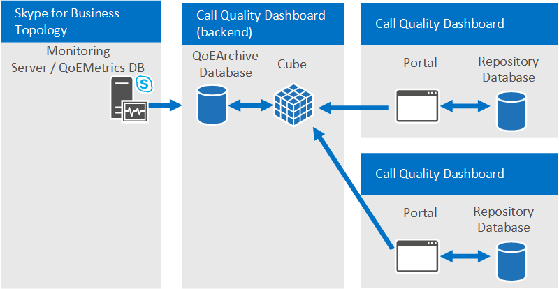

# <a name="plan-for-call-quality-dashboard-for-skype-for-business-server"></a>Planejar o Painel de Qualidade de Chamada para Skype for Business Server 
 
**Resumo:** Saiba mais sobre o que considerar ao planejar o Painel de Qualidade de Chamada.
  
## <a name="overview-of-the-skype-for-business-server-call-quality-dashboard"></a>Visão geral do painel Skype for Business Server qualidade de chamada

O Skype for Business Server de Qualidade de Chamada (CQD) é uma camada de relatório sobre o Banco de Dados de Qualidade da Experiência no Monitoring Server no Skype for Business Server. O CQD usa Microsoft SQL Server Analysis Services para fornecer informações de qualidade de chamada e uso agregados, bem como para filtragem e pivô no conjunto de dados. Os recursos do CQD incluem:
  
- **Armazenamento de arquivamento de dados QoE por meio do componente arquivo morto QoE do CQD.** O componente arquivo morto de QoE pode armazenar dados QoE por uma duração muito maior do que o Servidor de Monitoramento pode. Isso permite tendências e relatórios para até sete meses de dados por vez, com a capacidade de deslizar a janela de relatórios até onde há dados.
- **Relatórios e análises usando a potência e a velocidade dos Serviços de Análise Microsoft SQL Server Análise.** O CQD utiliza o Microsoft SQL Analysis Services para fornecer recursos rápidos de resumo, filtro e pivô para a energia do painel por meio de um Cubo de Análise. Relatar a velocidade de execução e a capacidade de detalhar os dados podem reduzir drasticamente os tempos de análise.
- **Novo esquema de dados otimizado para relatórios de qualidade de chamada.** O Cubo tem um esquema projetado para relatórios e investigações de qualidade de voz. Os usuários do portal podem se concentrar nas tarefas de relatório em vez de descobrir como o esquema de banco de dados de Métricas de QoE mapeia para as exibições de que precisam. A combinação do Arquivo QoE e do Cubo fornece uma abstração que reduz a complexidade do relatório e da análise por meio do CQD. O esquema de banco de dados de Arquivo morto de QoE também contém tabelas que podem ser preenchidas com dados específicos de implantação para aprimorar o valor geral dos dados.
- **Designer de relatório integrado e edição de relatório local.** O componente Portal vem com vários relatórios integrados modelados após a Metodologia de Qualidade de Chamada. Os usuários do portal podem modificar os relatórios e criar novos relatórios por meio da funcionalidade de edição do Portal.
- **Acesso à API Web aos Dados do Cubo de Análise e Estrutura de Relatório.** A estrutura de relatórios do Painel não é a única maneira de exibir os dados do Cubo. O CQD fornece vários exemplos de uso de HTML e JavaScript para recuperar dados das APIs web do CQD e renderizar os dados em um formato personalizado. A combinação do Editor de Relatórios e das APIs web do CQD permite a prototipagem rápida de relatórios e layout de relatório personalizado.

> [!NOTE]
> Um administrador agora pode gerenciar Skype for Business Server 2019 usando [o CQD versão 3](https://cqd.teams.microsoft.com) (faça logoff com credenciais de administrador). Isso requer uma implementação híbrida e o uso do Conector de Dados de Chamada (CCD). Consulte [Plan Call Data Connector](../../../SfbHybrid/hybrid/plan-call-data-connector.md) para obter mais informações sobre como habilbilar o CCDD. Para obter a documentação do CQD versão 3, consulte Ativar e usar o Painel de Qualidade de Chamada para Microsoft Teams e [Skype for Business Online](/MicrosoftTeams/turning-on-and-using-call-quality-dashboard) para obter mais informações sobre o CQD versão 3.

## <a name="cqd-design-goals"></a>Metas de design do CQD

O CQD permite que os profissionais de IT usem dados agregados para identificar áreas de foco em seu ambiente com problemas de qualidade de mídia. Ele permite que um usuário de PRO compare estatísticas para diferentes grupos de usuários e identifique tendências e padrões. Não se concentra na solução de problemas de chamada individuais, mas na identificação de problemas e soluções que se aplicarão a muitos usuários em um determinado ambiente. 
  
## <a name="call-quality-dashboard-components"></a>Componentes do Painel de Qualidade de Chamada

O Painel de Qualidade de Chamada consiste em vários bancos de dados, trabalhos do Microsoft SQL Agent, processos e aplicativos Web. O Microsoft SQL Agent copia periodicamente os dados do banco de dados de Métricas de QoE para o banco de dados de Arquivo morto de QoE e processa o Cubo com os dados no banco de dados de Arquivo morto de QoE. O banco de dados repositório armazena as definições de relatório que a energia do Portal. O Portal fornece acesso do navegador aos dados do Cubo. 
  
Os componentes do CQD, incluindo os bancos de dados de Repositório, Arquivamento de QoE e Cubo, podem ser instalados no Servidor de Monitoramento, instalados em seu próprio servidor ou instalados em vários servidores. O método de instalação específico depende das demandas de desempenho do CQD, bem como do impacto em outros processos nos mesmos servidores. Para obter mais informações, consulte a seção "Componentes e topologias para CQD" posteriormente neste artigo.
  
### <a name="architectural-overview"></a>Visão Geral de Arquitetura

Para resumir, o CQD requer os seguintes elementos:
  
- Dois bancos de dados: um banco de dados de arquivo morto e um banco de dados de repositório.
    
- Um cubo SSAS visualizando dados agregados 
    
- IIS hospeda o CQD Web Portal
    

  
A mesma arquitetura CQD dá suporte ao Lync Server 2013 e Skype for Business. 
  
### <a name="cqd-and-skype-for-business-vs-lync-2013"></a>CQD e Skype for Business Lync 2013

 Somente em um Skype for Business ambiente, os seguintes recursos estão disponíveis:
  
- Wi-Fi relatório de Força do Sinal
    
- Wi-Fi relatórios de drivers de chipset
    
- Taxar meus dados de chamada 
    
## <a name="information-available-through-cqd"></a>Informações disponíveis por meio do CQD

O CQD pode mostrar Skype for Business Server de áudio, vídeo e fluxo de compartilhamento de aplicativos e contagem de chamadas boas e ruins, bem como taxas de chamadas ruins para boas. As exibições podem ser fatiadas e filtradas por várias dimensões diferentes. O CQD desenha dados do banco de dados de Métricas de QoE no Servidor de Monitoramento. Os dados são mesclados com todos os dados fornecidos pelo cliente, como mapeamento de sub-rede de rede para construção para tornar possíveis relatórios como "Qualidade de Chamada por Construção". 
  
O CQD também abstrai muitas das idiossincrasias de dados QoE internas, como "chamador" e "chamador", de forma que o usuário possa se concentrar na criação de exibições de relatório em torno de "servidor" e "cliente". Seguindo a Metodologia de Qualidade de Chamadas, o CQD é simplificado para ajudar a identificar as condições que os bolsões de chamadas ruins têm em comum— um dos princípios para melhorar a qualidade da chamada.
  
## <a name="viewing-data-in-cqd"></a>Exibindo dados no CQD

Os dados do CQD podem ser exibidos por meio do Portal CQD e acessados por meio de chamadas da API REST.
  
### <a name="cqd-portal"></a>CQD Portal

O Portal é a maneira mais rápida de exibir os dados no Cubo. O Portal vem com vários relatórios integrados que são usáveis imediatamente. Os relatórios integrados são vinculados de forma estruturada para orientar o usuário a fatias sucessivamente menores e menores dos dados de chamada. Os relatórios integrados também realçam as várias maneiras diferentes de os dados serem mostrados demonstrando uma combinação de gráficos e tabelas com diferentes pivôs, filtros e medidas. Cada usuário que acessa o Portal pode ter seu próprio conjunto de relatórios que pode modificar e compartilhar. Para obter mais informações sobre o uso do CQD Web Portal, consulte [Use Call Quality Dashboard for Skype for Business Server](use.md).
  
Sistemas operacionais com suporte para Portal CQD: Windows 8.1, Windows 8, Windows Server 2012 R2, Windows Server 2012 e Windows Server 2016 (somente Skype for Business Server CQD 2019).
  
Navegadores com suporte para Portal CQD: Internet Explorer 11, Internet Explorer 10 e Internet Explorer 9.
  
### <a name="rest-apis"></a>APIs REST

Os dados do Cubo também podem ser acessados por meio de chamadas da API REST. Os dados recuperados por meio das chamadas da API REST podem ser renderizados por meio de páginas HTML. Os usuários podem aproveitar a velocidade da consulta e o esquema de alto nível do CQD enquanto ainda criam relatórios personalizados adequados para suas necessidades comerciais. Para obter mais informações sobre a API e exemplos, consulte [Develop Call Quality Dashboard for Skype for Business Server](develop.md). 
  
## <a name="defining-your-organizations-requirements-for-cqd"></a>Definindo os requisitos da sua organização para o CQD

O CQD fornece arquivamento de dados QoE e análise rápida e profunda de dados de qualidade de chamada. O guia a seguir ajuda você a decidir quando e por que implantar o CQD.
  
### <a name="when-to-deploy-cqd"></a>Quando implantar o CQD

 **O CQD pode ser implantado para estabelecer uma medida de qualidade de chamada de linha de base, mesmo se uma organização não tiver problemas de qualidade de chamada.** Estabelecer uma medida de qualidade de chamada de linha de base é importante porque todas as organizações têm uma combinação diferente de Wi-Fi versus com fio e remotos versus funcionários do office. Quando surgem problemas de qualidade de chamada, as medidas de qualidade de chamada mais recentes podem ser comparadas aos intervalos de tempo anteriores. Os recursos de tendência do CQD permitem a detecção fácil de alterações na qualidade da chamada ao longo do tempo.
  
 **O CQD pode ser implantado para encontrar proativamente áreas problemáticas que podem afetar a qualidade da chamada.** Mesmo que a qualidade média de chamada de uma organização possa atender às metas definidas pela organização, pode haver problemas de qualidade de chamada ocultos atrás de métricas médias. O CQD permite a divisão dinâmica de métricas de qualidade de chamada em tabela dinâmica por várias dimensões no banco de dados QoEMetrics. A localização de outliers em grupos pares é uma maneira rápida de localizar proativamente problemas de qualidade de chamada.
  
 **O CQD deve ser implantado se houver problemas de qualidade de chamada na organização para reduzir o tempo necessário para solucionar problemas.** O CQD pode simplificar investigações de qualidade de chamada existentes oferecendo desempenho de relatórios rápidos e recursos dinâmicos de detalhamento. O CQD foi projetado para vários tipos de fluxos de trabalho na validação de investigações de qualidade de chamada de reparos para o ambiente.
  
### <a name="why-deploy-cqd"></a>Por que implantar o CQD

 **O CQD deve ser implantado se o relatório de QoE precisar acontecer por mais de 3 meses de dados.** O banco de dados QoEMetrics e relatórios de servidor de monitoramento foram projetados para reter e relatar um pequeno conjunto de dados. O banco de dados de Métricas de QoE é otimizado para inserções rápidas e, portanto, o desempenho do relatório pode ser impedido pelo grande volume de chamadas ou pelo acesso de relatórios concorrente ao banco de dados. O banco de dados de Arquivo morto QoE do CQD fornece uma segunda cópia dos dados de Métricas de QoE com recursos de retenção muito mais longos. O Portal também é otimizado para exibir até 7 meses de dados por vez e pode relatar todos os dados no Arquivo QoE conforme necessário.
  
 **O CQD deve ser implantado se os relatórios de QoE personalizados são necessários.** O Portal tem um recurso Editor de Relatórios para criar e prototipar relatórios de forma rápida e fácil. Ele também disponibiliza APIs REST para acesso programático aos dados do Cubo, permitindo apresentação personalizada usando HTML/JavaScript ou muitas outras estruturas. Não é mais necessário criar novas SQL com o objetivo de criar exibições de dados personalizadas para relatórios.
  
 **O CQD deve ser implantado se a funcionalidade de relatório de QoE existente não atender à velocidade ou profundidade exigida pela organização.** O CQD vem com muitos relatórios integrados. Os relatórios são imediatamente úteis e demonstram como a drilling progressivamente nos dados pode oferecer informações adicionais em cada nível. A hierarquia de relatórios também ajuda a gerenciar os vários relatórios de maneira lógica e promove a criação de muitos mais relatórios que são facilmente acessíveis e compreensíveis. O CQD não oferece apenas velocidade e flexibilidade, mas também é otimizado para os fluxos de trabalho desenvolvidos pela Metodologia de Qualidade de Chamada.
  
## <a name="components-and-topologies-for-cqd"></a>Componentes e topologias para CQD

O CQD vem com vários componentes e ajuda a entender os requisitos de cada componente e sua relação uns com os outros para obter a implantação mais simples e de melhor desempenho da ferramenta. A tabela a seguir descreve o componente dependente para cada componente CQD.
  

|**Nome do componente**|**Componente dependente**|
|:-----|:-----|
|Arquivo morto de QoE  <br/> |Microsoft SQL Server  <br/> |
|Cubo  <br/> |Microsoft SQL Server Analysis Services  <br/> |
|Portal  <br/> |Microsoft Information Services  <br/> |
|Serviço de Repositório (parte da instalação do Portal)  <br/> |Microsoft SQL Server  <br/> |
   
> [!NOTE]
> Para o Arquivo de QoE e o Cubo, determinadas opções de implantação exigem Business Intelligence ou Enterprise edições de Microsoft SQL Server. Consulte a seção [Requisitos de infraestrutura para CQD](plan.md#Infrastructure_Req) abaixo para obter mais detalhes.
  

  
### <a name="single-server-configuration"></a>Configuração de servidor único

Todos os componentes CQD e componentes dependentes podem ser instalados em um computador. A configuração de caixa única é a configuração mais simples e permite que o CQD seja auto-contido. O CQD precisaria apenas de acesso ao banco de dados de Métricas de QoE no Servidor de Monitoramento. O CQD Server pode ser uma máquina autônoma, uma máquina virtual ou até mesmo o Servidor de Monitoramento, dependendo dos recursos disponíveis do computador host e dos requisitos de desempenho. 
  
Durante a instalação, o usuário que executa a instalação simplesmente precisa fornecer as instâncias do Microsoft SQL Server e do Microsoft SQL Server Analysis Services que foram configuradas anteriormente no computador onde o CQD deve ser instalado. Consulte [Deploy Call Quality Dashboard for Skype for Business Server](deploy-0.md) para obter mais informações.
  
### <a name="multiserver-configuration"></a>Configuração multiserver

Em uma configuração multiserver, o Arquivo de QoE, o Cubo e o Portal podem estar em diferentes máquinas. Há dois usos principais para a configuração de vários servidores:
  
- Hospedando o CQD Web Portal e o Cubo CQD em servidores diferentes.
    
- Hospedando um Portal de "desenvolvimento" separado do Portal de "produção". 
    
  **Hospedando o CQD Web Portal e o Cubo CQD em diferentes máquinas.** As organizações que podem ter requisitos para separar o Portal CQD da instalação do SQL Server ou que podem querer misturar e corresponder SQL Server edições SQL Server para a instância do SQL Server e a instância do SQL Server Analysis Services podem optar por instalar o Portal CQD e o Cubo CQD em diferentes máquinas. O componente arquivo morto de QoE também pode ser o único componente CQD instalado se a organização simplesmente quiser ter um método sustentável para arquivar os dados de QoE sem atingir limites de desempenho no Servidor de Monitoramento.
  

  
 **Hospedando um Portal de "desenvolvimento" separado do Portal de "produção".** As organizações que desenvolvem seus próprios relatórios personalizados (por meio das APIs REST) podem preferir implantar instâncias adicionais do Portal (CQD) juntamente com o Portal de produção que os usuários regulares acessam para monitoramento de qualidade de chamada ou investigações. O Portal de desenvolvimento pode isolar quaisquer modificações no Portal do ambiente de produção. Os portais da Web adicionais podem ser implantados em diferentes máquinas (mostradas abaixo) ou implantados em diretórios web diferentes no mesmo computador (não mostrado). Para realizar o último, o portal da Web CQD adicional deve ser copiado para a máquina de produção manualmente, pois o processo de instalação do CQD sempre implanta o Portal da Web CQD no site padrão com nomes de aplicativo Web predefinidos.
  

  
### <a name="supported-topologies"></a>Topologias suportadas

O CQD não mescla dados de vários bancos de dados QoEMetrics, como é o caso em que há várias topologias Skype for Business Server, cada uma com seu próprio Monitoring Server. Cada instância do CQD deve apontar para um banco de dados QoEMetrics. No entanto, como o CQD move grande parte da carga de trabalho de relatórios do Monitoring Server, grandes organizações que precisavam implantar um Servidor de Monitoramento por Skype for Business Server topologia devem considerar o uso de um Servidor de Monitoramento para todas as topologias.
  
## <a name="infrastructure-requirements-for-cqd"></a>Requisitos de infraestrutura para CQD
<a name="Infrastructure_Req"> </a>

O CQD, incluindo todos os componentes e componentes dependentes, pode ser implantado em uma máquina virtual, em uma única máquina ou em várias máquinas. Os requisitos mínimos de software e hardware estão listados abaixo. A disponibilidade de dados e o desempenho da consulta podem variar de minutos a horas, dependendo do número de usuários Skype for Business Server usuários ativos e hardware e configuração, portanto, algumas medidas de desempenho são fornecidas abaixo.
  
|||
|:-----|:-----|
|Para o CQD 2015 <br/> |  <br/> |
|Sistemas operacionais com suporte   <br/> |Windows Server 2008 R2, Windows Server 2012, Windows Server 2012 R2  <br/> |
|Suporte para SQL Server  <br/> |SQL Server 2012, SQL Server 2014, SQL Server 2016  <br/> |

|||
|:-----|:-----|
|Para o CQD 2019 <br/> |  <br/> |
|Sistemas operacionais com suporte   <br/> |Windows Server 2016, Windows Server 2019  <br/> |
|Suporte para SQL Server  <br/> |SQL Server 2017, SQL Server 2019  <br/> |
   
O CQD utiliza Microsoft SQL Server, Microsoft SQL Server Analysis Services e Serviços de Informações da Internet da Microsoft para que os requisitos mínimos de hardware e software do CQD sejam basicamente os mesmos dos componentes dependentes. No entanto, com base nos requisitos da organização em relação à renovação de dados (que dependerá em parte do volume de dados QoE gerados pela organização) e do custo de implantação, considerações adicionais de implantação devem ser feitas.
  
O processamento de dados no CQD é separado em dois estágios principais: 
  
- Processo de arquivamento de QoE
    
- Processamento de cubo CQD
    
  **Processamento de arquivo morto de QoE.** A tarefa de processamento de Arquivo morto de QoE copia dados do banco de dados Métricas de QoE no Servidor de Monitoramento para o banco de dados de Arquivo morto de QoE. Há duas situações em que o tempo de processamento da tarefa teria características de desempenho fundamentalmente diferentes. O primeiro é após a instalação inicial do CQD. Quando a tarefa é executado pela primeira vez após uma nova instalação, a tarefa de processamento de Arquivo Morto de QoE copiará todos os dados que estão no banco de dados Métricas de QoE para o banco de dados de Arquivo morto de QoE. O segundo é o processamento periódico após essa fase inicial. A tarefa de processamento de Arquivo morto de QoE será executado a cada 15 minutos e processará quaisquer novos registros QoE que estão no banco de dados de Métricas de QoE. Geralmente, o tempo de processamento inicial não é uma preocupação porque é executado apenas na primeira vez, quando o CQD é instalado. No entanto, se o servidor CQD estiver gravemente sub provisionado, essa tarefa pode levar várias horas. Consulte a tabela abaixo, por exemplo, tempos iniciais de processamento de Arquivo morto de QoE.
  
  **Processamento de cubo CQD.** A tarefa de processamento de cubo agrega os dados do banco de dados de Arquivo QoE no Cubo. O tempo inicial de processamento do cubo e o tempo de processamento do cubo subsequente são determinados pela SQL Server do Analysis Services usada para o Cubo CQD. Se a edição Standard for usada, não haverá diferença entre o tempo inicial de processamento do cubo e o tempo de processamento subsequente do cubo, pois sempre que os dados do Cubo são atualizados, ele sempre será um processamento completo de todos os dados disponíveis. (Isso significa que o tempo de processamento do Cubo aumenta à medida que a quantidade de dados no banco de dados de Arquivo morto de QoE aumenta.) Como o Business Intelligence Edition e o Edição Enterprise do SQL Server têm suporte de partição, se uma das edições for usada, somente a primeira será processa todos os dados no banco de dados de Arquivo morto de QoE. Em seguidas, quando a tarefa é disparada a cada 15 minutos, a tarefa processará apenas os novos registros adicionados ao banco de dados de Arquivo morto de QoE desde a última vez em que a tarefa foi executado. Uma vez por dia, também haverá um processamento completo na partição que contém os dados do mês atual.
  
As características da máquina física podem afetar o desempenho do CQD, bem como os recursos de software disponíveis nos componentes SQL Server. O componente arquivo morto de QoE será mais intenso em disco em comparação com outros componentes, enquanto o componente Cube será mais CPU e memória intensa. Todos esses fatores contribuem para o tempo total de processamento de dados do CQD, o que afeta diretamente a disponibilidade e a disponibilidade dos dados. As organizações devem tomar decisões sobre hardware e software com base nas necessidades individuais da organização. 
  
### <a name="tested-hardware-configurations"></a>Configurações de hardware testadas

Esta seção faz a suposição de que há um único DB QoEMetrics no ambiente. 
  
**Perfis de máquina**

|**Computador**|**Núcleos da CPU**|**RAM**|**Arquivo de QoE e Cubo no mesmo disco**|**Arquivo morto de QoE e SQL Temp DB no mesmo disco**|
|:-----|:-----|:-----|:-----|:-----|
|Máquina virtual  <br/> |4   <br/> |7 GB  <br/> |Sim  <br/> |Sim  <br/> |
|Núcleo 4  <br/> |4   <br/> |20 GB  <br/> |Sim  <br/> |Não  <br/> |
|8 núcleo  <br/> |8   <br/> |32 GB  <br/> |Sim  <br/> |Não  <br/> |
|16 núcleo  <br/> |16   <br/> |128 GB  <br/> |Não  <br/> |Não  <br/> |
   
**Resultados de desempenho**

|**Computador**|**Tamanho db de métricas de QoE**|**SQL partições**|**Tipo de disco**|**Número de fluxos**|**Processo inicial de arquivamento**|**Processo de Cubo Inicial**|**Processo de Arquivamento Subsequente**|**Processo de Cubo Subsequente**|
|:-----|:-----|:-----|:-----|:-----|:-----|:-----|:-----|:-----|
|Máquina virtual  <br/> |900 MB  <br/> |Simples  <br/> |VHD (tamanho variável)  <br/> |.5 M  <br/> |30 m  <br/> |2 m  <br/> |30 s  <br/> |1 m  <br/> |
|Máquina virtual  <br/> |9 GB  <br/> |Simples  <br/> |VHD (tamanho variável)  <br/> |5 M  <br/> |4 h  <br/> |15 m  <br/> |1 m  <br/> |5 m  <br/> |
|Máquina virtual  <br/> |9 GB  <br/> |Simples  <br/> |VHD (tamanho fixo)  <br/> |5 M  <br/> |2 h  <br/> |5 m  <br/> |1 m  <br/> |5 m  <br/> |
|Máquina virtual  <br/> |30+ GB  <br/> |Simples  <br/> |VHD (tamanho fixo)  <br/> |10 M  <br/> |15 h  <br/> |20 m  <br/> |2 m  <br/> |45 m  <br/> |
|8 núcleo  <br/> |9 GB  <br/> |Simples  <br/> |Vários discos  <br/> |5 M  <br/> |2 h  <br/> |5 m  <br/> |25 s  <br/> |5 m  <br/> |
|8 núcleo  <br/> |9 GB  <br/> |Vários  <br/> |Vários discos  <br/> |5 M  <br/> |2 h  <br/> |15 m  <br/> |35 s  <br/> |2 m  <br/> |
|8 núcleo  <br/> |30+ GB  <br/> |Simples  <br/> |Vários discos  <br/> |20 M  <br/> |9 h  <br/> |20 m  <br/> |1 m  <br/> |20 m  <br/> |
|8 núcleo  <br/> |30+ GB  <br/> |Vários  <br/> |Vários discos  <br/> |20 M  <br/> |9 h  <br/> |30 m  <br/> |2 m  <br/> |2 m  <br/> |
|Núcleo 4  <br/> |200 GB  <br/> |Simples  <br/> |Vários discos  <br/> |125 M  <br/> |6+ dias  <br/> |7 h  <br/> |2 m  <br/> |6 h  <br/> |
|16 núcleo  <br/> |500 GB  <br/> |Vários  <br/> |Vários eixos  <br/> |250 M  <br/> |8 dias  <br/> |2 h  <br/> |2 m  <br/> |10 m  <br/> |
   
\*Eles não devem ser encontrados em implantações reais porque o banco de dados de Métricas de QoE teria que ter 9 e 18 meses de dados, respectivamente, mas eles são fornecidos aqui para a conclusão.
  
### <a name="service-account-requirements"></a>Requisitos da conta de serviço

Você precisará de uma conta (com acesso de leitura a QoEMetrics) que o agente SQL no servidor CQD pode usar para importar dados para o QoEArchiveDB.
  
Você também pode precisar configurar uma conta separada para um trabalho SSAS para puxar dados de QoEArchiveDB (este é um processo opcional).
  
O IIS mais comumente usa o Serviço de Rede como Identidade do Pool de Aplicativos, mas pode ser configurado para uma Conta de Serviço.
  
### <a name="portal-access-control"></a>Controle de Acesso para Portal

Por padrão, qualquer usuário autenticado tem acesso. Isso pode ser alterado usando as regras de Autorização do IIS para restringir a um grupo específico.
  
### <a name="pre-install-requirements"></a>Requisitos de pré-instalação

Essas instruções pressupom que um banco de dados de Métricas de QoE já foi instalado e está em execução em algum lugar na topologia Skype for Business Server de dados.
  
#### <a name="hardware-requirements"></a>Requisitos de hardware

O CQD utiliza Microsoft SQL Server, o Microsoft SQL Analysis Server e o Microsoft Internet Information Server para que os requisitos mínimos de hardware e software do CQD sejam basicamente os mesmos dos componentes dependentes. No entanto, com base nos requisitos da organização em relação à renovação de dados (que dependerá em parte do volume de dados QoE gerados pela organização) e do custo de implantação, considerações adicionais de implantação devem ser feitas.
  
#### <a name="software-requirements"></a>Requisitos de software

Os seguintes sistemas operacionais são necessários para CQD:
  
- Windows Server 2008 R2 com IIS 7.5
    
- Windows Server 2012 com o IIS 8.0
    
- Windows Server 2012 R2 com IIS 8.5

- Windows Server 2016 com o IIS 10.0 (somente Skype for Business Server CQD 2019)

- Windows Server 2019 (somente Skype for Business Server CQD 2019)
    
A seguir estão os serviços de função do IIS necessários (em ordem hierárquica):
  
- Servidor Web
    
  - Recursos HTTP comuns
    
  - Conteúdo estático
    
  - Documento padrão
    
  - Desenvolvimento de aplicativo
    
  - ASP.NET
    
  - Filtros ISAPI
    
  - Diagnóstico &amp; de Saúde
    
  - Log HTTP
    
  - Segurança
    
  - Autorização de URL
    
  - Autenticação do Windows
    
  - Ferramentas de gerenciamento
    
  - Console de gerenciamento do IIS
    
> [!NOTE]
>  Observe o seguinte para os requisitos acima:> versões 3.5 e 4.5 da estrutura .Net estão disponíveis. Ambos são necessários (mais especificamente, 3.5 SP1 é necessário).> Em alguns sistemas, se o ASP.NET estiver configurado antes da instalação do IIS, o ASP.NET pode não ser registrado no IIS. O problema se manifestou pela ausência de pools de aplicativos para a versão .Net correspondente e também falta a versão do .NET CLR na configuração do pool de aplicativos. Para corrigir esse problema no Windows Server 2008 R2, execute `%systemroot%\Microsoft.NET\Framework64\4.0.30319\aspnet_regiis.exe -iru` . No Windows Server 2012 e Windows Server 2012 R2, execute seguido pela remoção do módulo "ServiceModel" do Site Padrão no Gerenciador do IIS.> As ferramentas de gerenciamento são opcionais, mas `dism /online /enable-Feature /all /FeatureName:WCF-HTTP-Activation45` recomendadas.
  
Para instalar esses requisitos usando o PowerShell, execute o seguinte:
  
```PowerShell
import-module servermanager
```

```PowerShell
add-windowsfeature Web-Server, Web-Static-Content, Web-Default-Doc, Web-Asp-Net, Web-Asp-Net45, Web-Net-Ext, Web-Net-Ext45, Web-ISAPI-Ext, Web-ISAPI-Filter, Web-Http-Logging, Web-Url-Auth, Web-Windows-Auth, Web-Mgmt-Console
```

As seguintes versões do SQL Server são suportadas:
  
|||
|:-----|:-----|
| CQD 2015 <br/> |  SQL Server 2012, SQL Server 2014, SQL Server 2016  |
|CQD 2019 <br/> |  SQL Server 2017, SQL Server 2019  |
    
Business Intelligence ou Enterprise edição é recomendada por motivos de desempenho. Essas edições permitem o uso de vários arquivos de partição que podem ser processados em paralelo, o que é benéfico para o processamento de dados que abrangem vários meses ou mais. 
  
Embora não seja recomendado, a edição Standard também é suportada. O processamento será restrito a uma única partição (que precisa ser configurada durante a instalação). 
  
Em todos os casos, "Mecanismo de Banco de Dados Serviços" e "Analysis Services" devem ser instalados. É recomendável, mas não é necessário instalar também o recurso "Ferramentas de Gerenciamento - Concluído", que adiciona SQL Server Management Studio suporte para Serviços de Análise. A tela de seleção de recursos deve ter a aparência da figura.
  

  
Ao configurar a configuração do SSAS, na Configuração dos Serviços de Análise, de definir "Modo de Servidor" como "Modo de Mineração de Dados e Multidimensionais". 
  
Para obter ajuda adicional para instalar e configurar SQL Server Business Intelligence, consulte [Install Analysis Services in Multidimensional](/previous-versions/sql/sql-server-2012/ms143708(v=sql.110))and Data Mining Mode .
  
#### <a name="account-requirements"></a>Requisitos de conta

Três contas de serviço de domínio são recomendadas com o princípio de privilégio mínimo: 
  
- Um que já possui uma entidade de segurança de logon para o banco de dados de Métricas de QoE (com db_datareader privilégio) e uma entidade de segurança de logon na Instância de SQL Server de Arquivo de QoE (necessário para criar um objeto Linked Server durante a instalação). Essa conta será usada para executar a etapa "Dados de Arquivo Morto QoE" do trabalho SQL Server Agente.
    
    > [!NOTE]
    > Se você estiver trabalhando em um ambiente fortemente bloqueado, você precisará verificar se essa conta de serviço tem de fato direitos de usuário "Logon como um trabalho em lotes" e "Permitir logon localmente" no banco de dados de Monitoramento de Métricas de QoE SQL Server e no arquivo morto SQL Server.
    
- Um que será usado para executar a etapa "Process Cube" do trabalho SQL Server Agente. A instalação criará uma entidade de segurança de logon para o banco de dados de Arquivo morto de QoE (com privilégio de leitura e gravação) e também criará um membro na Função QoE (com privilégio de controle total) para o Cubo.
    
- Um que será usado para executar o Processo de Trabalho do IIS para os portais da Web e APIs da Web. A instalação criará uma entidade de segurança de logon para o banco de dados de Arquivo morto de QoE (com privilégio de leitura), uma entidade de segurança de logon para o banco de dados de Repositório (com privilégio de leitura e gravação) e um membro em QoERole (com privilégio de controle total) para o Cubo. 
    
    > [!NOTE]
    > Quando o banco de dados de Arquivo de QoE e o banco de dados de repositório são hospedados no mesmo SQL Server, apenas uma entidade de segurança de logon com dois mapeamentos de usuário é criada. 
  
As duas primeiras contas podem ser consideradas logicamente como "contas de serviço de back-end" e a última é uma "conta de serviço front-end". Embora não seja recomendado, é possível usar uma única conta em todos os casos.
  
> [!NOTE]
> A conta de usuário que inicia a instalação também deve ter acesso de leitura ao QoE Metrics DB (além de ter direitos de administrador de máquina no servidor db de arquivo morto de QoE onde a instalação deve ocorrer). 
  
## <a name="capacity-planning"></a>Planejamento de Capacidade
<a name="Infrastructure_Req"> </a>

O CQD foi projetado para impacto mínimo em QoEMetrics: o código foi otimizado para não bloquear dados e os trabalhos de importação são insuportáveis.
  
O tipo de hardware a ser usado depende de seus requisitos para a rapidez com que as sincronizações devem ser executados. O tamanho do disco é o seguinte:
  
- QoEArchive é ~1,5x maior que qoEMetrics DB inicialmente
    
- O Cubo SSIS compacta os dados quase 10 x em comparação com o DB
    
- Os dados são particionados mensalmente; partições podem ser excluídas
