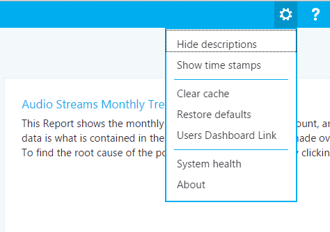

# Usar o painel de qualidade da chamada para o Skype for Business ServerUse Call Quality Dashboard for Skype for Business Server

**Resumo:** Saiba mais sobre como usar o painel de qualidade da chamada.**Summary:** Learn about how to use the Call Quality Dashboard. O painel de qualidade de chamada é uma ferramenta para o Skype for Business Server.Call Quality Dashboard is a tool for Skype for Business Server.

O painel de qualidade de chamada (CQD) permite que os profissionais de ti usem dados agregados para identificar problemas relacionados à criação de problemas de qualidade de mídia comparando estatísticas de grupos de usuários para identificar tendências e padrões.Call Quality Dashboard (CQD) allows IT Pros to use aggregate data to identify problems creating media quality issues by  comparing statistics for groups of users to identify trends and patterns. O CQD não se concentra em solucionar problemas de chamada individuais, mas para identificar problemas e soluções que se aplicam a muitos usuários.CQD is not focused on solving individual call issues, but on identifying problems and solutions that apply to many users.

## Guia do Usuário do Painel de Qualidade da ChamadaCall Quality Dashboard User Guide

O CQD é um portal da Web para criar e organizar relatórios rapidamente com base em dados de qualidade da experiência (QoE).CQD is a web portal for quickly creating and organizing reports based on Quality of Experience (QoE) data. O CQD implanta um cubo de SSAS para agregar os dados no banco de dados métricas de QoE e permite que os administradores criem e modifiquem relatórios ou façam investigações em tempo real.CQD deploys an SSAS cube to aggregate the data in the QoE Metrics database, and enables admins to create and modify reports or do investigations in real time. Embora seja possível usar o Excel para se conectar diretamente ao cubo, o portal é otimizado para diversos fluxos de trabalho que envolvem dados de QoE.While it is possible to use Excel to connect directly to the cube, the portal is optimized for several workflows involving QoE data. Os dados incluem:The data includes:

- Dados de relatório em cache para acesso rápidoCached report data for fast access
- Links profundo para páginas de relatório para compartilhamento e publicação de informaçõesDeep links to report pages for information sharing and publishing
- Edição e criação de relatórios otimizadas e metadados editáveis para descrições de relatórios.Streamlined report editing and creation, and editable metadata for report descriptions.

Além disso, CQD expõe APIs da Web que dão aos usuários acesso programático aos dados do cubo para uso em painéis personalizados.Also, CQD exposes web APIs that give users programmatic access to the cube data for use in custom dashboards.

### Visão geral do recursoFeature Overview

Ao visitar o painel de qualidade da chamada, você verá a seguinte tela:When you visit the Call Quality Dashboard, you see the following screen:

1. O "painel de resumo" é onde o contexto do "conjunto de relatórios" (à direita) pode ser encontrado.The "Summary Pane" is where context for the "Report Set" (to the right) can be found.
2. Clique em "Editar" na PaneReport de resumo para definir as propriedades de nível (incluindo a altura do eixo Y).Click "Edit" in the Summary PaneReport to set level properties (including Y-axis height).
3. O breadcrumb ajuda você a identificar sua localização atual na hierarquia de conjuntos de relatórios.The Breadcrumb helps you identify your current location within the report set hierarchy.
4. Os relatórios com sub-relatórios são exibidos com um link azul.Reports with subreports are shown with a blue link. Clique no link para fazer buscas detalhadas nos relatórios filho.Click the link to drill down to the child reports.

Mova o mouse sobre os gráficos de barras e linhas de tendências para mostrar valores detalhados.Move the mouse over the bar charts and trend lines to show detailed values. O relatório que tem o foco mostra o menu Ação: "Editar", "clonar", "excluir" e "download".The report that has focus shows the action menu: "Edit", "Clone", "Delete", and "Download".

### Relatórios PadrãoDefault Reports

Quando você acessa pela primeira vez o portal do painel de qualidade da chamada, um conjunto padrão de relatórios é criado automaticamente.When you first access the Call Quality Dashboard portal, a default set of reports is automatically created. Esses relatórios são, por vezes, chamados de relatórios do sistema.These reports are sometimes referred to as system reports. Você pode modificar ou excluir livremente esses relatórios ou estendê-los criando novos relatórios irmãos e filho.You are able to freely modify or delete these reports or extend them by creating new sibling and child reports.

No nível superior, o relatório "tendências mensais de fluxos de áudio" mostra a tendência mensal para todos os fluxos de áudio.At the top level, the "Audio Streams Monthly Trend" report shows the monthly trend for all audio streams. Mova o mouse sobre as barras em um gráfico de barras para mostrar um modo de exibição mais detalhado dos dados representados pelo gráfico de barras.Move the mouse over the bars in a bar chart to show a more detailed view of the data represented by the bar chart. Clique no título do relatório de tendências mensais de fluxos de áudio para navegar até o relatório "fluxos de áudio gerenciados vs não gerenciados", em que os relatórios são divididos entre chamadas gerenciadas e não gerenciadas.Click the title of the Audio Streams Monthly Trend report to navigate to the "Managed vs Unmanaged Audio Streams" report, where the reports are split between Managed and Unmanaged calls. As chamadas gerenciadas são aquelas feitas de dentro do firewall corporativo por conexões com fio.Managed calls are calls made from inside the corporate firewall over wired connections. As chamadas não gerenciadas incluem chamadas feitas de fora do firewall corporativo e todas as chamadas feitas por Wi-Fi.Unmanaged calls include calls made from outside the corporate firewall and all calls made over Wi-Fi.

O outro relatório de nível superior é chamado de histograma de classificação de qualidade de chamada reportado pelo usuário.The other top-level report is called the "User-reported Call Quality Rating Histogram." As classificações de qualidade da chamada são os números fornecidos pelos usuários do Skype for Business ao fim de uma chamada para indicar a qualidade da chamada.Call Quality Ratings are the numbers given by Skype for Business users at the end of a call to indicate the quality of the call. Os números de classificação variam de 1 a 5, 1 é o pior e 5 é o melhor.The rating numbers range from 1 to 5, 1 is the worst and 5 is the best. O histograma mostra o número de chamadas de áudio que tiveram a classificação indicada em um mês.The histogram shows the number of audio calls that had the indicated rating in one month.

Clique no título de qualquer um dos relatórios para navegar em relatórios com mais filtros nos dados.Click the title of any of the reports to navigate into reports with more filters on the data. Nos relatórios do sistema, cada relatório filho exibe um subconjunto dos dados disponíveis em seu relatório pai.In the system reports, each child report displays a subset of the data available in its parent report. O modelo de solução de problemas é simples: investigue qual subrelatório os dados ou a tendência em sugestão de um problema é refinado para e reduz gradualmente o espaço do problema.The problem-solving model is simple: investigate which subreport the data or trend suggesting a problem is confined to, and gradually narrow down the problem space. A capacidade de criar sub-relatórios permite que você investigue seus próprios palpites sobre a causa de tendências de dados específicas.The ability to create subreports allows you to investigate your own guesses about the cause of specific data trends.

### Criar e editar relatóriosCreate and Edit Reports

Clique em "Editar" no menu Ação de um relatório para ver o editor de relatórios.Click "Edit" in the action menu of a report to see the Report Editor. Cada relatório é respaldado por uma consulta no cubo.Each report is backed by a query into the cube. Um relatório é uma visualização dos dados retornados por sua consulta.A report is a visualization of the data returned by its query. O editor de relatórios ajuda você a editar essas consultas e as opções de exibição do relatório.The Report Editor helps you edit these queries and the display options of the report. Ao abrir o editor de relatórios, você verá:When you open the Report Editor, you  see:

1. Dimensões, medidas e filtros são escolhidos no painel esquerdo.Dimensions, measures, and filters are chosen in the left pane. Passe o mouse sobre um dos valores existentes para mostrar um botão "x" que permite que o valor seja removido.Hover over one of the existing values to show an "x" button that allows the value to be removed. Clique no botão "mais" ao lado de um título para abrir a caixa de diálogo onde você pode adicionar uma nova dimensão, medida ou filtro.Click the "plus" button next to a heading to open the dialog where you can add a new dimension, measure, or filter.
2. As opções para a personalização de gráficos são exibidas na parte superior.Options for chart customization are displayed at the top.
3. Uma visualização do relatório está disponível no Editor de Relatório. A preview of the report is available in the Report Editor.
4. Uma descrição de relatório detalhada pode ser criada com a caixa de edição na parte inferior.A detailed report description can be created with the edit box at the bottom.

### Minigráficos em tabelasSparklines in Tables

Quando StartDate.Month é adicionado como uma dimensão e os dados são processados como tendência na forma de tabela, gráficos de barras e minigráficos podem ser mostrados dentro das células da tabela.When StartDate.Month is added as a dimension and the data is rendered as a trend in table form, bar charts and sparklines can be shown inside the table cells. Mova o ponteiro do mouse sobre o gráfico de barras e os minigráficos para mostrar os valores de meses individuais.Move the mouse pointer over the bar chart and the sparklines to show the values for individual months.

Para que os gráficos de barras e os minigráficos sejam exibidos, a caixa de seleção "mostrar minigráficos" na parte superior do editor de relatório deve estar marcada.In order for the bar charts and the sparklines to appear, the "Show sparklines" checkbox at the top of the Report Editor must be checked. Isso seleciona a opção tendência e move o mês para baixo para ser a última dimensão, que também pode ser realizada clicando em mês e usando as setas para cima e para baixo para mover StartDate. mês para cima ou para baixo.This selects the Trend option and moves Month down to be the last dimension, which can also be accomplished by clicking on Month and using the up and down arrows to shift StartDate.Month up or down.

### ConfiguraçõesSettings

O menu configurações contém links para páginas úteis, como a saúde do sistema e sobre as páginas, e está localizado no canto superior direito do painel.The settings menu contains links to useful pages like the System Health and About pages, and is located in the top-right corner of the dashboard.

Se devem ser exibidas descrições e carimbos de data/hora em usuários individuais, essas configurações afetam somente a versão individual do painel e não modificam o conjunto de relatórios ou o que os outros usuários vêem.Whether to show descriptions and time stamps is up to individual users, and these settings only affect the individual's version of the dashboard, and do not modify the report set or what other users see. A limpeza do cache faz com que todas as consultas Recarreguem os dados do cubo, enquanto restaurar os padrões exclui todos os relatórios criados ou modificados pelo usuário e recria o conjunto de relatórios do sistema, o que o usuário veria ao entrar pela primeira vez.Clearing the cache causes all queries to reload their data from the cube, while restoring defaults deletes all of user-created or modified reports and recreates the system report set — what a user would see when they log in for the first time.

O Link do Painel de Usuários mostra uma página onde os usuários podem visualizar outros usuários do CQD e navegar em seus relatórios.The Users Dashboard Link shows a page where users can view other users of CQD and browse their reports. Para compartilhar um conjunto de relatórios, copie o link na barra de URL e compartilhe-o com outro usuário do CQD.To share a report set, copy the link in the URL bar and share it with another CQD user. Esse link é o mesmo link que outros usuários veriam na página do link do painel usuários sob o nome de usuário do usuário.This link is the same link other users would see in the Users Dashboard Link page under the user's username.

### Fornecer informações da sub-redeSupplying Subnet Information

Informações adicionais podem ser reveladas se informações específicas do site forem inseridas no banco de dados de arquivo para fornecer informações de mapeamento de sub-rede para construção (por exemplo, qualidade de chamada sem fio/sem fio criando).Additional information can be revealed if site-specific information is entered into the Archive database to provide subnet-to-building mapping information (for example, wired/wireless call quality by building).

No mínimo, conclua as seguintes tabelas para criar esses relatórios:At a minimum, complete the following tables to create these reports:

- CqdBuildingCqdBuilding
- CqdNetworkCqdNetwork

Informações adicionais podem ser fornecidas nas tabelas CqdBuildingType e CqdBuildingOwnershipType para permitir mais filtragem e busca detalhada. Additional information can be provided in CqdBuildingType and CqdBuildingOwnershipType tables to allow further filtering and drill-down.

Os dados usados para essas tabelas são definidos da seguinte maneira:The data used for these tables are defined as follows:

**CqdBuilding****CqdBuilding**

|ColunaColumn|Tipo de dadosData Type|Permitir Nulos?Allow Nulls?|DetalhesDetails|
|:-----|:-----|:-----|:-----|
|BuildingKeyBuildingKey |intint |NãoNo |Chave primária da tabela CqdBuilding.Primary key for the CqdBuilding table. |
|BuildingNameBuildingName |varchar(80)varchar(80) |NãoNo |Nome do edifício.Building name. |
|BuildingShortNameBuildingShortName |varchar(10)varchar(10) |NãoNo |Versão abreviada do nome do edifício.Shorter version of the Building name. |
|OwnershipTypeIdOwnershipTypeId |intint |NãoNo |Chave estrangeira corresponde a uma das entradas na tabela CqdBuildingOwners.Foreign key, matches one of the entries in the CqdBuildingOwners table. |
|BuildingTypeIdBuildingTypeId |intint |NãoNo |Chave estrangeira corresponde a uma das entradas na tabela CqdBuildingType.Foreign key, matches one of the entries in the CqdBuildingType table. |
|LiberdadeLatitude |floatfloat |SimYes |Latitude do edifício.Latitude of the building. |
|LongitudeLongitude |floatfloat |SimYes |Longitude do edifício.Longitude of the building. |
|CityNameCityName |varchar(30)varchar(30) |SimYes |Nome da cidade onde o edifício está localizado.City name where the building is located. |
|ZipCodeZipCode |varchar(25)varchar(25) |SimYes |CEP do local do edifício.Zip code where the building is located. |
|CountryShortCodeCountryShortCode |varchar(2)varchar(2) |SimYes |Códigos ISO 3166-1 alpha-2 do país onde o edifício está localizado.ISO 3166-1 alpha-2 codes for the country where the building is located. |
|StateProvinceCodeStateProvinceCode |varchar(3)varchar(3) |SimYes |Abreviação de três letras para o estado/província onde a construção está localizada.Three-letter abbreviation for the State/Province where the building is located. |
|InsideCorpInsideCorp |bitbit |SimYes |Bit indica se a construção faz parte da rede corporativa.Bit indicates whether the building is part of the corporate network. |
|BuildingOfficeTypeBuildingOfficeType |nvarchar(150)nvarchar(150) |SimYes |Descrição do tipo de escritório do edifício.Description of the building office type. |
|RegiãoRegion |varchar(25)varchar(25) |SimYes |Região onde o edifício está localizado.Region where the building is located. |
|||||

**CqdNetwork****CqdNetwork**

|ColunaColumn|Tipo de dadosData Type|Permitir Nulos?Allow Nulls?|DetalhesDetails|
|:-----|:-----|:-----|:-----|
|RedeNetwork |varchar(25)varchar(25) |NãoNo |Endereço da sub-rede.Subnet address. |
|NetworkRangeNetworkRange |tinyinttinyint |SimYes |Máscara de sub-rede.Subnet mask. |
|NetworkNameIDNetworkNameID |intint |SimYes |Mapeia opcionalmente para uma linha da tabela CqdNetworkName.Optionally maps to a row in CqdNetworkName table. |
|BuildingKeyBuildingKey |intint |SimYes |Chave estrangeira corresponde a uma das entradas na tabela CqdBuilding.Foreign key, matches one of the entries in the CqdBuilding table. |
|UpdatedDateUpdatedDate |datetimedatetime |NãoNo |Data e hora da última atualização da entrada.Datetime for when the entry was last updated. |
||||||

Por padrão, essa próxima tabela tem uma entrada (0, "desconhecido").By default this next table has one entry (0, 'Unknown').

**CqdBuildingType****CqdBuildingType**

|ColunaColumn|Tipo de dadosData Type|Permitir Nulos?Allow Nulls?|DetalhesDetails|
|:-----|:-----|:-----|:-----|
|BuildingTypeIdBuildingTypeId |intint |NãoNo |Chave primária da tabela CqdBuildingType.Primary key for the CqdBuildingType table. |
|BuildingTypeDescBuildingTypeDesc |char(18)char(18) |NãoNo |Descrição do tipo de edifício.Building type description. |
|||||

Por padrão, essa próxima tabela tem uma entrada (0, "desconhecido", 0, nulo).By default this next table has one entry (0, 'Unknown', 0, null).

**CqdBuildingOwnershipType****CqdBuildingOwnershipType**

|ColunaColumn|Tipo de dadosData Type|Permitir Nulos?Allow Nulls?|DetalhesDetails|
|:-----|:-----|:-----|:-----|
|OwnershipTypeIdOwnershipTypeId |intint |NãoNo |Chave primária da tabela CqdBuildingOwnershipType.Primary key for the CqdBuildingOwnershipType table. |
|OwnershipTypeDescOwnershipTypeDesc |varchar(25)varchar(25) |NãoNo |Descrição do tipo de propriedade.Ownership type description. |
|LeaseIndLeaseInd |tinyinttinyint |SimYes |Índice que faz referência a outra linha da tabela CqdBuildingOwnershipType, usada para identificar edifícios com concessão.Index referencing another row in the CqdBuildingOwnershipType table, used for identifying leased buildings. |
|ProprietárioOwner |varchar(50)varchar(50) |SimYes |Proprietário do edifício.Building owner. |
|||||

Por padrão, essa próxima tabela tem uma entrada (0, "desconhecido", 0, nulo).By default this next table has one entry (0, 'Unknown', 0, null).

**CqdBssid****CqdBssid**

|ColunaColumn|Tipo de dadosData Type|Permitir Nulos?Allow Nulls?|DetalhesDetails|
|:-----|:-----|:-----|:-----|
|bssbss |nvarchar(50)nvarchar(50) |NãoNo |Chave primária da tabela CqdBssid.Primary key for the CqdBssid table. É o BSSID do ponto de acesso WiFi.Is the BSSID of the WiFi Access Point. |
|essess |nvarchar(50)nvarchar(50) |SimYes |Informações do Controlador do Ponto de Acesso Wi-Fi.Wifi Access Point Controller information. |
|phyphy |nvarchar(50)nvarchar(50) |SimYes |Informações de phy.Phy information. |
|apap |nvarchar(50)nvarchar(50) |SimYes |Nome do Ponto de Acesso Wi-Fi.Wifi Access Point Name. |
|EdifícioBuilding |nvarchar(500)nvarchar(500) |SimYes |O nome da construção em que o ponto de acesso WiFi está localizado.The Building Name the WiFi Access Point is located in. |
||||

## Fluxos de CQDCQD Streams

Um fluxo de CQD é considerado bom, ruim ou não classificado.A CQD stream is considered good, poor, or unclassified. O CQM 1.5 agora usa a seguinte definição de CQD:CQM 1.5 now uses the following CQD definition:

- Um fluxo ruim é qualquer combinação de métricas de chamadas deficientes além do limite.A poor stream is any combination of the poor call metrics beyond threshold.
- Quando um fluxo em uma chamada é ruim, os dois fluxos da chamada são ruins.When one stream in a call is poor, both streams of the call are flagged poor. Em conferências, cada participante é contado como uma chamada exclusiva e é reportado de forma independente de todos os outros.In conferences, each participant is counted as a unique call and is reported on independently of all others.
- Fluxos não classificados são fluxos sem métricas de qualidade (ou seja, transações sintéticas ou chamadas curtas).Unclassified streams are streams without quality metrics (that is, Synthetic Transactions or short calls).
- Fluxos válidos = clientes não móveisValid Streams = non-mobile clients
- O classificador não pode ser modificadoClassifier cannot be modified

**Classificador/definição de chamada ruim****Poor call definition/classifier**

|MétricaMetric|LimiteThreshold|
|:-----|:-----|
|DegradationAvgDegradationAvg |Maior que 1,0 (-1 MOS de rede)Greater than 1.0 (-1 network MOS) |
|RoundTripRoundTrip |Maior que 500 Greater than 500 |
|PacketLossRatePacketLossRate |Maior do que 0,1 (10%)Greater than 0.1 (10%) |
|JitterInterArrivalJitterInterArrival |Maior que 30 Greater than 30 |
|RatioConcealedSamplesAvgRatioConcealedSamplesAvg |Maior do que 0, 7Greater than 0.07 |
|||

Definição de JPDR = Definição de chamada ruim menos RatioConcealedSamplesAvg JPDR definition = Poor call definition minus RatioConcealedSamplesAvg

## Onde está o Chamador/Autor da Chamada?Where is Caller/Callee?

O CQD não usa os campos Caller/Callee, em vez disso, ele usa "First" e "Second" porque há etapas intervenientes entre o chamador e o receptor.CQD doesn't use Caller/Callee fields, instead it uses "First" and "Second" because there are intervening steps between the caller and callee.

 **Primeira vez** Será sempre o ponto de extremidade do servidor (por exemplo, AV MCU ou servidor de mediação) se um servidor estiver envolvido no fluxo.**First** Will always be the Server endpoint (for example, AV MCU or Mediation Server) if a Server is involved in the stream.

 **Segundo** Será sempre o ponto de extremidade do Cliente, a menos que seja um fluxo Servidor–Servidor. **Second** Will always be the Client endpoint, unless it is a Server-Server stream.

**Exemplo de classificação Primeiro e Segundo****Example of First and Second classification**

|UAType do Ponto de Extremidade 1 Endpoint 1 UAType|UUAType do Ponto de Extremidade 2 Endpoint 2 UUAType|PrimeiroFirst|SegundoSecond|
|:-----|:-----|:-----|:-----|
|2 (AVMCU) 2 (AVMCU) |4 (Skype for Business) 4 (Skype for Business) |Ponto de Extremidade 1Endpoint 1 |Ponto de Extremidade 2Endpoint 2 |
|2 (AVMCU) 2 (AVMCU) |1 (mMediationServer) 1 (mMediationServer) |Ponto de Extremidade 2Endpoint 2 |Ponto de Extremidade 1Endpoint 1 |
|4 (Skype for Business)4 (Skype for Business) |4 (Skype for Business) 4 (Skype for Business) |O Chamador em MediaLine The Caller in MediaLine |O Autor da Chamada em MMediaLine The Callee in MMediaLine |
|||||

Se os dois pontos de extremidade forem do mesmo tipo, o CQD faz a entrada do chamador primeiro e o receptor do outro.If both endpoints are the same type, CQD makes the Caller entry First and the Callee Second. Para obter mais informações sobre nomes de ponto de extremidade, consulte [este blog](https://blogs.technet.com/b/jenstr/archive/2015/05/22/call-quality-dashboard-tips-and-tricks.aspx).For more information about endpoint names, see [this blog](https://blogs.technet.com/b/jenstr/archive/2015/05/22/call-quality-dashboard-tips-and-tricks.aspx).

## Justificar a VPNAccounting for VPN

Se a solução VPN for conhecida para definir precisamente o sinalizador de VPN, tudo estará definido.If VPN solution is known to accurately set VPN flag, you're all set. Caso contrário, use um dos seguintes métodos:Otherwise, use one of the following methods:

- Crie um Tipo de Rede chamado VPN (preferencial), depois Associe Sub-redes de VPN a esse novo NetworkType de VPN.Create a Network Type called VPN (preferred), then Associate VPN Subnets with this new VPN NetworkType.
- Crie um edifício chamado VPN, depois Associe Sub-redes de VPN a esse edifício. Create a building called VPN, then Associate VPN Subnets with this building.

## Fundamentos da consultaQuery Fundamentals

Uma consulta bem formada contém todos estes três parâmetros: A well-formed query contains all three of these parameters:

- MediçãoMeasurement
- DimensãoDimension
- FiltroFilter

Um exemplo de uma consulta bem formada seria "Mostrar-me Fluxos Ruins [Medição] por Sub-rede [Dimensão] para o Edifício 6 [Filtro]".An example of a well-formed query would be "Show me Poor Streams [Measurement] by Subnet [Dimension] for Building 6 [Filter]."

## O que UNION faz?What does UNION do?

O recurso Union permite que você filtre condições com o operador AND.Union allows you to filter conditions with the AND operator. Há cenários em que você pode combinar várias condições de filtro para obter um resultado semelhante a uma operação ou.There are scenarios where you can combine multiple Filter conditions together to achieve a result similar to an OR operation.

Exemplo: para obter todos os fluxos de um edifício, UNION fornece uma exibição distinta do DataSet mesclado.Example: To get all streams from a building, UNION provides a distinct view of the merged dataset. Para usar o parâmetro UNION, insira texto comum no campo UNION nas duas condições de filtro que você deseja unir.To use the UNION, insert common text into the UNION field on the two filter conditions you want to UNION.

## Divisão padrão dos relatóriosDefault Report Breakdown

Se a conexão Sem Fio é gerenciada internamente, você pode recriar os relatórios de conexão Sem Fio no bucket Gerenciado. If Wireless is managed internally, you can recreate the Wireless reports in the Managed bucket.

## Processos operacionaisOperational Processes

Revisar e corrigir os fluxos gerenciados primeiro.Review and remediate Managed Streams first. A qualidade nessa área deve ser de 100% dentro do seu controle e, portanto, mais fácil de corrigir.Quality in this area should be 100% within your control and therefore easiest to remediate.

### Fluxos Gerenciados Managed Streams

Examine e corrija os fluxos gerenciados na seguinte ordem: Review and remediate managed streams in the following order:

1. Servidor-Servidor Server-Server
2.  Servidor-Com Fio-DentroServer-Wired-Inside
3. Com Fio-Com Fio-Dentro Wired-Wired-Inside

### Fluxos Não GerenciadosUnmanaged Streams

Examine e corrija os fluxos não gerenciados na seguinte ordem: Review and remediate unmanaged streams in the following order:

1. Servidor-Wi-Fi-DentroServer-Wifi-Inside
2. Servidor-Com Fio-ForaServer-Wired-Outside
3. Servidor-Wi_Fi-ForaServer-Wifi-Outside
4. Com Fio-Fora-DiretoWired-Outside-Direct
5. Com Fio-Fora-RetransmissãoWired-Outside-Relay
6. Outros Não GerenciadosOther Unmanaged
