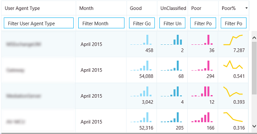
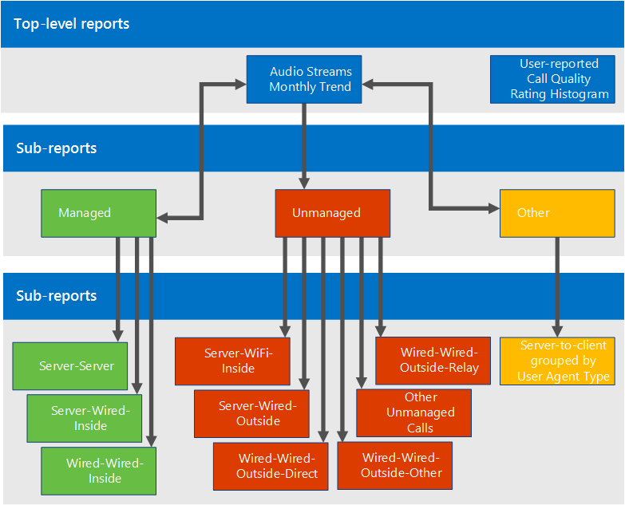

# Usar o Painel de Qualidade da Chamada para o Skype for Business Server

**Resumo:** Saiba mais sobre como usar o Painel de Qualidade da Chamada. O Painel de Qualidade da Chamada é uma ferramenta do Skype for Business Server.

O Painel de Qualidade da Chamada (CQD) permite que os profissionais de IT usem dados agregados para identificar problemas de criação de problemas de qualidade de mídia comparando estatísticas de grupos de usuários para identificar tendências e padrões. O CQD não se concentra na resolução de problemas de chamada individuais, mas na identificação de problemas e soluções que se aplicam a muitos usuários.

## Guia do usuário do Painel de Qualidade da Chamada

O CQD é um portal da Web para criar e organizar rapidamente relatórios com base nos dados de QoE (Qualidade da Experiência). O CQD implanta um cubo SSAS para agregar os dados no banco de dados de Métricas de QoE e permite aos administradores criar e modificar relatórios ou fazer investigações em tempo real. Embora seja possível usar o Excel para se conectar diretamente ao cubo, o portal é otimizado para vários fluxos de trabalho envolvendo dados de QoE. Os dados incluem:

- Dados de relatório armazenados em cache para acesso rápido
- Links profundos para relatar páginas para compartilhamento e publicação de informações
- Edição e criação de relatório simplificados e metadados editáveis para descrições de relatório.

Além disso, o CQD expõe APIs da Web que dão aos usuários acesso programático aos dados do cubo para uso em painéis personalizados.

### Visão geral dos Recursos

Ao visitar o Painel de Qualidade da Chamada, você verá a seguinte tela:

1. O "Painel de Resumo" é onde o contexto do "Conjunto de Relatório" (à direita) pode ser encontrado.
2. Clique em "Editar" no Painel de Resumo Para definir propriedades de nível (incluindo a altura do eixo Y).
3. A Breadcrumb ajuda a identificar sua localização atual dentro da hierarquia do conjunto de relatório.
4. Relatórios com sub-relatórios são mostrados com um link azul. Clique no link para fazer uma análise dos relatórios filho.

Mova o mouse sobre os gráficos de barras e linhas de tendência para mostrar valores detalhados. O relatório que tem o foco mostra o menu de ação: "Editar", "Clonar", "Excluir" e "Baixar".

### Relatórios padrão

Quando você acessa pela primeira vez o portal Painel de Qualidade da Chamada, um conjunto padrão de relatórios é criado automaticamente. Esses relatórios são, às vezes, chamados de relatórios do sistema. Você pode modificar ou excluir esses relatórios livremente ou estend-los criando novos relatórios irmão e filho.

No nível superior, o relatório "Tendência Mensal de Fluxos de Áudio" mostra a tendência mensal de todos os fluxos de áudio. Mova o mouse sobre as barras em um gráfico de barras para mostrar uma exibição mais detalhada dos dados representados pelo gráfico de barras. Clique no título do relatório tendência mensal de fluxos de áudio para navegar até o relatório "Fluxos de áudio gerenciados versus não gerenciados", onde os relatórios são divididos entre chamadas gerenciadas e não gerenciadas. Chamadas gerenciadas são chamadas feitas de dentro do firewall corporativo por conexões com fio. As chamadas não realizadas incluem chamadas feitas de fora do firewall corporativo e todas as chamadas feitas por Wi-Fi.

O outro relatório de nível superior é chamado de "Histograma de classificação de qualidade de chamada relatada pelo usuário". Classificações de Qualidade da Chamada são os números dados pelos usuários do Skype for Business no final de uma chamada para indicar a qualidade da chamada. Os números de classificação variam de 1 a 5, 1 é o pior e 5 é o melhor. O histograma mostra o número de chamadas de áudio que tiveram a classificação indicada em um mês.

Clique no título de qualquer um dos relatórios para navegar em relatórios com mais filtros nos dados. Nos relatórios do sistema, cada relatório filho exibe um subconjunto dos dados disponíveis em seu relatório pai. O modelo de solução de problemas é simples: investigar a qual sub-re-porte os dados ou tendências sugerem que um problema está confinado e restringir gradualmente o espaço do problema. A capacidade de criar sub-requisitos permite investigar suas próprias suposições sobre a causa das tendências de dados específicas.

### Criar e editar relatórios

Clique em "Editar" no menu de ação de um relatório para ver o Editor de Relatório. Cada relatório é respaldado por uma consulta no cubo. Um relatório é uma visualização dos dados retornados por sua consulta. O Editor de Relatório ajuda você a editar essas consultas e as opções de exibição do relatório. Ao abrir o Editor de Relatório, você verá:

1. Dimensões, medidas e filtros são escolhidos no painel esquerdo. Passe o mouse sobre um dos valores existentes para mostrar um botão "x" que permite que o valor seja removido. Clique no botão "mais" ao lado de um título para abrir a caixa de diálogo onde você pode adicionar uma nova dimensão, medida ou filtro.
2. As opções de personalização do gráfico são exibidas na parte superior.
3. Uma visualização do relatório está disponível no Editor de Relatório.
4. Uma descrição de relatório detalhada pode ser criada com a caixa de edição na parte inferior.

### Sparklines in Tables

Quando StartDate.Month é adicionado como uma dimensão e os dados são renderizados como uma tendência na forma de tabela, gráficos de barras e sparklines podem ser mostrados dentro das células da tabela. Mova o ponteiro do mouse sobre o gráfico de barras e os sparklines para mostrar os valores de meses individuais.

Para que os gráficos de barras e os sparklines apareçam, a caixa de seleção "Mostrar sparklines" na parte superior do Editor de Relatório deve ser marcada. Isso seleciona a opção Tendência e move Mês para baixo para ser a última dimensão, o que também pode ser feito clicando em Mês e usando as setas para cima e para baixo para deslocar StartDate.Month para cima ou para baixo.

### Configurações

O menu configurações contém links para páginas úteis, como as páginas Sobre e De Saúde do Sistema, e está localizado no canto superior direito do painel.

A exibição de descrições e carimbos de data/hora fica a cargo de usuários individuais, e essas configurações afetam apenas a versão do painel do indivíduo e não modificam o conjunto de relatório ou o que outros usuários veem. Limpar o cache faz com que todas as consultas recarregem seus dados do cubo, enquanto a restauração dos padrões exclui todos os relatórios criados ou modificados pelo usuário e recria o conjunto de relatórios do sistema — o que um usuário verá ao fazer logons pela primeira vez.

O Link do Painel de Usuários mostra uma página onde os usuários podem exibir outros usuários do CQD e procurar seus relatórios. Para compartilhar um conjunto de relatório, copie o link na barra de URL e compartilhe-o com outro usuário do CQD. Esse link é o mesmo link que outros usuários veriam na página Link do Painel de Usuários sob o nome de usuário do usuário.

### Fornecendo informações de sub-rede

Informações adicionais podem ser reveladas se informações específicas do site são inseridas no banco de dados arquivo morto para fornecer informações de mapeamento de sub-rede para construção (por exemplo, qualidade de chamada com fio/sem fio ao construir).

No mínimo, preencha as tabelas a seguir para criar esses relatórios:

- CqdBuilding
- CqdNetwork

Informações adicionais podem ser fornecidas nas tabelas CqdBuildingType e CqdBuildingOwnershipType para permitir mais filtragem e detalhamento.

Os dados usados para essas tabelas são definidos da seguinte forma:

**CqdBuilding**

|Coluna|Tipo de dados|Permitir Nulos?|Detalhes|
|:-----|:-----|:-----|:-----|
|BuildingKey |int |Não |Chave primária para a tabela CqdBuilding. |
|BuildingName |varchar(80) |Não |Nome do edifício. |
|BuildingShortName |varchar(10) |Não |Versão mais curta do nome do edifício. |
|OwnershipTypeId |int |Não |Chave estrangeira, corresponde a uma das entradas na tabela CqdBuildingOwners. |
|BuildingTypeId |int |Não |Chave estrangeira, corresponde a uma das entradas na tabela CqdBuildingType. |
|Latitude |flutuação |Sim |Latitude do edifício. |
|Longitude |flutuação |Sim |Longitude do edifício. |
|CityName |varchar(30) |Sim |Nome da cidade onde o edifício está localizado. |
|ZipCode |varchar(25) |Sim |CEP onde o edifício está localizado. |
|CountryShortCode |varchar(2) |Sim |Códigos ISO 3166-1 alpha-2 para o país onde o edifício está localizado. |
|StateProvinceCode |varchar(3) |Sim |Abreviação de três letras do estado/província onde o edifício está localizado. |
|InsideCorp |bit |Sim |Bit indica se o edifício faz parte da rede corporativa. |
|BuildingOfficeType |nvarchar(150) |Sim |Descrição do tipo de escritório do edifício. |
|Região |varchar(25) |Sim |Região onde o edifício está localizado. |
|||||

**CqdNetwork**

|Coluna|Tipo de dados|Permitir Nulos?|Detalhes|
|:-----|:-----|:-----|:-----|
|Rede |varchar(25) |Não |Endereço da sub-rede. |
|NetworkRange |tinyint |Sim |Máscara de sub-rede. |
|NetworkNameID |int |Sim |Opcionalmente, mapeia para uma linha na tabela CqdNetworkName. |
|BuildingKey |int |Sim |Chave estrangeira, corresponde a uma das entradas na tabela CqdBuilding. |
|UpdatedDate |datetime |Não |Data e hora da última atualização da entrada. |
||||||

Por padrão, esta tabela seguinte tem uma entrada (0, 'Unknown').

**CqdBuildingType**

|Coluna|Tipo de dados|Permitir Nulos?|Detalhes|
|:-----|:-----|:-----|:-----|
|BuildingTypeId |int |Não |Chave primária para a tabela CqdBuildingType. |
|BuildingTypeDesc |char(18) |Não |Descrição do tipo de construção. |
|||||

Por padrão, esta tabela seguinte tem uma entrada (0, 'Unknown', 0, null).

**CqdBuildingOwnershipType**

|Coluna|Tipo de dados|Permitir Nulos?|Detalhes|
|:-----|:-----|:-----|:-----|
|OwnershipTypeId |int |Não |Chave primária para a tabela CqdBuildingOwnershipType. |
|OwnershipTypeDesc |varchar(25) |Não |Descrição do tipo de propriedade. |
|LeaseInd |tinyint |Sim |Índice que se refere a outra linha na tabela CqdBuildingOwnershipType, usada para identificar edifícios arrendados. |
|Proprietário |varchar(50) |Sim |Proprietário do edifício. |
|||||

Por padrão, esta tabela seguinte tem uma entrada (0, 'Unknown', 0, null).

**CqdBssid**

|Coluna|Tipo de dados|Permitir Nulos?|Detalhes|
|:-----|:-----|:-----|:-----|
|bss |nvarchar (50) |Não |Chave primária para a tabela CqdBssid. É o BSSID do Ponto de Acesso WiFi. |
|ess |nvarchar (50) |Sim |Informações do Controlador de Ponto de Acesso Wi-Fi. |
|phy |nvarchar (50) |Sim |Informações de Phy. |
|ap |nvarchar (50) |Sim |Nome do Ponto de Acesso Wi-Fi. |
|Construção |nvarchar(500) |Sim |O Nome do Edifício em que o Ponto de Acesso WiFi está localizado. |
||||

## Fluxos CQD

Um fluxo do CQD é considerado bom, ruim ou não classificado. O CQM 1.5 agora usa a seguinte definição de CQD:

- Um fluxo ruim é qualquer combinação das métricas de chamada ruins além do limite.
- Quando um fluxo em uma chamada é ruim, ambos os fluxos da chamada são sinalizados como ruins. Em conferências, cada participante é contado como uma chamada exclusiva e é relatado independentemente de todos os outros.
- Fluxos não classificados são fluxos sem métricas de qualidade (ou seja, Transações Sintéticas ou chamadas curtas).
- Fluxos válidos = clientes não móveis
- O classificador não pode ser modificado

**Definição/classificador de chamada ruim**

|Indicador|Limite|
|:-----|:-----|
|DegradationAvg |Maior que 1,0 (-1 MOS de rede) |
|RoundTrip |Maior que 500 |
|PacketLossRate |Maior que 0,1 (10%) |
|JitterInterArrival |Maior que 30 |
|RatioConcealedSamplesAvg |Maior que 0,07 |
|||

Definição de JPDR = Definição de chamada ruim menos RatioConcealedSamplesAvg

## Onde está o chamador/chamador?

O CQD não usa campos chamador/chamador, em vez disso, usa "Primeiro" e "Segundo" porque há etapas intermediárias entre o chamador e o chamador.

 **Primeiro** Sempre será o ponto de extremidade do Servidor (por exemplo, AV MCU ou Servidor de Mediação) se um Servidor estiver envolvido no fluxo.

 **Segundo** Sempre será o ponto de extremidade cliente, a menos que seja um fluxo Server-Server cliente.

**Exemplo de classificação primeiro e segundo**

|Endpoint 1 UAType|Endpoint 2 UUAType|Primeiro|Segundo|
|:-----|:-----|:-----|:-----|
|2 (AVMCU) |4 (Skype for Business) |Ponto de extremidade 1 |Ponto de extremidade 2 |
|2 (AVMCU) |1 (mMediationServer) |Ponto de extremidade 2 |Ponto de extremidade 1 |
|4 (Skype for Business) |4 (Skype for Business) |O chamador no MediaLine |O chamado em MMediaLine |
|||||

Se ambos os pontos de extremidade são do mesmo tipo, o CQD torna a entrada do chamador primeiro e o segundo do chamador. Para obter mais informações sobre nomes de pontos de extremidade, consulte [este blog.](https://blogs.technet.com/b/jenstr/archive/2015/05/22/call-quality-dashboard-tips-and-tricks.aspx)

## Contabilização de VPN

Se a solução VPN for conhecida por definir com precisão o sinalizador VPN, tudo está definido. Caso contrário, use um dos seguintes métodos:

- Crie um tipo de rede chamado VPN (preferencial) e associe sub-redes VPN a esse novo NetworkType de VPN.
- Crie um edifício chamado VPN e, em seguida, associe sub-redes VPN a esse edifício.

## Conceitos básicos da consulta

Uma consulta bem formada contém todos esses três parâmetros:

- Medição
- Dimensão
- Filtrar

Um exemplo de uma consulta bem formada seria "Show me Poor Streams [Measurement] by Subnet [Dimension] for Building 6 [Filter]."

## O que o UNION faz?

A união permite filtrar condições com o operador AND. Há cenários em que você pode combinar várias condições de Filtro para obter um resultado semelhante a uma operação OR.

Exemplo: para obter todos os fluxos de um edifício, UNION fornece uma exibição distinta do conjuntos de dados mesclados. Para usar UNION, insira texto comum no campo UNION nas duas condições de filtro que você deseja UNION.

## Detalhamento de Relatório Padrão

Se a rede sem fio for gerenciada internamente, você poderá recriar os relatórios sem fio no bucket Gerenciado.

## Processos operacionais

Revise e remediar fluxos gerenciados primeiro. A qualidade nessa área deve estar 100% dentro do seu controle e, portanto, mais fácil de remediar.

### Fluxos gerenciados

Revise e remediar fluxos gerenciados na seguinte ordem:

1. Server-Server
2. Server-Wired-Inside
3. Wired-Wired-Inside

### Fluxos nãomanageados

Revise e remedia fluxos nãomanagedos na seguinte ordem:

1. Server-Wifi-Inside
2. Server-Wired-Outside
3. Server-Wifi-Outside
4. Com fio -Outside-Direct
5. Com fio-fora-retransmissão
6. Outros não-managed
