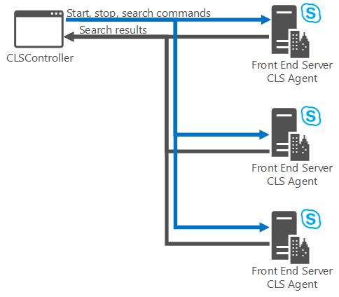

# <a name="centralized-logging-service-in-skype-for-business-2015"></a><span data-ttu-id="bed86-103">Serviço centralizado de registro em log no Skype for Business 2015</span><span class="sxs-lookup"><span data-stu-id="bed86-103">Centralized Logging Service in Skype for Business 2015</span></span>
 
<span data-ttu-id="bed86-104">**Resumo:** Saiba mais sobre os componentes de serviço e definições de configuração para o serviço de registro em log centralizado no Skype para Business Server 2015.</span><span class="sxs-lookup"><span data-stu-id="bed86-104">**Summary:** Learn about the service components and configuration settings for the Centralized Logging Service in Skype for Business Server 2015.</span></span>
  
<span data-ttu-id="bed86-105">The Centralized Logging Service pode:</span><span class="sxs-lookup"><span data-stu-id="bed86-105">The Centralized Logging Service can:</span></span> 
  
- <span data-ttu-id="bed86-106">Iniciar ou parar o login em um ou mais computadores e pools com um único comando de um local central.</span><span class="sxs-lookup"><span data-stu-id="bed86-106">Start or stop logging on one or more computers and pools with a single command from a central location.</span></span>
    
- <span data-ttu-id="bed86-107">Pesquisar logs em um ou mais computadores e pools.</span><span class="sxs-lookup"><span data-stu-id="bed86-107">Search logs on one or more computers and pools.</span></span> <span data-ttu-id="bed86-108">Você pode ajustar a pesquisa para retornar todos os logs em todas as máquinas ou retornar resultados mais concisos.</span><span class="sxs-lookup"><span data-stu-id="bed86-108">You can tailor the search to return all logs on all machines, or return more concise results.</span></span>
    
- <span data-ttu-id="bed86-109">Configurar as sessões de registro em log conforme segue:</span><span class="sxs-lookup"><span data-stu-id="bed86-109">Configure logging sessions as follows:</span></span>
    
  - <span data-ttu-id="bed86-110">Definir um **Cenário** ou usar um cenário padrão.</span><span class="sxs-lookup"><span data-stu-id="bed86-110">Define a **Scenario**, or use a default scenario.</span></span> <span data-ttu-id="bed86-111">Um cenário Centralized Logging Service é formado pelo escopo (global ou site), um nome de cenário para identificar a finalidade do cenário e um ou mais provedores.</span><span class="sxs-lookup"><span data-stu-id="bed86-111">A scenario in Centralized Logging Service is made up of scope (global or site), a scenario name to identify the purpose of the scenario, and one or more providers.</span></span> <span data-ttu-id="bed86-112">Em um computador, você pode executar o cenário padrão e um cenário definido em um determinado momento.</span><span class="sxs-lookup"><span data-stu-id="bed86-112">You can run the default scenario and one defined scenario at any given time on a computer.</span></span>
    
  - <span data-ttu-id="bed86-113">Usar um provedor local ou criar um novo provedor.</span><span class="sxs-lookup"><span data-stu-id="bed86-113">Use an existing provider or create a new provider.</span></span> <span data-ttu-id="bed86-114">Aprovider define o que a sessão de log coleta, qual nível de detalhamento, quais componentes de rastreamento e os sinalizadores são aplicados.</span><span class="sxs-lookup"><span data-stu-id="bed86-114">Aprovider defines what the logging session collects, what level of detail, what components to trace, and what flags are applied.</span></span>
    
    > [!TIP]
    >  <span data-ttu-id="bed86-115">Se você está familiarizado com OCSLogger, o termproviders refere-se à coleção de **componentes** (por exemplo, S4, SIPStack), um **tipo de log** (por exemplo, /logfile WPP, o log de eventos ou o IIS), um **nível de rastreamento** (por exemplo, All, verbose, debug) e os **sinalizadores** (por exemplo, TF_COMPONENT, TF_DIAG).</span><span class="sxs-lookup"><span data-stu-id="bed86-115">If you are familiar with OCSLogger, the termproviders refers to the collection of **components** (for example, S4, SIPStack), a **logging type** (for example, WPP, EventLog, or IIS logfile), a **tracing level** (for example, All, verbose, debug), and **flags** (for example, TF_COMPONENT, TF_DIAG).</span></span> <span data-ttu-id="bed86-116">Estes itens são definidos no provedor (uma variável com o Windows PowerShell) e passados para o comando Centralized Logging Service.</span><span class="sxs-lookup"><span data-stu-id="bed86-116">These items are defined in the provider (a Windows PowerShell variable) and passed into the Centralized Logging Service command.</span></span>
  
  - <span data-ttu-id="bed86-117">Configure logs para computadores específicos e pools.</span><span class="sxs-lookup"><span data-stu-id="bed86-117">Configure logs for specific computers and pools.</span></span>
    
  - <span data-ttu-id="bed86-118">Definir o escopo da sessão de registro em log nas opções **Site** (executa capturas de registro em log em computadores somente naquele local) ou **Global** (executa capturas de registro log em todos os computadores da implantação).</span><span class="sxs-lookup"><span data-stu-id="bed86-118">Define the scope for the logging session from the options **Site** (to run logging captures on computers in that site only), or **Global** (to run logging captures on all computers in the deployment).</span></span>
    
<span data-ttu-id="bed86-119">The Centralized Logging Service é uma poderosa ferramenta de solução de problemas para problemas grandes ou pequenos, da análise de causa raiz para problemas de desempenho.</span><span class="sxs-lookup"><span data-stu-id="bed86-119">The Centralized Logging Service is a powerful troubleshooting tool for problems large or small, from root cause analysis to performance problems.</span></span> <span data-ttu-id="bed86-120">Todos os exemplos são mostrados usando o Skype para Business Server Management Shell.</span><span class="sxs-lookup"><span data-stu-id="bed86-120">All examples are shown using the Skype for Business Server Management Shell.</span></span> <span data-ttu-id="bed86-121">Ajuda é fornecida para a ferramenta de linha de comando através da própria ferramenta, mas há um conjunto limitado de funções que você pode executar a partir da linha de comando.</span><span class="sxs-lookup"><span data-stu-id="bed86-121">Help is provided for the command-line tool through the tool itself, but there is a limited set of functions that you can execute from the command line.</span></span> <span data-ttu-id="bed86-122">Usando o Skype do Shell de gerenciamento do servidor de negócios, você tem acesso a um conjunto muito maior e muito mais configurável de recursos, que deve ser sempre sua primeira opção.</span><span class="sxs-lookup"><span data-stu-id="bed86-122">By using Skype for Business Server Management Shell, you have access to a much larger and much more configurable set of features, so that should always be your first choice.</span></span> 
  
## <a name="logging-service-components"></a><span data-ttu-id="bed86-123">Componente de serviço de registro em log</span><span class="sxs-lookup"><span data-stu-id="bed86-123">Logging service components</span></span>

 <span data-ttu-id="bed86-124">The Centralized Logging Service é executado em todos os servidores em sua implantação e é formada pelos agentes e serviços a seguir:</span><span class="sxs-lookup"><span data-stu-id="bed86-124">The Centralized Logging Service runs on all servers in your deployment, and is made up of the following agents and services:</span></span>
  
- <span data-ttu-id="bed86-125">Centralizado log serviço agente com o ClsAgent é executado em cada máquina com Skype para Business Server implantado.</span><span class="sxs-lookup"><span data-stu-id="bed86-125">Centralized Logging Service Agent ClsAgent runs on every machine with Skype for Business Server deployed.</span></span> <span data-ttu-id="bed86-126">Ele escuta (portas **TCP 50001-50003**) para os comandos do ClsController por meio do WCF e envia respostas de volta para o controlador.</span><span class="sxs-lookup"><span data-stu-id="bed86-126">It listens ( on ports **TCP 50001-50003**) for commands from ClsController over WCF and sends responses back to the controller.</span></span> <span data-ttu-id="bed86-127">Ele gerencia as sessões de log (Iniciar/Parar/atualizar) e logs de pesquisa.</span><span class="sxs-lookup"><span data-stu-id="bed86-127">It manages log sessions (start/stop/update), and searches logs.</span></span> <span data-ttu-id="bed86-128">Ele também desempenha operações de governança como limpeza e arquivamento de log.</span><span class="sxs-lookup"><span data-stu-id="bed86-128">It also performs housekeeping operations like log archiving and purges.</span></span> 
    
- <span data-ttu-id="bed86-129">Centralizado log serviço controlador Cmdlets o Skype do Shell de gerenciamento do servidor de negócios envia comandos Iniciar, parar, Flush e pesquisa o com o clsagent.</span><span class="sxs-lookup"><span data-stu-id="bed86-129">Centralized Logging Service Controller Cmdlets The Skype for Business Server Management Shell sends Start, Stop, Flush, and Search commands to the ClsAgent.</span></span> <span data-ttu-id="bed86-130">Quando comandos de pesquisa são enviados, os logs resultantes são retornados ao ClsControllerLib.dll e agregados.</span><span class="sxs-lookup"><span data-stu-id="bed86-130">When search commands are sent, the resulting logs are returned to the ClsControllerLib.dll and aggregated.</span></span> <span data-ttu-id="bed86-131">O controlador envia comandos para o agente, recebe o status desses comandos e gerencia os dados do arquivo de log de pesquisa à medida que eles são retornados de todos os agentes em qualquer computador no escopo da pesquisa, e agrega os dados do log em um conjunto ordenado de saída e significativa.</span><span class="sxs-lookup"><span data-stu-id="bed86-131">The controller sends commands to the agent, receives the status of those commands and manages the search log file data as it is returned from all agents on any computer in the search scope, and aggregates the log data into a meaningful and ordered output set.</span></span> <span data-ttu-id="bed86-132">As informações nos tópicos a seguir se concentra em usando o Skype para Business Server Management Shell.</span><span class="sxs-lookup"><span data-stu-id="bed86-132">The information in the following topics is focused on using the Skype for Business Server Management Shell.</span></span>
    
<span data-ttu-id="bed86-133">**Comunicações do ClsController com o ClsAgent**</span><span class="sxs-lookup"><span data-stu-id="bed86-133">**ClsController communications to ClsAgent**</span></span>


  
<span data-ttu-id="bed86-135">Executar comandos usando a interface de linha de comando do Windows Server ou usando o Skype do Shell de gerenciamento do servidor de negócios.</span><span class="sxs-lookup"><span data-stu-id="bed86-135">You issue commands using the Windows Server command-line interface or using the Skype for Business Server Management Shell.</span></span> <span data-ttu-id="bed86-136">Os comandos são executados no computador que você fez logon e enviados ao ClsAgent localmente, ou para outros computadores e pools em sua implantação.</span><span class="sxs-lookup"><span data-stu-id="bed86-136">The commands are executed on the computer you are logged in to and sent to the ClsAgent locally or to the other computers and pools in your deployment.</span></span>
  
<span data-ttu-id="bed86-137">O ClsAgent mantém um arquivo de índice de todos os arquivos .CACHE que ele tem na máquina local.</span><span class="sxs-lookup"><span data-stu-id="bed86-137">ClsAgent maintains an index file of all .CACHE files that it has on the local machine.</span></span> <span data-ttu-id="bed86-138">O ClsAgent os aloca de forma que fiquem distribuídos uniformemente nos volumes definidos na opção CacheFileLocalFolders, nunca consumindo mais de 80% de cada volume (isto é, o local do cache local e a porcentagem são configuráveis usando o cmdlet **Set-CsClsConfiguration**).</span><span class="sxs-lookup"><span data-stu-id="bed86-138">ClsAgent allocates them so that they are evenly distributed across volumes defined by the option CacheFileLocalFolders, never consuming more than 80% of each volume (that is, the local cache location and the percentage is configurable using the **Set-CsClsConfiguration** cmdlet).</span></span> <span data-ttu-id="bed86-139">O ClsAgent é responsável também por expirar arquivos de log de rastreamento de eventos antigos no cache (.etl) para fora da máquina local.</span><span class="sxs-lookup"><span data-stu-id="bed86-139">ClsAgent is also responsible for aging old cached event trace log (.etl) files off the local machine.</span></span> <span data-ttu-id="bed86-140">Após duas semanas (isto é, o cronograma configurável usando o cmdlet **Set-CsClsConfiguration**, esses arquivos são copiados para um compartilhamento de arquivos e excluído do computador local.</span><span class="sxs-lookup"><span data-stu-id="bed86-140">After two weeks (that is, the timeframe is configurable using the **Set-CsClsConfiguration** cmdlet) these files are copied to a file share and deleted from the local computer.</span></span> <span data-ttu-id="bed86-141">Para obter detalhes, consulte [Set-CsClsConfiguration](https://docs.microsoft.com/powershell/module/skype/set-csclsconfiguration?view=skype-ps).</span><span class="sxs-lookup"><span data-stu-id="bed86-141">For details, see [Set-CsClsConfiguration](https://docs.microsoft.com/powershell/module/skype/set-csclsconfiguration?view=skype-ps).</span></span> <span data-ttu-id="bed86-142">Quando uma solicitação de pesquisa é recebida, os critérios de pesquisa são usados para selecionar o conjunto de arquivos .etl em cache para fazer a pesquisa baseada nos valores no índice mantido pelo agente.</span><span class="sxs-lookup"><span data-stu-id="bed86-142">When a search request is received, the search criteria is used to select the set of cached .etl files to perform the search based on the values in the index maintained by the agent.</span></span>
  
> [!NOTE]
> <span data-ttu-id="bed86-p110">Arquivos que são movidos do computador local para o compartilhamento de arquivos podem ser pesquisados pelo ClsAgent. Assim que o ClsAgent move os arquivos para o compartilhamento de arquivos, a expiração e remoção de arquivos não são mantidas pelo ClsAgent. Você deve definir uma tarefa administrativa para monitorar o tamanho dos arquivos no compartilhamento de arquivos e excluí-los ou arquivá-los.</span><span class="sxs-lookup"><span data-stu-id="bed86-p110">Files that are moved to the file share from the local computer can be searched by ClsAgent. Once ClsAgent moves the files to the file share, the aging and removal of files is not maintained by ClsAgent. You should define an administrative task to monitor the size of the files in the file share and delete them or archive them.</span></span> 
  
<span data-ttu-id="bed86-146">Os arquivos de log resultantes podem ser lidos e analisados usando várias ferramentas, incluindo **Snooper.exe** e qualquer ferramenta que possa ler um arquivo de texto, como **Notepad.exe**.</span><span class="sxs-lookup"><span data-stu-id="bed86-146">The resulting log files can be read and analyzed using a variety of tools, including **Snooper.exe** and any tool that can read a text file, such as **Notepad.exe**.</span></span> <span data-ttu-id="bed86-147">Snooper.exe faz parte do Skype para as ferramentas de depuração do Business Server 2015 e está disponível como um [download da Web](https://go.microsoft.com/fwlink/p/?LinkId=285257).</span><span class="sxs-lookup"><span data-stu-id="bed86-147">Snooper.exe is part of the Skype for Business Server 2015 Debug Tools and is available as a [Web download](https://go.microsoft.com/fwlink/p/?LinkId=285257).</span></span>
  
<span data-ttu-id="bed86-148">Como OCSLogger, the Centralized Logging Service tem vários componentes de rastreamento contra e fornece opções para selecionar os sinalizadores, como TF_COMPONENT e TF_DIAG.</span><span class="sxs-lookup"><span data-stu-id="bed86-148">Like OCSLogger, the Centralized Logging Service has several components to trace against, and provides options to select flags, such as TF_COMPONENT and TF_DIAG.</span></span> <span data-ttu-id="bed86-149">Serviço de registro em log centralizado também mantém as opções de nível de log de OCSLogger.</span><span class="sxs-lookup"><span data-stu-id="bed86-149">Centralized Logging Service also retains the logging level options of OCSLogger.</span></span>
  
<span data-ttu-id="bed86-150">Usando o Skype do Shell de gerenciamento do servidor de negócios sobre a linha de comando ClsController a vantagem mais importante é que você pode configurar e definir novos cenários usando provedores selecionados que visam o espaço do problema, sinalizadores personalizados e os níveis de log.</span><span class="sxs-lookup"><span data-stu-id="bed86-150">The most important advantage to using the Skype for Business Server Management Shell over the command-line ClsController is that you can configure and define new scenarios using selected providers that target the problem space, custom flags, and logging levels.</span></span> <span data-ttu-id="bed86-151">Os cenários disponíveis no ClsController são limitados àqueles definidos pelo executável.</span><span class="sxs-lookup"><span data-stu-id="bed86-151">The scenarios available to ClsController are limited to those that are defined for the executable.</span></span>
  
<span data-ttu-id="bed86-p114">Nas versões anteriores, o OCSLogger.exe era fornecido para permitir que os administradores e equipe de suporte coletassem arquivos de rastreamento de computadores na implantação. O OCSLogger, apesar de todos seus pontos fortes, tinha um problema. Você podia apenas coletar logs em um computador, em um dado momento. Você podia fazer logon em vários computadores usando cópias separadas do OCSLogger, mas terminava com vários logs e sem uma maneira fácil de agregar os resultados.</span><span class="sxs-lookup"><span data-stu-id="bed86-p114">In previous versions, OCSLogger.exe was provided to enable administrators and support personnel to collect trace files from computers in the deployment. OCSLogger, for all of its strengths, had a shortcoming. You could only collect logs on one computer at a given time. You could log on to multiple computers by using separate copies of OCSLogger, but you ended up with multiple logs and no easy way to aggregate the results.</span></span>
  
<span data-ttu-id="bed86-p115">Quando um usuário solicita uma pesquisa de log, o ClsController determina quais máquinas devem receber as solicitações (isto é, baseado nos cenários selecionados). Ele também determina se a pesquisa precisa ser enviada ao compartilhamento de arquivos quando os arquivos .etl salvos forem localizados. Quando os resultados da pesquisa retornam ao ClsController, o controlador funde os resultados em um único conjunto de resultados ordenado pelo horário, que é apresentado ao usuário. Os usuários podem salvar os resultados da pesquisa em sua máquina local para análises posteriores.</span><span class="sxs-lookup"><span data-stu-id="bed86-p115">When a user requests a log search, the ClsController determines which machines to send the request to (that is, based on the scenarios selected). It also determines whether the search needs to be sent to the file share where the saved .etl files are located. When the search results are returned to the ClsController, the controller merges the results into a single time-ordered result set that is presented to the user. Users can save the search results to their local machine for further analysis.</span></span>
  
<span data-ttu-id="bed86-p116">Ao iniciar uma sessão de log, você especifica cenários que são relativos ao problema que está tentando resolver. Você pode ter dois cenários sendo executados a qualquer momento. Um desses cenários deve ser o cenário AlwaysOn (sempre ativado). Como o nome implica, ele deve estar sempre sendo executado em sua implantação, coletando informações em todos os computadores, pools e componentes.</span><span class="sxs-lookup"><span data-stu-id="bed86-p116">When you start a logging session, you specify scenarios that are relative to the problem that you are trying to resolve. You can have two scenarios running at any time. One of these two scenarios should be the AlwaysOn scenario. As the name implies, it should always be running in your deployment, collecting information on all computers, pools, and components.</span></span>
  
> [!IMPORTANT]
> <span data-ttu-id="bed86-164">Por padrão, o cenário AlwaysOn não está em execução em sua implantação.</span><span class="sxs-lookup"><span data-stu-id="bed86-164">By default, the AlwaysOn scenario is not running in your deployment.</span></span> <span data-ttu-id="bed86-165">É necessário iniciar explicitamente o cenário.</span><span class="sxs-lookup"><span data-stu-id="bed86-165">You must explicitly start the scenario.</span></span> <span data-ttu-id="bed86-166">Assim que for iniciado, ele continuará sendo executado até que seja interrompido explicitamente, e o estado de execução persistirá nas reinicializações dos computadores.</span><span class="sxs-lookup"><span data-stu-id="bed86-166">Once started, it will continue to run until explicitly stopped, and the running state will persist through reboots of the computers.</span></span> <span data-ttu-id="bed86-167">Para obter detalhes sobre Iniciando e interrompendo cenários, consulte [Iniciar ou Parar captura de log CLS no Skype para Business Server 2015](start-or-stop-log-capture.md).</span><span class="sxs-lookup"><span data-stu-id="bed86-167">For details on starting and stopping scenarios, see [Start or stop CLS log capture in Skype for Business Server 2015](start-or-stop-log-capture.md).</span></span> 
  
<span data-ttu-id="bed86-p118">Quando ocorrer um problema, inicie um segundo cenário que está relacionado ao problema relatado. Reproduza o problema e interrompa o log para o segundo cenário. Inicie suas pesquisas de log relativas ao problema relatado. A coleção agregada de logs produz um arquivo de log que contém mensagens de rastreamento de todos os computadores em seu site ou escopo global de sua implantação. Se a pesquisa retornar mais dados que você possa analisar (geralmente conhecido como razão sinal-ruído, onde o ruído é muito alto), execute outra pesquisa com parâmetros mais restritos. Neste ponto, você pode começar a notar padrões que são exibidos e que podem ajudar a obter um foco mais claro do problema. Finalmente, após realizar algumas pesquisas refinadas, você poderá encontrar dados que sejam relevantes ao problema e descobrir a causa.</span><span class="sxs-lookup"><span data-stu-id="bed86-p118">When a problem occurs, start a second scenario that relates to the problem reported. Reproduce the problem, and stop the logging for the second scenario. Begin your log searches relative to the problem reported. The aggregated collection of logs produces a log file that contains trace messages from all computers in your site or global scope of your deployment. If the search returns more data than you can feasibly analyze (typically known as a signal-to-noise ratio, where the noise is too high), you run another search with narrower parameters. At this point, you can begin to notice patterns that show up and can help you get a clearer focus on the problem. Ultimately, after you perform a couple of refined searches you can find data that is relevant to the problem and figure out the root cause.</span></span>
  
> [!TIP]
> <span data-ttu-id="bed86-175">Quando for apresentado um cenário de problema em Skype para Business Server, comece perguntando-se a "O que eu já sabe sobre o problema?"</span><span class="sxs-lookup"><span data-stu-id="bed86-175">When presented with a problem scenario in Skype for Business Server, start by asking yourself "What do I already know about the problem?"</span></span> <span data-ttu-id="bed86-176">Se você quantificam os limites de problema, você poderá eliminar uma grande parte das entidades operacionais em Skype para Business Server.</span><span class="sxs-lookup"><span data-stu-id="bed86-176">If you quantify the problem boundaries, you can eliminate a large part of the operational entities in Skype for Business Server.</span></span> 
  
<span data-ttu-id="bed86-177">Considere um exemplo de cenário no qual você sabe que os usuários não estão recebendo resultados atualizados ao procurar por um contato.</span><span class="sxs-lookup"><span data-stu-id="bed86-177">Consider an example scenario where you know that users are not getting current results when looking for a contact.</span></span> <span data-ttu-id="bed86-178">Não há nenhum ponto em busca de problemas em um número de outros componentes, Enterprise Voice, conferência e os componentes de mídia.</span><span class="sxs-lookup"><span data-stu-id="bed86-178">There is no point in looking for problems in the media components, Enterprise Voice, conferencing, and a number of other components.</span></span> <span data-ttu-id="bed86-179">Você pode não saber onde está realmente o problema: no cliente, ou é um problema no lado dos servidor?</span><span class="sxs-lookup"><span data-stu-id="bed86-179">What you may not know is where the problem actually is: on the client, or is this a server-side problem?</span></span> <span data-ttu-id="bed86-180">Contatos são coletados do Active Directory pelo replicador de usuários e entregue ao cliente por meio do servidor de catálogo de endereços (ABServer).</span><span class="sxs-lookup"><span data-stu-id="bed86-180">Contacts are collected from Active Directory by the User Replicator and delivered to the client by way of the Address Book Server (ABServer).</span></span> <span data-ttu-id="bed86-181">O ABServer obtém suas atualizações do banco de dados RTC (onde User Replicator escreveu-los) e reúne-los em arquivos do catálogo de endereços, por padrão - 1:30 AM.</span><span class="sxs-lookup"><span data-stu-id="bed86-181">The ABServer gets its updates from the RTC database (where User Replicator wrote them) and collects them into address book files, by default - 1:30 AM.</span></span> <span data-ttu-id="bed86-182">O Skype para clientes Business Server recuperar o novo catálogo de endereços em um agendamento aleatório.</span><span class="sxs-lookup"><span data-stu-id="bed86-182">The Skype for Business Server clients retrieve the new address book on a randomized schedule.</span></span> <span data-ttu-id="bed86-183">Porque você sabe como funciona o processo, você pode reduzir sua pesquisa para a causa potencial para uma questão relacionada à dados coletados pelo replicador de usuários, o ABServer não recuperar e criando os arquivos do catálogo de endereços ou os clientes não do Active Directory Baixando o arquivo do catálogo de endereços.</span><span class="sxs-lookup"><span data-stu-id="bed86-183">Because you know how the process works, you can reduce your search for the potential cause to an issue related to data being collected from Active Directory by the User Replicator, the ABServer not retrieving and creating the address book files, or the clients not downloading the address book file.</span></span>
  
## <a name="current-configuration"></a><span data-ttu-id="bed86-184">Configuração atual</span><span class="sxs-lookup"><span data-stu-id="bed86-184">Current configuration</span></span>

<span data-ttu-id="bed86-185">The Centralized Logging Service está configurado para definir o que é o serviço de log foi projetado para coletar, como ele coleta, onde ele coletará da e quais são as configurações de log.</span><span class="sxs-lookup"><span data-stu-id="bed86-185">The Centralized Logging Service is configured to define what the logging service is intended to collect, how it collects, where it will collect from, and what the log settings are.</span></span> <span data-ttu-id="bed86-186">Você define essas configurações globalmente (ou seja, para toda a implantação) ou para um site (ou seja, um site nomeado em sua implantação).</span><span class="sxs-lookup"><span data-stu-id="bed86-186">You define these settings globally (that is, for the entire deployment) or for a site (that is, a named site in your deployment).</span></span> <span data-ttu-id="bed86-187">Qualquer log que você define usará as configurações que são apropriadas para a identidade que você usa para comandos para iniciar, interromper, liberar e logs de pesquisa.</span><span class="sxs-lookup"><span data-stu-id="bed86-187">Any logging that you define will use the settings that are appropriate for the identity that you use for commands to start, stop, flush, and search logs.</span></span>
  
### <a name="to-display-the-current-centralized-logging-service-configuration"></a><span data-ttu-id="bed86-188">Para exibir a configuração atual do Centralized Logging Service</span><span class="sxs-lookup"><span data-stu-id="bed86-188">To display the current Centralized Logging Service configuration</span></span>

1. <span data-ttu-id="bed86-189">Inicie o Shell de Gerenciamento do Skype for Business Server: clique em **Iniciar**, em **Todos os Programas**, em **Skype for Business 2015** e em **Shell de Gerenciamento do Skype for Business Server**.</span><span class="sxs-lookup"><span data-stu-id="bed86-189">Start the Skype for Business Server Management Shell: Click **Start**, click **All Programs**, click **Skype for Business 2015**, and then click **Skype for Business Server Management Shell**.</span></span>
    
2. <span data-ttu-id="bed86-190">Digite o seguinte em uma linha de comando do prompt:</span><span class="sxs-lookup"><span data-stu-id="bed86-190">Type the following at a command-line prompt:</span></span>
    
   ```
   Get-CsClsConfiguration
   ```

    > [!TIP]
    > <span data-ttu-id="bed86-191">Você pode reduzir ou expandir o escopo das definições de configuração que são retornados definindo `-Identity` e um escopo, como "Site: Redmond", para retornar apenas o CsClsConfiguration para o site Redmond.</span><span class="sxs-lookup"><span data-stu-id="bed86-191">You can narrow or expand the scope of the configuration settings that are returned by defining  `-Identity` and a scope, such as "Site:Redmond" to return only the CsClsConfiguration for the site Redmond.</span></span> <span data-ttu-id="bed86-192">Se você deseja obter informações detalhadas sobre uma determinada parte da configuração, você pode canalizar a saída em outro cmdlet do Windows PowerShell.</span><span class="sxs-lookup"><span data-stu-id="bed86-192">If you want details about a given portion of the configuration, you can pipe the output into another Windows PowerShell cmdlet.</span></span> <span data-ttu-id="bed86-193">Por exemplo, para obter detalhes sobre os cenários definidos na configuração para o site "Redmond", digite:`Get-CsClsConfiguration -Identity "site:Redmond" | Select-Object -ExpandProperty Scenarios`</span><span class="sxs-lookup"><span data-stu-id="bed86-193">For example, to get details about the scenarios defined in the configuration for site "Redmond", type: `Get-CsClsConfiguration -Identity "site:Redmond" | Select-Object -ExpandProperty Scenarios`</span></span>
  
     
  
    <span data-ttu-id="bed86-195">O resultado do cmdlet exibe a configuração atual do the Centralized Logging Service.</span><span class="sxs-lookup"><span data-stu-id="bed86-195">The result from the cmdlet displays the current configuration of the Centralized Logging Service.</span></span>
    
|<span data-ttu-id="bed86-196">**Definição da Configuração**</span><span class="sxs-lookup"><span data-stu-id="bed86-196">**Configuration Setting**</span></span>|<span data-ttu-id="bed86-197">**Descrição**</span><span class="sxs-lookup"><span data-stu-id="bed86-197">**Description**</span></span>|
|:-----|:-----|
|<span data-ttu-id="bed86-198">**Identidade**</span><span class="sxs-lookup"><span data-stu-id="bed86-198">**Identity**</span></span> <br/> |<span data-ttu-id="bed86-p123">Identifica o escopo e o nome para esta configuração. Há apenas uma configuração global e uma configuração por local.</span><span class="sxs-lookup"><span data-stu-id="bed86-p123">Identifies the scope and name for this configuration. There is only one Global configuration, and one configuration per site.</span></span>  <br/> |
|<span data-ttu-id="bed86-201">**Cenários**</span><span class="sxs-lookup"><span data-stu-id="bed86-201">**Scenarios**</span></span> <br/> |<span data-ttu-id="bed86-202">Lista de todos os cenários que são definidos para esta configuração.</span><span class="sxs-lookup"><span data-stu-id="bed86-202">Listing of all scenarios that are defined for this configuration.</span></span>  <br/> |
|<span data-ttu-id="bed86-203">**Termos de busca**</span><span class="sxs-lookup"><span data-stu-id="bed86-203">**SearchTerms**</span></span> <br/> |<span data-ttu-id="bed86-204">Termos de busca definidos para a configuração.</span><span class="sxs-lookup"><span data-stu-id="bed86-204">Defined search terms for the configuration.</span></span> <span data-ttu-id="bed86-205">Office 365, não a implantações em instalações.</span><span class="sxs-lookup"><span data-stu-id="bed86-205">Office 365, not on-premises deployments.</span></span>  <br/> |
|<span data-ttu-id="bed86-206">**SecurityGroups**</span><span class="sxs-lookup"><span data-stu-id="bed86-206">**SecurityGroups**</span></span> <br/> |<span data-ttu-id="bed86-207">Grupos de segurança definidos que controlam quem (isto é, membros dos grupos de segurança) podem ver computadores com base no local que estão.</span><span class="sxs-lookup"><span data-stu-id="bed86-207">Defined security groups that control who (that is, members of the security groups) can see computers based on the site they are located in.</span></span> <span data-ttu-id="bed86-208">Site, nesse contexto, é o site, conforme definido no construtor de topologia.</span><span class="sxs-lookup"><span data-stu-id="bed86-208">Site, in this context, is the site as defined in Topology Builder.</span></span>  <br/> |
|<span data-ttu-id="bed86-209">**Regiões**</span><span class="sxs-lookup"><span data-stu-id="bed86-209">**Regions**</span></span> <br/> |<span data-ttu-id="bed86-210">Regiões definidas são utilizadas para coletar SecurityGroups em uma região, por exemplo EMEA.</span><span class="sxs-lookup"><span data-stu-id="bed86-210">Defined regions are used to collect SecurityGroups into a region, for example EMEA.</span></span>  <br/> |
|<span data-ttu-id="bed86-211">**EtlFileRolloverSizeMB**</span><span class="sxs-lookup"><span data-stu-id="bed86-211">**EtlFileRolloverSizeMB**</span></span> <br/> |<span data-ttu-id="bed86-p126">O parâmetro indica o tamanho máximo do arquivo de log antes que um log de rastreio de evento (.etl) novo seja criado. Um novo arquivo de log é criado quando o tamanho definido é atingido, mesmo se o tempo máximo definido no EtlFileRolloverMinutes não tiver sido atingido ainda.</span><span class="sxs-lookup"><span data-stu-id="bed86-p126">The parameter indicates the maximum size of the log file before a new event trace log (.etl) file is created. A new log file is created when the defined size is reached even if the maximum time set in EtlFileRolloverMinutes has not yet been reached.</span></span>  <br/> |
|<span data-ttu-id="bed86-214">**EtlFileRolloverMinutes**</span><span class="sxs-lookup"><span data-stu-id="bed86-214">**EtlFileRolloverMinutes**</span></span> <br/> |<span data-ttu-id="bed86-p127">Quantidade de tempo máxima definida, em minutos, que um log pode decorrer antes de um novo arquivo .etl ser criado. Um novo arquivo de log é criado quando o cronômetro expira, mesmo que o tamanho máximo definido em EtlFileRolloverSizeMB não tenha sido atingido ainda.</span><span class="sxs-lookup"><span data-stu-id="bed86-p127">Defined maximum amount of time, in minutes, that a log can elapse before a new .etl file is created. A new log file is created when the timer expires even if the maximum size set in EtlFileRolloverSizeMB has not yet been reached.</span></span>  <br/> |
|<span data-ttu-id="bed86-217">**TmfFileSearchPath**</span><span class="sxs-lookup"><span data-stu-id="bed86-217">**TmfFileSearchPath**</span></span> <br/> |<span data-ttu-id="bed86-218">Local para buscar por arquivos de formato de mensagens de rastreio.</span><span class="sxs-lookup"><span data-stu-id="bed86-218">Location to search for the trace message format files.</span></span>  <br/> |
|<span data-ttu-id="bed86-219">**CacheFileLocalFolders**</span><span class="sxs-lookup"><span data-stu-id="bed86-219">**CacheFileLocalFolders**</span></span> <br/> |<span data-ttu-id="bed86-p128">Caminho definido para o local onde os arquivos de cache são gravados nos computadores. O CLSAgent grava os arquivos de cache e executa sob o contexto do Serviço de Rede. Neste caso, %TEMP% expande-se para %WINDIR%\ServiceProfiles\NetworkService\AppData\Local. Por padrão, os arquivos de log e cache são gravados no mesmo diretório.</span><span class="sxs-lookup"><span data-stu-id="bed86-p128">Defined path to the location where cache files are written on computers. CLSAgent writes the cache files and runs under the context of the Network Service. In this case, %TEMP% expands to %WINDIR%\ServiceProfiles\NetworkService\AppData\Local. By default, cache files and log files are written to the same directory.</span></span>  <br/> |
|<span data-ttu-id="bed86-224">**CacheFileNetworkFolder**</span><span class="sxs-lookup"><span data-stu-id="bed86-224">**CacheFileNetworkFolder**</span></span> <br/> |<span data-ttu-id="bed86-225">Você pode definir um caminho de convenção de nomenclatura universal (UNC) para receber os arquivos de cache durante operações de log.</span><span class="sxs-lookup"><span data-stu-id="bed86-225">You can define a universal naming convention (UNC) path to receive the cache files during logging operations.</span></span>  <br/> |
|<span data-ttu-id="bed86-226">**CacheFileLocalRetentionPeriod**</span><span class="sxs-lookup"><span data-stu-id="bed86-226">**CacheFileLocalRetentionPeriod**</span></span> <br/> |<span data-ttu-id="bed86-227">Definido como o tempo máximo em dias que os arquivos de cache são retidos.</span><span class="sxs-lookup"><span data-stu-id="bed86-227">Defined as the maximum time, in days, that cache files are retained.</span></span>  <br/> |
|<span data-ttu-id="bed86-228">**CacheFileMaxDiskUsage**</span><span class="sxs-lookup"><span data-stu-id="bed86-228">**CacheFileMaxDiskUsage**</span></span> <br/> |<span data-ttu-id="bed86-229">Definido como a porcentagem de espaço em disco que pode ser utilizado pelos arquivos de cache.</span><span class="sxs-lookup"><span data-stu-id="bed86-229">Defined as the percentage of disk space that can be used by the cache files.</span></span>  <br/> |
|<span data-ttu-id="bed86-230">**ComponentThrottleLimit**</span><span class="sxs-lookup"><span data-stu-id="bed86-230">**ComponentThrottleLimit**</span></span> <br/> |<span data-ttu-id="bed86-231">Definido como o número máximo de rastreamentos por segundo que um componente pode produzir antes de o limitador de aceleração automática é acionado.</span><span class="sxs-lookup"><span data-stu-id="bed86-231">Defined as the maximum number of traces per second that a component can produce before the automatic throttle limiter is triggered.</span></span>  <br/> |
|<span data-ttu-id="bed86-232">**ComponentThrottleSample**</span><span class="sxs-lookup"><span data-stu-id="bed86-232">**ComponentThrottleSample**</span></span> <br/> |<span data-ttu-id="bed86-233">Número de vezes que o ComponentThrottleLimit pode ser excedido em 60 segundos.</span><span class="sxs-lookup"><span data-stu-id="bed86-233">Number of times in 60 seconds that the ComponentThrottleLimit can be exceeded.</span></span>  <br/> |
|<span data-ttu-id="bed86-234">**MinimumClsAgentServiceVersion**</span><span class="sxs-lookup"><span data-stu-id="bed86-234">**MinimumClsAgentServiceVersion**</span></span> <br/> |<span data-ttu-id="bed86-235">A versão mínima do CLSAgent que pode ser executada.</span><span class="sxs-lookup"><span data-stu-id="bed86-235">The minimum version of the CLSAgent allowed to run.</span></span> <span data-ttu-id="bed86-236">Esse elemento destina-se ao Office 365.</span><span class="sxs-lookup"><span data-stu-id="bed86-236">This element is intended for Office 365.</span></span>  <br/> |
   

