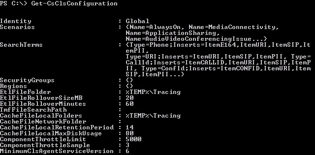

# <a name="manage-centralized-logging-service-configuration-settings-in-skype-for-business-server-2015"></a>Gerenciar configurações do Serviço de Log Centralizado Skype for Business Server 2015

**Resumo:** Saiba como recuperar, atualizar e criar configurações para o Serviço de Log Centralizado Skype for Business Server 2015.

O Serviço de Log Centralizado é controlado e configurado por configurações e parâmetros criados e usados pelo Controlador de Serviço de Log Centralizado (CLSController) para enviar comandos ao ClSAgent (Agente de Serviço de Log Centralizado) do computador individual. O agente processa os comandos enviados a ele e (no caso de um comando Start) usa a configuração dos cenários, provedores, duração do rastreamento e sinalizadores para começar a coletar logs de rastreamento de acordo com as informações de configuração fornecidas.

> [!IMPORTANT]
>  Nem todos os cmdlets Windows PowerShell listados para o Serviço de Log Centralizado são destinados para uso com implantações locais Skype for Business Server 2015. Embora pareçam funcionar, os cmdlets a seguir não foram projetados para funcionar com implantações locais Skype for Business Server 2015:

-  **Cmdlets CsClsRegion:** [Get-CsClsRegion](/powershell/module/skype/get-csclsregion?view=skype-ps) , [Set-CsClsRegion](/powershell/module/skype/set-csclsregion?view=skype-ps), [New-CsClsRegion](/powershell/module/skype/new-csclsregion?view=skype-ps) e [Remove-CsClsRegion](/powershell/module/skype/remove-csclsregion?view=skype-ps).
-  **Cmdlets CsClsSearchTerm:** [Get-CsClsSearchTerm](/powershell/module/skype/get-csclssearchterm?view=skype-ps) e [Set-CsClsSearchTerm](/powershell/module/skype/set-csclssearchterm?view=skype-ps).
-  **Cmdlets CsClsSecurityGroup:** [Get-CsClsSecurityGroup](/powershell/module/skype/get-csclssecuritygroup?view=skype-ps), [Set-CsClsSecurityGroup](/powershell/module/skype/set-csclssecuritygroup?view=skype-ps),  [New-CsClsSecurityGroup](/powershell/module/skype/new-csclssecuritygroup?view=skype-ps) e [Remove-CsClsSecurityGroup](/powershell/module/skype/remove-csclssecuritygroup?view=skype-ps).

As configurações definidas nesses cmdlets não prejudicarão ou causarão qualquer comportamento adverso, mas foram projetadas para uso com Microsoft 365 ou Office 365 e não gerarão os resultados esperados em implantações locais. Isso não quer dizer que não há uso para esses cmdlets em implantações locais, mas sua utilização é um tópico mais avançado que não é abordado nesta documentação.

O Serviço de Log Centralizado pode ser executado em um escopo que inclui um único computador ou um pool de computadores, em um escopo de site (ou seja, um site definido como o site Redmond que contém um conjunto de computadores e pools em sua implantação) ou em um escopo global (ou seja, todos os computadores e pools em sua implantação).

Para configurar o escopo do Serviço de Log Centralizado usando o Shell de Gerenciamento do Skype for Business Server, você deve ser membro dos grupos de segurança CsAdministrator ou CsServerAdministrator de controle de acesso baseado em função (RBAC) ou uma função RBAC personalizada que contenha um desses dois grupos. Para retornar uma lista de todas as funções RBAC às quais este cmdlet foi atribuído (incluindo quaisquer funções RBAC personalizadas que você mesmo tenha criado), execute o seguinte comando no Shell de Gerenciamento do Skype for Business Server ou no prompt Windows PowerShell:

```PowerShell
Get-CsAdminRole | Where-Object {$_.Cmdlets -match "<Skype for Business cmdlet>"}
```

Por exemplo:

```PowerShell
Get-CsAdminRole | Where-Object {$_.Cmdlets -match "Set-CsClsConfiguration"}
```

> [!NOTE]
> Há diferenças fundamentais entre os comandos de linha de comando que você pode executar em Windows PowerShell ou CLSController. Windows PowerShell fornece um método rico para configurar e definir cenários e reutilizar esses cenários de forma significativa para seus cenários de solução de problemas. Embora o CLSController does forneça uma maneira rápida e eficiente para emitir comandos e obter resultados, o conjunto de comandos do CLSController está limitado aos comandos finitos que você tem disponível na linha de comando. Ao contrário dos cmdlets Windows PowerShell, o CLSController não pode definir novos cenários, gerenciar escopo em um site ou nível global e muitas outras limitações de um conjunto de comandos finito que não pode ser configurado dinamicamente. Embora o CLSController fornece um meio para execução rápida, o Windows PowerShell fornece um meio para estender a funcionalidade de Serviço de Log Centralizado além do que é possível com CLSController.

Um único escopo de computador pode ser definido durante a execução de um [comando Search-CsClsLogging](/powershell/module/skype/search-csclslogging?view=skype-ps), [Show-CsClsLogging](/powershell/module/skype/show-csclslogging?view=skype-ps), [Start-CsClsLogging](/powershell/module/skype/start-csclslogging?view=skype-ps), [Stop-CsClsLogging](/powershell/module/skype/stop-csclslogging?view=skype-ps), [Sync-CsClsLogging](/powershell/module/skype/sync-csclslogging?view=skype-ps) e [Update-CsClsLogging](/powershell/module/skype/update-csclslogging?view=skype-ps) usando o parâmetro -Computers. O parâmetro -Computers aceita uma lista separada por vírgulas de FQDNs (nomes de domínio totalmente qualificados) para o computador de destino.

> [!TIP]
> Você também pode definir -Pools e uma lista separada por vírgulas de pools em que deseja executar os comandos de registro em log.

Os escopos de site e global são definidos nos cmdlets **New-**, **Set-**, **and Remove-** Centralized Logging Service. Os exemplos a seguir demonstram como definir o escopo de um site ou global.

> [!IMPORTANT]
> Os comandos mostrados podem conter parâmetros e conceitos que são abordados em outras seções. Os comandos de exemplo destinam-se a demonstrar o uso do parâmetro **-Identity** para definir escopo, e os outros parâmetros são incluídos para a conclusão e para especificar o escopo. Para obter detalhes sobre os cmdlets do **Set-CsClsConfiguration**, consulte [Set-CsClsConfiguration](/powershell/module/skype/set-csclsconfiguration?view=skype-ps) na documentação Operações.

### <a name="to-retrieve-the-current-centralized-logging-service-configuration"></a>Para recuperar a configuração atual do Serviço de Log Centralizado

1. Inicie o shell Skype for Business Server gerenciamento: clique em **Iniciar, em** Todos os **Programas, em** Skype for Business **2015** e em Skype for Business Server **Gerenciamento**.

2. Digite o seguinte no prompt de linha de comando:

   ```PowerShell
   Get-CsClsConfiguration
   ```

Use os cmdlets **New-CsClsConfiguration** e **Set-CsClsConfiguration** para criar uma nova configuração ou para atualizar uma configuração existente. Quando você executar **Get-CsClsConfiguration**, ele exibe informações semelhantes à captura de tela a seguir, onde a implantação atualmente tem a configuração Global padrão, mas nenhuma configuração de site definida:



### <a name="to-retrieve-the-current-centralized-logging-service-configuration-from-the-computer-local-store"></a>Para recuperar a configuração atual do Serviço de Log Centralizado do armazenamento local do computador

1. Inicie o shell Skype for Business Server gerenciamento: clique em **Iniciar, em** Todos os **Programas, em** Skype for Business **2015** e em Skype for Business Server **Gerenciamento**.

2. Digite o seguinte no prompt de linha de comando:

   ```PowerShell
   Get-CsClsConfiguration -LocalStore
   ```

Quando você usa o primeiro exemplo em **que Get-CsClsConfiguration** não especifica parâmetros, o comando faz referência ao armazenamento de Gerenciamento Central para os dados. Se você especificar o parâmetro -LocalStore, o comando referencia o localStore do computador em vez do repositório de Gerenciamento Central.
### <a name="to-retrieve-a-listing-of-scenarios-currently-defined"></a>Para recuperar uma lista de cenários definidos no momento

1. Inicie o shell Skype for Business Server gerenciamento: clique em **Iniciar, em** Todos os **Programas, em** Skype for Business **2015** e em Skype for Business Server **Gerenciamento**.

2. Digite o seguinte no prompt de linha de comando:

   ```PowerShell
   Get-CsClsConfiguration -Identity <scope and name> | Select-Object -ExpandProperty Scenarios
   ```

    Por exemplo, para recuperar os cenários definidos no escopo global:

   ```PowerShell
   Get-CsClsConfiguration -Identity "global" | Select-Object -ExpandProperty Scenarios
   ```

O cmdlet **Get-CsClsConfiguration** sempre exibe os cenários que fazem parte da configuração de um determinado escopo. Na maioria dos casos, nem todos os cenários são exibidos e estão truncados. O comando usado aqui lista todos os cenários e as informações parciais sobre quais provedores, configurações e sinalizadores são usados.
### <a name="to-update-a-global-scope-for-the-centralized-logging-service-by-using-windows-powershell"></a>Para atualizar um escopo global para o Serviço de Registro Em Log Centralizado usando Windows PowerShell

1. Inicie o shell Skype for Business Server gerenciamento: clique em **Iniciar, em** Todos os **Programas, em** Skype for Business **2015** e em Skype for Business Server **Gerenciamento**.

2. Digite o seguinte no prompt de linha de comando:

   ```PowerShell
   Set-CsClsConfiguration -Identity <scope> -EtlFileRolloverSizeMB <size for logging file in megabytes>
   ```

   Por exemplo:

   ```PowerShell
   Set-CsClsConfiguration -Identity "global" -EtlFileRolloverSizeMB 40
   ```

O comando diz ao CLSAgent em cada computador e pool na implantação para definir o tamanho do valor de sobreposição no arquivo de rastreamento para 40 megabytes. Os computadores e pools em todos os sites são afetados pelo comando, e definirão seu valor configurado de sobreposição de log de rastreamento para 40 megabytes.
### <a name="to-update-a-site-scope-for-the-centralized-logging-service-by-using-windows-powershell"></a>Para atualizar um escopo de site para o Serviço de Log Centralizado usando Windows PowerShell

1. Inicie o shell Skype for Business Server gerenciamento: clique em **Iniciar, em** Todos os **Programas, em** Skype for Business **2015** e em Skype for Business Server **Gerenciamento**.

2. Digite o seguinte no prompt de linha de comando:

   ```PowerShell
   Set-CsClsConfiguration -Identity <scope/site name> -EtlFileRolloverSizeMB <size for logging file in megabytes>
   ```

   Por exemplo:

   ```PowerShell
   Set-CsClsConfiguration -Identity "site/Redmond" -EtlFileRolloverSizeMB 40
   ```

> [!NOTE]
> Como observado no exemplo, o local padrão dos arquivos de log é %TEMP%\Tracing. No entanto, como é o CLSAgent que está gravando o arquivo, e o CSLAgent é executado no Serviço de Rede, a variável %TEMP% expande para %WINDIR%\ServiceProfiles\NetworkService\AppData\Local.

O comando diz ao CLSAgent em cada computador e pool no site da Redmond para definir o tamanho do valor de sobreposição no arquivo de rastreamento para 40 megabytes. Os computadores e pools em outros sites não serão afetados pelo comando, e continuarão a usar o valor atualmente configurado de sobreposição de log de rastreamento definido pelo padrão (20 megabytes) ou durante o início da sessão de log.
### <a name="to-create-a-new-centralized-logging-service-configuration"></a>Para criar uma nova configuração do Serviço de Log Centralizado

1. Inicie o shell Skype for Business Server gerenciamento: clique em **Iniciar, em** Todos os **Programas, em** Skype for Business **2015** e em Skype for Business Server **Gerenciamento**.

2. Digite o seguinte no prompt de linha de comando:

   ```PowerShell
   New-CsClsConfiguration -Identity <scope and name> [CsClsConfiguration options for this site]
   ```

    > [!NOTE]
    > New-CsClsConfiguration fornece acesso a um grande número de definições de configuração adicionais. Para obter detalhes sobre as opções de configuração, consulte [Get-CsClsConfiguration](/powershell/module/skype/get-csclsconfiguration?view=skype-ps) e [Understanding Centralized Logging Service Configuration Configurações](/previous-versions/office/lync-server-2013/lync-server-2013-understanding-centralized-logging-service-configuration-settings).

Por exemplo, para criar uma nova configuração que defina uma pasta de rede para arquivos de cache, o período de tempo de sobreposição dos arquivos de log e tamanho de sobreposição dos arquivos de log, você deverá digitar:

  ```PowerShell
  New-CsClsConfiguration -Identity "site:Redmond" -CacheFileNetworkFolder "\\fs01.contoso.net\filestore\logfiles" -EtlFileRolloverMinutes 120 -EtlFileRolloverSizeMB 40
  ```

Você deve planejar cuidadosamente a criação de novas configurações e como definir novas propriedades para o Serviço de Registro Em Log Centralizado. Você deve ter cuidado ao fazer alterações e ter certeza que compreende o impacto da sua capacidade de registrar cenários de problema corretamente. Você deve fazer alterações na configuração que melhorarão sua capacidade de gerenciar logs para um tamanho e período de sobreposição que permita resolver problemas, quando surgirem.
### <a name="to-remove-an-existing-centralized-logging-service-configuration"></a>Para remover uma configuração existente do Serviço de Log Centralizado

1. Inicie o shell Skype for Business Server gerenciamento: clique em **Iniciar, em** Todos os **Programas, em** Skype for Business **2015** e em Skype for Business Server **Gerenciamento**.

2. Digite o seguinte no prompt de linha de comando:

   ```PowerShell
   Remove-CsClsConfiguration -Identity <scope and name>
   ```

Por exemplo, para remover uma configuração do Serviço de Log Centralizado que você criou para aumentar o tempo de distribuição de arquivo de log, aumente o tamanho do arquivo de log de rolagem e de definir o local do cache do arquivo de log como um compartilhamento de rede da seguinte forma:

  ```PowerShell
  Remove-CsClsConfiguration -Identity "site:Redmond"
  ```

> [!NOTE]
> Esta é a nova configuração que foi criada no procedimento "Para criar uma nova configuração do Serviço de Log Centralizado".

Se decidir remover a configuração no nível do site, o site usará as configurações globais.
## <a name="see-also"></a>Confira também

[Configurar provedores para o Serviço de Log Centralizado Skype for Business Server 2015](configure-providers.md)

[Configurar cenários para o Serviço de Log Centralizado Skype for Business Server 2015](configure-scenarios.md)

[Serviço de Log Centralizado Skype for Business 2015](centralized-logging-service.md)

[Set-CsClsConfiguration](/powershell/module/skype/set-csclsconfiguration?view=skype-ps)

[Get-CsClsConfiguration](/powershell/module/skype/get-csclsconfiguration?view=skype-ps)

[New-CsClsConfiguration](/powershell/module/skype/new-csclsconfiguration?view=skype-ps)

[Remove-CsClsConfiguration](/powershell/module/skype/remove-csclsconfiguration?view=skype-ps)