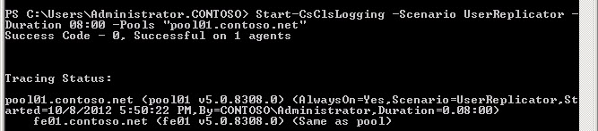

# <a name="start-or-stop-cls-log-capture-in-skype-for-business-server-2015"></a>Iniciar ou interromper a captura de log CLS no Skype for Business Server 2015
 
**Resumo:** Saiba como iniciar ou interromper uma sessão de captura de log do Serviço de Log Centralizado no Skype for Business Server 2015.
  
Para capturar logs de rastreamento usando o Serviço de Registro Em Log Centralizado, você emitirá um comando para iniciar o log em um ou mais computadores e pools. Você também emitirá parâmetros que definem quais computadores ou pools, quais cenários executar (por exemplo, AlwaysOn, outro cenário predefinido ou um cenário que você criou), quais componentes de Skype for Business Server (por exemplo, S4, SipStack) para rastrear.
  
Para capturar as informações corretas, você precisa se certificar de usar o cenário certo para coletar informações relevantes para o problema. No Serviço de Registro Em Log Centralizado, um cenário é o conceito de ligar o log com base em uma coleção de componentes de servidor, níveis de log e sinalizadores, o que é muito mais eficiente e útil do que ter que definir esses elementos por servidor. Você define e especifica um cenário a ser executado e o cenário é executado de forma consistente em todos os servidores e pools no escopo da infraestrutura.
  
O cenário padrão é chamado de **AlwaysOn**. O objetivo do AlwaysOn é executar o cenários constantemente, conforme o nome do cenário implica. O cenário AlwaysOn coleta informações de nível informativo (obeserve que o nível de log informativo inclui Fatal, Erro e Aviso, além das mensagens informativas) para boa parte da maioria dos componentes de servidor comum. AlwaysOn coleta informções antes, durante e após o problema ocorrer. Isso difere drasticamente do comportamento típico das ferramentas de log anteriores, tais como OCSLogger. É possível executar OCSLogger após o problema ocorrer, tornando seus eforços para resolução de problemas mais dificil, pois os dados que você possui são reativos e não proativos. Se AlwaysOn não possui a informação que você está procurando a fim de indicar o componente do problema e um curso de ação para corrigi-lo (o que provavelmente não fornece a amplitude e profundidade dos provedores em AlwaysOn), ele indicará um nível adequado de informação para determinar o que mais dee ser feito, como criar um novo cenário, juntar outras informações, realizar uma busca diferente para coletar informações mais detalhadas, e assim por diante.
  
O Serviço de Log Centralizado fornece duas maneiras de emitir comandos. Vários tópicos foram focados em usar o Windows PowerShell por meio do Shell Skype for Business Server Gerenciamento. A capacidade de usar várias configurações e comandos complexos favorece Windows PowerShell uso do Serviço de Log Centralizado. Como Windows PowerShell o Shell de Gerenciamento Skype for Business Server é quase onipresente para todas as funções no Skype for Business Server, apenas os comandos Windows PowerShell são discutidos. 
  
### <a name="to-run-start-csclslogging-with-windows-powershell-using-basic-commands"></a>Para executar Start-CsClsLogging com Windows PowerShell usando comandos básicos

1. Inicie o shell Skype for Business Server gerenciamento: clique em **Iniciar,** clique em Todos os **Programas,** clique Skype for Business **2015** e clique **em Skype for Business Server Shell de Gerenciamento.**
    
2. Inicie um cenário de registro em log com o Serviço de Log Centralizado digitando o seguinte:
    
   ```PowerShell
   Start-CsClsLogging -Scenario <name of scenario>
   ```

    Por exemplo, para iniciar o cenário **AlwaysOn**, digite:
    
   ```PowerShell
   Start-CsClsLogging -Scenario AlwaysOn
   ```

    > [!NOTE]
    > O cenário The AlwaysOn não possui uma duração padrão. Este cenário será executado até que o pare precisamente com o cmdlet **Stop-CsClsLogging**. Para detalhes, consulte [Stop-CsClsLogging](/powershell/module/skype/stop-csclslogging?view=skype-ps). Para todos os outros cenários, a duração padrão é 4 horas. 
  
3. Pressione Enter para executar o comenando. 
    
    > [!NOTE]
    > Pode levar algum tempo (30 a 60 segundos) para que os os comandos sejam executados e que recebam o status de volta dos computadores em sua implantação. 
  
     
  
4. Para iniciar outro cenários, use o cmdlet **Start-CsClsLogging** com o nome do cenário adicional para executar o seguinte (por exemplo, o cenário **Autenticação**):
    
   ```PowerShell
   Start-CsClsLogging -Scenario Authentication
   ```

    > [!IMPORTANT]
    > É possível ter um total de dois cenários sendo executados em qualquer computador a qualquer momento. Se o comando é global no escopo, todos os computadores em sua implantação executarão o cenário ou cenários. Para iniciar um terceiro cenário, você deve parar o log no computador, pool, site ou escopo global em que você queira executar o novo cenario. Caso tenho iniciado um escopo global, é possível parar o log em um ou ambos cenários em um ou mais computadores e pools. 
  
### <a name="to-run-start-csclslogging-with-windows-powershell-using-advanced-commands"></a>Para executar Start-CsClsLogging com Windows PowerShell usando comandos avançados

1. Inicie o shell Skype for Business Server gerenciamento: clique em **Iniciar,** clique em Todos os **Programas,** clique Skype for Business **2015** e clique **em Skype for Business Server Shell de Gerenciamento.**
    
2. Parâmetros adicionais estão disponíveis para gerenciar os comandos de log. Você pode usar -Duration para ajustar o período de tempo para que o cenário seja executado. Você também pode definir -Computers, uma lista de FQDNs (nomes de domínio totalmente qualificados) do computador separados por uma vírgula ou -Pools, uma lista separada por vírgulas de FQDNs para pools em que você deseja executar o logon.
    
    Você inicia uma sessão de registro em log para o cenário UserReplicator no pool "pool01.contoso.net". Você também define a duração da sessão de registro em log em 8 horas. Para isso, digite:
    
   ```PowerShell
   Start-CsClsLogging -Scenario UserReplicator -Duration 8:00 -Pools "pool01.contoso.net"
   ```

    O execução com sucesso deste cenário devolve um resultado como o seguinte:
    
     
  
Observe que neste exemplo, o cenário AlwaysOn é executado e o cenário UserReplicator também está sendo executado. 
    
## <a name="stop-the-centralized-logging-service-log-capture"></a>Interromper a captura de log do Serviço de Log Centralizado
<a name="stop"> </a>

É possível parar uma sessão de registro em log em execução no momento com o cmdlet Stop-CsClsLogging. Geralmente, não há muitas situações nas quais você precisaria interromper uma sessão de registro em log. Por exemplo, é possível pesquisar logs e alterar as configurações sem antes precisar parar o registro em log. Se você tiver dois cenários em execução, por exemplo AlwaysOn e UserReplicator, e for necessário coletar informações relacionadas à Autenticação, será necessário parar um dos outros cenários (em um escopo global, site, pool ou computador) antes de poder iniciar a execução do cenário de Autenticação. Para obter detalhes, consulte [Stop-CsClsLogging](/powershell/module/skype/stop-csclslogging?view=skype-ps).
  
> [!NOTE]
> Ao determinar quais cenários você pode executar em uma determinada implantação, pool ou computador, você precisa lembrar que está limitado a executar dois **cenários** por computador : AlwaysOn e um cenário personalizado. Se você estiver registrando em log uma atividade em um pool, trate um pool como uma entidade única. Na maioria dos casos, não faria sentido executar cenários diferentes em cada computador em um pool. Não faz sentido analisar o problema sobre o qual você está coletando dados e pensar sobre qual cenário faz mais sentido em um determinado computador na implantação geral. Por exemplo, se você considerar o cenário UserReplicator, não haverá muito pouco valor na execução de UserReplicator em um servidor de borda ou pool de Borda. 
  
Depois de entender o problema e o escopo do impacto, faça escolhas cuidadosas sobre quais cenários executar em quais computadores e pools. Embora o cenário AlwaysOn faça sentido para um aplicativo de escopo amplo, pois coleta informações sobre uma ampla variedade de provedores, cenários específicos têm valor de aplicativo apenas em computadores ou pools específicos. Além disso, tome cuidado ao iniciar aleatoriamente uma sessão de registro em log sem antes entender o valor de um determinado cenário. Se você usar o cenário errado ou se usar um cenário apropriado para a tarefa e aplicar o cenário ao escopo errado (seja global, site, pool ou computador), poderá receber dados questionáveis e não muito úteis—como se não tivesse executado o cenário.
  
Para controlar as funções de Serviço de Log Centralizado usando o Shell de Gerenciamento do Skype for Business Server, você deve ser membro dos grupos de segurança CsAdministrator ou CsServerAdministrator de controle de acesso baseado em função (RBAC) ou uma função RBAC personalizada que contenha um desses dois grupos. Para retornar uma lista de todas as funções RBAC às quais este cmdlet foi atribuído (incluindo quaisquer funções RBAC personalizadas que você mesmo tenha criado), execute o seguinte comando no Shell de Gerenciamento do Skype for Business Server ou no prompt Windows PowerShell:
  
```PowerShell
Get-CsAdminRole | Where-Object {$_.Cmdlets -match "Skype for Business Server 2015 cmdlet"}
```

Por exemplo:
  
```PowerShell
Get-CsAdminRole | Where-Object {$_.Cmdlets -match "Set-CsClsConfiguration"}
```

> [!NOTE]
> Portanto, você pode estar se perguntando: Agora que você habilitar o log, onde os logs são mantidos? Como você acessará as informações armazenadas nos logs usando consultas de shell de gerenciamento enviadas aos Agentes CLS e poderá enviar os resultados para vários formatos de arquivo possíveis, onde em cada servidor um Agente CLS mantém seus registros não é realmente importante saber.  Os arquivos de log podem ser salvos em um local que você  especifica e lê e analisa usando uma variedade de ferramentas, incluindoSnooper.exee qualquer ferramenta que possa ler um arquivo de texto, como **Notepad.exe**. Snooper.exe faz parte do Skype for Business Server de depuração 2015 e está disponível como download [da Web](https://go.microsoft.com/fwlink/p/?LinkId=285257).

### <a name="to-stop-a-currently-running-centralized-logging-service-session"></a>Para interromper uma sessão do Serviço de Log Centralizado em execução no momento

1. Inicie o shell Skype for Business Server gerenciamento: clique em **Iniciar,** clique em Todos os **Programas,** clique Skype for Business **2015** e clique **em Skype for Business Server Shell de Gerenciamento.**
    
2. Consulte o Serviço de Registro Centralizado para descobrir quais cenários estão sendo executados digitando o seguinte:
    
   ```PowerShell
   Show-CsClsLogging
   ```

   
  
   O resultado de Show-CsClsLogging é um resumo dos cenários em execução e em qual escopo eles estão em execução. Para obter detalhes, consulte [Show-CsClsLogging](/powershell/module/skype/show-csclslogging?view=skype-ps).
    
3. Para interromper uma sessão de registro em log atualmente em execução com um cenário específico, digite:
    
   ```PowerShell
   Stop-CsClsLogging -Scenario <scenario name> -Computers <comma separated list of fully qualified computer names> -Pools <comma separated list of fully qualified pool names>
   ```
   Por exemplo:
    
   ```PowerShell
   Stop-CsClsLogging -Scenario UserReplicator -Pools pool01.contoso.net
   ```

   Esse comando interromperá o registro em log com o cenário UserReplicatior em pool01.contoso.net.
    
    > [!NOTE]
    > Os logs criados durante a sessão de registro em log usando o cenário UserReplicator não são excluídos. O registro em log ainda está disponível para execução de pesquisas usando o comando Search-CsClsLogging. Para obter detalhes, consulte [Search-CsClsLogging](/powershell/module/skype/search-csclslogging?view=skype-ps). 
  
Agindo como o comando acompanhante para Start-CsClsLogging, o cmdlet Stop-CsClsLogging encerra a sessão de registro em log, definida pelos cenários, e retém os logs criados pela sessão de registro em log. É possível executar dois cenários em um determinado computador a qualquer momento. O método de parar um cenário para coletar informações usando outro cenário é uma tarefa comum que pode ser executada durante grande parte das soluções de problemas de carga de trabalho.
## <a name="see-also"></a>Confira também
<a name="stop"> </a>

[Serviço de Log Centralizado Skype for Business 2015](centralized-logging-service.md)