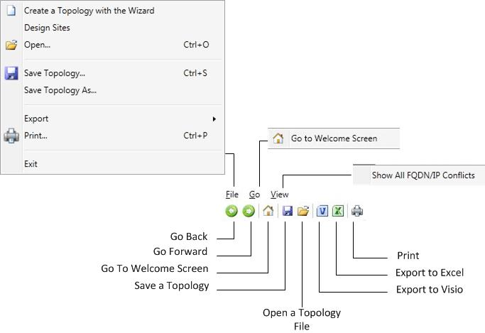

# Navegar pela Ferramenta de Planejamento no Skype for Business Server 2015

Você pode navegar o Skype para ferramenta de planejamento do Business Server 2015 usando uma combinação de uma barra de ferramentas, botões de página específico e links e painéis de contexto específico. Esses painéis fornecem informações de planejamento e capacidade importantes para as opções de seleção em uma determinada página.

Sobre como iniciar a ferramenta de planejamento, um designer vê primeiramente a página **Bem-vindo à ferramenta de planejamento do Skype para Business Server 2015** .

Na página de boas-vindas, o designer selecionará **Introdução**, **Projetar Sites** ou **Exibir**. Para obter detalhes, consulte [criar o design de topologia inicial para Skype para Business Server 2015](create-the-initial-design.md).

Na parte superior da ferramenta de planejamento é uma barra de ferramentas que fornece acesso fácil ao funções usadas frequentemente. A barra de ferramentas é exibida aqui como referência, e cada função será discutida nos tópicos relacionados.

A ferramenta de planejamento tem uma seção de Links externos no lado esquerdo da ferramenta. Nessa seção, o designer tem fácil acesso às informações de planejamento e implantação e a outros recursos técnicos, como treinamento, artigos técnicos, fóruns e outros recursos baixáveis. Também em Links externos seção é um link de comentários para o Skype para a equipe da ferramenta de planejamento do Business Server 2015.

Um painel de ações contextual é exibido em várias páginas na ferramenta de planejamento. O propósito do painel de Ações é oferecer fácil acesso às seções principais da topologia ao designer. Os links disponíveis no painel Ações mudam com base no nível de detalhe da topologia. O painel de Ações está disponível após ter completado as perguntas de entrevista e ter exibido sua topologia. A seção Visão Geral está inclusa no painel Ações, que exibe números que o designer inseriu como parte do processo de entrevista. A visão geral é contextualmente relacionada às informações exibidas.

Além disso, as informações de hardware são exibidas na visão geral no painel de Ações. A configuração de hardware exibe uma lista de requisitos de hardware recomendados pela topologia atual.

## Consulte Também

[Create the initial topology design for Skype for Business Server 2015](create-the-initial-design.md)

[Editing the Design](https://technet.microsoft.com/library/08f639ba-0e5f-4ae7-9191-c3d96c25b169.aspx)

[Reviewing the Administrator Reports](https://technet.microsoft.com/library/1dee56a9-a033-4201-9765-e3469bd7d3e3.aspx)
