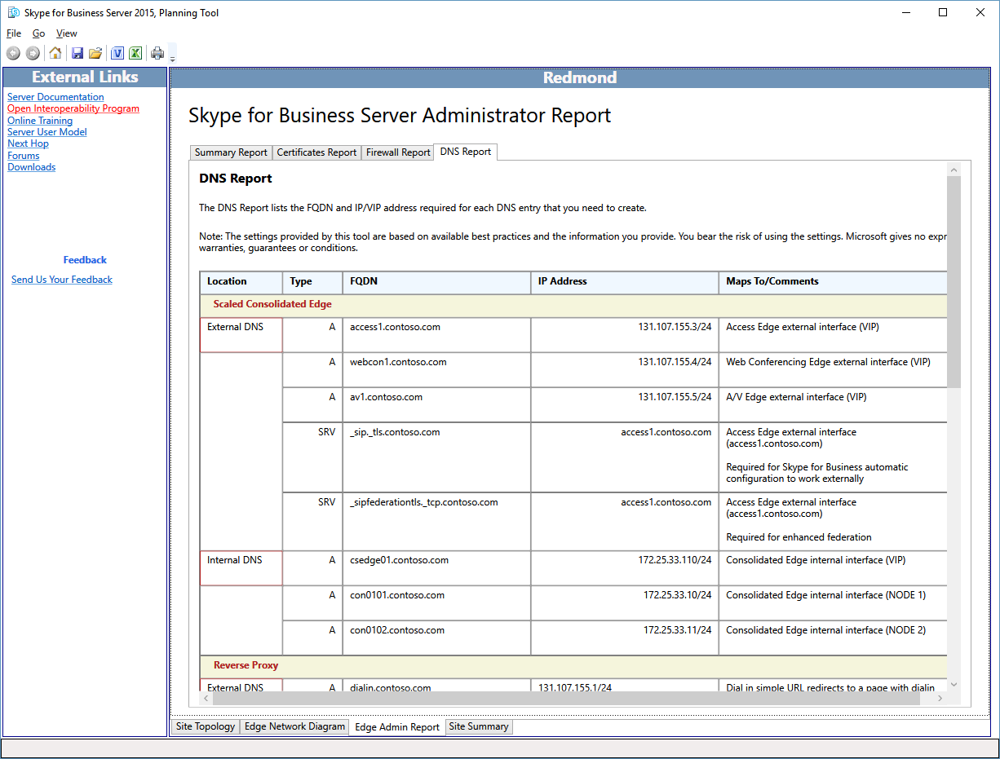

# Revisar os Relatórios de Administrador no Skype for Business Server 2015

Os Relatórios de Administrador são informações detalhadas para implantações e operações. Os relatórios são gerados com base nas seleções marcadas em **Sites de Design**. O designer pode adicionar mais valor aos Relatórios de Administrador editando os diagramas de rede, definindo os endereços IP completos e os FQDNs (nome de domínio totalmente qualificado) para servidores, pools e balanceadores de carga.

O recurso De relatórios de administrador permite que você:

- [Revisar o Relatório de Resumo](review-the-administrator-reports.md#Summary_report)

- [Revisar o Relatório de Certificados](review-the-administrator-reports.md#Certificates_Report)

- [Revisar o Relatório de Firewall](review-the-administrator-reports.md#Firewall_report)

- [Revisar o Relatório DNS](review-the-administrator-reports.md#DNS_Report)

## Revisar o Relatório de Resumo

O Skype for Business de administrador é o primeiro de quatro relatórios valiosos que documentam seu design em detalhes. As informações neste relatório e os outros três relatórios associados são úteis para o seu Teams:

O Relatório de Resumo lista informações gerais de configuração associadas à sua rede de Borda. O local, FQDN (nome de domínio totalmente qualificado) e endereço IP, tipo de rede e comentários específicos de uma determinada função são documentados.

O designer e cada uma das equipes que implantarão, gerenciarão e manterão a infraestrutura devem revisar o relatório de resumo para ver se há precisão e garantir que os erros sejam mínimos.

Você também pode exibir relatórios mais detalhados:

- Relatório de Certificados

- Relatório de Firewall

- Relatório DNS

## Revisar o Relatório de Certificados

O Relatório de Certificados contém todos os certificados necessários na implantação recomendada Skype for Business Server 2015. A Ferramenta de Planejamento conta os nomes de assunto e nomes alternativos de assunto inseridos. O texto padrão não emitido pode representar um desafio potencial para a equipe responsável por solicitar e emitir os certificados. As informações do certificado também incluem informações sobre o local de onde o certificado pode ser normalmente emitido. Se a infraestrutura não tiver uma infraestrutura de chave pública interna (PKI), todos os certificados poderão ser solicitados por meio de um provedor de certificados público. Os campos EKU (Uso Estendido de Chave) e Atribuir a do relatório são muito úteis para ajudar a compreender quais devem ser a finalidade e a localização de cada certificado.

Revise cuidadosamente e entenda o uso e a finalidade de cada certificado na implantação. Se houver uma pergunta sobre o que um certificado faz, determine qual servidor ou serviço está falando com o que. Certificados no Skype for Business Server 2015 são usados para duas finalidades principais:

- MTLS (Mutual Transport Layer Security) - Os computadores envolvidos na comunicação apresentam um certificado que prova sua identidade para outro computador. Isso é conhecido como autenticação de servidor. A comunicação não pode começar até que cada computador confie na identidade do outro computador.

- Criptografia - A criptografia (Secure Sockets Layer, ou SSL, e Transport Layer Security, ou TLS) é um meio essencial para ajudar a proteger as comunicações, ajudar a garantir a privacidade e a criar um sistema confiável de comunicação e colaboração.

## Revisar o Relatório de Firewall

Skype for Business Server 2015 tem um conjunto potencialmente complexo de regras de firewall. A Ferramenta de Planejamento reduz essa complexidade gerando um relatório que define detalhadamente todos os requisitos de firewall, com base nos critérios de entrada do designer. O administrador de firewall de TI pode usar esse relatório para configurar e definir as regras necessárias.

Do ponto de vista do gerenciamento de firewall, o relatório deve ser cuidadosamente revisado para garantir que não haja conflitos com a saída de regras de firewall e que não há políticas ou procedimentos que possam ser violados.

## Revisar o Relatório DNS

O Relatório DNS, que faz parte do Relatório de Administrador, detalha todas as entradas recomendadas e conhecidas para o Dns (Sistema de Nomes de Domínio) nas redes internas, de perímetro e externas. Se o designer concluiu as edições para o diagrama de rede e todos os endereços IP e FQDNs (nomes de domínio totalmente qualificados) são definidos para seus valores de produção, o Relatório DNS fornece um excelente recurso de configuração. Este relatório também pode servir como um documento de solução de problemas operacionais.

Você deve fazer com que sua equipe de gerenciamento dns revise completamente o Relatório DNS para garantir que não haja erros que possam causar dificuldades durante a implantação ou que possam complicar uma sessão de solução de problemas.

## Confira também

[Analisando os relatórios do administrador](/previous-versions/office/lync-server-2013/lync-server-2013-reviewing-the-administrator-reports)