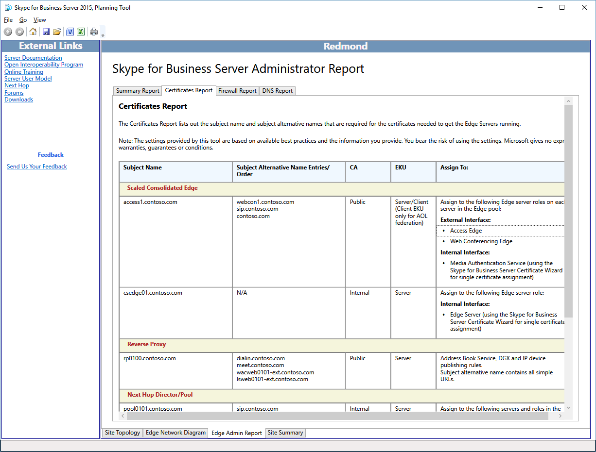

# Revisar os Relatórios de Administrador no Skype for Business Server 2015Review the Administrator Reports in Skype for Business Server 2015

Os Relatórios de Administrador são informações detalhadas para implantações e operações.The Administrator Reports are detailed information for deployment and operations. Os relatórios são gerados com base nas seleções marcadas em **Sites de Design.**The reports are generated based on the selections marked in **Design Sites**. O designer pode adicionar mais valor aos Relatórios de Administrador editando os diagramas de rede, definindo os endereços IP completos e os FQDNs (nome de domínio totalmente qualificado) para servidores, pools e balanceadores de carga.The designer can further add value to the Administrator Reports by editing the network diagrams and defining the complete IP addresses and fully qualified domain names (FQDNs) for servers, pools, and load balancers.

O recurso De relatórios de administrador permite que você:The Administrator reports feature allows you to:

- [Revisar o Relatório de ResumoReview the Summary Report](review-the-administrator-reports.md#Summary_report)

- [Revisar o Relatório de CertificadosReview the Certificates Report](review-the-administrator-reports.md#Certificates_Report)

- [Revisar o Relatório de FirewallReview the Firewall Report](review-the-administrator-reports.md#Firewall_report)

- [Revisar o Relatório DNSReview the DNS Report](review-the-administrator-reports.md#DNS_Report)

## Revisar o Relatório de ResumoReview the Summary Report

O Relatório de Administrador do Skype for Business é o primeiro de quatro relatórios valiosos que documentam seu design em detalhes.The Skype for Business Administrator Report is the first of four valuable reports that document your design in detail. As informações neste relatório e os outros três relatórios associados são úteis para suas Equipes de Tecnologia da Informação:The information in this report, and the other three associated reports, is useful for your Information Technology Teams:

O Relatório de Resumo lista informações gerais de configuração associadas à sua rede de Borda.The Summary Report lists general configuration information associated with your Edge network. O local, FQDN (nome de domínio totalmente qualificado) e endereço IP, tipo de rede e comentários específicos de uma determinada função são documentados.The location, fully qualified domain name (FQDN) and IP address, type of network, and comments specific to a given role are documented.

O designer e cada uma das equipes que implantarão, gerenciarão e manterão a infraestrutura devem revisar o relatório de resumo para ver se há precisão e garantir que os erros sejam mínimos.The designer and each of the teams that will deploy, manage, and maintain the infrastructure should review the summary report for accuracy and to make sure that errors are at a minimum.

Você também pode exibir relatórios mais detalhados:You can also view more detailed reports:

- Relatório de CertificadosCertificates Report

- Relatório de FirewallFirewall Report

- Relatório DNSDNS Report

## Revisar o Relatório de CertificadosReview the Certificates Report

O Relatório de Certificados contém todos os certificados necessários na implantação recomendada do Skype for Business Server 2015.The Certificates Report contains all certificates that are required in the recommended Skype for Business Server 2015 deployment. A Ferramenta de Planejamento conta os nomes de assunto e nomes alternativos de assunto inseridos.The Planning Tool accounts for the subject names and subject alternative names that are entered. O texto padrão não emitido pode representar um desafio potencial para a equipe responsável por solicitar e emitir os certificados.Default text that is left unedited may represent a potential challenge for the team responsible for requesting and issuing the certificates. As informações do certificado também incluem informações sobre o local de onde o certificado pode ser normalmente emitido.Certificate information also contains information about where the certificate can typically be issued from. Se a infraestrutura não tiver uma infraestrutura de chave pública interna (PKI), todos os certificados poderão ser solicitados por meio de um provedor de certificados público.If the infrastructure does not have an internal public key infrastructure (PKI) in place, all certificates can be requested through a public certificate provider. Os campos EKU (Uso Estendido de Chave) e Atribuir a do relatório são muito úteis para ajudar a compreender quais devem ser a finalidade e a localização de cada certificado.Extended key usages (EKU) and Assign To fields in the report are very helpful in understanding what the purpose and location for each certificate should be.

Revise cuidadosamente e entenda o uso e a finalidade de cada certificado na implantação.Carefully review, and be sure to understand, the use and purpose of each certificate in the deployment. Se houver uma pergunta sobre o que um certificado faz, determine qual servidor ou serviço está falando com o que.If there is a question about what a certificate does, determine which server or service is talking to what. Certificados no Skype for Business Server 2015 são usados para duas finalidades principais:Certificates in Skype for Business Server 2015 are used for two primary purposes:

- MTLS (Mutual Transport Layer Security) - Os computadores envolvidos na comunicação apresentam um certificado que prova sua identidade para outro computador.Mutual Transport Layer Security (MTLS) - The computers involved in the communication each present a certificate that proves their identity to another computer. Isso é conhecido como autenticação de servidor.This is known as server authentication. A comunicação não pode começar até que cada computador confie na identidade do outro computador.Communication cannot begin until each computer trusts the other computer's identity.

- Criptografia - A criptografia (Secure Sockets Layer, ou SSL, e Transport Layer Security, ou TLS) é um meio essencial para ajudar a proteger as comunicações, ajudar a garantir a privacidade e a criar um sistema confiável de comunicação e colaboração.Encryption - Encryption (Secure Sockets Layer, or SSL, and Transport Layer Security, or TLS) is a critical means to help secure communications, help ensure privacy, and to create a trusted communications and collaboration system.

## Revisar o Relatório de FirewallReview the Firewall Report

O Skype for Business Server 2015 tem um conjunto potencialmente complexo de regras de firewall.Skype for Business Server 2015 has a potentially complex set of firewall rules. A Ferramenta de Planejamento reduz essa complexidade gerando um relatório que define detalhadamente todos os requisitos de firewall, com base nos critérios de entrada do designer.The Planning Tool reduces this complexity by generating a report that defines in detail all firewall requirements, based on the designer's input criteria. O administrador de firewall de TI pode usar esse relatório para configurar e definir as regras necessárias.The IT firewall administrator will be able to use this report to configure and define the necessary rules.

Do ponto de vista do gerenciamento de firewall, o relatório deve ser cuidadosamente revisado para garantir que não haja conflitos com a saída de regras de firewall e que não há políticas ou procedimentos que possam ser violados.From the standpoint of firewall management, the report should be carefully reviewed to make sure that there are no conflicts with exiting firewall rules and that there are no policies or procedures that might be violated.

## Revisar o Relatório DNSReview the DNS Report

O Relatório DNS, que faz parte do Relatório de Administrador, detalha todas as entradas recomendadas e conhecidas para o Dns (Sistema de Nomes de Domínio) nas redes internas, de perímetro e externas.The DNS Report, which is part of the Administrator Report, details all of the recommended and known entries for the Domain Name System (DNS) in the internal, perimeter, and external networks. Se o designer concluiu as edições para o diagrama de rede e todos os endereços IP e FQDNs (nomes de domínio totalmente qualificados) são definidos para seus valores de produção, o Relatório DNS fornece um excelente recurso de configuração.If the designer has completed the edits to the network diagram, and all IP addresses and fully qualified domain names (FQDNs) are defined to their production values, the DNS Report provides an excellent configuration resource. Este relatório também pode servir como um documento de solução de problemas operacionais.This report can also serve as an operational troubleshooting document.

Você deve fazer com que sua equipe de gerenciamento dns revise completamente o Relatório DNS para garantir que não haja erros que possam causar dificuldades durante a implantação ou que possam complicar uma sessão de solução de problemas.You should have your DNS management team review the DNS Report thoroughly to make sure that there are no errors that may cause difficulty during deployment or that may complicate a troubleshooting session.

## Confira tambémSee also

[Analisando os relatórios do administradorReviewing the Administrator Reports](/previous-versions/office/lync-server-2013/lync-server-2013-reviewing-the-administrator-reports)