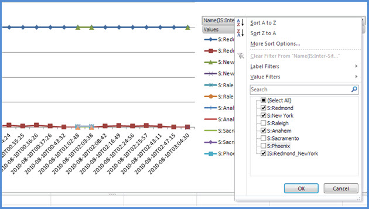
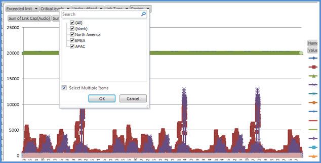
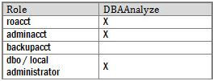
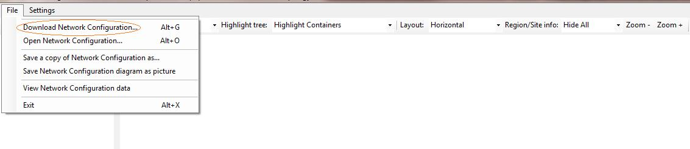
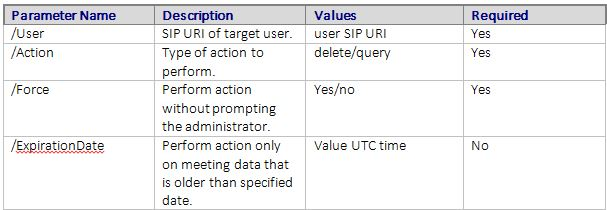

# <a name="skype-for-business-server-2015-resource-kit-tools-documentation"></a>Skype for Business Server documentação de Ferramentas de Kit de Recursos 2015

Este artigo descreve as ferramentas no Kit de Recursos Skype for Business Server 2015, incluindo a finalidade de cada ferramenta e exemplos de seu uso. O Skype for Business Server 2015 Resource Kit ajuda a facilitar as tarefas de rotina para os administradores de IT que implantam e gerenciam o Skype for Business Server 2015. Por exemplo, a **ferramenta Web Conf Data** pode ser usada para controlar facilmente os dados carregados pelos usuários durante uma reunião online. A **ferramenta SEFAUtil** pode ser usada para configurar o encaminhamento de chamada delegada e o atendimento aos usuários. Incentivamos os administradores de IT a usar essas ferramentas para gerenciar com mais eficiência o Skype for Business Server 2015.

## <a name="installation-of-the-resource-kit-tools"></a>Instalação das Ferramentas de Kit de Recursos

Para instalar o Skype for Business Server 2015 Resource Kit, baixe [OCSReskit.msi](https://www.microsoft.com/download/details.aspx?id=52631) do Centro de Download.

Execute **OCSResKit.msi** para fazer uma instalação simples. O .msi instala todas as ferramentas no seguinte caminho: %Arquivos de **Programas%\Skype for Business Server 2015\ResKit**. As ferramentas que são executáveis autocontivedas estão nesta pasta. As ferramentas que também têm arquivos de suporte estão em suas próprias subpastas.

## <a name="supported-environments"></a>Ambientes com suporte

O Skype for Business Server 2015 Resource Kit deve ser instalado em um servidor que atenda às especificações necessárias para o Skype for Business Server 2015, geralmente um sendo usado para executar o Skype for Business Server 2015.

## <a name="resource-kit-tools-overview"></a>Visão geral das Ferramentas de Kit de Recursos

Veja a seguir uma lista das ferramentas fornecidas no Kit de Recursos Skype for Business Server 2015. Uma descrição de cada ferramenta, incluindo os requisitos e o uso de exemplo, é abordada nas seções a seguir.

- [ABSConfig](resource-kit-tools.md#ABSConfig)

- [Monitor de Serviço de Política de Largura de Banda](resource-kit-tools.md#bpsm)

- [Analisador de Utilização de Largura de Banda](resource-kit-tools.md#bua)

- [Chamar Parkometer](resource-kit-tools.md#callpark)

- [DBAnalyze](resource-kit-tools.md#dba)

- [Importar Armazenamento dados de serviço](resource-kit-tools.md#Issd)

- [LCSSync](resource-kit-tools.md#LCSSync)

- [Console do usuário de lookup](resource-kit-tools.md#LUC)

- [MsTurnPing](resource-kit-tools.md#MsTurnPing)

- [Visualizador de Configuração de Rede](resource-kit-tools.md#NCV)

- [Agente do Grupo de Resposta Ao Vivo](resource-kit-tools.md#RGAL)

- [SEFAUtil](resource-kit-tools.md#SEFAUtil)

- [SYSPrep.ps1](resource-kit-tools.md#SYSPrep)

- [Migração de anúncios de números não atribuídos](resource-kit-tools.md#UNAM)

- [Web Conf Data](resource-kit-tools.md#WebConfData)

## <a name="absconfig"></a>ABSConfig
<a name="ABSConfig"> </a>

A ferramenta de Configuração do Serviço de Livro de Endereços (ABSConfig) é uma ferramenta administrativa que ajuda os administradores a personalizar a configuração do Serviço de Livro de Endereços no Skype for Business Server 2015. Essa ferramenta também permite que Skype for Business Server administradores de 2015 restaure as configurações padrão do Serviço de Livro de Endereços.

### <a name="description"></a>Descrição

ABSConfig é um aplicativo de interface gráfica do usuário que permite que os administradores configurem atributos dos Serviços de Domínio do Active Directory relacionados ao Serviço de Livro de Endereços.

Os principais cenários da ferramenta são os seguintes:

- Para permitir que os administradores mapeiem atributos nos Serviços de Domínio do Active Directory para os atributos Skype for Business Server 2015.

- Para permitir que os administradores especifiquem o atributo Serviços de Domínio do Active Directory a serem incluídos ou excluídos nos arquivos do Serviço de Livro de Endereços.

- Para permitir que os administradores restaurem, configurações padrão do Serviço de Livro de Endereços.

A ferramenta ABSConfig pode ser iniciada usando o arquivo ABSConfig.exe. A ferramenta abre para a guia **Configurar Atributos.** Esta tabela tem opções para mapear atributos dos Serviços de Domínio do Active Directory para os campos de atributos do Skype for Business Server 2015 e especificar quais usuários devem incluir ou excluir em arquivos de Serviço de Livro de Endereços com base em filtros de atributos específicos. Ele também tem opções para personalizar qual valor do número de telefone a ser incluído no arquivo do Livro de Endereços. A **opção Restaurar Padrões** permite que os administradores restaurem as configurações do Serviço do Livro de Endereços para valores padrão.

> [!NOTE]
> O novo mapeamento de atributos do AD para nomes de campo OC diferentes funcionará apenas para Download de Arquivo do Livro de Endereços e não é suportado pela Consulta Web do Livro de Endereços.

### <a name="output"></a>Saída

ABSConfig armazena a configuração do Serviço de Livro de Endereços no banco de dados.

```console
Path: %ProgramFiles%\Skype for Business Server 2015\Reskit
```

### <a name="purpose"></a>Objetivo

ABSConfig fornece uma maneira rápida e fácil de personalizar Skype for Business Server Serviço de Livro de Endereços 2015.

### <a name="requirements"></a>Requisitos

#### <a name="computer"></a>Computador

ABSConfig só pode ser executado a partir de um computador ingressado em domínio que tenha Skype for Business Server 2015 instalado. No caso do Skype for Business Server 2015, Edição Enterprise, essa ferramenta pode ser executado em todos os servidores Front-End que tenham o Serviço de Livro de Endereços habilitado durante a instalação.

#### <a name="network"></a>Rede

O computador deve ser capaz de se conectar ao pool Front-End e banco de dados back-end.

#### <a name="software"></a>Software

Os seguintes componentes de software devem ser instalados antes de executar a ferramenta ABSConfig:

- Skype for Business Server 2015

#### <a name="users"></a>Usuários

Administradores que têm as permissões necessárias para atualizar a implantação Skype for Business Server 2015.

### <a name="examples"></a>Exemplos

ABSConfig pode ser iniciado digitandoABSConfig.exe **em** um prompt de comando. Mostrado abaixo está a interface do usuário da ferramenta ABSConfig.


### <a name="summary"></a>Resumo

A ferramenta ABSConfig fornece aos administradores uma ferramenta rápida e fácil de usar para personalizar Skype for Business Server Serviço de Livro de Endereços 2015.

## <a name="bandwidth-policy-service-monitor"></a>Monitor de Serviço de Política de Largura de Banda
<a name="bpsm"> </a>

A ferramenta Monitor do Serviço de Política de Largura de Banda destina-se a permitir que os administradores exibirem uma lista dos seguintes:

1. Todos os serviços de Política de Largura de Banda Skype for Business Server 2015 (Autenticação e Núcleo) configurados na topologia

2. As conexões que cada serviço faz com outros serviços de Política de Largura de Banda e com os servidores de Borda

3. Todos os links configurados no documento de configuração de rede e no uso da largura de banda em tempo real, conforme relatado por cada um dos serviços de Política de Largura de Banda

### <a name="description"></a>Descrição

A ferramenta Monitor do Serviço de Política de Largura de Banda é implementada como um aplicativo baseado em GUI. Os administradores iniciam a ferramenta executando PDPMonUI.exe.

Quando a ferramenta é iniciada, ela tenta descobrir a lista de serviços de Política de Largura de Banda na topologia. Depois que a atualização inicial é feita, o painel à esquerda da janela é preenchido com uma lista de serviços agrupados pelos clusters aos quais pertencem.

Quando os administradores selecionam um determinado Serviço de Política de Largura de Banda, o painel à direita exibe as informações sobre esse serviço específico. Esse painel também tem duas guias principais que exibem informações.

#### <a name="machine-info-tab"></a>Guia Informações do Computador

A **guia Informações do** Computador mostra os detalhes do Serviço de Política de Largura de Banda selecionado e a lista e o estado de todas as conexões que são feitas pelo Serviço de Política de Largura de Banda selecionado para outros serviços.

#### <a name="topology-info-tab"></a>Guia Informações de Topologia

A **guia Informações de Topologia** mostra uma lista de todos os links configurados nas configurações de rede. Para cada link, a capacidade de largura de banda de áudio e vídeo é exibida. Além disso, a largura de banda atualmente utilizada é exibida, tanto em Kbps quanto como uma porcentagem da capacidade. A ferramenta usa codificação de cores para realçar links que têm utilização próxima à capacidade, o que permite que os administradores isolem rapidamente esses links.

> [!NOTE]
>  Se a ferramenta Monitor do Serviço de Política de Largura de Banda tiver falhas quando se conectar a qualquer um dos serviços de Política de Largura de Banda configurados, as informações nas guias **Informações** do Computador e Informações de **Topologia** não serão preenchidas. No entanto, é possível que a ferramenta possa se conectar inicialmente, mas, posteriormente, perder sua conexão com o serviço. Nesses casos, os administradores podem ver informações desatualizadas. Há um carimbo **de** hora Última Atualização em cada uma das guias que podem permitir que os administradores vejam quando os dados foram atualizados pela última vez para um determinado Serviço de Política de Largura de Banda.

### <a name="output"></a>Saída

Não há saída de linha de comando; a saída do programa está contida na interface do usuário gráfica principal (GUI).

### <a name="purpose"></a>Objetivo

O objetivo da ferramenta Monitor de Serviço de Política de Largura de Banda é permitir que os administradores visibilidade do estado de cada um dos serviços de Política de Largura de Banda definidos na topologia. Além disso, os administradores podem ver o uso de largura de banda em tempo real para todos os links definidos no documento de configuração de rede.

### <a name="requirements"></a>Requisitos

A ferramenta Monitor de Serviço de Política de Largura de Banda precisa ser executado em um computador que faz parte da topologia Skype for Business Server de largura de banda.

### <a name="summary"></a>Resumo

A ferramenta Monitor de Serviço de Política de Largura de Banda pode ser um recurso valioso para os administradores para que eles possam inspecionar o estado de todos os serviços de Política de Largura de Banda na topologia e, o mais importante, eles podem obter utilização de largura de banda em tempo real para os links definidos nas configurações de rede.

## <a name="bandwidth-utilization-analyzer"></a>Analisador de Utilização de Largura de Banda
<a name="bua"> </a>

O Analisador de Utilização de Largura de Banda é uma ferramenta que cria relatórios sobre várias exibições de consumo de largura de banda pelos pontos de extremidade da UC em links WAN na rede corporativa. Esses relatórios podem ser usados para entender o padrão de consumo de largura de banda atual e para ajudar no planejamento da capacidade de largura de banda.

### <a name="description"></a>Descrição

O Analisador de Utilização de Largura de Banda é implementado como um aplicativo baseado em GUI. Essa ferramenta gera relatórios especificamente para utilização de áudio em toda a rede e ajuda no planejamento de capacidade. Ele também itera na capacidade de largura de banda atribuída a vários links.

### <a name="output"></a>Saída

O Analisador de Utilização de Largura de Banda fornece plotações gráficas de capacidade de largura de banda e utilização de áudio para todos os links WAN configurados no sistema.

### <a name="purpose"></a>Objetivo

Em qualquer implantação de voz e vídeo, é fundamental monitorar e entender a tendência de utilização de largura de banda do tráfego de mídia em toda a rede corporativa. A ferramenta Analisador de Utilização de Largura de Banda permite que um administrador alcance exatamente isso. Esta ferramenta faz o seguinte:

- Gera relatórios específicos para utilização de áudio em toda a rede

- Ajuda com o planejamento e a iteração de capacidade mais eficazes na capacidade de largura de banda atribuída a vários links

O Analisador de Utilização de Largura de Banda pode gerar plotagens gráficas de relatórios de capacidade de largura de banda e utilização; eles são os seguinte:

- Todos os links WAN na rede corporativa

- Filtrado por links WAN selecionados que foram escolhidos

- Filtrado por links WAN que excederam a capacidade de link

- Filtrado por links WAN que estão sub-utilizando a largura de banda provisionada

- Filtrar por links WAN que tenham atingido níveis críticos (uma utilização de largura de banda maior que 90% da capacidade de largura de banda do link WAN)

- Filtrado por tipo de link WAN — links de site de rede, links interregionais e links em um site

- Filtrada por região de rede

#### <a name="applications"></a>Aplicativos

O Analisador de Utilização de Largura de Banda tem os dois aplicativos a seguir (ferramentas):

- **WanLinkLogCollector.exe** Essa ferramenta permite que seu usuário inser as informações necessárias.

- **BandwidthUtilizationAnalyzer.xlsm** Um relatório Microsoft Excel software de planilha é automaticamente WanLinkLogCollector.exe. Esse aplicativo permite que o usuário aplique filtros ao relatório, conforme mostrado posteriormente neste artigo.

#### <a name="phases-of-using-bandwidth-utilization-analyzer"></a>Fases do Uso do Analisador de Utilização de Largura de Banda

Há duas fases ao usar o Analisador de Utilização de Largura de Banda:

- Coletar logs, que são executados usando WanLinkLogCollector.exe

- Personalizar relatórios, que são executados usando BandwidthUtilizationAnalyzer.xlsm

    > [!IMPORTANT]
    > É recomendável que BandwidthUtilizationAnalyzer.xlsm não seja lançado manualmente pelos usuários finais.

#### <a name="starting-bandwidth-utilization-analyzer"></a>Iniciando o Analisador de Utilização de Largura de Banda

Inicie WanLinkLogCollector.exe no prompt de comando ou usando Windows Explorer.

 **Usando WanLinkLogCollector.exe**

Há três etapas para usar WanLinkLogCollector.exe:

1. **Registrar a linha do tempo** Forneça a linha do tempo para a que o relatório precisa ser gerado

2. **Especificar os diretórios de arquivos** Fornecer informações sobre o local do arquivo

3. **Coletar os logs e iniciar o visualizador de relatórios** Execute o comando para gerar o relatório

#### <a name="step-1---log-the-timeline"></a>Etapa 1 - Registrar a linha do tempo

Registrar a linha do tempo permite que o usuário da ferramenta especifique o seguinte, conforme mostrado na figura abaixo.

1. **Data de início** Esta é a data de início da linha do tempo para a quais o relatório deve ser gerado; por exemplo, 1º de agosto de 2010.

2. **Data de término** Esta é a data de término da linha do tempo para a quais o relatório deve ser gerado; por exemplo, 30 de setembro de 2010.

     

#### <a name="step-2---specify-the-file-directories"></a>Etapa 2 - Especificar os diretórios de arquivos

Os diretórios de arquivos a seguir podem ser especificados pelo usuário, conforme mostrado.

- **Local dos arquivos de log do servidor** O local da pasta onde os logs do servidor de política de largura de banda são armazenados. Isso normalmente está na \<fileserver\> \\<fe \> \AppServerFiles\PDP.

- **Local de armazenamento de arquivo temporário** O local do arquivo temporário onde arquivos intermediários são armazenados enquanto o relatório está sendo gerado.

    

    > [!NOTE]
    > Certifique-se de que o acesso de arquivo suficiente aos logs do servidor e à pasta de armazenamento de arquivos temporários seja fornecido ao usuário da ferramenta.

#### <a name="step-3---collect-the-logs-and-start-the-report-viewer"></a>Etapa 3 - Coletar os logs e iniciar o visualizador de relatórios

Para coletar os logs e iniciar o visualizador de relatórios, clique em **Executar** conforme mostrado abaixo. Esta etapa coleta os dados necessários.


Quando a validação de entrada é bem-sucedida, a mensagem mostrada abaixo é exibida.


Clique em **OK**. BandwidthUtilizationAnalyzer.xlsm é iniciado automaticamente. Siga as instruções na caixa de mensagem. Para obter detalhes, consulte **Using BandwidthUtilizationAnalyzer.xlsm** na próxima seção.


### <a name="using-bandwidthutilizationanalyzerxlsm"></a>Usando BandwidthUtilizationAnalyzer.xlsm

1. Quando BandwidthUtilizationAnalyzer.xlsm for iniciado automaticamente, clique **em Atualizar,** conforme mostrado abaixo.

     

2. Quando uma pasta de arquivo for aberta, selecione consolidated.csv do local especificado na caixa de mensagem, conforme mostrado abaixo. Ele também mostra o local como **C:\Temp**.

     

3. Clique em **Importar**.

4. O plot gráfico é gerado automaticamente. Ele está disponível quando o ponteiro de trabalho no plano de fundo desaparece.

     

#### <a name="applying-filters-to-the-report-view"></a>Aplicando filtros à exibição de relatório

Os filtros que podem ser aplicados à exibição de relatório, conforme mostrado abaixo, são descritos da seguinte forma:


1. **Nome** Filtrar por links WAN (o filtro está no lado direito do gráfico). O prefixo indica os seguintes tipos de link; consulte a caixa vertical (azul):

   - **S Site** O link WAN de um site de rede para uma região de rede

   - **IS Inter-Site** O link WAN entre dois sites de rede

   - **R Inter-Região** O link WAN entre duas regiões de rede

2. **Limite excedido** Filtrar por links WAN cuja utilização de largura de banda é maior do que a capacidade de largura de banda

3. **Níveis críticos** Filtrar por links WAN cuja utilização de largura de banda atingiu 90% ou mais do que a capacidade de largura de banda

4. **Subutilizou** Filtrar por links WAN cuja utilização de largura de banda tenha sido inferior a 25% da capacidade de largura de banda

5. **Tipo de link** Filtrar pelos seguintes tipos de links WAN:

   - **Tipo de site de** rede

   - **Tipo entre sites**

   - **Tipo de link entre regiões**

6. **Região** Filtrar por região de rede

As figuras a seguir mostram os filtros descritos anteriormente.

Filtrar por **Nome**. Selecione a lista de links que precisam ser exibidos no gráfico.



Filtrar **por limite excedido**. Selecione **True** para impor o filtro.


Filtrar por **níveis críticos**. Selecione **True** para impor o filtro.


Filtrar **por Subutilizou**. Selecione **True** para impor o filtro.


Filtrar por **Tipo de Link**. Selecione o tipo ou os tipos que precisam ser exibidos.


Filtrar por **Região**. Selecione uma lista de regiões cujos links precisam ser exibidos.



### <a name="requirements"></a>Requisitos

- O .NET Framework 3.5

- Microsoft Excel 2010 ou Excel 2007

### <a name="summary"></a>Resumo

O Analisador de Utilização de Largura de Banda é usado para plotar a utilização de largura de banda de áudio para o tráfego de UC na rede. Essa ferramenta também pode ser usada para relatar a utilização da largura de banda de vídeo na rede.

## <a name="call-parkometer"></a>Chamar Parkometer
<a name="callpark"> </a>

Call Parkometer é um aplicativo de linha de comando que fornece acesso fácil ao banco de dados de órbita do Estacionamento de Chamada.

### <a name="description"></a>Descrição

Call Parkometer é uma ferramenta para rastrear chamadas estacionadas no momento. Ele também coleta estatísticas sobre órbitas e uso do Servidor de Estacionamento de Chamada (CPS). Essa ferramenta de linha de comando fornece acesso de leitura e gravação à órbita cps SQL Server banco de dados de um computador local ou conectado remotamente.

Todas as opções são mutuamente exclusivas. A sintaxe de linha de comando é a seguinte:

- **-o** parameter — lista todos os intervalos de órbita configurados para esse pool.

- **-n** parameter — lista todas as órbitas usadas no momento neste pool. As informações exibidas são as seguinte:

  - URI (Identificador de Recurso Uniforme SIP) do parkee e do parker.

  - Nome do host do CPS onde a chamada está estacionada.

  - Carimbo de data/hora de quando a chamada foi estacionada.

- **-f** parameter — lista o número de órbitas atualmente livres no pool.

- **-r \<n\>** parameter — lista as \<n\> últimas chamadas estacionadas. As informações exibidas são as seguinte:

  - URI SIP parkee.

  - URI SIP do Parker.

  - Nome do host do CPS onde a chamada foi estacionada.

  - Carimbo de data/hora de quando a chamada foi recuperada ou retirada.

- **-t \<n\>** parameter - testa a reserva de uma órbita no banco de dados para mostrar a aleatoriedade dos números de órbita atribuídos.

### <a name="output"></a>Saída

Dependendo dos parâmetros de entrada especificados em um prompt de comando, o Estacionamento de Chamada exibe a seguinte saída:

- Todos os intervalos de órbita configurados para este pool

- Chamadas estacionadas no momento

- Número de órbitas livres (disponíveis)

- Chamadas estacionadas recentemente

- Órbitas reservadas para testar valores de órbita uniforme e aleatória

### <a name="purpose"></a>Objetivo

O objetivo da ferramenta CPS é fornecer acesso de linha de comando ao banco de dados CPS. O administrador pode exibir o uso do CPS e determinar o número de órbitas atribuídas a um pool.

### <a name="requirements"></a>Requisitos

Não há requisitos se essa ferramenta for executado no mesmo computador que está executando CPS. Se essa ferramenta for executado em um computador remoto, o banco de dados SQL Server usado pelo Skype for Business Server 2015 deve ser configurado para permitir o acesso remoto. O Parkometer de chamada deve ser configurado com uma cadeia de SQL Server de conexão de banco de dados para se conectar ao SQL Server. Essa SQL Server de conexão de banco de dados é definida no arquivo de configuração, **parkometer.exe.config**. Ele deve ser colocado no mesmo diretório onde parkometer.exe está localizado. O arquivo XML a seguir é um exemplo de um parkometer.exe.config. Os parâmetros que devem ser configurados são nome de usuário (por exemplo, mydomain\Administrator), senha (por exemplo, mypassword) e nome do host (por exemplo, myserver).

```xml
<?xml version="1.0" encoding="utf-8" ?>
<configuration>
  <appSettings>
   <add key="SQL" value="server=myserver\RTC;
database=cpsdyn;
User Id=mydomain\Administrator;
Password=mypassword.;
Integrated Security=false;"/>
  </appSettings>
</configuration>
```

### <a name="examples"></a>Exemplos

Intervalos de órbita implantados: o parâmetro -o lista todos os intervalos de órbita configurados para esse pool, conforme mostrado


Chamadas estacionadas no momento: o parâmetro -n lista todas as órbitas usadas no momento neste pool, conforme mostrado


Número de órbitas livres: o parâmetro -f lista o número de órbitas atualmente livres no pool, conforme mostrado


Chamadas estacionadas recentemente: o parâmetro -r \<n\> lista as últimas chamadas \<n\> estacionadas, conforme mostrado


Test orbit reservation: the -t \<n\> parameter tests reserving an orbit in the database as shown


### <a name="summary"></a>Resumo

Call Parkometer é uma ferramenta de linha de comando que fornece informações detalhadas sobre o Servidor de Estacionamento de Chamada.

## <a name="dbanalyze"></a>DBAnalyze
<a name="dba"> </a>

### <a name="description"></a>Descrição

DBAnalyze é uma ferramenta de linha de comando que ajuda os administradores a coletar relatórios de análise sobre os bancos de dados Skype for Business Server 2015. DBAnalyze tem os seguintes modos: diagnóstico, dados do usuário, conferência, MCUs e fragmentação de disco:

- **Modo de diagnóstico** Cria um relatório que inclui informações sobre tabelas (número de registros, fragmentação, tamanho dos dados e tamanho do índice), tamanhos de arquivos de dados e de log, o último tempo de back-up, a distribuição de contatos entre servidores que estão executando o Microsoft Office Communications Server, o número médio de permissões, contatos, contêineres, assinaturas, publicações, pontos de extremidade por usuário, usuários que não podem ser roteados incorretamente, usuários que não podem ser roteados,  o número médio de conferências organizadas por usuário, conferências agendadas, conferências ativas e a versão do banco de dados.

    > [!NOTE]
    > Executar o modo de diagnóstico pode afetar o desempenho do servidor.

- **Modo de dados do usuário** Relata dados de contato, contêiner, assinatura, publicação, permissão e grupo de contatos para um usuário especificado ou para usuários que têm esse usuário em suas listas de contatos e permissões. Esse modo também relata dados de resumo para conferências que um usuário organiza ou é convidado.

- **Modo de conferência** Relata dados detalhados para uma conferência específica, incluindo todos os detalhes de tempo de agendamento para a conferência, a lista de convidados, a lista de tipos de mídia permitidos para a conferência, MCUs ativos (unidades de controle de vários pontos), a lista de participantes ativos e o estado de sinalização de cada participante.

- **Decodificar a ID da Reunião** Decodifica uma ID de reunião PSTN (rede telefônica pública comutado) especificada pela opção **/pstnid,** mas que não se conecta ao back-end para obter informações detalhadas.

- **Resolver conferência** Decodifica uma ID de reunião PSTN especificada pela opção **/pstnid** e exibe informações sobre a conferência indicada pela ID.

- **Modo MCUs** Relata a ID, o tipo de mídia, a URL, o status da pulsação, a carga de conferência e a carga do participante para cada MCU no pool.

- **Modo de fragmentação de disco** Exibe o status de fragmentação de todos os discos.

Essa ferramenta pode ser usada para diagnosticar vários problemas ou para ajudar os administradores com o planejamento de capacidade. Por exemplo, se a maioria dos usuários que estão no servidor A escolher usuários no servidor B como seus contatos, o administrador poderá mover os usuários no servidor A para o servidor B para reduzir o tráfego entre servidores.

### <a name="output"></a>Saída

Esta ferramenta saídas de relatórios predefinidos sobre o banco de dados Skype for Business Server 2015. **Caminho**: %ProgramFiles%\Skype for Business Server 2015\Reskit

### <a name="purpose"></a>Objetivo

Para instalar Dbanalyze.exe, copie-o para uma pasta local e execute a ferramenta. Para usar a ferramenta, execute o seguinte comando na linha de comando. `dbanalyze.exe [/v] [/report:value] [/sqlserver:value] [/user:user@domain.com] [/conf:value][/pstnid:Value] [/maxcontacts:value]` As descrições das opções de linha de comando são mostradas abaixo.


### <a name="requirements"></a>Requisitos

 **Computador** DBAnalyze só pode ser executado a partir de um computador ingressado em domínio que tenha Skype for Business Server 2015 instalado.

 **Rede** O computador deve ser capaz de se conectar ao banco de dados back-end.

 **Os** Skype for Business Server de software 2015 devem ser instalados antes de executar o DBAnalyze.

 **Usuários** A tabela a seguir mostra os administradores que têm as permissões necessárias para acessar Skype for Business Server bancos de dados 2015.



> [!NOTE]
> Uma conta de administrador local é necessária para **o modo /report:disk.**

### <a name="examples"></a>Exemplos

Veja a seguir exemplos de comandos Dbanalyze.exe válidos:

```console
dbanalyze.exe /report:diag
dbanalyze.exe /report:user /user:usera@domainb.com
dbanalyze.exe /report:conf /user:bob@example.com /conf:1W9J71SKSX2X
dbanalyze.exe /report:resolve /pstnid:12345
dbanalyze.exe /report:mcus
dbanalyze.exe /report:disk
```

### <a name="summary"></a>Resumo

O DBAnalyzer fornece aos administradores uma análise rápida e fácil Skype for Business Server 2015.

## <a name="import-storage-service-data"></a>Importar Armazenamento dados de serviço
<a name="Issd"> </a>

A ferramenta de kit de recursos ImportStorageServiceData permite a reportação de dados de Fila e Ponto de Extremidade que foram liberados do LYSS (serviço de Armazenamento) de volta para o serviço Armazenamento.

### <a name="description"></a>Descrição

Os dados liberados do serviço Armazenamento podem ter sido automáticos (periódicos) com base no status do Item da Fila ou no tamanho do banco de dados. Isso pode ter ocorrido devido à invocação manual do cmdlet de failover do pool ou do cmdlet StorageServiceFullFlush (que o cmdlet de failover do pool invoca). Observe que o ideal é que os dados não sejam reemportados se qualquer um dos tamanhos de banco de dados do LYSS (Serviço de Armazenamento) nas extremidades front-ends estiver acima do nível normal, pois isso provavelmente fará com que mais dados sejam exportados de volta. Além disso, quaisquer problemas que poderiam ter contribuído para erros que causaram o crescimento da Fila de Serviços Armazenamento do Armazenamento primeiro devem ser resolvidos Exchange (por exemplo, erros de ponto de extremidade, problemas de rede ou outros problemas).

 **Cenário 1: durante** o failover do pool, os arquivos podem ser liberados do serviço de armazenamento para cada front-end. Depois que o failover for concluído, a ferramenta deverá ser executado para reaportar os dados.

 **Cenário 2:** os dados são liberados automaticamente todos os dias ou em resposta ao banco de dados do serviço Armazenamento excedendo determinados limites de tamanho (por exemplo, 60%, 80%, 90% completo). Esses dados liberados automaticamente devem ser reemportados rotineiramente pelo administrador. Na situação acima, se o pacote SCOM de monitoramento não for implantado, haverá eventos para o serviço Skype for Business Server Armazenamento relacionados aos dados que estão sendo liberados do serviço Armazenamento de monitoramento. IDs de evento de 32075 (operação de liberação total iniciada), 32076 (liberação total concluída), 32082 (liberação de nível de manutenção iniciada), 32083 (liberação de nível de manutenção concluída), 32089 (flush ocorreu devido ao preenchimento do banco de dados). Observe que essas IDs de evento correspondem à versão RTM. Quando um administrador vê esses eventos, significa que há arquivos que foram liberados. Esses dados devem ser importados rotineiramente usando essa ferramenta, por exemplo, uma vez por semana.

Para a versão do Serviço Online, se o pacote SCOM de monitoramento de saúde para Skype for Business Server for implantado, haverá novos alertas que podem ser acionados que solicitam que o administrador reporte os dados liberados de volta para o serviço Armazenamento. Haverá um evento correspondente no log de eventos no servidor Front-End que disparou o alerta. O evento dará uma descrição do caminho Pai no qual os arquivos de dados liberados estão localizados e quantos arquivos há que atendem aos critérios de alerta. O critério de alerta é que há X ou mais arquivos no caminho pai específico que têm pelo menos dias Y (onde X e Y são predefinidos no StorageService, mas podem ser substituídos alterando o arquivo APPCONFIG.) Dois exemplos de eventos que podem disparar o alerta de saúde são mostrados abaixo, com a diferença sendo seu caminho pai. Uma possibilidade está em compartilhamento de arquivos de serviço Web, enquanto a outra possibilidade é o diretório de Dados de Aplicativo local de cada front-end. (por exemplo, c:\ProgramData\Microsoft\Skype for Business Server 2015\StorageService). Em seguida, o administrador executará essa ferramenta de reskit.

Essa ferramenta aumentará a carga de CPU e E/S no front-end em que está sendo executada e em outros front-ends, na situação em que os dados não são de propriedade do front-end em que a ferramenta é executada. Recomendamos executar essa ferramenta quando as front ends não estão sob carga pesada de CPU e E/S, por exemplo, fora do horário de pico. Em segundo lugar, essa ferramenta pode de 2 a 3 minutos para importar um arquivo de dados. Lembre-se disso ao estimar por quanto tempo a ferramenta estará em execução. O arquivo de log detalhado gerado pela ferramenta será exibido por padrão no Arquivo Store. Exclua-o se não houver erros relatados, pois o arquivo de log pode ter dezenas de MB ou mais.


### <a name="requirements"></a>Requisitos

Instale as ferramentas Skype for Business Server Kit de Recursos 2015. A ferramenta é executado em máquinas ingressadas no domínio em que Skype for Business Server e Skype for Business Server Shell de Gerenciamento estão instalados. A ferramenta usa um cmdlet do shell de gerenciamento para identificar todos os servidores Front-End no pool. Em segundo lugar, a ferramenta deve ser executada de um computador no pool que tenha o banco de **dados RtcLocal** instalado. Esse banco de dados é usado pela ferramenta para recuperar o local do compartilhamento de arquivos WEBSERVICE para o pool. Além disso, antes de usar Front-End ferramenta, cada servidor Front-End deve primeiro habilitar o Windows PowerShell Remoting usando **Enable-PSRemoting** em cada servidor Front-End e o computador de onde a ferramenta é executada. Caso contrário, Windows PowerShell comandos remotos desta ferramenta falharão. Windows PowerShell O remoting pode ser desligado em todos os Front-End no pool depois que ele for concluído. Por fim, a conta ou a credencial que invoca a ferramenta deve ter permissão de leitura/gravação para o compartilhamento de arquivos do webservice para o pool em que está executando essa ferramenta. Caso contrário, a ferramenta falhará com erros de Permissão de E/S.

> [!NOTE]
> No Windows Server 2012, Windows PowerShell Remoting está habilitado por padrão, mas não no sistema operacional Windows Server 2008.

### <a name="examples"></a>Exemplos

```console
>  C:\StorageService>ImportStorageServiceData.exe
Description:
This tool will re-import Storage Service (LYSS) flushed queue data back in.  For a pool: you are required to run this tool on a machine inside the pool which has the Lync Server Management Shell installed.  Additionally, all front end machines need to have Windows Powershell Remoting enabled before executing this tool by executing Enable-PSRemoting.  Also, please ensure that all Storage Service instance DB Size are at the 'Normal' level (verify this by viewing Eventlog events). Otherwise re-importing may cause data to be flushed out again if any Storage Service instance DB size level goes above 'Normal'.
Usage: Default behavior is to Import data from web service file share as well as any files on all Front End machines in pool.
Additional Options:
-Verbose                    : Turn verbose output on.

-StorageServiceHostName     : Host Name of Storage Service WCF endpoint.  ( Default=localhost netnamedpipe binding. )

-FileSharePath              : Import only all data from just under the UNC path specified.

ActivityID: cc3b62ff-bb66-4e61-a6e2-96cb3626315c. <-- Use this to correlate with StorageService trace logs if troubleshooting.
Type Server name (TCP binding) or press <enter> for localhost (NamePipe binding):
Using NetNamedPipeBinding...
OnTopologyChanged Event received
Web Service File Share: \\dc.vdomain.com\OcsFileStore\co1-WebServices-1\StorageService

Front Ends:
server.vdomain.com
server2.vdomain.com
server1.vdomain.com
server3.vdomain.com
Looking under directory: \\dc.vdomain.com\OcsFileStore\co1-WebServices-1\StorageService for exported data.
# Files found: 8
Starting Import for file:\\dc.vdomain.com\OcsFileStore\co1-WebServices-1\StorageService\DataExport\2
0120910\SERVER.vdomain.com\944f5724c65c5f93900dc1c8c898b102__0.xml
Items deserialized: 20

All items in file were enqueued successfully, will try to delete file: \\dc.vdomain.com\OcsFileStore\co1-WebServices-1\StorageService\DataExport\20120910\SERVER.vdomain.com\944f5724c65c5f93900dc1c8c898b102__0.xml

All items in file failed to enqueue so file will not be deleted.  File path: \\dc.vdomain.com\OcsFileStore\co1-WebServices-1\StorageService\DataExport\20120910\SERVER.vdomain.com\944f5724c65c5f93900dc1c8c898b102__0.xml

Summary for file \\dc.vdomain.com\OcsFileStore\co1-WebServices-1\StorageService\DataExport\20120910\SERVER.vdomain.com\944f5724c65c5f93900dc1c8c898b102__0.xml: succeeded: 20, failed: 0

Starting Import for file:\\dc.vdomain.com\OcsFileStore\co1-WebServices-1\StorageService\DataExport\20120910\SERVER1.vdomain.com\17d5435ae40259f7bbdf1866776386e4__0.xml
Items deserialized: 20

[cc3b62ff-bb66-4e61-a6e2-96cb3626315c] Send EnqueueMessages to redirected, targetServer=server1.vdomain.com, queueItems=20

All items in file were enqueued successfully, will try to delete file: \\dc.vdomain.com\OcsFileStore\co1-WebServices-1\StorageService\DataExport\20120910\SERVER1.vdomain.com\17d5435ae40259f7bbdf1866776386e4__0.xml

All items in file failed to enqueue so file will not be deleted.  File path: \\dc.vdomain.com\OcsFileStore\co1-WebServices-1\StorageService\DataExport\20120910\SERVER1.vdomain.com\17d5435ae40259f7bbdf1866776386e4__0.xml

Summary for file \\dc.vdomain.com\OcsFileStore\co1-WebServices-1\StorageService\DataExport\20120910\
SERVER1.vdomain.com\17d5435ae40259f7bbdf1866776386e4__0.xml: succeeded: 20, failed: 0

Starting Import for file:\\dc.vdomain.com\OcsFileStore\co1-WebServices-1\StorageService\DataExport\20120910\SERVER1.vdomain.com\904f6c9b8ac951ae8b3c86684d3832e4__0.xml

Items deserialized: 20
[cc3b62ff-bb66-4e61-a6e2-96cb3626315c] Send EnqueueMessages to redirected, targetServer=server1.vdomain.com, queueItems=20

All items in file were enqueued successfully, will try to delete file: \\dc.vdomain.com\OcsFileStore
\co1-WebServices-1\StorageService\DataExport\20120910\SERVER1.vdomain.com\904f6c9b8ac951ae8b3c86684d
3832e4__0.xml

All items in file failed to enqueue so file will not be deleted.  File path: \\dc.vdomain.com\OcsFil
eStore\co1-WebServices-1\StorageService\DataExport\20120910\SERVER1.vdomain.com\904f6c9b8ac951ae8b3c
86684d3832e4__0.xml

Summary for file \\dc.vdomain.com\OcsFileStore\co1-WebServices-1\StorageService\DataExport\20120910\
SERVER1.vdomain.com\904f6c9b8ac951ae8b3c86684d3832e4__0.xml: succeeded: 20, failed: 0

Starting Import for file:\\dc.vdomain.com\OcsFileStore\co1-WebServices-1\StorageService\DataExport\2
0120910\SERVER2.vdomain.com\69844a271e6c5633a1f2b46a42287dd6__0.xml

Items deserialized: 20

[cc3b62ff-bb66-4e61-a6e2-96cb3626315c] Send EnqueueMessages to redirected, targetServer=server2.vdom
ain.com, queueItems=20

All items in file were enqueued successfully, will try to delete file: \\dc.vdomain.com\OcsFileStore
\co1-WebServices-1\StorageService\DataExport\20120910\SERVER2.vdomain.com\69844a271e6c5633a1f2b46a42
287dd6__0.xml

All items in file failed to enqueue so file will not be deleted.  File path: \\dc.vdomain.com\OcsFil
eStore\co1-WebServices-1\StorageService\DataExport\20120910\SERVER2.vdomain.com\69844a271e6c5633a1f2
b46a42287dd6__0.xml

Summary for file \\dc.vdomain.com\OcsFileStore\co1-WebServices-1\StorageService\DataExport\20120910\
SERVER2.vdomain.com\69844a271e6c5633a1f2b46a42287dd6__0.xml: succeeded: 20, failed: 0

Starting Import for file:\\dc.vdomain.com\OcsFileStore\co1-WebServices-1\StorageService\DataExport\2
0120910\SERVER3.vdomain.com\3313935458e35b9b9759e08a15d251e6__0.xml

Items deserialized: 20

[cc3b62ff-bb66-4e61-a6e2-96cb3626315c] Send EnqueueMessages to redirected, targetServer=server3.vdom
ain.com, queueItems=1

All items in file were enqueued successfully, will try to delete file: \\dc.vdomain.com\OcsFileStore
\co1-WebServices-1\StorageService\DataExport\20120910\SERVER3.vdomain.com\3313935458e35b9b9759e08a15
d251e6__0.xml

All items in file failed to enqueue so file will not be deleted.  File path: \\dc.vdomain.com\OcsFil
eStore\co1-WebServices-1\StorageService\DataExport\20120910\SERVER3.vdomain.com\3313935458e35b9b9759
e08a15d251e6__0.xml

Summary for file \\dc.vdomain.com\OcsFileStore\co1-WebServices-1\StorageService\DataExport\20120910\
SERVER3.vdomain.com\3313935458e35b9b9759e08a15d251e6__0.xml: succeeded: 20, failed: 0

Starting Import for file:\\dc.vdomain.com\OcsFileStore\co1-WebServices-1\StorageService\DataExport\2
0120910\SERVER3.vdomain.com\4501e04eae4856059346949ff817c220__0.xml
Items deserialized: 20
[cc3b62ff-bb66-4e61-a6e2-96cb3626315c] Send EnqueueMessages to redirected, targetServer=server3.vdom
ain.com, queueItems=1
All items in file were enqueued successfully, will try to delete file: \\dc.vdomain.com\OcsFileStore
\co1-WebServices-1\StorageService\DataExport\20120910\SERVER3.vdomain.com\4501e04eae4856059346949ff8
17c220__0.xml
All items in file failed to enqueue so file will not be deleted.  File path: \\dc.vdomain.com\OcsFil
eStore\co1-WebServices-1\StorageService\DataExport\20120910\SERVER3.vdomain.com\4501e04eae4856059346
949ff817c220__0.xml

Summary for file \\dc.vdomain.com\OcsFileStore\co1-WebServices-1\StorageService\DataExport\20120910\
SERVER3.vdomain.com\4501e04eae4856059346949ff817c220__0.xml: succeeded: 20, failed: 0
Starting Import for file:\\dc.vdomain.com\OcsFileStore\co1-WebServices-1\StorageService\DataExport\2
0120910\SERVER3.vdomain.com\5ad77443ad955a22a876749be66d5317__0.xml

Items deserialized: 20
[cc3b62ff-bb66-4e61-a6e2-96cb3626315c] Send EnqueueMessages to redirected, targetServer=server3.vdom
ain.com, queueItems=20
All items in file were enqueued successfully, will try to delete file: \\dc.vdomain.com\OcsFileStore
\co1-WebServices-1\StorageService\DataExport\20120910\SERVER3.vdomain.com\5ad77443ad955a22a876749be6
6d5317__0.xml
All items in file failed to enqueue so file will not be deleted.  File path: \\dc.vdomain.com\OcsFil
eStore\co1-WebServices-1\StorageService\DataExport\20120910\SERVER3.vdomain.com\5ad77443ad955a22a876
749be66d5317__0.xml
Summary for file \\dc.vdomain.com\OcsFileStore\co1-WebServices-1\StorageService\DataExport\20120910\
SERVER3.vdomain.com\5ad77443ad955a22a876749be66d5317__0.xml: succeeded: 20, failed: 0
Starting Import for file:\\dc.vdomain.com\OcsFileStore\co1-WebServices-1\StorageService\DataExport\2
0120910\SERVER3.vdomain.com\a11e27ae439a582288d4657eda86b565__0.xml
Items deserialized: 20
[cc3b62ff-bb66-4e61-a6e2-96cb3626315c] Send EnqueueMessages to redirected, targetServer=server3.vdom
ain.com, queueItems=20
All items in file were enqueued successfully, will try to delete file: \\dc.vdomain.com\OcsFileStore
\co1-WebServices-1\StorageService\DataExport\20120910\SERVER3.vdomain.com\a11e27ae439a582288d4657eda
86b565__0.xml
All items in file failed to enqueue so file will not be deleted.  File path: \\dc.vdomain.com\OcsFil
eStore\co1-WebServices-1\StorageService\DataExport\20120910\SERVER3.vdomain.com\a11e27ae439a582288d4
657eda86b565__0.xml
Summary for file \\dc.vdomain.com\OcsFileStore\co1-WebServices-1\StorageService\DataExport\20120910\
SERVER3.vdomain.com\a11e27ae439a582288d4657eda86b565__0.xml: succeeded: 20, failed: 0
All files have been imported into Storage Service for path: \\dc.vdomain.com\OcsFileStore\co1-WebSer
vices-1\StorageService
Importing files for: server.vdomain.com
No files founds.
Importing files for: server2.vdomain.com
No files founds.
Importing files for: server1.vdomain.com
No files founds.
Importing files for: server3.vdomain.com
No files founds.
Writing log: \\dc.vdomain.com\OcsFileStore\co1-WebServices-1\StorageService\ImportStorageServiceData
Log20120910_1609SS
Tool has finished execution.
>  C:\StorageService>
```

## <a name="lcssync"></a>LCSSync
<a name="LCSSync"> </a>

A ferramenta LCSSync ajuda a implantar Skype for Business Server software de comunicação 2015 em um ambiente de várias florestas. Essa ferramenta é usada para sincronizar usuários e grupos de diferentes florestas de usuários como um objeto de contato dos Serviços de Domínio do Active Directory para uma floresta central onde o Skype for Business Server 2015 está instalado.

### <a name="description"></a>Descrição

 O LCSSync usa os objetos de contato sincronizados dos Serviços de Domínio do Active Directory na floresta central para habilitar os usuários para Skype for Business Server. Para fornecer uma única assinatura, a conta de usuário principal deve ser mapeada para o objeto de contato serviços de domínio do Active Directory na floresta central para Skype for Business Server 2015. Essa ferramenta ajuda a executar esse mapeamento. Esta ferramenta fornece modelos para a criação de Agentes de Gerenciamento no Servidor de Integração de Identidade da Microsoft.

### <a name="summary"></a>Resumo

A ferramenta LCSSync ajuda a implantar o Skype for Business Server 2015 em um ambiente de várias florestas.

## <a name="lookup-user-console"></a>Console do usuário de lookup
<a name="LUC"> </a>

A ferramenta LookupUserConsole exibe informações de roteamento Skype for Business Server internas sobre usuários específicos. Essas informações podem ser úteis para o suporte pessoal da Microsoft no diagnóstico de problemas de implantação e roteamento.

### <a name="description"></a>Descrição

 A execução LookupUserConsole.exe abrirá um prompt de comando que aceita endereços SIP e tenta exibir informações de roteamento Skype for Business Server internas relacionadas. Digite **exit** para sair da ferramenta LookupUserConsole.

### <a name="requirements"></a>Requisitos

Instale o Skype for Business Server 2015 Resource Kit. A ferramenta é executado em máquinas ingressadas no domínio onde Skype for Business Server está instalada.

### <a name="examples"></a>Exemplos

C:\Program Files\Skype for Business Server 2015\ResKit \>LookupUserConsole.exe

```console
> sip:john.doe@vdomain.com

  Execution time (ms):                            171.094
  Exeuction result:                               Success
  SIP URI:                                        sip:john.doe@vdomain.com
  User info:
    SID:                                          S-1-5-21-2831376166-29632525...    Display name:                                     John Doe
    Grouping ID:                                  00000000-0000-0000-0000-...
    Line URI:                                     <null>
    Policy assignment:                            TenantId={00000000--0000-000....
    SIP enabled:                                  True
    UC enabled:                                   False
    Tenant ID:                                    00000000-0000-0000-0000-...  Cluster info:
    Active cluster:                               pool0.vdomain.com
    Backup registrar cluster:                     <null>
    Deployment location:                          <null>
    Home Front-End FQDN:                          SERVER.vdomain.com
    Primary Registrar cluster:                    pool0.vdomain.com
    Remote Director external SIP FQDN:            <null>
    Remote Director internal SIP FQDN:            <null>
    Remote Director Web FQDN:                     <null>
    Routing group ID:                             4501e04e-ae48-5605-9346...
    Service tag ID:                               1266953005
    User Front-End resolved:                      True
    User in local forest:                         True
    User in remote forest:                        False
    User in split domain:                         False
    User-Services cluster:                        pool0.vdomain.com

> sip:nouser@vdomain.com

  Execution time (ms):                            948.7574
  Exeuction result:                               UserDoesNotExist

> exit
```

## <a name="msturnping"></a>MsTurnPing
<a name="MsTurnPing"> </a>

A ferramenta MSTurnPing permite que um administrador do software de comunicações Skype for Business Server 2015 verifique o status dos servidores que executam a Borda de Áudio/Vídeo, os serviços de Autenticação de Áudio/Vídeo e os servidores que executam os Serviços de Política de Largura de Banda na topologia.

### <a name="description"></a>Descrição

A ferramenta MSTurnPing permite que um administrador do software de comunicações Skype for Business Server 2015 verifique o status dos servidores que executam a Borda de Áudio/Vídeo, os serviços de Autenticação de Áudio/Vídeo e os servidores que executam os Serviços de Política de Largura de Banda na topologia.

A ferramenta permite que o administrador execute os seguintes testes:

1. Teste do Servidor de Borda A/V: a ferramenta realiza testes em todos os Servidores de Borda A/V na topologia, fazendo o seguinte:

   - Verificar se o serviço Skype for Business Server autenticação de áudio/vídeo foi iniciado e pode emitir credenciais adequadas.

   - Verificar se o serviço Skype for Business Server de Borda de Áudio/Vídeo foi iniciado e pode alocar os recursos na borda externa com êxito.

2. Teste do Serviço de Política de Largura de Banda: a ferramenta realiza testes em todos os servidores que executam os Serviços de Política de Largura de Banda na topologia, fazendo o seguinte:

   - Verificar se o Serviço Skype for Business Server de Política de Largura de Banda (Autenticação) está iniciado e pode emitir credenciais adequadas.

   - Verificar se o Serviço Skype for Business Server de Política de Largura de Banda (Core) foi iniciado e pode executar a verificação de largura de banda com êxito.

Essa ferramenta deve ser executado de um computador que faz parte da topologia e tem o armazenamento local instalado.

### <a name="output"></a>Saída

A ferramenta resulta nos resultados de cada uma das operações.

- Se o **teste AudioVideoEdgeServer** for executado, as saídas da ferramenta serão as seguintes:

  - Os resultados de teste dos computadores que fornecem o serviço Skype for Business Server autenticação de áudio/vídeo 2015 na topologia

  - Os resultados de teste dos computadores que fornecem o serviço de Borda de Áudio/Vídeo Skype for Business Server 2015 na topologia

- Se o **teste BandwidthPolicyServer** for executado, as saídas da ferramenta serão as seguintes:

  - Os resultados de teste dos computadores que fornecem o Serviço de Política de Largura de Banda (Authentication) Skype for Business Server 2015 na topologia

  - Os resultados de teste dos computadores que fornecem o Serviço de Política de Largura de Banda (Core) Skype for Business Server 2015 na topologia

### <a name="requirements"></a>Requisitos

- Essa ferramenta deve ser executado a partir de um computador que está na topologia e que tenha o armazenamento local.

- A ferramenta deve ser executado como um administrador que tenha acesso ao armazenamento local.

### <a name="examples"></a>Exemplos

A seguir, um exemplo da entrada da ferramenta.

```console
MsTurnPing -ServerRole AudioVideoEdgeServer

MsTurnPing -ServerRole BandwidthPolicyServer
```

### <a name="summary"></a>Resumo

Essa ferramenta pode ser um recurso valioso para Skype for Business Server administradores de 2015 que querem verificar o status dos servidores que estão executando serviços de política de áudio/vídeo e largura de banda.

## <a name="network-configuration-viewer"></a>Visualizador de Configuração de Rede
<a name="NCV"> </a>

O Visualizador de Configuração de Rede pode ser usado pelos administradores de software de comunicação 2015 para exibir a topologia de rede cac (controle de admissão de chamada) para uma empresa provisionada para permitir sessões de comunicação em tempo real, como chamadas de voz ou vídeo com base na capacidade de largura de banda especificada. Skype for Business Server Skype for Business Server administradores de 2015 definem políticas de CAC, que são impostas pelos serviços de Política de Largura de Banda instalados com o Skype for Business Server 2015.

### <a name="description"></a>Descrição

O Visualizador de Configuração de Rede (NetworkConfigurationViewer.exe) permite que os administradores executem as seguintes tarefas:

- Carregar e exibir a topologia de rede cac de uma implantação Skype for Business Server 2015 em um formato gráfico.

- Carregar e exibir a topologia de rede cac a partir de um arquivo de log do Servidor de Política de Largura de Banda em um formato gráfico.

- Salve e armazene a topologia de rede CAC em um formato XML no disco.

- Salvar e armazenar o diagrama de topologia de rede cac no formato JPG ou BMP.

- Exibir dados de configuração de topologia de rede cac.

- Exibir a topologia de rede cac em um estilo de exibição de árvore.

- Defina conectores personalizados para links de topologia de rede cac (por exemplo, links de site para região, região para região e site para site).

- Exibir informações do site de topologia de rede cac, informações da região e políticas de largura de banda provisionadas e links de rede.

### <a name="purpose"></a>Objetivo

Exibir links de topologia de rede CAC corporativos em uma interface gráfica.

### <a name="examples"></a>Exemplos

 Carregar e exibir a topologia de rede cac a partir de uma implantação do **Skype for Business Server 2015** em um formato gráfico : os administradores do Skype for Business Server 2015 podem carregar e exibir a configuração de topologia de rede cac em qualquer computador Skype for Business Server 2015 usando o **download Opção Configuração** de Rede, conforme mostrado na figura abaixo. A ferramenta falhará ao baixar ou exibir essa configuração quando implantada em um computador que não tenha conectividade com o armazenamento de configuração Skype for Business Server 2015.



 Carregar e exibir a topologia de rede cac de um arquivo de log do servidor de Política de Largura de Banda em um formato **gráfico:** os servidores de Política de Largura de Banda do Skype for Business Server 2015 salvam a topologia de rede cac como parte do mecanismo de registro em log no local de compartilhamento de arquivos Skype for Business Server 2015. Skype for Business Server administradores de 2015 podem exibir esse arquivo em um formato gráfico usando a opção **Configuração** de Rede Aberta, conforme mostrado abaixo.


Salve e armazene a topologia de rede CAC em um formato XML no disco: os administradores do Skype for Business Server 2015 podem salvar o arquivo de configuração de topologia de rede CAC em um formato XML usando a opção Salvar **uma** cópia da Configuração de Rede, conforme mostrado abaixo. O arquivo de configuração salvo pode ser usado offline para fins de exibição gráfica.


Salvar e armazenar diagrama de topologia de rede CAC no formato JPG ou BMP: os administradores do Skype for Business Server 2015 podem salvar a configuração de topologia de rede cac em um formato gráfico (formatos de arquivo JPG e BMP) usando o diagrama **Salvar Configuração** de Rede como opção de imagem, conforme mostrado abaixo.


 Exibir dados de configuração de topologia de rede do <strong>CAC:</strong>os administradores do Skype for Business Server 2015 podem exibir dados relacionados de configuração de rede, como regiões de rede, sites de rede, perfis de largura de banda e endereços IP da sub-rede do site em um formato textual usando a opção Exibir dados de Configuração de Rede, conforme mostrado abaixo.


 Exibir a topologia de rede cac em um estilo de exibição de **árvore:** os administradores do Skype for Business Server 2015 podem exibir dados relacionados de configuração de rede em um estilo de exibição de árvore gráfica usando o painel de controle no lado esquerdo da janela da ferramenta, conforme mostrado abaixo.


 **Definir conectores personalizados** para links de topologia de rede cac (como links de WAN de site para região, região para região e site para site): os administradores do Skype for Business Server 2015 podem definir conectores gráficos personalizados para links WAN de configuração de rede do CAC usando a opção Configurações como mostrado abaixo. Isso ajuda a diferenciar entre vários tipos de links de rede provisionados na configuração de rede.


 Exibir informações de site de topologia de rede **cac,** informações de região e políticas de largura de banda provisionadas: os administradores do Skype for Business Server 2015 podem exibir informações relacionadas da região de rede cac, informações de site e informações de provisionamento de largura de banda cac usando opções mostradas abaixo. (Por exemplo, clique **em Informações em** uma região de rede ou em um objeto de site de rede.)


### <a name="summary"></a>Resumo

Essa ferramenta pode ser um recurso valioso para Skype for Business Server administradores 2015 que gostaria de exibir a topologia de rede cac para sua implantação em um formato gráfico.

## <a name="response-group-agent-live"></a>Agente do Grupo de Resposta Ao Vivo
<a name="RGAL"> </a>

O aplicativo grupo de resposta oferece aos agentes a capacidade de acessar informações úteis em tempo real usando seu serviço Web interno. Infelizmente, nenhuma exibição gráfica desses dados está disponível fora do aplicativo. A ferramenta Kit de Recursos ao Vivo do Agente de Grupo de Resposta resolve esse problema fornecendo uma maneira simples e gráfica de acessar essas informações, aprimorada com informações de software de comunicações em tempo Skype for Business real, como a presença de outros agentes.

### <a name="description"></a>Descrição

O Agente do Grupo de Resposta Live é um aplicativo Windows que fornece funcionalidade de entrada e saída e algumas informações em tempo real (como associação ao grupo e número atual de chamadas) aos agentes do Grupo de Resposta. Ele deve ser uma versão aprimorada da página Grupos de Agentes (acessível Skype for Business.

### <a name="purpose"></a>Objetivo

O aplicativo grupo de resposta faz filas de chamadas de entrada e as encaminha para grupos de agentes. Para tomar decisões informadas sobre quais chamadas para o serviço, os agentes podem acessar informações em tempo real sobre seus grupos de agentes, como quais outros agentes estão disponíveis e quantas chamadas estão aguardando em cada fila. Essas informações, inicialmente acessíveis somente por meio do serviço grupo de resposta, são disponibilizadas de forma intuitiva pelo Agente de Grupo de Resposta Live.

#### <a name="features"></a>Recursos

A ferramenta Agente do Grupo de Resposta Live é criada no serviço grupo de resposta e no SDK Skype for Business Server 2015. Ele fornece aos agentes do Grupo de Resposta as informações e os recursos disponíveis no serviço grupo de resposta (como associação ao grupo, presença de outros agentes e número de chamadas de espera).

A figura a seguir ilustra a interface principal do Agente de Grupo de Resposta Ao Vivo.


Os três principais recursos a seguir estão disponíveis para agentes no Response Group Agent Live:

- **Entrar/sair:** Ao contrário da página Grupos de Agentes (acessível a partir do Skype for Business Server 2015), o Agente do Grupo de Resposta Live permite que apenas agentes entre ou saia de todos os grupos de agentes de uma só vez. Este aplicativo fornece três maneiras rápidas para os agentes entrarem ou sairem:

  - Clique nos botões Entrar/Sair (verde e vermelho) dentro do aplicativo.

  - Clique com o botão direito do mouse no ícone da bandeja do sistema e selecione entrar ou sair.

  - Usando atalhos de teclado configuráveis.

- **Associação ao grupo:** Quando um grupo de agentes é selecionado, o Agente de Grupo de Resposta Ao Vivo exibe a lista de agentes neste grupo no painel direito. Se Skype for Business Server 2015 estiver sendo executado no mesmo computador que este aplicativo, as informações de presença e o cartão de visita serão exibidas no Agente do Grupo de Resposta Ao Vivo. Os agentes podem enviar um IM ou chamar outros agentes diretamente a partir daí.

- **Estatísticas em tempo real:** O Agente do Grupo de Resposta Live fornece estatísticas em tempo real para todos os grupos de agentes. A frequência de atualização é de um minuto. Quando uma chamada é atendida por um Grupo de Resposta, um indicador visual é adicionado ao lado do nome do grupo com o número atual de chamadas em fila. Pausar o ponteiro sobre um grupo também exibe o tempo de espera mais longo.

### <a name="requirements"></a>Requisitos

O Agente do Grupo de Resposta Live requer .NET Framework 4.0. Além disso, para aproveitar os recursos de cartão de visita e presença, Skype for Business deve ser instalado localmente (e estar em execução).

#### <a name="configuration"></a>Configuração

O Agente do Grupo de Resposta Live pode ser personalizado para preferências individuais usando a caixa de diálogo Opções no aplicativo. Além disso, o administrador pode definir o endereço de host padrão editando diretamente a propriedade defaultHostAddress do arquivo RGAgentLive.exe.config.

A figura a seguir ilustra a caixa de diálogo Opções que os agentes podem usar para configurar o endereço do host e as teclas de atalho. Essa caixa de diálogo é acessada clicando no botão Opções na parte superior direita da interface principal.


As três configurações diferentes a seguir podem ser personalizadas na configuração do Agente de Grupo de Resposta Live:

- Endereço do host: normalmente é o FQDN do pool da Web pertencente ao pool residencial do agente. O endereço de serviço exato do Grupo de Resposta é derivado automaticamente em segundo plano a partir dessa informação (acrescentando o caminho certo após o host).

- Atalhos: os atalhos exatos para entrar/sair podem ser personalizados. A única limitação é que ambos os atalhos devem conter a tecla "Windows Logo" (além de pelo menos outra chave).

- Comece com Windows: o aplicativo pode ser configurado para iniciar automaticamente com Windows.

### <a name="examples"></a>Exemplos

A figura a seguir ilustra como chamar ou enviar um IM para outro agente clicando com o botão direito do mouse no contato no painel direito.


A figura a seguir ilustra como o Agente de Grupo de Resposta Live exibe o número atual de chamadas na fila e o tempo de espera mais longo entre todas essas chamadas de entrada.


### <a name="summary"></a>Resumo

Entrar e sair rapidamente, associação ao grupo e estatísticas básicas em tempo real são recursos interessantes do agente do Grupo de Resposta que estão disponíveis apenas fora do aplicativo do serviço grupo de resposta. Com a ferramenta Kit de Recursos ao Vivo do Agente de Grupo de Resposta, os administradores do Skype for Business Server 2015 podem fornecer aos seus agentes um aplicativo Windows que permite que eles executem tarefas de maneira mais rápida e gráfica.

## <a name="sefautil"></a>SEFAUtil
<a name="SEFAUtil"> </a>

SEFAUtil (ativação de recurso de extensão secundária) é uma ferramenta de linha de comando que permite que os administradores de software de comunicações do Skype for Business Server 2015 e agentes auxiliares configurem toque de representante, encaminhamento de chamada, toque simultâneo, configurações de chamada de equipe e retirada de chamada de grupo em nome de um usuário do Skype for Business Server 2015. A ferramenta também permite que os administradores consultem as configurações de roteamento de chamadas publicadas para um usuário específico. A ferramenta SEFAUtil permite que o administrador habilita/desabilite/modifique o encaminhamento de chamada ou toque simultâneo em nome do usuário. O administrador pode especificar o destino (na forma de um URI SIP) ou usar um destino que já foi publicado pelo usuário. Essa ferramenta também permite que os administradores adicionem ou removam representantes ou membros do grupo de chamada de equipe em nome do usuário. Essa ferramenta é criada com base na UCMA (Microsoft Unified Communications Managed API) 3.0 e exige que os administradores criem um aplicativo confiável no armazenamento de Gerenciamento Central para SEFAUtil.

O SEFAUtil (ativação de recurso de extensão secundária) permite que os administradores do Skype for Business Server 2015 e agentes auxiliares configurem toque de representante, encaminhamento de chamada, toque simultâneo, configurações de chamada de equipe e retirada de chamada de grupo em nome de um usuário do Skype for Business Server 2015. Essa ferramenta também permite que os administradores consultem as configurações de roteamento de chamadas publicadas para um usuário específico.

### <a name="description"></a>Descrição

A versão atual do SEFAUtil é apenas uma ferramenta de linha de comando; não há suporte para interface gráfica do usuário. Essa ferramenta se baseia na UCMA (Microsoft Unified Communications Managed API) 3.0. Os recursos nesta ferramenta permitem que os administradores e agentes do helpdesk faça o seguinte:

- Exibir todas as configurações de roteamento de chamadas para um usuário (inclui encaminhamento de chamadas, delegação, toque simultâneo, chamada de equipe e retirada de chamada de grupo)

- Habilitar/desabilitar/modificar a configuração de encaminhamento de chamada (inclui o timer de destino e sem resposta)

- Habilitar/desabilitar/modificar configurações imediatas de encaminhamento de chamada

- Habilitar/desabilitar/modificar configurações de delegação

- Habilitar/desabilitar/modificar configurações de grupo de chamada de equipe

    > [!NOTE]
    > Novo na Skype for Business Server 2015 ferramenta SEFAUtil

- Habilitar/desabilitar/modificar configurações simultâneas de toque (inclui destino)

    > [!NOTE]
    > Novo na Skype for Business Server 2015 ferramenta SEFAUtil

- Habilitar/desabilitar/modificar configurações de retirada de chamada de grupo

    > [!CAUTION]
    > Novo na Skype for Business Server 2015 ferramenta SEFAUtil

Esta ferramenta tem as seguintes limitações:

- Com suporte apenas para usuários que estão em um pool Skype for Business Server usuário

- Não há suporte para edição em massa de configurações de roteamento de chamadas para vários usuários

### <a name="output"></a>Saída

A versão atual desta ferramenta fornece saída somente na janela Prompt de Comando. Para obter detalhes, consulte a seção Exemplos posteriormente neste documento.

### <a name="purpose"></a>Objetivo

A seguir estão alguns dos principais cenários em que essa ferramenta pode ser usada:

- Bob é um executivo e foi movido para Skype for Business Server telefonia. Ele tem delegação em seu sistema PBX existente. Como parte da mudança para Skype for Business Server 2015, o administrador é capaz de configurar o roteamento de Bob para refletir sua configuração de delegação pré-existente.

- Alice está viajando e percebe que está esperando uma chamada importante de um de seus clientes. No entanto, ela está em um hotel e não tem acesso a um computador. Ela chama o helpdesk e solicita que eles encaminhem para seu número de celular todas as chamadas feitas para seu número de trabalho. A equipe de ajuda é capaz de fazer a configuração em nome dela.

- As chamadas de Joe para seu número de trabalho estão indo para sua caixa postal móvel sempre que ele está no trabalho; no entanto, as coisas parecem estar funcionando corretamente na maioria dos outros locais. O técnico do helpdesk é capaz de exibir a configuração de roteamento de Joe e descobre que Joe tem toque simultâneo configurado para seu telefone celular. O técnico pergunta a Joe sobre a cobertura móvel em seu escritório e é capaz de determinar que a regra de toque simultâneo é o que está fazendo com que as chamadas acessem a caixa postal móvel de Joe quando sua cobertura de rede é ruim.

- Mike é um novo funcionário da Contoso e está in juntando uma nova equipe na qual todos os membros estão configurados para chamada de equipe, ao ser habilitado para o Skype for Business Server 2015, o administrador é capaz de definir suas configurações de grupo de chamada de equipe para incluir todos os novos membros da equipe, além disso, o administrador adiciona Mike como membro do grupo de chamada de equipe para cada um dos membros em sua equipe.

- Uma prática de atendimento ao cliente no departamento de recursos humanos da Contoso é fornecer serviço pessoal para todos os chamadores desde a primeira chamada. Como todos os membros do departamento ficam muito próximos uns dos outros, ter todos os telefones tocando ao mesmo tempo com a chamada de equipe é prejudicial para a equipe. Para fornecer o melhor serviço sem interromper os membros da equipe, o administrador Skype for Business Server 2015 aproveita o recurso de Retirada de Chamada de Grupo. O administrador adiciona todos os membros do departamento a um grupo de retirada e comunica ao departamento o número do grupo de retirada. Quando Samantha está ausente de sua mesa, Joe nota seu telefone tocando e ele continua a atender a chamada de sua mesa.

### <a name="requirements"></a>Requisitos

A ferramenta SEFAUtil só pode ser executado em um computador que faz parte de um Pool de Aplicativos Confiáveis. O UCMA 3.0 deve ser instalado nesse computador. Para executar a ferramenta, um novo Aplicativo Confiável com a ID do aplicativo SEFAUtil deve ser criado nesse pool.

### <a name="creating-a-new-trusted-application-for-the-sefautil-tool"></a>Criando um novo aplicativo confiável para a ferramenta SEFAUtil

1. A ferramenta SEFAUTil só pode ser executado em um computador que faz parte de um pool de aplicativos confiável. Se necessário, a adição de um pool como um novo pool de aplicativos confiáveis pode ser feita por meio do Shell de Gerenciamento Skype for Business Server com o seguinte cmdlet:

   ```powershell
   New-CsTrustedApplicationPool -id <Pool FQDN> -Registrar <Pool Registrar FQDN> -site Site:<Pool Site>
   ```

    > [!NOTE]
    > O UCMA 3.0 deve ser instalado em qualquer computador que será usado para executar a ferramenta SEFAUtil.

2. Um aplicativo confiável precisa ser definido na topologia da ferramenta SEFAUtil. Para definir SEFAUtil como um novo aplicativo confiável, use o Shell de Gerenciamento Skype for Business Server e execute o seguinte cmdlet:

   ```powershell
   New-CsTrustedApplication -ApplicationId sefautil -TrustedApplicationPoolFqdn <Pool FQDN> -Port 7489
   ```

    > [!NOTE]
    > Uma porta diferente pode ser usada, se necessário.
    
    > [!NOTE]
    > FQDN do Pool: O FQDN do servidor ou pool que hospedará o aplicativo SEFAUtil (geralmente um servidor Skype for Business de front-end > ou pool).
    > FQDN do Registrador de Pool: O FQDN do servidor Skype for Business ou pool de front-end associado a esse pool de aplicativos.
    > Site do Pool: A ID do Site do site no qual esse pool está.

3. As alterações de topologia precisam ser habilitadas. A habilitação das alterações de topologia pode ser feita por meio do Shell de Gerenciamento Skype for Business Server executando o seguinte cmdlet:

   ```powershell
   Enable-CsToplogy
   ```

4. Se necessário, instale as Ferramentas de Kit de Recursos do Skype for Business Server 2015 no servidor que será usada para executar a ferramenta SEFAUtil (o servidor deve fazer parte de um pool de aplicativos confiáveis).

5. Verifique se SEFAUtil está em execução corretamente. Para fazer isso, execute a ferramenta de um prompt de comando do Windows com privilégios de administrador para exibir as configurações de encaminhamento de chamada de um usuário na implantação. Por padrão, a ferramenta estará localizada em: "...\Arquivos de Programas\Skype for Business Server 2015\Reskit". Para exibir as configurações de encaminhamento de chamada de um usuário, use o seguinte comando:

   ```console
   SEFAUtil.exe <user SIP address> /server:<Skype for Business Server/Pool FQDN>
   ```

    As configurações de encaminhamento de chamada do usuário devem ser exibidas.

#### <a name="group-call-pickup"></a>Recebimento de chamadas em grupo

A Retirada de Chamada de Grupo requer configuração adicional Skype for Business Server 2015 para que a funcionalidade seja totalmente habilitada. Antes de atribuir grupos de retirada aos usuários, consulte a documentação do produto de Retirada de Chamada de Grupo para as etapas de planejamento e implantação desse recurso.

### <a name="examples"></a>Exemplos

#### <a name="display-current-call-handling-settings"></a>Exibir o tratamento de chamada atual Configurações

O comando a seguir exibe o tratamento de chamada para o usuário.  `SEFAUtil.exe /server:SfBS2015server.contoso.com katarina@contoso.com`

> [!NOTE]
> Este exemplo usa a **opção /server** para especificar o Skype for Business Server para se conectar.

 **Output**

```console
User Aor: sip:katarina@contoso.com
Display Name: Katarina Larsson
UM Enabled: True
Simulring enabled: False
User Ring time: 00:00:20
Call Forward No Answer to: voicemail
```

#### <a name="set-the-call-forwardno-answer-destination"></a>Definir o destino de encaminhamento/sem resposta de chamada

Este exemplo define o destino de encaminhamento/sem resposta da chamada e o atraso do anel. Aqui, a opção /server não é fornecida; SEFAUtil tenta descobrir automaticamente o Skype for Business Server 2015.

```console
SEFAUtil.exe /server:SfBserver.contoso.com sip:katarina@contoso.com /enablefwdnoanswer /callanswerwaittime:30 /setfwddestination:+14255550126@contoso.com;user=phone
```

 **Output**

```console
User Aor: sip:katarina@contoso.com
Display Name: Katarina Larsson
UM Enabled: True
Simulring enabled: False
User Ring time: 00:00:30
Call Forward No Answer to: sip:+14255550126@contoso.com;user=phone
```

#### <a name="enable-call-forwarding-immediately"></a>Habilitar o encaminhamento de chamada imediatamente

Este exemplo habilita imediatamente o encaminhamento de chamada para outro usuário.

```console
SEFAUtil.exe sip:katarina@contoso.com /enablefwdimmediate /setfwddestination:anders@contoso.com
```

 **Output**

```console
User Aor: sip:katarina@contoso.com
Display Name: Katarina Larsson
UM Enabled: True
Simulring enabled: False
Forward immediate to: sip:anders@contoso.com
```

#### <a name="disable-call-forwarding-immediately"></a>Desabilitar o encaminhamento de chamada imediatamente

Este exemplo desabilita imediatamente o encaminhamento de chamada.

```console
SEFAUtil.exe /server:SfBserver.contoso.com katarina@contoso.com /disablefwdimmediate
```

 **Output**

```console
User Aor: sip:katarina@contoso.com
Display Name: Katarina Larsson
UM Enabled: True
Simulring enabled: False
User Ring time: 00:00:30
Call Forward No Answer to: voicemail
```

#### <a name="add-a-user-as-a-delegate-and-set-up-simultaneous-ringing-of-delegates"></a>Adicionar um usuário como representante e configurar toque simultâneo de representantes

Este exemplo adiciona um usuário como representante e configura toque simultâneo de representantes.

```console
SEFAUtil.exe /server:SfBserver.contoso.com sip:katarina@contoso.com /adddelegate:joe@contoso.com /simulringdelegates
```

 **Output**

```console
User Aor: sip:katarina@contoso.com
Display Name: Katarina Larsson
UM Enabled: True
Simultaneously Ringing Delegates: sip:joe@contoso.com
```

#### <a name="change-simultaneous-ringing-rule-of-delegates"></a>Alterar a regra de toque simultâneo dos representantes

Este exemplo altera a regra de toque simultâneo definida no exemplo anterior para a regra de toque atrasada.

```console
SEFAUtil.exe /server:SfBserver.contoso.com sip:katarina@contoso.com /delayringdelegates:10
```

 **Output**

```console
User Aor: sip:katarina@contoso.com
Display Name: Katarina Larsson
UM Enabled: True
Simulring enabled: False
Delay Ringing Delegates (delay:10 seconds): sip:joe@contoso.com
```

#### <a name="remove-the-delegate"></a>Remover o Representante

Este exemplo remove o representante.

> [!NOTE]
> Quando o último representante é removido, o toque do representante é desabilitado automaticamente.

```console
SEFAUtil.exe /server:SfBserver.contoso.com sip:katarina@contoso.com /removedelegate:joe@contoso.com
```

 **Output**

```console
User Aor: sip:katarina@contoso.com
Display Name: Katarina Larsson
UM Enabled: True
Simulring enabled: False
User Ring time: 00:00:30
Call Forward No Answer to: voicemail
```

#### <a name="add-a-delegate-and-set-up-the-call-forward-to-delegates-rule"></a>Adicionar um Representante e Configurar o Call-Forward a Regra de Representantes

Este exemplo adiciona um representante e configura a regra de encaminhamento de chamada para representantes.

```console
SEFAUtil.exe /server:SfBserver.contoso.com sip:katarina@contoso.com /adddelegate:anders@contoso.com /fwdtodelegates
```

 **Output**

```console
User Aor: sip:katarina@contoso.com
Display Name: Katarina Larsson
UM Enabled: True
Forwarding calls to Delegates: sip:anders@contoso.com
```

#### <a name="enable-simultaneous-ringing-and-set-a-destination-number"></a>Habilitar toque simultâneo e definir um número de destino

Este exemplo habilita toque simultâneo e define um número de destino de toque simultâneo.

```console
SEFAUtil.exe /server:SfBserver.contoso.com sip:katarina@contoso.com /setsimulringdestination:+14255550126 /enablesimulring
```

> [!NOTE]
> Para alterar o número de destino de toque simultâneo de um usuário que já tenha toque simultâneo habilitado, mantenha o comando com a opção /enablesimulring, caso contrário, o número de destino não será alterado.

 **Output**

```console
User Aor: sip:katarina@contoso.com
Display Name: Katarina Larsson
UM Enabled: True
Simulring enabled: True
Simul_Ringing to: sip:+14255550126@contoso.com;user=phone
```

#### <a name="disable-simultaneous-ringing"></a>Desabilitar toque simultâneo

Este exemplo desabilita o toque simultâneo.

```console
SEFAUtil.exe /server:SfBserver.contoso.com sip:katarina@contoso.com /disablesimulring
```

 **Output**

```console
User Aor: sip:katarina@contoso.com
Display Name: Katarina Larsson
UM Enabled: True
Simulring enabled: False
User Ring time: 00:00:30
Call Forward No Answer to: voicemail
```

#### <a name="add-a-team-member-for-team-call-and-set-up-simultaneous-ringing-to-the-team-call-members-group"></a>Adicionar um membro da equipe para Team-Call e configurar toque simultâneo ao grupo Team-Call membros

Este exemplo adiciona um membro da equipe ao grupo de chamada de equipe de um usuário e habilita toque simultâneo ao grupo de chamada de equipe.

```console
SEFAUtil.exe /server:SfBserver.contoso.com sip:katarina@contoso.com /addteammember:anders@contoso.com /simulringteam
```

> [!NOTE]
> Adicionar um membro ao grupo de chamada de equipe de um usuário alterna automaticamente os settigs de toque simultâneos dos usuários para tocar simultaneamente no grupo de chamada de equipe.

 **Output**

```console
User Aor: sip:katarina@contoso.com
Display Name: Katarina Larsson
UM Enabled: True
Team ringing enabled. Team: sip:anders@contoso.com
```

#### <a name="remove-a-member-from-the-team-call-group"></a>Remover um membro do grupo Team-Call

Este exemplo remove um membro da equipe do grupo de chamada de equipe de um usuário.

```console
SEFAUtil.exe /server:SfBserver.contoso.com sip:katarina@contoso.com /removeteammember:anders@contoso.com
```

> [!NOTE]
> Se o membro que está sendo removido for o único membro do grupo de chamada de equipe, o toque simultâneo para o grupo de chamada de equipe será desabilitado automaticamente.

 **Output**

```console
User Aor: sip:katarina@contoso.com
Display Name: Katarina Larsson
UM Enabled: True
User Ring time: 00:00:30
Call Forward No Answer to: voicemail
```

#### <a name="set-the-delayed-ring-to-the-team-call-group"></a>Definir o Anel Atrasado como o Team-Call Grupo

Este exemplo altera o anel atrasado para a configuração de hora do grupo de chamada de equipe.

```console
SEFAUtil.exe /server:SfBserver.contoso.com sip:katarina@contoso.com /delayringteam:5
```

 **Output**

```console
User Aor: sip:katarina@contoso.com
Display Name: Katarina Larsson
UM Enabled: True
Delay Ringing Team (delay:5 seconds). Team: sip:anders@contoso.com
```

#### <a name="enable-team-call"></a>Habilitar Team-Call

Este exemplo habilita a chamada de equipe para um determinado usuário.

```console
SEFAUtil.exe /server:SfBserver.contoso.com sip:katarina@contoso.com /simulringteam
```

> [!NOTE]
> Se o grupo de chamada de equipe do usuário não tiver membros, a chamada de equipe não será habilitada.

 **Output**

#### <a name="disable-team-call"></a>Desabilitar Team-Call

Este exemplo desabilita a chamada de equipe para um determinado usuário.

```console
SEFAUtil.exe /server:SfBserver.contoso.com sip:katarina@contoso.com /disableteamcall
```

 **Output**

```console
User Aor: sip:katarina@contoso.com
Display Name: Katarina Larsson
UM Enabled: True
User Ring time: 00:00:30
Call Forward No Answer to: voicemail
```

#### <a name="enable-group-call-pickup-and-assign-a-pickup-group-to-a-user"></a>Habilitar a coleta de chamada de grupo e atribuir um grupo de retirada a um usuário

Este exemplo atribui um grupo de retirada a um usuário e habilita o Atendimento de Chamada de Grupo.

```console
SEFAUtil.exe /server:SfBserver.contoso.com sip:katarina@contoso.com /enablegrouppickup:199
```

 **Output**

```console
User Aor: sip:katarina@contoso.com
Display Name: Katarina Larsson
UM Enabled: True
Group Pickup Orbit: sip:199;phone-context=user-default@contoso.com;user=phone
```

#### <a name="disable-group-call-pickup"></a>Desabilitar a coleta de chamada de grupo

Este exemplo desabilita a Coleta de Chamada de Grupo para um determinado usuário.

```console
SEFAUtil.exe /server:SfBserver.contoso.com sip:katarina@contoso.com /disablegrouppickup
```

> [!NOTE]
> Quando você desabilita a Coleta de Chamada de Grupo para um usuário, o número de grupo atribuído ao usuário não é mantido. Se você quiser reabilitar a Coleta de Chamada de Grupo para esse usuário, deverá atribuir o número do grupo novamente com a opção /enablegrouppickup.

```console
User Aor: sip:katarina@contoso.com
Display Name: Katarina Larsson
UM Enabled: True
```

## <a name="sysprepps1"></a>SYSPrep.ps1
<a name="SYSPrep"> </a>

### <a name="description"></a>Descrição

SYSPrep.ps1 é um script Windows PowerShell que instalará os seguintes pré-requisitos do Skype for Business Server 2015 em sua máquina do sistema operacional Windows Server 2008.

- Microsoft .NET Framework 4.5

- Microsoft SQL Server Express

- Windows PowerShell versão 3.0

- Visual C++ 2010 Redistribuível

- Atualizações do Servidor de Informações da Internet

- Windows Identity Foundation

- Skype for Business Server arquivos Core 2015

  Embora o nome do script seja semelhante à Ferramenta de Preparação do Sistema para os sistemas operacionais microsoft Windows, eles são diferentes. Esse script só instalará os pré-requisitos necessários para Skype for Business Server 2015. Depois que esses pré-requisitos são instalados, a ferramenta Windows SYSPrep pode ser usada para criar uma imagem do servidor.

### <a name="requirements"></a>Requisitos

Antes de executar o script SYSPrep.ps1, você deve copiar os arquivos de pré-requisito para uma pasta local na máquina do sistema operacional Windows Server 2008 (por **exemplo, D:\Setup)**. Essa pasta também deve incluir uma cópia dos arquivos Skype for Business Server 2015, especificamente **Setup.exe.** Os arquivos de pré-requisito podem ser baixados nos seguintes locais:


| **Pré-requisito**                                | **Localização**                                                            |
|:------------------------------------------------|:------------------------------------------------------------------------|
| Microsoft .NET Framework 4.5  <br/>             | <https://go.microsoft.com/?linkid=9816306>  <br/>                       |
| Microsoft SQL Server Express 2008 R2  <br/>     | <https://www.microsoft.com/download/details.aspx?id=23650>  <br/> |
| Windows PowerShell versão 3.0  <br/>           | <https://www.microsoft.com/download/details.aspx?id=34595>  <br/> |
| Visual C++ 2010 Redistribuível  <br/>          | <https://support.microsoft.com/en-us/topic/the-latest-supported-visual-c-downloads-2647da03-1eea-4433-9aff-95f26a218cc0>  <br/>  |
| Atualizações do Servidor de Informações da Internet  <br/>      | <https://www.microsoft.com/download/details.aspx?id=34869>  <br/> |
| Windows Identity Foundation  <br/>              | <https://www.microsoft.com/download/details.aspx?id=17331>  <br/> |
| Skype for Business Server 2015 Setup.exe  <br/> | Copiar da mídia Skype for Business Server 2015  <br/>                   |

### <a name="parameter"></a>Parâmetro

O **parâmetro -SetupFolder** assume como argumento o local do diretório dos arquivos de pré-requisito

### <a name="examples"></a>Exemplos

Para executar o script SYSPrep.ps1 e instalar os pré-requisitos do Skype for Business Server 2015, execute o seguinte comando de um prompt de comando elevado:

```console
./SysPrep.PS1 -SetupFolder D:\Setup
```

## <a name="unassigned-number-announcements-migration"></a>Migração de anúncios de números não atribuídos
<a name="UNAM"> </a>

A ferramenta Migração de Anúncios de Números Não Atribuídos permite que um administrador do Skype for Business Server 2015 mova a configuração de números não atribuídos que é a serviço pelo aplicativo de comunicado de um Skype for Business Server ou Pool de origem para um destino Skype for Business Server ou Pool.

### <a name="description"></a>Descrição

A ferramenta De migração de anúncios de números não atribuídos é um script Windows PowerShell que move a configuração de números não atribuídos a serviço pelo aplicativo de anúncio de um servidor de origem ou pool para um servidor ou pool diferente.

Quando executado, o script de Migração de Anúncios de Números Não Atribuídos executará as seguintes operações:

1. Mova todos os arquivos de áudio usados pelos comunicados de número não atribuídos do aplicativo de anúncio hospedado no servidor de origem ou pool para o armazenamento de arquivos do servidor de destino ou pool.

    > [!NOTE]
    > Os arquivos de áudio são removidos do pool de origem depois de copiados para o pool de destino.

2. Mova todos os comunicados de número não atribuídos configurados para o aplicativo de comunicado hospedado no servidor de origem ou pool para o servidor ou pool de destino.

3. Reatribua todos os intervalos de números não atribuídos que são atendidos pelo aplicativo de anúncio hospedado no servidor de origem ou pool para o servidor ou pool de destino.

Depois de executar com êxito o script, todos os intervalos de números não atribuídos que foram atendidos pelo aplicativo de anúncio hospedado no servidor de origem ou pool agora serão atendidos com a mesma configuração pelo servidor de destino ou pool.

### <a name="output"></a>Saída

O **script Move-CsAnnouncementConfiguration** indica na janela do Shell de Gerenciamento Skype for Business Server de onde ele executou o sucesso ou falha da operação de migração.

Se a execução da operação for interrompida por qualquer erro, os intervalos de números não atribuídos que foram movidos com êxito para o destino permanecerão no destino em uma forma operacional e o restante dos intervalos de números não atribuídos a serem migrados permanecerá na origem também em um formulário operacional. Para migrar totalmente o restante da configuração, reprise o script após endereçamento do erro.

### <a name="purpose"></a>Objetivo

O script migração de anúncios de números não atribuídos pode ser usado nos três cenários a seguir:

- **Migrando configurações para uma nova versão do Skype for Business Server:** A Contoso está em processo de migração para o Skype for Business Server 2015 e como parte do processo de migração, o administrador do Skype for Business Server gostaria de mover a configuração de números não atribuídos a serviço pelo aplicativo de anúncio da implantação do Lync Server 2013 para a nova implantação do Skype for Business Server 2015. Para mover as configurações, o administrador Skype for Business Server usa a ferramenta Migração de Anúncios de Números Não Atribuídos.

- **Reverter uma implantação do Skype for Business Server 2015 para o Lync Server 2013:** Devido a fatores inesperados, a Contoso precisa reverter a migração para a nova implantação Skype for Business Server 2015. Para minimizar as interrupções no serviço, o administrador Skype for Business Server usa a ferramenta Migração de Comunicados de Número Não Atribuído para reverter a configuração da implantação do Skype for Business Server 2015 para a implantação do Lync Server 2013.

- **Mover dados entre implantações:** A Contoso está em processo de substituição de todos os servidores de um pool por servidores mais novos. Sua estratégia é implantar um novo pool Skype for Business Server 2015, mover todos os dados do antigo para o novo pool e, em seguida, depreende o pool antigo. Depois que o novo pool é implantado, a ferramenta Migração de Anúncios de Número Não Atribuído é usada para mover a configuração do pool antigo para o novo.

#### <a name="requirements"></a>Requisitos

Veja a seguir os principais requisitos necessários para executar com êxito a ferramenta:

1. O script deve ser executado de um computador que tenha Skype for Business Server Shell de Gerenciamento instalado.

2. O aplicativo de comunicado deve ser implantado com êxito na origem e destino Skype for Business Servidores ou Pools.

#### <a name="move-csannouncementconfiguration-script"></a>Move-CsAnnouncementConfiguration script

O Move-CsAnnouncementConfiguration script requer os dois parâmetros descritos na tabela abaixo.


### <a name="examples"></a>Exemplos

#### <a name="moving-the-unassigned-number-announcements-configuration-from-a-lync-server-2013-pool-to-a-skype-for-business-server-2015-pool"></a>Movendo a Configuração de Comunicados de Número Não Atribuído de um Pool do Lync Server 2013 para um pool Skype for Business Server 2015

Este exemplo move os comunicados de número não atribuídos do pool de origem (Lync Server 2013) para o pool de destino (Skype for Business Server 2015).

```powershell
Move-CsAnnouncementConfiguration.ps1 -Source LS2013Pool.contoso.com -Destination SfBS2015Pool.contoso.com
```

#### <a name="moving-the-unassigned-number-announcements-configuration-from-a-skype-for-business-server-2015-pool-to-a-lync-server-2013-pool"></a>Mover a Configuração de Comunicados de Número Não Atribuído de um pool Skype for Business Server 2015 para um Pool do Lync Server 2013

Este exemplo move os comunicados de número não atribuídos do pool de origem (Skype for Business Server 2015) para o pool de destino (Lync Server 2013).

```powershell
Move-CsAnnouncementConfiguration.ps1 -Source SfBS2015Pool.contoso.com -Destination LS2013Pool.contoso.com
```

## <a name="web-conf-data"></a>Web Conf Data
<a name="WebConfData"> </a>

A Ferramenta de Dados web Conf permite que um administrador do software de comunicações Skype for Business Server 2015 tenha mais controle sobre os dados associados a conferências Web de um organizador. Os cenários incluem a capacidade de excluir dados de reunião de um usuário específico com base em um critério de carimbo de data/hora.

### <a name="description"></a>Descrição

Esta ferramenta permite que o administrador execute as seguintes operações:

1. Encontre todos os dados de Webconferência associados a um único usuário.

2. Exclua todos os dados de webconferência associados a um único usuário.

3. Exclua todos os dados de webconferência associados a um único usuário que seja mais antigo do que uma determinada data.

4. Mova todos os dados de Webconferência associados a um único usuário quando esse usuário for movido de um pool para outro.

    > [!NOTE]
    > As Ferramentas de Kit de Recursos do Lync Server 2010 suportam mover todos os dados de Webconferência associados a um único usuário quando esse usuário é movido de um pool para outro. Essa funcionalidade agora é preterida dessa ferramenta em favor do **parâmetro MoveConferenceData.** Para obter detalhes sobre esse parâmetro, consulte o cmdlet [Move-CsUser.](/powershell/module/skype/move-csuser?)

A ferramenta exclui dados de reunião somente para reuniões inativas. Reuniões ativas (ou reuniões em sessões) não podem ser excluídas.

Essa ferramenta deve ser executado de um computador que está no mesmo pool que o usuário de destino. O usuário cujos dados de conteúdo de reunião estão sendo gerenciados por essa ferramenta deve estar no mesmo pool de usuários.

### <a name="output"></a>Saída

Esta ferramenta resulta nos resultados de cada uma das operações:

- Se uma consulta for realizada, a ferramenta será saída da lista de todas as pastas de dados de reunião inativas que têm esse usuário como organizador.

- Se uma exclusão for executada, a ferramenta será saída da lista de todas as pastas de dados de reunião cujos dados serão excluídos.

### <a name="requirements"></a>Requisitos

A ferramenta precisa ser executado no mesmo pool em que o organizador está no momento.

A ferramenta deve ser executado usando privilégios de administrador com acesso ao Armazenamento de Arquivos de Conteúdo.

### <a name="examples"></a>Exemplos

A tabela a seguir descreve os parâmetros, alguns dos quais são usados nos exemplos.



```console
WebConfDataTool.exe /User:user0@contoso.com /Action:query ""/ExpirationDate:08/09/2010 12:00:00""
```

O exemplo anterior mostra como um comando de consulta funcionaria. A saída desse comando seria uma lista de todas as pastas de conteúdo de reunião que seriam afetadas por essa ferramenta.

```console
WebConfDataTool.exe /User:user0@contoso.com /Action:delete
```

O anterior é um exemplo de um comando delete. O comando delete removerá todas as pastas de reunião inativas desse usuário.

### <a name="summary"></a>Resumo

Essa ferramenta pode ser um recurso valioso para administradores que precisam de controle mais preciso sobre dados de reunião de conferência.
