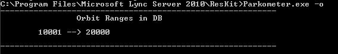
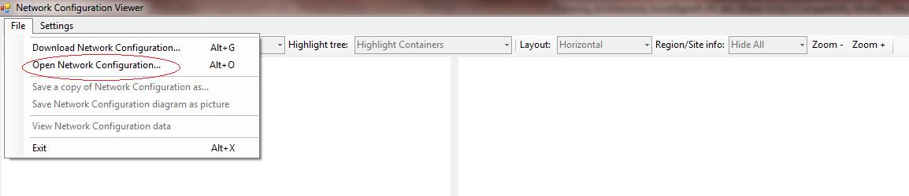

# <a name="skype-for-business-server-2015-resource-kit-tools-documentation"></a><span data-ttu-id="4f2b7-107">Documentação das Ferramentas do Kit de Recursos do Skype for Business Server 2015</span><span class="sxs-lookup"><span data-stu-id="4f2b7-107">Skype for Business Server 2015 Resource Kit Tools Documentation</span></span>

<span data-ttu-id="4f2b7-108">Este tópico descreve as ferramentas do Skype para Business Server 2015 Resource Kit, incluindo o propósito de cada ferramenta e exemplos de seu uso.</span><span class="sxs-lookup"><span data-stu-id="4f2b7-108">This topic describes the tools in the Skype for Business Server 2015 Resource Kit, including the purpose of each tool, and examples of its use.</span></span> <span data-ttu-id="4f2b7-109">O Skype para Business Server 2015 Resource Kit ajuda a facilitar as tarefas de rotina para administradores de TI que implantam e gerenciam Skype para Business Server 2015.</span><span class="sxs-lookup"><span data-stu-id="4f2b7-109">The Skype for Business Server 2015 Resource Kit helps to make routine tasks easier for IT administrators who deploy and manage Skype for Business Server 2015.</span></span> <span data-ttu-id="4f2b7-110">Por exemplo, a ferramenta **Web Conf Data** pode ser usada para controlar facilmente os dados carregados pelos usuários durante uma reunião online.</span><span class="sxs-lookup"><span data-stu-id="4f2b7-110">For example, the **Web Conf Data** tool can be used to easily control data that is uploaded by users during an online meeting.</span></span> <span data-ttu-id="4f2b7-111">A ferramenta **SEFAUtil** pode ser usada para configurar o encaminhamento e as respostas de chamadas de representantes para os usuários.</span><span class="sxs-lookup"><span data-stu-id="4f2b7-111">The **SEFAUtil** tool can be used to set up delegate call forwarding and answering for users.</span></span> <span data-ttu-id="4f2b7-112">Recomendamos que os administradores de TI para usar essas ferramentas para gerenciar com mais eficiência Skype para Business Server 2015.</span><span class="sxs-lookup"><span data-stu-id="4f2b7-112">We encourage IT administrators to use these tools to more effectively manage Skype for Business Server 2015.</span></span>

## <a name="installation-of-the-resource-kit-tools"></a><span data-ttu-id="4f2b7-113">Instalação das Ferramentas do Kit de Recursos</span><span class="sxs-lookup"><span data-stu-id="4f2b7-113">Installation of the Resource Kit Tools</span></span>

<span data-ttu-id="4f2b7-114">Para instalar o Skype para Business Server 2015 Resource Kit, baixe [OCSReskit.msi](https://www.microsoft.com/en-us/download/details.aspx?id=52631) no Centro de Download.</span><span class="sxs-lookup"><span data-stu-id="4f2b7-114">To install the Skype for Business Server 2015 Resource Kit, download [OCSReskit.msi](https://www.microsoft.com/en-us/download/details.aspx?id=52631) from the Download Center.</span></span>

<span data-ttu-id="4f2b7-p103">Execute o **OCSResKit.msi** para fazer uma instalação simples. O .msi instala todas as ferramentas no seguinte caminho: **%Arquivos de Programas%\Skype for Business Server 2015\ResKit**. As ferramentas que são executáveis autocontidos ficam nessa pasta. As ferramentas que também têm arquivos de suporte ficam em suas próprias subpastas.</span><span class="sxs-lookup"><span data-stu-id="4f2b7-p103">Run **OCSResKit.msi** to do a simple installation. The .msi installs all the tools in the following path: **%Program Files%\Skype for Business Server 2015\ResKit**. Tools that are self-contained executables are in this folder. Tools that also have supporting files are in their own subfolders.</span></span>

## <a name="supported-environments"></a><span data-ttu-id="4f2b7-119">Ambientes com suporte</span><span class="sxs-lookup"><span data-stu-id="4f2b7-119">Supported Environments</span></span>

<span data-ttu-id="4f2b7-120">O Skype para Business Server 2015 Resource Kit deve ser instalado em um servidor que atenda às especificações exigidas para Skype para Business Server 2015, normalmente um que está sendo usada para executar o Skype para Business Server 2015.</span><span class="sxs-lookup"><span data-stu-id="4f2b7-120">The Skype for Business Server 2015 Resource Kit should be installed on a server that meets the specifications required for Skype for Business Server 2015, usually one being used to run Skype for Business Server 2015.</span></span>

## <a name="resource-kit-tools-overview"></a><span data-ttu-id="4f2b7-121">Visão geral das Ferramentas do Kit de Recursos</span><span class="sxs-lookup"><span data-stu-id="4f2b7-121">Resource Kit Tools Overview</span></span>

<span data-ttu-id="4f2b7-122">O exemplo a seguir é uma lista das ferramentas são fornecidas no Skype para Business Server 2015 Resource Kit.</span><span class="sxs-lookup"><span data-stu-id="4f2b7-122">The following is a list of the tools that are provided in the Skype for Business Server 2015 Resource Kit.</span></span> <span data-ttu-id="4f2b7-123">As seções a seguir mostram uma descrição de cada ferramenta, com requisitos e exemplos de uso.</span><span class="sxs-lookup"><span data-stu-id="4f2b7-123">A description of each tool, including the requirements and example usage is covered in the following sections.</span></span>

- [<span data-ttu-id="4f2b7-124">ABSConfig</span><span class="sxs-lookup"><span data-stu-id="4f2b7-124">ABSConfig</span></span>](resource-kit-tools.md#ABSConfig)

- [<span data-ttu-id="4f2b7-125">Monitor de Serviço da Política de Largura de Banda</span><span class="sxs-lookup"><span data-stu-id="4f2b7-125">Bandwidth Policy Service Monitor</span></span>](resource-kit-tools.md#bpsm)

- [<span data-ttu-id="4f2b7-126">Analisador de Utilização de Largura de Banda</span><span class="sxs-lookup"><span data-stu-id="4f2b7-126">Bandwidth Utilization Analyzer</span></span>](resource-kit-tools.md#bua)

- [<span data-ttu-id="4f2b7-127">Estacionador de Chamadas</span><span class="sxs-lookup"><span data-stu-id="4f2b7-127">Call Parkometer</span></span>](resource-kit-tools.md#callpark)

- [<span data-ttu-id="4f2b7-128">DBAnalyze</span><span class="sxs-lookup"><span data-stu-id="4f2b7-128">DBAnalyze</span></span>](resource-kit-tools.md#dba)

- [<span data-ttu-id="4f2b7-129">Importar Dados do Serviço de Armazenamento</span><span class="sxs-lookup"><span data-stu-id="4f2b7-129">Import Storage Service Data</span></span>](resource-kit-tools.md#Issd)

- [<span data-ttu-id="4f2b7-130">LCSSync</span><span class="sxs-lookup"><span data-stu-id="4f2b7-130">LCSSync</span></span>](resource-kit-tools.md#LCSSync)

- [<span data-ttu-id="4f2b7-131">Pesquisar no Console de Usuários</span><span class="sxs-lookup"><span data-stu-id="4f2b7-131">Lookup User Console</span></span>](resource-kit-tools.md#LUC)

- [<span data-ttu-id="4f2b7-132">MsTurnPing</span><span class="sxs-lookup"><span data-stu-id="4f2b7-132">MsTurnPing</span></span>](resource-kit-tools.md#MsTurnPing)

- [<span data-ttu-id="4f2b7-133">Visualizador da Configuração de Rede</span><span class="sxs-lookup"><span data-stu-id="4f2b7-133">Network Configuration Viewer</span></span>](resource-kit-tools.md#NCV)

- [<span data-ttu-id="4f2b7-134">Agente do Grupo de Resposta em Tempo Real</span><span class="sxs-lookup"><span data-stu-id="4f2b7-134">Response Group Agent Live</span></span>](resource-kit-tools.md#RGAL)

- [<span data-ttu-id="4f2b7-135">SEFAUtil</span><span class="sxs-lookup"><span data-stu-id="4f2b7-135">SEFAUtil</span></span>](resource-kit-tools.md#SEFAUtil)

- [<span data-ttu-id="4f2b7-136">SYSPrep.ps1</span><span class="sxs-lookup"><span data-stu-id="4f2b7-136">SYSPrep.ps1</span></span>](resource-kit-tools.md#SYSPrep)

- [<span data-ttu-id="4f2b7-137">Migração de Comunicados de Número não Atribuído</span><span class="sxs-lookup"><span data-stu-id="4f2b7-137">Unassigned Number Announcements Migration</span></span>](resource-kit-tools.md#UNAM)

- [<span data-ttu-id="4f2b7-138">Web Conf Data</span><span class="sxs-lookup"><span data-stu-id="4f2b7-138">Web Conf Data</span></span>](resource-kit-tools.md#WebConfData)

## <a name="absconfig"></a><span data-ttu-id="4f2b7-139">ABSConfig</span><span class="sxs-lookup"><span data-stu-id="4f2b7-139">ABSConfig</span></span>
<span data-ttu-id="4f2b7-140"><a name="ABSConfig"> </a></span><span class="sxs-lookup"><span data-stu-id="4f2b7-140"></span></span>

<span data-ttu-id="4f2b7-141">A ferramenta de configuração do serviço de catálogo de endereços (ABSConfig) é uma ferramenta administrativa que ajuda os administradores a personalizar a configuração do serviço Catálogo de endereços no Skype para Business Server 2015.</span><span class="sxs-lookup"><span data-stu-id="4f2b7-141">The Address Book Service Configuration tool (ABSConfig) is an administrative tool that helps administrators customize Address Book Service configuration in Skype for Business Server 2015.</span></span> <span data-ttu-id="4f2b7-142">Essa ferramenta também permite que o Skype para que os administradores corporativos Server 2015 restaurar as configurações do serviço Catálogo de endereços padrão.</span><span class="sxs-lookup"><span data-stu-id="4f2b7-142">This tool also enables Skype for Business Server 2015 administrators to restore the default Address Book Service settings.</span></span>

### <a name="description"></a><span data-ttu-id="4f2b7-143">Descrição</span><span class="sxs-lookup"><span data-stu-id="4f2b7-143">Description</span></span>

<span data-ttu-id="4f2b7-144">ABSConfig é um aplicativo de interface gráfica do usuário que permite aos administradores configurarem os atributos do Active Directory Domain Services que estão relacionados ao serviço Catálogo de endereços.</span><span class="sxs-lookup"><span data-stu-id="4f2b7-144">ABSConfig is a graphical user interface application that enables administrators to configure Active Directory Domain Services attributes that are related to Address Book Service.</span></span>

<span data-ttu-id="4f2b7-145">Veja aqui os principais cenários da ferramenta:</span><span class="sxs-lookup"><span data-stu-id="4f2b7-145">The primary scenarios for the tool are the following:</span></span>

- <span data-ttu-id="4f2b7-146">Para permitir que os administradores mapeiem os atributos nos serviços de domínio do Active Directory para os atributos para Skype para Business Server 2015.</span><span class="sxs-lookup"><span data-stu-id="4f2b7-146">To enable administrators to map attributes in Active Directory Domain Services to the attributes for Skype for Business Server 2015.</span></span>

- <span data-ttu-id="4f2b7-147">Permitir que os administradores especifiquem os atributos do Active Directory Domain Services a serem incluídos ou excluídos dos arquivos do Serviço de Catálogo de Endereços.</span><span class="sxs-lookup"><span data-stu-id="4f2b7-147">To enable administrators to specify the Active Directory Domain Services attribute to be included or excluded in the Address Book Service files.</span></span>

- <span data-ttu-id="4f2b7-148">Permitir que os administradores restaurem as configurações padrão do Serviço de Catálogo de Endereços.</span><span class="sxs-lookup"><span data-stu-id="4f2b7-148">To enable administrators to restore default Address Book Service settings.</span></span>

<span data-ttu-id="4f2b7-149">A ferramenta ABSConfig pode ser iniciada usando o arquivo absConfig.exe.</span><span class="sxs-lookup"><span data-stu-id="4f2b7-149">The ABSConfig tool can be started by using the ABSConfig.exe file.</span></span> <span data-ttu-id="4f2b7-150">A ferramenta é aberto na guia **Configurar atributos** . Esta tabela possui opções para mapear os atributos do Active Directory Domain Services para os campos de atributo do Skype para Business Server 2015 e para especificar quais usuários devem ser incluídos ou excluídos nos arquivos do serviço de catálogo de endereços com base em filtros específicos de atributo.</span><span class="sxs-lookup"><span data-stu-id="4f2b7-150">The tool opens to the **Configure Attributes** tab. This table has options to map Active Directory Domain Services attributes to the attribute fields for Skype for Business Server 2015 and to specify which users to include or exclude in Address Book Service files based on specific attribute filters.</span></span> <span data-ttu-id="4f2b7-151">Ela também tem opções para personalizar quais números telefônicos serão incluídos no arquivo do Catálogo de Endereços.</span><span class="sxs-lookup"><span data-stu-id="4f2b7-151">It also has options to customize which value of the phone number to be included in the Address Book file.</span></span> <span data-ttu-id="4f2b7-152">A opção **Restaurar Padrões** permite aos administradores restaurar os valores padrão das configurações do Serviço de Catálogo de Endereços.</span><span class="sxs-lookup"><span data-stu-id="4f2b7-152">The **Restore Defaults** option enables administrators to restore Address Book Service settings to default values.</span></span>

> [!NOTE]
> <span data-ttu-id="4f2b7-153">Novamente o mapeamento dos atributos do AD para diferentes nomes de campo do OC será somente trabalho para Download de arquivo do catálogo de endereços e não é suportado pelo Address Book Web Query.</span><span class="sxs-lookup"><span data-stu-id="4f2b7-153">Re-mapping of AD attributes to different OC Field Names will only work for Address Book File Download, and is not supported by Address Book Web Query.</span></span>

### <a name="output"></a><span data-ttu-id="4f2b7-154">Resultado</span><span class="sxs-lookup"><span data-stu-id="4f2b7-154">Output</span></span>

<span data-ttu-id="4f2b7-155">A ABSConfig armazena a configuração do Serviço de Catálogo de Endereços no banco de dados.</span><span class="sxs-lookup"><span data-stu-id="4f2b7-155">ABSConfig stores the Address Book Service configuration in the database.</span></span>

```
Path: %ProgramFiles%\Skype for Business Server 2015\Reskit
```

### <a name="purpose"></a><span data-ttu-id="4f2b7-156">Objetivo</span><span class="sxs-lookup"><span data-stu-id="4f2b7-156">Purpose</span></span>

<span data-ttu-id="4f2b7-157">ABSConfig fornece uma maneira rápida e fácil personalizar Skype para o serviço de catálogo de endereços do Business Server 2015.</span><span class="sxs-lookup"><span data-stu-id="4f2b7-157">ABSConfig provides a quick and easy way to customize Skype for Business Server 2015 Address Book Service.</span></span>

### <a name="requirements"></a><span data-ttu-id="4f2b7-158">Requisitos</span><span class="sxs-lookup"><span data-stu-id="4f2b7-158">Requirements</span></span>

#### <a name="computer"></a><span data-ttu-id="4f2b7-159">Computador</span><span class="sxs-lookup"><span data-stu-id="4f2b7-159">Computer</span></span>

<span data-ttu-id="4f2b7-160">ABSConfig pode ser executado somente a partir de um computador associado ao domínio que tem Skype para negócios 2015 de servidor instalada.</span><span class="sxs-lookup"><span data-stu-id="4f2b7-160">ABSConfig can be run only from a domain-joined computer that has Skype for Business Server 2015 installed.</span></span> <span data-ttu-id="4f2b7-161">No caso do Skype para Business Server 2015, Enterprise Edition, essa ferramenta pode ser executada em qualquer servidor de Front-End que tenham o serviço de catálogo de endereços ativado durante a instalação.</span><span class="sxs-lookup"><span data-stu-id="4f2b7-161">In the case of Skype for Business Server 2015, Enterprise Edition, this tool can be run on any Front End servers that have the Address Book Service enabled during setup.</span></span>

#### <a name="network"></a><span data-ttu-id="4f2b7-162">Rede</span><span class="sxs-lookup"><span data-stu-id="4f2b7-162">Network</span></span>

<span data-ttu-id="4f2b7-163">O computador deve poder se conectar ao pool de front-ends e ao banco de dados back-end.</span><span class="sxs-lookup"><span data-stu-id="4f2b7-163">The computer should be able to connect to the Front End pool and back-end database.</span></span>

#### <a name="software"></a><span data-ttu-id="4f2b7-164">Software</span><span class="sxs-lookup"><span data-stu-id="4f2b7-164">Software</span></span>

<span data-ttu-id="4f2b7-165">Os seguintes componentes de software deverão ser instalados antes de executar a ferramenta ABSConfig:</span><span class="sxs-lookup"><span data-stu-id="4f2b7-165">The following software components must be installed before running the ABSConfig tool:</span></span>

- <span data-ttu-id="4f2b7-166">Skype for Business Server 2015</span><span class="sxs-lookup"><span data-stu-id="4f2b7-166">Skype for Business Server 2015</span></span>

#### <a name="users"></a><span data-ttu-id="4f2b7-167">Usuários</span><span class="sxs-lookup"><span data-stu-id="4f2b7-167">Users</span></span>

<span data-ttu-id="4f2b7-168">Administradores que possuem as permissões necessárias para atualizar o Skype para implantação Business Server 2015.</span><span class="sxs-lookup"><span data-stu-id="4f2b7-168">Administrators who have the permissions required to update the Skype for Business Server 2015 deployment.</span></span>

### <a name="examples"></a><span data-ttu-id="4f2b7-169">Exemplos</span><span class="sxs-lookup"><span data-stu-id="4f2b7-169">Examples</span></span>

<span data-ttu-id="4f2b7-p108">A ABSConfig pode ser iniciada digitando **ABSConfig.exe** em um prompt de comando. Abaixo é mostrada a interface do usuário da ferramenta ABSConfig.</span><span class="sxs-lookup"><span data-stu-id="4f2b7-p108">ABSConfig can be started by typing **ABSConfig.exe** at a command prompt. Shown below is the ABSConfig tool user interface.</span></span>


### <a name="summary"></a><span data-ttu-id="4f2b7-173">Resumo</span><span class="sxs-lookup"><span data-stu-id="4f2b7-173">Summary</span></span>

<span data-ttu-id="4f2b7-174">A ferramenta ABSConfig fornece uma rápida e fácil de usar a ferramenta para personalizar o Skype para o serviço de catálogo de endereços do Business Server 2015 de administradores.</span><span class="sxs-lookup"><span data-stu-id="4f2b7-174">The ABSConfig tool provides administrators a quick and easy to use tool to customize Skype for Business Server 2015 Address Book Service.</span></span>

## <a name="bandwidth-policy-service-monitor"></a><span data-ttu-id="4f2b7-175">Monitor de Serviços da Política de Largura de Banda</span><span class="sxs-lookup"><span data-stu-id="4f2b7-175">Bandwidth Policy Service Monitor</span></span>
<span data-ttu-id="4f2b7-176"><a name="bpsm"> </a></span><span class="sxs-lookup"><span data-stu-id="4f2b7-176"></span></span>

<span data-ttu-id="4f2b7-177">A ferramenta Monitor de Serviços da Política de Largura de Banda permite que os administradores visualizem uma lista contendo:</span><span class="sxs-lookup"><span data-stu-id="4f2b7-177">The Bandwidth Policy Service Monitor tool is intended to allow administrators to view a list of the following:</span></span>

1. <span data-ttu-id="4f2b7-178">Todos o Skype configurado para os serviços de diretiva de largura de banda do Business Server 2015 (autenticação e núcleo) na topologia</span><span class="sxs-lookup"><span data-stu-id="4f2b7-178">All the configured Skype for Business Server 2015 Bandwidth Policy services (Authentication and Core) in the topology</span></span>

2. <span data-ttu-id="4f2b7-179">As conexões de cada um dos serviços com outros serviços da Política de Largura de Banda e servidores de borda.</span><span class="sxs-lookup"><span data-stu-id="4f2b7-179">The connections that each service makes to other Bandwidth Policy services and to the Edge servers</span></span>

3. <span data-ttu-id="4f2b7-180">Todos os links configurados contidos no documento de configuração de rede e uso de largura de banda em tempo real, conforme relatado por cada um dos serviços da Política de Largura de Banda.</span><span class="sxs-lookup"><span data-stu-id="4f2b7-180">All the links that are configured in the Network configuration document and real-time bandwidth usage as reported by each of the Bandwidth Policy services</span></span>

### <a name="description"></a><span data-ttu-id="4f2b7-181">Descrição</span><span class="sxs-lookup"><span data-stu-id="4f2b7-181">Description</span></span>

<span data-ttu-id="4f2b7-p109">A ferramenta Monitor de Serviços da Política de Largura de Banda é implementada como um aplicativo baseado na GUI. Os administradores iniciam a ferramenta executando PDPMonUI.exe.</span><span class="sxs-lookup"><span data-stu-id="4f2b7-p109">The Bandwidth Policy Service Monitor tool is implemented as a GUI-based application. Administrators start the tool by running PDPMonUI.exe.</span></span>

<span data-ttu-id="4f2b7-p110">Quando a ferramenta é iniciada, ela tenta descobrir a lista dos serviços da Política de Largura de Banda na topologia. Após a conclusão da atualização inicial, o painel à esquerda da janela é populada com uma lista de serviços agrupados pelos clusters aos quais pertencem.</span><span class="sxs-lookup"><span data-stu-id="4f2b7-p110">When the tool starts, it attempts to discover the list of Bandwidth Policy services in the topology. After the initial update is done, the pane to the left of the window is populated with a list of services that are grouped by the clusters that they belong to.</span></span>

<span data-ttu-id="4f2b7-p111">Quando os administradores selecionam determinado Serviço da Política de Largura de Banda, o painel à direita exibe as informações sobre o serviço. O painel também tem duas guias principais que exibem informações.</span><span class="sxs-lookup"><span data-stu-id="4f2b7-p111">When administrators select a particular Bandwidth Policy Service, the pane on the right displays the information about that particular service. That pane also has two main tabs that display information.</span></span>

#### <a name="machine-info-tab"></a><span data-ttu-id="4f2b7-188">Guia Informações do Computador</span><span class="sxs-lookup"><span data-stu-id="4f2b7-188">Machine Info Tab</span></span>

<span data-ttu-id="4f2b7-189">A guia **Informações do Computador** mostra os detalhes do Serviço da Política de Largura de Banda selecionado, bem como a lista e o estado de todas as conexões realizadas pelo Serviço da Política de Largura de Banda selecionado com outros serviços.</span><span class="sxs-lookup"><span data-stu-id="4f2b7-189">The **Machine Info** tab shows the details of the Bandwidth Policy Service that is selected and the list and state of all the connections that are made by the selected Bandwidth Policy Service to other services.</span></span>

#### <a name="topology-info-tab"></a><span data-ttu-id="4f2b7-190">Guia Informações da Topologia</span><span class="sxs-lookup"><span data-stu-id="4f2b7-190">Topology Info Tab</span></span>

<span data-ttu-id="4f2b7-p112">A guia **Informações da Topologia** mostra uma lista de todos os links definidos nas configurações de rede. É exibida a capacidade de largura de banda de vídeo e áudio de cada link. Além disso, a largura de banda utilizada atualmente também é exibida, em Kbps e em um percentual da capacidade. A ferramenta usa codificação por cores para realçar os links cuja utilização esteja próxima do limite de capacidade, permitindo que os administradores isolem rapidamente esses links.</span><span class="sxs-lookup"><span data-stu-id="4f2b7-p112">The **Topology Info** tab shows a list of all the links that are configured in the Network configuration settings. For each link, the audio and video bandwidth capacity is displayed. Additionally, the currently utilized bandwidth is displayed, both in Kbps and as a percentage of the capacity. The tool uses color-coding to highlight links that have utilization that is close to the capacity—this allows administrators to quickly isolate such links.</span></span>

> [!NOTE]
>  <span data-ttu-id="4f2b7-195">Se a ferramenta Monitor de serviço de política de largura de banda apresenta falha ao se conectar a qualquer um dos serviços de política de largura de banda configurados, as informações em guias **Informações de topologia** e as **Informações de máquina** não ser preenchidas.</span><span class="sxs-lookup"><span data-stu-id="4f2b7-195">If the Bandwidth Policy Service Monitor tool experiences failure when it connects to any of the configured Bandwidth Policy services, the information in the **Machine Info** and the **Topology Info** tabs won't be populated.</span></span> <span data-ttu-id="4f2b7-196">No entanto, é possível que a ferramenta se conecte inicialmente, mas depois perca a conexão com o serviço.</span><span class="sxs-lookup"><span data-stu-id="4f2b7-196">However, it is possible that the tool might connect initially but subsequently lose its connection to the service.</span></span> <span data-ttu-id="4f2b7-197">Nesses casos, os administradores poderão ver informações desatualizadas.</span><span class="sxs-lookup"><span data-stu-id="4f2b7-197">In such cases, administrators might see outdated information.</span></span> <span data-ttu-id="4f2b7-198">Há um carimbo de data/hora **Última Atualização** em cada uma das guias que permite aos administradores ver quando os dados foram atualizados pela última vez para um determinado Serviço da Política de Largura de Banda.</span><span class="sxs-lookup"><span data-stu-id="4f2b7-198">There is a **Last Updated** time stamp on each of the tabs that can allow administrators to see when the data was last updated for a particular Bandwidth Policy Service.</span></span>

### <a name="output"></a><span data-ttu-id="4f2b7-199">Resultado</span><span class="sxs-lookup"><span data-stu-id="4f2b7-199">Output</span></span>

<span data-ttu-id="4f2b7-200">Não há nenhum resultado na linha de comando; o resultado do programa está contido dentro da GUI (interface gráfica do usuário) principal.</span><span class="sxs-lookup"><span data-stu-id="4f2b7-200">There is no command-line output; the program output is contained within the main graphical user interface (GUI).</span></span>

### <a name="purpose"></a><span data-ttu-id="4f2b7-201">Objetivo</span><span class="sxs-lookup"><span data-stu-id="4f2b7-201">Purpose</span></span>

<span data-ttu-id="4f2b7-p114">O objetivo da ferramenta Monitor de Serviços da Política de Largura de Banda é proporcionar aos administradores visibilidade do estado de cada um dos serviços da Política de Largura de Banda definidos na topologia. Além disso, os administradores podem ver o uso da largura de banda em tempo real de todos os links definidos no documento de configuração da rede.</span><span class="sxs-lookup"><span data-stu-id="4f2b7-p114">The purpose of the Bandwidth Policy Service Monitor tool is to allow administrators visibility into the state of each of the Bandwidth Policy services that are defined in the topology. In addition, administrators can see real-time bandwidth usage for all the links that are defined in the Network configuration document.</span></span>

### <a name="requirements"></a><span data-ttu-id="4f2b7-204">Requisitos</span><span class="sxs-lookup"><span data-stu-id="4f2b7-204">Requirements</span></span>

<span data-ttu-id="4f2b7-205">A ferramenta Monitor de serviço de política de largura de banda deve ser executado em um computador que faz parte do Skype para a topologia de servidor de negócios.</span><span class="sxs-lookup"><span data-stu-id="4f2b7-205">The Bandwidth Policy Service Monitor tool needs to be run on a computer that is part of the Skype for Business Server topology.</span></span>

### <a name="summary"></a><span data-ttu-id="4f2b7-206">Resumo</span><span class="sxs-lookup"><span data-stu-id="4f2b7-206">Summary</span></span>

<span data-ttu-id="4f2b7-207">A ferramenta Monitor de Serviços da Política de Largura de Banda pode ser um recurso valioso para os administradores, pois com ela é possível inspecionar na topologia o estado de todos os serviços da Política de Largura de Banda e, o mais importante, obter a utilização da largura de banda em tempo real dos links definidos nas configurações da rede.</span><span class="sxs-lookup"><span data-stu-id="4f2b7-207">The Bandwidth Policy Service Monitor tool can be a valuable resource to administrators so they can inspect the state of all the Bandwidth Policy services in the topology—and more importantly—they can obtain real-time bandwidth utilization for the links that are defined in the Network configuration settings.</span></span>

## <a name="bandwidth-utilization-analyzer"></a><span data-ttu-id="4f2b7-208">Analisador de Utilização da Largura de Banda</span><span class="sxs-lookup"><span data-stu-id="4f2b7-208">Bandwidth Utilization Analyzer</span></span>
<span data-ttu-id="4f2b7-209"><a name="bua"> </a></span><span class="sxs-lookup"><span data-stu-id="4f2b7-209"></span></span>

<span data-ttu-id="4f2b7-p115">O Analisador de Utilização da Largura de Banda é uma ferramenta que cria relatórios sobre diversas exibições do consumo de largura de banda pelos pontos de extremidade de UC nos links WAN da rede corporativa. Esses relatórios podem ser usados para entender o padrão de consumo de largura de banda atual e auxiliar no planejamento de capacidade de largura de banda.</span><span class="sxs-lookup"><span data-stu-id="4f2b7-p115">Bandwidth Utilization Analyzer is a tool that creates reports about various views of bandwidth consumption by the UC endpoints across WAN links in the enterprise network. These reports can be used to understand the current bandwidth consumption pattern and to aid in bandwidth capacity planning.</span></span>

### <a name="description"></a><span data-ttu-id="4f2b7-212">Descrição</span><span class="sxs-lookup"><span data-stu-id="4f2b7-212">Description</span></span>

<span data-ttu-id="4f2b7-p116">O Analisador de Utilização da Largura de Banda é implementado como um aplicativo baseado na GUI. Essa ferramenta gera relatórios específicos para utilização de áudio na rede e ajuda no planejamento da capacidade. Também itera na capacidade de largura de banda atribuída a diversos links.</span><span class="sxs-lookup"><span data-stu-id="4f2b7-p116">Bandwidth Utilization Analyzer is implemented as a GUI-based application. This tool generates reports specifically for audio utilization across the network and helps with capacity planning. It also iterates on the bandwidth capacity that is assigned to various links.</span></span>

### <a name="output"></a><span data-ttu-id="4f2b7-216">Resultado</span><span class="sxs-lookup"><span data-stu-id="4f2b7-216">Output</span></span>

<span data-ttu-id="4f2b7-217">O Analisador de Utilização da Largura de Banda fornece plotagens gráficas da utilização e da capacidade de largura da banda de áudio de todos os links WAN configurados no sistema.</span><span class="sxs-lookup"><span data-stu-id="4f2b7-217">Bandwidth Utilization Analyzer provides graphic al plots of bandwidth capacity and utilization for audio for all the WAN links that are configured in the system.</span></span>

### <a name="purpose"></a><span data-ttu-id="4f2b7-218">Objetivo</span><span class="sxs-lookup"><span data-stu-id="4f2b7-218">Purpose</span></span>

<span data-ttu-id="4f2b7-219">No qualquer implantação de vídeo e voz, é essencial para monitorar e entender a tendência de utilização de largura de banda de tráfego de mídia na rede corporativa.</span><span class="sxs-lookup"><span data-stu-id="4f2b7-219">In any voice and video deployment, it's critical to monitor and understand the trend of bandwidth utilization of media traffic across the enterprise network.</span></span> <span data-ttu-id="4f2b7-220">A ferramenta Analisador de Utilização da Largura de Banda permite ao administrador realizar justamente isso.</span><span class="sxs-lookup"><span data-stu-id="4f2b7-220">The Bandwidth Utilization Analyzer tool allows an administrator to achieve just that.</span></span> <span data-ttu-id="4f2b7-221">Essa ferramenta faz o seguinte:</span><span class="sxs-lookup"><span data-stu-id="4f2b7-221">This tool does the following:</span></span>

- <span data-ttu-id="4f2b7-222">Gera relatórios específicos de utilização de áudio na rede.</span><span class="sxs-lookup"><span data-stu-id="4f2b7-222">Generates specific reports for audio utilization across the network</span></span>

- <span data-ttu-id="4f2b7-223">Ajuda com um planejamento de capacidade mais eficaz e com a iteração na capacidade de largura de banda atribuída a vários links.</span><span class="sxs-lookup"><span data-stu-id="4f2b7-223">Helps with more effective capacity planning and iteration on the bandwidth capacity that is assigned to various links</span></span>

<span data-ttu-id="4f2b7-224">O Analisador de Utilização da Largura de Banda gera plotagens gráficas dos relatórios de utilização e capacidade de largura de banda; são os seguintes:</span><span class="sxs-lookup"><span data-stu-id="4f2b7-224">Bandwidth Utilization Analyzer can generate graphical plots of bandwidth capacity and utilization reports; they are as follows:</span></span>

- <span data-ttu-id="4f2b7-225">Todos os links WAN na rede corporativa.</span><span class="sxs-lookup"><span data-stu-id="4f2b7-225">All the WAN links in the enterprise network</span></span>

- <span data-ttu-id="4f2b7-226">Filtradas pelos links WAN selecionados que foram escolhidos.</span><span class="sxs-lookup"><span data-stu-id="4f2b7-226">Filtered by selected WAN links that have been chosen</span></span>

- <span data-ttu-id="4f2b7-227">Filtradas pelos links WAN que excederam o limite de capacidade.</span><span class="sxs-lookup"><span data-stu-id="4f2b7-227">Filtered by WAN links that have exceeded link capacity</span></span>

- <span data-ttu-id="4f2b7-228">Filtradas pelos links WAN que têm subutilizado a largura de banda provisionada.</span><span class="sxs-lookup"><span data-stu-id="4f2b7-228">Filtered by WAN links that have been under-utilizing the provisioned bandwidth</span></span>

- <span data-ttu-id="4f2b7-229">Filtradas pelos links WAN que alcançaram níveis críticos (uma utilização de largura de banda superior a 90% da capacidade de largura de banda do link WAN).</span><span class="sxs-lookup"><span data-stu-id="4f2b7-229">Filter by WAN links that have been reaching critical levels (a bandwidth utilization that is greater than 90% of bandwidth capacity of the WAN link)</span></span>

- <span data-ttu-id="4f2b7-230">Filtradas pelo tipo de link WAN : links rede-site, links inter-regionais e links dentro de um site.</span><span class="sxs-lookup"><span data-stu-id="4f2b7-230">Filtered by WAN link type—network-site links, interregional links, and links within a site</span></span>

- <span data-ttu-id="4f2b7-231">Filtradas por região de rede.</span><span class="sxs-lookup"><span data-stu-id="4f2b7-231">Filtered by network region</span></span>

#### <a name="applications"></a><span data-ttu-id="4f2b7-232">Aplicativos</span><span class="sxs-lookup"><span data-stu-id="4f2b7-232">Applications</span></span>

<span data-ttu-id="4f2b7-233">O Analisador de Utilização da Largura de Banda tem os dois aplicativos (ferramentas) abaixo:</span><span class="sxs-lookup"><span data-stu-id="4f2b7-233">Bandwidth Utilization Analyzer has the following two applications (tools):</span></span>

- <span data-ttu-id="4f2b7-234">**WanLinkLogCollector.exe** essa ferramenta permite que o usuário a digitar as informações necessárias.</span><span class="sxs-lookup"><span data-stu-id="4f2b7-234">**WanLinkLogCollector.exe** This tool enables its user to input the required information.</span></span>

- <span data-ttu-id="4f2b7-235">**BandwidthUtilizationAnalyzer.xlsm** relatório de software do Microsoft Excel de uma planilha é iniciado automaticamente pelo WanLinkLogCollector.exe.</span><span class="sxs-lookup"><span data-stu-id="4f2b7-235">**BandwidthUtilizationAnalyzer.xlsm** A Microsoft Excel spreadsheet software report is automatically launched by WanLinkLogCollector.exe.</span></span> <span data-ttu-id="4f2b7-236">Este aplicativo permite ao usuário aplicar filtros ao relatório, como será mostrado posteriormente neste artigo.</span><span class="sxs-lookup"><span data-stu-id="4f2b7-236">This application allows the user to apply filters to the report as shown later in this article.</span></span>

#### <a name="phases-of-using-bandwidth-utilization-analyzer"></a><span data-ttu-id="4f2b7-237">Fases de uso do Analisador de Utilização da Largura de Banda</span><span class="sxs-lookup"><span data-stu-id="4f2b7-237">Phases of Using Bandwidth Utilization Analyzer</span></span>

<span data-ttu-id="4f2b7-238">Há duas fases ao usar o Analisador de Utilização da Largura de Banda:</span><span class="sxs-lookup"><span data-stu-id="4f2b7-238">There are two phases when using Bandwidth Utilization Analyzer:</span></span>

- <span data-ttu-id="4f2b7-239">Coletar logs, o que é realizado ao usar o WanLinkLogCollector.exe.</span><span class="sxs-lookup"><span data-stu-id="4f2b7-239">Collect logs, which is performed by using WanLinkLogCollector.exe</span></span>

- <span data-ttu-id="4f2b7-240">Personalizar relatórios, o que é realizado ao usar o BandwidthUtilizationAnalyzer.xlsm.</span><span class="sxs-lookup"><span data-stu-id="4f2b7-240">Customize reports, which is performed by using BandwidthUtilizationAnalyzer.xlsm</span></span>

> [!IMPORTANT]
> <span data-ttu-id="4f2b7-241">Recomendamos que o BandwidthUtilizationAnalyzer.xlsm não seja iniciado manualmente pelos usuários finais.</span><span class="sxs-lookup"><span data-stu-id="4f2b7-241">We strongly recommend that BandwidthUtilizationAnalyzer.xlsm not be manually launched by end users.</span></span>

#### <a name="starting-bandwidth-utilization-analyzer"></a><span data-ttu-id="4f2b7-242">Iniciando o Analisador de Utilização da Largura de Banda</span><span class="sxs-lookup"><span data-stu-id="4f2b7-242">Starting Bandwidth Utilization Analyzer</span></span>

<span data-ttu-id="4f2b7-243">Inicie o WanLinkLogCollector.exe no prompt de comando ou no Windows Explorer.</span><span class="sxs-lookup"><span data-stu-id="4f2b7-243">Start WanLinkLogCollector.exe at the command prompt or by using Windows Explorer.</span></span>

 <span data-ttu-id="4f2b7-244">**Usando o WanLinkLogCollector.exe**</span><span class="sxs-lookup"><span data-stu-id="4f2b7-244">**Using WanLinkLogCollector.exe**</span></span>

<span data-ttu-id="4f2b7-245">Há três etapas para usar o WanLinkLogCollector.exe:</span><span class="sxs-lookup"><span data-stu-id="4f2b7-245">There are three steps to using WanLinkLogCollector.exe:</span></span>

1. <span data-ttu-id="4f2b7-246">**A linha do tempo de log** Forneça a linha do tempo que precisa ser gerado para o relatório</span><span class="sxs-lookup"><span data-stu-id="4f2b7-246">**Log the timeline** Provide the timeline that the report needs to be generated for</span></span>

2. <span data-ttu-id="4f2b7-247">**Especificar os diretórios de arquivo** Fornecer informações de local de arquivo</span><span class="sxs-lookup"><span data-stu-id="4f2b7-247">**Specify the file directories** Provide file location information</span></span>

3. <span data-ttu-id="4f2b7-248">**Coletar os logs e iniciar o Visualizador de relatório** Execute o comando para gerar o relatório</span><span class="sxs-lookup"><span data-stu-id="4f2b7-248">**Collect the logs and launch the report viewer** Execute the command to generate the report</span></span>

#### <a name="step-1---log-the-timeline"></a><span data-ttu-id="4f2b7-249">Etapa 1 – Registrar a linha do tempo</span><span class="sxs-lookup"><span data-stu-id="4f2b7-249">Step 1 - Log the timeline</span></span>

<span data-ttu-id="4f2b7-250">O registro da linha do tempo permite que o usuário da ferramenta especifique o seguinte, conforme mostra a figura abaixo: </span><span class="sxs-lookup"><span data-stu-id="4f2b7-250">Logging the timeline allows the tool user to specify the following as shown in the figure below.</span></span>

1. <span data-ttu-id="4f2b7-251">**Data de início** Trata-se da data de início da linha do tempo para a qual o relatório deve ser gerado; por exemplo, 1º de agosto de 2010.</span><span class="sxs-lookup"><span data-stu-id="4f2b7-251">**Start date** This is the start date of the timeline that the report is to be generated for; for example, August 1, 2010.</span></span>

2. <span data-ttu-id="4f2b7-252">**Data de término** Trata-se da data de término da linha do tempo para a qual o relatório deve ser gerado; por exemplo, 30 de setembro de 2010.</span><span class="sxs-lookup"><span data-stu-id="4f2b7-252">**End date** This is the end date of the timeline that the report is to be generated for; for example, September 30, 2010.</span></span>

     

#### <a name="step-2---specify-the-file-directories"></a><span data-ttu-id="4f2b7-254">Etapa 2 – Especificar os diretórios do arquivo</span><span class="sxs-lookup"><span data-stu-id="4f2b7-254">Step 2 - Specify the file directories</span></span>

<span data-ttu-id="4f2b7-255">Os seguintes diretórios de arquivo devem ser especificados pelo usuário, como a seguir:</span><span class="sxs-lookup"><span data-stu-id="4f2b7-255">The following file directories can be specified by the user as shown.</span></span>

- <span data-ttu-id="4f2b7-256">**Local de arquivos de log do servidor** O local da pasta onde os logs do servidor de política de largura de banda são armazenados.</span><span class="sxs-lookup"><span data-stu-id="4f2b7-256">**Server log files location** The folder location where Bandwidth policy server logs are stored.</span></span> <span data-ttu-id="4f2b7-257">Esse é normalmente em \<servidor de arquivos\>\\< opção de FE\>\AppServerFiles\PDP.</span><span class="sxs-lookup"><span data-stu-id="4f2b7-257">This is typically in \<fileserver\>\\<choice of FE\>\AppServerFiles\PDP.</span></span>

- <span data-ttu-id="4f2b7-258">**Local de armazenamento de arquivo temporário** O local de arquivo temporário onde os arquivos intermediários são armazenados enquanto o relatório está sendo gerado.</span><span class="sxs-lookup"><span data-stu-id="4f2b7-258">**Temporary file storage location** The temporary file location where intermediate files are stored while the report is being generated.</span></span>


> [!NOTE]
> <span data-ttu-id="4f2b7-260">Forneça ao usuário da ferramenta acesso suficiente aos arquivos de logs do servidor e à pasta de repositório de arquivos temporários.</span><span class="sxs-lookup"><span data-stu-id="4f2b7-260">Ensure that sufficient file access to the server logs and the temporary file store folder is provided to the tool user.</span></span>

#### <a name="step-3---collect-the-logs-and-start-the-report-viewer"></a><span data-ttu-id="4f2b7-261">Etapa 3 – Coletar os logs e iniciar o visualizador de relatórios</span><span class="sxs-lookup"><span data-stu-id="4f2b7-261">Step 3 - Collect the logs and start the report viewer</span></span>

<span data-ttu-id="4f2b7-p120">Para coletar os logs e iniciar o visualizador de relatórios, clique em **Executar**, como mostrado abaixo. Esta etapa coleta os dados necessários.</span><span class="sxs-lookup"><span data-stu-id="4f2b7-p120">To collect the logs and start the report viewer, click **Execute** as shown below. This step collects the required data.</span></span>


<span data-ttu-id="4f2b7-265">Se a validação da entrada for bem-sucedida, a mensagem abaixo será exibida.</span><span class="sxs-lookup"><span data-stu-id="4f2b7-265">When the input validation is successful, the message shown below is displayed.</span></span>


<span data-ttu-id="4f2b7-p121">Clique em **OK**. BandwidthUtilizationAnalyzer.xlsm será iniciado automaticamente. Siga as instrução na caixa de mensagens. Para obter mais detalhes, consulte \*\*Uso do BandwidthUtilizationAnalyzer.xlsm \*\* na próxima seção.</span><span class="sxs-lookup"><span data-stu-id="4f2b7-p121">Click **OK**. BandwidthUtilizationAnalyzer.xlsm is automatically started. Follow the instructions in the message box. For details, see **Using BandwidthUtilizationAnalyzer.xlsm** in the next section.</span></span>


### <a name="using-bandwidthutilizationanalyzerxlsm"></a><span data-ttu-id="4f2b7-271">Uso do BandwidthUtilizationAnalyzer.xlsm</span><span class="sxs-lookup"><span data-stu-id="4f2b7-271">Using BandwidthUtilizationAnalyzer.xlsm</span></span>

1. <span data-ttu-id="4f2b7-272">Se o BandwidthUtilizationAnalyzer.xlsm tiver sido iniciado automaticamente, clique em **Atualizar**, como a seguir.</span><span class="sxs-lookup"><span data-stu-id="4f2b7-272">When BandwidthUtilizationAnalyzer.xlsm is automatically started, click **Refresh** as shown below.</span></span>

     

2. <span data-ttu-id="4f2b7-p122">Quando uma pasta de arquivos for aberta, selecione consolidated.csv na localização especificada na caixa de mensagens, como a seguir. A localização também é mostrada como **C:\Temp**.</span><span class="sxs-lookup"><span data-stu-id="4f2b7-p122">When a file folder is opened, select consolidated.csv from the location that is specified in the message box as shown below. It also shows the location as **C:\Temp**.</span></span>

     

3. <span data-ttu-id="4f2b7-277">Clique em **Importar**.</span><span class="sxs-lookup"><span data-stu-id="4f2b7-277">Click **Import**.</span></span>

4. <span data-ttu-id="4f2b7-p123">A plotagem gráfica é gerada automaticamente. Ela será disponibilizada assim que o ponteiro de trabalho em segundo plano desaparecer.</span><span class="sxs-lookup"><span data-stu-id="4f2b7-p123">The graphical plot is automatically generated. It is available when the working-in-the-background pointer disappears.</span></span>

     

#### <a name="applying-filters-to-the-report-view"></a><span data-ttu-id="4f2b7-281">Aplicando filtros ao visualizador de relatórios</span><span class="sxs-lookup"><span data-stu-id="4f2b7-281">Applying Filters to the Report View</span></span>

<span data-ttu-id="4f2b7-282">Os filtros que podem ser aplicados ao visualizador de relatórios, conforme mostrado abaixo, são descritos da seguinte forma:</span><span class="sxs-lookup"><span data-stu-id="4f2b7-282">The filters that can be applied to the report view as shown below are described as follows:</span></span>


1. <span data-ttu-id="4f2b7-284">**Nome** Filtrar por links WAN (o filtro se situa no lado direito do gráfico). O prefixo denota os tipos de links a seguir; consulte a caixa (azul) vertical:</span><span class="sxs-lookup"><span data-stu-id="4f2b7-284">**Name** Filter by WAN links (the filter is on the right side of the graph).The prefix denotes the following link types; see the vertical (blue) box:</span></span>

   - <span data-ttu-id="4f2b7-285">\*\*S Site \*\* O link WAN de um site da rede a uma região da rede</span><span class="sxs-lookup"><span data-stu-id="4f2b7-285">**S Site** The WAN link from a network site to a network region</span></span>

   - <span data-ttu-id="4f2b7-286">**IS Entre sites** O link WAN entre dois sites da rede</span><span class="sxs-lookup"><span data-stu-id="4f2b7-286">**IS Inter-Site** The WAN link between two network sites</span></span>

   - <span data-ttu-id="4f2b7-287">**R Inter-regional** O link WAN entre duas regiões da rede</span><span class="sxs-lookup"><span data-stu-id="4f2b7-287">**R Inter-Region** The WAN link between two network region</span></span>

2. <span data-ttu-id="4f2b7-288">**Limite excedido** Filtrar por links WAN cuja utilização de largura de banda seja superior à capacidade da largura de banda</span><span class="sxs-lookup"><span data-stu-id="4f2b7-288">**Exceeded limit** Filter by WAN links whose bandwidth utilization is more than the bandwidth capacity</span></span>

3. <span data-ttu-id="4f2b7-289">**Níveis críticos** Filtrar por links WAN cuja utilização da largura de banda tenha alcançado 90% ou mais da capacidade da largura de banda</span><span class="sxs-lookup"><span data-stu-id="4f2b7-289">**Critical levels** Filter by WAN links whose bandwidth utilization has reached 90% or more than the bandwidth capacity</span></span>

4. <span data-ttu-id="4f2b7-290">**Subutilizado** Filtrar por links WAN cuja utilização da largura de banda seja inferior a 25% da capacidade da largura de banda</span><span class="sxs-lookup"><span data-stu-id="4f2b7-290">**Under-utilized** Filter by WAN links whose bandwidth utilization has been less than 25% of the bandwidth capacity</span></span>

5. <span data-ttu-id="4f2b7-291">**Tipo de link** Filtrar pelos seguintes tipos de links WAN:</span><span class="sxs-lookup"><span data-stu-id="4f2b7-291">**Link type** Filter by the following WAN links types:</span></span>

   - <span data-ttu-id="4f2b7-292">
            Tipo **Site da rede**</span><span class="sxs-lookup"><span data-stu-id="4f2b7-292">**Network site** type</span></span>

   - <span data-ttu-id="4f2b7-293">
            Tipo **Entre sites**</span><span class="sxs-lookup"><span data-stu-id="4f2b7-293">**Inter-site** type</span></span>

   - <span data-ttu-id="4f2b7-294">
            Tipo \*\*Link inter-regional**</span><span class="sxs-lookup"><span data-stu-id="4f2b7-294">**Inter-Region link** type</span></span>

6. <span data-ttu-id="4f2b7-295">**Região** Filtrar pela região da rede</span><span class="sxs-lookup"><span data-stu-id="4f2b7-295">**Region** Filter by network region</span></span>

<span data-ttu-id="4f2b7-296">As imagens abaixo mostram os filtros descritos anteriormente.</span><span class="sxs-lookup"><span data-stu-id="4f2b7-296">The following figures show the previously described filters.</span></span>

<span data-ttu-id="4f2b7-p124">Filtrar por **Nome**. Selecione a lista de links que precisam ser exibidos no gráfico.</span><span class="sxs-lookup"><span data-stu-id="4f2b7-p124">Filter by **Name**. Select the list of links that need to be displayed in the graph.</span></span>


<span data-ttu-id="4f2b7-300">Filtrar por **Limite excedido**.</span><span class="sxs-lookup"><span data-stu-id="4f2b7-300">Filter by **Exceeded limit**.</span></span> <span data-ttu-id="4f2b7-301">Selecione **True** para impor o filtro.</span><span class="sxs-lookup"><span data-stu-id="4f2b7-301">Select **True** to enforce the filter.</span></span>


<span data-ttu-id="4f2b7-303">Filtrar por **Níveis críticos**.</span><span class="sxs-lookup"><span data-stu-id="4f2b7-303">Filter by **Critical levels**.</span></span> <span data-ttu-id="4f2b7-304">Selecione **True** para impor o filtro.</span><span class="sxs-lookup"><span data-stu-id="4f2b7-304">Select **True** to enforce the filter.</span></span>


<span data-ttu-id="4f2b7-306">Filtrar por **Subutilizado**.</span><span class="sxs-lookup"><span data-stu-id="4f2b7-306">Filter by **Under utilized**.</span></span> <span data-ttu-id="4f2b7-307">Selecione **True** para impor o filtro.</span><span class="sxs-lookup"><span data-stu-id="4f2b7-307">Select **True** to enforce the filter.</span></span>


<span data-ttu-id="4f2b7-309">Filtrar por **Tipo de Link**.</span><span class="sxs-lookup"><span data-stu-id="4f2b7-309">Filter by **Link Type**.</span></span> <span data-ttu-id="4f2b7-310">Selecione um ou mais tipos que precisam ser exibidos.</span><span class="sxs-lookup"><span data-stu-id="4f2b7-310">Select the type or types that need to be displayed.</span></span>


<span data-ttu-id="4f2b7-312">Filtrar por **Região**.</span><span class="sxs-lookup"><span data-stu-id="4f2b7-312">Filter by **Region**.</span></span> <span data-ttu-id="4f2b7-313">Selecione uma lista de regiões cujos links precisam ser exibidos.</span><span class="sxs-lookup"><span data-stu-id="4f2b7-313">Select a list of regions whose links need to be displayed.</span></span>


### <a name="requirements"></a><span data-ttu-id="4f2b7-315">Requisitos</span><span class="sxs-lookup"><span data-stu-id="4f2b7-315">Requirements</span></span>

- <span data-ttu-id="4f2b7-316">.NET Framework 3.5</span><span class="sxs-lookup"><span data-stu-id="4f2b7-316">The .NET Framework 3.5</span></span>

- <span data-ttu-id="4f2b7-317">Microsoft Excel 2010 ou Excel 2007</span><span class="sxs-lookup"><span data-stu-id="4f2b7-317">Microsoft Excel 2010 or Excel 2007</span></span>

### <a name="summary"></a><span data-ttu-id="4f2b7-318">Resumo</span><span class="sxs-lookup"><span data-stu-id="4f2b7-318">Summary</span></span>

<span data-ttu-id="4f2b7-p130">O Analisador de Utilização da Largura de Banda é usado para plotar a utilização da largura de banda de áudio do tráfego de UC na rede. Esta ferramenta pode ser usada também para relatar a utilização da largura de banda de vídeo na rede.</span><span class="sxs-lookup"><span data-stu-id="4f2b7-p130">Bandwidth Utilization Analyzer is used to plot the audio bandwidth utilization for UC traffic across the network. This tool can be used to report the utilization of video bandwidth on the network as well.</span></span>

## <a name="call-parkometer"></a><span data-ttu-id="4f2b7-321">Parquímetro de Chamada</span><span class="sxs-lookup"><span data-stu-id="4f2b7-321">Call Parkometer</span></span>
<span data-ttu-id="4f2b7-322"><a name="callpark"> </a></span><span class="sxs-lookup"><span data-stu-id="4f2b7-322"></span></span>

<span data-ttu-id="4f2b7-323">O Parquímetro de Chamada é um aplicativo de linha de comando que proporciona fácil acesso ao banco de dados da Órbita do Call Park.</span><span class="sxs-lookup"><span data-stu-id="4f2b7-323">Call Parkometer is a command-line application that provides easy access to the Call Park orbit database.</span></span>

### <a name="description"></a><span data-ttu-id="4f2b7-324">Descrição</span><span class="sxs-lookup"><span data-stu-id="4f2b7-324">Description</span></span>

<span data-ttu-id="4f2b7-325">O Parquímetro de Chamada é uma ferramenta que rastreia as chamadas estacionadas atualmente.</span><span class="sxs-lookup"><span data-stu-id="4f2b7-325">Call Parkometer is a tool to track currently parked calls.</span></span> <span data-ttu-id="4f2b7-326">Ele também coleta estatísticas sobre as órbitas e o uso do CPS (Servidor de Estacionamento de Chamada).</span><span class="sxs-lookup"><span data-stu-id="4f2b7-326">It also collects statistics about orbits and Call Park Server (CPS) usage.</span></span> <span data-ttu-id="4f2b7-327">Essa ferramenta de linha de comando fornece acesso de leitura e gravação para a banco de dados do SQL Server de órbita de CPS de um computador local ou remotamente conectado.</span><span class="sxs-lookup"><span data-stu-id="4f2b7-327">This command-line tool provides both read and write-access to the CPS orbit SQL Server database from a local or remotely connected computer.</span></span>

<span data-ttu-id="4f2b7-328">Todas as opções são mutuamente exclusivas.</span><span class="sxs-lookup"><span data-stu-id="4f2b7-328">All options are mutually exclusive.</span></span> <span data-ttu-id="4f2b7-329">A sintaxe da linha de comando é a seguinte:</span><span class="sxs-lookup"><span data-stu-id="4f2b7-329">Command-line syntax is as follows:</span></span>

- <span data-ttu-id="4f2b7-330">**-o** parâmetro — todos configurados para este pool de intervalos de órbita de listas.</span><span class="sxs-lookup"><span data-stu-id="4f2b7-330">**-o** parameter—lists all orbit ranges configured for this pool.</span></span>

- <span data-ttu-id="4f2b7-331">parâmetro **-n** — Órbitas listas tudo atualmente usadas neste pool.</span><span class="sxs-lookup"><span data-stu-id="4f2b7-331">**-n** parameter—lists all currently used orbits in this pool.</span></span> <span data-ttu-id="4f2b7-332">As informações são exibidas da seguinte forma:</span><span class="sxs-lookup"><span data-stu-id="4f2b7-332">The information displayed is as follows:</span></span>

  - <span data-ttu-id="4f2b7-333">URI (Uniform Resource Identifier) do SIP da chamada estacionada e do estacionador.</span><span class="sxs-lookup"><span data-stu-id="4f2b7-333">SIP Uniform Resource Identifier (URI) of the parkee and parker.</span></span>

  - <span data-ttu-id="4f2b7-334">Nome do host do CPS onde a chamada está estacionada.</span><span class="sxs-lookup"><span data-stu-id="4f2b7-334">Host name of the CPS where the call is parked.</span></span>

  - <span data-ttu-id="4f2b7-335">Carimbo de data/hora de quando a chamada foi estacionada.</span><span class="sxs-lookup"><span data-stu-id="4f2b7-335">Time stamp of when the call was parked.</span></span>

- <span data-ttu-id="4f2b7-336">parâmetro **-f** — lista o número de Órbitas atualmente gratuitos no pool.</span><span class="sxs-lookup"><span data-stu-id="4f2b7-336">**-f** parameter—lists the number of currently free orbits in the pool.</span></span>

- <span data-ttu-id="4f2b7-337">\*\*-r \<n\> \*\* parâmetro — lista as \<n\> última estacionadas chamadas.</span><span class="sxs-lookup"><span data-stu-id="4f2b7-337">**-r \<n\>** parameter—lists the \<n\> last parked calls.</span></span> <span data-ttu-id="4f2b7-338">As informações são exibidas da seguinte forma:</span><span class="sxs-lookup"><span data-stu-id="4f2b7-338">The information displayed is as follows:</span></span>

  - <span data-ttu-id="4f2b7-339">URI do SIP da chamada estacionada.</span><span class="sxs-lookup"><span data-stu-id="4f2b7-339">Parkee SIP URI.</span></span>

  - <span data-ttu-id="4f2b7-340">URI do SIP do estacionador da chamada.</span><span class="sxs-lookup"><span data-stu-id="4f2b7-340">Parker SIP URI.</span></span>

  - <span data-ttu-id="4f2b7-341">Nome do host do CPS onde a chamada foi estacionada.</span><span class="sxs-lookup"><span data-stu-id="4f2b7-341">Host name of the CPS where the call was parked.</span></span>

  - <span data-ttu-id="4f2b7-342">Carimbo de data/hora de quando a chamada foi recuperada ou ignorada.</span><span class="sxs-lookup"><span data-stu-id="4f2b7-342">Time stamp of when the call was retrieved or dropped.</span></span>

- <span data-ttu-id="4f2b7-343">\*\*-t\<n\> \*\* parâmetro - testa reservar uma órbita no banco de dados para mostrar a aleatoriedade dos números de órbita atribuído.</span><span class="sxs-lookup"><span data-stu-id="4f2b7-343">**-t\<n\>** parameter - tests reserving an orbit in the database to show the randomness of the assigned orbit numbers.</span></span>

### <a name="output"></a><span data-ttu-id="4f2b7-344">Resultado</span><span class="sxs-lookup"><span data-stu-id="4f2b7-344">Output</span></span>

<span data-ttu-id="4f2b7-345">Dependendo dos parâmetros de entrada especificados em um prompt de comando, o Parquímetro de Chamada exibirá o seguinte resultado:</span><span class="sxs-lookup"><span data-stu-id="4f2b7-345">Depending on the input parameters that are specified at a command prompt, Call Parkometer displays the following output:</span></span>

- <span data-ttu-id="4f2b7-346">Todos os intervalos de órbita configurados para este pool</span><span class="sxs-lookup"><span data-stu-id="4f2b7-346">All orbit ranges that are configured for this pool</span></span>

- <span data-ttu-id="4f2b7-347">Chamadas estacionadas atualmente</span><span class="sxs-lookup"><span data-stu-id="4f2b7-347">Currently parked calls</span></span>

- <span data-ttu-id="4f2b7-348">Número de órbitas livres (disponíveis)</span><span class="sxs-lookup"><span data-stu-id="4f2b7-348">Number of free (available) orbits</span></span>

- <span data-ttu-id="4f2b7-349">Chamadas estacionadas recentemente</span><span class="sxs-lookup"><span data-stu-id="4f2b7-349">Recently parked calls</span></span>

- <span data-ttu-id="4f2b7-350">Órbitas reservadas para testes uniformes e valores de órbita aleatórios</span><span class="sxs-lookup"><span data-stu-id="4f2b7-350">Reserved orbits for testing uniform and random orbit values</span></span>

### <a name="purpose"></a><span data-ttu-id="4f2b7-351">Objetivo</span><span class="sxs-lookup"><span data-stu-id="4f2b7-351">Purpose</span></span>

<span data-ttu-id="4f2b7-p135">O objetivo da ferramenta CPS é fornecer acesso de linha de comando ao banco de dados do CPS. O administrador pode visualizar o CPS usado e determinar o números de órbitas atribuídas a um pool.</span><span class="sxs-lookup"><span data-stu-id="4f2b7-p135">The purpose of the CPS tool is to provide command-line access to the CPS database. The administrator can view the CPS usage and determine the number of orbits assigned to a pool.</span></span>

### <a name="requirements"></a><span data-ttu-id="4f2b7-354">Requisitos</span><span class="sxs-lookup"><span data-stu-id="4f2b7-354">Requirements</span></span>

<span data-ttu-id="4f2b7-355">Não haverá nenhum requisito se esta ferramenta for executada no mesmo computador que estiver executando o CPS.</span><span class="sxs-lookup"><span data-stu-id="4f2b7-355">There are no requirements if this tool is run on the same computer that is running CPS.</span></span> <span data-ttu-id="4f2b7-356">Se essa ferramenta for executada em um computador remoto, o banco de dados do SQL Server usado pelo Skype para Business Server 2015 deve ser configurado para permitir o acesso remoto.</span><span class="sxs-lookup"><span data-stu-id="4f2b7-356">If this tool is run on a remote computer, the SQL Server database used by Skype for Business Server 2015 must be configured to allow remote access.</span></span> <span data-ttu-id="4f2b7-357">Chamada Parkometer deve ser configurado com uma cadeia de conexão de banco de dados do SQL Server para se conectar ao servidor do SQL do pool.</span><span class="sxs-lookup"><span data-stu-id="4f2b7-357">Call Parkometer must be configured with a SQL Server database connection string to connect to the pool's SQL Server.</span></span> <span data-ttu-id="4f2b7-358">Esta cadeia de caracteres de conexão de banco de dados do SQL Server é definida no arquivo de configuração, **parkometer.exe.config**. Ele deve ser colocado no mesmo diretório onde parkometer.exe está localizado.</span><span class="sxs-lookup"><span data-stu-id="4f2b7-358">This SQL Server database connection string is defined in the configuration file, **parkometer.exe.config**. It must be placed in the same directory where parkometer.exe is located.</span></span> <span data-ttu-id="4f2b7-359">O arquivo XML a seguir está um exemplo de um parkometer.exe.config. Os parâmetros que devem ser configurados são o nome de usuário (por exemplo, mydomain\Administrator), a senha (por exemplo, minhasenha) e o nome de host (por exemplo, MeuServidor).</span><span class="sxs-lookup"><span data-stu-id="4f2b7-359">The following XML file is an example of a parkometer.exe.config. The parameters that must be configured are user name (for example, mydomain\Administrator), password (for example, mypassword), and host name (for example, myserver).</span></span>

```
<?xml version="1.0" encoding="utf-8" ?>
<configuration>
  <appSettings>
   <add key="SQL" value="server=myserver\RTC;
database=cpsdyn;
User Id=mydomain\Administrator;
Password=mypassword.;
Integrated Security=false;"/>
  </appSettings>
</configuration>
```

### <a name="examples"></a><span data-ttu-id="4f2b7-360">Exemplos</span><span class="sxs-lookup"><span data-stu-id="4f2b7-360">Examples</span></span>

<span data-ttu-id="4f2b7-361">Implantado intervalos de órbita: o parâmetro -o lista todos os intervalos de órbita que são configurados para este pool como mostrado</span><span class="sxs-lookup"><span data-stu-id="4f2b7-361">Deployed orbit ranges: the -o parameter lists all orbit ranges that are configured for this pool as shown</span></span>



<span data-ttu-id="4f2b7-363">Atualmente estacionadas chamadas: o parâmetro - n lista todas as Órbitas atualmente em uso desse pool, conforme mostrado</span><span class="sxs-lookup"><span data-stu-id="4f2b7-363">Currently parked calls: the -n parameter lists all currently used orbits on this pool as shown</span></span>


<span data-ttu-id="4f2b7-365">Número de Órbitas livres: o parâmetro -f lista o número de Órbitas atualmente gratuitos do pool, conforme mostrado</span><span class="sxs-lookup"><span data-stu-id="4f2b7-365">Number of free orbits: the -f parameter lists the number of currently free orbits in the pool as shown</span></span>


<span data-ttu-id="4f2b7-367">Recentemente estacionadas chamadas: - r \<n\> listas de parâmetro o \<n\> última estacionadas chamadas, conforme mostrado</span><span class="sxs-lookup"><span data-stu-id="4f2b7-367">Recently parked calls: the -r \<n\> parameter lists the \<n\> last parked calls as shown</span></span>


<span data-ttu-id="4f2b7-369">Reserva de órbita de teste: -t \<n\> parâmetro testa reservar uma órbita no banco de dados, conforme mostrado</span><span class="sxs-lookup"><span data-stu-id="4f2b7-369">Test orbit reservation: the -t \<n\> parameter tests reserving an orbit in the database as shown</span></span>


### <a name="summary"></a><span data-ttu-id="4f2b7-371">Resumo</span><span class="sxs-lookup"><span data-stu-id="4f2b7-371">Summary</span></span>

<span data-ttu-id="4f2b7-372">O Parquímetro de Chamada é uma ferramenta de linha de comando que fornece informações detalhadas sobre o Servidor de Estacionamento de Chamada.</span><span class="sxs-lookup"><span data-stu-id="4f2b7-372">Call Parkometer is a command-line tool that provides detailed information about the Call Park Server.</span></span>

## <a name="dbanalyze"></a><span data-ttu-id="4f2b7-373">DBAnalyze</span><span class="sxs-lookup"><span data-stu-id="4f2b7-373">DBAnalyze</span></span>
<span data-ttu-id="4f2b7-374"><a name="dba"> </a></span><span class="sxs-lookup"><span data-stu-id="4f2b7-374"></span></span>

### <a name="description"></a><span data-ttu-id="4f2b7-375">Descrição</span><span class="sxs-lookup"><span data-stu-id="4f2b7-375">Description</span></span>

<span data-ttu-id="4f2b7-376">DBAnalyze é uma ferramenta de linha de comando que ajuda os administradores a coletar relatórios de análise sobre o Skype para bancos de dados corporativos Server 2015.</span><span class="sxs-lookup"><span data-stu-id="4f2b7-376">DBAnalyze is a command-line tool that helps administrators to gather analysis reports about the Skype for Business Server 2015 databases.</span></span> <span data-ttu-id="4f2b7-377">O DBAnalyze tem os seguintes modos: diagnóstico, dados do usuário, conferência, MCUs e fragmentação de disco:</span><span class="sxs-lookup"><span data-stu-id="4f2b7-377">DBAnalyze has the following modes: diagnostic, user data, conference, MCUs, and disk fragmentation:</span></span>

- <span data-ttu-id="4f2b7-378">**Modo de diagnóstico** Cria um relatório que inclui informações sobre tabelas (número de registros, fragmentação, tamanho de dados e tamanho do índice), tamanhos de arquivo de dados e log, a última vez de backup, distribuição visita entre servidores que estão executando o Microsoft Office Communications Server, o número médio de permissões, contatos, recipientes, inscrições, publicações, pontos de extremidade por usuário, qualquer usuários hospedados de forma inadequada, os usuários que não podem ser roteados, o número médio de conferências organizadas por usuário, conferências agendadas, conferências ativas, e a versão do banco de dados.</span><span class="sxs-lookup"><span data-stu-id="4f2b7-378">**Diagnostic mode** Creates a report that includes information about tables (number of records, fragmentation, data size, and index size), data and log file sizes, the last back-up time, contact distribution among servers that are running Microsoft Office Communications Server, the average number of permissions, contacts, containers, subscriptions, publications, endpoints per user, any improperly homed users, users that can't be routed, the average number of conferences organized per user, scheduled conferences, active conferences, and the database version.</span></span>

    > [!NOTE]
    > <span data-ttu-id="4f2b7-379">A execução do modo de diagnóstico pode afetar o desempenho do servidor.</span><span class="sxs-lookup"><span data-stu-id="4f2b7-379">Running diagnostic mode can affect server performance.</span></span>

- <span data-ttu-id="4f2b7-380">**Modo de dados do usuário** Relatórios de contato, contêiner, assinatura, publicação, permissão e dados do grupo de contatos para um usuário específico ou para usuários que têm esse usuário em suas listas de permissão e de contato.</span><span class="sxs-lookup"><span data-stu-id="4f2b7-380">**User data mode** Reports contact, container, subscription, publication, permission, and contact-group data for a specified user or for users who have that user in their contact and permission lists.</span></span> <span data-ttu-id="4f2b7-381">Este modo também relata dados resumidos de conferências que um usuário organizou ou para as quais foi convidado.</span><span class="sxs-lookup"><span data-stu-id="4f2b7-381">This mode also reports summary data for conferences that a user organizes or is invited to.</span></span>

- <span data-ttu-id="4f2b7-382">**Modo de conferência** Dados de relatórios detalhados para uma conferência específica, incluindo todos os detalhes de agenda de tempo para a conferência, a lista de convidado, a lista de tipos de mídia permitidos para a conferência, active MCUs (unidades de controle de multipontos), a lista de participantes ativos e cada um estado de sinalização do participante.</span><span class="sxs-lookup"><span data-stu-id="4f2b7-382">**Conference mode** Reports detailed data for a specific conference, including all schedule-time details for the conference, the invitee list, the list of media types allowed for the conference, active MCUs (multipoint control units), the active participant list, and each participant's signaling state.</span></span>

- <span data-ttu-id="4f2b7-383">**Decodificar ID de reunião** Decodifica uma rede telefônica pública comutada (PSTN) ID que é especificado pela opção **/pstnid** , mas não se conectam ao back-end para obter informações detalhadas de reunião.</span><span class="sxs-lookup"><span data-stu-id="4f2b7-383">**Decode Meeting ID** Decodes a public switched telephone network (PSTN) meeting ID that is specified by the **/pstnid** switch but does not connect to the back end for detailed information.</span></span>

- <span data-ttu-id="4f2b7-384">**Resolver a conferência** Decodifica uma ID de reunião de PSTN que é especificada pela opção **/pstnid** e exibe informações sobre a conferência indicada pela ID do.</span><span class="sxs-lookup"><span data-stu-id="4f2b7-384">**Resolve conference** Decodes a PSTN meeting ID that is specified by the **/pstnid** switch and displays information about the conference indicated by the ID.</span></span>

- <span data-ttu-id="4f2b7-385">**Modo de MCUs** Relata a ID, tipo de mídia, URL, status da pulsação, carga de conferência e carga de participante para cada MCU no pool.</span><span class="sxs-lookup"><span data-stu-id="4f2b7-385">**MCUs mode** Reports the ID, media type, URL, heartbeat status, conference load, and participant load for each MCU in the pool.</span></span>

- <span data-ttu-id="4f2b7-386">**Modo de fragmentação de disco** Exibe o status de fragmentação de todos os discos.</span><span class="sxs-lookup"><span data-stu-id="4f2b7-386">**Disk fragmentation mode** Displays the fragmentation status of all disks.</span></span>

<span data-ttu-id="4f2b7-p139">Esta ferramenta pode ser usada para diagnosticar diversos problemas ou para ajudar os administradores no planejamento da capacidade. Por exemplo, se a maioria dos usuários hospedados no servidor A escolher como contatos usuários hospedados no servidor B, o administrador poderá mover os usuários do servidor A para o servidor B para reduzir o tráfego entre servidores.</span><span class="sxs-lookup"><span data-stu-id="4f2b7-p139">This tool can be used to diagnose various problems or to assist administrators with capacity planning. For example, if most of the users homed on server A choose users homed on server B as their contacts, the administrator can move the users on server A to server B to reduce cross-server traffic.</span></span>

### <a name="output"></a><span data-ttu-id="4f2b7-389">Resultado</span><span class="sxs-lookup"><span data-stu-id="4f2b7-389">Output</span></span>

<span data-ttu-id="4f2b7-390">Essa ferramenta emite predefinidos relatórios sobre o Skype para banco de dados de negócios Server 2015.</span><span class="sxs-lookup"><span data-stu-id="4f2b7-390">This tool outputs predefined reports about the Skype for Business Server 2015 database.</span></span> <span data-ttu-id="4f2b7-391">**Caminho**: %Arquivos de Programas%\Skype for Business Server 2015\Reskit</span><span class="sxs-lookup"><span data-stu-id="4f2b7-391">**Path**: %ProgramFiles%\Skype for Business Server 2015\Reskit</span></span>

### <a name="purpose"></a><span data-ttu-id="4f2b7-392">Objetivo</span><span class="sxs-lookup"><span data-stu-id="4f2b7-392">Purpose</span></span>

<span data-ttu-id="4f2b7-393">Para instalar o Dbanalyze.exe, copiá-lo para uma pasta local e, em seguida, executar a ferramenta.</span><span class="sxs-lookup"><span data-stu-id="4f2b7-393">To install Dbanalyze.exe, copy it to a local folder and then run the tool.</span></span> <span data-ttu-id="4f2b7-394">Para usar a ferramenta, execute o seguinte comando na linha de comando.</span><span class="sxs-lookup"><span data-stu-id="4f2b7-394">To use the tool, run the following command from the command line.</span></span> <span data-ttu-id="4f2b7-395">`dbanalyze.exe [/v] [/report:value] [/sqlserver:value] [/user:user@domain.com] [/conf:value][/pstnid:Value] [/maxcontacts:value]`As descrições das opções de linha de comando são mostradas abaixo.</span><span class="sxs-lookup"><span data-stu-id="4f2b7-395">`dbanalyze.exe [/v] [/report:value] [/sqlserver:value] [/user:user@domain.com] [/conf:value][/pstnid:Value] [/maxcontacts:value]` The descriptions for the command-line options are shown below.</span></span>


### <a name="requirements"></a><span data-ttu-id="4f2b7-397">Requisitos</span><span class="sxs-lookup"><span data-stu-id="4f2b7-397">Requirements</span></span>

 <span data-ttu-id="4f2b7-398">**Computador** DBAnalyze pode ser executado somente a partir de um computador associado ao domínio que tem Skype para negócios 2015 de servidor instalada.</span><span class="sxs-lookup"><span data-stu-id="4f2b7-398">**Computer** DBAnalyze can be run only from a domain-joined computer that has Skype for Business Server 2015 installed.</span></span>

 <span data-ttu-id="4f2b7-399">**Rede** O computador deve poder se conectar ao banco de dados back-end.</span><span class="sxs-lookup"><span data-stu-id="4f2b7-399">**Network** The computer should be able to connect to the back-end database.</span></span>

 <span data-ttu-id="4f2b7-400">**Software** Skype para componentes de software do Business Server 2015 deve ser instalado antes de executar DBAnalyze.</span><span class="sxs-lookup"><span data-stu-id="4f2b7-400">**Software** Skype for Business Server 2015 software components must be installed before running DBAnalyze.</span></span>

 <span data-ttu-id="4f2b7-401">**Usuários** A tabela abaixo mostra os administradores que têm as permissões necessárias para acessar o Skype para bancos de dados corporativos Server 2015.</span><span class="sxs-lookup"><span data-stu-id="4f2b7-401">**Users**The table below shows the administrators who have the necessary permissions to access Skype for Business Server 2015 databases.</span></span>


> [!NOTE]
> <span data-ttu-id="4f2b7-403">Uma conta de administrador local é necessária para o modo **/report:disk**.</span><span class="sxs-lookup"><span data-stu-id="4f2b7-403">A local administrator account is required for **/report:disk** mode.</span></span>

### <a name="examples"></a><span data-ttu-id="4f2b7-404">Exemplos</span><span class="sxs-lookup"><span data-stu-id="4f2b7-404">Examples</span></span>

<span data-ttu-id="4f2b7-405">Veja abaixo exemplos de comandos válidos do Dbanalyze.exe:</span><span class="sxs-lookup"><span data-stu-id="4f2b7-405">The following are examples of valid Dbanalyze.exe commands:</span></span>

```
dbanalyze.exe /report:diag
dbanalyze.exe /report:user /user:usera@domainb.com
dbanalyze.exe /report:conf /user:bob@example.com /conf:1W9J71SKSX2X
dbanalyze.exe /report:resolve /pstnid:12345
dbanalyze.exe /report:mcus
dbanalyze.exe /report:disk
```

### <a name="summary"></a><span data-ttu-id="4f2b7-406">Resumo</span><span class="sxs-lookup"><span data-stu-id="4f2b7-406">Summary</span></span>

<span data-ttu-id="4f2b7-407">DBAnalyzer fornece aos administradores uma rápida e fácil de analisar Skype para bancos de dados corporativos Server 2015.</span><span class="sxs-lookup"><span data-stu-id="4f2b7-407">DBAnalyzer provides administrators a quick and easy to analyze Skype for Business Server 2015 databases.</span></span>

## <a name="import-storage-service-data"></a><span data-ttu-id="4f2b7-408">Importar Dados do Serviço de Armazenamento</span><span class="sxs-lookup"><span data-stu-id="4f2b7-408">Import Storage Service Data</span></span>
<span data-ttu-id="4f2b7-409"><a name="Issd"> </a></span><span class="sxs-lookup"><span data-stu-id="4f2b7-409"></span></span>

<span data-ttu-id="4f2b7-410">A ferramenta ImportStorageServiceData do kit de recursos permite reimportar os dados da fila e do ponto de extremidade que foram exportados do Serviço de Armazenamento (LYSS) para o Serviço de Armazenamento.</span><span class="sxs-lookup"><span data-stu-id="4f2b7-410">The ImportStorageServiceData resource kit tool allows for re-importing Queue and Endpoint data that was flushed out of the Storage Service (LYSS) back into the Storage Service.</span></span>

### <a name="description"></a><span data-ttu-id="4f2b7-411">Descrição</span><span class="sxs-lookup"><span data-stu-id="4f2b7-411">Description</span></span>

<span data-ttu-id="4f2b7-412">A exportação dos dados do Serviço de Armazenamento pode ter sido automática (periodicamente) com base no status do item da fila ou no tamanho do banco de dados.</span><span class="sxs-lookup"><span data-stu-id="4f2b7-412">The data flushed out of the Storage Service could have been automatic (periodic) based on Queue Item status or database size.</span></span> <span data-ttu-id="4f2b7-413">Ela pode ter ocorrido devido à invocação manual do cmdlet de failover do pool ou do cmdlet StorageServiceFullFlush (invocado pelo cmdlet de failover do pool).</span><span class="sxs-lookup"><span data-stu-id="4f2b7-413">It could have happened due to the manual invocation of the pool failover cmdlet, or the StorageServiceFullFlush cmdlet (which the pool failover cmdlet invokes).</span></span> <span data-ttu-id="4f2b7-414">Observe que dados idealmente não devem ser novamente importados se qualquer um do tamanho do banco de dados de serviço de armazenamento (LYSS) no front-ends estiver acima do nível normal, pois isso provavelmente apenas causará mais dados a serem exportados retirada. Além disso, quaisquer problemas que poderiam ter contribuíram para erros que causaram a fila do serviço de armazenamento crescer devem primeiro ser resolvidos (para erros de ponto de extremidade do Exchange de exemplo, problemas de rede ou outros problemas).</span><span class="sxs-lookup"><span data-stu-id="4f2b7-414">Note that data should ideally not be re-imported if any of the Storage Service (LYSS ) database size on the front ends is above the normal level, because doing so will likely just cause more data to be exported back out. Furthermore, any problems which could have contributed to errors that caused the Storage Service Queue to grow should first be resolved (for example Exchange endpoint errors, network issues, or other problems).</span></span>

 <span data-ttu-id="4f2b7-415">**Cenário 1:** durante o failover do pool, os arquivos poderão ser liberados do serviço de armazenamento de cada front-end.</span><span class="sxs-lookup"><span data-stu-id="4f2b7-415">**Scenario 1:** during pool failover, files may be flushed out from storage service for each front end.</span></span> <span data-ttu-id="4f2b7-416">Após a conclusão do failover, a ferramenta deverá ser executada para reimportar os dados.</span><span class="sxs-lookup"><span data-stu-id="4f2b7-416">After failover is completed, the tool should be run to re-import the data.</span></span>

 <span data-ttu-id="4f2b7-417">**Cenário 2:** os dados estão sendo exportados de maneira automática diariamente ou em resposta ao banco de dados de Serviço de Armazenamento ter excedido determinados limites de tamanho (por exemplo, 60%, 80%, 90%, capacidade total).</span><span class="sxs-lookup"><span data-stu-id="4f2b7-417">**Scenario 2:** data is being flushed automatically each day or in response to Storage Service database exceeding certain size thresholds ( for example 60%, 80%, 90% full ).</span></span> <span data-ttu-id="4f2b7-418">Esses dados exportados automaticamente devem ser reimportados regularmente pelo administrador.</span><span class="sxs-lookup"><span data-stu-id="4f2b7-418">This automatically flushed data should be re-imported routinely by the administrator.</span></span> <span data-ttu-id="4f2b7-419">Na situação acima, se o pacote do SCOM monitoramento não estiver implantado, existem eventos para Skype para serviço de armazenamento do servidor do Business relacionadas a dados sendo liberados do serviço de armazenamento.</span><span class="sxs-lookup"><span data-stu-id="4f2b7-419">In the above situation, if the monitoring SCOM pack is not deployed, there are events for Skype for Business Server Storage Service relating to data being flushed from the Storage Service.</span></span> <span data-ttu-id="4f2b7-420">As IDs de evento são: 32075 (operação de exportação completa iniciada), 32076 (exportação completa concluída), 32082 (exportação de nível de manutenção iniciada), 32083 (exportação de nível de manutenção concluída), 32089 (exportação ocorrida devido ao preenchimento do banco de dados).</span><span class="sxs-lookup"><span data-stu-id="4f2b7-420">Event IDs of 32075 (full flush operation is started), 32076 (full flush has completed), 32082 (maintenance level flush started), 32083 (maintenance level flush complete), 32089 (flush occurred due to filling up of database).</span></span> <span data-ttu-id="4f2b7-421">Observe que essas IDs de evento correspondem à versão do RTM.</span><span class="sxs-lookup"><span data-stu-id="4f2b7-421">Note these event Ids correspond to the RTM release.</span></span> <span data-ttu-id="4f2b7-422">Quando um administrador vê esses eventos, significa que não existem arquivos que foram liberados check-out. Esses dados devem ser importados rotineiramente volta usando essa ferramenta, por exemplo uma vez por semana.</span><span class="sxs-lookup"><span data-stu-id="4f2b7-422">When an administrator sees these events, it means that there are files that have been flushed out. This data should routinely be imported back using this tool, for example once per week.</span></span>

<span data-ttu-id="4f2b7-423">Para a versão de serviço on-line, se o pacote do SCOM do Skype para Business Server de monitoramento de integridade tiver sido implantada, há novos alertas que podem ser geradas que pedir ao administrador Reimporte os dados liberados volta para o serviço de armazenamento.</span><span class="sxs-lookup"><span data-stu-id="4f2b7-423">For the Online Service release, if health monitoring SCOM pack for Skype for Business Server is deployed, there are new alerts which may be raised which ask the administrator to re-import the flushed data back into Storage Service.</span></span> <span data-ttu-id="4f2b7-424">Haverá um evento correspondente no log de eventos no servidor front-end que disparou o alerta.</span><span class="sxs-lookup"><span data-stu-id="4f2b7-424">There will be a corresponding event in the event log on the Front End server which triggered the alert.</span></span> <span data-ttu-id="4f2b7-425">O evento dará uma descrição do caminho pai sob o qual se encontram os arquivos de dados exportados, bem como a quantidade de arquivos existentes que cumpre os critérios do alerta.</span><span class="sxs-lookup"><span data-stu-id="4f2b7-425">The event will give a description of the Parent path under which the flushed data files are located, as well as how many files there are which meet the alert criteria.</span></span> <span data-ttu-id="4f2b7-426">O critério de alerta é de que há X ou mais arquivos sob o caminho pai específico que tem pelo menos Y dias (em que X e Y são predefinidos dentro do StorageService, mas podem ser substituídos, alterando o arquivo APPCONFIG).</span><span class="sxs-lookup"><span data-stu-id="4f2b7-426">The alert criteria is that there are X or more files under the particular parent path which are at least Y days old ( where X and Y are preset within the StorageService but can be overridden by changing the APPCONFIG file.)Two examples of events which can trigger the health alert are shown below, with the difference being their parent path.</span></span> <span data-ttu-id="4f2b7-427">Dois exemplos de eventos que podem disparar o alerta de integridade são mostrados abaixo, com a diferença sendo seu respectivo caminho pai.</span><span class="sxs-lookup"><span data-stu-id="4f2b7-427">One possibility is under Web service file share, while the other possibility is the local Application Data directory of each front end.</span></span> <span data-ttu-id="4f2b7-428">Uma possibilidade está no compartilhamento de arquivos do serviço Web, enquanto a outra possibilidade está no diretório Dados de Aplicativos local de cada front-end (por exemplo c:\ProgramData\Microsoft\Skype for Business Server 2015\StorageService).</span><span class="sxs-lookup"><span data-stu-id="4f2b7-428">( for example c:\ProgramData\Microsoft\Skype for Business Server 2015\StorageService ).</span></span> <span data-ttu-id="4f2b7-429">O administrador executará essa ferramenta do reskit.</span><span class="sxs-lookup"><span data-stu-id="4f2b7-429">The administrator will then run this reskit tool.</span></span>

<span data-ttu-id="4f2b7-430">Essa ferramenta aumentará a carga de CPU e de E/S no front-end em que estiver sendo executada e também em outros front-ends se os dados não pertencerem ao front-end no qual a ferramenta estiver sendo executada.</span><span class="sxs-lookup"><span data-stu-id="4f2b7-430">This tool will increase CPU and IO load on the front end it is running on, as well as other front ends, in the situation that the data is not owned by the front end that the tool is executed on.</span></span> <span data-ttu-id="4f2b7-431">Recomendamos executar essa ferramenta quando os front-ends não estiverem sob uma carga de E/S e CPU pesada, por exemplo, fora dos horários de pico.</span><span class="sxs-lookup"><span data-stu-id="4f2b7-431">We recommend runng this tool when front ends are not under heavy CPU and IO load, for example outside of peak hours.</span></span> <span data-ttu-id="4f2b7-432">Em segundo lugar, essa ferramenta leva de 2 a 3 minutos para importar um arquivo de dados.</span><span class="sxs-lookup"><span data-stu-id="4f2b7-432">Secondly, this tool can 2 to 3 minutes to import one data file.</span></span> <span data-ttu-id="4f2b7-433">Lembre-se disso ao estimar por quanto tempo a ferramenta será executada.</span><span class="sxs-lookup"><span data-stu-id="4f2b7-433">Keep this in mind when estimating how long tool will be running.</span></span> <span data-ttu-id="4f2b7-434">O arquivo de log detalhado gerado pela ferramenta será exibido por padrão no Repositório de Arquivos.</span><span class="sxs-lookup"><span data-stu-id="4f2b7-434">The verbose log file generated by the tool will by default appear on the File Store.</span></span> <span data-ttu-id="4f2b7-435">Exclua-o se não houver nenhum erro relatado, pois o arquivo de log pode ter muitos megabytes.</span><span class="sxs-lookup"><span data-stu-id="4f2b7-435">Delete it if there are no errors reported, because the log file can be tens of MB or more.</span></span>


### <a name="requirements"></a><span data-ttu-id="4f2b7-437">Requisitos</span><span class="sxs-lookup"><span data-stu-id="4f2b7-437">Requirements</span></span>

<span data-ttu-id="4f2b7-438">Instale o Skype para as ferramentas do Resource Kit do Business Server 2015.</span><span class="sxs-lookup"><span data-stu-id="4f2b7-438">Install the Skype for Business Server 2015 Resource Kit tools.</span></span> <span data-ttu-id="4f2b7-439">A ferramenta é executada em computadores de domínio onde Skype para Business Server e do Skype do Shell de gerenciamento do servidor de negócios estão instalados.</span><span class="sxs-lookup"><span data-stu-id="4f2b7-439">The tool runs on domain-joined machines where Skype for Business Server and Skype for Business Server Management Shell are installed.</span></span> <span data-ttu-id="4f2b7-440">A ferramenta usa um cmdlet do shell de gerenciamento para identificar todos os servidores de Front-End no pool.</span><span class="sxs-lookup"><span data-stu-id="4f2b7-440">The tool uses a cmdlet from the management shell to identify all the Front End servers in the pool.</span></span> <span data-ttu-id="4f2b7-441">Em segundo lugar, a ferramenta deve ser executada em uma máquina do pool que tem o banco de dados **RtcLocal** instalado.</span><span class="sxs-lookup"><span data-stu-id="4f2b7-441">Secondly, the tool must be executed from a machine in the pool which has the **RtcLocal** database installed.</span></span> <span data-ttu-id="4f2b7-442">Esse banco de dados é usado pela ferramenta para recuperar o local do compartilhamento de arquivo WEBSERVICE para o pool.</span><span class="sxs-lookup"><span data-stu-id="4f2b7-442">This database is used by the tool to retrieve the location of the WEBSERVICE file share for the pool.</span></span> <span data-ttu-id="4f2b7-443">Além disso, antes de usar a ferramenta, cada servidor Front-End deve primeiro habilitar usando **Enable-PSRemoting** em cada servidor Front-End, bem como a máquina que está executando a ferramenta de comunicação remota do Windows PowerShell.</span><span class="sxs-lookup"><span data-stu-id="4f2b7-443">Additionally, before using the tool, each Front End server must first enable Windows PowerShell Remoting using **Enable-PSRemoting** on each Front End server, as well as the machine that the tool is executed from.</span></span> <span data-ttu-id="4f2b7-444">Caso contrário, os comandos do Windows PowerShell remotos dessa ferramenta irá falhar.</span><span class="sxs-lookup"><span data-stu-id="4f2b7-444">Otherwise, remote Windows PowerShell commands from this tool will fail.</span></span> <span data-ttu-id="4f2b7-445">Windows PowerShell remoto podem ser desativado em todos os servidores de Front-End no pool depois que ele for concluído.</span><span class="sxs-lookup"><span data-stu-id="4f2b7-445">Windows PowerShell Remoting can be turned off on all Front End servers in the pool after it is finished.</span></span> <span data-ttu-id="4f2b7-446">Finalmente, a conta ou a ferramenta de invocação de credencial deve ter permissão de leitura/gravação para o compartilhamento de arquivo para o pool que eles estão executando essa ferramenta webservice.</span><span class="sxs-lookup"><span data-stu-id="4f2b7-446">Finally, the account or credential invoking the tool must have read/write permission to the webservice file share for the pool they are executing this tool on.</span></span> <span data-ttu-id="4f2b7-447">Caso contrário, a ferramenta irá falhar com erros de permissão de e/s.</span><span class="sxs-lookup"><span data-stu-id="4f2b7-447">Otherwise the tool will fail with IO Permission errors.</span></span>

> [!NOTE]
> <span data-ttu-id="4f2b7-448">No Windows Server 2012, o Windows PowerShell remoto é habilitado por padrão, mas não no sistema operacional Windows Server 2008.</span><span class="sxs-lookup"><span data-stu-id="4f2b7-448">On Windows Server 2012, Windows PowerShell Remoting is enabled by default, but not on the Windows Server 2008 operating system.</span></span>

### <a name="examples"></a><span data-ttu-id="4f2b7-449">Exemplos</span><span class="sxs-lookup"><span data-stu-id="4f2b7-449">Examples</span></span>

```
>  C:\StorageService>ImportStorageServiceData.exe
Description:
This tool will re-import Storage Service (LYSS) flushed queue data back in.  For a pool: you are required to run this tool on a machine inside the pool which has the Lync Server Management Shell installed.  Additionally, all front end machines need to have Windows Powershell Remoting enabled before executing this tool by executing Enable-PSRemoting.  Also, please ensure that all Storage Service instance DB Size are at the 'Normal' level (verify this by viewing Eventlog events). Otherwise re-importing may cause data to be flushed out again if any Storage Service instance DB size level goes above 'Normal'.
Usage: Default behavior is to Import data from web service file share as well as any files on all Front End machines in pool.
Additional Options:
-Verbose                    : Turn verbose output on.

-StorageServiceHostName     : Host Name of Storage Service WCF endpoint.  ( Default=localhost netnamedpipe binding. )

-FileSharePath              : Import only all data from just under the UNC path specified.

ActivityID: cc3b62ff-bb66-4e61-a6e2-96cb3626315c. <-- Use this to correlate with StorageService trace logs if troubleshooting.
Type Server name (TCP binding) or press <enter> for localhost (NamePipe binding):
Using NetNamedPipeBinding...
OnTopologyChanged Event received
Web Service File Share: \\dc.vdomain.com\OcsFileStore\co1-WebServices-1\StorageService

Front Ends:
server.vdomain.com
server2.vdomain.com
server1.vdomain.com
server3.vdomain.com
Looking under directory: \\dc.vdomain.com\OcsFileStore\co1-WebServices-1\StorageService for exported data.
# Files found: 8
Starting Import for file:\\dc.vdomain.com\OcsFileStore\co1-WebServices-1\StorageService\DataExport\2
0120910\SERVER.vdomain.com\944f5724c65c5f93900dc1c8c898b102__0.xml
Items deserialized: 20

All items in file were enqueued successfully, will try to delete file: \\dc.vdomain.com\OcsFileStore\co1-WebServices-1\StorageService\DataExport\20120910\SERVER.vdomain.com\944f5724c65c5f93900dc1c8c898b102__0.xml

All items in file failed to enqueue so file will not be deleted.  File path: \\dc.vdomain.com\OcsFileStore\co1-WebServices-1\StorageService\DataExport\20120910\SERVER.vdomain.com\944f5724c65c5f93900dc1c8c898b102__0.xml

Summary for file \\dc.vdomain.com\OcsFileStore\co1-WebServices-1\StorageService\DataExport\20120910\SERVER.vdomain.com\944f5724c65c5f93900dc1c8c898b102__0.xml: succeeded: 20, failed: 0

Starting Import for file:\\dc.vdomain.com\OcsFileStore\co1-WebServices-1\StorageService\DataExport\20120910\SERVER1.vdomain.com\17d5435ae40259f7bbdf1866776386e4__0.xml
Items deserialized: 20

[cc3b62ff-bb66-4e61-a6e2-96cb3626315c] Send EnqueueMessages to redirected, targetServer=server1.vdomain.com, queueItems=20

All items in file were enqueued successfully, will try to delete file: \\dc.vdomain.com\OcsFileStore\co1-WebServices-1\StorageService\DataExport\20120910\SERVER1.vdomain.com\17d5435ae40259f7bbdf1866776386e4__0.xml

All items in file failed to enqueue so file will not be deleted.  File path: \\dc.vdomain.com\OcsFileStore\co1-WebServices-1\StorageService\DataExport\20120910\SERVER1.vdomain.com\17d5435ae40259f7bbdf1866776386e4__0.xml

Summary for file \\dc.vdomain.com\OcsFileStore\co1-WebServices-1\StorageService\DataExport\20120910\
SERVER1.vdomain.com\17d5435ae40259f7bbdf1866776386e4__0.xml: succeeded: 20, failed: 0

Starting Import for file:\\dc.vdomain.com\OcsFileStore\co1-WebServices-1\StorageService\DataExport\20120910\SERVER1.vdomain.com\904f6c9b8ac951ae8b3c86684d3832e4__0.xml

Items deserialized: 20
[cc3b62ff-bb66-4e61-a6e2-96cb3626315c] Send EnqueueMessages to redirected, targetServer=server1.vdomain.com, queueItems=20

All items in file were enqueued successfully, will try to delete file: \\dc.vdomain.com\OcsFileStore
\co1-WebServices-1\StorageService\DataExport\20120910\SERVER1.vdomain.com\904f6c9b8ac951ae8b3c86684d
3832e4__0.xml

All items in file failed to enqueue so file will not be deleted.  File path: \\dc.vdomain.com\OcsFil
eStore\co1-WebServices-1\StorageService\DataExport\20120910\SERVER1.vdomain.com\904f6c9b8ac951ae8b3c
86684d3832e4__0.xml

Summary for file \\dc.vdomain.com\OcsFileStore\co1-WebServices-1\StorageService\DataExport\20120910\
SERVER1.vdomain.com\904f6c9b8ac951ae8b3c86684d3832e4__0.xml: succeeded: 20, failed: 0

Starting Import for file:\\dc.vdomain.com\OcsFileStore\co1-WebServices-1\StorageService\DataExport\2
0120910\SERVER2.vdomain.com\69844a271e6c5633a1f2b46a42287dd6__0.xml

Items deserialized: 20

[cc3b62ff-bb66-4e61-a6e2-96cb3626315c] Send EnqueueMessages to redirected, targetServer=server2.vdom
ain.com, queueItems=20

All items in file were enqueued successfully, will try to delete file: \\dc.vdomain.com\OcsFileStore
\co1-WebServices-1\StorageService\DataExport\20120910\SERVER2.vdomain.com\69844a271e6c5633a1f2b46a42
287dd6__0.xml

All items in file failed to enqueue so file will not be deleted.  File path: \\dc.vdomain.com\OcsFil
eStore\co1-WebServices-1\StorageService\DataExport\20120910\SERVER2.vdomain.com\69844a271e6c5633a1f2
b46a42287dd6__0.xml

Summary for file \\dc.vdomain.com\OcsFileStore\co1-WebServices-1\StorageService\DataExport\20120910\
SERVER2.vdomain.com\69844a271e6c5633a1f2b46a42287dd6__0.xml: succeeded: 20, failed: 0

Starting Import for file:\\dc.vdomain.com\OcsFileStore\co1-WebServices-1\StorageService\DataExport\2
0120910\SERVER3.vdomain.com\3313935458e35b9b9759e08a15d251e6__0.xml

Items deserialized: 20

[cc3b62ff-bb66-4e61-a6e2-96cb3626315c] Send EnqueueMessages to redirected, targetServer=server3.vdom
ain.com, queueItems=1

All items in file were enqueued successfully, will try to delete file: \\dc.vdomain.com\OcsFileStore
\co1-WebServices-1\StorageService\DataExport\20120910\SERVER3.vdomain.com\3313935458e35b9b9759e08a15
d251e6__0.xml

All items in file failed to enqueue so file will not be deleted.  File path: \\dc.vdomain.com\OcsFil
eStore\co1-WebServices-1\StorageService\DataExport\20120910\SERVER3.vdomain.com\3313935458e35b9b9759
e08a15d251e6__0.xml

Summary for file \\dc.vdomain.com\OcsFileStore\co1-WebServices-1\StorageService\DataExport\20120910\
SERVER3.vdomain.com\3313935458e35b9b9759e08a15d251e6__0.xml: succeeded: 20, failed: 0

Starting Import for file:\\dc.vdomain.com\OcsFileStore\co1-WebServices-1\StorageService\DataExport\2
0120910\SERVER3.vdomain.com\4501e04eae4856059346949ff817c220__0.xml
Items deserialized: 20
[cc3b62ff-bb66-4e61-a6e2-96cb3626315c] Send EnqueueMessages to redirected, targetServer=server3.vdom
ain.com, queueItems=1
All items in file were enqueued successfully, will try to delete file: \\dc.vdomain.com\OcsFileStore
\co1-WebServices-1\StorageService\DataExport\20120910\SERVER3.vdomain.com\4501e04eae4856059346949ff8
17c220__0.xml
All items in file failed to enqueue so file will not be deleted.  File path: \\dc.vdomain.com\OcsFil
eStore\co1-WebServices-1\StorageService\DataExport\20120910\SERVER3.vdomain.com\4501e04eae4856059346
949ff817c220__0.xml

Summary for file \\dc.vdomain.com\OcsFileStore\co1-WebServices-1\StorageService\DataExport\20120910\
SERVER3.vdomain.com\4501e04eae4856059346949ff817c220__0.xml: succeeded: 20, failed: 0
Starting Import for file:\\dc.vdomain.com\OcsFileStore\co1-WebServices-1\StorageService\DataExport\2
0120910\SERVER3.vdomain.com\5ad77443ad955a22a876749be66d5317__0.xml

Items deserialized: 20
[cc3b62ff-bb66-4e61-a6e2-96cb3626315c] Send EnqueueMessages to redirected, targetServer=server3.vdom
ain.com, queueItems=20
All items in file were enqueued successfully, will try to delete file: \\dc.vdomain.com\OcsFileStore
\co1-WebServices-1\StorageService\DataExport\20120910\SERVER3.vdomain.com\5ad77443ad955a22a876749be6
6d5317__0.xml
All items in file failed to enqueue so file will not be deleted.  File path: \\dc.vdomain.com\OcsFil
eStore\co1-WebServices-1\StorageService\DataExport\20120910\SERVER3.vdomain.com\5ad77443ad955a22a876
749be66d5317__0.xml
Summary for file \\dc.vdomain.com\OcsFileStore\co1-WebServices-1\StorageService\DataExport\20120910\
SERVER3.vdomain.com\5ad77443ad955a22a876749be66d5317__0.xml: succeeded: 20, failed: 0
Starting Import for file:\\dc.vdomain.com\OcsFileStore\co1-WebServices-1\StorageService\DataExport\2
0120910\SERVER3.vdomain.com\a11e27ae439a582288d4657eda86b565__0.xml
Items deserialized: 20
[cc3b62ff-bb66-4e61-a6e2-96cb3626315c] Send EnqueueMessages to redirected, targetServer=server3.vdom
ain.com, queueItems=20
All items in file were enqueued successfully, will try to delete file: \\dc.vdomain.com\OcsFileStore
\co1-WebServices-1\StorageService\DataExport\20120910\SERVER3.vdomain.com\a11e27ae439a582288d4657eda
86b565__0.xml
All items in file failed to enqueue so file will not be deleted.  File path: \\dc.vdomain.com\OcsFil
eStore\co1-WebServices-1\StorageService\DataExport\20120910\SERVER3.vdomain.com\a11e27ae439a582288d4
657eda86b565__0.xml
Summary for file \\dc.vdomain.com\OcsFileStore\co1-WebServices-1\StorageService\DataExport\20120910\
SERVER3.vdomain.com\a11e27ae439a582288d4657eda86b565__0.xml: succeeded: 20, failed: 0
All files have been imported into Storage Service for path: \\dc.vdomain.com\OcsFileStore\co1-WebSer
vices-1\StorageService
Importing files for: server.vdomain.com
No files founds.
Importing files for: server2.vdomain.com
No files founds.
Importing files for: server1.vdomain.com
No files founds.
Importing files for: server3.vdomain.com
No files founds.
Writing log: \\dc.vdomain.com\OcsFileStore\co1-WebServices-1\StorageService\ImportStorageServiceData
Log20120910_1609SS
Tool has finished execution.
>  C:\StorageService>
```

## <a name="lcssync"></a><span data-ttu-id="4f2b7-450">LCSSync</span><span class="sxs-lookup"><span data-stu-id="4f2b7-450">LCSSync</span></span>
<span data-ttu-id="4f2b7-451"><a name="LCSSync"> </a></span><span class="sxs-lookup"><span data-stu-id="4f2b7-451"></span></span>

<span data-ttu-id="4f2b7-452">A ferramenta de LCSSync ajuda implantar Skype para o software de comunicação de negócios 2015 de servidor em um ambiente de várias floresta.</span><span class="sxs-lookup"><span data-stu-id="4f2b7-452">The LCSSync tool helps to deploy Skype for Business Server 2015 communications software in a multi-forest environment.</span></span> <span data-ttu-id="4f2b7-453">Essa ferramenta é usada para sincronizar os usuários e grupos de florestas de usuário diferente, como um Active Directory Domain Services entre em contato com o objeto para uma floresta central onde Skype para Business Server 2015 está instalado.</span><span class="sxs-lookup"><span data-stu-id="4f2b7-453">This tool is used to synchronize users and groups from different user forests as an Active Directory Domain Services contact object to a central forest where Skype for Business Server 2015 is installed.</span></span>

### <a name="description"></a><span data-ttu-id="4f2b7-454">Descrição</span><span class="sxs-lookup"><span data-stu-id="4f2b7-454">Description</span></span>

 <span data-ttu-id="4f2b7-455">LCSSync usa os serviços de domínio Active Directory sincronizados entre em contato com os objetos na floresta central para habilitar usuários para Skype para Business Server.</span><span class="sxs-lookup"><span data-stu-id="4f2b7-455">LCSSync uses the synchronized Active Directory Domain Services contact objects in the central forest to enable users for Skype for Business Server.</span></span> <span data-ttu-id="4f2b7-456">Para fornecer o single sign-on, a conta de usuário principal deve ser mapeada para o objeto de contato do Active Directory Domain Services na floresta central para Skype para Business Server 2015.</span><span class="sxs-lookup"><span data-stu-id="4f2b7-456">To provide single sign-in, the primary user account must be mapped to the Active Directory Domain Services contact object in the central forest for Skype for Business Server 2015.</span></span> <span data-ttu-id="4f2b7-457">Essa ferramenta ajuda a realizar esse mapeamento.</span><span class="sxs-lookup"><span data-stu-id="4f2b7-457">This tool helps perform that mapping.</span></span> <span data-ttu-id="4f2b7-458">Ela também fornece modelos para a criação de Agentes de Gerenciamento no Microsoft Identity Integration Server.</span><span class="sxs-lookup"><span data-stu-id="4f2b7-458">This tool provides templates for creating Management Agents in the Microsoft Identity Integration Server.</span></span>

### <a name="summary"></a><span data-ttu-id="4f2b7-459">Resumo</span><span class="sxs-lookup"><span data-stu-id="4f2b7-459">Summary</span></span>

<span data-ttu-id="4f2b7-460">A ferramenta de LCSSync ajuda implantar Skype para Business Server 2015 em um ambiente de várias floresta.</span><span class="sxs-lookup"><span data-stu-id="4f2b7-460">The LCSSync tool helps to deploy Skype for Business Server 2015 in a multi-forest environment.</span></span>

## <a name="lookup-user-console"></a><span data-ttu-id="4f2b7-461">Pesquisar no Console de Usuários</span><span class="sxs-lookup"><span data-stu-id="4f2b7-461">Lookup User Console</span></span>
<span data-ttu-id="4f2b7-462"><a name="LUC"> </a></span><span class="sxs-lookup"><span data-stu-id="4f2b7-462"></span></span>

<span data-ttu-id="4f2b7-463">A ferramenta de LookupUserConsole exibe interno Skype para obter informações de roteamento do Business Server sobre usuários específicos.</span><span class="sxs-lookup"><span data-stu-id="4f2b7-463">The LookupUserConsole tool displays internal Skype for Business Server routing information about specific users.</span></span> <span data-ttu-id="4f2b7-464">Essas informações poderão ser úteis para o suporte pessoal da Microsoft no diagnóstico de problemas de implantação e roteamento.</span><span class="sxs-lookup"><span data-stu-id="4f2b7-464">This information may be useful to Microsoft support personal in diagnosing deployment and routing problems.</span></span>

### <a name="description"></a><span data-ttu-id="4f2b7-465">Descrição</span><span class="sxs-lookup"><span data-stu-id="4f2b7-465">Description</span></span>

 <span data-ttu-id="4f2b7-466">Executar LookupUserConsole.exe abrirá um prompt de comando que aceita endereços SIP e tenta exibir Skype interno para informações de roteamento Business Server relacionando-os.</span><span class="sxs-lookup"><span data-stu-id="4f2b7-466">Executing LookupUserConsole.exe will open a command prompt that accepts SIP addresses and attempts to display internal Skype for Business Server routing information relating them.</span></span> <span data-ttu-id="4f2b7-467">Digite **exit** para sair da ferramenta LookupUserConsole.</span><span class="sxs-lookup"><span data-stu-id="4f2b7-467">Type **exit** to quit the LookupUserConsole tool.</span></span>

### <a name="requirements"></a><span data-ttu-id="4f2b7-468">Requisitos</span><span class="sxs-lookup"><span data-stu-id="4f2b7-468">Requirements</span></span>

<span data-ttu-id="4f2b7-469">Instale o Skype para Business Server 2015 Resource Kit.</span><span class="sxs-lookup"><span data-stu-id="4f2b7-469">Install the Skype for Business Server 2015 Resource Kit.</span></span> <span data-ttu-id="4f2b7-470">A ferramenta é executada em computadores de domínio onde o Skype para Business Server está instalado.</span><span class="sxs-lookup"><span data-stu-id="4f2b7-470">The tool runs on domain-joined machines where Skype for Business Server is installed.</span></span>

### <a name="examples"></a><span data-ttu-id="4f2b7-471">Exemplos</span><span class="sxs-lookup"><span data-stu-id="4f2b7-471">Examples</span></span>

<span data-ttu-id="4f2b7-472">C:\Program Files\Skype for Business Server 2015\ResKit\>LookupUserConsole.exe</span><span class="sxs-lookup"><span data-stu-id="4f2b7-472">C:\Program Files\Skype for Business Server 2015\ResKit\>LookupUserConsole.exe</span></span>

```
> sip:john.doe@vdomain.com

  Execution time (ms):                            171.094
  Exeuction result:                               Success
  SIP URI:                                        sip:john.doe@vdomain.com
  User info:
    SID:                                          S-1-5-21-2831376166-29632525...    Display name:                                     John Doe
    Grouping ID:                                  00000000-0000-0000-0000-...
    Line URI:                                     <null>
    Policy assignment:                            TenantId={00000000--0000-000....
    SIP enabled:                                  True
    UC enabled:                                   False
    Tenant ID:                                    00000000-0000-0000-0000-...  Cluster info:
    Active cluster:                               pool0.vdomain.com
    Backup registrar cluster:                     <null>
    Deployment location:                          <null>
    Home Front-End FQDN:                          SERVER.vdomain.com
    Primary Registrar cluster:                    pool0.vdomain.com
    Remote Director external SIP FQDN:            <null>
    Remote Director internal SIP FQDN:            <null>
    Remote Director Web FQDN:                     <null>
    Routing group ID:                             4501e04e-ae48-5605-9346...
    Service tag ID:                               1266953005
    User Front-End resolved:                      True
    User in local forest:                         True
    User in remote forest:                        False
    User in split domain:                         False
    User-Services cluster:                        pool0.vdomain.com

> sip:nouser@vdomain.com

  Execution time (ms):                            948.7574
  Exeuction result:                               UserDoesNotExist

> exit
```

## <a name="msturnping"></a><span data-ttu-id="4f2b7-473">MsTurnPing</span><span class="sxs-lookup"><span data-stu-id="4f2b7-473">MsTurnPing</span></span>
<span data-ttu-id="4f2b7-474"><a name="MsTurnPing"> </a></span><span class="sxs-lookup"><span data-stu-id="4f2b7-474"></span></span>

<span data-ttu-id="4f2b7-475">A ferramenta MSTurnPing permite que um administrador do Skype Business Server 2015 software de comunicações para verificar o status dos servidores executando os serviços de borda de áudio/vídeo e áudio/vídeo de autenticação, bem como os servidores que estão executando a política de largura de banda Serviços na topologia.</span><span class="sxs-lookup"><span data-stu-id="4f2b7-475">The MSTurnPing tool allows an administrator of Skype for Business Server 2015 communications software to check the status of the servers running the Audio/Video Edge and Audio/Video Authentication services as well as the servers that are running Bandwidth Policy Services in the topology.</span></span>

### <a name="description"></a><span data-ttu-id="4f2b7-476">Descrição</span><span class="sxs-lookup"><span data-stu-id="4f2b7-476">Description</span></span>

<span data-ttu-id="4f2b7-477">A ferramenta MSTurnPing permite que um administrador do Skype Business Server 2015 software de comunicações para verificar o status dos servidores executando os serviços de borda de áudio/vídeo e áudio/vídeo de autenticação, bem como os servidores que estão executando a política de largura de banda Serviços na topologia.</span><span class="sxs-lookup"><span data-stu-id="4f2b7-477">The MSTurnPing tool allows an administrator of Skype for Business Server 2015 communications software to check the status of the servers running the Audio/Video Edge and Audio/Video Authentication services as well as the servers that are running Bandwidth Policy Services in the topology.</span></span>

<span data-ttu-id="4f2b7-478">A ferramenta permite ao administrador realizar os seguintes testes:</span><span class="sxs-lookup"><span data-stu-id="4f2b7-478">The tool allows the administrator to perform the following tests:</span></span>

1. <span data-ttu-id="4f2b7-479">Teste do Servidor de Borda A/V: a ferramenta realiza testes em todos os Servidores de Borda A/V na topologia fazendo o seguinte:</span><span class="sxs-lookup"><span data-stu-id="4f2b7-479">A/V Edge Server test: The tool performs tests against all A/V Edge Servers in the topology by doing the following:</span></span>

   - <span data-ttu-id="4f2b7-480">Verificando se o Skype para serviço de autenticação de áudio/vídeo do Business Server é iniciado e pode emitir credenciais apropriadas.</span><span class="sxs-lookup"><span data-stu-id="4f2b7-480">Verifying that the Skype for Business Server Audio/Video Authentication service is started and can issue proper credentials.</span></span>

   - <span data-ttu-id="4f2b7-481">Verificando se o Skype para serviço de borda de áudio/vídeo do Business Server é iniciado e pode alocar os recursos na borda externa com êxito.</span><span class="sxs-lookup"><span data-stu-id="4f2b7-481">Verifying that the Skype for Business Server Audio/Video Edge service is started and can allocate the resources on the external edge successfully.</span></span>

2. <span data-ttu-id="4f2b7-482">Teste do Serviço da Política de Largura de Banda: a ferramenta realiza testes em todos os servidores que estejam executando os Serviços da Política de Largura de Banda na topologia fazendo o seguinte:</span><span class="sxs-lookup"><span data-stu-id="4f2b7-482">Bandwidth Policy Service test: The tool performs tests against all the servers that are running the Bandwidth Policy Services in the topology by doing the following:</span></span>

   - <span data-ttu-id="4f2b7-483">Verificando se o Skype para o serviço de política de largura de banda do Business Server (autenticação) foi iniciado e pode emitir credenciais apropriadas.</span><span class="sxs-lookup"><span data-stu-id="4f2b7-483">Verifying that the Skype for Business Server Bandwidth Policy Service (Authentication) is started and can issue proper credentials.</span></span>

   - <span data-ttu-id="4f2b7-484">Verificando se o Skype para o serviço de política de largura de banda do Business Server (núcleo) é iniciado e pode executar a verificação de largura de banda com êxito.</span><span class="sxs-lookup"><span data-stu-id="4f2b7-484">Verifying that the Skype for Business Server Bandwidth Policy Service (Core) is started and can perform the bandwidth check successfully.</span></span>

<span data-ttu-id="4f2b7-485">Essa ferramenta deve ser executada em um computador que faça parte da topologia e tenha o repositório local instalado. </span><span class="sxs-lookup"><span data-stu-id="4f2b7-485">This tool must be run from a computer that is part of the topology and has the local store installed.</span></span>

### <a name="output"></a><span data-ttu-id="4f2b7-486">Resultado</span><span class="sxs-lookup"><span data-stu-id="4f2b7-486">Output</span></span>

<span data-ttu-id="4f2b7-487">Essa ferramenta gera os resultados de cada uma das operações.</span><span class="sxs-lookup"><span data-stu-id="4f2b7-487">The tool outputs the results of each of the operations.</span></span>

- <span data-ttu-id="4f2b7-488">Quando o teste \*\*AudioVideoEdgeServer \*\* é realizado, a ferramenta gera o seguinte:</span><span class="sxs-lookup"><span data-stu-id="4f2b7-488">If the **AudioVideoEdgeServer** test is performed, the tool outputs are the following:</span></span>

  - <span data-ttu-id="4f2b7-489">Os resultados do teste dos computadores que fornecem o Skype para serviço de autenticação de servidor 2015 áudio/vídeo de negócios da topologia</span><span class="sxs-lookup"><span data-stu-id="4f2b7-489">The test results of the computers that provide the Skype for Business Server 2015 Audio/Video Authentication service in the topology</span></span>

  - <span data-ttu-id="4f2b7-490">Os resultados do teste dos computadores que fornecem o Skype para serviço de borda do servidor 2015 áudio/vídeo de negócios da topologia</span><span class="sxs-lookup"><span data-stu-id="4f2b7-490">The test results of the computers that provide the Skype for Business Server 2015 Audio/Video Edge service in the topology</span></span>

- <span data-ttu-id="4f2b7-491">Quando o teste **BandwidthPolicyServer** é realizado, a ferramenta gera o seguinte:</span><span class="sxs-lookup"><span data-stu-id="4f2b7-491">If the **BandwidthPolicyServer** test is performed, the tool outputs are the following:</span></span>

  - <span data-ttu-id="4f2b7-492">Os resultados do teste dos computadores que fornecem o Skype para serviço de política de largura de banda 2015 do Business Server (autenticação) na topologia</span><span class="sxs-lookup"><span data-stu-id="4f2b7-492">The test results of the computers that provide the Skype for Business Server 2015 Bandwidth Policy Service (Authentication) in the topology</span></span>

  - <span data-ttu-id="4f2b7-493">Os resultados do teste dos computadores que fornecem o Skype para serviço de política de largura de banda 2015 do Business Server (núcleo) na topologia</span><span class="sxs-lookup"><span data-stu-id="4f2b7-493">The test results of the computers that provide the Skype for Business Server 2015 Bandwidth Policy Service (Core) in the topology</span></span>

### <a name="requirements"></a><span data-ttu-id="4f2b7-494">Requisitos</span><span class="sxs-lookup"><span data-stu-id="4f2b7-494">Requirements</span></span>

- <span data-ttu-id="4f2b7-495">Essa ferramenta deve ser executada em um computador que faça parte da topologia e tenha o repositório local instalado.</span><span class="sxs-lookup"><span data-stu-id="4f2b7-495">This tool must be run from a computer that is in the topology and that has the local store.</span></span>

- <span data-ttu-id="4f2b7-496">A ferramenta deve ser executada por um administrador que tenha acesso ao repositório local.</span><span class="sxs-lookup"><span data-stu-id="4f2b7-496">The tool must be run as an administrator who has access to the local store.</span></span>

### <a name="examples"></a><span data-ttu-id="4f2b7-497">Exemplos</span><span class="sxs-lookup"><span data-stu-id="4f2b7-497">Examples</span></span>

<span data-ttu-id="4f2b7-498">Veja a seguir um exemplo de entrada de dados da ferramenta.</span><span class="sxs-lookup"><span data-stu-id="4f2b7-498">The following is an example of the tool input.</span></span>

```
MsTurnPing -ServerRole AudioVideoEdgeServer

MsTurnPing -ServerRole BandwidthPolicyServer
```

### <a name="summary"></a><span data-ttu-id="4f2b7-499">Resumo</span><span class="sxs-lookup"><span data-stu-id="4f2b7-499">Summary</span></span>

<span data-ttu-id="4f2b7-500">Essa ferramenta pode ser um recurso valioso para Skype para administradores de negócios Server 2015 que deseja verificar o status dos servidores que estão executando o áudio/vídeo e dos serviços de política de largura de banda.</span><span class="sxs-lookup"><span data-stu-id="4f2b7-500">This tool can be a valuable resource to Skype for Business Server 2015 administrators who want to check the status of the servers that are running audio/video and bandwidth policy services.</span></span>

## <a name="network-configuration-viewer"></a><span data-ttu-id="4f2b7-501">Visualizador da Configuração de Rede</span><span class="sxs-lookup"><span data-stu-id="4f2b7-501">Network Configuration Viewer</span></span>
<span data-ttu-id="4f2b7-502"><a name="NCV"> </a></span><span class="sxs-lookup"><span data-stu-id="4f2b7-502"></span></span>

<span data-ttu-id="4f2b7-503">Visualizador de configuração de rede pode ser usado pelo Skype para administradores de software de comunicações do Business Server 2015 para exibir a topologia de rede CAC (controle) de admissão de chamada para uma empresa que é provisionada para permitir que as sessões de comunicação em tempo real, como chamadas de voz ou vídeos com base em especificado a capacidade de largura de banda.</span><span class="sxs-lookup"><span data-stu-id="4f2b7-503">Network Configuration Viewer can be used by Skype for Business Server 2015 communications software administrators to view call admission control (CAC) network topology for an enterprise that is provisioned to allow real-time communication sessions, such as voice or video calls based on specified bandwidth capacity.</span></span> <span data-ttu-id="4f2b7-504">Skype para administradores corporativos Server 2015 definir políticas CAC, que são impostas pelos serviços de política de largura de banda que são instalados com Skype para Business Server 2015.</span><span class="sxs-lookup"><span data-stu-id="4f2b7-504">Skype for Business Server 2015 administrators define CAC policies, which are enforced by the Bandwidth Policy services that are installed with Skype for Business Server 2015.</span></span>

### <a name="description"></a><span data-ttu-id="4f2b7-505">Descrição</span><span class="sxs-lookup"><span data-stu-id="4f2b7-505">Description</span></span>

<span data-ttu-id="4f2b7-506">O Visualizador da Configuração de Rede (NetworkConfigurationViewer.exe) permite aos administradores executar as seguintes tarefas:</span><span class="sxs-lookup"><span data-stu-id="4f2b7-506">Network Configuration Viewer (NetworkConfigurationViewer.exe) allows administrators to perform the following tasks:</span></span>

- <span data-ttu-id="4f2b7-507">Carregar e exibir a topologia de rede do CAC de um Skype para Business Server 2015 implantação em um formato gráfico.</span><span class="sxs-lookup"><span data-stu-id="4f2b7-507">Load and view CAC network topology from a Skype for Business Server 2015 deployment in a graphical format.</span></span>

- <span data-ttu-id="4f2b7-508">Carregar e exibir a topologia de rede do CAC de um arquivo de log do Servidor da Política de Largura de Banda em um formato gráfico.</span><span class="sxs-lookup"><span data-stu-id="4f2b7-508">Load and view CAC network topology from a Bandwidth Policy Server log file in a graphical format.</span></span>

- <span data-ttu-id="4f2b7-509">Salvar e armazenar no disco a topologia de rede do CAC no formato XML.</span><span class="sxs-lookup"><span data-stu-id="4f2b7-509">Save and store CAC network topology in an XML format on the disk.</span></span>

- <span data-ttu-id="4f2b7-510">Salvar e armazenar o diagrama da topologia de rede do CAC no formato JPG ou BMP.</span><span class="sxs-lookup"><span data-stu-id="4f2b7-510">Save and store CAC network topology diagram in JPG or BMP format.</span></span>

- <span data-ttu-id="4f2b7-511">Exibir os dados de configuração da topologia de rede do CAC.</span><span class="sxs-lookup"><span data-stu-id="4f2b7-511">View CAC network topology configuration data.</span></span>

- <span data-ttu-id="4f2b7-512">Exibir a topologia de rede do CAC em modo de exibição de árvore.</span><span class="sxs-lookup"><span data-stu-id="4f2b7-512">View CAC network topology in a tree-view style.</span></span>

- <span data-ttu-id="4f2b7-513">Definir conectores personalizados para os links da topologia de rede do CAC (por exemplo, links de site para região, região para região e site para site).</span><span class="sxs-lookup"><span data-stu-id="4f2b7-513">Define custom connectors for CAC network topology links (for example, site-to-region, region-to-region, and site-to-site links).</span></span>

- <span data-ttu-id="4f2b7-514">Exibir as informações do site de topologia de rede do CAC, informações da região e links de rede e políticas de largura de banda provisionadas.</span><span class="sxs-lookup"><span data-stu-id="4f2b7-514">View CAC network topology site information, region Information, and provisioned bandwidth policies and network links.</span></span>

### <a name="purpose"></a><span data-ttu-id="4f2b7-515">Objetivo</span><span class="sxs-lookup"><span data-stu-id="4f2b7-515">Purpose</span></span>

<span data-ttu-id="4f2b7-516">Exibir os links de topologia de rede do CAC da empresa em uma interface gráfica.</span><span class="sxs-lookup"><span data-stu-id="4f2b7-516">View enterprise CAC network topology links in a graphical interface.</span></span>

### <a name="examples"></a><span data-ttu-id="4f2b7-517">Exemplos</span><span class="sxs-lookup"><span data-stu-id="4f2b7-517">Examples</span></span>

 <span data-ttu-id="4f2b7-518">**Topologia de rede CAC carga e o modo de exibição de um Skype para Business Server 2015 implantação em um formato gráfico**: Skype para administradores corporativos Server 2015 pode carregar e exibir a configuração de topologia de rede do CAC em qualquer Skype para computador Business Server 2015 por usando a opção **Baixar a configuração de rede** , conforme mostrado na figura a seguir.</span><span class="sxs-lookup"><span data-stu-id="4f2b7-518">**Load and view CAC network topology from a Skype for Business Server 2015 deployment in a graphical format**: Skype for Business Server 2015 administrators can load and view CAC network topology configuration on any Skype for Business Server 2015 computer by using the **Download Network Configuration** option as shown in the figure below.</span></span> <span data-ttu-id="4f2b7-519">A ferramenta irá falhar baixar ou exibir a configuração quando implantado em um computador que não tem conectividade com o Skype para Business Server 2015 repositório de configuração.</span><span class="sxs-lookup"><span data-stu-id="4f2b7-519">The tool will fail to download or view such a configuration when deployed on a computer that does not have connectivity to the Skype for Business Server 2015 configuration store.</span></span>


 <span data-ttu-id="4f2b7-521">**Topologia de rede de carga e o CAC do modo de exibição de um arquivo de log do servidor de política de largura de banda em um formato gráfico:** Skype para servidores de diretiva de largura de banda do Business Server 2015 salve a topologia de rede CAC como parte do mecanismo de registro em log sob o Skype para o local de compartilhamento de arquivo Business Server 2015.</span><span class="sxs-lookup"><span data-stu-id="4f2b7-521">**Load and View CAC network topology from a Bandwidth Policy server log file in a graphical format:** Skype for Business Server 2015 Bandwidth Policy servers save the CAC network topology as a part of the logging mechanism under the Skype for Business Server 2015 file share location.</span></span> <span data-ttu-id="4f2b7-522">Skype para administradores corporativos Server 2015 pode exibir tal arquivo em um formato gráfico, utilizando a opção de **Configuração de rede aberta** , conforme mostrado abaixo.</span><span class="sxs-lookup"><span data-stu-id="4f2b7-522">Skype for Business Server 2015 administrators can view such a file in a graphical format by using the **Open Network Configuration** option as shown below.</span></span>



<span data-ttu-id="4f2b7-524">Salvar e armazenar a topologia de rede do CAC em um formato XML no disco: Skype para administradores corporativos Server 2015 pode salvar o arquivo de configuração de topologia de rede do CAC em um formato XML usando a opção **Salvar uma cópia da configuração de rede** , conforme mostrado abaixo.</span><span class="sxs-lookup"><span data-stu-id="4f2b7-524">Save and store CAC network topology in an XML format on the disk: Skype for Business Server 2015 administrators can save the CAC network topology configuration file in an XML format by using the **Save a copy of Network Configuration** option as shown below.</span></span> <span data-ttu-id="4f2b7-525">O arquivo de configuração salvo pode ser usado offline para fins de exibição gráfica.</span><span class="sxs-lookup"><span data-stu-id="4f2b7-525">The saved configuration file can then be used offline for graphical viewing purposes.</span></span>


<span data-ttu-id="4f2b7-527">Salvar e diagrama de topologia de rede CAC repositório no formato JPG ou BMP: Skype para administradores corporativos Server 2015 pode salvar a configuração de topologia de rede do CAC em um formato gráfico (formatos de arquivo JPG e BMP) usando o diagrama **Salvar a configuração de rede como imagem** opção conforme mostrado abaixo.</span><span class="sxs-lookup"><span data-stu-id="4f2b7-527">Save and Store CAC network topology diagram in JPG or BMP format: Skype for Business Server 2015 administrators can save the CAC network topology configuration in a graphical format (JPG and BMP file formats) by using the **Save Network Configuration diagram as picture** option as shown below.</span></span>


 <span data-ttu-id="4f2b7-529"><strong>Dados de configuração de topologia de rede CAC do modo de exibição:</strong> Skype para administradores corporativos Server 2015 pode exibir os dados de configuração de rede relacionados como regiões de rede, sites de rede, perfis de largura de banda e endereços IP de sub-rede de site em um formato textual usando a opção de dados de configuração de rede do modo de exibição conforme mostrado abaixo.</span><span class="sxs-lookup"><span data-stu-id="4f2b7-529"><strong>View CAC network topology configuration data:</strong>Skype for Business Server 2015 administrators can view related network configuration data such as network regions, network sites, bandwidth profiles, and site subnet IP addresses in a textual format by using the View Network Configuration data option as shown below.</span></span>


 <span data-ttu-id="4f2b7-531">**Topologia de rede CAC do modo de exibição em um estilo de modo de exibição de árvore:** Skype para administradores corporativos Server 2015 pode exibir os dados de configuração de rede relacionados em um estilo de modo de exibição de árvore gráfica usando o painel de controle no lado esquerdo da janela de ferramenta, conforme mostrado abaixo.</span><span class="sxs-lookup"><span data-stu-id="4f2b7-531">**View CAC network topology in a tree-view style:** Skype for Business Server 2015 administrators can view related network configuration data in a graphical tree view style by using the control panel on the left side of the tool window as shown below.</span></span>


 <span data-ttu-id="4f2b7-533">**Conectores personalizados de definir CAC links de topologia (por exemplo, links de região do site, a região e to-site) de rede:** Skype para administradores corporativos Server 2015 pode definir conectores personalizados de gráficos para os links de WAN de configuração de rede CAC usando a opção de configurações, conforme mostrado abaixo.</span><span class="sxs-lookup"><span data-stu-id="4f2b7-533">**Define custom connectors for CAC network topology links (such as site-to-region, region-to-region, and site-to-site links):** Skype for Business Server 2015 administrators can define custom graphical connectors for CAC network configuration WAN links by using the Settings option as shown below.</span></span> <span data-ttu-id="4f2b7-534">Isso ajuda a diferenciar entre os vários tipos de links de rede provisionados na configuração da rede.</span><span class="sxs-lookup"><span data-stu-id="4f2b7-534">This helps differentiate between various types of network links that are provisioned in the network configuration.</span></span>


 <span data-ttu-id="4f2b7-536">**Informações de site de topologia de rede CAC do modo de exibição, as informações de região e políticas de largura de banda provisionados:** Skype para administradores corporativos Server 2015 pode exibir informações de região de rede CAC relacionadas, informações de site e largura de banda do CAC provisionamento informações usando as opções mostradas abaixo.</span><span class="sxs-lookup"><span data-stu-id="4f2b7-536">**View CAC network topology site information, region information, and provisioned bandwidth policies:** Skype for Business Server 2015 administrators can view related CAC network region information, site information, and CAC bandwidth provisioning information by using options shown below.</span></span> <span data-ttu-id="4f2b7-537">Por exemplo, clique em **Informações** em uma região da rede ou objeto do site da rede.</span><span class="sxs-lookup"><span data-stu-id="4f2b7-537">(For example, click **Info** in a network region or network site object.)</span></span>


### <a name="summary"></a><span data-ttu-id="4f2b7-539">Resumo</span><span class="sxs-lookup"><span data-stu-id="4f2b7-539">Summary</span></span>

<span data-ttu-id="4f2b7-540">Essa ferramenta pode ser um recurso valioso para Skype para administradores de negócios Server 2015 que gostaria de exibir a topologia de rede CAC para sua implantação em um formato gráfico.</span><span class="sxs-lookup"><span data-stu-id="4f2b7-540">This tool can be a valuable resource to Skype for Business Server 2015 administrators who would like to view CAC network topology for their deployment in a graphical format.</span></span>

## <a name="response-group-agent-live"></a><span data-ttu-id="4f2b7-541">Agente do Grupo de Resposta em Tempo Real</span><span class="sxs-lookup"><span data-stu-id="4f2b7-541">Response Group Agent Live</span></span>
<span data-ttu-id="4f2b7-542"><a name="RGAL"> </a></span><span class="sxs-lookup"><span data-stu-id="4f2b7-542"></span></span>

<span data-ttu-id="4f2b7-543">O aplicativo Grupo de Resposta proporciona aos agentes a capacidade de acessar informações úteis em tempo real usando o serviço Web interno.</span><span class="sxs-lookup"><span data-stu-id="4f2b7-543">The Response Group application gives agents the ability to access useful real-time information using its built-in Web service.</span></span> <span data-ttu-id="4f2b7-544">Infelizmente, nenhuma exibição gráfica desses dados está disponível fora do aplicativo.</span><span class="sxs-lookup"><span data-stu-id="4f2b7-544">Unfortunately, no graphical view of this data is available outside the application.</span></span> <span data-ttu-id="4f2b7-545">A ferramenta de resposta grupo agente Live Resource Kit resolve esse problema, fornecendo uma maneira simples e gráfica para acessar essa informação, aprimorada com Skype em tempo real para informações de software de comunicações comerciais, como a presença de outros operadores.</span><span class="sxs-lookup"><span data-stu-id="4f2b7-545">The Response Group Agent Live Resource Kit tool solves this issue by providing a simple and graphical way to access this information, enhanced with real-time Skype for Business communications software information such as the presence of other agents.</span></span>

### <a name="description"></a><span data-ttu-id="4f2b7-546">Descrição</span><span class="sxs-lookup"><span data-stu-id="4f2b7-546">Description</span></span>

<span data-ttu-id="4f2b7-547">O Agente do Grupo de Resposta em Tempo Real é um aplicativo do Windows que fornece a funcionalidade de entrar e sair e algumas informações em tempo real (como membros do grupo e número atual de chamadas) a agentes do Grupo de Resposta.</span><span class="sxs-lookup"><span data-stu-id="4f2b7-547">Response Group Agent Live is a Windows application that provides sign-in and sign-out functionality and some real-time information (such as group membership and current number of calls) to Response Group agents.</span></span> <span data-ttu-id="4f2b7-548">Ele deve ser uma versão aprimorada da página grupos de operadores (acessível a partir do Skype para negócios.</span><span class="sxs-lookup"><span data-stu-id="4f2b7-548">It is meant to be an enhanced version of the Agent Groups page (accessible from Skype for Business.</span></span>

### <a name="purpose"></a><span data-ttu-id="4f2b7-549">Objetivo</span><span class="sxs-lookup"><span data-stu-id="4f2b7-549">Purpose</span></span>

<span data-ttu-id="4f2b7-p161">O aplicativo Grupo de Resposta enfileira as chamadas recebidas e, em seguida, as encaminha para os grupos de agentes. Para tomar decisões conscientes sobre quais chamadas devem ser atendidas, os agentes podem acessar informações em tempo real sobre os grupos de agentes, como quais outros agentes estão disponíveis e quantas chamadas estão em espera em cada fila. Essas informações, inicialmente acessíveis somente por meio do serviço de Grupo de Resposta, são disponibilizadas de forma intuitiva pelo Agente do Grupo de Resposta em Tempo Real.</span><span class="sxs-lookup"><span data-stu-id="4f2b7-p161">The Response Group application queues incoming calls, and then routes them to agent groups. To make informed decisions about which calls to service, agents can access real-time information about their agent groups, such as what other agents are available and how many calls are waiting in each queue. This information, initially accessible only through the Response Group service, is made available in an intuitive way by Response Group Agent Live.</span></span>

#### <a name="features"></a><span data-ttu-id="4f2b7-553">Recursos</span><span class="sxs-lookup"><span data-stu-id="4f2b7-553">Features</span></span>

<span data-ttu-id="4f2b7-554">A ferramenta Live de agente do grupo de resposta foi criada com o serviço de grupo de resposta e o Skype para Business Server 2015 SDK.</span><span class="sxs-lookup"><span data-stu-id="4f2b7-554">The Response Group Agent Live tool is built on the Response Group service and the Skype for Business Server 2015 SDK.</span></span> <span data-ttu-id="4f2b7-555">Ela fornece aos agentes do Grupo de Resposta as informações e os recursos disponíveis no serviço de Grupo de Resposta (como membros do grupo, presença de outros agentes e número de chamadas em espera).</span><span class="sxs-lookup"><span data-stu-id="4f2b7-555">It provides Response Group agents the information and capabilities that are available from the Response Group service (such as group membership, presence of other agents, and number of waiting calls).</span></span>

<span data-ttu-id="4f2b7-556">A figura abaixo ilustra a interface principal do Agente do Grupo de Resposta em Tempo Real.</span><span class="sxs-lookup"><span data-stu-id="4f2b7-556">The figure below illustrates the main interface of Response Group Agent Live.</span></span>


<span data-ttu-id="4f2b7-558">Os seguintes três recursos principais estão disponíveis para os agentes do Agente do Grupo de Resposta em Tempo Real:</span><span class="sxs-lookup"><span data-stu-id="4f2b7-558">The following three main features are available for agents in Response Group Agent Live:</span></span>

- <span data-ttu-id="4f2b7-559">**Entrada/saída:** Ao contrário da página grupos de agentes (acessível a partir do Skype para Business Server 2015), Live de agente do grupo de resposta permite que os agentes somente entrar ou sair de todos os agentes grupos ao mesmo tempo.</span><span class="sxs-lookup"><span data-stu-id="4f2b7-559">**Sign-in/out:** Contrary to the Agent Groups page (accessible from Skype for Business Server 2015), Response Group Agent Live allows only agents to sign-in or out of all agent groups at once.</span></span> <span data-ttu-id="4f2b7-560">Esse aplicativo oferece três maneiras rápidas para a entrada ou de saída de agentes:</span><span class="sxs-lookup"><span data-stu-id="4f2b7-560">This application provides three quick ways for agents to sign in or out:</span></span>

  - <span data-ttu-id="4f2b7-561">Clicar nos botões Entrar/sair (verde e vermelho) no aplicativo.</span><span class="sxs-lookup"><span data-stu-id="4f2b7-561">Click the Sign-in/out (green and red) buttons within the application.</span></span>

  - <span data-ttu-id="4f2b7-562">Clicar com o botão direito do mouse no ícone de bandeja do sistema e selecionar entrar ou sair.</span><span class="sxs-lookup"><span data-stu-id="4f2b7-562">Right-click the system tray icon, and select sign in or sign out.</span></span>

  - <span data-ttu-id="4f2b7-563">Usar os atalhos do teclado configuráveis.</span><span class="sxs-lookup"><span data-stu-id="4f2b7-563">Using configurable keyboard shortcuts.</span></span>

- <span data-ttu-id="4f2b7-564">**a associação de grupo:** Quando um grupo de operadores é selecionado, agente do grupo de resposta Live exibe a lista de operadores do grupo, no painel direito.</span><span class="sxs-lookup"><span data-stu-id="4f2b7-564">**Group membership:** When an agent group is selected, Response Group Agent Live displays the list of agents in this group in the right pane.</span></span> <span data-ttu-id="4f2b7-565">Se Skype para Business Server 2015 estiver em execução no mesmo computador que esse aplicativo, informações de presença e o cartão de visita são exibidos em que o agente de grupo de resposta Live.</span><span class="sxs-lookup"><span data-stu-id="4f2b7-565">If Skype for Business Server 2015 is running on the same computer as this application, presence information and the contact card are displayed in the Response Group Agent Live.</span></span> <span data-ttu-id="4f2b7-566">Os operadores podem enviar uma mensagem Instantânea ou chamada outros operadores diretamente a partir daí.</span><span class="sxs-lookup"><span data-stu-id="4f2b7-566">Agents can send an IM or call other agents directly from there.</span></span>

- <span data-ttu-id="4f2b7-p165">**Estatísticas em tempo real:** o Agente do Grupo de Resposta em Tempo Real fornece estatísticas em tempo real de todos os grupos de agentes. A frequência de atualização é de um minuto. Quando uma chamada é atendida por um Grupo de Resposta, um indicador visual é adicionado ao lado do nome do grupo com o número atual de chamadas em fila. Pausar o ponteiro sobre um grupo também exibe o tempo de espera mais longo.</span><span class="sxs-lookup"><span data-stu-id="4f2b7-p165">**Real-time statistics:** Response Group Agent Live provides real-time statistics for all agent groups. The update frequency is one minute. When a call is answered by a Response Group, a visual indicator is added next to the group name with the current number of queued calls. Pausing the pointer over a group also displays the longest waiting time.</span></span>

### <a name="requirements"></a><span data-ttu-id="4f2b7-571">Requisitos</span><span class="sxs-lookup"><span data-stu-id="4f2b7-571">Requirements</span></span>

<span data-ttu-id="4f2b7-572">O Agente do Grupo de Resposta em Tempo Real requer o .NET Framework 4.0.</span><span class="sxs-lookup"><span data-stu-id="4f2b7-572">Response Group Agent Live requires the .NET Framework 4.0.</span></span> <span data-ttu-id="4f2b7-573">Além disso, para se beneficiar dos recursos de cartão de contato e presença, Skype para negócios deve ser instalado localmente (e estar sendo executado).</span><span class="sxs-lookup"><span data-stu-id="4f2b7-573">In addition, to take advantage of the presence and contact card features, Skype for Business must be installed locally (and be running).</span></span>

#### <a name="configuration"></a><span data-ttu-id="4f2b7-574">Configuração</span><span class="sxs-lookup"><span data-stu-id="4f2b7-574">Configuration</span></span>

<span data-ttu-id="4f2b7-p167">O Agente do Grupo de Resposta em Tempo Real pode ser personalizado de acordo com as preferências individuais usando a caixa de diálogo Opções no aplicativo. Além disso, o administrador pode definir o endereço de host padrão editando diretamente a propriedade defaultHostAddress do arquivo RGAgentLive.exe.config.</span><span class="sxs-lookup"><span data-stu-id="4f2b7-p167">Response Group Agent Live can be customized to individual preferences by using the Options dialog box in the application. In addition, the administrator can define the default host address by editing directly the defaultHostAddress property of the RGAgentLive.exe.config file.</span></span>

<span data-ttu-id="4f2b7-p168">A figura abaixo ilustra a caixa de diálogo Opções que os agentes podem usar para configurar as teclas de atalho e o endereço de host. Essa caixa de diálogo é acessada clicando no botão Opções no canto superior direito da interface principal.</span><span class="sxs-lookup"><span data-stu-id="4f2b7-p168">The figure below illustrates the Options dialog box that agents can use to configure the host address and shortcut keys. This dialog is accessed by clicking the Options button on the top right of the main interface.</span></span>


<span data-ttu-id="4f2b7-580">As três configurações diferentes a seguir podem ser personalizadas na configuração do Agente do Grupo de Resposta em Tempo Real:</span><span class="sxs-lookup"><span data-stu-id="4f2b7-580">The following three different settings can be customized in the Response Group Agent Live configuration:</span></span>

- <span data-ttu-id="4f2b7-581">Endereço de host: esse é normalmente web pertencentes ao pool primário do agente FQDN do pool.</span><span class="sxs-lookup"><span data-stu-id="4f2b7-581">Host address: This is typically the web pool FQDN belonging to the agent's home pool.</span></span> <span data-ttu-id="4f2b7-582">O endereço de serviço exato do Grupo de Resposta é automaticamente derivado em segundo plano dessa informação (anexado no caminho à direita depois do host).</span><span class="sxs-lookup"><span data-stu-id="4f2b7-582">The exact Response Group service address is automatically derived in the background from this information (by appending the right path after the host).</span></span>

- <span data-ttu-id="4f2b7-583">Atalhos: os atalhos exatos para entrar/sair podem ser personalizados.</span><span class="sxs-lookup"><span data-stu-id="4f2b7-583">Shortcuts: The exact shortcuts to sign-in/out can be customized.</span></span> <span data-ttu-id="4f2b7-584">A única limitação é que ambos os atalhos devem conter a chave "Logotipo do Windows" (além de pelo menos outra chave).</span><span class="sxs-lookup"><span data-stu-id="4f2b7-584">The only limitation is that both shortcuts must contain the "Windows Logo" key (in addition to at least another key).</span></span>

- <span data-ttu-id="4f2b7-585">Iniciar com o Windows: o aplicativo pode ser configurado para ser iniciado automaticamente com o Windows.</span><span class="sxs-lookup"><span data-stu-id="4f2b7-585">Start with Windows: The application can be configured to start automatically with Windows.</span></span>

### <a name="examples"></a><span data-ttu-id="4f2b7-586">Exemplos</span><span class="sxs-lookup"><span data-stu-id="4f2b7-586">Examples</span></span>

<span data-ttu-id="4f2b7-587">A figura abaixo ilustra como chamar ou enviar uma mensagem instantânea para outro agente clicando com o botão direito do mouse no contato no painel à direita.</span><span class="sxs-lookup"><span data-stu-id="4f2b7-587">The figure below illustrates how to call or send an IM to another agent by right-clicking the contact in the right pane.</span></span>


<span data-ttu-id="4f2b7-589">A figura abaixo ilustra como o Agente do Grupo de Resposta em Tempo Real exibe o número atual de chamadas na fila e o tempo de espera mais longo entre todas as chamadas de entrada.</span><span class="sxs-lookup"><span data-stu-id="4f2b7-589">The figure below illustrates how Response Group Agent Live displays the current number of calls in the queue and the longest waiting time among all these incoming calls.</span></span>


### <a name="summary"></a><span data-ttu-id="4f2b7-591">Resumo</span><span class="sxs-lookup"><span data-stu-id="4f2b7-591">Summary</span></span>

<span data-ttu-id="4f2b7-592">Ações rápidas de entrada e saída, associação a um grupo e estatísticas básicas em tempo real são recursos interessantes do Agente do Grupo de Resposta que estão disponíveis apenas fora do aplicativo do serviço de Grupo de Resposta.</span><span class="sxs-lookup"><span data-stu-id="4f2b7-592">Fast sign-in and sign-out, group membership, and basic real-time statistics are interesting Response Group agent features that are only available outside the application from the Response Group service.</span></span> <span data-ttu-id="4f2b7-593">Com a ferramenta de resposta grupo agente Live Resource Kit, Skype para administradores corporativos Server 2015 pode fornecer seus agentes com um aplicativo do Windows que permite que eles realizem tarefas de forma mais rápida e gráfica.</span><span class="sxs-lookup"><span data-stu-id="4f2b7-593">With the Response Group Agent Live Resource Kit tool, Skype for Business Server 2015 administrators can provide their agents with a Windows application that allows them to perform tasks in a faster and graphical way.</span></span>

## <a name="sefautil"></a><span data-ttu-id="4f2b7-594">SEFAUtil</span><span class="sxs-lookup"><span data-stu-id="4f2b7-594">SEFAUtil</span></span>
<span data-ttu-id="4f2b7-595"><a name="SEFAUtil"> </a></span><span class="sxs-lookup"><span data-stu-id="4f2b7-595"></span></span>

<span data-ttu-id="4f2b7-596">SEFAUtil (ativação do recurso de extensão secundário) é uma ferramenta de linha de comando que permite Skype para administradores de software de comunicações do Business Server 2015 e operadores de assistência técnica configurar o delegado toques, encaminhamento de chamadas, simultâneo tocando, configurações de chamada de equipe e retirada de chamada de grupo em nome de um Skype para usuário Business Server 2015.</span><span class="sxs-lookup"><span data-stu-id="4f2b7-596">SEFAUtil (secondary extension feature activation) is a command-line tool that enables Skype for Business Server 2015 communications software administrators and helpdesk agents to configure delegate-ringing, call-forwarding, simultaneous ringing, team-call settings and group call pickup on behalf of a Skype for Business Server 2015 user.</span></span> <span data-ttu-id="4f2b7-597">A ferramenta também permite aos administradores consultar as configurações de roteamento de chamadas que são publicadas para um usuário específico. A ferramenta SEFAUtil permite ao administrador para habilitar/desabilitar/modificar chamada encaminhamento ou toque simultaneamente em nome do usuário.</span><span class="sxs-lookup"><span data-stu-id="4f2b7-597">The tool also allows administrators to query the call-routing settings that are published for a particular user.The SEFAUtil tool allows the administrator to enable/disable/modify call forwarding or simultaneously ringing on behalf of the user.</span></span> <span data-ttu-id="4f2b7-598">O administrador pode especificar o destino (na forma de um URI do SIP) ou use um destino que já tenha sido publicado pelo usuário.</span><span class="sxs-lookup"><span data-stu-id="4f2b7-598">The administrator can specify the target (in the form of a SIP URI) or use a target that has already been published by the user.</span></span> <span data-ttu-id="4f2b7-599">Essa ferramenta também permite aos administradores adicionar ou remover representantes ou membros do grupo de chamada de equipe em nome do usuário. Essa ferramenta é compilada no Microsoft Unified Communications Managed API (UCMA) 3.0 e requer que os administradores criar um aplicativo confiável no repositório de gerenciamento Central para SEFAUtil.</span><span class="sxs-lookup"><span data-stu-id="4f2b7-599">This tool also allows administrators to add or remove delegates or team-call group members on behalf of the user.This tool is built on Microsoft Unified Communications Managed API (UCMA) 3.0 and requires that administrators create a trusted application in the Central Management store for SEFAUtil.</span></span>

<span data-ttu-id="4f2b7-600">SEFAUtil (ativação do recurso de extensão secundário) permite Skype para administradores de negócios Server 2015 e operadores de assistência técnica Configurar toques de representante, encaminhamento de chamadas, simultâneo toque, configurações de chamada de equipe e retirada de chamada de grupo em nome de um Skype para o usuário Business Server 2015.</span><span class="sxs-lookup"><span data-stu-id="4f2b7-600">SEFAUtil (secondary extension feature activation) enables Skype for Business Server 2015 administrators and helpdesk agents to configure delegate-ringing, call-forwarding, simultaneous ringing, team-call settings and group call pickup on behalf of a Skype for Business Server 2015 user.</span></span> <span data-ttu-id="4f2b7-601">Essa ferramenta também permite aos administradores consultar as configurações de roteamento de chamadas publicadas para determinado usuário.</span><span class="sxs-lookup"><span data-stu-id="4f2b7-601">This tool also allows administrators to query the call-routing settings that are published for a particular user.</span></span>

### <a name="description"></a><span data-ttu-id="4f2b7-602">Descrição</span><span class="sxs-lookup"><span data-stu-id="4f2b7-602">Description</span></span>

<span data-ttu-id="4f2b7-603">A versão atual de SEFAUtil é apenas uma ferramenta de linha de comando; não há nenhum suporte para interface gráfica do usuário.</span><span class="sxs-lookup"><span data-stu-id="4f2b7-603">The current version of SEFAUtil is only a command-line tool; there is no supporting graphical user interface.</span></span> <span data-ttu-id="4f2b7-604">Essa ferramenta baseia-se no Microsoft Unified Communications Managed API (UCMA) 3.0.</span><span class="sxs-lookup"><span data-stu-id="4f2b7-604">This tool is based on Microsoft Unified Communications Managed API (UCMA) 3.0.</span></span> <span data-ttu-id="4f2b7-605">Os recursos dessa ferramenta permitem a administradores e agentes de assistência técnica realizar as seguintes ações:</span><span class="sxs-lookup"><span data-stu-id="4f2b7-605">The features in this tool allow administrators and helpdesk agents to do the following:</span></span>

- <span data-ttu-id="4f2b7-606">Exibir todas as configurações de roteamento de chamadas de um usuário (inclui encaminhamento de chamadas, delegação, toque simultâneo, chamada de equipe e recebimento de chamada em grupo).</span><span class="sxs-lookup"><span data-stu-id="4f2b7-606">View all call routing settings for a user (includes call-forwarding, delegation, simultaneous ringing, team-call and group call pickup)</span></span>

- <span data-ttu-id="4f2b7-607">Habilitar/desabilitar/modificar a configuração de encaminhamento de chamadas (inclui temporizador sem resposta e de destino).</span><span class="sxs-lookup"><span data-stu-id="4f2b7-607">Enable/disable/modify call-forwarding setting (includes destination and no-answer timer)</span></span>

- <span data-ttu-id="4f2b7-608">Habilitar/desabilitar/modificar configurações imediatas de encaminhamento de chamadas.</span><span class="sxs-lookup"><span data-stu-id="4f2b7-608">Enable/disable/modify call-forwarding immediate configurations</span></span>

- <span data-ttu-id="4f2b7-609">Habilitar/desabilitar/modificar configurações de delegação.</span><span class="sxs-lookup"><span data-stu-id="4f2b7-609">Enable/disable/modify delegation settings</span></span>

- <span data-ttu-id="4f2b7-610">Habilitar/desabilitar/modificar configurações do grupo de chamada de equipe.</span><span class="sxs-lookup"><span data-stu-id="4f2b7-610">Enable/disable/modify team-call group settings</span></span>

    > [!NOTE]
    > <span data-ttu-id="4f2b7-611">Novo no Skype para ferramenta de Business Server 2015 SEFAUtil</span><span class="sxs-lookup"><span data-stu-id="4f2b7-611">New in Skype for Business Server 2015 SEFAUtil tool</span></span>

- <span data-ttu-id="4f2b7-612">Habilitar/desabilitar/modificar configurações de toque simultâneo (inclui destino).</span><span class="sxs-lookup"><span data-stu-id="4f2b7-612">Enable/disable/modify simultaneous ringing settings (includes destination)</span></span>

    > [!NOTE]
    > <span data-ttu-id="4f2b7-613">Novo no Skype para ferramenta de Business Server 2015 SEFAUtil</span><span class="sxs-lookup"><span data-stu-id="4f2b7-613">New in Skype for Business Server 2015 SEFAUtil tool</span></span>

- <span data-ttu-id="4f2b7-614">Habilitar/desabilitar/modificar configurações de recebimento de chamada em grupo.</span><span class="sxs-lookup"><span data-stu-id="4f2b7-614">Enable/disable/modify group call pickup settings</span></span>

    > [!CAUTION]
    > <span data-ttu-id="4f2b7-615">Novo no Skype para ferramenta de Business Server 2015 SEFAUtil</span><span class="sxs-lookup"><span data-stu-id="4f2b7-615">New in Skype for Business Server 2015 SEFAUtil tool</span></span>

<span data-ttu-id="4f2b7-616">Esta ferramenta apresenta as seguintes limitações:</span><span class="sxs-lookup"><span data-stu-id="4f2b7-616">This tool has the following limitations:</span></span>

- <span data-ttu-id="4f2b7-617">Suporte apenas para usuários hospedados em um Skype para pool de servidores de negócios</span><span class="sxs-lookup"><span data-stu-id="4f2b7-617">Supported only for users homed in a Skype for Business Server pool</span></span>

- <span data-ttu-id="4f2b7-618">Não há suporte para edição em massa de configurações de roteamento de chamadas para diversos usuários.</span><span class="sxs-lookup"><span data-stu-id="4f2b7-618">Bulk-edit of call routing settings for several users is not supported</span></span>

### <a name="output"></a><span data-ttu-id="4f2b7-619">Resultado</span><span class="sxs-lookup"><span data-stu-id="4f2b7-619">Output</span></span>

<span data-ttu-id="4f2b7-p175">A versão atual desta ferramenta fornece resultados apenas na janela Prompt de Comando. Para ver detalhes, consulte a seção Exemplos mais adiante neste documento.</span><span class="sxs-lookup"><span data-stu-id="4f2b7-p175">The current version of this tool provides output only in the Command Prompt window. For details, see the Examples section later in this document.</span></span>

### <a name="purpose"></a><span data-ttu-id="4f2b7-622">Objetivo</span><span class="sxs-lookup"><span data-stu-id="4f2b7-622">Purpose</span></span>

<span data-ttu-id="4f2b7-623">Veja a seguir alguns dos principais cenários onde esta ferramenta pode ser usada:</span><span class="sxs-lookup"><span data-stu-id="4f2b7-623">Following are some of the key scenarios where this tool may be used:</span></span>

- <span data-ttu-id="4f2b7-624">Bob é uma executiva e foi movido para Skype para telefonia Business Server.</span><span class="sxs-lookup"><span data-stu-id="4f2b7-624">Bob is an executive and has been moved to Skype for Business Server telephony.</span></span> <span data-ttu-id="4f2b7-625">Ele já tem delegação em seu sistema PBX existente.</span><span class="sxs-lookup"><span data-stu-id="4f2b7-625">He has delegation on his existing PBX system.</span></span> <span data-ttu-id="4f2b7-626">Como parte da movimentação para Skype para Business Server 2015, o administrador é capaz de configurar o roteamento de Bob para refletir a sua configuração de delegação pré-existente.</span><span class="sxs-lookup"><span data-stu-id="4f2b7-626">As part of the move to Skype for Business Server 2015, the administrator is able to configure Bob's routing to reflect his pre-existing delegation configuration.</span></span>

- <span data-ttu-id="4f2b7-p177">Brenda está viajando e aguarda uma chamada importante de um de seus clientes. No entanto, ela está em hotel e não tem acesso a computador. Ela liga para a assistência técnica e solicita que encaminhem para seu número de celular todas as chamadas feitas para seu número comercial. O pessoal da assistência técnica pode fazer a configuração em seu nome.</span><span class="sxs-lookup"><span data-stu-id="4f2b7-p177">Alice is travelling and realizes that she is expecting an important call from one of her customers. However, she is in a hotel and has no access to a computer. She calls the helpdesk and requests that they forward to her mobile number all the calls made to her work number. The helpdesk personnel are able to do the configuration on her behalf.</span></span>

- <span data-ttu-id="4f2b7-631">As chamadas para seu número comercial do Aníbal serão seu correio de voz móvel sempre que ele estiver no trabalho; No entanto, as coisas parecem estar funcionando corretamente na maioria dos outros locais.</span><span class="sxs-lookup"><span data-stu-id="4f2b7-631">Joe's calls to his work number are going to his mobile voicemail whenever he is at work; however, things appear to be working correctly in most other locations.</span></span> <span data-ttu-id="4f2b7-632">O técnico de assistência técnica é capaz de exibir a configuração de roteamento do Aníbal e descobre que Joe tenha configurado para seu telefone celular toque simultâneo.</span><span class="sxs-lookup"><span data-stu-id="4f2b7-632">The helpdesk technician is able to view Joe's routing configuration and discovers that Joe has simultaneous ringing configured to his mobile phone.</span></span> <span data-ttu-id="4f2b7-633">O técnico pergunta Joe sobre a cobertura móvel em seu escritório e é capaz de determinar o que a regra de toque simultânea é o que está causando as chamadas ir para a caixa postal de móvel do Aníbal quando sua cobertura de rede estiver baixa.</span><span class="sxs-lookup"><span data-stu-id="4f2b7-633">The technician asks Joe about the mobile coverage at his office and is able to determine that the simultaneous ringing rule is what is causing the calls to go to Joe's mobile voicemail when his network coverage is poor.</span></span>

- <span data-ttu-id="4f2b7-634">Mike é um novo funcionário na Contoso e ele está ingressando em uma nova equipe em que todos os membros são configurados para chamada de equipe, quando está sendo habilitado para Skype para Business Server 2015, o administrador é capaz de definir as configurações de grupo para incluir todos os seus novos membros da equipe de sua chamada de equipe , além disso, o administrador adiciona Mike como um membro do grupo de chamada de equipe para cada um dos membros na sua equipe.</span><span class="sxs-lookup"><span data-stu-id="4f2b7-634">Mike is a new employee at Contoso and he's joining a new team on which all members are configured for team-call, when being enabled for Skype for Business Server 2015, the administrator is able to set his team-call group settings to include all his new team members, additionally, the administrator adds Mike as a team-call group member for each of the members in his team.</span></span>

- <span data-ttu-id="4f2b7-635">Uma prática de atendimento ao cliente no departamento de recursos humanos da Contoso é fornecer um atendimento pessoal a todos os chamadores desde a primeira chamada.</span><span class="sxs-lookup"><span data-stu-id="4f2b7-635">A customer service practice in the human resources department at Contoso is to provide personal service for all callers since the first call.</span></span> <span data-ttu-id="4f2b7-636">Como todos os membros do departamento sentam-se muito próximos uns dos outros, ter todos os telefones tocando ao mesmo tempo com a chamada de equipe é desconfortável para a equipe.</span><span class="sxs-lookup"><span data-stu-id="4f2b7-636">Given that all members of the department sit very close to each other, having all phones ringing at the same time with team-call is very disruptive for the team.</span></span> <span data-ttu-id="4f2b7-637">Para fornecer o melhor serviço sem interromper os membros da equipe, o Skype para administrador Business Server 2015 aproveita a capacidade de atendimento de chamada do grupo.</span><span class="sxs-lookup"><span data-stu-id="4f2b7-637">To provide the best service without disrupting the team members, the Skype for Business Server 2015 administrator takes advantage of the Group Call Pickup capability.</span></span> <span data-ttu-id="4f2b7-638">O administrador adiciona todos os membros do departamento a um grupo de recebimento e informa o número do grupo de recebimento ao departamento.</span><span class="sxs-lookup"><span data-stu-id="4f2b7-638">The administrator adds all department members to a pickup group and communicates to the department the pickup group number.</span></span> <span data-ttu-id="4f2b7-639">Quando Clara está fora de sua mesa, Vinícius percebe que o telefone dela está tocando e atende à chamada em sua própria mesa.</span><span class="sxs-lookup"><span data-stu-id="4f2b7-639">When Samantha is absent from her desk, Joe notices her phone ringing and he proceeds to answer the call from his desk.</span></span>

### <a name="requirements"></a><span data-ttu-id="4f2b7-640">Requisitos</span><span class="sxs-lookup"><span data-stu-id="4f2b7-640">Requirements</span></span>

<span data-ttu-id="4f2b7-p180">A ferramenta SEFAUtil pode ser executada apenas em um computador que faça parte de um pool de aplicativos confiáveis. O UCMA 3.0 deve ser instalado nesse computador. Para executar a ferramenta, um novo aplicativo confiável com a ID do aplicativo SEFAUtil deve ser criado nesse pool.</span><span class="sxs-lookup"><span data-stu-id="4f2b7-p180">The SEFAUtil tool can be run only on a computer that is a part of a Trusted Application Pool. UCMA 3.0 must be installed on that computer. To run the tool, a new Trusted Application with the SEFAUtil application ID must be created on that pool.</span></span>

### <a name="creating-a-new-trusted-application-for-the-sefautil-tool"></a><span data-ttu-id="4f2b7-644">Criando um novo aplicativo confiável para a ferramenta SEFAUtil</span><span class="sxs-lookup"><span data-stu-id="4f2b7-644">Creating a new Trusted Application for the SEFAUtil tool</span></span>

1. <span data-ttu-id="4f2b7-645">A ferramenta SEFAUTil pode ser executada apenas em um computador que faça parte de um pool de aplicativos confiáveis.</span><span class="sxs-lookup"><span data-stu-id="4f2b7-645">The SEFAUTil tool can be run only on a computer that is part of a trusted application pool.</span></span> <span data-ttu-id="4f2b7-646">Se necessário, a adição de um pool como um novo pool de aplicativos confiáveis pode ser feita por meio do Skype do Shell de gerenciamento do servidor de negócios com o seguinte cmdlet:</span><span class="sxs-lookup"><span data-stu-id="4f2b7-646">If needed, adding a pool as a new trusted application pool can be done via the Skype for Business Server Management Shell with the following cmdlet:</span></span>

   ```
   New-CsTrustedApplicationPool -id <Pool FQDN> -Registrar <Pool Registrar FQDN> -site Site:<Pool Site>
   ```

    > [!NOTE]
    > <span data-ttu-id="4f2b7-647">O UCMA 3.0 deve ser instalado em qualquer computador que será usado para executar a ferramenta SEFAUtil.</span><span class="sxs-lookup"><span data-stu-id="4f2b7-647">UCMA 3.0 must be installed on any computer that will be used to run the SEFAUtil tool.</span></span>

2. <span data-ttu-id="4f2b7-648">Um aplicativo confiável precisa ser definido na topologia para a ferramenta SEFAUtil.</span><span class="sxs-lookup"><span data-stu-id="4f2b7-648">A trusted application needs to be defined in the topology for the SEFAUtil tool.</span></span> <span data-ttu-id="4f2b7-649">Para definir SEFAUtil como um novo aplicativo confiável, usar o Skype para Business Server Management Shell e execute o seguinte cmdlet:</span><span class="sxs-lookup"><span data-stu-id="4f2b7-649">To define SEFAUtil as a new trusted application, use the Skype for Business Server Management Shell and execute the following cmdlet:</span></span>

   ```
   New-CsTrustedApplication -ApplicationId sefautil -TrustedApplicationPoolFqdn <Pool FQDN> -Port 7489
   ```

    > [!NOTE]
    > <span data-ttu-id="4f2b7-650">Uma porta diferente pode ser usada, se necessário.</span><span class="sxs-lookup"><span data-stu-id="4f2b7-650">A different port can be used if needed.</span></span>
    
    > [!NOTE]
    > <span data-ttu-id="4f2b7-651">FQDN do pool: O FQDN do servidor ou pool que hospedará o aplicativo SEFAUtil (normalmente um Skype para o servidor Front-End do Business > ou pool).</span><span class="sxs-lookup"><span data-stu-id="4f2b7-651">Pool FQDN: The FQDN of the server or pool that will host the SEFAUtil application (usually a Skype for Business Front End server     > or pool).</span></span>
    > <span data-ttu-id="4f2b7-652">FQDN do pool registrador: O FQDN do Skype para o servidor Front-End corporativos ou pool associado a esse pool de aplicativos.</span><span class="sxs-lookup"><span data-stu-id="4f2b7-652">Pool Registrar FQDN: The FQDN of the Skype for Business Front End server or pool associated with this application pool.</span></span>
    > <span data-ttu-id="4f2b7-653">Site do pool: A ID de Site do site no qual o pool está hospedado.</span><span class="sxs-lookup"><span data-stu-id="4f2b7-653">Pool Site: The Site ID of the site on which this pool is homed.</span></span>

3. <span data-ttu-id="4f2b7-654">As alterações de topologia precisam ser habilitadas.</span><span class="sxs-lookup"><span data-stu-id="4f2b7-654">The topology changes need to be enabled.</span></span> <span data-ttu-id="4f2b7-655">Habilitar as alterações de topologia pode ser feita por meio do Skype do Shell de gerenciamento do servidor de negócios, executando o seguinte cmdlet:</span><span class="sxs-lookup"><span data-stu-id="4f2b7-655">Enabling the topology changes can be done via the Skype for Business Server Management Shell by executing the following cmdlet:</span></span>

   ```
   Enable-CsToplogy
   ```

4. <span data-ttu-id="4f2b7-656">Se necessário, instale o Skype para Business Server 2015 ferramentas do Resource Kit no servidor que será usado para executar a ferramenta de SEFAUtil (o servidor deve ser parte de um pool de aplicativos confiáveis).</span><span class="sxs-lookup"><span data-stu-id="4f2b7-656">If needed, install the Skype for Business Server 2015 Resource Kit Tools in the server that will be used to run the SEFAUtil tool (the server must be part of a trusted application pool).</span></span>

5. <span data-ttu-id="4f2b7-657">Verifique se o SEFAUtil está sendo executado corretamente.</span><span class="sxs-lookup"><span data-stu-id="4f2b7-657">Verify the SEFAUtil is running correctly.</span></span> <span data-ttu-id="4f2b7-658">Para fazer isso, execute a ferramenta em um prompt de comando do Windows com privilégios de administrador para exibir as configurações de encaminhamento de chamadas de um usuário na implantação.</span><span class="sxs-lookup"><span data-stu-id="4f2b7-658">To do this, run the tool from a windows command prompt with administrator privileges to display the call forwarding settings of a user in the deployment.</span></span> <span data-ttu-id="4f2b7-659">Por padrão, a ferramenta será localizada em: "...\Program Files\Skype para 2015\Reskit Business Server".</span><span class="sxs-lookup"><span data-stu-id="4f2b7-659">By default the tool will be located in: "…\Program Files\Skype for Business Server 2015\Reskit".</span></span> <span data-ttu-id="4f2b7-660">Para exibir as configurações de encaminhamento de chamadas de um usuário, use o seguinte comando:</span><span class="sxs-lookup"><span data-stu-id="4f2b7-660">To display the call forwarding settings of a user, use the following command:</span></span>

   ```
   SEFAUtil.exe <user SIP address> /server:<Skype for Business Server/Pool FQDN>
   ```

    <span data-ttu-id="4f2b7-661">As configurações de encaminhamento de chamadas do usuário devem ser exibidas.</span><span class="sxs-lookup"><span data-stu-id="4f2b7-661">The call forwarding settings of the user should be displayed.</span></span>

#### <a name="group-call-pickup"></a><span data-ttu-id="4f2b7-662">Recebimento de Chamadas em Grupo</span><span class="sxs-lookup"><span data-stu-id="4f2b7-662">Group Call Pickup</span></span>

<span data-ttu-id="4f2b7-663">Atendimento de chamada de grupo requer configuração adicional no Skype para negócios 2015 de servidor para o recurso deverá ser totalmente habilitado.</span><span class="sxs-lookup"><span data-stu-id="4f2b7-663">Group Call Pickup requires additional configuration in Skype for Business Server 2015 for the capability to be fully enabled.</span></span> <span data-ttu-id="4f2b7-664">Antes de atribuir grupos de atendimento aos usuários, consulte a documentação do produto de Recebimento de Chamadas em Grupo para ver as etapas de planejamento e implantação desse recurso.</span><span class="sxs-lookup"><span data-stu-id="4f2b7-664">Before assigning pickup groups to users, refer to the Group Call Pickup product documentation for the planning and deployment steps of this capability.</span></span>

### <a name="examples"></a><span data-ttu-id="4f2b7-665">Exemplos</span><span class="sxs-lookup"><span data-stu-id="4f2b7-665">Examples</span></span>

#### <a name="display-current-call-handling-settings"></a><span data-ttu-id="4f2b7-666">Exibir configurações atuais de administração de chamadas</span><span class="sxs-lookup"><span data-stu-id="4f2b7-666">Display Current Call Handling Settings</span></span>

<span data-ttu-id="4f2b7-667">O comando a seguir exibe a administração de chamadas do usuário.</span><span class="sxs-lookup"><span data-stu-id="4f2b7-667">The following command displays the call handling for the user.</span></span>  `SEFAUtil.exe /server:SfBS2015server.contoso.com katarina@contoso.com`

> [!NOTE]
> <span data-ttu-id="4f2b7-668">Este exemplo usa a opção **/server** para especificar o Skype para Business Server para se conectar ao.</span><span class="sxs-lookup"><span data-stu-id="4f2b7-668">This example uses the **/server** switch to specify the Skype for Business Server to connect to.</span></span>

 <span data-ttu-id="4f2b7-669">**Saída**</span><span class="sxs-lookup"><span data-stu-id="4f2b7-669">**Output**</span></span>

```
User Aor: sip:katarina@contoso.com
Display Name: Katarina Larsson
UM Enabled: True
Simulring enabled: False
User Ring time: 00:00:20
Call Forward No Answer to: voicemail
```

#### <a name="set-the-call-forwardno-answer-destination"></a><span data-ttu-id="4f2b7-670">Definir destino de encaminhamento de chamadas/destino sem resposta</span><span class="sxs-lookup"><span data-stu-id="4f2b7-670">Set the Call Forward/No Answer Destination</span></span>

<span data-ttu-id="4f2b7-671">Este exemplo define o encaminhamento de chamadas/destino sem resposta e o atraso de toque.</span><span class="sxs-lookup"><span data-stu-id="4f2b7-671">This example sets the call forward/no answer destination and the ring delay.</span></span> <span data-ttu-id="4f2b7-672">Aqui, a opção /server não for fornecida; SEFAUtil tenta descoberta automática do Skype para Business Server 2015.</span><span class="sxs-lookup"><span data-stu-id="4f2b7-672">Here, the /server switch is not provided; SEFAUtil attempts to autodiscover the Skype for Business Server 2015.</span></span>

```
SEFAUtil.exe /server:SfBserver.contoso.com sip:katarina@contoso.com /enablefwdnoanswer /callanswerwaittime:30 /setfwddestination:+1425555 0126@contoso.com;user=phone
```

 <span data-ttu-id="4f2b7-673">**Saída**</span><span class="sxs-lookup"><span data-stu-id="4f2b7-673">**Output**</span></span>

```
User Aor: sip:katarina@contoso.com
Display Name: Katarina Larsson
UM Enabled: True
Simulring enabled: False
User Ring time: 00:00:30
Call Forward No Answer to: sip:+14255550126@contoso.com;user=phone
```

#### <a name="enable-call-forwarding-immediately"></a><span data-ttu-id="4f2b7-674">Habilitar o encaminhamento de chamadas imediatamente</span><span class="sxs-lookup"><span data-stu-id="4f2b7-674">Enable Call Forwarding Immediately</span></span>

<span data-ttu-id="4f2b7-675">Este exemplo habilita imediatamente o encaminhamento de chamadas para outro usuário.</span><span class="sxs-lookup"><span data-stu-id="4f2b7-675">This example immediately enables call-forwarding to another user.</span></span>

```
SEFAUtil.exe sip:katarina@contoso.com /enablefwdimmediate /setfwddestination:anders@contoso.com
```

 <span data-ttu-id="4f2b7-676">**Saída**</span><span class="sxs-lookup"><span data-stu-id="4f2b7-676">**Output**</span></span>

```
User Aor: sip:katarina@contoso.com
Display Name: Katarina Larsson
UM Enabled: True
Simulring enabled: False
Forward immediate to: sip:anders@contoso.com
```

#### <a name="disable-call-forwarding-immediately"></a><span data-ttu-id="4f2b7-677">Desabilitar o encaminhamento de chamadas imediatamente</span><span class="sxs-lookup"><span data-stu-id="4f2b7-677">Disable Call Forwarding Immediately</span></span>

<span data-ttu-id="4f2b7-678">Este exemplo desabilita imediatamente o encaminhamento de chamadas.</span><span class="sxs-lookup"><span data-stu-id="4f2b7-678">This example immediately disables call forwarding.</span></span>

```
SEFAUtil.exe /server:SfBserver.contoso.com katarina@contoso.com  /disablefwdimmediate
```

 <span data-ttu-id="4f2b7-679">**Resultado**</span><span class="sxs-lookup"><span data-stu-id="4f2b7-679">**Output**</span></span>

```
User Aor: sip:katarina@contoso.com
Display Name: Katarina Larsson
UM Enabled: True
Simulring enabled: False
User Ring time: 00:00:30
Call Forward No Answer to: voicemail
```

#### <a name="add-a-user-as-a-delegate-and-set-up-simultaneous-ringing-of-delegates"></a><span data-ttu-id="4f2b7-680">Adicionar um usuário como um representante e configurar o toque simultâneo dos representantes</span><span class="sxs-lookup"><span data-stu-id="4f2b7-680">Add a User as a Delegate and Set Up Simultaneous Ringing of Delegates</span></span>

<span data-ttu-id="4f2b7-681">Este exemplo adiciona um usuário como um representante e configura o toque simultâneo dos representantes:</span><span class="sxs-lookup"><span data-stu-id="4f2b7-681">This example adds a user as a delegate and sets up simultaneous ringing of delegates.</span></span>

```
SEFAUtil.exe /server:SfBserver.contoso.com sip:katarina@contoso.com /adddelegate:joe@contoso.com /simulringdelegates
```

 <span data-ttu-id="4f2b7-682">**Resultado**</span><span class="sxs-lookup"><span data-stu-id="4f2b7-682">**Output**</span></span>

```
User Aor: sip:katarina@contoso.com
Display Name: Katarina Larsson
UM Enabled: True
Simultaneously Ringing Delegates: sip:joe@contoso.com
```

#### <a name="change-simultaneous-ringing-rule-of-delegates"></a><span data-ttu-id="4f2b7-683">Alterar regra de toque simultâneo dos representantes</span><span class="sxs-lookup"><span data-stu-id="4f2b7-683">Change Simultaneous Ringing Rule of Delegates</span></span>

<span data-ttu-id="4f2b7-684">Este exemplo altera a regra de toque simultâneo que foi definida no exemplo anterior à regra de toque atrasado.</span><span class="sxs-lookup"><span data-stu-id="4f2b7-684">This example changes the simultaneous ringing rule that was set in the previous example to the delayed ringing rule.</span></span>

```
SEFAUtil.exe /server:SfBserver.contoso.com sip:katarina@contoso.com /delayringdelegates:10
```

 <span data-ttu-id="4f2b7-685">**Resultado**</span><span class="sxs-lookup"><span data-stu-id="4f2b7-685">**Output**</span></span>

```
User Aor: sip:katarina@contoso.com
Display Name: Katarina Larsson
UM Enabled: True
Simulring enabled: False
Delay Ringing Delegates (delay:10 seconds): sip:joe@contoso.com
```

#### <a name="remove-the-delegate"></a><span data-ttu-id="4f2b7-686">Remover o representante</span><span class="sxs-lookup"><span data-stu-id="4f2b7-686">Remove the Delegate</span></span>

<span data-ttu-id="4f2b7-687">Este exemplo remove o representante.</span><span class="sxs-lookup"><span data-stu-id="4f2b7-687">This example removes the delegate.</span></span>

> [!NOTE]
> <span data-ttu-id="4f2b7-688">Quando o ultimo representante é removido, o toque delegado é desabilitado automaticamente.</span><span class="sxs-lookup"><span data-stu-id="4f2b7-688">When the last delegate is removed, delegate ringing is automatically disabled.</span></span>

```
SEFAUtil.exe /server:SfBserver.contoso.com sip:katarina@contoso.com /removedelegate:joe@contoso.com
```

 <span data-ttu-id="4f2b7-689">**Saída**</span><span class="sxs-lookup"><span data-stu-id="4f2b7-689">**Output**</span></span>

```
User Aor: sip:katarina@contoso.com
Display Name: Katarina Larsson
UM Enabled: True
Simulring enabled: False
User Ring time: 00:00:30
Call Forward No Answer to: voicemail
```

#### <a name="add-a-delegate-and-set-up-the-call-forward-to-delegates-rule"></a><span data-ttu-id="4f2b7-690">Adicionar um representante e configurar a regra de encaminhamento de chamadas para representantes</span><span class="sxs-lookup"><span data-stu-id="4f2b7-690">Add a Delegate and Set Up the Call-Forward to Delegates Rule</span></span>

<span data-ttu-id="4f2b7-691">Este exemplo adiciona um representante e configura a regra de encaminhamento de chamadas para representantes.</span><span class="sxs-lookup"><span data-stu-id="4f2b7-691">This example adds a delegate and sets up the call-forward to delegates rule.</span></span>

```
SEFAUtil.exe /server:SfBserver.contoso.com sip:katarina@contoso.com /adddelegate:anders@contoso.com /fwdtodelegates
```

 <span data-ttu-id="4f2b7-692">**Saída**</span><span class="sxs-lookup"><span data-stu-id="4f2b7-692">**Output**</span></span>

```
User Aor: sip:katarina@contoso.com
Display Name: Katarina Larsson
UM Enabled: True
Forwarding calls to Delegates: sip:anders@contoso.com
```

#### <a name="enable-simultaneous-ringing-and-set-a-destination-number"></a><span data-ttu-id="4f2b7-693">Habilitar toque simultâneo e definir um número de destino</span><span class="sxs-lookup"><span data-stu-id="4f2b7-693">Enable Simultaneous Ringing and Set a Destination Number</span></span>

<span data-ttu-id="4f2b7-694">Este exemplo habilita o toque simultâneo e define o número de destino do toque simultâneo.</span><span class="sxs-lookup"><span data-stu-id="4f2b7-694">This example enables simultaneous ringing and sets a simultaneous ringing destination number.</span></span>

```
SEFAUtil.exe /server:SfBserver.contoso.com sip:katarina@contoso.com /setsimulringdestination:+14255550126 /enablesimulring
```

> [!NOTE]
> <span data-ttu-id="4f2b7-695">Para alterar o número de destino do toque simultâneo de um usuário cujo toque simultâneo já está habilitado, mantenha o comando com a opção /enablesimulring; caso contrário, o número de destino não será alterado.</span><span class="sxs-lookup"><span data-stu-id="4f2b7-695">To change the simultaneous ringing destination number of a user that has already simultaneous ringing enabled, keep the command with the /enablesimulring switch, otherwise the destination number will not be changed.</span></span>

 <span data-ttu-id="4f2b7-696">**Saída**</span><span class="sxs-lookup"><span data-stu-id="4f2b7-696">**Output**</span></span>

```
User Aor: sip:katarina@contoso.com
Display Name: Katarina Larsson
UM Enabled: True
Simulring enabled: True
Simul_Ringing to: sip:+14255550126@contoso.com;user=phone
```

#### <a name="disable-simultaneous-ringing"></a><span data-ttu-id="4f2b7-697">Desabilitar toque simultâneo</span><span class="sxs-lookup"><span data-stu-id="4f2b7-697">Disable Simultaneous Ringing</span></span>

<span data-ttu-id="4f2b7-698">Este exemplo desabilita o toque simultâneo.</span><span class="sxs-lookup"><span data-stu-id="4f2b7-698">This example disables simultaneous ringing.</span></span>

```
SEFAUtil.exe /server:SfBserver.contoso.com sip:katarina@contoso.com /disablesimulring
```

 <span data-ttu-id="4f2b7-699">**Saída**</span><span class="sxs-lookup"><span data-stu-id="4f2b7-699">**Output**</span></span>

```
User Aor: sip:katarina@contoso.com
Display Name: Katarina Larsson
UM Enabled: True
Simulring enabled: False
User Ring time: 00:00:30
Call Forward No Answer to: voicemail
```

#### <a name="add-a-team-member-for-team-call-and-set-up-simultaneous-ringing-to-the-team-call-members-group"></a><span data-ttu-id="4f2b7-700">Adicionar um membro da equipe para chamada de equipe e configurar toque simultâneo para o grupo de membros da chamada de equipe</span><span class="sxs-lookup"><span data-stu-id="4f2b7-700">Add a Team Member for Team-Call and Set up Simultaneous Ringing to the Team-Call Members Group</span></span>

<span data-ttu-id="4f2b7-701">Este exemplo adiciona um membro ao grupo de chamada de equipe de um usuário e habilita o toque simultâneo para o grupo de chamada de equipe.</span><span class="sxs-lookup"><span data-stu-id="4f2b7-701">This example adds a team member to the team-call group of a user and enables simultaneous ringing to the team-call group.</span></span>

```
SEFAUtil.exe /server:SfBserver.contoso.com sip:katarina@contoso.com /addteammember:anders@contoso.com /simulringteam
```

> [!NOTE]
> <span data-ttu-id="4f2b7-702">Adicionar um membro ao grupo de chamada de equipe de um usuário mudará automaticamente as configurações de toque simultâneo dos usuários para o toque simultâneo do grupo de chamada de equipe desse membro.</span><span class="sxs-lookup"><span data-stu-id="4f2b7-702">Adding a member to the team-call group of a user will automatically switch the simultaneous ringing settigs of the users to simulring his team-call group.</span></span>

 <span data-ttu-id="4f2b7-703">**Saída**</span><span class="sxs-lookup"><span data-stu-id="4f2b7-703">**Output**</span></span>

```
User Aor: sip:katarina@contoso.com
Display Name: Katarina Larsson
UM Enabled: True
Team ringing enabled. Team: sip:anders@contoso.com
```

#### <a name="remove-a-member-from-the-team-call-group"></a><span data-ttu-id="4f2b7-704">Remover um membro do grupo de chamada de equipe</span><span class="sxs-lookup"><span data-stu-id="4f2b7-704">Remove a Member from the Team-Call Group</span></span>

<span data-ttu-id="4f2b7-705">Este exemplo remove um membro da equipe do grupo de chamada de equipe de um usuário.</span><span class="sxs-lookup"><span data-stu-id="4f2b7-705">This example removes a team member of the team-call group of a user.</span></span>

```
SEFAUtil.exe /server:SfBserver.contoso.com sip:katarina@contoso.com /removeteammember:anders@contoso.com
```

> [!NOTE]
> <span data-ttu-id="4f2b7-706">Se o membro a ser removido for o único membro do grupo de chamada de equipe, o toque simultâneo para o grupo de chamada de equipe será automaticamente desabilitado.</span><span class="sxs-lookup"><span data-stu-id="4f2b7-706">If the member being removed is the only member of the team-call group, simultaneously ringing to the team-call group will be automatically disabled.</span></span>

 <span data-ttu-id="4f2b7-707">**Saída**</span><span class="sxs-lookup"><span data-stu-id="4f2b7-707">**Output**</span></span>

```
User Aor: sip:katarina@contoso.com
Display Name: Katarina Larsson
UM Enabled: True
User Ring time: 00:00:30
Call Forward No Answer to: voicemail
```

#### <a name="set-the-delayed-ring-to-the-team-call-group"></a><span data-ttu-id="4f2b7-708">Definir toque atrasado para o grupo de chamada de equipe</span><span class="sxs-lookup"><span data-stu-id="4f2b7-708">Set the Delayed Ring to the Team-Call Group</span></span>

<span data-ttu-id="4f2b7-709">Este exemplo altera o toque atrasado para a configuração de hora do grupo de chamada de equipe.</span><span class="sxs-lookup"><span data-stu-id="4f2b7-709">This example changes the delayed ring to the team-call group time setting.</span></span>

```
SEFAUtil.exe /server:SfBserver.contoso.com sip:katarina@contoso.com /delayringteam:5
```

 <span data-ttu-id="4f2b7-710">**Saída**</span><span class="sxs-lookup"><span data-stu-id="4f2b7-710">**Output**</span></span>

```
User Aor: sip:katarina@contoso.com
Display Name: Katarina Larsson
UM Enabled: True
Delay Ringing Team (delay:5 seconds). Team: sip:anders@contoso.com
```

#### <a name="enable-team-call"></a><span data-ttu-id="4f2b7-711">Habilitar chamada de equipe</span><span class="sxs-lookup"><span data-stu-id="4f2b7-711">Enable Team-Call</span></span>

<span data-ttu-id="4f2b7-712">Isso habilita a chamada de equipe de determinado usuário.</span><span class="sxs-lookup"><span data-stu-id="4f2b7-712">This example enables team-call for a given user.</span></span>

```
SEFAUtil.exe /server:SfBserver.contoso.com sip:katarina@contoso.com /simulringteam
```

> [!NOTE]
> <span data-ttu-id="4f2b7-713">Se o grupo de chamada de equipe do usuário tiver sem membros, chamada de equipe não será ativada.</span><span class="sxs-lookup"><span data-stu-id="4f2b7-713">If the team-call group of the user has no members, team-call won't be enabled.</span></span>

 <span data-ttu-id="4f2b7-714">**Saída**</span><span class="sxs-lookup"><span data-stu-id="4f2b7-714">**Output**</span></span>

#### <a name="disable-team-call"></a><span data-ttu-id="4f2b7-715">Desabilitar chamada de equipe</span><span class="sxs-lookup"><span data-stu-id="4f2b7-715">Disable Team-Call</span></span>

<span data-ttu-id="4f2b7-716">Este exemplo desabilita a chamada de equipe de um determinado usuário.</span><span class="sxs-lookup"><span data-stu-id="4f2b7-716">This example disables team-call for a given user.</span></span>

```
SEFAUtil.exe /server:SfBserver.contoso.com sip:katarina@contoso.com /disableteamcall
```

 <span data-ttu-id="4f2b7-717">**Saída**</span><span class="sxs-lookup"><span data-stu-id="4f2b7-717">**Output**</span></span>

```
User Aor: sip:katarina@contoso.com
Display Name: Katarina Larsson
UM Enabled: True
User Ring time: 00:00:30
Call Forward No Answer to: voicemail
```

#### <a name="enable-group-call-pickup-and-assign-a-pickup-group-to-a-user"></a><span data-ttu-id="4f2b7-718">Habilitar recebimento de chamadas em grupo e atribuir um grupo de recebimento a um usuário</span><span class="sxs-lookup"><span data-stu-id="4f2b7-718">Enable Group Call Pickup and Assign a Pickup Group to a User</span></span>

<span data-ttu-id="4f2b7-719">Este exemplo atribui um grupo de recebimento a um usuário e habilita o Recebimento de Chamadas em Grupo.</span><span class="sxs-lookup"><span data-stu-id="4f2b7-719">This example assigns a pickup group to a user and enables Group Call Pickup.</span></span>

```
SEFAUtil.exe /server:SfBserver.contoso.com sip:katarina@contoso.com /enablegrouppickup:199
```

 <span data-ttu-id="4f2b7-720">**Saída**</span><span class="sxs-lookup"><span data-stu-id="4f2b7-720">**Output**</span></span>

```
User Aor: sip:katarina@contoso.com
Display Name: Katarina Larsson
UM Enabled: True
Group Pickup Orbit: sip:199;phone-context=user-default@ contoso.com;user=phone
```

#### <a name="disable-group-call-pickup"></a><span data-ttu-id="4f2b7-721">Desabilitar recebimento de chamadas em grupo</span><span class="sxs-lookup"><span data-stu-id="4f2b7-721">Disable Group Call Pickup</span></span>

<span data-ttu-id="4f2b7-722">Este exemplo desabilita o Recebimento de Chamadas em Grupo de determinado usuário.</span><span class="sxs-lookup"><span data-stu-id="4f2b7-722">This example disables Group Call Pickup for a given user.</span></span>

```
SEFAUtil.exe /server:SfBserver.contoso.com sip:katarina@contoso.com /disablegrouppickup
```

> [!NOTE]
> <span data-ttu-id="4f2b7-p188">Ao desabilitar o Recebimento de Chamadas em Grupo de determinado usuário, o número do grupo que foi atribuído ao usuário não é retido. Se desejar habilitar novamente o Recebimento de Chamadas em Grupo para esse usuário, será necessário atribuir o numero do grupo novamente com a opção /enablegrouppickup.</span><span class="sxs-lookup"><span data-stu-id="4f2b7-p188">When you disable Group Call Pickup for a user, the group number that was assigned to the user is not retained. If you subsequently want to re-enable Group Call Pickup for that user, you must assign the group number again with the /enablegrouppickup switch.</span></span>

```
User Aor: sip:katarina@contoso.com
Display Name: Katarina Larsson
UM Enabled: True
```

## <a name="sysprepps1"></a><span data-ttu-id="4f2b7-725">SYSPrep.ps1</span><span class="sxs-lookup"><span data-stu-id="4f2b7-725">SYSPrep.ps1</span></span>
<span data-ttu-id="4f2b7-726"><a name="SYSPrep"> </a></span><span class="sxs-lookup"><span data-stu-id="4f2b7-726"></span></span>

### <a name="description"></a><span data-ttu-id="4f2b7-727">Descrição</span><span class="sxs-lookup"><span data-stu-id="4f2b7-727">Description</span></span>

<span data-ttu-id="4f2b7-728">SYSPrep.ps1 é um script do Windows PowerShell que instalarão o seguinte Skype para Business Server 2015 pré-requisitos em sua máquina do sistema operacional Windows Server 2008.</span><span class="sxs-lookup"><span data-stu-id="4f2b7-728">SYSPrep.ps1 is a Windows PowerShell script that will install the following Skype for Business Server 2015 prerequisites on your Windows Server 2008 operating system machine.</span></span>

- <span data-ttu-id="4f2b7-729">Microsoft .Net Framework 4.5</span><span class="sxs-lookup"><span data-stu-id="4f2b7-729">Microsoft .Net Framework 4.5</span></span>

- <span data-ttu-id="4f2b7-730">Microsoft SQL Server Express</span><span class="sxs-lookup"><span data-stu-id="4f2b7-730">Microsoft SQL Server Express</span></span>

- <span data-ttu-id="4f2b7-731">Windows PowerShell versão 3.0</span><span class="sxs-lookup"><span data-stu-id="4f2b7-731">Windows Powershell version 3.0</span></span>

- <span data-ttu-id="4f2b7-732">Pacotes Redistribuíveis do Visual C++ 2010</span><span class="sxs-lookup"><span data-stu-id="4f2b7-732">Visual C++ 2010 Redistributable</span></span>

- <span data-ttu-id="4f2b7-733">Atualizações do Servidor de Informações da Internet</span><span class="sxs-lookup"><span data-stu-id="4f2b7-733">Internet Information Server Updates</span></span>

- <span data-ttu-id="4f2b7-734">Windows Identity Foundation</span><span class="sxs-lookup"><span data-stu-id="4f2b7-734">Windows Identity Foundation</span></span>

- <span data-ttu-id="4f2b7-735">Skype para arquivos de núcleo do Business Server 2015</span><span class="sxs-lookup"><span data-stu-id="4f2b7-735">Skype for Business Server 2015 Core files</span></span>

  <span data-ttu-id="4f2b7-736">Embora o nome do script seja semelhante à Ferramenta de Preparação do Sistema para os sistemas operacionais Microsoft Windows, eles são diferentes.</span><span class="sxs-lookup"><span data-stu-id="4f2b7-736">While the script name is similar to the System Preparation Tool for the Microsoft Windows operating systems, they are different.</span></span> <span data-ttu-id="4f2b7-737">Esse script instalará apenas os pré-requisitos necessários para Skype para Business Server 2015.</span><span class="sxs-lookup"><span data-stu-id="4f2b7-737">This script will only install the required prerequisites for Skype for Business Server 2015.</span></span> <span data-ttu-id="4f2b7-738">Depois que esses requisitos estiverem instalados, a ferramenta SYSPrep do Windows poderá então ser usada para criar uma imagem do servidor.</span><span class="sxs-lookup"><span data-stu-id="4f2b7-738">Once those prerequisites are installed, the Windows SYSPrep tool can then be used to create an image of the server.</span></span>

### <a name="requirements"></a><span data-ttu-id="4f2b7-739">Requisitos</span><span class="sxs-lookup"><span data-stu-id="4f2b7-739">Requirements</span></span>

<span data-ttu-id="4f2b7-740">Antes de executar o script SYSPrep.ps1, você deve copiar os arquivos de pré-requisito para uma pasta local no computador do sistema operacional Windows Server 2008 (por exemplo **d:\Setup.)**.</span><span class="sxs-lookup"><span data-stu-id="4f2b7-740">Prior to running the SYSPrep.ps1 script, you must copy the prerequisite files to a local folder on the Windows Server 2008 operating system machine (for example **D:\Setup)**.</span></span> <span data-ttu-id="4f2b7-741">Essa pasta também deverá incluir uma cópia do Skype para arquivos de negócios Server 2015, especificamente **Setup.exe.**</span><span class="sxs-lookup"><span data-stu-id="4f2b7-741">This folder must also include a copy of the Skype for Business Server 2015 files, specifically **Setup.exe.**</span></span> <span data-ttu-id="4f2b7-742">Os arquivos de pré-requisitos podem ser baixados dos seguintes locais:</span><span class="sxs-lookup"><span data-stu-id="4f2b7-742">The prerequisite files can be downloaded from the following locations:</span></span>


| <span data-ttu-id="4f2b7-743">**Pré-requisito**</span><span class="sxs-lookup"><span data-stu-id="4f2b7-743">**Prerequisite**</span></span>                                | <span data-ttu-id="4f2b7-744">**Local**</span><span class="sxs-lookup"><span data-stu-id="4f2b7-744">**Location**</span></span>                                                            |
|:------------------------------------------------|:------------------------------------------------------------------------|
| <span data-ttu-id="4f2b7-745">Microsoft .Net Framework 4.5</span><span class="sxs-lookup"><span data-stu-id="4f2b7-745">Microsoft .Net Framework 4.5</span></span>  <br/>             | <https://go.microsoft.com/?linkid=9816306>  <br/>                       |
| <span data-ttu-id="4f2b7-746">Microsoft SQL Server Express 2008 R2</span><span class="sxs-lookup"><span data-stu-id="4f2b7-746">Microsoft SQL Server Express 2008 R2</span></span>  <br/>     | <https://www.microsoft.com/en-us/download/details.aspx?id=23650>  <br/> |
| <span data-ttu-id="4f2b7-747">Windows PowerShell versão 3.0</span><span class="sxs-lookup"><span data-stu-id="4f2b7-747">Windows Powershell version 3.0</span></span>  <br/>           | <https://www.microsoft.com/en-us/download/details.aspx?id=34595>  <br/> |
| <span data-ttu-id="4f2b7-748">Pacotes Redistribuíveis do Visual C++ 2010</span><span class="sxs-lookup"><span data-stu-id="4f2b7-748">Visual C++ 2010 Redistributable</span></span>  <br/>          | <https://www.microsoft.com/en-us/download/details.aspx?id=5555>  <br/>  |
| <span data-ttu-id="4f2b7-749">Atualizações do Servidor de Informações da Internet</span><span class="sxs-lookup"><span data-stu-id="4f2b7-749">Internet Information Server Updates</span></span>  <br/>      | <https://www.microsoft.com/en-us/download/details.aspx?id=34869>  <br/> |
| <span data-ttu-id="4f2b7-750">Windows Identity Foundation</span><span class="sxs-lookup"><span data-stu-id="4f2b7-750">Windows Identity Foundation</span></span>  <br/>              | <https://www.microsoft.com/en-us/download/details.aspx?id=17331>  <br/> |
| <span data-ttu-id="4f2b7-751">Skype para Business Server 2015 Setup.exe</span><span class="sxs-lookup"><span data-stu-id="4f2b7-751">Skype for Business Server 2015 Setup.exe</span></span>  <br/> | <span data-ttu-id="4f2b7-752">Copiar do Skype para mídia Business Server 2015</span><span class="sxs-lookup"><span data-stu-id="4f2b7-752">Copy from Skype for Business Server 2015 media</span></span>  <br/>                   |

### <a name="parameter"></a><span data-ttu-id="4f2b7-753">Parâmetro</span><span class="sxs-lookup"><span data-stu-id="4f2b7-753">Parameter</span></span>

<span data-ttu-id="4f2b7-754">O parâmetro **- SetupFolder** tem como um argumento, o local do diretório dos arquivos de pré-requisito</span><span class="sxs-lookup"><span data-stu-id="4f2b7-754">The **-SetupFolder** parameter takes as an argument the directory location of the prerequisite files</span></span>

### <a name="examples"></a><span data-ttu-id="4f2b7-755">Exemplos</span><span class="sxs-lookup"><span data-stu-id="4f2b7-755">Examples</span></span>

<span data-ttu-id="4f2b7-756">Para executar o script SYSPrep.ps1 e instalar o Skype para Business Server 2015 pré-requisitos, execute o seguinte comando em um prompt de comando elevado:</span><span class="sxs-lookup"><span data-stu-id="4f2b7-756">To run the SYSPrep.ps1 script and install the Skype for Business Server 2015 prerequisites, run the following command from an elevated command prompt:</span></span>

```
./SysPrep.PS1 -SetupFolder D:\Setup
```

## <a name="unassigned-number-announcements-migration"></a><span data-ttu-id="4f2b7-757">Migração de Comunicados de Número Não Atribuído</span><span class="sxs-lookup"><span data-stu-id="4f2b7-757">Unassigned Number Announcements Migration</span></span>
<span data-ttu-id="4f2b7-758"><a name="UNAM"> </a></span><span class="sxs-lookup"><span data-stu-id="4f2b7-758"></span></span>

<span data-ttu-id="4f2b7-759">A ferramenta de migração de comunicados de número não atribuído habilita um Skype para Business Server 2015 administrador mover a configuração de números não atribuídos servido pelo aplicativo de anúncio de uma fonte Skype para negócios servidor ou Pool para um destino Skype para Business Server ou Pool.</span><span class="sxs-lookup"><span data-stu-id="4f2b7-759">The Unassigned Number Announcements Migration tool enables a Skype for Business Server 2015 administrator to move the unassigned numbers configuration that is serviced by the announcement application from a source Skype for Business Server or Pool to a destination Skype for Business Server or Pool.</span></span>

### <a name="description"></a><span data-ttu-id="4f2b7-760">Descrição</span><span class="sxs-lookup"><span data-stu-id="4f2b7-760">Description</span></span>

<span data-ttu-id="4f2b7-761">A ferramenta de Migração de Comunicados de Número Não Atribuído é um script do Windows PowerShell que move a configuração de números não atribuídos atendidos pelo aplicativo de comunicados de um servidor ou pool de origem para outro servidor ou pool.</span><span class="sxs-lookup"><span data-stu-id="4f2b7-761">The Unassigned Number Announcements Migration tool is a Windows PowerShell script that moves the unassigned numbers configuration serviced by the announcement application of a source server or pool to a different server or pool.</span></span>

<span data-ttu-id="4f2b7-762">Quando executado, o script da Migração de Comunicados de Número não Atribuído realizará as seguintes operações:</span><span class="sxs-lookup"><span data-stu-id="4f2b7-762">When executed, the Unassigned Number Announcements Migration script will perform the following operations:</span></span>

1. <span data-ttu-id="4f2b7-763">Mover todos os arquivos de áudio usados pelos comunicados de números não atribuídos do aplicativo de comunicado hospedado no servidor ou pool de origem para o repositório de arquivos do servidor ou pool de destino.</span><span class="sxs-lookup"><span data-stu-id="4f2b7-763">Move all the audio files used by the unassigned number announcements of the announcement application hosted in the source server or pool to the file store of the destination server or pool.</span></span>

    > [!NOTE]
    > <span data-ttu-id="4f2b7-764">Os arquivos de áudio são removidos do pool de origem, depois que eles serão copiados para o pool de destino.</span><span class="sxs-lookup"><span data-stu-id="4f2b7-764">The audio files are removed from the source pool once they're copied to the destination pool.</span></span>

2. <span data-ttu-id="4f2b7-765">Mover todos os comunicados de números não atribuídos configurados do aplicativo de comunicados hospedado no servidor ou pool de origem para o servidor ou pool de destino.</span><span class="sxs-lookup"><span data-stu-id="4f2b7-765">Move all unassigned number announcements configured for the announcement application hosted in the source server or pool to the destination server or pool.</span></span>

3. <span data-ttu-id="4f2b7-766">Atribuir novamente todos os intervalos de números não atribuídos que são atendidos pelo aplicativo de comunicados hospedado no servidor ou pool de origem ao servidor ou pool de destino.</span><span class="sxs-lookup"><span data-stu-id="4f2b7-766">Reassign all the unassigned number ranges that are serviced by the announcement application hosted in the source server or pool to the destination server or pool.</span></span>

<span data-ttu-id="4f2b7-767">Depois de executar o script com êxito, todos os intervalos de números não atribuídos que eram atendidos pelo aplicativo de comunicados hospedado no servidor ou pool de origem agora serão atendidos com a mesma configuração pelo servidor ou pool de destino.</span><span class="sxs-lookup"><span data-stu-id="4f2b7-767">After successfully running the script, all the unassigned number ranges that were serviced by the announcement application hosted in the source server or pool will now be serviced with the same configuration by the destination server or pool.</span></span>

### <a name="output"></a><span data-ttu-id="4f2b7-768">Resultado</span><span class="sxs-lookup"><span data-stu-id="4f2b7-768">Output</span></span>

<span data-ttu-id="4f2b7-769">O script **Move-CsAnnouncementConfiguration** indica no Skype para a janela de Shell de gerenciamento do Business Server a partir de onde ele tenha executado o sucesso ou falha da operação de migração.</span><span class="sxs-lookup"><span data-stu-id="4f2b7-769">The **Move-CsAnnouncementConfiguration** script indicates in the Skype for Business Server Management Shell window from where it's executed the success or failure of the migration operation.</span></span>

<span data-ttu-id="4f2b7-p191">Se a execução da operação for interrompida por qualquer erro, os intervalos de números não atribuídos que foram movidos com êxito para o destino permanecerão no destino de uma forma operacional, e o restante dos intervalos de números não atribuídos a serem migrados permanecerá na origem também em uma forma operacional. Para migrar totalmente o restante da configuração, execute novamente o script depois de resolver o erro.</span><span class="sxs-lookup"><span data-stu-id="4f2b7-p191">If the execution of the operation is interrupted by any error, the unassigned number ranges that were successfully moved to the destination will remain in the destination in an operational form and the rest of the unassigned number ranges to be migrated will remain in the source as well in an operational form. To fully migrate the rest of the configuration, rerun the script after addressing the error.</span></span>

### <a name="purpose"></a><span data-ttu-id="4f2b7-772">Objetivo</span><span class="sxs-lookup"><span data-stu-id="4f2b7-772">Purpose</span></span>

<span data-ttu-id="4f2b7-773">O script de Migração de Comunicados de Número Não Atribuído pode ser usado nos três cenários a seguir:</span><span class="sxs-lookup"><span data-stu-id="4f2b7-773">The Unassigned Number Announcements Migration script can be used in the following three scenarios:</span></span>

- <span data-ttu-id="4f2b7-774">**Migrando as configurações para uma nova versão do Skype Business servidor:** A Contoso está em processo de migração para o Skype for Business Server 2015 e como parte do processo de migração do Skype para Business Server administrador gostaria de mover a configuração de números não atribuídos atendida pelo aplicativo comunicado do Lync Implantação de Server 2013 para o novo Skype para implantação Business Server 2015.</span><span class="sxs-lookup"><span data-stu-id="4f2b7-774">**Migrating configuration settings to a new version of Skype for Business Server:** Contoso is in the process of migrating to Skype for Business Server 2015 and as part of the migration process the Skype for Business Server administrator would like to move the unassigned numbers configuration serviced by the announcement application from the Lync Server 2013 deployment to the new Skype for Business Server 2015 deployment.</span></span> <span data-ttu-id="4f2b7-775">Para mover as definições de configuração, o Skype para administrador Business Server usa a ferramenta de migração de comunicados de número não atribuído.</span><span class="sxs-lookup"><span data-stu-id="4f2b7-775">To move the configuration settings, the Skype for Business Server administrator uses the Unassigned Number Announcements Migration tool.</span></span>

- <span data-ttu-id="4f2b7-776">**Revertendo uma implantação do Skype para Business Server 2015 ao Lync Server 2013:** Vencimento inesperadas fatores, a Contoso tem reverter a migração para o novo Skype para implantação Business Server 2015.</span><span class="sxs-lookup"><span data-stu-id="4f2b7-776">**Rolling back a deployment from Skype for Business Server 2015 to Lync Server 2013:** Due unexpected factors, Contoso has to roll back the migration to the new Skype for Business Server 2015 deployment.</span></span> <span data-ttu-id="4f2b7-777">Para minimizar as interrupções ao serviço, o Skype para administrador Business Server usa a ferramenta de migração de comunicados de número não atribuídos para reverter a configuração do Skype para Business Server 2015 implantação para a implantação do Lync Server 2013.</span><span class="sxs-lookup"><span data-stu-id="4f2b7-777">To minimize disruptions to the service, the Skype for Business Server administrator uses the Unassigned Number Announcements Migration tool to roll back the configuration from the Skype for Business Server 2015 deployment to the Lync Server 2013 deployment.</span></span>

- <span data-ttu-id="4f2b7-778">**Mover dados entre implantações:** A Contoso está em processo de substituição de todos os servidores de um pool com servidores mais recentes.</span><span class="sxs-lookup"><span data-stu-id="4f2b7-778">**Moving data between deployments:** Contoso is in the process of replacing all the servers of one pool with newer servers.</span></span> <span data-ttu-id="4f2b7-779">Sua estratégia é implantar um novo Skype para Business Server 2015 pool, mover todos os dados do ambiente antigo para o novo pool e, em seguida, preterir o pool antigo.</span><span class="sxs-lookup"><span data-stu-id="4f2b7-779">Their strategy is to deploy a new Skype for Business Server 2015 pool, move all the data from the old to the new pool, and then deprecate the old pool.</span></span> <span data-ttu-id="4f2b7-780">Depois que o novo pool for implantado, a ferramenta de migração de comunicados de número não atribuído é usada para mover a configuração do pool antigo para o novo.</span><span class="sxs-lookup"><span data-stu-id="4f2b7-780">Once the new pool is deployed, the Unassigned Number Announcements Migration tool is used to move the configuration from the old pool to the new one.</span></span>

#### <a name="requirements"></a><span data-ttu-id="4f2b7-781">Requisitos</span><span class="sxs-lookup"><span data-stu-id="4f2b7-781">Requirements</span></span>

<span data-ttu-id="4f2b7-782">Os principais requisitos necessários para executar a ferramenta com êxito são os seguintes:</span><span class="sxs-lookup"><span data-stu-id="4f2b7-782">The following are the main requirements needed to successfully run the tool:</span></span>

1. <span data-ttu-id="4f2b7-783">O script deve ser executado em um computador que tenha Skype do Shell de gerenciamento do Business Server instalado.</span><span class="sxs-lookup"><span data-stu-id="4f2b7-783">The script must be run from a computer that has Skype for Business Server Management Shell installed.</span></span>

2. <span data-ttu-id="4f2b7-784">O aplicativo de anúncio deve ser implantado com êxito na origem e destino Skype para negócios servidores ou Pools.</span><span class="sxs-lookup"><span data-stu-id="4f2b7-784">The announcement application has to be successfully deployed in the source and destination Skype for Business Servers or Pools.</span></span>

#### <a name="move-csannouncementconfiguration-script"></a><span data-ttu-id="4f2b7-785">Script Move-CsAnnouncementConfiguration</span><span class="sxs-lookup"><span data-stu-id="4f2b7-785">Move-CsAnnouncementConfiguration script</span></span>

<span data-ttu-id="4f2b7-786">O script Move-CsAnnouncementConfiguration exige os dois parâmetros descritos na tabela abaixo. </span><span class="sxs-lookup"><span data-stu-id="4f2b7-786">The Move-CsAnnouncementConfiguration script requires the two parameters that are described in the table below.</span></span>


### <a name="examples"></a><span data-ttu-id="4f2b7-788">Exemplos</span><span class="sxs-lookup"><span data-stu-id="4f2b7-788">Examples</span></span>

#### <a name="moving-the-unassigned-number-announcements-configuration-from-a-lync-server-2013-pool-to-a-skype-for-business-server-2015-pool"></a><span data-ttu-id="4f2b7-789">Mudando a configuração de anúncios de números não atribuídos a partir de um Pool do Lync Server 2013 para um Skype para Pool de servidores 2015 de negócios</span><span class="sxs-lookup"><span data-stu-id="4f2b7-789">Moving the Unassigned Number Announcements Configuration from a Lync Server 2013 Pool to a Skype for Business Server 2015 Pool</span></span>

<span data-ttu-id="4f2b7-790">Este exemplo move os comunicados de números não atribuídos do pool de origem (Lync Server 2013) para o pool de destino (Skype para Business Server 2015).</span><span class="sxs-lookup"><span data-stu-id="4f2b7-790">This example moves the unassigned number announcements from the source pool (Lync Server 2013) to the destination pool (Skype for Business Server 2015).</span></span>

```
Move-CsAnnouncementConfiguration.ps1 -Source LS2013Pool.contoso.com -Destination SfBS2015Pool.contoso.com
```

#### <a name="moving-the-unassigned-number-announcements-configuration-from-a-skype-for-business-server-2015-pool-to-a-lync-server-2013-pool"></a><span data-ttu-id="4f2b7-791">Mudando a configuração de anúncios de números não atribuídos de um Skype para Pool de servidores 2015 de negócios para um Pool do Lync Server 2013</span><span class="sxs-lookup"><span data-stu-id="4f2b7-791">Moving the Unassigned Number Announcements Configuration from a Skype for Business Server 2015 Pool to a Lync Server 2013 Pool</span></span>

<span data-ttu-id="4f2b7-792">Este exemplo move os comunicados de números não atribuídos do pool de origem (Skype para Business Server 2015) para o pool de destino (Lync Server 2013).</span><span class="sxs-lookup"><span data-stu-id="4f2b7-792">This example moves the unassigned number announcements from the source pool (Skype for Business Server 2015) to the destination pool (Lync Server 2013).</span></span>

```
Move-CsAnnouncementConfiguration.ps1 -Source SfBS2015Pool.contoso.com -Destination LS2013Pool.contoso.com
```

## <a name="web-conf-data"></a><span data-ttu-id="4f2b7-793">Web Conf Data</span><span class="sxs-lookup"><span data-stu-id="4f2b7-793">Web Conf Data</span></span>
<span data-ttu-id="4f2b7-794"><a name="WebConfData"> </a></span><span class="sxs-lookup"><span data-stu-id="4f2b7-794"></span></span>

<span data-ttu-id="4f2b7-795">A ferramenta da Web Conf dados permite que um administrador do Skype Business Server 2015 software de comunicações para ter mais controle sobre os dados associados a conferências da Web do organizador.</span><span class="sxs-lookup"><span data-stu-id="4f2b7-795">The Web Conf Data Tool allows an administrator of Skype for Business Server 2015 communications software to have more control over the data associated with an organizer's Web conferences.</span></span> <span data-ttu-id="4f2b7-796">Cenários incluem a capacidade de excluir dados de reunião de um usuário específico, com base em um critério de carimbo de data / hora.</span><span class="sxs-lookup"><span data-stu-id="4f2b7-796">Scenarios include the ability to delete a specific user's meeting data based on a time stamp criteria.</span></span>

### <a name="description"></a><span data-ttu-id="4f2b7-797">Descrição</span><span class="sxs-lookup"><span data-stu-id="4f2b7-797">Description</span></span>

<span data-ttu-id="4f2b7-798">Esta ferramenta permite ao administrador executar as seguintes operações:</span><span class="sxs-lookup"><span data-stu-id="4f2b7-798">This tool allows the administrator to perform the following operations:</span></span>

1. <span data-ttu-id="4f2b7-799">Encontrar todos os dados de webconferência associados a um único usuário.</span><span class="sxs-lookup"><span data-stu-id="4f2b7-799">Find all Web conferencing data associated with a single user.</span></span>

2. <span data-ttu-id="4f2b7-800">Excluir todos os dados de webconferência associados a um único usuário.</span><span class="sxs-lookup"><span data-stu-id="4f2b7-800">Delete all Web conferencing data associated with a single user.</span></span>

3. <span data-ttu-id="4f2b7-801">Excluir todos os dados de webconferência associados a um único usuário que sejam anteriores à determinada data.</span><span class="sxs-lookup"><span data-stu-id="4f2b7-801">Delete all Web conferencing data associated with a single user that is older than a certain date.</span></span>

4. <span data-ttu-id="4f2b7-802">Mover todos os dados de webconferência associados a um único usuário quando o usuário for movido de um pool para outro.</span><span class="sxs-lookup"><span data-stu-id="4f2b7-802">Move all Web conferencing data associated with a single user when that user is moved from one pool to another.</span></span>

> [!NOTE]
> <span data-ttu-id="4f2b7-803">Ferramentas do Resource Kit do Lync Server 2010 suporte para mover todos os dados de conferência da Web associados a um único usuário quando o usuário é movido de um pool para outro.</span><span class="sxs-lookup"><span data-stu-id="4f2b7-803">The Resource Kit Tools for Lync Server 2010 supported moving all Web conferencing data associated with a single user when that user is moved from one pool to another.</span></span> <span data-ttu-id="4f2b7-804">Essa funcionalidade agora foi preterida nesta ferramenta em favor do parâmetro **MoveConferenceData**.</span><span class="sxs-lookup"><span data-stu-id="4f2b7-804">That functionality is now deprecated from this tool in favor of the **MoveConferenceData** parameter.</span></span> <span data-ttu-id="4f2b7-805">Para obter detalhes sobre esse parâmetro, consulte o cmdlet [Move-CsUser](https://docs.microsoft.com/powershell/module/skype/move-csuser.md?view=skype-ps) .</span><span class="sxs-lookup"><span data-stu-id="4f2b7-805">For details about this parameter, see the [Move-CsUser](https://docs.microsoft.com/powershell/module/skype/move-csuser.md?view=skype-ps) cmdlet.</span></span>

<span data-ttu-id="4f2b7-p197">A ferramenta exclui dados apenas de reuniões que estejam inativas. As reuniões ativas (ou reuniões em sessões) não podem ser excluídas.</span><span class="sxs-lookup"><span data-stu-id="4f2b7-p197">The tool deletes meeting data only for meetings that are inactive. Active meetings (or meetings in sessions) cannot be deleted.</span></span>

<span data-ttu-id="4f2b7-p198">Essa ferramenta deve ser executada em um computador que esteja no mesmo pool do usuário de destino. O usuário cujos dados de conteúdo de reuniões estiverem sendo gerenciados por essa ferramenta deverá ser hospedado no mesmo pool de usuários.</span><span class="sxs-lookup"><span data-stu-id="4f2b7-p198">This tool must be run from a computer that is in the same pool as the target user. The user whose meeting content data is being managed by this tool must be homed in the same user pool.</span></span>

### <a name="output"></a><span data-ttu-id="4f2b7-810">Resultado</span><span class="sxs-lookup"><span data-stu-id="4f2b7-810">Output</span></span>

<span data-ttu-id="4f2b7-811">Essa ferramenta gera os resultados de cada uma das operações:</span><span class="sxs-lookup"><span data-stu-id="4f2b7-811">This tool outputs the results of each of the operations:</span></span>

- <span data-ttu-id="4f2b7-812">Se uma consulta é executada, a ferramenta gera a lista de todas as pastas de dados de reuniões inativas que tenham esse usuário como organizador.</span><span class="sxs-lookup"><span data-stu-id="4f2b7-812">If a query is performed, the tool outputs the list of all inactive meeting data folders that have that user as an organizer.</span></span>

- <span data-ttu-id="4f2b7-813">Se uma exclusão é realizada, a ferramenta gera a lista de todas as pastas de dados de reuniões cujos dados serão excluídos.</span><span class="sxs-lookup"><span data-stu-id="4f2b7-813">If a delete is performed, the tool outputs the list of all meeting data folders whose data will be deleted.</span></span>

### <a name="requirements"></a><span data-ttu-id="4f2b7-814">Requisitos</span><span class="sxs-lookup"><span data-stu-id="4f2b7-814">Requirements</span></span>

<span data-ttu-id="4f2b7-815">A ferramenta deve ser executada no mesmo pool onde o organizador está hospedado.</span><span class="sxs-lookup"><span data-stu-id="4f2b7-815">The tool needs to be run in the same pool where the organizer is currently homed.</span></span>

<span data-ttu-id="4f2b7-816">A ferramenta deve ser executada com privilégios de administrador com acesso ao repositório de arquivos de conteúdo.</span><span class="sxs-lookup"><span data-stu-id="4f2b7-816">The tool must be run using administrator privileges with access to the Content File Store.</span></span>

### <a name="examples"></a><span data-ttu-id="4f2b7-817">Exemplos</span><span class="sxs-lookup"><span data-stu-id="4f2b7-817">Examples</span></span>

<span data-ttu-id="4f2b7-818">A tabela a seguir descreve os parâmetros, alguns dos quais são usados nos exemplos.</span><span class="sxs-lookup"><span data-stu-id="4f2b7-818">The following table describes the parameters, some of which are used in the examples.</span></span>


```
WebConfDataTool.exe /User:user0@contoso.com /Action:query ""/ExpirationDate:08/09/2010 12:00:00""
```

<span data-ttu-id="4f2b7-p199">O exemplo anterior mostra como um comando de consulta funcionaria. O resultado desse comando seria uma lista de todas as pastas de conteúdo de reuniões que seriam afetadas por essa ferramenta.</span><span class="sxs-lookup"><span data-stu-id="4f2b7-p199">The preceding example shows how a query command would work. The output of such a command would be a list of all meeting content folders that would be affected by this tool.</span></span>

```
WebConfDataTool.exe /User:user0@contoso.com /Action:delete
```

<span data-ttu-id="4f2b7-p200">O exemplo anterior mostra um comando de exclusão (delete), que removerá todas as pastas de reuniões inativas deste usuário.</span><span class="sxs-lookup"><span data-stu-id="4f2b7-p200">The preceding is an example of a delete command. The delete command will remove all inactive meeting folders from this user.</span></span>

### <a name="summary"></a><span data-ttu-id="4f2b7-824">Resumo</span><span class="sxs-lookup"><span data-stu-id="4f2b7-824">Summary</span></span>

<span data-ttu-id="4f2b7-825">Essa ferramenta pode ser um recurso valioso para os administradores que precisam de um controle mais preciso sobre os dados de reuniões realizadas em chamadas em conferência.</span><span class="sxs-lookup"><span data-stu-id="4f2b7-825">This tool can be a valuable resource to administrators who need more precise control over conference meeting data.</span></span>


