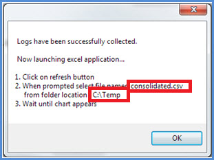
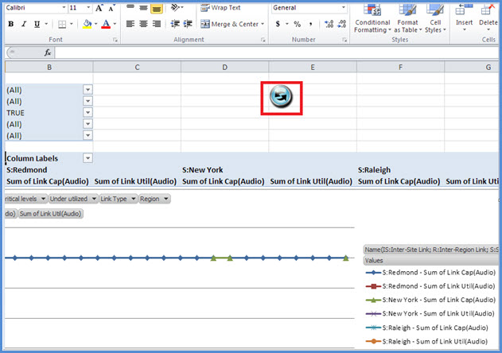

# <a name="skype-for-business-server-2015-resource-kit-tools-documentation"></a>Documentação das ferramentas do kit de recursos do Skype for Business Server 2015

Este tópico descreve as ferramentas no kit de recursos do Skype for Business Server 2015, incluindo a finalidade de cada ferramenta e exemplos de uso. O kit de recursos do Skype for Business Server 2015 ajuda a tornar as tarefas rotineiras mais fáceis para os administradores de ti que implantam e gerenciam o Skype for Business Server 2015. Por exemplo, a ferramenta **Web conf data** pode ser usada para controlar facilmente os dados que são carregados pelos usuários durante uma reunião online. A ferramenta **SEFAUtil** pode ser usada para configurar o encaminhamento de chamadas de representante e a resposta para usuários. Incentivamos os administradores de ti a usar essas ferramentas para gerenciar o Skype for Business Server 2015 com mais eficiência.

## <a name="installation-of-the-resource-kit-tools"></a>Instalação das ferramentas do kit de recursos

Para instalar o kit de recursos do Skype for Business Server 2015, baixe o [OCSReskit. msi](https://www.microsoft.com/download/details.aspx?id=52631) do centro de download.

Execute o **OCSResKit. msi** para fazer uma instalação simples. O. msi instala todas as ferramentas no seguinte caminho: **% Program programas%\skype for Business Server 2015 \ reskit**. As ferramentas que são executáveis independentes estão nessa pasta. As ferramentas que também têm arquivos de suporte estão em suas próprias subpastas.

## <a name="supported-environments"></a>Ambientes com suporte

O kit de recursos do Skype for Business Server 2015 deve ser instalado em um servidor que atenda às especificações necessárias para o Skype for Business Server 2015, geralmente um usado para executar o Skype for Business Server 2015.

## <a name="resource-kit-tools-overview"></a>Visão geral das ferramentas do kit de recursos

Veja a seguir uma lista das ferramentas fornecidas no kit de recursos do Skype for Business Server 2015. Uma descrição de cada ferramenta, incluindo os requisitos e o uso de exemplos, é abordada nas seções a seguir.

- [ABSConfig](resource-kit-tools.md#ABSConfig)

- [Monitor de serviço de política de largura de banda](resource-kit-tools.md#bpsm)

- [Analisador de utilização de largura de banda](resource-kit-tools.md#bua)

- [Chamar estacionador chamadas](resource-kit-tools.md#callpark)

- [DBAnalyze](resource-kit-tools.md#dba)

- [Importar dados do serviço de armazenamento](resource-kit-tools.md#Issd)

- [LCSSync](resource-kit-tools.md#LCSSync)

- [Procurar console de usuário](resource-kit-tools.md#LUC)

- [MsTurnPing](resource-kit-tools.md#MsTurnPing)

- [Visualizador de configuração de rede](resource-kit-tools.md#NCV)

- [Agente de grupo de resposta Live](resource-kit-tools.md#RGAL)

- [SEFAUtil](resource-kit-tools.md#SEFAUtil)

- [SYSPrep. ps1](resource-kit-tools.md#SYSPrep)

- [Migração de comunicados de número não atribuído](resource-kit-tools.md#UNAM)

- [Dados de conferência da Web](resource-kit-tools.md#WebConfData)

## <a name="absconfig"></a>ABSConfig
<a name="ABSConfig"> </a>

A ferramenta de configuração do serviço de catálogo de endereços (ABSConfig) é uma ferramenta administrativa que ajuda os administradores a personalizar a configuração do serviço de catálogo de endereços no Skype for Business Server 2015. Essa ferramenta também permite que os administradores do Skype for Business Server 2015 restaurem as configurações padrão do serviço de catálogo de endereços.

### <a name="description"></a>Descrição

O ABSConfig é um aplicativo de interface gráfica do usuário que permite que os administradores configurem atributos de serviços de domínio do Active Directory relacionados ao serviço de catálogo de endereços.

Os principais cenários da ferramenta são os seguintes:

- Para permitir que os administradores mapeiem atributos nos serviços de domínio do Active Directory para os atributos do Skype for Business Server 2015.

- Para permitir que os administradores especifiquem o atributo de serviços de domínio Active Directory a ser incluído ou excluído nos arquivos de serviço do catálogo de endereços.

- Para permitir que os administradores restaurem as configurações padrão do serviço de catálogo de endereços.

A ferramenta ABSConfig pode ser iniciada usando o arquivo ABSConfig. exe. A ferramenta é aberta para a guia **Configurar atributos** . Esta tabela tem opções para mapear atributos de serviços de domínio do Active Directory para os campos de atributo do Skype for Business Server 2015 e especificar quais usuários serão incluídos ou excluídos nos arquivos de serviço de catálogo de endereços com base em filtros de atributo específicos. Também tem opções para personalizar o valor do número de telefone a ser incluído no arquivo do catálogo de endereços. A opção **Restaurar padrões** permite que os administradores restaurem os valores padrão das configurações do serviço de catálogo de endereços.

> [!NOTE]
> O remapeamento dos atributos do AD para nomes de campo OC diferentes só funcionará para download de arquivo do catálogo de endereços e não terá suporte da consulta da Web do catálogo de endereços.

### <a name="output"></a>Saída

ABSConfig armazena a configuração do serviço de catálogo de endereços no banco de dados.

```console
Path: %ProgramFiles%\Skype for Business Server 2015\Reskit
```

### <a name="purpose"></a>Finalidade

O ABSConfig fornece uma maneira rápida e fácil de personalizar o serviço de catálogo de endereços do Skype for Business Server 2015.

### <a name="requirements"></a>Requirements

#### <a name="computer"></a>Computador

O ABSConfig pode ser executado apenas de um computador associado a um domínio que tenha o Skype for Business Server 2015 instalado. No caso do Skype for Business Server 2015, Enterprise Edition, essa ferramenta pode ser executada em qualquer servidor front-end que tenha o serviço de catálogo de endereços habilitado durante a instalação.

#### <a name="network"></a>Rede

O computador deve poder se conectar ao pool de front-ends e ao banco de dados back-end.

#### <a name="software"></a>Software

Os seguintes componentes de software devem ser instalados antes de executar a ferramenta ABSConfig:

- Skype for Business Server 2015

#### <a name="users"></a>Usuários

Administradores que têm as permissões necessárias para atualizar a implantação do Skype for Business Server 2015.

### <a name="examples"></a>Exemplos

O ABSConfig pode ser iniciado digitando **ABSConfig. exe** em um prompt de comando. Mostrado abaixo é a interface do usuário da ferramenta ABSConfig.


### <a name="summary"></a>Resumo

A ferramenta ABSConfig fornece aos administradores uma ferramenta rápida e fácil de usar para personalizar o serviço de catálogo de endereços do Skype for Business Server 2015.

## <a name="bandwidth-policy-service-monitor"></a>Monitor de serviço de política de largura de banda
<a name="bpsm"> </a>

A ferramenta Monitor de serviço de política de largura de banda destina-se a permitir que os administradores exibam uma lista dos seguintes:

1. Todos os serviços de política de largura de banda do Skype for Business Server 2015 (autenticação e núcleo) configurados na topologia

2. As conexões que cada serviço faz para outros serviços de política de largura de banda e para os servidores de borda

3. Todos os links que são configurados no documento de configuração de rede e uso de largura de banda em tempo real conforme relatado por cada um dos serviços de política de largura de banda

### <a name="description"></a>Descrição

A ferramenta Monitor de serviço de política de largura de banda é implementada como um aplicativo baseado em GUI. Os administradores iniciam a ferramenta executando o PDPMonUI. exe.

Quando a ferramenta é iniciada, tenta descobrir a lista de serviços de política de largura de banda na topologia. Depois que a atualização inicial for concluída, o painel à esquerda da janela será preenchido com uma lista de serviços que são agrupados pelos clusters aos quais pertencem.

Quando os administradores selecionam um serviço de política de largura de banda específico, o painel à direita exibe as informações sobre esse serviço específico. Esse painel também tem duas guias principais que exibem informações.

#### <a name="machine-info-tab"></a>Guia informações do computador

A guia **informações do computador** mostra os detalhes do serviço de política de largura de banda selecionado e a lista e o estado de todas as conexões feitas pelo serviço de política de largura de banda selecionado para outros serviços.

#### <a name="topology-info-tab"></a>Guia informações de topologia

A guia **informações da topologia** mostra uma lista de todos os links que são configurados nas definições de configuração da rede. Para cada link, a capacidade de largura de banda de áudio e vídeo é exibida. Além disso, a largura de banda atualmente utilizada é exibida, tanto em Kbps quanto como uma porcentagem da capacidade. A ferramenta usa codificação de cores para realçar os links que têm utilização próxima à capacidade, permitindo que os administradores isolem rapidamente esses links.

> [!NOTE]
>  Se a ferramenta de monitoração do serviço de política de largura de banda apresentar falha ao se conectar a qualquer um dos serviços de política de largura de banda configurados, as informações nas guias informações sobre a **máquina** e **informações de topologia** não serão preenchidas. No entanto, é possível que a ferramenta possa se conectar inicialmente, mas, em seguida, perder a conexão com o serviço. Nesses casos, os administradores podem ver informações desatualizadas. Há um carimbo de data/hora **atualizado** em cada uma das guias que podem permitir que os administradores vejam quando os dados foram atualizados pela última vez para um serviço de política de largura de banda específico.

### <a name="output"></a>Saída

Não há nenhuma saída de linha de comando; a saída do programa está contida na GUI (interface gráfica do usuário) principal.

### <a name="purpose"></a>Finalidade

O objetivo da ferramenta Monitor de serviço de política de largura de banda é permitir a visibilidade dos administradores no estado de cada um dos serviços de política de largura de banda definidos na topologia. Além disso, os administradores podem ver o uso da largura de banda em tempo real para todos os links definidos no documento de configuração de rede.

### <a name="requirements"></a>Requirements

A ferramenta Monitor de serviço de política de largura de banda precisa ser executada em um computador que faça parte da topologia do Skype for Business Server.

### <a name="summary"></a>Resumo

A ferramenta de monitoração de serviço de política de largura de banda pode ser um recurso valioso para os administradores para que eles possam inspecionar o estado de todos os serviços de política de largura de banda na topologia, e o mais importante: eles podem obter a utilização de largura de banda em tempo real para os links que são definido nas definições de configuração de rede.

## <a name="bandwidth-utilization-analyzer"></a>Analisador de utilização de largura de banda
<a name="bua"> </a>

O analisador de utilização de largura de banda é uma ferramenta que cria relatórios sobre vários modos de exibição de consumo de largura de banda pelos pontos de extremidade UC nos links WAN na rede corporativa. Esses relatórios podem ser usados para entender o padrão atual de consumo de largura de banda e para ajudar no planejamento da capacidade de largura de banda.

### <a name="description"></a>Descrição

O analisador de utilização de largura de banda é implementado como um aplicativo baseado em GUI. Essa ferramenta gera relatórios específicos para a utilização de áudio na rede e ajuda no planejamento da capacidade. Ele também itera na capacidade de largura de banda atribuída a vários links.

### <a name="output"></a>Saída

O analisador de utilização de largura de banda oferece plotagens em formato gráfico Al de capacidade de largura de banda e utilização de áudio para todos os links WAN que são configurados no sistema.

### <a name="purpose"></a>Finalidade

Em qualquer implantação de voz e vídeo, é fundamental monitorar e entender a tendência da utilização de largura de banda de tráfego de mídia na rede corporativa. A ferramenta Analisador de utilização da largura de banda permite que um administrador realize apenas isso. Esta ferramenta faz o seguinte:

- Gera relatórios específicos para a utilização de áudio na rede

- Ajuda no planejamento de capacidade mais eficaz e na iteração na capacidade de largura de banda atribuída a vários links

O analisador de utilização de largura de banda pode gerar gráficos de capacidade de largura de banda e relatórios de utilização; Eles são os seguintes:

- Todos os links WAN na rede corporativa

- Filtrado por links WAN selecionados que foram escolhidos

- Filtrado por links WAN que excederam a capacidade de link

- Filtrado por links WAN que estão subutilizando a largura de banda provisionada

- Filtrar por links WAN que atingiram níveis críticos (uma utilização de largura de banda maior que 90% da capacidade de largura de banda do link WAN)

- Filtrado por tipo de link WAN — links de site de rede, links entre regiões e links em um site

- Filtrado por região de rede

#### <a name="applications"></a>Aplicativos

O analisador de utilização da largura de banda tem os dois aplicativos a seguir (ferramentas):

- **WanLinkLogCollector. exe** esta ferramenta permite que o usuário insira as informações necessárias.

- **BandwidthUtilizationAnalyzer. xlsm** um relatório de software de planilha do Microsoft Excel é iniciado automaticamente pelo WanLinkLogCollector. exe. Este aplicativo permite que o usuário Aplique filtros ao relatório, conforme mostrado posteriormente neste artigo.

#### <a name="phases-of-using-bandwidth-utilization-analyzer"></a>Fases de uso do analisador de utilização de largura de banda

Há duas fases ao usar o analisador de utilização da largura de banda:

- Coletar logs, que é executado usando o WanLinkLogCollector. exe

- Personalizar relatórios, que é executado usando BandwidthUtilizationAnalyzer. xlsm

    > [!IMPORTANT]
    > É altamente recomendável que BandwidthUtilizationAnalyzer. xlsm não seja iniciado manualmente por usuários finais.

#### <a name="starting-bandwidth-utilization-analyzer"></a>Iniciando analisador de utilização da largura de banda

Inicie o WanLinkLogCollector. exe no prompt de comando ou usando o Windows Explorer.

 **Usando o WanLinkLogCollector. exe**

Há três etapas para usar o WanLinkLogCollector. exe:

1. **Registrar a linha do tempo** Forneça a linha do tempo para a qual o relatório precisa ser gerado

2. **Especificar os diretórios de arquivos** Fornecer informações de local de arquivo

3. **Coletar os logs e iniciar o Visualizador de relatórios** Executar o comando para gerar o relatório

#### <a name="step-1---log-the-timeline"></a>Etapa 1-registrar a linha do tempo

O registro da linha do tempo permite que o usuário da ferramenta especifique o seguinte, conforme mostrado na figura abaixo.

1. **Data de início** Esta é a data de início da linha do tempo para a qual o relatório deve ser gerado; por exemplo, 1º de agosto de 2010.

2. **Data de término** Esta é a data de término da linha do tempo para a qual o relatório deve ser gerado; por exemplo, 30 de setembro de 2010.

     

#### <a name="step-2---specify-the-file-directories"></a>Etapa 2-especificar os diretórios de arquivo

Os seguintes diretórios de arquivos podem ser especificados pelo usuário, conforme mostrado.

- **Local dos arquivos de log do servidor** O local da pasta onde os logs do servidor de política de largura de banda estão armazenados. Normalmente, isso ocorre \<\> \\<em \AppServerFiles\PDP. de opções\>de Fe

- **Local de armazenamento de arquivos temporários** O local do arquivo temporário onde os arquivos intermediários são armazenados enquanto o relatório está sendo gerado.

    

    > [!NOTE]
    > Certifique-se de que o acesso de arquivo suficiente aos logs de servidor e à pasta de repositório de arquivos temporários seja fornecido para o usuário da ferramenta.

#### <a name="step-3---collect-the-logs-and-start-the-report-viewer"></a>Etapa 3: coletar os logs e iniciar o Visualizador de relatórios

Para coletar os logs e iniciar o Visualizador de relatórios, clique em **executar** , conforme mostrado abaixo. Esta etapa coleta os dados necessários.


Quando a validação de entrada for bem-sucedida, a mensagem mostrada abaixo será exibida.



Clique em **OK**. BandwidthUtilizationAnalyzer. xlsm é iniciado automaticamente. Siga as instruções na caixa de mensagem. Para obter detalhes, consulte **usando o BandwidthUtilizationAnalyzer. xlsm** na próxima seção.


### <a name="using-bandwidthutilizationanalyzerxlsm"></a>Usando BandwidthUtilizationAnalyzer. xlsm

1. Quando o BandwidthUtilizationAnalyzer. xlsm é iniciado automaticamente, clique em **Atualizar** , conforme mostrado abaixo.

     

2. Quando uma pasta de arquivos for aberta, selecione consolidado. csv do local especificado na caixa de mensagem, conforme mostrado abaixo. Ele também mostra o local como **C:\temp**.

     

3. Clique em **Importar **.

4. A plotagem gráfica é gerada automaticamente. Ela estará disponível quando o ponteiro de trabalho em segundo plano desaparecer.

     

#### <a name="applying-filters-to-the-report-view"></a>Aplicando filtros ao modo de exibição de relatório

Os filtros que podem ser aplicados ao modo de exibição de relatório, conforme mostrado abaixo, são descritos a seguir:


1. **Nome** Filtrar por links WAN (o filtro está no lado direito do gráfico). O prefixo indica os seguintes tipos de link; Confira a caixa vertical (azul):

   - **S site** O link WAN de um site de rede para uma região de rede

   - **É entre sites** O link WAN entre dois sites de rede

   - **R inter-Region** O link WAN entre duas regiões de rede

2. **Limite excedido** Filtrar por links WAN cuja utilização de largura de banda é maior do que a capacidade de largura de banda

3. **Níveis críticos** Filtrar por links WAN cuja utilização da largura de banda alcançou 90% ou mais da capacidade da largura de banda

4. **Subutilizado** Filtrar por links WAN cuja utilização da largura de banda tenha sido inferior a 25% da capacidade da largura de banda

5. **Tipo de link** Filtrar pelos seguintes tipos de links de WAN:

   - Tipo de **site de rede**

   - Tipo **entre sites**

   - Tipo **de link entre regiões**

6. **Região** Filtrar por região de rede

As figuras a seguir mostram os filtros descritos anteriormente.

Filtrar por **nome**. Selecione a lista de links que precisam ser exibidos no gráfico.


Filtrar por **limite excedido**. Selecione **verdadeiro** para impor o filtro.


Filtrar por **níveis críticos**. Selecione **verdadeiro** para impor o filtro.


Filtrar por **subutilizado**. Selecione **verdadeiro** para impor o filtro.


Filtrar por **tipo de link**. Selecione o tipo ou tipos que precisam ser exibidos.


Filtrar por **região**. Selecione uma lista de regiões cujos vínculos precisam ser exibidos.


### <a name="requirements"></a>Requirements

- O .NET Framework 3,5

- Microsoft Excel 2010 ou Excel 2007

### <a name="summary"></a>Resumo

O analisador de utilização de largura de banda é usado para plotar a utilização de largura de banda de áudio para tráfego UC na rede. Essa ferramenta também pode ser usada para relatar a utilização da largura de banda de vídeo na rede.

## <a name="call-parkometer"></a>Chamar estacionador chamadas
<a name="callpark"> </a>

Call estacionador chamadas é um aplicativo de linha de comando que fornece fácil acesso ao banco de dados de órbita de estacionamento de chamada.

### <a name="description"></a>Descrição

O estacionador chamadas de chamada é uma ferramenta para rastrear chamadas estacionadas no momento. Ele também coleta estatísticas sobre órbitas e uso do servidor de estacionamento de chamada (CPS). Essa ferramenta de linha de comando fornece acesso de leitura e gravação ao banco de dados do SQL Server do CPS órbita de um computador local ou conectado remotamente.

Todas as opções são mutuamente exclusivas. A sintaxe da linha de comando é a seguinte:

- **-o** Parameter — lista todos os intervalos de órbita configurados para este pool.

- **-n** parâmetro — lista todas as órbitas usadas atualmente neste pool. As informações exibidas são as seguintes:

  - Identificador de recurso uniforme (URI) SIP do estacionamento e do estacionador.

  - Nome do host do CPS onde a chamada está estacionada.

  - Carimbo de data/hora de quando a chamada foi estacionada.

- **-f** parâmetro — lista o número de órbitas livres no momento no pool.

- **-r \<n\> ** parâmetro — lista as \<n\> últimas chamadas estacionadas. As informações exibidas são as seguintes:

  - URI do SIP do estacionamento.

  - Estacionador URI do SIP.

  - Nome do host do CPS onde a chamada foi estacionada.

  - Carimbo de data/hora de quando a chamada foi recuperada ou cancelada.

- **-t\<n\> ** parâmetro-tests que reservem uma órbita no banco de dados para mostrar a aleatoriedade dos números de órbita atribuídos.

### <a name="output"></a>Saída

Dependendo dos parâmetros de entrada que são especificados em um prompt de comando, Call estacionador chamadas exibe o seguinte resultado:

- Todos os intervalos de órbita configurados para este pool

- Chamadas estacionadas atualmente

- Número de órbitas livres (disponíveis)

- Chamadas estacionadas recentemente

- Órbitas reservados para testar valores de órbita uniformes e aleatórios

### <a name="purpose"></a>Finalidade

O objetivo da ferramenta CPS é fornecer acesso de linha de comando para o banco de dados CPS. O administrador pode exibir o uso do CPS e determinar o número de órbitas atribuídas a um pool.

### <a name="requirements"></a>Requirements

Não há requisitos se essa ferramenta for executada no mesmo computador que está executando o CPS. Se essa ferramenta for executada em um computador remoto, o banco de dados do SQL Server usado pelo Skype for Business Server 2015 deve ser configurado para permitir o acesso remoto. O estacionador chamadas de chamada deve ser configurado com uma cadeia de conexão de banco de dados do SQL Server para se conectar ao SQL Server do pool. Esta sequência de conexão de banco de dados do SQL Server está definida no arquivo de configuração, **estacionador chamadas. exe. config**. Ele deve ser colocado no mesmo diretório em que o estacionador chamadas. exe está localizado. O arquivo XML a seguir é um exemplo de estacionador chamadas. exe. config. Os parâmetros que devem ser configurados são o nome de usuário (por exemplo, mydomain\Administrator), a senha (por exemplo, mypassword) e o nome do host (por exemplo, meuservidor).

```xml
<?xml version="1.0" encoding="utf-8" ?>
<configuration>
  <appSettings>
   <add key="SQL" value="server=myserver\RTC;
database=cpsdyn;
User Id=mydomain\Administrator;
Password=mypassword.;
Integrated Security=false;"/>
  </appSettings>
</configuration>
```

### <a name="examples"></a>Exemplos

Intervalos de órbita implantados: o parâmetro-o lista todos os intervalos de órbita configurados para este pool, conforme mostrado


Chamadas estacionadas atualmente: o parâmetro-n lista todas as órbitas usadas atualmente neste pool, conforme mostrado


Número de órbitas livres: o parâmetro-f lista o número de órbitas livres no momento no pool, conforme mostrado


Chamadas estacionadas recentemente: o parâmetro \<-\> r n lista \<as\> n últimas chamadas estacionadas, conforme mostrado


Testar reserva de órbita: os testes \<de\> parâmetro-t n reservam uma órbita no banco de dados, conforme mostrado


### <a name="summary"></a>Resumo

Call estacionador chamadas é uma ferramenta de linha de comando que fornece informações detalhadas sobre o servidor de estacionamento de chamada.

## <a name="dbanalyze"></a>DBAnalyze
<a name="dba"> </a>

### <a name="description"></a>Descrição

DBAnalyze é uma ferramenta de linha de comando que ajuda os administradores a coletar relatórios de análise sobre os bancos de dados do Skype for Business Server 2015. O DBAnalyze tem os seguintes modos: diagnóstico, dados do usuário, conferência, MCUs e fragmentação de disco:

- **Modo de diagnóstico** Cria um relatório que inclui informações sobre as tabelas (número de registros, fragmentação, tamanho dos dados e tamanho do índice) arquivos de dados e de log, o último tempo de backup, distribuição de contatos entre servidores que estão executando o Microsoft Office Communications Server, o número médio de permissões, contatos, contêineres, assinaturas, publicações, pontos de extremidade por usuário, todos os usuários hospedados incorretamente, usuários que não podem ser roteados, o número médio de conferências organizadas por usuário, conferências programadas e a versão do banco de dados.

    > [!NOTE]
    > Executar o modo de diagnóstico pode afetar o desempenho do servidor.

- **Modo de dados do usuário** Relata os dados de contato, contêiner, assinatura, publicação, permissão e grupo de contato para um usuário especificado ou para usuários que tenham esse usuário em suas listas de permissões e contatos. Este modo também relata dados de resumo para conferências que um usuário organiza ou é convidado.

- **Modo de conferência** Relata dados detalhados para uma conferência específica, incluindo todos os detalhes de tempo de agenda da conferência, a lista de convidados, a lista de tipos de mídia permitidos para a conferência, active MCUs (unidades de controle multiponto), a lista de participantes ativa e o estado de sinalização de cada participante.

- **Decodificar ID da reunião** Decodifica uma ID de reunião PSTN (rede telefônica pública comutada) especificada pela opção **/pstnid** , mas não se conecta ao back-end para obter informações detalhadas.

- **Resolver conferência** Decodifica uma ID de reunião PSTN especificada pela opção **/pstnid** e exibe informações sobre a conferência indicada pela ID.

- **Modo MCUs** Relata a ID, o tipo de mídia, a URL, o status de pulsação, a carga de conferência e a carga de participante de cada MCU no pool.

- **Modo de fragmentação de disco** Exibe o status de fragmentação de todos os discos.

Essa ferramenta pode ser usada para diagnosticar vários problemas ou para ajudar os administradores com o planejamento de capacidade. Por exemplo, se a maioria dos usuários hospedados no servidor A escolher usuários hospedados no servidor B como seus contatos, o administrador pode mover os usuários no servidor A para o servidor B para reduzir o tráfego entre servidores.

### <a name="output"></a>Saída

Esta ferramenta produz relatórios predefinidos sobre o banco de dados do Skype for Business Server 2015. **Caminho**:%ProgramFiles%\Skype for Business Server 2015 \ reskit

### <a name="purpose"></a>Finalidade

Para instalar o Dbanalyze. exe, copie-o para uma pasta local e execute a ferramenta. Para usar a ferramenta, execute o seguinte comando a partir da linha de comando. `dbanalyze.exe [/v] [/report:value] [/sqlserver:value] [/user:user@domain.com] [/conf:value][/pstnid:Value] [/maxcontacts:value]`As descrições para as opções de linha de comando são mostradas abaixo.


### <a name="requirements"></a>Requirements

 **Computador** O DBAnalyze pode ser executado apenas de um computador associado a um domínio que tenha o Skype for Business Server 2015 instalado.

 **Rede** O computador deve poder se conectar ao banco de dados back-end.

 **Software** Os componentes de software do Skype for Business Server 2015 devem ser instalados antes de executar o DBAnalyze.

 **Usuários** do A tabela abaixo mostra os administradores que têm as permissões necessárias para acessar os bancos de dados do Skype for Business Server 2015.


> [!NOTE]
> Uma conta de administrador local é necessária para **/Report:** modo de disco.

### <a name="examples"></a>Exemplos

A seguir estão exemplos de comandos válidos do Dbanalyze. exe:

```console
dbanalyze.exe /report:diag
dbanalyze.exe /report:user /user:usera@domainb.com
dbanalyze.exe /report:conf /user:bob@example.com /conf:1W9J71SKSX2X
dbanalyze.exe /report:resolve /pstnid:12345
dbanalyze.exe /report:mcus
dbanalyze.exe /report:disk
```

### <a name="summary"></a>Resumo

O DBAnalyzer fornece aos administradores uma rápida e fácil de analisar os bancos de dados do Skype for Business Server 2015.

## <a name="import-storage-service-data"></a>Importar dados do serviço de armazenamento
<a name="Issd"> </a>

A ferramenta ImportStorageServiceData Resource Kit permite a reimportação da fila e dos dados de ponto de extremidade que foram liberados do serviço de armazenamento (LYSS) de volta para o serviço de armazenamento.

### <a name="description"></a>Descrição

Os dados liberados do serviço de armazenamento podem ter sido automáticos (periódicos) com base no status do item da fila ou no tamanho do banco de dados. Isso pode ter acontecido devido à invocação manual do cmdlet de failover do pool ou do cmdlet StorageServiceFullFlush (que o cmdlet de failover do pool invoca). Observe que, preferencialmente, os dados não devem ser importados se qualquer tamanho do banco de dados do serviço de armazenamento (LYSS) no front-ends estiver acima do nível normal, porque isso provavelmente fará com que mais dados sejam exportados de volta. Além disso, qualquer problema que possa ter contribuído com erros que fizeram com que a fila de serviço de armazenamento cresça deve primeiro ser resolvido (por exemplo, erros de ponto de extremidade do Exchange, problemas de rede ou outros problemas).

 **Cenário 1:** durante o failover do pool, os arquivos podem ser liberados do serviço de armazenamento para cada front-end. Após a conclusão do failover, a ferramenta deve ser executada para reimportar os dados.

 **Cenário 2:** os dados estão sendo liberados automaticamente todos os dias ou em resposta ao banco de dados do serviço de armazenamento excedendo determinados limites de tamanho (por exemplo, 60%, 80%, 90% completo). Os dados automaticamente liberados devem ser reimportados rotineiramente pelo administrador. Na situação acima, se o pacote SCOM de monitoramento não for implantado, haverá eventos para o serviço de armazenamento do Skype for Business Server relacionado aos dados que estão sendo liberados do serviço de armazenamento. IDs de evento de 32075 (operação de liberação completa iniciada), 32076 (Full flush concluído), 32082 (liberação de nível de manutenção iniciada), 32083 (liberação de nível de manutenção concluída), 32089 (liberação ocorrida devido ao preenchimento de banco de dados). Observação essas IDs de evento correspondem à versão RTM. Quando um administrador vê esses eventos, significa que há arquivos que foram liberados. Esses dados devem ser importados rotineiramente de volta usando essa ferramenta, por exemplo, uma vez por semana.

Para a versão de serviço online, se o monitoramento de integridade do SCOM Pack para Skype for Business Server estiver implantado, há novos alertas que podem ser gerados, o que pede ao administrador para reimportar os dados liberados de volta para o serviço de armazenamento. Haverá um evento correspondente no log de eventos do servidor front-end que disparou o alerta. O evento fornecerá uma descrição do caminho pai no qual os arquivos de dados liberados estão localizados, bem como o número de arquivos que atendem aos critérios de alerta. Os critérios de alerta é que há X ou mais arquivos sob o caminho pai específico, que têm pelo menos Y dias (onde X e Y são predefinidos no StorageService, mas podem ser substituídos alterando o arquivo APPCONFIG.) Dois exemplos de eventos que podem acionar o alerta de integridade são mostrados abaixo, com a diferença que é o caminho pai. Uma possibilidade está no compartilhamento de arquivos do serviço Web, enquanto a outra possibilidade é o diretório de dados do aplicativo local de cada front-end. (por exemplo, c:\ProgramData\Microsoft\Skype para o Business Server 2015 \ StorageService). O administrador executará essa ferramenta reskit.

Essa ferramenta aumentará a carga de CPU e de e/s no front-end em que está sendo executado, bem como outros front-ends, na situação em que os dados não são de Propriedade do front-end em que a ferramenta é executada. É recomendável executar esta ferramenta quando os front-ends não estão sob carga intensa de CPU e e/s, por exemplo fora do horário de pico. Em segundo lugar, essa ferramenta pode ser de 2 a 3 minutos para importar um arquivo de dados. Tenha isso em mente ao estimar por quanto tempo a ferramenta será executada. O arquivo de log detalhado gerado pela ferramenta será exibido, por padrão, no repositório de arquivos. Exclua-o se não houver erros relatados, pois o arquivo de log pode ter dezenas de MB ou mais.


### <a name="requirements"></a>Requirements

Instale as ferramentas do kit de recursos do Skype for Business Server 2015. A ferramenta é executada em máquinas Unidas por domínio nas quais o Skype for Business Server e o Shell de gerenciamento do Skype for Business Server estão instalados. A ferramenta usa um cmdlet do Shell de gerenciamento para identificar todos os servidores front-end no pool. Em segundo lugar, a ferramenta deve ser executada em um computador no pool que tenha o banco de dados **RtcLocal** instalado. Este banco de dados é usado pela ferramenta para recuperar o local do compartilhamento de arquivo WEBSERVICE do pool. Além disso, antes de usar a ferramenta, cada servidor front-end deve primeiro habilitar a comunicação remota do Windows PowerShell usando **Enable-PSRemoting** em cada servidor de front-end, bem como a máquina da qual a ferramenta é executada. Caso contrário, os comandos remotos do Windows PowerShell dessa ferramenta falharão. A comunicação remota do Windows PowerShell pode ser desativada em todos os servidores front-end no pool após sua conclusão. Por fim, a conta ou a credencial que invoca a ferramenta deve ter permissão de leitura/gravação no compartilhamento de arquivo WebService para o pool em que eles estão executando essa ferramenta. Caso contrário, a ferramenta irá falhar com erros de permissão de es.

> [!NOTE]
> No Windows Server 2012, o Windows PowerShell Remoting é habilitado por padrão, mas não no sistema operacional Windows Server 2008.

### <a name="examples"></a>Exemplos

```console
>  C:\StorageService>ImportStorageServiceData.exe
Description:
This tool will re-import Storage Service (LYSS) flushed queue data back in.  For a pool: you are required to run this tool on a machine inside the pool which has the Lync Server Management Shell installed.  Additionally, all front end machines need to have Windows Powershell Remoting enabled before executing this tool by executing Enable-PSRemoting.  Also, please ensure that all Storage Service instance DB Size are at the 'Normal' level (verify this by viewing Eventlog events). Otherwise re-importing may cause data to be flushed out again if any Storage Service instance DB size level goes above 'Normal'.
Usage: Default behavior is to Import data from web service file share as well as any files on all Front End machines in pool.
Additional Options:
-Verbose                    : Turn verbose output on.

-StorageServiceHostName     : Host Name of Storage Service WCF endpoint.  ( Default=localhost netnamedpipe binding. )

-FileSharePath              : Import only all data from just under the UNC path specified.

ActivityID: cc3b62ff-bb66-4e61-a6e2-96cb3626315c. <-- Use this to correlate with StorageService trace logs if troubleshooting.
Type Server name (TCP binding) or press <enter> for localhost (NamePipe binding):
Using NetNamedPipeBinding...
OnTopologyChanged Event received
Web Service File Share: \\dc.vdomain.com\OcsFileStore\co1-WebServices-1\StorageService

Front Ends:
server.vdomain.com
server2.vdomain.com
server1.vdomain.com
server3.vdomain.com
Looking under directory: \\dc.vdomain.com\OcsFileStore\co1-WebServices-1\StorageService for exported data.
# Files found: 8
Starting Import for file:\\dc.vdomain.com\OcsFileStore\co1-WebServices-1\StorageService\DataExport\2
0120910\SERVER.vdomain.com\944f5724c65c5f93900dc1c8c898b102__0.xml
Items deserialized: 20

All items in file were enqueued successfully, will try to delete file: \\dc.vdomain.com\OcsFileStore\co1-WebServices-1\StorageService\DataExport\20120910\SERVER.vdomain.com\944f5724c65c5f93900dc1c8c898b102__0.xml

All items in file failed to enqueue so file will not be deleted.  File path: \\dc.vdomain.com\OcsFileStore\co1-WebServices-1\StorageService\DataExport\20120910\SERVER.vdomain.com\944f5724c65c5f93900dc1c8c898b102__0.xml

Summary for file \\dc.vdomain.com\OcsFileStore\co1-WebServices-1\StorageService\DataExport\20120910\SERVER.vdomain.com\944f5724c65c5f93900dc1c8c898b102__0.xml: succeeded: 20, failed: 0

Starting Import for file:\\dc.vdomain.com\OcsFileStore\co1-WebServices-1\StorageService\DataExport\20120910\SERVER1.vdomain.com\17d5435ae40259f7bbdf1866776386e4__0.xml
Items deserialized: 20

[cc3b62ff-bb66-4e61-a6e2-96cb3626315c] Send EnqueueMessages to redirected, targetServer=server1.vdomain.com, queueItems=20

All items in file were enqueued successfully, will try to delete file: \\dc.vdomain.com\OcsFileStore\co1-WebServices-1\StorageService\DataExport\20120910\SERVER1.vdomain.com\17d5435ae40259f7bbdf1866776386e4__0.xml

All items in file failed to enqueue so file will not be deleted.  File path: \\dc.vdomain.com\OcsFileStore\co1-WebServices-1\StorageService\DataExport\20120910\SERVER1.vdomain.com\17d5435ae40259f7bbdf1866776386e4__0.xml

Summary for file \\dc.vdomain.com\OcsFileStore\co1-WebServices-1\StorageService\DataExport\20120910\
SERVER1.vdomain.com\17d5435ae40259f7bbdf1866776386e4__0.xml: succeeded: 20, failed: 0

Starting Import for file:\\dc.vdomain.com\OcsFileStore\co1-WebServices-1\StorageService\DataExport\20120910\SERVER1.vdomain.com\904f6c9b8ac951ae8b3c86684d3832e4__0.xml

Items deserialized: 20
[cc3b62ff-bb66-4e61-a6e2-96cb3626315c] Send EnqueueMessages to redirected, targetServer=server1.vdomain.com, queueItems=20

All items in file were enqueued successfully, will try to delete file: \\dc.vdomain.com\OcsFileStore
\co1-WebServices-1\StorageService\DataExport\20120910\SERVER1.vdomain.com\904f6c9b8ac951ae8b3c86684d
3832e4__0.xml

All items in file failed to enqueue so file will not be deleted.  File path: \\dc.vdomain.com\OcsFil
eStore\co1-WebServices-1\StorageService\DataExport\20120910\SERVER1.vdomain.com\904f6c9b8ac951ae8b3c
86684d3832e4__0.xml

Summary for file \\dc.vdomain.com\OcsFileStore\co1-WebServices-1\StorageService\DataExport\20120910\
SERVER1.vdomain.com\904f6c9b8ac951ae8b3c86684d3832e4__0.xml: succeeded: 20, failed: 0

Starting Import for file:\\dc.vdomain.com\OcsFileStore\co1-WebServices-1\StorageService\DataExport\2
0120910\SERVER2.vdomain.com\69844a271e6c5633a1f2b46a42287dd6__0.xml

Items deserialized: 20

[cc3b62ff-bb66-4e61-a6e2-96cb3626315c] Send EnqueueMessages to redirected, targetServer=server2.vdom
ain.com, queueItems=20

All items in file were enqueued successfully, will try to delete file: \\dc.vdomain.com\OcsFileStore
\co1-WebServices-1\StorageService\DataExport\20120910\SERVER2.vdomain.com\69844a271e6c5633a1f2b46a42
287dd6__0.xml

All items in file failed to enqueue so file will not be deleted.  File path: \\dc.vdomain.com\OcsFil
eStore\co1-WebServices-1\StorageService\DataExport\20120910\SERVER2.vdomain.com\69844a271e6c5633a1f2
b46a42287dd6__0.xml

Summary for file \\dc.vdomain.com\OcsFileStore\co1-WebServices-1\StorageService\DataExport\20120910\
SERVER2.vdomain.com\69844a271e6c5633a1f2b46a42287dd6__0.xml: succeeded: 20, failed: 0

Starting Import for file:\\dc.vdomain.com\OcsFileStore\co1-WebServices-1\StorageService\DataExport\2
0120910\SERVER3.vdomain.com\3313935458e35b9b9759e08a15d251e6__0.xml

Items deserialized: 20

[cc3b62ff-bb66-4e61-a6e2-96cb3626315c] Send EnqueueMessages to redirected, targetServer=server3.vdom
ain.com, queueItems=1

All items in file were enqueued successfully, will try to delete file: \\dc.vdomain.com\OcsFileStore
\co1-WebServices-1\StorageService\DataExport\20120910\SERVER3.vdomain.com\3313935458e35b9b9759e08a15
d251e6__0.xml

All items in file failed to enqueue so file will not be deleted.  File path: \\dc.vdomain.com\OcsFil
eStore\co1-WebServices-1\StorageService\DataExport\20120910\SERVER3.vdomain.com\3313935458e35b9b9759
e08a15d251e6__0.xml

Summary for file \\dc.vdomain.com\OcsFileStore\co1-WebServices-1\StorageService\DataExport\20120910\
SERVER3.vdomain.com\3313935458e35b9b9759e08a15d251e6__0.xml: succeeded: 20, failed: 0

Starting Import for file:\\dc.vdomain.com\OcsFileStore\co1-WebServices-1\StorageService\DataExport\2
0120910\SERVER3.vdomain.com\4501e04eae4856059346949ff817c220__0.xml
Items deserialized: 20
[cc3b62ff-bb66-4e61-a6e2-96cb3626315c] Send EnqueueMessages to redirected, targetServer=server3.vdom
ain.com, queueItems=1
All items in file were enqueued successfully, will try to delete file: \\dc.vdomain.com\OcsFileStore
\co1-WebServices-1\StorageService\DataExport\20120910\SERVER3.vdomain.com\4501e04eae4856059346949ff8
17c220__0.xml
All items in file failed to enqueue so file will not be deleted.  File path: \\dc.vdomain.com\OcsFil
eStore\co1-WebServices-1\StorageService\DataExport\20120910\SERVER3.vdomain.com\4501e04eae4856059346
949ff817c220__0.xml

Summary for file \\dc.vdomain.com\OcsFileStore\co1-WebServices-1\StorageService\DataExport\20120910\
SERVER3.vdomain.com\4501e04eae4856059346949ff817c220__0.xml: succeeded: 20, failed: 0
Starting Import for file:\\dc.vdomain.com\OcsFileStore\co1-WebServices-1\StorageService\DataExport\2
0120910\SERVER3.vdomain.com\5ad77443ad955a22a876749be66d5317__0.xml

Items deserialized: 20
[cc3b62ff-bb66-4e61-a6e2-96cb3626315c] Send EnqueueMessages to redirected, targetServer=server3.vdom
ain.com, queueItems=20
All items in file were enqueued successfully, will try to delete file: \\dc.vdomain.com\OcsFileStore
\co1-WebServices-1\StorageService\DataExport\20120910\SERVER3.vdomain.com\5ad77443ad955a22a876749be6
6d5317__0.xml
All items in file failed to enqueue so file will not be deleted.  File path: \\dc.vdomain.com\OcsFil
eStore\co1-WebServices-1\StorageService\DataExport\20120910\SERVER3.vdomain.com\5ad77443ad955a22a876
749be66d5317__0.xml
Summary for file \\dc.vdomain.com\OcsFileStore\co1-WebServices-1\StorageService\DataExport\20120910\
SERVER3.vdomain.com\5ad77443ad955a22a876749be66d5317__0.xml: succeeded: 20, failed: 0
Starting Import for file:\\dc.vdomain.com\OcsFileStore\co1-WebServices-1\StorageService\DataExport\2
0120910\SERVER3.vdomain.com\a11e27ae439a582288d4657eda86b565__0.xml
Items deserialized: 20
[cc3b62ff-bb66-4e61-a6e2-96cb3626315c] Send EnqueueMessages to redirected, targetServer=server3.vdom
ain.com, queueItems=20
All items in file were enqueued successfully, will try to delete file: \\dc.vdomain.com\OcsFileStore
\co1-WebServices-1\StorageService\DataExport\20120910\SERVER3.vdomain.com\a11e27ae439a582288d4657eda
86b565__0.xml
All items in file failed to enqueue so file will not be deleted.  File path: \\dc.vdomain.com\OcsFil
eStore\co1-WebServices-1\StorageService\DataExport\20120910\SERVER3.vdomain.com\a11e27ae439a582288d4
657eda86b565__0.xml
Summary for file \\dc.vdomain.com\OcsFileStore\co1-WebServices-1\StorageService\DataExport\20120910\
SERVER3.vdomain.com\a11e27ae439a582288d4657eda86b565__0.xml: succeeded: 20, failed: 0
All files have been imported into Storage Service for path: \\dc.vdomain.com\OcsFileStore\co1-WebSer
vices-1\StorageService
Importing files for: server.vdomain.com
No files founds.
Importing files for: server2.vdomain.com
No files founds.
Importing files for: server1.vdomain.com
No files founds.
Importing files for: server3.vdomain.com
No files founds.
Writing log: \\dc.vdomain.com\OcsFileStore\co1-WebServices-1\StorageService\ImportStorageServiceData
Log20120910_1609SS
Tool has finished execution.
>  C:\StorageService>
```

## <a name="lcssync"></a>LCSSync
<a name="LCSSync"> </a>

A ferramenta LCSSync ajuda a implantar o software de comunicação do Skype for Business Server 2015 em um ambiente de várias florestas. Essa ferramenta é usada para sincronizar usuários e grupos de florestas de usuários diferentes como um objeto de contato dos serviços de domínio Active Directory para uma floresta central onde o Skype for Business Server 2015 está instalado.

### <a name="description"></a>Descrição

 O LCSSync usa os objetos de contato do serviços de domínio do Active Directory sincronizados na floresta central para permitir que os usuários do Skype for Business Server. Para fornecer logon único, a conta de usuário principal deve ser mapeada para o objeto de contato dos serviços de domínio Active Directory na floresta central do Skype for Business Server 2015. Essa ferramenta ajuda a executar esse mapeamento. Esta ferramenta fornece modelos para a criação de agentes de gerenciamento no Microsoft Identity Integration Server.

### <a name="summary"></a>Resumo

A ferramenta LCSSync ajuda a implantar o Skype for Business Server 2015 em um ambiente de várias florestas.

## <a name="lookup-user-console"></a>Procurar console de usuário
<a name="LUC"> </a>

A ferramenta LookupUserConsole exibe informações de roteamento internas do Skype for Business Server sobre usuários específicos. Essas informações podem ser úteis para o suporte pessoal da Microsoft no diagnóstico de problemas de implantação e roteamento.

### <a name="description"></a>Descrição

 Executar o LookupUserConsole. exe abrirá um prompt de comando que aceita endereços SIP e tenta exibir informações de roteamento internas do Skype for Business Server relacionadas a eles. Digite **Exit** para sair da ferramenta LookupUserConsole.

### <a name="requirements"></a>Requirements

Instale o kit de recursos do Skype for Business Server 2015. A ferramenta é executada em máquinas Unidas por domínio onde o Skype for Business Server está instalado.

### <a name="examples"></a>Exemplos

C:\Arquivos de Files\Skype for Business Server 2015 \ reskit\>LookupUserConsole. exe

```console
> sip:john.doe@vdomain.com

  Execution time (ms):                            171.094
  Exeuction result:                               Success
  SIP URI:                                        sip:john.doe@vdomain.com
  User info:
    SID:                                          S-1-5-21-2831376166-29632525...    Display name:                                     John Doe
    Grouping ID:                                  00000000-0000-0000-0000-...
    Line URI:                                     <null>
    Policy assignment:                            TenantId={00000000--0000-000....
    SIP enabled:                                  True
    UC enabled:                                   False
    Tenant ID:                                    00000000-0000-0000-0000-...  Cluster info:
    Active cluster:                               pool0.vdomain.com
    Backup registrar cluster:                     <null>
    Deployment location:                          <null>
    Home Front-End FQDN:                          SERVER.vdomain.com
    Primary Registrar cluster:                    pool0.vdomain.com
    Remote Director external SIP FQDN:            <null>
    Remote Director internal SIP FQDN:            <null>
    Remote Director Web FQDN:                     <null>
    Routing group ID:                             4501e04e-ae48-5605-9346...
    Service tag ID:                               1266953005
    User Front-End resolved:                      True
    User in local forest:                         True
    User in remote forest:                        False
    User in split domain:                         False
    User-Services cluster:                        pool0.vdomain.com

> sip:nouser@vdomain.com

  Execution time (ms):                            948.7574
  Exeuction result:                               UserDoesNotExist

> exit
```

## <a name="msturnping"></a>MsTurnPing
<a name="MsTurnPing"> </a>

A ferramenta MSTurnPing permite que um administrador do software de comunicações do Skype for Business Server 2015 Verifique o status dos servidores que executam o perímetro de áudio/vídeo e os serviços de autenticação de áudio/vídeo, bem como os servidores que estão executando os serviços de política de largura de banda na topologia.

### <a name="description"></a>Descrição

A ferramenta MSTurnPing permite que um administrador do software de comunicações do Skype for Business Server 2015 Verifique o status dos servidores que executam o perímetro de áudio/vídeo e os serviços de autenticação de áudio/vídeo, bem como os servidores que estão executando os serviços de política de largura de banda na topologia.

A ferramenta permite que o administrador execute os seguintes testes:

1. Teste de servidor de borda a/V: a ferramenta realiza testes em todos os servidores de borda a/V na topologia fazendo o seguinte:

   - Verificar se o serviço de autenticação de áudio/vídeo do Skype for Business Server foi iniciado e se pode emitir credenciais adequadas.

   - Verificando se o serviço de borda de áudio/vídeo do Skype for Business Server foi iniciado e pode alocar os recursos na borda externa com êxito.

2. Teste do serviço de política de largura de banda: a ferramenta realiza testes em todos os servidores que estão executando os serviços de política de largura de banda na topologia fazendo o seguinte:

   - Verificar se o serviço de política de largura de banda (autenticação) do Skype for Business Server foi iniciado e pode emitir credenciais adequadas.

   - Verificando se o serviço de política de largura de banda (principal) do Skype for Business Server foi iniciado e pode executar a verificação de largura de banda com êxito.

Essa ferramenta deve ser executada em um computador que faça parte da topologia e tenha o repositório local instalado.

### <a name="output"></a>Saída

A ferramenta gera os resultados de cada uma das operações.

- Se o teste **AudioVideoEdgeServer** for executado, a ferramenta produzirá o seguinte:

  - Os resultados do teste dos computadores que fornecem o serviço de autenticação de áudio/vídeo do Skype for Business Server 2015 na topologia

  - Os resultados do teste dos computadores que fornecem o serviço de borda de áudio/vídeo do Skype for Business Server 2015 na topologia

- Se o teste **BandwidthPolicyServer** for executado, a ferramenta produzirá o seguinte:

  - Os resultados do teste dos computadores que fornecem o serviço de política de largura de banda (autenticação) do Skype for Business Server 2015 na topologia

  - Os resultados do teste dos computadores que fornecem o serviço de política de largura de banda (principal) do Skype for Business Server 2015 na topologia

### <a name="requirements"></a>Requirements

- Essa ferramenta deve ser executada em um computador que esteja na topologia e que tenha o repositório local.

- A ferramenta deve ser executada como administrador que tenha acesso ao repositório local.

### <a name="examples"></a>Exemplos

Veja a seguir um exemplo de entrada da ferramenta.

```console
MsTurnPing -ServerRole AudioVideoEdgeServer

MsTurnPing -ServerRole BandwidthPolicyServer
```

### <a name="summary"></a>Resumo

Essa ferramenta pode ser um recurso valioso para os administradores do Skype for Business Server 2015 que desejam verificar o status dos servidores que estão executando o áudio/vídeo e os serviços de política de largura de banda.

## <a name="network-configuration-viewer"></a>Visualizador de configuração de rede
<a name="NCV"> </a>

O Visualizador de configuração de rede pode ser usado pelos administradores do software de comunicações do Skype for Business Server 2015 para exibir a topologia de rede do CAC (controle de admissão de chamadas) para uma empresa que é configurada para permitir sessões de comunicação em tempo real, como chamadas de voz ou vídeo com base na capacidade de largura de banda especificada. Os administradores do Skype for Business Server 2015 definem políticas de CAC, que são impostas pelos serviços de política de largura de banda que são instalados com o Skype for Business Server 2015.

### <a name="description"></a>Descrição

O Visualizador de configuração de rede (NetworkConfigurationViewer. exe) permite que os administradores realizem as seguintes tarefas:

- Carregar e exibir a topologia de rede do CAC de uma implantação do Skype for Business Server 2015 em um formato gráfico.

- Carregar e exibir a topologia de rede do CAC de um arquivo de log do servidor de política de largura de banda em um formato gráfico.

- Salve e armazene a topologia de rede do CAC em um formato XML no disco.

- Salve e armazene o diagrama de topologia de rede do CAC no formato JPG ou BMP.

- Exibir dados de configuração da topologia de rede do CAC.

- Exibir a topologia de rede do CAC em um estilo de exibição de árvore.

- Definir conectores personalizados para links de topologia de rede do CAC (por exemplo, links de site para região, região para região e site para site).

- Exibir as informações do site de topologia de rede do CAC, as informações de região e as políticas de largura de banda e os links de rede provisionados.

### <a name="purpose"></a>Finalidade

Exibir links de topologia de rede do CAC Enterprise em uma interface gráfica.

### <a name="examples"></a>Exemplos

 **Carregar e exibir a topologia de rede do CAC de uma implantação do Skype for Business server 2015 em um formato gráfico**: Skype for business Server 2015 os administradores podem carregar e exibir a configuração da topologia de rede do CAC em qualquer computador do Skype for business Server 2015 usando a opção **baixar configuração de rede** , conforme mostrado na figura a seguir. A ferramenta falhará ao baixar ou exibir essa configuração quando implantada em um computador que não tenha conectividade com o repositório de configuração do Skype for Business Server 2015.


 **Carregar e exibir a topologia de rede do CAC de um arquivo de log do servidor de política de largura de banda em um formato gráfico:** Servidores de política de largura de banda do Skype for Business Server 2015 salve a topologia de rede do CAC como parte do mecanismo de log no local de compartilhamento de arquivos do Skype for Business Server 2015. Skype for Business Server 2015 os administradores podem exibir esse arquivo em um formato gráfico usando a opção **abrir configuração de rede** , conforme mostrado abaixo.


Salvar e armazenar a topologia de rede do CAC em um formato XML no disco: os administradores do Skype for Business Server 2015 podem salvar o arquivo de configuração da topologia de rede do CAC em um formato XML usando a opção **salvar uma cópia da configuração de rede** , conforme mostrado abaixo. O arquivo de configuração salvo pode ser usado offline para fins de exibição gráfica.


Salvar e armazenar o diagrama de topologia de rede do CAC no formato JPG ou BMP: os administradores do Skype for Business Server 2015 podem salvar a configuração de topologia de rede do CAC em um formato gráfico (formatos de arquivo JPG e BMP) usando a opção **salvar diagrama de configuração de rede como imagem** , conforme mostrado abaixo.


 <strong>Exibir dados de configuração de topologia de rede do CAC:</strong> Os administradores do Skype for Business Server 2015 podem exibir dados de configuração de rede relacionados, como regiões de rede, sites de rede, perfis de largura de banda e endereços IP de sub-rede de site em um formato textual, usando a opção Exibir dados de configuração de rede, conforme mostrado abaixo.


 **Exibir a topologia de rede do CAC em um estilo de exibição de árvore:** Os administradores do Skype for Business Server 2015 podem exibir dados de configuração de rede relacionados em um estilo de exibição de árvore gráfica usando o painel de controle no lado esquerdo da janela da ferramenta, conforme mostrado abaixo.


 **Definir conectores personalizados para links de topologia de rede do CAC (como links de site a região, região para região e site a site):** Skype for Business Server 2015 os administradores podem definir conectores gráficos personalizados para os links WAN de configuração de rede do CAC usando a opção configurações, conforme mostrado abaixo. Isso ajuda a diferenciar entre vários tipos de links de rede que são provisionados na configuração de rede.


 **Exibir as informações do site de topologia de rede do CAC, as informações de região e as políticas de largura de banda provisionadas:** Skype for Business Server 2015 os administradores podem exibir informações de região de rede do CAC relacionadas, informações do site e informações de provisionamento de largura de banda do CAC usando opções mostradas abaixo. (Por exemplo, clique em **informações** em uma região de rede ou em um objeto de site de rede.)


### <a name="summary"></a>Resumo

Essa ferramenta pode ser um recurso valioso para os administradores do Skype for Business Server 2015 que desejam exibir a topologia de rede do CAC para sua implantação em um formato gráfico.

## <a name="response-group-agent-live"></a>Agente de grupo de resposta Live
<a name="RGAL"> </a>

O aplicativo grupo de resposta oferece aos agentes a capacidade de acessar informações úteis em tempo real usando seu serviço Web interno. Infelizmente, nenhuma exibição gráfica desses dados está disponível fora do aplicativo. A ferramenta agente de grupo de resposta Live Resource Kit resolve esse problema fornecendo uma maneira simples e gráfica de acessar essas informações, aprimoradas com informações de software de comunicação do Skype for Business em tempo real, como a presença de outros agentes.

### <a name="description"></a>Descrição

Agente de grupo de resposta Live é um aplicativo do Windows que fornece a funcionalidade de entrada e de saída e algumas informações em tempo real (como associação de grupo e número atual de chamadas) para os agentes de grupo de resposta. Ele deve ser uma versão avançada da página de grupos de agentes (acessível do Skype for Business.

### <a name="purpose"></a>Finalidade

O aplicativo grupo de resposta enfileira as chamadas de entrada e roteia-as para os grupos de agentes. Para tomar decisões informadas sobre quais chamadas de serviço, os agentes podem acessar informações em tempo real sobre seus grupos de agentes, como quais outros agentes estão disponíveis e quantas chamadas estão aguardando em cada fila. Essas informações, inicialmente acessíveis apenas através do serviço de grupo de resposta, são disponibilizadas de forma intuitiva por agente de grupo de resposta ao vivo.

#### <a name="features"></a>Recursos

A ferramenta agente de grupo de resposta do Live é criada no serviço de grupo de resposta e no SDK 2015 do Skype for Business Server. Ele fornece aos agentes do grupo de resposta as informações e os recursos disponíveis no serviço do grupo de resposta (como associação de grupo, presença de outros agentes e número de chamadas em espera).

A figura abaixo ilustra a interface principal do agente do grupo de resposta em tempo real.


Os três recursos principais a seguir estão disponíveis para agentes no agente de grupo de resposta em tempo real:

- **Entrada/saída:** Ao contrário da página grupos de agentes (acessível a partir do Skype for Business Server 2015), o agente de grupo de resposta Live permite que somente os agentes entrem ou de todos os grupos de agente ao mesmo tempo. Este aplicativo fornece três maneiras rápidas para que os agentes entrem ou esgotam:

  - Clique nos botões de entrada/saída (verde e vermelho) no aplicativo.

  - Clique com o botão direito do mouse no ícone da bandeja do sistema e selecione entrar ou sair.

  - Usando atalhos de teclado configuráveis.

- **Associação de Grupo:** Quando um grupo de agentes é selecionado, o agente de grupo de resposta Live exibe a lista de agentes desse grupo no painel direito. Se o Skype for Business Server 2015 estiver em execução no mesmo computador que este aplicativo, as informações de presença e o cartão de visita serão exibidos no agente do grupo de resposta em tempo real. Os agentes podem enviar uma mensagem instantânea ou ligar para outros agentes diretamente de lá.

- **Estatísticas em tempo real:** Agente de grupo de resposta Live fornece estatísticas em tempo real para todos os grupos de agentes. A frequência de atualização é um minuto. Quando uma chamada é atendida por um grupo de resposta, um indicador visual é adicionado ao lado do nome do grupo com o número atual de chamadas em fila. Pausar o ponteiro sobre um grupo também exibe o tempo de espera mais longo.

### <a name="requirements"></a>Requirements

O agente de grupo de resposta Live requer o .NET Framework 4,0. Além disso, para aproveitar os recursos de cartão de visita e presença, o Skype for Business deve estar instalado localmente (e em execução).

#### <a name="configuration"></a>Configuração

O agente de grupo de resposta Live pode ser personalizado para preferências individuais usando a caixa de diálogo opções no aplicativo. Além disso, o administrador pode definir o endereço de host padrão editando diretamente a propriedade defaultHostAddress do arquivo RGAgentLive. exe. config.

A figura abaixo ilustra a caixa de diálogo opções que os agentes podem usar para configurar o endereço do host e as teclas de atalho. Essa caixa de diálogo é acessada clicando-se no botão Opções no canto superior direito da interface principal.


As três configurações a seguir podem ser personalizadas na configuração do agente de grupo de resposta:

- Endereço do host: normalmente, esse é o FQDN do pool da Web pertencente ao pool inicial do agente. O endereço do serviço do grupo de resposta exato é automaticamente derivado do plano de fundo nessas informações (acrescentando o caminho correto após o host).

- Atalhos: os atalhos exatos para entrar/sair podem ser personalizados. A única limitação é que ambos os atalhos devem conter a chave "logotipo do Windows" (além de pelo menos outra chave).

- Comece com o Windows: o aplicativo pode ser configurado para iniciar automaticamente com o Windows.

### <a name="examples"></a>Exemplos

A figura abaixo ilustra como chamar ou enviar uma mensagem instantânea para outro agente clicando com o botão direito do mouse no contato no painel direito.


A figura abaixo ilustra como o agente de grupo de resposta Live exibe o número atual de chamadas na fila e o tempo de espera mais longo entre todas essas chamadas de entrada.


### <a name="summary"></a>Resumo

Entrada e saída rápidas, associação de grupo e estatísticas básicas em tempo real são recursos interessantes de agente de grupo de resposta que estão disponíveis apenas fora do aplicativo do serviço de grupo de resposta. Com a ferramenta de agente de grupo de resposta Live Resource Kit, os administradores do Skype for Business Server 2015 podem fornecer seus agentes com um aplicativo do Windows que permite que eles realizem tarefas de forma mais rápida e gráfica.

## <a name="sefautil"></a>SEFAUtil
<a name="SEFAUtil"> </a>

SEFAUtil (ativação de recurso de extensão secundária) é uma ferramenta de linha de comando que permite que os administradores de software de comunicações do Skype for Business Server 2015 e os agentes de assistência técnica configurem o toque, o encaminhamento de chamada, o toque simultâneo configurações de chamada de equipe e recebimento de chamada em grupo em nome de um usuário do Skype for Business Server 2015. A ferramenta também permite que os administradores consultem as configurações de roteamento de chamadas publicadas para um usuário específico. A ferramenta SEFAUtil permite que o administrador ative/desative/modifique o encaminhamento de chamadas ou tocando simultaneamente em nome do usuário. O administrador pode especificar o destino (na forma de um URI SIP) ou usar um destino que já tenha sido publicado pelo usuário. Essa ferramenta também permite que os administradores adicionem ou removam representantes ou membros do grupo de chamada de equipe em nome do usuário. Essa ferramenta foi criada com o Microsoft Unified Communications Managed API (UCMA) 3,0 e exige que os administradores criem um aplicativo confiável no repositório de gerenciamento central para o SEFAUtil.

SEFAUtil (ativação de recurso de extensão secundária) permite que os administradores do Skype for Business Server 2015 e os agentes de assistência técnica configurem o toque, o encaminhamento de chamada, o toque simultâneo, as configurações de chamada de equipe e o recebimento de chamadas em grupo em nome de um Skype para o usuário do Business Server 2015. Essa ferramenta também permite que os administradores consultem as configurações de roteamento de chamadas publicadas para um usuário específico.

### <a name="description"></a>Descrição

A versão atual do SEFAUtil é apenas uma ferramenta de linha de comando; Não há interface gráfica de usuário de suporte. Essa ferramenta é baseada na API gerenciada de comunicações unificadas da Microsoft (UCMA) 3,0. Os recursos desta ferramenta permitem que os administradores e os agentes de assistência técnica façam o seguinte:

- Exibir todas as configurações de roteamento de chamadas para um usuário (inclui encaminhamento de chamada, delegação, toque simultâneo, chamada de equipe e recebimento de chamadas de grupo)

- Habilitar/desabilitar/modificar a configuração de encaminhamento de chamadas (inclui destino e timer sem resposta)

- Habilitar/Desabilitar/Modificar configurações imediatas de encaminhamento de chamadas

- Habilitar/Desabilitar/Modificar configurações de delegação

- Habilitar/Desabilitar/Modificar configurações do grupo de chamada de equipe

    > [!NOTE]
    > Novo no Skype for Business Server 2015 SEFAUtil Tool

- Habilitar/Desabilitar/Modificar configurações de toque simultâneo (inclui destino)

    > [!NOTE]
    > Novo no Skype for Business Server 2015 SEFAUtil Tool

- Habilitar/Desabilitar/Modificar configurações de recebimento de chamadas de grupo

    > [!CAUTION]
    > Novo no Skype for Business Server 2015 SEFAUtil Tool

Esta ferramenta tem as seguintes limitações:

- Suportado somente para usuários hospedados em um pool do Skype for Business Server

- Não há suporte para a edição em massa das configurações de roteamento de chamadas para vários usuários

### <a name="output"></a>Saída

A versão atual desta ferramenta fornece somente a saída na janela de prompt de comando. Para obter detalhes, consulte a seção exemplos mais adiante neste documento.

### <a name="purpose"></a>Finalidade

A seguir estão alguns dos principais cenários em que essa ferramenta pode ser usada:

- Bob é um executivo e foi transferido para a telefonia do Skype for Business Server. Ele tem delegação em seu sistema PBX existente. Como parte da migração para o Skype for Business Server 2015, o administrador pode configurar o roteamento de Bob para refletir sua configuração de delegação pré-existente.

- Alice é viajantes e percebe que está esperando uma chamada importante de um de seus clientes. No entanto, ela está em um hotel e não tem acesso a um computador. Ele chama o helpdesk e solicita que eles encaminhem para seu número de celular todas as chamadas feitas para seu número de trabalho. O pessoal da assistência técnica pode fazer a configuração em seu nome.

- As chamadas de Joe para seu número de trabalho estão indo para sua caixa postal móvel sempre que estiver trabalhando; no entanto, as coisas parecem estar funcionando corretamente na maioria dos outros locais. O técnico da assistência técnica pode exibir a configuração de roteamento de Joe e descobre que Joe tem o toque simultâneo configurado para seu celular. O técnico faz uma Joe sobre a cobertura móvel em seu escritório e é capaz de determinar que a regra de toque simultâneo é o que está fazendo com que as chamadas vá para a caixa postal móvel de Joe, quando sua cobertura de rede for ruim.

- Mike é um novo funcionário da Contoso e ele está ingressando em uma nova equipe na qual todos os membros estão configurados para chamada em equipe, quando habilitados para o Skype for Business Server 2015, o administrador pode definir suas configurações de grupo de chamada de equipe para incluir todos os novos membros da equipe , além disso, o administrador adiciona Mike como um membro do grupo de chamada de equipe para cada um dos membros de sua equipe.

- Uma prática de atendimento ao cliente no departamento de recursos humanos da Contoso é fornecer serviço pessoal para todos os chamadores desde a primeira chamada. Como todos os membros do departamento ficam muito próximos uns dos outros, ter todos os telefones tocando ao mesmo tempo com a chamada de equipe é muito prejudicial para a equipe. Para fornecer o melhor serviço sem interromper os membros da equipe, o administrador do Skype for Business Server 2015 aproveita o recurso de recebimento de chamadas em grupo. O administrador adiciona todos os membros do departamento a um grupo de retirada e se comunica com o número do grupo de recebimento do departamento. Quando Paula estiver ausente da sua mesa, Joe notificará o toque do telefone e continuará a responder à chamada em sua mesa.

### <a name="requirements"></a>Requirements

A ferramenta SEFAUtil pode ser executada apenas em um computador que faz parte de um pool de aplicativos confiáveis. UCMA 3,0 deve ser instalado no computador. Para executar a ferramenta, um novo aplicativo confiável com a ID do aplicativo SEFAUtil deve ser criado nesse pool.

### <a name="creating-a-new-trusted-application-for-the-sefautil-tool"></a>Criar um novo aplicativo confiável para a ferramenta SEFAUtil

1. A ferramenta SEFAUTil pode ser executada apenas em um computador que faça parte de um pool de aplicativos confiáveis. Se necessário, a adição de um pool como um novo pool de aplicativos confiáveis pode ser feita por meio do Shell de gerenciamento do Skype for Business Server com o seguinte cmdlet:

   ```powershell
   New-CsTrustedApplicationPool -id <Pool FQDN> -Registrar <Pool Registrar FQDN> -site Site:<Pool Site>
   ```

    > [!NOTE]
    > O UCMA 3,0 deve ser instalado em qualquer computador que será usado para executar a ferramenta SEFAUtil.

2. Um aplicativo confiável precisa ser definido na topologia da ferramenta SEFAUtil. Para definir o SEFAUtil como um novo aplicativo confiável, use o Shell de gerenciamento do Skype for Business Server e execute o seguinte cmdlet:

   ```powershell
   New-CsTrustedApplication -ApplicationId sefautil -TrustedApplicationPoolFqdn <Pool FQDN> -Port 7489
   ```

    > [!NOTE]
    > Uma porta diferente pode ser usada, se necessário.
    
    > [!NOTE]
    > FQDN do pool: o FQDN do servidor ou pool que hospedará o aplicativo SEFAUtil (geralmente um servidor front-end do Skype for Business > ou pool).
    > FQDN do registrador de pool: o FQDN do servidor front-end do Skype for Business ou pool associado a esse pool de aplicativos.
    > Site do pool: a ID do site em que este pool está hospedado.

3. As alterações de topologia precisam ser habilitadas. Habilitar as alterações de topologia pode ser feito por meio do Shell de gerenciamento do Skype for Business Server executando o seguinte cmdlet:

   ```powershell
   Enable-CsToplogy
   ```

4. Se necessário, instale as ferramentas do kit de recursos do Skype for Business Server 2015 no servidor que será usado para executar a ferramenta SEFAUtil (o servidor deve fazer parte de um pool de aplicativos confiável).

5. Verifique se o SEFAUtil está funcionando corretamente. Para fazer isso, execute a ferramenta a partir de um prompt de comando do Windows com privilégios de administrador para exibir as configurações de encaminhamento de chamadas de um usuário na implantação. Por padrão, a ferramenta estará localizada em: ". ..\Program Files\Skype for Business Server 2015 \ reskit". Para exibir as configurações de encaminhamento de chamadas de um usuário, use o seguinte comando:

   ```console
   SEFAUtil.exe <user SIP address> /server:<Skype for Business Server/Pool FQDN>
   ```

    As configurações de encaminhamento de chamadas do usuário devem ser exibidas.

#### <a name="group-call-pickup"></a>Recebimento de chamadas em grupo

O recebimento de chamadas em grupo exige configuração adicional no Skype for Business Server 2015 para que o recurso seja totalmente habilitado. Antes de atribuir grupos de recebimento aos usuários, consulte a documentação do produto de recebimento de chamadas em grupo para obter as etapas de planejamento e implantação desse recurso.

### <a name="examples"></a>Exemplos

#### <a name="display-current-call-handling-settings"></a>Exibir as configurações de tratamento de chamadas atuais

O comando a seguir exibe o tratamento de chamadas para o usuário.  `SEFAUtil.exe /server:SfBS2015server.contoso.com katarina@contoso.com`

> [!NOTE]
> Este exemplo usa a opção **/Server** para especificar o Skype for Business Server ao qual se conectar.

 **Output**

```console
User Aor: sip:katarina@contoso.com
Display Name: Katarina Larsson
UM Enabled: True
Simulring enabled: False
User Ring time: 00:00:20
Call Forward No Answer to: voicemail
```

#### <a name="set-the-call-forwardno-answer-destination"></a>Definir o destino de chamada para encaminhamento/sem resposta

Este exemplo define o destino de chamada de encaminhamento/sem resposta e o atraso de anel. Aqui, a opção/Server não é fornecida; O SEFAUtil tenta descobrir a descoberta automática do Skype for Business Server 2015.

```console
SEFAUtil.exe /server:SfBserver.contoso.com sip:katarina@contoso.com /enablefwdnoanswer /callanswerwaittime:30 /setfwddestination:+1425555 0126@contoso.com;user=phone
```

 **Output**

```console
User Aor: sip:katarina@contoso.com
Display Name: Katarina Larsson
UM Enabled: True
Simulring enabled: False
User Ring time: 00:00:30
Call Forward No Answer to: sip:+14255550126@contoso.com;user=phone
```

#### <a name="enable-call-forwarding-immediately"></a>Habilitar o encaminhamento de chamadas imediatamente

Este exemplo habilita imediatamente o encaminhamento de chamada para outro usuário.

```console
SEFAUtil.exe sip:katarina@contoso.com /enablefwdimmediate /setfwddestination:anders@contoso.com
```

 **Output**

```console
User Aor: sip:katarina@contoso.com
Display Name: Katarina Larsson
UM Enabled: True
Simulring enabled: False
Forward immediate to: sip:anders@contoso.com
```

#### <a name="disable-call-forwarding-immediately"></a>Desabilitar o encaminhamento de chamadas imediatamente

Este exemplo desabilita imediatamente o encaminhamento de chamadas.

```console
SEFAUtil.exe /server:SfBserver.contoso.com katarina@contoso.com  /disablefwdimmediate
```

 **Output**

```console
User Aor: sip:katarina@contoso.com
Display Name: Katarina Larsson
UM Enabled: True
Simulring enabled: False
User Ring time: 00:00:30
Call Forward No Answer to: voicemail
```

#### <a name="add-a-user-as-a-delegate-and-set-up-simultaneous-ringing-of-delegates"></a>Adicionar um usuário como um representante e configurar o toque simultâneo dos representantes

Este exemplo adiciona um usuário como um representante e configura o toque simultâneo dos representantes.

```console
SEFAUtil.exe /server:SfBserver.contoso.com sip:katarina@contoso.com /adddelegate:joe@contoso.com /simulringdelegates
```

 **Output**

```console
User Aor: sip:katarina@contoso.com
Display Name: Katarina Larsson
UM Enabled: True
Simultaneously Ringing Delegates: sip:joe@contoso.com
```

#### <a name="change-simultaneous-ringing-rule-of-delegates"></a>Alterar regra de toque simultâneo dos representantes

Este exemplo altera a regra de toque simultâneo definida no exemplo anterior para a regra de toque atrasado.

```console
SEFAUtil.exe /server:SfBserver.contoso.com sip:katarina@contoso.com /delayringdelegates:10
```

 **Output**

```console
User Aor: sip:katarina@contoso.com
Display Name: Katarina Larsson
UM Enabled: True
Simulring enabled: False
Delay Ringing Delegates (delay:10 seconds): sip:joe@contoso.com
```

#### <a name="remove-the-delegate"></a>Remover o representante

Este exemplo remove o representante.

> [!NOTE]
> Quando o último representante é removido, o toque de representante é automaticamente desabilitado.

```console
SEFAUtil.exe /server:SfBserver.contoso.com sip:katarina@contoso.com /removedelegate:joe@contoso.com
```

 **Output**

```console
User Aor: sip:katarina@contoso.com
Display Name: Katarina Larsson
UM Enabled: True
Simulring enabled: False
User Ring time: 00:00:30
Call Forward No Answer to: voicemail
```

#### <a name="add-a-delegate-and-set-up-the-call-forward-to-delegates-rule"></a>Adicionar um representante e configurar a regra de direcionamento de chamada para representantes

Este exemplo adiciona um representante e configura a regra de direcionamento de chamada para representantes.

```console
SEFAUtil.exe /server:SfBserver.contoso.com sip:katarina@contoso.com /adddelegate:anders@contoso.com /fwdtodelegates
```

 **Output**

```console
User Aor: sip:katarina@contoso.com
Display Name: Katarina Larsson
UM Enabled: True
Forwarding calls to Delegates: sip:anders@contoso.com
```

#### <a name="enable-simultaneous-ringing-and-set-a-destination-number"></a>Habilitar o toque simultâneo e definir um número de destino

Este exemplo habilita o toque simultâneo e define um número de destino de toque simultâneo.

```console
SEFAUtil.exe /server:SfBserver.contoso.com sip:katarina@contoso.com /setsimulringdestination:+14255550126 /enablesimulring
```

> [!NOTE]
> Para alterar o número de destino de toque simultâneo de um usuário que já tenha o toque simultâneo habilitado, mantenha o comando com a opção/enablesimulring, caso contrário, o número de destino não será alterado.

 **Output**

```console
User Aor: sip:katarina@contoso.com
Display Name: Katarina Larsson
UM Enabled: True
Simulring enabled: True
Simul_Ringing to: sip:+14255550126@contoso.com;user=phone
```

#### <a name="disable-simultaneous-ringing"></a>Desabilitar toque simultâneo

Este exemplo desabilita o toque simultâneo.

```console
SEFAUtil.exe /server:SfBserver.contoso.com sip:katarina@contoso.com /disablesimulring
```

 **Output**

```console
User Aor: sip:katarina@contoso.com
Display Name: Katarina Larsson
UM Enabled: True
Simulring enabled: False
User Ring time: 00:00:30
Call Forward No Answer to: voicemail
```

#### <a name="add-a-team-member-for-team-call-and-set-up-simultaneous-ringing-to-the-team-call-members-group"></a>Adicionar um membro da equipe para chamada de equipe e configurar o toque simultâneo para o grupo membros de chamada de equipe

Este exemplo adiciona um membro da equipe ao grupo de chamada de equipe de um usuário e habilita o toque simultâneo para o grupo de chamada de equipe.

```console
SEFAUtil.exe /server:SfBserver.contoso.com sip:katarina@contoso.com /addteammember:anders@contoso.com /simulringteam
```

> [!NOTE]
> A adição de um membro ao grupo de chamada de equipe de um usuário alternará automaticamente a simultâneo de toque simultâneo dos usuários para toque simultâneo o grupo de chamada de equipe.

 **Output**

```console
User Aor: sip:katarina@contoso.com
Display Name: Katarina Larsson
UM Enabled: True
Team ringing enabled. Team: sip:anders@contoso.com
```

#### <a name="remove-a-member-from-the-team-call-group"></a>Remover um membro do grupo de chamada de equipe

Este exemplo remove um membro da equipe do grupo de chamada de equipe de um usuário.

```console
SEFAUtil.exe /server:SfBserver.contoso.com sip:katarina@contoso.com /removeteammember:anders@contoso.com
```

> [!NOTE]
> Se o membro que está sendo removido for o único membro do grupo de chamada de equipe, tocar simultaneamente no grupo de chamada de equipe será automaticamente desabilitado.

 **Output**

```console
User Aor: sip:katarina@contoso.com
Display Name: Katarina Larsson
UM Enabled: True
User Ring time: 00:00:30
Call Forward No Answer to: voicemail
```

#### <a name="set-the-delayed-ring-to-the-team-call-group"></a>Definir o toque atrasado para o grupo de chamada de equipe

Este exemplo altera o anel atrasado para a configuração de tempo do grupo de chamada de equipe.

```console
SEFAUtil.exe /server:SfBserver.contoso.com sip:katarina@contoso.com /delayringteam:5
```

 **Output**

```console
User Aor: sip:katarina@contoso.com
Display Name: Katarina Larsson
UM Enabled: True
Delay Ringing Team (delay:5 seconds). Team: sip:anders@contoso.com
```

#### <a name="enable-team-call"></a>Habilitar chamada de equipe

Este exemplo habilita a chamada de equipe para um determinado usuário.

```console
SEFAUtil.exe /server:SfBserver.contoso.com sip:katarina@contoso.com /simulringteam
```

> [!NOTE]
> Se o grupo de chamada de equipe do usuário não tiver membros, a chamada de equipe não será habilitada.

 **Output**

#### <a name="disable-team-call"></a>Desabilitar a chamada em equipe

Este exemplo desabilita a chamada de equipe para um determinado usuário.

```console
SEFAUtil.exe /server:SfBserver.contoso.com sip:katarina@contoso.com /disableteamcall
```

 **Output**

```console
User Aor: sip:katarina@contoso.com
Display Name: Katarina Larsson
UM Enabled: True
User Ring time: 00:00:30
Call Forward No Answer to: voicemail
```

#### <a name="enable-group-call-pickup-and-assign-a-pickup-group-to-a-user"></a>Habilitar o recebimento de chamadas em grupo e atribuir um grupo de recebimento a um usuário

Este exemplo atribui um grupo de recebimento a um usuário e habilita o recebimento de chamadas em grupo.

```console
SEFAUtil.exe /server:SfBserver.contoso.com sip:katarina@contoso.com /enablegrouppickup:199
```

 **Output**

```console
User Aor: sip:katarina@contoso.com
Display Name: Katarina Larsson
UM Enabled: True
Group Pickup Orbit: sip:199;phone-context=user-default@ contoso.com;user=phone
```

#### <a name="disable-group-call-pickup"></a>Desabilitar o recebimento de chamadas em grupo

Este exemplo desabilita o recebimento de chamadas em grupo para um determinado usuário.

```console
SEFAUtil.exe /server:SfBserver.contoso.com sip:katarina@contoso.com /disablegrouppickup
```

> [!NOTE]
> Quando você desabilita o recebimento de chamadas em grupo para um usuário, o número do grupo que foi atribuído ao usuário não é mantido. Se, subsequentemente, você quiser reabilitar o recebimento de chamadas em grupo para esse usuário, você deve atribuir o número de grupo novamente com a opção/enablegrouppickup.

```console
User Aor: sip:katarina@contoso.com
Display Name: Katarina Larsson
UM Enabled: True
```

## <a name="sysprepps1"></a>SYSPrep. ps1
<a name="SYSPrep"> </a>

### <a name="description"></a>Descrição

SYSPrep. ps1 é um script do Windows PowerShell que instalará os seguintes pré-requisitos do Skype for Business Server 2015 no seu computador do sistema operacional Windows Server 2008.

- Microsoft .NET Framework 4,5

- Microsoft SQL Server Express

- Windows PowerShell versão 3,0

- Visual C++ 2010 Redistributable

- Atualizações do Internet Information Server

- Windows Identity Foundation

- Arquivos principais do Skype for Business Server 2015

  Embora o nome do script seja semelhante à ferramenta de preparação do sistema para os sistemas operacionais Microsoft Windows, eles são diferentes. Este script só instalará os pré-requisitos necessários para o Skype for Business Server 2015. Após a instalação desses pré-requisitos, a ferramenta SYSPrep do Windows pode ser usada para criar uma imagem do servidor.

### <a name="requirements"></a>Requirements

Antes de executar o script SYSPrep. ps1, você deve copiar os arquivos de pré-requisito para uma pasta local na máquina do sistema operacional Windows Server 2008 (por exemplo, **D:\setup)**. Essa pasta também deve incluir uma cópia dos arquivos do Skype for Business Server 2015, especificamente **Setup. exe.** Os arquivos de pré-requisito podem ser baixados dos seguintes locais:


| **Requisito**                                | **Localização**                                                            |
|:------------------------------------------------|:------------------------------------------------------------------------|
| Microsoft .NET Framework 4,5  <br/>             | <https://go.microsoft.com/?linkid=9816306>  <br/>                       |
| Microsoft SQL Server Express 2008 R2  <br/>     | <https://www.microsoft.com/download/details.aspx?id=23650>  <br/> |
| Windows PowerShell versão 3,0  <br/>           | <https://www.microsoft.com/download/details.aspx?id=34595>  <br/> |
| Visual C++ 2010 Redistributable  <br/>          | <https://www.microsoft.com/download/details.aspx?id=5555>  <br/>  |
| Atualizações do Internet Information Server  <br/>      | <https://www.microsoft.com/download/details.aspx?id=34869>  <br/> |
| Windows Identity Foundation  <br/>              | <https://www.microsoft.com/download/details.aspx?id=17331>  <br/> |
| Skype for Business Server 2015 setup. exe  <br/> | Copiar da mídia 2015 do Skype for Business Server  <br/>                   |

### <a name="parameter"></a>Parâmetro

O parâmetro **-SetupFolder** aceita como um argumento o local do diretório dos arquivos de pré-requisito

### <a name="examples"></a>Exemplos

Para executar o script SYSPrep. ps1 e instalar os pré-requisitos do Skype for Business Server 2015, execute o seguinte comando em um prompt de comando elevado:

```console
./SysPrep.PS1 -SetupFolder D:\Setup
```

## <a name="unassigned-number-announcements-migration"></a>Migração de comunicados de número não atribuído
<a name="UNAM"> </a>

A ferramenta de migração de comunicados de número não atribuído permite que o administrador do Skype for Business Server 2015 mova a configuração de números não atribuídos que é atendida pelo aplicativo de anúncio de um pool ou um servidor do Skype for Business de origem para um Servidor ou pool de destino do Skype for Business.

### <a name="description"></a>Descrição

A ferramenta de migração de comunicados de número não atribuído é um script do Windows PowerShell que move a configuração de números não atribuídos atendida pelo aplicativo de comunicado de um pool ou servidor de origem para um servidor ou pool diferente.

Quando executado, o script de migração de comunicados de número não atribuído executará as seguintes operações:

1. Mova todos os arquivos de áudio usados pelos comunicados de número não atribuído do aplicativo de comunicado hospedado no servidor ou pool de origem para o repositório de arquivos do pool ou servidor de destino.

    > [!NOTE]
    > Os arquivos de áudio são removidos do pool de origem depois que são copiados para o pool de destino.

2. Mova todos os comunicados de número não atribuídos configurados para o aplicativo de comunicado hospedado no servidor ou pool de origem para o servidor ou pool de destino.

3. Reatribua todos os intervalos de números não atribuídos que são atendidos pelo aplicativo de comunicado hospedado no servidor ou pool de origem para o servidor de destino ou pool.

Depois de executar o script com êxito, todos os intervalos de números não atribuídos que foram atendidos pelo aplicativo de anúncio hospedado no servidor de origem ou pool serão agora atendidos com a mesma configuração pelo servidor ou pool de destino.

### <a name="output"></a>Saída

O script **move-CsAnnouncementConfiguration** indica na janela do Shell de gerenciamento do Skype for Business Server de onde ele é executado no sucesso ou falha da operação de migração.

Se a execução da operação for interrompida por qualquer erro, os intervalos de números não atribuídos que foram movidos com êxito para o destino permanecerão no destino em um formulário operacional e o restante dos intervalos de números não atribuídos a serem migrados permanecerá em a origem, bem como um formulário operacional. Para migrar completamente o restante da configuração, execute novamente o script após resolver o erro.

### <a name="purpose"></a>Finalidade

O script de migração de comunicados de número não atribuído pode ser usado nos três cenários a seguir:

- **Migrando definições de configuração para uma nova versão do Skype for Business Server:** A Contoso está em processo de migração para o Skype for Business Server 2015 e como parte do processo de migração o administrador do Skype for Business Server gostaria de mover a configuração de números não atribuídos atendida pelo aplicativo comunicado da implantação do Lync Server 2013 para a nova implantação do Skype for Business Server 2015. Para mover as definições de configuração, o administrador do Skype for Business Server usa a ferramenta de migração de comunicados de número não atribuído.

- Reverter **uma implantação do Skype for Business Server 2015 para o Lync Server 2013:** Fatores de devido inesperados, a contoso tem que reverter a migração para a nova implantação do Skype for Business Server 2015. Para minimizar as interrupções do serviço, o administrador do Skype for Business Server usa a ferramenta de migração de comunicados de número não atribuído para reverter a configuração da implantação do Skype for Business Server 2015 para a implantação do Lync Server 2013.

- **Movendo dados entre implantações:** A Contoso está no processo de substituição de todos os servidores de um pool por servidores mais recentes. Sua estratégia é implantar um novo pool do Skype for Business Server 2015, mover todos os dados do antigo para o novo pool e, em seguida, substituir o pool antigo. Depois que o novo pool é implantado, a ferramenta de migração de comunicados de número não atribuído é usada para mover a configuração do pool antigo para o novo.

#### <a name="requirements"></a>Requirements

Estes são os principais requisitos necessários para executar a ferramenta com êxito:

1. O script deve ser executado em um computador que tenha o Shell de gerenciamento do Skype for Business Server instalado.

2. O aplicativo de anúncio deve ser implantado com êxito nos servidores ou pools do Skype for Business de origem e de destino.

#### <a name="move-csannouncementconfiguration-script"></a>Script Move-CsAnnouncementConfiguration

O script Move-CsAnnouncementConfiguration exige os dois parâmetros descritos na tabela abaixo.


### <a name="examples"></a>Exemplos

#### <a name="moving-the-unassigned-number-announcements-configuration-from-a-lync-server-2013-pool-to-a-skype-for-business-server-2015-pool"></a>Mover a configuração de comunicados de número não atribuído de um pool do Lync Server 2013 para um pool 2015 do Skype for Business Server

Este exemplo move os anúncios de número não atribuído do pool de origem (Lync Server 2013) para o pool de destino (Skype for Business Server 2015).

```powershell
Move-CsAnnouncementConfiguration.ps1 -Source LS2013Pool.contoso.com -Destination SfBS2015Pool.contoso.com
```

#### <a name="moving-the-unassigned-number-announcements-configuration-from-a-skype-for-business-server-2015-pool-to-a-lync-server-2013-pool"></a>Mover a configuração de comunicados de número não atribuído de um pool do Skype for Business Server 2015 para um pool do Lync Server 2013

Este exemplo move os anúncios de número não atribuído do pool de origem (Skype for Business Server 2015) para o pool de destino (Lync Server 2013).

```powershell
Move-CsAnnouncementConfiguration.ps1 -Source SfBS2015Pool.contoso.com -Destination LS2013Pool.contoso.com
```

## <a name="web-conf-data"></a>Dados de conferência da Web
<a name="WebConfData"> </a>

A ferramenta Web conf data permite que um administrador do software de comunicação do Skype for Business Server 2015 tenha mais controle sobre os dados associados a webconferências do organizador. Os cenários incluem a capacidade de excluir dados de reunião de um usuário específico com base em um critério de carimbo de data/hora.

### <a name="description"></a>Descrição

Essa ferramenta permite ao administrador executar as seguintes operações:

1. Localizar todos os dados de Webconferência associados a um único usuário.

2. Excluir todos os dados de Webconferência associados a um único usuário.

3. Excluir todos os dados de Webconferência associados a um único usuário que seja mais antigo do que uma determinada data.

4. Mova todos os dados de Webconferência associados a um único usuário quando esse usuário é movido de um pool para outro.

    > [!NOTE]
    > As ferramentas do kit de recursos do Lync Server 2010 suportavam a transferência de todos os dados de Webconferência associados a um único usuário quando esse usuário é movido de um pool para outro. Essa funcionalidade foi agora preterida dessa ferramenta em favor do parâmetro **MoveConferenceData** . Para obter detalhes sobre esse parâmetro, consulte o cmdlet [move-CsUser](https://docs.microsoft.com/powershell/module/skype/move-csuser.md?view=skype-ps) .

A ferramenta exclui dados de reunião somente para reuniões que estão inativas. As reuniões ativas (ou reuniões em sessões) não podem ser excluídas.

Essa ferramenta deve ser executada em um computador que esteja no mesmo pool do usuário de destino. O usuário cujos dados de conteúdo da reunião estão sendo gerenciados por essa ferramenta deve estar hospedado no mesmo pool de usuários.

### <a name="output"></a>Saída

Esta ferramenta gera os resultados de cada uma das operações:

- Se uma consulta for executada, a ferramenta produzirá a lista de todas as pastas de dados de reunião inativas que têm esse usuário como organizador.

- Se uma exclusão for executada, a ferramenta produzirá a lista de todas as pastas de dados de reunião cujos dados serão excluídos.

### <a name="requirements"></a>Requirements

A ferramenta precisa ser executada no mesmo pool em que o organizador está hospedado no momento.

A ferramenta deve ser executada usando privilégios de administrador com acesso ao repositório de arquivos de conteúdo.

### <a name="examples"></a>Exemplos

A tabela a seguir descreve os parâmetros, alguns dos quais são usados nos exemplos.


```console
WebConfDataTool.exe /User:user0@contoso.com /Action:query ""/ExpirationDate:08/09/2010 12:00:00""
```

O exemplo anterior mostra como funciona um comando de consulta. A saída de tal comando seria uma lista de todas as pastas de conteúdo de reunião que seriam afetadas por essa ferramenta.

```console
WebConfDataTool.exe /User:user0@contoso.com /Action:delete
```

O anterior é um exemplo de um comando delete. O comando excluir removerá todas as pastas de reunião inativas deste usuário.

### <a name="summary"></a>Resumo

Essa ferramenta pode ser um recurso valioso para os administradores que precisam de controle mais preciso sobre os dados da reunião de conferência.


