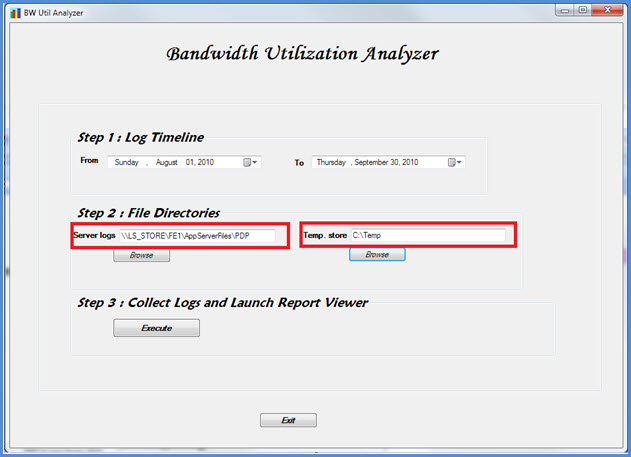
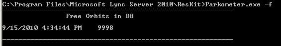

# <a name="skype-for-business-server-2015-resource-kit-tools-documentation"></a><span data-ttu-id="d6608-107">Documentação das ferramentas do kit de recursos do Skype for Business Server 2015</span><span class="sxs-lookup"><span data-stu-id="d6608-107">Skype for Business Server 2015 Resource Kit Tools Documentation</span></span>

<span data-ttu-id="d6608-108">Este tópico descreve as ferramentas no kit de recursos do Skype for Business Server 2015, incluindo a finalidade de cada ferramenta e exemplos de uso.</span><span class="sxs-lookup"><span data-stu-id="d6608-108">This topic describes the tools in the Skype for Business Server 2015 Resource Kit, including the purpose of each tool, and examples of its use.</span></span> <span data-ttu-id="d6608-109">O kit de recursos do Skype for Business Server 2015 ajuda a tornar as tarefas rotineiras mais fáceis para os administradores de ti que implantam e gerenciam o Skype for Business Server 2015.</span><span class="sxs-lookup"><span data-stu-id="d6608-109">The Skype for Business Server 2015 Resource Kit helps to make routine tasks easier for IT administrators who deploy and manage Skype for Business Server 2015.</span></span> <span data-ttu-id="d6608-110">Por exemplo, a ferramenta **Web conf data** pode ser usada para controlar facilmente os dados que são carregados pelos usuários durante uma reunião online.</span><span class="sxs-lookup"><span data-stu-id="d6608-110">For example, the **Web Conf Data** tool can be used to easily control data that is uploaded by users during an online meeting.</span></span> <span data-ttu-id="d6608-111">A ferramenta **SEFAUtil** pode ser usada para configurar o encaminhamento de chamadas de representante e a resposta para usuários.</span><span class="sxs-lookup"><span data-stu-id="d6608-111">The **SEFAUtil** tool can be used to set up delegate call forwarding and answering for users.</span></span> <span data-ttu-id="d6608-112">Incentivamos os administradores de ti a usar essas ferramentas para gerenciar o Skype for Business Server 2015 com mais eficiência.</span><span class="sxs-lookup"><span data-stu-id="d6608-112">We encourage IT administrators to use these tools to more effectively manage Skype for Business Server 2015.</span></span>

## <a name="installation-of-the-resource-kit-tools"></a><span data-ttu-id="d6608-113">Instalação das ferramentas do kit de recursos</span><span class="sxs-lookup"><span data-stu-id="d6608-113">Installation of the Resource Kit Tools</span></span>

<span data-ttu-id="d6608-114">Para instalar o kit de recursos do Skype for Business Server 2015, baixe o [OCSReskit. msi](https://www.microsoft.com/download/details.aspx?id=52631) do centro de download.</span><span class="sxs-lookup"><span data-stu-id="d6608-114">To install the Skype for Business Server 2015 Resource Kit, download [OCSReskit.msi](https://www.microsoft.com/download/details.aspx?id=52631) from the Download Center.</span></span>

<span data-ttu-id="d6608-115">Execute o **OCSResKit. msi** para fazer uma instalação simples.</span><span class="sxs-lookup"><span data-stu-id="d6608-115">Run **OCSResKit.msi** to do a simple installation.</span></span> <span data-ttu-id="d6608-116">O. msi instala todas as ferramentas no seguinte caminho: **% Program programas%\skype for Business Server 2015 \ reskit**.</span><span class="sxs-lookup"><span data-stu-id="d6608-116">The .msi installs all the tools in the following path: **%Program Files%\Skype for Business Server 2015\ResKit**.</span></span> <span data-ttu-id="d6608-117">As ferramentas que são executáveis independentes estão nessa pasta.</span><span class="sxs-lookup"><span data-stu-id="d6608-117">Tools that are self-contained executables are in this folder.</span></span> <span data-ttu-id="d6608-118">As ferramentas que também têm arquivos de suporte estão em suas próprias subpastas.</span><span class="sxs-lookup"><span data-stu-id="d6608-118">Tools that also have supporting files are in their own subfolders.</span></span>

## <a name="supported-environments"></a><span data-ttu-id="d6608-119">Ambientes com suporte</span><span class="sxs-lookup"><span data-stu-id="d6608-119">Supported Environments</span></span>

<span data-ttu-id="d6608-120">O kit de recursos do Skype for Business Server 2015 deve ser instalado em um servidor que atenda às especificações necessárias para o Skype for Business Server 2015, geralmente um usado para executar o Skype for Business Server 2015.</span><span class="sxs-lookup"><span data-stu-id="d6608-120">The Skype for Business Server 2015 Resource Kit should be installed on a server that meets the specifications required for Skype for Business Server 2015, usually one being used to run Skype for Business Server 2015.</span></span>

## <a name="resource-kit-tools-overview"></a><span data-ttu-id="d6608-121">Visão geral das ferramentas do kit de recursos</span><span class="sxs-lookup"><span data-stu-id="d6608-121">Resource Kit Tools Overview</span></span>

<span data-ttu-id="d6608-122">Veja a seguir uma lista das ferramentas fornecidas no kit de recursos do Skype for Business Server 2015.</span><span class="sxs-lookup"><span data-stu-id="d6608-122">The following is a list of the tools that are provided in the Skype for Business Server 2015 Resource Kit.</span></span> <span data-ttu-id="d6608-123">Uma descrição de cada ferramenta, incluindo os requisitos e o uso de exemplos, é abordada nas seções a seguir.</span><span class="sxs-lookup"><span data-stu-id="d6608-123">A description of each tool, including the requirements and example usage is covered in the following sections.</span></span>

- [<span data-ttu-id="d6608-124">ABSConfig</span><span class="sxs-lookup"><span data-stu-id="d6608-124">ABSConfig</span></span>](resource-kit-tools.md#ABSConfig)

- [<span data-ttu-id="d6608-125">Monitor de serviço de política de largura de banda</span><span class="sxs-lookup"><span data-stu-id="d6608-125">Bandwidth Policy Service Monitor</span></span>](resource-kit-tools.md#bpsm)

- [<span data-ttu-id="d6608-126">Analisador de utilização de largura de banda</span><span class="sxs-lookup"><span data-stu-id="d6608-126">Bandwidth Utilization Analyzer</span></span>](resource-kit-tools.md#bua)

- [<span data-ttu-id="d6608-127">Chamar estacionador chamadas</span><span class="sxs-lookup"><span data-stu-id="d6608-127">Call Parkometer</span></span>](resource-kit-tools.md#callpark)

- [<span data-ttu-id="d6608-128">DBAnalyze</span><span class="sxs-lookup"><span data-stu-id="d6608-128">DBAnalyze</span></span>](resource-kit-tools.md#dba)

- [<span data-ttu-id="d6608-129">Importar dados do serviço de armazenamento</span><span class="sxs-lookup"><span data-stu-id="d6608-129">Import Storage Service Data</span></span>](resource-kit-tools.md#Issd)

- [<span data-ttu-id="d6608-130">LCSSync</span><span class="sxs-lookup"><span data-stu-id="d6608-130">LCSSync</span></span>](resource-kit-tools.md#LCSSync)

- [<span data-ttu-id="d6608-131">Procurar console de usuário</span><span class="sxs-lookup"><span data-stu-id="d6608-131">Lookup User Console</span></span>](resource-kit-tools.md#LUC)

- [<span data-ttu-id="d6608-132">MsTurnPing</span><span class="sxs-lookup"><span data-stu-id="d6608-132">MsTurnPing</span></span>](resource-kit-tools.md#MsTurnPing)

- [<span data-ttu-id="d6608-133">Visualizador de configuração de rede</span><span class="sxs-lookup"><span data-stu-id="d6608-133">Network Configuration Viewer</span></span>](resource-kit-tools.md#NCV)

- [<span data-ttu-id="d6608-134">Agente de grupo de resposta Live</span><span class="sxs-lookup"><span data-stu-id="d6608-134">Response Group Agent Live</span></span>](resource-kit-tools.md#RGAL)

- [<span data-ttu-id="d6608-135">SEFAUtil</span><span class="sxs-lookup"><span data-stu-id="d6608-135">SEFAUtil</span></span>](resource-kit-tools.md#SEFAUtil)

- [<span data-ttu-id="d6608-136">SYSPrep. ps1</span><span class="sxs-lookup"><span data-stu-id="d6608-136">SYSPrep.ps1</span></span>](resource-kit-tools.md#SYSPrep)

- [<span data-ttu-id="d6608-137">Migração de comunicados de número não atribuído</span><span class="sxs-lookup"><span data-stu-id="d6608-137">Unassigned Number Announcements Migration</span></span>](resource-kit-tools.md#UNAM)

- [<span data-ttu-id="d6608-138">Dados de conferência da Web</span><span class="sxs-lookup"><span data-stu-id="d6608-138">Web Conf Data</span></span>](resource-kit-tools.md#WebConfData)

## <a name="absconfig"></a><span data-ttu-id="d6608-139">ABSConfig</span><span class="sxs-lookup"><span data-stu-id="d6608-139">ABSConfig</span></span>
<span data-ttu-id="d6608-140"><a name="ABSConfig"> </a></span><span class="sxs-lookup"><span data-stu-id="d6608-140"><a name="ABSConfig"> </a></span></span>

<span data-ttu-id="d6608-141">A ferramenta de configuração do serviço de catálogo de endereços (ABSConfig) é uma ferramenta administrativa que ajuda os administradores a personalizar a configuração do serviço de catálogo de endereços no Skype for Business Server 2015.</span><span class="sxs-lookup"><span data-stu-id="d6608-141">The Address Book Service Configuration tool (ABSConfig) is an administrative tool that helps administrators customize Address Book Service configuration in Skype for Business Server 2015.</span></span> <span data-ttu-id="d6608-142">Essa ferramenta também permite que os administradores do Skype for Business Server 2015 restaurem as configurações padrão do serviço de catálogo de endereços.</span><span class="sxs-lookup"><span data-stu-id="d6608-142">This tool also enables Skype for Business Server 2015 administrators to restore the default Address Book Service settings.</span></span>

### <a name="description"></a><span data-ttu-id="d6608-143">Descrição</span><span class="sxs-lookup"><span data-stu-id="d6608-143">Description</span></span>

<span data-ttu-id="d6608-144">O ABSConfig é um aplicativo de interface gráfica do usuário que permite que os administradores configurem atributos de serviços de domínio do Active Directory relacionados ao serviço de catálogo de endereços.</span><span class="sxs-lookup"><span data-stu-id="d6608-144">ABSConfig is a graphical user interface application that enables administrators to configure Active Directory Domain Services attributes that are related to Address Book Service.</span></span>

<span data-ttu-id="d6608-145">Os principais cenários da ferramenta são os seguintes:</span><span class="sxs-lookup"><span data-stu-id="d6608-145">The primary scenarios for the tool are the following:</span></span>

- <span data-ttu-id="d6608-146">Para permitir que os administradores mapeiem atributos nos serviços de domínio do Active Directory para os atributos do Skype for Business Server 2015.</span><span class="sxs-lookup"><span data-stu-id="d6608-146">To enable administrators to map attributes in Active Directory Domain Services to the attributes for Skype for Business Server 2015.</span></span>

- <span data-ttu-id="d6608-147">Para permitir que os administradores especifiquem o atributo de serviços de domínio Active Directory a ser incluído ou excluído nos arquivos de serviço do catálogo de endereços.</span><span class="sxs-lookup"><span data-stu-id="d6608-147">To enable administrators to specify the Active Directory Domain Services attribute to be included or excluded in the Address Book Service files.</span></span>

- <span data-ttu-id="d6608-148">Para permitir que os administradores restaurem as configurações padrão do serviço de catálogo de endereços.</span><span class="sxs-lookup"><span data-stu-id="d6608-148">To enable administrators to restore default Address Book Service settings.</span></span>

<span data-ttu-id="d6608-149">A ferramenta ABSConfig pode ser iniciada usando o arquivo ABSConfig. exe.</span><span class="sxs-lookup"><span data-stu-id="d6608-149">The ABSConfig tool can be started by using the ABSConfig.exe file.</span></span> <span data-ttu-id="d6608-150">A ferramenta é aberta para a guia **Configurar atributos** . Esta tabela tem opções para mapear atributos de serviços de domínio do Active Directory para os campos de atributo do Skype for Business Server 2015 e especificar quais usuários serão incluídos ou excluídos nos arquivos de serviço de catálogo de endereços com base em filtros de atributo específicos.</span><span class="sxs-lookup"><span data-stu-id="d6608-150">The tool opens to the **Configure Attributes** tab. This table has options to map Active Directory Domain Services attributes to the attribute fields for Skype for Business Server 2015 and to specify which users to include or exclude in Address Book Service files based on specific attribute filters.</span></span> <span data-ttu-id="d6608-151">Também tem opções para personalizar o valor do número de telefone a ser incluído no arquivo do catálogo de endereços.</span><span class="sxs-lookup"><span data-stu-id="d6608-151">It also has options to customize which value of the phone number to be included in the Address Book file.</span></span> <span data-ttu-id="d6608-152">A opção **Restaurar padrões** permite que os administradores restaurem os valores padrão das configurações do serviço de catálogo de endereços.</span><span class="sxs-lookup"><span data-stu-id="d6608-152">The **Restore Defaults** option enables administrators to restore Address Book Service settings to default values.</span></span>

> [!NOTE]
> <span data-ttu-id="d6608-153">O remapeamento dos atributos do AD para nomes de campo OC diferentes só funcionará para download de arquivo do catálogo de endereços e não terá suporte da consulta da Web do catálogo de endereços.</span><span class="sxs-lookup"><span data-stu-id="d6608-153">Re-mapping of AD attributes to different OC Field Names will only work for Address Book File Download, and is not supported by Address Book Web Query.</span></span>

### <a name="output"></a><span data-ttu-id="d6608-154">Saída</span><span class="sxs-lookup"><span data-stu-id="d6608-154">Output</span></span>

<span data-ttu-id="d6608-155">ABSConfig armazena a configuração do serviço de catálogo de endereços no banco de dados.</span><span class="sxs-lookup"><span data-stu-id="d6608-155">ABSConfig stores the Address Book Service configuration in the database.</span></span>

```console
Path: %ProgramFiles%\Skype for Business Server 2015\Reskit
```

### <a name="purpose"></a><span data-ttu-id="d6608-156">Finalidade</span><span class="sxs-lookup"><span data-stu-id="d6608-156">Purpose</span></span>

<span data-ttu-id="d6608-157">O ABSConfig fornece uma maneira rápida e fácil de personalizar o serviço de catálogo de endereços do Skype for Business Server 2015.</span><span class="sxs-lookup"><span data-stu-id="d6608-157">ABSConfig provides a quick and easy way to customize Skype for Business Server 2015 Address Book Service.</span></span>

### <a name="requirements"></a><span data-ttu-id="d6608-158">Requirements</span><span class="sxs-lookup"><span data-stu-id="d6608-158">Requirements</span></span>

#### <a name="computer"></a><span data-ttu-id="d6608-159">Computador</span><span class="sxs-lookup"><span data-stu-id="d6608-159">Computer</span></span>

<span data-ttu-id="d6608-160">O ABSConfig pode ser executado apenas de um computador associado a um domínio que tenha o Skype for Business Server 2015 instalado.</span><span class="sxs-lookup"><span data-stu-id="d6608-160">ABSConfig can be run only from a domain-joined computer that has Skype for Business Server 2015 installed.</span></span> <span data-ttu-id="d6608-161">No caso do Skype for Business Server 2015, Enterprise Edition, essa ferramenta pode ser executada em qualquer servidor front-end que tenha o serviço de catálogo de endereços habilitado durante a instalação.</span><span class="sxs-lookup"><span data-stu-id="d6608-161">In the case of Skype for Business Server 2015, Enterprise Edition, this tool can be run on any Front End servers that have the Address Book Service enabled during setup.</span></span>

#### <a name="network"></a><span data-ttu-id="d6608-162">Rede</span><span class="sxs-lookup"><span data-stu-id="d6608-162">Network</span></span>

<span data-ttu-id="d6608-163">O computador deve poder se conectar ao pool de front-ends e ao banco de dados back-end.</span><span class="sxs-lookup"><span data-stu-id="d6608-163">The computer should be able to connect to the Front End pool and back-end database.</span></span>

#### <a name="software"></a><span data-ttu-id="d6608-164">Software</span><span class="sxs-lookup"><span data-stu-id="d6608-164">Software</span></span>

<span data-ttu-id="d6608-165">Os seguintes componentes de software devem ser instalados antes de executar a ferramenta ABSConfig:</span><span class="sxs-lookup"><span data-stu-id="d6608-165">The following software components must be installed before running the ABSConfig tool:</span></span>

- <span data-ttu-id="d6608-166">Skype for Business Server 2015</span><span class="sxs-lookup"><span data-stu-id="d6608-166">Skype for Business Server 2015</span></span>

#### <a name="users"></a><span data-ttu-id="d6608-167">Usuários</span><span class="sxs-lookup"><span data-stu-id="d6608-167">Users</span></span>

<span data-ttu-id="d6608-168">Administradores que têm as permissões necessárias para atualizar a implantação do Skype for Business Server 2015.</span><span class="sxs-lookup"><span data-stu-id="d6608-168">Administrators who have the permissions required to update the Skype for Business Server 2015 deployment.</span></span>

### <a name="examples"></a><span data-ttu-id="d6608-169">Exemplos</span><span class="sxs-lookup"><span data-stu-id="d6608-169">Examples</span></span>

<span data-ttu-id="d6608-170">O ABSConfig pode ser iniciado digitando **ABSConfig. exe** em um prompt de comando.</span><span class="sxs-lookup"><span data-stu-id="d6608-170">ABSConfig can be started by typing **ABSConfig.exe** at a command prompt.</span></span> <span data-ttu-id="d6608-171">Mostrado abaixo é a interface do usuário da ferramenta ABSConfig.</span><span class="sxs-lookup"><span data-stu-id="d6608-171">Shown below is the ABSConfig tool user interface.</span></span>


### <a name="summary"></a><span data-ttu-id="d6608-173">Resumo</span><span class="sxs-lookup"><span data-stu-id="d6608-173">Summary</span></span>

<span data-ttu-id="d6608-174">A ferramenta ABSConfig fornece aos administradores uma ferramenta rápida e fácil de usar para personalizar o serviço de catálogo de endereços do Skype for Business Server 2015.</span><span class="sxs-lookup"><span data-stu-id="d6608-174">The ABSConfig tool provides administrators a quick and easy to use tool to customize Skype for Business Server 2015 Address Book Service.</span></span>

## <a name="bandwidth-policy-service-monitor"></a><span data-ttu-id="d6608-175">Monitor de serviço de política de largura de banda</span><span class="sxs-lookup"><span data-stu-id="d6608-175">Bandwidth Policy Service Monitor</span></span>
<span data-ttu-id="d6608-176"><a name="bpsm"> </a></span><span class="sxs-lookup"><span data-stu-id="d6608-176"><a name="bpsm"> </a></span></span>

<span data-ttu-id="d6608-177">A ferramenta Monitor de serviço de política de largura de banda destina-se a permitir que os administradores exibam uma lista dos seguintes:</span><span class="sxs-lookup"><span data-stu-id="d6608-177">The Bandwidth Policy Service Monitor tool is intended to allow administrators to view a list of the following:</span></span>

1. <span data-ttu-id="d6608-178">Todos os serviços de política de largura de banda do Skype for Business Server 2015 (autenticação e núcleo) configurados na topologia</span><span class="sxs-lookup"><span data-stu-id="d6608-178">All the configured Skype for Business Server 2015 Bandwidth Policy services (Authentication and Core) in the topology</span></span>

2. <span data-ttu-id="d6608-179">As conexões que cada serviço faz para outros serviços de política de largura de banda e para os servidores de borda</span><span class="sxs-lookup"><span data-stu-id="d6608-179">The connections that each service makes to other Bandwidth Policy services and to the Edge servers</span></span>

3. <span data-ttu-id="d6608-180">Todos os links que são configurados no documento de configuração de rede e uso de largura de banda em tempo real conforme relatado por cada um dos serviços de política de largura de banda</span><span class="sxs-lookup"><span data-stu-id="d6608-180">All the links that are configured in the Network configuration document and real-time bandwidth usage as reported by each of the Bandwidth Policy services</span></span>

### <a name="description"></a><span data-ttu-id="d6608-181">Descrição</span><span class="sxs-lookup"><span data-stu-id="d6608-181">Description</span></span>

<span data-ttu-id="d6608-182">A ferramenta Monitor de serviço de política de largura de banda é implementada como um aplicativo baseado em GUI.</span><span class="sxs-lookup"><span data-stu-id="d6608-182">The Bandwidth Policy Service Monitor tool is implemented as a GUI-based application.</span></span> <span data-ttu-id="d6608-183">Os administradores iniciam a ferramenta executando o PDPMonUI. exe.</span><span class="sxs-lookup"><span data-stu-id="d6608-183">Administrators start the tool by running PDPMonUI.exe.</span></span>

<span data-ttu-id="d6608-184">Quando a ferramenta é iniciada, tenta descobrir a lista de serviços de política de largura de banda na topologia.</span><span class="sxs-lookup"><span data-stu-id="d6608-184">When the tool starts, it attempts to discover the list of Bandwidth Policy services in the topology.</span></span> <span data-ttu-id="d6608-185">Depois que a atualização inicial for concluída, o painel à esquerda da janela será preenchido com uma lista de serviços que são agrupados pelos clusters aos quais pertencem.</span><span class="sxs-lookup"><span data-stu-id="d6608-185">After the initial update is done, the pane to the left of the window is populated with a list of services that are grouped by the clusters that they belong to.</span></span>

<span data-ttu-id="d6608-186">Quando os administradores selecionam um serviço de política de largura de banda específico, o painel à direita exibe as informações sobre esse serviço específico.</span><span class="sxs-lookup"><span data-stu-id="d6608-186">When administrators select a particular Bandwidth Policy Service, the pane on the right displays the information about that particular service.</span></span> <span data-ttu-id="d6608-187">Esse painel também tem duas guias principais que exibem informações.</span><span class="sxs-lookup"><span data-stu-id="d6608-187">That pane also has two main tabs that display information.</span></span>

#### <a name="machine-info-tab"></a><span data-ttu-id="d6608-188">Guia informações do computador</span><span class="sxs-lookup"><span data-stu-id="d6608-188">Machine Info Tab</span></span>

<span data-ttu-id="d6608-189">A guia **informações do computador** mostra os detalhes do serviço de política de largura de banda selecionado e a lista e o estado de todas as conexões feitas pelo serviço de política de largura de banda selecionado para outros serviços.</span><span class="sxs-lookup"><span data-stu-id="d6608-189">The **Machine Info** tab shows the details of the Bandwidth Policy Service that is selected and the list and state of all the connections that are made by the selected Bandwidth Policy Service to other services.</span></span>

#### <a name="topology-info-tab"></a><span data-ttu-id="d6608-190">Guia informações de topologia</span><span class="sxs-lookup"><span data-stu-id="d6608-190">Topology Info Tab</span></span>

<span data-ttu-id="d6608-191">A guia **informações da topologia** mostra uma lista de todos os links que são configurados nas definições de configuração da rede.</span><span class="sxs-lookup"><span data-stu-id="d6608-191">The **Topology Info** tab shows a list of all the links that are configured in the Network configuration settings.</span></span> <span data-ttu-id="d6608-192">Para cada link, a capacidade de largura de banda de áudio e vídeo é exibida.</span><span class="sxs-lookup"><span data-stu-id="d6608-192">For each link, the audio and video bandwidth capacity is displayed.</span></span> <span data-ttu-id="d6608-193">Além disso, a largura de banda atualmente utilizada é exibida, tanto em Kbps quanto como uma porcentagem da capacidade.</span><span class="sxs-lookup"><span data-stu-id="d6608-193">Additionally, the currently utilized bandwidth is displayed, both in Kbps and as a percentage of the capacity.</span></span> <span data-ttu-id="d6608-194">A ferramenta usa codificação de cores para realçar os links que têm utilização próxima à capacidade, permitindo que os administradores isolem rapidamente esses links.</span><span class="sxs-lookup"><span data-stu-id="d6608-194">The tool uses color-coding to highlight links that have utilization that is close to the capacity—this allows administrators to quickly isolate such links.</span></span>

> [!NOTE]
>  <span data-ttu-id="d6608-195">Se a ferramenta de monitoração do serviço de política de largura de banda apresentar falha ao se conectar a qualquer um dos serviços de política de largura de banda configurados, as informações nas guias informações sobre a **máquina** e **informações de topologia** não serão preenchidas.</span><span class="sxs-lookup"><span data-stu-id="d6608-195">If the Bandwidth Policy Service Monitor tool experiences failure when it connects to any of the configured Bandwidth Policy services, the information in the **Machine Info** and the **Topology Info** tabs won't be populated.</span></span> <span data-ttu-id="d6608-196">No entanto, é possível que a ferramenta possa se conectar inicialmente, mas, em seguida, perder a conexão com o serviço.</span><span class="sxs-lookup"><span data-stu-id="d6608-196">However, it is possible that the tool might connect initially but subsequently lose its connection to the service.</span></span> <span data-ttu-id="d6608-197">Nesses casos, os administradores podem ver informações desatualizadas.</span><span class="sxs-lookup"><span data-stu-id="d6608-197">In such cases, administrators might see outdated information.</span></span> <span data-ttu-id="d6608-198">Há um carimbo de data/hora **atualizado** em cada uma das guias que podem permitir que os administradores vejam quando os dados foram atualizados pela última vez para um serviço de política de largura de banda específico.</span><span class="sxs-lookup"><span data-stu-id="d6608-198">There is a **Last Updated** time stamp on each of the tabs that can allow administrators to see when the data was last updated for a particular Bandwidth Policy Service.</span></span>

### <a name="output"></a><span data-ttu-id="d6608-199">Saída</span><span class="sxs-lookup"><span data-stu-id="d6608-199">Output</span></span>

<span data-ttu-id="d6608-200">Não há nenhuma saída de linha de comando; a saída do programa está contida na GUI (interface gráfica do usuário) principal.</span><span class="sxs-lookup"><span data-stu-id="d6608-200">There is no command-line output; the program output is contained within the main graphical user interface (GUI).</span></span>

### <a name="purpose"></a><span data-ttu-id="d6608-201">Finalidade</span><span class="sxs-lookup"><span data-stu-id="d6608-201">Purpose</span></span>

<span data-ttu-id="d6608-202">O objetivo da ferramenta Monitor de serviço de política de largura de banda é permitir a visibilidade dos administradores no estado de cada um dos serviços de política de largura de banda definidos na topologia.</span><span class="sxs-lookup"><span data-stu-id="d6608-202">The purpose of the Bandwidth Policy Service Monitor tool is to allow administrators visibility into the state of each of the Bandwidth Policy services that are defined in the topology.</span></span> <span data-ttu-id="d6608-203">Além disso, os administradores podem ver o uso da largura de banda em tempo real para todos os links definidos no documento de configuração de rede.</span><span class="sxs-lookup"><span data-stu-id="d6608-203">In addition, administrators can see real-time bandwidth usage for all the links that are defined in the Network configuration document.</span></span>

### <a name="requirements"></a><span data-ttu-id="d6608-204">Requirements</span><span class="sxs-lookup"><span data-stu-id="d6608-204">Requirements</span></span>

<span data-ttu-id="d6608-205">A ferramenta Monitor de serviço de política de largura de banda precisa ser executada em um computador que faça parte da topologia do Skype for Business Server.</span><span class="sxs-lookup"><span data-stu-id="d6608-205">The Bandwidth Policy Service Monitor tool needs to be run on a computer that is part of the Skype for Business Server topology.</span></span>

### <a name="summary"></a><span data-ttu-id="d6608-206">Resumo</span><span class="sxs-lookup"><span data-stu-id="d6608-206">Summary</span></span>

<span data-ttu-id="d6608-207">A ferramenta de monitoração de serviço de política de largura de banda pode ser um recurso valioso para os administradores para que eles possam inspecionar o estado de todos os serviços de política de largura de banda na topologia, e o mais importante: eles podem obter a utilização de largura de banda em tempo real para os links que são definido nas definições de configuração de rede.</span><span class="sxs-lookup"><span data-stu-id="d6608-207">The Bandwidth Policy Service Monitor tool can be a valuable resource to administrators so they can inspect the state of all the Bandwidth Policy services in the topology—and more importantly—they can obtain real-time bandwidth utilization for the links that are defined in the Network configuration settings.</span></span>

## <a name="bandwidth-utilization-analyzer"></a><span data-ttu-id="d6608-208">Analisador de utilização de largura de banda</span><span class="sxs-lookup"><span data-stu-id="d6608-208">Bandwidth Utilization Analyzer</span></span>
<span data-ttu-id="d6608-209"><a name="bua"> </a></span><span class="sxs-lookup"><span data-stu-id="d6608-209"><a name="bua"> </a></span></span>

<span data-ttu-id="d6608-210">O analisador de utilização de largura de banda é uma ferramenta que cria relatórios sobre vários modos de exibição de consumo de largura de banda pelos pontos de extremidade UC nos links WAN na rede corporativa.</span><span class="sxs-lookup"><span data-stu-id="d6608-210">Bandwidth Utilization Analyzer is a tool that creates reports about various views of bandwidth consumption by the UC endpoints across WAN links in the enterprise network.</span></span> <span data-ttu-id="d6608-211">Esses relatórios podem ser usados para entender o padrão atual de consumo de largura de banda e para ajudar no planejamento da capacidade de largura de banda.</span><span class="sxs-lookup"><span data-stu-id="d6608-211">These reports can be used to understand the current bandwidth consumption pattern and to aid in bandwidth capacity planning.</span></span>

### <a name="description"></a><span data-ttu-id="d6608-212">Descrição</span><span class="sxs-lookup"><span data-stu-id="d6608-212">Description</span></span>

<span data-ttu-id="d6608-213">O analisador de utilização de largura de banda é implementado como um aplicativo baseado em GUI.</span><span class="sxs-lookup"><span data-stu-id="d6608-213">Bandwidth Utilization Analyzer is implemented as a GUI-based application.</span></span> <span data-ttu-id="d6608-214">Essa ferramenta gera relatórios específicos para a utilização de áudio na rede e ajuda no planejamento da capacidade.</span><span class="sxs-lookup"><span data-stu-id="d6608-214">This tool generates reports specifically for audio utilization across the network and helps with capacity planning.</span></span> <span data-ttu-id="d6608-215">Ele também itera na capacidade de largura de banda atribuída a vários links.</span><span class="sxs-lookup"><span data-stu-id="d6608-215">It also iterates on the bandwidth capacity that is assigned to various links.</span></span>

### <a name="output"></a><span data-ttu-id="d6608-216">Saída</span><span class="sxs-lookup"><span data-stu-id="d6608-216">Output</span></span>

<span data-ttu-id="d6608-217">O analisador de utilização de largura de banda oferece plotagens em formato gráfico Al de capacidade de largura de banda e utilização de áudio para todos os links WAN que são configurados no sistema.</span><span class="sxs-lookup"><span data-stu-id="d6608-217">Bandwidth Utilization Analyzer provides graphic al plots of bandwidth capacity and utilization for audio for all the WAN links that are configured in the system.</span></span>

### <a name="purpose"></a><span data-ttu-id="d6608-218">Finalidade</span><span class="sxs-lookup"><span data-stu-id="d6608-218">Purpose</span></span>

<span data-ttu-id="d6608-219">Em qualquer implantação de voz e vídeo, é fundamental monitorar e entender a tendência da utilização de largura de banda de tráfego de mídia na rede corporativa.</span><span class="sxs-lookup"><span data-stu-id="d6608-219">In any voice and video deployment, it's critical to monitor and understand the trend of bandwidth utilization of media traffic across the enterprise network.</span></span> <span data-ttu-id="d6608-220">A ferramenta Analisador de utilização da largura de banda permite que um administrador realize apenas isso.</span><span class="sxs-lookup"><span data-stu-id="d6608-220">The Bandwidth Utilization Analyzer tool allows an administrator to achieve just that.</span></span> <span data-ttu-id="d6608-221">Esta ferramenta faz o seguinte:</span><span class="sxs-lookup"><span data-stu-id="d6608-221">This tool does the following:</span></span>

- <span data-ttu-id="d6608-222">Gera relatórios específicos para a utilização de áudio na rede</span><span class="sxs-lookup"><span data-stu-id="d6608-222">Generates specific reports for audio utilization across the network</span></span>

- <span data-ttu-id="d6608-223">Ajuda no planejamento de capacidade mais eficaz e na iteração na capacidade de largura de banda atribuída a vários links</span><span class="sxs-lookup"><span data-stu-id="d6608-223">Helps with more effective capacity planning and iteration on the bandwidth capacity that is assigned to various links</span></span>

<span data-ttu-id="d6608-224">O analisador de utilização de largura de banda pode gerar gráficos de capacidade de largura de banda e relatórios de utilização; Eles são os seguintes:</span><span class="sxs-lookup"><span data-stu-id="d6608-224">Bandwidth Utilization Analyzer can generate graphical plots of bandwidth capacity and utilization reports; they are as follows:</span></span>

- <span data-ttu-id="d6608-225">Todos os links WAN na rede corporativa</span><span class="sxs-lookup"><span data-stu-id="d6608-225">All the WAN links in the enterprise network</span></span>

- <span data-ttu-id="d6608-226">Filtrado por links WAN selecionados que foram escolhidos</span><span class="sxs-lookup"><span data-stu-id="d6608-226">Filtered by selected WAN links that have been chosen</span></span>

- <span data-ttu-id="d6608-227">Filtrado por links WAN que excederam a capacidade de link</span><span class="sxs-lookup"><span data-stu-id="d6608-227">Filtered by WAN links that have exceeded link capacity</span></span>

- <span data-ttu-id="d6608-228">Filtrado por links WAN que estão subutilizando a largura de banda provisionada</span><span class="sxs-lookup"><span data-stu-id="d6608-228">Filtered by WAN links that have been under-utilizing the provisioned bandwidth</span></span>

- <span data-ttu-id="d6608-229">Filtrar por links WAN que atingiram níveis críticos (uma utilização de largura de banda maior que 90% da capacidade de largura de banda do link WAN)</span><span class="sxs-lookup"><span data-stu-id="d6608-229">Filter by WAN links that have been reaching critical levels (a bandwidth utilization that is greater than 90% of bandwidth capacity of the WAN link)</span></span>

- <span data-ttu-id="d6608-230">Filtrado por tipo de link WAN — links de site de rede, links entre regiões e links em um site</span><span class="sxs-lookup"><span data-stu-id="d6608-230">Filtered by WAN link type—network-site links, interregional links, and links within a site</span></span>

- <span data-ttu-id="d6608-231">Filtrado por região de rede</span><span class="sxs-lookup"><span data-stu-id="d6608-231">Filtered by network region</span></span>

#### <a name="applications"></a><span data-ttu-id="d6608-232">Aplicativos</span><span class="sxs-lookup"><span data-stu-id="d6608-232">Applications</span></span>

<span data-ttu-id="d6608-233">O analisador de utilização da largura de banda tem os dois aplicativos a seguir (ferramentas):</span><span class="sxs-lookup"><span data-stu-id="d6608-233">Bandwidth Utilization Analyzer has the following two applications (tools):</span></span>

- <span data-ttu-id="d6608-234">**WanLinkLogCollector. exe** esta ferramenta permite que o usuário insira as informações necessárias.</span><span class="sxs-lookup"><span data-stu-id="d6608-234">**WanLinkLogCollector.exe** This tool enables its user to input the required information.</span></span>

- <span data-ttu-id="d6608-235">**BandwidthUtilizationAnalyzer. xlsm** um relatório de software de planilha do Microsoft Excel é iniciado automaticamente pelo WanLinkLogCollector. exe.</span><span class="sxs-lookup"><span data-stu-id="d6608-235">**BandwidthUtilizationAnalyzer.xlsm** A Microsoft Excel spreadsheet software report is automatically launched by WanLinkLogCollector.exe.</span></span> <span data-ttu-id="d6608-236">Este aplicativo permite que o usuário Aplique filtros ao relatório, conforme mostrado posteriormente neste artigo.</span><span class="sxs-lookup"><span data-stu-id="d6608-236">This application allows the user to apply filters to the report as shown later in this article.</span></span>

#### <a name="phases-of-using-bandwidth-utilization-analyzer"></a><span data-ttu-id="d6608-237">Fases de uso do analisador de utilização de largura de banda</span><span class="sxs-lookup"><span data-stu-id="d6608-237">Phases of Using Bandwidth Utilization Analyzer</span></span>

<span data-ttu-id="d6608-238">Há duas fases ao usar o analisador de utilização da largura de banda:</span><span class="sxs-lookup"><span data-stu-id="d6608-238">There are two phases when using Bandwidth Utilization Analyzer:</span></span>

- <span data-ttu-id="d6608-239">Coletar logs, que é executado usando o WanLinkLogCollector. exe</span><span class="sxs-lookup"><span data-stu-id="d6608-239">Collect logs, which is performed by using WanLinkLogCollector.exe</span></span>

- <span data-ttu-id="d6608-240">Personalizar relatórios, que é executado usando BandwidthUtilizationAnalyzer. xlsm</span><span class="sxs-lookup"><span data-stu-id="d6608-240">Customize reports, which is performed by using BandwidthUtilizationAnalyzer.xlsm</span></span>

    > [!IMPORTANT]
    > <span data-ttu-id="d6608-241">É altamente recomendável que BandwidthUtilizationAnalyzer. xlsm não seja iniciado manualmente por usuários finais.</span><span class="sxs-lookup"><span data-stu-id="d6608-241">We strongly recommend that BandwidthUtilizationAnalyzer.xlsm not be manually launched by end users.</span></span>

#### <a name="starting-bandwidth-utilization-analyzer"></a><span data-ttu-id="d6608-242">Iniciando analisador de utilização da largura de banda</span><span class="sxs-lookup"><span data-stu-id="d6608-242">Starting Bandwidth Utilization Analyzer</span></span>

<span data-ttu-id="d6608-243">Inicie o WanLinkLogCollector. exe no prompt de comando ou usando o Windows Explorer.</span><span class="sxs-lookup"><span data-stu-id="d6608-243">Start WanLinkLogCollector.exe at the command prompt or by using Windows Explorer.</span></span>

 <span data-ttu-id="d6608-244">**Usando o WanLinkLogCollector. exe**</span><span class="sxs-lookup"><span data-stu-id="d6608-244">**Using WanLinkLogCollector.exe**</span></span>

<span data-ttu-id="d6608-245">Há três etapas para usar o WanLinkLogCollector. exe:</span><span class="sxs-lookup"><span data-stu-id="d6608-245">There are three steps to using WanLinkLogCollector.exe:</span></span>

1. <span data-ttu-id="d6608-246">**Registrar a linha do tempo** Forneça a linha do tempo para a qual o relatório precisa ser gerado</span><span class="sxs-lookup"><span data-stu-id="d6608-246">**Log the timeline** Provide the timeline that the report needs to be generated for</span></span>

2. <span data-ttu-id="d6608-247">**Especificar os diretórios de arquivos** Fornecer informações de local de arquivo</span><span class="sxs-lookup"><span data-stu-id="d6608-247">**Specify the file directories** Provide file location information</span></span>

3. <span data-ttu-id="d6608-248">**Coletar os logs e iniciar o Visualizador de relatórios** Executar o comando para gerar o relatório</span><span class="sxs-lookup"><span data-stu-id="d6608-248">**Collect the logs and launch the report viewer** Execute the command to generate the report</span></span>

#### <a name="step-1---log-the-timeline"></a><span data-ttu-id="d6608-249">Etapa 1-registrar a linha do tempo</span><span class="sxs-lookup"><span data-stu-id="d6608-249">Step 1 - Log the timeline</span></span>

<span data-ttu-id="d6608-250">O registro da linha do tempo permite que o usuário da ferramenta especifique o seguinte, conforme mostrado na figura abaixo.</span><span class="sxs-lookup"><span data-stu-id="d6608-250">Logging the timeline allows the tool user to specify the following as shown in the figure below.</span></span>

1. <span data-ttu-id="d6608-251">**Data de início** Esta é a data de início da linha do tempo para a qual o relatório deve ser gerado; por exemplo, 1º de agosto de 2010.</span><span class="sxs-lookup"><span data-stu-id="d6608-251">**Start date** This is the start date of the timeline that the report is to be generated for; for example, August 1, 2010.</span></span>

2. <span data-ttu-id="d6608-252">**Data de término** Esta é a data de término da linha do tempo para a qual o relatório deve ser gerado; por exemplo, 30 de setembro de 2010.</span><span class="sxs-lookup"><span data-stu-id="d6608-252">**End date** This is the end date of the timeline that the report is to be generated for; for example, September 30, 2010.</span></span>

     

#### <a name="step-2---specify-the-file-directories"></a><span data-ttu-id="d6608-254">Etapa 2-especificar os diretórios de arquivo</span><span class="sxs-lookup"><span data-stu-id="d6608-254">Step 2 - Specify the file directories</span></span>

<span data-ttu-id="d6608-255">Os seguintes diretórios de arquivos podem ser especificados pelo usuário, conforme mostrado.</span><span class="sxs-lookup"><span data-stu-id="d6608-255">The following file directories can be specified by the user as shown.</span></span>

- <span data-ttu-id="d6608-256">**Local dos arquivos de log do servidor** O local da pasta onde os logs do servidor de política de largura de banda estão armazenados.</span><span class="sxs-lookup"><span data-stu-id="d6608-256">**Server log files location** The folder location where Bandwidth policy server logs are stored.</span></span> <span data-ttu-id="d6608-257">Normalmente, isso ocorre \<\> \\<em \AppServerFiles\PDP. de opções\>de Fe</span><span class="sxs-lookup"><span data-stu-id="d6608-257">This is typically in \<fileserver\>\\<choice of FE\>\AppServerFiles\PDP.</span></span>

- <span data-ttu-id="d6608-258">**Local de armazenamento de arquivos temporários** O local do arquivo temporário onde os arquivos intermediários são armazenados enquanto o relatório está sendo gerado.</span><span class="sxs-lookup"><span data-stu-id="d6608-258">**Temporary file storage location** The temporary file location where intermediate files are stored while the report is being generated.</span></span>

    

    > [!NOTE]
    > <span data-ttu-id="d6608-260">Certifique-se de que o acesso de arquivo suficiente aos logs de servidor e à pasta de repositório de arquivos temporários seja fornecido para o usuário da ferramenta.</span><span class="sxs-lookup"><span data-stu-id="d6608-260">Ensure that sufficient file access to the server logs and the temporary file store folder is provided to the tool user.</span></span>

#### <a name="step-3---collect-the-logs-and-start-the-report-viewer"></a><span data-ttu-id="d6608-261">Etapa 3: coletar os logs e iniciar o Visualizador de relatórios</span><span class="sxs-lookup"><span data-stu-id="d6608-261">Step 3 - Collect the logs and start the report viewer</span></span>

<span data-ttu-id="d6608-262">Para coletar os logs e iniciar o Visualizador de relatórios, clique em **executar** , conforme mostrado abaixo.</span><span class="sxs-lookup"><span data-stu-id="d6608-262">To collect the logs and start the report viewer, click **Execute** as shown below.</span></span> <span data-ttu-id="d6608-263">Esta etapa coleta os dados necessários.</span><span class="sxs-lookup"><span data-stu-id="d6608-263">This step collects the required data.</span></span>


<span data-ttu-id="d6608-265">Quando a validação de entrada for bem-sucedida, a mensagem mostrada abaixo será exibida.</span><span class="sxs-lookup"><span data-stu-id="d6608-265">When the input validation is successful, the message shown below is displayed.</span></span>


<span data-ttu-id="d6608-267">Clique em **OK**.</span><span class="sxs-lookup"><span data-stu-id="d6608-267">Click **OK**.</span></span> <span data-ttu-id="d6608-268">BandwidthUtilizationAnalyzer. xlsm é iniciado automaticamente.</span><span class="sxs-lookup"><span data-stu-id="d6608-268">BandwidthUtilizationAnalyzer.xlsm is automatically started.</span></span> <span data-ttu-id="d6608-269">Siga as instruções na caixa de mensagem.</span><span class="sxs-lookup"><span data-stu-id="d6608-269">Follow the instructions in the message box.</span></span> <span data-ttu-id="d6608-270">Para obter detalhes, consulte **usando o BandwidthUtilizationAnalyzer. xlsm** na próxima seção.</span><span class="sxs-lookup"><span data-stu-id="d6608-270">For details, see **Using BandwidthUtilizationAnalyzer.xlsm** in the next section.</span></span>


### <a name="using-bandwidthutilizationanalyzerxlsm"></a><span data-ttu-id="d6608-271">Usando BandwidthUtilizationAnalyzer. xlsm</span><span class="sxs-lookup"><span data-stu-id="d6608-271">Using BandwidthUtilizationAnalyzer.xlsm</span></span>

1. <span data-ttu-id="d6608-272">Quando o BandwidthUtilizationAnalyzer. xlsm é iniciado automaticamente, clique em **Atualizar** , conforme mostrado abaixo.</span><span class="sxs-lookup"><span data-stu-id="d6608-272">When BandwidthUtilizationAnalyzer.xlsm is automatically started, click **Refresh** as shown below.</span></span>

     

2. <span data-ttu-id="d6608-274">Quando uma pasta de arquivos for aberta, selecione consolidado. csv do local especificado na caixa de mensagem, conforme mostrado abaixo.</span><span class="sxs-lookup"><span data-stu-id="d6608-274">When a file folder is opened, select consolidated.csv from the location that is specified in the message box as shown below.</span></span> <span data-ttu-id="d6608-275">Ele também mostra o local como **C:\temp**.</span><span class="sxs-lookup"><span data-stu-id="d6608-275">It also shows the location as **C:\Temp**.</span></span>

     

3. <span data-ttu-id="d6608-277">Clique em \*\*Importar \*\*.</span><span class="sxs-lookup"><span data-stu-id="d6608-277">Click **Import**.</span></span>

4. <span data-ttu-id="d6608-278">A plotagem gráfica é gerada automaticamente.</span><span class="sxs-lookup"><span data-stu-id="d6608-278">The graphical plot is automatically generated.</span></span> <span data-ttu-id="d6608-279">Ela estará disponível quando o ponteiro de trabalho em segundo plano desaparecer.</span><span class="sxs-lookup"><span data-stu-id="d6608-279">It is available when the working-in-the-background pointer disappears.</span></span>

     

#### <a name="applying-filters-to-the-report-view"></a><span data-ttu-id="d6608-281">Aplicando filtros ao modo de exibição de relatório</span><span class="sxs-lookup"><span data-stu-id="d6608-281">Applying Filters to the Report View</span></span>

<span data-ttu-id="d6608-282">Os filtros que podem ser aplicados ao modo de exibição de relatório, conforme mostrado abaixo, são descritos a seguir:</span><span class="sxs-lookup"><span data-stu-id="d6608-282">The filters that can be applied to the report view as shown below are described as follows:</span></span>


1. <span data-ttu-id="d6608-284">**Nome** Filtrar por links WAN (o filtro está no lado direito do gráfico). O prefixo indica os seguintes tipos de link; Confira a caixa vertical (azul):</span><span class="sxs-lookup"><span data-stu-id="d6608-284">**Name** Filter by WAN links (the filter is on the right side of the graph).The prefix denotes the following link types; see the vertical (blue) box:</span></span>

   - <span data-ttu-id="d6608-285">**S site** O link WAN de um site de rede para uma região de rede</span><span class="sxs-lookup"><span data-stu-id="d6608-285">**S Site** The WAN link from a network site to a network region</span></span>

   - <span data-ttu-id="d6608-286">**É entre sites** O link WAN entre dois sites de rede</span><span class="sxs-lookup"><span data-stu-id="d6608-286">**IS Inter-Site** The WAN link between two network sites</span></span>

   - <span data-ttu-id="d6608-287">**R inter-Region** O link WAN entre duas regiões de rede</span><span class="sxs-lookup"><span data-stu-id="d6608-287">**R Inter-Region** The WAN link between two network region</span></span>

2. <span data-ttu-id="d6608-288">**Limite excedido** Filtrar por links WAN cuja utilização de largura de banda é maior do que a capacidade de largura de banda</span><span class="sxs-lookup"><span data-stu-id="d6608-288">**Exceeded limit** Filter by WAN links whose bandwidth utilization is more than the bandwidth capacity</span></span>

3. <span data-ttu-id="d6608-289">**Níveis críticos** Filtrar por links WAN cuja utilização da largura de banda alcançou 90% ou mais da capacidade da largura de banda</span><span class="sxs-lookup"><span data-stu-id="d6608-289">**Critical levels** Filter by WAN links whose bandwidth utilization has reached 90% or more than the bandwidth capacity</span></span>

4. <span data-ttu-id="d6608-290">**Subutilizado** Filtrar por links WAN cuja utilização da largura de banda tenha sido inferior a 25% da capacidade da largura de banda</span><span class="sxs-lookup"><span data-stu-id="d6608-290">**Under-utilized** Filter by WAN links whose bandwidth utilization has been less than 25% of the bandwidth capacity</span></span>

5. <span data-ttu-id="d6608-291">**Tipo de link** Filtrar pelos seguintes tipos de links de WAN:</span><span class="sxs-lookup"><span data-stu-id="d6608-291">**Link type** Filter by the following WAN links types:</span></span>

   - <span data-ttu-id="d6608-292">Tipo de **site de rede**</span><span class="sxs-lookup"><span data-stu-id="d6608-292">**Network site** type</span></span>

   - <span data-ttu-id="d6608-293">Tipo **entre sites**</span><span class="sxs-lookup"><span data-stu-id="d6608-293">**Inter-site** type</span></span>

   - <span data-ttu-id="d6608-294">Tipo **de link entre regiões**</span><span class="sxs-lookup"><span data-stu-id="d6608-294">**Inter-Region link** type</span></span>

6. <span data-ttu-id="d6608-295">**Região** Filtrar por região de rede</span><span class="sxs-lookup"><span data-stu-id="d6608-295">**Region** Filter by network region</span></span>

<span data-ttu-id="d6608-296">As figuras a seguir mostram os filtros descritos anteriormente.</span><span class="sxs-lookup"><span data-stu-id="d6608-296">The following figures show the previously described filters.</span></span>

<span data-ttu-id="d6608-297">Filtrar por **nome**.</span><span class="sxs-lookup"><span data-stu-id="d6608-297">Filter by **Name**.</span></span> <span data-ttu-id="d6608-298">Selecione a lista de links que precisam ser exibidos no gráfico.</span><span class="sxs-lookup"><span data-stu-id="d6608-298">Select the list of links that need to be displayed in the graph.</span></span>


<span data-ttu-id="d6608-300">Filtrar por **limite excedido**.</span><span class="sxs-lookup"><span data-stu-id="d6608-300">Filter by **Exceeded limit**.</span></span> <span data-ttu-id="d6608-301">Selecione **verdadeiro** para impor o filtro.</span><span class="sxs-lookup"><span data-stu-id="d6608-301">Select **True** to enforce the filter.</span></span>


<span data-ttu-id="d6608-303">Filtrar por **níveis críticos**.</span><span class="sxs-lookup"><span data-stu-id="d6608-303">Filter by **Critical levels**.</span></span> <span data-ttu-id="d6608-304">Selecione **verdadeiro** para impor o filtro.</span><span class="sxs-lookup"><span data-stu-id="d6608-304">Select **True** to enforce the filter.</span></span>


<span data-ttu-id="d6608-306">Filtrar por **subutilizado**.</span><span class="sxs-lookup"><span data-stu-id="d6608-306">Filter by **Under utilized**.</span></span> <span data-ttu-id="d6608-307">Selecione **verdadeiro** para impor o filtro.</span><span class="sxs-lookup"><span data-stu-id="d6608-307">Select **True** to enforce the filter.</span></span>


<span data-ttu-id="d6608-309">Filtrar por **tipo de link**.</span><span class="sxs-lookup"><span data-stu-id="d6608-309">Filter by **Link Type**.</span></span> <span data-ttu-id="d6608-310">Selecione o tipo ou tipos que precisam ser exibidos.</span><span class="sxs-lookup"><span data-stu-id="d6608-310">Select the type or types that need to be displayed.</span></span>


<span data-ttu-id="d6608-312">Filtrar por **região**.</span><span class="sxs-lookup"><span data-stu-id="d6608-312">Filter by **Region**.</span></span> <span data-ttu-id="d6608-313">Selecione uma lista de regiões cujos vínculos precisam ser exibidos.</span><span class="sxs-lookup"><span data-stu-id="d6608-313">Select a list of regions whose links need to be displayed.</span></span>


### <a name="requirements"></a><span data-ttu-id="d6608-315">Requirements</span><span class="sxs-lookup"><span data-stu-id="d6608-315">Requirements</span></span>

- <span data-ttu-id="d6608-316">O .NET Framework 3,5</span><span class="sxs-lookup"><span data-stu-id="d6608-316">The .NET Framework 3.5</span></span>

- <span data-ttu-id="d6608-317">Microsoft Excel 2010 ou Excel 2007</span><span class="sxs-lookup"><span data-stu-id="d6608-317">Microsoft Excel 2010 or Excel 2007</span></span>

### <a name="summary"></a><span data-ttu-id="d6608-318">Resumo</span><span class="sxs-lookup"><span data-stu-id="d6608-318">Summary</span></span>

<span data-ttu-id="d6608-319">O analisador de utilização de largura de banda é usado para plotar a utilização de largura de banda de áudio para tráfego UC na rede.</span><span class="sxs-lookup"><span data-stu-id="d6608-319">Bandwidth Utilization Analyzer is used to plot the audio bandwidth utilization for UC traffic across the network.</span></span> <span data-ttu-id="d6608-320">Essa ferramenta também pode ser usada para relatar a utilização da largura de banda de vídeo na rede.</span><span class="sxs-lookup"><span data-stu-id="d6608-320">This tool can be used to report the utilization of video bandwidth on the network as well.</span></span>

## <a name="call-parkometer"></a><span data-ttu-id="d6608-321">Chamar estacionador chamadas</span><span class="sxs-lookup"><span data-stu-id="d6608-321">Call Parkometer</span></span>
<span data-ttu-id="d6608-322"><a name="callpark"> </a></span><span class="sxs-lookup"><span data-stu-id="d6608-322"><a name="callpark"> </a></span></span>

<span data-ttu-id="d6608-323">Call estacionador chamadas é um aplicativo de linha de comando que fornece fácil acesso ao banco de dados de órbita de estacionamento de chamada.</span><span class="sxs-lookup"><span data-stu-id="d6608-323">Call Parkometer is a command-line application that provides easy access to the Call Park orbit database.</span></span>

### <a name="description"></a><span data-ttu-id="d6608-324">Descrição</span><span class="sxs-lookup"><span data-stu-id="d6608-324">Description</span></span>

<span data-ttu-id="d6608-325">O estacionador chamadas de chamada é uma ferramenta para rastrear chamadas estacionadas no momento.</span><span class="sxs-lookup"><span data-stu-id="d6608-325">Call Parkometer is a tool to track currently parked calls.</span></span> <span data-ttu-id="d6608-326">Ele também coleta estatísticas sobre órbitas e uso do servidor de estacionamento de chamada (CPS).</span><span class="sxs-lookup"><span data-stu-id="d6608-326">It also collects statistics about orbits and Call Park Server (CPS) usage.</span></span> <span data-ttu-id="d6608-327">Essa ferramenta de linha de comando fornece acesso de leitura e gravação ao banco de dados do SQL Server do CPS órbita de um computador local ou conectado remotamente.</span><span class="sxs-lookup"><span data-stu-id="d6608-327">This command-line tool provides both read and write-access to the CPS orbit SQL Server database from a local or remotely connected computer.</span></span>

<span data-ttu-id="d6608-328">Todas as opções são mutuamente exclusivas.</span><span class="sxs-lookup"><span data-stu-id="d6608-328">All options are mutually exclusive.</span></span> <span data-ttu-id="d6608-329">A sintaxe da linha de comando é a seguinte:</span><span class="sxs-lookup"><span data-stu-id="d6608-329">Command-line syntax is as follows:</span></span>

- <span data-ttu-id="d6608-330">**-o** Parameter — lista todos os intervalos de órbita configurados para este pool.</span><span class="sxs-lookup"><span data-stu-id="d6608-330">**-o** parameter—lists all orbit ranges configured for this pool.</span></span>

- <span data-ttu-id="d6608-331">**-n** parâmetro — lista todas as órbitas usadas atualmente neste pool.</span><span class="sxs-lookup"><span data-stu-id="d6608-331">**-n** parameter—lists all currently used orbits in this pool.</span></span> <span data-ttu-id="d6608-332">As informações exibidas são as seguintes:</span><span class="sxs-lookup"><span data-stu-id="d6608-332">The information displayed is as follows:</span></span>

  - <span data-ttu-id="d6608-333">Identificador de recurso uniforme (URI) SIP do estacionamento e do estacionador.</span><span class="sxs-lookup"><span data-stu-id="d6608-333">SIP Uniform Resource Identifier (URI) of the parkee and parker.</span></span>

  - <span data-ttu-id="d6608-334">Nome do host do CPS onde a chamada está estacionada.</span><span class="sxs-lookup"><span data-stu-id="d6608-334">Host name of the CPS where the call is parked.</span></span>

  - <span data-ttu-id="d6608-335">Carimbo de data/hora de quando a chamada foi estacionada.</span><span class="sxs-lookup"><span data-stu-id="d6608-335">Time stamp of when the call was parked.</span></span>

- <span data-ttu-id="d6608-336">**-f** parâmetro — lista o número de órbitas livres no momento no pool.</span><span class="sxs-lookup"><span data-stu-id="d6608-336">**-f** parameter—lists the number of currently free orbits in the pool.</span></span>

- <span data-ttu-id="d6608-337">\*\*-r \<n\> \*\* parâmetro — lista as \<n\> últimas chamadas estacionadas.</span><span class="sxs-lookup"><span data-stu-id="d6608-337">**-r \<n\>** parameter—lists the \<n\> last parked calls.</span></span> <span data-ttu-id="d6608-338">As informações exibidas são as seguintes:</span><span class="sxs-lookup"><span data-stu-id="d6608-338">The information displayed is as follows:</span></span>

  - <span data-ttu-id="d6608-339">URI do SIP do estacionamento.</span><span class="sxs-lookup"><span data-stu-id="d6608-339">Parkee SIP URI.</span></span>

  - <span data-ttu-id="d6608-340">Estacionador URI do SIP.</span><span class="sxs-lookup"><span data-stu-id="d6608-340">Parker SIP URI.</span></span>

  - <span data-ttu-id="d6608-341">Nome do host do CPS onde a chamada foi estacionada.</span><span class="sxs-lookup"><span data-stu-id="d6608-341">Host name of the CPS where the call was parked.</span></span>

  - <span data-ttu-id="d6608-342">Carimbo de data/hora de quando a chamada foi recuperada ou cancelada.</span><span class="sxs-lookup"><span data-stu-id="d6608-342">Time stamp of when the call was retrieved or dropped.</span></span>

- <span data-ttu-id="d6608-343">\*\*-t\<n\> \*\* parâmetro-tests que reservem uma órbita no banco de dados para mostrar a aleatoriedade dos números de órbita atribuídos.</span><span class="sxs-lookup"><span data-stu-id="d6608-343">**-t\<n\>** parameter - tests reserving an orbit in the database to show the randomness of the assigned orbit numbers.</span></span>

### <a name="output"></a><span data-ttu-id="d6608-344">Saída</span><span class="sxs-lookup"><span data-stu-id="d6608-344">Output</span></span>

<span data-ttu-id="d6608-345">Dependendo dos parâmetros de entrada que são especificados em um prompt de comando, Call estacionador chamadas exibe o seguinte resultado:</span><span class="sxs-lookup"><span data-stu-id="d6608-345">Depending on the input parameters that are specified at a command prompt, Call Parkometer displays the following output:</span></span>

- <span data-ttu-id="d6608-346">Todos os intervalos de órbita configurados para este pool</span><span class="sxs-lookup"><span data-stu-id="d6608-346">All orbit ranges that are configured for this pool</span></span>

- <span data-ttu-id="d6608-347">Chamadas estacionadas atualmente</span><span class="sxs-lookup"><span data-stu-id="d6608-347">Currently parked calls</span></span>

- <span data-ttu-id="d6608-348">Número de órbitas livres (disponíveis)</span><span class="sxs-lookup"><span data-stu-id="d6608-348">Number of free (available) orbits</span></span>

- <span data-ttu-id="d6608-349">Chamadas estacionadas recentemente</span><span class="sxs-lookup"><span data-stu-id="d6608-349">Recently parked calls</span></span>

- <span data-ttu-id="d6608-350">Órbitas reservados para testar valores de órbita uniformes e aleatórios</span><span class="sxs-lookup"><span data-stu-id="d6608-350">Reserved orbits for testing uniform and random orbit values</span></span>

### <a name="purpose"></a><span data-ttu-id="d6608-351">Finalidade</span><span class="sxs-lookup"><span data-stu-id="d6608-351">Purpose</span></span>

<span data-ttu-id="d6608-352">O objetivo da ferramenta CPS é fornecer acesso de linha de comando para o banco de dados CPS.</span><span class="sxs-lookup"><span data-stu-id="d6608-352">The purpose of the CPS tool is to provide command-line access to the CPS database.</span></span> <span data-ttu-id="d6608-353">O administrador pode exibir o uso do CPS e determinar o número de órbitas atribuídas a um pool.</span><span class="sxs-lookup"><span data-stu-id="d6608-353">The administrator can view the CPS usage and determine the number of orbits assigned to a pool.</span></span>

### <a name="requirements"></a><span data-ttu-id="d6608-354">Requirements</span><span class="sxs-lookup"><span data-stu-id="d6608-354">Requirements</span></span>

<span data-ttu-id="d6608-355">Não há requisitos se essa ferramenta for executada no mesmo computador que está executando o CPS.</span><span class="sxs-lookup"><span data-stu-id="d6608-355">There are no requirements if this tool is run on the same computer that is running CPS.</span></span> <span data-ttu-id="d6608-356">Se essa ferramenta for executada em um computador remoto, o banco de dados do SQL Server usado pelo Skype for Business Server 2015 deve ser configurado para permitir o acesso remoto.</span><span class="sxs-lookup"><span data-stu-id="d6608-356">If this tool is run on a remote computer, the SQL Server database used by Skype for Business Server 2015 must be configured to allow remote access.</span></span> <span data-ttu-id="d6608-357">O estacionador chamadas de chamada deve ser configurado com uma cadeia de conexão de banco de dados do SQL Server para se conectar ao SQL Server do pool.</span><span class="sxs-lookup"><span data-stu-id="d6608-357">Call Parkometer must be configured with a SQL Server database connection string to connect to the pool's SQL Server.</span></span> <span data-ttu-id="d6608-358">Esta sequência de conexão de banco de dados do SQL Server está definida no arquivo de configuração, **estacionador chamadas. exe. config**. Ele deve ser colocado no mesmo diretório em que o estacionador chamadas. exe está localizado.</span><span class="sxs-lookup"><span data-stu-id="d6608-358">This SQL Server database connection string is defined in the configuration file, **parkometer.exe.config**. It must be placed in the same directory where parkometer.exe is located.</span></span> <span data-ttu-id="d6608-359">O arquivo XML a seguir é um exemplo de estacionador chamadas. exe. config. Os parâmetros que devem ser configurados são o nome de usuário (por exemplo, mydomain\Administrator), a senha (por exemplo, mypassword) e o nome do host (por exemplo, meuservidor).</span><span class="sxs-lookup"><span data-stu-id="d6608-359">The following XML file is an example of a parkometer.exe.config. The parameters that must be configured are user name (for example, mydomain\Administrator), password (for example, mypassword), and host name (for example, myserver).</span></span>

```xml
<?xml version="1.0" encoding="utf-8" ?>
<configuration>
  <appSettings>
   <add key="SQL" value="server=myserver\RTC;
database=cpsdyn;
User Id=mydomain\Administrator;
Password=mypassword.;
Integrated Security=false;"/>
  </appSettings>
</configuration>
```

### <a name="examples"></a><span data-ttu-id="d6608-360">Exemplos</span><span class="sxs-lookup"><span data-stu-id="d6608-360">Examples</span></span>

<span data-ttu-id="d6608-361">Intervalos de órbita implantados: o parâmetro-o lista todos os intervalos de órbita configurados para este pool, conforme mostrado</span><span class="sxs-lookup"><span data-stu-id="d6608-361">Deployed orbit ranges: the -o parameter lists all orbit ranges that are configured for this pool as shown</span></span>


<span data-ttu-id="d6608-363">Chamadas estacionadas atualmente: o parâmetro-n lista todas as órbitas usadas atualmente neste pool, conforme mostrado</span><span class="sxs-lookup"><span data-stu-id="d6608-363">Currently parked calls: the -n parameter lists all currently used orbits on this pool as shown</span></span>


<span data-ttu-id="d6608-365">Número de órbitas livres: o parâmetro-f lista o número de órbitas livres no momento no pool, conforme mostrado</span><span class="sxs-lookup"><span data-stu-id="d6608-365">Number of free orbits: the -f parameter lists the number of currently free orbits in the pool as shown</span></span>



<span data-ttu-id="d6608-367">Chamadas estacionadas recentemente: o parâmetro \<-\> r n lista \<as\> n últimas chamadas estacionadas, conforme mostrado</span><span class="sxs-lookup"><span data-stu-id="d6608-367">Recently parked calls: the -r \<n\> parameter lists the \<n\> last parked calls as shown</span></span>


<span data-ttu-id="d6608-369">Testar reserva de órbita: os testes \<de\> parâmetro-t n reservam uma órbita no banco de dados, conforme mostrado</span><span class="sxs-lookup"><span data-stu-id="d6608-369">Test orbit reservation: the -t \<n\> parameter tests reserving an orbit in the database as shown</span></span>


### <a name="summary"></a><span data-ttu-id="d6608-371">Resumo</span><span class="sxs-lookup"><span data-stu-id="d6608-371">Summary</span></span>

<span data-ttu-id="d6608-372">Call estacionador chamadas é uma ferramenta de linha de comando que fornece informações detalhadas sobre o servidor de estacionamento de chamada.</span><span class="sxs-lookup"><span data-stu-id="d6608-372">Call Parkometer is a command-line tool that provides detailed information about the Call Park Server.</span></span>

## <a name="dbanalyze"></a><span data-ttu-id="d6608-373">DBAnalyze</span><span class="sxs-lookup"><span data-stu-id="d6608-373">DBAnalyze</span></span>
<span data-ttu-id="d6608-374"><a name="dba"> </a></span><span class="sxs-lookup"><span data-stu-id="d6608-374"><a name="dba"> </a></span></span>

### <a name="description"></a><span data-ttu-id="d6608-375">Descrição</span><span class="sxs-lookup"><span data-stu-id="d6608-375">Description</span></span>

<span data-ttu-id="d6608-376">DBAnalyze é uma ferramenta de linha de comando que ajuda os administradores a coletar relatórios de análise sobre os bancos de dados do Skype for Business Server 2015.</span><span class="sxs-lookup"><span data-stu-id="d6608-376">DBAnalyze is a command-line tool that helps administrators to gather analysis reports about the Skype for Business Server 2015 databases.</span></span> <span data-ttu-id="d6608-377">O DBAnalyze tem os seguintes modos: diagnóstico, dados do usuário, conferência, MCUs e fragmentação de disco:</span><span class="sxs-lookup"><span data-stu-id="d6608-377">DBAnalyze has the following modes: diagnostic, user data, conference, MCUs, and disk fragmentation:</span></span>

- <span data-ttu-id="d6608-378">**Modo de diagnóstico** Cria um relatório que inclui informações sobre as tabelas (número de registros, fragmentação, tamanho dos dados e tamanho do índice) arquivos de dados e de log, o último tempo de backup, distribuição de contatos entre servidores que estão executando o Microsoft Office Communications Server, o número médio de permissões, contatos, contêineres, assinaturas, publicações, pontos de extremidade por usuário, todos os usuários hospedados incorretamente, usuários que não podem ser roteados, o número médio de conferências organizadas por usuário, conferências programadas e a versão do banco de dados.</span><span class="sxs-lookup"><span data-stu-id="d6608-378">**Diagnostic mode** Creates a report that includes information about tables (number of records, fragmentation, data size, and index size), data and log file sizes, the last back-up time, contact distribution among servers that are running Microsoft Office Communications Server, the average number of permissions, contacts, containers, subscriptions, publications, endpoints per user, any improperly homed users, users that can't be routed, the average number of conferences organized per user, scheduled conferences, active conferences, and the database version.</span></span>

    > [!NOTE]
    > <span data-ttu-id="d6608-379">Executar o modo de diagnóstico pode afetar o desempenho do servidor.</span><span class="sxs-lookup"><span data-stu-id="d6608-379">Running diagnostic mode can affect server performance.</span></span>

- <span data-ttu-id="d6608-380">**Modo de dados do usuário** Relata os dados de contato, contêiner, assinatura, publicação, permissão e grupo de contato para um usuário especificado ou para usuários que tenham esse usuário em suas listas de permissões e contatos.</span><span class="sxs-lookup"><span data-stu-id="d6608-380">**User data mode** Reports contact, container, subscription, publication, permission, and contact-group data for a specified user or for users who have that user in their contact and permission lists.</span></span> <span data-ttu-id="d6608-381">Este modo também relata dados de resumo para conferências que um usuário organiza ou é convidado.</span><span class="sxs-lookup"><span data-stu-id="d6608-381">This mode also reports summary data for conferences that a user organizes or is invited to.</span></span>

- <span data-ttu-id="d6608-382">**Modo de conferência** Relata dados detalhados para uma conferência específica, incluindo todos os detalhes de tempo de agenda da conferência, a lista de convidados, a lista de tipos de mídia permitidos para a conferência, active MCUs (unidades de controle multiponto), a lista de participantes ativa e o estado de sinalização de cada participante.</span><span class="sxs-lookup"><span data-stu-id="d6608-382">**Conference mode** Reports detailed data for a specific conference, including all schedule-time details for the conference, the invitee list, the list of media types allowed for the conference, active MCUs (multipoint control units), the active participant list, and each participant's signaling state.</span></span>

- <span data-ttu-id="d6608-383">**Decodificar ID da reunião** Decodifica uma ID de reunião PSTN (rede telefônica pública comutada) especificada pela opção **/pstnid** , mas não se conecta ao back-end para obter informações detalhadas.</span><span class="sxs-lookup"><span data-stu-id="d6608-383">**Decode Meeting ID** Decodes a public switched telephone network (PSTN) meeting ID that is specified by the **/pstnid** switch but does not connect to the back end for detailed information.</span></span>

- <span data-ttu-id="d6608-384">**Resolver conferência** Decodifica uma ID de reunião PSTN especificada pela opção **/pstnid** e exibe informações sobre a conferência indicada pela ID.</span><span class="sxs-lookup"><span data-stu-id="d6608-384">**Resolve conference** Decodes a PSTN meeting ID that is specified by the **/pstnid** switch and displays information about the conference indicated by the ID.</span></span>

- <span data-ttu-id="d6608-385">**Modo MCUs** Relata a ID, o tipo de mídia, a URL, o status de pulsação, a carga de conferência e a carga de participante de cada MCU no pool.</span><span class="sxs-lookup"><span data-stu-id="d6608-385">**MCUs mode** Reports the ID, media type, URL, heartbeat status, conference load, and participant load for each MCU in the pool.</span></span>

- <span data-ttu-id="d6608-386">**Modo de fragmentação de disco** Exibe o status de fragmentação de todos os discos.</span><span class="sxs-lookup"><span data-stu-id="d6608-386">**Disk fragmentation mode** Displays the fragmentation status of all disks.</span></span>

<span data-ttu-id="d6608-387">Essa ferramenta pode ser usada para diagnosticar vários problemas ou para ajudar os administradores com o planejamento de capacidade.</span><span class="sxs-lookup"><span data-stu-id="d6608-387">This tool can be used to diagnose various problems or to assist administrators with capacity planning.</span></span> <span data-ttu-id="d6608-388">Por exemplo, se a maioria dos usuários hospedados no servidor A escolher usuários hospedados no servidor B como seus contatos, o administrador pode mover os usuários no servidor A para o servidor B para reduzir o tráfego entre servidores.</span><span class="sxs-lookup"><span data-stu-id="d6608-388">For example, if most of the users homed on server A choose users homed on server B as their contacts, the administrator can move the users on server A to server B to reduce cross-server traffic.</span></span>

### <a name="output"></a><span data-ttu-id="d6608-389">Saída</span><span class="sxs-lookup"><span data-stu-id="d6608-389">Output</span></span>

<span data-ttu-id="d6608-390">Esta ferramenta produz relatórios predefinidos sobre o banco de dados do Skype for Business Server 2015.</span><span class="sxs-lookup"><span data-stu-id="d6608-390">This tool outputs predefined reports about the Skype for Business Server 2015 database.</span></span> <span data-ttu-id="d6608-391">**Caminho**:%ProgramFiles%\Skype for Business Server 2015 \ reskit</span><span class="sxs-lookup"><span data-stu-id="d6608-391">**Path**: %ProgramFiles%\Skype for Business Server 2015\Reskit</span></span>

### <a name="purpose"></a><span data-ttu-id="d6608-392">Finalidade</span><span class="sxs-lookup"><span data-stu-id="d6608-392">Purpose</span></span>

<span data-ttu-id="d6608-393">Para instalar o Dbanalyze. exe, copie-o para uma pasta local e execute a ferramenta.</span><span class="sxs-lookup"><span data-stu-id="d6608-393">To install Dbanalyze.exe, copy it to a local folder and then run the tool.</span></span> <span data-ttu-id="d6608-394">Para usar a ferramenta, execute o seguinte comando a partir da linha de comando.</span><span class="sxs-lookup"><span data-stu-id="d6608-394">To use the tool, run the following command from the command line.</span></span> <span data-ttu-id="d6608-395">`dbanalyze.exe [/v] [/report:value] [/sqlserver:value] [/user:user@domain.com] [/conf:value][/pstnid:Value] [/maxcontacts:value]`As descrições para as opções de linha de comando são mostradas abaixo.</span><span class="sxs-lookup"><span data-stu-id="d6608-395">`dbanalyze.exe [/v] [/report:value] [/sqlserver:value] [/user:user@domain.com] [/conf:value][/pstnid:Value] [/maxcontacts:value]` The descriptions for the command-line options are shown below.</span></span>


### <a name="requirements"></a><span data-ttu-id="d6608-397">Requirements</span><span class="sxs-lookup"><span data-stu-id="d6608-397">Requirements</span></span>

 <span data-ttu-id="d6608-398">**Computador** O DBAnalyze pode ser executado apenas de um computador associado a um domínio que tenha o Skype for Business Server 2015 instalado.</span><span class="sxs-lookup"><span data-stu-id="d6608-398">**Computer** DBAnalyze can be run only from a domain-joined computer that has Skype for Business Server 2015 installed.</span></span>

 <span data-ttu-id="d6608-399">**Rede** O computador deve poder se conectar ao banco de dados back-end.</span><span class="sxs-lookup"><span data-stu-id="d6608-399">**Network** The computer should be able to connect to the back-end database.</span></span>

 <span data-ttu-id="d6608-400">**Software** Os componentes de software do Skype for Business Server 2015 devem ser instalados antes de executar o DBAnalyze.</span><span class="sxs-lookup"><span data-stu-id="d6608-400">**Software** Skype for Business Server 2015 software components must be installed before running DBAnalyze.</span></span>

 <span data-ttu-id="d6608-401">**Usuários** do A tabela abaixo mostra os administradores que têm as permissões necessárias para acessar os bancos de dados do Skype for Business Server 2015.</span><span class="sxs-lookup"><span data-stu-id="d6608-401">**Users**The table below shows the administrators who have the necessary permissions to access Skype for Business Server 2015 databases.</span></span>


> [!NOTE]
> <span data-ttu-id="d6608-403">Uma conta de administrador local é necessária para **/Report:** modo de disco.</span><span class="sxs-lookup"><span data-stu-id="d6608-403">A local administrator account is required for **/report:disk** mode.</span></span>

### <a name="examples"></a><span data-ttu-id="d6608-404">Exemplos</span><span class="sxs-lookup"><span data-stu-id="d6608-404">Examples</span></span>

<span data-ttu-id="d6608-405">A seguir estão exemplos de comandos válidos do Dbanalyze. exe:</span><span class="sxs-lookup"><span data-stu-id="d6608-405">The following are examples of valid Dbanalyze.exe commands:</span></span>

```console
dbanalyze.exe /report:diag
dbanalyze.exe /report:user /user:usera@domainb.com
dbanalyze.exe /report:conf /user:bob@example.com /conf:1W9J71SKSX2X
dbanalyze.exe /report:resolve /pstnid:12345
dbanalyze.exe /report:mcus
dbanalyze.exe /report:disk
```

### <a name="summary"></a><span data-ttu-id="d6608-406">Resumo</span><span class="sxs-lookup"><span data-stu-id="d6608-406">Summary</span></span>

<span data-ttu-id="d6608-407">O DBAnalyzer fornece aos administradores uma rápida e fácil de analisar os bancos de dados do Skype for Business Server 2015.</span><span class="sxs-lookup"><span data-stu-id="d6608-407">DBAnalyzer provides administrators a quick and easy to analyze Skype for Business Server 2015 databases.</span></span>

## <a name="import-storage-service-data"></a><span data-ttu-id="d6608-408">Importar dados do serviço de armazenamento</span><span class="sxs-lookup"><span data-stu-id="d6608-408">Import Storage Service Data</span></span>
<span data-ttu-id="d6608-409"><a name="Issd"> </a></span><span class="sxs-lookup"><span data-stu-id="d6608-409"><a name="Issd"> </a></span></span>

<span data-ttu-id="d6608-410">A ferramenta ImportStorageServiceData Resource Kit permite a reimportação da fila e dos dados de ponto de extremidade que foram liberados do serviço de armazenamento (LYSS) de volta para o serviço de armazenamento.</span><span class="sxs-lookup"><span data-stu-id="d6608-410">The ImportStorageServiceData resource kit tool allows for re-importing Queue and Endpoint data that was flushed out of the Storage Service (LYSS) back into the Storage Service.</span></span>

### <a name="description"></a><span data-ttu-id="d6608-411">Descrição</span><span class="sxs-lookup"><span data-stu-id="d6608-411">Description</span></span>

<span data-ttu-id="d6608-412">Os dados liberados do serviço de armazenamento podem ter sido automáticos (periódicos) com base no status do item da fila ou no tamanho do banco de dados.</span><span class="sxs-lookup"><span data-stu-id="d6608-412">The data flushed out of the Storage Service could have been automatic (periodic) based on Queue Item status or database size.</span></span> <span data-ttu-id="d6608-413">Isso pode ter acontecido devido à invocação manual do cmdlet de failover do pool ou do cmdlet StorageServiceFullFlush (que o cmdlet de failover do pool invoca).</span><span class="sxs-lookup"><span data-stu-id="d6608-413">It could have happened due to the manual invocation of the pool failover cmdlet, or the StorageServiceFullFlush cmdlet (which the pool failover cmdlet invokes).</span></span> <span data-ttu-id="d6608-414">Observe que, preferencialmente, os dados não devem ser importados se qualquer tamanho do banco de dados do serviço de armazenamento (LYSS) no front-ends estiver acima do nível normal, porque isso provavelmente fará com que mais dados sejam exportados de volta. Além disso, qualquer problema que possa ter contribuído com erros que fizeram com que a fila de serviço de armazenamento cresça deve primeiro ser resolvido (por exemplo, erros de ponto de extremidade do Exchange, problemas de rede ou outros problemas).</span><span class="sxs-lookup"><span data-stu-id="d6608-414">Note that data should ideally not be re-imported if any of the Storage Service (LYSS ) database size on the front ends is above the normal level, because doing so will likely just cause more data to be exported back out. Furthermore, any problems which could have contributed to errors that caused the Storage Service Queue to grow should first be resolved (for example Exchange endpoint errors, network issues, or other problems).</span></span>

 <span data-ttu-id="d6608-415">**Cenário 1:** durante o failover do pool, os arquivos podem ser liberados do serviço de armazenamento para cada front-end.</span><span class="sxs-lookup"><span data-stu-id="d6608-415">**Scenario 1:** during pool failover, files may be flushed out from storage service for each front end.</span></span> <span data-ttu-id="d6608-416">Após a conclusão do failover, a ferramenta deve ser executada para reimportar os dados.</span><span class="sxs-lookup"><span data-stu-id="d6608-416">After failover is completed, the tool should be run to re-import the data.</span></span>

 <span data-ttu-id="d6608-417">**Cenário 2:** os dados estão sendo liberados automaticamente todos os dias ou em resposta ao banco de dados do serviço de armazenamento excedendo determinados limites de tamanho (por exemplo, 60%, 80%, 90% completo).</span><span class="sxs-lookup"><span data-stu-id="d6608-417">**Scenario 2:** data is being flushed automatically each day or in response to Storage Service database exceeding certain size thresholds ( for example 60%, 80%, 90% full ).</span></span> <span data-ttu-id="d6608-418">Os dados automaticamente liberados devem ser reimportados rotineiramente pelo administrador.</span><span class="sxs-lookup"><span data-stu-id="d6608-418">This automatically flushed data should be re-imported routinely by the administrator.</span></span> <span data-ttu-id="d6608-419">Na situação acima, se o pacote SCOM de monitoramento não for implantado, haverá eventos para o serviço de armazenamento do Skype for Business Server relacionado aos dados que estão sendo liberados do serviço de armazenamento.</span><span class="sxs-lookup"><span data-stu-id="d6608-419">In the above situation, if the monitoring SCOM pack is not deployed, there are events for Skype for Business Server Storage Service relating to data being flushed from the Storage Service.</span></span> <span data-ttu-id="d6608-420">IDs de evento de 32075 (operação de liberação completa iniciada), 32076 (Full flush concluído), 32082 (liberação de nível de manutenção iniciada), 32083 (liberação de nível de manutenção concluída), 32089 (liberação ocorrida devido ao preenchimento de banco de dados).</span><span class="sxs-lookup"><span data-stu-id="d6608-420">Event IDs of 32075 (full flush operation is started), 32076 (full flush has completed), 32082 (maintenance level flush started), 32083 (maintenance level flush complete), 32089 (flush occurred due to filling up of database).</span></span> <span data-ttu-id="d6608-421">Observação essas IDs de evento correspondem à versão RTM.</span><span class="sxs-lookup"><span data-stu-id="d6608-421">Note these event Ids correspond to the RTM release.</span></span> <span data-ttu-id="d6608-422">Quando um administrador vê esses eventos, significa que há arquivos que foram liberados. Esses dados devem ser importados rotineiramente de volta usando essa ferramenta, por exemplo, uma vez por semana.</span><span class="sxs-lookup"><span data-stu-id="d6608-422">When an administrator sees these events, it means that there are files that have been flushed out. This data should routinely be imported back using this tool, for example once per week.</span></span>

<span data-ttu-id="d6608-423">Para a versão de serviço online, se o monitoramento de integridade do SCOM Pack para Skype for Business Server estiver implantado, há novos alertas que podem ser gerados, o que pede ao administrador para reimportar os dados liberados de volta para o serviço de armazenamento.</span><span class="sxs-lookup"><span data-stu-id="d6608-423">For the Online Service release, if health monitoring SCOM pack for Skype for Business Server is deployed, there are new alerts which may be raised which ask the administrator to re-import the flushed data back into Storage Service.</span></span> <span data-ttu-id="d6608-424">Haverá um evento correspondente no log de eventos do servidor front-end que disparou o alerta.</span><span class="sxs-lookup"><span data-stu-id="d6608-424">There will be a corresponding event in the event log on the Front End server which triggered the alert.</span></span> <span data-ttu-id="d6608-425">O evento fornecerá uma descrição do caminho pai no qual os arquivos de dados liberados estão localizados, bem como o número de arquivos que atendem aos critérios de alerta.</span><span class="sxs-lookup"><span data-stu-id="d6608-425">The event will give a description of the Parent path under which the flushed data files are located, as well as how many files there are which meet the alert criteria.</span></span> <span data-ttu-id="d6608-426">Os critérios de alerta é que há X ou mais arquivos sob o caminho pai específico, que têm pelo menos Y dias (onde X e Y são predefinidos no StorageService, mas podem ser substituídos alterando o arquivo APPCONFIG.) Dois exemplos de eventos que podem acionar o alerta de integridade são mostrados abaixo, com a diferença que é o caminho pai.</span><span class="sxs-lookup"><span data-stu-id="d6608-426">The alert criteria is that there are X or more files under the particular parent path which are at least Y days old ( where X and Y are preset within the StorageService but can be overridden by changing the APPCONFIG file.)Two examples of events which can trigger the health alert are shown below, with the difference being their parent path.</span></span> <span data-ttu-id="d6608-427">Uma possibilidade está no compartilhamento de arquivos do serviço Web, enquanto a outra possibilidade é o diretório de dados do aplicativo local de cada front-end.</span><span class="sxs-lookup"><span data-stu-id="d6608-427">One possibility is under Web service file share, while the other possibility is the local Application Data directory of each front end.</span></span> <span data-ttu-id="d6608-428">(por exemplo, c:\ProgramData\Microsoft\Skype para o Business Server 2015 \ StorageService).</span><span class="sxs-lookup"><span data-stu-id="d6608-428">( for example c:\ProgramData\Microsoft\Skype for Business Server 2015\StorageService ).</span></span> <span data-ttu-id="d6608-429">O administrador executará essa ferramenta reskit.</span><span class="sxs-lookup"><span data-stu-id="d6608-429">The administrator will then run this reskit tool.</span></span>

<span data-ttu-id="d6608-430">Essa ferramenta aumentará a carga de CPU e de e/s no front-end em que está sendo executado, bem como outros front-ends, na situação em que os dados não são de Propriedade do front-end em que a ferramenta é executada.</span><span class="sxs-lookup"><span data-stu-id="d6608-430">This tool will increase CPU and IO load on the front end it is running on, as well as other front ends, in the situation that the data is not owned by the front end that the tool is executed on.</span></span> <span data-ttu-id="d6608-431">É recomendável executar esta ferramenta quando os front-ends não estão sob carga intensa de CPU e e/s, por exemplo fora do horário de pico.</span><span class="sxs-lookup"><span data-stu-id="d6608-431">We recommend runng this tool when front ends are not under heavy CPU and IO load, for example outside of peak hours.</span></span> <span data-ttu-id="d6608-432">Em segundo lugar, essa ferramenta pode ser de 2 a 3 minutos para importar um arquivo de dados.</span><span class="sxs-lookup"><span data-stu-id="d6608-432">Secondly, this tool can 2 to 3 minutes to import one data file.</span></span> <span data-ttu-id="d6608-433">Tenha isso em mente ao estimar por quanto tempo a ferramenta será executada.</span><span class="sxs-lookup"><span data-stu-id="d6608-433">Keep this in mind when estimating how long tool will be running.</span></span> <span data-ttu-id="d6608-434">O arquivo de log detalhado gerado pela ferramenta será exibido, por padrão, no repositório de arquivos.</span><span class="sxs-lookup"><span data-stu-id="d6608-434">The verbose log file generated by the tool will by default appear on the File Store.</span></span> <span data-ttu-id="d6608-435">Exclua-o se não houver erros relatados, pois o arquivo de log pode ter dezenas de MB ou mais.</span><span class="sxs-lookup"><span data-stu-id="d6608-435">Delete it if there are no errors reported, because the log file can be tens of MB or more.</span></span>


### <a name="requirements"></a><span data-ttu-id="d6608-437">Requirements</span><span class="sxs-lookup"><span data-stu-id="d6608-437">Requirements</span></span>

<span data-ttu-id="d6608-438">Instale as ferramentas do kit de recursos do Skype for Business Server 2015.</span><span class="sxs-lookup"><span data-stu-id="d6608-438">Install the Skype for Business Server 2015 Resource Kit tools.</span></span> <span data-ttu-id="d6608-439">A ferramenta é executada em máquinas Unidas por domínio nas quais o Skype for Business Server e o Shell de gerenciamento do Skype for Business Server estão instalados.</span><span class="sxs-lookup"><span data-stu-id="d6608-439">The tool runs on domain-joined machines where Skype for Business Server and Skype for Business Server Management Shell are installed.</span></span> <span data-ttu-id="d6608-440">A ferramenta usa um cmdlet do Shell de gerenciamento para identificar todos os servidores front-end no pool.</span><span class="sxs-lookup"><span data-stu-id="d6608-440">The tool uses a cmdlet from the management shell to identify all the Front End servers in the pool.</span></span> <span data-ttu-id="d6608-441">Em segundo lugar, a ferramenta deve ser executada em um computador no pool que tenha o banco de dados **RtcLocal** instalado.</span><span class="sxs-lookup"><span data-stu-id="d6608-441">Secondly, the tool must be executed from a machine in the pool which has the **RtcLocal** database installed.</span></span> <span data-ttu-id="d6608-442">Este banco de dados é usado pela ferramenta para recuperar o local do compartilhamento de arquivo WEBSERVICE do pool.</span><span class="sxs-lookup"><span data-stu-id="d6608-442">This database is used by the tool to retrieve the location of the WEBSERVICE file share for the pool.</span></span> <span data-ttu-id="d6608-443">Além disso, antes de usar a ferramenta, cada servidor front-end deve primeiro habilitar a comunicação remota do Windows PowerShell usando **Enable-PSRemoting** em cada servidor de front-end, bem como a máquina da qual a ferramenta é executada.</span><span class="sxs-lookup"><span data-stu-id="d6608-443">Additionally, before using the tool, each Front End server must first enable Windows PowerShell Remoting using **Enable-PSRemoting** on each Front End server, as well as the machine that the tool is executed from.</span></span> <span data-ttu-id="d6608-444">Caso contrário, os comandos remotos do Windows PowerShell dessa ferramenta falharão.</span><span class="sxs-lookup"><span data-stu-id="d6608-444">Otherwise, remote Windows PowerShell commands from this tool will fail.</span></span> <span data-ttu-id="d6608-445">A comunicação remota do Windows PowerShell pode ser desativada em todos os servidores front-end no pool após sua conclusão.</span><span class="sxs-lookup"><span data-stu-id="d6608-445">Windows PowerShell Remoting can be turned off on all Front End servers in the pool after it is finished.</span></span> <span data-ttu-id="d6608-446">Por fim, a conta ou a credencial que invoca a ferramenta deve ter permissão de leitura/gravação no compartilhamento de arquivo WebService para o pool em que eles estão executando essa ferramenta.</span><span class="sxs-lookup"><span data-stu-id="d6608-446">Finally, the account or credential invoking the tool must have read/write permission to the webservice file share for the pool they are executing this tool on.</span></span> <span data-ttu-id="d6608-447">Caso contrário, a ferramenta irá falhar com erros de permissão de es.</span><span class="sxs-lookup"><span data-stu-id="d6608-447">Otherwise the tool will fail with IO Permission errors.</span></span>

> [!NOTE]
> <span data-ttu-id="d6608-448">No Windows Server 2012, o Windows PowerShell Remoting é habilitado por padrão, mas não no sistema operacional Windows Server 2008.</span><span class="sxs-lookup"><span data-stu-id="d6608-448">On Windows Server 2012, Windows PowerShell Remoting is enabled by default, but not on the Windows Server 2008 operating system.</span></span>

### <a name="examples"></a><span data-ttu-id="d6608-449">Exemplos</span><span class="sxs-lookup"><span data-stu-id="d6608-449">Examples</span></span>

```console
>  C:\StorageService>ImportStorageServiceData.exe
Description:
This tool will re-import Storage Service (LYSS) flushed queue data back in.  For a pool: you are required to run this tool on a machine inside the pool which has the Lync Server Management Shell installed.  Additionally, all front end machines need to have Windows Powershell Remoting enabled before executing this tool by executing Enable-PSRemoting.  Also, please ensure that all Storage Service instance DB Size are at the 'Normal' level (verify this by viewing Eventlog events). Otherwise re-importing may cause data to be flushed out again if any Storage Service instance DB size level goes above 'Normal'.
Usage: Default behavior is to Import data from web service file share as well as any files on all Front End machines in pool.
Additional Options:
-Verbose                    : Turn verbose output on.

-StorageServiceHostName     : Host Name of Storage Service WCF endpoint.  ( Default=localhost netnamedpipe binding. )

-FileSharePath              : Import only all data from just under the UNC path specified.

ActivityID: cc3b62ff-bb66-4e61-a6e2-96cb3626315c. <-- Use this to correlate with StorageService trace logs if troubleshooting.
Type Server name (TCP binding) or press <enter> for localhost (NamePipe binding):
Using NetNamedPipeBinding...
OnTopologyChanged Event received
Web Service File Share: \\dc.vdomain.com\OcsFileStore\co1-WebServices-1\StorageService

Front Ends:
server.vdomain.com
server2.vdomain.com
server1.vdomain.com
server3.vdomain.com
Looking under directory: \\dc.vdomain.com\OcsFileStore\co1-WebServices-1\StorageService for exported data.
# Files found: 8
Starting Import for file:\\dc.vdomain.com\OcsFileStore\co1-WebServices-1\StorageService\DataExport\2
0120910\SERVER.vdomain.com\944f5724c65c5f93900dc1c8c898b102__0.xml
Items deserialized: 20

All items in file were enqueued successfully, will try to delete file: \\dc.vdomain.com\OcsFileStore\co1-WebServices-1\StorageService\DataExport\20120910\SERVER.vdomain.com\944f5724c65c5f93900dc1c8c898b102__0.xml

All items in file failed to enqueue so file will not be deleted.  File path: \\dc.vdomain.com\OcsFileStore\co1-WebServices-1\StorageService\DataExport\20120910\SERVER.vdomain.com\944f5724c65c5f93900dc1c8c898b102__0.xml

Summary for file \\dc.vdomain.com\OcsFileStore\co1-WebServices-1\StorageService\DataExport\20120910\SERVER.vdomain.com\944f5724c65c5f93900dc1c8c898b102__0.xml: succeeded: 20, failed: 0

Starting Import for file:\\dc.vdomain.com\OcsFileStore\co1-WebServices-1\StorageService\DataExport\20120910\SERVER1.vdomain.com\17d5435ae40259f7bbdf1866776386e4__0.xml
Items deserialized: 20

[cc3b62ff-bb66-4e61-a6e2-96cb3626315c] Send EnqueueMessages to redirected, targetServer=server1.vdomain.com, queueItems=20

All items in file were enqueued successfully, will try to delete file: \\dc.vdomain.com\OcsFileStore\co1-WebServices-1\StorageService\DataExport\20120910\SERVER1.vdomain.com\17d5435ae40259f7bbdf1866776386e4__0.xml

All items in file failed to enqueue so file will not be deleted.  File path: \\dc.vdomain.com\OcsFileStore\co1-WebServices-1\StorageService\DataExport\20120910\SERVER1.vdomain.com\17d5435ae40259f7bbdf1866776386e4__0.xml

Summary for file \\dc.vdomain.com\OcsFileStore\co1-WebServices-1\StorageService\DataExport\20120910\
SERVER1.vdomain.com\17d5435ae40259f7bbdf1866776386e4__0.xml: succeeded: 20, failed: 0

Starting Import for file:\\dc.vdomain.com\OcsFileStore\co1-WebServices-1\StorageService\DataExport\20120910\SERVER1.vdomain.com\904f6c9b8ac951ae8b3c86684d3832e4__0.xml

Items deserialized: 20
[cc3b62ff-bb66-4e61-a6e2-96cb3626315c] Send EnqueueMessages to redirected, targetServer=server1.vdomain.com, queueItems=20

All items in file were enqueued successfully, will try to delete file: \\dc.vdomain.com\OcsFileStore
\co1-WebServices-1\StorageService\DataExport\20120910\SERVER1.vdomain.com\904f6c9b8ac951ae8b3c86684d
3832e4__0.xml

All items in file failed to enqueue so file will not be deleted.  File path: \\dc.vdomain.com\OcsFil
eStore\co1-WebServices-1\StorageService\DataExport\20120910\SERVER1.vdomain.com\904f6c9b8ac951ae8b3c
86684d3832e4__0.xml

Summary for file \\dc.vdomain.com\OcsFileStore\co1-WebServices-1\StorageService\DataExport\20120910\
SERVER1.vdomain.com\904f6c9b8ac951ae8b3c86684d3832e4__0.xml: succeeded: 20, failed: 0

Starting Import for file:\\dc.vdomain.com\OcsFileStore\co1-WebServices-1\StorageService\DataExport\2
0120910\SERVER2.vdomain.com\69844a271e6c5633a1f2b46a42287dd6__0.xml

Items deserialized: 20

[cc3b62ff-bb66-4e61-a6e2-96cb3626315c] Send EnqueueMessages to redirected, targetServer=server2.vdom
ain.com, queueItems=20

All items in file were enqueued successfully, will try to delete file: \\dc.vdomain.com\OcsFileStore
\co1-WebServices-1\StorageService\DataExport\20120910\SERVER2.vdomain.com\69844a271e6c5633a1f2b46a42
287dd6__0.xml

All items in file failed to enqueue so file will not be deleted.  File path: \\dc.vdomain.com\OcsFil
eStore\co1-WebServices-1\StorageService\DataExport\20120910\SERVER2.vdomain.com\69844a271e6c5633a1f2
b46a42287dd6__0.xml

Summary for file \\dc.vdomain.com\OcsFileStore\co1-WebServices-1\StorageService\DataExport\20120910\
SERVER2.vdomain.com\69844a271e6c5633a1f2b46a42287dd6__0.xml: succeeded: 20, failed: 0

Starting Import for file:\\dc.vdomain.com\OcsFileStore\co1-WebServices-1\StorageService\DataExport\2
0120910\SERVER3.vdomain.com\3313935458e35b9b9759e08a15d251e6__0.xml

Items deserialized: 20

[cc3b62ff-bb66-4e61-a6e2-96cb3626315c] Send EnqueueMessages to redirected, targetServer=server3.vdom
ain.com, queueItems=1

All items in file were enqueued successfully, will try to delete file: \\dc.vdomain.com\OcsFileStore
\co1-WebServices-1\StorageService\DataExport\20120910\SERVER3.vdomain.com\3313935458e35b9b9759e08a15
d251e6__0.xml

All items in file failed to enqueue so file will not be deleted.  File path: \\dc.vdomain.com\OcsFil
eStore\co1-WebServices-1\StorageService\DataExport\20120910\SERVER3.vdomain.com\3313935458e35b9b9759
e08a15d251e6__0.xml

Summary for file \\dc.vdomain.com\OcsFileStore\co1-WebServices-1\StorageService\DataExport\20120910\
SERVER3.vdomain.com\3313935458e35b9b9759e08a15d251e6__0.xml: succeeded: 20, failed: 0

Starting Import for file:\\dc.vdomain.com\OcsFileStore\co1-WebServices-1\StorageService\DataExport\2
0120910\SERVER3.vdomain.com\4501e04eae4856059346949ff817c220__0.xml
Items deserialized: 20
[cc3b62ff-bb66-4e61-a6e2-96cb3626315c] Send EnqueueMessages to redirected, targetServer=server3.vdom
ain.com, queueItems=1
All items in file were enqueued successfully, will try to delete file: \\dc.vdomain.com\OcsFileStore
\co1-WebServices-1\StorageService\DataExport\20120910\SERVER3.vdomain.com\4501e04eae4856059346949ff8
17c220__0.xml
All items in file failed to enqueue so file will not be deleted.  File path: \\dc.vdomain.com\OcsFil
eStore\co1-WebServices-1\StorageService\DataExport\20120910\SERVER3.vdomain.com\4501e04eae4856059346
949ff817c220__0.xml

Summary for file \\dc.vdomain.com\OcsFileStore\co1-WebServices-1\StorageService\DataExport\20120910\
SERVER3.vdomain.com\4501e04eae4856059346949ff817c220__0.xml: succeeded: 20, failed: 0
Starting Import for file:\\dc.vdomain.com\OcsFileStore\co1-WebServices-1\StorageService\DataExport\2
0120910\SERVER3.vdomain.com\5ad77443ad955a22a876749be66d5317__0.xml

Items deserialized: 20
[cc3b62ff-bb66-4e61-a6e2-96cb3626315c] Send EnqueueMessages to redirected, targetServer=server3.vdom
ain.com, queueItems=20
All items in file were enqueued successfully, will try to delete file: \\dc.vdomain.com\OcsFileStore
\co1-WebServices-1\StorageService\DataExport\20120910\SERVER3.vdomain.com\5ad77443ad955a22a876749be6
6d5317__0.xml
All items in file failed to enqueue so file will not be deleted.  File path: \\dc.vdomain.com\OcsFil
eStore\co1-WebServices-1\StorageService\DataExport\20120910\SERVER3.vdomain.com\5ad77443ad955a22a876
749be66d5317__0.xml
Summary for file \\dc.vdomain.com\OcsFileStore\co1-WebServices-1\StorageService\DataExport\20120910\
SERVER3.vdomain.com\5ad77443ad955a22a876749be66d5317__0.xml: succeeded: 20, failed: 0
Starting Import for file:\\dc.vdomain.com\OcsFileStore\co1-WebServices-1\StorageService\DataExport\2
0120910\SERVER3.vdomain.com\a11e27ae439a582288d4657eda86b565__0.xml
Items deserialized: 20
[cc3b62ff-bb66-4e61-a6e2-96cb3626315c] Send EnqueueMessages to redirected, targetServer=server3.vdom
ain.com, queueItems=20
All items in file were enqueued successfully, will try to delete file: \\dc.vdomain.com\OcsFileStore
\co1-WebServices-1\StorageService\DataExport\20120910\SERVER3.vdomain.com\a11e27ae439a582288d4657eda
86b565__0.xml
All items in file failed to enqueue so file will not be deleted.  File path: \\dc.vdomain.com\OcsFil
eStore\co1-WebServices-1\StorageService\DataExport\20120910\SERVER3.vdomain.com\a11e27ae439a582288d4
657eda86b565__0.xml
Summary for file \\dc.vdomain.com\OcsFileStore\co1-WebServices-1\StorageService\DataExport\20120910\
SERVER3.vdomain.com\a11e27ae439a582288d4657eda86b565__0.xml: succeeded: 20, failed: 0
All files have been imported into Storage Service for path: \\dc.vdomain.com\OcsFileStore\co1-WebSer
vices-1\StorageService
Importing files for: server.vdomain.com
No files founds.
Importing files for: server2.vdomain.com
No files founds.
Importing files for: server1.vdomain.com
No files founds.
Importing files for: server3.vdomain.com
No files founds.
Writing log: \\dc.vdomain.com\OcsFileStore\co1-WebServices-1\StorageService\ImportStorageServiceData
Log20120910_1609SS
Tool has finished execution.
>  C:\StorageService>
```

## <a name="lcssync"></a><span data-ttu-id="d6608-450">LCSSync</span><span class="sxs-lookup"><span data-stu-id="d6608-450">LCSSync</span></span>
<span data-ttu-id="d6608-451"><a name="LCSSync"> </a></span><span class="sxs-lookup"><span data-stu-id="d6608-451"><a name="LCSSync"> </a></span></span>

<span data-ttu-id="d6608-452">A ferramenta LCSSync ajuda a implantar o software de comunicação do Skype for Business Server 2015 em um ambiente de várias florestas.</span><span class="sxs-lookup"><span data-stu-id="d6608-452">The LCSSync tool helps to deploy Skype for Business Server 2015 communications software in a multi-forest environment.</span></span> <span data-ttu-id="d6608-453">Essa ferramenta é usada para sincronizar usuários e grupos de florestas de usuários diferentes como um objeto de contato dos serviços de domínio Active Directory para uma floresta central onde o Skype for Business Server 2015 está instalado.</span><span class="sxs-lookup"><span data-stu-id="d6608-453">This tool is used to synchronize users and groups from different user forests as an Active Directory Domain Services contact object to a central forest where Skype for Business Server 2015 is installed.</span></span>

### <a name="description"></a><span data-ttu-id="d6608-454">Descrição</span><span class="sxs-lookup"><span data-stu-id="d6608-454">Description</span></span>

 <span data-ttu-id="d6608-455">O LCSSync usa os objetos de contato do serviços de domínio do Active Directory sincronizados na floresta central para permitir que os usuários do Skype for Business Server.</span><span class="sxs-lookup"><span data-stu-id="d6608-455">LCSSync uses the synchronized Active Directory Domain Services contact objects in the central forest to enable users for Skype for Business Server.</span></span> <span data-ttu-id="d6608-456">Para fornecer logon único, a conta de usuário principal deve ser mapeada para o objeto de contato dos serviços de domínio Active Directory na floresta central do Skype for Business Server 2015.</span><span class="sxs-lookup"><span data-stu-id="d6608-456">To provide single sign-in, the primary user account must be mapped to the Active Directory Domain Services contact object in the central forest for Skype for Business Server 2015.</span></span> <span data-ttu-id="d6608-457">Essa ferramenta ajuda a executar esse mapeamento.</span><span class="sxs-lookup"><span data-stu-id="d6608-457">This tool helps perform that mapping.</span></span> <span data-ttu-id="d6608-458">Esta ferramenta fornece modelos para a criação de agentes de gerenciamento no Microsoft Identity Integration Server.</span><span class="sxs-lookup"><span data-stu-id="d6608-458">This tool provides templates for creating Management Agents in the Microsoft Identity Integration Server.</span></span>

### <a name="summary"></a><span data-ttu-id="d6608-459">Resumo</span><span class="sxs-lookup"><span data-stu-id="d6608-459">Summary</span></span>

<span data-ttu-id="d6608-460">A ferramenta LCSSync ajuda a implantar o Skype for Business Server 2015 em um ambiente de várias florestas.</span><span class="sxs-lookup"><span data-stu-id="d6608-460">The LCSSync tool helps to deploy Skype for Business Server 2015 in a multi-forest environment.</span></span>

## <a name="lookup-user-console"></a><span data-ttu-id="d6608-461">Procurar console de usuário</span><span class="sxs-lookup"><span data-stu-id="d6608-461">Lookup User Console</span></span>
<span data-ttu-id="d6608-462"><a name="LUC"> </a></span><span class="sxs-lookup"><span data-stu-id="d6608-462"><a name="LUC"> </a></span></span>

<span data-ttu-id="d6608-463">A ferramenta LookupUserConsole exibe informações de roteamento internas do Skype for Business Server sobre usuários específicos.</span><span class="sxs-lookup"><span data-stu-id="d6608-463">The LookupUserConsole tool displays internal Skype for Business Server routing information about specific users.</span></span> <span data-ttu-id="d6608-464">Essas informações podem ser úteis para o suporte pessoal da Microsoft no diagnóstico de problemas de implantação e roteamento.</span><span class="sxs-lookup"><span data-stu-id="d6608-464">This information may be useful to Microsoft support personal in diagnosing deployment and routing problems.</span></span>

### <a name="description"></a><span data-ttu-id="d6608-465">Descrição</span><span class="sxs-lookup"><span data-stu-id="d6608-465">Description</span></span>

 <span data-ttu-id="d6608-466">Executar o LookupUserConsole. exe abrirá um prompt de comando que aceita endereços SIP e tenta exibir informações de roteamento internas do Skype for Business Server relacionadas a eles.</span><span class="sxs-lookup"><span data-stu-id="d6608-466">Executing LookupUserConsole.exe will open a command prompt that accepts SIP addresses and attempts to display internal Skype for Business Server routing information relating them.</span></span> <span data-ttu-id="d6608-467">Digite **Exit** para sair da ferramenta LookupUserConsole.</span><span class="sxs-lookup"><span data-stu-id="d6608-467">Type **exit** to quit the LookupUserConsole tool.</span></span>

### <a name="requirements"></a><span data-ttu-id="d6608-468">Requirements</span><span class="sxs-lookup"><span data-stu-id="d6608-468">Requirements</span></span>

<span data-ttu-id="d6608-469">Instale o kit de recursos do Skype for Business Server 2015.</span><span class="sxs-lookup"><span data-stu-id="d6608-469">Install the Skype for Business Server 2015 Resource Kit.</span></span> <span data-ttu-id="d6608-470">A ferramenta é executada em máquinas Unidas por domínio onde o Skype for Business Server está instalado.</span><span class="sxs-lookup"><span data-stu-id="d6608-470">The tool runs on domain-joined machines where Skype for Business Server is installed.</span></span>

### <a name="examples"></a><span data-ttu-id="d6608-471">Exemplos</span><span class="sxs-lookup"><span data-stu-id="d6608-471">Examples</span></span>

<span data-ttu-id="d6608-472">C:\Arquivos de Files\Skype for Business Server 2015 \ reskit\>LookupUserConsole. exe</span><span class="sxs-lookup"><span data-stu-id="d6608-472">C:\Program Files\Skype for Business Server 2015\ResKit\>LookupUserConsole.exe</span></span>

```console
> sip:john.doe@vdomain.com

  Execution time (ms):                            171.094
  Exeuction result:                               Success
  SIP URI:                                        sip:john.doe@vdomain.com
  User info:
    SID:                                          S-1-5-21-2831376166-29632525...    Display name:                                     John Doe
    Grouping ID:                                  00000000-0000-0000-0000-...
    Line URI:                                     <null>
    Policy assignment:                            TenantId={00000000--0000-000....
    SIP enabled:                                  True
    UC enabled:                                   False
    Tenant ID:                                    00000000-0000-0000-0000-...  Cluster info:
    Active cluster:                               pool0.vdomain.com
    Backup registrar cluster:                     <null>
    Deployment location:                          <null>
    Home Front-End FQDN:                          SERVER.vdomain.com
    Primary Registrar cluster:                    pool0.vdomain.com
    Remote Director external SIP FQDN:            <null>
    Remote Director internal SIP FQDN:            <null>
    Remote Director Web FQDN:                     <null>
    Routing group ID:                             4501e04e-ae48-5605-9346...
    Service tag ID:                               1266953005
    User Front-End resolved:                      True
    User in local forest:                         True
    User in remote forest:                        False
    User in split domain:                         False
    User-Services cluster:                        pool0.vdomain.com

> sip:nouser@vdomain.com

  Execution time (ms):                            948.7574
  Exeuction result:                               UserDoesNotExist

> exit
```

## <a name="msturnping"></a><span data-ttu-id="d6608-473">MsTurnPing</span><span class="sxs-lookup"><span data-stu-id="d6608-473">MsTurnPing</span></span>
<span data-ttu-id="d6608-474"><a name="MsTurnPing"> </a></span><span class="sxs-lookup"><span data-stu-id="d6608-474"><a name="MsTurnPing"> </a></span></span>

<span data-ttu-id="d6608-475">A ferramenta MSTurnPing permite que um administrador do software de comunicações do Skype for Business Server 2015 Verifique o status dos servidores que executam o perímetro de áudio/vídeo e os serviços de autenticação de áudio/vídeo, bem como os servidores que estão executando os serviços de política de largura de banda na topologia.</span><span class="sxs-lookup"><span data-stu-id="d6608-475">The MSTurnPing tool allows an administrator of Skype for Business Server 2015 communications software to check the status of the servers running the Audio/Video Edge and Audio/Video Authentication services as well as the servers that are running Bandwidth Policy Services in the topology.</span></span>

### <a name="description"></a><span data-ttu-id="d6608-476">Descrição</span><span class="sxs-lookup"><span data-stu-id="d6608-476">Description</span></span>

<span data-ttu-id="d6608-477">A ferramenta MSTurnPing permite que um administrador do software de comunicações do Skype for Business Server 2015 Verifique o status dos servidores que executam o perímetro de áudio/vídeo e os serviços de autenticação de áudio/vídeo, bem como os servidores que estão executando os serviços de política de largura de banda na topologia.</span><span class="sxs-lookup"><span data-stu-id="d6608-477">The MSTurnPing tool allows an administrator of Skype for Business Server 2015 communications software to check the status of the servers running the Audio/Video Edge and Audio/Video Authentication services as well as the servers that are running Bandwidth Policy Services in the topology.</span></span>

<span data-ttu-id="d6608-478">A ferramenta permite que o administrador execute os seguintes testes:</span><span class="sxs-lookup"><span data-stu-id="d6608-478">The tool allows the administrator to perform the following tests:</span></span>

1. <span data-ttu-id="d6608-479">Teste de servidor de borda a/V: a ferramenta realiza testes em todos os servidores de borda a/V na topologia fazendo o seguinte:</span><span class="sxs-lookup"><span data-stu-id="d6608-479">A/V Edge Server test: The tool performs tests against all A/V Edge Servers in the topology by doing the following:</span></span>

   - <span data-ttu-id="d6608-480">Verificar se o serviço de autenticação de áudio/vídeo do Skype for Business Server foi iniciado e se pode emitir credenciais adequadas.</span><span class="sxs-lookup"><span data-stu-id="d6608-480">Verifying that the Skype for Business Server Audio/Video Authentication service is started and can issue proper credentials.</span></span>

   - <span data-ttu-id="d6608-481">Verificando se o serviço de borda de áudio/vídeo do Skype for Business Server foi iniciado e pode alocar os recursos na borda externa com êxito.</span><span class="sxs-lookup"><span data-stu-id="d6608-481">Verifying that the Skype for Business Server Audio/Video Edge service is started and can allocate the resources on the external edge successfully.</span></span>

2. <span data-ttu-id="d6608-482">Teste do serviço de política de largura de banda: a ferramenta realiza testes em todos os servidores que estão executando os serviços de política de largura de banda na topologia fazendo o seguinte:</span><span class="sxs-lookup"><span data-stu-id="d6608-482">Bandwidth Policy Service test: The tool performs tests against all the servers that are running the Bandwidth Policy Services in the topology by doing the following:</span></span>

   - <span data-ttu-id="d6608-483">Verificar se o serviço de política de largura de banda (autenticação) do Skype for Business Server foi iniciado e pode emitir credenciais adequadas.</span><span class="sxs-lookup"><span data-stu-id="d6608-483">Verifying that the Skype for Business Server Bandwidth Policy Service (Authentication) is started and can issue proper credentials.</span></span>

   - <span data-ttu-id="d6608-484">Verificando se o serviço de política de largura de banda (principal) do Skype for Business Server foi iniciado e pode executar a verificação de largura de banda com êxito.</span><span class="sxs-lookup"><span data-stu-id="d6608-484">Verifying that the Skype for Business Server Bandwidth Policy Service (Core) is started and can perform the bandwidth check successfully.</span></span>

<span data-ttu-id="d6608-485">Essa ferramenta deve ser executada em um computador que faça parte da topologia e tenha o repositório local instalado.</span><span class="sxs-lookup"><span data-stu-id="d6608-485">This tool must be run from a computer that is part of the topology and has the local store installed.</span></span>

### <a name="output"></a><span data-ttu-id="d6608-486">Saída</span><span class="sxs-lookup"><span data-stu-id="d6608-486">Output</span></span>

<span data-ttu-id="d6608-487">A ferramenta gera os resultados de cada uma das operações.</span><span class="sxs-lookup"><span data-stu-id="d6608-487">The tool outputs the results of each of the operations.</span></span>

- <span data-ttu-id="d6608-488">Se o teste **AudioVideoEdgeServer** for executado, a ferramenta produzirá o seguinte:</span><span class="sxs-lookup"><span data-stu-id="d6608-488">If the **AudioVideoEdgeServer** test is performed, the tool outputs are the following:</span></span>

  - <span data-ttu-id="d6608-489">Os resultados do teste dos computadores que fornecem o serviço de autenticação de áudio/vídeo do Skype for Business Server 2015 na topologia</span><span class="sxs-lookup"><span data-stu-id="d6608-489">The test results of the computers that provide the Skype for Business Server 2015 Audio/Video Authentication service in the topology</span></span>

  - <span data-ttu-id="d6608-490">Os resultados do teste dos computadores que fornecem o serviço de borda de áudio/vídeo do Skype for Business Server 2015 na topologia</span><span class="sxs-lookup"><span data-stu-id="d6608-490">The test results of the computers that provide the Skype for Business Server 2015 Audio/Video Edge service in the topology</span></span>

- <span data-ttu-id="d6608-491">Se o teste **BandwidthPolicyServer** for executado, a ferramenta produzirá o seguinte:</span><span class="sxs-lookup"><span data-stu-id="d6608-491">If the **BandwidthPolicyServer** test is performed, the tool outputs are the following:</span></span>

  - <span data-ttu-id="d6608-492">Os resultados do teste dos computadores que fornecem o serviço de política de largura de banda (autenticação) do Skype for Business Server 2015 na topologia</span><span class="sxs-lookup"><span data-stu-id="d6608-492">The test results of the computers that provide the Skype for Business Server 2015 Bandwidth Policy Service (Authentication) in the topology</span></span>

  - <span data-ttu-id="d6608-493">Os resultados do teste dos computadores que fornecem o serviço de política de largura de banda (principal) do Skype for Business Server 2015 na topologia</span><span class="sxs-lookup"><span data-stu-id="d6608-493">The test results of the computers that provide the Skype for Business Server 2015 Bandwidth Policy Service (Core) in the topology</span></span>

### <a name="requirements"></a><span data-ttu-id="d6608-494">Requirements</span><span class="sxs-lookup"><span data-stu-id="d6608-494">Requirements</span></span>

- <span data-ttu-id="d6608-495">Essa ferramenta deve ser executada em um computador que esteja na topologia e que tenha o repositório local.</span><span class="sxs-lookup"><span data-stu-id="d6608-495">This tool must be run from a computer that is in the topology and that has the local store.</span></span>

- <span data-ttu-id="d6608-496">A ferramenta deve ser executada como administrador que tenha acesso ao repositório local.</span><span class="sxs-lookup"><span data-stu-id="d6608-496">The tool must be run as an administrator who has access to the local store.</span></span>

### <a name="examples"></a><span data-ttu-id="d6608-497">Exemplos</span><span class="sxs-lookup"><span data-stu-id="d6608-497">Examples</span></span>

<span data-ttu-id="d6608-498">Veja a seguir um exemplo de entrada da ferramenta.</span><span class="sxs-lookup"><span data-stu-id="d6608-498">The following is an example of the tool input.</span></span>

```console
MsTurnPing -ServerRole AudioVideoEdgeServer

MsTurnPing -ServerRole BandwidthPolicyServer
```

### <a name="summary"></a><span data-ttu-id="d6608-499">Resumo</span><span class="sxs-lookup"><span data-stu-id="d6608-499">Summary</span></span>

<span data-ttu-id="d6608-500">Essa ferramenta pode ser um recurso valioso para os administradores do Skype for Business Server 2015 que desejam verificar o status dos servidores que estão executando o áudio/vídeo e os serviços de política de largura de banda.</span><span class="sxs-lookup"><span data-stu-id="d6608-500">This tool can be a valuable resource to Skype for Business Server 2015 administrators who want to check the status of the servers that are running audio/video and bandwidth policy services.</span></span>

## <a name="network-configuration-viewer"></a><span data-ttu-id="d6608-501">Visualizador de configuração de rede</span><span class="sxs-lookup"><span data-stu-id="d6608-501">Network Configuration Viewer</span></span>
<span data-ttu-id="d6608-502"><a name="NCV"> </a></span><span class="sxs-lookup"><span data-stu-id="d6608-502"><a name="NCV"> </a></span></span>

<span data-ttu-id="d6608-503">O Visualizador de configuração de rede pode ser usado pelos administradores do software de comunicações do Skype for Business Server 2015 para exibir a topologia de rede do CAC (controle de admissão de chamadas) para uma empresa que é configurada para permitir sessões de comunicação em tempo real, como chamadas de voz ou vídeo com base na capacidade de largura de banda especificada.</span><span class="sxs-lookup"><span data-stu-id="d6608-503">Network Configuration Viewer can be used by Skype for Business Server 2015 communications software administrators to view call admission control (CAC) network topology for an enterprise that is provisioned to allow real-time communication sessions, such as voice or video calls based on specified bandwidth capacity.</span></span> <span data-ttu-id="d6608-504">Os administradores do Skype for Business Server 2015 definem políticas de CAC, que são impostas pelos serviços de política de largura de banda que são instalados com o Skype for Business Server 2015.</span><span class="sxs-lookup"><span data-stu-id="d6608-504">Skype for Business Server 2015 administrators define CAC policies, which are enforced by the Bandwidth Policy services that are installed with Skype for Business Server 2015.</span></span>

### <a name="description"></a><span data-ttu-id="d6608-505">Descrição</span><span class="sxs-lookup"><span data-stu-id="d6608-505">Description</span></span>

<span data-ttu-id="d6608-506">O Visualizador de configuração de rede (NetworkConfigurationViewer. exe) permite que os administradores realizem as seguintes tarefas:</span><span class="sxs-lookup"><span data-stu-id="d6608-506">Network Configuration Viewer (NetworkConfigurationViewer.exe) allows administrators to perform the following tasks:</span></span>

- <span data-ttu-id="d6608-507">Carregar e exibir a topologia de rede do CAC de uma implantação do Skype for Business Server 2015 em um formato gráfico.</span><span class="sxs-lookup"><span data-stu-id="d6608-507">Load and view CAC network topology from a Skype for Business Server 2015 deployment in a graphical format.</span></span>

- <span data-ttu-id="d6608-508">Carregar e exibir a topologia de rede do CAC de um arquivo de log do servidor de política de largura de banda em um formato gráfico.</span><span class="sxs-lookup"><span data-stu-id="d6608-508">Load and view CAC network topology from a Bandwidth Policy Server log file in a graphical format.</span></span>

- <span data-ttu-id="d6608-509">Salve e armazene a topologia de rede do CAC em um formato XML no disco.</span><span class="sxs-lookup"><span data-stu-id="d6608-509">Save and store CAC network topology in an XML format on the disk.</span></span>

- <span data-ttu-id="d6608-510">Salve e armazene o diagrama de topologia de rede do CAC no formato JPG ou BMP.</span><span class="sxs-lookup"><span data-stu-id="d6608-510">Save and store CAC network topology diagram in JPG or BMP format.</span></span>

- <span data-ttu-id="d6608-511">Exibir dados de configuração da topologia de rede do CAC.</span><span class="sxs-lookup"><span data-stu-id="d6608-511">View CAC network topology configuration data.</span></span>

- <span data-ttu-id="d6608-512">Exibir a topologia de rede do CAC em um estilo de exibição de árvore.</span><span class="sxs-lookup"><span data-stu-id="d6608-512">View CAC network topology in a tree-view style.</span></span>

- <span data-ttu-id="d6608-513">Definir conectores personalizados para links de topologia de rede do CAC (por exemplo, links de site para região, região para região e site para site).</span><span class="sxs-lookup"><span data-stu-id="d6608-513">Define custom connectors for CAC network topology links (for example, site-to-region, region-to-region, and site-to-site links).</span></span>

- <span data-ttu-id="d6608-514">Exibir as informações do site de topologia de rede do CAC, as informações de região e as políticas de largura de banda e os links de rede provisionados.</span><span class="sxs-lookup"><span data-stu-id="d6608-514">View CAC network topology site information, region Information, and provisioned bandwidth policies and network links.</span></span>

### <a name="purpose"></a><span data-ttu-id="d6608-515">Finalidade</span><span class="sxs-lookup"><span data-stu-id="d6608-515">Purpose</span></span>

<span data-ttu-id="d6608-516">Exibir links de topologia de rede do CAC Enterprise em uma interface gráfica.</span><span class="sxs-lookup"><span data-stu-id="d6608-516">View enterprise CAC network topology links in a graphical interface.</span></span>

### <a name="examples"></a><span data-ttu-id="d6608-517">Exemplos</span><span class="sxs-lookup"><span data-stu-id="d6608-517">Examples</span></span>

 <span data-ttu-id="d6608-518">**Carregar e exibir a topologia de rede do CAC de uma implantação do Skype for Business server 2015 em um formato gráfico**: Skype for business Server 2015 os administradores podem carregar e exibir a configuração da topologia de rede do CAC em qualquer computador do Skype for business Server 2015 usando a opção **baixar configuração de rede** , conforme mostrado na figura a seguir.</span><span class="sxs-lookup"><span data-stu-id="d6608-518">**Load and view CAC network topology from a Skype for Business Server 2015 deployment in a graphical format**: Skype for Business Server 2015 administrators can load and view CAC network topology configuration on any Skype for Business Server 2015 computer by using the **Download Network Configuration** option as shown in the figure below.</span></span> <span data-ttu-id="d6608-519">A ferramenta falhará ao baixar ou exibir essa configuração quando implantada em um computador que não tenha conectividade com o repositório de configuração do Skype for Business Server 2015.</span><span class="sxs-lookup"><span data-stu-id="d6608-519">The tool will fail to download or view such a configuration when deployed on a computer that does not have connectivity to the Skype for Business Server 2015 configuration store.</span></span>


 <span data-ttu-id="d6608-521">**Carregar e exibir a topologia de rede do CAC de um arquivo de log do servidor de política de largura de banda em um formato gráfico:** Servidores de política de largura de banda do Skype for Business Server 2015 salve a topologia de rede do CAC como parte do mecanismo de log no local de compartilhamento de arquivos do Skype for Business Server 2015.</span><span class="sxs-lookup"><span data-stu-id="d6608-521">**Load and View CAC network topology from a Bandwidth Policy server log file in a graphical format:** Skype for Business Server 2015 Bandwidth Policy servers save the CAC network topology as a part of the logging mechanism under the Skype for Business Server 2015 file share location.</span></span> <span data-ttu-id="d6608-522">Skype for Business Server 2015 os administradores podem exibir esse arquivo em um formato gráfico usando a opção **abrir configuração de rede** , conforme mostrado abaixo.</span><span class="sxs-lookup"><span data-stu-id="d6608-522">Skype for Business Server 2015 administrators can view such a file in a graphical format by using the **Open Network Configuration** option as shown below.</span></span>


<span data-ttu-id="d6608-524">Salvar e armazenar a topologia de rede do CAC em um formato XML no disco: os administradores do Skype for Business Server 2015 podem salvar o arquivo de configuração da topologia de rede do CAC em um formato XML usando a opção **salvar uma cópia da configuração de rede** , conforme mostrado abaixo.</span><span class="sxs-lookup"><span data-stu-id="d6608-524">Save and store CAC network topology in an XML format on the disk: Skype for Business Server 2015 administrators can save the CAC network topology configuration file in an XML format by using the **Save a copy of Network Configuration** option as shown below.</span></span> <span data-ttu-id="d6608-525">O arquivo de configuração salvo pode ser usado offline para fins de exibição gráfica.</span><span class="sxs-lookup"><span data-stu-id="d6608-525">The saved configuration file can then be used offline for graphical viewing purposes.</span></span>


<span data-ttu-id="d6608-527">Salvar e armazenar o diagrama de topologia de rede do CAC no formato JPG ou BMP: os administradores do Skype for Business Server 2015 podem salvar a configuração de topologia de rede do CAC em um formato gráfico (formatos de arquivo JPG e BMP) usando a opção **salvar diagrama de configuração de rede como imagem** , conforme mostrado abaixo.</span><span class="sxs-lookup"><span data-stu-id="d6608-527">Save and Store CAC network topology diagram in JPG or BMP format: Skype for Business Server 2015 administrators can save the CAC network topology configuration in a graphical format (JPG and BMP file formats) by using the **Save Network Configuration diagram as picture** option as shown below.</span></span>


 <span data-ttu-id="d6608-529"><strong>Exibir dados de configuração de topologia de rede do CAC:</strong> Os administradores do Skype for Business Server 2015 podem exibir dados de configuração de rede relacionados, como regiões de rede, sites de rede, perfis de largura de banda e endereços IP de sub-rede de site em um formato textual, usando a opção Exibir dados de configuração de rede, conforme mostrado abaixo.</span><span class="sxs-lookup"><span data-stu-id="d6608-529"><strong>View CAC network topology configuration data:</strong>Skype for Business Server 2015 administrators can view related network configuration data such as network regions, network sites, bandwidth profiles, and site subnet IP addresses in a textual format by using the View Network Configuration data option as shown below.</span></span>


 <span data-ttu-id="d6608-531">**Exibir a topologia de rede do CAC em um estilo de exibição de árvore:** Os administradores do Skype for Business Server 2015 podem exibir dados de configuração de rede relacionados em um estilo de exibição de árvore gráfica usando o painel de controle no lado esquerdo da janela da ferramenta, conforme mostrado abaixo.</span><span class="sxs-lookup"><span data-stu-id="d6608-531">**View CAC network topology in a tree-view style:** Skype for Business Server 2015 administrators can view related network configuration data in a graphical tree view style by using the control panel on the left side of the tool window as shown below.</span></span>


 <span data-ttu-id="d6608-533">**Definir conectores personalizados para links de topologia de rede do CAC (como links de site a região, região para região e site a site):** Skype for Business Server 2015 os administradores podem definir conectores gráficos personalizados para os links WAN de configuração de rede do CAC usando a opção configurações, conforme mostrado abaixo.</span><span class="sxs-lookup"><span data-stu-id="d6608-533">**Define custom connectors for CAC network topology links (such as site-to-region, region-to-region, and site-to-site links):** Skype for Business Server 2015 administrators can define custom graphical connectors for CAC network configuration WAN links by using the Settings option as shown below.</span></span> <span data-ttu-id="d6608-534">Isso ajuda a diferenciar entre vários tipos de links de rede que são provisionados na configuração de rede.</span><span class="sxs-lookup"><span data-stu-id="d6608-534">This helps differentiate between various types of network links that are provisioned in the network configuration.</span></span>


 <span data-ttu-id="d6608-536">**Exibir as informações do site de topologia de rede do CAC, as informações de região e as políticas de largura de banda provisionadas:** Skype for Business Server 2015 os administradores podem exibir informações de região de rede do CAC relacionadas, informações do site e informações de provisionamento de largura de banda do CAC usando opções mostradas abaixo.</span><span class="sxs-lookup"><span data-stu-id="d6608-536">**View CAC network topology site information, region information, and provisioned bandwidth policies:** Skype for Business Server 2015 administrators can view related CAC network region information, site information, and CAC bandwidth provisioning information by using options shown below.</span></span> <span data-ttu-id="d6608-537">(Por exemplo, clique em **informações** em uma região de rede ou em um objeto de site de rede.)</span><span class="sxs-lookup"><span data-stu-id="d6608-537">(For example, click **Info** in a network region or network site object.)</span></span>


### <a name="summary"></a><span data-ttu-id="d6608-539">Resumo</span><span class="sxs-lookup"><span data-stu-id="d6608-539">Summary</span></span>

<span data-ttu-id="d6608-540">Essa ferramenta pode ser um recurso valioso para os administradores do Skype for Business Server 2015 que desejam exibir a topologia de rede do CAC para sua implantação em um formato gráfico.</span><span class="sxs-lookup"><span data-stu-id="d6608-540">This tool can be a valuable resource to Skype for Business Server 2015 administrators who would like to view CAC network topology for their deployment in a graphical format.</span></span>

## <a name="response-group-agent-live"></a><span data-ttu-id="d6608-541">Agente de grupo de resposta Live</span><span class="sxs-lookup"><span data-stu-id="d6608-541">Response Group Agent Live</span></span>
<span data-ttu-id="d6608-542"><a name="RGAL"> </a></span><span class="sxs-lookup"><span data-stu-id="d6608-542"><a name="RGAL"> </a></span></span>

<span data-ttu-id="d6608-543">O aplicativo grupo de resposta oferece aos agentes a capacidade de acessar informações úteis em tempo real usando seu serviço Web interno.</span><span class="sxs-lookup"><span data-stu-id="d6608-543">The Response Group application gives agents the ability to access useful real-time information using its built-in Web service.</span></span> <span data-ttu-id="d6608-544">Infelizmente, nenhuma exibição gráfica desses dados está disponível fora do aplicativo.</span><span class="sxs-lookup"><span data-stu-id="d6608-544">Unfortunately, no graphical view of this data is available outside the application.</span></span> <span data-ttu-id="d6608-545">A ferramenta agente de grupo de resposta Live Resource Kit resolve esse problema fornecendo uma maneira simples e gráfica de acessar essas informações, aprimoradas com informações de software de comunicação do Skype for Business em tempo real, como a presença de outros agentes.</span><span class="sxs-lookup"><span data-stu-id="d6608-545">The Response Group Agent Live Resource Kit tool solves this issue by providing a simple and graphical way to access this information, enhanced with real-time Skype for Business communications software information such as the presence of other agents.</span></span>

### <a name="description"></a><span data-ttu-id="d6608-546">Descrição</span><span class="sxs-lookup"><span data-stu-id="d6608-546">Description</span></span>

<span data-ttu-id="d6608-547">Agente de grupo de resposta Live é um aplicativo do Windows que fornece a funcionalidade de entrada e de saída e algumas informações em tempo real (como associação de grupo e número atual de chamadas) para os agentes de grupo de resposta.</span><span class="sxs-lookup"><span data-stu-id="d6608-547">Response Group Agent Live is a Windows application that provides sign-in and sign-out functionality and some real-time information (such as group membership and current number of calls) to Response Group agents.</span></span> <span data-ttu-id="d6608-548">Ele deve ser uma versão avançada da página de grupos de agentes (acessível do Skype for Business.</span><span class="sxs-lookup"><span data-stu-id="d6608-548">It is meant to be an enhanced version of the Agent Groups page (accessible from Skype for Business.</span></span>

### <a name="purpose"></a><span data-ttu-id="d6608-549">Finalidade</span><span class="sxs-lookup"><span data-stu-id="d6608-549">Purpose</span></span>

<span data-ttu-id="d6608-550">O aplicativo grupo de resposta enfileira as chamadas de entrada e roteia-as para os grupos de agentes.</span><span class="sxs-lookup"><span data-stu-id="d6608-550">The Response Group application queues incoming calls, and then routes them to agent groups.</span></span> <span data-ttu-id="d6608-551">Para tomar decisões informadas sobre quais chamadas de serviço, os agentes podem acessar informações em tempo real sobre seus grupos de agentes, como quais outros agentes estão disponíveis e quantas chamadas estão aguardando em cada fila.</span><span class="sxs-lookup"><span data-stu-id="d6608-551">To make informed decisions about which calls to service, agents can access real-time information about their agent groups, such as what other agents are available and how many calls are waiting in each queue.</span></span> <span data-ttu-id="d6608-552">Essas informações, inicialmente acessíveis apenas através do serviço de grupo de resposta, são disponibilizadas de forma intuitiva por agente de grupo de resposta ao vivo.</span><span class="sxs-lookup"><span data-stu-id="d6608-552">This information, initially accessible only through the Response Group service, is made available in an intuitive way by Response Group Agent Live.</span></span>

#### <a name="features"></a><span data-ttu-id="d6608-553">Recursos</span><span class="sxs-lookup"><span data-stu-id="d6608-553">Features</span></span>

<span data-ttu-id="d6608-554">A ferramenta agente de grupo de resposta do Live é criada no serviço de grupo de resposta e no SDK 2015 do Skype for Business Server.</span><span class="sxs-lookup"><span data-stu-id="d6608-554">The Response Group Agent Live tool is built on the Response Group service and the Skype for Business Server 2015 SDK.</span></span> <span data-ttu-id="d6608-555">Ele fornece aos agentes do grupo de resposta as informações e os recursos disponíveis no serviço do grupo de resposta (como associação de grupo, presença de outros agentes e número de chamadas em espera).</span><span class="sxs-lookup"><span data-stu-id="d6608-555">It provides Response Group agents the information and capabilities that are available from the Response Group service (such as group membership, presence of other agents, and number of waiting calls).</span></span>

<span data-ttu-id="d6608-556">A figura abaixo ilustra a interface principal do agente do grupo de resposta em tempo real.</span><span class="sxs-lookup"><span data-stu-id="d6608-556">The figure below illustrates the main interface of Response Group Agent Live.</span></span>


<span data-ttu-id="d6608-558">Os três recursos principais a seguir estão disponíveis para agentes no agente de grupo de resposta em tempo real:</span><span class="sxs-lookup"><span data-stu-id="d6608-558">The following three main features are available for agents in Response Group Agent Live:</span></span>

- <span data-ttu-id="d6608-559">**Entrada/saída:** Ao contrário da página grupos de agentes (acessível a partir do Skype for Business Server 2015), o agente de grupo de resposta Live permite que somente os agentes entrem ou de todos os grupos de agente ao mesmo tempo.</span><span class="sxs-lookup"><span data-stu-id="d6608-559">**Sign-in/out:** Contrary to the Agent Groups page (accessible from Skype for Business Server 2015), Response Group Agent Live allows only agents to sign-in or out of all agent groups at once.</span></span> <span data-ttu-id="d6608-560">Este aplicativo fornece três maneiras rápidas para que os agentes entrem ou esgotam:</span><span class="sxs-lookup"><span data-stu-id="d6608-560">This application provides three quick ways for agents to sign in or out:</span></span>

  - <span data-ttu-id="d6608-561">Clique nos botões de entrada/saída (verde e vermelho) no aplicativo.</span><span class="sxs-lookup"><span data-stu-id="d6608-561">Click the Sign-in/out (green and red) buttons within the application.</span></span>

  - <span data-ttu-id="d6608-562">Clique com o botão direito do mouse no ícone da bandeja do sistema e selecione entrar ou sair.</span><span class="sxs-lookup"><span data-stu-id="d6608-562">Right-click the system tray icon, and select sign in or sign out.</span></span>

  - <span data-ttu-id="d6608-563">Usando atalhos de teclado configuráveis.</span><span class="sxs-lookup"><span data-stu-id="d6608-563">Using configurable keyboard shortcuts.</span></span>

- <span data-ttu-id="d6608-564">**Associação de Grupo:** Quando um grupo de agentes é selecionado, o agente de grupo de resposta Live exibe a lista de agentes desse grupo no painel direito.</span><span class="sxs-lookup"><span data-stu-id="d6608-564">**Group membership:** When an agent group is selected, Response Group Agent Live displays the list of agents in this group in the right pane.</span></span> <span data-ttu-id="d6608-565">Se o Skype for Business Server 2015 estiver em execução no mesmo computador que este aplicativo, as informações de presença e o cartão de visita serão exibidos no agente do grupo de resposta em tempo real.</span><span class="sxs-lookup"><span data-stu-id="d6608-565">If Skype for Business Server 2015 is running on the same computer as this application, presence information and the contact card are displayed in the Response Group Agent Live.</span></span> <span data-ttu-id="d6608-566">Os agentes podem enviar uma mensagem instantânea ou ligar para outros agentes diretamente de lá.</span><span class="sxs-lookup"><span data-stu-id="d6608-566">Agents can send an IM or call other agents directly from there.</span></span>

- <span data-ttu-id="d6608-567">**Estatísticas em tempo real:** Agente de grupo de resposta Live fornece estatísticas em tempo real para todos os grupos de agentes.</span><span class="sxs-lookup"><span data-stu-id="d6608-567">**Real-time statistics:** Response Group Agent Live provides real-time statistics for all agent groups.</span></span> <span data-ttu-id="d6608-568">A frequência de atualização é um minuto.</span><span class="sxs-lookup"><span data-stu-id="d6608-568">The update frequency is one minute.</span></span> <span data-ttu-id="d6608-569">Quando uma chamada é atendida por um grupo de resposta, um indicador visual é adicionado ao lado do nome do grupo com o número atual de chamadas em fila.</span><span class="sxs-lookup"><span data-stu-id="d6608-569">When a call is answered by a Response Group, a visual indicator is added next to the group name with the current number of queued calls.</span></span> <span data-ttu-id="d6608-570">Pausar o ponteiro sobre um grupo também exibe o tempo de espera mais longo.</span><span class="sxs-lookup"><span data-stu-id="d6608-570">Pausing the pointer over a group also displays the longest waiting time.</span></span>

### <a name="requirements"></a><span data-ttu-id="d6608-571">Requirements</span><span class="sxs-lookup"><span data-stu-id="d6608-571">Requirements</span></span>

<span data-ttu-id="d6608-572">O agente de grupo de resposta Live requer o .NET Framework 4,0.</span><span class="sxs-lookup"><span data-stu-id="d6608-572">Response Group Agent Live requires the .NET Framework 4.0.</span></span> <span data-ttu-id="d6608-573">Além disso, para aproveitar os recursos de cartão de visita e presença, o Skype for Business deve estar instalado localmente (e em execução).</span><span class="sxs-lookup"><span data-stu-id="d6608-573">In addition, to take advantage of the presence and contact card features, Skype for Business must be installed locally (and be running).</span></span>

#### <a name="configuration"></a><span data-ttu-id="d6608-574">Configuração</span><span class="sxs-lookup"><span data-stu-id="d6608-574">Configuration</span></span>

<span data-ttu-id="d6608-575">O agente de grupo de resposta Live pode ser personalizado para preferências individuais usando a caixa de diálogo opções no aplicativo.</span><span class="sxs-lookup"><span data-stu-id="d6608-575">Response Group Agent Live can be customized to individual preferences by using the Options dialog box in the application.</span></span> <span data-ttu-id="d6608-576">Além disso, o administrador pode definir o endereço de host padrão editando diretamente a propriedade defaultHostAddress do arquivo RGAgentLive. exe. config.</span><span class="sxs-lookup"><span data-stu-id="d6608-576">In addition, the administrator can define the default host address by editing directly the defaultHostAddress property of the RGAgentLive.exe.config file.</span></span>

<span data-ttu-id="d6608-577">A figura abaixo ilustra a caixa de diálogo opções que os agentes podem usar para configurar o endereço do host e as teclas de atalho.</span><span class="sxs-lookup"><span data-stu-id="d6608-577">The figure below illustrates the Options dialog box that agents can use to configure the host address and shortcut keys.</span></span> <span data-ttu-id="d6608-578">Essa caixa de diálogo é acessada clicando-se no botão Opções no canto superior direito da interface principal.</span><span class="sxs-lookup"><span data-stu-id="d6608-578">This dialog is accessed by clicking the Options button on the top right of the main interface.</span></span>


<span data-ttu-id="d6608-580">As três configurações a seguir podem ser personalizadas na configuração do agente de grupo de resposta:</span><span class="sxs-lookup"><span data-stu-id="d6608-580">The following three different settings can be customized in the Response Group Agent Live configuration:</span></span>

- <span data-ttu-id="d6608-581">Endereço do host: normalmente, esse é o FQDN do pool da Web pertencente ao pool inicial do agente.</span><span class="sxs-lookup"><span data-stu-id="d6608-581">Host address: This is typically the web pool FQDN belonging to the agent's home pool.</span></span> <span data-ttu-id="d6608-582">O endereço do serviço do grupo de resposta exato é automaticamente derivado do plano de fundo nessas informações (acrescentando o caminho correto após o host).</span><span class="sxs-lookup"><span data-stu-id="d6608-582">The exact Response Group service address is automatically derived in the background from this information (by appending the right path after the host).</span></span>

- <span data-ttu-id="d6608-583">Atalhos: os atalhos exatos para entrar/sair podem ser personalizados.</span><span class="sxs-lookup"><span data-stu-id="d6608-583">Shortcuts: The exact shortcuts to sign-in/out can be customized.</span></span> <span data-ttu-id="d6608-584">A única limitação é que ambos os atalhos devem conter a chave "logotipo do Windows" (além de pelo menos outra chave).</span><span class="sxs-lookup"><span data-stu-id="d6608-584">The only limitation is that both shortcuts must contain the "Windows Logo" key (in addition to at least another key).</span></span>

- <span data-ttu-id="d6608-585">Comece com o Windows: o aplicativo pode ser configurado para iniciar automaticamente com o Windows.</span><span class="sxs-lookup"><span data-stu-id="d6608-585">Start with Windows: The application can be configured to start automatically with Windows.</span></span>

### <a name="examples"></a><span data-ttu-id="d6608-586">Exemplos</span><span class="sxs-lookup"><span data-stu-id="d6608-586">Examples</span></span>

<span data-ttu-id="d6608-587">A figura abaixo ilustra como chamar ou enviar uma mensagem instantânea para outro agente clicando com o botão direito do mouse no contato no painel direito.</span><span class="sxs-lookup"><span data-stu-id="d6608-587">The figure below illustrates how to call or send an IM to another agent by right-clicking the contact in the right pane.</span></span>


<span data-ttu-id="d6608-589">A figura abaixo ilustra como o agente de grupo de resposta Live exibe o número atual de chamadas na fila e o tempo de espera mais longo entre todas essas chamadas de entrada.</span><span class="sxs-lookup"><span data-stu-id="d6608-589">The figure below illustrates how Response Group Agent Live displays the current number of calls in the queue and the longest waiting time among all these incoming calls.</span></span>


### <a name="summary"></a><span data-ttu-id="d6608-591">Resumo</span><span class="sxs-lookup"><span data-stu-id="d6608-591">Summary</span></span>

<span data-ttu-id="d6608-592">Entrada e saída rápidas, associação de grupo e estatísticas básicas em tempo real são recursos interessantes de agente de grupo de resposta que estão disponíveis apenas fora do aplicativo do serviço de grupo de resposta.</span><span class="sxs-lookup"><span data-stu-id="d6608-592">Fast sign-in and sign-out, group membership, and basic real-time statistics are interesting Response Group agent features that are only available outside the application from the Response Group service.</span></span> <span data-ttu-id="d6608-593">Com a ferramenta de agente de grupo de resposta Live Resource Kit, os administradores do Skype for Business Server 2015 podem fornecer seus agentes com um aplicativo do Windows que permite que eles realizem tarefas de forma mais rápida e gráfica.</span><span class="sxs-lookup"><span data-stu-id="d6608-593">With the Response Group Agent Live Resource Kit tool, Skype for Business Server 2015 administrators can provide their agents with a Windows application that allows them to perform tasks in a faster and graphical way.</span></span>

## <a name="sefautil"></a><span data-ttu-id="d6608-594">SEFAUtil</span><span class="sxs-lookup"><span data-stu-id="d6608-594">SEFAUtil</span></span>
<span data-ttu-id="d6608-595"><a name="SEFAUtil"> </a></span><span class="sxs-lookup"><span data-stu-id="d6608-595"><a name="SEFAUtil"> </a></span></span>

<span data-ttu-id="d6608-596">SEFAUtil (ativação de recurso de extensão secundária) é uma ferramenta de linha de comando que permite que os administradores de software de comunicações do Skype for Business Server 2015 e os agentes de assistência técnica configurem o toque, o encaminhamento de chamada, o toque simultâneo configurações de chamada de equipe e recebimento de chamada em grupo em nome de um usuário do Skype for Business Server 2015.</span><span class="sxs-lookup"><span data-stu-id="d6608-596">SEFAUtil (secondary extension feature activation) is a command-line tool that enables Skype for Business Server 2015 communications software administrators and helpdesk agents to configure delegate-ringing, call-forwarding, simultaneous ringing, team-call settings and group call pickup on behalf of a Skype for Business Server 2015 user.</span></span> <span data-ttu-id="d6608-597">A ferramenta também permite que os administradores consultem as configurações de roteamento de chamadas publicadas para um usuário específico. A ferramenta SEFAUtil permite que o administrador ative/desative/modifique o encaminhamento de chamadas ou tocando simultaneamente em nome do usuário.</span><span class="sxs-lookup"><span data-stu-id="d6608-597">The tool also allows administrators to query the call-routing settings that are published for a particular user.The SEFAUtil tool allows the administrator to enable/disable/modify call forwarding or simultaneously ringing on behalf of the user.</span></span> <span data-ttu-id="d6608-598">O administrador pode especificar o destino (na forma de um URI SIP) ou usar um destino que já tenha sido publicado pelo usuário.</span><span class="sxs-lookup"><span data-stu-id="d6608-598">The administrator can specify the target (in the form of a SIP URI) or use a target that has already been published by the user.</span></span> <span data-ttu-id="d6608-599">Essa ferramenta também permite que os administradores adicionem ou removam representantes ou membros do grupo de chamada de equipe em nome do usuário. Essa ferramenta foi criada com o Microsoft Unified Communications Managed API (UCMA) 3,0 e exige que os administradores criem um aplicativo confiável no repositório de gerenciamento central para o SEFAUtil.</span><span class="sxs-lookup"><span data-stu-id="d6608-599">This tool also allows administrators to add or remove delegates or team-call group members on behalf of the user.This tool is built on Microsoft Unified Communications Managed API (UCMA) 3.0 and requires that administrators create a trusted application in the Central Management store for SEFAUtil.</span></span>

<span data-ttu-id="d6608-600">SEFAUtil (ativação de recurso de extensão secundária) permite que os administradores do Skype for Business Server 2015 e os agentes de assistência técnica configurem o toque, o encaminhamento de chamada, o toque simultâneo, as configurações de chamada de equipe e o recebimento de chamadas em grupo em nome de um Skype para o usuário do Business Server 2015.</span><span class="sxs-lookup"><span data-stu-id="d6608-600">SEFAUtil (secondary extension feature activation) enables Skype for Business Server 2015 administrators and helpdesk agents to configure delegate-ringing, call-forwarding, simultaneous ringing, team-call settings and group call pickup on behalf of a Skype for Business Server 2015 user.</span></span> <span data-ttu-id="d6608-601">Essa ferramenta também permite que os administradores consultem as configurações de roteamento de chamadas publicadas para um usuário específico.</span><span class="sxs-lookup"><span data-stu-id="d6608-601">This tool also allows administrators to query the call-routing settings that are published for a particular user.</span></span>

### <a name="description"></a><span data-ttu-id="d6608-602">Descrição</span><span class="sxs-lookup"><span data-stu-id="d6608-602">Description</span></span>

<span data-ttu-id="d6608-603">A versão atual do SEFAUtil é apenas uma ferramenta de linha de comando; Não há interface gráfica de usuário de suporte.</span><span class="sxs-lookup"><span data-stu-id="d6608-603">The current version of SEFAUtil is only a command-line tool; there is no supporting graphical user interface.</span></span> <span data-ttu-id="d6608-604">Essa ferramenta é baseada na API gerenciada de comunicações unificadas da Microsoft (UCMA) 3,0.</span><span class="sxs-lookup"><span data-stu-id="d6608-604">This tool is based on Microsoft Unified Communications Managed API (UCMA) 3.0.</span></span> <span data-ttu-id="d6608-605">Os recursos desta ferramenta permitem que os administradores e os agentes de assistência técnica façam o seguinte:</span><span class="sxs-lookup"><span data-stu-id="d6608-605">The features in this tool allow administrators and helpdesk agents to do the following:</span></span>

- <span data-ttu-id="d6608-606">Exibir todas as configurações de roteamento de chamadas para um usuário (inclui encaminhamento de chamada, delegação, toque simultâneo, chamada de equipe e recebimento de chamadas de grupo)</span><span class="sxs-lookup"><span data-stu-id="d6608-606">View all call routing settings for a user (includes call-forwarding, delegation, simultaneous ringing, team-call and group call pickup)</span></span>

- <span data-ttu-id="d6608-607">Habilitar/desabilitar/modificar a configuração de encaminhamento de chamadas (inclui destino e timer sem resposta)</span><span class="sxs-lookup"><span data-stu-id="d6608-607">Enable/disable/modify call-forwarding setting (includes destination and no-answer timer)</span></span>

- <span data-ttu-id="d6608-608">Habilitar/Desabilitar/Modificar configurações imediatas de encaminhamento de chamadas</span><span class="sxs-lookup"><span data-stu-id="d6608-608">Enable/disable/modify call-forwarding immediate configurations</span></span>

- <span data-ttu-id="d6608-609">Habilitar/Desabilitar/Modificar configurações de delegação</span><span class="sxs-lookup"><span data-stu-id="d6608-609">Enable/disable/modify delegation settings</span></span>

- <span data-ttu-id="d6608-610">Habilitar/Desabilitar/Modificar configurações do grupo de chamada de equipe</span><span class="sxs-lookup"><span data-stu-id="d6608-610">Enable/disable/modify team-call group settings</span></span>

    > [!NOTE]
    > <span data-ttu-id="d6608-611">Novo no Skype for Business Server 2015 SEFAUtil Tool</span><span class="sxs-lookup"><span data-stu-id="d6608-611">New in Skype for Business Server 2015 SEFAUtil tool</span></span>

- <span data-ttu-id="d6608-612">Habilitar/Desabilitar/Modificar configurações de toque simultâneo (inclui destino)</span><span class="sxs-lookup"><span data-stu-id="d6608-612">Enable/disable/modify simultaneous ringing settings (includes destination)</span></span>

    > [!NOTE]
    > <span data-ttu-id="d6608-613">Novo no Skype for Business Server 2015 SEFAUtil Tool</span><span class="sxs-lookup"><span data-stu-id="d6608-613">New in Skype for Business Server 2015 SEFAUtil tool</span></span>

- <span data-ttu-id="d6608-614">Habilitar/Desabilitar/Modificar configurações de recebimento de chamadas de grupo</span><span class="sxs-lookup"><span data-stu-id="d6608-614">Enable/disable/modify group call pickup settings</span></span>

    > [!CAUTION]
    > <span data-ttu-id="d6608-615">Novo no Skype for Business Server 2015 SEFAUtil Tool</span><span class="sxs-lookup"><span data-stu-id="d6608-615">New in Skype for Business Server 2015 SEFAUtil tool</span></span>

<span data-ttu-id="d6608-616">Esta ferramenta tem as seguintes limitações:</span><span class="sxs-lookup"><span data-stu-id="d6608-616">This tool has the following limitations:</span></span>

- <span data-ttu-id="d6608-617">Suportado somente para usuários hospedados em um pool do Skype for Business Server</span><span class="sxs-lookup"><span data-stu-id="d6608-617">Supported only for users homed in a Skype for Business Server pool</span></span>

- <span data-ttu-id="d6608-618">Não há suporte para a edição em massa das configurações de roteamento de chamadas para vários usuários</span><span class="sxs-lookup"><span data-stu-id="d6608-618">Bulk-edit of call routing settings for several users is not supported</span></span>

### <a name="output"></a><span data-ttu-id="d6608-619">Saída</span><span class="sxs-lookup"><span data-stu-id="d6608-619">Output</span></span>

<span data-ttu-id="d6608-620">A versão atual desta ferramenta fornece somente a saída na janela de prompt de comando.</span><span class="sxs-lookup"><span data-stu-id="d6608-620">The current version of this tool provides output only in the Command Prompt window.</span></span> <span data-ttu-id="d6608-621">Para obter detalhes, consulte a seção exemplos mais adiante neste documento.</span><span class="sxs-lookup"><span data-stu-id="d6608-621">For details, see the Examples section later in this document.</span></span>

### <a name="purpose"></a><span data-ttu-id="d6608-622">Finalidade</span><span class="sxs-lookup"><span data-stu-id="d6608-622">Purpose</span></span>

<span data-ttu-id="d6608-623">A seguir estão alguns dos principais cenários em que essa ferramenta pode ser usada:</span><span class="sxs-lookup"><span data-stu-id="d6608-623">Following are some of the key scenarios where this tool may be used:</span></span>

- <span data-ttu-id="d6608-624">Bob é um executivo e foi transferido para a telefonia do Skype for Business Server.</span><span class="sxs-lookup"><span data-stu-id="d6608-624">Bob is an executive and has been moved to Skype for Business Server telephony.</span></span> <span data-ttu-id="d6608-625">Ele tem delegação em seu sistema PBX existente.</span><span class="sxs-lookup"><span data-stu-id="d6608-625">He has delegation on his existing PBX system.</span></span> <span data-ttu-id="d6608-626">Como parte da migração para o Skype for Business Server 2015, o administrador pode configurar o roteamento de Bob para refletir sua configuração de delegação pré-existente.</span><span class="sxs-lookup"><span data-stu-id="d6608-626">As part of the move to Skype for Business Server 2015, the administrator is able to configure Bob's routing to reflect his pre-existing delegation configuration.</span></span>

- <span data-ttu-id="d6608-627">Alice é viajantes e percebe que está esperando uma chamada importante de um de seus clientes.</span><span class="sxs-lookup"><span data-stu-id="d6608-627">Alice is travelling and realizes that she is expecting an important call from one of her customers.</span></span> <span data-ttu-id="d6608-628">No entanto, ela está em um hotel e não tem acesso a um computador.</span><span class="sxs-lookup"><span data-stu-id="d6608-628">However, she is in a hotel and has no access to a computer.</span></span> <span data-ttu-id="d6608-629">Ele chama o helpdesk e solicita que eles encaminhem para seu número de celular todas as chamadas feitas para seu número de trabalho.</span><span class="sxs-lookup"><span data-stu-id="d6608-629">She calls the helpdesk and requests that they forward to her mobile number all the calls made to her work number.</span></span> <span data-ttu-id="d6608-630">O pessoal da assistência técnica pode fazer a configuração em seu nome.</span><span class="sxs-lookup"><span data-stu-id="d6608-630">The helpdesk personnel are able to do the configuration on her behalf.</span></span>

- <span data-ttu-id="d6608-631">As chamadas de Joe para seu número de trabalho estão indo para sua caixa postal móvel sempre que estiver trabalhando; no entanto, as coisas parecem estar funcionando corretamente na maioria dos outros locais.</span><span class="sxs-lookup"><span data-stu-id="d6608-631">Joe's calls to his work number are going to his mobile voicemail whenever he is at work; however, things appear to be working correctly in most other locations.</span></span> <span data-ttu-id="d6608-632">O técnico da assistência técnica pode exibir a configuração de roteamento de Joe e descobre que Joe tem o toque simultâneo configurado para seu celular.</span><span class="sxs-lookup"><span data-stu-id="d6608-632">The helpdesk technician is able to view Joe's routing configuration and discovers that Joe has simultaneous ringing configured to his mobile phone.</span></span> <span data-ttu-id="d6608-633">O técnico faz uma Joe sobre a cobertura móvel em seu escritório e é capaz de determinar que a regra de toque simultâneo é o que está fazendo com que as chamadas vá para a caixa postal móvel de Joe, quando sua cobertura de rede for ruim.</span><span class="sxs-lookup"><span data-stu-id="d6608-633">The technician asks Joe about the mobile coverage at his office and is able to determine that the simultaneous ringing rule is what is causing the calls to go to Joe's mobile voicemail when his network coverage is poor.</span></span>

- <span data-ttu-id="d6608-634">Mike é um novo funcionário da Contoso e ele está ingressando em uma nova equipe na qual todos os membros estão configurados para chamada em equipe, quando habilitados para o Skype for Business Server 2015, o administrador pode definir suas configurações de grupo de chamada de equipe para incluir todos os novos membros da equipe , além disso, o administrador adiciona Mike como um membro do grupo de chamada de equipe para cada um dos membros de sua equipe.</span><span class="sxs-lookup"><span data-stu-id="d6608-634">Mike is a new employee at Contoso and he's joining a new team on which all members are configured for team-call, when being enabled for Skype for Business Server 2015, the administrator is able to set his team-call group settings to include all his new team members, additionally, the administrator adds Mike as a team-call group member for each of the members in his team.</span></span>

- <span data-ttu-id="d6608-635">Uma prática de atendimento ao cliente no departamento de recursos humanos da Contoso é fornecer serviço pessoal para todos os chamadores desde a primeira chamada.</span><span class="sxs-lookup"><span data-stu-id="d6608-635">A customer service practice in the human resources department at Contoso is to provide personal service for all callers since the first call.</span></span> <span data-ttu-id="d6608-636">Como todos os membros do departamento ficam muito próximos uns dos outros, ter todos os telefones tocando ao mesmo tempo com a chamada de equipe é muito prejudicial para a equipe.</span><span class="sxs-lookup"><span data-stu-id="d6608-636">Given that all members of the department sit very close to each other, having all phones ringing at the same time with team-call is very disruptive for the team.</span></span> <span data-ttu-id="d6608-637">Para fornecer o melhor serviço sem interromper os membros da equipe, o administrador do Skype for Business Server 2015 aproveita o recurso de recebimento de chamadas em grupo.</span><span class="sxs-lookup"><span data-stu-id="d6608-637">To provide the best service without disrupting the team members, the Skype for Business Server 2015 administrator takes advantage of the Group Call Pickup capability.</span></span> <span data-ttu-id="d6608-638">O administrador adiciona todos os membros do departamento a um grupo de retirada e se comunica com o número do grupo de recebimento do departamento.</span><span class="sxs-lookup"><span data-stu-id="d6608-638">The administrator adds all department members to a pickup group and communicates to the department the pickup group number.</span></span> <span data-ttu-id="d6608-639">Quando Paula estiver ausente da sua mesa, Joe notificará o toque do telefone e continuará a responder à chamada em sua mesa.</span><span class="sxs-lookup"><span data-stu-id="d6608-639">When Samantha is absent from her desk, Joe notices her phone ringing and he proceeds to answer the call from his desk.</span></span>

### <a name="requirements"></a><span data-ttu-id="d6608-640">Requirements</span><span class="sxs-lookup"><span data-stu-id="d6608-640">Requirements</span></span>

<span data-ttu-id="d6608-641">A ferramenta SEFAUtil pode ser executada apenas em um computador que faz parte de um pool de aplicativos confiáveis.</span><span class="sxs-lookup"><span data-stu-id="d6608-641">The SEFAUtil tool can be run only on a computer that is a part of a Trusted Application Pool.</span></span> <span data-ttu-id="d6608-642">UCMA 3,0 deve ser instalado no computador.</span><span class="sxs-lookup"><span data-stu-id="d6608-642">UCMA 3.0 must be installed on that computer.</span></span> <span data-ttu-id="d6608-643">Para executar a ferramenta, um novo aplicativo confiável com a ID do aplicativo SEFAUtil deve ser criado nesse pool.</span><span class="sxs-lookup"><span data-stu-id="d6608-643">To run the tool, a new Trusted Application with the SEFAUtil application ID must be created on that pool.</span></span>

### <a name="creating-a-new-trusted-application-for-the-sefautil-tool"></a><span data-ttu-id="d6608-644">Criar um novo aplicativo confiável para a ferramenta SEFAUtil</span><span class="sxs-lookup"><span data-stu-id="d6608-644">Creating a new Trusted Application for the SEFAUtil tool</span></span>

1. <span data-ttu-id="d6608-645">A ferramenta SEFAUTil pode ser executada apenas em um computador que faça parte de um pool de aplicativos confiáveis.</span><span class="sxs-lookup"><span data-stu-id="d6608-645">The SEFAUTil tool can be run only on a computer that is part of a trusted application pool.</span></span> <span data-ttu-id="d6608-646">Se necessário, a adição de um pool como um novo pool de aplicativos confiáveis pode ser feita por meio do Shell de gerenciamento do Skype for Business Server com o seguinte cmdlet:</span><span class="sxs-lookup"><span data-stu-id="d6608-646">If needed, adding a pool as a new trusted application pool can be done via the Skype for Business Server Management Shell with the following cmdlet:</span></span>

   ```powershell
   New-CsTrustedApplicationPool -id <Pool FQDN> -Registrar <Pool Registrar FQDN> -site Site:<Pool Site>
   ```

    > [!NOTE]
    > <span data-ttu-id="d6608-647">O UCMA 3,0 deve ser instalado em qualquer computador que será usado para executar a ferramenta SEFAUtil.</span><span class="sxs-lookup"><span data-stu-id="d6608-647">UCMA 3.0 must be installed on any computer that will be used to run the SEFAUtil tool.</span></span>

2. <span data-ttu-id="d6608-648">Um aplicativo confiável precisa ser definido na topologia da ferramenta SEFAUtil.</span><span class="sxs-lookup"><span data-stu-id="d6608-648">A trusted application needs to be defined in the topology for the SEFAUtil tool.</span></span> <span data-ttu-id="d6608-649">Para definir o SEFAUtil como um novo aplicativo confiável, use o Shell de gerenciamento do Skype for Business Server e execute o seguinte cmdlet:</span><span class="sxs-lookup"><span data-stu-id="d6608-649">To define SEFAUtil as a new trusted application, use the Skype for Business Server Management Shell and execute the following cmdlet:</span></span>

   ```powershell
   New-CsTrustedApplication -ApplicationId sefautil -TrustedApplicationPoolFqdn <Pool FQDN> -Port 7489
   ```

    > [!NOTE]
    > <span data-ttu-id="d6608-650">Uma porta diferente pode ser usada, se necessário.</span><span class="sxs-lookup"><span data-stu-id="d6608-650">A different port can be used if needed.</span></span>
    
    > [!NOTE]
    > <span data-ttu-id="d6608-651">FQDN do pool: o FQDN do servidor ou pool que hospedará o aplicativo SEFAUtil (geralmente um servidor front-end do Skype for Business > ou pool).</span><span class="sxs-lookup"><span data-stu-id="d6608-651">Pool FQDN: The FQDN of the server or pool that will host the SEFAUtil application (usually a Skype for Business Front End server     > or pool).</span></span>
    > <span data-ttu-id="d6608-652">FQDN do registrador de pool: o FQDN do servidor front-end do Skype for Business ou pool associado a esse pool de aplicativos.</span><span class="sxs-lookup"><span data-stu-id="d6608-652">Pool Registrar FQDN: The FQDN of the Skype for Business Front End server or pool associated with this application pool.</span></span>
    > <span data-ttu-id="d6608-653">Site do pool: a ID do site em que este pool está hospedado.</span><span class="sxs-lookup"><span data-stu-id="d6608-653">Pool Site: The Site ID of the site on which this pool is homed.</span></span>

3. <span data-ttu-id="d6608-654">As alterações de topologia precisam ser habilitadas.</span><span class="sxs-lookup"><span data-stu-id="d6608-654">The topology changes need to be enabled.</span></span> <span data-ttu-id="d6608-655">Habilitar as alterações de topologia pode ser feito por meio do Shell de gerenciamento do Skype for Business Server executando o seguinte cmdlet:</span><span class="sxs-lookup"><span data-stu-id="d6608-655">Enabling the topology changes can be done via the Skype for Business Server Management Shell by executing the following cmdlet:</span></span>

   ```powershell
   Enable-CsToplogy
   ```

4. <span data-ttu-id="d6608-656">Se necessário, instale as ferramentas do kit de recursos do Skype for Business Server 2015 no servidor que será usado para executar a ferramenta SEFAUtil (o servidor deve fazer parte de um pool de aplicativos confiável).</span><span class="sxs-lookup"><span data-stu-id="d6608-656">If needed, install the Skype for Business Server 2015 Resource Kit Tools in the server that will be used to run the SEFAUtil tool (the server must be part of a trusted application pool).</span></span>

5. <span data-ttu-id="d6608-657">Verifique se o SEFAUtil está funcionando corretamente.</span><span class="sxs-lookup"><span data-stu-id="d6608-657">Verify the SEFAUtil is running correctly.</span></span> <span data-ttu-id="d6608-658">Para fazer isso, execute a ferramenta a partir de um prompt de comando do Windows com privilégios de administrador para exibir as configurações de encaminhamento de chamadas de um usuário na implantação.</span><span class="sxs-lookup"><span data-stu-id="d6608-658">To do this, run the tool from a windows command prompt with administrator privileges to display the call forwarding settings of a user in the deployment.</span></span> <span data-ttu-id="d6608-659">Por padrão, a ferramenta estará localizada em: ". ..\Program Files\Skype for Business Server 2015 \ reskit".</span><span class="sxs-lookup"><span data-stu-id="d6608-659">By default the tool will be located in: "…\Program Files\Skype for Business Server 2015\Reskit".</span></span> <span data-ttu-id="d6608-660">Para exibir as configurações de encaminhamento de chamadas de um usuário, use o seguinte comando:</span><span class="sxs-lookup"><span data-stu-id="d6608-660">To display the call forwarding settings of a user, use the following command:</span></span>

   ```console
   SEFAUtil.exe <user SIP address> /server:<Skype for Business Server/Pool FQDN>
   ```

    <span data-ttu-id="d6608-661">As configurações de encaminhamento de chamadas do usuário devem ser exibidas.</span><span class="sxs-lookup"><span data-stu-id="d6608-661">The call forwarding settings of the user should be displayed.</span></span>

#### <a name="group-call-pickup"></a><span data-ttu-id="d6608-662">Recebimento de chamadas em grupo</span><span class="sxs-lookup"><span data-stu-id="d6608-662">Group Call Pickup</span></span>

<span data-ttu-id="d6608-663">O recebimento de chamadas em grupo exige configuração adicional no Skype for Business Server 2015 para que o recurso seja totalmente habilitado.</span><span class="sxs-lookup"><span data-stu-id="d6608-663">Group Call Pickup requires additional configuration in Skype for Business Server 2015 for the capability to be fully enabled.</span></span> <span data-ttu-id="d6608-664">Antes de atribuir grupos de recebimento aos usuários, consulte a documentação do produto de recebimento de chamadas em grupo para obter as etapas de planejamento e implantação desse recurso.</span><span class="sxs-lookup"><span data-stu-id="d6608-664">Before assigning pickup groups to users, refer to the Group Call Pickup product documentation for the planning and deployment steps of this capability.</span></span>

### <a name="examples"></a><span data-ttu-id="d6608-665">Exemplos</span><span class="sxs-lookup"><span data-stu-id="d6608-665">Examples</span></span>

#### <a name="display-current-call-handling-settings"></a><span data-ttu-id="d6608-666">Exibir as configurações de tratamento de chamadas atuais</span><span class="sxs-lookup"><span data-stu-id="d6608-666">Display Current Call Handling Settings</span></span>

<span data-ttu-id="d6608-667">O comando a seguir exibe o tratamento de chamadas para o usuário.</span><span class="sxs-lookup"><span data-stu-id="d6608-667">The following command displays the call handling for the user.</span></span>  `SEFAUtil.exe /server:SfBS2015server.contoso.com katarina@contoso.com`

> [!NOTE]
> <span data-ttu-id="d6608-668">Este exemplo usa a opção **/Server** para especificar o Skype for Business Server ao qual se conectar.</span><span class="sxs-lookup"><span data-stu-id="d6608-668">This example uses the **/server** switch to specify the Skype for Business Server to connect to.</span></span>

 <span data-ttu-id="d6608-669">**Output**</span><span class="sxs-lookup"><span data-stu-id="d6608-669">**Output**</span></span>

```console
User Aor: sip:katarina@contoso.com
Display Name: Katarina Larsson
UM Enabled: True
Simulring enabled: False
User Ring time: 00:00:20
Call Forward No Answer to: voicemail
```

#### <a name="set-the-call-forwardno-answer-destination"></a><span data-ttu-id="d6608-670">Definir o destino de chamada para encaminhamento/sem resposta</span><span class="sxs-lookup"><span data-stu-id="d6608-670">Set the Call Forward/No Answer Destination</span></span>

<span data-ttu-id="d6608-671">Este exemplo define o destino de chamada de encaminhamento/sem resposta e o atraso de anel.</span><span class="sxs-lookup"><span data-stu-id="d6608-671">This example sets the call forward/no answer destination and the ring delay.</span></span> <span data-ttu-id="d6608-672">Aqui, a opção/Server não é fornecida; O SEFAUtil tenta descobrir a descoberta automática do Skype for Business Server 2015.</span><span class="sxs-lookup"><span data-stu-id="d6608-672">Here, the /server switch is not provided; SEFAUtil attempts to autodiscover the Skype for Business Server 2015.</span></span>

```console
SEFAUtil.exe /server:SfBserver.contoso.com sip:katarina@contoso.com /enablefwdnoanswer /callanswerwaittime:30 /setfwddestination:+1425555 0126@contoso.com;user=phone
```

 <span data-ttu-id="d6608-673">**Output**</span><span class="sxs-lookup"><span data-stu-id="d6608-673">**Output**</span></span>

```console
User Aor: sip:katarina@contoso.com
Display Name: Katarina Larsson
UM Enabled: True
Simulring enabled: False
User Ring time: 00:00:30
Call Forward No Answer to: sip:+14255550126@contoso.com;user=phone
```

#### <a name="enable-call-forwarding-immediately"></a><span data-ttu-id="d6608-674">Habilitar o encaminhamento de chamadas imediatamente</span><span class="sxs-lookup"><span data-stu-id="d6608-674">Enable Call Forwarding Immediately</span></span>

<span data-ttu-id="d6608-675">Este exemplo habilita imediatamente o encaminhamento de chamada para outro usuário.</span><span class="sxs-lookup"><span data-stu-id="d6608-675">This example immediately enables call-forwarding to another user.</span></span>

```console
SEFAUtil.exe sip:katarina@contoso.com /enablefwdimmediate /setfwddestination:anders@contoso.com
```

 <span data-ttu-id="d6608-676">**Output**</span><span class="sxs-lookup"><span data-stu-id="d6608-676">**Output**</span></span>

```console
User Aor: sip:katarina@contoso.com
Display Name: Katarina Larsson
UM Enabled: True
Simulring enabled: False
Forward immediate to: sip:anders@contoso.com
```

#### <a name="disable-call-forwarding-immediately"></a><span data-ttu-id="d6608-677">Desabilitar o encaminhamento de chamadas imediatamente</span><span class="sxs-lookup"><span data-stu-id="d6608-677">Disable Call Forwarding Immediately</span></span>

<span data-ttu-id="d6608-678">Este exemplo desabilita imediatamente o encaminhamento de chamadas.</span><span class="sxs-lookup"><span data-stu-id="d6608-678">This example immediately disables call forwarding.</span></span>

```console
SEFAUtil.exe /server:SfBserver.contoso.com katarina@contoso.com  /disablefwdimmediate
```

 <span data-ttu-id="d6608-679">**Output**</span><span class="sxs-lookup"><span data-stu-id="d6608-679">**Output**</span></span>

```console
User Aor: sip:katarina@contoso.com
Display Name: Katarina Larsson
UM Enabled: True
Simulring enabled: False
User Ring time: 00:00:30
Call Forward No Answer to: voicemail
```

#### <a name="add-a-user-as-a-delegate-and-set-up-simultaneous-ringing-of-delegates"></a><span data-ttu-id="d6608-680">Adicionar um usuário como um representante e configurar o toque simultâneo dos representantes</span><span class="sxs-lookup"><span data-stu-id="d6608-680">Add a User as a Delegate and Set Up Simultaneous Ringing of Delegates</span></span>

<span data-ttu-id="d6608-681">Este exemplo adiciona um usuário como um representante e configura o toque simultâneo dos representantes.</span><span class="sxs-lookup"><span data-stu-id="d6608-681">This example adds a user as a delegate and sets up simultaneous ringing of delegates.</span></span>

```console
SEFAUtil.exe /server:SfBserver.contoso.com sip:katarina@contoso.com /adddelegate:joe@contoso.com /simulringdelegates
```

 <span data-ttu-id="d6608-682">**Output**</span><span class="sxs-lookup"><span data-stu-id="d6608-682">**Output**</span></span>

```console
User Aor: sip:katarina@contoso.com
Display Name: Katarina Larsson
UM Enabled: True
Simultaneously Ringing Delegates: sip:joe@contoso.com
```

#### <a name="change-simultaneous-ringing-rule-of-delegates"></a><span data-ttu-id="d6608-683">Alterar regra de toque simultâneo dos representantes</span><span class="sxs-lookup"><span data-stu-id="d6608-683">Change Simultaneous Ringing Rule of Delegates</span></span>

<span data-ttu-id="d6608-684">Este exemplo altera a regra de toque simultâneo definida no exemplo anterior para a regra de toque atrasado.</span><span class="sxs-lookup"><span data-stu-id="d6608-684">This example changes the simultaneous ringing rule that was set in the previous example to the delayed ringing rule.</span></span>

```console
SEFAUtil.exe /server:SfBserver.contoso.com sip:katarina@contoso.com /delayringdelegates:10
```

 <span data-ttu-id="d6608-685">**Output**</span><span class="sxs-lookup"><span data-stu-id="d6608-685">**Output**</span></span>

```console
User Aor: sip:katarina@contoso.com
Display Name: Katarina Larsson
UM Enabled: True
Simulring enabled: False
Delay Ringing Delegates (delay:10 seconds): sip:joe@contoso.com
```

#### <a name="remove-the-delegate"></a><span data-ttu-id="d6608-686">Remover o representante</span><span class="sxs-lookup"><span data-stu-id="d6608-686">Remove the Delegate</span></span>

<span data-ttu-id="d6608-687">Este exemplo remove o representante.</span><span class="sxs-lookup"><span data-stu-id="d6608-687">This example removes the delegate.</span></span>

> [!NOTE]
> <span data-ttu-id="d6608-688">Quando o último representante é removido, o toque de representante é automaticamente desabilitado.</span><span class="sxs-lookup"><span data-stu-id="d6608-688">When the last delegate is removed, delegate ringing is automatically disabled.</span></span>

```console
SEFAUtil.exe /server:SfBserver.contoso.com sip:katarina@contoso.com /removedelegate:joe@contoso.com
```

 <span data-ttu-id="d6608-689">**Output**</span><span class="sxs-lookup"><span data-stu-id="d6608-689">**Output**</span></span>

```console
User Aor: sip:katarina@contoso.com
Display Name: Katarina Larsson
UM Enabled: True
Simulring enabled: False
User Ring time: 00:00:30
Call Forward No Answer to: voicemail
```

#### <a name="add-a-delegate-and-set-up-the-call-forward-to-delegates-rule"></a><span data-ttu-id="d6608-690">Adicionar um representante e configurar a regra de direcionamento de chamada para representantes</span><span class="sxs-lookup"><span data-stu-id="d6608-690">Add a Delegate and Set Up the Call-Forward to Delegates Rule</span></span>

<span data-ttu-id="d6608-691">Este exemplo adiciona um representante e configura a regra de direcionamento de chamada para representantes.</span><span class="sxs-lookup"><span data-stu-id="d6608-691">This example adds a delegate and sets up the call-forward to delegates rule.</span></span>

```console
SEFAUtil.exe /server:SfBserver.contoso.com sip:katarina@contoso.com /adddelegate:anders@contoso.com /fwdtodelegates
```

 <span data-ttu-id="d6608-692">**Output**</span><span class="sxs-lookup"><span data-stu-id="d6608-692">**Output**</span></span>

```console
User Aor: sip:katarina@contoso.com
Display Name: Katarina Larsson
UM Enabled: True
Forwarding calls to Delegates: sip:anders@contoso.com
```

#### <a name="enable-simultaneous-ringing-and-set-a-destination-number"></a><span data-ttu-id="d6608-693">Habilitar o toque simultâneo e definir um número de destino</span><span class="sxs-lookup"><span data-stu-id="d6608-693">Enable Simultaneous Ringing and Set a Destination Number</span></span>

<span data-ttu-id="d6608-694">Este exemplo habilita o toque simultâneo e define um número de destino de toque simultâneo.</span><span class="sxs-lookup"><span data-stu-id="d6608-694">This example enables simultaneous ringing and sets a simultaneous ringing destination number.</span></span>

```console
SEFAUtil.exe /server:SfBserver.contoso.com sip:katarina@contoso.com /setsimulringdestination:+14255550126 /enablesimulring
```

> [!NOTE]
> <span data-ttu-id="d6608-695">Para alterar o número de destino de toque simultâneo de um usuário que já tenha o toque simultâneo habilitado, mantenha o comando com a opção/enablesimulring, caso contrário, o número de destino não será alterado.</span><span class="sxs-lookup"><span data-stu-id="d6608-695">To change the simultaneous ringing destination number of a user that has already simultaneous ringing enabled, keep the command with the /enablesimulring switch, otherwise the destination number will not be changed.</span></span>

 <span data-ttu-id="d6608-696">**Output**</span><span class="sxs-lookup"><span data-stu-id="d6608-696">**Output**</span></span>

```console
User Aor: sip:katarina@contoso.com
Display Name: Katarina Larsson
UM Enabled: True
Simulring enabled: True
Simul_Ringing to: sip:+14255550126@contoso.com;user=phone
```

#### <a name="disable-simultaneous-ringing"></a><span data-ttu-id="d6608-697">Desabilitar toque simultâneo</span><span class="sxs-lookup"><span data-stu-id="d6608-697">Disable Simultaneous Ringing</span></span>

<span data-ttu-id="d6608-698">Este exemplo desabilita o toque simultâneo.</span><span class="sxs-lookup"><span data-stu-id="d6608-698">This example disables simultaneous ringing.</span></span>

```console
SEFAUtil.exe /server:SfBserver.contoso.com sip:katarina@contoso.com /disablesimulring
```

 <span data-ttu-id="d6608-699">**Output**</span><span class="sxs-lookup"><span data-stu-id="d6608-699">**Output**</span></span>

```console
User Aor: sip:katarina@contoso.com
Display Name: Katarina Larsson
UM Enabled: True
Simulring enabled: False
User Ring time: 00:00:30
Call Forward No Answer to: voicemail
```

#### <a name="add-a-team-member-for-team-call-and-set-up-simultaneous-ringing-to-the-team-call-members-group"></a><span data-ttu-id="d6608-700">Adicionar um membro da equipe para chamada de equipe e configurar o toque simultâneo para o grupo membros de chamada de equipe</span><span class="sxs-lookup"><span data-stu-id="d6608-700">Add a Team Member for Team-Call and Set up Simultaneous Ringing to the Team-Call Members Group</span></span>

<span data-ttu-id="d6608-701">Este exemplo adiciona um membro da equipe ao grupo de chamada de equipe de um usuário e habilita o toque simultâneo para o grupo de chamada de equipe.</span><span class="sxs-lookup"><span data-stu-id="d6608-701">This example adds a team member to the team-call group of a user and enables simultaneous ringing to the team-call group.</span></span>

```console
SEFAUtil.exe /server:SfBserver.contoso.com sip:katarina@contoso.com /addteammember:anders@contoso.com /simulringteam
```

> [!NOTE]
> <span data-ttu-id="d6608-702">A adição de um membro ao grupo de chamada de equipe de um usuário alternará automaticamente a simultâneo de toque simultâneo dos usuários para toque simultâneo o grupo de chamada de equipe.</span><span class="sxs-lookup"><span data-stu-id="d6608-702">Adding a member to the team-call group of a user will automatically switch the simultaneous ringing settigs of the users to simulring his team-call group.</span></span>

 <span data-ttu-id="d6608-703">**Output**</span><span class="sxs-lookup"><span data-stu-id="d6608-703">**Output**</span></span>

```console
User Aor: sip:katarina@contoso.com
Display Name: Katarina Larsson
UM Enabled: True
Team ringing enabled. Team: sip:anders@contoso.com
```

#### <a name="remove-a-member-from-the-team-call-group"></a><span data-ttu-id="d6608-704">Remover um membro do grupo de chamada de equipe</span><span class="sxs-lookup"><span data-stu-id="d6608-704">Remove a Member from the Team-Call Group</span></span>

<span data-ttu-id="d6608-705">Este exemplo remove um membro da equipe do grupo de chamada de equipe de um usuário.</span><span class="sxs-lookup"><span data-stu-id="d6608-705">This example removes a team member of the team-call group of a user.</span></span>

```console
SEFAUtil.exe /server:SfBserver.contoso.com sip:katarina@contoso.com /removeteammember:anders@contoso.com
```

> [!NOTE]
> <span data-ttu-id="d6608-706">Se o membro que está sendo removido for o único membro do grupo de chamada de equipe, tocar simultaneamente no grupo de chamada de equipe será automaticamente desabilitado.</span><span class="sxs-lookup"><span data-stu-id="d6608-706">If the member being removed is the only member of the team-call group, simultaneously ringing to the team-call group will be automatically disabled.</span></span>

 <span data-ttu-id="d6608-707">**Output**</span><span class="sxs-lookup"><span data-stu-id="d6608-707">**Output**</span></span>

```console
User Aor: sip:katarina@contoso.com
Display Name: Katarina Larsson
UM Enabled: True
User Ring time: 00:00:30
Call Forward No Answer to: voicemail
```

#### <a name="set-the-delayed-ring-to-the-team-call-group"></a><span data-ttu-id="d6608-708">Definir o toque atrasado para o grupo de chamada de equipe</span><span class="sxs-lookup"><span data-stu-id="d6608-708">Set the Delayed Ring to the Team-Call Group</span></span>

<span data-ttu-id="d6608-709">Este exemplo altera o anel atrasado para a configuração de tempo do grupo de chamada de equipe.</span><span class="sxs-lookup"><span data-stu-id="d6608-709">This example changes the delayed ring to the team-call group time setting.</span></span>

```console
SEFAUtil.exe /server:SfBserver.contoso.com sip:katarina@contoso.com /delayringteam:5
```

 <span data-ttu-id="d6608-710">**Output**</span><span class="sxs-lookup"><span data-stu-id="d6608-710">**Output**</span></span>

```console
User Aor: sip:katarina@contoso.com
Display Name: Katarina Larsson
UM Enabled: True
Delay Ringing Team (delay:5 seconds). Team: sip:anders@contoso.com
```

#### <a name="enable-team-call"></a><span data-ttu-id="d6608-711">Habilitar chamada de equipe</span><span class="sxs-lookup"><span data-stu-id="d6608-711">Enable Team-Call</span></span>

<span data-ttu-id="d6608-712">Este exemplo habilita a chamada de equipe para um determinado usuário.</span><span class="sxs-lookup"><span data-stu-id="d6608-712">This example enables team-call for a given user.</span></span>

```console
SEFAUtil.exe /server:SfBserver.contoso.com sip:katarina@contoso.com /simulringteam
```

> [!NOTE]
> <span data-ttu-id="d6608-713">Se o grupo de chamada de equipe do usuário não tiver membros, a chamada de equipe não será habilitada.</span><span class="sxs-lookup"><span data-stu-id="d6608-713">If the team-call group of the user has no members, team-call won't be enabled.</span></span>

 <span data-ttu-id="d6608-714">**Output**</span><span class="sxs-lookup"><span data-stu-id="d6608-714">**Output**</span></span>

#### <a name="disable-team-call"></a><span data-ttu-id="d6608-715">Desabilitar a chamada em equipe</span><span class="sxs-lookup"><span data-stu-id="d6608-715">Disable Team-Call</span></span>

<span data-ttu-id="d6608-716">Este exemplo desabilita a chamada de equipe para um determinado usuário.</span><span class="sxs-lookup"><span data-stu-id="d6608-716">This example disables team-call for a given user.</span></span>

```console
SEFAUtil.exe /server:SfBserver.contoso.com sip:katarina@contoso.com /disableteamcall
```

 <span data-ttu-id="d6608-717">**Output**</span><span class="sxs-lookup"><span data-stu-id="d6608-717">**Output**</span></span>

```console
User Aor: sip:katarina@contoso.com
Display Name: Katarina Larsson
UM Enabled: True
User Ring time: 00:00:30
Call Forward No Answer to: voicemail
```

#### <a name="enable-group-call-pickup-and-assign-a-pickup-group-to-a-user"></a><span data-ttu-id="d6608-718">Habilitar o recebimento de chamadas em grupo e atribuir um grupo de recebimento a um usuário</span><span class="sxs-lookup"><span data-stu-id="d6608-718">Enable Group Call Pickup and Assign a Pickup Group to a User</span></span>

<span data-ttu-id="d6608-719">Este exemplo atribui um grupo de recebimento a um usuário e habilita o recebimento de chamadas em grupo.</span><span class="sxs-lookup"><span data-stu-id="d6608-719">This example assigns a pickup group to a user and enables Group Call Pickup.</span></span>

```console
SEFAUtil.exe /server:SfBserver.contoso.com sip:katarina@contoso.com /enablegrouppickup:199
```

 <span data-ttu-id="d6608-720">**Output**</span><span class="sxs-lookup"><span data-stu-id="d6608-720">**Output**</span></span>

```console
User Aor: sip:katarina@contoso.com
Display Name: Katarina Larsson
UM Enabled: True
Group Pickup Orbit: sip:199;phone-context=user-default@ contoso.com;user=phone
```

#### <a name="disable-group-call-pickup"></a><span data-ttu-id="d6608-721">Desabilitar o recebimento de chamadas em grupo</span><span class="sxs-lookup"><span data-stu-id="d6608-721">Disable Group Call Pickup</span></span>

<span data-ttu-id="d6608-722">Este exemplo desabilita o recebimento de chamadas em grupo para um determinado usuário.</span><span class="sxs-lookup"><span data-stu-id="d6608-722">This example disables Group Call Pickup for a given user.</span></span>

```console
SEFAUtil.exe /server:SfBserver.contoso.com sip:katarina@contoso.com /disablegrouppickup
```

> [!NOTE]
> <span data-ttu-id="d6608-723">Quando você desabilita o recebimento de chamadas em grupo para um usuário, o número do grupo que foi atribuído ao usuário não é mantido.</span><span class="sxs-lookup"><span data-stu-id="d6608-723">When you disable Group Call Pickup for a user, the group number that was assigned to the user is not retained.</span></span> <span data-ttu-id="d6608-724">Se, subsequentemente, você quiser reabilitar o recebimento de chamadas em grupo para esse usuário, você deve atribuir o número de grupo novamente com a opção/enablegrouppickup.</span><span class="sxs-lookup"><span data-stu-id="d6608-724">If you subsequently want to re-enable Group Call Pickup for that user, you must assign the group number again with the /enablegrouppickup switch.</span></span>

```console
User Aor: sip:katarina@contoso.com
Display Name: Katarina Larsson
UM Enabled: True
```

## <a name="sysprepps1"></a><span data-ttu-id="d6608-725">SYSPrep. ps1</span><span class="sxs-lookup"><span data-stu-id="d6608-725">SYSPrep.ps1</span></span>
<span data-ttu-id="d6608-726"><a name="SYSPrep"> </a></span><span class="sxs-lookup"><span data-stu-id="d6608-726"><a name="SYSPrep"> </a></span></span>

### <a name="description"></a><span data-ttu-id="d6608-727">Descrição</span><span class="sxs-lookup"><span data-stu-id="d6608-727">Description</span></span>

<span data-ttu-id="d6608-728">SYSPrep. ps1 é um script do Windows PowerShell que instalará os seguintes pré-requisitos do Skype for Business Server 2015 no seu computador do sistema operacional Windows Server 2008.</span><span class="sxs-lookup"><span data-stu-id="d6608-728">SYSPrep.ps1 is a Windows PowerShell script that will install the following Skype for Business Server 2015 prerequisites on your Windows Server 2008 operating system machine.</span></span>

- <span data-ttu-id="d6608-729">Microsoft .NET Framework 4,5</span><span class="sxs-lookup"><span data-stu-id="d6608-729">Microsoft .Net Framework 4.5</span></span>

- <span data-ttu-id="d6608-730">Microsoft SQL Server Express</span><span class="sxs-lookup"><span data-stu-id="d6608-730">Microsoft SQL Server Express</span></span>

- <span data-ttu-id="d6608-731">Windows PowerShell versão 3,0</span><span class="sxs-lookup"><span data-stu-id="d6608-731">Windows Powershell version 3.0</span></span>

- <span data-ttu-id="d6608-732">Visual C++ 2010 Redistributable</span><span class="sxs-lookup"><span data-stu-id="d6608-732">Visual C++ 2010 Redistributable</span></span>

- <span data-ttu-id="d6608-733">Atualizações do Internet Information Server</span><span class="sxs-lookup"><span data-stu-id="d6608-733">Internet Information Server Updates</span></span>

- <span data-ttu-id="d6608-734">Windows Identity Foundation</span><span class="sxs-lookup"><span data-stu-id="d6608-734">Windows Identity Foundation</span></span>

- <span data-ttu-id="d6608-735">Arquivos principais do Skype for Business Server 2015</span><span class="sxs-lookup"><span data-stu-id="d6608-735">Skype for Business Server 2015 Core files</span></span>

  <span data-ttu-id="d6608-736">Embora o nome do script seja semelhante à ferramenta de preparação do sistema para os sistemas operacionais Microsoft Windows, eles são diferentes.</span><span class="sxs-lookup"><span data-stu-id="d6608-736">While the script name is similar to the System Preparation Tool for the Microsoft Windows operating systems, they are different.</span></span> <span data-ttu-id="d6608-737">Este script só instalará os pré-requisitos necessários para o Skype for Business Server 2015.</span><span class="sxs-lookup"><span data-stu-id="d6608-737">This script will only install the required prerequisites for Skype for Business Server 2015.</span></span> <span data-ttu-id="d6608-738">Após a instalação desses pré-requisitos, a ferramenta SYSPrep do Windows pode ser usada para criar uma imagem do servidor.</span><span class="sxs-lookup"><span data-stu-id="d6608-738">Once those prerequisites are installed, the Windows SYSPrep tool can then be used to create an image of the server.</span></span>

### <a name="requirements"></a><span data-ttu-id="d6608-739">Requirements</span><span class="sxs-lookup"><span data-stu-id="d6608-739">Requirements</span></span>

<span data-ttu-id="d6608-740">Antes de executar o script SYSPrep. ps1, você deve copiar os arquivos de pré-requisito para uma pasta local na máquina do sistema operacional Windows Server 2008 (por exemplo, **D:\setup)**.</span><span class="sxs-lookup"><span data-stu-id="d6608-740">Prior to running the SYSPrep.ps1 script, you must copy the prerequisite files to a local folder on the Windows Server 2008 operating system machine (for example **D:\Setup)**.</span></span> <span data-ttu-id="d6608-741">Essa pasta também deve incluir uma cópia dos arquivos do Skype for Business Server 2015, especificamente **Setup. exe.**</span><span class="sxs-lookup"><span data-stu-id="d6608-741">This folder must also include a copy of the Skype for Business Server 2015 files, specifically **Setup.exe.**</span></span> <span data-ttu-id="d6608-742">Os arquivos de pré-requisito podem ser baixados dos seguintes locais:</span><span class="sxs-lookup"><span data-stu-id="d6608-742">The prerequisite files can be downloaded from the following locations:</span></span>


| <span data-ttu-id="d6608-743">**Requisito**</span><span class="sxs-lookup"><span data-stu-id="d6608-743">**Prerequisite**</span></span>                                | <span data-ttu-id="d6608-744">**Localização**</span><span class="sxs-lookup"><span data-stu-id="d6608-744">**Location**</span></span>                                                            |
|:------------------------------------------------|:------------------------------------------------------------------------|
| <span data-ttu-id="d6608-745">Microsoft .NET Framework 4,5</span><span class="sxs-lookup"><span data-stu-id="d6608-745">Microsoft .Net Framework 4.5</span></span>  <br/>             | <https://go.microsoft.com/?linkid=9816306>  <br/>                       |
| <span data-ttu-id="d6608-746">Microsoft SQL Server Express 2008 R2</span><span class="sxs-lookup"><span data-stu-id="d6608-746">Microsoft SQL Server Express 2008 R2</span></span>  <br/>     | <https://www.microsoft.com/download/details.aspx?id=23650>  <br/> |
| <span data-ttu-id="d6608-747">Windows PowerShell versão 3,0</span><span class="sxs-lookup"><span data-stu-id="d6608-747">Windows Powershell version 3.0</span></span>  <br/>           | <https://www.microsoft.com/download/details.aspx?id=34595>  <br/> |
| <span data-ttu-id="d6608-748">Visual C++ 2010 Redistributable</span><span class="sxs-lookup"><span data-stu-id="d6608-748">Visual C++ 2010 Redistributable</span></span>  <br/>          | <https://www.microsoft.com/download/details.aspx?id=5555>  <br/>  |
| <span data-ttu-id="d6608-749">Atualizações do Internet Information Server</span><span class="sxs-lookup"><span data-stu-id="d6608-749">Internet Information Server Updates</span></span>  <br/>      | <https://www.microsoft.com/download/details.aspx?id=34869>  <br/> |
| <span data-ttu-id="d6608-750">Windows Identity Foundation</span><span class="sxs-lookup"><span data-stu-id="d6608-750">Windows Identity Foundation</span></span>  <br/>              | <https://www.microsoft.com/download/details.aspx?id=17331>  <br/> |
| <span data-ttu-id="d6608-751">Skype for Business Server 2015 setup. exe</span><span class="sxs-lookup"><span data-stu-id="d6608-751">Skype for Business Server 2015 Setup.exe</span></span>  <br/> | <span data-ttu-id="d6608-752">Copiar da mídia 2015 do Skype for Business Server</span><span class="sxs-lookup"><span data-stu-id="d6608-752">Copy from Skype for Business Server 2015 media</span></span>  <br/>                   |

### <a name="parameter"></a><span data-ttu-id="d6608-753">Parâmetro</span><span class="sxs-lookup"><span data-stu-id="d6608-753">Parameter</span></span>

<span data-ttu-id="d6608-754">O parâmetro **-SetupFolder** aceita como um argumento o local do diretório dos arquivos de pré-requisito</span><span class="sxs-lookup"><span data-stu-id="d6608-754">The **-SetupFolder** parameter takes as an argument the directory location of the prerequisite files</span></span>

### <a name="examples"></a><span data-ttu-id="d6608-755">Exemplos</span><span class="sxs-lookup"><span data-stu-id="d6608-755">Examples</span></span>

<span data-ttu-id="d6608-756">Para executar o script SYSPrep. ps1 e instalar os pré-requisitos do Skype for Business Server 2015, execute o seguinte comando em um prompt de comando elevado:</span><span class="sxs-lookup"><span data-stu-id="d6608-756">To run the SYSPrep.ps1 script and install the Skype for Business Server 2015 prerequisites, run the following command from an elevated command prompt:</span></span>

```console
./SysPrep.PS1 -SetupFolder D:\Setup
```

## <a name="unassigned-number-announcements-migration"></a><span data-ttu-id="d6608-757">Migração de comunicados de número não atribuído</span><span class="sxs-lookup"><span data-stu-id="d6608-757">Unassigned Number Announcements Migration</span></span>
<span data-ttu-id="d6608-758"><a name="UNAM"> </a></span><span class="sxs-lookup"><span data-stu-id="d6608-758"><a name="UNAM"> </a></span></span>

<span data-ttu-id="d6608-759">A ferramenta de migração de comunicados de número não atribuído permite que o administrador do Skype for Business Server 2015 mova a configuração de números não atribuídos que é atendida pelo aplicativo de anúncio de um pool ou um servidor do Skype for Business de origem para um Servidor ou pool de destino do Skype for Business.</span><span class="sxs-lookup"><span data-stu-id="d6608-759">The Unassigned Number Announcements Migration tool enables a Skype for Business Server 2015 administrator to move the unassigned numbers configuration that is serviced by the announcement application from a source Skype for Business Server or Pool to a destination Skype for Business Server or Pool.</span></span>

### <a name="description"></a><span data-ttu-id="d6608-760">Descrição</span><span class="sxs-lookup"><span data-stu-id="d6608-760">Description</span></span>

<span data-ttu-id="d6608-761">A ferramenta de migração de comunicados de número não atribuído é um script do Windows PowerShell que move a configuração de números não atribuídos atendida pelo aplicativo de comunicado de um pool ou servidor de origem para um servidor ou pool diferente.</span><span class="sxs-lookup"><span data-stu-id="d6608-761">The Unassigned Number Announcements Migration tool is a Windows PowerShell script that moves the unassigned numbers configuration serviced by the announcement application of a source server or pool to a different server or pool.</span></span>

<span data-ttu-id="d6608-762">Quando executado, o script de migração de comunicados de número não atribuído executará as seguintes operações:</span><span class="sxs-lookup"><span data-stu-id="d6608-762">When executed, the Unassigned Number Announcements Migration script will perform the following operations:</span></span>

1. <span data-ttu-id="d6608-763">Mova todos os arquivos de áudio usados pelos comunicados de número não atribuído do aplicativo de comunicado hospedado no servidor ou pool de origem para o repositório de arquivos do pool ou servidor de destino.</span><span class="sxs-lookup"><span data-stu-id="d6608-763">Move all the audio files used by the unassigned number announcements of the announcement application hosted in the source server or pool to the file store of the destination server or pool.</span></span>

    > [!NOTE]
    > <span data-ttu-id="d6608-764">Os arquivos de áudio são removidos do pool de origem depois que são copiados para o pool de destino.</span><span class="sxs-lookup"><span data-stu-id="d6608-764">The audio files are removed from the source pool once they're copied to the destination pool.</span></span>

2. <span data-ttu-id="d6608-765">Mova todos os comunicados de número não atribuídos configurados para o aplicativo de comunicado hospedado no servidor ou pool de origem para o servidor ou pool de destino.</span><span class="sxs-lookup"><span data-stu-id="d6608-765">Move all unassigned number announcements configured for the announcement application hosted in the source server or pool to the destination server or pool.</span></span>

3. <span data-ttu-id="d6608-766">Reatribua todos os intervalos de números não atribuídos que são atendidos pelo aplicativo de comunicado hospedado no servidor ou pool de origem para o servidor de destino ou pool.</span><span class="sxs-lookup"><span data-stu-id="d6608-766">Reassign all the unassigned number ranges that are serviced by the announcement application hosted in the source server or pool to the destination server or pool.</span></span>

<span data-ttu-id="d6608-767">Depois de executar o script com êxito, todos os intervalos de números não atribuídos que foram atendidos pelo aplicativo de anúncio hospedado no servidor de origem ou pool serão agora atendidos com a mesma configuração pelo servidor ou pool de destino.</span><span class="sxs-lookup"><span data-stu-id="d6608-767">After successfully running the script, all the unassigned number ranges that were serviced by the announcement application hosted in the source server or pool will now be serviced with the same configuration by the destination server or pool.</span></span>

### <a name="output"></a><span data-ttu-id="d6608-768">Saída</span><span class="sxs-lookup"><span data-stu-id="d6608-768">Output</span></span>

<span data-ttu-id="d6608-769">O script **move-CsAnnouncementConfiguration** indica na janela do Shell de gerenciamento do Skype for Business Server de onde ele é executado no sucesso ou falha da operação de migração.</span><span class="sxs-lookup"><span data-stu-id="d6608-769">The **Move-CsAnnouncementConfiguration** script indicates in the Skype for Business Server Management Shell window from where it's executed the success or failure of the migration operation.</span></span>

<span data-ttu-id="d6608-770">Se a execução da operação for interrompida por qualquer erro, os intervalos de números não atribuídos que foram movidos com êxito para o destino permanecerão no destino em um formulário operacional e o restante dos intervalos de números não atribuídos a serem migrados permanecerá em a origem, bem como um formulário operacional.</span><span class="sxs-lookup"><span data-stu-id="d6608-770">If the execution of the operation is interrupted by any error, the unassigned number ranges that were successfully moved to the destination will remain in the destination in an operational form and the rest of the unassigned number ranges to be migrated will remain in the source as well in an operational form.</span></span> <span data-ttu-id="d6608-771">Para migrar completamente o restante da configuração, execute novamente o script após resolver o erro.</span><span class="sxs-lookup"><span data-stu-id="d6608-771">To fully migrate the rest of the configuration, rerun the script after addressing the error.</span></span>

### <a name="purpose"></a><span data-ttu-id="d6608-772">Finalidade</span><span class="sxs-lookup"><span data-stu-id="d6608-772">Purpose</span></span>

<span data-ttu-id="d6608-773">O script de migração de comunicados de número não atribuído pode ser usado nos três cenários a seguir:</span><span class="sxs-lookup"><span data-stu-id="d6608-773">The Unassigned Number Announcements Migration script can be used in the following three scenarios:</span></span>

- <span data-ttu-id="d6608-774">**Migrando definições de configuração para uma nova versão do Skype for Business Server:** A Contoso está em processo de migração para o Skype for Business Server 2015 e como parte do processo de migração o administrador do Skype for Business Server gostaria de mover a configuração de números não atribuídos atendida pelo aplicativo comunicado da implantação do Lync Server 2013 para a nova implantação do Skype for Business Server 2015.</span><span class="sxs-lookup"><span data-stu-id="d6608-774">**Migrating configuration settings to a new version of Skype for Business Server:** Contoso is in the process of migrating to Skype for Business Server 2015 and as part of the migration process the Skype for Business Server administrator would like to move the unassigned numbers configuration serviced by the announcement application from the Lync Server 2013 deployment to the new Skype for Business Server 2015 deployment.</span></span> <span data-ttu-id="d6608-775">Para mover as definições de configuração, o administrador do Skype for Business Server usa a ferramenta de migração de comunicados de número não atribuído.</span><span class="sxs-lookup"><span data-stu-id="d6608-775">To move the configuration settings, the Skype for Business Server administrator uses the Unassigned Number Announcements Migration tool.</span></span>

- <span data-ttu-id="d6608-776">Reverter **uma implantação do Skype for Business Server 2015 para o Lync Server 2013:** Fatores de devido inesperados, a contoso tem que reverter a migração para a nova implantação do Skype for Business Server 2015.</span><span class="sxs-lookup"><span data-stu-id="d6608-776">**Rolling back a deployment from Skype for Business Server 2015 to Lync Server 2013:** Due unexpected factors, Contoso has to roll back the migration to the new Skype for Business Server 2015 deployment.</span></span> <span data-ttu-id="d6608-777">Para minimizar as interrupções do serviço, o administrador do Skype for Business Server usa a ferramenta de migração de comunicados de número não atribuído para reverter a configuração da implantação do Skype for Business Server 2015 para a implantação do Lync Server 2013.</span><span class="sxs-lookup"><span data-stu-id="d6608-777">To minimize disruptions to the service, the Skype for Business Server administrator uses the Unassigned Number Announcements Migration tool to roll back the configuration from the Skype for Business Server 2015 deployment to the Lync Server 2013 deployment.</span></span>

- <span data-ttu-id="d6608-778">**Movendo dados entre implantações:** A Contoso está no processo de substituição de todos os servidores de um pool por servidores mais recentes.</span><span class="sxs-lookup"><span data-stu-id="d6608-778">**Moving data between deployments:** Contoso is in the process of replacing all the servers of one pool with newer servers.</span></span> <span data-ttu-id="d6608-779">Sua estratégia é implantar um novo pool do Skype for Business Server 2015, mover todos os dados do antigo para o novo pool e, em seguida, substituir o pool antigo.</span><span class="sxs-lookup"><span data-stu-id="d6608-779">Their strategy is to deploy a new Skype for Business Server 2015 pool, move all the data from the old to the new pool, and then deprecate the old pool.</span></span> <span data-ttu-id="d6608-780">Depois que o novo pool é implantado, a ferramenta de migração de comunicados de número não atribuído é usada para mover a configuração do pool antigo para o novo.</span><span class="sxs-lookup"><span data-stu-id="d6608-780">Once the new pool is deployed, the Unassigned Number Announcements Migration tool is used to move the configuration from the old pool to the new one.</span></span>

#### <a name="requirements"></a><span data-ttu-id="d6608-781">Requirements</span><span class="sxs-lookup"><span data-stu-id="d6608-781">Requirements</span></span>

<span data-ttu-id="d6608-782">Estes são os principais requisitos necessários para executar a ferramenta com êxito:</span><span class="sxs-lookup"><span data-stu-id="d6608-782">The following are the main requirements needed to successfully run the tool:</span></span>

1. <span data-ttu-id="d6608-783">O script deve ser executado em um computador que tenha o Shell de gerenciamento do Skype for Business Server instalado.</span><span class="sxs-lookup"><span data-stu-id="d6608-783">The script must be run from a computer that has Skype for Business Server Management Shell installed.</span></span>

2. <span data-ttu-id="d6608-784">O aplicativo de anúncio deve ser implantado com êxito nos servidores ou pools do Skype for Business de origem e de destino.</span><span class="sxs-lookup"><span data-stu-id="d6608-784">The announcement application has to be successfully deployed in the source and destination Skype for Business Servers or Pools.</span></span>

#### <a name="move-csannouncementconfiguration-script"></a><span data-ttu-id="d6608-785">Script Move-CsAnnouncementConfiguration</span><span class="sxs-lookup"><span data-stu-id="d6608-785">Move-CsAnnouncementConfiguration script</span></span>

<span data-ttu-id="d6608-786">O script Move-CsAnnouncementConfiguration exige os dois parâmetros descritos na tabela abaixo.</span><span class="sxs-lookup"><span data-stu-id="d6608-786">The Move-CsAnnouncementConfiguration script requires the two parameters that are described in the table below.</span></span>


### <a name="examples"></a><span data-ttu-id="d6608-788">Exemplos</span><span class="sxs-lookup"><span data-stu-id="d6608-788">Examples</span></span>

#### <a name="moving-the-unassigned-number-announcements-configuration-from-a-lync-server-2013-pool-to-a-skype-for-business-server-2015-pool"></a><span data-ttu-id="d6608-789">Mover a configuração de comunicados de número não atribuído de um pool do Lync Server 2013 para um pool 2015 do Skype for Business Server</span><span class="sxs-lookup"><span data-stu-id="d6608-789">Moving the Unassigned Number Announcements Configuration from a Lync Server 2013 Pool to a Skype for Business Server 2015 Pool</span></span>

<span data-ttu-id="d6608-790">Este exemplo move os anúncios de número não atribuído do pool de origem (Lync Server 2013) para o pool de destino (Skype for Business Server 2015).</span><span class="sxs-lookup"><span data-stu-id="d6608-790">This example moves the unassigned number announcements from the source pool (Lync Server 2013) to the destination pool (Skype for Business Server 2015).</span></span>

```powershell
Move-CsAnnouncementConfiguration.ps1 -Source LS2013Pool.contoso.com -Destination SfBS2015Pool.contoso.com
```

#### <a name="moving-the-unassigned-number-announcements-configuration-from-a-skype-for-business-server-2015-pool-to-a-lync-server-2013-pool"></a><span data-ttu-id="d6608-791">Mover a configuração de comunicados de número não atribuído de um pool do Skype for Business Server 2015 para um pool do Lync Server 2013</span><span class="sxs-lookup"><span data-stu-id="d6608-791">Moving the Unassigned Number Announcements Configuration from a Skype for Business Server 2015 Pool to a Lync Server 2013 Pool</span></span>

<span data-ttu-id="d6608-792">Este exemplo move os anúncios de número não atribuído do pool de origem (Skype for Business Server 2015) para o pool de destino (Lync Server 2013).</span><span class="sxs-lookup"><span data-stu-id="d6608-792">This example moves the unassigned number announcements from the source pool (Skype for Business Server 2015) to the destination pool (Lync Server 2013).</span></span>

```powershell
Move-CsAnnouncementConfiguration.ps1 -Source SfBS2015Pool.contoso.com -Destination LS2013Pool.contoso.com
```

## <a name="web-conf-data"></a><span data-ttu-id="d6608-793">Dados de conferência da Web</span><span class="sxs-lookup"><span data-stu-id="d6608-793">Web Conf Data</span></span>
<span data-ttu-id="d6608-794"><a name="WebConfData"> </a></span><span class="sxs-lookup"><span data-stu-id="d6608-794"><a name="WebConfData"> </a></span></span>

<span data-ttu-id="d6608-795">A ferramenta Web conf data permite que um administrador do software de comunicação do Skype for Business Server 2015 tenha mais controle sobre os dados associados a webconferências do organizador.</span><span class="sxs-lookup"><span data-stu-id="d6608-795">The Web Conf Data Tool allows an administrator of Skype for Business Server 2015 communications software to have more control over the data associated with an organizer's Web conferences.</span></span> <span data-ttu-id="d6608-796">Os cenários incluem a capacidade de excluir dados de reunião de um usuário específico com base em um critério de carimbo de data/hora.</span><span class="sxs-lookup"><span data-stu-id="d6608-796">Scenarios include the ability to delete a specific user's meeting data based on a time stamp criteria.</span></span>

### <a name="description"></a><span data-ttu-id="d6608-797">Descrição</span><span class="sxs-lookup"><span data-stu-id="d6608-797">Description</span></span>

<span data-ttu-id="d6608-798">Essa ferramenta permite ao administrador executar as seguintes operações:</span><span class="sxs-lookup"><span data-stu-id="d6608-798">This tool allows the administrator to perform the following operations:</span></span>

1. <span data-ttu-id="d6608-799">Localizar todos os dados de Webconferência associados a um único usuário.</span><span class="sxs-lookup"><span data-stu-id="d6608-799">Find all Web conferencing data associated with a single user.</span></span>

2. <span data-ttu-id="d6608-800">Excluir todos os dados de Webconferência associados a um único usuário.</span><span class="sxs-lookup"><span data-stu-id="d6608-800">Delete all Web conferencing data associated with a single user.</span></span>

3. <span data-ttu-id="d6608-801">Excluir todos os dados de Webconferência associados a um único usuário que seja mais antigo do que uma determinada data.</span><span class="sxs-lookup"><span data-stu-id="d6608-801">Delete all Web conferencing data associated with a single user that is older than a certain date.</span></span>

4. <span data-ttu-id="d6608-802">Mova todos os dados de Webconferência associados a um único usuário quando esse usuário é movido de um pool para outro.</span><span class="sxs-lookup"><span data-stu-id="d6608-802">Move all Web conferencing data associated with a single user when that user is moved from one pool to another.</span></span>

    > [!NOTE]
    > <span data-ttu-id="d6608-803">As ferramentas do kit de recursos do Lync Server 2010 suportavam a transferência de todos os dados de Webconferência associados a um único usuário quando esse usuário é movido de um pool para outro.</span><span class="sxs-lookup"><span data-stu-id="d6608-803">The Resource Kit Tools for Lync Server 2010 supported moving all Web conferencing data associated with a single user when that user is moved from one pool to another.</span></span> <span data-ttu-id="d6608-804">Essa funcionalidade foi agora preterida dessa ferramenta em favor do parâmetro **MoveConferenceData** .</span><span class="sxs-lookup"><span data-stu-id="d6608-804">That functionality is now deprecated from this tool in favor of the **MoveConferenceData** parameter.</span></span> <span data-ttu-id="d6608-805">Para obter detalhes sobre esse parâmetro, consulte o cmdlet [move-CsUser](https://docs.microsoft.com/powershell/module/skype/move-csuser.md?view=skype-ps) .</span><span class="sxs-lookup"><span data-stu-id="d6608-805">For details about this parameter, see the [Move-CsUser](https://docs.microsoft.com/powershell/module/skype/move-csuser.md?view=skype-ps) cmdlet.</span></span>

<span data-ttu-id="d6608-806">A ferramenta exclui dados de reunião somente para reuniões que estão inativas.</span><span class="sxs-lookup"><span data-stu-id="d6608-806">The tool deletes meeting data only for meetings that are inactive.</span></span> <span data-ttu-id="d6608-807">As reuniões ativas (ou reuniões em sessões) não podem ser excluídas.</span><span class="sxs-lookup"><span data-stu-id="d6608-807">Active meetings (or meetings in sessions) cannot be deleted.</span></span>

<span data-ttu-id="d6608-808">Essa ferramenta deve ser executada em um computador que esteja no mesmo pool do usuário de destino.</span><span class="sxs-lookup"><span data-stu-id="d6608-808">This tool must be run from a computer that is in the same pool as the target user.</span></span> <span data-ttu-id="d6608-809">O usuário cujos dados de conteúdo da reunião estão sendo gerenciados por essa ferramenta deve estar hospedado no mesmo pool de usuários.</span><span class="sxs-lookup"><span data-stu-id="d6608-809">The user whose meeting content data is being managed by this tool must be homed in the same user pool.</span></span>

### <a name="output"></a><span data-ttu-id="d6608-810">Saída</span><span class="sxs-lookup"><span data-stu-id="d6608-810">Output</span></span>

<span data-ttu-id="d6608-811">Esta ferramenta gera os resultados de cada uma das operações:</span><span class="sxs-lookup"><span data-stu-id="d6608-811">This tool outputs the results of each of the operations:</span></span>

- <span data-ttu-id="d6608-812">Se uma consulta for executada, a ferramenta produzirá a lista de todas as pastas de dados de reunião inativas que têm esse usuário como organizador.</span><span class="sxs-lookup"><span data-stu-id="d6608-812">If a query is performed, the tool outputs the list of all inactive meeting data folders that have that user as an organizer.</span></span>

- <span data-ttu-id="d6608-813">Se uma exclusão for executada, a ferramenta produzirá a lista de todas as pastas de dados de reunião cujos dados serão excluídos.</span><span class="sxs-lookup"><span data-stu-id="d6608-813">If a delete is performed, the tool outputs the list of all meeting data folders whose data will be deleted.</span></span>

### <a name="requirements"></a><span data-ttu-id="d6608-814">Requirements</span><span class="sxs-lookup"><span data-stu-id="d6608-814">Requirements</span></span>

<span data-ttu-id="d6608-815">A ferramenta precisa ser executada no mesmo pool em que o organizador está hospedado no momento.</span><span class="sxs-lookup"><span data-stu-id="d6608-815">The tool needs to be run in the same pool where the organizer is currently homed.</span></span>

<span data-ttu-id="d6608-816">A ferramenta deve ser executada usando privilégios de administrador com acesso ao repositório de arquivos de conteúdo.</span><span class="sxs-lookup"><span data-stu-id="d6608-816">The tool must be run using administrator privileges with access to the Content File Store.</span></span>

### <a name="examples"></a><span data-ttu-id="d6608-817">Exemplos</span><span class="sxs-lookup"><span data-stu-id="d6608-817">Examples</span></span>

<span data-ttu-id="d6608-818">A tabela a seguir descreve os parâmetros, alguns dos quais são usados nos exemplos.</span><span class="sxs-lookup"><span data-stu-id="d6608-818">The following table describes the parameters, some of which are used in the examples.</span></span>


```console
WebConfDataTool.exe /User:user0@contoso.com /Action:query ""/ExpirationDate:08/09/2010 12:00:00""
```

<span data-ttu-id="d6608-820">O exemplo anterior mostra como funciona um comando de consulta.</span><span class="sxs-lookup"><span data-stu-id="d6608-820">The preceding example shows how a query command would work.</span></span> <span data-ttu-id="d6608-821">A saída de tal comando seria uma lista de todas as pastas de conteúdo de reunião que seriam afetadas por essa ferramenta.</span><span class="sxs-lookup"><span data-stu-id="d6608-821">The output of such a command would be a list of all meeting content folders that would be affected by this tool.</span></span>

```console
WebConfDataTool.exe /User:user0@contoso.com /Action:delete
```

<span data-ttu-id="d6608-822">O anterior é um exemplo de um comando delete.</span><span class="sxs-lookup"><span data-stu-id="d6608-822">The preceding is an example of a delete command.</span></span> <span data-ttu-id="d6608-823">O comando excluir removerá todas as pastas de reunião inativas deste usuário.</span><span class="sxs-lookup"><span data-stu-id="d6608-823">The delete command will remove all inactive meeting folders from this user.</span></span>

### <a name="summary"></a><span data-ttu-id="d6608-824">Resumo</span><span class="sxs-lookup"><span data-stu-id="d6608-824">Summary</span></span>

<span data-ttu-id="d6608-825">Essa ferramenta pode ser um recurso valioso para os administradores que precisam de controle mais preciso sobre os dados da reunião de conferência.</span><span class="sxs-lookup"><span data-stu-id="d6608-825">This tool can be a valuable resource to administrators who need more precise control over conference meeting data.</span></span>


