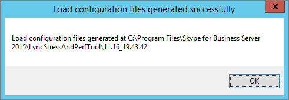

# <a name="using-the-skype-for-business-server-2015-stress-and-performance-tool"></a>Usando a ferramenta Skype for Business Server desempenho e estresse do 2015
 
Para executar a Ferramenta de Desempenho e Estresse do Skype for Business Server 2015, você precisará gerenciar usuários, contatos e perfis de usuário, configurar a ferramenta para execução e, em seguida, revisar a saída ou os resultados produzidos pela ferramenta.
  
Há quatro áreas envolvidas na execução da Ferramenta de Desempenho e Estresse Skype for Business Server 2015 (o executável é LyncPerfTool.exe):
  
- [Criar usuários e contatos](using-the-tool.md#BKMK_CreateUsersAndContacts)
    
- [Configurar o Perfil de Usuário](using-the-tool.md#BKMK_UserProfile)
    
- [Executar LyncPerfTool](using-the-tool.md#BKMK_RunTool)
    
- [Interpretando os resultados](using-the-tool.md#BKMK_Interpret)
    
## <a name="create-users-and-contacts"></a>Criar usuários e contatos
<a name="BKMK_CreateUsersAndContacts"> </a>

Você precisa usar o Skype for Business Server 2015 (SB 2015) User Provisioning Tool (UserProvisioningTool.exe) para criar usuários e contatos para seu teste de estresse e desempenho.
  
Esta é uma lista de termos úteis que podem ser úteis conforme você lê os tópicos:
  
- **Unidade Organizacional** - Unidade organizacional (UO) dos Serviços de Domínio do Active Directory (AD DS).
    
- **Federado / Pool Cruzado** - Usuários que podem se comunicar com usuários de outros serviços de Mensagens Instantâneas (IM).
    
- **Listas de Distribuição** - Ou DLs. Esses são objetos no AD DS que contêm uma lista de usuários do AD DS. Eles são usados para facilitar as comunicações entre grupos de pessoas.
    
- **Serviço** de Informações de Local - O serviço Skype for Business Server 2015 que, quando habilitado e configurado por telefone, permite a recuperação de localização física para serviços Enhanced 911 (E911).
    
- **Números de Telefone** dos EUA - Telefone atribuídos ao usuário, além do URI SIP usado para rotear chamadas de entrada e saída no RNL (Reverse Number Lookup).
    
### <a name="create-users-and-contacts-by-using-userprovisioningtoolexe"></a>Criar usuários e contatos usando UserProvisioningTool.exe

> [!NOTE]
> Antes mesmo de começar, certifique-se de estar conectado como membro do grupo de segurança Administradores de Domínio para executar essa ferramenta. Você precisa fazer isso, pois criará usuários do Active Directory. 
  
Você precisa usar a ferramenta Skype for Business Server de Provisionamento de Usuário para criar usuários e contatos para simulação de carga.
  
A **Skype for Business Server de Provisionamento do** Usuário é instalada com o pacote Skype for Business Server Ferramenta de Desempenho **e** Estresse. Certifique-se de que o instalador de pacote (CapacityPlanningTool.msi) tenha sido executado no Servidor front-end ou no servidor Edição Standard que você pretende testar.
  
Você pode iniciar Skype for Business Server Ferramenta de Provisionamento de Usuário executando o arquivo UserProvisioningTool.exe (localizado em %InstalledDirectory%LyncStressAndPerfTool\LyncStress) no Servidor Front-End ou no servidor Edição Standard.
  
> [!IMPORTANT]
> Quando você cria um grande número de usuários (por exemplo, 10.000 ou mais), execute o UserProvisioningTool.exe. Você precisará fazer isso porque a ferramenta criará e configurará  *novos usuários*  do AD.
  
Quando a Ferramenta de Provisionamento do Usuário for aberta, clique em Configuração e selecione a Configuração de Carga. 
  
Para começar a configurar usuários e contatos, carregue o arquivo padrão incluído no pacote, chamado "SampleData.xml". Isso preparará campos com dados de exemplo que você precisará alterar para torná-los relevantes para sua implantação.
  
Se você tiver um arquivo XML pré-configurado que já contenha suas configurações personalizadas, você poderá carregar esse arquivo em vez disso. Preencha os campos na Ferramenta de Provisionamento do Usuário, conforme descrito nas seções abaixo.
  
### <a name="to-configure-server-options"></a>Para configurar opções de servidor:

1. No campo FQDN do Pool de **Front-End,** digite o FQDN (nome de domínio totalmente qualificado) do servidor Edição Standard ou o pool de Front-End onde você deseja hospedar os usuários.
    
2. No campo **Prefixo de Nome** de Usuário, digite um prefixo que você deseja usar para quebrar seus nomes de usuário para fins de teste (como "TestUser").
    
3. No campo **Senha,** digite uma senha que será usada em todas as contas de usuário de teste.
    
4. No campo **Domínio da Conta,** digite o nome de domínio do domínio atual do AD (aquele no qual você deseja criar seus usuários de teste).
    
5. No campo **Unidade Organizacional,** digite o nome do domínio do AD onde você deseja criar esses usuários de teste. (Se a UO ainda não existir, ela será criada para você).
    
6. No campo **Telefone Código** de Área, digite o código de área de três dígitos a ser usado em todas as contas de usuário de teste. Certifique-se de que o código de área escolhido não conflita com os códigos de área de outros usuários no AD.
    
7. Clique para selecionar a caixa de seleção **Habilitar Voz,** se quiser habilitar os usuários de teste para Enterprise Voice.
    
8. No campo **Número de Usuários,** dê o número total de usuários de teste que você deseja criar.
    
9. No campo **Índice inicial,** dê o número inicial que será usado como sufixo para o prefixo de nome de usuário (por exemplo, o prefixo é "TestUser", e o primeiro nome terminará em "0" no exemplo abaixo).)
    
     
  
#### <a name="create-users-button"></a>Botão Criar Usuários

Quando você clica no botão **Criar Usuários,** os parâmetros de entrada inseridos são validados. Se houver algum erro de validação, você será solicitado a corrigi-los. Ou, se todos os valores estão corretos, os usuários começarão a aparecer no AD (em qualquer UO especificada). Você verá uma barra de progresso na parte inferior da ferramenta à medida que ela é executado. Não feche o aplicativo enquanto a barra de progresso estiver ativa.
  
A criação do usuário leva tempo, portanto, planeje-se de acordo. Esse processo pode levar de vários minutos para alguns usuários, até algumas horas para um grande número de usuários.
  
Se você não tiver acesso ao Controlador de Domínio do AD em seu ambiente de teste, ainda poderá validar a criação do usuário fazendo logom como um dos usuários no intervalo de usuários que você especificou para criar. Lembre-se de usar o prefixo e o sufixo, juntamente com o @sipDomain como o nome de usuário. Veja um exemplo:  <em>TestUser20@contoso.net</em>  .
  
> [!NOTE]
> Se os usuários já existirem, clicar no botão Criar Usuários os atualizará com quaisquer alterações de configuração. 
  
#### <a name="delete-users-button"></a>Botão Excluir Usuários

Quando você clicar no botão **Excluir Usuários,** os parâmetros de entrada da guia serão validados. Se houver erros de validação, você será solicitado a corrigi-los e, se os valores de entrada estão corretos, os usuários de teste especificados serão desabilitados e excluídos do Active Directory. Novamente, uma barra de progresso aparecerá na parte inferior dessa guia, e você não deve fechar o aplicativo enquanto a barra de progresso estiver ativa.
  
> [!NOTE]
> Somente números de telefone formatados nos EUA são suportados. Telefone números são sempre atribuídos aos usuários e todos os usuários criados por UserProvisioningTool.exe estão habilitados para Enterprise Voice por padrão. Quaisquer cenários que usem o número de telefone, como chamadas Atendedor Automático conferência ou UC-PSTN, usem esse número de telefone para roteá-los corretamente. Por esse motivo,  *cada usuário*  deve ter um número de *telefone exclusivo*  .
  
> [!NOTE]
> **Se você tiver que criar usuários duas vezes, o comando falhará, a menos que você use um código de área diferente ou se os usuários anteriores foram desabilitados usando o cmdlet Disable-CsUser.**
  
> [!IMPORTANT]
> Antes de criar contatos, primeiro você precisa concluir a replicação do usuário (o que é feito na guia Usuários). 
  
> [!IMPORTANT]
> Se você acabou de criar seus usuários, precisará aguardar até que Skype for Business Server replicação seja concluída e preencha as contas de usuário no banco de dados. **Se os usuários não terminarem de replicar, você verá um erro.** Você saberá quando os usuários terminarão de replicar se o serviço de Front End do Skype for Business Server 2015 tiver sido iniciado ou executando com êxito o cmdlet Get-CsUser no último usuário do número total especificado.
  
#### <a name="contacts-creation-tab"></a>Guia Criação de Contatos

Essa guia permite que você dê detalhes dos contatos dos usuários para seu teste.
  

  
### <a name="to-configure-users-contacts-do-the-following"></a>Para configurar os contatos dos usuários, faça o seguinte:

1. No campo **Média de Contatos por** Usuário, insira o número médio de contatos para preencher em listas de contatos para cada usuário.
    
2. Marque a **caixa de** seleção Fixa se quiser criar um número igual de contatos para cada usuário. Se você quiser variar o número de contatos criados para usuários, desempure essa caixa de seleção.
    
3. No campo **Grupos de Contatos Médios por** Usuário, insira o número de grupos de contatos por usuário. Esse número precisa ser menor do que **Média de Contatos por Usuário**.
    
4. No campo **Porcentagem de Contatos federados/entre pools,** dê um número entre 0 e 100. Esse percentual de contatos será criado com os usuários federados.
    
5. No campo **Prefixo de Usuário federado/pool** cruzado, dê o nome de usuário para usuários federados que serão adicionados às listas de contatos de usuários locais.
    
6. No campo **Domínio SIP do Usuário federado/entre pools,** dê o Nome de Domínio SIP dos usuários federados.
    
7. Na **guia Criação do** Usuário, certifique-se de que as informações estão corretas. Seus contatos serão criados a partir de valores na guia Criação do Usuário.
    
8. Clique **em Criar Contatos** para iniciar a criação de contatos. Esse processo pode levar vários minutos. Após a conclusão, uma caixa de diálogo aparecerá com a mensagem "Operação concluída com êxito". Você pode validar os contatos que foram criados fazendo logo em log como um usuário que foi criado a partir da guia Criação do Usuário.
    
    > [!NOTE]
    > Depois que os contatos são criados, essa ferramenta reiniciará todos os Servidores Front-End no pool de destino. Pode levar mais tempo (até 2 horas) para os Servidores Front-End iniciarem, dependendo de quantos contatos foram criados por essa operação. 
  
#### <a name="distribution-list"></a>Lista de distribuição

A Skype for Business Server ferramenta de desempenho e estresse 2015 pode simular o recurso de expansão de Lista de Distribuição (DL) no cliente Skype for Business 2015. Você pode ignorar esta etapa se não pretende habilitar a expansão de DL na ferramenta provisionamento do usuário.
  

  
A guia Lista de Distribuição permite que você crie DLs que a Ferramenta de Estresse e Desempenho usará para o recurso Expansão de Lista de Distribuição. Antes de criar DLs, Skype for Business Server 2015 precisa ser implantado, incluindo ter executado ForestPrep. Se isso não for feito, os atributos DL não existirão no esquema do AD, portanto, a ferramenta não poderá criar DLs.
  
### <a name="to-configure-distribution-lists"></a>Para configurar listas de distribuição:

1. No campo **Número** de Listas de Distribuição, dê o número total de DLs que você deseja criar (A recomendação aqui é que você comece com um valor que seja o dobro do número de usuários que você tem.).
    
2. No campo **Prefixo da Lista** de Distribuição, insira um prefixo que todas as DLs que você criar terão, por *exemplo, testDL*  . Isso significa que, em 100 DLs, seus nomes DL terão a aparência: testDL0, testDL1, até testDL99.
    
3. No campo **Membros Mínimos em um Dist. List,** insira o número mínimo de usuários a ser colocado em cada DL.
    
4. No campo **Máximo de Membros em um Dist. List,** insira o número máximo de usuários a adicionar em cada DL.
    
#### <a name="create-distribution-lists-button"></a>Botão Criar Listas de Distribuição

Quando você clica no botão Criar Listas de Distribuição, a ferramenta consulta o Active Directory para ver se as listas de distribuição que coincidem com o prefixo e os números já existem. A ferramenta cria quaisquer DLs que ainda não existem. Ao adicionar membros a essas Listas de Distribuição recém-criadas, ele escolherá os usuários do intervalo especificado na guia Criação do Usuário.
  
#### <a name="location-info-service-config-tab"></a>Guia Config do Serviço de Informações de Localização

A Skype for Business Server ferramenta de desempenho e estresse 2015 também pode gerar arquivos de configuração fictícios para o Serviço de Informações de Local. Observe que o Serviço de Informações de Local normalmente não tem um impacto significativo no desempenho nos servidores. 
  

  
Se você optar por testar esse recurso, preencha os valores no formulário e clique no botão Gerar Arquivos de Config LIS, que criará .CSV arquivos chamados:
  
- LIS_Subnet.csv
    
- LIS_Switches.csv
    
- LIS_Ports.csv
    
- LIS_WAP.csv
    
Para importar esses arquivos para o banco de dados LIS, use estes cmdlets do PowerShell:
  
- Set-CsLisSubnet
    
- Set-CsLisSwitch
    
- Set-CsLisPort
    
- Set-CsWirelessAccessPoint
    
## <a name="configure-user-profile"></a>Configurar o Perfil de Usuário
<a name="BKMK_UserProfile"> </a>

Depois que seus usuários são criados (por meio da Ferramenta de Criação do Usuário), você pode configurar perfis de usuário com a ferramenta configuração de carga Skype for Business Server 2015 (UserProfileGenerator.exe).
  
### <a name="running-the-skype-for-business-server-2015-load-configuration-tool"></a>Executando a Skype for Business Server configuração de carga 2015

Inicie a ferramenta configuração de carga (UserProfileGenerator.exe) e preencha as guias. Esta ferramenta cria um diretório para cada um dos computadores cliente que você precisará executar suas simulações. Cada diretório cliente vem com um script para iniciar a ferramenta Skype for Business Server 2015 Stress and Performance (LyncPerfTool.exe). As seções a seguir darão exemplos de como preencher os campos em cada guia da ferramenta configuração de carga Skype for Business Server 2015.
  
> [!IMPORTANT]
> Os valores específicos do usuário usados na ferramenta configuração de carga (UserProfileGenerator.exe) devem corresponder aos valores especificados na Ferramenta de Criação de Usuário do Skype for Business Server 2015 (UserProvisioningTool.exe) para o pool. 
  
#### <a name="common-configuration-tab"></a>Guia Configuração Comum

A **guia Configuração** Comum da Ferramenta de Configuração de Carga é mostrada abaixo. Preencha os campos da guia Configuração Comum, conforme descrito nas etapas a seguir.
  

  
1. No campo **Número de** Computadores Disponíveis, digite o número de computadores que você deseja usar para executar a ferramenta Stress and Performance (LyncPerfTool.exe). Recomendamos que você tenha um computador para cada 4500 usuários que você estará simulando, mas esse número pode variar se você reduzir o nível de carga ou usar apenas um subconjunto dos recursos disponíveis da ferramenta (Os níveis de carga são definidos na guia Cenários Gerais).
    
2. No campo **Prefixo para Nomes de Usuário,** insira um prefixo para o campo nome de usuário de todos os usuários. Para fazer logoff no URI (Uniform Resource Identifier) será: *UserPrefix[User Start Index... (Número de usuários-1)] @User Domínio*  , por exemplo, myUser009@Contoso.com.
    
3. No campo **Senha para Todos os Usuários,** insira a senha usada durante a criação dos usuários. Se você deixar esse campo vazio, o nome de usuário será definido como a senha.
    
4. No campo **Índice de Início do Usuário,** insira o índice do primeiro usuário a ser configurado. Você pode configurar intervalos diferentes para diferentes tipos ou níveis de carga, mas deve executar a ferramenta configuração de carga (UserProfileGenerator.exe) uma vez por intervalo que deseja configurar.
    
5. No campo **Número de Usuários,** insira o número total de usuários que você vai configurar.
    
6. No campo **Domínio do** Usuário, insira o domínio usado para o URI SIP. Isso é usado para construir o URI SIP de cada usuário para fazer logoff no servidor de front-end do Skype for Business Server 2015 ou Edição Standard servidor, e pode ser diferente do Domínio da Conta.
    
7. No campo **Domínio da Conta,** insira o logon de domínio do AD DS.
    
8. No campo **Porcentagem MPOP** (Porcentagem de Vários Pontos de Presença), dê um valor para a porcentagem de usuários que estão conectados de vários dispositivos ou máquinas, por exemplo, 10%.
    
9. Insira o número máximo de pontos de extremidade simultâneos no campo **Entrar por segundo (por instância).** Esse é o número máximo de logins para seus usuários, e a recomendação é uma taxa menor que/igual a 2 por segundo (<=2).
    
10. No campo Proxy de Acesso ou **FQDN do Pool,** insira o FQDN (nome de domínio totalmente qualificado) do servidor ao qual você deseja que os clientes se conectem. Se os usuários estão fazendo logom externamente, você precisará digitar o proxy de acesso. Se os usuários são internos, dê o FQDN de seu pool Enterprise ou Edição Standard servidor.
    
11. No campo **Porta,** insira a porta que você deseja que os usuários usem para SIP (o padrão aqui é 5061).
    
12. Para o **campo Servidor de Rede Externo Configurações,** dê o FQDN do Proxy de Acesso ou pool e, novamente, a **porta**. Essas configurações são usadas apenas para simulação de carga de pontos de extremidade externos.
    
#### <a name="general-scenarios-tab"></a>Guia Cenários Gerais


  
Você pode configurar os níveis de carga e os parâmetros para cada um dos cenários gerais oferecidos determinando o que deseja executar ou deixar desabilitado. Aqui estão suas opções gerais:
  
> [!NOTE]
> Valores de nível de carga para todos os campos, mas os Serviços de Informações Locais são **Desabilitados, Baixos,** **Médios,** **Altos** ou **Personalizados.**  Se você selecionar qualquer configuração, mas Desabilitada, as configurações serão geradas para cada cliente. Altos resultados na carga máxima suportada no servidor; médio é de 60% de alta carga; baixo é 30%. 
  
- **Mensagens Instantâneas -** Isso inclui conferência ponto a ponto; escolha o valor apropriado para o Nível de Carga.
    
- **Audioconferência -** Escolha um nível de carga para audioconferência *somente*  . As chamadas ponto a ponto serão abordadas um pouco mais tarde na seção **Cenários de** Voz. Abra a **guia Avançado** para habilitar MultiView.
    
- **Compartilhamento de Aplicativos -** Escolha um nível de carga para compartilhamento de aplicativos.
    
- **Colaboração de dados -** Escolha um nível de carga para colaboração de dados, que inclui conferência de dados.
    
- **Expansão da Lista de Distribuição -** Clique no **botão Avançado** e preencha o campo com os mesmos valores configurados na guia DL da Ferramenta de Criação do Usuário (UserProvisioningTool.exe). Escolha um nível de carga.
    
- **Consulta da Web do Livro de Endereços -** Este é o serviço de exame do livro de endereços em vez do download do arquivo do livro de endereços. Se você quiser habilitar isso para downloads de arquivo do livro de endereços, clique no botão **Avançado** e de definir **EnableABSDownload** como True. Dê um valor para o nível de carga.
    
- **Serviço de Grupo de Resposta -** Clique no **botão Avançado** e especifique os URIs dos grupos de resposta que você já criou quando provisionou agentes do Serviço de Grupo de Resposta. Você deve escolher pelo menos um grupo de resposta. Para usar mais, separe os grupos de resposta com ponto-e-vírgula. Atualize **RGSUriSuffixStartIndex** e **RGSUriSuffixEndIndex** para os valores reais. Escolha um nível de carga.
    
- **Serviços de Informações de Localização -** Selecione um nível de carga habilitado ou desabilitado.
    
> [!NOTE]
> Cada um dos cenários tem um botão Avançado localizado ao lado dele e um conjunto de caixas de seleção que permitem variações para a configuração padrão. 
  
- Escolher  *Ad-hoc*  permitirá que a ferramenta gere simulação de conferências que serão criadas ao longo da hora.
    
- Escolher  *Grande Conf*  significa que um Cenário de Conferência Grande será simulado.
    
-  *External*  informa à ferramenta para também simular usuários externos.
    
Esses botões e caixas de seleção são valores extras específicos de cada cenário e alterarão o comportamento da Ferramenta de Estresse e Desempenho e tornarão a personalização possível.
  
Para cada cenário na guia Cenários Gerais (exceto para Serviços de Informações de Local), se o valor de Nível de Carga for **Personalizado,** a taxa de conversa será calculada usando o campo correspondente na caixa de diálogo Avançado. O nome do campo pode ser diferente, dependendo do cenário, mas a descrição do campo irá dizer: OBSERVAÇÃO Esse número só será usado se Custom for selecionado no  *menu suspenso*  .
  
Os valores **Alto,** **Médio** e **Baixo** alterarão as taxas de conversa por modalidade em linha com o Modelo de Usuário que é um saldo de todos os cenários. Se houver a necessidade de alterar o nível de carga por modalidade devido a uma diferença no uso esperado, use uma taxa de conversa personalizada.
  
#### <a name="voice-scenarios-tab"></a>Guia Cenários de Voz

Esta é a guia para configuração de todos os cenários relacionados à voz.
  

  
Suas opções são:
  
- **VoIP -** Clique no **botão Avançado** e adicione valores para os campos PhoneAreaCode e LocationProfile (plano de discagem). Você também dará um valor para o Nível de Carga. Se você escolher um nível de carga para VoIP ou Gateway UC/PSTN habilitado, uma PSTN (rede telefônica pública comutado) para o arquivo de configuração de comunicações unificadas (UC) será gerada para simular chamadas externas.
    
- **Gateway UC/PSTN -** Você precisa escolher um valor de Nível de Carga e, quando escolher algo diferente de Desabilitado, você também precisa fornecer um valor para o código de área PSTN clicando no **botão** Avançado. Clique **em Adicionar** no Servidor de Mediação e PSTN. Certifique-se de ter uma rota configurada para o código de área.
    
    > [!TIP]
    > Você pode usar o Painel de Controle Skype for Business ou o Shell de Gerenciamento Skype for Business para verificar sua configuração de rota de voz. 
  
- **Atendedor de Conferência -** Fornecer um valor para o Nível de Carga. Qualquer valor diferente de Disabled habilita o campo **Número de** Telefone. Insira o número de telefone do Atendedor Automático você deseja usar. Clique **em Avançado** e dê um valor para o campo **LocationProfile.**
    
- **Serviço de Estacionamento de Chamada -** Aqui, fornece um Nível de Carga.
    
- **Servidor de Mediação e PSTN -** Cada Servidor de Mediação que você deseja usar precisa de seu próprio simulador PSTN. Depois de determinar qual cliente você usará para o simulador, configure seu Servidor de Mediação para rotear chamadas para esse computador no Simulador PSTN configurado. Clique no **botão Adicionar** para configurar um valor para o Servidor de Mediação.
    
    > [!NOTE]
    > Cada cenário tem um botão Avançado localizado ao lado dele. As caixas de diálogo avançadas contêm configurações específicas para cada cenário que alteram o comportamento da Ferramenta de Estresse e Desempenho e permitem a personalização. > Para cada cenário na guia Cenários de Voz, se o valor de Nível de Carga for **Personalizado,** a taxa de conversa será calculada usando o campo correspondente na caixa de diálogo Avançado. O nome do campo pode ser diferente, dependendo do cenário, mas a descrição do campo irá dizer: OBSERVAÇÃO Esse número só será usado se Custom for selecionado no  *menu suspenso*  .
  
#### <a name="web-app-tab"></a>Guia Aplicativo Web


  
O Web App dá suporte a cenários de conferência por meio do servidor UCWA (Unified Communications Web API) instalado em um servidor Front-End. Use a guia Aplicativo Web para configurar todos os cenários relacionados ao aplicativo Web. As opções são:
  
- **Aplicativo Web Geral Configurações -** Clique no **botão Adicional Configurações** e defina o **ReachTargetServerUrl** como o IP virtual do Pool de Diretórios (VIP) do VIP do pool front-end.
    
- **Compartilhamento de Aplicativos -** Selecione um valor para Nível de Carga.
    
- **Colaboração de dados -** Selecione um valor para Nível de Carga.
    
- **Mensagens Instantâneas -** Selecione um valor para Nível de Carga.
    
- **Conferência de voz -** Selecione um valor para Nível de Carga.
    
> [!NOTE]
> Cada um dos cenários tem um **botão Avançado** localizado ao lado dele. As caixas de diálogo avançadas contêm valores específicos para cada cenário que alterarão o comportamento da Ferramenta de Estresse e Desempenho e permitirão a personalização.> Para cada um dos cenários do Aplicativo Web, se o Nível de Carga for **Personalizado**, o valor especificado no campo **ConversationsPerHour** será usado em vez do padrão.
  
#### <a name="mobility-tab"></a>Guia Mobilidade

Use esta guia para configurar todos os cenários relacionados à mobilidade.
  

  
As opções aqui são:
  
- **General Mobility Configurações -** Clique **em Mais Configurações** e defina o campo UcwaTargetServerUrl como o IP virtual do Pool de Diretores (VIP) ou o VIP do pool front-end.
    
- **Presença e Mensagens Instantâneas P2P/Áudio -** Selecione um valor para o Nível de Carga para habilitar a simulação de mobilidade.
    
> [!NOTE]
> Cada um dos cenários tem um **botão Avançado** localizado ao lado dele. As caixas de diálogo avançadas contêm valores específicos para cada cenário que alterarão o comportamento da Ferramenta de Estresse e Desempenho e permitirão personalização.> Para cada um dos cenários de Mobilidade, se o Nível de Carga for **Personalizado**, o valor especificado no campo **ConversationsPerHour** será usado em vez do padrão.
  
#### <a name="summary-tab"></a>Guia Resumo

A guia Resumo indica quais usuários usar para cada um dos cenários.
  

  
A guia Resumo indica quais usuários usar para cada um dos cenários. 
  
É possível configurar manualmente intervalos de números  de usuário selecionando a caixa de seleção Habilitar Geração de Intervalo de Usuários Personalizado e clicando duas vezes no cenário na tabela que tem o Intervalo de Usuários que você deseja personalizar.
  
Verificar **(RunClient.bat)** Adicione atraso de login ao iniciar para incluir atrasos nos arquivos em lotes gerados para corresponder à taxa de login. Isso é útil para evitar sobrecarga de servidor ao entrar em um grande número de usuários.
  
Clique **em Gerar Arquivos** e selecione a pasta onde você deseja gerar a configuração. Uma caixa de diálogo será exibida quando seus arquivos foram criados com êxito.
  

  
## <a name="run-lyncperftool"></a>Executar LyncPerfTool
<a name="BKMK_RunTool"> </a>

Você precisará criar usuários, contatos e cenários antes de executar o Skype for Business Server de Desempenho e Estresse 2015 (LyncPerfTool.exe). Para obter detalhes sobre como usar as ferramentas para executar essas ações, consulte [Create Users and Contacts](using-the-tool.md#BKMK_CreateUsersAndContacts) e [Configure User Profile anteriormente](using-the-tool.md#BKMK_UserProfile) neste artigo. Executar essas ferramentas também gerará um arquivo que será executado com a ferramenta Stress and Performance como parte de um arquivo em lotes com os parâmetros necessários incluídos.
  
### <a name="running-the-skype-for-business-server-2015-stress-and-performance-tool"></a>Executando a Skype for Business Server de Desempenho e Estresse 2015

A ferramenta configuração de carga (UserProfileGenerator.exe) cria um arquivo em lote que permite executar a ferramenta Stress and Performance (LyncPerfTool.exe) registrando contadores de desempenho e carregando o arquivo de configuração XML. O arquivo em lote executa uma instância de LyncPerfTool.exe por arquivo de configuração. Para executar o arquivo em lote, siga estas etapas:
  
### <a name="run-the-stress-and-performance-test"></a>Executar o teste de Estresse e Desempenho

1. Copie a pasta com as pastas de configuração e arquivos dentro para o diretório que LyncPerfTool.exe em cada computador cliente. (Por exemplo, se você gerou os arquivos de configuração na pasta chamada 1.28_13.16.16, copie essa pasta para a pasta com LyncPerfTool.exe nele. Faça isso em cada cliente.)
    
2. Navegue até a pasta do cliente e execute o script em lote **RunClient.** Você pode clicar duas vezes no arquivo em lote no Windows Explorer e ele executará todos os arquivos de configuração para esse cliente. Você também pode executar o script de uma pasta de cliente usando a seguinte sintaxe:
    
   ```console
   RunClient0.bat "C:\Program Files\Skype for Business Server 2015\LyncStressAndPerfTool\LyncStress" 
   ```

Para executar a ferramenta Stress e Performance diretamente, abra um prompt de comando e digite o seguinte comando na linha de comando (e ao fazer isso pela primeira vez, registre os contadores de desempenho , conforme mostrado na nota mais adiante  `regsvr32 /i /n /s LyncPerfToolPerf.dll` neste tópico):
  
```console
LyncPerfTool.exe /file:IM_client0.xml
```

Para que a ferramenta exibe os valores no arquivo de configuração, inclua o parâmetro no comando anterior, para que  `/displayfile` ela tenha esta aparência:
  
```console
LyncPerfTool.exe /file:IM_client0.xml /displayfile
```

Para  *encerrar*  o processo, pressione Ctrl+C.
  
> [!NOTE]
> Antes de executar diretamente a ferramenta Estresse e Desempenho, você deve registrar os contadores de desempenho por meio do seguinte comando:  `regsvr32 /i /n /s LyncPerfToolPerf.dll`
  
> [!NOTE]
> Todas as instâncias da ferramenta Estresse e Desempenho que você iniciar começarão a entrar imediatamente nos usuários, geralmente a uma taxa de um usuário por segundo. 
  
A taxa de login do usuário de pico para o pool é de cerca de 12 por segundo. Isso significa que você não deve iniciar mais de 12 LyncPerfTool.exe instâncias ao mesmo tempo enquanto os usuários ainda estão fazendo a sessão. Mil usuários levarão cerca de 20 minutos para entrar totalmente em um por segundo.
  
## <a name="interpreting-the-results"></a>Interpretando os resultados
<a name="BKMK_Interpret"> </a>

A Skype for Business Server ferramenta de desempenho e estresse 2015 tem muitos contadores que podem ajudá-lo a entender o que o cliente está fazendo e se está encontrando problemas.
  
### <a name="client-counters"></a>Contadores de cliente

Cada instância de LyncPerfTool.exe em execução tem uma instância separada dos contadores. Cada instância é nomeada pela ID do processo. Se os clientes estão sobrecarregados, outros problemas podem ocorrer. Para evitar esses problemas:
  
- Monitore o uso da CPU e da memória nos computadores cliente. Se a CPU estiver consistentemente acima de 90%, reduza o número de usuários.
    
- Quando o espaço de memória for alto, você poderá ter problemas se o Arquivo de Página começar a ficar sem espaço. Verifique se a Cobrança de Confirmação não está atingindo o limite no computador. Se você estiver executando em Limites de Memória, considere aumentar o tamanho do Arquivo de Página ou reduzir o número de usuários.
    
Aqui está uma lista dos principais contadores de desempenho:
  
**Informações Gerais**

|**Contador de Desempenho**|**Descrição**|
|:-----|:-----|
|Tempo Gasto em Minutos  <br/> |Tempo gasto desde que o processo foi iniciado.  <br/> |
|Pontos de extremidade ativos  <br/> |Número de pontos de extremidade atualmente conectados ao servidor.  <br/> |
|Logons com falha  <br/> |Número total de falhas de login do ponto de extremidade.  <br/> |
|Tentativas de logon  <br/> |Número total de tentativas de login do ponto de extremidade.  <br/> |
|Pontos de extremidade desconectados  <br/> |Número total de pontos de extremidade que foram desconectados.  <br/> |
   
**Informações de presença**

|**Contador de Desempenho**|**Descrição**|
|:-----|:-----|
|Chamadas SetPresence  <br/> |Número total de tentativas de alteração de presença. Para diferentes tipos de alterações de presença, consulte SetPresence (Presence Type) Calls Performance Counter.  <br/> |
|Respostas NNN para SetPresence  <br/> |Número total de códigos de resposta nnn recebidos do servidor.  <br/> |
|Chamadas GetPresence  <br/> |Número total de tentativas de solicitação de presença.  <br/> |
|Respostas NNN para GetPresence  <br/> |Número total de códigos de resposta nnn recebidos do servidor.  <br/> |
   
**Informações do serviço do Livro de Endereços**

|**Contador de Desempenho**|**Descrição**|
|:-----|:-----|
|Tentativa de downloads de arquivos ABS Full/Delta  <br/> |Número total de solicitações de download de arquivos delta ou completas tentadas.  <br/> |
|Downloads de arquivos abs full/delta bem-sucedidos  <br/> |Número total de solicitações de download de arquivos delta ou completas tentadas.  <br/> |
|Contadores relacionados ao serviço de Consulta da Web do Livro de Endereços  <br/> |Contadores relacionados ao download do arquivo do livro de endereços.  <br/> |
|Tentativa de chamadas WS ABS  <br/> |Número total de solicitações de serviço de Consulta da Web do Livro de Endereços tentadas.  <br/> |
|Chamadas ABS WS bem-sucedidas  <br/> |Número total de solicitações de serviço de Consulta da Web do Livro de Endereços que retornaram um código de resposta bem-sucedido.  <br/> |
|Falha nas chamadas ABS WS  <br/> |Número total de solicitações de serviço de Consulta da Web do Livro de Endereços que retornaram um código de resposta de erro.  <br/> |
   
> [!NOTE]
> Essa categoria inclui contadores usados para monitorar downloads de arquivos do serviço de Livro de Endereços (ABS) e solicitações de serviço de Consulta web do Livro de Endereços. 
  
**Informações da Lista de Distribuição (DL)**

|**Contador de Desempenho**|**Descrição**|
|:-----|:-----|
|Tentativas de chamadas  <br/> |Número total de solicitações de serviço Web de expansão de lista de distribuição (DLX) tentadas.  <br/> |
|Chamadas bem-sucedidas  <br/> |Número total de solicitações de serviço Web DLX que retornaram um código de resposta bem-sucedido.  <br/> |
|Chamadas com falha  <br/> |Número total de solicitações de serviço Web DLX que retornaram um código de resposta de erro.  <br/> |
   

  
> [!NOTE]
> Os contadores de desempenho listados abaixo relatam os números de todas as chamadas voIP (Voz sobre IP), incluindo chamadas para Servidor de Mediação, Servidor de Conferência A/V, Servidor de Borda, aplicativo grupo de resposta e conferência Atendedor Automático, quando esses cenários estão habilitados. 
  
**Informações básicas do VoIP**

|**Contador de Desempenho**|**Descrição**|
|:-----|:-----|
|Chamadas ativas  <br/> |Número total de chamadas de voz de entrada/saída em andamento no momento.  <br/> |
|Chamadas encerradas  <br/> |Número total de chamadas de voz de entrada/saída já encerradas.  <br/> |
|Chamadas recusadas  <br/> |Número total de chamadas de voz de entrada recusadas.  <br/> |
|Tentativa de chamadas de entrada/saída  <br/> |Número total de chamadas de voz de entrada/saída tentada.  <br/> |
|Chamadas de entrada/saída estabelecidas  <br/> |Número total de chamadas de voz de entrada/saída estabelecidas.  <br/> |
|Chamadas recebidas NNN  <br/> |Número total de códigos de resposta nnn recebidos do servidor.  <br/> |
|Taxa de passagem VoIP (%)  <br/> |Total de chamadas estabelecidas/Total de chamadas tentadas.  <br/> |
   
**Informações de chamada do serviço do Grupo de Resposta**

|**Contador de Desempenho**|**Descrição**|
|:-----|:-----|
|Chamadas ativas  <br/> |Número total de chamadas ativas para o aplicativo grupo de resposta.  <br/> |
|Tentativas de chamadas  <br/> |Número total de chamadas tentada.  <br/> |
   
**Informações de chamada de mensagens instantâneas (IM)**

|**Contador de Desempenho**|**Descrição**|
|:-----|:-----|
|Chamadas ativas  <br/> |Número total de chamadas de mensagens instantâneas de entrada/saída em andamento.  <br/> |
|Chamadas encerradas  <br/> |Número total de chamadas de mensagens instantâneas de entrada/saída já encerradas.  <br/> |
|Chamadas recebidas NNN  <br/> |Número total de códigos de resposta nnn recebidos do servidor.  <br/> |
|Mensagens de mensagens de mensagens recebidas/enviadas  <br/> |Número total de mensagens recebidas ou enviadas para todas as sessões.  <br/> |
|Tentativa de chamadas de entrada/saída  <br/> |Número total de chamadas de mensagens instantâneas de entrada/saída tentada.  <br/> |
|Chamadas de entrada/saída estabelecidas  <br/> |Número total de chamadas de mensagem instantânea de entrada/saída estabelecidas.  <br/> |
   
**Informações de chamada de compartilhamento de aplicativos**

|**Contador de Desempenho**|**Descrição**|
|:-----|:-----|
|Chamadas ativas  <br/> |Número total de chamadas de compartilhamento de aplicativos de entrada/saída em andamento.  <br/> |
|Chamadas encerradas  <br/> |Número total de chamadas de compartilhamento de aplicativos de entrada/saída já encerradas.  <br/> |
|Chamadas recebidas NNN  <br/> |Número total de códigos de resposta nnn recebidos do servidor.  <br/> |
|Tentativa de chamadas de entrada/saída  <br/> |Número total de chamadas de compartilhamento de aplicativos de entrada/saída tentada.  <br/> |
|Chamadas de entrada/saída estabelecidas  <br/> |Número total de chamadas de compartilhamento de aplicativos de entrada/saída estabelecidas.  <br/> |
   
**Informações de chamada caa**

|**Contador de Desempenho**|**Descrição**|
|:-----|:-----|
|Chamadas ativas  <br/> |Número total de chamadas PSTN (rede telefônica pública comutado) de entrada/saída em andamento no momento.  <br/> |
|Chamadas encerradas  <br/> |Número total de chamadas PSTN de entrada/saída já encerradas.  <br/> |
|Tentativa de chamadas de entrada/saída  <br/> |Número total de chamadas PSTN de entrada/saída tentada.  <br/> |
|Chamadas de entrada/saída estabelecidas  <br/> |Número total de chamadas PSTN de entrada/saída estabelecidas.  <br/> |
   
**Informações da conferência**

|**Contador de Desempenho**|**Descrição**|
|:-----|:-----|
|Conferências ativas de Mensagens Instantâneas  <br/> |Número total de conferências de mensagens instantâneas em andamento.  <br/> |
|Conferências ativas de áudio/vídeo  <br/> |Número total de conferências de áudio/vídeo em andamento (A/V).  <br/> |
|Conferências de compartilhamento de aplicativos ativos  <br/> |Número total de conferências de compartilhamento de aplicativos em andamento.  <br/> |
|Número de participantes  <br/> |Número total de participantes atualmente conectados a conferências.  <br/> |
|Falha no agendamento de conferências  <br/> |Número total de falhas ao tentar agendar uma conferência.  <br/> |
|Insucesso à falha de conferência  <br/> |Número total de falhas ao tentar se conectar a uma conferência.  <br/> |
   
**Contadores de cliente UCWA**

|**Contador de Desempenho**|**Descrição**|
|:-----|:-----|
|Número total de junções do IMMCU bem-sucedidas  <br/> |Número total de conferências de mensagens instantâneas ingressadas.  <br/> |
|Número total de junções de DMCU bem-sucedidas  <br/> |Número total de conferências A/V ingressados.  <br/> |
   

