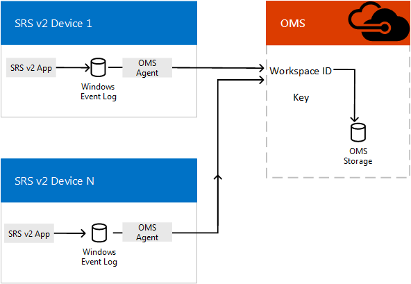

# Planejar o gerenciamento de salas de equipes da Microsoft com o Monitor do AzurePlan Microsoft Teams Rooms management with Azure Monitor
 
 Este artigo discute considerações de planejamento para usando o Monitor de Windows Azure para administrar dispositivos de salas de equipes da Microsoft no seu Skype para a implementação do servidor de negócios.This article discusses planning considerations for using Azure Monitor to administer Microsoft Teams Rooms devices in your Skype for Business Server implementation.
  
[Monitor do Windows Azure](https://docs.microsoft.com/azure/azure-monitor/overview) é um conjunto de serviços de gerenciamento que foram criados na nuvem desde o início.[Azure Monitor](https://docs.microsoft.com/azure/azure-monitor/overview) is a collection of management services that were designed in the cloud from the start. Em vez de implantação e gerenciamento de recursos no local, os componentes do Windows Azure Monitor inteiramente são hospedados no Windows Azure.Rather than deploying and managing on-premise resources, Azure Monitor components are entirely hosted in Azure. Configuração é mínima, e você pode ser atualizado e sendo executado literalmente em questão de minutos.Configuration is minimal, and you can be up and running literally in a matter of minutes. Com algum trabalho de personalização, ele também pode ajudar no gerenciamento de sistemas de conferência de salas de equipes da Microsoft, fornecendo notificações em tempo real de integridade do sistema ou falhas para sistemas de sala individuais e potencialmente pode dimensione para gerenciamento de milhares de Teams da Microsoft Salas de conferência de salas.With some customization work, it can aid in managing Microsoft Teams Rooms conferencing systems by providing real-time notifications of system health or faults for individual room systems, and it can potentially scale up to managing thousands of Microsoft Teams Rooms conference rooms.
  
Este artigo oferece uma discussão sobre os requisitos, arquitetura do projeto e práticas recomendadas de implementação necessárias para implementar o gerenciamento de Monitor Azure com base de dispositivos de conferência de salas de equipes da Microsoft e fornece links para artigos detalhados sobre Implementando o Monitor do Windows Azure para salas de equipes da Microsoft e informações de referência críticas para o monitoramento contínuo de salas de salas de equipes da Microsoft.This article provides a discussion of the requirements, design/architecture, and implementation best practices needed to implement Azure Monitor based management of Microsoft Teams Rooms conference devices, and provides links to detailed articles on implementing Azure Monitor for Microsoft Teams Rooms and critical reference information for ongoing monitoring of Microsoft Teams Rooms rooms. 
  
## Visão geral funcionalFunctional overview

  
O aplicativo Microsoft equipes salas no dispositivo console grava eventos seu registro de eventos do Windows.The Microsoft Teams Rooms app on the console device writes events to its Windows Event Log. Um agente Microsoft Monitoring, uma vez instalado, passa as informações ao serviço de Monitor do Azure.A Microsoft Monitoring agent, once installed, passes the information to Azure Monitor service. 
  
Uma vez configurado corretamente, analisa de análise de Log a carga JSON incorporada no evento descrições para descrever como cada sistema salas de equipes da Microsoft está funcionando e quais falhas são detectadas.Once properly configured, Log Analytics parses the JSON payload embedded in the event descriptions to describe how each Microsoft Teams Rooms system is functioning and what faults are detected. 
  
Um administrador usando o Monitor do Azure pode obter notificações de sistemas de salas de equipes da Microsoft que estão offline ou está ocorrendo app, conectividade ou falhas de hardware bem como saber se um sistema precisa ser reiniciado.An administrator using Azure Monitor can get notifications of Microsoft Teams Rooms systems that are offline or are experiencing app, connectivity, or hardware failures as well as knowing if a system needs to be restarted. Cada status do sistema é atualizada com frequência, portanto essas notificações estiverem próximos atualizações em tempo real.Each system status is updated frequently, so these notifications are close to real-time updates.
  
## Requisitos de Monitor AzureAzure Monitor requirements

Você deve ter uma assinatura válida de Azure para Monitor do Windows Azure usar o recurso de análise de Log.You must have a valid Azure subscription for Azure Monitor to use Log Analytics feature. Consulte a [Introdução com um espaço de trabalho de análise de Log](https://docs.microsoft.com/azure/azure-monitor/learn/quick-create-workspace) para criar uma assinatura para sua organização.See [Get started with a Log Analytics workspace](https://docs.microsoft.com/azure/azure-monitor/learn/quick-create-workspace) to create a subscription for your organization.
  
Você deve se familiarizar conforme o necessário sobre como usar o Designer de modo de exibição de análise de Log.You should familiarize yourself as necessary on how to use the Log Analytics View Designer. Consulte [modos de exibição na análise de Log](https://docs.microsoft.com/azure/azure-monitor/platform/view-designer) para obter os detalhes.See [Views in Log Analytics ](https://docs.microsoft.com/azure/azure-monitor/platform/view-designer) for those details.
  
### Tarefas relacionadasRelated Tasks

1. Depois de inscritos na análise de Log do Windows Azure Monitor, crie personalizado campos (conforme descrito em [Mapear campos personalizados](../../deploy/deploy-clients/azure-monitor.md#Custom_fields)) necessário para analisar as informações que serão enviadas de consoles de salas de equipes da Microsoft.Once subscribed to Azure Monitor Log Analytics, create custom fields (as described in [Map custom fields](../../deploy/deploy-clients/azure-monitor.md#Custom_fields)) needed to parse the information that will be sent from Microsoft Teams Rooms consoles. Isso inclui Noções básicas sobre o esquema JSON documentado nos [entender as entradas de log](../../manage/skype-room-systems-v2/azure-monitor.md#understand-the-log-entries).This includes understanding the JSON schema documented in [Understand the log entries](../../manage/skype-room-systems-v2/azure-monitor.md#understand-the-log-entries).
    
2. Desenvolva um modo de exibição de gerenciamento de salas de equipes da Microsoft na análise de Log.Develop a Microsoft Teams Rooms management view in Log Analytics. Você pode [criar um painel de salas de equipes da Microsoft usando o método de importação](../../deploy/deploy-clients/azure-monitor.md#create-a-microsoft-teams-rooms-dashboard-by-using-the-import-method) ou [criar um painel de salas de equipes da Microsoft manualmente](../../deploy/deploy-clients/azure-monitor.md#create-a-microsoft-teams-rooms-dashboard-manually).You can either [Create a Microsoft Teams Rooms dashboard by using the import method](../../deploy/deploy-clients/azure-monitor.md#create-a-microsoft-teams-rooms-dashboard-by-using-the-import-method) or [Create a Microsoft Teams Rooms dashboard manually](../../deploy/deploy-clients/azure-monitor.md#create-a-microsoft-teams-rooms-dashboard-manually).
    
## Requisitos do Console de salas do Microsoft equipes individuaisIndividual Microsoft Teams Rooms Console requirements

Cada console de salas de equipes da Microsoft é um aplicativo de execução em um dispositivo Surface Pro no modo de quiosque (normalmente, ele é configurado para ser o único aplicativo que pode ser executado no dispositivo).Each Microsoft Teams Rooms console is an app running on a Surface Pro device in kiosk mode (normally, it's configured to be the only app that can run on the device). Assim como acontece com qualquer aplicativo do Windows, o aplicativo Microsoft equipes salas grava eventos, como falhas de hardware e de inicialização para o Log de eventos do Windows.As with any Windows app, the Microsoft Teams Rooms app writes events like startup and hardware faults to the Windows Event Log. Adicionar um agente de Monitor da Microsoft no seu dispositivo de salas de equipes da Microsoft permite que esses eventos a serem coletados.Adding an Microsoft Monitor agent on your Microsoft Teams Rooms device allows these events to be collected. (Consulte [computadores com Windows se conectar ao serviço de Log de análise no Windows Azure](https://docs.microsoft.com/azure/azure-monitor/platform/agent-windows) para obter detalhes).(See [Connect Windows computers to the Log Analytics service in Azure](https://docs.microsoft.com/azure/azure-monitor/platform/agent-windows) for details.)
  
## Gerenciamento contínuoOngoing management

Durante a utilização do Monitor do Windows Azure para gerenciar seus dispositivos de salas de equipes da Microsoft, você precisará compreender as informações contidas nos logs de eventos usados pelo Monitor do Azure.While using Azure Monitor to manage your Microsoft Teams Rooms devices, you'll need to understand the information contained in the event logs used by Azure Monitor. Consulte a [entender as entradas de log](../../manage/skype-room-systems-v2/azure-monitor.md#understand-the-log-entries) para obter detalhes sobre essas mensagens de integridade.See [Understand the log entries](../../manage/skype-room-systems-v2/azure-monitor.md#understand-the-log-entries) for details on these health messages.
  
### Tarefas relacionadasRelated Tasks

- Entender os alertas gerados pela Microsoft equipes salas e como resolvê-los a (consulte a seção intitulada [entender as entradas de log](../../manage/skype-room-systems-v2/azure-monitor.md#understand-the-log-entries))Understand the Alerts generated by Microsoft Teams Rooms and how to resolve them (see the section titled [Understand the log entries](../../manage/skype-room-systems-v2/azure-monitor.md#understand-the-log-entries))
    
## Confira tambémSee also

[Implantar o gerenciamento de salas de equipes da Microsoft com o Monitor do AzureDeploy Microsoft Teams Rooms management with Azure Monitor](../../deploy/deploy-clients/azure-monitor.md)
  
[Gerencia dispositivos de salas de equipes da Microsoft com Monitor do AzureManage Microsoft Teams Rooms devices with Azure Monitor](../../manage/skype-room-systems-v2/azure-monitor.md)