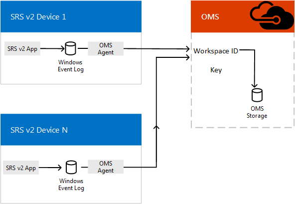

# Planejar o gerenciamento do Skype Room Systems versão 2 com o OMSPlan Skype Room Systems v2 management with OMS
 
 Este artigo discute considerações de planejamento para usando o pacote de gerenciamento de operações para administrar dispositivos de v2 de sistemas de sala Skype no seu Skype para implementação da Business Server.This article discusses planning considerations for using Operations Management Suite to administer Skype Room Systems v2 devices in your Skype for Business Server implementation.
  
[Pacote de gerenciamento de operações](https://docs.microsoft.com/azure/operations-management-suite/operations-management-suite-overview) (OMS) é uma coleção de serviços de gerenciamento que foram criados na nuvem desde o início.[Operations Management Suite](https://docs.microsoft.com/azure/operations-management-suite/operations-management-suite-overview) (OMS) is a collection of management services that were designed in the cloud from the start. Em vez de implantação e gerenciamento de recursos no local, os componentes OMS inteiramente são hospedados no Windows Azure.Rather than deploying and managing on-premise resources, OMS components are entirely hosted in Azure. Configuração é mínima, e você pode ser atualizado e sendo executado literalmente em questão de minutos.Configuration is minimal, and you can be up and running literally in a matter of minutes. Com algum trabalho de personalização, ele também pode ajudar no gerenciamento de sistemas de conferência do Skype sala sistemas v2, fornecendo notificações em tempo real de integridade do sistema ou falhas para sistemas de sala individuais e potencialmente pode dimensione ao gerenciamento de milhares de sistemas de sala do Skype salas de conferência v2.With some customization work, it can aid in managing Skype Room Systems v2 conferencing systems by providing real-time notifications of system health or faults for individual room systems, and it can potentially scale up to managing thousands of Skype Room Systems v2 conference rooms.
  
Este artigo oferece uma discussão sobre os requisitos, arquitetura do projeto e práticas recomendadas de implementação necessárias para implementar o gerenciamento de OMS dos dispositivos de conferência do Skype sala sistemas v2 e fornece links para artigos detalhados sobre a implementação OMS gerenciamento para sistemas de sala Skype v2 e informações de referência críticas para o gerenciamento contínuo de OMS de salas de v2 Skype sistemas de sala.This article provides a discussion of the requirements, design/architecture, and implementation best practices needed to implement OMS management of Skype Room Systems v2 conference devices, and provides links to detailed articles on implementing OMS management for Skype Room Systems v2 and critical reference information for ongoing OMS management of Skype Room Systems v2 rooms. 
  
## Visão geral funcionalFunctional overview

  
O aplicativo de v2 de sistemas de sala Skype no dispositivo console grava eventos seu registro de eventos do Windows.The Skype Room Systems v2 app on the console device writes events to its Windows Event Log. Um agente OMS, depois de instalado, envia as informações para o OMS.An OMS agent, once installed, passes the information to OMS. 
  
Uma vez configurado corretamente, analisa OMS a carga JSON incorporada no evento descrições para descrever como cada sistema v2 de sistemas de sala Skype está funcionando e quais falhas são detectadas.Once properly configured, OMS parses the JSON payload embedded in the event descriptions to describe how each Skype Room Systems v2 system is functioning and what faults are detected. 
  
Um administrador usando OMS pode obter notificações dos sistemas de v2 Skype sala sistemas que estiverem offline ou está ocorrendo falhas de hardware, conectividade ou aplicativo bem como saber se um sistema precisa ser reiniciado.An administrator using OMS can get notifications of Skype Room Systems v2 systems that are offline or are experiencing app, connectivity, or hardware failures as well as knowing if a system needs to be restarted. Cada status do sistema é atualizado a cada cinco minutos; portanto, essas notificações têm atualizações quase em tempo real.Each system status is updated every five minutes, so these notifications are close to real-time updates.
  
## Requisitos do OMSOMS requirements

Você deve ter uma assinatura válida do OMS para usar esse recurso.You must have a valid subscription for OMS to use this feature. Veja [Introdução a um espaço de trabalho de Log Analytics](https://docs.microsoft.com/azure/log-analytics/log-analytics-get-started?toc=%2fazure%2foperations-management-suite%2ftoc.json) para criar uma assinatura para sua organização.See [Get started with a Log Analytics workspace](https://docs.microsoft.com/azure/log-analytics/log-analytics-get-started?toc=%2fazure%2foperations-management-suite%2ftoc.json) to create a subscription for your organization.
  
Você deve se familiarizar, conforme o necessário, com o uso do Designer de Exibição do OMS.You should familiarize yourself as necessary on how to use the OMS View Designer. Veja [Modos de exibição nas soluções de gerenciamento do OMS (Operations Management Suite)](https://docs.microsoft.com/azure/operations-management-suite/operations-management-suite-solutions-resources-views) para obter esses detalhes.See [Views in Operations Management Suite (OMS) management solutions](https://docs.microsoft.com/azure/operations-management-suite/operations-management-suite-solutions-resources-views) for those details.
  
### Tarefas relacionadasRelated Tasks

1. Depois de inscritos OMS, crie personalizado campos (conforme descrito em [Mapear campos personalizados](../../deploy/deploy-clients/with-oms.md#Custom_fields)) necessário para analisar as informações que serão enviadas de consoles de v2 Skype sistemas de sala.Once subscribed to OMS, create custom fields (as described in [Map custom fields](../../deploy/deploy-clients/with-oms.md#Custom_fields)) needed to parse the information that will be sent from Skype Room Systems v2 consoles. Isso inclui Noções básicas sobre o esquema JSON documentado nos [entender as entradas de log](../../manage/skype-room-systems-v2/oms.md#understand-the-log-entries).This includes understanding the JSON schema documented in [Understand the log entries](../../manage/skype-room-systems-v2/oms.md#understand-the-log-entries).
    
2. Desenvolva um modo de exibição de gerenciamento do Skype sala sistemas v2 no OMS.Develop a Skype Room Systems v2 management view in OMS. Você pode a [criar um painel de v2 Skype sala sistemas usando o método de importação](../../deploy/deploy-clients/with-oms.md#create-a-skype-room-systems-v2-dashboard-by-using-the-import-method) ) ou [Crie um painel do Skype sala sistemas v2 manualmente](../../deploy/deploy-clients/with-oms.md#create-a-skype-room-systems-v2-dashboard-manually).You can either [Create a Skype Room Systems v2 dashboard by using the import method](../../deploy/deploy-clients/with-oms.md#create-a-skype-room-systems-v2-dashboard-by-using-the-import-method) ) or [Create a Skype Room Systems v2 dashboard manually](../../deploy/deploy-clients/with-oms.md#create-a-skype-room-systems-v2-dashboard-manually).
    
## Requisitos de Console do v2 Skype sala sistemas individuaisIndividual Skype Room Systems v2 Console requirements

Cada console v2 de sistemas de sala Skype é um aplicativo de execução em um dispositivo de 4 de superfície no modo de quiosque (normalmente, ele é configurado para ser o único aplicativo que pode ser executado no dispositivo).Each Skype Room Systems v2 console is an app running on a Surface 4 device in kiosk mode (normally, it's configured to be the only app that can run on the device). Assim como acontece com qualquer aplicativo do Windows, o aplicativo do Skype sala sistemas v2 grava eventos, como falhas de hardware e de inicialização para o Log de eventos do Windows.As with any Windows app, the Skype Room Systems v2 app writes events like startup and hardware faults to the Windows Event Log. Adicionar um operador OMS no seu dispositivo v2 de sistemas de sala Skype permite esses eventos serão coletadas pelo OMS.Adding an OMS agent on your Skype Room Systems v2 device allows these events to be collected by OMS. (Consulte [Conectar computadores Windows ao serviço Log Analytics do Azure](https://docs.microsoft.com/azure/log-analytics/log-analytics-windows-agents) para obter mais detalhes.)(See [Connect Windows computers to the Log Analytics service in Azure](https://docs.microsoft.com/azure/log-analytics/log-analytics-windows-agents) for details.)
  
## Gerenciamento contínuoOngoing management

Durante a utilização do OMS para gerenciar seus dispositivos de conferência do Skype sala sistemas v2, você precisará compreender as informações contidas nos logs de eventos usados pelo OMS.While using OMS to manage your Skype Room Systems v2 conference devices, you'll need to understand the information contained in the event logs used by OMS. Consulte a [entender as entradas de log](../../manage/skype-room-systems-v2/oms.md#understand-the-log-entries) para obter detalhes sobre essas mensagens de integridade.See [Understand the log entries](../../manage/skype-room-systems-v2/oms.md#understand-the-log-entries) for details on these health messages.
  
### Tarefas relacionadasRelated Tasks

- Entender os alertas gerados pelo sistemas de sala Skype v2 e como resolvê-los a (consulte a seção intitulada [entender as entradas de log](../../manage/skype-room-systems-v2/oms.md#understand-the-log-entries))Understand the Alerts generated by Skype Room Systems v2 and how to resolve them (see the section titled [Understand the log entries](../../manage/skype-room-systems-v2/oms.md#understand-the-log-entries))
    
## Consulte tambémSee also

[Implantar o gerenciamento do Skype Room Systems v2 com OMSDeploy Skype Room Systems v2 management with OMS](../../deploy/deploy-clients/with-oms.md)
  
[Gerenciar dispositivos do Skype Room Systems v2 com o OMSManage Skype Room Systems v2 devices with OMS](../../manage/skype-room-systems-v2/oms.md)