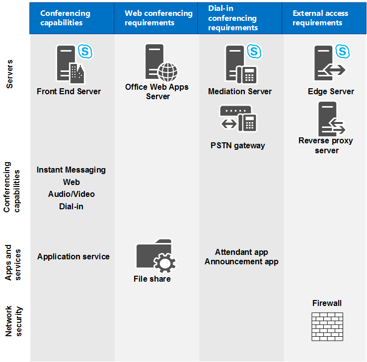

# Requisitos de hardware e software para conferências no Skype for Business ServerHardware and software requirements for conferencing in Skype for Business Server

**Resumo:** Leia este tópico para saber mais sobre os requisitos de hardware e software para conferências no Skype for Business Server.**Summary:** Read this topic to learn about hardware and software requirements for conferencing in Skype for Business Server.

Esta seção descreve os requisitos de hardware e software para webconferências, conferências de áudio e vídeo (A/V), conferência discada e conferência por IM (mensagens instantâneas).This section describes the hardware and software requirements for web conferencing, audio and video (A/V) conferencing, dial-in conferencing, and instant messaging (IM) conferencing. Todos os recursos de conferência são executados em Servidores Front-End; há requisitos adicionais para diferentes tipos de conferência, conforme mostrado no diagrama a seguir.All conferencing capabilities run on Front End Servers; there are additional requirements for different types of conferencing, as shown in the following diagram.

Por exemplo, se você quiser permitir a conferência discada, será necessário implantar um servidor de mediação e um gateway para se conectar à rede telefônica pública comutada (PSTN).For example, if you want to allow dial-in conferencing, you'll need to deploy a Mediation Server and a gateway for connecting to the public switched telephone network (PSTN). Se você quiser permitir a Webconferência, será necessário garantir que o Skype for Business Server possa se conectar a um servidor do Office Web Apps.If you want to allow web conferencing, you'll need to ensure Skype for Business Server can connect to an Office Web Apps Server. Se você quiser permitir que usuários externos participem de conferências, será necessário implantar um Servidor de Borda.If you want to allow external users to participate in conferences, you'll need to deploy an Edge Server.

**Funcionalidades e requisitos de conferência****Conferencing capabilities and requirements**

 Para obter mais informações sobre as considerações de topologia, consulte [planejar a topologia de conferência para o Skype for Business Server](conferencing-topology.md).For more information about topology considerations, see [Plan your conferencing topology for Skype for Business Server](conferencing-topology.md).

## Requisitos de hardware e software para Servidores Front-EndHardware and software requirements for Front End Servers

Como a Webconferência, conferência A/V, conferência discada e conferência de mensagens instantâneas estão todas posicionadas com o servidor front-end, os requisitos de hardware e software do servidor são os mesmos para os servidores front-end.Because web conferencing, A/V conferencing, dial-in conferencing, and IM conferencing are all collocated with the Front End Server, the server hardware and software requirements are the same as for the Front End Servers. Para obter detalhes sobre esses requisitos, consulte [requisitos do servidor para o Skype for Business server 2015](../../plan-your-deployment/requirements-for-your-environment/server-requirements.md) e [requisitos ambientais para o Skype for Business Server 2015](../../plan-your-deployment/requirements-for-your-environment/environmental-requirements.md) ou [requisitos do servidor para o Skype for Business Server 2019](../../../SfBServer2019/plan/system-requirements.md).For details about these requirements, see [Server requirements for Skype for Business Server 2015](../../plan-your-deployment/requirements-for-your-environment/server-requirements.md) and [Environmental requirements for Skype for Business Server 2015](../../plan-your-deployment/requirements-for-your-environment/environmental-requirements.md) or [Server requirements for Skype for Business Server 2019](../../../SfBServer2019/plan/system-requirements.md).

## Requisitos de webconferênciaRequirements for web conferencing

Se você optou por habilitar a webconferência, será necessário planejar:If you have chosen to enable web conferencing, you need to plan for the following:

- O acesso ao repositório de arquivos, usado para armazenar conteúdo de webconferências.Access to the file store, which is used for storing web conferencing content.

- Integração com o Servidor do Office Web Apps, necessária para compartilhar arquivos do PowerPoint durante uma conferência.Integration with Office Web Apps Server, which is necessary in order to share PowerPoint files during a conference.

### Repositório de ArquivosFile Store

O serviço de conferência da Web do Skype for Business Server armazena conteúdo compartilhado durante reuniões no repositório de arquivos.The Skype for Business Server web conferencing service stores content shared during meetings in the file store. Como parte da implantação, você deve especificar um compartilhamento de arquivos a ser usado como o repositório de arquivos para o servidor Standard Edition ou o pool Front-end da edição Enterprise.As part of deployment, you must specify a file share to be used as the file store for the Standard Edition server or Enterprise Edition Front End pool. É possível usar um compartilhamento de arquivos existente para o repositório de arquivos ou definir um novo especificando o FQDN (nome de domínio totalmente qualificado) do servidor de arquivos no qual o compartilhamento de arquivos deve estar localizado e um nome de pasta para o novo compartilhamento de arquivos.You can use an existing file share for the file store, or you can specify a new file share by specifying the fully qualified domain name (FQDN) of the file server on which the file share is to be located and a folder name for the new file share. Para obter mais informações, consulte [criar um compartilhamento de arquivos no Skype for Business Server](../../deploy/install/create-a-file-share.md).For more information, see [Create a file share in Skype for Business Server](../../deploy/install/create-a-file-share.md). O serviço de webconferências criptografa o conteúdo antes de armazená-lo no repositório de arquivos.The web conferencing service encrypts the content before it stores the content in the file store.

O Skype for Business Server oferece suporte ao uso de compartilhamentos de arquivos em DAS (armazenamento de conexão direta) ou de uma SAN, incluindo o sistema de arquivos distribuído (DFS) e um conjunto redundante de discos independentes (RAID) para armazenamentos de arquivos.Skype for Business Server supports using file shares on either direct attached storage (DAS) or a storage area network (SAN), including Distributed File System (DFS), and on a redundant array of independent disks (RAID) for file stores. Depois que o assistente de implantação do Skype for Business Server tiver definido o local do compartilhamento de arquivos, o Skype for Business Server criará uma estrutura de pastas dentro do compartilhamento de arquivos semelhante a:After the Skype for Business Server Deployment Wizard has defined the location of the file share, Skype for Business Server creates a folder structure within the file share similar to:

- 1-ApplicationServer-11-ApplicationServer-1

- 1-CentralMgmt-11-CentralMgmt-1

- 1-WebServices-11-WebServices-1

  - CollabContentCollabContent

  - CollabMetadataCollabMetadata

  - DataConfDataConf

O serviço de webconferências então armazena conteúdo como slides do PowerPoint, quadros de comunicações, votações e anexos nas pastas CollabContent e CollabMetadata, localizadas na pasta WebServices.The web conferencing service then stores content such as PowerPoint slides, whiteboards, polls, and attachments in the CollabContent and CollabMetadata folders, located in the WebServices folder.

### Servidor Office Web AppsOffice Web Apps Server

Para usar os recursos de webconferência, você deve instalar o Office Web Apps Server e configurar o Skype for Business Server para se comunicar com o servidor do Office Web Apps.In order to use web conferencing capabilities, you must install Office Web Apps Server and configure Skype for Business Server to communicate with Office Web Apps Server.

O Office Web Apps Server deve ser instalado em um computador autônomo que não esteja executando o Skype for Business Server, SQL Server ou qualquer outro aplicativo de servidor.Office Web Apps Server should be installed on a stand-alone computer that is not running Skype for Business Server, SQL Server, or any other server application. (Você não deve ter qualquer versão do Office instalada nesse computador.) Qualquer computador usado para executar o Office Web Apps Server também deve ter um conjunto específico de softwares instalado (incluindo .NET Framework 4,5 e Windows PowerShell 3,0).(You must not have any version of Office installed on that computer.) Any computer used to run Office Web Apps Server must also have a specific set of software installed (including .NET Framework 4.5 and Windows PowerShell 3.0). Esses requisitos, juntamente com informações sobre a configuração de certificados e serviços de informações da Internet (IIS), são discutidos em detalhes no [site de implantação do Microsoft Office Web Apps](https://go.microsoft.com/fwlink/p/?linkid=257525).These requirements, along with information about configuring certificates and Internet Information Services (IIS), are discussed in detail in the [Microsoft Office Web Apps Deployment website](https://go.microsoft.com/fwlink/p/?linkid=257525).

Para obter informações sobre como configurar o Skype for Business Server para trabalhar com o servidor do Office Web Apps, consulte [Configurar a integração com o servidor do Office Web Apps no Skype for Business Server](../../deploy/deploy-conferencing/office-web-app-server.md).For information about how to configure Skype for Business Server to work with Office Web Apps Server, see [Configure integration with Office Web Apps Server in Skype for Business Server](../../deploy/deploy-conferencing/office-web-app-server.md).

## Requisitos para conferência de áudio e vídeoRequirements for audio and video conferencing

Para planejar a conferência A/V, você precisa saber a largura de banda de rede necessária para o tipo de mídia de conferência que sua organização requer.To plan for A/V conferencing, you need to understand the network bandwidth required by the type of conferencing media that your organization requires. Isso pode incluir áudio, vídeo e vídeo panorâmico.This could include audio, video, and panoramic video. Sem largura de banda suficiente, a experiência do usuário pode ser gravemente prejudicada.Without sufficient network bandwidth, the user experience may be severely degraded.

Para obter informações sobre planejamento de funcionalidades de áudio e vídeo para conferências, consulte [Plan network requirements for Skype for Business](../../plan-your-deployment/network-requirements/network-requirements.md).For information about audio and video capacity planning for conferences, see [Plan network requirements for Skype for Business](../../plan-your-deployment/network-requirements/network-requirements.md).

Você pode usar o controle de admissão de chamadas (CAC) para gerenciar a largura de banda de rede usada por uma conferência A/V.You can use call admission control (CAC) to manage the network bandwidth used by A/V conferencing. Isso é importante para redes restritas, como links limitados de largura de banda entre sites centrais e filiais.This is important for restricted networks, such as limited bandwidth links between central and branch sites. Para obter detalhes, consulte [planejar o controle de admissão de chamadas no Skype for Business Server](../../plan-your-deployment/enterprise-voice-solution/call-admission-control.md).For details, see [Plan for call admission control in Skype for Business Server](../../plan-your-deployment/enterprise-voice-solution/call-admission-control.md).

Se você implantar uma conferência de áudio na sua rede, os usuários precisarão de dispositivos de áudio, como fones de ouvido, para participar de uma conferência.If you deploy audio conferencing in your network, your users will need audio devices such as headsets to participate in an audio conference. Se você implantar conferência de vídeo, precisará implantar dispositivos de vídeo, como webcams para usuários.If you deploy video conferencing, you need to deploy video devices, such as webcams for users. Para os dispositivos de áudio e vídeo, a implantação e o treinamento do usuário são etapas importantes a considerar.For both audio and video devices, device deployment and user training are important steps for you to consider. Para obter mais informações, consulte [plano para clientes e dispositivos](../../plan-your-deployment/clients-and-devices/clients-and-devices.md).For more information, see [Plan for clients and devices](../../plan-your-deployment/clients-and-devices/clients-and-devices.md). Para garantir uma experiência ideal ao usuário, a Microsoft recomenda que você use dispositivos de comunicações unificadas (UC) certificados pela Microsoft para todos os tipos de dispositivos.Microsoft recommends that you use unified communications (UC) devices that are certified by Microsoft for all device types, to ensure an optimal user experience. Para obter detalhes sobre dispositivos certificados pela UC, consulte [telefones e dispositivos do Skype for Business](https://go.microsoft.com/fwlink/?LinkId=619916).For details about UC-certified devices, see [Phones and devices for Skype for Business](https://go.microsoft.com/fwlink/?LinkId=619916).

## Requisitos para conferência discadaRequirements for dial-in conferencing

A conferência discada é um recurso opcional da carga de trabalho de conferência do Skype for Business Server que inclui diversos componentes.Dial-in conferencing is an optional feature of the Skype for Business Server conferencing workload that includes a variety of components. Alguns dos componentes são específicos para conferência discada e alguns são componentes do Enterprise Voice.Some of the components are specific to dial-in conferencing and some are Enterprise Voice components. Esta seção descreve os requisitos para os componentes necessários para a conferência discada.This section describes the requirements for the components that are needed for dial-in conferencing. Para obter detalhes sobre os requisitos do gateway do servidor de mediação e da rede telefônica pública comutada (PSTN), consulte [componente do servidor de mediação no Skype for Business Server](../../plan-your-deployment/enterprise-voice-solution/mediation-server.md) e [implantação de um servidor de mediação no construtor de topologias no Skype for Business Server](../../deploy/deploy-enterprise-voice/deploy-a-mediation-server.md).For details about Mediation Server and public switched telephone network (PSTN) gateway requirements, see [Mediation Server component in Skype for Business Server](../../plan-your-deployment/enterprise-voice-solution/mediation-server.md) and [Deploy a Mediation Server in Topology Builder in Skype for Business Server](../../deploy/deploy-enterprise-voice/deploy-a-mediation-server.md).

### Componentes necessáriosRequired components

Você precisará instalar os seguintes componentes do servidor do Skype for Business antes de poder configurar a conferência discada:You will need to install the following Skype for Business Server components before you can configure dial-in conferencing:

- UCAS (Unified Communications Application Service) (chamado de  Serviço de Aplicativos)Unified Communications Application Service (UCAS) (called the Application service)

- Aplicativo Atendedor de ConferênciaConferencing Attendant application

- Aplicativo Comunicado de ConferênciaConferencing Announcement application

- Página da Web Configurações de Conferência DiscadaDial-in Conferencing Settings webpage

- Pelo menos um Servidor de Mediação e pelo menos um gateway PSTNAt least one Mediation Server and at least one PSTN gateway

Para conferência discada, serviço de aplicativo, aplicativo atendedor de conferência e aplicativo de anúncio de conferência têm os mesmos requisitos de sistema operacional que os servidores front-end.For dial-in conferencing, Application service, Conferencing Attendant application, and Conferencing Announcement application have the same operating system requirements as Front End Servers. Para obter mais detalhes, consulte [Server requirements for Skype for Business Server 2015](../../plan-your-deployment/requirements-for-your-environment/server-requirements.md).For details, see [Server requirements for Skype for Business Server 2015](../../plan-your-deployment/requirements-for-your-environment/server-requirements.md).

Aplicativo de atendedor de conferência o aplicativo de anúncio de conferência requer que o tempo de execução do Windows Media Format seja instalado em servidores front-end.Conferencing Attendant application and Conferencing Announcement application require that Windows Media Format Runtime is installed on Front End Servers. O Windows Media Format é exigido para reproduzir arquivos WMA (Windows Media Audio) que são usados para músicas em espera, nomes gravados e prompts.Windows Media Format Runtime is required to play Windows Media audio (WMA) files that are used for music on hold, recorded names, and prompts. Se estiver instalando no Windows Server 2012 ou no Windows Server 2012 R2 (que recomendamos), você precisará instalar o Microsoft Media Foundation para obter o tempo de execução do Windows Media Format.If you are installing on Windows Server 2012 or Windows Server 2012 R2 (which we recommend), you'll need to install Microsoft Media Foundation to get Windows Media Format Runtime. Se você estiver instalando em qualquer versão do Windows Server antes do Windows 2012, precisará certificar-se de que o Windows Desktop Experience está instalado para obter o Windows Media Format Runtime.If you are installing on any version of Windows Server prior to Windows 2012, you need to make sure the Windows Desktop Experience is installed to get Windows Media Format Runtime.

### Requisitos de arquivo de áudio para conferência discadaAudio file requirements for dial-in conferencing

O Skype for Business Server não é compatível com a personalização de prompts de voz e música para conferência discada.Skype for Business Server does not support customization of voice prompts and music for dial-in conferencing. No entanto, se você tiver uma forte necessidade empresarial que exija a alteração dos arquivos de áudio padrão, consulte o artigo 961177 da base de dados de conhecimento Microsoft, [como personalizar prompts de voz ou arquivos de música para conferências de áudio](https://go.microsoft.com/fwlink/p/?linkid=3052&amp;kbid=961177)discadas.However, if you have a strong business need that requires you to change the default audio files, see Microsoft Knowledge Base article 961177, [How to customize voice prompts or music files for dial-in audio conferencing](https://go.microsoft.com/fwlink/p/?linkid=3052&amp;kbid=961177).

Você também pode usar o utilitário de gerenciamento de [solicitações de voz personalizado do Microsoft Lync Server Attendant](https://go.microsoft.com/fwlink/p/?LinkId=396880) , que permite aos administradores substituir as solicitações de voz padrão usadas quando um chamador de telefone ingressar em uma reunião do Skype for Business com avisos personalizados para fornecer uma experiência de entrada de reunião diferente.You can also use the [Microsoft Lync Server Conferencing Attendant Custom Voice Prompts](https://go.microsoft.com/fwlink/p/?LinkId=396880) management utility, which enables administrators to replace the default voice prompts used when a phone caller joins a Skype for Business meeting with custom prompts to provide a different meeting entry experience. Os prompts de voz personalizados podem ser instalados em um servidor Enterprise ou Standard Edition.The custom voice prompts can be installed on either an Enterprise or Standard Edition server.

Aplicativo de atendedor de conferência o aplicativo de anúncio de conferência tem os seguintes requisitos para músicas em espera, nomes gravados e arquivos de prompt de áudio:Conferencing Attendant application and Conferencing Announcement application have the following requirements for music on hold, recorded name, and audio prompt files:

- Formato de arquivo WMA (áudio do Windows Media)Windows Media Audio (WMA) file format

- 16 bits mono16-bit mono

- 48 kbps 2-pass CBR (taxa de bits constante)48 kbps 2-pass CBR (constant bit rate)

- Nível da fala a -24 DBSpeech level at -24DB

### Requisitos do usuário para conferência discadaUser requirements for dial-in conferencing

Os usuários de conferências discadas devem ter um número de telefone ou extensão exclusivos atribuídos à respectiva conta.Dial-in conferencing users must have a unique phone number or extension assigned to their account. Este requisito oferece suporte à autenticação durante a conferência discada.This requirement supports authentication during dial-in conferencing. Usuários corporativos (ou seja, os usuários que têm credenciais de serviços de domínio Active Directory e contas do Skype for Business Server dentro de sua organização) inserem o número de telefone (ou ramal) e um número de identificação pessoal (PIN) para discar para conferências como um usuário autenticado.Enterprise users (that is, users who have Active Directory Domain Services credentials and Skype for Business Server accounts within your organization) enter their phone number (or extension) and a personal identification number (PIN) to dial in to conferences as an authenticated user.

## Requisitos de porta para conferênciaPort requirements for conferencing

Para poder usar os recursos de conferência, o Skype for Business Server exige que determinadas portas estejam abertas.In order to use the conferencing features, Skype for Business Server requires that certain ports are open. A tabela a seguir lista requisitos de porta para conferência.The following table lists port requirements for conferencing. Para obter detalhes sobre todos os requisitos de portabilidade, consulte [requisitos de protocolo e porta para servidores](../../plan-your-deployment/network-requirements/ports-and-protocols.md).For details about all port requirements, see [Port and protocol requirements for servers](../../plan-your-deployment/network-requirements/ports-and-protocols.md).

**Portas de servidor necessárias****Required server ports**

|**Função de servidor****Server role**|**Nome do serviço****Service name**|**Porta****Port**|**Protocolo****Protocol**|**Observações****Notes**|
|:-----|:-----|:-----|:-----|:-----|
|Servidores Front-EndFront End Servers    |Serviço de conferência de mensagens instantâneas do Skype for Business ServerSkype for Business Server IM Conferencing service    |50625062    |TCPTCP    |Usado para solicitações SIP de entrada para conferência de IM (mensagem instantânea).Used for incoming SIP requests for instant messaging (IM) conferencing.    |
|Servidores Front-EndFront End Servers    |Serviço do Skype for Business Server Web de WebconferênciaSkype for Business Server Web Conferencing service    |80578057    |TCP (TLS)TCP (TLS)    |Usada para escutar conexões PSOM (Modelo de Objeto Compartilhado Persistente) do cliente.Used to listen for Persistent Shared Object Model (PSOM) connections from client.    |
|Servidores Front-EndFront End Servers    |Serviço de compatibilidade de conferência da Web do Skype for Business ServerSkype for Business Server Web Conferencing Compatibility service    |80588058    |TCP (TLS)TCP (TLS)    |Usado para ouvir conexões do modelo de objeto compartilhado persistente (PSOM) do cliente de reunião ao vivo e versões anteriores do Skype for Business Server.Used to listen for Persistent Shared Object Model (PSOM) connections from the Live Meeting client and previous versions of Skype for Business Server.    |
|Servidores Front-EndFront End Servers    |Serviço de conferência de áudio/vídeo do Skype for Business ServerSkype for Business Server Audio/Video Conferencing service    |50635063    |TCPTCP    |Usada para solicitações SIP de entrada para conferência de áudio/vídeo (A/V).Used for incoming SIP requests for audio/video (A/V) conferencing.    |
|Servidores Front-EndFront End Servers    |Serviço de conferência de áudio/vídeo do Skype for Business ServerSkype for Business Server Audio/Video Conferencing service    |57501-6553557501-65535    |TCP/UDPTCP/UDP    |Intervalo de porta de mídia usado para videoconferência.Media port range used for video conferencing.    |
|Servidores Front-EndFront End Servers    |Serviço de atendedor de conferência do Skype for Business Server (conferência discada)Skype for Business Server Conferencing Attendant service (dial-in conferencing)    |50645064    |TCPTCP    |Usada para solicitações SIP de entrada para conferência discada.Used for incoming SIP requests for dial-in conferencing.    |
|Servidores Front-EndFront End Servers    |Serviço de atendedor de conferência do Skype for Business Server (conferência discada)Skype for Business Server Conferencing Attendant service (dial-in conferencing)    |50725072    |TCPTCP    |Usado para solicitações SIP de entrada do atendente (discagem por conferência).Used for incoming SIP requests for Attendant (dial in conferencing).    |
|Servidores Front-EndFront End Servers    |Serviço de compartilhamento de aplicativos do Skype for Business ServerSkype for Business Server Application Sharing service    |50655065    |TCPTCP    |Usada para solicitações de escuta do SIP de entrada para compartilhamento de aplicativos.Used for incoming SIP listening requests for application sharing.    |
|Servidores Front-EndFront End Servers    |Serviço de compartilhamento de aplicativos do Skype for Business ServerSkype for Business Server Application Sharing service    |49152-6553549152-65535    |TCPTCP    |Intervalo de porta de mídia usado para compartilhamento de aplicativo.Media port range used for application sharing.    |
|Servidores Front-EndFront End Servers    |Serviço de anúncio de conferências do Skype for Business ServerSkype for Business Server Conferencing Announcement service    |50735073    |TCPTCP    |Usado para solicitações SIP recebidas para o serviço de anúncio de conferência do Skype for Business Server (ou seja, para conferência discada).Used for incoming SIP requests for the Skype for Business Server Conferencing Announcement service (that is, for dial-in conferencing).    |
|Todos os servidores internosAll internal servers    |VáriosVarious    |49152-5750049152-57500    |TCP/UDPTCP/UDP    |Intervalo de porta de mídia usada para audioconferência em todos os servidores internos.Media port range used for audio conferencing on all internal servers. Usado por todos os servidores que terminam o áudio: servidores front-end (para serviço de atendedor de conferência do Skype for Business Server, serviço de anúncio de conferência do Skype for Business Server e serviço de conferência de áudio/vídeo do Skype for Business Server) e Servidor de mediação.Used by all servers that terminate audio: Front End Servers (for Skype for Business Server Conferencing Attendant service, Skype for Business Server Conferencing Announcement service, and Skype for Business Server Audio/Video Conferencing service), and Mediation Server.    |
|Servidor Office Web AppsOffice Web Apps Servers    ||443443    ||Usado pelo Skype for Business Server para se conectar ao servidor do Office Web Apps.Used by Skype for Business Server to connect to Office Web Apps Server.    |

**Portas de cliente necessárias****Required client ports**

|**Porta****Port**|**Protocolo****Protocol**|**Observações****Notes**|
|:-----|:-----|:-----|
|443443    |TCP (PSOM/TLS)TCP (PSOM/TLS)    |Usada para acesso de usuário externo às sessões de webconferência.Used for external user access to web conferencing sessions.    |
|443443    |TCP (STUN/MSTURN)TCP (STUN/MSTURN)    |Usada para acesso de usuário externa às sessões de A/V e mídia (TCP)Used for external user access to A/V sessions and media (TCP)    |
|34783478    |UDP (STUN/MSTURN)UDP (STUN/MSTURN)    |Usada para acesso de usuário externo às sessões de A/V e mídia (UDP)Used for external user access to A/V sessions and media (UDP)    |
|1024-65535\*1024-65535 \*    |TCP/UDPTCP/UDP    |Intervalo de porta de áudio (mínimo de 20 portas necessárias)Audio port range (minimum of 20 ports required)    |
|1024-65535\*1024-65535 \*    |TCP/UDPTCP/UDP    |Intervalo de porta de vídeo (mínimo de 20 portas necessárias).Video port range (minimum of 20 ports required).    |
|1024-65535\*1024-65535 \*    |TCPTCP    |Compartilhamento de aplicativos.Application sharing.    |

