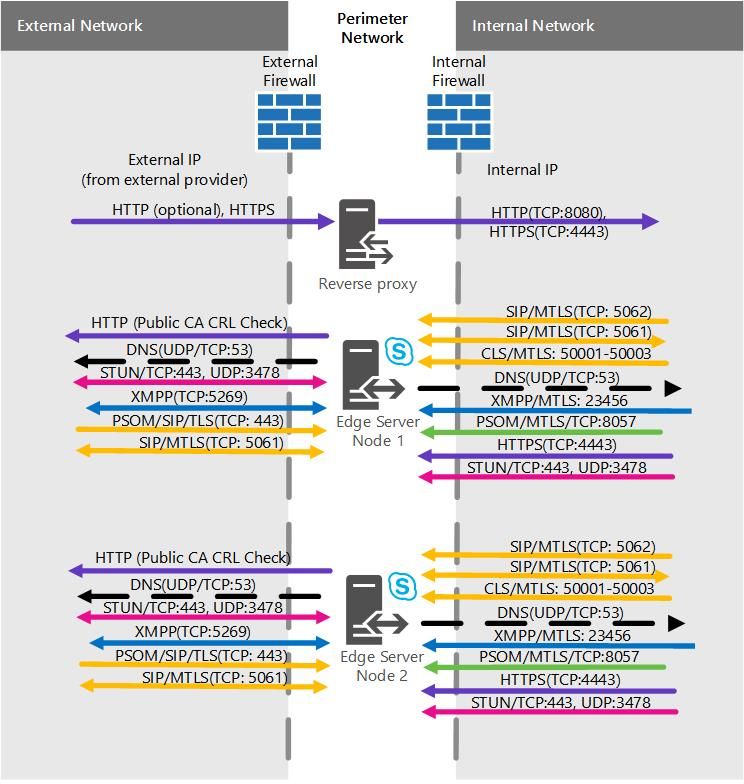

# Cenários de servidor de borda no Skype para Business ServerEdge Server scenarios in Skype for Business Server
 
**Resumo:** Examine esses cenários para ajudá-lo a planejar sua topologia de servidor de borda no Skype Business Server.**Summary:** Review these scenarios to help you plan your Edge Server topology in Skype for Business Server.
  
Temos alguns diagramas de cenários para auxiliar com visualizando e decidir sobre qual Skype para topologia de servidor de borda do servidor de negócios que você deseja implementar.We have some scenarios diagrams to assist with visualizing and deciding on what Skype for Business Server Edge Server topology you want to implement. Depois de escolher um bom candidato, você pode ler mais informações sobre quais requisitos ambientais serão necessários.Once you've picked a good candidate, you can go read up on the environmental requirements you'll need to address. Os seguintes são aplicados a qualquer um dos cenários, por isso, vamos mencioná-los primeiro.The following is applicable to any of the scenarios, so we're mentioning it first.
  
Estes números, mostrados apenas para fins de exemplo (e, como tal, contêm dados IPv4 e IPv6 de exemplo), não representam o fluxo de comunicação real, mas uma visualização de alto nível de seu tráfego possível. Os detalhes da porta também podem ser observados nos diagramas de porta de cada cenário abaixo.These figures, which are shown for example purposes only (and as such contains sample IPv4 and IPv6 data), don't represent the actual communication flow, but rather a high-level view of your possible traffic. Port details can also be seen in the Port diagrams for each scenario below.
  
Os diagramas mostram .com para a interface externa e .net para a interna, que também é material de amostra. Suas entradas podem ser bem diferentes na criação de seu próprio plano de Borda final.The diagrams show .com for the external interface and .net for the internal, which is also sample material; of course your own entries may be quite different when you're putting together your own final Edge plan.
  
Não incluímos o Diretor (que é um componente opcional) em qualquer um dos diagramas, mas você pode ler sobre que separadamente (mencionado em outros tópicos de planejamento).We don't include the Director (which is an optional component) in any of the diagrams, but you can read about that separately (it's mentioned in other Planning topics).
  
Conforme observado acima, há dados IPv6 de amostra nos esquemas.As noted above, there is sample IPv6 data in the diagrams. A maioria da documentação no [plano para implantações de servidor de borda no Skype para Business Server](edge-server-deployments.md) fará referência ao IPv4, mas você certamente é suportados, se você quiser usar o IPv6.Most of the documentation in [Plan for Edge Server deployments in Skype for Business Server](edge-server-deployments.md) will refer to IPv4, but you are certainly supported if you want to use IPv6. Observe que você precisará endereços IPv6 em seu espaço de endereços atribuído e lá eles precisarão funcionar com endereços internos e externos, assim como os IPs IPv4.Note that you'll need IPv6 addresses in your assigned address space, and they'll need to work with internal and external addressing, as with IPv4 IPs. É possível, graças ao Windows, usar  o recurso de pilha dupla, que é uma pilha de rede separada e distinta para IPv4 e IPv6.You can, thanks to Windows, employ the dual stack feature, which is a separate and distinct network stack for IPv4 and IPv6. Se for necessário, isso permitirá que você atribua endereços IPv4 e IPv6 ao mesmo tempo.This will, if you need, allow you to assign IPv4 and IPv6 addresses concurrently.
  
Existem dispositivos NAT que permitem NAT64 (IPv6 para IPv4) e NAT66 (IPv6 para IPv6)), e isso é válido para uso com Skype para Business Server.There are NAT devices that allow for NAT64 (IPv6 to IPv4) and NAT66 (IPv6 to IPv6)), and this is valid for use with Skype for Business Server.
  
> [!IMPORTANT]
> Se você estiver usando o serviço de controle de admissão de chamadas (CAC), é preciso usar IPv4 na interface interna para que ele funcione.If you're using Call Admission Control (CAC) you do have to use IPv4 on the internal interface for it to work. 
  
## Único consolidado Skype para servidor de borda do servidor de negócios com endereços IP de privados e NATSingle consolidated Skype for Business Server Edge Server with private IP addresses and NAT

Com este cenário, não há opção para alta disponibilidade. Isso significa que você gastará menos no hardware e terá uma implantação mais simples. Se alta disponibilidade for necessária, verifique os cenários consolidados em escala abaixo.With this scenario, there is no option for high availability. This will mean you spend less on hardware and have a simpler deployment. If high availability is a must, check out the Scaled consolidated scenarios below.
  

  
### Diagrama de portaPort diagram

Também temos um diagrama para portas para servidores de borda consolidada única.We also have a diagram for ports for single consolidated Edge Servers.
  

  
## Único consolidado Skype para servidor de borda do servidor de negócios com endereços IP públicosSingle consolidated Skype for Business Server Edge Server with public IP addresses

Com este cenário, não há opção para alta disponibilidade. Isso significa que você gastará menos no hardware e terá uma implantação mais simples. Se alta disponibilidade for necessária, verifique os cenários consolidados em escala abaixo.With this scenario, there is no option for high availability. This will mean you spend less on hardware and have a simpler deployment. If high availability is a must, check out the Scaled consolidated scenarios below.
  

  
### Diagrama de portaPort diagram

Também temos um diagrama para portas para servidores de borda consolidada única.We also have a diagram for ports for single consolidated Edge Servers.
  

  
## Skype consolidada em escala para o pool de borda do servidor de negócios, com o DNS de carga balanceamento e particulares endereços IP e NATScaled consolidated Skype for Business Server Edge pool, with DNS load balancing, and private IP addresses and NAT

Com este cenário, você poderá ter alta disponibilidade em sua implantação de Borda, o que oferece vantagens de escalabilidade e suporte a failover.With this scenario, you are able to have high availability in your Edge deployment, which gives you the advantages of scalability and failover support.
  

  
### Diagrama de portaPort diagram

Também temos um diagrama para pools de borda consolidados em escala com balanceamento de carga DNS.We also have a diagram for scaled consolidated Edge pools with DNS load balancing.
  

  
## Os endereços IP públicos e balanceamento de carga do Skype consolidada em escala para o pool de borda do servidor de negócios, com DNSScaled consolidated Skype for Business Server Edge pool, with DNS load balancing and public IP addresses

Com este cenário, você poderá ter alta disponibilidade em sua implantação de Borda, o que oferece vantagens de escalabilidade e suporte a failover.With this scenario, you are able to have high availability in your Edge deployment, which gives you the advantages of scalability and failover support.
  

  
### Diagrama de portaPort diagram

Também temos um diagrama para pools de borda consolidados em escala com balanceamento de carga DNS.We also have a diagram for scaled consolidated Edge pools with DNS load balancing.
  

  
## Dimensionada consolidada Skype para pool de borda do servidor de negócios, com balanceamento de carga de hardwareScaled consolidated Skype for Business Server Edge pool, with hardware load balancing

Com este cenário, você poderá ter alta disponibilidade em sua implantação de Borda, o que oferece vantagens de escalabilidade e suporte a failover.With this scenario, you are able to have high availability in your Edge deployment, which gives you the advantages of scalability and failover support.
  

  
### Diagrama de portaPort diagram

Também temos um diagrama para pools de borda consolidados em escala com balanceamento de carga de hardwareWe also have a diagram for scaled consolidated Edge pools with hardware load balancing
  

  

