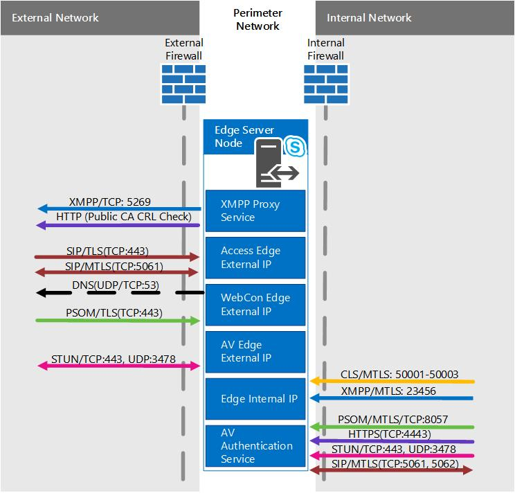

# Cenários do servidor de borda no Skype for Business Server
 
**Resumo:** Revise esses cenários para ajudá-lo a planejar a topologia do servidor de borda no Skype for Business Server.
  
Temos alguns diagramas de cenários para auxiliar na visualização e na decisão sobre qual topologia do servidor de borda do Skype for Business Server você deseja implementar. Depois de escolher um bom candidato, você pode ler mais informações sobre quais requisitos ambientais serão necessários. Os seguintes são aplicados a qualquer um dos cenários, por isso, vamos mencioná-los primeiro.
  
Estes números, mostrados apenas para fins de exemplo (e, como tal, contêm dados IPv4 e IPv6 de exemplo), não representam o fluxo de comunicação real, mas uma visualização de alto nível de seu tráfego possível. Os detalhes da porta também podem ser observados nos diagramas de porta de cada cenário abaixo.
  
Os diagramas mostram .com para a interface externa e .net para a interna, que também é material de amostra. Suas entradas podem ser bem diferentes na criação de seu próprio plano de Borda final.
  
Não incluímos o diretor (que é um componente opcional) em qualquer um dos diagramas, mas você pode ler sobre isso separadamente (ele é mencionado em outros tópicos de planejamento).
  
Conforme observado acima, há dados IPv6 de amostra nos esquemas. A maior parte da documentação do [plano para implantações do servidor de borda no Skype for Business Server](edge-server-deployments.md) se refere a IPv4, mas você certamente terá suporte se quiser usar o IPv6. Observe que você precisará endereços IPv6 em seu espaço de endereços atribuído e lá eles precisarão funcionar com endereços internos e externos, assim como os IPs IPv4. É possível, graças ao Windows, usar  o recurso de pilha dupla, que é uma pilha de rede separada e distinta para IPv4 e IPv6. Se for necessário, isso permitirá que você atribua endereços IPv4 e IPv6 ao mesmo tempo.
  
Há dispositivos NAT que permitem NAT64 (IPv6 a IPv4) e NAT66 (IPv6 para IPv6)) e são válidos para uso com o Skype for Business Server.
  
> [!IMPORTANT]
> Se você estiver usando o serviço de controle de admissão de chamadas (CAC), é preciso usar IPv4 na interface interna para que ele funcione. 
  
## Servidor de borda único do Skype for Business Server consolidado com endereços IP privados e NAT

Com este cenário, não há opção para alta disponibilidade. Isso significa que você gastará menos no hardware e terá uma implantação mais simples. Se alta disponibilidade for necessária, verifique os cenários consolidados em escala abaixo.
  

  
### Diagrama de porta

Também temos um diagrama para portas para servidores Single Edge consolidados.
  

  
## Servidor de borda único do Skype for Business Server consolidado com endereços IP públicos

Com este cenário, não há opção para alta disponibilidade. Isso significa que você gastará menos no hardware e terá uma implantação mais simples. Se alta disponibilidade for necessária, verifique os cenários consolidados em escala abaixo.
  

  
### Diagrama de porta

Também temos um diagrama para portas para servidores Single Edge consolidados.
  

  
## Conjunto de bordas do Skype for Business Server consolidado com balanceamento de carga de DNS e endereços IP privados e NAT

Com este cenário, você poderá ter alta disponibilidade em sua implantação de Borda, o que oferece vantagens de escalabilidade e suporte a failover.
  

  
### Diagrama de porta

Também temos um diagrama para pools de bordas consolidadas em escala com balanceamento de carga de DNS.
  

  
## Pool de bordas do Skype for Business Server consolidado com dimensionamento de carga de DNS e endereços IP públicos

Com este cenário, você poderá ter alta disponibilidade em sua implantação de Borda, o que oferece vantagens de escalabilidade e suporte a failover.
  

  
### Diagrama de porta

Também temos um diagrama para pools de bordas consolidadas em escala com balanceamento de carga de DNS.
  

  
## Conjunto de bordas do Skype for Business Server consolidado com balanceamento de carga de hardware

Com este cenário, você poderá ter alta disponibilidade em sua implantação de Borda, o que oferece vantagens de escalabilidade e suporte a failover.
  

 
