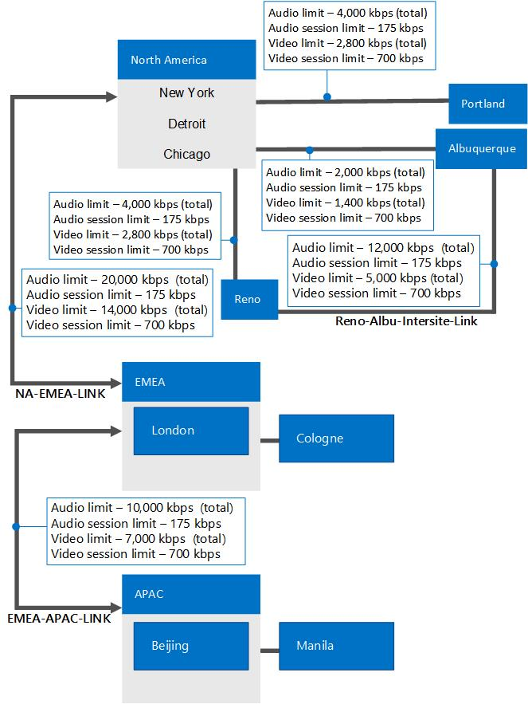

# Planejar o controle de admissão de chamada no Skype for Business Server

Saiba mais sobre o controle de admissão de chamada, que pode evitar chamadas de ocorrendo se eles teriam qualidade de mídia ruim, Skype para Business Server Enterprise Voice.

Para aplicativos baseados em IP, como telefonia, vídeo e compartilhamento de aplicativos, a largura de banda disponível das redes empresariais geralmente não é considerada um fator limitante nos ambientes de LAN. Entretanto, nos links WAN que interconectam locais, a largura de banda de rede pode ser limitada.

Quando o tráfego de rede sobrecarrega um link WAN, mecanismos atuais, como enfileiramento, armazenamento em buffer e remoção de pacotes são usados para resolver o congestionamento. O tráfego extra é normalmente atrasado até que o congestionamento de rede melhore ou, se necessário, o tráfego seja removido. No caso de tráfego de dados convencional nessas situações, o cliente receptor pode se recuperar. Entretanto, para o tráfego em tempo real, como comunicações unificadas, o congestionamento da rede não pode ser resolvido dessa maneira, uma vez que o tráfego das comunicações unificadas é sensível à latência e à perda de pacotes. O congestionamento na WAN pode resultar em uma QoE (Qualidade da Experiência) ruim para os usuários finais. Para o tráfego em tempo real em condições congestionadas, é melhor negar as chamadas do que permitir conexões com qualidade ruim.

Controle de admissão de chamadas (CAC) determina se existe largura de banda suficiente para estabelecer uma sessão em tempo real de qualidade aceitável. No Skype para Business Server, o CAC controla o tráfego somente de áudio e vídeo em tempo real, mas ela não afeta o tráfego de dados. Se o caminho WAN padrão não tiver a largura de banda necessária, o CAC pode tentar rotear a chamada por meio de um caminho de Internet ou da rede telefônica pública comutada (PSTN).

Esta seção descreve a funcionalidade de controle de admissão de chamada e explica como planejar CAC.

> [!NOTE]
> Skype para Business Server tem três recursos avançados do Enterprise Voice: chamadas (CAC) do controle de admissão, serviços de emergência (E9-1-1) e bypass de mídia. Para obter uma visão geral do planejamento de informações que são comuns a todos os três desses recursos, consulte [configurações de rede para os recursos avançados do Enterprise Voice no Skype para Business Server](network-settings-for-advanced-features.md).

O design CAC em Skype para Business Server oferece quatro principais atributos:

- É simple de implantar e gerenciar, sem a necessidade de equipamentos adicionais, como roteadores especialmente configurados.

- Ele lida com casos de uso de comunicação unificada crítico, como usuários móveis e vários pontos de presença. Políticas CAC são impostas de acordo com a qual o ponto de extremidade está localizado, não é onde o usuário está hospedado.

- Além das chamadas de voz, ele pode ser aplicado a outro tráfego, como chamadas de vídeo e sessões de conferência de áudio/vídeo.

- Oferece flexibilidade para habilitar a representação de diversos tipos de topologias de rede.

Se uma nova voz ou uma sessão de vídeo exceder os limites de largura de banda que você definiu em um link WAN, a sessão está bloqueada ou (para apenas chamadas telefônicas) roteada para a PSTN.

CAC controla o tráfego em tempo real para voz e vídeo somente. Ele não controla o tráfego de dados.

Os administradores definem as políticas CAC, que são impostas pelo serviço de política de largura de banda que é instalado com cada pool de Front-End. Configurações de CAC automaticamente sejam propagadas para Skype todos para os servidores de Front End Business Server em sua rede.

Para chamadas que falham devido a políticas CAC, a ordem de precedência para o redirecionamento de chamada é da seguinte maneira:

1. Internet

2. PSTN

3. Caixa postal

Registro de detalhes da chamada (CDR) captura informações sobre as chamadas são redirecionadas para o PSTN ou para a caixa postal. CDR não captura informações sobre as chamadas são roteadas para a Internet, como a Internet é tratada como um caminho alternativo em vez de uma opção secundária.

> [!NOTE]
> Os depósitos de correio de voz não serão negados devido a restrições de largura de banda.

O serviço de política de largura de banda gera dois tipos de arquivos de log no formato de (CSV) de valores separados por vírgulas. O arquivo de log de **falhas de verificação** captura informações quando a largura de banda solicitações serão negadas. O arquivo de log de **utilização do link** captura um instantâneo da topologia da rede e a utilização de largura de banda do link de WAN. Ambos os arquivos de log podem ajudá-lo a suas políticas CAC com base na utilização de ajuste fino.

## Considerações de controle de admissão de chamada

O administrador seleciona para instalar o serviço de política de largura de banda no primeiro pool configurado no site central. Como há um único site central por região de rede, há apenas um serviço de política de largura de banda por região de rede, que gerencia a política de largura de banda para essa região, seus sites associados e os links para esses sites. O serviço de política de largura de banda é executado como parte dos servidores Front-End e, portanto, a alta disponibilidade é interna dentro desse pool. O serviço de política de largura de banda em execução em cada servidor Front-End sincroniza a cada 15 segundos. Se o pool de Front-End falhar, políticas CAC são impostas para esse site não são mais até o pool de Front-End e consequentemente o serviço de política de largura de banda estiver novamente operacional. Isso significa que todas as chamadas serão efetuadas enquanto durar que o serviço de política de largura de banda está fora de serviço. Portanto, há a possibilidade de assinaturas em excesso largura de banda dos seus links durante este período

O serviço de política de largura de banda fornece alta disponibilidade em um pool de Front-End; No entanto, ele não fornece redundância em pools de Front-End. O serviço de política de largura de banda não é possível o failover de um pool de Front-End para outro. Depois que o serviço para o pool de Front-End é restaurado, o serviço de política de largura de banda é reiniciado e podem impor verificações de política de largura de banda novamente.

### Considerações de rede

Embora a restrição de largura de banda de áudio e vídeo é imposta pelo serviço de política de largura de banda no Skype para Business Server, essa restrição não é imposta no roteador da rede (camada 2 e 3). CAC não pode impedir que um aplicativo de dados, por exemplo, consumindo a largura de banda de rede inteira em um link WAN, incluindo a largura de banda reservada para áudio e vídeo por sua política CAC. Para proteger a largura de banda necessária em sua rede, você pode implantar um protocolo de qualidade de serviço (QoS) como DiffServ (serviços diferenciados). Portanto, é uma prática recomendada coordenar as políticas de largura de banda CAC que definir com quaisquer configurações de QoS que podem ser implantados.

### Mídia e sinalização de caminhos através de VPN

Se sua empresa oferece suporte a mídia por meio da VPN, certifique-se de que tanto tanto o fluxo de mídia e o fluxo de sinalização acesse via VPN ou ambos são roteados através da internet. Por padrão, a mídia e sinalização fluxos passam pelo túnel VPN.

### Controle de admissão de chamada de usuários externos

Controle não é imposta além dos limites do Skype para a organização Business Server de admissão de chamada. CAC não pode ser aplicado ao tráfego de mídia atravessando a Internet, que não é gerenciada por Skype para Business Server. Verificações CAC serão realizadas na parte da chamada que chegam através da rede corporativa, se o ponto de extremidade chamado pertence à organização e o servidor de borda foi adicionado à configuração de rede, conforme descrito em [controle de admissão de chamada implantação: lista de verificação final do Skype para Business Server](../../deploy/deploy-enterprise-voice/final-checklist.md). Se o ponto de extremidade chamado não pertence à organização, como um federado ou PIC usuário, nenhuma política de largura de banda são executadas verificações e a chamada de saída irá ignorar qualquer restrição de CAC.

### Controle de admissão de chamada das conexões PSTN

Controle de admissão de chamada é aplicável no servidor de mediação, independentemente se ele está conectado a um IP/PBX, um gateway PSTN ou um tronco SIP. Como o servidor de mediação é um agente de usuário em frente e verso (B2BUA), ele termina de mídia. Ele tem dois lados de conexão: um lado que esteja conectado a Skype para Business Server e um lado do gateway, que é conectado ao gateways PSTN, IP/PBXs ou troncos SIP. Para obter detalhes sobre conexões PSTN, consulte [Planejar a conectividade PSTN em Skype para Business Server](pstn-connectivity-0.md).

CAC pode ser imposto em ambos os lados do servidor de mediação, a menos que o desvio de mídia está habilitado. Se o desvio de mídia está habilitado, o tráfego de mídia não atravessa o servidor de mediação, mas em vez disso fluirá diretamente entre o Skype para o cliente de negócios e o gateway. Nesse caso, o CAC não é necessária. Para obter detalhes, consulte [Plan for mídia que o desvio Skype para negócios](media-bypass.md).

A figura a seguir ilustra como o CAC é aplicado em conexões PSTN com e sem o bypass de mídia habilitado.

**Aplicação de controle de admissão de chamada em conexões para o PSTN**

## Definindo seus requisitos para o controle de admissão de chamada

Planejando o controle de admissão de chamadas (CAC) requer informações detalhadas sobre sua topologia de rede empresarial. Para ajudar a planejar suas políticas de controle de admissão de chamada, siga estas etapas.

1. Identifique os hubs/backbones (chamados de regiões de rede) dentro de sua rede corporativa.

2. Identifique os escritórios ou locais (chamados sites de rede) dentro de cada região de rede.

3. Determine a rota de rede entre cada par de regiões de rede.

4. Determine os limites de largura de banda para cada link WAN.

    > [!NOTE]
    > Limites de largura de banda consultem quanto da largura de banda em um link WAN que é alocado para o Enterprise Voice e o tráfego de áudio/vídeo. Quando um link WAN é descrito como "largura de banda restrita", o link de WAN tem um limite de largura de banda é menor que o tráfego de pico esperado por cima do link.

5. Identifique as subredes de IP que são atribuídas a cada site de rede.

Para explicar esses conceitos, usaremos a topologia de rede de exemplo mostrada na figura a seguir.

**Exemplo de topologia para o controle de admissão de chamadas**

> [!NOTE]
> Todos os sites de rede estão associados uma região de rede. Por exemplo, Portland, Reno e Albuquerque estão incluídos na região da América do Norte. Nessa figura, links de WAN apenas que têm políticas CAC aplicadas são mostrados, com os limites de largura de banda. Os sites de rede de Chicago, Nova York e Detroit são mostrados dentro do oval da região da América do Norte, porque eles não estão com restrição de largura de banda e, portanto, não exigem políticas CAC.

Os componentes dessa topologia de exemplo são explicados nas seções a seguir. Para obter detalhes sobre como essa topologia foi planejada, incluindo os limites de largura de banda, consulte [exemplo: coletando os requisitos para o controle de admissão de chamada no Skype para Business Server](example-gathering-requirements.md).

### Identifique as regiões de rede

Uma região de rede representa um backbone de rede ou um hub de rede.

Um hub ou backbone de rede é uma parte da infra-estrutura de rede do computador que interconexão diferentes partes da rede, fornecendo um caminho para a troca de informações entre diferentes LANs ou sub-redes. Um backbone pode unir diversas redes de um pequeno local para uma área geográfica largo. Capacidade do backbone é normalmente maior do que as redes que se conectam a ela.

Nosso exemplo de topologia têm três regiões de rede: América do Norte, EMEA e APAC. Uma região de rede contém uma coleção de sites de rede (consulte a definição de sites de rede neste tópico). Trabalhar com sua equipe de operações de rede para identificar as regiões de rede.

### Associando um Site Central de cada região de rede

CAC exige que um Skype para o site central de Business Server é definido para cada região de rede. O site central é selecionado com a melhor conectividade de rede e maior largura de banda a todos os outros sites dentro dessa região de rede. O exemplo anterior da topologia de rede mostra três regiões de rede, cada um com um site central que gerencia as decisões de CAC. Do exemplo anterior, a associação apropriada é mostrada na tabela a seguir.

> [!NOTE]
> Sites central não correspondem necessariamente aos sites de rede. Os exemplos desta documentação, alguns sites central — Chicago, Londres e Pequim — compartilhar o mesmo nome que os sites de rede. No entanto, mesmo se um site central e o site de rede compartilham o mesmo nome, o site central é um elemento do Skype para topologia de servidor de negócios, enquanto o site de rede é uma parte da rede geral no qual o Skype para a topologia Business Server reside.

**Regiões de rede, sites centrais e sites de rede**

|**Região de rede**|**Site central**|**Sites de rede**|
|:-----|:-----|:-----|
|América do Norte    |Chicago    |Chicago    Nova York    Detroit    Portland    Reno    Albuquerque    |
|EMEA    |Londres    |Londres    Colônia    |
|APAC    |Pequim    |Pequim    Manila    |

### Identificar os Sites de rede

Um site de rede representa um local onde a sua organização tem um local físico — por exemplo, escritórios, um conjunto de prédios ou um campus. Um local físico com uma LAN e WAN de tem conectividade com outros sites é considerada um site de rede. Iniciar o inventário de todos os escritórios da sua organização. No nosso exemplo de topologia, a região de rede América do Norte consiste nos seguintes sites de rede: Nova York, Chicago, Detroit, Portland, Reno e Albuquerque.

Você deve associar cada site de rede com uma região de rede. Dependendo se o site de rede possui um link WAN restrito, uma política de largura de banda é associada ao site de rede. Para obter detalhes sobre políticas CAC e a largura de banda que você alocar usando-los, consulte "Definir políticas de largura de banda" mais adiante neste tópico. Para configurar o CAC, associar sites de rede com regiões de rede e, em seguida, você pode criar diretivas de alocação de largura de banda a ser aplicada às conexões de largura de banda restrita entre um determinado site ou a região e as conexões WAN entre os sites e regiões.

### Identificar os Links de rede

Links de rede representam conexões WAN físico que os links de sites e diferentes regiões. No nosso exemplo de topologia, há dois links de rede regional, cinco links de rede entre regiões e sites e um link de rede entre dois sites.

Os dois links regionais estão entre América do Norte e EMEA, representado como NA-EMEA-LINK e entre APAC e EMEA, representados como EMEA-APAC-LINK.

Os links de site são indicados pelas linhas conectando Portland, Reno e Albuquerque para a região da América do Norte, Manila à região APAC e colônia à região EMEA. A linha entre Reno e Albuquerque mostra um link de rede direta entre esses dois sites.

### Definir políticas de largura de banda

Trabalhar com sua equipe de operações de rede para determinar quanta largura de banda WAN está disponível para o tráfego de vídeo e áudio em tempo real entre os links WAN em sua organização. Políticas de largura de banda geralmente são aplicadas a links WAN se o uso de largura de banda é restrito; ou seja, se ela deve ser maior do que a largura de banda que pode ser alocada para modalidades de áudio e vídeos.

Políticas de largura de banda do CAC definem a largura de banda máxima que pode ser reservada para as modalidades de vídeo e de áudio em tempo real. Desde que o CAC não limitar a largura de banda de outro tráfego, ele não pode impedir que outros tráfegos de dados como uma transferência de arquivos grandes, música streaming de usar o backup de todos os a largura de banda de rede.

Políticas de largura de banda do CAC podem definir qualquer um ou todos os seguintes itens:

- Total largura de banda máxima alocada para áudio.

- Banda total máxima alocada para vídeo.

- Largura de banda máxima alocada para uma única chamada de áudio (sessão).

- Largura de banda máxima alocada para uma única chamada de vídeo (sessão).

> [!NOTE]
> Todos os valores de largura de banda do CAC representam os limites de largura de banda máxima *unidirecional* .

> [!NOTE]
> O Skype para recursos de diretiva de voz do Business Server oferecem a capacidade de substituir a política de largura de banda verifica as chamadas de entrada para o usuário (não para chamadas de saída feitas pelo usuário). Depois que a sessão for estabelecida, o consumo de largura de banda será precisamente contabilizado. Esta configuração deve ser usada com moderação. Para obter detalhes, consulte [criar ou modificar uma política de voz e configurar registros de uso PSTN no Skype para negócios](../../deploy/deploy-enterprise-voice/voice-policy-and-pstn-usage-records.md) ou [modificar uma política de voz e configurar registros de uso do PSTN](https://technet.microsoft.com/library/6c53aaf5-218b-4bd4-8cea-31bc9d53f1bd.aspx) na documentação de implantação.

Para otimizar a utilização de largura de banda em uma base por sessão, considere o tipo de codecs de áudio e vídeos que serão usados. Em particular, evite a alocação de largura de banda insuficiente para um codec que você espera que a serem usados com frequência. De modo oposto, se você deseja impedir a mídia usando um codec que exige mais largura de banda, você deve definir a largura de banda máxima por sessão baixa o suficiente para evitar que tal uso. Para áudio, nem todo codec está disponível para todos os cenários. Por exemplo:

- Chamadas de áudio ponto a ponto entre Skype para pontos de extremidade de negócios usarão RTAudio (8kHz) ou RTAudio (16kHz) quando você fator na largura de banda e priorização de codecs.

- Chamadas de conferência entre Skype para pontos de extremidade de negócios e de A / o serviço de conferência V usará 722 ou Siren.

- Chamadas para a rede telefônica pública comutada (PSTN) para ou do Skype para pontos de extremidade de negócios usarão 711 ou RTAudio (8kHz).

Use a tabela a seguir para ajudar a otimizar as configurações de largura de banda máxima por sessão.

**Utilização de largura de banda por codecs**

|**Codec**|**Requisito de largura de banda com nenhuma correção de erro antecipada (FEC)**|**Requisito de largura de banda com correção de erro antecipada (FEC)**|
|:-----|:-----|:-----|
|RTAudio (8kHz)    |49,8 kbps    |61.6 kbps    |
|RTAudio (16kHz)    |67 kbps    |96 kbps    |
|Siren    |57,6 kbps    |73.6 kbps    |
|G.711    |102 kbps    |166 kbps    |
|G.722    |105.6 kbps    |169.6 kbps    |
|RTVideo (CIF 15 fps)    |260 kbps    |Não aplicável    |
|RTVideo (VGA 30 fps)    |610 kbps    |Não aplicável    |

> [!NOTE]
> Requisitos de largura de banda levam em sobrecarga de conta para o seguinte: Ethernet II, IP, protocolo de datagrama de usuário (UDP), RTP (protocolo de transporte em tempo real) e SRTP (protocolo de transporte em tempo real de seguro). Eles também incluem 10 kbps para sobrecarga RTCP.

722.1 e Siren é semelhantes, mas oferecem diferentes taxas de bits.

G. 722, o codec padrão para Skype para conferências Business Server, é completamente diferente dos 722.1 e Siren.

O codec Siren é usado Skype para Business Server nas seguintes situações:

- Se a política de largura de banda está definida como muito baixa para 722 seja usado.

- Se um cliente do Communications Server 2007 ou do Communications Server 2007 R2 se conecta a um Skype para o serviço de conferência Business Server (porque os clientes não suportam o codec g. 722).

**Utilização de largura de banda por cenário**

|**Cenário**|**Requisito de largura de banda otimizado por quantidade (kbps)**|**Requisito de largura de banda para modo balanceado (kbps)**|**Requisito de largura de banda otimizado por qualidade (kbps)**|
|:-----|:-----|:-----|:-----|
|Chamadas de áudio ponto a ponto    |45 kbps    |62 kbps    |91 kbps    |
|Chamadas de conferência    |53 kbps    |101 kbps    |165 kbps    |
|Chamadas PSTN (entre Skype para negócios e o gateway PSTN, com ignorar mídia)    |kbps 97    |kbps 97    |161 kbps    |
|Chamadas PSTN entre (Skype for Business) e o servidor de mediação, sem ignorar mídia    |45 kbps    |kbps 97    |161 kbps    |
|Chamadas PSTN (entre o servidor de mediação e gateway PSTN, sem ignorar mídia)    |kbps 97    |kbps 97    |161 kbps    |
|Chama do Skype para empresas - Polycom    |101 kbps    |101 kbps    |101 kbps    |

### Identifique as subredes IP

Para cada site de rede, você precisará trabalhar com o administrador da rede para determinar quais subredes IP são atribuídos a cada site de rede. Se seu administrador de rede já organizou as subredes IP em regiões de rede e sites de rede, seu trabalho fica muito mais simples.

No nosso exemplo, o site de Nova York na região da América do Norte é atribuído as seguir subredes IP: 172.29.80.0/23, 157.57.216.0/25, 172.29.91.0/23, 172.29.81.0/24. Vamos supor que Bob, que geralmente funciona em Detroit, é encaminhado para o escritório de Nova York para treinamento. Quando ele ativa no seu computador e conecta-se à rede, o seu computador receberá um endereço IP em um dos quatro intervalos reservados para Nova York, por exemplo, 172.29.80.103.

> [!CAUTION]
> As subredes de IP especificadas durante a configuração de rede no servidor devem corresponder o formato fornecido pelos computadores cliente para ser usado de forma adequada para bypass de mídia. Um Skype para o cliente de negócios leva seu endereço IP local e mascara o endereço IP com a máscara de sub-rede associada. Ao determinar a ID de desvio associado a cada cliente, o registrador irá comparar a lista de subredes IP associados a cada site de rede contra a sub-rede fornecida pelo cliente para uma correspondência exata. Por este motivo, é importante que as subredes inseridas durante a configuração de rede no servidor sejam subredes reais ao invés de subredes virtuais. (Se implantar o controle de admissão de chamada, mas o bypass de mídia não, o controle de admissão de chamada funcionará corretamente, mesmo se você configurar o virtuais sub-redes.) Por exemplo, se um cliente entra em um computador com um endereço IP de 172.29.81.57 com uma máscara de sub-rede do IP de 255.255.255.0, Skype para negócios solicitará o ID de desvio associado à sub-rede 172.29.81.0. Se a subrede for definida como 172.29.0.0/16, embora o cliente pertença à subrede virtual, o Registrador não irá considerar uma correspondência porque ele está procurando especificamente pela subrede 172.29.81.0. Portanto, é importante que o administrador insere sub-redes exatamente como fornecidos pela Skype para clientes corporativos (que são provisionados com sub-redes durante a configuração de rede estática ou pelo DHCP.)

## Práticas recomendadas para controle de admissão de chamada

Para aprimorar o desempenho e facilitar a implantação, aplique as seguintes práticas recomendadas ao implantar o controle de admissão de chamada:

- Certifique-se de que as WANs estejam adequadamente provisionadas para tráfego de mídia atual e antecipado.

    > [!NOTE]
    > Recomendamos que você fator em um buffer para seus limites de largura de banda. Existem cenários, como as condições de corrida que afetam a largura de banda total usada e podem resultar em situações em que o limite de largura de banda for excedido. Por exemplo, se duas chamadas tentarem iniciar enquanto o tráfego de mídia está se aproximando um limite de largura de banda, um deles pode ser negado porque o outro gerenciado para iniciar primeiro.

- Monitorar o uso da rede e registros de detalhe de chamada para que você pode escolher configurações de CAC ótimas e atualizá-LAS como uso da rede muda.

- Use políticas de largura de banda CAC para complementar as configurações de QoS.

- Se você deseja rotear novamente bloqueadas chamadas para a PSTN, verifique se a capacidade e a funcionalidade PSTN. Para obter detalhes, consulte [Planejamento saída roteamento de chamadas.](https://technet.microsoft.com/library/37c55fa4-175a-4190-b9e4-c2e5ac7b9261.aspx)

    > [!NOTE]
    > Capacidade refere-se ao número de portas que precisam ser abertas para oferecer suporte a possível reroteamento do PSTN.

