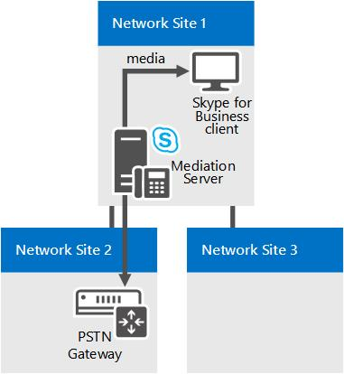

# Componentes e topologias para controle de admissão de chamada em Skype for Business

Planejando o controle de admissão de chamada (CAC) se você tiver uma rede MPLS, um tronco SIP ou um gateway PSTN de terceiros ou PBX. Aplica-se Skype for Business Server Enterprise Voice.

Os tópicos nesta seção fornecem informações sobre considerações especiais para implantar o CAC (controle de admissão de chamada) com vários tipos de topologias de rede.

## Controle de admissão de chamada em uma rede MPLS

Em uma rede de Comutação de Rótulo Multiprotocolo (MPLS), todos os sites são conectados por uma malha completa. Isto é, todos os sites são conectados diretamente à nuvem MPLS, e cada site é provisionado com largura de banda a ser usada em um link WAN para a nuvem MPLS. Não existe hub de rede nem local central para controlar o roteamento IP. A figura abaixo mostra uma rede simples com base na tecnologia MPLS.

**Exemplo de rede MPLS**

Para implantar um controle de admissão de chamada (CAC) em uma rede MPLS, é preciso criar uma região de rede para representar a nuvem MPLS, bem como criar um site de rede para representar cada site de satélite MPLS. A figura a seguir ilustra como a região de rede e os sites de rede devem ser configurados para representar a rede MPLS de exemplo na figura anterior. Os limites gerais da largura de banda e os limites de sessão da largura de banda têm base na capacidade do link WAN a partir de cada site de rede até a região de rede que representa a nuvem MPLS.

**Região de rede e sites de rede para uma rede MPLS**

## Controle de admissão de chamada em um tronco SIP

Para implantar o controle de admissão de chamadas em um tronco SIP, crie um local de rede para representar o ITSP (provedor de serviço de telefonia da Internet). Para aplicar valores de política de largura de banda no tronco SIP, crie uma política entre locais entre o local de rede na sua empresa e o local de rede criado para representar o ITSP.

A figura a seguir mostra um exemplo de implantação do CAC em um tronco SIP.

**Configuração do CAC em um tronco SIP**

Para configurar o CAC em um tronco SIP, você terá que executar as seguintes tarefas durante a implantação do CAC:

1. Crie um site de rede para representar o ITSP. Associe o site de rede a uma região de rede apropriada e aloque a largura de banda de zero para áudio e vídeo para este site de rede. Para obter detalhes, consulte [Configure Network Sites for CAC](/previous-versions/office/lync-server-2013/lync-server-2013-configure-network-sites-for-cac) na documentação de implantação.

    > [!NOTE]
    > Para o ITSP, essa configuração de site de rede não funciona. Os valores da política de largura de banda são, na verdade, aplicados na etapa 2.

2. Crie um link entre sites para o tronco SIP usando os valores de parâmetro relevantes para o site criado na etapa 1. Por exemplo, use o nome do site de rede na sua empresa como o valor do parâmetro NetworkSiteID1 e o site de rede ITSP como o valor do parâmetro NetworkSiteID2. Para obter detalhes, [consulte Create network intersite policies in Skype for Business Server](../../deploy/deploy-enterprise-voice/create-network-intersite-policies.md) na documentação implantação e [New-CsNetworkInterSitePolicy](/powershell/module/skype/new-csnetworkintersitepolicy?view=skype-ps).

3. Obter o endereço IP do Ponto de Terminação de Mídia do Controlador de Borda de Sessão (SCB) de seu ITSP. Adicione o endereço IP com uma máscara de sub-rede de 32 para o site de rede que representa o ITSP. Para obter detalhes, consulte [Associate a Subnet with a Network Site](/previous-versions/office/lync-server-2013/lync-server-2013-associate-a-subnet-with-a-network-site).

## Controle de admissão de chamada com um gateway PSTN de terceiros ou PBX

Este tópico descreve exemplos de como o controle de admissão de chamadas (CAC) pode ser implantado no link entre a interface de gateway do Servidor de Mediação e um gateway PSTN (rede telefônica pública comutado) de terceiros ou pbx (private branch exchange).

### Caso 1: CAC entre o Servidor de Mediação e um gateway PSTN

O CAC pode ser implantado no link WAN da interface de gateway do Servidor de Mediação para um PBX ou gateway PSTN de terceiros.

**Caso 1: CAC entre o Servidor de Mediação e um gateway PSTN**

Neste exemplo, o CAC é aplicado entre o Servidor de Mediação e um gateway PSTN. Se um usuário Skype for Business cliente no Site da Rede 1 coloca uma chamada PSTN por meio do gateway PSTN no Site da Rede 2, a mídia flui através do link WAN. Portanto, duas verificações CAC são executadas para cada sessão PSTN:

- Entre o aplicativo Skype for Business cliente e o Servidor de Mediação

- Entre o Servidor de Mediação e o gateway PSTN

Isto funciona para as chamadas PSTN de entrada para um cliente no Local de Rede 1 e para chamadas PSTN de saída provenientes de um aplicativo cliente no Local de Rede 1.

> [!NOTE]
> Certifique-se de que a sub-rede do IP ao qual o gateway PSTN pertence está configurada e associada ao Local de Rede 2.

> [!NOTE]
> Certifique-se de que a sub-rede do IP à qual ambas as interfaces do Servidor de Mediação pertencem está configurada e associada ao Local de Rede 1.

> [!NOTE]
> Para obter detalhes, consulte [Associate a Subnet with a Network Site](/previous-versions/office/lync-server-2013/lync-server-2013-associate-a-subnet-with-a-network-site).

### Caso 2: CAC entre o Servidor de Mediação e um PBX de terceiros com Ponto de Terminação de Mídia

Esta configuração é similar ao Caso 1. Em ambos os casos, o Servidor de Mediação sabe qual dispositivo termina mídia no ponto oposto do link WAN e o endereço IP do gateway PSTN ou PBX com Ponto de Terminação de Mídia (MTP) está configurado no Servidor de Mediação como próximo salto.

**Caso 2: CAC entre o Servidor de Mediação e um PBX de terceiros com MTP**

Neste exemplo, o CAC é aplicado entre o Servidor de Mediação e o PBX/MTP. Se um usuário Skype for Business cliente no Site da Rede 1 faz uma chamada PSTN por meio do PBX/MTP localizado no Site da Rede 2, a mídia flui através do link WAN. Portanto, para cada sessão PSTN duas verificações CAC são executadas:

- Entre o aplicativo Skype for Business cliente e o Servidor de Mediação

- Entre o Servidor de Mediação e o PBX/MTP

Isto funciona para ambas, chamadas PSTN de entrada para um cliente no Local de Rede 1 e chamadas PSTN de saída provenientes de um cliente no Local de Rede 1.

> [!NOTE]
> Certifique-se de que a sub-rede do IP à qual o MTP pertence está configurada e associada ao Local de Rede 2.

> [!NOTE]
> Certifique-se de que a sub-rede do IP à qual ambas as interfaces do Servidor de Mediação pertencem está configurada e associada ao Local de Rede 1.

> [!NOTE]
> Para obter detalhes, consulte [Associate a Subnet with a Network Site](/previous-versions/office/lync-server-2013/lync-server-2013-associate-a-subnet-with-a-network-site).

### Caso 3: CAC entre o Servidor de Mediação e um PBX de terceiros sem um Ponto de Terminação de Mídia

O Caso 3 é um ligeiramente diferente dos dois primeiros. Se não houver MTP no PBX de terceiros para uma solicitação de sessão de saída para o PBX de terceiros, o Servidor de Mediação não saberá onde a mídia terminará no limite do PBX. Neste caso, a mídia flui diretamente entre o Servidor de Mediação e o dispositivo de ponto de extremidade de terceiros.

**Caso 3: CAC entre o Servidor de Mediação e um PBX de terceiros sem MTP**

Neste exemplo, se um usuário Skype for Business cliente no Site da Rede 1 faz uma chamada a um usuário por meio do PBX, o Servidor de Mediação poderá executar verificações de CAC somente na etapa proxy (entre o aplicativo cliente Skype for Business e o Servidor de Mediação). Como o Servidor de Mediação não tem informações sobre o dispositivo de ponto de extremidade enquanto a sessão está sendo solicitada, verificações CAC não podem ser executadas no link WAN (entre o Servidor de Mediação e um ponto de extremidade de terceiros) antes do estabelecimento da chamada. Depois que a sessão é estabelecida, no entanto, o Servidor de Mediação facilita na contabilização da largura de banda usada no tronco.

Para chamadas provenientes do ponto de extremidade de terceiros, a informação sobre este dispositivo está disponível no momento da solicitação da sessão e a verificação CAC pode ser executada em ambos os lados do Servidor de Mediação.

> [!NOTE]
> Certifique-se de que a sub-rede do IP à qual os dispositivos de ponto de extremidade pertencem está configurada e associada ao Local de Rede 2.

> [!NOTE]
> Certifique-se de que a sub-rede do IP à qual ambas as interfaces do Servidor de Mediação pertencem está configurada e associada ao Local de Rede 1.

> [!NOTE]
> Para obter detalhes, consulte [Associate a Subnet with a Network Site](/previous-versions/office/lync-server-2013/lync-server-2013-associate-a-subnet-with-a-network-site).