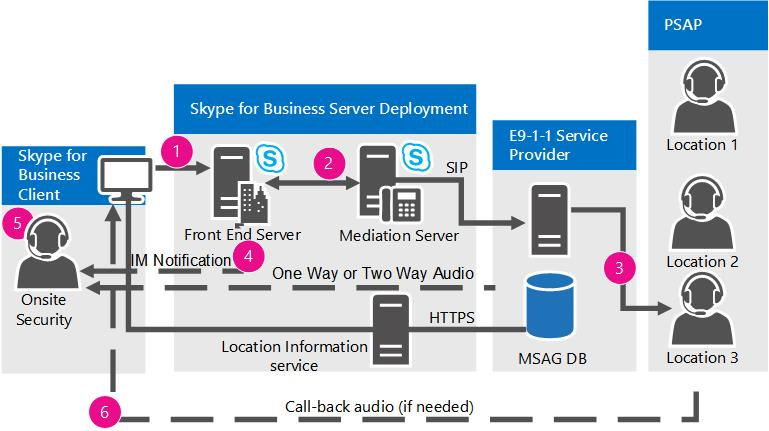

# Planejar serviços de emergência no Skype for Business ServerPlan for emergency services in Skype for Business Server

Saiba mais sobre os serviços do Enhanced 9-1-1 (E9-1-1) no Skype for Business Server Enterprise Voice, incluindo aquisição de local e roteamento de chamadas.Learn about Enhanced 9-1-1 (E9-1-1) services in Skype for Business Server Enterprise Voice, including location acquiring and call routing.

O Skype for Business Server oferece suporte a serviços Aprimorados 9-1-1 (E9-1-1) nos Estados Unidos como parte de uma implantação Enterprise Voice.Skype for Business Server supports Enhanced 9-1-1 (E9-1-1) services within the United States as part of an Enterprise Voice deployment. O E9-1-1 é um recurso de expedição de emergência que associa uma chamada 9-1-1 a um Local de Resposta de Emergência (ERL) que consiste em endereços cívicos (ou seja, rua) e outras informações de localização mais específicas, como números de piso, para chamadas de edifícios de escritórios e outras instalações multitenuantes.E9-1-1 is an emergency dispatch feature that associates a 9-1-1 call with an Emergency Response Location (ERL) that consists of civic (that is, street) addresses and other more specific location information, such as floor numbers, for calls from office buildings and other multitenant facilities. Usando o ERL fornecido, um PSAP (Ponto de Atendimento de Segurança Pública) pode despachar imediatamente os primeiros respondentes para o chamador em perigo com o risco reduzido de direcionar inadvertidamente o respondente para um local incorreto ou ambíguo.By using the provided ERL, a Public Safety Answering Point (PSAP) can immediately dispatch first responders to the caller in distress with reduced risk of inadvertently directing the responder to an incorrect or ambiguous location.

> [!NOTE]
> O Skype for Business Server agora dá suporte à configuração de vários números de emergência para um cliente.Skype for Business Server now supports the configuration of multiple emergency numbers for a client. Para obter mais informações, [consulte Plan for multiple emergency numbers in Skype for Business Server](multiple-emergency-numbers.md).For more information see [Plan for multiple emergency numbers in Skype for Business Server](multiple-emergency-numbers.md).

> [!NOTE]
> O Skype for Business Server tem três recursos avançados Enterprise Voice: controle de admissão de chamadas, serviços de emergência (E9-1-1) e bypass de mídia.Skype for Business Server has three advanced Enterprise Voice features: call admission control, emergency services (E9-1-1), and media bypass. Para obter uma visão geral das informações de planejamento que são comuns a todos esses três recursos, consulte [Configurações](network-settings-for-advanced-features.md)de rede para os recursos de Enterprise Voice avançados no Skype for Business Server .For an overview of planning information that is common to all three of these features, see [Network settings for the advanced Enterprise Voice features in Skype for Business Server](network-settings-for-advanced-features.md).

O Skype for Business Server oferece suporte a chamadas Aprimoradas 9-1-1 (E9-1-1) de clientes do Skype for Business e dispositivos Lync Phone Edition.Skype for Business Server supports Enhanced 9-1-1 (E9-1-1) calling from Skype for Business clients and Lync Phone Edition devices. Quando você configura o Skype for Business Server para e9-1-1, as chamadas de emergência feitas do Skype for Business ou do Lync Phone Edition incluem informações de Local de Resposta de Emergência (ERL) do banco de dados de serviço informações de local.When you configure Skype for Business Server for E9-1-1, emergency calls placed from Skype for Business or Lync Phone Edition include Emergency Response Location (ERL) information from the Location Information service database. ERLs são compostos por endereços cívicos (rua) e outras informações que ajudam a identificar um local mais preciso em escritórios em edifícios e em outras instalações com vários locatários.ERLs consist of civic (that is, street) addresses and other information that helps to identify a more precise location in office buildings and other multitenant facilities. Quando um usuário faz uma chamada de emergência, o Skype for Business Server encaminha o áudio da chamada, juntamente com as informações de local e retorno de chamada, por meio de um Servidor de Mediação para um provedor de serviços E9-1-1.When a user makes an emergency call, Skype for Business Server routes the call audio, along with the location and callback information, through a Mediation Server to an E9-1-1 service provider. O provedor de serviço E9-1-1 usa o endereço cívico do chamador para encaminhar a chamada ao PSAP (Ponto de atendimento público seguro) que atende ao local do chamador e envia também uma ESQK (Chave de consulta de serviço de emergência) que o PSAP usa para procurar o ERL do chamador.The E9-1-1 service provider uses the civic address of the caller to route the call to the Public Safety Answering Point (PSAP) that serves the caller's location, and sends along an Emergency Service Query Key (ESQK) that the PSAP uses to look up the caller's ERL.

O Skype for Business Server oferece suporte a dois métodos para rotear chamadas de emergência para um provedor de serviços E9-1-1:Skype for Business Server supports two methods for routing emergency calls to an E9-1-1 service provider:

- Uma conexão de tronco SIP com um provedor de serviço qualificado E9-1-1A Session Initiation Protocol (SIP) trunk connection to a qualified E9-1-1 service provider

- Um gateway ELIN (para um provedor de serviço E9-1-1 baseado em PSTN (Rede Telefônica Pública Comutada)An Emergency Location Identification Number (ELIN) gateway to a public switched telephone (PSTN)-based E9-1-1 service provider

Quando você usa um provedor de serviços E9-1-1 de tronco SIP, adiciona ERLs ao banco de dados de serviço Informações de Local e valida os locais em um MSAG (Guia de Endereços de Rua Mestre) que é mantido pelo provedor de serviços E9-1-1.When you use a SIP trunk E9-1-1 service provider, you add ERLs to the Location Information service database, and then validate the locations against a Master Street Address Guide (MSAG) that is maintained by the E9-1-1 service provider. Se um provedor de serviços E9-1-1 receber uma chamada que não tenha informações de local ou tiver um local que não tenha sido validado em relação ao MSAG, o provedor de serviços E9-1-1 roteia a chamada para um Centro de Resposta de Chamada de Emergência (ECRC) nacional/regional, que está com funcionários com funcionários especialmente treinados que obtém verbalmente o local do chamador, se possível, e roteia manualmente a chamada para o PSAP apropriado.If an E9-1-1 service provider receives a call that doesn't have location information or has a location that has not been validated against the MSAG, the E9-1-1 service provider routes the call to a national/regional Emergency Call Response Center (ECRC), which is staffed with specially trained personnel who verbally obtain the caller's location, if possible, and manually route the call to the appropriate PSAP. (Alguns provedores de serviço E9-1-1 de tronco SIP também fornecem aos clientes um DID (discagem direta interna) de PSTN ao ECRC, o que proporciona um meio alternativo de encaminhar as chamadas de 9-1-1, se um tronco SIP falhar por qualquer motivo).(Some SIP trunk E9-1-1 service providers also provide customers with a PSTN direct inward dialing (DID) number to the ECRC, which provides an alternate means of routing 9-1-1 calls, if the SIP trunk fails for any reason.)

Diferentemente dos telefones de multiplexação de divisão de tempo (TDM) e PBX (troca de filial privada baseada em IP), que têm locais fixos, um ponto de extremidade do Skype for Business pode ser muito móvel.Unlike time division multiplexing (TDM) and IP-based private branch exchange (PBX) phones, which have fixed locations, a Skype for Business endpoint can be very mobile. Quando você implanta o recurso E9-1-1, o Skype for Business Server ajuda a garantir que, independentemente de onde um chamador está localizado, a chamada de emergência pode ser roteada para o PSAP que atende ao local do chamador.When you deploy the E9-1-1 feature, Skype for Business Server helps to ensure that no matter where a caller is located, the emergency call can be routed to the PSAP that serves the caller's location. Por exemplo, se o escritório principal de um usuário estiver localizado em Redmond, Washington, mas o usuário faz uma chamada de emergência de um computador em uma filial em Wichita, No Estado do Kansas, o tronco SIP ou o provedor de serviços E9-1-1 baseado em PSTN encaminhará a chamada para o PSAP em Wichita, não para o PSAP em Redmond.For example, if a user's main office is located in Redmond, Washington, but the user places an emergency call from a computer in a branch office in Wichita, Kansas, the SIP trunk or PSTN-based E9-1-1 service provider will route the call to the PSAP in Wichita, not to the PSAP in Redmond.

Quando você usa um gateway ELIN, também adiciona ERLs ao banco de dados de serviço Informações de Local, mas também inclui um número ELIN para cada local.When you use an ELIN gateway, you also add ERLs to the Location Information service database, but you include also an ELIN number for each location. O número ELIN se torna o número de discagem de emergência durante a chamada de emergência.The ELIN number becomes the emergency calling number during the emergency call. Em seguida, é necessário certificar-se de que a operadora PSTN carrega os ELINs no banco de dados de ALI (Identificação automática de local).You must then make sure that your PSTN carrier uploads the ELINs to the Automatic Location Identification (ALI) database.

> [!NOTE]
> Os dispositivos analógicos conectados ao Skype for Business não podem receber informações de localização do serviço de Informações de Local ou transmitir o local para o provedor de serviços E9-1-1.Skype for Business-connected analog devices cannot receive location information from the Location Information service or transmit location to the E9-1-1 service provider.

 Se você usar a opção do provedor de serviço E9-1-1 do tronco SIP e precisar oferecer suporte ao E9-1-1 a partir de telefones analógicos, terá duas opções:If you use the SIP trunk E9-1-1 service provider option and need to support E9-1-1 from analog phones, you have two options:

- **Opção PS-ALI tradicional** Se você tiver gateways PSTN locais em cada site em que os telefones analógicos são implantados e cada telefone analógico tiver um DID, você poderá provisionar o local do dispositivo analógico diretamente com um provedor de serviço PS-ALI (Identificação de Local Automático/ Comutamento Particular).**Traditional PS-ALI option** If you have local PSTN gateways at each site where analog phones are deployed and each analog phone has a DID, you can provision the analog device's location directly with a Private Switch/Automatic Location Identification (PS-ALI) service provider. Nesse caso, você configura políticas de voz do Skype for Business especialmente elaboradas e as atribui aos objetos de contato do dispositivo analógico para que as chamadas E9-1-1 desses telefones roteiem diretamente pelo gateway local para o provedor PSTN que presta serviços ao site (em vez de rotear a chamada para um tronco SIP do provedor de serviços E9-1-1).In this case, you configure specially-crafted Skype for Business voice policies and assign them to the analog device contact objects so that E9-1-1 calls from those phones route directly through the local gateway to the PSTN provider that services the site (instead of routing the call to an E9-1-1 service provider SIP trunk). Quando uma chamada de emergência é feita, um banco de dados em um provedor PS-ALI associado ao tronco do PSTN mapeia o DID de cada telefone analógico para um local físico e fornece esse local ao PSAP.When an emergency call is placed, a database at a PS-ALI provider that is associated with the PSTN trunk maps the DID of each analog phone to a physical location and provides this location to the PSAP. Esses registros precisam ser atualizados com o provedor de serviço PS-ALI sempre que os telefones são movidos para ERLs diferentes.These records must be updated with the PS-ALI service provider every time phones are moved to different ERLs.

- Opção de provedor de **serviços E9-1-1** Você pode registrar os DIDs de telefone analógico e suas ERLs correspondentes com o provedor de serviços E9-1-1, se isso for suportado pelo provedor de serviços E9-1-1.**E9-1-1 service provider option** You can register the analog phone DIDs and their corresponding ERLs with the E9-1-1 service provider, if this is supported by the E9-1-1 service provider. Se o provedor receber uma chamada do Skype for Business Server que não inclua dados PIDF-LO, o provedor poderá ver se há uma combinação de banco de dados no número DID da parte de chamada.If the provider receives a call from Skype for Business Server that doesn't include PIDF-LO data, the provider can see if there is a database match on the calling party's DID number. Usando o ERL recuperado de seu banco de dados, o provedor pode roteá-la automaticamente para o PSAP correto, e o PSAP receberá o DID do dispositivo analógico e um registro ESQK que permite ao despachante procurar o local do chamador.By using the ERL retrieved from its database, the provider can automatically route the emergency call to the correct PSAP, and the PSAP will receive the DID of the analog device and an ESQK record that allows the dispatcher to lookup the caller's location.

Se você usar a opção de gateway ELIN e precisar oferecer suporte a E9-1-1 de telefones analógicos, é possível prover o local do dispositivo analógico diretamente com o provedor de serviços PS-ALI, como descrito na primeira opção acima.If you use the ELIN gateway option and need to support E9-1-1 from analog phones, you can provision the analog device's location directly with the PS-ALI service provider, as described in the first option above.

Da perspectiva do Skype for Business Server, o processo E9-1-1 pode ser separado em dois estágios:From a Skype for Business Server perspective, the E9-1-1 process can be separated into two stages:

- Estágio 1: adquirindo um localStage 1: Acquiring a location

- Estágio 2: roteando a chamada de emergência para um provedor de serviço E9-1-1Stage 2: Routing the emergency call to an E9-1-1 service provider

Esta seção descreve como esses estágios funcionam.This section describes how these stages work.

Se você planeja configurar sua infraestrutura para detectar automaticamente o local do cliente, primeiro você precisa decidir quais elementos de rede serão usados para mapear os chamadores aos locais.If you plan to configure your infrastructure to automatically detect client location, first you need to decide which network elements you will use to map callers to locations. Para obter detalhes sobre as opções possíveis, consulte [Define the network elements used to determine location in Skype for Business Server](network-location.md).For details about the possible options, see [Define the network elements used to determine location in Skype for Business Server](network-location.md).

## Adquirindo um localAcquiring a location

Em uma implantação do Skype for Business Server E9-1-1, cada cliente do Skype for Business ou do Lync Phone Edition conectado internamente adquire ativamente sua própria localização.In a Skype for Business Server E9-1-1 deployment, each internally-connected Skype for Business or Lync Phone Edition client actively acquires its own location. Após o registro SIP, o cliente fornece todas as informações de conectividade de rede que ele sabe sobre ela em uma solicitação de local para o serviço informações de local, que é um serviço Web com suporte de um banco de dados SQL Server replicado.After SIP registration, the client furnishes all the network connectivity information that it knows about itself it in a location request to the Location Information service, which is a web service backed by a replicated SQL Server database. Cada pool de sites central tem um serviço de Informações de Local, que usa as informações de rede para consultar seus registros para um local correspondente.Each central site pool has a Location Information service, which uses the network information to query its records for a matching location. Se houver uma combinação, o serviço Informações de Local retornará um local para o cliente.If there is a match, the Location Information service returns a location to the client. Se não houver uma correspondentes, pode ser solicitado que o usuário insira uma localização manualmente (dependendo das definições da política de localização).If there is not a match, the user may be prompted to enter a location manually (depending on location policy settings). Os dados de localização são transmitidos de volta para o cliente em um formato XML padronizado da IETF (Internet Engineering Task Force) chamado de PIDF-LO (Objeto de Local de Formato de Dados de Informação de Presença).The location data are transmitted back to the client in an Internet Engineering Task Force (IETF) standardized XML format called Presence Information Data Format Location Object (PIDF-LO).

O cliente skype for Business inclui os dados PIDF-LO como parte de uma chamada de emergência, e esses dados são usados pelo provedor de serviços E9-1-1 para determinar o PSAP apropriado e roteá-la para esse PSAP juntamente com o ESQK correto, o que permite ao despachante PSAP obter a localização do chamador.The Skype for Business client includes the PIDF-LO data as part of an emergency call, and this data is used by the E9-1-1 service provider to determine the appropriate PSAP and route the call to that PSAP along with the correct ESQK, which allows the PSAP dispatcher to obtain the caller's location.

O diagrama a seguir mostra como um cliente do Skype for Business adquire um local (exceto o método de localização baseado em endereço MAC do cliente de terceiros):The following diagram shows how a Skype for Business client acquires a location (except for the third-party client MAC address-based location method):

Para um cliente adquirir uma localização, as seguintes etapas devem ser executadas:For a client to acquire a location, the following steps must take place:

1. O administrador preenche o banco de dados de serviço informações de local com o mapa de rede (tabelas que mapeiam vários tipos de endereços de rede para ERLs (Locais de Resposta de Emergência) correspondentes).The administrator populates the Location Information service database with the network wiremap (tables that map various types of network addresses to corresponding Emergency Response Locations (ERLs)).

2. Se você usar um provedor de serviço E9-1-1 por tronco SIP, o administrador validará as partes do endereço residencial dos ERLs com um banco de dados MSAG (Guia principal de endereços de ruas) mantido pelo provedor de serviço E9-1-1. Se você usar um gateway ELIN, o administrador garantirá que a operadora da PSTN carregue os ELINs no banco de dados ALI (Identificação de local automática).If you use a SIP trunk E9-1-1 service provider, the administrator validates the civic address portions of the ERLs against a Master Street Address Guide (MSAG) database maintained by the E9-1-1 service provider. If you use an ELIN gateway, the administrator ensures that the PSTN carrier uploads the ELINs to the Automatic Location Identification (ALI) database.

3. Durante o registro ou sempre que ocorre uma alteração de rede, um cliente conectado internamente envia uma solicitação de local que contém os endereços de rede descobertos do cliente para o serviço informações de local.During registration or whenever a network change occurs, an internally-connected client sends a location request that contains the client's discovered network addresses to the Location Information service.

4. O serviço Informações de Local consulta seus registros publicados para um local e, se uma combinação for encontrada, retorna o ERL para o cliente no formato PIDF-LO.The Location Information service queries its published records for a location, and, if a match is found, returns the ERL to the client in PIDF-LO format.

## Roteamento de chamadas E9-1-1 usando um tronco SIPRouting E9-1-1 calls using a SIP trunk

Usar um tronco SIP para conectar-se a um provedor de serviço E9-1-1 qualificado é uma maneira que pode ser usada para implantar o E9-1-1.Using a SIP trunk to connect to a qualified E9-1-1 service provider is one way that you can deploy E9-1-1. Para obter detalhes sobre o uso de um gateway ELIN para conectar-se a um provedor de serviço E9-1-1 baseado na PSTN (rede telefônica pública comutada), consulte [Routing E9-1-1 Calls by Using an ELIN Gateway](/previous-versions/office/lync-server-2013/lync-server-2013-routing-e9-1-1-calls-by-using-an-elin-gateway).For details about using an ELIN gateway to connect to a public switched telephone network (PSTN)-based E9-1-1 service provider, see [Routing E9-1-1 Calls by Using an ELIN Gateway](/previous-versions/office/lync-server-2013/lync-server-2013-routing-e9-1-1-calls-by-using-an-elin-gateway).

O diagrama a seguir mostra como uma chamada de emergência é roteada do Skype for Business Server para o PSAP (Ponto de Atendimento de Segurança Pública) quando você usa um tronco SIP e um provedor de serviços E9-1-1 qualificado.The following diagram shows how an emergency call is routed from Skype for Business Server to the Public Safety Answering Point (PSAP) when you use a SIP trunk and qualified E9-1-1 service provider.

**Encaminhando chamadas do E9-1-1 por meio de um tronco SIP****Routing E9-1-1 calls through a SIP trunk**

Quando uma chamada de emergência é feita de um cliente compatível do Skype for Business Server:When an emergency call is placed from a compatible Skype for Business Server client:

1. Um SIP INVITE que contém o local, o número de retorno de chamada do chamador e a URL de notificação (opcional) e o número de retorno de chamada de conferência são roteados para o Skype for Business Server.A SIP INVITE that contains the location, the caller's callback number, and the (optional) Notification URL and conference callback number is routed to Skype for Business Server.

2. O Skype for Business Server corresponde ao número de emergência e encaminha a chamada (com base no valor de uso **PSTN** definido na política de local aplicável) para um Servidor de Mediação e, a partir daí, por um tronco SIP para o provedor de serviços E9-1-1.Skype for Business Server matches the emergency number and routes the call (based on the **PSTN Usage** value that is defined in the applicable location policy) to a Mediation Server, and from there, over a SIP trunk to the E9-1-1 service provider.

3. O provedor de serviços E9-1-1 encaminha as chamadas de emergência para o PSAP correto com base na localização que é fornecida com a chamada. Quando o cliente inclui um ERL (Local da resposta de emergência) com a chamada de emergência, o provedor automaticamente encaminha a chamada para o PSAP apropriado. Se a localização foi inserida manualmente pelo usuário, o ECRC (Centro de resposta de chamada de emergência) primeiro verifica verbalmente a precisão da localização com o chamador antes do encaminhamento da chamada de emergência para o PSAP.The E9-1-1 service provider routes the emergency call to the correct PSAP based on the location that is provided with the call. When the client includes a validated Emergency Response Location (ERL) with the emergency call, the provider automatically routes the call to the appropriate PSAP. If the location was manually entered by the user, the Emergency Call Response Center (ECRC) first verbally verifies the accuracy of the location with the caller before routing the emergency call to the PSAP.

4. Se você configurou a política de local para notificações, um ou mais agentes de segurança da sua organização receberão uma mensagem instantânea de notificação de emergência especial do Skype for Business.If you configured the location policy for notifications, one or more of your organization's security officers are sent a special Skype for Business emergency notification instant message. Essa mensagem sempre aparece nas telas dos agentes de segurança e contém o nome, o número de telefone, a hora e o local do chamador, permitindo que a equipe de segurança responda rapidamente ao chamador de emergência usando uma mensagem instantânea ou voz.This message always pops up on the security officers' screen(s) and contains the caller's name, phone number, time, and location, enabling security personnel to quickly respond to the emergency caller by using an instant message or voice.

5. Se você configurou uma política de local para conferência e ela suportar o provedor de serviços E9-1-1, um Suporte de Segurança interno estará na conferência em uma chamada com áudio unilateral ou bidirecional.If you configured the location policy for conferencing and it is supported by the E9-1-1 service provider, an internal Security Desk is conferenced into the call with either one-way audio or two-way audio.

6. Se a chamada for interrompida prematuramente, o PSAP usa o número de retorno de chamada para entrar em contato com o chamador diretamente.If the call is broken prematurely, the PSAP uses the callback number to contact the caller directly.

## Roteamento de chamadas E9-1-1 usando um gateway ELINRouting E9-1-1 calls by using an ELIN gateway

Alguns parceiros do Programa de interoperabilidade aberta de comunicações unificadas fornecem gateways ELIN (Emergency Location Identification Number) qualificados, que podem servir como uma alternativa para uma conexão de tronco SIP para um provedor de serviços E9-1-1 qualificado.Some partners in the Unified Communications Open Interoperability Program provide qualified Emergency Location Identification Number (ELIN)-capable gateways, which can serve as an alternative to a SIP trunk connection to a qualified E9-1-1 service provider. Os gateways ELIN suportam conectividade ISDN ou CAMA (Centralized Automatic Message Accounting) para os serviços E9-1-1 baseados em PSTN (rede telefônica pública comutada).ELIN gateways support ISDN or Centralized Automatic Message Accounting (CAMA) connectivity to public switched telephone network (PSTN)-based E9-1-1 services. Para obter detalhes sobre parceiros que fornecem gateways ELIN e links para sua documentação, consulte Infraestrutura qualificada para [o Microsoft Lync](../../../SfbPartnerCertification/lync-cert/qualified-ip-pbx-gateway.md) e Infraestrutura de Telefonia [para Skype for Business](../../../SfbPartnerCertification/certification/infra-gateways.md).For details about partners who provide ELIN gateways and links to their documentation, see [Infrastructure qualified for Microsoft Lync](../../../SfbPartnerCertification/lync-cert/qualified-ip-pbx-gateway.md) and [Telephony Infrastructure for Skype for Business](../../../SfbPartnerCertification/certification/infra-gateways.md).

Como conexões de tronco SIP para provedores de serviços E9-1-1, os gateways ELIN também fornecem os meios de rotear uma chamada de emergência para o PSAP (Ponto de Atendimento de Segurança Pública) mais apropriado do chamador, mas esses gateways usam um ELIN como o identificador de local.Like SIP trunk connections to E9-1-1 service providers, ELIN gateways also provide the means of routing an emergency call to the caller's most appropriate Public Safety Answering Point (PSAP), but these gateways use an ELIN as the location identifier. Você define ELINs para cada Local de Resposta de Emergência (ERL) em sua organização (para obter detalhes, consulte Gerenciar locais para [gateways ELIN no Skype for Business Server](elin-gateways.md)).You define ELINs for each Emergency Response Location (ERL) in your organization (for details, see [Manage locations for ELIN gateways in Skype for Business Server](elin-gateways.md)).

Quando você usa um gateway ELIN para chamadas de emergência, usa a mesma infraestrutura do Skype for Business Server E9-1-1 que usaria para uma conexão de tronco SIP.When you use an ELIN gateway for emergency calls, you use the same Skype for Business Server E9-1-1 infrastructure that you would use for a SIP trunk connection. Ou seja, o banco de dados de serviço Informações de Local fornece o local para o cliente skype for Business, e a política de local habilita o recurso e define o roteamento.That is, the Location Information service database provides the location to the Skype for Business client, and the location policy enables the feature and defines the routing. No entanto, com um gateway ELIN, você precisa adicionar os ELINs ao banco de dados de serviço informações de local e fazer com que sua operadora PSTN os carregue no banco de dados de Identificação Automática de Localização (ALI).With an ELIN gateway, however, you need to add the ELINs to the Location Information service database and have your PSTN carrier upload them to the Automatic Location Identification (ALI) database.

Quando um cliente do Skype for Business obtém sua localização do serviço Informações de Local, o local inclui o ELIN.When a Skype for Business client obtains its location from the Location Information service, the location includes the ELIN. Durante uma chamada de emergência, o ELIN é incluído com a localização enviada para o gateway ELIN.During an emergency call, the ELIN is included with the location sent to the ELIN gateway. O gateway ELIN identifica a chamada como uma chamada de emergência e troca o número do chamador pela Elin.The ELIN gateway identifies the call as an emergency call and swaps the calling party's number with the ELIN. O gateway ELIN, em seguida, encaminha a chamada para o PSTN com o ELIN como o número de chamada.The ELIN gateway then routes the call to the PSTN with the ELIN as the calling number. O provedor E9-1-1 do PSTN procura o ELIN no banco de dados ALI, que é um banco de dados que acompanha o banco de dados MSAG (Catálogo de Endereços Principal).The PSTN E9-1-1 provider looks up the ELIN in the ALI database, which is a companion database to the Master Street Address Guide (MSAG) database. O PSTN envia a chamada para o PSAP mais apropriado com base na pesquisa ALI, e o PSAP envia socorristas para a localização do chamador com base na pesquisa ALI.The PSTN then sends the call to the most appropriate PSAP based on the ALI lookup, and the PSAP sends first responders to the caller's location based on the ALI lookup. O número da chamada é armazenado em cache no gateway ELIN por uma quantidade de tempo pré-definida para retorno de chamadas.The calling number is cached on the ELIN gateway for a predefined amount of time for callbacks. Durante uma chamada de retorno, o PSAP alcança o gateway ELIN, que troca o Elin pelo número da DID (discagem direta interna).During a callback, the PSAP reaches the ELIN gateway, which swaps the ELIN for the caller's direct inward dialing (DID) number.

O gateway ELIN suporta chamadas de emergência somente de dentro da rede da sua organização.ELIN gateways support emergency calls only from within your organization's network. Eles não suportam chamadas de emergência feitas de fora da rede.They do not support emergency calls made from outside your network.

> [!NOTE]
> Para obter detalhes sobre o uso da conexão de tronco SIP para chamadas de emergência, consulte [Routing E9-1-1 Calls by Using a SIP Trunk](/previous-versions/office/lync-server-2013/lync-server-2013-routing-e9-1-1-calls-by-using-a-sip-trunk).For details about using a SIP trunk connection for emergency calls, see [Routing E9-1-1 Calls by Using a SIP Trunk](/previous-versions/office/lync-server-2013/lync-server-2013-routing-e9-1-1-calls-by-using-a-sip-trunk).

O diagrama a seguir mostra como uma chamada de emergência é roteada do Skype for Business Server para o PSAP quando você usa um gateway ELIN.The following diagram shows how an emergency call is routed from Skype for Business Server to the PSAP when you use an ELIN gateway.

**Encaminhando chamadas de E9-1-1 com um gateway ELIN****Routing E9-1-1 calls with an ELIN gateway**

1. Um SIP INVITE contendo o local, o número de retorno de chamada do chamador e a URL de notificação (opcional) e o número de retorno de chamada de conferência são roteados para o Skype for Business Server.A SIP INVITE containing the location, the caller's callback number, and the (optional) Notification URL and conference callback number is routed to Skype for Business Server.

2. O Skype for Business Server corresponde ao número de emergência e, em seguida, encaminha a chamada (com base no valor de uso **PSTN** definido na política de local aplicável) para um Servidor de Mediação e, de lá, para um gateway ELIN.Skype for Business Server matches the emergency number and then routes the call (based on the **PSTN Usage** value defined in the applicable location policy) to a Mediation Server, and from there to an ELIN gateway.

3. O gateway ELIN encaminha a chamada para o PSTN através de um tronco CAMA ou ISDN.The ELIN gateway routes the call over an ISDN or CAMA trunk to the PSTN.

4. O PSTN identifica a chamada como uma chamada de emergência e a encaminha para um roteador E9-1-1 seletivo na rede. O roteador E9-1-1 seletivo pesquisa o número do chamador no banco de dados ALI para obter o local geográfico. O roteador E9-1-1 seletivo envia a chamada para o PSAP mais apropriado com base nas informações de local que foram recuperadas do banco de dados ALI.The PSTN identifies the call as an emergency call and routes it to an E9-1-1 selective router in the network. The E9-1-1 selective router looks up the caller's number in the ALI database to obtain the geographical location. The E9-1-1 selective router sends the call to the most appropriate PSAP based on the location information that was retrieved from the ALI database.

5. Se você configurou a política de local para notificações, um ou mais agentes de segurança da sua organização receberão uma mensagem instantânea de notificação de emergência especial do Skype for Business.If you configured the location policy for notifications, one or more of your organization's security officers are sent a special Skype for Business emergency notification instant message. Essa mensagem sempre aparece nas telas dos agentes de segurança e contém o nome, o número de telefone, a hora e o local do chamador, permitindo que a equipe de segurança responda rapidamente ao chamador de emergência usando uma mensagem instantânea ou voz.This message always pops up on the security officers' screen(s) and contains the caller's name, phone number, time, and location, enabling security personnel to quickly respond to the emergency caller by using an instant message or voice.

6. Se a chamada for interrompida prematuramente, o PSAP usa o ELIN para entrar diretamente em contato com o chamador. O gateway ELIN troca o ELIN pela DID do chamador.If the call is broken prematurely, the PSAP uses the ELIN to contact the caller directly. The ELIN gateway swaps the ELIN for the caller's DID.