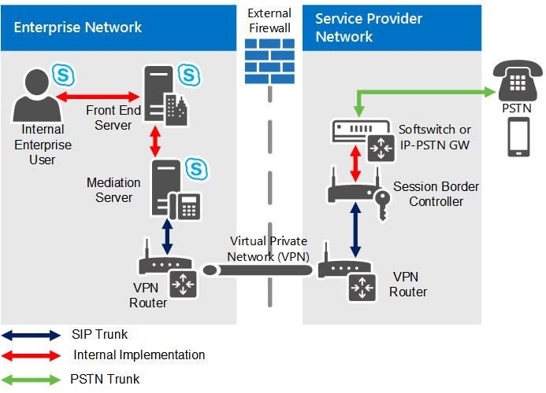

# Tronco SIP no Skype for Business ServerSIP trunking in Skype for Business Server

Saiba mais sobre o tronco SIP no Skype for Business Server Enterprise VoiceLearn about SIP trunking in Skype for Business Server Enterprise Voice

O SIP é usado para iniciar e gerenciar sessões de comunicações de VoIP (voz sobre IP) para o serviço telefônico básico e para vários serviços de comunicação em tempo real adicionais, como serviços de mensagens instantâneas, conferência, detecção de presença e multimídia.Session Initiation Protocol (SIP) is used to initiate and manage Voice over IP (VoIP) communications sessions for basic telephone service and for additional real-time communication services, such as instant messaging, conferencing, presence detection, and multimedia. Esta seção oferece informações de planejamento para a implementação de troncos SIP, um tipo de conexão SIP que se estende além do limite da rede local.This section provides planning information for implementing SIP trunks, a type of SIP connection that extends beyond the boundary of your local network.

## O que é o tronco SIP?What is SIP Trunking?

Um tronco SIP é uma conexão do IP estabelece um vínculo de comunicações SIP entre sua organização e um provedor de serviços de telefonia de Internet (ITSP), além do firewall.A SIP trunk is an IP connection that establishes a SIP communications link between your organization and an Internet telephony service provider (ITSP) beyond your firewall. Normalmente, um tronco SIP é usado para conectar o site central da sua organização a um ITSP.Typically, a SIP trunk is used to connect your organization's central site to an ITSP. Em alguns casos, você também pode optar por usar um tronco SIP para conectar o site da filial a um ITSP.In some cases, you may also opt to use SIP trunking to connect your branch site to an ITSP.

A implantação de troncos SIP pode ser um grande passo para simplificar as telecomunicações da sua organização e preparar-se para melhorias atualizadas para comunicações em tempo real.Deploying SIP trunking can be a big step toward simplifying your organization's telecommunications and preparing for up-to-date enhancements to real-time communications. Uma das principais vantagens do tronco SIP é que você pode consolidar as conexões da sua organização com a PSTN (rede telefônica pública comutado) em um local central, em vez de seu predecessor, o tronco TDM (multiplexação de divisão de tempo), que normalmente requer um tronco separado de cada filial.One of the primary advantages of SIP trunking is that you can consolidate your organization's connections to the public switched telephone network (PSTN) at a central site, as opposed to its predecessor, time division multiplexing (TDM) trunking, which typically requires a separate trunk from each branch site.

### Redução de custoCost Savings

As reduções de custo associadas ao tronco SIP podem ser substanciais:The cost savings associated with SIP trunking can be substantial:

- Geralmente, as chamadas de longa distância custam menos através de um tronco SIP.Long distance calls typically cost much less through a SIP trunk.

- Você pode cortar os custos de gerenciamento e reduzir a complexidade da implementação.You can cut manageability costs and reduce the complexity of deployment.

- A interface de tarifa básica (BRI) e a interface de tarifa primária (PRI) podem ser eliminadas se você conectar um tronco SIP diretamente ao ITSP, por um custo significativamente inferior. Nos troncos TDM, os provedores de serviço cobram as chamadas por minuto. O custo do tronco SIP pode ser baseado no uso da largura de banda, e você pode comprar incrementos menores e mais econômicos. (O custo real depende do modelo de serviço do que você escolhe).Basic rate interface (BRI) and primary rate interface (PRI) fees can be eliminated if you connect a SIP trunk directly to your ITSP at significantly lower cost. In TDM trunking, service providers charge for calls by the minute. The cost of SIP trunking may be based on bandwidth usage, which you can buy in smaller, more economical increments. (The actual cost depends on the service model of the ITSP you choose.)

#### Tronco SIP versus hospedagem de um gateway PSTN ou IP-PBXSIP Trunking vs. Hosting a PSTN Gateway or IP-PBX

Uma vez que os troncos SIP se conectam diretamente ao provedor de serviço, você pode eliminar os seus gateways PSTN e seu custo de gerenciamento e complexidade. O uso de um tronco SIP pode levar a cortes substanciais no custo, através da manutenção e administração reduzida.Because SIP trunks connect directly to your service provider, you can eliminate your PSTN gateways and their management cost and complexity. Using a SIP trunk can lead to substantial cost savings through reduced maintenance and administration.

### Serviços de VoIP expandidosExpanded VoIP Services

Os recursos de voz são frequentemente o principal motivo para implantar o tronco SIP, mas o suporte de voz é apenas a primeira etapa.Voice features are often the primary motivation for deploying SIP trunking, but voice support is just the first step. Com o tronco SIP, você pode estender os recursos de VoIP e habilitar o Skype for Business Server para fornecer um conjunto mais rico de serviços.With SIP trunking, you can extend VoIP capabilities and enable Skype for Business Server to deliver a richer set of services. Por exemplo:For example:

- A detecção de presença aprimorada para dispositivos que não estão executando o Skype for Business Server pode oferecer melhor integração com telefones celulares, permitindo que você veja quando um usuário está em uma chamada de celular.Enhanced presence detection for devices that are not running Skype for Business Server can provide better integration with mobile phones, enabling you to see when a user is on a mobile phone call.

- As chamadas de emergência E9-1-1 permitem que as autoridades que atenderem às chamadas 911 determinem a localização do chamador a partir de seu número de telefone.E9-1-1 emergency calling enables the authorities who answer 911 calls to determine the caller's location from his or her telephone number.

> [!NOTE]
> Consulte o ITSP para obter uma lista de serviços que eles suportam e podem habilitar para sua organização.Contact your ITSP for a list of services that they support and can enable for your organization.

### Troncos SIP vs. Conexões diretas do cabo SIPSIP Trunks vs. Direct SIP Connections

O termo tronco  deriva da tecnologia de comutação de circuitos.The term trunk is derived from circuit-switched technology. Refere-se a uma linha física dedicada que conecta o equipamento de comutação telefônica.It refers to a dedicated physical line that connects telephone switching equipment. Assim como seu predecessor, os troncos TDM (multiplexação de divisão de tempo), os troncos SIP são conexões entre duas redes SIP separadas: a empresa do Skype for Business Server e o ITSP.Like their predecessor, time division multiplexing (TDM) trunks, SIP trunks are connections between two separate SIP networks—the Skype for Business Server enterprise and the ITSP. Diferentemente dos troncos de comutação de circuitos, os troncos SIP são conexões virtuais que podem ser estabelecidas sobre qualquer tipo de conexão de troncos SIP compatíveis.Unlike circuit-switched trunks, SIP trunks are virtual connections that can be established over any of the supported SIP trunking connection types.

As conexões SIP diretas, por outro lado, são conexões de SIP que não atravessam o limite de rede local (ou seja, elas se conectam a um gateway PSTN ou PBX dentro de sua rede interna).Direct SIP connections, on the other hand, are SIP connections that do not cross the local network boundary (that is, they connect to a public switched telephone network (PSTN) gateway or private branch exchange (PBX) within your internal network). Para obter detalhes sobre como você pode usar conexões SIP diretas com o Skype for Business Server, consulte [conexões SIP diretas no Skype for Business Server.](direct-sip.md)For details about how you can use direct SIP connections with Skype for Business Server, see [Direct SIP connections in Skype for Business Server](direct-sip.md).

## Como implementar o tronco SIP?How do I implement SIP Trunking?

Para implementar o tronco SIP, você deve rotear a conexão por meio de um Servidor de Mediação, que atua como um proxy para sessões de comunicação entre clientes do Skype for Business Server e o provedor de serviços e transcodifica mídia, quando necessário.To implement SIP trunking, you must route the connection through a Mediation Server, which acts as a proxy for communications sessions between Skype for Business Server clients and the service provider and transcodes media, when necessary.

Cada Servidor de Mediação tem uma interface de rede interna e uma interface de rede externa.Each Mediation Server has an internal network interface and an external network interface. A interface interna se conecta aos Servidores Front-End.The internal interface connects to the Front End Servers. A interface externa normalmente é chamada de interface de gateway porque tradicionalmente é usada para conectar o Servidor de Mediação a um gateway PSTN (rede telefônica pública comutado) ou a um IP-PBX.The external interface is commonly called the gateway interface because it has traditionally been used to connect the Mediation Server to a public switched telephone network (PSTN) gateway or an IP-PBX. Para implementar um tronco SIP, conecte a interface externa do Servidor de Mediação ao componente de borda externa do ITSP.To implement a SIP trunk, you connect the external interface of the Mediation Server to the external edge component of the ITSP. O componente de borda externa do ITSP pode ser um SBC (controlador de borda da sessão), um roteador ou um gateway.The external edge component of the ITSP could be a Session Border Controller (SBC), a router, or a gateway.

Para obter detalhes sobre os Servidores de Mediação, consulte [o componente do Servidor de Mediação no Skype for Business Server.](mediation-server.md)For details about Mediation Servers, see [Mediation Server component in Skype for Business Server](mediation-server.md).

### Tronco SIP centralizado versus distribuídoCentralized vs. Distributed SIP Trunking

O tronco SIP centralizado encaminha todo o tráfego VoIP, incluindo o tráfego do site de filial, através do seu site central.Centralized SIP trunking routes all VoIP traffic, including branch site traffic, through your central site. O modelo de implantação centralizado é simples, econômico e é geralmente a abordagem recomendada para implementar troncos SIP com o Skype for Business Server.The centralized deployment model is simple, cost-effective, and is generally the recommended approach for implementing SIP trunks with Skype for Business Server.

O tronco SIP distribuído é um modelo de implantação no qual você implementa troncos SIP locais em um ou mais locais de filial.Distributed SIP trunking is a deployment model in which you implement local SIP trunks at one or more branch sites. Em seguida, o tráfego VoIP é roteado do site de filial diretamente para um provedor de serviços sem passar pelo site central.VoIP traffic is then routed from the branch site directly to a service provider without going through the central site.

O tronco SIP distribuído é exigido somente nos seguintes casos:Distributed SIP trunking is required only in the following cases:

- O site de filial requer conectividade de telefone ressalvante (por exemplo, se a WAN cair).The branch site requires survivable phone connectivity (for example, if the WAN goes down). Esse requisito deve ser analisado para cada site de filial; algumas de suas filiais podem exigir redundância e failover, enquanto outras podem não.This requirement should be analyzed for each branch site; some of your branches may require redundancy and failover, whereas others may not.

- A resiliência é necessária entre dois sites centrais.Resiliency is required between two central sites. Você precisa garantir que um tronco SIP termine em cada local central.You need to make sure that a SIP trunk terminates at each central site. Por exemplo, se você tiver sites centrais Dublin e Tukwila e ambos usarem apenas o tronco SIP de um local, se o tronco cair, os usuários do outro local não poderão fazer chamadas PSTN.For example, if you have Dublin and Tukwila central sites and both use only one site's SIP trunk, if the trunk goes down, the other site's users cannot make PSTN calls.

- O site de filial e o site central estão em diferentes países/regiões.The branch site and central site are in different countries/regions. Por motivos legais e de compatibilidade, você precisa de pelo menos um tronco SIP por país/região.For compatibility and legal reasons, you need at least one SIP trunk per country/region. Por exemplo, na União Europeia, as comunicações não podem deixar um país/região sem serem terminarem localmente em um ponto centralizado.For example, in the European Union, communications cannot leave a country/region without terminating locally at a centralized point.

Dependendo da localização geográfica dos sites e da grande parte do tráfego antecipado em sua empresa, talvez você não queira rotear todos os usuários pelo tronco SIP central ou pode optar por encaminhar alguns usuários por meio de um tronco SIP no site de filial.Depending on the geographical location of sites and how much traffic you anticipate within your enterprise, you may not want to route all users through the central SIP trunk, or you may opt to route some users through a SIP trunk at their branch site. Para analisar suas necessidades, responda às seguintes perguntas:To analyze your needs, answer the following questions:

- Qual é o tamanho de cada site (ou seja, quantos usuários estão habilitados para o Enterprise Voice)?How big is each site (that is, how many users are enabled for Enterprise Voice)?

- Quais números DID (discagem direta interna) em cada site recebem a maioria das chamadas?Which direct inward dialing (DID) numbers at each site get the most phone calls?

A decisão sobre implantar um tronco SIP centralizado ou distribuído exige uma análise com bom custo benefício.The decision whether to deploy centralized or distributed SIP trunking requires a cost-benefit analysis. Em alguns casos, pode ser vantajoso optar pelo modelo de implantação distribuído mesmo se não for necessário.In some cases, it may be advantageous to opt for the distributed deployment model even if it is not required. Em uma implantação completamente centralizada, todo o tráfego do site de filial é roteado por links wan.In a completely centralized deployment, all branch site traffic is routed over WAN links. Em vez de pagar pela largura de banda exigida pelo link de WAN, convém usar o tronco SIP distribuído.Instead of paying for the bandwidth required for WAN linking, you may want to use distributed SIP trunking. Por exemplo, talvez você queira implantar um servidor Standard Edition em um site de filial com federação para o site central ou pode implantar um Aparelho de FilialVivável ou um Servidor de Filial Survivable com um gateway pequeno.For example, you may want to deploy a Standard Edition server at a branch site with federation to the central site, or you may want to deploy a Survivable Branch Appliance or a Survivable Branch Server with a small gateway.

> [!NOTE]
> Para obter detalhes sobre o tronco SIP distribuído, consulte Tronco SIP do site de [filial no Skype for Business Server.](branch-site.md)For details about distributed SIP trunking, see [Branch site SIP trunking in Skype for Business Server](branch-site.md).

### Tipos de conexão de tronco SIP suportadasSupported SIP Trunking Connection Types

O Skype for Business Server oferece suporte aos seguintes tipos de conexão para tronco SIP:Skype for Business Server supports the following connection types for SIP trunking:

- MPLS (Multiprotocol Label Switching) é uma rede privada que direciona e transporta dados de um nó de rede para o próximo.Multiprotocol Label Switching (MPLS) is a private network that directs and carries data from one network node to the next. A largura de banda em uma rede MPLS é compartilhada com outros assinantes, e cada pacote de dados recebe um rótulo para distinguir os dados de um assinante dos dados de outro assinante.The bandwidth in an MPLS network is shared with other subscribers, and each data packet is assigned a label to distinguish one subscriber's data from another's. Esse tipo de conexão não exige VPN.This connection type does not require a virtual private network (VPN). Uma possível desvantagem é que o tráfego IP excessivo pode interferir com a operação VoIP, a menos que o tráfego VoIP tenha prioridade.A potential drawback is that excessive IP traffic can interfere with VoIP operation unless VoIP traffic is given priority.

- Uma conexão privada sem outro tráfego—por exemplo, uma conexão de fibra ótica arrendada ou linha T1—é normalmente o tipo de conexão mais confiável e segura (por exemplo, uma conexão de fibra óptica. Este tipo de conexão oferece a maior capacidade de realização de chamadas, mas é geralmente o mais caro. VPN não é necessário. Conexões privadas são adequadas para organizações com alto volume de chamadas ou com requisitos de segurança e disponibilidade rígidos.A private connection with no other traffic—for example, a leased fiber-optic connection or T1 line—is typically the most reliable and secure connection type. This connection type provides the highest call-carrying capacity, but it is typically the most expensive. VPN is not required. Private connections are appropriate for organizations with high call volumes or stringent security and availability requirements.

- A Internet é o tipo de conexão menos caro, mas também o menos confiável.The Internet is the least expensive connection type, but it is also the least reliable. A conexão com a Internet é o único tipo de conexão de tronco SIP do Skype for Business Server que requer VPN.Internet connection is the only Skype for Business Server SIP trunking connection type that requires VPN.

#### Selecionando um tipo de conexãoSelecting a Connection Type

O tipo de conexão de tronco SIP mais apropriado para sua empresa depende de suas necessidades e de seu orçamento.The most appropriate SIP trunking connection type for your enterprise depends on your needs and your budget.

- Para uma empresa de médio ou grande porte, uma rede MPLS normalmente fornece o maior valor. Ela pode fornecer a largura de banda necessária por uma taxa mais barata do que uma rede privada especializada.For a mid-size or larger enterprise, an MPLS network usually provides the greatest value. It can provide the necessary bandwidth at a cheaper rate than a specialized private network.

- Empresas de grande porte podem exigir uma conexão de fibra ótica T1, T3 ou superior (E1, E3 ou superior na União Europeia).Large enterprises may require a private fiber-optic, T1, T3 or higher connection (E1, E3 or higher in the European Union).

- Para uma pequena empresa ou site de filial com baixo volume de chamada, o tronco SIP pela Internet pode ser a melhor opção.For a small enterprise or branch site with low call volume, SIP trunking through the Internet may be the best choice. Esse tipo de conexão não é recomendado para sites de médio ou grande porte.This connection type is not recommended for mid-size or larger sites.

### Requisitos de largura de bandaBandwidth Requirements

A quantidade de largura de banda exigida pela sua implementação depende da capacidade da chamada (o número de chamadas simultâneas que você precisa suportar). A disponibilidade de largura de banda precisa ser levada em consideração para que você possa aproveitar ao máximo a capacidade de pico pela qual pagou. Use a fórmula a seguir para calcular o requisito de largura de banda de pico do tronco SIP:The amount of bandwidth your implementation requires depends on call capacity (the number of concurrent calls you must be able to support). You need to consider bandwidth availability, so that you can take full advantage of the peak capacity that you have paid for. Use the following formula to calculate SIP trunk peak bandwidth requirement:

Largura de banda de pico do tronco SIP = máximo de chamadas simultâneas x (64 kbps + tamanho do cabeçalho)SIP Trunk Peak Bandwidth = Max Simultaneous Calls x (64 kbps + header size)

> [!NOTE]
> O tamanho do cabeçalho é de 20 bytes no máximo.Header size is 20 bytes maximum.

### Suporte ao codecCodec Support

O Skype for Business Server dá suporte apenas aos seguintes codecs:Skype for Business Server supports only the following codecs:

- G.711 a-law (usado principalmente fora da América do Norte)G.711 a-law (used primarily outside North America)

- G.711 µ-law (usado na América do Norte)G.711 µ-law (used in North America)

### Provedor de Serviço de Telefonia pela InternetInternet Telephony Service Provider

Como você implementa o lado do provedor de serviço de uma conexão de tronco SIP varia de um ITSP para outro.How you implement the service provider side of a SIP trunk connection varies from one ITSP to another. Para obter informações de implantação, entre em contato com o seu provedor de serviços.For deployment information, contact your service provider. Para uma lista de provedores certificados de serviços de tronco SIP, consulte o site do Programa de Interoperabilidade Aberta de Comunicações [Unificadas da Microsoft.](https://go.microsoft.com/fwlink/p/?LinkId=287029)For a list of certified SIP trunking service providers, see [Microsoft Unified Communications Open Interoperability Program website](https://go.microsoft.com/fwlink/p/?LinkId=287029).

Para obter detalhes sobre os provedores de tronco SIP certificado pela Microsoft, entre em contato com seu representante da Microsoft.For details about Microsoft certified SIP trunking providers, contact your Microsoft representative.

> [!IMPORTANT]
> Você deve usar um provedor de serviço certificado pela Microsoft para garantir que seu ITSP suporte todas as funcionalidades que atravessam o tronco SIP (por exemplo, configurar e gerenciar sessões e suportar todos os serviços de VoIP estendido). O suporte técnico da Microsoft não estender as configurações que usam provedores não certificados. Se você atualmente usa um provedor de serviço Internet não certificado para tronco SIP, é possível optar por continuar usando este provedor como seu ISP e usar um provedor certificado pela Microsoft para tronco SIP.You must use a Microsoft certified service provider to ensure that your ITSP supports all of the functionality that traverses the SIP trunk (for example, setting up and managing sessions and supporting all of the extended VoIP services). Microsoft technical support does not extend to configurations that use noncertified providers. If you currently use an Internet service provider that is not certified for SIP trunking, you can opt to continue using that provider as your ISP and use a provider certified by Microsoft for SIP trunking.

### Topologias e componentes para tronco SIPTopologies and Components for SIP Trunking

A figura a seguir ilustra a topologia de tronco SIP no Skype for Business Server.The following figure depicts the SIP trunking topology in Skype for Business Server.

**Topologia de tronco SIP****SIP trunking topology**

Conforme mostrado no diagrama, uma VPN (rede virtual privada) IP é usada para conectividade entre a rede corporativa e o provedor de serviços PSTN (rede telefônica pública comutado).As shown in the diagram, an IP virtual private network (VPN) is used for connectivity between the enterprise network and the public switched telephone network (PSTN) service provider. O objetivo dessa rede privada é fornecer conectividade IP, aumentar a segurança e (opcionalmente) obter garantias de QoS (Qualidade de Serviço).The purpose of this private network is to provide IP connectivity, enhance security, and (optionally) obtain Quality of Service (QoS) guarantees. Devido à natureza de uma VPN, você não precisa usar o protocolo TLS para tráfego de sinalização SIP ou SRTP (protocolo de transporte em tempo real seguro) para o tráfego de mídia.Because of the nature of a VPN, you do not need to use Transport Layer Security (TLS) for SIP signaling traffic or secure real-time transport protocol (SRTP) for the media traffic. As conexões entre a empresa e o provedor de serviços consistem, portanto, em conexões TCP simples para SIP e RTP (protocolo de transporte em tempo real) simples (sobre UDP) para mídia túnelada por meio de uma VPN IP.Connections between the enterprise and the service provider therefore consist of plain TCP connections for SIP and plain real-time transport protocol (RTP) (over UDP) for media tunneled through an IP VPN. Verifique se todos os firewalls entre os roteadores VPN têm portas abertas para permitir que os roteadores VPN se comuniquem e que os endereços IP nas bordas externas dos roteadores VPN sejam publicamente rouáveis.Ensure that all firewalls between the VPN routers have ports open to allow the VPN routers to communicate, and that the IP addresses on the external edges of the VPN routers are publicly routable.

> [!IMPORTANT]
> Entre em contato com seu provedor de serviços para determinar se ele oferece suporte para alta disponibilidade, incluindo failover.Contact your service provider to determine whether it provides support for high availability, including failover. Em caso afirmativos, você precisará determinar os procedimentos para defini-lo.If so, you will need to determine the procedures for setting it up. Por exemplo, você precisa configurar apenas um endereço IP e um tronco SIP em cada Servidor de Mediação ou é necessário configurar vários troncos SIP em cada Servidor de Mediação?For example, do you need to configure only one IP address and one SIP trunk on each Mediation Server, or do you need to configure multiple SIP trunks on each Mediation Server? > Se você tiver vários sites centrais, pergunte também se o provedor de serviços tem a capacidade de habilitar conexões de e para outro site central.> If you have multiple central sites, also ask whether the service provider has the ability to enable connections to and from another central site.

> [!NOTE]
> Para tronco SIP, é recomendável implantar Servidores de Mediação autônomos.For SIP trunking, we strongly recommend that you deploy stand-alone Mediation Servers. Para obter detalhes, [consulte Deploying Mediation Servers and Defining Peers](https://technet.microsoft.com/library/a684f1da-6671-4011-adf6-2db49e2528e2.aspx) in the Deployment documentation.For details, see [Deploying Mediation Servers and Defining Peers](https://technet.microsoft.com/library/a684f1da-6671-4011-adf6-2db49e2528e2.aspx) in the Deployment documentation.

### Proteger o Servidor de Mediação para Tronco SIPSecuring the Mediation Server for SIP Trunking

Para fins de segurança, você deve configurar uma LAN virtual (VLAN) para cada conexão entre os dois roteadores VPN.For security purposes, you should set up a virtual LAN (VLAN) for each connection between the two VPN routers. O processo real para configurar uma VLAN varia de um fabricante de roteador para outro.The actual process for setting up a VLAN varies from one router manufacturer to another. Para obter detalhes, entre em contato com o fornecedor do roteador.For details, contact your router vendor.

Recomendamos que você siga estas diretrizes:We recommend that you follow these guidelines:

- Configurar uma LAN virtual (VLAN) entre o Servidor de Mediação e o roteador VPN na rede de perímetro (também conhecida como DMZ, zona desmilitarizada e sub-rede triada).Set up a virtual LAN (VLAN) between the Mediation Server and the VPN router in the perimeter network (also known as DMZ, demilitarized zone, and screened subnet).

- Não permita que pacotes de transmissão ou multicast sejam transferidos do roteador para a VLAN.Do not allow broadcast or multicast packets to be transferred from the router to the VLAN.

- Bloqueie quaisquer regras de roteamento que roteiem o tráfego do roteador para qualquer lugar, menos o Servidor de Mediação.Block any routing rules that route traffic from the router to anywhere but the Mediation Server.

Se você usar um servidor VPN, recomendamos seguir estas diretrizes:If you use a VPN server, we recommend that you follow these guidelines:

- Configurar uma VLAN entre o servidor VPN e o Servidor de Mediação.Set up a VLAN between the VPN server and the Mediation Server.

- Não permita que pacotes de transmissão ou multicast sejam transmitidos do servidor VPN para a VLAN.Do not allow broadcast or multicast packets to be transmitted from the VPN server to the VLAN.

- Bloqueie qualquer regra de roteamento que roteie o tráfego do servidor VPN para qualquer lugar, menos o Servidor de Mediação.Block any routing rule that routes VPN server traffic to anywhere but the Mediation Server.

- Criptografar dados na VPN usando o encapsulamento de roteamento genérico (GRE).Encrypt data on the VPN by using generic routing encapsulation (GRE).

## Confira tambémSee also

[Tronco SIP do site de filial no Skype for Business ServerBranch site SIP trunking in Skype for Business Server](branch-site.md)

