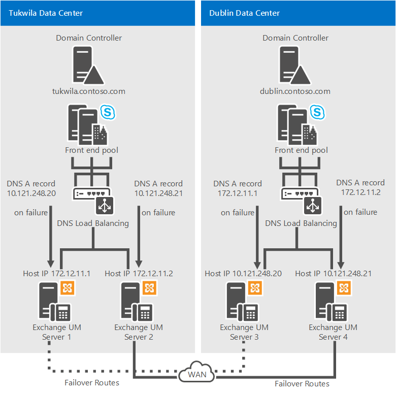

# Planejar a Exchange unificação de mensagens no Skype for Business

**Resumo:** Revise este tópico ao planejar a integração Skype for Business Server com Exchange 2013 ou 2016.

Skype for Business Server oferece suporte à integração com Exchange Unificação de Mensagens (UM) para combinar mensagens de voz e mensagens de email em uma única infraestrutura de mensagens. No Exchange, Exchange Unificação de Mensagens (UM) é uma das várias funções de servidor Exchange que você pode instalar e configurar.

No Microsoft Exchange Server 2013 e 2016, Exchange UM é executado como um serviço em um servidor Exchange Caixa de Correio. Para Skype for Business Server Enterprise Voice implantações, a Unificação de Mensagens combina mensagens de voz e mensagens de email em um único armazenamento que os usuários podem acessar a partir de um telefone (Outlook Voice Access) ou um computador. A Unificação de Mensagens e Skype for Business Server trabalham em conjunto para fornecer atendimento de chamadas, Outlook Acesso de Voz e atendedores automáticos aos usuários do Enterprise Voice.

> [!NOTE]
> Exchange A UM permanece disponível no Skype for Business Server 2019 quando você integra o Skype for Business 2019 com Exchange 2013 ou Exchange 2016. Devido às alterações no suporte no Exchange 2019, Exchange integração de UM está sendo desalmada em favor dos recursos Caixa postal na Nuvem e Cloud Atendedor Automático.  Consulte [Plan Caixa postal na Nuvem service](../../../sfbhybrid/hybrid/plan-cloud-voicemail.md) and Plan for Skype for Business Server and Exchange Server migration [para](../../../sfbhybrid/hybrid/plan-um-migration.md) obter mais informações.

Para que esses recursos sejam suportados em uma implantação Exchange UM local, você deve executar um dos seguintes:

- Microsoft Exchange Server 2010 ou service pack mais recente (somente Skype for Business Server 2015)
- Microsoft Exchange Server 2013
- Microsoft Exchange Server 2016

> [!NOTE]
> Exchange A Unificação de Mensagens, como conhecida anteriormente, não está mais disponível no Skype for Business Server 2019, que usa o Sistema de Telefonia para gravar mensagens de caixa postal e, em seguida, deixar a gravação na caixa de correio Exchange do usuário. Consulte [Plan Caixa postal na Nuvem service](../../../sfbhybrid/hybrid/plan-cloud-voicemail.md) para obter mais informações.

## Recursos de Unificação de Mensagens integradas e Skype for Business Server

Skype for Business Server, o Enterprise Voice usa a infraestrutura Exchange Unificação de Mensagens (UM) para fornecer atendimento de chamadas, notificação de chamada, acesso de voz (incluindo caixa postal) e serviços de atendemento automático.

- **Atendimento de chamada** O atendimento de chamadas é o recebimento de mensagens de voz em nome de usuários cujas chamadas não são atendidas ou estão ocupadas. Ele inclui a reprodução de uma saudação pessoal, a gravação de uma mensagem e o envio da mensagem a ser en fila para entrega à caixa de correio do usuário, que é armazenada no servidor de caixa de correio Exchange usuário.

    Se o chamador deixar uma mensagem, está é roteada até a Caixa de entrada do usuário. Se o chamador optar por não deixar uma mensagem, uma notificação de chamada perdida será armazenada na caixa de correio do usuário. Os usuários podem, então, acessar sua Caixa de entrada usando o cliente de mensagem e de colaboração do Microsoft Outlook, o Outlook Web Access, a tecnologia Exchange ActiveSync ou o Outlook Voice Access. O assunto e a prioridade das chamadas podem ser exibidos de uma maneira muito semelhante àquela do e-mail.

- **Outlook** o Voice Access Outlook Voice Access permite que um usuário Enterprise Voice acesse não apenas a caixa de correio de voz, mas também Exchange caixa de entrada, incluindo email, calendário e contatos de uma interface de telefonia. O número de acesso do assinante é atribuído por um Exchange de UM.

- **Atendimento automático** O atendimento automático é um Exchange de UM que pode ser usado para configurar um número de telefone que os usuários externos podem discar para alcançar representantes da empresa. Especificamente, ele fornece uma série de avisos de voz que auxiliam um chamador externo a navegar por um sistema de menus. A lista de opções disponíveis é configurada no servidor Exchange UM pelo administrador Exchange UM.

- **Os Serviços de Fax** Exchange UM incluem recursos de fax, que permitem que os usuários recebam faxes de entrada em suas Exchange de correio. Para obter detalhes, consulte [Unificação de Mensagens](/previous-versions/office/exchange-server-2007/bb123911(v=exchg.80)) na documentação Microsoft Exchange Server.

    > [!NOTE]
    > Os serviços de fax fornecidos pelo servidor de UM do Exchange não estão disponíveis em implantações Skype for Business Server integradas ao Microsoft Exchange Server 2010, Exchange 2010 com o service pack mais recente, Exchange 2013 ou Exchange 2016.

## Componentes e topologias para a Unificação de Mensagens no Skype for Business Server

### Exchange Server Componentes

Para fornecer os recursos e serviços de UM do [Exchange](#features-of-integrated-unified-messaging-and-skype-for-business-server) descritos em Recursos de Unificação de Mensagens integradas e Skype for Business Server para usuários Enterprise Voice em sua organização, você deve implantar um servidor de Caixa de Correio do Microsoft Exchange e um servidor de Acesso para Cliente, que hospeda caixas de correio de usuário e fornece um local de armazenamento único para email e caixa postal. Exchange A UM é executado como um serviço em Exchange servidores de Caixa de Correio e Acesso para Cliente.

Para obter detalhes Exchange componentes de UM no Microsoft Exchange Server 2010, consulte [Deploying On-Premises Exchange UM to Provide Lync Server 2013 Preview Voice Mail](/previous-versions/office/lync-server-2013/lync-server-2013-deploying-on-premises-exchange-um-to-provide-lync-server-2013-voice-mail) .

### Topologias suportadas

Você pode implantar Skype for Business Server e Exchange Unificação de Mensagens (UM) na mesma floresta ou em várias florestas. Se a implantação abrange várias florestas, você deve executar as etapas Exchange de integração para cada Exchange de UM. Além disso, você deve configurar cada floresta Exchange Microsoft para confiar na floresta Skype for Business Server e na floresta Skype for Business Server para confiar em cada floresta Exchange UM. Além dessa confiança na floresta, as Exchange de UM para todos os usuários devem ser definidas nos objetos do usuário na Skype for Business Server floresta.

Skype for Business Server dá suporte às seguintes topologias para Exchange integração de UM:

- Floresta única

- Domínio único (ou seja, uma única floresta com um único domínio). Skype for Business Server, microsoft Exchange e usuários residem no mesmo domínio.

- Vários domínios (ou seja, um domínio raiz com um ou mais domínios filho). Skype for Business Server e servidores microsoft Exchange são implantados em diferentes domínios do domínio em que você cria usuários. Exchange Os servidores de UM podem ser implantados em diferentes domínios do pool Skype for Business Server que eles suportam.

- Várias florestas (ou seja, floresta de recursos). Skype for Business Server é implantado em uma única floresta e, em seguida, os usuários são distribuídos em várias florestas. Os atributos Exchange um dos usuários devem ser replicados para a Skype for Business Server floresta.

    > [!NOTE]
    > Exchange pode ser implantado em várias florestas. Cada Exchange organização pode fornecer Exchange UM para seus usuários ou Exchange UM pode ser implantado na mesma floresta que Skype for Business Server.

## Diretrizes para integrar a Unificação de Mensagens e Skype for Business Server

Veja a seguir diretrizes e práticas recomendadas a considerar ao implantar Enterprise Voice:

> [!IMPORTANT]
> Exchange A Unificação de Mensagens (UM) dá suporte a IPv6 somente se você também estiver usando o UCMA 4.

- Implante um Skype for Business Server Edição Standard servidor ou um pool front-end.

- Trabalhar com os administradores do Exchange para confirmar que tarefas cada um executará para garantir uma integração tranqüila e bem-sucedida.

- Implante as Exchange de servidor de Caixa de Correio em cada floresta Exchange unificação de mensagens (UM) onde você deseja habilitar os usuários para Exchange UM. Para obter detalhes sobre como instalar Exchange funções de servidor, consulte a documentação Microsoft Exchange Server de servidor.

    > [!IMPORTANT]
    > Quando Exchange Unificação de Mensagens (UM) é instalada, ela é configurada para usar um certificado auto-assinado. O certificado auto-assinado não permite que Skype for Business Server e Exchange UM confiem uns nos outros, razão pela qual é necessário solicitar um certificado separado de uma autoridade de certificação em que ambos os servidores confiem.

- Se Skype for Business Server e Exchange UM estão instalados em florestas diferentes, configure cada floresta Exchange para confiar na floresta Skype for Business Server e na floresta Skype for Business Server para confiar em cada uma delas Exchange floresta. Além disso, de definir as Exchange da UM dos usuários nos objetos do usuário na floresta Skype for Business Server, normalmente usando um script ou uma ferramenta entre florestas, como o Gerenciador de Ciclo de Vida de Identidade (ILM).

- Se necessário, instale o Console de Gerenciamento do Exchange para gerenciar os servidores de Unificação de mensagens.

- Obtenha números de telefone válidos para o Outlook Voice Access e o atendedor automático.

- Se você estiver usando uma versão da UM Exchange anterior ao Microsoft Exchange Server 2010 Service Pack 1 (SP1), coordene nomes para planos de discagem sip de UM Exchange e planos de discagem Enterprise Voice UM.

### Implantando Servidores Redundantes UM do Exchange

> [!IMPORTANT]
> Recomendamos que você implante um mínimo de dois servidores nos quais os serviços de UM Exchange estão sendo executados para cada Exchange de discagem URI SIP de UM que você configurar para sua organização. Além de fornecer capacidade expandida, a implantação de servidores redundantes oferece alta disponibilidade. Em caso de falha do servidor, Skype for Business Server pode ser configurado para fail over para outro servidor.

As seguintes configurações de exemplo fornecem resiliência de UM do Exchange.

**Exemplo 1: resiliência de UM do Exchange**

No exemplo 1, os servidores UM 1 e 2 do Exchange são ativados no data center de Tukwila e os servidores UM 3 e 4 do Exchange são ativados no data center de Dublin. No caso de uma Exchange de UM em Tukwila, os registros A do Sistema de Nomes de Domínio (DNS) dos servidores 1 e 2 devem ser configurados para apontar para os servidores 3 e 4, respectivamente. No caso de uma Exchange de UM em Dublin, os registros DNS A para os servidores 3 e 4 devem ser configurados para apontar para os servidores 1 e 2, respectivamente.

> [!NOTE]
> No Exemplo 1, você também deve atribuir um dos seguintes certificados em cada servidor de UM do Exchange: use um certificado com um caractere curinga no Nome Alternativo do Assunto (SAN) ou coloque o FQDN (nome de domínio totalmente qualificado) de cada um dos quatro servidores de UM Exchange na SAN.

**Exemplo 2: resiliência de UM do Exchange**

No exemplo 2, sob condições operacionais comuns, os servidores UM 1 e 2 do Exchange são ativados no data center de Tukwila e os servidores UM 3 e 4 do Exchange são ativados no data center de Dublin. Os quatro servidores estão incluídos no plano de discagem de URI do SIP dos usuários de Tukwila; no entanto, os servidores 3 e 4 estão desativados. No caso de uma paralisação UM Exchange em Tukwila, por exemplo, os servidores UM 1 e 2 do Exchange devem ser desativados e os servidores UM 3 e 4 do Exchange devem ser habilitados para que o tráfego UM do Exchange de Tukwila seja roteado para os servidores em Dublin.

Para obter detalhes sobre como habilitar ou desabilitar a Unificação de Mensagens no Exchange 2013, consulte Integrar Exchange [UM 2013 com o Lync Server](/exchange/checklist-integrate-exchange-2013-um-with-lync-server-exchange-2013-help). As informações fornecidas se aplica igualmente a Skype for Business Server.

Para obter detalhes sobre como habilitar ou desabilitar a Unificação de Mensagens no Microsoft Exchange Server 2010, consulte:

- [Habilitar a Unificação de Mensagens Exchange 2010](/previous-versions/office/exchange-server-2010/aa997908(v=exchg.141))

- [Desabilitar a Unificação de Mensagens Exchange 2010](/previous-versions/office/exchange-server-2010/bb123529(v=exchg.141))

### Exchange Server 2019

Exchange A Unificação de Mensagens não está mais presente no Exchange 2019, se você tiver Exchange 2019 e quiser funcionalidade equivalente, precisará usar o serviço Caixa postal na Nuvem descrito em [Plan Caixa postal na Nuvem service](../../../sfbhybrid/hybrid/plan-cloud-voicemail.md).

## Confira também

[Visão geral do processo de implantação para integrar a Unificação de Mensagens e Skype for Business](deployment-overview.md)